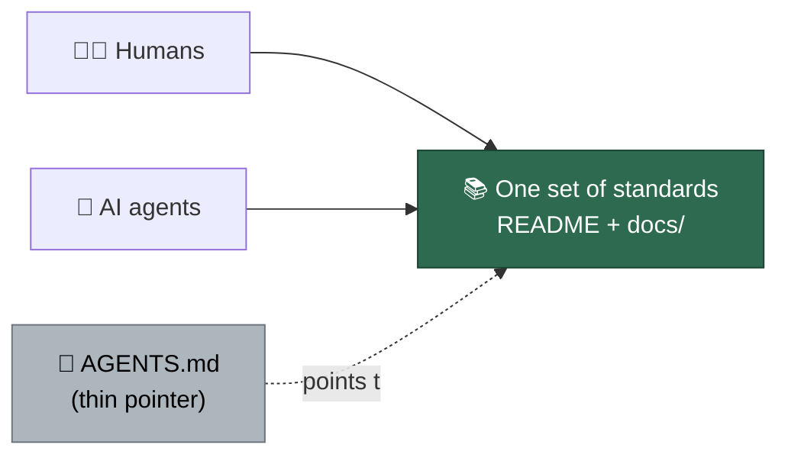

# 🤖 AGENTS.md — Pointer for AI Agents

This file is intentionally a **thin pointer**, not a content store. The Vibe
Coder keeps **one set of instructions** shared by human contributors and AI
agents (Claude Code, Copilot, Gemini, etc.) — the standards live in the human
documentation, and this file only points into it. Do not add standalone
standards here; add them to the documents below so there is a single source of
truth that cannot drift.

## Start here

- **[Coding Standards](CODING-STANDARDS.md)** — language & spelling, KISS/DRY,
  TDD, quality gates, Deno/TypeScript conventions, commit safety, PR evidence,
  and prompt-engineering guidance. The single source of truth for coding
  standards.
- **[Design Principles](DESIGN-PRINCIPLES.md)** — why each subsystem behaves the
  way it does (issue processing, milestones, idle-task scans, fleet invariants,
  merge enforcement, and more), each linking its canonical operator manual under
  [`docs/`](docs/).
- **[README](README.md)** — user-facing overview, feature index, supported
  labels, and the full documentation table.
- **[Extending the Worker](docs/EXTENDING.md)** — adding Deno commands, prompt
  versioning, and running tests.
- **[Contributing](CONTRIBUTING.md)** — branching, commits, and the local
  quality gate.
- **[Security](SECURITY.md)** — security architecture, controls and
  security-related configuration. The design-level model — assets, attacker
  capabilities, attack paths, controls and residual risks — is
  **[docs/THREAT-MODEL.md](docs/THREAT-MODEL.md)**.

The full agent-facing behaviour the worker itself applies at runtime lives in
the versioned prompt templates under [`prompts/`](prompts/) (the worker always
loads the latest version).
