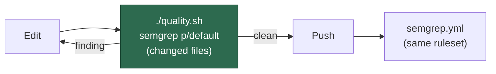

# Contributing to VibeCoder

Thanks for your interest in contributing! VibeCoder is an Apache-2.0
licensed automated GitHub issue worker. This page is a one-stop landing
for human contributors — it points into the existing docs rather than
duplicating them.

For AI agents (Claude Code, Copilot, etc.) working in this repo, the
authoritative coding-standards document is [AGENTS.md](AGENTS.md). The
guidance below summarises what humans need to know to land a change.

## Where to start

- **Project overview** — [README.md](README.md) and
  [docs/OVERVIEW.md](docs/OVERVIEW.md) describe what the worker does
  and how it fits together end-to-end.
- **Internals and architecture** — [docs/INTERNALS.md](docs/INTERNALS.md)
  covers the run loop, claim flow, and the major subsystems.
- **Extending the worker** — [docs/EXTENDING.md](docs/EXTENDING.md) is
  the entry point for adding new commands, templates, or idle-task
  templates.
- **Configuration** — [docs/CONFIGURATION.md](docs/CONFIGURATION.md)
  lists every supported environment variable and config knob.

## Branching

- **`Develop` is the default branch** — open all pull requests against
  `Develop` (see `.vibe_default_branch` and
  `.github/workflows/pages.yml`). `main` is reserved for releases.
- **Milestone branches** — work tagged with a GitHub milestone lands on
  the milestone branch first; the milestone is merged into `Develop` as
  a unit when the milestone closes. See
  [docs/workflows/milestones.md](docs/workflows/milestones.md) for the full
  workflow.
- **Branch names** — descriptive kebab-case, ideally referencing the
  issue number (for example, `issue-2170-add-contributing-md`).

## Commit signing

**Required signed commits are not currently enforced on `Develop`, and
this is a deliberate, auditable decision — not an oversight.**

Every commit on `Develop` is produced by an automation identity
(`service @ ST <maintainer@example.invalid>` and
`Vibe Coder <maintainer@example.invalid>`) committing through
local `git`. Turning on **Require signed commits** in the branch-
protection rule before each of those identities has a registered signing
key would make the requirement **fail closed**: every autonomous merge
would be rejected and the worker fleet would stall. Enabling it safely is
therefore gated on human credential work that cannot be performed from an
unattended worker run:

1. Generate a signing key for each automation account. SSH-signing is
   simplest for a bot:

   ```bash
   git config gpg.format ssh
   git config user.signingkey <path-or-key>
   git config commit.gpgsign true
   ```

2. Register the **public** key as a *signing key* (not an authentication
   key) on the matching bot's GitHub account. This needs access to that
   account's settings, so it is a human-only step — never commit private
   key material (it matches the forbidden-hidden-files allowlist in
   [CODING-STANDARDS.md](CODING-STANDARDS.md#commit-safety--never-commit-hidden-files)).
3. Once **every** automation identity that pushes to `Develop` signs its
   commits, enable **Require signed commits** in the `Develop` branch-
   protection rule / ruleset — the same setup step that already
   configures required status checks (see [docs/MERGE.md](docs/MERGE.md)).

Until those steps are complete, the requirement stays off by design. The
surrounding controls already close most of the workflow-tampering chain:
`.github/CODEOWNERS` mandates code-owner review on workflow and action
paths (with the worker bot excluded from self-approval), and the default
branch carries required status checks plus the direct-merge wall
documented in [docs/MERGE.md](docs/MERGE.md). Signed commits would add
provenance verification on top; this note records why that final link is
deferred so the gap is a deliberate choice rather than an implicit one.

## Local quality gate

The repository ships a single quality entry point that mirrors what CI
runs:

```bash
./quality.sh < /dev/null
```

This delegates to `worker/deno/quality.ts` and runs Deno type-check, the
Deno test suite, `deno lint`, `deno fmt --check`, markdownlint, and
semgrep. CI additionally runs shellcheck over the repo's shell scripts —
the gate itself does not. Always redirect stdin from `/dev/null` so
unattended runs cannot hang waiting for input.

Run it in the **foreground** and let it finish — each check reports as it
settles, so you can watch progress. Never background it and poll with a
`sleep`/`pgrep` wait loop (Issue #399). While iterating, prefer the fast checks
(`deno fmt`, `deno lint`, `deno check`, and the test files you touched); the
full gate is the last step before the PR.

CI-enforced workflows live under `.github/workflows/`, including
`validate-scripts.yml`, `markdown-lint.yml`, `gitleaks.yml`, and
`semgrep.yml`. A green local `./quality.sh` is the best predictor of a
green PR.

### Semgrep (SAST) before the push

`semgrep.yml` is a blocking PR check, so a finding it reports costs a
branch, a push and a review cycle before anyone sees it. The gate runs
the same `p/default` ruleset locally, over the branch's changed files
only — the diff against the merge-base with the remote's default branch,
plus anything uncommitted or untracked.



- **Install it or it skips, loudly.** `pipx install semgrep` puts the
  binary on PATH; alternatively, a container runtime already holding the
  CI-pinned image (`semgrep/semgrep:<tag>@<digest>` from
  `worker/deno/lib/pinned_actions.ts`) is used instead. The image is
  never pulled by the gate — a mid-run download is exactly the
  critical-path cost this stage must not add. With neither available the
  stage reports `SKIPPED` and names both remedies; `--strict` turns that
  into a failure.
- **A docs-only change costs nothing.** No scannable changed file means
  no scan.
- **`detect-non-literal-regexp` has one standard remedy.** Build the
  regular expression from a literal, or escape the interpolated value
  before it reaches the constructor. A dynamic regex over constants the
  code itself authored is still flagged — change the pattern rather than
  arguing with the rule (Issue #559).

### Workflow hygiene

The gate also enforces two static invariants over the workflows
themselves:

- **Every multi-line `run:` block opens with `set -euo pipefail`.** GitHub
  runs steps as `bash -e` only, so without the preamble an unset variable
  or a failure mid-pipeline is silently ignored and the step still reports
  green. A block carrying a single command is exempt — nothing can be
  skipped after it.
- **One pinned SHA carries one version comment.** Actions are pinned to
  40-character commit SHAs with the tag recorded in a
  leading `# owner/action@vX.Y.Z` comment. Annotating the same SHA
  `v6.0.0` in one workflow and `v6.0.2` in another destroys the only
  human-readable signal that makes SHA pinning auditable.

## Test layout

- **Deno unit tests** — `worker/deno/tests/`. Run the full suite with
  `cd worker/deno && deno task test`, or target a single file with
  `deno test worker/deno/tests/<file>_test.ts`. The previous top-level
  `tests/` Bats integration suite has been fully migrated to Deno
 ; files carrying a `Migrated from tests/*.bats` header
  in `worker/deno/tests/` cover the original cases.
- **No-grep tests** — every test must call real code and assert on its
  result. Tests that grep source files for patterns or function names
  are rejected; see [CODING-STANDARDS.md](CODING-STANDARDS.md#test-driven-development-tdd)
  for the rationale.
- **Speed budget** — unit tests must complete within 120 seconds (most
  are well under 10 seconds). Slow tests are likely benchmarks in
  disguise — move them to a dedicated benchmark file.

## Commit and PR conventions

- Reference the issue number in commit messages (for example,
  `Add CONTRIBUTING.md`).
- Lead with the *what* and the *why*; keep individual commits focused
  and reviewable.
- PR summaries follow the pattern in
  `docs/archive/pr-summaries/` — a short
  `## Summary` (with a `Closes #N` line so GitHub auto-closes the
  issue), an `## Evidence` section (screenshot, benchmark numbers, or
  test results as appropriate), and a `## Test Plan` enumerating the
  tests added or modified.
- Use **Australian English** spelling throughout — `colour`,
  `behaviour`, `organisation`, `favour`, `centre`. CI does not block
  on this but reviewers will ask for changes.
- Never stage hidden files (anything matching `.*`) outside the small
  allowlist documented in [CODING-STANDARDS.md](CODING-STANDARDS.md#commit-safety--never-commit-hidden-files) — the
  pre-commit gate blocks accidental secret leaks and `git add -f` is
  forbidden.

## Reporting security issues

Please do **not** open a public GitHub issue for a security
vulnerability. See [SECURITY.md](SECURITY.md) for the hardening checklist and
the private reporting channel, and [docs/THREAT-MODEL.md](docs/THREAT-MODEL.md)
for the design-level threat model.

## Getting help

If something in this guide is unclear or out of date, open an issue
(or a PR fixing it) — we will gladly take both.
