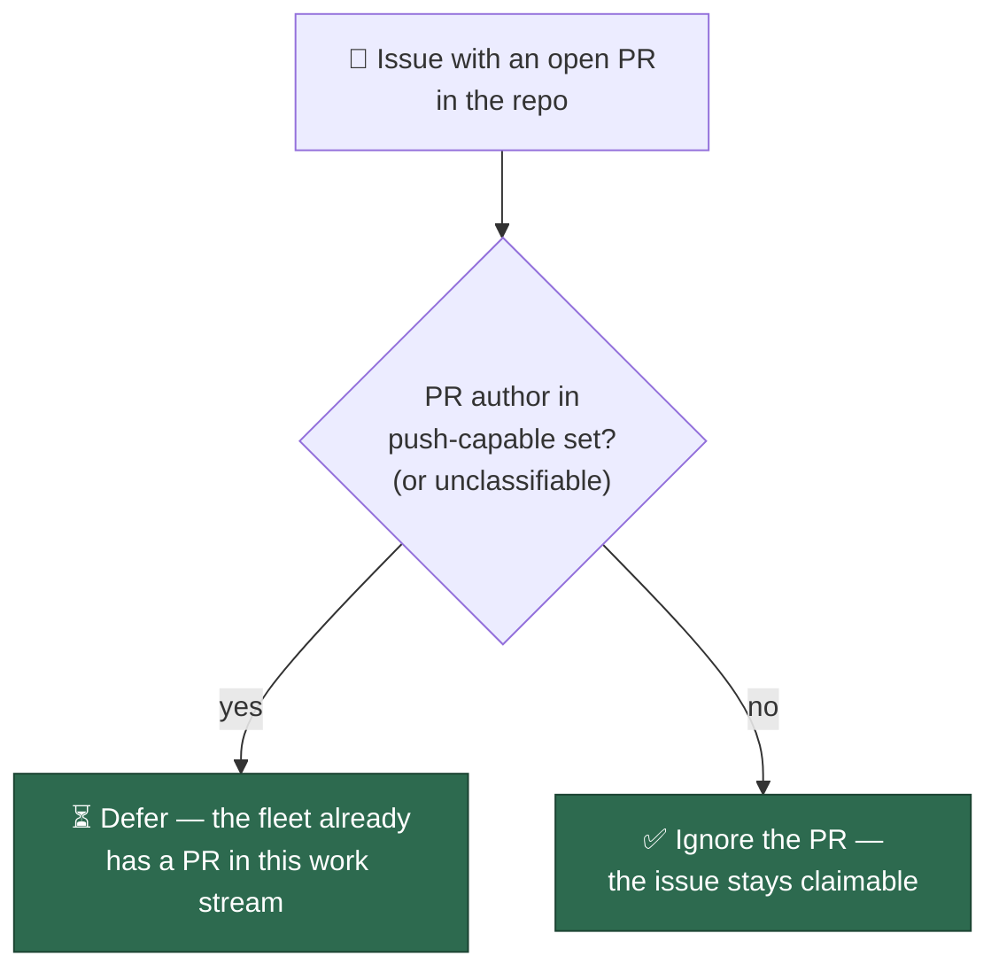
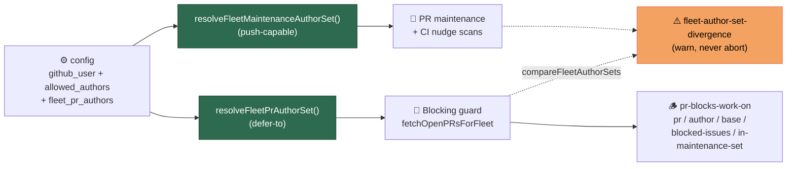
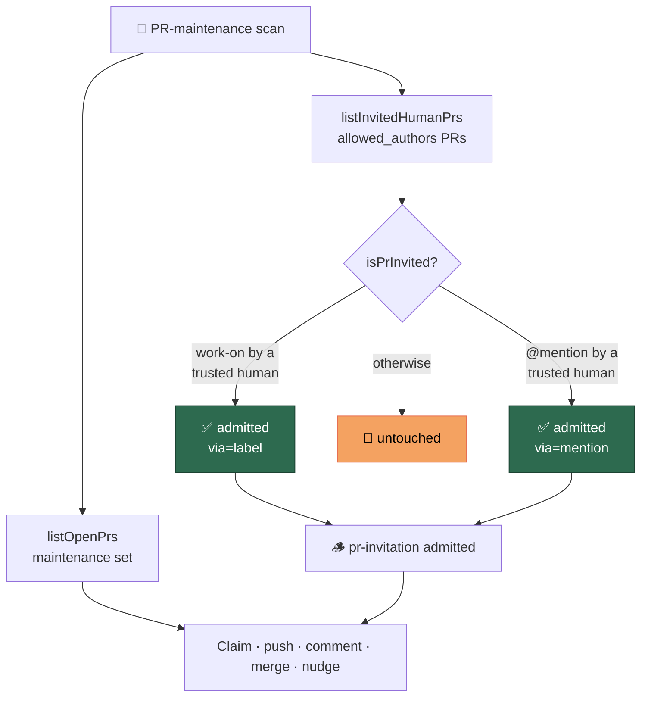
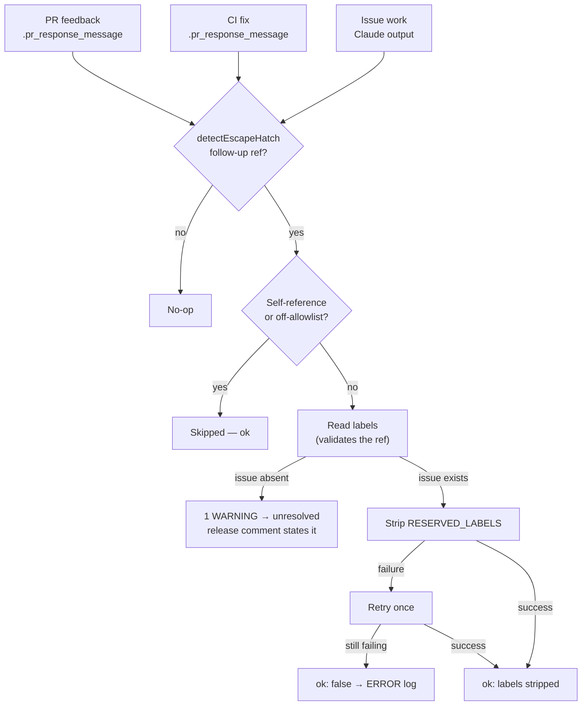
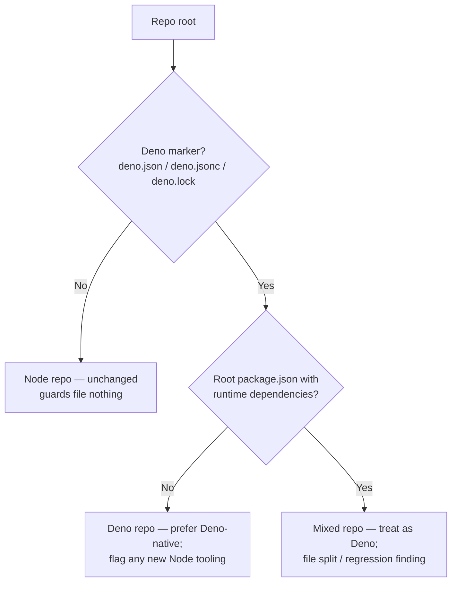
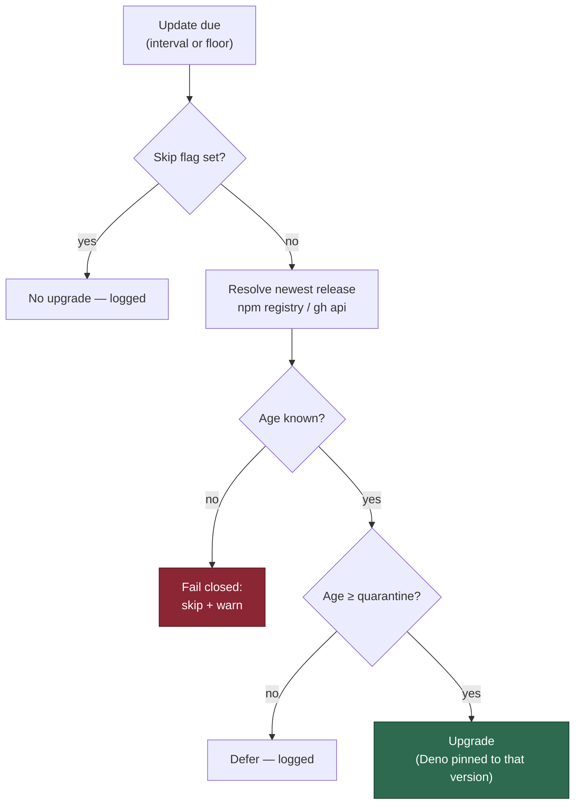
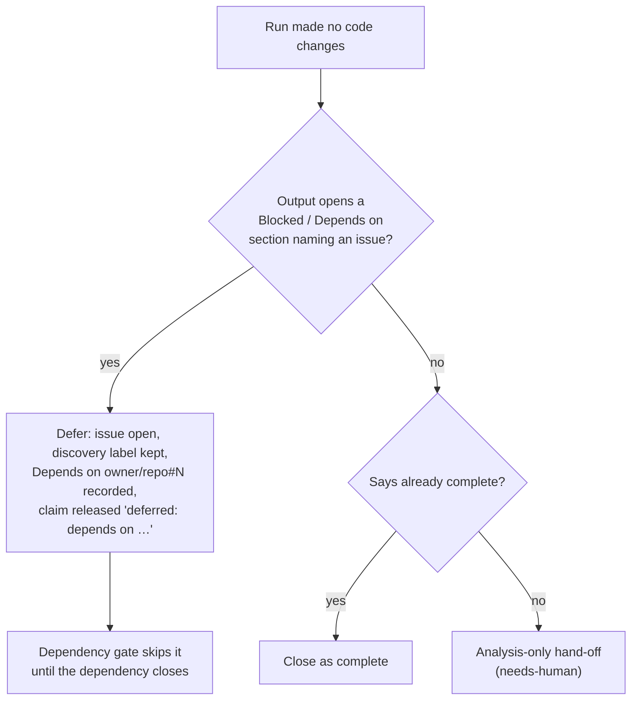

# 🧭 Vibe Coder — Design Principles

This document is the consolidated digest of the Vibe Coder's design principles
and the rationale behind each subsystem. It is shared reference for human
contributors and AI agents alike — there is **one set of instructions**, not a
per-provider copy. Each section summarises a behaviour and links to the
canonical operator manual under [`docs/`](docs/) for the full detail.

- **Coding standards & conventions** live in
  [Coding Standards](CODING-STANDARDS.md).
- **Why the system behaves as it does** is captured here.
- **User-facing overview & feature index** live in the [README](README.md).

## Design Principles

### Generous resources, strict boundary

The containment trade the operator has chosen is asymmetric, and every
resourcing or isolation decision should follow it:

- **The boundary is absolute.** The worker must never reach outside its own
  little world — no host documents, no host credentials beyond the mounted
  ones, no host filesystem browsing. The boundary is enforced at the
  OS/container level ([Containment](docs/CONTAINMENT.md)), never by prompts or
  policy alone. Working repositories should not even be visible on the host
  (named volumes,): less cross-contamination between machine and
  container is strictly better.
- **Inside the boundary, the worker gets everything it wants.** Speed is the
  priority. Container VMs are sized to the host (all memory minus an 8 GiB
  host reserve, 8 GiB floor, no upper cap, near-all cores —,
  ), and no
  quota, size cap or conservative default should be added to memory, CPU or
  disk. Do not trade throughput for a resource ceiling.
- **Resource exhaustion (DoS) is explicitly out of scope.** Runaway loops are
  an expected byproduct of code the worker is editing, and the existing run
  timeouts already bound them. Review effort belongs on boundary questions —
  mounts, credentials, network — not on quota questions.

**Rationale:** the fleet runs unattended; the risk that matters is escape
(reading or mutating host data), not consumption. A worker starved of memory
or I/O stalls the whole fleet silently (the overnight stall), which
costs far more than any runaway cycle a timeout will reap anyway.

### Prompt-version references

The worker always loads the latest version of each prompt template at runtime.
Documentation should refer to prompts by directory (e.g.
`prompts/coding_guidelines/`) rather than by version number, unless naming a
specific historical version is required — in which case use textual "from vN
onward" wording alongside the directory reference, never a literal
`prompts/<type>/vN.md` filename.

### Repository isolation — no cross-repo coupling

Each monitored repository is **absolutely isolated**. Quality gates and their
fixes are **per-repo**: every repository commits and owns its own gate script
(the FLEET `quality/shellcheck.sh` / `quality/bash_syntax.sh` pattern). Do **not**
propose a shared, cross-repo reusable GitHub Action — or any other cross-repo
mechanism — to centralise a gate. Each repo's own CI is the enforcing gate on
every PR; the Vibe Coder idle-task audit only **verifies presence** and files an
issue in a repo that lacks a gate — it never centralises the gate itself. This
does not contradict the internal `stSoftwareAU/*` dependency-fix rule:
fixing a genuine root cause in a shared *dependency's* own repo is still correct;
isolation forbids centralising a per-repo quality gate, not fixing a bug where it
lives. Recorded for the worker in the `prompts/coding_guidelines/` template.

### Milestone independence

A PR targeting the default branch must not block issues in milestones.
Milestones are independent work streams. The repo-level availability check must
be milestone-aware: a repo is only "fully busy" when every work stream (each
milestone plus non-milestone) has assigned work.

**Rationale:** The per-issue PR blocking (`get_blocking_pr_for_issue`) is
already milestone-aware — it only blocks an issue when a PR targets the same
milestone branch. The repo-level availability check must match, otherwise a
single stuck non-milestone PR prevents the worker from even scanning the repo
for milestone work.

**Implementation:** `worker/deno/lib/repo_availability.ts` provides the
milestone-aware `checkRepoAvailability()` function, exposed via the
`check-repo-availability` Deno command and called from
`worker/deno/lib/issue_finder.ts`.

### One PR per work stream (serialised work)

The worker serialises its work per work stream (each milestone is a work stream;
non-milestone issues share the default branch work stream). It creates one PR at
a time so each piece of work builds on the previous. This prevents merge hell
from multiple independent PRs branching from the same root.

Human-assigned issues do **not** block any work stream — only the worker's own
assignments count as "occupied". The worker works weekends and holidays; it must
not wait on humans to review or merge before picking up the next issue.

**Two guards enforce this for every work stream (milestone and default
branch):**

1. **Work stream occupancy** (`isMilestoneOccupied` in
   `worker/deno/lib/issue_filter.ts`): blocks if **any fleet account** already
   has an assigned issue in the same work stream. Fleet-aware:
   the match set is the current host's login plus every fleet login in
   `config.allowedAuthors`, so a sibling host's assignment also occupies the
   work stream and a second host will not start the same issue (the duplicate-PR
   root cause in). Non-fleet human assignees are still ignored — only
   fleet logins occupy.
2. **PR blocking** (`getBlockingPRForIssue` in
   `worker/deno/lib/issue_query.ts`): blocks if the **fleet** has an open PR
   targeting the same branch (milestone branch or default branch). Only
   push-capable fleet accounts count — a human's open PR never defers an issue.

Together these ensure at most one in-flight piece of worker work per work
stream, while humans can assign issues freely without stalling the worker.

### One PR per issue across the fleet

Beyond the per-work-stream serialisation above, the fleet enforces a stronger
invariant: **exactly one PR per issue across the whole fleet** (machines
authenticated as different GitHub accounts). Two failure modes were closed
under:

- **Mode A — concurrent cross-account.** Two hosts pass the discovery open-PR
  guard before either PR exists, then both open one. Closed by the
  **claim-time live re-check**: `claimIssue`
  (`worker/deno/lib/claim_issue.ts`) re-checks fleet open PRs with a cache
  bypass *after* winning the atomic claim and *before* any token work, aborting
  with `reason: "fleet_pr_exists"` (comment removed, assignment released) if a
  fleet PR already targets the work stream.
- **Mode B — post-merge re-pickup.** A merged PR (sibling **or** same-account)
  is re-picked after the cooldown and a second PR is opened. Closed by the
  **permanent merged-lock**: `fetchRecentlyClosedPRsForFleet`
  (`worker/deno/lib/issue_query.ts`) blocks a merged fleet PR permanently, while
  a closed-unmerged PR only blocks within the cooldown window (preserving the
  retry path).

All guards resolve their fleet set through the single
`resolveFleetAuthors` union (`worker/deno/lib/fleet_authors.ts`) of
`github_user` + `allowed_authors` + `fleet_pr_authors`, so **every host's
`allowed_authors` must list every fleet account**;
`validateFleetConfig` (`worker/deno/lib/fleet_config_validation.ts`) fails loud
on the blind-spot shape. A closed-unmerged retry reuses the deterministic branch
. The **only** way an issue becomes eligible again after a merged PR is a
human re-opening the issue or re-applying a discovery label — prevention only,
no auto-close (multi-account operation retained). The fleet-wide regression
suite lives in `worker/deno/tests/fleet_duplicate_prevention_test.ts`; see
[`docs/workflows/issue-processing.md`](docs/workflows/issue-processing.md) and
[`docs/DUPLICATE-PR-ROOT-CAUSE-3138.md`](docs/DUPLICATE-PR-ROOT-CAUSE-3138.md).

### Fleet-aware PR maintenance (`fleet_pr_authors`)

The fleet runs across machines, each authenticated as a different GitHub
account (e.g. `Vibecoderbot` on one host, `stsvcbot` on another). PR-feedback
and CI-fix maintenance are scoped per-host by PR author (`listOpenPrs` →
`gh pr list --author <login>` in `worker/deno/lib/pr_maintenance.ts`). On its
own this strands a milestone PR raised by a host that is then busy elsewhere or
down: no peer host scans it, so a blocking CI failure (or a human "please fix"
comment) is never picked up.

The operator-side `fleet_pr_authors` config (`.config.json`, or the
`FLEET_PR_AUTHORS` env var) lists the **other** fleet logins a host should also
maintain — its own `github_user` is always covered implicitly, and the default
`[]` preserves the prior single-author behaviour exactly.
`resolveFleetMaintenanceAuthorSet()` (`worker/deno/lib/fleet_authors.ts`) unions
the host's own login with the configured siblings, and `listOpenPrs()` queries
each, merging and de-duplicating by PR number. Trusted humans
(`allowed_authors`) are deliberately **not** in that set — see the two-resolver
split below.

#### One author set, checked every iteration

`fleet_authors.ts` is the **single source of truth** for "the PRs the fleet owns
in this repo". The issue-side blocking guard (`findOldestIssue` →
`fetchOpenPRsForFleet`) resolves `resolveFleetPrAuthorSet()`; the PR-maintenance
scans (`pr_maintenance.ts`) and the CI-nudge scan (`pr_ci_nudge_scan.ts`) act on
the PRs they find and so resolve `resolveFleetMaintenanceAuthorSet()`
 — no module builds its own list. Two independently-maintained sets
is precisely what let a
fleet-authored PR block `work-on` issues while no scan ever fixed its CI,
answered its comments, or merged it.

The invariant is self-checking, for the **fleet-authored** PRs both sides see:

> Every open fleet-authored PR `getBlockingPRForIssue()` can return must be
> present in the PR-maintenance scan set.

A human's `allowed_authors` PR sits deliberately outside that set since,
and since the blocking guard does not wait behind it either — see below.

#### A human-authored PR never blocks issue pickup

The guard used to defer to every PR the fleet *owned*, a set that includes the
trusted humans in `allowed_authors`. One unrelated human PR therefore parked the
whole repo's `work-on` queue, and after also stamped `needs-human` on the
blocked issue and stood the worker down. The worker is meant to work alongside
the other developers, not wait on them.

`getBlockingPRForIssue` now filters the PR list by the **push-capable** set
before matching branches: a human-authored PR is invisible to issue selection,
so no issue is deferred, no `needs-human` is applied, and no comment is posted.
The nudge-and-escalate path became unreachable and was retired with
`escalate_human_blocking_pr.ts`. The / rule that the worker never
claims, pushes to, comments on, or merges someone else's PR uninvited is
unchanged.

The fleet's own open PRs keep the repo-wide one-at-a-time rule, so the worker
never runs several of its own PRs into the same work stream (merge hell). Two
inputs stay on the blocking side as a fail-safe, because authorship could not be
established: a PR whose author was never stamped (a pre- cache entry), and
an unresolved/empty push-capable set.





`findOldestIssue` compares the two resolved sets once per iteration and emits a
single `fleet-author-set-divergence` warning naming the missing authors when
they differ — a warning only; the iteration always continues. The check is
**intent-aware**: the invariant it asserts is not "the two sets
are equal" but "the maintenance set is the fleet-owned set minus the trusted
humans, and nothing else". `allowed_authors` is passed in as the expected delta
and stays silent, so the two genuine hazards still read as alarms — a
`fleet_pr_authors` sibling absent from the maintenance set, and a
maintained login the blocking guard cannot see. A permanently-firing
warning would be worse than none: it trains operators to ignore the line that
exists to catch. Every blocking
decision also emits `pr-blocks-work-on` with the PR number, author, base branch,
the issues it deferred, and `in-maintenance-set`. A recurrence of the bug
shows up as `in-maintenance-set=false` on a blocking PR, findable with a log
grep rather than a code read.

#### Defer-to vs push-capable author sets

"The fleet owns this PR" and "the fleet may push to this PR" are different
questions, so `worker/deno/lib/fleet_authors.ts` exports one resolver for each:

| Resolver                             | Members                                       | Answers                                                    |
| ------------------------------------ | --------------------------------------------- | ---------------------------------------------------------- |
| `resolveFleetPrAuthorSet()`          | host + `allowed_authors` + `fleet_pr_authors` | May I raise a duplicate PR, or must I wait behind this one? |
| `resolveFleetMaintenanceAuthorSet()` | host + `fleet_pr_authors`                     | May I claim, push to, comment on, or auto-merge this PR?    |

The maintenance set is always a **subset** of the fleet-owned set; that asymmetry
is intended, not drift. `allowed_authors` is excluded from the maintenance set
because a trusted human is trusted to _instruct_ the worker, not to have their PR
taken over — the regression, where the maintenance scans inherited
`allowed_authors` and adopted a human-authored PR. Since all five scan
sites resolve the push-capable set (the four in `pr_maintenance.ts` plus
`findPrsNeedingCiNudge`), so a human's login never reaches the `gh pr list`
query; the blocking guard in `find_oldest_issue.ts` keeps the fleet-owned set,
because deferring to a human's PR is correct.

Cross-fleet pickup is **collision-tolerant**: concurrent PR-feedback handling
already de-duplicates via the shared `eyes` reaction, and a duplicated CI-fix
push is rejected by git as a non-fast-forward (the loser retries), bounded by
the existing per-check retry cap. See
[`docs/CONFIGURATION.md`](docs/CONFIGURATION.md) → Fleet PR Authors.

#### A human may still hand a PR over — explicitly

"Never" is narrower than the policy: the worker may act on a human-authored PR
**when explicitly invited**, and only then. `worker/deno/lib/pr_invitation.ts`
is the pure predicate (`isPrInvited`), and `pr_invitation_lookup.ts` lists the
open `allowed_authors` PRs each scan then admits from. Two signals count, both
requiring a **trusted human** — a login in `allowed_authors` that is not a
fleet account, so no worker can conscript itself:

- **Label** — the PR carries `work-on` _and_ a trusted human applied it. The
  adder comes from an exhaustive timeline read, never from label presence, so
  an untrusted actor adding `work-on` admits nothing.
- **Mention** — a PR comment or review body from a trusted human that
  `@mentions` the host login or a configured fleet login. Only a real mention
  token counts: matches inside fenced code, inline code, or quoted (`>`) lines
  are ignored, so a pasted CI log cannot invite the worker.

Anything ambiguous, unparseable, or unattributable is **not invited** — the
listing fails closed on an unreadable listing or timeline. There is no sticky
state: the verdict is re-derived from the PR's current labels and comments on
every scan, so dropping the label removes the PR again on the next pass. Every
admission emits one structured line —
`[pr-invitation] admitted repo=… prNumber=… author=… via=… invitedBy=…` — so
each intervention on a human's PR is traceable to its invitation.



#### One cross-scan suite enforces the invariant

 was introduced by a fix whose own tests all passed, because every
test checked one scan site in isolation and none asserted the property that
matters: _the worker never writes to a PR it was not invited to_.
`worker/deno/tests/pr_uninvited_action_test.ts` asserts it once, for all six
PR-touching entry points, against a single fixture repo carrying one PR per
authorship class — fleet, sibling, uninvited human, invited human, and an
unrelated third party. A recording `ghCommandFn` (plus the `git` and
auto-merge recorders) captures every invocation, so a breach names the exact
command rather than being inferred from a return value.

The suite also carries a **drift guard**: it reads `pr_maintenance.ts` and
`pr_ci_nudge_scan.ts` and fails if any push-capable scan resolves the
defer-to set (`resolveFleetPrAuthorSet`), or lists open PRs without resolving
`resolveFleetMaintenanceAuthorSet`. A sixth scan added later with the wrong
resolver fails CI instead of shipping.

### Fair within-tier repo rotation + per-repo `nice`

New-work selection draws repos in a fair rotation biased by an optional
operator-side per-repo `nice` integer (`repo_config.nice`, default `0`). The
semantics borrow Unix `nice`: **lower `nice` is worked sooner**, higher is
worked last — read it as "how willing this repo is to step aside". The neutral
default `0` leaves a repo neither promoted nor demoted; non-integer / wrong-type
values are guarded down to `0` by `getRepoNice()` in
`worker/deno/lib/repo_config.ts`.

- **Outermost grouping is `nice`.** `selectHighestPriority()` /
  `orderCandidatesByNiceTier()` in `worker/deno/lib/issue_priority.ts` partition
  candidates by resolved `nice`, drain the lowest-`nice` non-empty tier first,
  and only fall through to a higher-`nice` tier when no lower tier yields a
  selectable candidate.
- **Fair within a tier.** Among repos sharing one `nice` value,
  `selectFairWithinTier()` rotates fairly across equal repos (oldest-first
  within a repo, fair rotation across repos when a `randomFn` is injected), so a
  busy repo never starves its peers. With the default `nice: 0` everywhere this
  reduces to the prior oldest-first behaviour.
- **New-work selection only.** The tiering gates the Priority 2 new-issue scan
  (`find_oldest_issue.ts`), the label scan (`find_issues_by_label.ts`), and the
  planning scan (`find_planning_issues.ts`). It does **not** reorder Priority
  1.x in-flight maintenance (PR feedback, CI fixes, revisions) — in-flight work
  is finished regardless of its repo's tier.
- **Operator-side only.** `nice` lives in `.config.json` `repo_config`,
  never in the target repo. `check-repo-availability` surfaces the resolved tier
  in its structured `data.nice` and a ` [nice N]` message suffix (the
  `AVAILABLE:` / `BUSY:` prefix is unchanged) for debugging.

See [`docs/CONFIGURATION.md`](docs/CONFIGURATION.md) (Per-Repository
Configuration) and
[`docs/workflows/issue-processing.md`](docs/workflows/issue-processing.md)
(Issue selection priority) for the operator detail.

### Dual-layer pre-merge enforcement

Every required CI status check must pass **before** a feature branch is merged
into a repository's default branch — never after. A post-merge failure is too
late: the deploy/publish workflows have already fired. Enforcement is
**dual-layer** and the default branch is **read-only**.

- **Wall (GitHub repository rulesets).** Required status checks + strict
  "branch up to date", configured at setup time per repo. **Classic** branch
  protection is never written — GitHub has moved enforcement to
  rulesets, and a repo already covered by a human- or org-managed ruleset is a
  no-op. Required-check selection is visibility- and language-aware —
  `getRequiredChecksForRepo()` in
  `worker/deno/lib/branch_protection_definitions.ts` never marks an
  unsatisfiable check (e.g. GHAS-only `dependency-review` on a private repo) as
  required — and its candidate contexts are intersected with the names the repo
  genuinely reports (`getReportedCheckNames()`), so a ghost context can never
  block every merge. A default branch that takes **direct pushes** (a data
  repo the fleet checks results in to, with no PR) is never locked: the
  recent history is inspected first (`assessBranchPushPolicy()`), and a
  direct-push or opted-out branch gets no ruleset — the worker even removes
  its own stale one there.
- **Backstop (worker pre-merge gate).** `enforcePreMergeRequirements()` in
  `worker/deno/lib/direct_merge.ts` re-fetches CI status and branch freshness at
  merge time inside `directMergePr()`; it refuses to merge unless CI is `passed`
  and `behindBy === 0`. Behind target → defer-and-retry: the PR is left open,
  branch-update maintenance rebases, CI re-runs, the next cycle re-evaluates.
- **Only allowlisted verdicts are green.** `determineCiStatus`
  passes a check run only when its conclusion is `success`, `skipped` or
  `neutral`, and folds in GitHub's own `statusCheckRollup.state` (worse verdict
  wins). Every other conclusion — `action_required`, `startup_failure`,
  `stale`, or a value GitHub adds in future — fails closed instead of falling
  through to `passed`.
- **Zero checks is not green.** A head commit with no check runs
  and no commit statuses reports `no_checks`, not `passed`; the gate blocks and
  the automated path escalates to a human. Only the explicit
  `--allow-no-checks` operator override on `merge-if-checks-passed` relaxes it,
  and that command is itself gated on the monitored-repo allowlist and PR
  authorship.
- **The merge is pinned to the checked commit.** The gate reports
  the head SHA it read the checks for, and `directMergePr()` merges with
  `gh pr merge --squash --match-head-commit <sha>`, so a push landing between
  the check read and the merge cannot be merged on unevaluated checks. A moved
  head is a deferral (`head_moved`), a missing SHA is a refusal.
- **Read-only default branch.** No direct commits — no formatting, version, or
  dependency bumps land on default; every change rides a feature-branch PR.
  Enforced at the push choke-point by `assertPushTargetAllowed()` in
  `worker/deno/lib/git_push.ts` (fails closed on the default branch, fails open
  when it cannot be resolved).
- **Workflow-trigger normalisation.** Test/lint/scan workflows are made PR-only
  (drop `push:` to default); deploy/publish/release workflows keep `push:`;
  genuinely ambiguous workflows are left as-is. The `github-actions-audit`
  template detects and files `BP-TRIGGER-*` findings rather than bulk-rewriting
  YAML — the fix rides a normal worker PR.
- **No post-merge re-run of required checks** on the default branch.
- **Hands-off landing, loud when blocked.** Merge-path precedence is
  fixed — native auto-merge first, direct merge only when native auto-merge is
  refused on an unprotected branch — so the worker never races a repo's own
  `auto-merge.yml`. `handleMergeAttempt()` in
  `worker/deno/lib/merge_block_escalation.ts` then acts on the outcome: a
  behind branch is updated so its checks re-run, and a PR that cannot be landed
  gets an explanatory comment plus `needs-human`. A merge failure is never
  swallowed. Review requests stay informational; only branch protection can
  require an approval.

See [`docs/MERGE.md`](docs/MERGE.md) for the operator manual (the dual-layer
flow diagram, visibility-aware required checks, defer-and-retry sequence,
trigger-classification table, and failure/recovery modes).

### Shallow clone (`--depth=1 --no-single-branch`)

The worker clones each target repository shallowly to save disk and network. The
primary clone in `setupRepo()` passes `-- --depth=1 --no-single-branch` through
to `git clone`.

- **`--depth=1`** — only the latest commit of each branch is fetched. A full
  clone of a medium-sized repo can be tens of MiB; the shallow equivalent is
  typically under 1 MiB.
- **`--no-single-branch`** — remote-tracking refs for _every_ upstream branch
  are preserved, so feature and milestone branches remain accessible via
  `origin/<branch>`. Without this flag git would clone only the default branch,
  which would regress feature-branch workflows.
- **History deepening on demand** — operations that need ancestry (commit-range
  `git log`, `rev-list --count`, `git merge`, `git rebase`) call
  `ensureHistoryDepth()` in `worker/deno/lib/git_history.ts`. It detects shallow
  clones via `git rev-parse --is-shallow-repository` and fetches additional
  history in doubling steps (50, 100, 200, …) until a common ancestor is found,
  falling back to `git fetch --unshallow` as a last resort. On a full clone the
  helper is a no-op.

**Precedent:** private-repo-6 already clones with `git clone --depth=1` successfully
(see `worker/deno/lib/fleet_health.ts`).

**Implementation:** `buildShallowCloneArgs()` in
`worker/deno/commands/git_operations.ts` produces the argument list for the
`gh repo clone` invocation. The integration test in
`worker/deno/tests/shallow_clone_feature_workflow_test.ts` exercises the full
feature-branch workflow (shallow clone → create branch → commit → commit-range
queries → merge default back in) against a local fixture.

### Per-handler dispatch watchdog

Each Priority 1.x handler's `execute()` in the main dispatch loop
(`worker/deno/lib/run_core.ts`) is bounded by a watchdog so a hung `gh`/network
call cannot freeze the whole loop and stall the fleet (the wedged-loop
symptom — a `scan_cursor` frozen at Priority 1.8).

- **Hard timeout** (`handlerTimeoutSeconds`, default 600s): on timeout the loop
  logs a `[watchdog]` line naming the priority + handler, abandons the handler,
  and advances to the next priority.
- **Soft warning** (`handlerSoftTimeoutSeconds`, default 120s): a handler that
  returns but exceeds this threshold emits a `[watchdog]` soft-warning so slow
  handlers stay visible in the logs.
- **Agent floor** (Issue #62): a handler that keeps working *after* its agent
  returns declares a floor — the wrapped agent's own timeout plus a named tail
  allowance — and its budget is never smaller than that, whatever the cycle has
  left. Planning Mode's floor is `planningTimeout` (1800s) +
  `PLANNING_TAIL_SECONDS` (600s for the Failure-Detection gate's per-sub-issue
  reads and the self-repair's one Claude call per offender) = 2400s. Without it,
  a planning run that started late in a cycle fell back to the flat 600s — a
  third of the agent timeout it was meant to contain — and was abandoned
  mid-repair. Non-agent handlers keep exactly the flat budget.
- **Deterministic testing**: the timer (`watchdogDelay`) and clock (`now`) are
  injected, following the existing `nowFn` style, so timeouts are tested with no
  real sleep. Production wires an **unref'd** `setTimeout` so a fast handler
  never leaves a timer that delays process exit.
- **Preserved behaviour**: a handler rejection (e.g. a primary rate-limit error)
  propagates unchanged to the existing catch, so the rate-limit re-throw, the
  generic catch, the cursor save on entry, and the 60s staleness/resume path are
  untouched.

**Implementation:** `runWithWatchdog()` in
`worker/deno/lib/handler_watchdog.ts`, wired into the priority dispatch in
`worker/deno/lib/run_core.ts` (`handlerHardTimeoutMs()` /
`agentHandlerFloorMs()`). Tests: `tests/handler_watchdog_test.ts` (unit),
`tests/run_core_watchdog_test.ts` (loop integration) and
`tests/agent_run_termination_test.ts` (agent-backed bounds and the agent
floor).

### Per-cycle stale-assignment recovery

The GitHub-side stale-assignment recovery scans run on **every scan cycle**, not
just at worker start-up, so a leaked assignment is recovered within a cycle
rather than waiting for a worker restart.

- **What runs per cycle.** `detectAssignedWithoutHeartbeat()` and
  `recoverStaleGithubAssignments()` (including the cross-account evidence rules
  from) run via the `recoverStaleAssignments` dep, wired into the
  main loop in `worker/deno/lib/run_core.ts` immediately **before** the priority
  dispatch — so a just-freed issue is available to the same cycle's Priority 2
  scan.
- **No extra issue-list calls.** The scan reads through the iteration-scoped
  `IssueCache` / `fetchAllIssues`: whichever of the recovery scan
  and the Priority 2 scan runs first populates the shared `issues_all` cache and
  the other reads through it, so a quiet cycle costs no extra issue-list API
  call. Per-issue lookups (marker comments, PR linkage) run only for candidates
  past the cheap `updatedAt` threshold pre-check.
- **Best-effort, quiet no-op.** Any throw is caught and logged
  (`Stale-assignment recovery failed (continuing): <msg>`) and never aborts the
  loop. A cycle that recovers nothing adds no extra log noise beyond the existing
  `[recovery-decision]` telemetry.
- **Start-up preserved.** The start-up `recoverStuckIssues()` invocation is
  retained for local `.heartbeat_*` crash cleanup
  (`detectAndRecoverStuckHeartbeats`).

**Implementation:** `recoverStaleAssignments` in
`worker/deno/lib/run_core_production_deps.ts` (the two GitHub scans, sharing the
per-iteration cache), wired into the loop in `worker/deno/lib/run_core.ts`.
Tests: `tests/run_core_stale_recovery_test.ts`.

### Per-repository session persistence

Claude session state (the `.claude/` directory) persists between invocations for
the same repository. Each work stream (default branch and each milestone)
maintains its own session, so context learnt from previous work carries forward
without cross-contamination.

- **Default branch session:**
  `${workDir}/.claude-sessions/${owner}/${repo}/default/`
- **Milestone session:**
  `${workDir}/.claude-sessions/${owner}/${repo}/milestone-${id}/`
- **Copy-on-first-use:** Milestone sessions are initialised from the default
  branch session on first invocation, then evolve independently.
- **Size/age limits:** 50 MB per repo, 7-day maximum age — enforced on every
  save.

**Implementation:** `worker/deno/lib/session_manager.ts` provides
`restoreSession()`, `saveSession()`, and `initialiseMilestoneSession()`. See
[Session Management](docs/MODEL-AND-CACHING.md#session-management) for full
details.

### Planning auto-milestone for sub-issues

When a planning run creates **2+ sub-issues** and the parent issue has **no
milestone of its own**, the worker auto-creates a GitHub milestone named
`#<N> <title>` (from the parent) and assigns every sub-issue it created to that
milestone. Assigning the milestone opts the batch into the existing
milestone-branch delivery workflow — sub-issue PRs auto-merge into
a shared `milestone/<name>` branch and the default branch is only updated via the
single final milestone PR.

- **Always on, no opt-out.** A milestone can be detached manually if unwanted.
- **Two gates.** Parent already has a milestone → keep the inheritance path
  (no new milestone). Fewer than two sub-issues → no milestone.
- **Idempotent.** The milestone is matched by title before any POST, so
  re-running planning on the same parent never duplicates it; long titles are
  truncated to `MAX_MILESTONE_TITLE_LENGTH`.
- **Native sub-issues are authoritative.** The sub-issue set is the
  union of the parent's **native GitHub sub-issues** (the `sub_issues` API) and
  the issue URLs text-extracted from Claude's output. Earlier the milestone
  relied solely on text extraction, so when Claude printed the URLs in an
  unexpected shape — or the run closed via a recovery path — the extracted set
  fell below the two-sub-issue gate, no milestone was created, and the sub-issue
  PRs targeted the default branch instead of the milestone feature branch. The
  native-sub-issue fetch is best-effort: a fetch failure falls back to the
  text-extracted numbers.
- **Best-effort.** Creation/assignment failures are logged and never abort
  planning closure.

**Implementation:** `maybeCreatePlanningMilestone()` in
[`worker/deno/lib/planning_milestone.ts`](worker/deno/lib/planning_milestone.ts)
and `fetchNativeSubIssueNumbers()` in
[`worker/deno/lib/native_sub_issues.ts`](worker/deno/lib/native_sub_issues.ts),
called from the single `closePlanningIssue()` chokepoint in
`worker/deno/lib/planning_processor.ts` (so every closure path — main, retry, and
crash-recovery pre-checks — is covered). Tests:
`tests/planning_milestone_test.ts`, `tests/native_sub_issues_test.ts`. See
[`docs/workflows/planning-and-questions.md`](docs/workflows/planning-and-questions.md)
→ Auto-milestone for sub-issues.

### Planning self-critique + degraded-model observability

Planning runs produce a stronger plan and surface silent model degradation.

- **Two-stage self-critique.** A planning run is two sequential
  `phase: "planning"` Claude invocations: a **draft** turn (plan as text, no
  side effects) followed by a **critique → revise → execute** turn that embeds
  the draft as a *sanitised* artefact (`sanitiseDelimiterPatterns`,), adversarially attacks it, revises once (single iteration, KISS), then
  creates the sub-issues. The critique is never published; a draft failure or
  empty draft falls back to the single-invocation flow, so the run is never
  worse than before.
- **Per-run stats.** Every planning run posts a model-usage block
  on the parent issue — requested model, served model(s) (the per-response
  `model` the API declares is the only observable source of truth,),
  effort (verbatim, including `xhigh` from), token counts, turns, and
  duration. Posting is non-fatal.
- **Degradation verdict.** A run is degraded when any planning-phase response is
  served by a model failing a prefix/alias-aware match against the resolved
  planning model (the existing chain — env > `phase_model_overrides` > per-repo
  base > global > `PHASE_MODEL_DEFAULTS.planning`; pinnable via
  `best_planning_model`), or an explicit rate-limit fallback fired. Passive
  logging only — no canary benchmark.
- **`degraded-model` label.** On a degraded run the worker applies
  the non-reserved `degraded-model` label to the parent issue and every
  sub-issue that run created. It is not in `RESERVED_LABELS`, so it survives
  self-apply; the worker never removes it (a human clears it after triage).
- **Grill-me extension.** The `grill_me` phase routes to the same
  Fable 5 top tier as planning, so the stats/verdict helpers are phase-parametric
  and grill-me reuses them — but applies `degraded-model` **on a degraded round**
  only (a healthy interactive round is never labelled).
- **One stats comment per issue.** Every issue the worker wraps up
  gets exactly one cost/model stats comment — at PR-raise time for `work-on`
  (the merged PR closes the issue with no worker attached), and at the end of
  the round for the reactive planning-shaped phases. A hidden marker plus a
  heading match keep it to one per issue, so cost visibility never becomes
  comment flooding, and the block carries an estimate disclaimer stating it
  covers only the posting worker's run(s). See
  [One cost/model stats comment per issue](docs/MODEL-AND-CACHING.md#one-costmodel-stats-comment-per-issue).
- **Fable-unavailable auto-fallback + self-heal.** When Fable 5 is
  globally unavailable (export-disabled / suspended / `403` / silently
  substituted), the top-tier phases fall back to **Opus 4.8** for that run —
  either via the in-run model-unavailable path (`detectModelUnavailable` →
  `model_fallback.ts`) or the degraded served-model check — and are flagged with
  the `degraded-model` label + stats comment. The substitution is **per-run**:
  config keeps pointing at Fable, routing self-heals once Fable returns, and
  there is no persistent "Fable down" switch. See
  [Fable-unavailable auto-fallback + self-heal](docs/MODEL-AND-CACHING.md#fable-unavailable-auto-fallback--self-heal).

**Implementation:** `worker/deno/lib/planning_run_stats.ts` (stats + verdict),
`worker/deno/lib/planning_degraded_label.ts` (label application), and
`worker/deno/lib/planning_processor.ts` (two-stage flow), with the prompt assets
in `prompts/planning/`. See
[Planning-run stats + degraded-model detection](docs/MODEL-AND-CACHING.md#planning-run-stats--degraded-model-detection)
for the operator detail.

### Per-repo configuration is operator-side only

Vibe Coder configuration must not live in the target repositories themselves. A
documented config channel from repo content into worker behaviour is an
attack/steering surface that would otherwise need its own protection. **Per-repo
configuration lives operator-side only**, in `.config.json` `repo_config`, which
already supports every field and takes precedence.

The in-repo `.vibecoder.json` mechanism was removed: it let a
cloned target repo self-declare `quality_command` (an arbitrary command the
worker executes), `custom_instructions` (a prompt-injection channel into every
Claude run), and the `skip_*` gate-weakening flags. The worker inherently
executes repo code (quality scripts, tests), so this is defence-in-depth rather
than a complete fix — but removing a gratuitous config surface when an
operator-side equivalent already exists is the right default.

- **No code path reads `.vibecoder.json`.** A leftover file at a repo root is
  ignored; `issue_worker.ts` logs one informative warning naming the
  operator-side equivalent
  ([`legacy_in_repo_config_warning.ts`](worker/deno/lib/legacy_in_repo_config_warning.ts)).
- **Not on the commit-safety allowlist.** `.vibecoder.json` is no longer
  re-allowed by `gitignore_enforcer.ts`, so the pre-commit gate now treats a
  staged `.vibecoder.json` as a forbidden hidden path.
- **`repo_config` is the single per-repo mechanism** — and the only home for
  per-repo model/effort overrides.

### Commit safety — never commit hidden files

Hidden files (paths matching `.*`) routinely carry secrets — `.env`, API keys,
OAuth tokens, SSH keys. A single leaked secret triggers full credential
rotation, so the worker must never stage a hidden path outside a small
allowlist.

**Canonical allowlist** (the only hidden paths that may ever be tracked):
`.gitignore`, `.gitattributes`, `.github/`, `.markdownlint-cli2.jsonc`.

**Canonical `.gitattributes` block.** Alongside the `.gitignore` block, the same
enforcer writes a canonical `.gitattributes` block that pins line
endings (LF for `*.sh`, `*.bash`, `*.py`, `*.yaml`, `*.yml`, `*.json`; CRLF for
`*.bat` and `*.cmd`) and marks common binary assets (`*.png`, `*.pdf`, `*.zip`,
fonts, etc.) so git never attempts line-ending conversion on them. The block is
appended under a marker comment so any pre-existing repo-specific attributes are
preserved (merge, never clobber). The full pattern set lives in
[`worker/deno/lib/gitignore_enforcer.ts`](worker/deno/lib/gitignore_enforcer.ts).

**Three lines of defence:**

1. **Prompt-level rule** — the coding-guidelines prompt
   (`prompts/coding_guidelines/`) instructs Claude to refuse to stage hidden
   files outside the allowlist and forbids `git add -f` to bypass `.gitignore`.
2. **`.gitignore` + `.gitattributes` enforcer** —
   `worker/deno/lib/gitignore_enforcer.ts` is the source
   of truth for both canonical pattern sets. `setup.sh` runs `gitignore-sync`
   once at setup time, walking every monitored repo cloned
   under `WORK_DIR` and applying both the `.gitignore` block (via
   `ensureGitignorePatterns()`) and the `.gitattributes` block (via
   `ensureGitattributesPatterns()`). The per-iteration `setupRepo()` no longer
   applies the patterns — running them on every clone/update was redundant (the
   immediately-prior `git reset --hard
   origin/<default>` wiped any
   uncommitted patterns) and produced a noisy `[setup-repo] gitignore: ...` log
   line each iteration. File changes ride along in the next normal worker PR for
   the repo — no dedicated commit machinery, no findings issue.
3. **Pre-commit gate** — blocks any commit that stages a forbidden
   hidden path.

Bypassing any safeguard (`git commit --no-verify`, `git add -f`) is forbidden.
If a hidden file legitimately needs to be tracked, raise an issue and update the
allowlist in `gitignore_enforcer.ts` via PR — do not add ad-hoc re-allow rules
during normal work.

### Internal `stSoftwareAU/*` dependency fixes — fix the root cause cross-repo

When a root cause lives in a **dependency** rather than the repo being worked on,
the default is decided by the existing internal/external classification (a
dependency whose source repo is under `stSoftwareAU/*` is **internal**;
everything else is **external**), extended from *bumping* deps to *fixing their
root causes*. This narrows the blanket escape hatch that previously let the
worker defer internal-dependency fixes by filing follow-up issues.

- **Internal `stSoftwareAU/*` dependency the worker can access → fix it
  cross-repo, in the same run.** Raise a PR in the dependency's own repo **and**
  bring that fix into the consuming repo — no follow-up issue for the fix itself.
  "Can access" means a reachable `stSoftwareAU/*` repo the worker can clone and
  open a PR against; if unreachable, treat it as external (defer is then
  legitimate). The rule is general to every internal dependency and **recurses to
  transitive internal deps** — fix wherever the root cause actually lives.
- **Defer via a follow-up issue + `needs-human` only** for: external
  (non-`stSoftwareAU/*`) deps, genuine human-only decisions, or a cross-repo fix
  genuinely too big for one run — and even then the worker must at minimum open a
  **draft/WIP PR in the dependency repo**, never punt the whole fix to an issue.
  "Too big for one run" is almost never a valid reason to *fully* defer.

The behaviour lives in the `prompts/issue/` and `prompts/coding_guidelines/`
escape-hatch sections (latest versions; the worker always loads the latest at
runtime). The actual cross-repo PR plumbing, the one-follow-up dedup cap
, and the release-gating boundary are sibling issues under parent.

### Escape hatch for out-of-scope work

When a Claude run is genuinely too large or out of scope — a PR comment
requesting a multi-day refactor, a CI failure caused by missing infrastructure,
an issue whose scope exploded after refinement — the prompts
(`prompts/coding_guidelines/`, `prompts/pr_feedback/`, `prompts/ci_fix/`,
`prompts/issue/`) instruct Claude to hand off cleanly instead of looping to the
timeout:

1. Open a follow-up issue capturing the analysis.
2. Post **one** message naming the follow-up issue (e.g.
   `stSoftwareAU/foo#NNN`), explaining briefly why the original cannot be
   resolved in-line, and mentioning `needs-human` if a person should triage.
3. Exit cleanly — do not retry the original change.

**Worker-side detection.** `worker/deno/lib/escape_hatch.ts` provides
`detectEscapeHatch()`, which inspects the message body for a same-repo issue
reference plus follow-up wording (`out of scope`, `follow-up
issue`,
`escape hatch`, etc.). When the escape hatch is detected,
`pr_feedback_processor.ts` treats the run as a successful resolution: it posts
Claude's own message as the PR reply (rather than the neutral "could not
identify a code change" fallback), records the follow-up issue reference and
`needs-human` flag in the run summary log, and returns a summary of the form
`PR #N feedback handed off via escape
hatch (org/repo#NNN)`.

The relief valve only fires when both signals (issue link + follow-up wording)
are present, so an incidental issue mention in a normal fix reply will not
trigger it.

**The hand-off needs an unforgeable signal, not just prose.** Both
detection signals are model-authored text, and any actor whose content reaches
the PR-feedback prompt can steer that text — so "tracked separately in #N",
naming a real pre-existing issue, used to be accepted as a resolution.
`verifyFollowUpIssueExists()` (`worker/deno/lib/escape_hatch_verify.ts`) now
requires GitHub's own record of the follow-up: it must **exist** and its
**author** must be the worker's own login, a fleet sibling
(`fleet_pr_authors`), or an allowlisted human (`allowed_authors`,
`authorized_commenters`) — the set resolved by
`resolveTrustedFollowUpAuthors()` (`escape_hatch_trusted_authors.ts`). An issue
filed by anyone else is rejected at ERROR and the run falls through to the
ordinary reply path, so genuinely unresolved feedback still escalates. With no
allowlist resolvable the gate fails **closed**: it cannot be applied, so the
hand-off is not accepted. The one deliberate asymmetry survives — an
inconclusive lookup (timeout, 5xx) still accepts, because turning a transient
API error into a rejection would restore the retry loop the hatch exists to
prevent. The same issue closed the upstream half: a `CHANGES_REQUESTED` review
body is only fed into the feedback prompt when its author passes the
`authorized_commenters` check that PR comments already applied.

**Reserved-label strip on the follow-up.** Claude builds the
follow-up `gh issue create` itself, so the worker never gets to filter labels
*before* creation. When the hatch is detected with a follow-up `issueRef`,
`stripReservedLabelsFromFollowUp()`
(`worker/deno/lib/escape_hatch_label_strip.ts`) parses the ref (same-repo
`#NNN` or cross-repo `owner/repo#NNN`) and removes any `RESERVED_LABELS` member
from that follow-up via the shared `stripReservedLabelsFromIssues` helper
 — one WARNING per removal, descriptive labels (`bug`,
`enhancement`, …) preserved. The deliberate `escalateToHuman` add of
`needs-human` to an *existing* issue is a separate,
post-creation path on a different issue and is untouched.

**Every hand-off path runs the strip.** The hatch is offered to
PR feedback, CI fix *and* issue work, but only `pr_feedback_processor.ts` called
the strip, so the two paths that also drive `gh issue create` had no post-hoc
guard. `stripReservedLabelsFromModelFollowUp()` is the message-level entry point
the other two use: it runs `detectEscapeHatch` over Claude's own text
(`.pr_response_message` for CI fix, the run output for issue work) and then
performs the same strip. A reference to the issue/PR the run is *working on* is
a self-reference, not a follow-up, and is never stripped — the guard must not
remove a human-applied `work-on` from live work.

**A failed strip is loud, not a log line.** The strip still never
throws — a hand-off is never turned into a failure — but it returns a
`Result<ReservedLabelStripSummary, ReservedLabelStripError>` instead of `void`.
A failed removal is retried once (the strip re-reads labels each attempt, so it
is idempotent) and, if it still fails, comes back as `ok: false` carrying the
summary, which every call site logs at ERROR: a reserved label left in place is
exactly the state the guard exists to prevent, so it must never be reported as a
clean run. A skip on the monitored-repo allowlist is a deliberate refusal, not a
failure, and stays `ok`.

**A reference that does not exist is validated, not retried.** The
follow-up *number* is model-authored too, so it can name an issue that was
never filed: a hand-off on NEAT-AI-Lamarck#187 named `#3952` — a number from
another repo's series — and the worker took it at face value, spending two `gh`
round-trips, a retry and an ERROR on an issue that cannot exist, while the real
outcome (no follow-up was filed) was never stated. The label read that already
precedes every mutation is the validation: when GitHub definitively reports the
issue as absent — `isDefinitiveNotFound()`
(`worker/deno/lib/github_not_found.ts`), which also recognises the GraphQL
`Could not resolve to an issue or pull request` wording that carries neither
"not found" nor "404" — the ref is recorded in `summary.unresolved` after **one
WARNING** and is neither retried nor reported as a failure. The issue-work path
turns it into a claim-release note via `describeUnresolvedFollowUp()`, so the
release comment says `follow-up reference #3952 not found in this repo` and the
agent's mistake is visible off the host's log.



### Security scans (simplified by)

The worker runs MythOS-style four-phase security scans against the monitored
repos via the idle-task framework:

1. **Idle trigger** — after a scan cycle ends with no claimable work across
   every monitored repo, `run_core.ts` invokes the `maybe-file-idle-task` Deno
   command. The command first runs a **cross-repo wrapper check**
   (`findAnyOpenIdleTaskWrapper`,): if **any** monitored repo
   already has an open `idle-task`-labelled issue, filing is skipped entirely
   and the existing wrapper is picked up on the next iteration of the main loop
   through standard priority dispatch. Only when the entire monitored set is
   clean does the command shuffle the repo list, pick the first repo that is
   still clean (the per-repo dedup loop stays as defence-in-depth against TOCTOU
   races between the cross-repo check and the per-repo file), and file an
   `idle-task` issue tagged with the `security-scan` template. The next
   iteration of the main loop claims that issue through the standard priority
   dispatch and routes it to `securityScanTemplate.runTask()`, which runs the
   scanner and files findings. Any failure inside the run is caught, logged as
   `Idle-task filer failed (continuing): <msg>`, and never aborts the main loop.
    retired the previous in-process `maybe-run-security-scan` trigger
   and the three host state files (`security_scan_idle.json`,
   `security-scan-state.json`, `security_scan.lock`) it required — the atomic
   claim on the filed `idle-task` issue serialises the scan across workers.

**Worker label policy still applies.** Filed finding issues carry the `security`
label **only**. The worker is not authorised to apply any workflow label
(`planning`, `work-on`, `top-priority`, etc.) — `label_security.ts` strips any
such label added by the worker on the next scan, so the developer toggles the
next-phase label manually after triage. See
[Supported Labels in README.md](README.md#-supported-labels) for the full
list.

**No milestone, no PR.** The `security-scan` template sets `skipMilestone: true`
, so the wrapper idle-task issue is filed as a standalone issue —
not under `idle-task: security-scan`. A security scan **never raises a pull
request**: each finding is filed as its own GitHub issue, the wrapper is closed
with a summary comment, and nothing else. See
[`docs/IDLE-TASK-FRAMEWORK.md` → Skipping the per-template milestone](docs/IDLE-TASK-FRAMEWORK.md#skipping-the-per-template-milestone)
and [`docs/SECURITY-SCAN.md` → No PR, ever](docs/SECURITY-SCAN.md#no-pr-ever).

**Dependency-update quarantine audit.** Phase 2 also inspects each repo's
Renovate, Dependabot, and `bump-deps.sh` config and files
`supply-chain:quarantine-missing` (no eligible quarantine for external deps) or
`supply-chain:quarantine-misconfigured` (window shorter than
`VIBE_BUMP_QUARANTINE_HOURS`, default 24h, or coverage gaps). See
[`docs/SECURITY-SCAN.md`](docs/SECURITY-SCAN.md#dependency-update-quarantine-audit).

**In-code suppression.** A finding can be suppressed in-source by adding the
host language's existing ignore comment with the finding ID, an author, an
expiry, and a reason, e.g.:

```typescript
// security-scan-ignore: SEC-1234567890ab — author=nigel expires=2026-12-31
// false positive, input is already validated by the caller in foo.ts
```

The scanner recognises the marker on future runs and skips the finding without
re-filing it. The full grammar lives in
`worker/deno/lib/suppression_comments.ts` and supports `noqa`,
`eslint-disable-next-line`, and `security-scan-ignore` markers across
TypeScript, JavaScript, Python, Go, Rust, Java, Ruby, and shell.

**Every suppression is attributed, explained, and time-boxed.** All three
fields are mandatory: `author=<github-login>`, `expires=<YYYY-MM-DD>`, and free
reason text. A marker missing any of them — or carrying a malformed or past
expiry, or naming an author outside a configured allowlist — still parses and
is still reported, but **never suppresses**: the finding stays visible rather
than being silently waived forever. Every marker seen during a run is listed in
that run's scan report (`Active suppressions (N): …` /
`Rejected suppressions (N): …`), so a live waiver is visible in the report and
not only in the source it silences.

See [`docs/SECURITY-SCAN.md`](docs/SECURITY-SCAN.md) for the operator manual
(state files, finding-issue layout, overflow rollover, vulnerability taxonomy,
idle-trigger sequence diagram).

### Best-practices scans (template #2)

The best-practices scan is the second registered idle-task template. Once it has
selected an idle target repo, the idle-task filer picks uniformly at random
between the registered templates, so every template shares the same trigger
pipeline and the same per-repo dedup and cooldown gates. The authoritative
enumeration — and the size of the uniform draw — lives in
[Idle-task framework](#idle-task-framework); it is deliberately not
repeated here, so registering an eighteenth template updates one passage rather
than two that can drift apart.

**Bucket-scoped, LLM-only review.** A single run targets one bucket — one of
`rust`, `typescript`, `react`, `java`, `html`, `aws-cloudformation`,
`terraform`, or `general`. GitHub Actions is no longer a bucket — workflow
review moved to the weekly `github-actions-audit` template. The bucket
is picked at file time by a SLOC-weighted random draw across the detected
supported languages, with `general` competing at a weight equal to the dominant
language. The wrapper body inlines the latest `prompts/best_practices/` template
(from v3 onward) and the matching `prompts/best_practices/buckets/<bucket>.md`
so the prompt is self-contained (human-style wrappers — no hidden
marker).

**Cross-bucket check classes (from v3 onward).** The orchestrating prompt names
three cross-bucket concerns once; the per-language detections live in the bucket
guides:

- **Supply-chain hardening** — pin-to-immutable, install-time hardening,
  dep quarantine, anomalous-publish detection, workflow scope minimisation.
  Carried by `typescript`, `rust`, `java`, `react`, `github-actions`,
  `aws-cloudformation`, and `terraform` bucket guides.
- **Dead dependencies** — declared deps with no source-import reference.
  Static-evidence only (manifest cite + import-grep cite — no `cargo`, `npm`,
  `mvn`, `gradle` invocation), clamped to `severity:low`/`medium`. Carried by
  `typescript`, `rust`, and `java` bucket guides.
- **Deprecated config on framework bump** — config fields that became
  no-ops after a framework bump (TypeScript, Next.js, React, Spring Boot,
  Gradle, Maven). Static-evidence only (no `tsc`, `next
  build`,
  `gradle wrapper`), filed at `severity:medium`. Carried by `typescript`,
  `react`, and `java` bucket guides.

**CI-gate configuration check (linter + compile).** For language-targeted runs
(bucket != `general`), the template inspects `.github/workflows/*.yml` for the
standard linter invocation (Clippy, ESLint, Checkstyle, htmlhint, actionlint,
cfn-lint, tflint) AND — for the four buckets where it is meaningful (`rust`,
`typescript`, `react`, `java`) — the standard compile/syntax gate
(`cargo
check`/`cargo build`, `deno check`/`tsc --noEmit`,
`mvn compile`/`gradle
compileJava`). The two gates are checked independently;
the bucket passes only when both are wired up. When either gate is missing, the
template files a `severity:high` finding with stable id `BP-LINTER-<bucket>`
whose title and body name which gate (linter, compile, or both) is missing; that
pre-filed finding counts against the 6-issue cap. The check is a configuration
audit — **no linter or compiler is actually invoked**. The compile half was
added in (extending) after a Deno syntax error reached `main` in a
monitored repo because no `deno check` ran in CI.

**Cap and priority order.** A single run files at most six standalone findings,
ordered missing-linter > `severity:high` > `severity:medium` > `severity:low`.
There is no overflow tracker — surplus candidates are silently dropped and the
next scan re-detects them.

**Labels.** Filed issues carry exactly `best-practices`, `lang:<bucket>`, and
one of `severity:high|medium|low`. The worker is not authorised to apply any
workflow label; `label_security.ts` strips accidents on the next scan.

**No PR, ever.** The template sets `skipMilestone: true`, mirroring the
security-scan template. Each finding is filed as its own GitHub issue; the
wrapper is closed with `no findings` or
`Best-practices scan complete (bucket:
<b>). Filed N issues: …` and nothing
else.

**In-code suppression.** A finding can be suppressed by adding the host
language's existing ignore comment with the finding ID and a short reason, e.g.:

```rust
// best-practice-ignore: BP-1234567890ab — `unwrap()` is safe on a literal
// compiled-in lookup; the panic path is unreachable.
```

The grammar lives in `worker/deno/lib/suppression_comments.ts` and matches the
`security-scan-ignore` shape (family). Suppressed ids are
pre-substituted into the `{{SUPPRESSED_IDS}}` placeholder, so the LLM drops the
finding in Phase 3 triage on the next run.

See [`docs/BEST-PRACTICES-SCAN.md`](docs/BEST-PRACTICES-SCAN.md) for the
operator manual (idle-trigger sequence diagram, per-bucket scope, label scheme,
suppression syntax, CI-gate (linter + compile) rules).

### Test-audit scans (template #3)

The test-audit scan is the third registered idle-task template. It runs a
**language-agnostic static test-suite maintainability and coverage-gap audit**
(short display name "Test Audit"): it flags implementation-coupled tests (HOW)
that assert on incidental implementation details rather than observable
behaviour (WHAT), because those tests get in the way of safe refactoring. The
behaviour-based (WHAT) / implementation-coupled (HOW) split is an **informal
project heuristic**, not established industry taxonomy. The audit is static — it
reviews source but never executes the tests, so it never claims dynamically
measured coverage. There is no bucket — a single run inspects every test
ecosystem present (Deno/TypeScript, JavaScript, Rust, Java, Go, Python,
shell/BATS, Cypress, Playwright).

**Seven audit checks.** Phase 2 of `prompts/test_audit/` walks every test file
against six **test-maintainability smells**: (1) implementation-coupled
assertions (call-order, internal-call mocks, private-symbol assertions — mock /
interaction assertions are flagged only when not part of the public contract),
(2) source-text greps used as assertions, (3) performance/timing assertions
inside unit tests, (4) benchmarks living in the unit-test runner, (5)
unexplained or unjustified expected values (a literal value is not a smell
merely because it is hard-coded), and (6) snapshot/golden tests with no
reviewable baseline. **Rewrite or delete** are both valid resolutions — a
counter-productive test should never have been written, so deleting one is an
acceptable PR outcome.

**Coverage-gap detection.** Check (7), *potentially untested public
API*, is a **potential behavioural coverage gap**: public API functions where no
test directly references the symbol and no reviewed test provides clear indirect
behavioural coverage — a statically detected candidate, reported alongside the
maintainability findings in the same audit (not a parallel report). A deterministic Deno-native pre-pass
(`worker/deno/lib/coverage_gap_scanner.ts`) enumerates exported functions with
`deno doc --json` (never Node tooling,), cross-checks each against the test
sources, and injects the gaps into the prompt's `{{COVERAGE_GAPS}}` input as a
verified starting point; the pre-pass is best-effort (failure → `(none)`
sentinel) and Claude self-drives the non-Deno languages by static grep. The fix
is to **add** a behaviour-based (WHAT) test — never auto-written (issue-only).

**Cadence.** At most once per week per repo (`cooldownHours: 168`).

**Cap and id.** A single run files at most six standalone findings. Each
finding's stable id is `BP-<12 hex>` computed with a `"test-audit"`
discriminator so test-audit ids never collide with best-practices findings for
the same file. From v5 the id derives from the audit-check slug plus the
affected symbol / file rather than the display title, so title wording changes
no longer churn ids (a one-time transition re-files some findings once).

**Labels.** Filed issues carry exactly `test-audit` plus one of
`severity:high|medium|low`. The worker is not authorised to apply any workflow
label; `label_security.ts` strips accidents on the next scan.

**No PR, ever.** The template sets `skipMilestone: true`, mirroring the
security-scan and best-practices templates. Each finding is filed as its own
GitHub issue; the wrapper is closed with `no findings` or
`Test-audit scan
complete. Filed N issues: …` and nothing else.

**In-code suppression.** A finding can be suppressed by adding the host
language's existing ignore comment with the finding ID and a short reason — the
same `best-practice-ignore: BP-…` grammar the best-practices scan uses
(`worker/deno/lib/suppression_comments.ts`). Suppressed ids are pre-substituted
into the `{{SUPPRESSED_IDS}}` placeholder so the LLM drops the finding in Phase
3 triage on the next run.

See [`docs/TEST-AUDIT-SCAN.md`](docs/TEST-AUDIT-SCAN.md) for the operator manual
(idle-trigger sequence diagram, the ten audit checks, the coverage-gap
pre-pass, label scheme, id recipe, suppression syntax, no-PR rule).

### GitHub Actions audit scans (template #4)

The github-actions-audit scan is the fourth registered idle-task template. It
runs a **single-scope, workflow-only review**: it inspects only the repo's
GitHub Actions material (`.github/workflows/*.yml`/`*.yaml` and composite
actions under `.github/actions/`) and ignores every other surface. The checks
cover SHA-pinning, supply-chain hardening — including script
injection via an untrusted `${{ github.* }}` expression interpolated into a
`run:` step, the PWN-request poisoned-pipeline chain, secret
exfiltration, action cache poisoning, and AI coding-action hardening
 — stale action majors, EOL / soon-EOL language runtimes,
deprecated/archived actions, and duplicate or obsolete steps. GitHub Actions
review used to be the `github-actions` best-practices bucket;
promoted it to its own weekly template and retired the bucket.

**Nine pre-filers run before Claude.** An actionlint-in-CI configuration check
(files `BP-LINTER-github-actions` at `severity:high` when no workflow invokes
`actionlint`), a runner-deprecation scan (files `BP-RUNNER-…` findings from
GitHub's runner deprecation warnings), a native SHA-pin scan
(`action_pin_scanner.ts`,) that files one consolidated
`BP-SHA-PIN-<owner>-<action-slug>` finding at `severity:high` per distinct
third-party `uses:` (action or cross-repo reusable workflow) pinned to a tag or
branch rather than a full 40-char commit SHA — `stSoftwareAU/*` and local `./`
refs are exempt, and the finding body lists every call-site `file:line` — a
native permissions scan (`workflow_permissions_scanner.ts`,) that
files a `BP-PERMISSIONS-<workflow-basename>[-<job>]` finding at
`severity:medium` for each workflow/job with no `permissions:` block (inheriting
the broad default) or a `permissions: write-all` grant at top or job level — the
decidable core of v7 prompt check #2; the judgement-heavy `id-token: write` (#9)
and `secrets: inherit` (#24) cases stay with the LLM — and a native
script-injection scan (`run_injection_scanner.ts`,) that files a
`BP-INJECTION-<workflow-basename>-<job>-<step-index>` finding at `severity:high`
for each `run:` step interpolating an attacker-controllable `${{ github.* }}`
field (the verbatim v7 check #22 allow-list, with the trusted-field exclusion
set) directly into the shell — the decidable core of check #22; the broader
injection family (privileged-trigger #6, PWN-request #10/#26, cache
poisoning #28, AI-action trust #29) stays with the LLM — and a native
workflow-trigger
scan (`workflow_trigger_scanner.ts`, part of) that files a
`BP-TRIGGER-<workflow-basename>` finding at `severity:low` for each test/lint/scan
workflow (classified high-confidence via `workflow_classifier.ts`,)
that still triggers on push to the default branch — deploy/publish/release and
ambiguous workflows are left untouched, and the YAML fix (drop `push:` to
default, keep `pull_request` / `schedule` / `workflow_dispatch`) rides a normal
worker PR through the pre-merge gate rather than a bulk YAML rewrite — and a
native checkout-persist-credentials scan
(`checkout_persist_credentials_scanner.ts`,) that files a
`BP-PERSIST-CREDS-<workflow-basename>-<job>-<step-index>` finding at
`severity:medium` for each `actions/checkout` step lacking `persist-credentials:
false` in a job giving no static signal of needing the token (no `git
push`/`fetch`, no known push action, no `submodules:` checkout) — the
long-documented v3-slot check #23 that was never actually
implemented until now; nuanced hedge cases stay with the LLM — and a native
broad-artefact-upload scan (`artifact_upload_scanner.ts`, gap
from) that files a
`BP-ARTIFACT-UPLOAD-<workflow-basename>-<job>-<step-index>`
finding for each `actions/upload-artifact` step whose `with.path` is the whole
workspace (`.`, `./`, `${{ github.workspace }}`, `*`, `**`) at `severity:low`
baseline (`severity:medium` when the job has secrets in scope or the workflow
uses a privileged trigger) — the decidable core of v9 prompt check #30; the
"otherwise unscoped" long tail stays with the LLM — and a native
milestone-branch-filter scan (`milestone_branch_filter_scanner.ts`,)
that files a `BP-MILESTONE-FILTER-<workflow-basename>` finding at
`severity:medium` for each CI quality (test/lint/scan) workflow whose
`pull_request` branch filter misses milestone feature branches
(`milestone/<slug>`,), so milestone sub-issue PRs never merge past
the gate unchecked — the decidable core of v12 prompt check #33; the fix (add
`milestone/*` to the filter) rides a normal per-repo worker PR per
isolation. Their ids
are added to the
known-open list so Claude does not re-emit them; the v7 prompt SHA-pin
(#1/#13/#25), permissions (#2/#9/#24), and script-injection (#22) checks are
retained for the judgement-heavy long tail (container `@sha256:` digests,
provenance-as-sole-gate).

**Cadence.** At most once per week per repo (`cooldownHours: 168`).

**Cap and ids.** A single run files at most six standalone findings, ordered
`severity:high` > `severity:medium` > `severity:low`; the pre-filers consume
slots first. Base and supply-chain findings use `BP-<12 hex>` computed with a
`"github-actions-audit"` discriminator; the workflow-specific checks keep prefix
ids (`BP-STALE-ACTION-…`, `BP-EOL-RUNTIME-…`, `BP-OBSOLETE-STEP-…`,
`BP-DUP-IN-FILE-…`, `BP-DUP-XFILE-…`, `BP-OBSOLETE-REF-…`) for dedup back-compat
with the retired bucket. The native SHA-pin pre-filer files
`BP-SHA-PIN-<owner>-<action-slug>` ids; the native permissions pre-filer files
`BP-PERMISSIONS-<workflow-basename>[-<job>]` ids; the native script-injection
pre-filer files `BP-INJECTION-<workflow-basename>-<job>-<step-index>` ids; the
native workflow-trigger pre-filer files `BP-TRIGGER-<workflow-basename>` ids; the
native checkout-persist-credentials pre-filer files
`BP-PERSIST-CREDS-<workflow-basename>-<job>-<step-index>` ids; the native
broad-artefact-upload pre-filer files
`BP-ARTIFACT-UPLOAD-<workflow-basename>-<job>-<step-index>` ids; the native
milestone-branch-filter pre-filer files `BP-MILESTONE-FILTER-<workflow-basename>`
ids.

**Labels.** Filed issues carry exactly `github-actions-audit` plus one of
`severity:high|medium|low` — no `lang:*` label (single-scope). The worker is not
authorised to apply any workflow label; `label_security.ts` strips accidents on
the next scan.

**No PR, ever.** The template sets `skipMilestone: true`, mirroring the other
five templates. Each finding is filed as its own GitHub issue; the wrapper is
closed with `no findings` or `GitHub Actions audit complete. Filed N issues: …`
and nothing else.

**In-code suppression.** Same `best-practice-ignore: BP-…` grammar as the
best-practices and test-audit scans (`worker/deno/lib/suppression_comments.ts`),
typically as a YAML comment above the offending `uses:` line.

See [`docs/GITHUB-ACTIONS-AUDIT-SCAN.md`](docs/GITHUB-ACTIONS-AUDIT-SCAN.md) for
the operator manual (idle-trigger sequence diagram, check catalogue, label
scheme, id recipes, the two pre-filers, suppression syntax, no-PR rule).

### Supply-chain readiness scans (template #5)

The supply-chain readiness scan is the fifth registered idle-task template. It
runs a **static, evidence-backed audit of the repo's posture for surviving and
responding to a supply-chain compromise** — the meta-capability to detect and
react, **not** whether the repo is currently compromised. Active detection is
owned by the sibling templates: current vulnerabilities and the
dependency-update quarantine window by `security-scan` (#1), Actions SHA-pinning
and runner deprecation by `github-actions-audit` (#4), EOL runtimes by
`best-practices` (#2) and `github-actions-audit` (#4), and anomalous-publish
detection by the proactive-detection epic. This template **cross-links**
those classes in prose, never re-filing them.

**Single-scope, LLM-only, language-agnostic.** Like `test-audit`, the template
uses a single prompt with no bucket. A run detects the repo's ecosystems (Node,
Deno, Rust, Python, Java, Go), then applies the readiness check catalogue
(`SCR-LOCKFILE`, `SCR-SBOM`, `SCR-VULN-SCAN`, `SCR-AUTO-UPDATE`,
`SCR-IGNORE-SCRIPTS`, `SCR-PROVENANCE`, `SCR-DEP-REVIEW`,
`SCR-QUARANTINE-OVERRIDE`, `SCR-RUNBOOK`). The wrapper body inlines the latest
`prompts/supply_chain_readiness/` template (human-style wrappers —
no hidden marker). Findings are recommendations calibrated to real risk:
ecosystem-aware (never flag tooling an ecosystem does not offer),
static-evidence only (no package-manager invocation), and severity-matched
(missing CI vuln-scan or unblocked npm install scripts → `severity:high`;
missing SBOM → `severity:low`). There is **no `severity:critical`** — readiness
gaps are pre-incident posture.

**Cap and priority order.** A single run files at most six standalone findings,
ordered `severity:high` > `severity:medium` > `severity:low`. There is no
overflow tracker — surplus candidates are silently dropped and the next scan
re-detects them.

**Cadence.** At most once per week per repo (`cooldownHours: 168`).

**Labels.** Filed issues carry exactly `supply-chain-readiness` plus one of
`severity:high|medium|low` — no `lang:*` label (single-scope). The worker is not
authorised to apply any workflow label; `label_security.ts` strips accidents on
the next scan.

**Stable ids.** Each finding's stable id is `BP-<12 hex>` computed with a
`"supply-chain-readiness"` discriminator so the ids never collide with
`best-practices`, `test-audit`, or `github-actions-audit` findings for the same
file.

**No PR, ever.** The template sets `skipMilestone: true`, mirroring the other
five templates. Each finding is filed as its own GitHub issue; the wrapper is
closed with `no findings` or
`Supply-chain readiness scan complete. Filed N
issues: …` and nothing else.

**In-code suppression.** Same `best-practice-ignore: BP-…` grammar as the
best-practices, test-audit, and github-actions-audit scans
(`worker/deno/lib/suppression_comments.ts`). Suppressed ids are pre-substituted
into the `{{SUPPRESSED_IDS}}` placeholder so the LLM drops the finding in Phase
3 triage on the next run.

See [`docs/SUPPLY-CHAIN-READINESS-SCAN.md`](docs/SUPPLY-CHAIN-READINESS-SCAN.md)
for the operator manual (idle-trigger sequence diagram, readiness check
catalogue, label scheme, id recipe, suppression syntax, no-PR rule, weekly
cadence).

### Orphan-dependency scans (template #6)

The orphan-dependency scan is the sixth registered idle-task template. It runs a
**metadata-backed audit of the repo's declared and locked dependency set for
dependencies that are genuinely orphaned, abandoned, deprecated, or
end-of-life** — and suggests a maintained replacement for each. It answers one
question per dependency: *is anyone still home?* A dependency that is merely a
few versions behind but still actively maintained is **out of scope** — that
belongs to the ordinary dependency-bump flow.

**The one sanctioned-network exception.** The five sibling scan templates
(`security-scan`, `best-practices`, `test-audit`, `github-actions-audit`,
`supply-chain-readiness`) are **static-evidence-only** — they never touch the
network. Orphan-deps is the **one sanctioned exception**, because "last
published four years ago", "marked deprecated", and "source repo archived" live
in registry and source-host metadata, not in committed files. The static-only
rule is lifted **only for this scan** and **only within a strict metadata
allow-list**: npm registry metadata (`https://registry.npmjs.org/<pkg>`), JSR
and crates.io registry metadata, GitHub repo metadata (`gh api
repos/<owner>/<repo>` — `archived`, `pushed_at`), and published EOL data.
Everything else stays forbidden: **no package install ever** (`npm install`,
`cargo build`, `deno cache`, …), **no lifecycle scripts** (`postinstall`,
`build.rs`, `setup.py`, …), and **no repo-code execution**. A failed or
ambiguous metadata read drops the candidate rather than asserting an unbacked
claim.

**Single-scope, language-agnostic.** A run inventories the ecosystems (Deno/JSR,
npm, cargo, GitHub Actions), then applies the orphan-signal catalogue
(`ORPHAN-DEPRECATED`, `ORPHAN-ARCHIVED`, `ORPHAN-STALE` — ≥ 24 months,
`ORPHAN-EOL`, `ORPHAN-DEAD-TRANSITIVE`). Each finding cites the corroborating
metadata signal and names a concrete maintained replacement with a one-line
migration note. The wrapper body inlines the latest `prompts/orphan_deps/`
template (human-style wrappers — no hidden marker).

**Complement, never duplicate.** This template owns the judgement long-tail; the
deterministic core (raw deprecated/archived/stale facts) is owned by the native
orphan-deps pre-filer, whose already-filed ids arrive in the known-open
skip-list. Adjacent concerns are cross-linked in prose, never re-filed:
dormant-then-republished compromise → `security-scan` (#1); active malicious
signals → `supply-chain-detection`; posture / readiness →
`supply-chain-readiness` (#5, epics /); idle-tasks-vs-supply-chain
boundaries →; merely out-of-date → the dependency-bump flow. The
Boy-Scout brainstorm that motivated the template is.

**Cap and priority order.** A single run files at most six standalone findings,
ordered `severity:high` > `severity:medium` > `severity:low`. There is no
overflow tracker — surplus candidates are silently dropped and the next scan
re-detects them. There is **no `severity:critical`** — an orphaned dependency is
a maintenance / exposure risk, not an active compromise.

**Cadence.** At most once per week per repo (`cooldownHours: 168`).

**Labels.** Filed issues carry exactly `orphan-deps` plus one of
`severity:high|medium|low` — no `lang:*` label (single-scope). The worker is not
authorised to apply any workflow label; `label_security.ts` strips accidents on
the next scan.

**Stable ids.** Each finding's stable id is `BP-<12 hex>` computed with an
`"orphan-deps"` discriminator so the ids never collide with `best-practices`,
`test-audit`, `github-actions-audit`, `supply-chain-readiness`, or the native
pre-filer findings for the same dependency.

**No PR, ever.** The template sets `skipMilestone: true`, mirroring the other
five templates. Each finding is filed as its own GitHub issue; the wrapper is
closed with `no findings` or
`Orphan-dependency scan complete. Filed N issues: …` and nothing else.

**In-code suppression.** Same `best-practice-ignore: BP-…` grammar as the
best-practices, test-audit, github-actions-audit, and supply-chain-readiness
scans (`worker/deno/lib/suppression_comments.ts`), typically as a comment above
the offending manifest line. Suppressed ids are pre-substituted into the
`{{SUPPRESSED_IDS}}` placeholder so the LLM drops the finding in Phase 3 triage
on the next run.

See [`docs/ORPHAN-DEPS-SCAN.md`](docs/ORPHAN-DEPS-SCAN.md) for the operator
manual (idle-trigger sequence diagram, orphan-signal catalogue, the
sanctioned-network note, label scheme, id recipe, suppression syntax, no-PR
rule, weekly cadence).

### Bash syntax audit scans (template #12)

The bash syntax audit is the twelfth registered idle-task template, filed
immediately after the native `bash-script-refs` layer-2 scan of. Bash has **no compile step**, so an invalid bash script can regress
into
a repository with no quality gate catching it — the exact FLEET regression that
motivated parent. This template is **layer 1** of that parent: per
monitored repository, it verifies the repo's **own CI** blocks any pull request
whose scripts fail a basic-validity gate, and files **one issue-only finding per
missing gate**. Rollout is audit-driven — build the audit first, no proactive
per-repo sub-issues (Round 2 Q2).

**Native, deterministic, no LLM.** Two Deno detectors drive the core checks, so
no Claude invocation is involved (modelled on `bash_script_refs_template.ts`).
The prompt at `prompts/bash_syntax_audit/` is the human-style wrapper body only:

- **Bash CI gate** (`bash_ci_gate_scanner.ts`, sibling) — discovers the
  repo's bash scripts and checks `.github/workflows/*` for a `bash -n` / `sh -n`
  **syntax** gate and a `shellcheck` **lint** gate (a committed gate script the
  workflow invokes, e.g. `./quality.sh`, counts).
- **Language validity** (`language_validity_gate.ts`, sibling) — for each
  other main language (Rust, TypeScript, React, Java, Python) checks a native
  basic-validity step is wired into CI (`cargo check`, `deno check` /
  `tsc --noEmit`, `mvn compile` / `gradle compileJava`, `python -m py_compile`).
  **Main means material, not merely present** (#3): a language qualifies only
  when it holds ≥ 5% (`MAIN_LANGUAGE_MIN_SHARE`) of the repo's measured bytes,
  so a Rust repo carrying one incidental `.ts` helper script is never asked for
  a TypeScript gate it has nothing to run against.

**Absolutely isolated.** There is no shared cross-repo reusable Action — each
repository owns and commits its own gate (the FLEET `quality/bash_syntax.sh`
pattern). The audit only verifies presence and raises an issue; the fix rides a
normal `work-on` PR later.

**Severity.** Missing `bash -n` syntax gate → `severity:high` (invalid bash on
the default branch is the precise FLEET regression). Missing `shellcheck` →
`severity:medium` (the lint gate; error-level blocks at rollout, warnings
tightened later, Round 2 Q1). A main language missing its native check →
`severity:high` (mirrors the best-practices compile-gate severity).

**Stable ids, dedup, suppression.** Fixed gate classes carry stable prefix ids
(`BP-BASH-SYNTAX-GATE`, `BP-BASH-SHELLCHECK-GATE`, `BP-VALIDITY-GATE-<language>`)
deduped per gate via `fileFindingOnce`; the shared `best-practice-ignore: BP-…`
in-code suppression grammar (a `#` comment in a workflow file) skips a gate id on
future runs.

**Fail-safe + fail-loud.** A gate whose status is *unknown* (no workflows
loaded, unparseable workflow) or a repo with no bash scripts (*not applicable*)
never files a false positive; a detector that cannot run surfaces a loud
`ok: false` summary on the wrapper, never a silent green.

**No PR, ever.** `skipMilestone: true`, `cooldownHours: 168` (weekly). Findings
carry exactly `bash-syntax-audit` + one `severity:*` label; the worker applies no
workflow label (`label_security.ts` strips accidents).

**Implementation:**
[`worker/deno/lib/idle_task_templates/bash_syntax_audit_template.ts`](worker/deno/lib/idle_task_templates/bash_syntax_audit_template.ts),
wired into the claim handler, idle-task filer, wrapper-seeder, and backfill title
map. Tests:
`worker/deno/tests/bash_syntax_audit_template_test.ts`. See
[`docs/BASH-SYNTAX-AUDIT-SCAN.md`](docs/BASH-SYNTAX-AUDIT-SCAN.md) for the
operator manual (detector table, fail-safe / fail-loud rules, severity table, id
recipe, suppression syntax, lifecycle diagram, no-PR rule).

### Documentation-audit scans (template #13)

The documentation-audit scan is the thirteenth registered idle-task template. It
runs an **LLM-only, language-agnostic audit of the repo's prose documentation** —
READMEs, `docs/**`, AI-agent instruction files (`CLAUDE.md`, `AGENTS.md`, and
other flavours), and the accumulated PR-summary archive
(`docs/archive/pr-summaries/pr-summary-*.md`). Modelled structurally on
`test-audit` (single prompt, no bucket, outcome-only Claude contract), it exists
because documentation rots: as a project evolves its docs gather duplicate,
redundant, outdated, contradictory and misleading content that leads agents down
the wrong path. Over repeated runs the docs **converge on one source of truth —
the main README**.

**PR summaries are the project's cross-machine memory.** They record which
approaches worked **and which failed** (a private-repo-14 optimisation tried and
abandoned, say). The audit **unifies durable learnings — successes and negative
results — from the PR-summary archive into the relevant existing docs/README
sections, then deletes the now-obsolete summaries**. A summary is only ever
deleted **after** its learnings demonstrably land elsewhere, so no learning is
lost; the deletion happens in the *fix* issue's PR, never during the scan.

**Twelve checks (Phase 2 of `prompts/documentation_audit/`).** (1) unabsorbed
PR-summary learnings, (2) stale/obsolete content, (3) contradictions and
inconsistencies, (4) duplicate/redundant content — including, from v4 onward,
prose that paraphrases an external tool's docs instead of linking to them, (5)
redundant or stale agent
files — a **single** agent file that repeats the README (trim to point at the
README, or delete when it adds nothing beyond it), (6) README not the source of
truth (inaccurate, inlines detail that belongs in a linked doc, or fails to link
off), (7) undefined terms/acronyms/playful names (define in plain English on
first use, preferring an external link such as Wikipedia; e.g. glossing a
private-repo-14 "creature" in boring terms), (8) broken/invalid links (internal
strictly, external best-effort) plus places a Mermaid diagram would materially
aid understanding, and (9) multiple/redundant agent instruction files — two or
more substantive agent files (`AGENTS.md`, `CLAUDE.md`, `GEMINI.md`, near-miss
variants) coexisting is itself redundancy; consolidate towards one set shared by
humans and agents (instructions in the README/human docs; provider-specific
files deleted after unique content is folded in; at most one thin `AGENTS.md`
pointer).

**Claim verification (checks 10–12, from v4 onward).** Checks 1–9 are
drift-shaped — they find docs that disagree with other docs. Documentation is
also a set of claims about the codebase, and every claim is checkable: (10) a
referenced symbol (function, CLI command, flag, endpoint, config key, env var,
label, path) that does not exist in the source, verified by **reading** it
rather than recalling it (`severity:high`, the systematic superset of check 2);
(11) a fenced code sample presented as runnable that cannot run — a removed
flag, an unresolvable path, a machine-local path, a real credential, unstated
prior state — verified statically, since the scan never executes repo logic
(`severity:high`); (12) an unverifiable claim — a performance number,
compatibility matrix, scale limit, timeout default or "production-ready"
assertion with no benchmark, CI matrix, constant, or changelog entry behind it
(`severity:medium`). Because a systematic sweep out-produces the drift checks,
verification findings collapse to **one per document** before the six-finding
cap is applied.

**Meaningful grouping.** Findings must be a coherent, approvable unit of work —
**never** one issue per typo, **never** one unreviewable mega-issue.

**Complement, never duplicate.** Prose docs are this scan; code doc-comment
coverage is `doc-coverage`; spelling is `spelling-fix`. A candidate belonging to
a sibling is left to it.

**No PR, ever.** `skipMilestone: true`, `cooldownHours: 168` (weekly). A run
files **issues only** (at most six, most important first, `severity:high` >
`medium` > `low`); zero findings files nothing. Findings carry exactly
`documentation-audit` + one `severity:*` label; the worker applies no workflow
label (`label_security.ts` strips accidents). Stable ids are `BP-<12 hex>` with a
`"documentation-audit"` discriminator; the shared `best-practice-ignore: BP-…`
grammar (a `<!-- … -->` Markdown comment) suppresses a finding on future runs.

**Implementation:**
[`worker/deno/lib/idle_task_templates/documentation_audit_template.ts`](worker/deno/lib/idle_task_templates/documentation_audit_template.ts),
wired into the claim handler, idle-task filer, wrapper-seeder, and backfill title
map. Tests: `worker/deno/tests/documentation_audit_template_test.ts`. See
[`docs/DOCUMENTATION-AUDIT-SCAN.md`](docs/DOCUMENTATION-AUDIT-SCAN.md) for the
operator manual (twelve-check catalogue, idle-trigger diagram, severity table, id
recipe, suppression syntax, no-PR rule, weekly cadence).

### Workflow-annotation scans (template #15)

The workflow-annotation scan is the fifteenth registered idle-task template. It
is a **native (no-LLM)** weekly scan that fetches recent GitHub Actions
**workflow-run annotations** — both **errors and warnings**, including
annotations attached to *passing* runs — and files one self-contained issue per
distinct annotation class. It exists because the `ci_fix` prompt only reads
annotations while fixing an *already-failing* run; warnings on green runs (a
deprecated-runtime notice, say) previously had no idle-task coverage.

**Detect → `work-on` → PR.** Like every audit-family template it only **files an
issue** in the affected repo (per-repo isolation,) — it never opens
a PR. A human applies `work-on` as a lightweight sanity check, and the fix rides
a normal per-repo PR. Because that approval is deliberately lightweight, each
filed issue must be self-contained and obviously correct.

**Version-agnostic contract.** This scan reports **whatever runtime deprecation
GitHub announces** — `node20` today, `node22`+ tomorrow — and must **never** be
documented or implemented as "the node20 check". The classifier
(`workflow_annotation_classifier.ts`) strips volatile tokens — runtime versions,
commit ids, timestamps, URLs, line offsets — before keying, so `node20` now and
a later `node22` collapse to a single class while genuinely different problems
stay distinct. The dedup key is a stable `BP-…` id from the shared
`workflow_scan_common.ts` helper, so a class never re-files against an
already-open issue.

**Complement to static `github-actions-audit` check #34, not a duplicate.** The
two split the deprecated-runtime problem cleanly:

- **Static half — `github-actions-audit` check #34** (from closed):
  resolves each SHA-pinned action's `runs.using` at the pinned ref and flags
  actions whose *declared* runner is a deprecated runtime, before any run
  executes.
- **Runtime half — this scan:** catches the instances the static audit misses —
  a deprecation that only surfaces as a live workflow-run annotation, including
  the markdownlint **"Unicorn!"** HTML-error-page error class.

They share the `BP-` id prefix and open-issue dedup so the two **never
double-file** the same finding.

**Implementation:**
[`worker/deno/lib/workflow_annotation_fetcher.ts`](worker/deno/lib/workflow_annotation_fetcher.ts)
(native annotation fetcher) and
[`worker/deno/lib/workflow_annotation_classifier.ts`](worker/deno/lib/workflow_annotation_classifier.ts)
(version-agnostic classification + stable dedup key), driven by the
`workflow-annotation-scan` template (wrapper wiring tracked in). Findings
carry `workflow-annotation-scan` + `severity:<level>` labels; **fail-loud** on a
fetch/classify error; `cooldownHours: 168` (weekly). See the template row in
[`docs/IDLE-TASK-FRAMEWORK.md`](docs/IDLE-TASK-FRAMEWORK.md).

### Deno regression prevention

A Deno repo must not silently regress to Node.js tooling. The worker treats any
repo with a Deno marker as Deno-first across every surface it touches, and
several independent guards keep Node tooling from creeping back in.

**Detection.** A repo is a **Deno repo** when its root contains any of
`deno.json`, `deno.jsonc`, or `deno.lock` — even when a `package.json` is also
present. Mixed repos are still Deno.

**Where the guards apply:**

- **Prompts.** The coding-guidelines prompt
  (`prompts/coding_guidelines/`, from v23 onward) warns Claude during issue and
  PR-feedback runs not to introduce Node-only tooling, dependencies, or
  configuration into a Deno repo. When Claude deliberately picks a Deno-native
  path over a Node one, it records a one-line **Deno regression avoided** entry
  in the PR summary.
- **Best-practices `typescript` bucket.** In a Deno repo, Phase 2
  flags Node regressions at `severity:high` — runtime `dependencies` in
  `package.json`, a committed `node_modules/`, CI steps that run application
  code via `npm`/`pnpm`/`yarn`/`npx`, a `tsconfig.json` that overrides Deno's
  compiler options, and Node-only bundler configs. Each finding's suggested fix
  points at the Deno-native equivalent.
- **Best-practices `general` bucket.** When a repo has both a Deno
  marker and a root `package.json` with a non-empty `dependencies` block, the
  general bucket files **one** idempotent `severity:medium` mixed-runtime
  finding ("choose one runtime or document the split"). The stable `BP-<12 hex>`
  id makes it re-detection-safe, and it counts against the six-issue cap.
- **Security-scan v10.** Phase 1 records the dual-marker state
  (Deno markers present, with or without Node markers) and classifies the repo
  as Deno; Phase 2 prefers Deno-native remediation advice and files a
  `severity:medium` "Node tooling in a Deno repo" regression finding.

**Carve-out — Node-only repos stay Node.** This is regression-prevention, not
migration. A repo with no Deno markers stays on Node, and pre-existing Node
files inside a Deno repo are left alone unless an issue explicitly asks for
their removal.



### Supply-chain quarantine — native Deno `minimumDependencyAge`

Deno dependencies (JSR / `deno.land/x`) are quarantined by Deno's **native**
`deno.json` `minimumDependencyAge`, not by Renovate or
`VIBE_BUMP_QUARANTINE_HOURS`. The two mechanisms are split by ecosystem so they
never overlap:

- **Deno deps → native `minimumDependencyAge`.** The canonical config shape
  (pinned in `worker/deno/deno.json` by) is the object form:

  ```json
  "minimumDependencyAge": {
    "age": "P1D",
    "exclude": ["jsr:@stsoftware/*", "npm:@stsoftware/*"]
  }
  ```

  `age: "P1D"` is the ISO-8601 one-day (**24h**) floor for **external** Deno
  deps; `"24 hours"` is rejected by `deno check`. The `exclude` globs give
  **internal** `stSoftwareAU` Deno deps a **0h** window so they update
  immediately. Bumps run through Deno's own CLI —
  `deno update --minimum-dependency-age=24h` or
  `deno outdated --update --latest --minimum-dependency-age=24h` — which
  enforces the 24h floor even when a repo's `deno.json` omits the field. No
  `--unstable-*` flag is needed on Deno v2.x. Do **not** write bespoke
  quarantine / age-gating code for Deno deps.

- **npm / cargo / GitHub Actions → Renovate + `VIBE_BUMP_QUARANTINE_HOURS`
  (unchanged).** These ecosystems keep the existing 24h quarantine: Renovate's
  `minimumReleaseAge: "24 hours"` and `VIBE_BUMP_QUARANTINE_HOURS` (default
  `24`, governing `bump-deps.sh`). `renovate.json` disables Renovate's `deno`
  manager so it never double-gates the deps Deno now owns, while keeping the 24h
  window and the `stSoftwareAU/*` 0h exemption for the ecosystems it still
  manages.

  The `bump-deps.sh` window is **verified rather than advised**.
  Exporting `VIBE_BUMP_QUARANTINE_HOURS` into a repo-supplied script left the
  policy on the honour system — the managed repo decided whether the worker's
  own embargo applied. `worker/deno/lib/bump_age_audit.ts` now reads the
  versions the script actually wrote (from the bump diff), resolves each
  publish time from npm/JSR, and reverts the bump as `rejected_by_quarantine`
  when one landed inside the window. Internal `@stsoftware/*` packages are
  exempt (0h) and an age that cannot be resolved is logged as unverified
  rather than blocking, so an offline host still bumps.

  Two failure modes, two directions. A release whose publish
  time a registry would not serve **fails open** — an offline or rate-limited
  host must not turn every bump into a rejection. A dependency change the
  scanner cannot recognise at all **fails closed**: an open-ended range or tag
  (`>=1.0.0`, `*`, `latest`) names no single release, a foreign ecosystem's
  manifest (`Gemfile`, `go.mod`, `Cargo.toml`, `requirements.txt`) has no
  publish time this worker can resolve, and an unreadable diff shows nothing at
  all. The first means the embargo looked and could not see; the second means it
  never got to look, and silence must not read as compliance.
  `worker/deno/lib/bump_diff_scan.ts` draws that line, and covers the shapes the
  first parser missed — range specifiers, `deno.lock` and the npm lockfiles.

The split is described for the worker's own bump behaviour in the
coding-guidelines prompt (`prompts/coding_guidelines/`) and for the cross-repo
audit in `prompts/security_scan/`.

### Software auto-update — interval-OR-floor

The software auto-update framework (`worker/deno/lib/software_updates.ts`,
//) is normally time-based: each tool (Claude CLI, GH CLI,
Deno) updates at most once per interval (default 7 days). That cadence is wrong
when a known minimum version is required — e.g. `--model fable` support needs a
recent Claude CLI release, but a worker updated six days ago would not re-check
for another day and every `--model fable` invocation would fail meanwhile.

**Rule: run the update when _either_ the interval has elapsed _or_ the installed
version is below a configured floor.** Floors live in the
`software_min_versions` config key (defaults in
`worker/deno/lib/config_defaults.ts`, the single source of truth; default
`{ claude: "2.1.170" }` — the oldest release verified to support
`--model fable`). The map is generic per tool so `gh`/`deno` floors can be added
later.

- **Below floor → immediate update**, bypassing the timestamp gate. At/above
  floor preserves the existing interval behaviour exactly.
- **Numeric semver comparison** per segment (`compareSemver` — so `2.1.170` >
  `2.1.9`, never string comparison). Unparseable `--version` output falls back
  to interval behaviour with a warning and never blocks the worker.
- **Post-update verification.** After a floor-triggered update the version is
  re-read; still-below-floor is logged once (naming the tool, installed version,
  and required floor) and not retried until the interval elapses. A
  `.last_floor_update_attempt_<tool>` timestamp provides the backoff so an
  unreachable floor never retry-loops every iteration.
- **Skip flag still wins.** `SKIP_CLAUDE_UPDATE=true` (and the `gh`/`deno`
  equivalents) still suppresses the update, but logs that a version floor is
  unmet when it does so.
- **Injected version-reader and clock** (the existing `nowFn`/injected-runner
  style) keep the floor logic unit-tested with no real spawn or sleep.

See
[`docs/CONFIGURATION.md`](docs/CONFIGURATION.md#-minimum-version-floor),
[`docs/USAGE.md`](docs/USAGE.md#-claude-cli-auto-update), and
[`docs/INTERNALS.md`](docs/INTERNALS.md) for the operator-facing detail.

### Toolchain upgrades are quarantined too

The interval and the version floor both answer *when to check*. Neither answers
*how old the thing being installed is* — so the auto-update path adopted a
release published minutes ago exactly as readily as one published months ago,
on hosts holding `GH_TOKEN`, a GitHub App key, and `ANTHROPIC_API_KEY`, while
every other external ecosystem in this repo sat behind a 24-hour embargo.

**Rule: the release-age quarantine applies to host toolchains, not just
dependency manifests.** `worker/deno/lib/tool_release_age.ts` resolves the
candidate release for each tool and blocks the upgrade until it has aged past
`VIBE_BUMP_QUARANTINE_HOURS`.



Three consequences are deliberate:

- **Fail closed.** An unverifiable age blocks the upgrade: skipping an optional
  upgrade costs nothing, while installing an unverifiable binary replaces the
  `claude` and `deno` executables that run all subsequent worker logic. aligned `npm_package_age.ts` with the same rule — it used to let an
  unverifiable age pass so an offline operator setup still worked, which meant
  one dropped or 5xx registry lookup converted a block into a pass for a
  specifier that then ran under `--allow-all`. A lookup you could not perform
  is not a lookup that passed.
- **Enumerate, never `--all`.** `gh extension upgrade --all` upgraded an
  unbounded set of arbitrary third-party repositories in one unpinned step.
  Extensions are enumerated and gated individually; an unreadable list upgrades
  nothing.
- **Pin where upstream allows it.** `deno upgrade <version>` installs exactly
  the release that was age-checked. `claude update` and `brew upgrade gh` take
  no version argument, so they are gated but not pinned — stated plainly in
  [`SECURITY.md`](SECURITY.md) rather than left implicit.

The same change made the documented `SKIP_*` opt-outs real on the primary path:
`run_worker.ts` forwards `skipSoftwareUpdate` and `softwareUpdate` to the
bootstrap prelude, and all four entry points now build those options through one
shared `softwareUpdateOptionsFromEnv()` builder so they cannot drift apart
again.

### Idle-task framework

The idle-task framework is the canonical mechanism for "things the worker does
when no claimable work exists". Security scans are template #1 — the framework
generalises that pattern so future background work (maintainability sweeps, docs
audits, dependency reviews, etc.) plugs into the same dedup, label discipline,
and claim handler.

**Key design choices:**

- **`idle-task` is just the lowest work-trigger priority — nothing more.**
  The four work-trigger labels — `top-priority` > `work-on` > `low-priority` >
  `idle-task` — **all mean the same thing: "work on this issue"**, and differ
  *only* in priority. No other logic is attached to any of them. `idle-task` is
  simply the tier the worker reaches last. The **only** thing special about
  `idle-task` is **who may apply it**: the worker may self-apply `idle-task`,
  whereas `top-priority` / `work-on` / `low-priority` are reserved for trusted
  humans (see `RESERVED_LABELS`). Crucially, `idle-task` is **not** a scan-only
  marker — any `idle-task` issue (a scan finding, a chore, a hand-written task)
  is worked through the standard issue→PR pipeline. The scan-template framework
  below is layered *on top* of this: a claimed `idle-task` issue runs a scan
  `runTask` **only** when it is a registered wrapper (its title matches
  `buildIssueTitle`, or its body matches `matchesIdleTaskBody`); every other
  `idle-task` issue flows through the normal fix pipeline. See
  [Issue selection priority](docs/workflows/issue-processing.md#-issue-selection-priority).
- **File a real issue, do not run in-process.** The worker files a GitHub issue
  labelled `idle-task` for every unit of background work and lets its main loop
  claim it on the next iteration. This keeps idle work auditable, claimable
  across workers, and visible in the queue alongside everything else.
- **Lowest priority.** The `idle-task` label sits at the bottom of the
  work-prioritisation order so it never pre-empts PR feedback, CI fixes,
  planning, or new issues.
- **`idle-task` is the only label the worker may self-apply.** Every other
  work-trigger / operational label (`planning`, `work-on`, `top-priority`,
  `low-priority`, etc.) remains human-only — only `idle-task` may be
  self-applied by the worker, because the framework requires it.
- **Human-style wrappers.** Each template files its wrapper as an
  issue that reads like one a person would type. The `security-scan` template
  uses the title `Run a security scan` and a body that is the latest
  `prompts/security_scan/` template with placeholders substituted at file time —
  no hidden marker, no parameters block. Dispatch matches the issue title to the
  registered template's `buildIssueTitle(repo)`, so a human can paste the same
  prompt into a fresh issue with the `idle-task` label and the worker runs it
  identically. retired the `idle-task-pending` / `requiresApproval`
  approval gate — `idle-task` is already the lowest priority, so a separate
  approval step added no value.
- **Attribution footer.** Every wrapper body and every
  filed finding issue body ends with a single visible line naming the template
  and the worker run id, e.g.
  `🏷️ Filed by idle-task template:`test-audit`· Run id:`vibe-lkz3p9x-1a2b3c``.
  The footer is built once per run by
  [`buildAttributionFooter`](worker/deno/lib/idle_task_attribution.ts); the
  wrapper picks it up via `maybe_file_idle_task.ts`, and each template's
  `buildIssueBody` substitutes the `{{ATTRIBUTION_FOOTER}}` placeholder in its
  prompt with the same rendered line so Claude reproduces it verbatim on every
  finding. An operator opening any idle-task issue — wrapper or finding — can
  answer "which run produced this?" from the issue body alone.

**Implementation:**

- [`worker/deno/lib/idle_task_template.ts`](worker/deno/lib/idle_task_template.ts)
  — `IdleTaskTemplate` interface and module-level registry.
- [`worker/deno/lib/idle_task_issue.ts`](worker/deno/lib/idle_task_issue.ts) —
  Label-only repo dedup (retired the hidden marker — wrappers are
  now human-style).
- [`worker/deno/lib/idle_task_milestone.ts`](worker/deno/lib/idle_task_milestone.ts)
  — Per-template milestone (`idle-task: <template>`) for batch tracking.
- [`worker/deno/lib/idle_task_claim_handler.ts`](worker/deno/lib/idle_task_claim_handler.ts)
  — Routes claimed `idle-task` issues to the template's `runTask()`.
- [`worker/deno/lib/idle_task_templates/`](worker/deno/lib/idle_task_templates/)
  — Per-template implementations. Seventeen production templates:
  `security_scan_template.ts` (#1, security audit), `best_practices_template.ts`
  (#2, bucket-scoped best-practices review — see
  [`docs/BEST-PRACTICES-SCAN.md`](docs/BEST-PRACTICES-SCAN.md)),
  `test_audit_template.ts` (#3, language-agnostic static test-suite
  maintainability and coverage-gap audit — see
  [`docs/TEST-AUDIT-SCAN.md`](docs/TEST-AUDIT-SCAN.md)),
  `github_actions_audit_template.ts` (#4, weekly workflow-only GitHub Actions
  audit — see
  [`docs/GITHUB-ACTIONS-AUDIT-SCAN.md`](docs/GITHUB-ACTIONS-AUDIT-SCAN.md)),
  `supply_chain_readiness_template.ts` (#5, weekly static supply-chain readiness
  audit — see
  [`docs/SUPPLY-CHAIN-READINESS-SCAN.md`](docs/SUPPLY-CHAIN-READINESS-SCAN.md)),
  `orphan_deps_template.ts` (#6, weekly orphan / unmaintained-dependency
  audit — the one sanctioned-network exception — see
  [`docs/ORPHAN-DEPS-SCAN.md`](docs/ORPHAN-DEPS-SCAN.md)), and the four "Boy
  Scout" issue-only templates `dead_code_template.ts` (#7),
  `doc_coverage_template.ts` (#8), `format_drift_template.ts` (#9), and
  `deprecated_api_template.ts` (#10), wired into the production filer by; `bash_script_refs_template.ts` (#11, native layer-2 missing-script
  scan,); and `bash_syntax_audit_template.ts` (#12, native weekly bash `bash -n`
  + `shellcheck` + language-validity CI-gate audit — see
  [`docs/BASH-SYNTAX-AUDIT-SCAN.md`](docs/BASH-SYNTAX-AUDIT-SCAN.md)); and
  `documentation_audit_template.ts` (#13, LLM-only weekly prose-documentation
  audit — unify PR-summary learnings into the README, prune stale docs — see
  [`docs/DOCUMENTATION-AUDIT-SCAN.md`](docs/DOCUMENTATION-AUDIT-SCAN.md)); and
  `alert_feed_template.ts` (#14, native weekly Dependabot + code-scanning
  alert feed — one issue per new high/critical alert in the affected repo,
  ); and `workflow_annotation_scan_template.ts` (#15, native weekly
  scan of recent GitHub Actions workflow-run annotations — errors and warnings —
  filing one self-contained, version-agnostic issue per annotation class;
  complements the static `github-actions-audit` check #34 by catching the
  runtime deprecation instances the static audit misses,); and
  `private_repo_reference_template.ts` (#16, LLM-only weekly audit that runs
  **only against a public repo** and detects direct references to a private
  `stSoftwareAU` repo — runtime access, committed private-derived data, or
  textual repo-name mentions — with the public-only gate read from the GitHub
  API at scan time and enforced in both `shouldFile` and `runTask`, — see
  [`docs/PRIVATE-REPO-REFERENCE-AUDIT-SCAN.md`](docs/PRIVATE-REPO-REFERENCE-AUDIT-SCAN.md));
  and `duplicated_knowledge_template.ts` (#17, LLM-only weekly scan for
  copy-pasted blocks of five or more lines that encode the **same knowledge** —
  one rule with more than one authoritative copy — where a call to an existing
  helper would serve every site, seeded by the deterministic
  `duplicate_block_scanner.ts` pre-pass and biased towards silence because
  duplicated text is not duplicated knowledge and the wrong abstraction is worse
  than duplication, — see
  [`docs/DUPLICATED-KNOWLEDGE-SCAN.md`](docs/DUPLICATED-KNOWLEDGE-SCAN.md)).
  The idle-task filer picks uniformly at random (1/17 each) between the
  seventeen on every idle pass.

See [`docs/IDLE-TASK-FRAMEWORK.md`](docs/IDLE-TASK-FRAMEWORK.md) for the
operator manual, lifecycle sequence diagram, registry flowchart, and
step-by-step instructions for adding a new template.

### Remote repository onboarding (`add-repo:`,)

An authorised human onboards a new repository to the monitored set by filing a
`work-on` issue in `stSoftwareAU/VibeCoder` whose **title** is
`add-repo: owner/repo` (e.g. `add-repo: stSoftwareAU/private-repo-11` — the slug is
never hardcoded; any reachable `owner/repo` works). The dispatch loop routes the
claimed issue to the `process-add-repo` command, which validates access and
detects visibility at runtime, idempotently appends the slug to the per-machine
`.config.json` (a forbidden-to-commit secrets file — never committed), syncs the
full canonical GitHub label set to the target repo, configures the
default-branch protection "wall", seeds all seventeen idle-task wrappers
in the target repo, then comments and closes the add-repo issue.

- **Timing.** The monitored-list change takes effect on the next config reload /
  worker restart; the seeded wrappers persist as open issues until the repo
  becomes active.
- **Canonical label sync.** Onboarding syncs the full canonical
  label set (`syncLabelsForRepo` over `LABEL_DEFINITIONS` — no second list) to
  the new repo immediately, so a human can schedule/queue issues (`work-on`,
  `top-priority`, `grill-me`, …) right away rather than waiting for the next
  `setup.sh`/idle sync. It runs before wrapper seeding (so `idle-task` exists
  first), is idempotent, and is **non-fatal** — a failure is reported in the
  success comment but does not abort onboarding.
- **Default-branch ruleset configuration.** Onboarding
  configures the target repo's default-branch ruleset via the idempotent
  `syncBranchProtectionForRepo` (which wraps `ensureDefaultBranchRuleset`,
  ), forwarding the visibility resolved during validation so the
  required-check selection is visibility-aware (no unsatisfiable check). A
  repo whose default branch takes direct pushes, or that opted out (topic
  `direct-push` / marker `.vibe/no-default-branch-ruleset`), gets **no**
  ruleset and the success comment says so. It is
  **non-fatal** — a configuration failure is reported in the success comment,
  not swallowed, and the setup-time `branch-protection-sync` reconciles later.
- **Failure paths.** An unparseable title is commented on and closed; a repo
  that is not found or grants no triage access is commented with the
  `gh api ... permission=triage` remediation and escalated via `needs-human`
  (through `escalateToHuman`), and the repo is **not** added.
- **Deliberate skips.** The remaining one-off setup syncs (workflows,
  `.gitignore`, collaborator precheck) are **not** re-run — best-practice setup
  is delegated to the seventeen idle tasks. Visibility gating (which idle checks fire
  on private repos) is handled at runtime per.
- **Labels.** No new worker-applied label behaviour: the flow relies on the
  existing `idle-task` self-apply (via the wrappers) and `needs-human` (only
  through `escalateToHuman`). The canonical label sync only **creates label
  definitions** on the repo — it never **applies** a reserved label to an issue.

**Implementation:** `worker/deno/lib/add_repo.ts` (title parsing, runtime
validation, monitored-list append), `worker/deno/commands/process_add_repo.ts`
(orchestrator), `worker/deno/lib/create_all_idle_task_wrappers.ts` (wrapper
seeding), `worker/deno/setup/branch_protection_sync.ts`
(`syncBranchProtectionForRepo` — single-repo default-branch ruleset), and
`worker/deno/lib/add_repo_process_issue_route.ts` (dispatch
routing). See [`docs/ADD-REPO.md`](docs/ADD-REPO.md) for the operator manual,
end-to-end flow diagram, timing/secrets caveats, and failure-path table.

### Release the claim on terminal failure

Every self-assigning phase processor must release its claim — unassign the
worker — on **every** terminal exit, success *and* failure, not just the happy
path. A processor that self-assigns the worker on claim (grill-me, clarity,
planning, refinement, question, revision) hands the ball back to the developer
when it finishes a round, routes via a label, or hits a terminal failure; once
the ball is back in the developer's court the self-assignment must be dropped.

**Why.** A claim left dangling on a terminal failure is the worst case: the
issue stays assigned to the worker with no live heartbeat, so the
assigned-without-heartbeat recovery trips a spurious
"Automatic recovery" comment ~30 minutes later, and meanwhile no other worker —
and not the consecutive-failure escalation — can take the issue over cleanly.
Releasing the claim on the failure path lets the next worker (or the escalation
backstop) pick the issue up immediately and keeps the recovery scan quiet.

**The rule (KISS):**

- Release the claim on **every** terminal exit path — success, label hand-off,
  *and* terminal failure.
- Release **after** posting the failure marker / round comment, so the audit
  trail records what happened before the assignment is dropped.
- The release is **best-effort**: try, log on failure, swallow the error, never
  throw. A double-unassign (worker was never assigned, or the API errors) is a
  harmless no-op, and the assigned-without-heartbeat recovery still catches a
  silently-failed unassign.

**Implementation.** Use the shared helper
[`releaseClaim`](worker/deno/lib/claim_release.ts) — do not
copy-paste a bespoke unassign block into a new processor. The helper centralises
the try/log/return-boolean shape; every self-assigning processor
([`grill_me_processor.ts`](worker/deno/lib/grill_me_processor.ts) —,
[`clarity_phase.ts`](worker/deno/lib/clarity_phase.ts),
[`planning_processor.ts`](worker/deno/lib/planning_processor.ts),
[`refinement_processor.ts`](worker/deno/lib/refinement_processor.ts),
[`question_processor.ts`](worker/deno/lib/question_processor.ts),
[`revision_processor.ts`](worker/deno/lib/revision_processor.ts) — extended to
the full "for all" set in) routes its terminal paths through it. The
consecutive-failure → `needs-human` escalation, which counts
failures across **all** worker identities so it fires in a fleet, is the loop's
terminating backstop: once a freed-and-retried issue exceeds the threshold it is
escalated to a human rather than re-claimed indefinitely.

See
[`docs/INTERNALS.md` → Unified claim release](docs/INTERNALS.md#1-worker-run-loop-and-process-lifecycle)
for where this sits in the claim/heartbeat lifecycle.

### Analysis-only / no-PR hand-off for `work-on`

`work-on` treats a raised PR as its completion signal. An issue whose only
deliverable is analysis — a gap analysis, coverage matrix, or
"populate the issue" recommendation posted as a comment — produces no PR, so the
"no PR" outcome reads as "not done" and the issue is re-picked-up and re-run
indefinitely (the loop, which re-posted the same matrix plus an "unable to
make code changes" note about five times). The worker now detects an
analysis-only / no-PR issue from **two signals** and hands it off cleanly to
`needs-human`:

- **(a) Up-front body marker** — `<!-- analysis-only -->` in the issue body. The
  worker hands off **before** cloning the repo or running Claude.
- **(b) Post-run signal** — Claude made no code changes but produced useful text
  (the existing "unable to make code changes" partial-answer path). The worker
  posts the partial answer, then hands off.

Both route through the shared
[`escalateToHuman`](worker/deno/lib/needs_human_escalation.ts) chokepoint, which
applies `needs-human` + a paired explanation comment and (via
`stripDiscoveryLabelsOnEscalation`) drops the `work-on` label server-side so the
issue leaves discovery. A clean hand-off is **not** a `failed` outcome — the task
did its job. The fallback loop guard for the remaining case (no changes **and**
no useful output) is the existing `failed-once` → `failed` / `needs-human` ladder
in [`label_failure.ts`](worker/deno/lib/label_failure.ts), so `work-on` never
re-runs the same issue indefinitely.

**Implementation:** [`analysis_only_handoff.ts`](worker/deno/lib/analysis_only_handoff.ts)
(`hasAnalysisOnlyMarker`, `handOffAnalysisOnly`), wired into
[`issue_worker.ts`](worker/deno/lib/issue_worker.ts) (signal a) and
[`phases/handle_no_changes_phase.ts`](worker/deno/lib/phases/handle_no_changes_phase.ts)
(signal b). See
[`docs/workflows/issue-processing.md`](docs/workflows/issue-processing.md) →
Analysis-only / no-PR hand-off for the operator detail.

### Blocked on a dependency is a deferral, not a closure

A `work-on` run that produces no code changes has three possible endings, not
two. "Already complete" closes the issue; "analysis-only" hands it to a human.
The third — the run read the code and found the work genuinely blocked on
another issue — had no ending at all, so it fell through to the analysis-only
branch: NEAT-AI-Backpropagation#94's correct, well-evidenced
"## Blocked: `creature_validate` …" answer was described as
"analysis-only / recommendation-only", escalated to `needs-human`, and closed as
`not planned` by the implementing agent itself.

A blocked run is now **deferred**:

- the issue stays **open** and keeps its discovery label — no `needs-human`, so
  `stripDiscoveryLabelsOnEscalation` never fires;
- `Depends on owner/repo#N` is recorded in the body — the exact form
  `isDependencyBlocked` reads — so the dependency gate skips the issue on every
  scan until that dependency closes (the `blocked` label is the fallback when
  the body cannot be edited);
- the claim is released with the outcome `deferred: depends on owner/repo#N`,
  which the release comment states.

Detection needs **both** signals, so a passing mention of the word never defers
an issue: a line opening a `Blocked` / `Depends on` section, **and** an issue
reference in that section naming something other than the issue being worked.
References quoted inside code fences are ignored, matching
`extractDependencyReferences`.

**A deferral is never repeated silently.** The deferral comment carries a hidden
marker naming the dependency, and a run that reports the *same* dependency again
does not defer a second time — the gate plainly did not hold (the dependency
closed and the work is still reported blocked, or the record was lost), and
re-deferring would spend a full agent run on every scan. The repeat falls
through to the analysis-only hand-off, so a human sees it; it is still never
closed.

Two supporting changes make the deferral hold. The dependency gate now resolves
a **cross-repo** `Depends on owner/repo#N` against its own repo — previously
that form matched nothing at all, so a cross-repo deferral was re-claimed
immediately — and the agent can no longer decide the issue's fate itself: the
`gh` guard refuses issue-lifecycle verbs on the claimed repo (see
[`SECURITY.md` → Agent-Subprocess `gh` Guard](SECURITY.md#6a-agent-subprocess-gh-guard)).



**Implementation:** [`blocked_outcome.ts`](worker/deno/lib/blocked_outcome.ts)
(detection) and [`blocked_deferral.ts`](worker/deno/lib/blocked_deferral.ts)
(the GitHub side), wired into
[`phases/handle_no_changes_phase.ts`](worker/deno/lib/phases/handle_no_changes_phase.ts)
ahead of both existing endings.

### A refused pre-check is a bounce, never a success

The merged-PR pre-check refuses to close an issue whose PR merged but whose
change never landed — a child PR merged into a milestone branch after that
milestone's rollup PR had already merged into the default branch. Reporting the
refusal as a **success** is what livelocked the pool: the scan forgot the issue
immediately, both slots re-claimed the same top candidate every cycle
(GRQ#4173, 13 bounces in the first 40 minutes of a run), no rollup PR was ever
raised, and every bounce was counted in `WORKER_SUMMARY` as a processed issue.

**The rule.** A phase that ends a run without resolving the issue and without
failing declares an **expected skip**
(`WorkOnIssueResult.expectedSkip`). The main loop then treats it exactly like a
claim rejection: record the retry cooldown, release the claim, leave failure
tracking and the circuit breaker alone, and do **not** count it as a processed
issue. Because the cooldown state is shared across slots and re-read on every
scan, one unresolvable issue can no longer consume both slots.

**Self-heal first.** A refusal that nothing can change is a loop by
construction, so the pre-check repairs what it can before bouncing: an orphaned
merge into a milestone branch that is ahead of the default branch gets a fresh
rollup PR raised in the same cycle
([`orphaned_rollup.ts`](worker/deno/lib/orphaned_rollup.ts), idempotent — an
open rollup PR for that branch is reported, never duplicated). When the rollup
lands the merge commit becomes reachable and the ordinary close-on-merge path
closes the issue with no human action. A repair that fails is reported loudly
in the `WARNING` line, never swallowed.

**Implementation:** [`phases/merged_pr_precheck_phase.ts`](worker/deno/lib/phases/merged_pr_precheck_phase.ts),
[`orphaned_rollup.ts`](worker/deno/lib/orphaned_rollup.ts), and
`isExpectedSkipResult` in
[`issue_worker_types.ts`](worker/deno/lib/issue_worker_types.ts). See
[`docs/workflows/issue-processing.md`](docs/workflows/issue-processing.md) →
Orphaned milestone merge for the operator detail.

### An issue this run finished is never re-offered to the scan

The scan ranks a cached issue list whose TTL is 600 s, and until Issue #181 the
success path recorded no local exclusion at all — only skips and failures took
a cooldown. So an idle-task wrapper that was scanned, commented and **closed**
at 02:02Z was re-claimed and "processed" again at 02:05Z and 02:08Z from the
same stale list, while thirteen open wrappers in that repo were never reached
and every bounce counted in `WORKER_SUMMARY` as a processed issue.

**The rule.** Every terminal outcome of the scan loop — success, skip, failure
— and every issue the worker itself closes is recorded in a per-run
[`ProcessedIssueRegistry`](worker/deno/lib/processed_issue_registry.ts). The
scan excludes what it holds and the claim refuses it (`already_closed`), so
re-claiming does not depend on a cache TTL, on invalidation having succeeded,
or on an API round-trip. The registry is in-process and one process is one run,
so an entry lives exactly as long as the run; a `gh issue reopen` clears it
immediately.

**Close, then forget — at the chokepoint.** The close hook lives in
`spawnGh` ([`issue_close_notifier.ts`](worker/deno/lib/issue_close_notifier.ts)),
the single place every worker `gh` call passes through, so the idle-task
wrapper closure, close-on-merge, the self-healing closes and the stale-workflow
purge are all covered without each remembering to invalidate for itself. The
same hook drops the repo's `issues_all` / `issues_closed_all` and the per-issue
cache entries. The claim's own open-state check (`fetchIssueState`) reads
through the **uncached** `runGhCommand`: a stale "OPEN" there is exactly what
lets a closed issue be claimed.

**Implementation:**
[`processed_issue_registry.ts`](worker/deno/lib/processed_issue_registry.ts),
[`issue_close_notifier.ts`](worker/deno/lib/issue_close_notifier.ts),
`noteIssueProcessed` in [`run_core.ts`](worker/deno/lib/run_core.ts), and the
`findNextIssue` exclusion in
[`run_core_production_deps.ts`](worker/deno/lib/run_core_production_deps.ts).
See [`docs/GH-API-OPTIMISATION.md`](docs/GH-API-OPTIMISATION.md) → Issue closes
are never left to the TTL.
