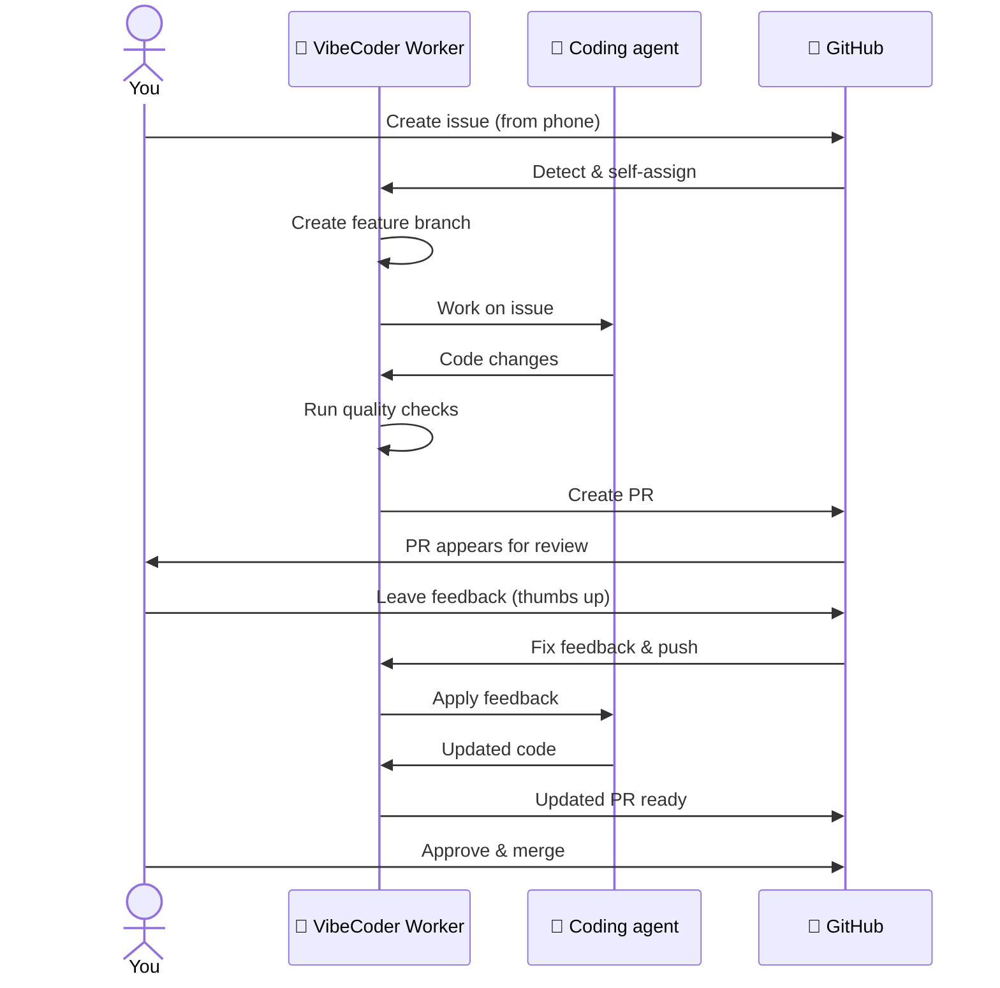
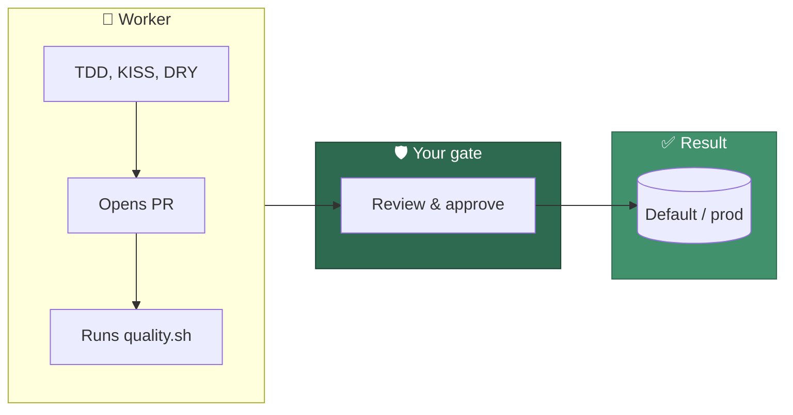
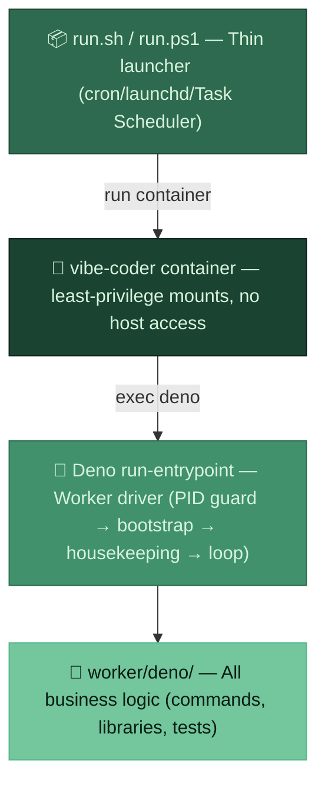
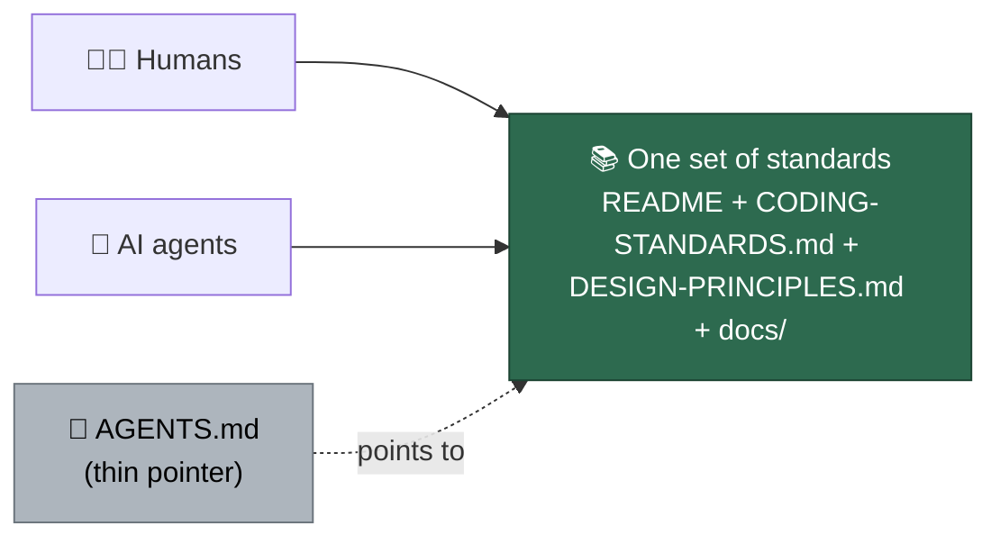

<p align="center">
  
</p>

# 🚀 VibeCoder

**Create GitHub issues from your phone, get PRs (Pull Requests) automatically,
review and request fixes with a thumbs up.**

VibeCoder is an automated GitHub issue worker driven by a coding-agent CLI. It
monitors your repositories, picks up issues, writes code, runs quality checks,
and opens pull requests — all without you touching a keyboard.

It is **provider agnostic**: `claude`
([Claude Code](https://docs.anthropic.com/en/docs/claude-code)) is the default,
and `codex` (the OpenAI Codex CLI), `gemini` (the Gemini CLI) and `deepseek`
(DeepSeek, served through the Claude Code CLI) are built in and chosen by
configuration — see [Choose your coding agent](#-choose-your-coding-agent).

## 🔄 How It Works



## 🔌 Choose your coding agent

The coding agent is a **separable layer** — every workflow above is the worker's,
not the vendor's, so swapping the agent changes which CLI writes the code and
nothing else. Four providers are built in:

| Provider id        | Agent       | Credential file         |
| ------------------ | ----------- | ----------------------- |
| `claude` (default) | Claude Code | `claude/provider.env`   |
| `codex`            | Codex CLI   | `codex/provider.env`    |
| `gemini`           | Gemini CLI  | `gemini/provider.env`   |
| `deepseek`         | DeepSeek (Claude Code CLI) — Anthropic's CLI pointed at DeepSeek's Anthropic-compatible endpoint | `deepseek/provider.env` |

`deepseek` is the one row that needs a word of explanation: DeepSeek ships no
CLI of its own, so the provider installs Anthropic's CLI under the `deepseek`
command and points it at `https://api.deepseek.com/anthropic`. Its credential
is therefore a **DeepSeek** key, and Anthropic's own credentials are withheld
from it — no vendor's secret reaches another vendor's agent.

Select one with the `agent_provider` key in `.config.json`:

```json
{
  "agent_provider": "codex",
  "agent_providers": ["codex"]
}
```

`agent_providers` lists every provider enabled for a run: each gets its own
credential file, its own startup preflight and its own read-only container
mount, so no vendor's secret reaches another vendor's agent. It must include
the active provider. For a single run, `VIBE_AGENT_PROVIDER` and
`VIBE_AGENT_PROVIDERS` (comma-separated) override both keys.

An id that is set but not registered fails loudly at startup with the supported
ids named — the worker never silently falls back to the default and runs an
agent you did not choose.

The default container image installs Claude Code alone, so choosing another
provider also means building the image with it in the `AGENT_PROVIDERS` set.

- [Container Image — the coding-agent provider layer](docs/CONTAINER.md#the-coding-agent-provider-layer)
  — how the seam works, what the image installs, and how to add the next
  provider.
- [Configuration Reference](docs/CONFIGURATION.md#-configuration-defaults) —
  the `agent_provider` and `agent_providers` keys in full.
- [Setup Guide](docs/SETUP.md#choosing-the-coding-agent) — provisioning each
  vendor's credentials.
- [Quorum](docs/QUORUM.md) — running several providers at once, so two agents
  draft a plan and a third judges it.
- [Model Selection, Sessions & Caching — provider applicability](docs/MODEL-AND-CACHING.md#provider-applicability)
  — which documented model, session and caching behaviours you still get under
  each provider, and what the others do instead.

## ✨ Key Features

- **Issue-to-PR pipeline** — Write an issue, get a PR. The worker handles
  branching, coding, testing, and PR creation.
- **Review feedback loop** — Leave comments on the PR, thumbs-up to trigger
  fixes. The worker responds to feedback and pushes updates.
- **Clarification & refinement** — If the issue is unclear, the worker asks
  questions before starting. You can also refine issues collaboratively.
- **Planning mode** — Add the `planning` label to get task breakdowns and
  sub-issues instead of direct implementation.
- **Question answering** — Add the `question` label to get answers about the
  codebase without implementation. The worker reads the issue and comments,
  posts an answer, removes the `question` label, and adds `needs-human` to
  signal it is your turn. Add `question` again to ask a follow-up.
- **Spelling auto-fix** — Failed spelling checks on PRs are automatically
  corrected.
- **CI failure auto-fix** — Failed CI (Continuous Integration) or integration
  checks on open PRs are automatically diagnosed and fixed.
- **Idle-task framework** — When no claimable work exists, the worker files a
  lowest-priority `idle-task` issue and runs one of the registered background
  templates (security, best-practices, test-audit, dependency, and documentation
  scans, among others), picked at random. See
  [`docs/IDLE-TASK-FRAMEWORK.md`](docs/IDLE-TASK-FRAMEWORK.md) for the full
  catalogue.
- **Security scans** — When the worker has no claimable work, it idle-runs a
  four-phase security scan against the least-recently-scanned monitored repo and
  files findings as `security`-labelled issues. See
  [`docs/SECURITY-SCAN.md`](docs/SECURITY-SCAN.md) for the operator manual.
- **Priority-based work queue** — PR feedback first, then spelling fixes, CI
  failure remediation, branch updates, auto-merge, branch cleanup, issue
  closure, milestone completion (with tracking issue), issue refinement,
  question answering, planning, then new issues (globally oldest across repos).
- **Cost optimisation** — Phase-based model selection (Fable 5 / Opus for
  complex work, Haiku for routine tasks — see
  [Model, Caching & Batching](docs/MODEL-AND-CACHING.md) for the full routing
  rationale), SHA-based prompt compilation cache, prompt structure
  optimisation for Claude prompt caching, and per-issue token usage tracking.
  (The Anthropic Batch API was evaluated but deliberately not wired in — its
  async turnaround is incompatible with the worker's bounded interactive run;
  see [Model, Caching & Batching](docs/MODEL-AND-CACHING.md#batch-api).)
- **Per-repo configuration** — Operator-side `repo_config` in `.config.json`
  customises worker behaviour per repository (e.g., skip screenshots for
  CLI-only projects). Configuration is operator-side only — target repos carry
  no worker configuration.
- **Milestone enhancements** — Progress notifications, configurable issue
  ordering within milestones, periodic branch sync with the default branch, and
  milestone health diagnostics.
- **Self-healing** — Shadow-copy execution, automatic repo resets, disk cleanup,
  failure recovery, rate-limit handling, and crash resilience keep the worker
  running unattended. See
  [Resilience & Concurrency](docs/workflows/resilience-and-concurrency.md) for
  the full behaviour.
- **Safe by default** — Only processes issues from allowed authors with
  configured labels.
- **Extendable** — Add new functionality via Deno/TypeScript commands without
  modifying shell scripts.

## 🛡️ Quality and control (for managers and tech leads)

The Vibe Coder is a fast, capable assistant — but **nothing goes to the default
branch (prod) without your review**. No rogue merges, no surprises. Same as for
human developers: every change arrives as a PR; you review, request fixes, and
approve before merge. The "loss of control" worry is addressed by design: the
worker never bypasses your gates.



**Productivity with quality:** The worker is told to follow **TDD** (Test-Driven
Development), **KISS** (Keep It Simple), **DRY** (Don't Repeat Yourself), and
the rest of the playbook — and every PR runs the full quality gate
(`./quality.sh`: `deno test`, `deno lint`, `deno check`, `deno fmt --check`,
and semgrep over the changed files).
Have your cake and eat it too: more throughput, same (or better) gates. Full
coding standards: [Coding Standards](CODING-STANDARDS.md).

**Note for team leads and managers:** The productivity gains are real, but you
are now deploying code that you didn’t write and may not fully understand.
That’s why the review gate exists: treat every PR as code you’re taking
ownership of. Review, ask for changes, and only merge when you’re comfortable
maintaining what lands on the default branch.

## 🏁 Quick Start

### macOS / Linux

```bash
# Clone the repository
gh repo clone <your-org>/VibeCoder
cd VibeCoder

# Configure via environment variables (when run in a terminal, setup may optionally prompt for service-account paths)
VIBE_ALLOWED_AUTHOR=myusername \
VIBE_REPOS="myorg/repo1,myorg/repo2" \
./setup.sh

# Start the worker
./run.sh

# Move this host onto the newest release (setup pins a new host to a release;
# each launch says when a newer one exists). Rewrites the pins in .config.json
# and nothing else — the next launch installs exactly them.
./run.sh upgrade
```

See [Configuration — The upgrade loop](docs/CONFIGURATION.md#the-upgrade-loop)
for the notice, what the command changes, and the hand-edited pin.

### Windows (PowerShell)

```powershell
# Clone the repository
gh repo clone <your-org>/VibeCoder
cd VibeCoder

# Configure (same environment variables)
$env:VIBE_ALLOWED_AUTHOR = "myusername"
$env:VIBE_REPOS = "myorg/repo1,myorg/repo2"
.\setup.ps1  # PowerShell only — no bash, WSL or Git Bash needed

# Start the worker
.\run.ps1
```

`setup.ps1` is the twin of `setup.sh`: it delegates every
platform-neutral step to the same Deno setup CLI and adds only the interactive
layer — the prompts, the credential flow (`gh` identity copy plus
`claude setup-token`, each proven with a live call), and the offer to register
the Task Scheduler entry that replaces the macOS LaunchAgent. Missing host
tools are offered one at a time via winget. A parity test compares the two
scripts, so neither can quietly drop a setup step the other keeps.

That is the whole deployment story: **`git clone` → configure credentials and
repos → `./run.sh` (or `run.ps1`)**. From then on the machine operates
unattended — it self-heals, rebuilds its container when the definition changes,
and is steered entirely through GitHub.

### 📡 An unattended appliance, controlled through GitHub

A Vibe Coder host is an **appliance**, not a workstation. The worker runs
inside a least-privilege container that sees four explicit host mounts, two
named volumes, and no other host data ([Containment](docs/CONTAINMENT.md)). The trade is deliberately
asymmetric — **generous resources, strict boundary**: inside the container the
worker gets all the memory, CPU and disk the host can give (it is sized to the
host, not rationed), while the boundary around it is absolute (see
[Design Principles](DESIGN-PRINCIPLES.md#generous-resources-strict-boundary)).
**GitHub is the sole normal remote control plane**: issues, comments, labels, repositories, commits and
pull requests. Humans steer the worker by labelling and commenting; the worker
reports progress, escalations and crashes the same way.

**SSH, Remote Desktop, screen sharing, a management UI and terminal access to
the host are not required for normal operation.** No inbound port is opened.
Local logs (`~/logs`) remain useful for diagnosis, but a recoverable failure is
reported through GitHub rather than left to disappear into a host log.

For production, run via cron (macOS/Linux) or Task Scheduler (Windows) every 5
minutes:

```bash
# macOS / Linux (cron)
*/5 * * * * /path/to/VibeCoder/run.sh >> ~/logs/cron.log 2>&1
```

See the [Deployment Guide](docs/DEPLOYMENT.md) for systemd, launchd, Task
Scheduler, and other options.

## 🏗️ Architecture

The worker uses a **thin launcher + Deno TypeScript** architecture. Entry points
are minimal shell/PowerShell scripts that delegate to Deno for all business
logic. Cross-platform: macOS, Linux, and Windows.

`run.sh` and `run.ps1` launch the worker inside the
container image: both ask the same Deno `container-launch-plan` command what to
run, so the mounts and privilege flags are identical on every host. Containment
is mandatory (Issue #4): container is the only run mode — the former `native`
and macOS `seatbelt` opt-ins were removed, a `run_mode` (or `VIBE_RUN_MODE`)
that still names one fails loud with the removal explained, and a missing container runtime is a
loud failure with no host fallback. See
[Container Image](docs/CONTAINER.md) for the mount set and privilege flags,
[Containment](docs/CONTAINMENT.md) for the boundary, and
[Configuration](docs/CONFIGURATION.md#-run-mode) for the setting.



The thin launcher `exec`s Deno directly on the `run-entrypoint` command — there
is no bash on the runtime path, so the worker runs natively on Windows
. Because Deno loads its modules at process start, the running
driver is immune to any mid-run change to the checkout — the same property the
old `worker/.run_core.sh` shadow-copy provided.

**Resilience features:** The worker is built to run unattended — a host-side
update of the checkout to the default branch before each launch (with the
driver immune to it), shallow clones with
on-demand history deepening, repo self-healing and
startup sweeps, two-tier disk cleanup, PID locking, time-limited runs, timeout
wrappers, rate-limit awareness with model fallback, crash-surviving failure
state, and multi-worker coordination. For the full detail see
[Resilience & Concurrency](docs/workflows/resilience-and-concurrency.md),
[Worker Internals](docs/INTERNALS.md), and
[Lessons learnt](docs/LESSONS-LEARNT.md).

## 📋 Requirements

The worker runs inside the container image — `container` is the default and
the only run mode (Issue #4) — so the host needs a container runtime and the
launcher, not the worker's toolchain:

- A supported **container runtime**: Apple
  [`container`](https://github.com/apple/container) on macOS,
  [Docker](https://docs.docker.com/get-docker/) or
  [Podman](https://podman.io/docs/installation) on Linux and Windows. Container
  mode never falls back to the host — with none available the launcher exits
  non-zero (there is no host mode to switch to). You do not have to install it by
  hand: `./setup.sh` (`.\setup.ps1` on Windows) run in a terminal offers to
  install and start it (see
  [Deployment](docs/DEPLOYMENT.md#interactive-install-offer)).
- [Deno](https://deno.com/) 2+ — the launcher's only host tool.
- `bash` (macOS/Linux) or [PowerShell](https://learn.microsoft.com/powershell/)
  (Windows PowerShell 5.1 or `pwsh` 7) to run the launcher.
- For the one-time `./setup.sh` / `.\setup.ps1` only: [Git](https://git-scm.com/)
  and an authenticated [GitHub CLI](https://cli.github.com/).

The coding-agent CLI, `gh`, `jq`, `timeout`, headless Chromium and the
monitored repositories' build toolchains are baked into the image — do not
install them on the host. See the
[Deployment Guide](docs/DEPLOYMENT.md#-run-mode-container-only) and
[Containment](docs/CONTAINMENT.md).

Optional: [shellcheck](https://github.com/koalaman/shellcheck) is **not** run by
`./quality.sh` — bash linting is owned by each repo's own CI, and
this repo lints its shell scripts in the `validate-scripts` GitHub Actions
workflow. Install it only if you want to reproduce that CI check locally.

Optional: [semgrep](https://semgrep.dev/docs/getting-started/quickstart) **is**
run by `./quality.sh`, over the branch's changed files, using the same
`p/default` ruleset as the blocking `semgrep.yml` PR check (Issue #559). It is
not baked into the image, so without it the stage reports `SKIPPED` and names
the remedy. Install it (`pipx install semgrep`) to meet SAST findings before
the push instead of after it.

## 📚 One set of instructions

Humans and AI agents follow the **same** standards — there is no per-provider
copy to drift. The standards live in the human documentation;
[`AGENTS.md`](AGENTS.md) is a thin pointer into it, not a parallel content
store.



- **[Coding Standards](CODING-STANDARDS.md)** — the single source of truth for
  coding standards (spelling, KISS/DRY, TDD, quality gates, Deno conventions,
  commit safety, PR evidence, prompt-engineering guidance).
- **[Design Principles](DESIGN-PRINCIPLES.md)** — why each subsystem behaves the
  way it does, each linking its canonical operator manual under `docs/`.

## 📖 Documentation

| Document                                                                       | Description                                                                                                                                            |
| ------------------------------------------------------------------------------ | ------------------------------------------------------------------------------------------------------------------------------------------------------ |
| **[Overview](docs/OVERVIEW.md)**                                               | Single-page walkthrough for developers and tech leads: what the Vibe Coder is, two modes (interactive vs backlog), workflow, coordination, and smarts  |
| **[Label Flows](docs/workflows/label-flows.md)**                               | **Which label when** — grill-me ↔ needs-human, planning vs work tiers, milestones, auto-merge, coloured journey diagrams                               |
| **[Usage Guide](docs/USAGE.md)**                                               | Creating issues, PR workflow, clarification, refinement, failure handling, prioritisation                                                              |
| **[Workflows Overview](docs/workflows/README.md)**                             | **User manual** for repo owners: how to assign issues, set up milestones/pseudo-projects, get work done. Issue/PR lifecycles, resilience, concurrency. |
| — [Label Flows](docs/workflows/label-flows.md)                                 | Which label when: grill-me, needs-human, planning, work tiers, milestones, auto-merge                                                                  |
| — [Issue Processing](docs/workflows/issue-processing.md)                       | Flow from issue discovery through branch creation, Claude coding, quality gate, and PR creation                                                        |
| — [PR Feedback & Upkeep](docs/workflows/pr-feedback.md)                        | Review feedback loop, spelling fixes, branch updates, auto-merge catch-up                                                                              |
| — [Merge-conflict Resolution](docs/workflows/merge-conflicts.md)              | Real merge of the base into a conflicting PR — both sides survive — deterministic dependency rules before the agent, plus attempt bounds and escalation |
| — [Planning, Questions & Refinement](docs/workflows/planning-and-questions.md) | Non-coding workflows: planning mode, question answering, issue refinement, clarification phase                                                         |
| — [Projects & Dependencies](docs/workflows/projects-and-dependencies.md)       | Milestones as projects, issue relationships, dependencies, sub-issues                                                                                  |
| — [Milestones](docs/workflows/milestones.md)                                   | Unlocks productivity: safely work many issues overnight/weekend; quality gates on every PR; no code to default without your review of the final PR     |
| — [Resilience & Concurrency](docs/workflows/resilience-and-concurrency.md)     | Self-healing behaviour, restart model, issue claiming, multi-worker coexistence                                                                        |
| **[Quorum](docs/QUORUM.md)**                                                   | Operator manual for the `quorum` plan-off: the trigger, the two-draft/one-judge sequence, the result comment, every degradation path, the per-run cost, and the config keys |
| **[Configuration Reference](docs/CONFIGURATION.md)**                           | Config file (`.config.json`), per-repo settings, authorised commenters                                                                                 |
| **[Setup Guide](docs/SETUP.md)**                                               | Setup manual: what the automated setup script does, and the from-scratch manual path for macOS, Linux and Windows                                      |
| **[Deployment Guide](docs/DEPLOYMENT.md)**                                     | Installation, cron/systemd/launchd setup, logs, screenshot support                                                                                     |
| **[Linux Verification Host](docs/EC2-LINUX-VERIFICATION.md)**                  | The CloudFormation stack that confirms the Linux/podman launch path: an SSM-only Ubuntu EC2 host, the launch/verify/tear-down commands, and the faults it deliberately reproduces |
| **[Containment](docs/CONTAINMENT.md)**                                         | The containment boundary: the mount set, the host resources deliberately kept outside it, the disposable container root filesystem, the network boundary, and GitHub as the control plane |
| **[Container Image](docs/CONTAINER.md)**                                       | The `container/` definition: pinned toolchain manifest (worker runtime plus the monitored repos' build/test toolchains), non-root user, entrypoint, and the CI job that builds it and runs the quality gate inside it    |
| **[Extending the Worker](docs/EXTENDING.md)**                                  | Adding Deno/TypeScript commands, prompt versioning, shell integration                                                                                  |
| **[Prompt goals (summary)](docs/PROMPTS.md)**                                  | Goals of each prompt type (issue, planning, question, PR feedback, spelling, CI fix); full prompts are in the repo                                     |
| **[Prompt best-practices checklist](docs/PROMPT-BEST-PRACTICES-CHECKLIST.md)** | The shared rubric for auditing a prompt surface against Anthropic's Claude prompting best-practices guide: 22 checklist rows plus 3 house rows, verdict table, gap-issue template |
| **[Model, Caching & Batching](docs/MODEL-AND-CACHING.md)**                     | Model selection per phase, prompt caching (disk + Claude), why the Batch API was not wired in, token usage tracking, cost estimation                   |
| **[GitHub API Optimisation](docs/GH-API-OPTIMISATION.md)**                     | `gh` cache layers, list-then-filter pattern, GraphQL batch path, invalidation rules, per-iteration call telemetry                                      |
| **[Worker Internals](docs/INTERNALS.md)**                                      | Run loop, issue selection, PR monitoring, milestone/dependency handling — for implementers and contributors                                            |
| **[Troubleshooting](docs/TROUBLESHOOTING.md)**                                 | Common issues and solutions                                                                                                                            |
| **[Lessons learnt](docs/LESSONS-LEARNT.md)**                                   | Unattended, concurrent, self-healing: what was hard and how we addressed it                                                                            |
| **[Spec-Kit Comparison](docs/SPEC-KIT-COMPARISON.md)**                         | Point-in-time assessment of GitHub spec-kit against this workflow: the phase-by-phase mapping, five ideas adopted natively, five deliberately rejected |
| **[References](docs/REFERENCES.md)**                                           | Credit for the external sources whose ideas are embedded in our prompts and docs (OWASP, the Rust Book, spec-kit, Caveman…), and the list to re-check for new ones |
| **[Security](SECURITY.md)**                                                    | Operator manual: security architecture, configuration, token handling, deployment security, and the implementation reference for every control          |
| **[Threat Model](docs/THREAT-MODEL.md)**                                       | The standalone, design-level model: assets, attacker capabilities per GitHub surface, attack paths, control→code→test traceability, gaps, residual risks |
| **[Idle-task Framework](docs/IDLE-TASK-FRAMEWORK.md)**                         | Operator manual for the idle-task framework: lifecycle, registry, coordination, operator triage/suppression, and how to add a new template             |
| **[Security Scans](docs/SECURITY-SCAN.md)**                                    | Operator manual for the four-phase security scanner: triggers, state files, finding-issue layout, suppression syntax                                   |
| **[Best-Practices Scans](docs/BEST-PRACTICES-SCAN.md)**                        | Operator manual for the bucket-scoped best-practices idle scan: buckets, CI-gate checks, labels, suppression                                           |
| **[Test-Audit Scans](docs/TEST-AUDIT-SCAN.md)**                                | Operator manual for the language-agnostic static test-suite maintainability and coverage-gap audit: the ten audit checks, labels, suppression                                    |
| **[Documentation-Audit Scans](docs/DOCUMENTATION-AUDIT-SCAN.md)**              | Operator manual for the prose-documentation audit: unify PR-summary learnings into the README, prune stale docs, remove comments the code contradicts, the thirteen checks, labels, suppression |
| **[Private-Repo Reference Audit](docs/PRIVATE-REPO-REFERENCE-AUDIT-SCAN.md)**  | Operator manual for the public-repos-only audit that detects direct references to a private `stSoftwareAU` repo: the public-only gate, three checks, labels, remediation |
| **[Duplicated-Knowledge Scans](docs/DUPLICATED-KNOWLEDGE-SCAN.md)**            | Operator manual for the weekly duplicated-knowledge scan: the one-question knowledge test, the deterministic duplicate-block pre-pass, severity, labels, suppression |
| **[Retro Scans](docs/RETRO-SCAN.md)**                                          | Operator manual for the weekly suggestion-only retro: the five evidence-triggered categories, what is out of scope without a transcript, severity, dedup, suppression |
| **[GitHub Actions Audit Scans](docs/GITHUB-ACTIONS-AUDIT-SCAN.md)**            | Operator manual for the weekly workflow-only Actions audit: SHA-pinning, permissions, script injection, pre-filers                                     |
| **[Bash-Syntax Audit Scans](docs/BASH-SYNTAX-AUDIT-SCAN.md)**                  | Operator manual for the weekly bash syntax audit: the per-repo `bash -n` + ShellCheck CI gates it verifies, checks, labels, suppression                |
| **[Supply-Chain Readiness Scans](docs/SUPPLY-CHAIN-READINESS-SCAN.md)**        | Operator manual for the weekly static supply-chain readiness audit: check catalogue, labels, suppression                                               |
| **[Orphan-Dependency Scans](docs/ORPHAN-DEPS-SCAN.md)**                        | Operator manual for the weekly orphan / unmaintained-dependency audit: signal catalogue, the sanctioned-network exception, labels, suppression         |
| **[Supply-Chain Detection Scan](docs/SUPPLY-CHAIN-DETECTION-SCAN.md)**         | Design and catalogue for the proactive supply-chain compromise detection scan                                                                          |
| **[Supply-Chain Triage](docs/SUPPLY-CHAIN-TRIAGE.md)**                         | Bulk triage and dispatch order for supply-chain findings across the scan templates                                                                     |
| **[Security Remediation Batching](docs/SECURITY-REMEDIATION-BATCHING.md)**     | How security findings are batched into remediation work for worker throughput                                                                          |
| **[Full-history Secret Scan](docs/FULL-HISTORY-SECRET-SCAN.md)**               | Operator manual for the gitleaks + trufflehog sweep across every branch and tag: the single command, the baseline, and the rotation log that blocks on unrotated leaks |
| **[Supply-chain Gate](docs/SUPPLY-CHAIN-GATE.md)**                             | Operator manual for the CI gate that fails on unpinned actions, unfrozen `deno` invocations, tag-referenced container bases, permissive Renovate auto-merge or a stale dependency inventory |
| **[Whole-tree Security Sweep](docs/SECURITY-TREE-SWEEP.md)**                   | Operator manual for the one-shot worker-scan + semgrep + CodeQL sweep over the entire checkout: sources and coverage, cross-tool dedup, the baseline, triage and filing |
| **Public Export**                                     | Operator manual for `export-public.sh`: the versioned allowlist manifest, the hard-deny gate, the staged brand-new history, and why it never configures a remote or pushes |
| **Public Repository Readiness** | Operator checklist for the public VibeCoder repository: the CI the export ships, every repository setting with its `gh api` command, branding assets, and the licence confirmation. The public README/SECURITY/CONTRIBUTING are authored under [`docs/public/`](docs/public/) |
| **Publish Decision Dossier** | Operator-private Phase 4 go/no-go dossier for plan: one evidenced verdict per condition, the headaches and alternatives, a dated NO-GO/GO line, and `deno task publish-decision-check` which refuses an incomplete GO |
| **[Security analyses & assessments](docs/security/README.md)**                 | Index of the point-in-time security gap analyses, threat models, and assessments (harness gap analysis, Cloudflare coverage, GhostCommit pair)         |
| **[OWASP Top 10 2025 Coverage Matrix](docs/OWASP-TOP-10-2025-COVERAGE-MATRIX.md)** | Which idle-task template covers which OWASP Top 10 2025 category — the point-in-time matrix from plus templates registered since |
| **[Cross-repo Fix](docs/CROSS-REPO-FIX.md)**                                   | Raising a PR in an internal `stSoftwareAU` dependency's own repo: the "can access" classification, PR plumbing, the agent→worker declaration bridge, and release-gating boundaries |
| **[Merge Enforcement](docs/MERGE.md)**                                         | Operator manual for the dual-layer pre-merge gate: required checks, defer-and-retry, read-only default branch                                          |
| **[Release Tagging](docs/RELEASE-TAGGING.md)**                                 | How every merge to `main` is tagged with the next patch semver: the patch-only rule, hand-minted minor/major tags, idempotency, concurrency, and the `tool-versions.json` manifest each release ships |
| **[Human-authored PR Policy](docs/HUMAN-PR-POLICY.md)**                        | What the worker will and will not do to a PR it did not author: the two author lists, inviting it onto your PR, revoking, and the blocked-issue nudge  |
| **[Add-repo Onboarding](docs/ADD-REPO.md)**                                    | Onboarding a new repository to the monitored set via an `add-repo:` issue: validation, label/branch-protection sync                                    |
| **Switching Identity**                           | Migrating an existing deployment to a new worker GitHub identity                                                                                       |
| **[Per-repo PR Failure Actions](docs/per-repo-pr-failure-actions.md)**         | Per-repository configuration of what the worker does when a PR's CI fails                                                                              |
| **[CI-failure Issue Log Fetch](docs/ci-failure-issue-log-fetch.md)**           | Automatic root-cause log fetch for issue-mode CI failures: label config, build-reference parsing, origin allowlist                                     |
| **[Security-fix Gate Feedback](docs/security-fix-gate-feedback.md)**           | Stating the security-fix evidence contract before the first attempt, and carrying a blocked verdict into the retry through worker run state            |
| **[Agent Accountability](docs/AGENT-ACCOUNTABILITY.md)**                       | Gap analysis of the worker's safeguards against an external agent-accountability model                                                                 |
| **[Security Work-stream Parallelism](docs/SECURITY-WORK-STREAM-PARALLELISM-INVESTIGATION.md)** | Investigation: a dedicated security work stream and safe parallelism                                                                   |
| **[Coding Standards](CODING-STANDARDS.md)**                                    | The single source of truth for coding standards: spelling, KISS/DRY, TDD, quality gates, Deno conventions, commit safety, prompt-engineering guidance  |
| **[Design Principles](DESIGN-PRINCIPLES.md)**                                  | Design digest — why each subsystem behaves as it does, each linking its canonical operator manual under `docs/`                                        |
| **[AGENTS.md](AGENTS.md)**                                                     | Thin pointer for AI agents into the one set of human+agent instructions (points at Coding Standards, Design Principles, and the docs above)            |
| **[Contributing](CONTRIBUTING.md)**                                            | How to contribute: branching, commits, quality gate, and PR conventions                                                                                |

## 🏷️ Supported Labels

VibeCoder uses GitHub labels to control issue processing, workflows, and state
tracking. Many labels are configurable via `.config.json`; the discovery labels
(`top-priority`, `work-on`, `low-priority`) and a few others are **hardwired**
and not overridable — the Config-Key column below marks each. See the
[Configuration Reference](docs/CONFIGURATION.md) for details.

**New here?** Start with **[Label Flows](docs/workflows/label-flows.md)** —
coloured diagrams for grill-me, planning, work tiers, milestones, and
auto-merge (what the code actually does).

### 🔍 Issue Discovery Labels

These labels tell the worker which issues to pick up.

| Label               | Default                                 | Config Key           | Description                                                                                                                                                                                                                                                                                                                                                                                                            |
| ------------------- | --------------------------------------- | -------------------- | ---------------------------------------------------------------------------------------------------------------------------------------------------------------------------------------------------------------------------------------------------------------------------------------------------------------------------------------------------------------------------------------------------------------------- |
| **Issue labels** | `top-priority` | — (hardwired,) | Issues with this label are scanned first. Add `top-priority` to a new issue to trigger highest-priority processing. Hardwired since — the retired `issue_labels` key is no longer accepted. |
| **Work-on** | `work-on` | — (hardwired,) | Signals the worker to pick up an issue **not** created by an allowed author. Only an allowed author can add this label (verified via the GitHub timeline API). Hardwired since — the retired `work_on_label` key is no longer accepted. |
| **Low-priority** | `low-priority` | — (hardwired,) | Backlog work — selected only when **no** eligible `top-priority` or `work-on` candidate exists in **any** scanned repo. Only an allowed author can add this label. The full priority order is `top-priority` > `work-on` > `low-priority` > `idle-task`. Only `idle-task` is self-appliable by the Vibe Coder. Hardwired since. See [Issue selection priority](docs/workflows/issue-processing.md#-issue-selection-priority). |
| **Ignore open PRs** | `ignore-open-prs`                       | —                    | Bypasses the default behaviour of skipping repositories with open PRs. Only effective when added by an allowed author.                                                                                                                                                                                                                                                                                                 |

### 🔄 Workflow Labels

These labels trigger specific workflows instead of (or before) implementation.

| Label                  | Default              | Config Key                 | Description                                                                                                                                                                                                                                                                                                                                                                                  |
| ---------------------- | -------------------- | -------------------------- | -------------------------------------------------------------------------------------------------------------------------------------------------------------------------------------------------------------------------------------------------------------------------------------------------------------------------------------------------------------------------------------------- |
| **Grill-me**           | `grill-me`           | `grill_me_label`           | **Default** up-front alignment: rounds of questions with `needs-human` turn-taking, then a Ready recommendation. Prefer this over jumping straight to `work-on` — almost every issue can be misunderstood. You apply `planning` or a work-tier label yourself. See [Label Flows](docs/workflows/label-flows.md) and [Grill-me](docs/workflows/grill-me.md).                                                                 |
| **Quorum**             | `quorum`             | `quorum_label`             | Runs a plan-off **before** planning: two agents draft a plan for the issue independently, a third judges the anonymised drafts, and the worker posts the winner with the runner-up and the judge's reasoning attached in collapsed sections. Human-applied only — the worker can never self-apply it. On completion it removes `quorum` and adds `needs-human`; you pick the next phase. See [Quorum](docs/QUORUM.md) and [Label Flows](docs/workflows/label-flows.md). |
| **Planning**           | `planning`           | `planning_label`           | Instructs the worker to break down the issue into sub-issues and task plans instead of implementing code directly. The label is automatically removed after processing.                                                                                                                                                                                                                      |
| **Refine issue**       | `refine-issue`       | `refine_issue_label`       | Triggers collaborative issue refinement — the worker updates the issue title and body based on your feedback comments. The label is automatically removed after processing. Add it again to continue refining.                                                                                                                                                                               |
| **Question** | `question` | `question_label` | Marks the issue as a question to be answered rather than implemented. The worker reads the issue and comments, posts an answer, removes `question`, and adds `needs-human` to mark it as the user's turn. Add `question` again to ask a follow-up. |
| **Merge conflict** | `merge-conflict` | — (hardwired) | Applied by the worker to an open PR whose branch conflicts with its base, so the stuck queue is visible at a glance instead of buried in per-pass logs. The Priority 1.61 conflict pass then merges the base in for real — both sides' changes survive, never a side-pick — runs the repo's quality gate, and pushes. The label is removed once the PR merges cleanly again; after two failed attempts the worker escalates with `needs-human` instead of retrying. Every attempt ends visibly — merged, failed, or escalated — and an attempt disrupted before it concluded is re-attempted rather than counted, with its own 3-disruption bound. |
| **Needs human** | `needs-human` | `needs_human_label` | Applied by the worker when it hits an unrecoverable blocker (e.g. a change that needs the `workflow` OAuth scope) **or when the clarity-assessment phase determines the issue is unclear**. The worker posts a comment explaining what a human must do next, then skips the issue on every subsequent scan until the label is removed. This is the worker's **only** escalation label — see [Worker escalation policy](#-worker-escalation-policy-needs-human) below. |

> **📝 Note:** The `top-priority` label is **human-only** — the worker never
> self-applies it. It is the primary human scheduling signal for issue discovery
> (see above). The worker escalates via `needs-human` instead.

### 🤝 Worker escalation policy (`needs-human`)

When the worker cannot complete an issue autonomously — for example a change
requires the `workflow` OAuth scope it does not hold, needs credentials only a
human can grant, or depends on a product decision — it escalates rather than
looping:

1. Adds the `needs-human` label (creating it if it does not already exist).
2. Posts a comment explaining what was attempted, why it could not complete, and
   exactly what a human needs to do next.
3. Stops work on the issue — it does not retry the same failing step.

The worker **never** self-applies the reserved workflow labels (`top-priority`,
`work-on`, `low-priority`, `failed`, `failed-once`, `refine-issue`, `planning`,
`question`, `best-model`) — these are managed by humans. The canonical
pickup-priority order is
`top-priority` > `work-on` > `low-priority` > `idle-task`, all meaning
_work on this issue_ and differing only in priority; **only `idle-task` is
self-appliable by the Vibe Coder**. The worker can nonetheless schedule its
**own auto-filed diagnostics** without a label — provenance, not a label,
makes them claimable, one at a time, audited and announced
(tier 2b, Issue #505). See
[Issue selection priority](docs/workflows/issue-processing.md#-issue-selection-priority)
for the full ordering.

To release an escalated issue back to the worker, remove the `needs-human` label
once the blocker has been resolved.

### 📊 State Tracking Labels

The worker applies these labels automatically to track issue state. You can also
remove them manually to change the workflow.

| Label                   | Default               | Config Key                  | Description                                                                                                                                 |
| ----------------------- | --------------------- | --------------------------- | ------------------------------------------------------------------------------------------------------------------------------------------- |
| **Failed once**         | `failed-once`         | `failed_once_label`         | Applied after the first processing failure. The issue is unassigned and automatically retried on the next scan.                             |
| **Failed**              | `failed`              | `failed_label`              | Applied after the second failure (replaces `failed-once`). The issue is permanently skipped. Remove this label to allow two fresh attempts. |
| **Needs screenshot**    | `needs-screenshot`    | — (hardwired)               | Applied when a previous attempt lacked screenshot evidence. Injects explicit screenshot instructions into the retry attempt. Hardwired — no config key.                |
| **Documentation**       | `documentation`       | — (hardwired)               | Marks an issue as documentation-related. Hardwired — no config key.                                                                                                    |

### 🎨 Content Labels and Fleet Colours

Scans classify their findings with **content labels** — the `severity:*` ramp,
the `confidence:*` ramp, the `lang:*` buckets, and one category label per scan
(`security`, `best-practices`, `test-audit`, …). Unlike the workflow labels
above, these are not seeded at onboarding: a repo grows `severity:critical` the
first time a scan files a critical finding there.

Their colours come from **one canonical table**, so the ramp means the same
thing in every repo the fleet touches:

| Family         | Colours (high → low)                                                  |
| -------------- | --------------------------------------------------------------------- |
| `severity:*`   | `critical` red → `high` orange → `medium` yellow → `low` green         |
| `confidence:*` | `high` green → `medium` yellow → `low` pale green                      |
| `lang:*`       | Each language's own brand colour (`lang:rust` rust-orange, …)          |

The table lives in
[`content_label_definitions.ts`](worker/deno/setup/content_label_definitions.ts)
beside the workflow labels in
[`label_definitions.ts`](worker/deno/setup/label_definitions.ts); the two join
into `ALL_LABEL_DEFINITIONS`, which `ensureLabelExists` resolves every colour
from. Repos that drifted before the table existed are repaired by:

```bash
deno run -A worker/deno/setup/setup_cli.ts label-colour-reconcile --dry-run
deno run -A worker/deno/setup/setup_cli.ts label-colour-reconcile
```

The reconcile pass only repaints labels the table **names**, and never creates
one — a label you added to your own repo is left exactly as you set it.

### 📊 Work Prioritisation

The worker processes work in a fixed priority order: in-flight PR maintenance
first (feedback, spelling/CI fixes, branch updates, merge-conflict resolution,
CI nudges, auto-merge,
issue closure, closed-PR recovery, milestone completion and branch sync), then
non-coding workflows (refinement, grill-me, quorum, planning, questions), then
new issues (globally oldest across repos), with `low-priority` last. The
canonical ordered list with fractional priorities is the table in
[Workflows](docs/workflows/README.md) (mirrored as a diagram in the
[Usage Guide](docs/USAGE.md#-work-prioritisation-order)); the dispatch table in
`worker/deno/lib/run_core.ts` is the source of truth.

## 🔒 Security

- Only issues from **allowed authors** with **configured labels** are processed
- PR feedback requires explicit approval (thumbs up) from non-authorised
  commenters
- Bot accounts are **opt-in** for security
- The `work-on` label is verified via the GitHub timeline API

For the full security model, see [SECURITY.md](SECURITY.md).

## ⚖️ Disclaimer

- **No claim of novelty.** This approach (automated issue-to-PR workers,
  AI-assisted coding) is not original to this project. Others have built similar
  systems; this repo is one implementation.
- **Use at your own risk.** The software is intended for use on repositories you
  own or are authorised to use, in accordance with GitHub’s terms of service and
  applicable law. Misuse (e.g. using the worker to target repos or systems you
  are not authorised to modify) is not condoned. You are responsible for your
  own use and for ensuring compliance with all applicable terms and laws.
- **Warranty and liability.** The project is offered under the
  [Apache License 2.0](LICENSE), which disclaims warranties and limits
  liability. See the [LICENSE](LICENSE) file for the full terms.

_This disclaimer is for clarity only and does not replace professional legal
advice. If you have concerns about liability or misuse, consider consulting a
lawyer._

## 📄 License

Apache-2.0
