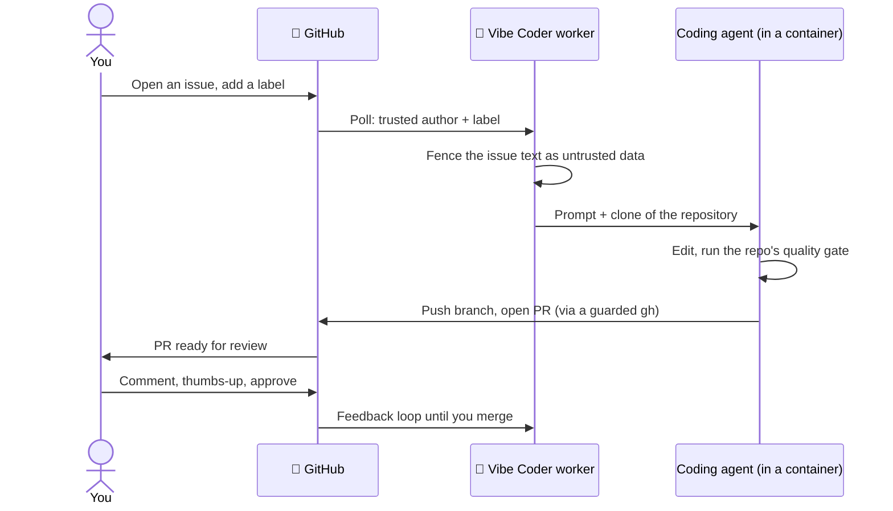

<p align="center">
  
</p>

# 🚀 Vibe Coder

**An unattended GitHub issue-to-pull-request worker, powered by
[Claude Code](https://docs.anthropic.com/en/docs/claude-code), that runs
strangers' instructions inside a strict boundary.**

Vibe Coder watches the GitHub repositories you point it at. When a trusted person
labels an issue, the worker claims it, clones the repository into a disposable
container, hands the issue text to a coding agent, runs the repository's own
quality gate, and opens a pull request. You review, comment, and approve — the
worker never merges to your default branch by itself.

> **Read this before you run it:** the worker executes text written by anyone
> who can post to your repository, on a machine behind your firewall, using an
> agent CLI with unrestricted shell access. That is the product, and it is also
> the risk. The whole design is about holding a boundary *after* the agent has
> been persuaded to misbehave. The [Threat Model](docs/THREAT-MODEL.md) is the
> document to read; this README only summarises it.

## 🔄 What it does



- **Issue → PR.** Branching, coding, running the repository's tests and quality
  gate, opening the pull request, and answering review feedback.
- **Steered entirely through GitHub.** Labels select what to do (`work-on`,
  `planning`, `question`, `grill-me`, …); comments and 👍 reactions drive the
  feedback loop; `needs-human` is how the worker hands a decision back to you.
  See [Label Flows](docs/workflows/label-flows.md).
- **Nothing lands without review.** Every change is a pull request against
  your repository. The worker never pushes to the default branch.
- **Unattended by design.** One host, one cron entry, no inbound port, no
  SSH needed. Failures are reported as GitHub comments, not left in a log.

## 🧨 What it does with untrusted input — and why that is dangerous

One sentence generates the whole security design:

> Instructions written by strangers on the public internet are fetched from
> GitHub and executed on a machine behind the operator's firewall, by an agent
> CLI running with unrestricted shell access.

The agent is spawned with `--dangerously-skip-permissions` — nobody is at the
keyboard to approve each command. Issue bodies, titles, comments, labels, the
cloned repository's own files (`CLAUDE.md`, `quality.sh`, tests, workflows,
images) and upstream packages are all attacker-influenceable on a public
repository. Prompt-level defences (fencing untrusted text, trust
classification, pattern detection) reduce the odds that untrusted text becomes
instruction. **They are not the boundary.** The design assumes the agent
inside the container is fully compromised, and holds anyway.

## 🛡️ The containment story

Three boundaries, in order:

| Boundary | What it enforces | Where |
| --- | --- | --- |
| **1 · Inbound trust gate** | Only `allowed_authors` can trigger work; routing labels count only when a trusted person added them (verified against the GitHub timeline); a content-hash snapshot blocks edits made after approval | `worker/deno/lib/security.ts`, `label_security.ts`, `pickup_content_integrity.ts` |
| **2 · Execution containment** | The agent runs in a disposable container with an explicit mount set, no host networking and no published ports; credentials are read-only mounts of one provisioned directory; credential-shaped environment variables are denied by default | `worker/deno/lib/container_launch.ts`, `claude_env.ts` |
| **3 · Egress control** | A per-run write-repository allowlist enforced at the worker's single `gh` chokepoint *and* re-applied by a `gh` guard shim on the agent's `PATH`; reserved workflow labels refused; every mutation classified and journalled; secrets redacted from every outbound body | `worker/deno/lib/write_repo_allowlist.ts`, `gh_guard_shim.ts`, `audit_journal.ts`, `secret_redaction.ts` |

**Run modes.** `container` is the default: Apple `container` on macOS, Docker
or Podman on Linux and Windows. A missing runtime is a loud failure, never a
silent fall-back to the host. Two opt-ins exist for hosts that cannot be
contained: `seatbelt` (macOS only — native process under a deny-by-default
`sandbox-exec` profile that allows exactly the paths container mode mounts;
confines file access, not kernel attack surface) and `native` (no boundary at
all — the operator who chooses it accepts that knowingly). See
[Containment](docs/CONTAINMENT.md), [Container](docs/CONTAINER.md) and
[Container Image](docs/CONTAINER-IMAGE.md).

The trade is deliberately asymmetric — **generous resources, strict boundary**:
inside the container the worker gets all the CPU, memory and disk the host can
spare; the boundary around it is absolute
([Design Principles](DESIGN-PRINCIPLES.md#generous-resources-strict-boundary-issues-4060-4184-4186)).

## ⚠️ The residual risk, plainly

These are accepted, not solved. If any of them is unacceptable to you, do not
run this software. Full list and reasoning:
[Threat Model → Residual risks](docs/THREAT-MODEL.md#-residual-risks).

- **The `gh` guard is containment, not a sandbox.** An agent that calls the
  real `gh` by absolute path, rewrites `PATH`, or reaches the GitHub API
  without `gh` bypasses the shim. The durable fix — a per-run GitHub App token
  scoped to one repository — is not yet in place.
- **The model is not deterministic.** No prompt-level control guarantees an
  instruction is never followed; the boundaries below the prompt are what
  must hold.
- **Repository-supplied build scripts execute.** The agent runs the monitored
  repository's own `quality.sh` and test suite. That is the product.
- **A compromised trusted account has full trusted access.** Inherent to any
  allowlist; compensated by two-factor authentication, short-lived tokens and
  the audit journal.
- **Native mode is outside the boundary.** Explicit opt-in only.
- **Suspicious-pattern detection is advisory** — it logs, it does not block.
- **Sophisticated social engineering** that trips no detector is stopped only
  by the human who reviews the pull request.

Two controls exist in code with no enforcing test yet (quality-gate output
fencing, failure-comment redaction). They are listed as **known gaps** in the
threat model rather than claimed as proven.

## 🏁 Quick start

The host needs a container runtime (Apple `container`, Docker or Podman),
[Deno](https://deno.com/) 2+, `bash` (or PowerShell on Windows), and — for the
one-time setup only — Git and an authenticated GitHub CLI. Everything else
(the agent CLI, `gh`, `jq`, headless Chromium, the monitored repositories'
toolchains) is baked into the container image.

```bash
gh repo clone stSoftwareAU/VibeCoder
cd VibeCoder

# One-time setup — prompts when run in a terminal, or takes these variables:
VIBE_ALLOWED_AUTHOR=yourgithublogin \
VIBE_REPOS="yourorg/repo1,yourorg/repo2" \
./setup.sh

# One run (about an hour), then exit — this is what cron calls.
./run.sh

# Or supervise continuously without cron (Ctrl+C to stop):
./loop.sh
```

For production, call `run.sh` from cron every five minutes. Each run starts
from the checkout as it is on disk (`git pull` to update; `loop.sh` does that
between runs) and rebuilds the container image whenever its definition
changes:

```bash
*/5 * * * * /path/to/VibeCoder/run.sh >> ~/logs/cron.log 2>&1
```

Windows uses `setup.ps1`, `run.ps1` and `loop.ps1` with the same variables and
Task Scheduler in place of cron. Configuration — which authors are trusted,
which repositories are watched, which labels mean what — is operator-side only
and lives in `.config.json` on the host: the repositories you point the worker
at carry no worker configuration. See the
[Configuration Reference](docs/CONFIGURATION.md) and the
[Usage Guide](docs/USAGE.md).

**Credentials.** The worker needs a GitHub identity of its own — a dedicated
service account or GitHub App, never a human's — and a coding-agent
subscription token provisioned by `setup.sh`. Keep the service account's
permissions to the repositories it should write to; the egress boundary is
enforced in the worker, but a narrowly scoped token is what limits the damage
if that boundary is ever bypassed.

## 📚 Documentation

| Read this | For |
| --- | --- |
| [Overview](docs/OVERVIEW.md) | The single-page walkthrough: what it is, how work flows, how it runs beside developers |
| [Threat Model](docs/THREAT-MODEL.md) | Assets, attacker capabilities per surface, attack paths, control → code → test traceability, gaps, residual risks |
| [Containment](docs/CONTAINMENT.md) | The boundary: mounts, network, what is deliberately not exposed |
| [Container](docs/CONTAINER.md) · [Container Image](docs/CONTAINER-IMAGE.md) | How the image is built, pinned and rebuilt |
| [Usage Guide](docs/USAGE.md) · [Configuration](docs/CONFIGURATION.md) | Day-to-day operation and every knob |
| [Workflows](docs/workflows/README.md) | Label flows, issue processing, PR feedback, planning, milestones, resilience |
| [Internals](docs/INTERNALS.md) · [Extending](docs/EXTENDING.md) · [Prompts](docs/PROMPTS.md) | How it works inside and how to add to it |
| [Design Principles](DESIGN-PRINCIPLES.md) · [Coding Standards](CODING-STANDARDS.md) · [AGENTS.md](AGENTS.md) | The standards humans and agents both follow |
| [SECURITY.md](SECURITY.md) · [CONTRIBUTING.md](CONTRIBUTING.md) | Reporting a vulnerability; landing a change |

## 🔒 Security

Please **do not** open a public issue for a vulnerability. Use GitHub's private
vulnerability reporting on this repository — the process, response window and
scope are in [SECURITY.md](SECURITY.md).

## ⚖️ Disclaimer

- **No claim of novelty.** Automated issue-to-PR workers and AI-assisted coding
  are not original to this project; this is one implementation.
- **Use at your own risk.** The software is intended for repositories you own
  or are authorised to work on, in accordance with GitHub's terms of service
  and applicable law. You are responsible for your own deployment and for the
  code you merge — treat every pull request as code you are taking ownership
  of.
- **Warranty and liability.** Offered under the Apache License 2.0, which
  disclaims warranties and limits liability. See [LICENSE](LICENSE).

## 📄 Licence

[Apache License 2.0](LICENSE).

The licence choice was made deliberately and is recorded here so it is not
silently revisited: Apache-2.0 lets anyone — including a competitor or a
service that never contributes back — run, modify and redistribute this code.
That free-rider exposure is accepted in exchange for the licence's patent
grant, its clarity for corporate adopters, and the widest possible review of a
tool whose value depends on people trusting the boundary it claims to hold.
