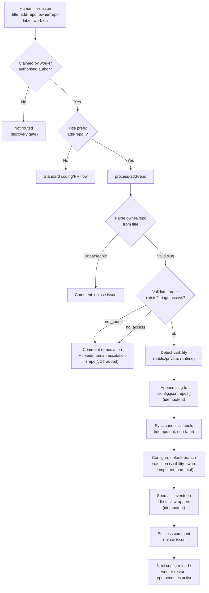

# ➕ Add-repo — remote repository onboarding

The **add-repo** feature lets an authorised human onboard a new repository to
the worker's monitored set by filing a single GitHub issue — no shell access,
no manual `.config.json` edit, no redeploy step. The worker validates access,
records the slug, syncs the full canonical GitHub label set so issues can be
scheduled immediately, and seeds the seventeen idle-task scans so the new repo is
brought up to standard over the coming idle cycles.

This is the operator manual: how to trigger it, what the worker does, the
failure paths, and the timing and secrets caveats.

> The repository name is **not** hardcoded. Every example below uses
> `stSoftwareAU/private-repo-11` purely as an illustration — any `owner/repo` slug the
> worker can reach with triage access works identically.

## At the keyboard: `./setup.sh --add-repo` / `--remove-repo`

The issue-driven flow below is for onboarding **without shell access**. An
operator sitting at the host does not need it, and should not have to sit
through the full setup wizard — or hand-edit `.config.json`, which is the thing
this feature exists to avoid:

```bash
./setup.sh --list-repos                              # what is monitored now
./setup.sh --add-repo owner/repo                     # add one
./setup.sh --remove-repo owner/repo                  # remove one
```

On Windows, the same three through `setup.ps1`, as named parameters:

```powershell
.\setup.ps1 -ListRepos
.\setup.ps1 -AddRepo owner/repo
.\setup.ps1 -RemoveRepo owner/repo
```

Each short-circuits before any prompt, install or sync, and exits non-zero on
failure so it can be scripted. Both writes are idempotent: adding a repository
already present, or removing one that is not listed, changes nothing and says
so.

`--remove-repo` also drops the repository's `repo_config` entry, so settings do
not accumulate for repositories nobody monitors. It does **not** touch open PRs,
branches or issues in that repository — it only stops the worker looking at it.

`--add-repo` validates the slug's shape but does **not** probe GitHub: telling
you what is in a local file should not require credentials. It also does not
seed the idle-task wrappers — the command to do that is printed after a
successful add, or use the issue-driven flow below, which does everything.

## How to trigger

File a GitHub issue in `stSoftwareAU/VibeCoder` whose **title** is:

```text
add-repo: owner/repo
```

For example:

```text
add-repo: stSoftwareAU/private-repo-11
```

Requirements:

- The issue must carry the `work-on` label so it is claimed through the
  standard discovery path.
- The author must be on the worker's authorised-authors allowlist (the same
  gate every claimed `work-on` issue passes). Untrusted authors are not
  routed.
- The title prefix `add-repo:` is matched case-insensitively. The suffix must
  be a valid `owner/repo` slug — it is re-validated downstream as untrusted
  input before it reaches any `gh`/git call or the config file.

No issue body is required. The slug in the **title** is the only input the flow
reads.

## What the worker does

When the issue is claimed, the dispatch loop spots the `add-repo:` title prefix
and routes the issue to the `process-add-repo` command instead of the standard
Claude-driven coding/PR flow (which would wrongly try to open a code PR). The
command runs seven steps:

1. **Parse the title** — extract and validate the `owner/repo` slug. An
   unparseable title is commented on and closed (see [Failure paths](#failure-paths)).
2. **Validate the target at runtime** — confirm the repo exists, the worker
   account has triage (assignable) access, and determine the repo's
   **visibility** (public or private). Visibility is **detected at runtime**,
   not declared in the request, and fails safe to `private` when uncertain.
3. **Append to the monitored list** — idempotently add the slug to the `repos`
   array in the per-machine `.config.json`. The whole config object is read,
   merged, and written back so unknown keys (phase overrides, idle-task
   weights, etc.) are preserved. A slug already present is a no-op.
4. **Sync the canonical label set** — create/update the full
   canonical GitHub label set on the target repo so a human can schedule and
   queue issues (apply `work-on`, `top-priority`, `grill-me`, etc.)
   **immediately** after onboarding, instead of waiting for a later
   `setup.sh`/idle sync. It reuses the canonical `syncLabelsForRepo` helper
   over `LABEL_DEFINITIONS` (no second label list) and runs **before** wrapper
   seeding so the `idle-task` label exists first. Idempotent — re-running over
   a repo that already has the labels is a safe no-op. **Non-fatal:** a sync
   failure is reported in the summary, not swallowed, but does not abort
   onboarding (the worker has write access, so labels rarely need human
   action).
5. **Configure the default-branch ruleset** — apply the GitHub
   ruleset **"wall"** to the onboarded repo's default branch so it inherits the
   same pre-merge enforcement as existing repos — **immediately**, rather than
   only on the next manual `setup.sh`. The **visibility resolved in step 2 is
   forwarded**, so the visibility-aware required-check selection
   (`getRequiredChecksForRepo`) never marks an unsatisfiable check (e.g.
   GHAS-only `dependency-review` on a private repo) as required. It reuses the
   idempotent `syncBranchProtectionForRepo` helper (reads + at most one ruleset
   write; classic branch protection is never written —).
   **Non-fatal:** a configuration failure is reported in the summary, **not
   swallowed**, but does not abort onboarding; the idempotent setup-time
   `branch-protection-sync` will reconcile.
6. **Seed all seventeen idle-task wrappers** — file one wrapper issue per
   registered idle-task template in the **target** repo; the authoritative list
   is the [idle-task registry](IDLE-TASK-FRAMEWORK.md#registry).
   This bypasses the normal one-wrapper-per-tick random pick and the cross-repo
   "any open idle-task blocks filing" gate so a single call seeds every
   template at once. It stays idempotent — a wrapper whose canonical title is
   already open is skipped.
7. **Comment and close** — post a summary comment (repo added or already
   present, detected visibility, label-sync summary, branch-protection summary,
   wrappers created/skipped) and close the add-repo issue as completed.



## Timing caveat

The two side effects land at **different** times:

- The **monitored-list change** (`.config.json` `repos[]`) takes effect on the
  next **config reload / worker restart**. The running loop continues with the
  config it started with, so the new repo is not scanned immediately.
- The **seeded wrappers** are filed straight away and **persist as open issues**
  in the target repo until that repo becomes active and the worker begins
  claiming its idle-task work.

In other words: the add-repo issue closes successfully well before the repo is
actually being scanned. The wrappers waiting in the target repo are expected and
correct — they are claimed once the reloaded config includes the new slug.

## Failure paths

| Outcome | What the worker does | Repo added? |
| --- | --- | --- |
| **Unparseable title** (no valid `owner/repo`) | Posts an explanatory comment asking for a `add-repo: owner/repo` title, then closes the issue. | No |
| **Repo not found / not visible** (404/403) | Posts a remediation comment and escalates with the `needs-human` label via `escalateToHuman` (the only sanctioned path to that label). | No |
| **No triage access** (visible but worker cannot be assigned issues) | Posts a remediation comment with the `gh api ... permission=triage` fix and escalates with `needs-human`. | No |
| **Transient validation error** (e.g. the visibility lookup itself fails) | Leaves the issue open so the next loop iteration retries. No escalation, no close. | No |

The remediation comment for the not-found / no-access cases includes the exact
command a repo admin runs to grant the worker triage access:

```bash
gh api -X PUT repos/owner/repo/collaborators/<worker-user> -f permission=triage
```

After granting access, re-file the add-repo issue.

## Canonical label sync at onboarding

The add-repo flow **does** run the canonical label sync as part of onboarding
(step 4 above), so a freshly added repo carries the complete canonical GitHub
label set straight away. This lets a human schedule and queue issues on the new
repo — applying `work-on`, `top-priority`, `grill-me`, etc. — immediately,
without waiting for the next `setup.sh` run or a steady-state idle sync.

The sync reuses the canonical `syncLabelsForRepo` helper over
`LABEL_DEFINITIONS` (the single source of truth — no second label list), syncs
the full canonical set (workflow **and** UI/category labels), and is idempotent
so a later setup/idle sync over the same repo is a safe no-op. A sync failure
is **reported in the success comment, not swallowed**, but is **non-fatal**:
onboarding still completes because the worker has write access and labels
rarely need human action.

## Branch-protection configuration at onboarding

The add-repo flow configures the onboarded repo's **default-branch protection**
as part of onboarding (step 5 above), so a newly added repo inherits the same
pre-merge enforcement "wall" (part of the dual-layer model in
[`MERGE.md`](MERGE.md)) as existing repos — **immediately**, rather than only on
the next manual `setup.sh` run.

- **Visibility-aware required checks.** The visibility resolved during
  validation (step 2) is forwarded straight to the configurator, so
  `getRequiredChecksForRepo()` never marks an **unsatisfiable** check (e.g. the
  GHAS-only `dependency-review` on a private repo) as required. Passing the
  known visibility through also avoids a redundant visibility read.
- **Idempotent, rulesets only.** It reuses the single-repo
  `syncBranchProtectionForRepo` helper, which reads the live ruleset state and
  writes only when the desired (visibility-aware) required-check set drifts
  from the current one. A repo already covered by a ruleset — including a
  human- or org-managed one — is a genuine no-op, and classic branch protection
  is never written. A repo whose default branch takes direct
  pushes, or that opted out (topic `direct-push` / marker
  `.vibe/no-default-branch-ruleset`), gets **no** ruleset and the success
  comment says so.
- **Non-fatal, never swallowed.** A configuration failure (for example, the
  worker lacking admin rights to set branch protection) is **reported in the
  success comment**, not silently dropped, but does **not** abort onboarding —
  labels and wrappers are still seeded, and the idempotent setup-time
  `branch-protection-sync` reconciles the protection on the next deploy.

This mirrors the setup-time `branch-protection-sync` that walks
every monitored repo; the add-repo path applies the same wall to just the one
newly onboarded repo so there is no gap between "repo added" and "repo
protected".

## Deliberate skip of the remaining one-off setup syncs

The add-repo flow **deliberately does not** run the remaining one-off setup
syncs that `setup.sh` performs at deploy time — the workflow sync,
`.gitignore`/`.gitattributes` sync, and collaborator precheck. Re-running those
syncs per add-repo issue would spend API budget for no benefit.

Best-practice setup is instead **delegated to the seventeen idle tasks**. The seeded
`security-scan`, `best-practices`, `test-audit`, `github-actions-audit`, and
`supply-chain-readiness` wrappers bring a newly added repo up to standard over
the coming idle cycles — they file findings for missing CI gates, unpinned
GitHub Actions, supply-chain gaps, and the rest, which a human then triages.

## Visibility gating

The add-repo flow **detects** visibility but does **not** gate on it. Which of
the seventeen idle tasks fire — and which individual checks within them run — on a
private repo is governed at **runtime** by the templates themselves (per
). For example, the supply-chain-readiness scan confirms repo
visibility
before filing any check that needs a public repo or GitHub Advanced Security,
staying silent unless the repo is confirmed public and failing safe to
`private` on any uncertainty.

This means it is safe to add a private repo: the wrappers are seeded
unconditionally, and each scan suppresses its public-only checks at runtime.

## Secrets caveat

`.config.json` is a **per-machine secrets file** — it is on the always-forbidden
list for commits (`.config*.json`) and is **never** committed to the repository.
The add-repo flow appends the new slug to the local `.config.json` on the
worker host; the change is local to that machine and does not ride along in any
PR. Each worker host therefore maintains its own monitored set.

## Labels

The add-repo flow introduces **no new worker-applied label behaviour**. It
relies on existing mechanisms:

- The seeded wrappers carry the `idle-task` label — the only operational label
  the worker is permitted to self-apply, via the idle-task framework.
- The not-found / no-access escalation applies `needs-human` exclusively
  through `escalateToHuman`, which posts the same-run explanation comment
  alongside the label as required by the
  [Worker Label Policy](../README.md#-supported-labels).
- The canonical label sync (step 4) **creates label definitions** on the target
  repo — it does not **apply** any reserved/operational label to an issue. It
  simply makes the canonical names/colours available so a human can schedule
  work; the worker never self-applies them.

No reserved/operational label (`work-on`, `top-priority`, `planning`, etc.) is
applied to any issue by the flow.

## Implementation

- [`worker/deno/lib/add_repo.ts`](../worker/deno/lib/add_repo.ts) — title
  parsing (`parseAddRepoTitle`), runtime target validation
  (`validateAddRepoTarget`), and idempotent monitored-list append
  (`addRepoToMonitoredList`).
- [`worker/deno/commands/process_add_repo.ts`](../worker/deno/commands/process_add_repo.ts)
  — the orchestrating `process-add-repo` command.
- [`worker/deno/lib/create_all_idle_task_wrappers.ts`](../worker/deno/lib/create_all_idle_task_wrappers.ts)
  — seeds all seventeen idle-task wrappers in the target repo.
- [`worker/deno/setup/label_sync.ts`](../worker/deno/setup/label_sync.ts) —
  `syncLabelsForRepo`, the canonical label sync (over
  [`label_definitions.ts`](../worker/deno/setup/label_definitions.ts))
  reused at onboarding.
- [`worker/deno/setup/branch_protection_sync.ts`](../worker/deno/setup/branch_protection_sync.ts)
  — `syncBranchProtectionForRepo`, the single-repo enforcement configurator
  reused at onboarding; it wraps the idempotent
  [`default_branch_ruleset.ts`](../worker/deno/lib/default_branch_ruleset.ts)
  `ensureDefaultBranchRuleset`.
- [`worker/deno/lib/add_repo_process_issue_route.ts`](../worker/deno/lib/add_repo_process_issue_route.ts)
  — routes a claimed `add-repo:` issue to the command, wired into the main
  dispatch loop in `run_core_production_deps.ts`.

See [`docs/IDLE-TASK-FRAMEWORK.md`](IDLE-TASK-FRAMEWORK.md) for the idle-task
scans the wrappers trigger, and [`docs/CONFIGURATION.md`](CONFIGURATION.md) for
the `.config.json` monitored-repo list.
