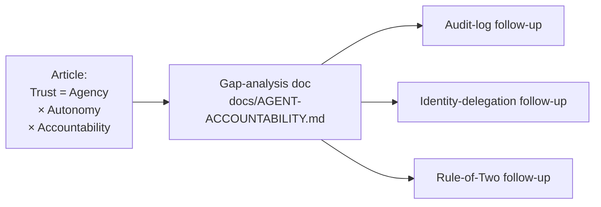
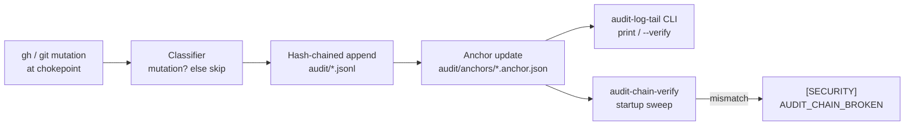
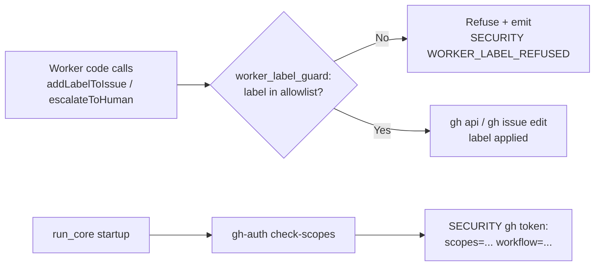
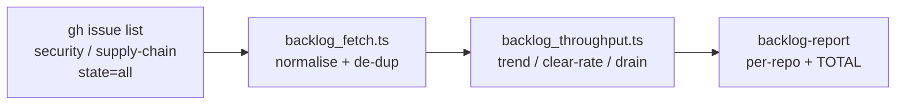

# 🛡️ Agent Accountability — Gap Analysis

This document compares the safeguards proposed in Chris Farris's
[AI Agent Accountability](https://www.chrisfarris.com/post/agent-accountability/)
article (Trust = Agency × Autonomy × Accountability) against the current
behaviour of the Vibe Coder when it is running unattended.

It is the foundation for three follow-up sub-issues spun out of
 — one per
in-scope theme.

## Scope



### In scope — three themes

1. **Tamper-proof audit log** — can the operator reconstruct, after the
   fact, what the agent did and why, even if the agent (or an attacker
   on the worker host) wanted to hide it?
2. **Identity delegation** — when the worker mutates GitHub state, is
   the actor it acts as traceable back to a specific host, run, and
   responsible human?
3. **Rule of Two** — does a single compromised component (the worker
   process, the GitHub PAT, or any one human) concentrate enough
   capability to push code to production by itself?

### Out of scope (called out explicitly so the doc's scope is self-evident)

- **Sandboxing / credential-isolation review.** A full review of the
  worker's shell sandbox, network egress controls, and credential
  isolation is deferred — parent issue explicitly excludes it.
- **Further one-way-door gate hardening beyond the existing label
  hand-off.** The current model — a trusted human applies
  `planning` / `work-on`, and a trusted human merges the PR — is treated
  as the satisfied "human one-way-door gate". The improvements below
  harden the *traceability* around that gate; they do not replace it
  with a different gate.

## Theme 1 — Tamper-proof audit log

### Article's safeguard

The article argues that an autonomous agent must produce an audit trail
the operator can trust after the fact. The trail must capture *what*
the agent did and *why*, and it must be tamper-evident — an attacker
who compromises the agent host (or the agent itself) should not be able
to silently rewrite history. In practice that means writing the trail
to a sink the agent cannot rewrite (append-only storage, an external
log service, or a cryptographically chained ledger), and writing
enough context (prompt text, model, inputs, decision branches taken)
that a reviewer can re-derive the agent's reasoning.

### Current Vibe Coder behaviour

- Per-iteration structured logs are emitted to local
  `worker-N.log` / `run_core.log` files via
  [`worker/deno/lib/logger.ts`](../worker/deno/lib/logger.ts) —
  INFO/WARNING/ERROR levels, structured `key=value` context, plus
  dedicated `[SECURITY]`, `[SKIP]`, `[TIMING]`, `[SCAN_SUMMARY]` and
  `[WORKER_SUMMARY]` event kinds.
- **Timestamp convention — every log source emits UTC with a trailing
  `Z`.** This is a cross-source invariant, not the Deno logger's alone:
  the shell helpers must emit UTC-`Z` too. All four sources that write
  worker logs are aligned:
  - [`worker/deno/lib/logger.ts`](../worker/deno/lib/logger.ts)
    `formatTimestamp` — `getUTC*` fields plus a literal `Z`
    (`YYYY-MM-DD HH:MM:SSZ`).
  - the Deno worker driver's bootstrap prelude
    ([`run_bootstrap.ts`](../worker/deno/lib/run_bootstrap.ts)) —
    `date -u +%Y-%m-%dT%H:%M:%SZ` equivalents; the worker-log preamble also
    announces `(Worker timestamps are UTC)`.

  **Why (negative result,).** Before this convention the
  worker log alternated between local AEST and *unlabelled* UTC — line
  12 read `07:45:15` and line 13 read `21:45:16` for the same instant,
  with no marker for the switch — which made timeline reconstruction
  nearly impossible. Because the mismatch spanned multiple log sources
  (the Deno logger stripped its `Z`; the shell helpers used local
  time), fixing only the Deno half would have left the timeline
  ambiguous. The rule is therefore all-or-nothing: a single source that
  drops the `Z` or falls back to local time re-introduces the
  unreadable timeline, so **every** shell and Deno log source must emit
  UTC-`Z`.
- Size-based rotation lives in
  [`worker/deno/lib/log_rotation.ts`](../worker/deno/lib/log_rotation.ts);
  count-based rotation of `worker-N.log` files is driven by `run_core.ts`.
- GitHub itself is the primary external audit sink: every claim,
  comment, label change, PR open/merge/close, and issue close is a
  permanent, externally-hosted event on the issue or PR timeline. The
  worker footer (see
  [`worker/deno/lib/worker_identity.ts`](../worker/deno/lib/worker_identity.ts))
  stamps each comment with the worker's display name.
- Security-relevant events are emitted explicitly: untrusted operational
  label changes (`[SECURITY] [UNTRUSTED_LABEL_CHANGE]` from
  [`label_security.ts`](../worker/deno/lib/label_security.ts)),
  untrusted PR comments
  ([`comment_trust_filter.ts`](../worker/deno/lib/comment_trust_filter.ts)),
  rate-limited comment authors
  ([`comment_rate_limiter.ts`](../worker/deno/lib/comment_rate_limiter.ts)),
  and stuck heartbeat / recovery decisions
  ([`heartbeat_recovery_audit.ts`](../worker/deno/lib/heartbeat_recovery_audit.ts)).
- Prompt templates live one per type
  ([`prompts/<type>/prompt.md`](../prompts/)) and each run logs the
  checkout's short commit hash, so the exact prompt body used for any
  past run is recoverable from git history.

### Gap

The local log files are written by the same process that the worker
runs Claude in. There is **no tamper-evident sink** — an attacker with
shell access on the worker host (or a future bug that mis-routes
output) can edit `worker-N.log`, truncate `run_core.log`, or simply
delete files between rotations and lose the evidence. There is also
**no per-run reasoning trace**: the worker logs decisions in prose, but
the log does not currently record, in machine-readable form, the
inputs that led each decision branch to be taken (which prompt
version, which model, which tool calls Claude actually invoked, which
files it read and wrote). Reconstructing the full
*what-and-why* of an old run today means cross-referencing local logs,
the GitHub timeline, and the prompt git history by hand.

### Actionable improvements

- **Forward a structured copy of the worker log to an external sink** —
  GitHub Actions artefacts, an org S3 bucket, or a managed log service
  — so a host compromise cannot silently rewrite history. The transport
  should be append-only from the worker's point of view (one-way write
  credential, no delete permission).
- **Stamp every log line with a run-correlation id** (worker unique id
  + iteration counter + timestamp) so a reviewer can join local-log,
  external-sink, and GitHub-timeline records together without
  guessing.
- **Emit a per-issue "decision record"** at PR-open time — a
  machine-readable JSON document committed alongside the PR summary in
  `docs/archive/pr-summaries/pr-summary-NNNN.json` (or attached to the
  PR as a comment) capturing: prompt type and version, model and
  effort, claimed branch, tool calls made by Claude (count and high-level
  category), files touched, and the explicit `Closes #NNNN`
  reference. The existing per-PR summary already records the *what* in
  prose — the JSON record adds the structured *why*.
- **Cryptographically chain the security events** — extend
  `logger.security()` to write each `[SECURITY]` line into a
  separate `worker-security-N.log` file whose entries each include the
  hash of the previous line (a lightweight Merkle-style chain). A
  tampered or truncated chain is then detectable by a one-line check.
- **Add a `verify-log-chain` quality check** that runs against the
  archived security log on every worker startup and fails loudly if
  the chain has been broken.

### Implementation

The highest-impact audit-log improvements above are implemented as a
**tamper-evident, hash-chained journal of every GitHub mutation** the
worker performs.

**What is journalled.** Mutations are detected at the two central
subprocess chokepoints, so a new call site needs no extra wiring:

- `spawnGh()` in
  [`worker/deno/lib/gh_spawn.ts`](../worker/deno/lib/gh_spawn.ts) — every
  `gh` invocation, including those made via `runGhCommandRaw()` in
  [`worker/deno/lib/github.ts`](../worker/deno/lib/github.ts). A classifier
  records only state-changing commands (comment posted, PR
  opened/merged/closed/edited, issue opened/closed/edited/labelled, label
  created/deleted, milestone created via `gh api -X POST`, etc.); read-only
  commands (`view`, `list`, a GET `gh api`, a GraphQL query) are skipped.
   made this a real chokepoint: ~20 modules used to spawn `gh`
  themselves and were journalled nowhere, and the `gh spawn chokepoint`
  quality check now fails the build on any direct
  `new Deno.Command("gh", …)` outside `gh_spawn.ts`.
- `runGitCommand()` in
  [`worker/deno/lib/git_timeout.ts`](../worker/deno/lib/git_timeout.ts)
  — `git push` (commits pushed). Every other (local) git sub-command is
  ignored. The sub-command is located past git's own value-carrying globals
  (`-C`, `-c`, `--git-dir`, `--work-tree`, `--exec-path`, `--namespace`), so
  `git -C /repo push` is journalled like a bare `push`; an
  unrecognised leading global fails closed — a `push` anywhere in the vector
  is journalled rather than silently dropped.

The classifier lives in
[`worker/deno/lib/audit_mutation_classifier.ts`](../worker/deno/lib/audit_mutation_classifier.ts);
the best-effort chokepoint hooks live in
[`worker/deno/lib/audit_hook.ts`](../worker/deno/lib/audit_hook.ts) and
never throw — a journalling failure can never abort or perturb the
mutation it is recording.

**Per-entry fields.** Each entry records the ISO 8601 timestamp, the
run-correlation id (`VIBE_RUN_ID`, joining to), repo, target
(issue/PR number, branch, or API endpoint), action verb, outcome
(`success`/`error`), the process exit code, and the caller code path
(`worker/deno/lib/<file>.ts`, resolved from the stack), plus the chain
fields `prevHash` and `hash`.

**Storage — outside the worker's repo working tree.** Entries are
appended to `${WORK_DIR}/audit/audit-<workerId>-YYYY-MM-DD.jsonl`,
rotated daily and partitioned per worker. Because the journal lives
under `${WORK_DIR}/audit/` — a sibling of, never inside, any cloned
repo — a bug in the worker that rewrites a repo's history cannot rewrite
its own audit log. `audit` is a **reserved work-root name**
([`stale_workdir.ts`](../worker/deno/lib/stale_workdir.ts)), as are the
`audit.roster.jsonl` and `audit.roster.seen` sidecars beside it — and any
`audit.roster.jsonl.torn-<n>` a repair preserved (Issue #1202) — so no
housekeeping sweep — tier reclaim, stale-workdir scan, worktree cleanup or
the 90%-disk `nukeWorkDir` — may delete the trail. Before Issue #337 it
tiered as a disposable clone and was pruned, and the sweep below then
reported the erasure the worker itself had caused.

**Tamper detection.** Each entry's `hash` is
`SHA-256(prevHash + "\n" + canonical-payload)`, linking it to its
predecessor (the first entry chains from the empty string). A modified
entry fails the hash check; a deleted interior entry fails the
`prevHash` linkage check. Verification is a single pass over the file.
Appends are serialised through an in-process async mutex so the chain
stays consistent under concurrent writes, and the per-worker filename
avoids cross-worker contention.

**Chain anchor — truncation and deletion.** The chain alone
only detects *interior* edits: lop off the last three entries and the
surviving prefix still chains perfectly, and deleting the file leaves
nothing to check. Every append therefore also updates a **chain anchor**
([`worker/deno/lib/audit_anchor.ts`](../worker/deno/lib/audit_anchor.ts))
holding the record count and head hash outside the journal, at
`${WORK_DIR}/audit/anchors/<journal>.anchor.json`:

- A journal shorter than its anchor → `journal truncated`.
- A journal whose anchored entry no longer carries the anchored hash →
  `anchor head hash mismatch`.
- A journal that has vanished while its anchor survives → `journal deleted`.
- A journal with **no** anchor at all → `chain anchor missing`. Absence of a
  success marker is not success, so this is a failure, not a
  clean result.

A missing chain is no longer absorbed as a fresh start: `recordMutation`
refuses to append onto a journal that disagrees with its anchor, and the
refusal is logged loud by the chokepoint hook
(`[SECURITY] [AUDIT_JOURNAL_REFUSED]`) rather than swallowed. A journal
written before the anchor existed is adopted **explicitly** by an operator
(`deno task audit-chain-verify --adopt`), and adoption re-walks the chain
first so a tampered file can never be blessed.

**Damage quarantines, it does not stop the trail (Issue #361).** When the
day's journal exists and still disagrees with its anchor once an interrupted
append has been settled (Issue #1074, below) — truncated, rewritten, appended
past the anchored head, or torn before it — it is left
**exactly as found** and a fresh segment is opened beside it,
`audit-<worker>-<date>.s1.jsonl`, whose first entry records what was
quarantined and why. A `[SECURITY] [AUDIT_JOURNAL_QUARANTINED]` line names
both files.

Nothing is laundered: the damaged journal keeps its own anchor, stays on the
roster, and keeps failing the sweep as loudly as before, because the file
carrying the damage is never written to again. What changes is that recording
continues. Previously the append was refused and journalling on that host
stopped dead — on GRQ-23 on 2026-08-25 one torn line at entry 31 meant every
later `gh` and `git` mutation logged
`[SECURITY] [AUDIT_JOURNAL_REFUSED]` and went unrecorded while the worker
carried on mutating GitHub. An audit trail that stops recording when it is
damaged fails in the wrong direction: the damage is in the past, the mutations
it stops attesting are in the future.

The one exception is a journal with **no anchor at all** — the pre-#3712 case
`--adopt` exists for. That still refuses, because opening a segment beside it
would strand the chain the operator is about to adopt.

**An interrupted append heals itself; damage still needs a signature
(Issue #1074).** A journal line and its anchor are two files and cannot be
written atomically, so a run killed between them left a chain that failed the
sweep and asked an operator to sign the kill off with
`--acknowledge-damage`. That is the wrong ask: a control that routinely wants a human to wave damage
through is one that gets waved through unread, and the chain exists precisely
so that tampering is distinguishable from ordinary breakage.

What the cause turned out to be is worth recording, because the two candidate
causes needed opposite fixes. SIGKILLing a live writer 34 times produced a
**complete unanchored entry** in 5 of them and a **torn line in none**: a
single `write(2)` of one line to a regular file is not interruptible, so a
partial line comes from below the process — an unflushed page cache lost with
the machine, or a short write from a full or failing volume — and never from
a kill. A source check confirmed the other hypothesis was not it either:
`audit_journal.ts` holds the only append to a *journal* in the tree — the
roster sidecar beside it is the one other appender, and is not the file that
broke — and the lock breaker could not fire under two minutes. Either way, torn bytes land
**past the anchored head**, because the anchor is only advanced after the
append returns.

So the writer now declares each append in its anchor before making it —
`pending: { hash, startedAt }`, naming the entry by its chain hash
([`audit_append_recovery.ts`](../worker/deno/lib/audit_append_recovery.ts)).
That one fact makes recovery decidable, and the table below is the whole
policy. **Self-healing** outcomes are reported on the sweep as
`[SECURITY] [AUDIT_APPEND_RECOVERED]` and counted in the summary; everything
else is `[SECURITY] [AUDIT_CHAIN_BROKEN]` and still needs
`--acknowledge-damage`.

| On disk | Verdict |
| --- | --- |
| Declared append, journal still at the anchored length | **nothing to do** — the chain already agrees with its anchor |
| Declared append, one further line that *is* the declared entry | **heals** — completed, entry kept |
| Declared append, one further line that is *torn* (unterminated or unparseable) | **heals** — discarded to a `.torn-<n>` sidecar |
| Declared append, one further line that *parses* but is not the declared entry | **signature** — a kill cannot write a whole entry nobody declared |
| Unterminated, unparseable trailing bytes, no declaration (pre-#1074 journal) | **heals** — discarded to a `.torn-<n>` sidecar |
| A further line that parses, with no declaration | **signature** — the forged-tail shape (#3949) |
| Journal missing, anchor says zero entries and declares an append, journal **on the roster** | **signature** — an erasure, not a writer killed before its first line |
| More than one line past the anchor | **signature** — never one interrupted append |
| Any change at or before the anchored head | **signature** — rewritten, truncated, torn middle |
| Journal or anchor missing | **signature** — `--acknowledge-loss`/`--acknowledge-damage` |

Four properties make the self-heal safe to have at all. Only bytes **past the
anchored head** are ever touched, and the anchored head is the last position
the chain was confirmed at, so nothing verified can be dropped. Discarded
bytes are **moved, not deleted** — into
`audit-<worker>-<date>.jsonl.torn-<n>` beside the journal — and the log line
names how many bytes went where. A tail that claims the declared hash must
also **re-derive** it from its own payload, so satisfying a pending record
with different content is a SHA-256 second preimage, not a forgery. And a
journal an operator has already **signed for** is never healed, on the sweep
path *and* on the write path: the signature is pinned to its exact bytes, so
repairing it would lapse that signature and turn a closed finding back into a
red one.

Two of those rows are narrower than they first look, and deliberately so. A
declaration is **not** a licence to discard whatever is past the anchor: a
crash can leave nothing, the declared entry whole, or the declared entry torn,
but it can never leave a *complete, parseable* entry the writer never set out
to append. Only a forger can do that — so a whole line that is not the
declared entry keeps its signature requirement, and a stale `pending` (left by
any writer killed after declaring) cannot be used to launder a forged tail
into a clean sweep. For the same reason the "killed before its first line"
row is decided by the **roster** (#3949) rather than by the anchor: the anchor
is plain JSON an attacker may rewrite, so "no entries, one in flight" is also
what an erasure looks like once it has tidied up. `addToRoster` runs only
after an append has landed, which makes the roster the independent witness —
a journal that ever held an entry is on it for good.

**A torn roster line heals the same way (Issue #1202).** The roster beside the
journal is appended to by `addToRoster`, `markRosterSeen` and both
acknowledgement writers, and it was still using a plain append with no
recovery. A torn line there is worse than a torn journal line because it is
not scoped to one journal: `readRosterContents` throws, so the sweep failed
for the **whole directory**, and both acknowledgement exits read the roster
before they do anything, so neither applied. That left no documented exit at
all — only hand-editing the tamper-evidence file, which is exactly what
Issue #359 established must never be the remedy.

The roster needs no write-ahead declaration: it is append-only and every line
stands alone, so there is no head to advance and nothing for a `pending`
record to disambiguate. Only the one shape a short write can leave is
repaired ([`audit_roster_recovery.ts`](../worker/deno/lib/audit_roster_recovery.ts)):

| Final roster line on disk | Verdict |
| --- | --- |
| Newline-terminated, whatever it holds | **signature** — the writer finished; a kill did not do this |
| Unterminated but complete, parseable JSON | **signature** — the forged-line shape; a missing newline must not launder it |
| Unterminated and unparseable | **heals** — discarded to `audit.roster.jsonl.torn-<n>` |

The same four safety properties as the journal repair hold. Nothing before
the last complete line is touched; the discarded bytes are **moved, not
deleted**, into a `.torn-<n>` sidecar that housekeeping is forbidden to sweep
([`stale_workdir.ts`](../worker/deno/lib/stale_workdir.ts)); the repair
refuses to truncate a roster that grew underneath it, so a live writer's line
cannot be destroyed; and the repair is announced as
`[SECURITY] [AUDIT_ROSTER_RECOVERED]` and named in the sweep summary, never
folded silently into "OK". The sweep and both acknowledgement exits go
through the same repair, so the exit an operator is sent to is reachable
after the kill that made them need it.

**Clearing the lock the same kill left (Issue #1074).** The abandoned lock
and the damaged chain arrive together — the kill has to land inside the
critical section to damage the chain — so the next run has to clear both, and
the recovery above cannot run until it does.

A lock is broken immediately only when its holder is *provably* gone
([`file_lock.ts`](../worker/deno/lib/file_lock.ts)). That needs the record to
name the same host this process runs under, because pids are namespaced per
container and a `ps` miss on another container's pid would be a live holder's
lock stolen; and it needs `ps -p` to report that pid gone, asked once per
contended acquisition, and serialised by a short-lived `<lock>.break` lock so
that two contenders cannot both condemn the same dead holder and the second
then remove the *winner's* fresh lock.

A lock file naming **no** holder is **never** broken early. An earlier
revision broke one on its second sighting, on the reasoning that the op
creating and filling the file was too narrow to survive two polls. It is not:
creation was `open(O_CREAT|O_EXCL)` and then a separate `write`, and a holder
descheduled between the two reads as ownerless for as long as it is off the
CPU — present-but-empty in 265 of 961 sightings when measured, and wider under
load, so two polls a millisecond apart both landed inside it and a live
holder's lock was broken. The lock record is now published atomically with
`link(2)` from a temp file, so a lock file carries its holder from the instant
it exists; an ownerless one is unreachable in new writes, and a legacy or
genuinely abandoned one is left to the age rules below.

Past the stale age the age rule decides, and there the change runs the other
way: only a **conclusive** liveness answer now protects a lock. The probe
used to stat `/proc`, which Deno refuses without `--allow-all`; the worker
runs on granular permissions, so the stat threw, the catch read that as
"assume alive", and every abandoned lock survived to the twenty-minute
hard-stale backstop — twenty minutes of mutations that could not be
journalled, after every kill.

**Scheduled verification.** `deno task audit-chain-verify`
([`worker/deno/commands/audit_chain_verify.ts`](../worker/deno/commands/audit_chain_verify.ts))
sweeps every chain under the audit directory — enumerating anchors as well
as journals, so a deleted journal is still inspected — and exits non-zero
with a `[SECURITY] [AUDIT_CHAIN_BROKEN]` line per failure. It runs as the
**first** startup housekeeping step
([`run_housekeeping.ts`](../worker/deno/lib/run_housekeeping.ts)), so every
worker start re-verifies its own audit trail before any cleanup step
touches the work directory.

```bash
deno task audit-chain-verify                   # sweep + verify every chain
deno task audit-chain-verify --base-dir /path/to/audit
deno task audit-chain-verify --adopt           # bless pre-anchor journals
deno task audit-chain-verify --json            # machine-readable verdict
deno task audit-chain-verify \
  --acknowledge-loss audit-worker-2026-08-21.jsonl \
  --reason "pruned by the work-volume housekeeping (Issue #337)" \
  --by nleck                                   # sign for an accounted-for loss
deno task audit-chain-verify \
  --acknowledge-damage audit-worker-2026-08-28.jsonl \
  --reason "cross-process append race (Issue #491)" \
  --by nleck                                   # sign for accounted-for damage
```

**Signing for a loss that has been accounted for (Issue #359).** The roster
is append-only and has no forget: a journal it records but that no longer
exists on disk fails the sweep on every worker start, for ever. That is
correct for an unexplained deletion and wrong for one already investigated.
Hosts swept by the Issue #337 bug had three journals deleted by the worker
itself; the fix stopped further losses but could not undo those, so
`audit-chain-verify` stayed red with no exit but hand-editing the very file
that is the tamper evidence. A permanently-red integrity alarm is a broken
integrity alarm — the next genuine deletion just adds a line nobody reads.

`--acknowledge-loss` is the supported exit, and it is deliberately narrow:

- the journal must be **on the roster** — an unexpected journal cannot be
  pre-acknowledged;
- it must be **absent from disk**, journal and anchor both. A journal that
  is present but truncated, rewritten, or carrying a malformed line is
  never acknowledgeable and keeps failing exactly as before — silencing
  those would be blessing tampering, which `--adopt` has always refused;
- a `--reason` is **required**, and an operator identity is recorded
  (`--by`, defaulting to `VIBE_OPERATOR`/`USER`);
- the acknowledgement is written into the **hash chain first**, as an
  `audit-loss-acknowledged` entry. If that append fails, nothing is
  acknowledged and the alarm keeps sounding.

Nothing is erased. The roster keeps saying the journal existed and gains a
dated, attributed line saying its absence was signed for; every later sweep
still names the loss as `[AUDIT_CHAIN_LOSS_ACKNOWLEDGED]` and counts it in
the summary. It stops being a *failure*, not a *fact*.

This is accountability, not unforgeability, and the distinction is worth
stating plainly: a principal who can append to the roster can already delete
it outright — which trips the complete-erasure alarm instead. What the
acknowledgement changes is that an accounted-for loss becomes a dated,
attributed, reviewable record, so a **new** deletion on that host is once
again the only red line in the sweep.

**Serialising the append (Issue #491).** Every process on a host shares one
journal — the run driver and each child `deno` command it spawns, all
carrying the same inherited `VIBE_RUN_ID`. The partition in the filename is
per *worker*, never per process, so the trail reads in the order the
mutations happened. What makes that safe is the lock, not the filename:
`recordMutation` holds a cross-process lock over the whole audit directory
([`file_lock.ts`](../worker/deno/lib/file_lock.ts)) across **both** journal
selection and the append, and reads the chain head from disk inside it.

The head is deliberately never cached. It used to be — a module-level `Map`
seeded on first use — with an in-process promise queue standing in for a
lock. Neither crosses a process boundary, so a second writer advanced the
file while the first held a stale head and then chained on top of it. On
GRQ-23 that orphaned the head hash in 10 of 14 journals, and each quarantine
segment opened beside the damage broke the same way. A lock file older than
two minutes whose holder is no longer running is broken as abandoned, loudly
(`[SECURITY] [AUDIT_LOCK_BROKEN]`); a live holder is never evicted.

**Signing for damage to a journal that is still there (Issue #491).**
`--acknowledge-loss` refuses a journal that is present but does not verify,
and that refusal is right — it is exactly the shape tampering takes. But it
left the ten damaged GRQ-23 journals with no exit at all: fixing the writer
stops new damage and cannot repair old files, and repairing them is the last
thing anyone should want, because they are the evidence.

`--acknowledge-damage` is the exit for that case, and it is narrower than
the loss path:

- the journal must be **on disk**. A journal that is gone is a loss, and
  `--acknowledge-loss` is where that is signed for;
- it must **actually fail** verification. A journal that verifies has
  nothing to sign for — accepting one would let an operator pre-sign a file
  they were about to damage;
- the signature is **pinned to the journal's exact bytes**: the roster line
  records the SHA-256 of the file as signed for, and the sweep honours the
  signature only while the file still hashes to it. Any later edit — even
  one leaving the chain just as broken — brings the alarm back, saying the
  signature no longer applies;
- a `--reason` is **required**, an operator identity is recorded, and the
  act is chained **first**, as an `audit-damage-acknowledged` entry written
  to the currently-writable journal. The damaged one is never appended to,
  re-anchored, or removed.

Later sweeps name it as `[AUDIT_CHAIN_DAMAGE_ACKNOWLEDGED]` and count it in
the summary as *acknowledged as damaged*. As with a loss: it stops being a
failure, not a fact. The two verbs are kept distinct on purpose — signing
that a journal is corrupt must never silence one that was deleted, and a
roster line carrying `kind: "damage"` is refused as a loss signature.

**Inspection CLI.** `deno task audit-log-tail` (the
`audit-log-tail` command,
[`worker/deno/commands/audit_log_tail.ts`](../worker/deno/commands/audit_log_tail.ts))
pretty-prints or streams the journal and verifies the chain:

```bash
deno task audit-log-tail                       # today's journal, this worker
deno task audit-log-tail --date 2026-05-29 --limit 50
deno task audit-log-tail --file /path/to/audit-host-2026-05-29.jsonl
deno task audit-log-tail --verify              # report chain integrity
deno task audit-log-tail --json                # raw JSON lines
```

`--verify` exits non-zero when the chain is broken, so it doubles as the
operator's manual integrity check.



The startup `verify-log-chain` gate is now implemented as the
`audit-chain-verify` housekeeping step. The remaining
bullets above (external append-only sink, per-issue decision record) stay
as documented follow-ups beyond this initial journal.

## Theme 2 — Identity delegation (traceability of GitHub mutations)

### Article's safeguard

When an agent mutates state on a system that has its own auth model
(GitHub, a cloud provider, a SaaS app), every mutation must be
attributable not just to "the agent" but to *the specific run, host,
and responsible human* who delegated to it. Anything less and a
post-incident review cannot say which laptop, which cron run, or which
operator's decision a given push belongs to — and a stolen credential
cannot be scoped down to the minimum capability and rotated without
collateral damage.

### Current Vibe Coder behaviour

- The worker authenticates to GitHub via a single Personal Access Token
  (PAT) bound to a dedicated service account. The login is determined
  dynamically by `gh api user` against the configured `gh_config_dir`
  (see `docs/SWITCHING-IDENTITY.md`).
- Within a single deployment, *all* workers share the one GitHub login.
  The hostname is appended to a worker unique id used for atomic-claim
  tie-breaking
  ([`worker/deno/lib/worker_identity.ts`](../worker/deno/lib/worker_identity.ts)
  — `getWorkerUniqueId()` returns `workerName@hostname`).
- Every comment and PR body carries a footer that names the worker
  (`🤖 Processed by: <displayName>`) via `buildWorkerFooter()`.
- The trusted-author set identifies which humans are authorised to
  delegate work — only issues authored by those users (or carrying a
  trusted `work-on` label) are picked up. That set is each monitored repo's
  write collaborators minus the Vibe Coder logins and bots (Issue #1066)
  ([`worker/deno/lib/config.ts`](../worker/deno/lib/config.ts) and
  [`work_on_content_integrity.ts`](../worker/deno/lib/work_on_content_integrity.ts)).
- Operational labels (`planning`, `work-on`, `needs-revision`, etc.)
  are guarded by
  [`label_security.ts`](../worker/deno/lib/label_security.ts): a
  timeline check identifies which actor last added each label, and any
  label added by an untrusted user is stripped on the next scan.
- `needs-human` hand-offs are forced through
  [`needs_human_escalation.ts`](../worker/deno/lib/needs_human_escalation.ts)
  which guarantees a same-run comment explaining *why* the label was
  applied.

### Gap

The on-the-wire GitHub actor for every mutation is the **shared
service account**. Reading a `pushed`, `commented`, or `labeled` event
on a GitHub timeline tells the reviewer *the worker did this* — it does
**not** tell them *which host*, *which iteration of `run_core`*, or
*which delegating human's issue* this push belongs to. The information
exists locally (the worker unique id, the iteration counter, the
delegating human's GitHub login on the originating issue) but it does
not propagate into the GitHub mutation itself in a structured,
greppable way. Today the footer carries the worker's display name, but
not the host, the run-correlation id, or the delegating human — and
the footer is prose, not a stable machine-readable field. The PAT is
also single-purpose: revoking it because one host was compromised
takes down the whole fleet.

### Actionable improvements

- **Stamp every worker-authored comment, PR body, and commit trailer
  with a structured delegation block.** Extend
  `buildWorkerFooter()` to emit a fenced key/value block carrying
  `worker-id=<workerName@host>`, `run-id=<iteration-correlation-id>`,
  `delegated-by=@<issue-author>`, and `prompt=<type>:v<N>`. Keep the
  human-readable line, but add the structured block underneath so
  scripts can parse it.
- **Add a `Trailer:` line to every worker commit** carrying the same
  delegation block (Git's existing `git interpret-trailers` machinery
  picks them up). A reviewer running `git log --format=%(trailers)`
  can then list every commit by host or delegating human without
  hand-cross-referencing GitHub.
- **Issue per-host GitHub Apps (or scoped fine-grained PATs) instead
  of one shared classic PAT.** A per-host token narrows the blast
  radius of a single laptop compromise and surfaces the host directly
  in GitHub's audit log (the actor on each event becomes the
  host-bound App installation rather than the shared service account).
  Document the rotation playbook alongside
  `docs/SWITCHING-IDENTITY.md`.
- **Record the delegating human on the worker side** at claim time.
  `claim_issue.ts` already reads the issue author for the trusted-author
  check — persist that author into the claim state so every subsequent
  comment and commit on that issue can carry the `delegated-by` field.
- **Add a "trace this PR" doc section** so a reviewer can read a single
  PR and follow the chain back: PR → issue (closing keyword) → claim
  state → host log → external log sink → the checkout's commit hash
  (which pins the prompt text that ran). Today the
  chain exists but is undocumented.

### Implemented — run-id traceability

The run-id half of the actionable improvements above is now in place.
Every GitHub mutation the worker performs carries a canonical **run
id** — the join key between the GitHub timeline and the worker logs:

- **Canonical run id.** [`worker/deno/lib/run_id.ts`](../worker/deno/lib/run_id.ts)
  generates a `vibe-<base36 ms>-<6 hex>` id once per worker invocation.
  the Deno worker driver's bootstrap prelude resolves the run id at startup
  and exports it as `VIBE_RUN_ID`, so every child `deno` command (and every
  commit Claude makes) reads the same id via `getRunId()`.
- **Commit trailer.** `commitAndPushPending`
  ([`git_push.ts`](../worker/deno/lib/git_push.ts)) appends a
  `Vibe-Coder-Run-Id: <id>` trailer to every worker-authored commit and
  rejects (via `assertRunIdTrailer`) any commit message lacking it. The
  coding-guidelines prompt
  ([`prompts/coding_guidelines/`](../prompts/coding_guidelines/), from
  v25 onward) makes the trailer mandatory for Claude-authored commits.
  A reviewer can then list commits by run with
  `git log --format='%(trailers:key=Vibe-Coder-Run-Id)'`.
- **Comment + PR-body footer.** `buildWorkerFooter`
  ([`worker_identity.ts`](../worker/deno/lib/worker_identity.ts)) adds a
  greppable ``🏷️ Run id: `vibe-...` `` line beneath the worker display
  name whenever a `runId` is supplied.
- **Issue creates.** The idle-task filer
  ([`commands/maybe_file_idle_task.ts`](../worker/deno/commands/maybe_file_idle_task.ts))
  appends a fenced `run-id: <id>` metadata block to every filed
  security-scan, best-practices, test-audit, github-actions-audit, and
  idle-task wrapper issue body.

Still open from the list above: per-host GitHub Apps / scoped tokens,
persisting the delegating human into claim state, and the structured
`worker-id` / `delegated-by` / `prompt` block. See
`SWITCHING-IDENTITY.md` for
how the run id interacts with identity migrations.

## Theme 3 — Rule of Two (capability concentration)

### Article's safeguard

No single principal — neither a human, nor a service account, nor an
agent process — should hold enough capability to push code to
production unobserved. Borrowing from the classic two-person rule, any
production-impacting action should require at least two independent
confirmations: the agent proposes; a separate principal disposes. The
test is *"if this one thing is compromised, can the attacker reach
prod?"* — and the answer must be no.

### Current Vibe Coder behaviour

- **The default branch is never pushed to directly.** The worker
  always works on a feature branch and opens a PR
  ([`docs/OVERVIEW.md` §10](OVERVIEW.md) — *"Nothing goes to the default
  branch without your review"*). A trusted human merges the PR; the
  worker has no auto-merge path on the default branch.
- **Operational labels are human-only.** Every workflow-changing label
  (`planning`, `work-on`, `top-priority`, `low-priority`,
  `needs-revision`, `best-model`, `question`) must be applied by a
  trusted human. The worker's service account is *not* on the
  trusted-author allowlist, so any operational label the worker
  applies to itself is silently stripped by `label_security.ts` on the
  next scan. The lone exception is `idle-task`, which
  the framework requires.
- **The trusted-author allowlist gates work intake.** Only issues
  authored by `allowed_authors` are picked up
  ([`config.ts`](../worker/deno/lib/config.ts)); content-integrity
  verification on `work-on` issues
  ([`work_on_content_integrity.ts`](../worker/deno/lib/work_on_content_integrity.ts))
  prevents an attacker from rewriting an issue body after the label is
  applied.
- **Pre-commit safety gates** block secret-bearing hidden files
  ([`gitignore_enforcer.ts`](../worker/deno/lib/gitignore_enforcer.ts)
  + the pre-commit safety gate from) and a `--no-verify`
  bypass is explicitly forbidden by the coding guidelines.
- **Quality gate must pass before PR open**
  ([`quality.sh`](../quality.sh) → `worker/deno/quality.ts`): lint,
  type, tests, Liquid, markdownlint
  must all be green or the PR is not created. (Shell-script linting is
  delegated to each target repo's own CI —.)
- **Comment author trust** is enforced
  ([`comment_trust_filter.ts`](../worker/deno/lib/comment_trust_filter.ts)
  +
  [`comment_rate_limiter.ts`](../worker/deno/lib/comment_rate_limiter.ts))
  so PR feedback from untrusted commenters does not steer the worker.

### Gap

The "second human" in the Rule of Two is the PR reviewer at merge
time — that gate is intact and *not* in scope to change. The gap is
that the *first* principal — the worker — currently holds, on a single
host, **a PAT that can push to any monitored repo, comment as the
service account on any monitored issue, and add the `idle-task`
label**. If that PAT is exfiltrated, an attacker can author PRs that
look exactly like the worker's; the only thing standing between those
PRs and the default branch is the human merge gate. That gate is
strong, but the Rule of Two argues for a second, independent
"capability scope" check on the worker side too: even if the PAT is
stolen, the attacker should not be able to do *anything* the worker
itself cannot already do on this run. Today the PAT is broader than
that — it has push to every monitored repo on every run.

### Actionable improvements

- **Scope the worker's GitHub token to the smallest capability set
  that satisfies the current run.** A fine-grained PAT (or GitHub App
  installation token) restricted to *just* the repo it is currently
  working on, with `contents:write` and `pull_requests:write` only,
  reissued at the start of each run. An exfiltrated token then expires
  with the iteration and cannot push to a different repo.
- **Treat the `idle-task` label as the only worker-appliable label
  and enforce that at the API level**, not only at the prompt level.
  Add a runtime check that fails the run loudly if the worker ever
  calls `addLabel()` with anything other than the `failed`,
  `failed-once`, `needs-human`, `needs-screenshot`, or
  `idle-task` labels.
- **Require a second, independent signal before opening a PR that
  touches `worker/deno/lib/label_security.ts`,
  `gitignore_enforcer.ts`, `needs_human_escalation.ts`,
  `comment_trust_filter.ts`, or any file under `prompts/`.** Mark
  those paths as "sensitive": a worker PR that modifies any of them
  must be raised with the `needs-human` label so a person triages
  before review begins, even though the merge gate would catch them
  anyway. This is defence-in-depth — a compromised worker should not
  be able to silently weaken the very files that constrain it.
- **Cap the number of consecutive worker-authored commits to a
  protected branch** (default + every milestone branch) per 24-hour
  window. If the worker tries to push more than the cap, it stops and
  files `needs-human`. A compromised PAT is then automatically
  rate-limited; a normal week of legitimate work stays well under the
  cap.
- **Publish the worker's `gh` token scopes at startup** in a
  `[SECURITY]` log line so a reviewer can see, from the log, exactly
  what capability the run actually had. If the deployment ever
  upgrades to broader scopes by accident, the change is visible in
  the chain-of-custody log.

### Implemented — runtime guard + capability map

The label-allowlist half of the actionable improvements above is now in
place, along with a published capability map of every OAuth scope the
worker token holds.

**Runtime label-allowlist guard.**
[`worker/deno/lib/worker_label_guard.ts`](../worker/deno/lib/worker_label_guard.ts)
exports `isWorkerAppliableLabel(label)` and
`assertWorkerCanApplyLabel(label, { caller })`. The guard is wired into
`addLabelToIssue` in
[`label_operations.ts`](../worker/deno/lib/label_operations.ts) and into
the two call sites that reach the labels API without it (Issue #13):
`escalateToHuman` in
[`needs_human_escalation.ts`](../worker/deno/lib/needs_human_escalation.ts),
which guards the label before `ghClient.addLabel` (the escalation comment
is still posted when the label is refused), and `ghClientFromCommandFn` in
[`label_clarification.ts`](../worker/deno/lib/label_clarification.ts),
whose `addLabel` now delegates to `addLabelToIssue`. Every worker label
mutation therefore passes through the guard before the `gh api` /
`gh issue edit` call. A refused mutation emits a
`[SECURITY] [WORKER_LABEL_REFUSED]` line and returns the refusal up the
stack so the caller never opens a follow-up retry. `label_security.ts`
remains the *next-scan stripping* defence; the guard adds an *in-process,
pre-call* defence so a prompt regression or compromised dependency cannot
land an operational label on an issue even once.

The positive allowlist (literal labels + prefixes) is:

| Class | Literal labels | Prefix patterns |
|---|---|---|
| Failure tracking | `failed`, `failed-once` | — |
| Worker → human handoff | `needs-human`, `needs-screenshot` | — |
| Idle framework | `idle-task` | — |
| Performance close-out | `negative-result` | — |
| Scan content tags | `best-practices`, `security`, `test-audit`, `github-actions-audit` | `severity:`, `lang:`, `supply-chain:` |

Every other label — `top-priority`, `work-on`, `low-priority`,
`planning`, `refine-issue`, `question`, `answered`, `needs-revision`,
`best-model`, plus any unknown label — is refused at the API call
boundary.

**Token-scope publication at startup.** The Deno worker driver
([`run_worker.ts`](../worker/deno/lib/run_worker.ts)) invokes the
`gh-auth check-scopes` logic at startup and logs the result with
a `[SECURITY]` prefix:

```
[SECURITY] gh token: scopes=repo,workflow,read:org,user workflow=yes repo=yes
```

The line is greppable in every `run_core.log`, so a reviewer can confirm
from the log alone exactly which capabilities the worker held on that
run. A surprise upgrade to a broader scope is now visible in the
chain-of-custody trail without any external tooling.

**Worker token capability map (as of).** Every OAuth scope
on the worker token is justified against at least one concrete code
path; nothing on this map is unused.

| Scope | Used by | Why |
|---|---|---|
| `repo` | every push, PR open, issue mutation in `worker/deno/lib/git_push.ts`, `github.ts`, `claim_issue.ts` | Read/write code, manage issues, manage PRs. The single largest scope on the token. |
| `workflow` | pushes that touch `.github/workflows/*.yml` (CI fixes, github-actions-audit follow-ups) | Without `workflow`, the push API rejects workflow-YAML edits. Verified at startup by `gh-auth check-scopes`. |
| `read:org` | `gh api user` and trusted-author allowlist lookups (`config.ts`) | Resolve the worker's own login and read org membership for the allowed-authors gate. |
| `user` | `gh api user` returning `login`, used by `worker_identity.ts` for footers and atomic claims | Identity self-discovery; no write semantics. |
| `admin:public_key` (operator-only, not on the worker token in production) | `gh ssh-key add` during identity migration only | Documented in `SWITCHING-IDENTITY.md` Step 1 — recommended to mint a short-lived operator PAT for the migration rather than carry it on the long-lived worker token. |

**Workflow `permissions:` blocks.** Every `.github/workflows/*.yml` in
this repo now declares a `permissions:` block. The four pre-existing
workflows (`gitleaks.yml`, `markdown-lint.yml`, `pages.yml`,
`semgrep.yml`) were already minimised; `validate-scripts.yml` had no
block and inherited the org default, so added an explicit
`permissions: contents: read` to it — the workflow runs only static
checks (bash syntax, shellcheck, actionlint, `deno check`/lint/test) and
needs no write capability.

Still open from the list above: per-host GitHub Apps / scoped tokens
(coordinated with 's identity-delegation work), the
`needs-human`-on-sensitive-paths defence-in-depth check, and the
commit-cap rate limiter. Those are tracked as follow-up work beyond this
initial guard + capability map.



## How the three themes interact

The three themes reinforce each other. The audit log makes the
identity-delegation trail readable after the fact; identity delegation
gives the audit log something specific to point at; the Rule of Two
narrows the blast radius the audit log has to cover. None of the
proposed improvements changes the existing human one-way-door gate
(humans add `planning`/`work-on`, humans merge PRs) — they harden the
traceability around that gate so that when the gate does its job a
reviewer can prove it.

## Backlog & throughput observability

Accountability is not only "what did the agent do" — it is also "is the
agent keeping pace". The security-remediation backlog grows whenever the
scan templates (security-scan, supply-chain-readiness, etc.) file
findings faster than the worker closes them. The `backlog-report`
command makes that balance visible so an operator can answer the single
question **"is the security backlog stable or growing?"** from `gh`
issue data alone — no new infrastructure.

### What it reports

For each monitored repo (and a `TOTAL` rollup), over a rolling window
(default 7 days):

- **Open findings by severity** — `high` / `medium` / `low` / `unknown`,
  derived from the `severity:*` label.
- **Open findings by age** — `<7d`, `7–30d`, `>30d` since creation.
- **Clear-rate** — findings closed in the window, and the per-day
  average.
- **Backlog trend** — open-count now vs one window ago, reported as
  `rising` / `falling` / `flat`. This is the single number that answers
  "are we keeping up?".
- **Projected drain time** — backlog ÷ clear-rate, or `never` when the
  clear-rate is zero.

A finding is any issue carrying the `security` label or a
`supply-chain*` label (`supply-chain-readiness`,
`supply-chain:quarantine-missing`,
`supply-chain:quarantine-misconfigured`).

### Usage

```bash
deno task backlog-report                       # every repo in .config.json
deno run mod.ts backlog-report --repo org/repo # one repo
deno run mod.ts backlog-report --window 14     # 14-day window
```

### Design

The trend / projection maths is pure and lives in
[`worker/deno/lib/backlog_throughput.ts`](../worker/deno/lib/backlog_throughput.ts)
(no I/O), so it is tested against fixture issue sets. The historical
open-count is reconstructed from each issue's `createdAt` / `closedAt`:
an issue was open at instant *t* if it was created at or before *t* and
either still open or closed after *t*. The live `gh` gathering and
JSON normalisation lives in
[`worker/deno/lib/backlog_fetch.ts`](../worker/deno/lib/backlog_fetch.ts);
the thin command wiring is
[`worker/deno/commands/backlog_report.ts`](../worker/deno/commands/backlog_report.ts).



## Cross-references

- Parent issue:.
- Backlog observability:
  (part of).
- Article: <https://www.chrisfarris.com/post/agent-accountability/>.
- Related operator docs:
  [`SECURITY.md`](../SECURITY.md),
  `SWITCHING-IDENTITY.md`,
  [`SECURITY-SCAN.md`](SECURITY-SCAN.md),
  [`IDLE-TASK-FRAMEWORK.md`](IDLE-TASK-FRAMEWORK.md).
