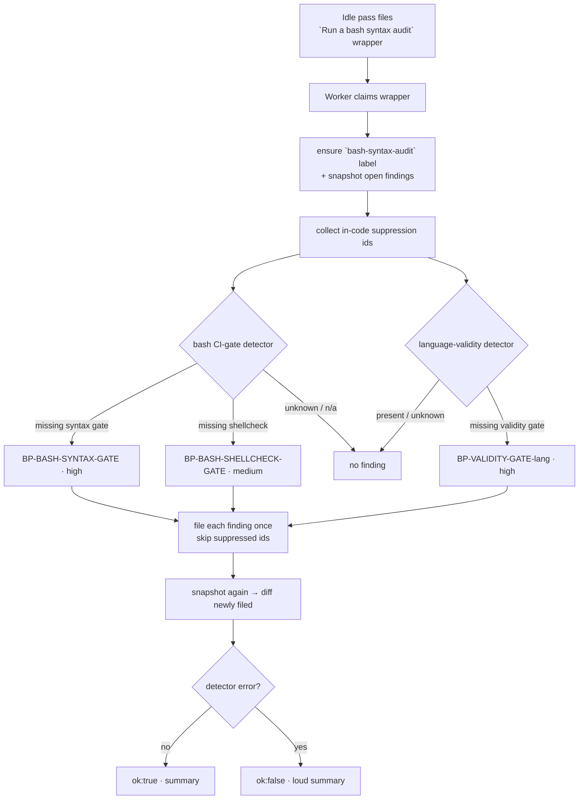

# 🐚 Bash Syntax Audit Scans — Operator Manual

This document is the operator-facing reference for the Vibe Coder's **bash
syntax audit**. The intent is documented in the parent issue (require
`bash -n` + `shellcheck` CI gates in all repos, verified by an idle audit) and
built by the sibling sub-issues: the bash CI-gate detector, the native
language-validity detector, and this template + manual.

The bash syntax audit is **template #12 of the idle-task framework** — the
generic mechanism for "things the worker does when no claimable work exists".
The framework owns filing, dedup, label discipline, and claim routing; this
document covers the audit-specific behaviour layered on top. See
[`docs/IDLE-TASK-FRAMEWORK.md`](IDLE-TASK-FRAMEWORK.md) for the framework manual
and the lifecycle diagram common to every template, and
[`docs/GITHUB-ACTIONS-AUDIT-SCAN.md`](GITHUB-ACTIONS-AUDIT-SCAN.md) for the
sibling template that this manual mirrors structurally.

For the **agent-facing** rules (label policy, suppression syntax) see
[DESIGN-PRINCIPLES.md → Bash syntax audit scans](../DESIGN-PRINCIPLES.md#bash-syntax-audit-scans-template-12).

## Why a dedicated weekly audit

Bash has **no compile step**, so an invalid bash script can regress into a
repository with no quality gate catching it. That is the exact FLEET regression
that motivated: broken scripts reached the default branch and no gate
flagged them, because — unlike compiled languages — bash is never type-checked.

The fix is per-repo and **layered**:

- **Repo CI is the enforcing gate.** Each monitored repository commits its own
  gate script (the FLEET `quality/bash_syntax.sh` pattern) so its CI blocks any
  pull request whose bash scripts fail `bash -n`, with `shellcheck` alongside.
- **This audit verifies the gate exists.** A Vibe Coder idle-task audit checks
  every monitored repo has those gates plus a native check/compile step for its
  other languages, and raises an issue where one is missing.

Repositories are **absolutely isolated**: there is no shared cross-repo
reusable Action. The audit only verifies presence and raises an issue; each
repo owns and commits its own gate, and that fix rides a normal `work-on`
pipeline PR later. Rollout is audit-driven — the audit is built first and no
proactive per-repo sub-issues are filed (Round 2 Q2).

A weekly cadence (`cooldownHours: 168`) matches how rarely CI configuration
changes.

## Design intent — native, deterministic, issue-only

The audit is **deterministic and native** — two Deno detectors drive the core
checks, so **no Claude invocation is involved**. The prompt at
[`prompts/bash_syntax_audit/`](../prompts/bash_syntax_audit/) is used only as
the human-style wrapper body, so an operator can paste it into a
fresh `idle-task` issue titled `Run a bash syntax audit` and the worker runs it
identically.

**No PR, ever.** The template sets `skipMilestone: true`, mirroring the other
scan templates. Each missing gate is filed as its own GitHub issue; the wrapper
is closed with `no findings` or `Bash syntax audit complete. Filed N issues: …`
and nothing else.

## The two detectors

| Detector | Module | Checks |
| --- | --- | --- |
| **Bash CI gate** | [`bash_ci_gate_scanner.ts`](../worker/deno/lib/bash_ci_gate_scanner.ts) | Discovers the repo's bash scripts (`*.sh` / `*.bash` and bash-shebang files), then checks `.github/workflows/*` for a `bash -n` / `sh -n` **syntax** gate and a `shellcheck` **lint** gate. A step invoking a committed gate script (e.g. `./quality.sh`, `quality/bash_syntax.sh`) counts — the script's committed contents are inspected. |
| **Language validity** | [`language_validity_gate.ts`](../worker/deno/lib/language_validity_gate.ts) | For each other main language (Rust, TypeScript, React, Java, Python), checks a native basic-validity step is wired into CI — `cargo check`, `deno check` / `tsc --noEmit`, `mvn compile` / `gradle compileJava`, `python -m py_compile`. Basic validity only (does it compile / parse), not style or lint. |

### What counts as a *main* language (Issue #3)

Presence alone does not make a language a main language. A language is
considered main only when it holds at least **5 %**
(`MAIN_LANGUAGE_MIN_SHARE`) of the repository's measured bytes, taken from the
same GitHub Languages API counts the best-practices bucket picker uses.

A Rust repository whose only TypeScript is a single fixture-generation script
(0.1 % of its bytes) has no TypeScript worth type-checking, so demanding a
`deno check` gate there is a false positive — the audit asks for a gate on
something that does not exist. The share threshold keeps genuine polyglot
repositories in scope while excluding one-off helper scripts.

### Fail-safe (never a false positive)

Both detectors distinguish **missing** from **unknown**:

- A repo with **no bash scripts** is *not applicable* — no bash finding.
- A language below the **main-language share threshold** above is *not
  applicable* — no validity-gate finding for an incidental helper script.
- A repo with **no loaded workflows** or an **unparseable workflow** leaves the
  affected gate *unknown* — no false "missing gate" finding (the
  zero-workflow fail-safe).

Only a *definite* missing gate yields a finding.

### Fail-loud (never a silent green)

A detector that cannot run (a directory-walk or file-read failure) surfaces as
a loud `ok: false` summary on the wrapper issue — an audit that cannot complete
is **never** reconciled as "no findings".

## Bash conventions and gotchas

This is the canonical home for the durable bash portability conventions the
project follows — the audit checks that a repo *has* a `bash -n` gate, and these
are the mistakes that gate is there to catch.

### `set -u` empty-array expansion (Bash 3.2)

The project runs under `set -euo pipefail` and must support **macOS's Bash
3.2**. On Bash 3.2, a bare `"${arr[@]}"` on an **empty** array is treated as an
*unbound variable* and aborts the script under `set -u` (nounset). Newer Bash
(4.4+) does not, so this fails only on macOS — a class of bug that recurred
across several PRs.

Always expand a possibly-empty array with the guarded form, never the bare one:

```bash
# ✗ aborts under `set -u` on Bash 3.2 when arr is empty
for x in "${arr[@]}"; do ...; done

# ✓ safe — expands to nothing when arr is empty, unchanged otherwise
for x in "${arr[@]+"${arr[@]}"}"; do ...; done
```

Equivalently, guard the access with `if [[ ${#arr[@]} -gt 0 ]]; then`. The
`validate-scripts.yml` workflow greps for unguarded expansions as a CI check, so
a new bare `"${arr[@]}"` is caught before merge.

## Findings — one issue per missing gate

| Gate class | Stable finding id | Severity |
| --- | --- | --- |
| Missing `bash -n` / `sh -n` syntax gate | `BP-BASH-SYNTAX-GATE` | `high` — invalid bash reaching the default branch is the exact regression this audit prevents. |
| Missing `shellcheck` gate | `BP-BASH-SHELLCHECK-GATE` | `medium` — the lint gate; error-level findings block at rollout, warnings tighten later (Round 2 Q1). |
| A main language missing its native validity check | `BP-VALIDITY-GATE-<language>` | `high` — mirrors the best-practices compile-gate severity. |

Each finding **leads with the fix**: it names the missing gate and gives the
concrete CI invocation to add. Every finding carries exactly the
`bash-syntax-audit` label plus one `severity:*` label — the worker applies no
workflow label (`label_security.ts` strips accidents on the next scan).

### Dedup

Each gate class has a stable `BP-`-prefixed id, and `fileFindingOnce` skips a
gate that already has an **open** issue — one missing gate never yields two open
issues. The look-up is repo-wide (Issue #539): the `finding-id` marker is the
key, so an open duplicate still suppresses the re-file after the issue is
relabelled or triaged into `needs-human`. A closed prior issue does not block
re-filing, so a genuinely recurring gap re-files.

## In-code suppression

A finding can be suppressed with the shared idle-task grammar — a
`best-practice-ignore: <finding-id>` comment. For a gate finding the natural
home is a `#` comment in a `.github/workflows/*` file, e.g.:

```yaml
# best-practice-ignore: BP-BASH-SYNTAX-GATE — author=nigel expires=2026-12-31 this repo has no bash scripts of
# its own; the only *.sh are vendored fixtures excluded from CI.
```

The audit collects suppressed ids from the workflow files and skips them on
future runs.

## Lifecycle



## Cadence, cap, and labels

- **Cadence.** At most once per week per repo (`cooldownHours: 168`).
- **Cap.** One issue per missing gate. There is no overflow tracker — the next
  scan re-detects any still-missing gate.
- **Labels.** Exactly `bash-syntax-audit` + one `severity:high|medium` — no
  `lang:*` label (single-scope).

## No PR, ever

The template is issue-only. It never opens a pull request or edits a file —
each repo commits its own gate through the normal `work-on` pipeline once a
human confirms intent.
