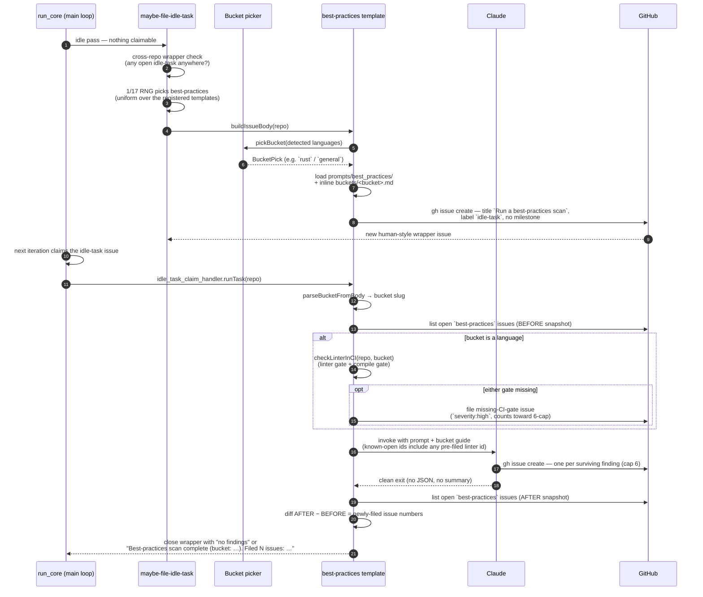

# 📐 Best-Practices Scans — Operator Manual

This document is the operator-facing reference for the Vibe Coder's
LLM-driven best-practices review. The intent is documented in the
parent issue and the sub-issues that built it: bucket picker,
linter-in-CI check extended by to also enforce a compile/syntax gate
, prompt + bucket guides, template, 50/50 dispatch
, and this manual.

The best-practices scan is **template #2 of the idle-task framework**
— the generic mechanism for "things the worker does when no claimable
work exists". The framework owns filing, dedup, label discipline,
and claim routing; this document covers the best-practices-specific
behaviour layered on top. See
[`docs/IDLE-TASK-FRAMEWORK.md`](IDLE-TASK-FRAMEWORK.md) for the
framework manual and the lifecycle diagram common to every template,
and [`docs/SECURITY-SCAN.md`](SECURITY-SCAN.md) for the sibling
template that this manual mirrors structurally.

For the **agent-facing** rules (label policy, suppression syntax,
trigger summary) see
[DESIGN-PRINCIPLES.md → Idle-task scans](../DESIGN-PRINCIPLES.md#security-scans-simplified-by).

## Design intent — LLM-only review of code

The best-practices scan is an **evidence-backed static review**
performed entirely by Claude. The orchestrating prompt at
[`prompts/best_practices/`](../prompts/best_practices/)
instructs Claude to read the source tree, apply the per-bucket
checklist, and file each surviving finding as its own GitHub issue.

**Linters and compilers only ever *corroborate* here.** From prompt
v7 a bucket guide may nominate a **read-only language
analyser** — today only the `rust` guide does, nominating `cargo
clippy` and `cargo check` — which the scan may run to corroborate a
candidate when the checkout builds offline. The relaxation is bounded:
repo logic (`cargo run`, `cargo test`, `npm test`, `bash`, …) stays
forbidden, every finding still carries its own file/line citation, and
an analyser that cannot run (no toolchain, no offline registry cache)
degrades to grep/read static evidence — a failed or skipped run is
never reported as a clean result. Both cross-bucket checks below stay
static-evidence only regardless.

The CI-gate check (described below) is a *configuration* check — it
inspects
`.github/workflows/*.yml` to see whether the standard linter and the
standard compile/syntax gate for the chosen language are wired up.
It does not actually run either tool. A repository with a perfectly
configured Clippy + `cargo check` pipeline will still be reviewed for
ownership, lifetimes, and error-handling discipline by the LLM;
conversely, a repository missing either gate will get a high-severity
finding pointing that out, regardless of how clean the code itself
is.

This split keeps the scan complementary to existing CI infrastructure:
linters catch mechanical regressions on every push, and the LLM scan
surfaces the *judgement calls* (architectural smells, missing
abstractions, weak error handling) that linters cannot see.

The CI-gate check reads the workflow files from the repo's **checked-out
root** — `${workDir}/${repoName}`, where `workDir` is the parent
directory that holds every clone. Passing the parent `workDir` directly
 made the check read a non-existent `.github/workflows`,
load zero workflows, and file a false `BP-LINTER-<bucket>` finding even
when the repo's workflows ran both gates. The call site now derives the
checkout path via `repoCheckoutPath()`, and `loadWorkflows()` logs a
`[linter-in-ci] loaded 0 workflows …` diagnostic distinguishing a
missing directory from a genuinely workflow-free repo.

The two cross-bucket checks added from v3 onward — **dead
dependencies** and **deprecated config on framework bump**
 — are also **static-evidence only**. The scanner reads
manifests (`package.json`, `Cargo.toml`, `pom.xml`, `build.gradle`,
`deno.json`, `next.config.*`, `tsconfig.json`) and greps the source
tree for the relevant import / use sites; it does **not** invoke
`cargo`, `npm`, `pnpm`, `yarn`, `tsc`, `next`, `gradle`, or `mvn`.
Findings without both a manifest citation and a "where imports were
searched" citation are dropped at Phase 3 triage.

From v8 onward the prompt opens with the shared
[Phase 0 — Adapt to the project](IDLE-TASK-FRAMEWORK.md#phase-0--adapt-to-the-project)
stanza: the scan reads the target repo's `README.md`, agent instructions,
`CONTRIBUTING.md`, and `docs/` style guide first, and a **documented**
project convention beats a check below — so the header-policy and
unsigned-commit escape clauses in the `general` bucket finally have a
policy to read. An unsafe convention is still filed as a finding against
the convention itself.

## Check coverage

The orchestrating prompt (`prompts/best_practices/`, from v3 onward)
frames three cross-bucket concerns at the orchestrator level. Each is
named once in the prompt; the per-language detection sits in the
matching bucket guide under
[`prompts/best_practices/buckets/`](../prompts/best_practices/buckets/).

- **Supply-chain hardening.** Pin-to-immutable-artefact
  hygiene, install-time hardening (`--ignore-scripts`-by-default),
  quarantine of external deps, anomalous-publish detection,
  provenance-as-defence-in-depth, workflow scope minimisation, and
  the "treat coding-agent tool calls as build-time code execution"
  rule. Per-language detection lives in the
  `typescript`, `rust`, `java`, `react`, `aws-cloudformation`, and
  `terraform` bucket guides, which carry lockfile-pinning and
  lifecycle-script allowlisting. The GitHub Actions side of
  supply-chain hardening (40-character SHA pinning, per-job
  `permissions:` minimisation, `pull_request_target` justification)
  moved to the weekly
  [`github-actions-audit`](GITHUB-ACTIONS-AUDIT-SCAN.md) scan
  and is no longer a best-practices bucket.
- **Dead dependencies.** Declared dependencies with no
  source-import reference are flagged so the manifest stays an honest
  record of what the code actually uses. The check is static-evidence
  only (manifest line + import-grep cite) and clamped to
  `severity:low`/`medium`. Detection lives in
  [`buckets/typescript.md`](../prompts/best_practices/buckets/typescript.md),
  [`buckets/rust.md`](../prompts/best_practices/buckets/rust.md), and
  [`buckets/java.md`](../prompts/best_practices/buckets/java.md). The
  `github-actions` bucket is deliberately out of scope — workflow-dep
  hygiene is owned by the github-actions-audit work.
- **Deprecated config on framework bump.** Config
  fields that became no-ops or removed-option warnings after a
  framework bump (TypeScript, Next.js, React, Spring Boot, Gradle,
  Maven) are flagged at `severity:medium`. The check reads the
  framework version from the manifest first — a field is not
  "deprecated" in the abstract, only against a specific version.
  Per-bucket catalogues live in
  [`buckets/typescript.md`](../prompts/best_practices/buckets/typescript.md)
  (TS 5.x `compilerOptions` removals),
  [`buckets/react.md`](../prompts/best_practices/buckets/react.md)
  (Next.js 14/15 and React 18/19 removals), and
  [`buckets/java.md`](../prompts/best_practices/buckets/java.md)
  (Gradle 7+, Spring Boot 3.x, unversioned Maven plug-ins). The
  `github-actions` bucket is again out of scope; workflow-config
  deprecations are owned by the github-actions-audit scan.

### Rust bug-class checks

[`buckets/rust.md`](../prompts/best_practices/buckets/rust.md) carries
the nine original idiom/hygiene checks plus fourteen **bug-class
clusters** distilled from the shapes that recur across the ~1,078
RustSec advisories: unsafe boundary, memory safety, panic DoS,
recursion DoS, error-handling flow, logic correctness, concurrency
(locking and data races), async runtime, FFI boundary, type layout,
path/TOCTOU, resource and destructor handling, pointer exposure, and
static hygiene.

Each cluster is **capability-gated** — `has_unsafe`, `has_ffi`,
`has_concurrency`, `has_async`, `has_packed_repr`, `has_fs_io` — so a
cluster whose pattern is absent from the crate produces zero findings
and the scan never speculates about code that is not there. The FFI
cluster is additionally boundary-scoped: it applies only to `extern`
items, `extern "C"` functions, `#[no_mangle]` exports, and their
direct helpers — never repo-wide. The wording is our own; no external
review plugin is vendored, installed, or invoked.

### Rust build profiles

[`buckets/rust.md`](../prompts/best_practices/buckets/rust.md) also
carries three **build-profile** checks, so a Rust repo compiles as
fast as possible in development and produces the fastest possible
artefact on release:

- `[profile.dev]` sets `debug = "line-tables-only"` and keeps the
  default `opt-level = 0` + incremental compilation — anything that
  slows a rebuild without a written justification is flagged;
- `[profile.release]` sets `opt-level = 3`, `lto = "fat"`, and
  `codegen-units = 1` at the **workspace root** (`lto = true` is the
  same setting; `lto = "thin"` is not);
- `-C target-cpu=native` for binaries built and run on the same host,
  via a target-scoped `.cargo/config.toml` `rustflags` entry or the
  build's `RUSTFLAGS` — never for published crates, libraries consumed
  elsewhere, `wasm32` targets, or artefacts copied to another machine.

The guidance is **stable-Rust only**: the nightly parallel front-end
(`-Zthreads`) and the Cranelift backend are named as out of scope so
the scan cannot file a finding that would break a repo's pinned
toolchain. Findings are `severity:low`, one per manifest. `.cargo/config.toml`
joins `*.rs` and `Cargo.toml` in the bucket's file scope for this check;
per repo isolation the manifest edits themselves ride each
repo's own PR.

## Idle trigger



The flowchart below summarises the same flow as a decision tree.

```mermaid
flowchart TD
    classDef gate fill:#fef3c7,stroke:#b45309,color:#1f2937;
    classDef phase fill:#dbeafe,stroke:#1d4ed8,color:#1f2937;
    classDef output fill:#dcfce7,stroke:#15803d,color:#1f2937;
    classDef skip fill:#fee2e2,stroke:#b91c1c,color:#1f2937;

    Idle[Idle trigger<br/>run_core: nothing claimable]

    Idle --> Pick{1/17 RNG over the<br/>registered idle-task templates}
    Pick -- best-practices --> Bucket[pickBucket — SLOC-weighted<br/>across detected languages<br/>+ general at dominant weight]
    Bucket --> FileWrapper[File wrapper issue<br/>title: 'Run a best-practices scan'<br/>label: idle-task<br/>no milestone — skipMilestone: true]:::output
    FileWrapper --> Claim[Next iteration<br/>claims the idle-task issue]
    Claim --> Before[Snapshot 1 — list open<br/>`best-practices` issues BEFORE]:::phase
    Before --> Lang{bucket is a language?}
    class Pick,Lang,CIGate gate;
    Lang -- general --> Run[Invoke Claude<br/>read-only static review]:::phase
    Lang -- language --> CIGate{CI-gate check:<br/>linter AND compile gates<br/>both invoked in CI?}
    CIGate -- both present --> Run
    CIGate -- either missing --> FileLinter[File missing-CI-gate issue<br/>severity:high — names which gate(s)<br/>missing — counts to 6-cap]:::output
    FileLinter --> Run
    Run --> Cap[Triage — drop unbacked,<br/>dedup, suppress, cap at 6<br/>missing-linter > high > medium > low]:::phase
    Cap --> FileFindings[Phase 4 — gh issue create<br/>labels: best-practices, lang:&lt;bucket&gt;, severity:&lt;level&gt;]:::phase
    FileFindings --> After[Snapshot 2 — list open<br/>`best-practices` issues AFTER]:::phase
    After --> Diff[Template diff:<br/>AFTER − BEFORE = newly filed]:::output
    Diff --> Close[Close wrapper with summary<br/>'no findings' OR<br/>'Best-practices scan complete (bucket: X). Filed N issues: …'<br/>never raises a PR]:::output
```

## Wrapper issue layout

The wrapper issue is **human-style** — no hidden marker,
no parameters block. Anyone can paste the same prompt into a fresh
issue with the `idle-task` label and the worker will run it
identically.

- **Title:** the literal string `Run a best-practices scan`. Dispatch
  matches the title to
  [`bestPracticesTemplate.buildIssueTitle(repo)`](../worker/deno/lib/idle_task_templates/best_practices_template.ts).
- **Body:** the latest `prompts/best_practices/vN.md` template with
  the three placeholders substituted at file time — `{{BUCKET}}`,
  `{{SUPPRESSED_IDS}}`, `{{KNOWN_OPEN_FINDING_IDS}}` — plus the
  matching `prompts/best_practices/buckets/<bucket>.md` guide inlined
  under a `## Bucket Guide — <bucket> (inlined)` section so the
  wrapper is fully self-contained.
- **Bucket marker line:** a single `**Bucket:** `<bucket>`` line at
  the top of the body. `runTask()` recovers the bucket from this line
  on claim (`parseBucketFromBody` in
  [`best_practices_template.ts`](../worker/deno/lib/idle_task_templates/best_practices_template.ts)).
- **Label:** the canonical `idle-task` label. No workflow labels;
  no `lang:*` or `severity:*` labels on the wrapper itself.
- **No milestone** — the template sets `skipMilestone: true`, so the
  wrapper never gates a milestone-merge PR.

## Bucket-pick algorithm

`pickBucket()` in
[`worker/deno/lib/best_practices_bucket_picker.ts`](../worker/deno/lib/best_practices_bucket_picker.ts)
chooses the bucket at file time using a SLOC-weighted random pick:

1. **Detect languages** for the target repo via the GitHub Languages
   API plus marker-file byte counts for buckets the Languages API does
   not surface (GitHub Actions YAML, CloudFormation, Terraform, React
   markers).
2. **Weight each detected supported bucket** by its byte count from
   `RepoLanguages.raw` (a KISS SLOC proxy — bytes correlate strongly
   with SLOC within a single ecosystem).
3. **Add `general`** as a single bucket whose weight equals the
   dominant detected language's weight, so it competes on par with
   the largest language present.
4. **Draw uniformly** over the cumulative weight to pick the bucket.

The TypeScript vs React decision is mutually exclusive: the bucket is
`react` only when `package.json` declares a React dependency AND at
least one `.jsx`/`.tsx` file is present; otherwise the TypeScript
byte count flows to the `typescript` bucket.

The RNG is injectable so tests can drive a deterministic distribution.
Production uses `Math.random`.

## Buckets — per-language scope

> **GitHub Actions has its own weekly scan.** Workflow and
> composite-action review is **not** a best-practices bucket. It moved
> to the dedicated weekly
> [`github-actions-audit`](GITHUB-ACTIONS-AUDIT-SCAN.md) template
>, so the buckets below cover application and
> infrastructure code only.

Each bucket has a dedicated guide under
[`prompts/best_practices/buckets/`](../prompts/best_practices/buckets/)
that names the canonical references (linked, never restated) and
lists the per-bucket checks. The LLM is constrained to review only
that bucket's material on a given run; out-of-bucket concerns belong
to that bucket's own run.

| Bucket | Targets | Canonical guides | Inline checklist |
| ------ | ------- | ---------------- | ---------------- |
| `rust` | `*.rs`, `Cargo.toml`, `.cargo/config.toml` | [The Rust Book](https://doc.rust-lang.org/book/), [Rust API Guidelines](https://rust-lang.github.io/api-guidelines/), [Rustonomicon](https://doc.rust-lang.org/nomicon/) | [buckets/rust.md](../prompts/best_practices/buckets/rust.md) |
| `typescript` | `*.ts`, `tsconfig*.json` (excludes `.tsx`) | [TypeScript Handbook](https://www.typescriptlang.org/docs/handbook/intro.html), [`tsconfig` reference](https://www.typescriptlang.org/tsconfig), [`typescript-eslint` rules](https://typescript-eslint.io/rules/) | [buckets/typescript.md](../prompts/best_practices/buckets/typescript.md) |
| `react` | `*.tsx`/`*.jsx` importing `react` | [React docs](https://react.dev/), [Rules of Hooks](https://react.dev/reference/rules/rules-of-hooks) | [buckets/react.md](../prompts/best_practices/buckets/react.md) |
| `java` | `*.java`, `pom.xml`, `build.gradle` | Effective Java, Google Java Style | [buckets/java.md](../prompts/best_practices/buckets/java.md) |
| `html` | `*.html` and HTML literals | WAI-ARIA, WCAG, HTML living standard | [buckets/html.md](../prompts/best_practices/buckets/html.md) |
| `aws-cloudformation` | CFN templates (YAML/JSON with `AWSTemplateFormatVersion`) | [cfn-lint](https://github.com/aws-cloudformation/cfn-lint), [AWS CFN user guide](https://docs.aws.amazon.com/AWSCloudFormation/) | [buckets/aws-cloudformation.md](../prompts/best_practices/buckets/aws-cloudformation.md) |
| `terraform` | `*.tf`, `*.tfvars` | [Terraform docs](https://developer.hashicorp.com/terraform/docs), [tflint](https://github.com/terraform-linters/tflint) | [buckets/terraform.md](../prompts/best_practices/buckets/terraform.md) |
| `general` | Repo-level hygiene (no language-specific code) | [Open Source Guides](https://opensource.guide/), [Keep a Changelog](https://keepachangelog.com/), [SemVer](https://semver.org/), [SPDX](https://spdx.org/licenses/), [SLSA](https://slsa.dev/) | [buckets/general.md](../prompts/best_practices/buckets/general.md) |

The `general` bucket is repo-level hygiene only — README, licence,
CI/CD presence, dependency tooling, SBOM/lockfile pinning, repo
structure, **runtime unambiguity** (a mixed Deno+Node
repo earns a single `severity:medium` "choose one runtime or document
the split" finding), **GitHub-native security scanning** (a security-sensitive repo with no code scanning earns a single
`severity:medium` "enable CodeQL / Dependabot security updates"
finding — see below), **branch-protection / CODEOWNERS depth**
(a repo with privileged workflows but no CODEOWNERS
coverage on `.github/workflows/`, or unsigned recent commits, earns a
single finding — `severity:high` for the CODEOWNERS gap on a
privileged-workflow repo, otherwise `severity:medium` — see below),
and **vulnerability-disclosure policy** (a repo with no
`SECURITY.md` in any of the three GitHub-recognised locations earns a
single finding — `severity:low` by default, `severity:medium` for a
repo that publishes a library or service consumed externally — see
below), and **hardcoded success in a production code path**
(a production function that returns a canned success
value or fixture data instead of doing the work earns a finding —
`severity:high` when its result gates a decision, otherwise
`severity:medium` — see below). It does **not** review
language-specific code quality; that belongs to the per-language
buckets.

### GitHub-native security scanning

Complementing the dependency *update* hygiene of general check #5
(Renovate / Dependabot version-bump cadence and quarantine), the
`general` bucket also checks GitHub's "secure by default" *security*
features. The check is **static-evidence only** — it judges from
committed workflow and config file presence, never from a GitHub API
read of repo settings. Where a feature is a repo-level setting that is
not statically visible (push protection, the secret-scanning toggle,
Dependabot alerts) the finding is phrased as a **recommendation**, not
an assertion that the setting is off.

| Feature | Static evidence inspected | Action when absent |
| ------- | ------------------------- | ------------------ |
| Code scanning (CodeQL / SAST) | `.github/workflows/codeql*.yml` (or default-setup equivalent), or an equivalent SAST step (`semgrep`, `snyk code`) in CI | Recommend enabling CodeQL or an equivalent SAST in CI |
| Dependabot *security* updates | `.github/dependabot.yml` enabling security updates, or reliance on Dependabot alerts (distinct from check #5's update cadence) | Recommend enabling Dependabot security updates |
| Secret scanning + push protection | A committed secret-scanning gate (`gitleaks` / `trufflehog` in CI), or a note recommending push protection | Recommend enabling secret scanning with push protection |

A security-sensitive repo missing these earns **one** `severity:medium`
finding (stable `BP-<12 hex>` id, re-detection-safe) listing the
missing features and their remediation. It counts against the
six-issue cap. A repo that already commits a CodeQL workflow and a
secret-scanning gate is silent on this check.

### Branch protection and CODEOWNERS depth

Complementing the CI/CD posture of general check #3 (CI runs on PRs,
required status checks configured), the `general` bucket also flags
deeper governance gaps so a single compromised account cannot quietly
merge changes to `.github/workflows/` — which then run with secrets.
The check is **static-evidence only**: it reads `CODEOWNERS` and the
output of `git log --show-signature` on recent commits. It never
calls the GitHub API to read branch-protection settings; controls
that are repo-level settings (required review, no force-push, linear
history) are phrased as **recommendations**, not assertions that the
setting is off.

The check fires only when the repo has a meaningful surface — any
repo with `.github/workflows/` or `.github/actions/`.

| Control | Static evidence inspected | Action when absent |
| ------- | ------------------------- | ------------------ |
| CODEOWNERS covers `.github/workflows/` | `CODEOWNERS`, `.github/CODEOWNERS`, or `docs/CODEOWNERS` (the three locations GitHub recognises) — pattern matching `.github/workflows/` (and `.github/actions/` where present) | Flag the missing pattern. `severity:high` when the repo has **privileged workflows** (any workflow referencing `secrets.*` other than `GITHUB_TOKEN`, `id-token: write`, a `pull_request_target` trigger, or a self-hosted `runs-on:`); otherwise `severity:medium`. |
| Recent commits are signed | `git log --show-signature -20 origin/<default>` shows `gpg:` / `Good signature` markers on recent commits | Recommend enabling required signed commits at `severity:medium`. Drop the candidate when `CONTRIBUTING.md` explicitly excuses unsigned commits or every recent commit was authored by a single bot account. |
| Required review / no force-push / linear history | Repo-level branch-protection setting — **not** statically visible | Recommend (at `severity:medium`) ≥1 required PR approval, blocking direct push and force-push to the default branch, and enabling linear history where the team uses a rebase / squash workflow. |

A repo with privileged workflows and a meaningful surface earns **one**
finding for this check (stable `BP-<12 hex>` id, re-detection-safe).
Severity is `severity:high` when the dominant gap is missing CODEOWNERS
coverage on `.github/workflows/` for a privileged-workflow repo;
otherwise `severity:medium`. The finding counts against the six-issue
cap like any other. A repo with CODEOWNERS covering
`.github/workflows/`, signed recent commits, and a documented
branch-protection policy is silent on this check.

### Vulnerability disclosure policy

`SECURITY.md` is the canonical, GitHub-recognised place for a repo's
vulnerability **disclosure policy** — how to report a vulnerability
privately, the expected response time, and which versions are
supported. Without it, a reporter has no private channel and defaults
to a public issue, which discloses the vulnerability before a fix
exists. GitHub surfaces the file in the repo's Security tab as a
community-health file. The `general` bucket flags its absence as a
**static-evidence only** check (file presence) — it never calls the
GitHub API.

The check inspects the three locations GitHub recognises for
community-health files: `SECURITY.md` at the repo root,
`.github/SECURITY.md`, and `docs/SECURITY.md`. A repo with the file in
any of the three is silent.

| Repo type | Static signal | Severity |
| --------- | ------------- | -------- |
| Internal / single-consumer repo that ships code | None of the three `SECURITY.md` locations is present | `severity:low` (governance/hygiene default) |
| Repo that publishes a library or service consumed externally | A `package.json` / `Cargo.toml` / `pom.xml` / `pyproject.toml` declaring a public package name, a publish workflow (`npm publish`, `cargo publish`, `mvn deploy`, `docker push`), or an externally consumed API/hosted product | `severity:medium` |

A repo that ships code but has no `SECURITY.md` earns **one** finding
titled *"Add `SECURITY.md` with a vulnerability disclosure policy"*
(stable `BP-<12 hex>` id, re-detection-safe). The body suggests adding
`SECURITY.md` with a private reporting route (GitHub private
vulnerability reporting or a security email), an expected response
time, and a supported-versions table. The finding counts against the
six-issue cap like any other.

### Hardcoded success in a production code path

The **Never Fail Silently — Fail Loud** rule enforced at
PR time has no counterpart that audits an *already-merged* stub, so a
function whose body is fiction can return a green result for weeks —
the shape that produced the FLEET Discovery outage. The `general` bucket
closes that gap: it flags a non-test, non-example function whose spec
implies real work but which returns a canned success value or fixture
data instead. The check is **static-evidence only** (read the source,
never run the code) and language-agnostic, so it runs on every repo in
the fleet.

| Shape flagged | Not flagged |
| ------------- | ----------- |
| A literal `{ ok: true }` / `{"status": "ok"}` / `return true` with no computation behind it | Test files, fixtures, and `example/` / `demo/` / `sample` directories |
| A hardcoded sample record standing in for a fetched or computed one | Factory / builder / seed / mock helpers whose declared purpose *is* canned data |
| A stubbed return under a `TODO` / `FIXME` / "for now" comment | A **documented** default ("returns empty when absent") — an *undocumented* one masking a failed fetch is a finding |
| A `catch` block that converts a failure into a success-shaped value | A genuinely constant answer (version string, feature-flag constant, pure lookup table) |
| Reconciliation that reads the absence of an explicit failure marker as success ('s other half) | |

Severity is `severity:high` when the function sits on a path whose
result gates a decision — a health check, a verification step, a
reconciliation, an authorisation check — and `severity:medium`
otherwise. Each finding cites the file and line range; the suggested
fix is to implement the behaviour or to fail explicitly (throw, exit
non-zero, emit a failure marker), never to return a plausible success.
The finding uses the standard `BP-<12 hex>` id recipe and counts
against the six-issue cap like any other.

> **Retired bucket — `github-actions`.** GitHub Actions
> workflow and composite-action review moved to the dedicated weekly
> [`github-actions-audit`](GITHUB-ACTIONS-AUDIT-SCAN.md) template
>. The daily best-practices scan no longer picks the
> `github-actions` bucket, the linter-in-CI pre-check no longer routes
> it, and the bucket guide was deleted.

## Deno regression prevention

Two buckets cooperate to stop a Deno repo regressing to Node tooling
. A repo is a **Deno repo** when its root holds any of
`deno.json`, `deno.jsonc`, or `deno.lock` — even alongside a
`package.json`. Node-only repos (no Deno marker) are silent on every
check below.

**`typescript` bucket — regression flags.** When the repo
is a Deno repo, the bucket files each of the following at `severity:high`
with a cited path and line range, and a suggested fix that names the
Deno-native equivalent (`deno test`, `deno run`, `deno task`,
`deno bundle`, `deno fmt`, `deno lint`):

| Regression | Suggested-fix recipe |
| ---------- | -------------------- |
| Non-empty `dependencies` in root `package.json` (`devDependencies` is parity, not a regression) | Port the runtime dep to a `jsr:` / `npm:` specifier in `deno.json` imports and drop the `package.json` entry. |
| Committed / un-ignored `node_modules/` | Add `node_modules/` to `.gitignore`, `git rm -r --cached node_modules`, rely on Deno's module cache. |
| CI `run:` steps calling `npm`/`pnpm`/`yarn`/`npx` to run application or test code | Replace with `deno run` / `deno test` / `deno task`. Dev-tooling installs (`npm ci --ignore-scripts`) are acceptable. |
| Root `tsconfig.json` with a non-empty `compilerOptions` overriding Deno | Move the settings into `deno.json`'s `compilerOptions` and delete `tsconfig.json` (or scope it to a Node sub-directory). |
| Node-only bundler configs (Webpack/Vite/esbuild) at the root | Replace with `deno bundle` / `deno task bundle`, or relocate the Node sub-package and its config into a scoped sub-directory. |

**`general` bucket — mixed-runtime finding.** When a Deno
marker **and** a root `package.json` with a non-empty `dependencies`
block are both present, the bucket files **exactly one**
`severity:medium` finding titled *"Repo mixes Deno and Node — choose one
runtime or document the split"*. Its stable id is computed from the
canonical `BP-<12 hex>` recipe (title slug
`repo-mixes-deno-and-node-choose-one-runtime-or-document-the-split`,
primary file `package.json`), so re-runs deduplicate against the
known-open and suppressed lists. The finding **counts against the
six-issue cap** like any other — no exemption — and the body proposes
three fixes: commit fully to Deno and drop the `package.json` runtime
deps; split the Node portion into its own scoped sub-directory; or
document the dual-runtime layout in `README.md`. A repo with only
`devDependencies` (parity tooling) or with no Deno marker is not a
mixed-runtime repo — the bucket files nothing.

## Issue label scheme

Filed best-practices issues carry exactly three labels — no
operational/workflow label is ever added.

| Label | Allowed values | Meaning |
| ----- | -------------- | ------- |
| `best-practices` | (constant) | Always present; used by the dedup and snapshot queries. |
| `lang:<bucket>` | `lang:rust`, `lang:typescript`, `lang:react`, `lang:java`, `lang:html`, `lang:aws-cloudformation`, `lang:terraform`, `lang:general` | The bucket the finding belongs to. Matches the wrapper's bucket marker. |
| `severity:<level>` | `severity:high`, `severity:medium`, `severity:low` | Exactly one per issue. |

Operational labels (`planning`, `work-on`, `top-priority`,
`low-priority`, `failed`, `failed-once`, `needs-human`, `best-model`,
`question`, `refine-issue`) are **never** applied by the scanner.
[`label_security.ts`](../worker/deno/lib/label_security.ts) strips any
such label added by the worker on the next scan, so an accidental
operational label cannot persist.

## 6-issue cap and priority order

A single best-practices run files **at most 6 standalone findings**.
The cap is enforced in two places:

1. **Phase 3 triage in the prompt** — Claude sorts surviving findings
   by severity (high → medium → low) and keeps the top 6.
2. **The Deno-side capper** in
   [`worker/deno/lib/best_practices_capper.ts`](../worker/deno/lib/best_practices_capper.ts)
   re-applies the cap deterministically using the canonical priority
   order:

   > **missing-linter > severity:high > severity:medium > severity:low**

Within the same priority tier the order Claude emitted is preserved.

A language-targeted run with no linter-in-CI gate gives the
missing-linter finding the first slot and leaves five slots for the
LLM. A `general` run skips the linter check entirely and the LLM has
all six slots.

**No overflow tracker.** Unlike the security-scan template, the
best-practices scan does **not** file an overflow tracker when more
than six candidates survive triage. Surplus candidates are silently
dropped from this run; the next scan against the same bucket
re-detects them (subject to dedup against open issues).

## Suppression-comment syntax

A finding can be suppressed in-source by adding the host language's
standard ignore comment with the finding ID and a short reason. The
grammar is recognised by
[`worker/deno/lib/suppression_comments.ts`](../worker/deno/lib/suppression_comments.ts)
and applies on every subsequent run (the suppressed id is
pre-substituted into the `{{SUPPRESSED_IDS}}` placeholder so Claude
drops the finding in Phase 3 triage).

The canonical form is
`best-practice-ignore: BP-<id> — author=<login> expires=<YYYY-MM-DD> <reason>`.
Author, expiry, and reason are all **mandatory**: a marker
missing any of them, carrying a malformed or past expiry, or naming an
author outside a configured allowlist is parsed and reported but never
suppresses. Every marker seen during a run is listed in that run's scan
report as `Active suppressions (N): …` / `Rejected suppressions (N): …`.

Worked examples per language family:

```rust
// best-practice-ignore: BP-1234567890ab — author=nigel expires=2026-12-31 `unwrap()` is safe here:
// the value comes from a literal compiled-in lookup table.
let port = MAP.get("default").unwrap();
```

```typescript
// best-practice-ignore: BP-1234567890ab — author=nigel expires=2026-12-31 `any` is required to bridge
// the third-party SDK whose types are wrong upstream.
function bridge(value: any): MyType { /* … */ }
```

```python
# best-practice-ignore: BP-1234567890ab — author=nigel expires=2026-12-31 broad `except` is required to
# match the framework's contract; the caller logs the exception.
try:
    do_work()
except Exception:
    raise
```

```yaml
# best-practice-ignore: BP-1234567890ab — author=nigel expires=2026-12-31 pinning to a moving ref is
# intentional for this developer-only smoke workflow.
uses: actions/checkout@main
```

```java
// best-practice-ignore: BP-1234567890ab — author=nigel expires=2026-12-31 the catch-all is required
// to satisfy the legacy SPI contract.
catch (Throwable t) { /* … */ }
```

```hcl
# best-practice-ignore: BP-1234567890ab — author=nigel expires=2026-12-31 wildcard egress is required
# for the public CDN bootstrap stage.
egress { cidr_blocks = ["0.0.0.0/0"] }
```

The grammar also accepts `# noqa: BP-…` (Python) and
`// eslint-disable-next-line BP-…` (TypeScript/JavaScript) for
convenience, so an existing ignore comment can carry the BP-id
without adding a second marker.

## CI-gate check (linter + compile)

The CI-gate check is a **configuration audit**, not a linter or
compiler invocation. For each language bucket, the check walks
`.github/workflows/*.yml`/`*.yaml`, parses each workflow with
`@std/yaml`, and inspects every `step.run` and `step.uses` string for
the canonical linter invocation and — where meaningful — the canonical
compile/syntax invocation.

Linter and compile are treated as **two independent gates**. A bucket
passes only when **both** gates are wired up in
`.github/workflows/*.yml`; if either gate is missing, the template
files a `severity:high` finding with stable id `BP-LINTER-<bucket>`.
A linter that incidentally typechecks (e.g. ESLint with
`@typescript-eslint`) does **not** satisfy the compile gate — the
gates are detected independently.

**Rationale.** The compile half was added in after
[`stSoftwareAU/private-repo-19`](https://github.com/stSoftwareAU/private-repo-19/pull/201)
— a simple Deno syntax error reached `main` because no `deno check`
ran in CI. A clean lint pass does not prove the code compiles, so
the two gates are checked separately.

| Bucket | Expected linter | Expected compile/syntax gate | Triggers a "missing CI gate" finding when… |
| ------ | --------------- | ---------------------------- | ------------------------------------------ |
| `rust` | `cargo clippy` | `cargo check` OR `cargo build` | Either the linter gate or the compile gate is not invoked in any workflow. |
| `typescript` | ESLint or `deno lint` | `deno check` OR `tsc --noEmit` | No workflow invokes `deno lint`, AND there is no `.eslintrc*` / `eslint.config.*` at the repo root with a workflow that invokes `eslint`; or neither compile-gate command is invoked. (Deno's built-in `deno lint` needs no config file.) |
| `react` | ESLint or `deno lint` | `deno check` OR `tsc --noEmit` | Same rule as `typescript`. |
| `java` | Checkstyle / SpotBugs / PMD | `mvn compile` OR `gradle compileJava` | None of the three linters has both a config file and a CI invocation, or neither compile-gate command is invoked. |
| `html` | `htmlhint` or `html-validate` | _compile gate not meaningful — linter-only_ | No workflow invokes either linter. |
| `aws-cloudformation` | `cfn-lint` | _compile gate not meaningful — linter-only_ | No workflow invokes `cfn-lint`. |
| `terraform` | `tflint` (preferred) or `terraform validate` + `terraform fmt -check` | _compile gate not meaningful — linter-only_ | Neither linter path is invoked in CI. |

The three buckets marked _linter-only_ (`html`, `aws-cloudformation`,
`terraform`) skip the compile half of the check
because a separate compile/syntax gate is not meaningful for them —
the relevant linter already covers the static-validity surface.

The check is implemented in
[`worker/deno/lib/linter_in_ci_check.ts`](../worker/deno/lib/linter_in_ci_check.ts);
the per-bucket detection rules above mirror the file. When
`configured: false`, the template files a pre-rendered
`severity:high` finding tagged
`best-practices` + `lang:<bucket>` + `severity:high`, with the
stable id `BP-LINTER-<bucket>`. The pre-filed id is added to the
known-open list passed to Claude, so the LLM does not re-emit the
same finding and the run still respects the 6-cap. The rendered
finding title and body name which gate (linter, compile, or both)
is missing so the developer knows which fix to apply.

The check fires only on **language-targeted** runs. The `general`
bucket is repo-level hygiene; the per-language linter and compile
invocations belong to their own bucket's run.

### Fail safe — zero workflows loaded

A count of **zero** workflow files loaded under `.github/workflows/`
is treated as a likely **scan glitch** (wrong path, mid-clone,
checkout race), not a confirmed absence of CI. Filing
`severity:high` off a transient glitch would turn it into a false
high-severity issue on the target repo — exactly what produced the
false finding against
[`stSoftwareAU/private-repo-14`](https://github.com/stSoftwareAU/private-repo-14/issues/2990).

So when `loadWorkflows()` returns an empty list, the check sets
`workflowsLoaded: false` on its `LinterCheckResult` and the template
**suppresses** the `BP-LINTER-<bucket>` finding rather than filing it
high. The gate status is *unknown*, not confirmed-missing. The
genuine case — workflows present but a gate truly missing
(`workflowsLoaded` absent or `true`) — is **unchanged**: it still
files `severity:high`. The same fail-safe applies to the actionlint
(`github-actions`) check in the weekly
[github-actions-audit scan](GITHUB-ACTIONS-AUDIT-SCAN.md).

This is defence in depth: the sibling root-cause fix (parent)
makes the zero-load *stop happening*; this fail-safe makes a zero-load
*harmless* if it ever recurs.

## No PR, ever

A best-practices idle-task **never raises a pull request**, regardless
of outcome. Every finding is filed as a standalone GitHub issue in
the scanned repo; the wrapper idle-task issue is closed with a
summary comment and nothing else. Because the template sets
`skipMilestone: true`, the wrapper is not assigned to any milestone,
so closing it never triggers the milestone-completion → merge-PR flow
that ordinary milestone work uses.

The only artefacts a best-practices run produces are:

1. **New finding issues** filed by Claude itself via `gh issue
   create` from Phase 4 of the prompt, capped at six per run
   (one slot may be consumed by the missing-linter pre-finding).
2. **A closing comment** on the wrapper idle-task issue — either
   `no findings` or `Best-practices scan complete (bucket: <b>).
   Filed N issues: #A, #B, …`.

Auto-remediation is **out of scope** for the scan. Fixes are filed
as ordinary issues that flow through the normal triage → planning →
work-on pipeline, where each fix is implemented and reviewed
individually.

## Related documentation

- [`docs/IDLE-TASK-FRAMEWORK.md`](IDLE-TASK-FRAMEWORK.md) — Framework
  operator manual; lifecycle diagram common to every template.
- [`docs/SECURITY-SCAN.md`](SECURITY-SCAN.md) — Sibling template
  (security audit). This document mirrors its structure.
- [`prompts/best_practices/`](../prompts/best_practices/) —
  Orchestrating prompt (Phases 1–4). The cap, label set, and
  per-finding body shape live in the prompt, not in Deno code.
- [`prompts/best_practices/buckets/`](../prompts/best_practices/buckets/)
  — Per-bucket checklists inlined into the wrapper body.
- [`DESIGN-PRINCIPLES.md`](../DESIGN-PRINCIPLES.md#security-scans-simplified-by) —
  Worker-side design principles for the idle-task scans.
