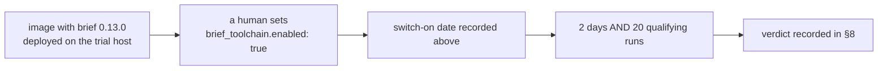

# 🧾 brief trial — Cargo commands in the codebase map

|                  |                                                                                                                                 |
| ---------------- | ------------------------------------------------------------------------------------------------------------------------------- |
| **Trial host**   | `TRIAL-HOST-NOT-YET-NAMED` — placeholder; the window is **not open** (§4)                                                       |
| **Switch**       | `brief_toolchain.enabled` in a host's `.config.json`, default `false`                                                           |
| **Bar**          | ≥ 10% lower tokens **or** cost per completed implementation run, no lower success rate, brief's own run time counted against it |
| **First judged** | after **2 days** or **20** qualifying runs, whichever is later                                                                  |
| **Status**       | ⚪ not started — no host named, switch off everywhere                                                                           |

This page is the protocol the brief trial
([#2581](https://github.com/stSoftwareAU/VibeCoder/issues/2581)) is judged by.
It is a sibling of the [RTK output trial](RTK-OUTPUT-TRIAL.md) and the
[Repo-context Trial](REPO-CONTEXT-TRIAL.md): same shape of bar, a different
candidate, a different host. Everything a verdict may cite is written here
**before** the window opens, so the verdict is a reading rather than an
argument.

## 1. 🥊 The candidate and how it is wired

[brief](https://github.com/git-pkgs/brief) is a single MIT-licensed Go binary
that scans a repository offline and reports, among other things, the commands a
project builds, tests and lints with. The trial uses that one report and nothing
else.

- **The pin.** brief **v0.13.0** is pinned in `container/tools.json` with a
  checksum per architecture and installed by the `toolchains/brief.sh` fragment
  ([#2601](https://github.com/stSoftwareAU/VibeCoder/issues/2601)), so every
  host running a given image runs the same brief.
- **The switch.** `brief_toolchain.enabled` — one boolean, per host, default
  `false` ([#2602](https://github.com/stSoftwareAU/VibeCoder/issues/2602)). It
  is documented in the [Configuration Reference](CONFIGURATION.md).
- **What it adds.** With the switch on, a repository that has a `Cargo.toml`
  gets a `## Cargo commands (from brief)` block in its codebase map
  ([#2603](https://github.com/stSoftwareAU/VibeCoder/issues/2603)). A repository
  without one gets no block, and brief is not run for it.
- **What it never does.** brief never fails a run. A missing binary, a non-zero
  exit or a timeout records `failed` and the map is built without the block.

## 2. 📼 Motivation, not evidence

The codebase map lists a project's commands only from `deno.json`,
`package.json` and `quality.sh`, so a Rust repository's map carries no Cargo
commands at all and the agent rediscovers them each run. brief reads them from
the manifest. That is a reason to **measure**, and it is not evidence: nothing
here says the block saves a token, and the verdict in §8 may cite only what §6
reads.

Other brief subcommands were considered and set aside (§10): `outline`
duplicates the Graft bundle, and `threat-model`, `sinks` and `missing` have no
equivalent surface in the worker today to compare against.

## 3. 📏 The bar

Keep brief only if **all three** hold over the window:

1. **Tokens or cost.** Token use **or** cost per completed implementation run is
   at least **10%** lower on the trial host than on the control hosts, compared
   under §5.
2. **Success rate.** The success rate of implementation runs on the trial host
   is no lower than on the control hosts.
3. **Time counted.** brief's own run time is counted against it: the seconds
   each `Brief:` line reports are part of the trial side's run time, not a free
   overhead.

A miss on any one clause is a miss.

## 4. 🪟 The window and the switch

**Trial host:** `TRIAL-HOST-NOT-YET-NAMED` — no host was named in
[#2581](https://github.com/stSoftwareAU/VibeCoder/issues/2581). While this
placeholder stands the window is **not open**, whatever else is true. A human
replaces it with one host name that runs no other candidate — **not GRQ-23**
(the [Repo-context Trial](REPO-CONTEXT-TRIAL.md)) and **not GRQ-25** (the
[RTK output trial](RTK-OUTPUT-TRIAL.md)).

**Switch-on date:** — (not yet switched on)



The window opens only when the image carrying brief is **deployed** to the named
host **and** a human sets `brief_toolchain.enabled: true` in that host's
`.config.json`. That human records the date on the switch-on line above.

The window closes after **2 days** or **20** qualifying implementation runs
(§5), whichever is later. Both steps are manual: no worker flips the switch, to
open the window or to close it.

## 5. ⚖️ The comparison rule

- **What counts.** Only implementation runs on the trial host whose run stats
  show `- **Brief:** ok` count towards the 20. In practice these are Rust
  repositories, because brief runs only where a `Cargo.toml` exists.
- **What is reported separately.** Runs showing `- **Brief:** failed` do not
  count towards the 20 and are not compared; their number is reported in §8 so a
  flaky binary cannot hide inside the margin.
- **What is ignored.** Runs showing `off` — no `Cargo.toml` — carry no Cargo
  commands block and are neither trial nor control.
- **The control.** Rust-repository implementation runs on the control hosts,
  where the switch is off, over the **same dates** as the window.
- **Fleet-wide changes.** The effort re-sweep of
  [#2573](https://github.com/stSoftwareAU/VibeCoder/issues/2573) lands on every
  host, so it affects both sides equally and needs no adjustment.

| Side           | Host                         | Runs                     | Status line      |
| -------------- | ---------------------------- | ------------------------ | ---------------- |
| Trial          | the §4 host                  | Rust implementation runs | `ok`             |
| Reported apart | the §4 host                  | any                      | `failed`         |
| Control        | every other host, switch off | Rust implementation runs | no `Brief:` line |

## 6. 📥 Where each figure is read from

| Figure                  | Source                                                                                                                       |
| ----------------------- | ---------------------------------------------------------------------------------------------------------------------------- |
| Tokens and cost per run | the callback's `telemetry` block (`inputTokens`, `outputTokens`, `estimatedCostUsd`), and the run-stats comment on the issue |
| Success rate            | the callback's `result` and `outcome`, per implementation run                                                                |
| Qualifying run count    | the `Brief:` line in each run-stats comment                                                                                  |
| brief's seconds         | the `Brief:` line, or `seconds` in the callback's `brief` block                                                              |
| `Brief: failed` count   | the `Brief:` line, or `status` in the callback's `brief` block                                                               |

The run-stats comment carries one `Brief:` line per run while the switch is on,
in one of these shapes. While the switch is off, there is **no line** at all.

```text
- **Brief:** ok (1.5s)
- **Brief:** ok (cached)
- **Brief:** failed — `<reason>`
- **Brief:** off — no Cargo.toml
```

The post-run callback ([Post-Run Callbacks](CALLBACKS.md)) carries a `brief`
block on every run, and the scalar `VIBECODER_BRIEF_ENABLED`:

```text
{"enabled":true,"status":"ok","seconds":1.5}
{"enabled":true,"status":"ok","seconds":0,"cached":true}
{"enabled":true,"status":"failed","reason":"brief exited with code 1"}
{"enabled":true,"status":"off"}
{"enabled":false,"status":"off"}
```

A cached `ok` spent no brief time on that run: the map came from the cache.
`{"enabled":true,"status":"off"}` is a switched-on run with no `Cargo.toml`;
`{"enabled":false,"status":"off"}` is a run with the switch off.

## 7. 🔐 Security posture

- **Fixed argv, no shell.** The worker runs `brief --json <repo>` — the binary
  resolved on `PATH`, the absolute repository path as the only operand — with no
  shell, so nothing in a repository can inject an argument.
- **Offline scan only.** The trial runs the plain local scan. It never builds
  `enrich`, `outline`, `threat-model`, `sinks` or `missing`, and never scans a
  remote URL or a registry package.
- **Allowlisted, capped parse.** Only `cargo`-prefixed strings are kept;
  backticks, control and other unsafe Unicode, and duplicates are dropped. Each
  command is capped at 200 characters and the list at 20 commands; a failure
  reason is one line, capped at 200 characters.
- **A timeout.** The spawn is bounded by the worker's subprocess timeout (30
  seconds); a timeout records `failed` and the run carries on.
- **Nothing else installed.** The image carries the binary only — no enrich
  configuration and no credentials for remote scans.

## 8. 📊 Results — the brief window

> **No window has opened.** The table stays empty until §4 names a host, the
> switch-on date is recorded, and the window has closed.

| Measure                                 | brief (trial) | Control | Delta |
| --------------------------------------- | ------------- | ------- | ----- |
| Qualifying runs (`Brief: ok`)           | —             | —       | —     |
| Tokens per completed implementation run | —             | —       | —%    |
| Cost per completed implementation run   | —             | —       | —%    |
| Success rate                            | —             | —       | —     |
| brief seconds — total / mean            | — / —         | n/a     | n/a   |
| `Brief: failed` runs                    | —             | n/a     | n/a   |

- **Window:** — to —
- **Tokens or cost ≥ 10% lower:** — (tokens: —%, cost: —%)
- **Success rate no lower:** — (trial —, control —)
- **brief's time counted:** — (total —s, mean —s)
- **Verdict:** — (keep / remove — cites each clause of §3)
- **Judged on:** — by —

## 9. 🔀 What the verdict changes

- **On keep.** The switch stays on for the trial host. Turning it on anywhere
  else is a separate decision for a human, recorded on its own issue.
- **On a miss.** Record the negative result in §8, then remove brief in one PR:
  the `container/tools.json` entry, the `toolchains/brief.sh` fragment, the
  `brief_toolchain` switch, the `Brief:` stats line and the callback's `brief`
  field, and the codebase-map code that builds the block — with their tests and
  their rows in the [Configuration Reference](CONFIGURATION.md) and
  [Post-Run Callbacks](CALLBACKS.md). This page stays as the record. A host
  whose `.config.json` still carries a `brief_toolchain` key after removal is
  handled as that PR documents here.

## 10. 🚫 Out of scope

- **Other brief subcommands.** `outline`, `threat-model`, `sinks`, `missing` and
  `enrich`, and remote scans, are not part of this trial and are never run.
- **Graft and CodeGraph.** Removing them is a separate follow-up, judged by the
  [Repo-context Trial](REPO-CONTEXT-TRIAL.md); that follow-up updates
  `docs/REPO-CONTEXT-TRIAL.md`, not this page.

## 11. 🔗 Related documentation

- **[RTK output trial](RTK-OUTPUT-TRIAL.md)** — the sibling protocol this page
  mirrors, on GRQ-25.
- **[Repo-context Trial](REPO-CONTEXT-TRIAL.md)** — Graft and CodeGraph on
  GRQ-23.
- **[Configuration Reference](CONFIGURATION.md)** — the `brief_toolchain` switch
  row, and every other `.config.json` key.
- **[Post-Run Callbacks](CALLBACKS.md)** — the `brief` block and
  `VIBECODER_BRIEF_ENABLED`.
- **[Model and Caching](MODEL-AND-CACHING.md)** — the codebase map and where the
  Cargo commands block lands in it.
- **[Container Image](CONTAINER.md)** — the pinned toolchain fragments.
