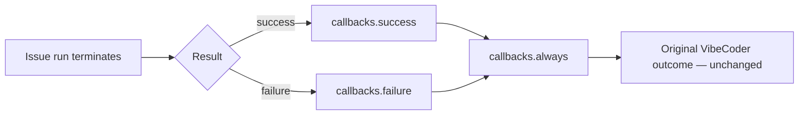
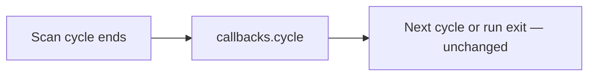
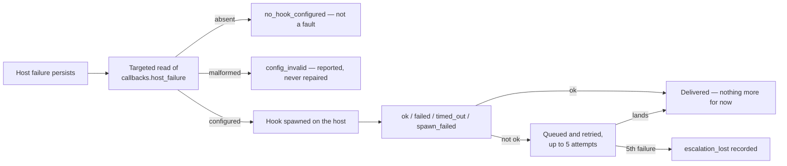
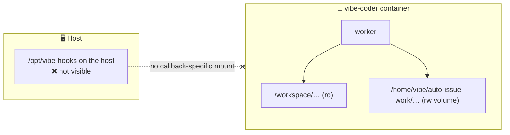
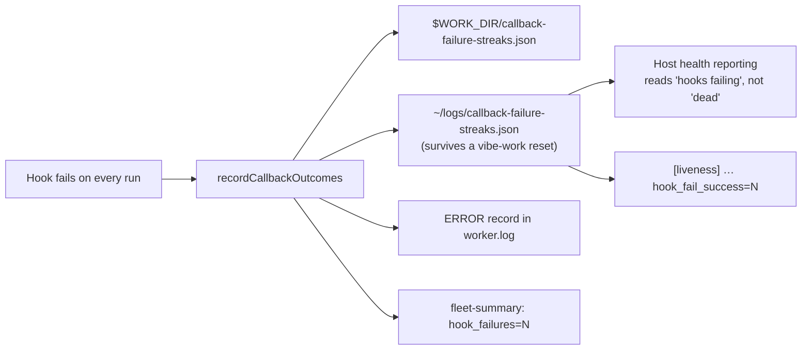

# 🪝 Post-Run Callbacks — the extension contract

Optional executables the worker runs after a **terminal issue run**, following
the `success / failure / always` outcome semantics familiar from CI pipeline
post-build blocks, plus an optional **`cycle` heartbeat** at the end of every
scan loop (Issue #1955). They are the public extension point for fleet-specific
reporting — health records, session-log archival, spend accounting, idle-host
liveness — so none of that policy has to live in VibeCoder.

This page is the **contract**: what fires, what a hook receives, what is
guaranteed, and what a third-party extension is responsible for. The
configuration keys are also summarised in
[Configuration — Post-Run Callbacks](CONFIGURATION.md#-post-run-callbacks); the
contract is documented once, here.

Every property below is provable where you deploy — see
[The conformance fixture](#the-conformance-fixture).

## Configuration

```json
{
  "callbacks": {
    "success": "/opt/vibe-hooks/success.sh",
    "failure": "/opt/vibe-hooks/failure.sh",
    "always": "/opt/vibe-hooks/always.sh",
    "cycle": "/opt/vibe-hooks/cycle.sh",
    "host_failure": "/opt/vibe-hooks/host-failure.sh",
    "timeout_seconds": 60
  }
}
```

Every entry is optional, and a configuration without a `callbacks` block behaves
exactly as before. A **malformed** block fails the config load rather than
leaving an operator with a hook that silently never runs.

`host_failure` is the one **host** path in the block (Issue #2107) — see
[Host-level failures](#host-level-failures--callbackshost_failure). Every other
key is resolved inside the container.

## Ordering and exactly-once scope





- `success` runs only after a terminal **successful** issue run; `failure` only
  after a terminal **failed** one. Exactly one of the two runs.
- `always` runs after the applicable outcome hook, in both cases — including
  when that hook exited non-zero, timed out or could not be spawned at all.
- A hook that is not configured is a no-op, and its absence never skips the
  others.
- **The unit for run hooks is one claimed issue run, not one worker cycle.** A
  claim that was skipped — rejected, or already held by another worker — runs no
  `success` / `failure` / `always` callbacks: no run happened to report. An idle
  cycle that claimed nothing still fires `callbacks.cycle` (Issue #1955) so a
  silent host is distinguishable from an idle one. A launcher that never reaches
  the scan loop emits nothing, including no cycle record.
- A shutdown or an exception after a claim takes the failure/`always` path
  **exactly once**: the claim release, the slot-level catch and the shutdown
  drain share one guard, so a hook is never invoked twice for the same claim.
- Concurrent issue slots each receive their own context; hooks never share state
  between slots, and each slot's `always` runs for that slot alone.

## Host-level failures — `callbacks.host_failure`

A host-level failure — the container launcher crash-looping, the checkout
update failing run after run — happens **before** any issue is claimed and
before a container exists, so none of the hooks above can report it.
`callbacks.host_failure` is that report, under the same contract: a versioned
JSON document at `VIBECODER_CALLBACK_CONTEXT`, scalar `VIBECODER_*` facts, a
cleared environment, and the same `timeout_seconds` budget.

It is fired **host-side only**, by two callers: the launcher self-heal recorder
(Issue #2108) and the host-side checkout update (Issue #2110). Nothing inside
the container invokes it — a container-side condition such as the
[callback-failure streak](#a-hook-that-fails-on-every-issue-is-recorded-once-locally)
records locally and fires no hook (Issue #2111).



Three properties are specific to it:

- **It is a host path.** The launcher spawns it on the host's own filesystem,
  so — unlike every other key — a path inside the container is the wrong
  answer. The [conformance fixture](#the-conformance-fixture) cannot drive it
  for the same reason: the fixture runs where the worker runs.
- **The read is targeted.** The host validates `host_failure` and
  `timeout_seconds` only, so a `success` hook naming a container path it
  cannot see never stops the host hook from firing. An absent key means no
  hook; a malformed one is reported rather than quietly answered as absent.
- **Failures only, never recovery.** The hook is told what is broken, never
  that it healed: a condition that clears fires nothing and is one local line
  in the host's own log. A hook that wants a recovery signal derives it from
  the reports stopping.

### What the hook receives

The same cleared environment as every other hook — only `PATH`, `HOME`, `LANG`,
`TZ` and `TMPDIR` are inherited — plus a versioned JSON document at
`VIBECODER_CALLBACK_CONTEXT` (Issue #2107). `schemaVersion` stays at the
contract's current version: a new event is not a breaking change to the fields
an existing hook already reads (see
[Versioning](#versioning--the-contract-is-additive)).

```json
{
  "schemaVersion": 2,
  "event": "host_failure",
  "host": "worker-1",
  "condition": "launcher",
  "phase": "image_build",
  "consecutiveFailures": 3,
  "lastExitStatus": 1,
  "backoffSeconds": 240,
  "streakStartedAt": "2026-09-14T22:41:03.000Z",
  "delivery": {
    "kind": "first",
    "count": 1
  },
  "attempt": 1,
  "logTail": "…the failing attempt's captured output, redacted…",
  "detail": "…free-text diagnosis, when the host has one…",
  "checkout": {
    "branch": "main",
    "dirtyFiles": 0
  }
}
```

The scalars are exported one variable each; the multi-line facts live in the
document alone, where no environment-size limit can turn them into a spawn
failure:

| Environment variable                | JSON field            | Always present | Meaning                                                                                                                                                                                          |
| ----------------------------------- | --------------------- | -------------- | ------------------------------------------------------------------------------------------------------------------------------------------------------------------------------------------------ |
| `VIBECODER_CALLBACK_SCHEMA_VERSION` | `schemaVersion`       | yes            | Contract version — unchanged by this event                                                                                                                                                       |
| `VIBECODER_CALLBACK_EVENT`          | `event`               | yes            | Always `host_failure`                                                                                                                                                                            |
| `VIBECODER_CALLBACK_CONTEXT`        | —                     | yes            | Path to the JSON document for this invocation                                                                                                                                                    |
| `VIBECODER_HOST`                    | `host`                | yes            | Host the failure is on                                                                                                                                                                           |
| `VIBECODER_HOST_FAILURE_CONDITION`  | `condition`           | yes            | `launcher` or `checkout_update`                                                                                                                                                                  |
| `VIBECODER_HOST_FAILURE_PHASE`      | `phase`               | yes            | Phase within the condition: `runtime_detection`, `container_egress`, `image_build`, `volume_init`, `container_start` or `worker_run` for the launcher; `checkout_update` for the checkout update |
| `VIBECODER_CONSECUTIVE_FAILURES`    | `consecutiveFailures` | yes            | Consecutive failures of this condition, including this one                                                                                                                                       |
| `VIBECODER_LAST_EXIT_STATUS`        | `lastExitStatus`      | no             | Exit status of the most recent attempt, when one was observed                                                                                                                                    |
| `VIBECODER_BACKOFF_SECONDS`         | `backoffSeconds`      | no             | Seconds the host waits before retrying, when it backs off                                                                                                                                        |
| `VIBECODER_STREAK_STARTED_AT`       | `streakStartedAt`     | yes            | ISO-8601 timestamp of the first failure in the streak                                                                                                                                            |
| `VIBECODER_DELIVERY_KIND`           | `delivery.kind`       | yes            | `first` report of this streak, or a `repeat` while it persists                                                                                                                                   |
| `VIBECODER_DELIVERY_COUNT`          | `delivery.count`      | yes            | Reports delivered for this streak, including this one                                                                                                                                            |
| `VIBECODER_ATTEMPT`                 | `attempt`             | yes            | Attempt number that produced this report — a retry of one report, not a new one                                                                                                                  |
| —                                   | `logTail`             | no             | Tail of the failing attempt's output, redacted — document only                                                                                                                                   |
| —                                   | `detail`              | no             | Free-text diagnosis — document only                                                                                                                                                              |
| —                                   | `checkout`            | no             | `branch` and `dirtyFiles`, when the condition is `checkout_update` — document only                                                                                                               |

Optional facts the host could not supply are **omitted** from both the document
and the environment rather than emitted empty, so
`[ -n "$VIBECODER_BACKOFF_SECONDS" ]` is a truthful test.

### What the launcher sends

The launcher self-heal recorder is the first caller (Issue #2108). It reports
once the consecutive-failure count crosses the failing phase's threshold, and
its cadence is the streak's, not the failure's:

- **Crossing, then +1 h, then daily.** The threshold crossing delivers
  immediately with `delivery` `first`/1; the first follow-up comes an hour
  later and everything after that daily, each one `repeat` with the running
  `delivery.count`. A genuinely stuck host stays visible without filling the
  channel, and a hook can tell a new incident from an update of one it already
  holds.
- **A streak is its phase and its start.** Failures 4 … 54 of one ongoing
  condition are the same streak, so they are the same report; a different
  phase, or a clean run in between, starts a new one.
- **Five attempts, then `escalation_lost`.** A delivery that returns anything
  but `ok` is queued and retried on the next cycle — `attempt` counts them —
  and the fifth failure records `escalation_lost` in the self-heal health
  report rather than dropping the escalation silently. The per-cycle retry
  stops there; the streak's own re-notify schedule still governs, so a host
  that is still broken reports again when the schedule next falls due.
- **`logTail` carries the launcher's own tail**, redacted before it leaves the
  process: a hook is an operator's channel, not a trusted vault.
- **No hook is not a fault.** A host with no `callbacks.host_failure` records
  the `escalated` event locally with `no_hook_configured`; a `callbacks` block
  that will not parse records `config_invalid` with the read's own error
  beside it. When there is also no crash channel to fall back on there is
  nothing left to try, so the report is not queued for retry at all — the
  streak's re-notify schedule is the whole record.

### What the checkout update sends

The host-side checkout update is the other caller (Issue #2110). Its cadence:

- **One report per streak.** Three consecutive failures spanning at least
  fifteen minutes fire the hook once, with `condition` and `phase` both
  `checkout_update` and `delivery` `first`/1. Later failures in the same streak
  fire nothing.
- **Five attempts, then `escalation_lost`.** An invocation that returns
  anything but `ok` is retried on each later failing run — `attempt` counts
  them — and the fifth failure abandons the report for that streak, recording
  `escalation_lost` in `run_core.log` and `~/logs/self-heal.jsonl`.
- **Failures only.** A run that updates cleanly fires no hook: the condition
  has cleared, and the recovery is one local line.
- **No hook is not a fault.** A host with no `callbacks.host_failure` records
  `no_hook_configured` once per streak; a `callbacks` block that will not parse
  records `config_invalid`. Neither blocks the update.

See [Host-Side Checkout Update](CONFIGURATION.md#-host-side-checkout-update).

## Invocation and path rules

- The configured path is executed **directly** — no shell, no `sh -c`, no
  arguments — so no issue or repository text can ever be parsed as a command.
- The hook is responsible for its own interpreter: a shell hook needs a
  `#!/bin/sh` shebang and the execute bit.
- Paths must be **absolute** and POSIX. A relative or `~`-relative path is
  rejected at config load, because the worker's working directory changes
  between runs and would resolve the same hook differently each time.

What is rejected, and where:

| Fault                                           | Rejected at | Effect                                                        |
| ----------------------------------------------- | ----------- | ------------------------------------------------------------- |
| non-string, empty or blank path                 | config load | the worker stops; no issue is claimed                         |
| path containing a NUL character                 | config load | the worker stops                                              |
| relative, `~`-relative or non-POSIX path        | config load | the worker stops                                              |
| unknown key inside the `callbacks` block        | config load | the worker stops, naming the recognised keys                  |
| `timeout_seconds` outside 1…3600, or fractional | config load | the worker stops                                              |
| missing, non-executable or un-spawnable path    | invocation  | recorded `spawn_failed`, reported loudly, `always` still runs |

A non-executable path is **never** retried through a shell: there is no fallback
path in which a hook's text could be interpreted as a command. The execute bit
and the file's presence are properties of the filesystem the worker sees at
invocation time, not of the config file, so check them where the worker runs —
[the conformance fixture](#the-conformance-fixture) spawns the hooks you name
and fails on a path that cannot run.

## Filesystem visibility

The worker runs **inside the container** — that is the only run mode
([Containment](CONTAINMENT.md)) — so a hook path is resolved on the filesystem
the container sees, and a host path that is not mounted in is not visible to it.
The one exception is `host_failure`, which the host launcher spawns before any
container exists: its path is resolved on the **host** — see
[Host-level failures](#host-level-failures--callbackshost_failure).



- **Configuring a callback adds no mount.** The mount set is fixed and built by
  one audited module, so a hook path cannot widen the containment boundary: it
  can only name a path that is already inside it. A path outside the mount set
  simply fails to spawn and is reported — it does not silently escape.
- Practical homes for a hook are therefore the worker checkout mounted read-only
  at `/workspace` (a hook committed to the repository you deploy) or the work
  volume under `/home/vibe/auto-issue-work` (a hook your own provisioning writes
  there).
- The child environment is **cleared** (see below), so a hook inherits none of
  the worker's credential plumbing. A hook that talks to a remote must establish
  its own credentials explicitly — an opt-in, never an accident.

## Timeout, output capture and failure policy

- Every hook is bounded by `timeout_seconds` (default `60`, maximum `3600`). A
  hook that exceeds it is terminated with `SIGTERM` and recorded as `timed_out`
  with exit code `124`. A hook that traps `SIGTERM`, or that forks a child
  holding its output pipes, can outlive that signal — write hooks that terminate
  on it.
- stdout, stderr, the exit code and the duration are captured, passed through
  the worker's secret redaction, truncated to 4,000 characters per stream, and
  logged — including whatever a timed-out hook printed before it was killed.
- **A callback never rewrites the run's own result.** A hook that fails, hangs
  or cannot be spawned is reported loudly, alongside the unchanged VibeCoder
  outcome. Nothing a hook does can turn a failed run green or a successful run
  red.
- Statuses a hook invocation can record: `ok`, `failed`, `timed_out`,
  `spawn_failed`.

## A hook that fails on every issue is recorded once, locally

A hook fault is reported per invocation, which is right for a hook that fails
once and wrong for a hook that cannot succeed at all. Observed on GRQ-23 on
2026-09-05: the `always` hook failed on **every** issue across at least five
runs, each failure costing about 100 seconds of slot time, and the only trace
was one line per issue among the thousands the fleet writes. So the worker
counts the streak and writes one record the operator of the host can act on.

- The worker keeps a consecutive-failure count **per event** in
  `$WORK_DIR/callback-failure-streaks.json`. It survives the run boundary,
  because the condition does.
- **The same file is published to the host log directory** — `~/logs`, the
  mount `worker.log` already goes to (Issue #2297). The work volume does not
  survive a launcher reset of `vibe-work` and the host log directory does, so
  the count is read back from the host copy whenever the work-volume copy is
  missing. On GRQ-25 that is the difference between one record saying *failing
  since 16 Sep 08:58Z* and four records each claiming a fresh three-issue
  streak.
- On the **third** consecutive failing issue, the worker writes **one** `ERROR`
  record to its own log, naming the hook path, the streak, the last
  `owner/repo#issue`, the status, the exit code, the duration, the hook's
  captured (redacted) stderr, the callback schema version this worker exports,
  and the remedy — so a hook refusing the version is diagnosed by the record
  rather than by a human reading the raw stderr.
- **One record per streak.** The fourth failure and the four-hundredth add
  nothing. A single successful invocation clears the count, so the next fault is
  recorded afresh.
- **Recovery is one line.** The success that ends a recorded streak logs which
  run succeeded and after how many failing issues. A success that ends a streak
  too short to have been recorded logs nothing.
- **Nothing leaves the container** (Issue #2111). The streak fires no hook,
  spawns no process and makes no GitHub write: no issue is filed on the
  threshold crossing, none is closed on recovery, and no `host_failure` hook is
  invoked from inside the container. The log record and the count file are the
  host's own record, and nothing about either alters the run's own result.
- **A copy that cannot be read or written is said out loud**, at `WARNING` —
  the run carries on, and someone should fix the mount. Each directory is
  attempted independently and the line names the file and the reason, so a host
  whose log mount is read-only learns it instead of quietly publishing nothing.
  A copy that is simply not there yet is silent: that is the first run.

### What the host can read (Issue #2297)

A record only `worker.log` holds is a record nobody reads until the board has
been red for a day. The streak therefore reaches host-side health reporting by
three routes, none of which needs a new file format or a GitHub write:



- **`~/logs/callback-failure-streaks.json`** carries, per run hook: the event,
  the hook path, the streak, `firstFailureAt` / `lastFailureAt`, the last
  status, exit code and duration, and the redacted head of its stderr. A hook
  that has succeeded stays in the file at `"streak": 0` — "this hook ran and is
  healthy" is a fact a reader needs, and absence cannot state it.
- **The per-cycle liveness line** carries the same counts:
  `[liveness] tick=… live_epoch=… last_productive=… hook_fail_success=0
  hook_fail_failure=0 hook_fail_always=0`. All three hooks are always named, so
  a host-side parser reads a fixed set of fields.
- **`fleet-summary:` carries `hook_failures=N`** — failing hook invocations
  this run — beside `claims=`, `successes=` and `failures=`, so a run whose
  every heartbeat was lost cannot read as clean.

**What a hook author owes in return.** The worker bounds a hook's wall clock and
reports its outcome; it cannot see inside it. A hook that retries must classify
its own failures:

- **Fail fast on a permanent authorisation failure.** `HTTP 403`,
  `Write access to repository not granted` and `permission denied` will not be
  cleared by a retry, and rebase-and-retry is the answer to a rejected
  non-fast-forward push, never to a refused one. Retrying such a failure five
  times spends the timeout budget to reach the same answer, on every issue.
- **Bound anything the hook carries forward.** A hook that queues work it could
  not deliver — an unpushed record, a spooled file — must cap the queue and say
  what it dropped when the cap is reached. An unbounded backlog makes each run
  more expensive than the last.

## What a hook receives

The environment is **cleared** before it is populated: only `PATH`, `HOME`,
`LANG`, `TZ` and `TMPDIR` are inherited from the worker, so no credential
crosses into a callback. Prompt bodies and transcript contents are never
exported.

`VIBECODER_CALLBACK_CONTEXT` names a versioned JSON document written for that
invocation (mode `0600`) and removed after it exits:

```json
{
  "schemaVersion": 2,
  "event": "success",
  "runId": "vibe-mtk92vcu-ebcc11",
  "result": "success",
  "repository": "owner/repo",
  "issueNumber": 807,
  "host": "worker-1",
  "workerName": "fleet-a",
  "mode": "work-on",
  "provider": "claude",
  "sessionId": "…",
  "sessionLogPath": "/home/vibe/logs/agent-vibe-mtk92vcu-ebcc11-807.jsonl",
  "startedAt": "2026-09-03T01:00:00.000Z",
  "finishedAt": "2026-09-03T01:31:12.000Z",
  "durationSeconds": 1872,
  "exitCode": 0,
  "telemetry": {
    "inputTokens": 1200,
    "outputTokens": 340,
    "cacheCreationTokens": 90,
    "cacheReadTokens": 20,
    "estimatedCostUsd": 0.42,
    "turns": 34,
    "model": "claude-opus-4-6",
    "effort": "high"
  },
  "outcome": {
    "kind": "pr",
    "prNumber": 807,
    "phase": "completion"
  },
  "graft": {
    "enabled": true,
    "status": "ok",
    "buildSeconds": 12.5,
    "bundleChars": 4096,
    "nodeCount": 820,
    "callEdgeCount": 1204,
    "queries": 7
  },
  "codegraph": {
    "enabled": true,
    "status": "ok",
    "indexSeconds": 42.5,
    "nodeCount": 18412,
    "relationshipCount": 51903,
    "queries": 7
  },
  "rtk": {
    "enabled": true,
    "status": "ok",
    "savedTokens": 12840
  },
  "brief": {
    "enabled": true,
    "status": "ok",
    "seconds": 1.5
  },
  "workerVersion": "1.4.2",
  "workerCommit": "0123456789abcdef0123456789abcdef01234567"
}
```

The same facts are exported as scalars, one variable each:

| Environment variable                     | JSON field                      | Always present | Meaning                                                                                                              |
| ---------------------------------------- | ------------------------------- | -------------- | -------------------------------------------------------------------------------------------------------------------- |
| `VIBECODER_CALLBACK_SCHEMA_VERSION`      | `schemaVersion`                 | yes            | Contract version — see [Versioning](#versioning--the-contract-is-additive)                                           |
| `VIBECODER_CALLBACK_EVENT`               | `event`                         | yes            | `success`, `failure`, `always`, `cycle` or `host_failure`                                                            |
| `VIBECODER_CALLBACK_CONTEXT`             | —                               | yes            | Path to the JSON document for this invocation                                                                        |
| `VIBECODER_RUN_ID`                       | `runId`                         | yes            | Worker run id                                                                                                        |
| `VIBECODER_RESULT`                       | `result`                        | yes            | The run's own result: `success` or `failure`                                                                         |
| `VIBECODER_REPOSITORY`                   | `repository`                    | yes            | `owner/repo` the run worked                                                                                          |
| `VIBECODER_ISSUE_NUMBER`                 | `issueNumber`                   | yes            | Issue number the run worked                                                                                          |
| `VIBECODER_HOST`                         | `host`                          | yes            | Host the worker runs on                                                                                              |
| `VIBECODER_WORKER_NAME`                  | `workerName`                    | no             | Operator-configured worker name                                                                                      |
| `VIBECODER_MODE`                         | `mode`                          | no             | Workflow the run served: the configured implementation label (`work-on`) or `idle-task`                              |
| `VIBECODER_PROVIDER`                     | `provider`                      | no             | Agent provider that served the run                                                                                   |
| `VIBECODER_SESSION_ID`                   | `sessionId`                     | no             | Agent session id                                                                                                     |
| `VIBECODER_SESSION_LOG_PATH`             | `sessionLogPath`                | no             | Absolute path to this run's transcript, verified on disk                                                             |
| `VIBECODER_SESSION_LOG_ABSENT_REASON`    | `sessionLogAbsentReason`        | no             | Why the path is missing (`tee_disabled`, `log_dir_unavailable`, `size_cap_exceeded`, `write_failed`, `file_missing`) |
| `VIBECODER_STARTED_AT`                   | `startedAt`                     | yes            | ISO-8601 claim time                                                                                                  |
| `VIBECODER_FINISHED_AT`                  | `finishedAt`                    | yes            | ISO-8601 termination time                                                                                            |
| `VIBECODER_DURATION_SECONDS`             | `durationSeconds`               | yes            | Wall-clock seconds from claim to termination                                                                         |
| `VIBECODER_EXIT_CODE`                    | `exitCode`                      | yes            | `0` on success, non-zero on failure                                                                                  |
| `VIBECODER_INPUT_TOKENS`                 | `telemetry.inputTokens`         | no             | Input tokens the run reported                                                                                        |
| `VIBECODER_OUTPUT_TOKENS`                | `telemetry.outputTokens`        | no             | Output tokens the run reported                                                                                       |
| `VIBECODER_CACHE_CREATION_TOKENS`        | `telemetry.cacheCreationTokens` | no             | Cache-creation tokens                                                                                                |
| `VIBECODER_CACHE_READ_TOKENS`            | `telemetry.cacheReadTokens`     | no             | Cache-read tokens                                                                                                    |
| `VIBECODER_ESTIMATED_COST_USD`           | `telemetry.estimatedCostUsd`    | no             | Estimated spend in USD                                                                                               |
| `VIBECODER_TURNS`                        | `telemetry.turns`               | no             | Turns the run took, summed across its invocations                                                                    |
| `VIBECODER_MODEL`                        | `telemetry.model`               | no             | Served model of the invocation with the biggest token total — the model most of the run went through                 |
| `VIBECODER_EFFORT`                       | `telemetry.effort`              | no             | Effort that same dominant invocation was started with (`low`, `medium`, `high`, `xhigh`, `max`) — Issue #2573        |
| `VIBECODER_TELEMETRY_ABSENT_REASON`      | `telemetryAbsentReason`         | no             | Why telemetry is missing (`agent_not_invoked`, `usage_not_reported`, `provider_unsupported`)                         |
| `VIBECODER_OUTCOME_KIND`                 | `outcome.kind`                  | no             | Structured result: `pr`, `no_pr`, `no_pr_expected`, `superseded`, `summary_incomplete`, `claim_stale`                |
| `VIBECODER_OUTCOME_CATEGORY`             | `outcome.category`              | no             | `FailureCategory` when `kind` is `no_pr`, or when a `pr` run was failed by a later step (Issue #2044)                |
| `VIBECODER_OUTCOME_PHASE`                | `outcome.phase`                 | no             | Phase that terminated the run                                                                                        |
| `VIBECODER_OUTCOME_FAILURE_CLASS`        | `outcome.failureClass`          | no             | Classifier slug for a no-PR run, or for a PR a later step blocked                                                    |
| `VIBECODER_PR_NUMBER`                    | `outcome.prNumber`              | no             | PR number when one exists, including a later-step failure                                                            |
| `VIBECODER_GRAFT_ENABLED`                | `graft.enabled`                 | yes            | Whether the Graft repo-context switch was on for this run (`true`/`false`)                                           |
| `VIBECODER_GRAFT_STATUS`                 | `graft.status`                  | yes            | `ok`, `failed` or `off`                                                                                              |
| `VIBECODER_GRAFT_BUILD_SECONDS`          | `graft.buildSeconds`            | no             | Wall-clock seconds `graft build` took                                                                                |
| `VIBECODER_GRAFT_BUNDLE_CHARS`           | `graft.bundleChars`             | no             | Characters of bundle text `graft ask` returned                                                                       |
| `VIBECODER_GRAFT_NODE_COUNT`             | `graft.nodeCount`               | no             | Nodes in the built graph                                                                                             |
| `VIBECODER_GRAFT_CALL_EDGE_COUNT`        | `graft.callEdgeCount`           | no             | Edges in the built graph whose relation is `calls`                                                                   |
| `VIBECODER_GRAFT_QUERIES`                | `graft.queries`                 | no             | `graft_*` MCP tool calls the agent made this run (Issue #2314); absent when the tools were not handed over |
| `VIBECODER_CODEGRAPH_ENABLED`            | `codegraph.enabled`             | yes            | Whether the host's CodeGraph switch was on for this run (`true` or `false`)                                          |
| `VIBECODER_CODEGRAPH_STATUS`             | `codegraph.status`              | yes            | `ok`, `failed`, `unsupported` (no MCP transport on this provider) or `off` (switch off)                              |
| `VIBECODER_CODEGRAPH_INDEX_SECONDS`      | `codegraph.indexSeconds`        | no             | Wall-clock seconds the index step took, when it was started                                                          |
| `VIBECODER_CODEGRAPH_NODE_COUNT`         | `codegraph.nodeCount`           | no             | Nodes in the index                                                                                                   |
| `VIBECODER_CODEGRAPH_RELATIONSHIP_COUNT` | `codegraph.relationshipCount`   | no             | Relationships (edges) in the index                                                                                   |
| `VIBECODER_CODEGRAPH_QUERIES`            | `codegraph.queries`             | no             | `codegraph_explore` calls the agent made this run                                                                    |
| `VIBECODER_RTK_ENABLED`                  | `rtk.enabled`                   | yes            | Whether the host's RTK output switch was on for this run (`true` or `false`)                                         |
| `VIBECODER_RTK_STATUS`                   | `rtk.status`                    | yes            | `ok`, `failed`, `unsupported` (this provider takes no hook) or `off` (switch off, or the run ended before RTK ran) |
| `VIBECODER_RTK_SAVED_TOKENS`             | `rtk.savedTokens`               | no             | RTK's own indicative count of tokens its filtering saved during the run                                              |
| `VIBECODER_BRIEF_ENABLED`                | `brief.enabled`                 | yes            | Whether the host's `brief_toolchain` switch was on for this run (`true` or `false`)                                  |
| `VIBECODER_WORKER_VERSION`               | `workerVersion`                 | no             | Worker binary version that produced this run                                                                         |
| `VIBECODER_WORKER_COMMIT`                | `workerCommit`                  | no             | Git commit SHA of the worker code that produced this run                                                              |

A cycle hook additionally receives `VIBECODER_ISSUES_SCANNED`,
`VIBECODER_CLAIMS_ATTEMPTED`, `VIBECODER_CLAIMS_TAKEN` and
`VIBECODER_CYCLE_END_REASON` (`no_eligible_work`, `quota_paused`,
`rate_limited`, `shutdown`, `error`). It does **not** receive run-only scalars
(`RESULT`, `REPOSITORY`, `ISSUE_NUMBER`, `EXIT_CODE`, …), so it cannot be
mistaken for a run hook.

`mode`, `telemetry.turns` and `telemetry.model` were **added** to schema 2
without a version bump (Issue #2100), exactly as
[Versioning](#versioning--the-contract-is-additive) requires. All three are
optional, and a hook written before they existed is unaffected:

- `mode` names the workflow the run served, so a fleet archive can compare
  implementation runs only. Run callbacks fire for the issue scan's own
  claims, so today the value is the configured implementation label
  (`work-on`, or your own if you renamed it) or `idle-task`; it is absent
  when no implementation label is configured. A **grill-me, quorum, planning,
  question, refine-issue or custom-label run emits no run callback at all** —
  those routes answer their issue and return without one — so no context is
  produced for them rather than one carrying their label. If a future release
  gives those routes callbacks, they will report their own label here, and
  that too is additive.
- `telemetry.turns` is summed over the invocations that reported a turn
  count, and is absent when none did — never nought.
- `telemetry.model` is the served model of the invocation with the biggest
  token total, falling back to that invocation's requested model when the API
  reported none. Tokens rather than estimated cost, so a model with no
  pricing row can still be named; it is present whenever `telemetry` is.

`telemetry.effort` was **added** the same way (Issue #2573), for the per-phase
effort sweep on Opus 5.5. It is the effort the invocation `telemetry.model`
names was started with — the value the worker passed on the command line,
after every `phase_effort_overrides` and environment override was applied — so
a pilot host's runs from before and after its override change can be told
apart run by run. It is omitted, never guessed, when that invocation recorded
no effort (a provider that takes none).

The `graft` block was **added** the same way (Issue #2104, part of #2060), and
is the one optional-looking fact that is present on **every** run context:

- `graft.enabled` and `graft.status` are always emitted, and always exported as
  `VIBECODER_GRAFT_ENABLED` and `VIBECODER_GRAFT_STATUS`. A host that never
  switched Graft on reports `{ "enabled": false, "status": "off" }` rather than
  omitting the block, so an archive can compare a host without the switch
  against one with it instead of reading silence as a missing run.
- `status` is `ok` when the bundle came back, `failed` when the collection was
  attempted and did not, and `off` when nothing was attempted. A `failed`
  collection reports whichever figures it reached, so a failure the run
  recorded is visible as a failure rather than as a clean-looking `off`.
- The two fields are independent, and `{ "enabled": true, "status": "off" }` is
  the combination worth reading: the host **had** Graft switched on and the run
  ended before the collection — a setup failure, a refused claim. `enabled`
  states the host's real switch setting rather than a default, so an early exit
  on a Graft host is never archived as a host that never opted in — on every
  run that returned a result. Where no result carried a block at all — a run
  that threw, or one the loop could not complete — the block falls back to
  `{ "enabled": false, "status": "off" }`: the switch was never read, so this
  says only that nothing was recorded.
- `buildSeconds`, `bundleChars`, `nodeCount`, `callEdgeCount` and `queries`
  are present only when the collection actually reached them, and are **omitted** — not
  emitted as an empty string — when it did not. A figure that really is nought
  is reported as `0`: a graph with no nodes is a measurement, not an absence.
- The Graft **bundle text** is never published. It is repository source,
  already spent on the run's prompt; only the figures above cross the boundary.

`codegraph` is an **additive** block (Issue #2162, part of #2145) carried by
every run document, so the CodeGraph trial's figures are comparable across
hosts. A host without the switch reports
`{ "enabled": false, "status": "off" }` rather than nothing at all, and a run
whose index step failed reports `"status": "failed"` with whatever figures it
did gather. Each figure — `indexSeconds`, `nodeCount`, `relationshipCount`,
`queries` — is **omitted** when the step never produced it, because a missing
count must not read as an index of zero nodes; a figure of `0` is published as
`0`, because zero nodes is a measurement rather than an absence. `off` means
the **switch** was off: a run on a switched-on host that ended before the
index step reports `"status": "failed"` instead, so it is never counted on the
switch-off side of the trial. Nothing else in the contract moved:
`schemaVersion` stays at 2, and a hook that knows nothing about CodeGraph
ignores the block.

`rtk` is an **additive** block (Issue #2386, part of #2328) carried by every
run document, so the RTK output trial can tell a run whose Bash output was
condensed from one whose output was not. **`enabled` is the host's switch,
stated truthfully whatever became of the run**: an issue run that ended before
RTK was prepared — a refused claim, an early exit — on a switched-on host
reports `{ "enabled": true, "status": "off" }`, never a fabricated `false`,
because the trial separates enabled runs from control runs by this block alone
(the rule the `graft` block follows, Issue #2104). `status: "off"` beside
`enabled: false` is a host with the switch off. A run that reaches the
callbacks carrying no RTK outcome at all — it threw, or the cycle drained first
— says the same thing (`rtkNotRun`): the host's real switch and
`"status": "off"`. It does not say `failed`, as the `codegraph` block's
equivalent does, because for RTK `failed` means the preflight ran and the
binary was missing — a host fault to act on. `failed` means the switch was on and the run got no
filtering, and `unsupported` that the provider takes no hook. `savedTokens` is
RTK's **own indicative figure**, read from a tracking store that concurrent
lanes share, so a neighbour can inflate it: read the trial from the run's token
and cost telemetry, never from this number. It is **omitted** — never blank,
and never `0` standing in for "unknown" — unless RTK's gain store was read both
before and after the run; a measured `0` is published as `0`. Nothing else in
the contract moved: `schemaVersion` stays at 2, and a hook that knows nothing
about RTK ignores the block.

`brief` is an **additive** block (Issue #2603, part of #2581) carried by every
run document: what brief did for the run's codebase map. `enabled` is the
host's `brief_toolchain` switch, stated truthfully the way the `rtk` block
states RTK's (`briefNotRun`). `status` is `ok` — with `seconds`, and
`"cached": true, "seconds": 0` when the map came from cache and brief was not
spawned — `failed` with a one-line `reason` (brief was missing, exited non-zero,
timed out or printed no report; the run still completed with the map it had
before the trial, and is not marked failed), or `off`. A switched-on run that
did not use brief — no root `Cargo.toml`, or it ended before the map was built —
is the bare `{ "enabled": true, "status": "off" }`; a switched-off host is
`{ "enabled": false, "status": "off" }`. Only `VIBECODER_BRIEF_ENABLED` is
exported as a scalar. Nothing else moved: `schemaVersion` stays at 2. The
[brief trial](BRIEF-TRIAL.md) reads its figures from this block.

`workerVersion` and `workerCommit` are **additive** scalars (Issue #2444, part of
\#2327) that identify the worker binary and its source that produced this run.
Each is **omitted** — never blank, never a placeholder — when the worker's own
build metadata could not be read at invocation time. When present:

- `workerVersion` is the semantic version string of the worker binary (e.g.
  `"1.4.2"`).
- `workerCommit` is the 40-character Git commit SHA of the worker source code
  (e.g. `"0123456789abcdef0123456789abcdef01234567"`), allowing the exact code
  that produced the run to be traced back to the repository.

These fields enable audit trails that name the worker version responsible for
each run's outcome — essential for investigating regressions and correlating
worker changes with productivity or fault rates. The fields are exported to
`VIBECODER_WORKER_VERSION` and `VIBECODER_WORKER_COMMIT` environment scalars
respectively. Nothing else in the contract moved: `schemaVersion` stays at 2,
and a hook that knows nothing about worker identity ignores these fields.

Every run context has either `telemetry` or `telemetryAbsentReason`, and either
`sessionLogPath` or `sessionLogAbsentReason` — never neither (Issue #1948).
Other optional facts the run could not supply — no provider, no session — are
**omitted** from both the document and the environment rather than emitted
empty, so `[ -n "$VIBECODER_SESSION_ID" ]` is a truthful test. `result` and
`exitCode` are unchanged (Issue #1947): hooks keyed on them keep working.

## Versioning — the contract is additive

`schemaVersion` is a compatibility number, not a changelog. The rule, on both
sides of the boundary:

- **VibeCoder only adds.** A new field, a new value in an existing field, a new
  event — none of these bumps `schemaVersion`. Every field an earlier version
  exported is still exported, under the same name, with the same meaning and
  the same type. `worker/deno/tests/callback_schema_compat_test.ts` pins the
  schema 1 field set so a removal fails in review rather than in the fleet.
- **A bump is a fleet-wide breaking change.** The number moves only when a
  field is removed or its meaning changes, and that is a decision with a
  release-notes entry, a release-floor move and the extensions upgraded
  **before** the worker ships — never a side effect of a feature. The worker
  updates itself on every host within the hour; an operator's hooks do not.
- **A hook refuses the versions it cannot read, not the versions it has not
  met.** Refuse a malformed version, and refuse a version _older_ than the one
  the hook was written against if it depends on a later field. A **newer**
  version keeps every field the hook knows: continue on those fields, and warn
  once that the contract has moved so the extension author looks at what was
  added.

**The scar (Issues #2039, #2041).** On 2026-09-11 schema 2 added `outcome`,
the absence reasons and the cycle event — all additive — and the number was
raised anyway. The deployed hooks did exactly what this page then told them
to, refused a version they did not know, and every callback on every host in
the fleet failed on every issue: no health heartbeat, no run archive, one
escalation per host per hook, and a reinstall by hand on each host to recover.
Nothing about the change needed a bump; the bump was the outage.

The worker records a hook that refuses its schema version the same way it
records any other permanent hook failure
([above](#a-hook-that-fails-on-every-issue-is-recorded-once-locally)); the
record names the version the worker exports so the remedy — upgrade the
extension on that host — is the first line, not a diagnosis.

## Session logs are sensitive — redaction is the hook author's job

`VIBECODER_SESSION_LOG_PATH` is present only when the agent transcript tee was
enabled for that run — `"agent_transcript_enabled": true` in `.config.json`, off
by default (Issue #1141) — **and** the file exists on disk. When it is absent,
`sessionLogAbsentReason` names why (Issue #1948). When the path is present:

- The transcript is the **raw agent stream** for that run: model output, issue
  and repository text, file contents the agent read, and command output. It is
  written through the worker's console secret redaction, which is a safety net
  for known credential shapes — **not** a guarantee that the file carries no
  sensitive repository content.
- Only the **path** is exported. VibeCoder never puts transcript contents into
  the environment or the context document; reading the file is the hook's
  decision.
- **A hook that exports a transcript anywhere — a health repository, an archive
  bucket, a chat channel — owns the redaction of what it exports.** Treat the
  file as private repository data: redact before export, restrict who can read
  the destination, and apply your own retention.
- The path belongs to **that run**: it embeds the run id and issue number. A
  hook must not infer another run's transcript from it, and a concurrent slot's
  hook receives its own path or none.
- The transcript is worker-managed: log cleanup and rotation age it out, so a
  hook that wants a durable copy must take one during its invocation rather than
  record the path for later.

## Minimal portable hooks

POSIX `/bin/sh`, no bashisms, safe under an unattended worker. Each needs the
execute bit (`chmod 700`) and an absolute path inside the container.

`success.sh` — record a run that finished cleanly:

```sh
#!/bin/sh
set -eu
printf '%s %s#%s ok in %ss\n' \
  "$VIBECODER_FINISHED_AT" "$VIBECODER_REPOSITORY" \
  "$VIBECODER_ISSUE_NUMBER" "$VIBECODER_DURATION_SECONDS" \
  >> "$HOME/auto-issue-work/vibe-runs.log"
```

`failure.sh` — record a failed run, with the spend it still cost:

```sh
#!/bin/sh
set -eu
cost="${VIBECODER_ESTIMATED_COST_USD:-unknown}"
printf '%s %s#%s FAILED (exit %s, cost %s)\n' \
  "$VIBECODER_FINISHED_AT" "$VIBECODER_REPOSITORY" \
  "$VIBECODER_ISSUE_NUMBER" "$VIBECODER_EXIT_CODE" "$cost" \
  >> "$HOME/auto-issue-work/vibe-runs.log"
```

`always.sh` — keep the whole context document, whatever the outcome:

```sh
#!/bin/sh
set -eu
archive="$HOME/auto-issue-work/vibe-contexts"
mkdir -p "$archive"
# Copy, never move: the worker removes the original after this hook exits.
cp "$VIBECODER_CALLBACK_CONTEXT" \
  "$archive/$VIBECODER_RUN_ID-$VIBECODER_ISSUE_NUMBER-$VIBECODER_CALLBACK_EVENT.json"
```

`cycle.sh` — record an idle (or otherwise ended) scan cycle:

```sh
#!/bin/sh
set -eu
printf '%s host=%s scanned=%s claimed=%s reason=%s\n' \
  "$VIBECODER_FINISHED_AT" "$VIBECODER_HOST" \
  "$VIBECODER_ISSUES_SCANNED" "$VIBECODER_CLAIMS_TAKEN" \
  "$VIBECODER_CYCLE_END_REASON" \
  >> "$HOME/auto-issue-work/vibe-cycles.log"
```

Notes that apply to all four:

- `set -eu` so the hook **fails loud**; its non-zero exit is captured and
  reported, and never changes the run's own result.
- Finish well inside `timeout_seconds`, and do not fork a background child that
  outlives the hook — it will hold the output pipes past the timeout.
- Do not assume any environment beyond `PATH`, `HOME`, `LANG`, `TZ`, `TMPDIR`
  and the `VIBECODER_*` set above.

## The conformance fixture

Reading a contract is not the same as proving it. The worker ships a fixture
that drives the **production** callback runner over **real** subprocesses and
reports a verdict per property:

```bash
cd worker/deno
deno task callback-conformance                       # prove the contract here
deno task callback-conformance \
  --success /opt/vibe-hooks/success.sh \
  --failure /opt/vibe-hooks/failure.sh \
  --always  /opt/vibe-hooks/always.sh \
  --cycle   /opt/vibe-hooks/cycle.sh                  # …against your own hooks
```

It exits non-zero when any check fails, so an extension can run it as a gate in
its own CI. Run it **inside the container**, where the hooks will really run.
Hook paths are validated by the same parser `.config.json` uses, so a path the
fixture accepts is a path the worker will load. `--timeout-seconds` overrides
the budget the fixture gives each hook (its own default is 10 seconds — short,
because a conformance run should not take a minute to fail; the contract's own
default remains 60). The one exception is the scenario that deliberately hangs a
hook, which keeps a one-second budget of its own so that proving the timeout
does not cost the whole budget; the `always` hook it runs alongside has already
been driven by the preceding scenario, so a loaded host cannot turn that second
into a false failure.

| Check                                | Proves                                                                                       |
| ------------------------------------ | -------------------------------------------------------------------------------------------- |
| `success-then-always`                | a successful run fires `success`, then `always`, once each                                   |
| `failure-then-always`                | a failed run fires `failure`, then `always`, once each                                       |
| `always-after-outcome-fault`         | `always` still runs after an outcome hook that failed or timed out                           |
| `result-unchanged-by-callback-fault` | a callback fault leaves the original VibeCoder result unchanged                              |
| `concurrent-context-isolation`       | context fields identify the correct concurrent run                                           |
| `session-log-belongs-to-run`         | the transcript path, when present, belongs to that run — and its contents are never exported |
| `cycle-heartbeat`                    | an idle cycle fires `callbacks.cycle` once, with no run-only scalars                         |

With no hook paths the fixture uses its own portable `/bin/sh` hooks. With them
it drives your executables for the two ordering checks, your `always` hook for
the fault check, and your `cycle` hook for the heartbeat check; checks that need
a **deliberate** fault (a hook told to exit non-zero or hang) always inject a
fixture hook, since your hook cannot be asked to fail on demand, and the two
observation checks use fixture hooks that report what they saw.

`host_failure` is **not** exercised here: the fixture runs where the worker
runs, and that hook is spawned on the host — see
[Host-level failures](#host-level-failures--callbackshost_failure).

Sample output:

```text
Post-run callback conformance: 7/7 checks passed
PASS success-then-always — a successful run runs success, then always
     success=ok(exit 0) → always=ok(exit 0), exactly once each
…
```

## Migrating from `fleet_health_dir` / `fleet_health_repo`

The built-in health tracking (`fleet_health_repo`, optionally `fleet_health_dir`
— see [Configuration](CONFIGURATION.md#-configuration-defaults)) clones an
operator's health repository into the work volume and runs **that repository's
own report script** on each priority-loop iteration and at the end of a run. It
works, but the schedule, the clone and the timeout all live in VibeCoder, and
the reported facts are whatever that one script happens to collect.

A callback moves the reporting policy out: the hook decides what a record
contains and where it lands, and VibeCoder needs no setting for it.

> **📣 The migration in release order** — which edit lands before the pin move,
> which has to land with it, what to observe on the canary before the rest of
> the fleet follows, and how to roll back — is
> [Release notes — 1.2.0](RELEASE-NOTES.md). This section is the before/after
> mapping.

| Built-in health tracking                         | Callback equivalent                                                                   |
| ------------------------------------------------ | ------------------------------------------------------------------------------------- |
| `fleet_health_repo` / `fleet_health_dir` (clone) | nothing — the hook owns its own checkout and paths                                    |
| `FLEET_HEALTH_TIMEOUT_MS`                        | `callbacks.timeout_seconds`                                                           |
| host identity resolved by the worker             | `VIBECODER_HOST`, `VIBECODER_WORKER_NAME`                                             |
| per-iteration heartbeat and end-of-run report    | `callbacks.cycle` once per scan cycle, plus one invocation per **terminal issue run** |
| facts the report script collects for itself      | the context document and the `VIBECODER_*` scalars                                    |
| errors swallowed as best-effort                  | every fault reported loudly; the run's result unchanged                               |

Steps:

1. Write an `always` hook that records what your fleet actually wants, using the
   [portable examples](#minimal-portable-hooks) as the starting point.
2. Put it at an absolute path visible **inside the container** — committed to
   the worker checkout under `/workspace`, or provisioned into the work volume.
3. Add the `callbacks` block naming it, and set `timeout_seconds` to whatever
   your recording actually needs.
4. Prove it with `deno task callback-conformance --always <path>` before you
   rely on it.
5. Once the hook covers your reporting, clear `fleet_health_repo` (the
   interactive setup accepts `-` to turn tracking off) so the built-in heartbeat
   stops.

Two differences to plan for:

- **Cadence.** The built-in reports on every loop iteration, so it keeps a
  heartbeat alive on a host doing nothing. `callbacks.cycle` is that heartbeat
  for the archive (Issue #1955): an idle host that reaches the scan loop emits
  one record per cycle naming why it ended. A launcher that never reaches the
  loop emits nothing, including no cycle record — silence means dead, not idle.
  Run hooks (`success` / `failure` / `always`) still fire only when an issue run
  terminates.
- **Credentials.** The report script inherits the worker's environment; a hook
  does not. A hook that pushes to a git remote must establish its own
  credentials rather than expecting the worker's to be there.

## Reference

| Concern                             | Implementation                                 |
| ----------------------------------- | ---------------------------------------------- |
| `callbacks` block and validation    | `worker/deno/lib/run_callbacks_config.ts`      |
| The runner, environment, capture    | `worker/deno/lib/run_callbacks.ts`             |
| Host-failure payload and invoker    | `worker/deno/lib/host_failure_hook.ts`         |
| Context assembly and transcript     | `worker/deno/lib/run_callback_context.ts`      |
| CodeGraph figures the block carries | `worker/deno/lib/codegraph_context.ts`         |
| RTK outcome the block carries       | `worker/deno/lib/rtk_output.ts`                |
| brief outcome the block carries     | `worker/deno/lib/brief_toolchain.ts`           |
| Exactly-once guard                  | `worker/deno/lib/issue_callback_guard.ts`      |
| Conformance fixture                 | `worker/deno/lib/callback_conformance.ts`      |
| `callback-conformance` command      | `worker/deno/commands/callback_conformance.ts` |
