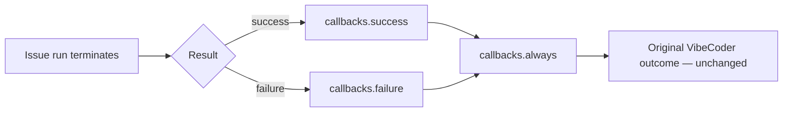
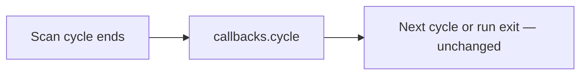
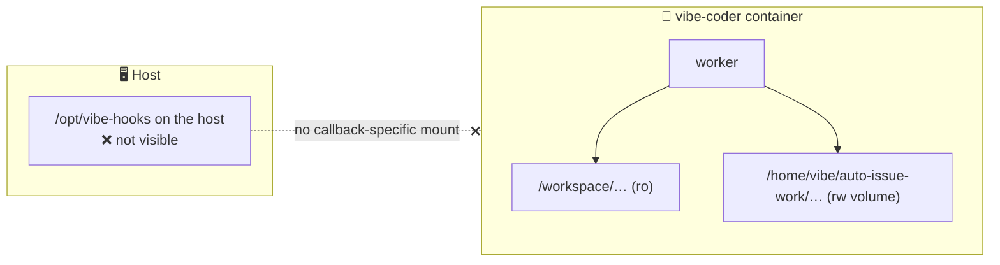

# 🪝 Post-Run Callbacks — the extension contract

Optional executables the worker runs after a **terminal issue run**, following
the `success / failure / always` outcome semantics familiar from CI pipeline
post-build blocks, plus an optional **`cycle` heartbeat** at the end of every
scan loop (Issue #1955). They are the public extension point for fleet-specific
reporting — health records, session-log archival, spend accounting, idle-host
liveness — so none of that policy has to live in VibeCoder.

This page is the **contract**: what fires, what a hook receives, what is
guaranteed, and what a third-party extension is responsible for. The
configuration keys are also summarised in
[Configuration — Post-Run Callbacks](CONFIGURATION.md#-post-run-callbacks); the
contract is documented once, here.

Every property below is provable where you deploy — see
[The conformance fixture](#the-conformance-fixture).

## Configuration

```json
{
  "callbacks": {
    "success": "/opt/vibe-hooks/success.sh",
    "failure": "/opt/vibe-hooks/failure.sh",
    "always": "/opt/vibe-hooks/always.sh",
    "cycle": "/opt/vibe-hooks/cycle.sh",
    "timeout_seconds": 60
  }
}
```

Every entry is optional, and a configuration without a `callbacks` block behaves
exactly as before. A **malformed** block fails the config load rather than
leaving an operator with a hook that silently never runs.

## Ordering and exactly-once scope





- `success` runs only after a terminal **successful** issue run; `failure` only
  after a terminal **failed** one. Exactly one of the two runs.
- `always` runs after the applicable outcome hook, in both cases — including
  when that hook exited non-zero, timed out or could not be spawned at all.
- A hook that is not configured is a no-op, and its absence never skips the
  others.
- **The unit for run hooks is one claimed issue run, not one worker cycle.** A
  claim that was skipped — rejected, or already held by another worker — runs no
  `success` / `failure` / `always` callbacks: no run happened to report. An idle
  cycle that claimed nothing still fires `callbacks.cycle` (Issue #1955) so a
  silent host is distinguishable from an idle one. A launcher that never reaches
  the scan loop emits nothing, including no cycle record.
- A shutdown or an exception after a claim takes the failure/`always` path
  **exactly once**: the claim release, the slot-level catch and the shutdown
  drain share one guard, so a hook is never invoked twice for the same claim.
- Concurrent issue slots each receive their own context; hooks never share state
  between slots, and each slot's `always` runs for that slot alone.

## Invocation and path rules

- The configured path is executed **directly** — no shell, no `sh -c`, no
  arguments — so no issue or repository text can ever be parsed as a command.
- The hook is responsible for its own interpreter: a shell hook needs a
  `#!/bin/sh` shebang and the execute bit.
- Paths must be **absolute** and POSIX. A relative or `~`-relative path is
  rejected at config load, because the worker's working directory changes
  between runs and would resolve the same hook differently each time.

What is rejected, and where:

| Fault                                           | Rejected at | Effect                                                        |
| ----------------------------------------------- | ----------- | ------------------------------------------------------------- |
| non-string, empty or blank path                 | config load | the worker stops; no issue is claimed                         |
| path containing a NUL character                 | config load | the worker stops                                              |
| relative, `~`-relative or non-POSIX path        | config load | the worker stops                                              |
| unknown key inside the `callbacks` block        | config load | the worker stops, naming the recognised keys                  |
| `timeout_seconds` outside 1…3600, or fractional | config load | the worker stops                                              |
| missing, non-executable or un-spawnable path    | invocation  | recorded `spawn_failed`, reported loudly, `always` still runs |

A non-executable path is **never** retried through a shell: there is no fallback
path in which a hook's text could be interpreted as a command. The execute bit
and the file's presence are properties of the filesystem the worker sees at
invocation time, not of the config file, so check them where the worker runs —
[the conformance fixture](#the-conformance-fixture) spawns the hooks you name
and fails on a path that cannot run.

## Filesystem visibility

The worker runs **inside the container** — that is the only run mode
([Containment](CONTAINMENT.md)) — so a hook path is resolved on the filesystem
the container sees, and a host path that is not mounted in is not visible to it.



- **Configuring a callback adds no mount.** The mount set is fixed and built by
  one audited module, so a hook path cannot widen the containment boundary: it
  can only name a path that is already inside it. A path outside the mount set
  simply fails to spawn and is reported — it does not silently escape.
- Practical homes for a hook are therefore the worker checkout mounted read-only
  at `/workspace` (a hook committed to the repository you deploy) or the work
  volume under `/home/vibe/auto-issue-work` (a hook your own provisioning writes
  there).
- The child environment is **cleared** (see below), so a hook inherits none of
  the worker's credential plumbing. A hook that talks to a remote must establish
  its own credentials explicitly — an opt-in, never an accident.

## Timeout, output capture and failure policy

- Every hook is bounded by `timeout_seconds` (default `60`, maximum `3600`). A
  hook that exceeds it is terminated with `SIGTERM` and recorded as `timed_out`
  with exit code `124`. A hook that traps `SIGTERM`, or that forks a child
  holding its output pipes, can outlive that signal — write hooks that terminate
  on it.
- stdout, stderr, the exit code and the duration are captured, passed through
  the worker's secret redaction, truncated to 4,000 characters per stream, and
  logged — including whatever a timed-out hook printed before it was killed.
- **A callback never rewrites the run's own result.** A hook that fails, hangs
  or cannot be spawned is reported loudly, alongside the unchanged VibeCoder
  outcome. Nothing a hook does can turn a failed run green or a successful run
  red.
- Statuses a hook invocation can record: `ok`, `failed`, `timed_out`,
  `spawn_failed`.

## A hook that fails on every issue is reported once

A hook fault is reported per invocation, which is right for a hook that fails
once and wrong for a hook that cannot succeed at all. Observed on GRQ-23 on
2026-09-05: the `always` hook failed on **every** issue across at least five
runs, each failure costing about 100 seconds of slot time, and raised nothing a
human ever saw. A fault that needs a human is itself a bug, so the worker now
counts the streak and escalates it.

- The worker keeps a consecutive-failure count **per event** in
  `$WORK_DIR/callback-failure-streaks.json`. It survives the run boundary,
  because the condition does.
- On the **third** consecutive failing issue, the worker files (or comments on)
  one deduplicated issue in its **own** repository, titled
  `Post-run <event> callback failing on <host>` — the shared host-escalation
  channel, so an ongoing condition stays one incident however long it runs.
- **One report per streak.** The fourth failure and the four-hundredth add
  nothing. A single successful invocation clears the count, so the next fault is
  reported afresh.
- **The report retires itself** (Issues #2039, #2041). The success that ends a
  reported streak closes the issue the worker raised, with the recovery — which
  run, after how many failures — as the closing comment. Only an issue a fleet
  account opened is closed; somebody else's title match is left alone. A
  success that ends a streak too short to have been reported closes nothing.
- The report names the hook path, the last run, the exit code, the duration,
  the hook's captured (redacted) stderr, and the callback schema version this
  worker exports, so a hook refusing the version is diagnosed by the report
  rather than by a human reading the stderr.
- Delivery is best-effort in one direction only: a report that could not be
  filed, or a closure that was refused, is logged as an error, and nothing
  about it alters the run's own result.

**What a hook author owes in return.** The worker bounds a hook's wall clock and
reports its outcome; it cannot see inside it. A hook that retries must classify
its own failures:

- **Fail fast on a permanent authorisation failure.** `HTTP 403`,
  `Write access to repository not granted` and `permission denied` will not be
  cleared by a retry, and rebase-and-retry is the answer to a rejected
  non-fast-forward push, never to a refused one. Retrying such a failure five
  times spends the timeout budget to reach the same answer, on every issue.
- **Bound anything the hook carries forward.** A hook that queues work it could
  not deliver — an unpushed record, a spooled file — must cap the queue and say
  what it dropped when the cap is reached. An unbounded backlog makes each run
  more expensive than the last.

## What a hook receives

The environment is **cleared** before it is populated: only `PATH`, `HOME`,
`LANG`, `TZ` and `TMPDIR` are inherited from the worker, so no credential
crosses into a callback. Prompt bodies and transcript contents are never
exported.

`VIBECODER_CALLBACK_CONTEXT` names a versioned JSON document written for that
invocation (mode `0600`) and removed after it exits:

```json
{
  "schemaVersion": 2,
  "event": "success",
  "runId": "vibe-mtk92vcu-ebcc11",
  "result": "success",
  "repository": "owner/repo",
  "issueNumber": 807,
  "host": "worker-1",
  "workerName": "fleet-a",
  "provider": "claude",
  "sessionId": "…",
  "sessionLogPath": "/home/vibe/logs/agent-vibe-mtk92vcu-ebcc11-807.jsonl",
  "startedAt": "2026-09-03T01:00:00.000Z",
  "finishedAt": "2026-09-03T01:31:12.000Z",
  "durationSeconds": 1872,
  "exitCode": 0,
  "telemetry": {
    "inputTokens": 1200,
    "outputTokens": 340,
    "cacheCreationTokens": 90,
    "cacheReadTokens": 20,
    "estimatedCostUsd": 0.42
  },
  "outcome": {
    "kind": "pr",
    "prNumber": 807,
    "phase": "completion"
  }
}
```

The same facts are exported as scalars, one variable each:

| Environment variable                  | JSON field                      | Always present | Meaning                                                                                                              |
| ------------------------------------- | ------------------------------- | -------------- | -------------------------------------------------------------------------------------------------------------------- |
| `VIBECODER_CALLBACK_SCHEMA_VERSION`   | `schemaVersion`                 | yes            | Contract version — see [Versioning](#versioning--the-contract-is-additive)                                            |
| `VIBECODER_CALLBACK_EVENT`            | `event`                         | yes            | `success`, `failure`, `always` or `cycle`                                                                            |
| `VIBECODER_CALLBACK_CONTEXT`          | —                               | yes            | Path to the JSON document for this invocation                                                                        |
| `VIBECODER_RUN_ID`                    | `runId`                         | yes            | Worker run id                                                                                                        |
| `VIBECODER_RESULT`                    | `result`                        | yes            | The run's own result: `success` or `failure`                                                                         |
| `VIBECODER_REPOSITORY`                | `repository`                    | yes            | `owner/repo` the run worked                                                                                          |
| `VIBECODER_ISSUE_NUMBER`              | `issueNumber`                   | yes            | Issue number the run worked                                                                                          |
| `VIBECODER_HOST`                      | `host`                          | yes            | Host the worker runs on                                                                                              |
| `VIBECODER_WORKER_NAME`               | `workerName`                    | no             | Operator-configured worker name                                                                                      |
| `VIBECODER_PROVIDER`                  | `provider`                      | no             | Agent provider that served the run                                                                                   |
| `VIBECODER_SESSION_ID`                | `sessionId`                     | no             | Agent session id                                                                                                     |
| `VIBECODER_SESSION_LOG_PATH`          | `sessionLogPath`                | no             | Absolute path to this run's transcript, verified on disk                                                             |
| `VIBECODER_SESSION_LOG_ABSENT_REASON` | `sessionLogAbsentReason`        | no             | Why the path is missing (`tee_disabled`, `log_dir_unavailable`, `size_cap_exceeded`, `write_failed`, `file_missing`) |
| `VIBECODER_STARTED_AT`                | `startedAt`                     | yes            | ISO-8601 claim time                                                                                                  |
| `VIBECODER_FINISHED_AT`               | `finishedAt`                    | yes            | ISO-8601 termination time                                                                                            |
| `VIBECODER_DURATION_SECONDS`          | `durationSeconds`               | yes            | Wall-clock seconds from claim to termination                                                                         |
| `VIBECODER_EXIT_CODE`                 | `exitCode`                      | yes            | `0` on success, non-zero on failure                                                                                  |
| `VIBECODER_INPUT_TOKENS`              | `telemetry.inputTokens`         | no             | Input tokens the run reported                                                                                        |
| `VIBECODER_OUTPUT_TOKENS`             | `telemetry.outputTokens`        | no             | Output tokens the run reported                                                                                       |
| `VIBECODER_CACHE_CREATION_TOKENS`     | `telemetry.cacheCreationTokens` | no             | Cache-creation tokens                                                                                                |
| `VIBECODER_CACHE_READ_TOKENS`         | `telemetry.cacheReadTokens`     | no             | Cache-read tokens                                                                                                    |
| `VIBECODER_ESTIMATED_COST_USD`        | `telemetry.estimatedCostUsd`    | no             | Estimated spend in USD                                                                                               |
| `VIBECODER_TELEMETRY_ABSENT_REASON`   | `telemetryAbsentReason`         | no             | Why telemetry is missing (`agent_not_invoked`, `usage_not_reported`, `provider_unsupported`)                         |
| `VIBECODER_OUTCOME_KIND`              | `outcome.kind`                  | no             | Structured result: `pr`, `no_pr`, `no_pr_expected`, `superseded`, `summary_incomplete`, `claim_stale`                |
| `VIBECODER_OUTCOME_CATEGORY`          | `outcome.category`              | no             | `FailureCategory` when `kind` is `no_pr`                                                                             |
| `VIBECODER_OUTCOME_PHASE`             | `outcome.phase`                 | no             | Phase that terminated the run                                                                                        |
| `VIBECODER_OUTCOME_FAILURE_CLASS`     | `outcome.failureClass`          | no             | Classifier slug for a no-PR run                                                                                      |
| `VIBECODER_PR_NUMBER`                 | `outcome.prNumber`              | no             | PR number when one exists, including a later-step failure                                                            |

A cycle hook additionally receives `VIBECODER_ISSUES_SCANNED`,
`VIBECODER_CLAIMS_ATTEMPTED`, `VIBECODER_CLAIMS_TAKEN` and
`VIBECODER_CYCLE_END_REASON` (`no_eligible_work`, `quota_paused`,
`rate_limited`, `shutdown`, `error`). It does **not** receive run-only scalars
(`RESULT`, `REPOSITORY`, `ISSUE_NUMBER`, `EXIT_CODE`, …), so it cannot be
mistaken for a run hook.

Every run context has either `telemetry` or `telemetryAbsentReason`, and either
`sessionLogPath` or `sessionLogAbsentReason` — never neither (Issue #1948).
Other optional facts the run could not supply — no provider, no session — are
**omitted** from both the document and the environment rather than emitted
empty, so `[ -n "$VIBECODER_SESSION_ID" ]` is a truthful test. `result` and
`exitCode` are unchanged (Issue #1947): hooks keyed on them keep working.

## Versioning — the contract is additive

`schemaVersion` is a compatibility number, not a changelog. The rule, on both
sides of the boundary:

- **VibeCoder only adds.** A new field, a new value in an existing field, a new
  event — none of these bumps `schemaVersion`. Every field an earlier version
  exported is still exported, under the same name, with the same meaning and
  the same type. `worker/deno/tests/callback_schema_compat_test.ts` pins the
  schema 1 field set so a removal fails in review rather than in the fleet.
- **A bump is a fleet-wide breaking change.** The number moves only when a
  field is removed or its meaning changes, and that is a decision with a
  release-notes entry, a release-floor move and the extensions upgraded
  **before** the worker ships — never a side effect of a feature. The worker
  updates itself on every host within the hour; an operator's hooks do not.
- **A hook refuses the versions it cannot read, not the versions it has not
  met.** Refuse a malformed version, and refuse a version _older_ than the one
  the hook was written against if it depends on a later field. A **newer**
  version keeps every field the hook knows: continue on those fields, and warn
  once that the contract has moved so the extension author looks at what was
  added. [The conformance fixture](#the-conformance-fixture) proves this where
  the hooks are deployed: its `newer-schema-version-served` check drives your
  hooks with a version one above the worker's and fails if either refuses it.
- **The worker side is pinned.** `callback_schema_compat_test.ts` fails when
  `CALLBACK_SCHEMA_VERSION` moves, so a bump cannot land as a side effect; the
  test's own text lists what a legitimate bump must have done first.

**The scar (Issues #2039, #2041).** On 2026-09-11 schema 2 added `outcome`,
the absence reasons and the cycle event — all additive — and the number was
raised anyway. The deployed hooks did exactly what this page then told them
to, refused a version they did not know, and every callback on every host in
the fleet failed on every issue: no health heartbeat, no run archive, one
escalation per host per hook, and a reinstall by hand on each host to recover.
Nothing about the change needed a bump; the bump was the outage.

The worker reports a hook that refuses its schema version the same way it
reports any other permanent hook failure
([above](#a-hook-that-fails-on-every-issue-is-reported-once)); the report
names the version the worker exports so the remedy — upgrade the extension on
that host — is the first line, not a diagnosis.

## Session logs are sensitive — redaction is the hook author's job

`VIBECODER_SESSION_LOG_PATH` is present only when the agent transcript tee was
enabled for that run — `"agent_transcript_enabled": true` in `.config.json`, off
by default (Issue #1141) — **and** the file exists on disk. When it is absent,
`sessionLogAbsentReason` names why (Issue #1948). When the path is present:

- The transcript is the **raw agent stream** for that run: model output, issue
  and repository text, file contents the agent read, and command output. It is
  written through the worker's console secret redaction, which is a safety net
  for known credential shapes — **not** a guarantee that the file carries no
  sensitive repository content.
- Only the **path** is exported. VibeCoder never puts transcript contents into
  the environment or the context document; reading the file is the hook's
  decision.
- **A hook that exports a transcript anywhere — a health repository, an archive
  bucket, a chat channel — owns the redaction of what it exports.** Treat the
  file as private repository data: redact before export, restrict who can read
  the destination, and apply your own retention.
- The path belongs to **that run**: it embeds the run id and issue number. A
  hook must not infer another run's transcript from it, and a concurrent slot's
  hook receives its own path or none.
- The transcript is worker-managed: log cleanup and rotation age it out, so a
  hook that wants a durable copy must take one during its invocation rather than
  record the path for later.

## Minimal portable hooks

POSIX `/bin/sh`, no bashisms, safe under an unattended worker. Each needs the
execute bit (`chmod 700`) and an absolute path inside the container.

`success.sh` — record a run that finished cleanly:

```sh
#!/bin/sh
set -eu
printf '%s %s#%s ok in %ss\n' \
  "$VIBECODER_FINISHED_AT" "$VIBECODER_REPOSITORY" \
  "$VIBECODER_ISSUE_NUMBER" "$VIBECODER_DURATION_SECONDS" \
  >> "$HOME/auto-issue-work/vibe-runs.log"
```

`failure.sh` — record a failed run, with the spend it still cost:

```sh
#!/bin/sh
set -eu
cost="${VIBECODER_ESTIMATED_COST_USD:-unknown}"
printf '%s %s#%s FAILED (exit %s, cost %s)\n' \
  "$VIBECODER_FINISHED_AT" "$VIBECODER_REPOSITORY" \
  "$VIBECODER_ISSUE_NUMBER" "$VIBECODER_EXIT_CODE" "$cost" \
  >> "$HOME/auto-issue-work/vibe-runs.log"
```

`always.sh` — keep the whole context document, whatever the outcome:

```sh
#!/bin/sh
set -eu
archive="$HOME/auto-issue-work/vibe-contexts"
mkdir -p "$archive"
# Copy, never move: the worker removes the original after this hook exits.
cp "$VIBECODER_CALLBACK_CONTEXT" \
  "$archive/$VIBECODER_RUN_ID-$VIBECODER_ISSUE_NUMBER-$VIBECODER_CALLBACK_EVENT.json"
```

`cycle.sh` — record an idle (or otherwise ended) scan cycle:

```sh
#!/bin/sh
set -eu
printf '%s host=%s scanned=%s claimed=%s reason=%s\n' \
  "$VIBECODER_FINISHED_AT" "$VIBECODER_HOST" \
  "$VIBECODER_ISSUES_SCANNED" "$VIBECODER_CLAIMS_TAKEN" \
  "$VIBECODER_CYCLE_END_REASON" \
  >> "$HOME/auto-issue-work/vibe-cycles.log"
```

Notes that apply to all four:

- `set -eu` so the hook **fails loud**; its non-zero exit is captured and
  reported, and never changes the run's own result.
- Finish well inside `timeout_seconds`, and do not fork a background child that
  outlives the hook — it will hold the output pipes past the timeout.
- Do not assume any environment beyond `PATH`, `HOME`, `LANG`, `TZ`, `TMPDIR`
  and the `VIBECODER_*` set above.

## The conformance fixture

Reading a contract is not the same as proving it. The worker ships a fixture
that drives the **production** callback runner over **real** subprocesses and
reports a verdict per property:

```bash
cd worker/deno
deno task callback-conformance                       # prove the contract here
deno task callback-conformance \
  --success /opt/vibe-hooks/success.sh \
  --failure /opt/vibe-hooks/failure.sh \
  --always  /opt/vibe-hooks/always.sh \
  --cycle   /opt/vibe-hooks/cycle.sh                  # …against your own hooks
```

It exits non-zero when any check fails, so an extension can run it as a gate in
its own CI. Run it **inside the container**, where the hooks will really run.
Hook paths are validated by the same parser `.config.json` uses, so a path the
fixture accepts is a path the worker will load. `--timeout-seconds` overrides
the budget the fixture gives each hook (its own default is 10 seconds — short,
because a conformance run should not take a minute to fail; the contract's own
default remains 60). The one exception is the scenario that deliberately hangs a
hook, which keeps a one-second budget of its own so that proving the timeout
does not cost the whole budget; the `always` hook it runs alongside has already
been driven by the preceding scenario, so a loaded host cannot turn that second
into a false failure.

| Check                                | Proves                                                                                       |
| ------------------------------------ | -------------------------------------------------------------------------------------------- |
| `success-then-always`                | a successful run fires `success`, then `always`, once each                                   |
| `failure-then-always`                | a failed run fires `failure`, then `always`, once each                                       |
| `always-after-outcome-fault`         | `always` still runs after an outcome hook that failed or timed out                           |
| `result-unchanged-by-callback-fault` | a callback fault leaves the original VibeCoder result unchanged                              |
| `concurrent-context-isolation`       | context fields identify the correct concurrent run                                           |
| `session-log-belongs-to-run`         | the transcript path, when present, belongs to that run — and its contents are never exported |
| `cycle-heartbeat`                    | an idle cycle fires `callbacks.cycle` once, with no run-only scalars                         |
| `newer-schema-version-served`        | your `success` and `always` hooks serve a schema version newer than this worker's            |

With no hook paths the fixture uses its own portable `/bin/sh` hooks. With them
it drives your executables for the two ordering checks, your `always` hook for
the fault check, your `cycle` hook for the heartbeat check, and your `success`
and `always` hooks for the newer-version check; checks that need
a **deliberate** fault (a hook told to exit non-zero or hang) always inject a
fixture hook, since your hook cannot be asked to fail on demand, and the two
observation checks use fixture hooks that report what they saw.

Sample output:

```text
Post-run callback conformance: 8/8 checks passed
PASS success-then-always — a successful run runs success, then always
     success=ok(exit 0) → always=ok(exit 0), exactly once each
…
```

## Migrating from `fleet_health_dir` / `fleet_health_repo`

The built-in health tracking (`fleet_health_repo`, optionally `fleet_health_dir`
— see [Configuration](CONFIGURATION.md#-configuration-defaults)) clones an
operator's health repository into the work volume and runs **that repository's
own report script** on each priority-loop iteration and at the end of a run. It
works, but the schedule, the clone and the timeout all live in VibeCoder, and
the reported facts are whatever that one script happens to collect.

A callback moves the reporting policy out: the hook decides what a record
contains and where it lands, and VibeCoder needs no setting for it.

> **📣 The migration in release order** — which edit lands before the pin move,
> which has to land with it, what to observe on the canary before the rest of
> the fleet follows, and how to roll back — is
> [Release notes — 1.2.0](RELEASE-NOTES.md). This section is the before/after
> mapping.

| Built-in health tracking                         | Callback equivalent                                                                   |
| ------------------------------------------------ | ------------------------------------------------------------------------------------- |
| `fleet_health_repo` / `fleet_health_dir` (clone) | nothing — the hook owns its own checkout and paths                                    |
| `FLEET_HEALTH_TIMEOUT_MS`                        | `callbacks.timeout_seconds`                                                           |
| host identity resolved by the worker             | `VIBECODER_HOST`, `VIBECODER_WORKER_NAME`                                             |
| per-iteration heartbeat and end-of-run report    | `callbacks.cycle` once per scan cycle, plus one invocation per **terminal issue run** |
| facts the report script collects for itself      | the context document and the `VIBECODER_*` scalars                                    |
| errors swallowed as best-effort                  | every fault reported loudly; the run's result unchanged                               |

Steps:

1. Write an `always` hook that records what your fleet actually wants, using the
   [portable examples](#minimal-portable-hooks) as the starting point.
2. Put it at an absolute path visible **inside the container** — committed to
   the worker checkout under `/workspace`, or provisioned into the work volume.
3. Add the `callbacks` block naming it, and set `timeout_seconds` to whatever
   your recording actually needs.
4. Prove it with `deno task callback-conformance --always <path>` before you
   rely on it.
5. Once the hook covers your reporting, clear `fleet_health_repo` (the
   interactive setup accepts `-` to turn tracking off) so the built-in heartbeat
   stops.

Two differences to plan for:

- **Cadence.** The built-in reports on every loop iteration, so it keeps a
  heartbeat alive on a host doing nothing. `callbacks.cycle` is that heartbeat
  for the archive (Issue #1955): an idle host that reaches the scan loop emits
  one record per cycle naming why it ended. A launcher that never reaches the
  loop emits nothing, including no cycle record — silence means dead, not idle.
  Run hooks (`success` / `failure` / `always`) still fire only when an issue run
  terminates.
- **Credentials.** The report script inherits the worker's environment; a hook
  does not. A hook that pushes to a git remote must establish its own
  credentials rather than expecting the worker's to be there.

## Reference

| Concern                          | Implementation                                 |
| -------------------------------- | ---------------------------------------------- |
| `callbacks` block and validation | `worker/deno/lib/run_callbacks_config.ts`      |
| The runner, environment, capture | `worker/deno/lib/run_callbacks.ts`             |
| Context assembly and transcript  | `worker/deno/lib/run_callback_context.ts`      |
| Exactly-once guard               | `worker/deno/lib/issue_callback_guard.ts`      |
| Conformance fixture              | `worker/deno/lib/callback_conformance.ts`      |
| `callback-conformance` command   | `worker/deno/commands/callback_conformance.ts` |
