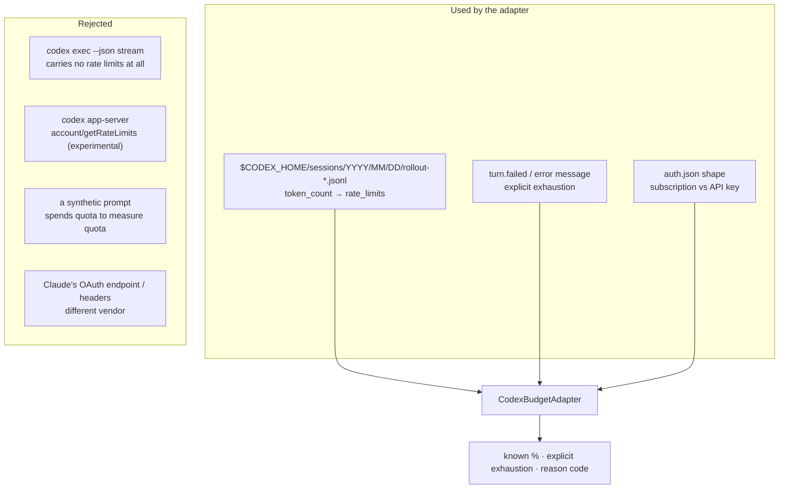

# Codex Budget Sources — What Was Verified, and What the Worker Uses

> Issue #1697, parent #1694. Verified against **`openai/codex` at tag
> `rust-v0.147.0`** — the exact release `container/providers/codex.sh` downloads
> and checksums against the `codex` pin in `container/tools.json`.

Claude's remaining budget comes from `anthropic-ratelimit-*` headers on a
`POST /v1/messages` probe (`worker/deno/lib/claude_token_budget.ts`). **None of
that transfers to Codex.** Different vendor, different credential, different
header family, different quota model. This document records what the pinned
Codex CLI actually exposes, how that was established, and which of it the worker
reads.

## How this was verified

The Codex CLI is not installed in the worker's own container — a default image
is Claude-only, and `AGENT_PROVIDERS="claude,codex"` is what puts both CLIs in
one image — so this is a **source reading of the pinned release**, not captured
live output. Every claim below cites the file it came from, so a version bump
can re-check it in minutes. The opt-in `codex-budget` diagnostic is the live
half: run it against a real `CODEX_HOME` and it prints what that credential's
telemetry really contains.

## The verified sources



### 1. Rollout session files — the budget source

`should_persist_event_msg` (`codex-rs/rollout/src/policy.rs`) returns `true` for
`EventMsg::TokenCount(_)`, and `TokenCountEvent`
(`codex-rs/protocol/src/protocol.rs`) is
`{ info, rate_limits: Option<RateLimitSnapshot> }`. Rollout lines are written to
`$CODEX_HOME/sessions/YYYY/MM/DD/rollout-<ISO ts>-<id>.jsonl`
(`codex-rs/rollout/src/recorder.rs`). `RolloutLine` flattens `RolloutItem`,
which is
`#[serde(tag = "type", content = "payload", rename_all = "snake_case")]`, so one
line looks like:

```json
{"timestamp":"2026-09-09T01:05:00.000Z","ordinal":9,"type":"event_msg","payload":{"type":"token_count","info":{…},"rate_limits":{"limit_id":"codex","primary":{"used_percent":18.0,"window_minutes":300,"resets_at":1788483600},"secondary":{"used_percent":92.5,"window_minutes":10080,"resets_at":1788829200},"plan_type":"pro"}}}
```

This is the source the worker reads, because it is **free**: the file was
already written by a run the worker already paid for, so reading it consumes no
quota whatsoever.

`RateLimitWindow` (`protocol.rs`) documents its three fields, and each one is a
trap if assumed rather than read:

| Field            | Meaning                                                   | Trap                                                                  |
| ---------------- | --------------------------------------------------------- | --------------------------------------------------------------------- |
| `used_percent`   | "Percentage (0-100) of the window that has been consumed" | A **percentage**, not a fraction — Claude's `utilization` is `[0, 1]` |
| `window_minutes` | "Rolling window duration, in minutes"                     | Not fixed: the server may change it between snapshots                 |
| `resets_at`      | "Unix timestamp (**seconds** since epoch)"                | This repo's `resetEpochMs` convention is milliseconds                 |

### 2. Explicit exhaustion — from the run's own failure

A 429 becomes `CodexErrorDetails::UsageLimitReached`, whose `Display`
(`codex-rs/protocol/src/error.rs`) produces the operator-facing prose the exec
JSON stream carries in `turn.failed` / `error`:

- `You've hit your usage limit. …`
- `You've hit your usage limit for <limit name>. Switch to another model now, …`
- `Your workspace is out of credits. …`
- `You hit your spend cap set in your workspace. …`
- `Quota exceeded. Check your plan and billing details.`
- `To use Codex with your ChatGPT plan, upgrade to Plus: …`
- `unexpected status 429 Too Many Requests: …` (`UnexpectedResponseError`)

**The reset time in those messages is unusable.** `format_retry_timestamp`
renders `resets_at.with_timezone(&Local)` as `%-I:%M %p`, or
`%b %-d…, %Y %-I:%M %p` on another day: the _host's_ local time, with no offset
and no year for a same-day reset. No instant can be recovered from it, so the
adapter records the exhaustion and leaves the reset **unknown** rather than
guessing a timezone — and rechecks conservatively instead (60s minimum between
reads).

### 3. `auth.json` — subscription or API key

`AuthDotJson` (`codex-rs/login/src/auth/storage.rs`) is `$CODEX_HOME/auth.json`
with an optional `auth_mode`, an `OPENAI_API_KEY` string and an optional
`tokens` object; `AuthMode` (`codex-rs/protocol/src/auth.rs`) serialises
lowercase with explicit renames for the camelCase variants.

**An API-key account has no subscription window.** Its spend is bounded by the
account's own rate limits and billing, so the adapter answers `api-key-account`
— an explicit unknown — rather than inventing a weekly allowance for the pool to
rank on. Only credential _presence_ is read; no token value is ever opened,
returned or logged.

## The five facts the issue asked about

| Fact                       | Exposed?  | Where from                                                                                                                                                                                                                                                                                                             |
| -------------------------- | --------- | ---------------------------------------------------------------------------------------------------------------------------------------------------------------------------------------------------------------------------------------------------------------------------------------------------------------------- |
| Remaining quota            | ✅        | `rate_limits.primary/secondary.used_percent` — a percentage `0`–`100`, so remaining is `100 - used`                                                                                                                                                                                                                    |
| Window duration            | ✅        | `window_minutes`, in minutes, and **not fixed** — the server may change it between snapshots, so the adapter records what it was told rather than reconciling against the previous reading                                                                                                                             |
| Reset time                 | ⚠️ partly | `resets_at`, epoch **seconds**, on a rollout snapshot. On an exhaustion _message_ it is unrecoverable (host-local time, no offset), so the adapter leaves it unknown and rechecks conservatively                                                                                                                       |
| Retry-after                | ❌        | `CodexErr` carries a `retry_delay: Option<Duration>` (`codex-rs/protocol/src/error.rs`) but it is consumed by the CLI's **own** retry loop and is never serialised: `ThreadErrorEvent` — the only error shape `--json` emits — is `{ message: String }` and nothing else. There is no retry-after for a caller to read |
| Account / credential scope | ✅        | `limit_id` names the server-side limit family (`codex`, `codex_secondary`, …), `limit_name` the specific limit when one is named, `plan_type` the ChatGPT plan. The _account_ is scoped by `CODEX_HOME`: one `CodexBudgetAdapter` per `CODEX_HOME`, and two credentials never share a cache                            |

## What was rejected, and why

- **`codex exec --json` itself.** Under `--json` the exec front end emits
  `ThreadEvent` (`codex-rs/exec/src/exec_events.rs`): `thread.started`,
  `turn.started`, `turn.completed`, `turn.failed`, `item.*` and `error`. There
  is **no `rate_limits` field anywhere in that enum** — the rate-limit-bearing
  `token_count` event belongs to the internal `EventMsg` protocol, which
  `--json` does not print. Parsing the worker's existing Codex stdout for quota
  would find nothing, for ever. This is the single most important negative
  finding here.
- **`codex app-server`'s `account/getRateLimits`.** It exists
  (`codex-rs/app-server-protocol/src/protocol/v2/account.rs`) and would give a
  free reading, but the whole `AppServer` subcommand is marked `[experimental]`
  in `codex-rs/cli/src/main.rs` and the request is tagged `ExperimentalApi`.
  Wiring an unattended fleet to an experimental JSON-RPC daemon is a larger
  commitment than this read-only adapter; it is the recorded upgrade path, not
  the current source.
- **A synthetic prompt to read the quota off the response.** Codex has no
  `max_tokens: 0` equivalent that returns rate-limit headers, so a probe would
  have to run a real turn — spending quota to estimate quota. Forbidden.
- **Claude's OAuth usage endpoint and `anthropic-ratelimit-*` headers.**
  Different vendor. Not tried, not assumed.
- **Browser cookies, or a broader OAuth scope.** Neither is a supported Codex
  mechanism, and both widen the credential blast radius for a number.
- **A token count converted to a percentage.** `TokenUsage` describes the
  _context_ window, not the _subscription_ window; dividing one by the other
  would fabricate a figure. Absent, never invented.

## What the adapter guarantees

`worker/deno/lib/codex_budget.ts` holds one cached snapshot per `CODEX_HOME`:

| Behaviour   | Guarantee                                                                                                                                                                                   |
| ----------- | ------------------------------------------------------------------------------------------------------------------------------------------------------------------------------------------- |
| Cost        | Never runs a Codex turn; reads only files the CLI already wrote                                                                                                                             |
| Recheck     | At most one disk read per 60s per `CODEX_HOME`                                                                                                                                              |
| Concurrency | Concurrent `refresh()` calls join one read, never two                                                                                                                                       |
| Exhaustion  | Recorded immediately, overriding the cache, without waiting for the interval                                                                                                                |
| Staleness   | Surfaced via `isStale()`; an old reading is never downgraded to unknown by age alone                                                                                                        |
| Unknowns    | Retained with a reason code — `no-session-file`, `no-rate-limit-event`, `unrecognised-snapshot-shape`, `read-error`, `api-key-account`, `auth-mode-unknown`, `auth-rejected` — never a zero |
| Bounds      | Only the newest 3 session files, only their last 256 KiB, only 14 day directories                                                                                                           |
| Secrets     | Reads credential _presence_ only; the diagnostic's output is passed through `redactSecrets`                                                                                                 |

## The live diagnostic

Opt-in, read-only, and safe to run against a production `CODEX_HOME`:

```bash
deno run --allow-read --allow-env worker/deno/mod.ts codex-budget \
    --codex-home ~/.codex
```

It prints percentages, window durations, reset instants, reason codes and the
credential _kind_ — no token, key, account id, email or credit balance. No
credentials are committed to this repository for it, and it consumes no quota.

## Out of scope here

No automatic provider switching. Ranking Codex credentials against each other,
and pausing or switching on the strength of a snapshot, are #1696 and #1698;
this issue supplies the snapshot they rank on.
