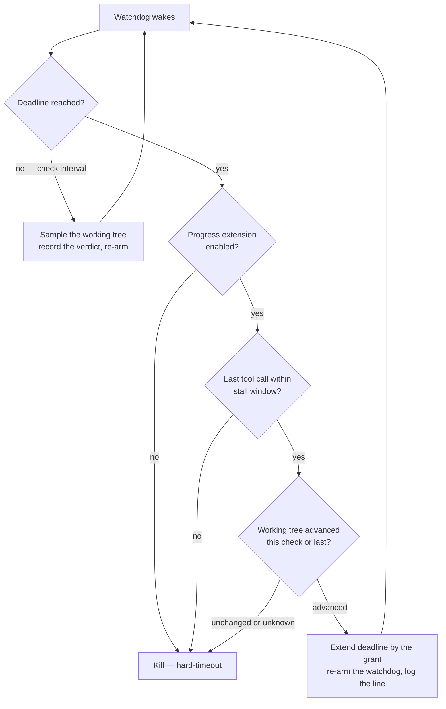
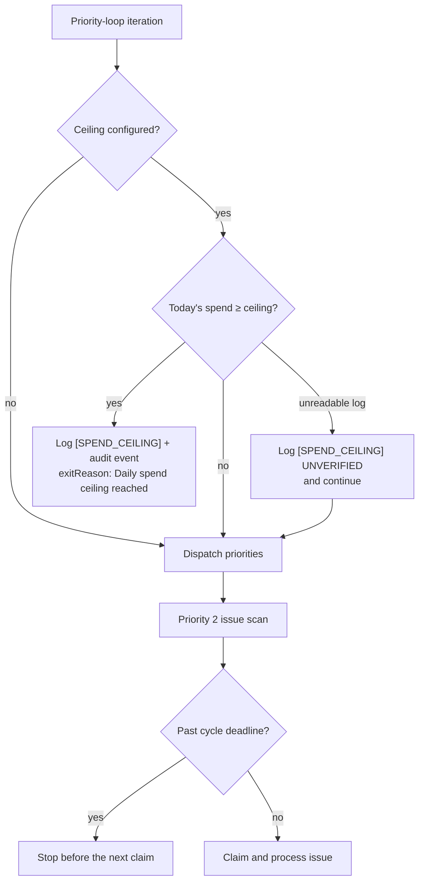
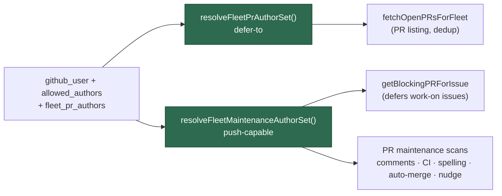
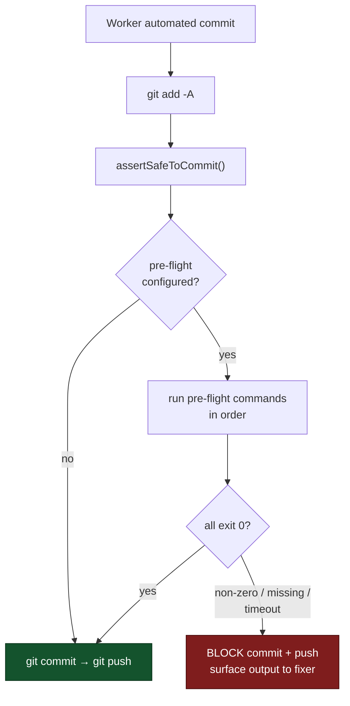
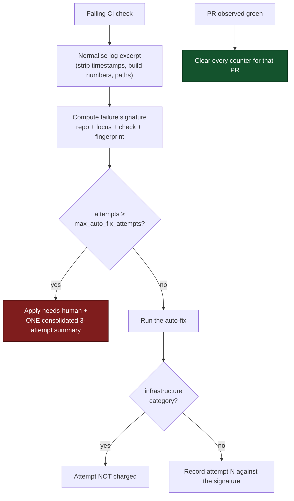
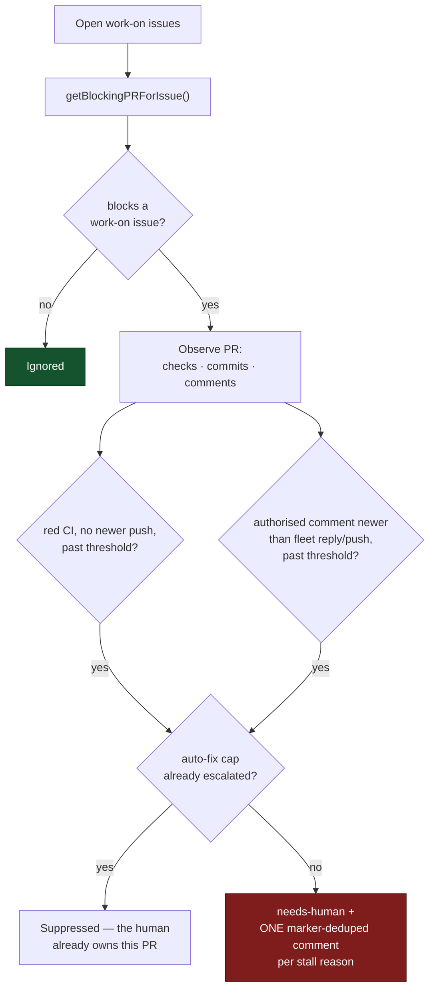
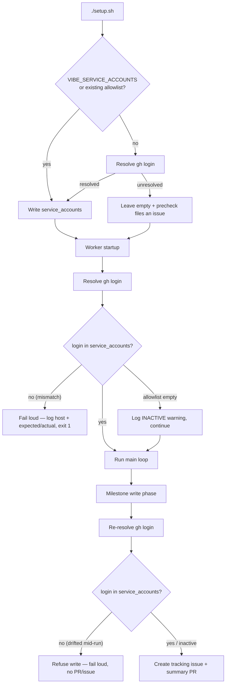

# ⚙️ Configuration Reference

This document covers all configuration options for VibeCoder. For a quick
overview, see the [main README](../README.md).

## 📋 Table of Contents

- [Configuration File](#configuration-file)
- [Multiple Allowed Authors](#multiple-allowed-authors)
- [Multiple PR (Pull Request) Reviewers](#multiple-pr-reviewers)
- [Configuration Defaults](#configuration-defaults)
- [Effort Level Configuration](#-effort-level-configuration-issue-1402)
- [Session Resume](#-session-resume-issue-1324)
- [Session Compaction](#-session-compaction-issue-1328)
- [Context Budget Monitoring](#-context-budget-monitoring-issue-1327)
- [Authorised Commenters](#authorised-commenters)
- [Bot Accounts](#bot-accounts)
- [Per-Repository Configuration](#per-repository-configuration)
- [Pre-Setup Command](#pre-setup-command)
- [Service Account Authentication (SSH (Secure Shell) + gh auth)](#service-account-authentication-ssh--gh-auth)
- [Monitored Repositories](#monitored-repositories)

## 📂 Configuration File

All runtime configuration is managed through a `.config.json` (JSON = JavaScript
Object Notation) file created by `./setup.sh`. Environment variables do not
override config file values at runtime (Issue #266). To change configuration,
either re-run `./setup.sh` or edit `.config.json` directly.

The `.config.json` file contains only your overridden values — defaults are not
written to the file. This means when a default changes in the codebase, it flows
to all users unless explicitly overridden.

```json
{
  "allowed_authors": ["user1", "user2", "user3"],
  "pr_reviewers": ["reviewer1", "reviewer2", "reviewer3"],
  "repos": ["your-org/repo1", "your-org/repo2"],
  "authorized_commenters": ["your-github-username", "github-copilot[bot]"],
  "claude_model": "opus",
  "claude_timeout": 7200,
  "sleep_interval": 60
}
```

> **📝 Note:** The default branch is automatically detected per repository via
> the GitHub API (API = Application Programming Interface) (Issue #140). You
> don't need to configure it manually.

The `./setup.sh` script creates this file. Only values that differ from the
built-in defaults are written.

Re-running `./setup.sh` rewrites `.config.json`, and every key you set by hand
survives that rewrite (Issue #4033) — including keys setup itself never asks
for, such as `fleet_pr_authors` and `worker_name`. The only keys removed are:

- The three hardwired discovery labels (`issue_labels`, `work_on_label`,
  `low_priority_label`), which are not configurable (Issue #1834).
- `repo_config` entries whose repo is not in `repos` — dead config nothing
  reads. Each removal is printed as a warning, and a running worker raises the
  same non-blocking warning at startup config validation.

## 👥 Multiple Allowed Authors

The `allowed_authors` array lets multiple users schedule tasks. Each user in the
array can:

- Create issues that are automatically processed
- Add the `work-on` label to trigger work on issues created by others
- Add the `ignore-open-prs` label to bypass open PR checks
- Invite the worker onto their **own** PR — see
  [Human-authored PR policy](HUMAN-PR-POLICY.md)

For backward compatibility, the legacy `allowed_author` (singular) string is
still supported and will be converted to an array internally.

### Trusted humans are not fleet hosts (Issue #4074)

Two lists name GitHub logins and they grant opposite things. Merging them is the
regression recorded in Issue #4074, so read the distinction before editing
either:

| List               | Members              | What membership grants                                                        |
| ------------------ | -------------------- | ------------------------------------------------------------------------------ |
| `fleet_pr_authors` | Sibling fleet logins | Their PRs are **maintained** — claimed, fixed, commented on, merged             |
| `allowed_authors`  | Trusted humans       | They may **instruct** the worker — issues, labels, comments, invitations        |

In one line: **trusted to command, not to be commanded.** A trusted human's PR
is **deferred to but never adopted** — the worker waits behind it so it never
raises a duplicate, but never claims, pushes to, comments on, or merges it
unless that human explicitly invites it. Adding a login to `allowed_authors`
therefore grants no PR-maintenance rights at all; only `fleet_pr_authors` does
that.

The full policy — what the worker will and will not do, how to invite it, how to
revoke, and what happens when a human PR blocks a `work-on` issue — is in
[Human-authored PR policy](HUMAN-PR-POLICY.md).

## 👥 Multiple PR Reviewers

The `pr_reviewers` array lets you configure multiple users to be requested as
reviewers when PRs are created. All users in the array will be requested to
review each PR.

For backward compatibility, the legacy `pr_reviewer` (singular) string is still
supported and will be converted to an array internally. You can also use the
singular key with an array value:

```json
{
  "pr_reviewer": ["alice-dev", "bob-dev", "charlie-dev"]
}
```

## 📊 Configuration Defaults

The following settings have built-in defaults. Only values you override via
`.config.json` (created by `./setup.sh`) need to be configured. If a default
changes in the codebase, the new default flows to all installations unless
explicitly overridden.

| Setting                      | Default                   | Description                                                                                                                                                                                                                                                                                      |
| ---------------------------- | ------------------------- | ------------------------------------------------------------------------------------------------------------------------------------------------------------------------------------------------------------------------------------------------------------------------------------------------------------------------------------------------------------------------------------------------------------------------------- |
| `failed_label`               | `failed`                  | Label applied after second failure (issue permanently failed)                                                                                                                                                                                                                                    |
| `failed_once_label`          | `failed-once`             | Label applied after first failure (issue will be retried)                                                                                                                                                                                                                                        |
| `refine_issue_label`         | `refine-issue`            | Label for collaborative issue refinement                                                                                                                                                                                                                                                         |
| `planning_label`             | `planning`                | Label for planning mode (task breakdown instead of implementation)                                                                                                                                                                                                                               |
| `question_label`             | `question`                | Label for question answering mode (Issue #287). After answering, the worker removes `question` and adds `needs-human` (Issue #2030) — the user re-adds `question` to ask a follow-up. The retired `answered_label` config key is no longer accepted.                                             |
| `quorum_label`               | `quorum`                  | Label for the Quorum plan-off (Issue #4112). Human-applied only: it runs two plan drafts and a judgement ahead of the planning phase, so it is a reserved workflow label the worker refuses to self-apply. On completion the worker removes it and adds `needs-human`. |
| `needs_human_label`          | `needs-human`             | Label applied by the worker to escalate an issue to a human. Issues carrying this label are excluded from discovery until a human removes it. The worker never self-applies `top-priority` or other human-scheduling labels — `needs-human` is its only escalation channel (Issues #1468–#1471). |
| `run_mode`                   | `container`               | Where the worker runs (Issue #4146). The only value is `container` (the default — leaving the key unset is fine): containment is mandatory (Issue #4). The former `native` and `seatbelt` opt-ins were removed; a configuration still naming one fails loudly with the removal explained, and any other value fails loudly naming the only mode. `VIBE_RUN_MODE` overrides it for one run, and the launchers read the resolved value from `deno run worker/deno/mod.ts run-mode` rather than parsing this file. A missing container runtime never selects any host mode — there is none. |
| `agent_provider`             | `claude`                  | Coding-agent provider id — `claude`, `codex` or `gemini` (Issues #4067, #4106, #4107). The provider seam (`worker/deno/lib/agent_provider.ts`) resolves the agent binary, its credential sub-directory, its child environment and its invocation from this id, and the container installs it from `container/providers/<id>.sh`. `VIBE_AGENT_PROVIDER` overrides it for one run. An unsupported id fails loudly at startup, naming the supported providers. |
| `agent_providers`            | `["claude"]`              | Coding-agent providers enabled for a run (Issue #4108). Each enabled provider gets its own credential file (`<credential dir>/<id>/provider.env`), its own preflight check, and its own read-only container mount; a provider outside the set is never mounted, so no vendor can read another's secret. Must include `agent_provider` — a set that excludes the active provider fails loudly at startup. `VIBE_AGENT_PROVIDERS` (comma-separated) overrides it for one run. |
| `claude_model`               | `opus`                    | Claude model ID (Identifier) to use                                                                                                                                                                                                                                                              |
| `best_planning_model`        | `""` (derive from routing) | Configured best planning model for degraded-model detection (Issue #2654). Empty derives the expected model from the `planning` routing chain; set it to pin a specific model the run is expected to be served by. A degraded run labels the parent + every sub-issue `degraded-model`.            |
| `phase_model_overrides`      | `{}`                      | Per-phase model tier overrides (see below)                                                                                                                                                                                                                                                       |
| `phase_effort_overrides`     | `{}`                      | Per-phase effort level overrides (see [Effort Level Configuration](#-effort-level-configuration-issue-1402))                                                                                                                                                                                     |
| `idle_task_template_weights` | `{}`                      | Per-template weights biasing the idle-task draw (see [Idle-Task Template Weights](#-idle-task-template-weights-issue-2401))                                                                                                                                                                      |
| `idle_task_cadence`          | #4003 policy              | Guaranteed scan cadence for the important idle-task templates (see [Idle-Task Cadence](#-idle-task-cadence-issue-4011))                                                                                                                                                                          |
| `software_min_versions`      | `{ "claude": "2.1.170" }` | Per-tool minimum version floors for software auto-update (see [Minimum-Version Floor](#-minimum-version-floor-issue-2622))                                                                                                                                                                       |
| `verbosity`                  | `standard`                | Global verbosity level (`minimal`, `concise`, `standard`, `verbose`). See [Verbosity Configuration](#-verbosity-configuration-issue-1329).                                                                                                                                                       |

> **📝 Hardwired labels (not overridable).** Some labels have **no** config key
> — they are fixed in the codebase and any `.config.json` key that tries to set
> them is rejected as an unknown key and ignored:
>
> - **Discovery labels** — `top-priority`, `work-on`, `low-priority` (Issue
>   #1834). The retired `issue_labels`, `work_on_label`, and `low_priority_label`
>   keys are no longer accepted. See
>   [Issue selection priority](workflows/issue-processing.md#-issue-selection-priority).
> - **`documentation`** — applied to documentation-only issues.
> - **`needs-screenshot`** — applied when a screenshot is needed for PR evidence.
>
> To change the planning model, use `phase_model_overrides` (e.g.
> `{ "planning": "sonnet" }`) or `best_planning_model` — there is no separate
> per-phase planning-model config key.

### ⚖️ Idle-Task Template Weights (Issue #2401)

When no claimable work exists, the worker files a background **idle-task**
issue. It picks which template to run from the seventeen registered templates by
a random draw — the authoritative list lives in the
[idle-task registry](IDLE-TASK-FRAMEWORK.md#registry), which this page
deliberately does not restate. By default the draw is **uniform** — each
template has a 1/17 chance, so only ~2/17 of idle runs are
supply-chain-relevant.

Set `idle_task_template_weights` to bias the draw toward the templates you care
about most (e.g. the two supply-chain ones):

```json
{
  "idle_task_template_weights": {
    "security-scan": 3,
    "supply-chain-readiness": 3
  }
}
```

Semantics:

- **Relative weights.** A template with weight `3` is drawn three times as often
  as one with weight `1`. With the example above the two named templates carry
  weight `3` and the other fifteen keep the baseline `1`, so the totals are
  `6 : 15` — ~29% (6 of 21) on the two boosted supply-chain templates.
- **Name only what you boost.** A template absent from the map keeps the
  baseline weight of `1`, so you do not need to list every template.
- **Zero / negative / non-finite → baseline.** A weight that is not a finite
  positive number collapses to the baseline `1` (it does **not** exclude the
  template).
- **Default = uniform.** An empty map (the default) or an all-zero map yields no
  behaviour change — the draw stays uniform.

### 🗓️ Idle-Task Cadence (Issue #4011)

Weights bias a random draw; they guarantee nothing. `idle_task_cadence` puts a
**floor** under the scans that matter: three **important** templates
(`security-scan`, `supply-chain-readiness`, `github-actions-audit`) are owed a
cheap `sonnet` scan at least weekly and an expensive `fable` scan at least
monthly, per monitored repository. Every other template stays busy work, drawn at
random.

Which templates get a floor, over which windows, and at which tier is a **spend**
decision, so — like `phase_model_overrides` — it is operator-only configuration
with no in-repo equivalent (#2625/#2626).

**The default is the full policy**: change nothing and the floor above is
already in force. Configure the block only to alter it:

```json
{
  "idle_task_cadence": {
    "enabled": true,
    "templates": {
      "security-scan": { "weekly_model": "sonnet", "monthly_model": "fable" },
      "supply-chain-readiness": {
        "weekly_model": "sonnet",
        "monthly_model": "fable"
      },
      "github-actions-audit": {
        "weekly_model": "sonnet",
        "monthly_model": "fable"
      }
    },
    "weekly_days": 7,
    "monthly_days": 30
  }
}
```

Semantics:

- **`enabled: false` is the single kill switch** — the filer reverts to the pure
  random pick.
- **A monthly `fable` run also satisfies that week's `sonnet` requirement.** A
  pair overdue on both windows is filed once, at the monthly tier.
- **`templates` replaces the default set** (it is not merged), keyed by
  registered template name; any registered template may be named.
- **Model values are the known aliases only** — `fable`, `opus`, `sonnet`,
  `haiku`. An omitted model takes that window's default (`sonnet` / `fable`).
- **Windows** must be finite positive numbers with `monthly_days >
  weekly_days`.
- **Warn and fall back, never crash.** An unknown template name is warned about
  and dropped; a bad model alias or an unusable window pair is warned about and
  defaulted; a malformed or absent block yields the default policy. Every fault
  is loud on stderr at config load.

Full behaviour, including the decision flow and the log lines a biased tick
emits, is in
[Idle-task Framework → Configuring the cadence](IDLE-TASK-FRAMEWORK.md#configuring-the-cadence--idle_task_cadence-issue-4011).

### ⬆️ Minimum-Version Floor (Issue #2622)

The software auto-update framework is normally time-based: each tool updates at
most once per interval (default 7 days). That cadence is wrong when a specific
minimum version is required — e.g. `--model fable` support needs a recent Claude
CLI release, but a worker updated six days ago would not re-check for another
day.

`software_min_versions` adds an **interval-OR-floor** rule: the update runs when
_either_ the interval has elapsed _or_ the installed version is below a
configured floor. The map is generic per tool (`claude`, `gh`, `deno`), so
floors for `gh`/`deno` can be added later:

```json
{
  "software_min_versions": {
    "claude": "2.1.170"
  }
}
```

Semantics:

- **Below floor → immediate update.** When a tool's installed version is below
  its floor, the update runs immediately, bypassing the 7-day timestamp gate.
- **At/above floor → unchanged.** Existing interval behaviour is preserved
  exactly.
- **Numeric semver comparison.** Versions compare numerically per segment, so
  `2.1.170` > `2.1.9` (a string comparison would order these wrongly).
- **Unparseable version → interval fallback.** If `--version` output cannot be
  parsed the worker logs a warning and falls back to interval behaviour — it is
  never blocked.
- **Post-update verification.** After a floor-triggered update the version is
  re-read; if it is still below the floor a warning naming the tool, installed
  version, and required floor is logged once, and the floor update is not
  retried until the interval elapses (no retry-loop on an unreachable floor).
- **Skip flag still wins.** `SKIP_CLAUDE_UPDATE=true` (and the `gh`/`deno`
  equivalents) still suppresses the update, but logs that a version floor is
  unmet when it does so.
- **Default.** `{ "claude": "2.1.170" }` — the oldest Claude CLI release
  verified to support `--model fable`. Setting the key replaces the default map;
  provide an empty map to remove the floor.

**Gate role for new models.** Because the worker passes tier *aliases* (`opus`,
`fable`, `haiku`) and the CLI resolves each to the latest model of that tier, the
`software_min_versions.claude` floor is what guarantees a worker is recent enough
to resolve those aliases to the newest release. For Opus 5 the `opus` alias only
resolves to `claude-opus-5` once the CLI is at (or above) an Opus-5-resolving
version; raising the floor to that release is tracked separately in #3558. Until
the floor is raised, an older CLI resolves `opus` to Opus 4.8 — still priced
identically ($5 / $25 per MTok), so cost tracking is unaffected.

### 🧭 Run Mode (Issue #4146)

`run_mode` names where the worker runs, and there is one answer: `container`
launches it inside the Vibe Coder image. Containment is mandatory (Issue #4).

```json
{
  "run_mode": "container"
}
```

- **Precedence.** `VIBE_RUN_MODE` (one run) → `run_mode` in `.config.json` →
  the `container` default. Leaving the key unset is the normal configuration.
- **Removed modes fail loud.** `native` (the worker run directly on the host,
  Issues #4145, #4148) and the macOS `seatbelt` profile (Issue #4300) were
  removed by Issue #4 — both sat outside the #4060 containment boundary. A
  configuration that still names one is refused with the removal explained;
  it is never coerced into a container run the operator did not know they
  were getting. Any other value fails loudly naming the only mode, so a typo
  never runs a host in a mode it did not ask for.
- **No auto-fallback.** A missing container runtime is a loud non-zero exit
  (Issue #3234); there is no host mode for it to fall back to. A repository
  whose build needs a container runtime of its own cannot be served from
  inside the worker container — [`container_launch.ts`](../worker/deno/lib/container_launch.ts)
  refuses runtime-socket mounts and `--privileged` by design — and the answer
  is to change the build, not to run the worker on the host.
- **Prerequisites** (Issue #4149): the host needs a working container runtime
  and the worker image; the agent CLI, `jq` and `timeout` are
  container-owned (`claude` stays on the host for setup's token minting,
  Issue #4161).

Both launchers and `setup.sh` read the resolved value from one command rather
than parsing `.config.json`, so the precedence cannot drift between hosts:

```bash
deno run --allow-env --allow-read worker/deno/mod.ts run-mode   # container
```

### 🧠 Phase Model Overrides (Issue #1265)

Each phase of the worker's Claude invocations has a default model tier. You can
override any phase's model via `phase_model_overrides` in `.config.json`:

```json
{
  "phase_model_overrides": {
    "planning": "sonnet",
    "clarification": "haiku"
  }
}
```

**Default phase model assignments:**

| Phase            | Default Model | Description                                          |
| ---------------- | ------------- | ---------------------------------------------------- |
| `planning`       | `fable`       | Complex task decomposition — Fable 5 top tier, plan quality compounds across sub-issues (Issue #2621) |
| `grill_me`       | `fable`       | Requirements interrogation — Fable 5 top tier, shapes everything downstream (Issue #2621) |
| `refinement`     | `fable`       | Rewording issue titles/descriptions — planning-shaped, promoted to Fable 5 (Issue #3229) |
| `revision`       | `fable`       | Rewriting issues from review feedback — planning-shaped, promoted to Fable 5 (Issue #3229) |
| `question`       | `fable`       | Answering codebase questions — planning-shaped, promoted to Fable 5 (Issue #3229) |
| `clarification`  | `fable`       | Assessing whether an issue has sufficient detail — planning-shaped, promoted to Fable 5 (Issue #3229) |
| `implementation` | `opus` (base) | Core work — uses the base `claude_model` setting (`issue` phase, effort `high`) |
| `ci_fix`         | `opus`        | Fixing CI failures from structured error messages (effort `medium`) |
| `quality_fix`    | `opus`        | Fixing quality check failures (lint, test errors) (effort `medium`) |
| `pr_feedback`    | `opus`        | Applying targeted fixes from reviewer comments (effort `medium`) |
| `spelling_fix`   | `haiku`       | Finding and fixing typos — simplest corrections      |
| `summarise`      | `haiku`       | Summarising long issue bodies                        |
| `health`         | `haiku`       | Health check ("Respond with exactly: OK")            |

**Override priority** (highest to lowest):

1. `CLAUDE_MODEL_<PHASE>` environment variable (e.g.
   `CLAUDE_MODEL_PLANNING=sonnet`)
2. `phase_model_overrides` in `.config.json`
3. `CLAUDE_MODEL` environment variable (base model for all phases)
4. Built-in phase defaults (table above)

**Available tiers:** `fable`, `opus`, `sonnet`, `haiku`. Fable 5 (model id
`claude-fable-5`, alias `fable`) is the top tier above Opus, with a 1M-token
context window and a rate-limit fallback of `fable → opus → sonnet → haiku`
(Issue #2619). It is the default for the eight planning-shaped phases
(`planning`, `grill_me`, `refinement`, `revision`, `question`, `clarification`,
`quorum`, `quorum_judge`) under Issues #2621, #3229 and #4112; pin any other phase to it explicitly, e.g.
`"phase_model_overrides": { "issue": "fable" }` or `CLAUDE_MODEL=fable`. The
`opus` alias resolves to the latest Opus (Opus 5 as of July 2026) once the CLI
version floor is met — see [Minimum-Version Floor](#-minimum-version-floor-issue-2622).

### 🔊 Verbosity Configuration (Issue #1329)

The worker supports configurable response verbosity — controlling how detailed
Claude's output is for each task. Different task types benefit from different
levels of output detail: a spelling fix needs only "done", while a planning task
benefits from detailed reasoning.

**Available levels:**

| Level      | Behaviour                                                                             |
| ---------- | ------------------------------------------------------------------------------------- |
| `minimal`  | Single sentence confirming what was done. No reasoning or alternatives.               |
| `concise`  | Brief response (2–3 sentences). Key changes and rationale only.                       |
| `standard` | Current default behaviour — balanced detail. No additional instructions injected.     |
| `verbose`  | Detailed explanations of approach, trade-offs considered, and alternatives evaluated. |

**Phase-specific defaults:**

Each worker phase has a sensible default verbosity level. Phases not listed
below default to `standard`.

| Phase           | Default Verbosity | Rationale                                  |
| --------------- | ----------------- | ------------------------------------------ |
| `spelling_fix`  | `minimal`         | Trivial, mechanical task                   |
| `summarise`     | `minimal`         | Trivial, mechanical task                   |
| `ci_fix`        | `concise`         | Reactive task with structured input        |
| `pr_feedback`   | `concise`         | Reactive task with structured input        |
| `quality_fix`   | `concise`         | Reactive task with structured input        |
| `refinement`    | `concise`         | Reactive task with structured input        |
| `revision`      | `concise`         | Reactive task with structured input        |
| `clarification` | `concise`         | Reactive task with structured input        |
| `issue`         | `standard`        | General implementation — balanced detail   |
| `planning`      | `verbose`         | Architecture decisions need full reasoning |
| `question`      | `verbose`         | Architecture decisions need full reasoning |

**Resolution priority** (highest to lowest):

1. Per-repo override in `repo_config` (see
   [Per-Repository Configuration](#per-repository-configuration))
2. Phase-specific default (table above)
3. Global default (`standard`)

**Global verbosity override:**

Set `verbosity` at the top level of `.config.json` to change the default for all
repositories:

```json
{
  "verbosity": "concise"
}
```

**Per-repository verbosity override:**

Use `repo_config` to set different verbosity levels for different repositories.
This is useful when some repositories handle simple, mechanical tasks (use
`minimal` or `concise`) while others require detailed architectural reasoning
(use `verbose`):

```json
{
  "repo_config": {
    "your-org/simple-docs-site": {
      "verbosity": "minimal"
    },
    "your-org/complex-platform": {
      "verbosity": "verbose"
    },
    "your-org/standard-app": {
      "verbosity": "concise"
    }
  }
}
```

> **📝 Note:** The per-repo `verbosity` override applies to **all phases** for
> that repository. Phase-specific defaults are only used when no per-repo
> override is set. The `standard` level injects no additional instructions,
> preserving the existing behaviour for backward compatibility.

**Token savings and cost impact:**

Lower verbosity levels reduce output tokens, which directly reduces API costs.
Approximate savings compared to `standard`:

| Level      | Output Token Impact                | Best For                                     |
| ---------- | ---------------------------------- | -------------------------------------------- |
| `minimal`  | ~60–80% fewer output tokens        | Mechanical tasks (spelling fixes, summaries) |
| `concise`  | ~30–50% fewer output tokens        | Reactive tasks (CI fixes, PR feedback)       |
| `standard` | Baseline                           | General implementation                       |
| `verbose`  | ~20–40% more output tokens         | Architectural decisions, planning            |

**How verbosity instructions are injected:**

The worker injects a `## Response Verbosity` block into the prompt template
before passing it to Claude. Every level gets one, including `standard`
(Issue #3813) — the highest-volume surface publishes its output as a PR body
and an issue comment a human reads, so leaving it silent left the expected
visible output unstated.

Each level states the shape of the output to produce rather than a list of
prohibitions. A `minimal` phase receives _"Produce a single sentence naming
what you changed. That sentence is the whole response."_; `standard` receives
_"Summarise what you changed once the work is done … no running commentary
while you work."_; `verbose` is bounded to the decisions that were genuinely
close, so "thorough" does not mean "unbounded". The instruction text lives in
`worker/deno/lib/verbosity.ts`; the phase defaults live in
`worker/deno/lib/config_defaults.ts`.

### 💪 Effort Level Configuration (Issue #1402)

The worker supports per-phase effort levels — controlling how deeply Claude
reasons about each task. Architectural planning benefits from maximum effort,
while simple typo corrections need minimal effort. This enables cost
optimisation by matching reasoning depth to task complexity.

**Available effort levels:**

| Level    | Description                                                  |
| -------- | ------------------------------------------------------------ |
| `low`    | Minimal reasoning — simple, mechanical tasks                 |
| `medium` | Moderate reasoning — reactive tasks with structured input    |
| `high`   | Thorough reasoning — general implementation (global default) |
| `xhigh`  | Extra-high reasoning — between `high` and `max`; Anthropic's recommended setting for most coding/agentic use on Opus 4.7+ / Fable 5 (Issue #2620) |
| `max`    | Deepest reasoning — architectural decisions                  |

**Default effort per phase:**

| Phase           | Default Effort | Rationale                                               |
| --------------- | -------------- | ------------------------------------------------------- |
| `planning`      | `max`          | Architectural decisions need deepest reasoning          |
| `grill_me`      | `max`          | Requirements interrogation shapes everything downstream (Issue #2621) |
| `issue`         | `high`         | General implementation benefits from thorough reasoning |
| `question`      | `high`         | Answering questions needs careful thought               |
| `ci_fix`        | `medium`       | Reactive, well-scoped task                              |
| `pr_feedback`   | `medium`       | Targeted fixes from reviews                             |
| `quality_fix`   | `medium`       | Reactive test/lint fixes                                |
| `refinement`    | `medium`       | Rewording titles/descriptions                           |
| `revision`      | `medium`       | Review-based rewriting                                  |
| `clarification` | `medium`       | Structured analysis                                     |
| `spelling_fix`  | `low`          | Simple typo corrections                                 |
| `summarise`     | `low`          | Lightweight summarisation                               |
| `health`        | `low`          | Trivial health check                                    |

**Override via `.config.json`:**

Use `phase_effort_overrides` to override the default effort for specific phases:

```json
{
  "phase_effort_overrides": {
    "planning": "max",
    "spelling_fix": "low"
  }
}
```

**Override via environment variable:**

- **Per-phase:** `CLAUDE_EFFORT_PLANNING=max` (uppercased phase name)
- **Global:** `CLAUDE_EFFORT=high` (applies to all phases without a specific
  default)

**Override priority** (highest to lowest):

1. `CLAUDE_EFFORT_<PHASE>` environment variable (e.g.
   `CLAUDE_EFFORT_PLANNING=max`)
2. `phase_effort_overrides` in `.config.json`
3. Phase-specific default from `PHASE_EFFORT_DEFAULTS` (table above)
4. `CLAUDE_EFFORT` environment variable (global fallback)
5. `DEFAULT_EFFORT` constant (`"high"`)

This priority chain mirrors the
[Phase Model Overrides](#-phase-model-overrides-issue-1265) pattern —
environment variables take precedence over config file overrides, which take
precedence over built-in defaults.

**Reference:** `worker/deno/lib/config_defaults.ts` (phase defaults),
`worker/deno/lib/claude_executor.ts` (`buildClaudeEffortArgs()`).

### ⚙️ Operational Defaults

These values have built-in defaults and can be overridden in `.config.json`
(Issue #277). Only values that differ from the defaults need to be stored — if a
default changes in the codebase, the new default flows to all installations
unless explicitly overridden.

| Setting                        | Config Key                       | Default    | Description                                                                                                                                                                                          |
| ------------------------------ | -------------------------------- | ---------- | ---------------------------------------------------------------------------------------------------------------------------------------------------------------------------------------------------- |
| Claude timeout                 | `claude_timeout`                 | `3600`     | Safety-net ceiling for Claude CLI (1 hour) — real stuck detection uses no-output timeout. Lowered from 4 hours by Issue #1824 so one wedged run cannot starve every other repository.                |
| Progress extension enabled     | `progress_extension_enabled`     | `false`    | Extend the **issue-work** hard deadline while the run is demonstrably progressing (Issue #4290). Off by default. See [Progress-extended deadline](#-progress-extended-deadline-issue-4290).          |
| Progress extension grant       | `progress_extension_grant_seconds` | `900`    | Seconds each grant adds to the deadline, measured from the moment of the check (Issue #4296).                                                                                                        |
| Progress extension stall window | `progress_extension_stall_seconds` | `300`   | A tool call older than this is no longer evidence of activity (Issue #4296). Must be at least `progress_extension_check_seconds`.                                                                    |
| Progress extension check interval | `progress_extension_check_seconds` | `300` | Seconds between working-tree samples while a run is inside its budget (Issue #4295), so a stalled checkout is noticed within a check interval rather than a whole grant. Must be positive.            |
| Claude kill-after              | `claude_kill_after`              | `30`       | Grace period after timeout before force-kill                                                                                                                                                         |
| Sleep interval                 | `sleep_interval`                 | `30`       | Seconds between scans                                                                                                                                                                                |
| Max concurrent issues          | `max_concurrent_issues`          | `1`        | Issues worked concurrently per host (integer 1–8). `1` is single-claim; higher values are reserved for the concurrent-issue pool (Issue #4168) and are validated but not yet consumed (Issue #4174). |
| Credit wait interval           | `credit_wait_interval`           | `300`      | Seconds to wait when credits are exhausted                                                                                                                                                           |
| Refinement timeout             | `refinement_timeout`             | `300`      | Timeout for issue refinement (5 minutes)                                                                                                                                                             |
| Refinement kill-after          | `refinement_kill_after`          | `10`       | Grace period after refinement timeout                                                                                                                                                                |
| Planning timeout               | `planning_timeout`               | `1800`     | Safety-net ceiling for planning mode (30 minutes) — planning produces sub-issues, so it should be quick (Issue #1824)                                                                                |
| PR feedback timeout            | `pr_feedback_timeout`            | `1800`     | Timeout for the PR feedback phase (30 minutes). Distinct from `claude_timeout` so reactive phases do not inherit the issue-work budget (Issue #1824).                                                |
| CI fix timeout                 | `ci_fix_timeout`                 | `1800`     | Timeout for the CI (Continuous Integration) fix phase (30 minutes). Distinct from `claude_timeout` for the same reason as `pr_feedback_timeout` (Issue #1824).                                       |
| Planning kill-after            | `planning_kill_after`            | `10`       | Grace period after planning timeout                                                                                                                                                                  |
| Question timeout               | `question_timeout`               | `600`      | Timeout for question answering (10 minutes)                                                                                                                                                          |
| Question kill-after            | `question_kill_after`            | `10`       | Grace period after question timeout                                                                                                                                                                  |
| Clarification timeout          | `clarification_timeout`          | `120`      | Timeout for clarification requests (2 minutes)                                                                                                                                                       |
| Clarification kill-after       | `clarification_kill_after`       | `10`       | Grace period after clarification timeout                                                                                                                                                             |
| Max clarification rounds       | `max_clarification_rounds`       | `3`        | Maximum clarification rounds before auto-proceeding                                                                                                                                                  |
| Grill-me timeout               | `grill_me_timeout`               | `3600`     | Timeout for a single grill-me round (1 hour). Raised from 10 minutes by Issue #3154 — grill-me reasons at top-tier model and effort. See [Grill Me](workflows/grill-me.md).                          |
| Grill-me kill-after            | `grill_me_kill_after`            | `10`       | Grace period after `grill_me_timeout` before force-kill                                                                                                                                              |
| Max grill-me rounds            | `max_grill_me_rounds`            | `5`        | Maximum grill-me rounds before the worker escalates with `needs-human` (Issue #1616)                                                                                                                 |
| Quorum timeout                 | `quorum_timeout`                 | `1800`     | Wall-clock budget for **one** Quorum agent (30 minutes). The two drafts run concurrently, so a run costs one draft plus one judgement (Issue #4112).                                                  |
| Quorum kill-after              | `quorum_kill_after`              | `10`       | Grace period after `quorum_timeout` before the agent is killed (Issue #4112)                                                                                                                          |
| Quorum planners                | `quorum_planners`                | `["claude", "claude"]` | The **two** drafting providers of a Quorum run. Exactly two ids; a different count is rejected at startup (Issue #4112).                                                              |
| Quorum judge                   | `quorum_judge`                   | `"claude"` | The adjudicating provider of a Quorum run (Issue #4112)                                                                                                                                              |
| Max rate-limit retries         | `max_rate_limit_retries`         | `2`        | Maximum retries when rate limited                                                                                                                                                                    |
| Max rate-limit wait            | `max_rate_limit_wait`            | `600`      | Maximum total wait time for rate limit retries                                                                                                                                                       |
| Retry max delay                | `retry_max_delay`                | `60`       | Maximum delay between retries                                                                                                                                                                        |
| Max issue body tokens          | `max_issue_body_tokens`          | `50000`    | Maximum tokens in issue body before summarisation                                                                                                                                                    |
| Summarise timeout              | `summarise_timeout`              | `120`      | Timeout for issue body summarisation (2 minutes)                                                                                                                                                     |
| Summarise kill-after           | `summarise_kill_after`           | `10`       | Grace period after summarise timeout                                                                                                                                                                 |
| Feature check timeout          | `feature_check_timeout`          | `5`        | Timeout for feature detection checks                                                                                                                                                                 |
| Claude no-output timeout       | `claude_no_output_timeout`       | `600`      | Seconds of no output before Claude is considered stuck (10 minutes). Lowered from 15 minutes by Issue #1825 so the silence watchdog fires earlier on unattended workers.                             |
| Quality check timeout          | `quality_check_timeout`          | `600`      | Timeout for a repository's quality-gate command (10 minutes). Also settable per repository in `repo_config`.                                                                                          |
| Max infrastructure retries     | `max_infra_retries`              | `5`        | Maximum retries for infrastructure failures (e.g., API errors)                                                                                                                                       |
| Health check timeout           | `health_check_timeout`           | `30`       | Timeout in seconds for Claude CLI health checks                                                                                                                                                      |
| Log max size (MB)              | `log_max_size_mb`                | `10`       | Maximum log file size in MB before rotation (Issue #469)                                                                                                                                             |
| Log max rotations              | `log_max_rotations`              | `3`        | Number of rotated log copies to keep (Issue #469)                                                                                                                                                    |
| Stuck issue timeout            | `stuck_issue_timeout`            | `7200`     | Seconds before an unresponsive worker's issue is recovered (Issue #471)                                                                                                                              |
| Timeout diagnostic lines       | `timeout_diagnostic_lines`       | `50`       | Number of log lines to capture when a timeout occurs                                                                                                                                                 |
| Output progress interval       | `output_progress_interval`       | `300`      | Seconds between progress log messages during Claude execution (5 minutes)                                                                                                                            |
| Label cache TTL (Time-To-Live) | `label_cache_ttl`                | `3600`     | Time-to-live in seconds for cached label data (1 hour)                                                                                                                                               |
| Shuffle repos                  | `shuffle_repos`                  | `true`     | Randomise repository scan order to prevent starvation (Issue #435). Scan order controls which repos are queried first; issue selection is always by globally oldest eligible issue across all repos. |
| Update GitHub user status      | `update_gh_user_status`          | `true`     | Update GitHub profile status with current activity (Issue #409)                                                                                                                                      |
| ImgBB API key                  | `imgbb_api_key`                  | _(empty)_  | API key for automatic screenshot uploads to ImgBB (Issue #535). Get a free key from https://api.imgbb.com/                                                                                           |
| FLEET health directory           | `fleet_health_dir`                 | _(empty)_  | Directory of the FLEET health tracking checkout, native mode only (Issue #535). Optional: unset, the worker clones `fleet_health_repo` beside its own checkout, named after the repository. Ignored inside the container, where the checkout lives in the work volume |
| FLEET health repository          | `fleet_health_repo`                | _(empty)_  | Git URL of the FLEET health repository — the one setting health tracking needs. `setup.sh` / `setup.ps1` ask for it (optional); the worker clones it on its first run, natively and in the container. Never assumed: unset, the worker logs that health tracking is off |
| Worker name                    | `worker_name`                    | _(empty)_  | Human-readable worker name for multi-worker visibility (Issue #436)                                                                                                                                  |
| Issue retry cooldown           | `issue_retry_cooldown`           | `600`      | Seconds to skip a failed issue before retrying (10 minutes). Persisted to disk (Issue #633). Timeout-class failures escalate instead: 2 h → 6 h → 24 h for consecutive timeouts within 48 h, with a `needs-human` handoff on the third (Issue #4304). `MIN_CLAIM_RUNWAY_SECONDS` (env, default 1800, 0 disables) additionally stops the worker claiming a Priority-2 issue when the cycle has less runway left than the floor. |
| Circuit breaker threshold      | `circuit_breaker_threshold`      | `3`        | Consecutive zero-progress scan cycles before exponential backoff (Issue #588)                                                                                                                        |
| CI check max retries           | `ci_check_max_retries`           | `3`        | Maximum retries per CI (Continuous Integration) check failure before skipping (Issue #562)                                                                                                           |
| Security log file              | `security_log_file`              | _(empty)_  | Path to a dedicated security event log file                                                                                                                                                          |
| Enable session resume          | `enable_session_resume`          | `false`    | Enable CLI-level session continuity across phases of the same issue. See [Session Resume](#-session-resume-issue-1324).                                                                              |
| Max session size (bytes)       | `max_session_size_bytes`         | `52428800` | Maximum session store size per repository before compaction (50 MB). See [Session Compaction](#-session-compaction-issue-1328).                                                                      |
| Max session age (days)         | `max_session_age_days`           | `7`        | Maximum age for session files before cleanup. See [Session Compaction](#-session-compaction-issue-1328).                                                                                             |
| Context budget warning %       | `context_budget_warning_percent` | `50`       | Usage percentage that triggers a budget warning. See [Context Budget Monitoring](#-context-budget-monitoring-issue-1327).                                                                            |
| Context budget error %         | `context_budget_error_percent`   | `80`       | Usage percentage that triggers a budget error. See [Context Budget Monitoring](#-context-budget-monitoring-issue-1327).                                                                              |
| Context budget block %         | `context_budget_block_percent`   | `95`       | Hard ceiling — the execution phase stops and escalates at or above this usage (`0` disables). See [Context Budget Monitoring](#-context-budget-monitoring-issue-1327).                               |
| Max total comment chars        | `max_total_comment_chars`        | `20000`    | Maximum total characters across all comments included in the prompt (Issue #1342)                                                                                                                    |
| Max untrusted comment chars    | `max_untrusted_comment_chars`    | `2000`     | Maximum characters per untrusted comment before truncation (Issue #1342)                                                                                                                             |
| Max untrusted comment count    | `max_untrusted_comment_count`    | `5`        | Maximum number of untrusted comments to include in the prompt (Issue #1342)                                                                                                                          |
| Comment flood threshold        | `comment_flood_threshold`        | `10`       | Threshold of untrusted comments that triggers a flood audit event (Issue #1342)                                                                                                                      |
| Include untrusted comments     | `include_untrusted_comments`     | `true`     | Whether to include untrusted comments in the prompt. When `false` (strict mode), untrusted comments are excluded entirely (Issue #1340).                                                             |
| Include codebase map           | `include_codebase_map`           | `true`     | Whether to inject the generated per-repo codebase map (layout, modules, canonical commands) into issue prompts. See [Codebase Map](MODEL-AND-CACHING.md#codebase-map-issue-4281) (Issue #4281).                          |
| Max auto-fix attempts          | `max_auto_fix_attempts`          | `3`        | Automatic fix attempts per **failure signature** before the worker stops and escalates with `needs-human`. See [Auto-fix attempt cap](#-auto-fix-attempt-cap-issue-3582).                            |
| Blocking-PR stall threshold    | `blocking_pr_stall_threshold_seconds` | `7200` | Seconds a PR blocking a `work-on` issue may sit red — or with an unanswered authorised comment — before the watchdog escalates it with `needs-human`. See [Blocking-PR stall watchdog](#-blocking-pr-stall-watchdog-issue-4025). |

### ⏱️ How timeouts interact

The worker uses two timeout mechanisms that work together to detect stuck Claude
processes:

1. **`claude_timeout`** (default: 3600s / 1 hour) — the **hard ceiling**. This is
   a safety-net timeout applied via the `timeout` command. If Claude has not
   completed after this duration, the process receives SIGTERM, then SIGKILL
   after `claude_kill_after` seconds. Issue #1824 lowered this from 4 hours: a
   4-hour wedge consumed an entire iteration's run-duration budget and starved
   other repositories. Work that genuinely needs longer should raise a sub-issue
   via the escape hatch rather than a bigger budget.

2. **`claude_no_output_timeout`** (default: 600s / 10 minutes) — the
   **stuck-process detector**. A background progress monitor checks Claude's
   output file at regular intervals (`output_progress_interval`, default: 300s).
   If zero bytes of new output are produced for `claude_no_output_timeout`
   seconds, the process is considered stuck and terminated early — without
   waiting for the full `claude_timeout`. Issue #1825 lowered this from 15
   minutes so wedged processes are detected sooner on unattended workers.

**In practice**, the no-output timeout fires first for genuinely stuck processes
(e.g. Claude spinning with no progress), while the hard ceiling catches edge
cases where Claude produces occasional output but never finishes. Most operators
only need to adjust `claude_no_output_timeout` — lowering it detects stuck
processes faster; raising it allows for longer periods of Claude "thinking"
between outputs.

The reactive phases do not inherit the issue-work budget: `pr_feedback_timeout`
and `ci_fix_timeout` cap at 1800s (30 minutes), `planning_timeout` at 1800s, and
a grill-me round at `grill_me_timeout` (3600s). Each has its own
`*_kill_after` grace period.

```
Timeline: 0 ─────────────────────────────── claude_timeout (1h) ─── SIGTERM
          │                                                          │
          │  No output for 10 min?                                   │
          │  ───── claude_no_output_timeout ── SIGTERM (early kill)  │
          │                                                          │
          └──────────────────────────────────────────────────────────┘
```

With `progress_extension_enabled` on, the hard ceiling becomes a *deadline*
for **issue work only** (Issue #4290). The no-output watchdog above is
untouched — it still kills a silent run however many extensions were granted:

```
Issue work,  0 ──── deadline (1h) ──── deadline+15m ──── deadline+30m ─── …
extension    │  ·   ·   ·   ·   ·  │  ·   ·   ·   ·   │  ·   ·   ·   ·
enabled:     │  └ tree sampled every 5 min (progress_extension_check_seconds)
             │                     │                  │
             │        both signals hold? ── yes ──> +progress_extension_grant_seconds
             │                     │                  │
             │                     └── no ──────────> SIGTERM (hard timeout)
             │
             │  No output for 10 min? (unchanged, Issue #1825)
             │  ───── claude_no_output_timeout ── SIGTERM (early kill)
             └──────────────────────────────────────────────────────────────
```

Only issue work (the execute phase) reads this deadline. Planning, grill-me,
PR feedback and CI fix (Issue #1824) keep their unconditional caps.

Example — override just the Claude timeout to 2 hours:

```json
{
  "claude_timeout": 7200
}
```

### ⏳ Progress-extended deadline (Issue #4290)

`claude_timeout` is unconditional: at the hour the process dies, however much
useful work it was doing. With `progress_extension_enabled` switched on, the
hard deadline for **issue work only** becomes re-armable — when it expires the
worker asks two independent questions and only kills if either answer is no:

- **Is the agent still calling tools?** The stream-json progress tracker
  reports the last tool call; older than `progress_extension_stall_seconds`
  counts as stalled.
- **Is the checkout actually changing?** A read-only `git status` / `rev-parse`
  / `diff --shortstat` fingerprint is compared with the one taken at the
  previous check. `advanced` is progress; `unchanged` is not, and a probe that
  cannot answer (`unknown` — not a repo, git missing, timed out) is **not**
  treated as progress either.

Both must hold. Each grant moves the deadline `progress_extension_grant_seconds`
from *now*, so a run that stalls dies within one grant of stalling, and each
grant logs one `[progress-extension]` line naming the reason, the elapsed time,
the extension count and the new deadline. There is deliberately no ceiling on
the number of grants — the concurrency slot pool (#4177) bounds the blast
radius — so operators who need one should keep the feature off.

The checkout is sampled every `progress_extension_check_seconds` while the run
is inside its budget (Issue #4295), so the verdict read at the deadline
describes the last check interval rather than the whole grant. An interim
sample only gathers evidence — it can never kill, because the deadline is what
guards the budget. Because that evidence can be up to one interval old,
`progress_extension_stall_seconds` may not be shorter than the interval;
`loadConfig` rejects that combination rather than killing runs that
demonstrably progressed inside the sampling window.

Everything else is unchanged: the no-output watchdog
(`claude_no_output_timeout`) still kills a silent run no matter how many
extensions were granted, and only issue work (the execute phase) reads the
extendable deadline at all — PR feedback, CI fix (Issue #1824), planning,
grill-me and the health checks keep their unconditional caps.



```json
{
  "progress_extension_enabled": true,
  "progress_extension_grant_seconds": 900,
  "progress_extension_stall_seconds": 300,
  "progress_extension_check_seconds": 300
}
```

#### Why did this run take three hours? (Issue #4298)

With the feature on, a run may legitimately outlive `claude_timeout`, so every
message says what actually happened rather than quoting the configured budget:

- **The worker log** — one `[progress-extension]` line per grant, naming the
  reason, the elapsed time, the extension count and the new deadline. Count
  them to see how a three-hour run got there:

  ```bash
  grep '\[progress-extension\]' ~/logs/worker-*.log
  ```

- **The kill line** — `Claude timed out after 5640s: base budget 3600s extended
  4× by 2040s (final deadline 5640s); last extension refused: working tree
  unchanged despite tool activity 31s ago`. The clause after the semicolon is
  the signal that actually stalled.
- **The failure comment on the issue** — carries the same history, so a human
  reading a failed issue never sees a false "timed out after 3600 seconds".
- **The `## Issue run model stats` comment** — a **Deadline extensions** line
  reports the count and the seconds added, so extension frequency is reviewable
  across issues after rollout.

`watchdogLateSeconds` (the #4254 starved-timer signal, reported as `Ns late` on
the kill line) is measured against the **final** deadline, not the original
budget — an extended run that dies on time reports no lateness.

With the feature off, every one of those messages is byte-identical to what it
was before #4290.

Example — configure a named worker with fixed repository scan order for a
multi-worker setup. Note: scan order controls which repos are queried first, not
which issue is selected — the globally oldest eligible issue across all repos is
always chosen (Issue #281):

```json
{
  "worker_name": "Vibe Coder Alpha",
  "shuffle_repos": false,
  "update_gh_user_status": true
}
```

Example — increase the no-output timeout and enable security logging:

```json
{
  "claude_no_output_timeout": 1800,
  "security_log_file": "/var/log/vibe-coder/security.log"
}
```

The following operational values are **not** configurable via `.config.json` and
are determined at runtime:

| Setting            | Default                 | Description                                             |
| ------------------ | ----------------------- | ------------------------------------------------------- |
| `WORK_DIR`         | `$HOME/auto-issue-work` | Directory where repos are cloned                        |
| `LOG_FILE`         | `$HOME/logs/worker.log` | Log file location                                       |
| `SET_WINDOW_TITLE` | `true`                  | When `true`, sets terminal window title to current task |

### 🔩 Internal Operational Constants

The following values are defined in `worker/deno/lib/operational_defaults.ts`
and are internal tuning parameters. They are not typically user-configurable but
can be overridden via environment variables for testing or special deployments.

| Setting                                             | Variable                                 | Default         | Description                                                                                       |
| --------------------------------------------------- | ---------------------------------------- | --------------- | ------------------------------------------------------------------------------------------------- |
| Characters per token                                | `CHARS_PER_TOKEN`                        | `4`             | Approximate characters per token for English text (used for token estimation)                     |
| Screenshot evidence directory                       | `SCREENSHOT_EVIDENCE_DIR`                | `docs/evidence` | Default directory for screenshot evidence files (relative to repo root)                           |
| Git command timeout                                 | `GIT_COMMAND_TIMEOUT`                    | `60`            | Timeout for standard git commands (fetch, push) in seconds                                        |
| Git merge timeout                                   | `GIT_MERGE_TIMEOUT`                      | `120`           | Timeout for merge/rebase/pull operations in seconds                                               |
| GitHub CLI (Command-Line Interface) command timeout | `GH_COMMAND_TIMEOUT`                     | `60`            | Timeout for individual `gh` CLI commands in seconds                                               |
| GitHub clone timeout                                | `GH_CLONE_TIMEOUT`                       | `600`           | Timeout for `gh repo clone` operations in seconds (large repos on shared networks need more time) |
| GitHub rate-limit cooldown                          | `GH_RATE_LIMIT_COOLDOWN`                 | `300`           | Rate-limit circuit breaker cooldown in seconds (Issue #650)                                       |
| Assigned no-heartbeat timeout                       | `ASSIGNED_NO_HEARTBEAT_TIMEOUT`          | `1800`          | Grace period for assigned issues with no heartbeat before recovery (30 minutes)                   |
| Stale assignment timeout                            | `STALE_ASSIGNMENT_TIMEOUT`               | `14400`         | Timeout for GitHub-based stale assignment recovery (4 hours)                                      |
| Health check cache TTL                              | `HEALTH_CHECK_CACHE_TTL`                 | `300`           | Health check cache time-to-live in seconds (5 minutes)                                            |
| Issue cache TTL                                     | `ISSUE_CACHE_TTL`                        | `600`           | Issue cache time-to-live in seconds (10 minutes)                                                  |
| Retry max attempts                                  | `RETRY_MAX_ATTEMPTS`                     | `4`             | Maximum retry attempts for transient failures                                                     |
| Retry initial delay                                 | `RETRY_INITIAL_DELAY`                    | `2`             | Initial delay between retries in seconds                                                          |
| Rate-limit max wait                                 | `RATE_LIMIT_MAX_WAIT`                    | `3600`          | Maximum seconds to honour from a Retry-After header (1 hour)                                      |
| Circuit breaker state expiry                        | `CIRCUIT_BREAKER_STATE_EXPIRY_SECONDS`   | `3600`          | Expiry threshold for persisted circuit breaker state (1 hour)                                     |
| Operation backoff threshold                         | `OPERATION_BACKOFF_THRESHOLD`            | `2`             | Consecutive failure threshold for operation-specific backoff escalation                           |
| Failure state expiry                                | `FAILURE_STATE_EXPIRY_SECONDS`           | `3600`          | Expiry threshold for persisted failure tracker state (1 hour)                                     |
| Software update check interval                      | `SOFTWARE_UPDATE_CHECK_INTERVAL_SECONDS` | `604800`        | How often to check for software updates (7 days)                                                  |
| Claude update timeout                               | `CLAUDE_UPDATE_TIMEOUT`                  | `120`           | Claude CLI update timeout in seconds                                                              |
| Claude update kill-after                            | `CLAUDE_UPDATE_KILL_AFTER`               | `10`            | Claude CLI update kill grace period in seconds                                                    |
| GitHub CLI update timeout                           | `GH_UPDATE_TIMEOUT`                      | `120`           | `gh` CLI update timeout in seconds                                                                |
| GitHub CLI update kill-after                        | `GH_UPDATE_KILL_AFTER`                   | `10`            | `gh` CLI update kill grace period in seconds                                                      |
| Deno update timeout                                 | `DENO_UPDATE_TIMEOUT`                    | `120`           | Deno update timeout in seconds                                                                    |
| Deno update kill-after                              | `DENO_UPDATE_KILL_AFTER`                 | `10`            | Deno update kill grace period in seconds                                                          |
| Crash notification cooldown                         | `CRASH_NOTIFICATION_COOLDOWN_SECONDS`    | `600`           | Minimum seconds between crash notifications to prevent spam (10 minutes)                          |
| Progress monitor min timeout                        | `PROGRESS_MONITOR_MIN_TIMEOUT`           | `60`            | Minimum timeout before enabling the progress monitor (1 minute)                                   |
| Error scan tail lines                               | `ERROR_SCAN_TAIL_LINES`                  | `30`            | Number of tail lines to scan for rate-limit / authentication error patterns                       |
| Heartbeat update interval                           | `HEARTBEAT_UPDATE_INTERVAL`              | `120`           | Heartbeat update interval in seconds (2 minutes)                                                  |
| Answer truncate length                              | `ANSWER_TRUNCATE_LENGTH`                 | `500`           | Maximum characters to keep from a bot answer before truncating                                    |
| Pre-setup command timeout                           | `PRE_SETUP_TIMEOUT`                      | `300`           | Timeout for repository pre-setup commands (5 minutes)                                             |
| GitHub issue list limit                             | `GH_ISSUE_LIST_LIMIT`                    | `50`            | Default limit for `gh issue list` queries                                                         |

### 🔧 Setup-Time Environment Variables

The `./setup.sh` script accepts `VIBE_*` environment variables for
configuration. The Vibe Coder is designed to run on unattended machines where
all interactions happen via GitHub issues and PRs (Issue #269); the system must
never wait on any UI interaction. When run in a terminal, setup may optionally
prompt for service-account paths; in non-interactive environments (e.g. CI), it
runs without prompts.

These variables are only used during setup to populate `.config.json` — they are
not read at runtime.

```bash
VIBE_ALLOWED_AUTHORS=user1,user2 \
VIBE_REPOS="org/repo1,org/repo2" \
VIBE_SERVICE_ACCOUNTS="stsvcbot,Vibecoderbot" \
./setup.sh
```

`VIBE_SERVICE_ACCOUNTS` sets the worker identity guard allowlist (Issues #3528
and #4030). Omit it and setup defaults the allowlist to the login it
authenticated as — see
[Service-Account Identity Guard](#️-service-account-identity-guard-issue-3528).

Operational settings can also be configured during setup:

```bash
VIBE_CLAUDE_TIMEOUT=7200 \
VIBE_SLEEP_INTERVAL=60 \
./setup.sh
```

See `./setup.sh` header comments for the full list of `VIBE_*` variables.

### 🔄 Special Runtime Variables

A small number of variables are still read from the environment at runtime for
operational purposes:

| Variable                        | Default        | Description                                                   |
| ------------------------------- | -------------- | ------------------------------------------------------------- |
| `CONFIG_FILE`                   | `.config.json` | Path to the configuration file                                |
| `VIBE_DAILY_SPEND_CEILING_USD`  | `0` (disabled) | Daily estimated model-spend ceiling in USD (Issue #3648)       |
| `VIBE_CREDIT_LOG_DIR`           | worker workDir | Directory holding the `.credit_log_YYYY-MM-DD.json` files      |

### 💰 Daily Spend Ceiling (Issues #3648, #3684)

Before this gate existed, wall-clock was the **only** backpressure on model
spend: the credit log was append-only and never compared against a threshold,
so a persistently failing issue could bill unbounded model usage for the whole
run duration.

Set `VIBE_DAILY_SPEND_CEILING_USD` to a positive number to cap it. At the top
of every priority-loop iteration the worker sums the day's estimated cost from
the credit log and, if the ceiling has been reached, logs a `[SPEND_CEILING]`
error and ends the cycle **before claiming any further billed work**. A value
of `0` (the default) leaves the hook unwired, so existing deployments are
unaffected until an operator opts in. A malformed value fails loudly at
start-up rather than silently disabling the guard.

The settled policy (Issue #3684):

| Decision      | Behaviour                                                                                     |
| ------------- | --------------------------------------------------------------------------------------------- |
| **Scope**     | Per worker, per UTC day, in USD — summed from that worker's own credit log directory           |
| **Default**   | Opt-in: `0` (disabled). Nothing changes until an operator sets a value                         |
| **On breach** | The cycle stops before the next claim and the run exits with `Daily spend ceiling reached`; the next run re-checks, so spend resumes at the UTC date rollover |
| **Notify**    | A `[SPEND_CEILING]` error line in the worker log **plus** a `spend-ceiling-stop` entry in the hash-chained audit journal |

The estimate comes from the credit log, so it tracks token usage rather than
billed invoices — treat it as a guard rail, not an accounting record. A credit
log that cannot be read is reported as `UNVERIFIED` rather than passed as
under-budget: a monitoring fault must not halt the fleet, but it is never
silent. Set `VIBE_CREDIT_LOG_DIR` when the credit logs live somewhere other
than the worker's work directory.

An invocation whose model id has no pricing row is charged at a conservative
**upper bound** rather than counted as `$0` (Issue #3870) — otherwise a new
model id, or a run that resolved no `--model` argument, would spend against a
ceiling that could not see it. The ceiling message names the unpriced portion,
and the hook logs a `[SPEND_CEILING]` line listing the ids whenever any is
present, so the missing
[pricing row](MODEL-AND-CACHING.md#unpriced-model-ids-issue-3870) gets added.



## 🔄 Session Resume (Issue #1324)

Session resume enables CLI-level session continuity across phases of the same
issue. When enabled, subsequent phases (e.g. clarification → planning →
implementation) resume the same Claude session rather than starting fresh. This
preserves context learnt during earlier phases, reducing redundant token usage
and improving coherence.

**Configuration:**

| Setting               | Config Key              | Default | Description                                       |
| --------------------- | ----------------------- | ------- | ------------------------------------------------- |
| Enable session resume | `enable_session_resume` | `false` | Enable CLI-level session continuity across phases |

```json
{
  "enable_session_resume": true
}
```

**How it works:**

1. On the first phase of an issue, the worker generates a deterministic session
   ID combining the repository, issue number, and timestamp.
2. Claude is invoked with `--session-id <id>` to start a new named session.
3. On subsequent phases for the same issue, Claude is invoked with `--resume` to
   continue the existing session.
4. Each phase completion is recorded so the worker knows whether to start or
   resume.

**When to enable:**

- Enable when issues frequently go through multiple phases (clarification,
  planning, implementation) and you want Claude to retain context between them.
- Leave disabled (default) if your workflow is predominantly single-phase or if
  you prefer each phase to start with a clean slate.

**Resume-on-reclaim (Issue #4170):** with session resume enabled, a killed
session (reboot, OOM, container death) resumes instead of restarting from
zero:

- During the execute phase the worker makes a **WIP checkpoint** every ~10
  minutes — and once more at phase end — committing and pushing the agent's
  progress to the claim-locked issue branch (squashed on PR merge). Each
  checkpoint runs through the standard commit chokepoint, so the pre-commit
  secret gate, default-branch guard, and run-id trailer all apply.
- The session id, phase count, and branch are persisted to
  `${WORK_DIR}/.claude-sessions/resume/<owner>-<repo>-<issue>.json`.
- On re-claiming an issue with a fresh (< 24 h) resume file, the worker checks
  the branch out from its remote checkpoint instead of recreating it from
  base, passes `--resume` so the durable transcript replays the prior
  conversation, and tells the agent prior progress exists on the branch.
- The resume file is deleted on successful PR creation and on claim release,
  so deliberate outcomes always start the next attempt clean.
- Stale-workdir housekeeping pushes any unpushed branches before deleting a
  stale clone, and keeps the clone (with a loud warning) if the push fails.
- The durable transcript store (`${WORK_DIR}/.claude-config`) participates in
  the session sweeper's age/size caps so it cannot grow unbounded.

> **📝 Note:** Session resume is independent of
> [session compaction](#-session-compaction-issue-1328) — resume controls
> within-issue continuity, while compaction manages the on-disk session store
> size.

**Reference:** `worker/deno/lib/session_resume.ts` (implementation),
`worker/deno/lib/config_defaults.ts` (default value).

## 📦 Session Compaction (Issue #1328)

The worker maintains per-repository session state (the `.claude/` directory)
that persists between invocations. Over time, this session store grows and needs
periodic cleanup. Session compaction provides a progressive strategy to keep the
store within size and age limits.

**Configuration:**

| Setting                  | Config Key               | Default            | Description                                                          |
| ------------------------ | ------------------------ | ------------------ | -------------------------------------------------------------------- |
| Max session size (bytes) | `max_session_size_bytes` | `52428800` (50 MB) | Maximum session store size per repository before compaction triggers |
| Max session age (days)   | `max_session_age_days`   | `7`                | Maximum age for session files before cleanup                         |

```json
{
  "max_session_size_bytes": 52428800,
  "max_session_age_days": 7
}
```

**Compaction levels:**

The compaction strategy escalates progressively until the session store is
within the configured size limit:

| Level      | Action                                                                                | When Used                                   |
| ---------- | ------------------------------------------------------------------------------------- | ------------------------------------------- |
| `none`     | No action needed                                                                      | Store is within limits                      |
| `soft`     | Remove cache directories (tmp, temp, cache, .cache, .tmp, tool-outputs, intermediate) | First attempt when store exceeds size limit |
| `moderate` | Remove cache + old files beyond age threshold + trim oldest files by size             | Soft compaction was insufficient            |
| `hard`     | Delete entire session directory and start fresh                                       | Moderate compaction was insufficient        |

**How it works:**

1. Before each invocation, the worker measures the session store size.
2. If the store exceeds `max_session_size_bytes`, compaction escalates through
   the levels above until the store is within limits.
3. Files older than `max_session_age_days` are removed during moderate
   compaction regardless of size.
4. Each milestone maintains its own session (isolated from other milestones and
   the default branch).

**Tuning guidance:**

- **Increase `max_session_size_bytes`** if you have ample disk space and want to
  preserve more session history (improves context carryover).
- **Decrease `max_session_size_bytes`** on disk-constrained workers to free
  space more aggressively.
- **Decrease `max_session_age_days`** if your issues are short-lived and old
  session data is unlikely to be useful.

**Reference:** `worker/deno/lib/session_compaction.ts` (implementation),
`worker/deno/lib/config_defaults.ts` (default values).

## 📊 Context Budget Monitoring (Issue #1327)

Context budget monitoring tracks how much of Claude's context window is consumed
before each invocation. This helps operators identify when prompts are
approaching the context limit — which can cause truncation, degraded
performance, or failures.

**Configuration:**

| Setting            | Config Key                       | Default | Description                                                                                |
| ------------------ | -------------------------------- | ------- | ------------------------------------------------------------------------------------------ |
| Warning threshold  | `context_budget_warning_percent` | `50`    | Usage percentage that triggers a warning in the budget log                                 |
| Error threshold    | `context_budget_error_percent`   | `80`    | Usage percentage that triggers an error in the budget log                                  |
| Blocking threshold | `context_budget_block_percent`   | `95`    | Hard ceiling — the execution phase stops and escalates at or above this usage (Issue #3713) |

```json
{
  "context_budget_warning_percent": 50,
  "context_budget_error_percent": 80,
  "context_budget_block_percent": 95
}
```

**How it works:**

1. Before each Claude invocation, the worker estimates the token count of each
   prompt component (issue body, comments, custom instructions, recent activity,
   etc.) using a characters-per-token heuristic (~4 characters per token).
2. The total is compared against the model's context window (1,000,000 tokens
   for Opus/Sonnet, 200,000 for Haiku — Issue #1399).
3. If usage exceeds the warning threshold, a warning is logged. If it exceeds
   the error threshold, an error is logged.
4. If usage reaches `context_budget_block_percent`, the check fails closed
   (Issue #3713): the execution phase stops **before** the billed Claude
   invocation, applies `needs-human`, and posts an explanation comment. Warning
   and error thresholds remain observational — only the blocking threshold
   stops work.
5. Budget entries are written to a daily JSON log file for operational
   visibility.

**Budget log integration:**

The budget log records each invocation's token breakdown, enabling operators to:

- Identify which prompt components consume the most context (e.g., large issue
  bodies, many comments).
- Track usage trends over time via the daily aggregation
  (`aggregateBudgetStats()`).
- Correlate high usage with failures or degraded output quality.

**Tuning guidance:**

- **Lower `context_budget_warning_percent`** (e.g., to `40`) for early
  visibility on repos with large issues or many comments.
- **Raise `context_budget_error_percent`** (e.g., to `90`) if you are
  comfortable operating closer to the context limit.
- **Set `context_budget_block_percent` to `0`** to disable the hard ceiling and
  restore warn-only behaviour. Raising it instead of splitting the issue only
  defers the truncation — an issue that reaches 95% of the window will not
  converge by retrying.
- The monitoring is lightweight (< 10 ms overhead). The warning and error
  thresholds are observational; the blocking threshold is the only one that
  stops a phase.

**Reference:** `worker/deno/lib/context_budget.ts` (implementation),
`worker/deno/lib/config_defaults.ts` (default values).

## 👤 Authorised Commenters

> **🔒 Security-First Default:** By default, only your allowed authors can
> trigger PR feedback fixes. Bot accounts are **opt-in** for security reasons.

To add bot accounts to the authorised commenters list, use one of these methods:

**During setup:**

```bash
VIBE_ALLOWED_AUTHORS=user1,user2,user3 \
VIBE_INCLUDE_BOT_COMMENTERS=true \
./setup.sh
```

**Via config file (directly):**

```json
{
  "authorized_commenters": ["myuser", "github-copilot[bot]", "cursor[bot]"]
}
```

## 🤖 Bot Accounts

Common bot accounts you may want to add (only add those you actively use):

| Bot Account           | Service        | Description                |
| --------------------- | -------------- | -------------------------- |
| `github-copilot[bot]` | GitHub Copilot | AI code review suggestions |
| `copilot[bot]`        | GitHub Copilot | Alternative account format |
| `cursor-bugbot`       | Cursor IDE     | AI-powered code review     |
| `cursor[bot]`         | Cursor IDE     | Alternative account format |

> **🔒 Security Note:** Bot accounts can trigger code changes without human
> approval. See [SECURITY.md](../SECURITY.md#bot-account-security-issue-36) for
> detailed security implications.

## 🤖 Trusted Review Bots (Issue #1856)

The `trusted_review_bots` field lists GitHub bot accounts whose **PR review
comments** (line-level comments on `/pulls/{n}/comments`) are treated as
authoritative without requiring a thumbs-up reaction or membership in
`authorized_commenters`.

**Scope:** This list applies **only** to PR review comments. Issue comments
(top-level discussion on issues or PRs) still require a thumbs-up reaction or
membership in `authorized_commenters`. The narrower scope reflects the fact that
automated review tools post structured, line-anchored findings rather than
free-form discussion.

**Precedence:**

1. `TRUSTED_REVIEW_BOTS` environment variable (comma-separated).
2. `trusted_review_bots` array in `.config.json`.
3. Built-in default list.

**Default list:**

- `github-code-quality[bot]`
- `coderabbitai[bot]`
- `sonarcloud[bot]`
- `deepsource-io[bot]`
- `codeclimate[bot]`

**Example override:**

```json
{
  "trusted_review_bots": [
    "github-code-quality[bot]",
    "coderabbitai[bot]",
    "my-custom-linter[bot]"
  ]
}
```

**Validation:** The configuration validator emits a warning when the list
contains more than 20 entries, or when an entry does not look like a bot account
(no `[bot]` suffix and not in the known-bot allowlist of `dependabot`,
`renovate`, `github-actions`). Auto-trusting a human account would bypass the
thumbs-up gate — use `authorized_commenters` for human reviewers instead.

## 🤝 Fleet PR Authors (fleet-aware PR maintenance)

The `fleet_pr_authors` field lets a worker host **maintain PRs raised by sibling
fleet hosts**, not just its own. The fleet runs across machines, each
authenticated as a different GitHub account (for example `Vibecoderbot` on one
host and `stsvcbot` on another). PR feedback and CI-fix maintenance are
otherwise scoped per-host by PR author (`gh pr list --author <login>`), so a
milestone PR raised by a sibling host that is busy elsewhere — or down — would
never get its blocking CI failure fixed by any peer, and human "please fix"
comments would land on a PR no running worker is scanning.

List the **other** fleet logins here; the host's own `github_user` is always
covered implicitly. The default `[]` preserves the prior single-author
behaviour exactly.

**Scope:** Applies to every PR-maintenance scan — PR-feedback discovery
(`findPrCommentsToFix`), CI-fix discovery (`findFailedCiChecks`), spelling
failures (`findFailedPrChecks`), auto-merge (`ensureAutoMergeOnOpenPrs`) and the
CI nudge (`findPrsNeedingCiNudge`). Since Issue #4076 all five resolve their
author set through `resolveFleetMaintenanceAuthorSet` — `github_user` +
`fleet_pr_authors`, the accounts the fleet actually operates — so every
fleet-authored PR is maintained by some host while a trusted human's PR is left
alone. Cross-fleet
pickup is collision-tolerant —
concurrent PR-feedback handling already de-duplicates via the shared `eyes`
reaction, and a duplicated CI-fix push is rejected by git as a non-fast-forward
(the loser simply retries), bounded by the existing per-check retry cap.

**Precedence:**

1. `FLEET_PR_AUTHORS` environment variable (comma-separated).
2. `fleet_pr_authors` array in `.config.json`.
3. Empty list (own author only).

**Example (the `Vibecoderbot` host listing its `stsvcbot` sibling):**

```json
{
  "github_user": "Vibecoderbot",
  "fleet_pr_authors": ["stsvcbot"]
}
```

The `stsvcbot` host mirrors this with `"fleet_pr_authors": ["Vibecoderbot"]`.

### Fleet PR authors feed the open-PR duplicate guard too (Issue #3138)

The open-PR duplicate guard (Issue #3100) that stops two fleet hosts raising
duplicate PRs for the same issue enumerates fleet accounts from the **union** of
the host `github_user`, `allowed_authors`, **and** `fleet_pr_authors`
(`resolveFleetAuthors` in `worker/deno/lib/fleet_authors.ts`). Before #3138 the
guard read `allowed_authors` only, so a sibling listed **solely** in
`fleet_pr_authors` was never queried and its open PRs were invisible to the
guard — the root cause of the duplicate documented in
[`DUPLICATE-PR-ROOT-CAUSE-3138.md`](DUPLICATE-PR-ROOT-CAUSE-3138.md).

At startup (and in `diagnose-repo`) the worker now validates this configuration
and emits a `[fleet-config]` line: an **error** if the effective fleet set is
empty, and a **warning** if `allowed_authors` is empty or a `fleet_pr_authors`
sibling is missing from `allowed_authors`. To keep the two lists consistent, add
every fleet login to `allowed_authors` as well.

That direction is one-way. Listing a fleet login in `allowed_authors` keeps the
duplicate guard sighted; it does **not** follow that a login in
`allowed_authors` may have its PRs maintained. Maintenance comes from
`fleet_pr_authors` alone — see
[`HUMAN-PR-POLICY.md`](HUMAN-PR-POLICY.md).

### Defer to a PR, or act on it? (Issues #4023, #4075, #4076)

`getBlockingPRForIssue` defers a `work-on` issue behind an open PR the fleet
**operates** — `github_user` + `fleet_pr_authors` — because the worker must not
run a second PR into a work stream it already has open. The maintenance scans
answer a different question: *may I claim this PR, push to it, comment on it,
merge it?*

- **#4023** widened the scans to the blocking set, which fixed a fleet PR
  stranded with no host maintaining it (`private-repo-21#103`) …
- **#4074** exposed the cost: the scans then adopted a trusted **human's** PR
  uninvited (`TitlePage/tp-web-react#2312`) — claimed it, pushed to it, and
  commented on it.
- **#4075/#4076** split the two. Every scan that acts on a PR now resolves
  `resolveFleetMaintenanceAuthorSet` (host + `fleet_pr_authors`), so a human's
  login never reaches `gh pr list --author`.
- **#4133** finished the job on the issue side: the blocking guard resolves the
  same push-capable set, so a human's open PR no longer defers issue pickup at
  all. One unrelated human PR used to park a repo's entire `work-on` queue —
  and, after #4078, stamp `needs-human` on the blocked issue. The developer
  manages their own PR; the worker works the issues it was invited to,
  alongside them. The #4078 nudge-and-escalate path is retired.

The fleet's own open PRs still block repo-wide (one at a time per work stream).
A PR the worker cannot classify — an author never stamped, or an unresolved
push-capable set — stays on the blocking side as a fail-safe.

Regression tests in
`worker/deno/tests/human_pr_never_blocks_test.ts`,
`worker/deno/tests/issue_query_test.ts`,
`worker/deno/tests/pr_maintenance_test.ts` and
`worker/deno/tests/pr_ci_nudge_scan_test.ts` cover the guard and the `--author`
arguments each scan passes to `gh`.



The self-comparison stays narrow: a scan that skips the worker's **own**
comments and reviews still compares against `github_user` alone, so widening the
scan set never makes a host reply to a fleet sibling's comment unless that
comment passes the usual authorised-commenter / thumbs-up / trusted-bot check.

### Handing your own PR to the worker (Issue #4077)

You can still ask the worker to work on **your** PR — it just has to be asked.
Every scan additionally lists the open PRs authored by `allowed_authors` and
admits only those carrying an explicit invitation (the operator-facing version
of this, including how to revoke, is
[`HUMAN-PR-POLICY.md`](HUMAN-PR-POLICY.md)):

| Signal      | How to give it                                          | Checked by                                                              |
| ----------- | ------------------------------------------------------- | ----------------------------------------------------------------------- |
| **Label**   | Add `work-on` to the PR                                  | The timeline adder must be a trusted human — label presence is not enough |
| **Mention** | Comment or review the PR mentioning `@<worker-login>`    | The commenter must be a trusted human; mentions in code blocks or quotes are ignored |

Details that matter in practice:

- A **fleet account is never an inviter.** Fleet logins appear in
  `allowed_authors` for PR dedup, so without that exclusion a worker could
  label its way onto your PR.
- **Revocation is immediate.** Remove the label and the PR leaves the scan set
  on the next pass — the verdict is re-derived every scan, with no stored
  state.
- **Every admission is logged**:
  `[pr-invitation] admitted repo=… prNumber=… author=… via=label|mention invitedBy=…`.
  A worker action on a human PR with no matching line is a wiring bug; an
  `invitedBy` outside `allowed_authors` means the trust check regressed.
- **Anything unclear is a refusal** — an unreadable listing, an unattributable
  label, or a mention inside a pasted log all leave the PR untouched.

### The author set is checked every iteration (Issue #4024)

Both sides resolve through `worker/deno/lib/fleet_authors.ts` — the blocking
guard through `resolveFleetPrAuthorSet()`, the scans through
`resolveFleetMaintenanceAuthorSet()` — so no module builds its own author list,
and `findOldestIssue` compares the two resolved sets once per iteration
(`compareFleetAuthorSets`). Two log lines make the invariant observable:

| Log line                       | When                                       | Fields                                                                                |
| ------------------------------ | ------------------------------------------ | ------------------------------------------------------------------------------------- |
| `fleet-author-set-divergence`  | The sets differ by more than the expected `allowed_authors` delta (once per iteration) | `missing-from-maintenance`, `missing-from-blocking` |
| `pr-blocks-work-on`            | An open PR defers `work-on` issues         | `pr`, `author`, `base`, `blocked-issues`, `in-maintenance-set`                          |

Both are written unconditionally — no `ISSUE_FINDER_DEBUG` needed. The
divergence check is **observability, never a gate**: it warns and the iteration
continues.

Since #4076 the maintenance set deliberately omits `allowed_authors`, so the
check is **intent-aware** (Issue #4079). The invariant it asserts is *the
maintenance set is the fleet-owned set minus the trusted humans, and nothing
else* — trusted humans are declared as the expected delta and never warn. Two
shapes still do:

- `missing-from-maintenance=<login>` — a `fleet_pr_authors` sibling no scan
  covers: a fleet PR that blocks work and nothing will fix, answer, or merge
  (#4023).
- `missing-from-blocking=<login>` — a login the worker pushes to that the
  duplicate guard cannot see (#3138).

Any occurrence of this warning is therefore a real hazard, not background noise.
A recurrence of the #4023 stall also appears as `in-maintenance-set=false`
on a blocking PR:

```text
[issue-finder] repo=owner/repo pr-blocks-work-on pr=#103 author=stsvcbot base=main blocked-issues=#700,#701 in-maintenance-set=false
```

## 📦 Per-Repository Configuration

You can configure repository-specific settings using the `repo_config` section
in `.config.json`. This is useful when different repositories have different
requirements.

Example configuration:

```json
{
  "allowed_author": "your-github-username",
  "repos": [
    "your-org/main-app",
    "your-org/large-project",
    "your-org/custom-tests",
    "your-org/needs-siblings",
    "your-org/ci-only"
  ],
  "repo_config": {
    "your-org/ci-only": {
      "skip_reviewer_request": true
    },
    "your-org/large-project": {
      "skip_quality_check": true,
      "custom_instructions": "Do NOT run worker/repos.sh as it takes too long. Run only the specific test case related to your changes."
    },
    "your-org/custom-tests": {
      "quality_command": "./run_tests.sh --unit-only",
      "custom_instructions": "Only run unit tests, not integration tests."
    },
    "your-org/needs-siblings": {
      "pre_setup_command": "./scripts/link-sibling-repos.sh",
      "custom_instructions": "This repo requires sibling repos for tests. The pre-setup script links them."
    },
    "your-org/private-repo-14": {
      "claude_model": "fable",
      "phase_model_overrides": { "issue": "fable" },
      "phase_effort_overrides": { "issue": "xhigh" }
    },
    "your-org/private-repo-18": {
      "claude_model": "sonnet",
      "phase_effort_overrides": { "issue": "medium", "planning": "high" }
    }
  }
}
```

### 💰 Per-repository model/effort routing (Issue #2625)

Model and effort routing is normally per-phase and fleet-wide. The
`repo_config` keys below let you tier spend per repository — a high-value repo
gets the best model regardless of cost, while a filler repo (worked on only
when nothing else is queued) avoids burning premium tokens.

| Key                     | Type   | Description                                                                                                         |
| ----------------------- | ------ | ----------------------------------------------------------------------------------------------------------------- |
| `claude_model`          | string | Per-repo base tier (alias such as `fable`/`sonnet`/`opus`, or a full model id) overriding the global base for every phase in this repo. |
| `best_planning_model`   | string | Per-repo configured best planning model for degraded-model detection (Issue #2654). Overrides the global `best_planning_model`; empty falls back to it. |
| `phase_model_overrides` | object | Per-repo per-phase model map (e.g. `{ "issue": "fable" }`). Same shape as the global `phase_model_overrides`.       |
| `phase_effort_overrides`| object | Per-repo per-phase effort map (e.g. `{ "issue": "xhigh" }`). Same shape as the global `phase_effort_overrides`.     |

The resolution order (most specific wins) is documented in full in
[MODEL-AND-CACHING.md → Model/effort precedence](MODEL-AND-CACHING.md#-modeleffort-precedence-chain).
In short: a phase-specific `CLAUDE_MODEL_<PHASE>` / `CLAUDE_EFFORT_<PHASE>` env
var (operator escape hatch) beats a per-repo phase override, which beats the
per-repo base `claude_model`, which beats the global config overrides, which
beat the built-in phase defaults. Overrides apply only while the worker is
processing that repo — switching repos restores the other repo's (or global)
routing, so a premium tier never leaks into a filler repo.

> **⚠️ A per-repo `claude_model` demotes the Fable planning/grill-me tiers
> unless you re-pin them (audit
> [#2702](https://github.com/stSoftwareAU/VibeCoder/issues/2702) F2/F3).**
> Because the per-repo base `claude_model` beats the built-in phase defaults,
> setting it to cheapen a filler repo's ordinary phases **also reroutes
> `planning` and `grill_me` off the Fable 5 top tier** (and setting it to
> `fable` promotes the trivial Haiku phases — `spelling_fix`/`summarise`/
> `health` — to Fable at ~5× their cost). The Fable planning escalation is the
> highest-leverage spend (Issue #2621), so to keep it while demoting the base,
> re-pin the two planning-shaped phases in the same `repo_config` entry:
>
> ```jsonc
> "repo_config": {
>   "owner/filler-repo": {
>     "claude_model": "sonnet",                 // cheapen ordinary phases
>     "phase_model_overrides": {
>       "planning": "fable",                    // keep the Fable plan escalation
>       "grill_me": "fable"
>     }
>   }
> }
> ```
>
> The interaction is internally consistent — the degraded-model detector reads
> the same precedence chain and does not false-flag the demotion — so this is a
> routing surprise to be aware of, not a bug. See
> [MODEL-AND-CACHING.md → Model/effort precedence](MODEL-AND-CACHING.md#-modeleffort-precedence-chain)
> for the full chain, and
> [#2710](https://github.com/stSoftwareAU/VibeCoder/issues/2710) /
> [#2716](https://github.com/stSoftwareAU/VibeCoder/issues/2716) for the
> base-tier override docs and the per-repo-switch log line that surfaces each
> rerouted phase.

> **🛟 A per-repo `claude_model: "fable"` base tier is covered by the
> Fable-unavailable fallback too (Issue #2720).** Whether a repo lands on Fable
> via the built-in top-tier phase defaults *or* by pinning `claude_model: "fable"`
> (or `phase_model_overrides`) in its `repo_config`, the same resilience applies:
> while Fable 5 is globally unavailable the run automatically falls back to Opus
> 4.8, is flagged with the `degraded-model` label and a model-stats comment, and
> self-heals once Fable returns — config keeps pointing at Fable, the
> substitution is per-run, and there is no "Fable down" switch to set or clear.
> See
> [MODEL-AND-CACHING.md → Fable-unavailable auto-fallback + self-heal](MODEL-AND-CACHING.md#fable-unavailable-auto-fallback--self-heal-issue-2720).

> **Out of scope (possible follow-up):** per-issue overrides (e.g. a
> human-applied `premium` label bumping a single issue to the top tier).
> Per-repo granularity covers the current need.

### ⚖️ Per-repo `nice` rotation tier (Issue #2772)

The worker draws **new work** from its monitored repos in a fair rotation. The
optional per-repo `nice` integer biases that rotation, borrowing Unix-`nice`
semantics:

- **Lower runs sooner.** A repo with a smaller `nice` is considered before a
  repo with a larger one. This ordering is inverted on purpose — read `nice` as
  "how willing this repo is to step aside", exactly like the `nice(1)`
  command. **State it loudly to yourself when you set it: lower = worked first,
  higher = worked last.**
- **Default `0`.** A repo with no configured `nice` sits at the neutral tier —
  neither promoted nor demoted. A non-integer, non-finite, or wrong-type value
  is guarded down to `0` rather than propagated.
- **Operator-side only (Issue #2626).** Like every other `repo_config` field,
  `nice` lives in the operator's `.config.json` — never in the target
  repository. There is no in-repo channel for it.
- **New-work selection only.** `nice` tiers the next-issue / label / planning
  **new-work** scans. It does **not** reorder Priority 1.x in-flight
  maintenance (PR feedback, CI fixes, revisions) — once a piece of work is in
  flight it is finished regardless of its repo's tier.

Within a single tier the worker rotates fairly across repos, so a busy tier
never starves its peers.

**Worked example.** Give a filler repo a high `nice` so it is only worked when
nothing else is queued, and jump a priority repo ahead of the default tier with
a negative `nice`:

```json
{
  "repo_config": {
    "stSoftwareAU/private-repo-18": {
      "nice": 99
    },
    "stSoftwareAU/priority-repo": {
      "nice": -1
    }
  }
}
```

Here `stSoftwareAU/private-repo-18` (`nice: 99`) is picked up only when every
lower-`nice` repo is idle, while `stSoftwareAU/priority-repo` (`nice: -1`) jumps
ahead of every default-tier (`nice: 0`) repo.

You can confirm a repo's resolved tier without reading the config — the
[`check-repo-availability`](workflows/issue-processing.md#-issue-selection-priority)
command surfaces it in both its structured `data.nice` and a ` [nice N]` suffix
on the human-readable message (the `AVAILABLE:` / `BUSY:` prefix is unchanged).

### ⚙️ Repository Configuration Options

| Option                  | Type    | Description                                                                                                                                                                                                                                                                                                                                                               |
| ----------------------- | ------- | ------------------------------------------------------------------------------------------------------------------------------------------------------------------------------------------------------------------------------------------------------------------------------------------------------------------------------------------------------------------------- |
| `pre_setup_command`     | string  | Command to run before Claude starts working (e.g., `./scripts/setup-env.sh`). See [Pre-Setup Command](#pre-setup-command).                                                                                                                                                                                                                                                |
| `skip_quality_check`    | boolean | When `true`, skips running quality checks entirely for this repository                                                                                                                                                                                                                                                                                                    |
| `quality_command`       | string  | Custom command to run instead of `./quality.sh`                                                                                                                                                                                                                                                                                                                           |
| `custom_instructions`   | string  | Additional instructions to include in the Claude prompt for this repository                                                                                                                                                                                                                                                                                               |
| `docker_image`          | string  | Docker image to run quality checks in (e.g., `node:20`, `eclipse-temurin:21`). See [Docker-Based Quality Checks](#docker-based-quality-checks).                                                                                                                                                                                                                           |
| `requires_screenshots`  | boolean | When `true`, always injects screenshot instructions into Claude's prompt. Use for UI/frontend repositories.                                                                                                                                                                                                                                                               |
| `skip_screenshot_check` | boolean | When `true`, skips screenshot validation in PR completion. Use for non-UI repositories to prevent false positives (Issue #1278).                                                                                                                                                                                                                                          |
| `skip_security_fix_check` | boolean | When `true`, skips the security-fix patch-verification gate on PRs that close a `security`-labelled finding. The gate asserts against the branch diff that a test file is changed and that a test identifier named in the PR summary appears in that test diff (Issue #3652), and additionally that the summary shows a regression test (fails unfixed, passes fixed) and that the original trigger is closed with no trivial bypass (Issue #3540). A diff that cannot be computed blocks the PR rather than passing it. The same switch governs the gate's feedback loop (Issue #4057): the evidence contract injected into a `security`-labelled issue's prompt, and the replay of a blocked verdict into the next attempt. See [Security-fix gate feedback](security-fix-gate-feedback.md). |
| `skip_auto_merge`       | boolean | When `true`, disables auto squash merge for this repository                                                                                                                                                                                                                                                                                                               |
| `skip_reviewer_request` | boolean | When `true`, skips requesting PR reviewers for this repository                                                                                                                                                                                                                                                                                                            |
| `verbosity`             | string  | Verbosity level for this repository (`minimal`, `concise`, `standard`, `verbose`). Overrides phase defaults. See [Verbosity Configuration](#-verbosity-configuration-issue-1329).                                                                                                                                                                                         |
| `nice`                  | integer | Per-repo rotation tier. **Lower runs sooner** (Unix-`nice` semantics); default `0`. Gates new-work selection only. See [Per-repo `nice` rotation tier](#-per-repo-nice-rotation-tier-issue-2772).                                                                                                                                                                         |
| `ciProviders`           | array   | Per-repo CI log providers consulted when a PR's CI fails, before invoking the `ci_fix` prompt. Each entry is `{ "provider": "<id>", "checkNamePattern"?: "<regex>", "jobPath"?: "<path>" }`; `provider` is required, `jobPath` is required for `jenkins`. GitHub Actions is the built-in default and needs no entry. Malformed entries are rejected with a named-field error at config load. See [Adding a CI log provider](EXTENDING.md#adding-a-ci-log-provider) and [Per-repository PR failure actions](per-repo-pr-failure-actions.md). |
| `prFailureActions`      | array   | **Deprecated — use `ciProviders`.** Still parsed and converted into an equivalent `ciProviders` entry, so existing configuration keeps working unchanged. The only action type is `fetch-jenkins-log`. See [Per-repository PR failure actions](per-repo-pr-failure-actions.md) for the schema, the `JENKINS_URL`/`JENKINS_USER`/`JENKINS_TOKEN` env var contract, a worked private-repo-12 example, and troubleshooting steps. |
| `pre-flight`            | array   | Mandatory pre-flight commands run in the repo working tree immediately before the worker's automated commit, at the `assertSafeToCommit()` chokepoint. The first non-zero exit **blocks both the commit and the push** — there is no override flag. A missing / non-executable / unstartable command or a timeout is a block, never a pass. See [Pre-flight enforcement gate](#-pre-flight-enforcement-gate-issue-3577). |
| `ci_failure_labels`     | array   | Issue labels that mark a CI-failure report (e.g. `["develop-build-failure"]`). When an issue carries one, the worker parses the build reference from the issue body, fetches the **full** Jenkins console log, and routes to the CI diagnosis-and-fix framing. Omit or leave empty to disable. See [CI-failure issue log fetch](ci-failure-issue-log-fetch.md). |
| `ci_failure_job_path`   | string  | Fallback Jenkins job path (e.g. `Migration/job/Develop`) used when a CI-failure issue body carries a build number but no `Build URL`. See [CI-failure issue log fetch](ci-failure-issue-log-fetch.md).                                                                                                                                                     |
| `max_auto_fix_attempts` | integer | Per-repo auto-fix attempt cap, overriding the global `max_auto_fix_attempts`. Non-positive values fall back to the global setting. See [Auto-fix attempt cap](#-auto-fix-attempt-cap-issue-3582).                                                                                                                           |
| `blocking_pr_stall_threshold_seconds` | integer | Per-repo blocking-PR stall threshold, overriding the global `blocking_pr_stall_threshold_seconds`. Non-positive or non-integer values fall back to the global setting. See [Blocking-PR stall watchdog](#-blocking-pr-stall-watchdog-issue-4025). |
| `claude_model`          | string  | Per-repo base model tier overriding the global base for every phase. See [Per-repository model/effort routing](#-per-repository-modeleffort-routing-issue-2625).                                                                                                                                                                                                          |
| `best_planning_model`   | string  | Per-repo configured best planning model for degraded-model detection (Issue #2654). Overrides the global `best_planning_model`; empty falls back to it.                                                                                                                                                                                                                   |
| `phase_model_overrides` | object  | Per-repo per-phase model overrides. See [Per-repository model/effort routing](#-per-repository-modeleffort-routing-issue-2625).                                                                                                                                                                                                                                           |
| `phase_effort_overrides`| object  | Per-repo per-phase effort overrides. See [Per-repository model/effort routing](#-per-repository-modeleffort-routing-issue-2625).                                                                                                                                                                                                                                          |

**Use cases:**

- **Sibling repository dependencies**: Use `pre_setup_command` to set up
  symlinks to large sibling repositories
- **Long-running quality checks**: Set `skip_quality_check: true` for
  repositories where `./quality.sh` takes over 30 minutes
- **Specific test commands**: Use `quality_command` to run only specific tests
  instead of the full suite
- **Special requirements**: Use `custom_instructions` to tell Claude about
  repository-specific constraints
- **UI/frontend repositories**: Set `requires_screenshots: true` so Claude
  always captures Playwright screenshots on the first attempt (avoids a
  round-trip failure)
- **Non-UI repositories**: Set `skip_screenshot_check: true` to skip screenshot
  validation entirely, preventing false positives from keyword detection (Issue
  #1278)
- **Disable auto-merge**: Set `skip_auto_merge: true` if you prefer to manually
  merge PRs
- **CI-only repositories**: Set `skip_reviewer_request: true` for repositories
  where PRs only need CI checks
- **Different toolchains**: Use `docker_image` to run quality checks with tools
  not installed on the worker (Node, Java, Rust, etc.)
- **Token savings**: Set `verbosity: "minimal"` or `"concise"` for simple
  repositories to reduce output tokens and save costs

### 🛫 Pre-flight enforcement gate (Issue #3577)

Expensive builds (e.g. the full Jenkins Develop pipeline for
`stSoftwareAU/private-repo-12`) cost hours before a compilation error the worker
pushed is even reported. The `pre-flight` gate refuses to commit or push work
that is already known to be broken, so the failure is caught locally in
seconds instead of downstream in the build.

Configure it per repo with a list of commands (kebab-case `pre-flight`,
snake_case `pre_flight`, or camelCase `preFlight` are all accepted):

```jsonc
"repo_config": {
  "stSoftwareAU/private-repo-12": {
    "pre-flight": ["./pre-flight.sh"]
  }
}
```

The scripts themselves are supplied by the target repo — do not hard-code
repo-specific commands in the worker.

**Behaviour:**

- Commands run **in listed order** in the repo working tree at the same
  chokepoint as `assertSafeToCommit()`, immediately before the worker's
  automated commit. Execution stops at the **first non-zero exit**.
- A non-zero exit is a **hard block**: it aborts both the commit **and** the
  push. The worker must fix and retry — there is deliberately **no** override
  or force flag and **no** environment escape hatch.
- **Fail loud, never fail open.** A command that is missing, not executable,
  cannot be started, or **times out** is a **block**, not a pass — "could not
  run the check" is never reported as "check passed". Each command has a
  generous default timeout of **30 minutes** (these builds legitimately take
  many minutes); a timeout blocks.
- The failing command's stdout/stderr is **captured and surfaced** on the
  returned error so the retry/diagnosis path sees the real compiler error, not
  a bare "pre-flight failed".
- A repo with **no** `pre-flight` entry is unaffected — zero added latency, no
  gate.

Commands run directly (not through a shell), so each entry is a program plus
arguments; shell features (pipes, redirects, globs) are not interpreted. Wrap
them in a script (as in the example) if you need shell behaviour.



### 🛑 Auto-fix attempt cap (Issue #3582)

A hands-off fetch → diagnose → fix → merge loop on an **unfixable** failure
would otherwise burn model spend indefinitely and flood the PR with
near-identical "attempted fix" comments. After `max_auto_fix_attempts`
(default `3`) attempts at the *same* failure, the worker stops, applies
`needs-human`, and posts **one** consolidated summary of every attempt —
never a fourth "I tried again" note.

**Why a signature, not a check-run id.** The pre-existing
`ci_check_max_retries` counter keys on the GitHub check-run id, which is new
on every push — so each attempted fix reset it to zero and the cap never
bound. The attempt counter instead keys on a **failure signature** composed
of durable parts only:

- the repository,
- the failure locus (PR number, or the failure-issue number in issue mode),
- the failing check name, and
- a fingerprint of the normalised root-cause log excerpt.

Normalisation strips the parts that change on every build — ISO timestamps,
dates, clock times, build/run/job numbers, URL build segments, memory
addresses, durations, and the workspace-root path prefix — before hashing.
Two attempts at the same underlying failure therefore produce the same
signature; a genuinely different failure on the same PR produces a different
one and gets its own budget. The computed signature is logged on every
attempt (`Auto-fix failure signature`), so an operator can audit the
sequence in the worker log.

**Infrastructure failures do not consume an attempt.** A failure classified
as `infrastructure` by `ci_failure_classifier.ts` (ETIMEDOUT, ENOTFOUND,
5xx, runner lost connection, …) says nothing about the worker's ability to
fix the code, so charging it against the human-escalation budget would
escalate perfectly healthy repos. Every other category
(`code-fix-required`, `timing`, `unknown`) consumes an attempt.

**A green build clears the counter.** When a PR is next observed with no
failing checks, every signature recorded against it is cleared, so a
recurring-but-different flake never inherits a spent budget.



### 🚨 Blocking-PR stall watchdog (Issue #4025)

A `work-on` issue defers to the open PR that
[blocks it](#-fleet-pr-authors-fleet-aware-pr-maintenance). When that PR stops
making progress
the work stream stops with it — and until this watchdog existed, silently:
private-repo-21 PR #103 sat red with an unanswered authorised comment for ~13
hours while two `work-on` issues waited behind it and nothing in the worker
noticed.

Priority 1.63 closes that gap. Each iteration it looks at every open PR that
`getBlockingPRForIssue()` says is blocking at least one open `work-on` issue —
never at PRs blocking nothing, and since Issue #4133 never at a human's PR,
which cannot block — and trips on either signal:

- **red CI** — a failing check whose run has **not** been superseded by a newer
  fleet push, older than the threshold;
- **unanswered authorised comment** — the newest comment from an
  `authorized_commenters` login is newer than the newest fleet reply **and** the
  newest push, by longer than the threshold.

On a trip it posts **one** escalation comment per PR per stall reason (deduped
by the `needs-human-escalation` HTML marker, so a long stall never accrues a
comment per iteration) and applies `needs-human`. It is a **detector only** —
the fix routes stay with the CI-fix (1.55) and PR-feedback (1) priorities. When
the [auto-fix attempt cap](#-auto-fix-attempt-cap-issue-3582) has already
escalated the PR, the watchdog stays silent rather than adding a second
escalation.

The threshold is `blocking_pr_stall_threshold_seconds` (default `7200` — 2
hours), overridable per repo via
[`repo_config`](#-per-repository-configuration). PR #103 would have tripped at
14:07 UTC, about 13 hours before a human noticed.



## 📦 In-Repo Configuration removed (`.vibecoder.json`, Issue #2626)

The in-repo `.vibecoder.json` mechanism (Issue #1278) has been **removed**.
Vibe Coder configuration must not live in the target repositories themselves — a
config channel from repo content into worker behaviour is an attack/steering
surface. Every field it once supported is available operator-side in
[`repo_config`](#-per-repository-configuration), which already takes
precedence.

- **No code path reads `.vibecoder.json`.** A leftover file at a repo root is
  ignored; the worker logs one informative warning naming the operator-side
  equivalent and continues.
- **Not on the commit-safety allowlist.** `.vibecoder.json` is no longer
  re-allowed by the `.gitignore` enforcer, so the worker never stages it.

### Migration

Move any value a repo previously declared in `.vibecoder.json` into the worker's
operator-side `.config.json` under `repo_config["owner/repo"]`. For example, a
repo that carried:

```json
{
  "skip_screenshot_check": true
}
```

is now configured operator-side as:

```json
"repo_config": {
  "owner/repo": {
    "skip_screenshot_check": true
  }
}
```

## 🐳 Docker-Based Quality Checks

When a repository requires tools that aren't installed on the worker machine
(Node.js, Java, Rust, Deno, etc.), configure a `docker_image` to run quality
checks inside a container. This keeps worker machines simple — they only need
Docker installed.

```json
"repo_config": {
  "TitlePage/tp-web-react": {
    "docker_image": "node:20"
  },
  "stSoftwareAU/private-repo-24": {
    "docker_image": "eclipse-temurin:21"
  },
  "my-org/rust-project": {
    "docker_image": "rust:latest"
  },
  "my-org/deno-project": {
    "docker_image": "denoland/deno:latest"
  }
}
```

**How it works:**

- The repository is mounted at `/workspace` inside the container
- A persistent cache directory (`~/.vibecoder-docker-cache/<repo>`) is mounted
  at `/workspace-cache` for dependency caching (node_modules, .m2, .cargo, etc.)
- The container runs with the host user's UID/GID to avoid file permission
  issues
- `--network host` is used so quality checks can access local services if needed
- The `CI=true` environment variable is set

**Common Docker images:**

| Language/Tool | Image                  | Notes                                 |
| ------------- | ---------------------- | ------------------------------------- |
| Node.js 20    | `node:20`              | For React, Next.js, npm/yarn projects |
| Node.js 22    | `node:22`              | Latest LTS                            |
| Deno          | `denoland/deno:latest` | For Deno projects                     |
| Java 8        | `eclipse-temurin:8`    | Legacy Java                           |
| Java 17       | `eclipse-temurin:17`   | LTS Java                              |
| Java 21       | `eclipse-temurin:21`   | Latest LTS Java                       |
| Rust          | `rust:latest`          | For Rust/Cargo projects               |

**Requirements:** Docker must be installed on the worker machine. If Docker is
not available and `docker_image` is configured, the worker will fail the quality
check with a clear error message.

## 🔧 Pre-Setup Command

The `pre_setup_command` feature allows you to run a setup script before Claude
starts working on an issue or PR feedback. This is particularly useful when:

- Your repository depends on large sibling repositories that need to be
  symlinked
- You need to install dependencies or prepare the environment
- You want to set up test data or configuration files

**How it works:**

1. After the repository is cloned/updated and the branch is created, the
   `pre_setup_command` is executed
2. The command runs with the following environment variables available:
   - `REPO_PATH`: Full path to the repository directory
   - `REPO_NAME`: Repository name in "owner/repo" format
3. The command has a timeout (default: 5 minutes, configurable via
   `PRE_SETUP_TIMEOUT`)
4. If the command fails, a warning is logged but Claude continues working

**Example setup script** (`scripts/link-sibling-repos.sh`):

```bash
#!/bin/bash
# Link sibling repositories that are needed for tests
PARENT_DIR=$(dirname "$REPO_PATH")

for sibling in "FLEET-shareprices2025Q3" "FLEET-sentiment-tickers" "FLEET-sentiment-topics"; do
    if [[ -d "$PARENT_DIR/$sibling" ]] && [[ ! -e "$REPO_PATH/$sibling" ]]; then
        ln -s "$PARENT_DIR/$sibling" "$REPO_PATH/$sibling"
        echo "Linked $sibling"
    fi
done
```

| Variable            | Default | Description                                                    |
| ------------------- | ------- | -------------------------------------------------------------- |
| `PRE_SETUP_TIMEOUT` | `300`   | Timeout in seconds for pre-setup commands (default: 5 minutes) |

## 🔑 Service Account Authentication (SSH + gh auth)

By default, the Vibe Coder authenticates using your personal SSH key and
`gh auth login` session. If you want the worker to authenticate as a **different
GitHub account** (e.g., a service account like `stsvcbot`), you set up a
dedicated SSH key and a separate `gh` auth session **once**, then store the
paths in `.config.json`. After that, everything is automatic — start the worker
with `./run.sh` (or via cron/launchd as in the
[Deployment Guide](DEPLOYMENT.md)); no environment variables needed at runtime.

> 🔄 **Already deployed and need to switch to a different account?** See
> Switching the Worker GitHub Identity for the
> fleet-wide migration procedure (the `switch-worker-identity.sh` walkthrough,
> draining old assignments, decommissioning the old account).

Two paths are stored in `.config.json`:

- `ssh_key_path` — the worker uses this for all git clone/push/fetch
- `gh_config_dir` — the worker uses this for all `gh` CLI operations (API calls,
  PR creation, etc.)

This is useful when:

- You want PRs and commits to appear under a service account rather than your
  personal account
- Your personal laptop uses SSH keys for your own work, but the worker should
  use a separate identity
- You run multiple workers under different accounts

### One-Time Setup

These steps are done once on your machine. After this, `./setup.sh` and the
worker read everything from `.config.json`.

#### Step 1: Generate a dedicated SSH key

Generate a new Ed25519 key pair for the service account. Use `-N ""` for no
passphrase (required for unattended worker operation):

```bash
ssh-keygen -t ed25519 -f ~/.ssh/stsvcbot_ed25519 -C "stsvcbot@vibe-coder" -N ""
chmod 600 ~/.ssh/stsvcbot_ed25519
```

This creates two files:

- `~/.ssh/stsvcbot_ed25519` — private key (stays on this machine)
- `~/.ssh/stsvcbot_ed25519.pub` — public key (added to GitHub)

#### Step 2: Add the public key to the service account on GitHub

Copy the public key:

```bash
cat ~/.ssh/stsvcbot_ed25519.pub
```

Then log in to GitHub **as the service account** and add it:

1. Go to **Settings → SSH and GPG keys → New SSH key**
2. Title: `Vibe Coder worker` (or similar)
3. Key type: **Authentication**
4. Paste the public key
5. Click **Add SSH key**

Verify the key works:

```bash
ssh -i ~/.ssh/stsvcbot_ed25519 -o IdentitiesOnly=yes -T git@github.com
```

You should see: `Hi stsvcbot! You've successfully authenticated...`

#### Step 3: Authenticate gh as the service account

This creates a separate `gh` config directory so the worker's `gh` session
doesn't interfere with your personal one. You only need to do this once — the
OAuth token is persisted in the directory.

```bash
mkdir -p ~/.config/gh-vibe
GH_CONFIG_DIR=~/.config/gh-vibe gh auth login
GH_CONFIG_DIR=~/.config/gh-vibe gh config set git_protocol ssh
```

> **📝 Note:** `GH_CONFIG_DIR` is only needed here during one-time setup so `gh`
> writes its token to the right directory. You never need to set it yourself
> again — the worker reads the path from `.config.json` and exports it
> automatically.

When prompted during `gh auth login`, select:

- **GitHub.com**
- **SSH** as the protocol
- **Login with a web browser** (log in as the service account)

Verify:

```bash
GH_CONFIG_DIR=~/.config/gh-vibe gh auth status
```

#### Step 4: Run setup.sh

Run `./setup.sh` — it will prompt for both paths:

```
SSH key path: ~/.ssh/stsvcbot_ed25519
gh config dir: ~/.config/gh-vibe
```

These are saved to `.config.json`. You can also edit `.config.json` directly:

```json
{
  "ssh_key_path": "~/.ssh/stsvcbot_ed25519",
  "gh_config_dir": "~/.config/gh-vibe"
}
```

**Done.** From now on, run the worker with `./run.sh` (or via cron/launchd). No
environment variables are needed at runtime; the worker reads both paths from
`.config.json` at startup and exports `GIT_SSH_COMMAND` and `GH_CONFIG_DIR`
automatically.

### How It Works

At worker startup, the Deno `load-config` command reads `.config.json` and:

- Exports
  `GIT_SSH_COMMAND="ssh -i ~/.ssh/stsvcbot_ed25519 -o IdentitiesOnly=yes"` —
  all git operations use this key
- Exports `GH_CONFIG_DIR=~/.config/gh-vibe` — all `gh` CLI operations use the
  service account's session

Your personal SSH keys and `gh auth login` session are **not affected** — only
the worker process sees these exports. No secrets are stored in `.config.json` —
only filesystem paths.

### Security Notes

> **🔒 Note:** Only filesystem paths are stored in `.config.json`, not secrets.
> However:
>
> - Protect the SSH private key with appropriate file permissions (`chmod 600`)
> - The gh config dir contains an OAuth token — ensure restrictive permissions
>   on the directory (`chmod 700 ~/.config/gh-vibe`)
> - The `.config.json` is listed in `.gitignore` and the pre-commit hook
>   prevents accidental commits

### 🛡️ Service-Account Identity Guard (Issue #3528)

Configuring `gh_config_dir` points the worker at a service-account token, but
nothing stopped a host whose ambient `gh` auth had **drifted** back to a human
personal token from silently operating — and escalating permissions — as that
human. (A real regression: a milestone-completion run raised a summary PR and
opened/closed tracking issues authenticated as a human account instead of the
service account.)

The `service_accounts` field closes that gap with a **fail-loud allowlist** of
the GitHub logins the worker is permitted to operate as:

```json
{
  "service_accounts": ["stsvcbot", "Vibecoderbot"]
}
```

**Setup writes this field (Issue #4030).** It is no longer a hand-edit-only key:

- Pass the fleet's accounts explicitly:
  `VIBE_SERVICE_ACCOUNTS="stsvcbot,Vibecoderbot" ./setup.sh`.
- Or answer the interactive **Service accounts** prompt in `./setup.sh`.
- Supply nothing and setup **defaults the allowlist to the login it just
  authenticated as** — a one-entry allowlist that enforces from the first run,
  reported as a setup warning so the default is never silent. Add every account
  the fleet uses when a host legitimately runs as more than one.
- If the login cannot be resolved, setup leaves the list empty and the
  **setup-time collaborator precheck files an issue** (the same consolidated
  issue used for non-collaborator repos), so an inactive guard is visible as a
  tracked issue rather than one log line among thousands.

Behaviour:

- **At startup**, the worker resolves the live `gh` login and aborts (exit 1)
  when it is not on the allowlist — before any work runs.
- **Before every milestone write** (tracking-issue creation, summary-PR
  raising, tracking-issue closing) the login is **re-resolved and re-checked**,
  so auth that drifts mid-run is still caught. On a mismatch the milestone
  operation refuses to write and fails loud — it never proceeds as the drifted
  account.
- The refusal log names the **hostname** plus the **expected** and **actual**
  login, so the offending host self-identifies. Fixing that host's `gh` auth is
  a human action once the guard surfaces it.
- The list is an **allowlist, not a per-host key** — every fleet host shares the
  same `service_accounts` value.
- When `service_accounts` is **empty** the guard cannot enforce. Rather than
  fail silently it logs a loud `[SECURITY] … INACTIVE` warning on every run.
  Since Issue #4030 that state is only reachable by emptying the key by hand or
  by a failed login lookup at setup time — and the collaborator precheck files
  an issue for it either way.



## 📡 Monitored Repositories

Repositories are configured via `./setup.sh` and stored in `.config.json`. To
add or modify repositories, either:

1. Re-run `./setup.sh` with the appropriate `VIBE_*` environment variables
2. Add repos: `VIBE_ADD_REPOS="org/new-repo" ./setup.sh`
3. Edit `.config.json` directly
