# ⚙️ Configuration Reference

This document covers all configuration options for VibeCoder. For a quick
overview, see the [main README](../README.md).

## 📋 Table of Contents

- [Configuration File](#configuration-file)
- [Two axes of trust](#two-axes-of-trust)
- [Multiple Allowed Authors](#multiple-allowed-authors)
- [Multiple PR (Pull Request) Reviewers](#multiple-pr-reviewers)
- [Configuration Defaults](#configuration-defaults)
- [Effort Level Configuration](#-effort-level-configuration)
- [The cycle-deadline model](#-the-cycle-deadline-model)
- [Session Resume](#-session-resume)
- [Session Compaction](#-session-compaction)
- [Context Budget Monitoring](#-context-budget-monitoring)
- [Authorised Commenters](#authorised-commenters)
- [Bot Accounts](#bot-accounts)
- [Per-Repository Configuration](#per-repository-configuration)
- [Pre-Setup Command](#pre-setup-command)
- [Service Account Authentication (SSH (Secure Shell) + gh auth)](#service-account-authentication-ssh--gh-auth)
- [Monitored Repositories](#monitored-repositories)

## 📂 Configuration File

All runtime configuration is managed through a `.config.json` (JSON = JavaScript
Object Notation) file created by `./setup.sh`. Environment variables do not
override config file values at runtime. To change configuration,
either re-run `./setup.sh` or edit `.config.json` directly.

The `.config.json` file contains only your overridden values — defaults are not
written to the file. This means when a default changes in the codebase, it flows
to all users unless explicitly overridden.

```json
{
  "allowed_authors": ["user1", "user2", "user3"],
  "pr_reviewers": ["reviewer1", "reviewer2", "reviewer3"],
  "repos": ["your-org/repo1", "your-org/repo2"],
  "authorized_commenters": ["your-github-username", "github-copilot[bot]"],
  "claude_model": "opus",
  "claude_timeout": 7200,
  "sleep_interval": 60
}
```

`allowed_authors` in the sample is **not** a trust grant — see
[Two axes of trust](#two-axes-of-trust) for who may direct the worker and
whose input it acts on.

> **📝 Note:** The default branch is automatically detected per repository via
> the GitHub API (API = Application Programming Interface). You
> don't need to configure it manually.

The `./setup.sh` script creates this file. Only values that differ from the
built-in defaults are written.

Re-running `./setup.sh` rewrites `.config.json`, and every key you set by hand
survives that rewrite — including keys setup itself never asks
for, such as `fleet_pr_authors` and `worker_name`. The only keys removed are:

- The three hardwired discovery labels (`issue_labels`, `work_on_label`,
  `low_priority_label`), which are not configurable.
- `repo_config` entries whose repo is not in `repos` — dead config nothing
  reads. Each removal is printed as a warning, and a running worker raises the
  same non-blocking warning at startup config validation.

### `quality_credentials` — what a repository's own checks may see

Since Issue #572 the environment for a repository's quality command is
**built**, not inherited: an allowlist of what a build needs (PATH, HOME,
TMPDIR, toolchain caches, proxy) and nothing else. A repository whose checks
genuinely need a credential therefore declares it, and only that repository
receives it.

```json
"repo_config": {
  "stSoftwareAU/ST": {
    "quality_credentials": {
      "mint": "aws sts assume-role --role-arn arn:aws:iam::…:role/ci --output env",
      "passthrough": ["AWS_REGION"]
    }
  }
}
```

- **`mint`** — a command run once per use whose stdout is `KEY=value` lines.
  Provider-agnostic: `aws sts assume-role`, `gcloud auth print-access-token`,
  `vault read`, or a script of your own. **Preferred** (Issue #574): a
  credential that expires within the hour is worthless by the time a leak
  reaches a log archive, which turns an open door into an incident with a
  clock on it.
- **`passthrough`** — names taken from the worker's own environment. Static
  and long-lived by construction, so the run reports it under `[SECURITY]`
  and names the variables. It exists for what cannot yet be minted.

A failed `mint` fails the phase loudly rather than running the checks without
the credential they declared — a check that runs unauthenticated fails later
and further from the cause. Values are never logged; only names are.


## Two axes of trust

Who may **direct** the worker, and whose **input** it acts on, are two
different questions with two different answers. There is no mode switch: the
`author_source` key was removed in 1.3.0 (Issue #1066) and a `.config.json`
still carrying it is refused at load, naming the edit.

| Actor | May **direct** work (raise / label / schedule) | May **supply input** (test results, code reviews, PR comments) |
| --- | --- | --- |
| Human with write access, not a Vibe Coder | **yes** | yes |
| Vibe Coder (`VibeCoderST`, `stservice`) | **no** | yes |
| Known bot (`github-copilot[bot]`, `github-actions[bot]`) | **no** | yes |
| Anyone else — the public, unknown bots | **no** | **no** |

### Axis 1 — who may direct work

Derived from repository permissions, every cycle, from every monitored repo:

```text
mayDirectWork(repo, login) =
  hasWriteAccess(repo, login) && !isVibeCoder(login) && !isBot(login)
```

There is nothing to configure. On a public repository this is the security
boundary: someone with no write access cannot direct the worker, whatever they
write in an issue. Adding a colleague is a repository-permission change, not a
config edit on every host.

The `!isBot` term stands on its own: a bot holding write access still may not
raise or label work. Write access alone does not confer the right to direct.

### Axis 2 — whose input the worker acts on

Axis 1, **plus a known list** — the Vibe Coder logins and
`authorized_commenters`. "Known" is exactly the property that cannot be
derived from repository permissions: a GitHub App is never a repository
collaborator, so Copilot reviews and Actions results would silently stop being
processed under a pure `hasWriteAccess` rule.

`authorized_commenters` defaults to `["github-copilot[bot]",
"github-actions[bot]"]` when the key is absent. Set it — including to `[]` —
and you get exactly what you wrote.

**The asymmetry is the point.** A Vibe Coder's or a known bot's review is
accepted as input; neither may schedule or change work.

### Which key serves which axis

| Key | Axis | What it does |
| --- | ---- | ------------ |
| _(none — derived)_ | 1 | Who may direct work. Repository collaborators with write/maintain/admin, minus the Vibe Coder logins and bots, intersected across the monitored repos. |
| `authorized_commenters` | 2 | The known bots whose input the worker acts on. Never a grant of the right to direct work. |
| `service_accounts` | neither | The fleet's own logins (identity-guard allowlist). Also **the exclusion input** for axis 1, and part of the fleet-identity set that governs scheduling. |
| `fleet_pr_authors` | neither | Sibling fleet logins. Same two roles as `service_accounts`. |
| `exclusion_team` | 1 | Optional **additional** exclusion, `org/slug`. Never required to exclude the fleet's own accounts. |
| `allowed_authors` | neither | **No longer a trust grant** (Issue #1066). Parsed only as the default PR reviewer / assignee when `pr_reviewers` is unset. Set `pr_reviewers` and remove it. |
| `pr_reviewers` | neither | Who is requested as a reviewer on worker PRs — an operator preference. |

### The fleet exclusion needs no configuration

The Vibe Coder accounts hold repository write access **by necessity** — they
push branches. Under a collaborator-derived rule they would therefore become
trusted to direct their own work, which is the exact inverse of the
requirement. So the exclusion defaults from the fleet login list the
configuration already carries:

```text
isVibeCoder(login) = login ∈ (service_accounts ∪ fleet_pr_authors ∪ {github_user})
```

`exclusion_team` remains available as an *additional* exclusion for
org-team-based setups, and is never required. A deployment that resolves an
**empty** fleet login set fails loudly at config load rather than running with
the workers trusted — `./setup.sh` has defaulted `service_accounts` to the
resolved worker login since Issue #4030, so reaching that state takes a hand
edit.

One consequence worth stating: the host's own login is excluded too, so a host
that authenticates as a person's personal account removes that person from the
directing set **on that host**. Run the worker as a service account.

### Worked example

```json
{
  "repos": ["your-org/repo1", "your-org/repo2"],
  "authorized_commenters": ["github-copilot[bot]", "github-actions[bot]"],
  "pr_reviewers": ["alice"],
  "service_accounts": ["your-svcbot"],
  "fleet_pr_authors": ["sibling-svcbot"]
}
```

Anyone who can grant **write** access on a monitored repo can authorise an
instructor of the worker. That is the intended design, and it is a wider set
than a hand-edited allowlist.

A missing collaborator-read or `read:org` scope is a **403**, and the cycle is
skipped — never silently permissive. See
[Setup — Token scopes for derived trust](SETUP.md#token-scopes-for-derived-trust).

### Who is excluded from axis 1

The directing set is **collaborators minus exclusions**, not "every write
collaborator". The exclusions are:

- the host's own GitHub login
- every `service_accounts` entry
- every `fleet_pr_authors` entry
- every member of `exclusion_team`, when that key is set
- bot-shaped logins (`[bot]` suffix and the known unsuffixed bots)

Without the fleet exclusions, a Vibe Coder that holds write access on a
monitored repo would authorise itself — file an issue, label it `work-on`, and
work it with no human in the loop. That is why `service_accounts` and
`fleet_pr_authors` are exclusion inputs, not merely identity keys.

### Per-cycle refresh and `gh` cost

The trusted-author snapshot is refreshed at the **start of every scan cycle** — not cached across ticks,
and not a last-known-good leftover from a previous success. One paginated
`gh api` call lists collaborators per monitored repo
(`repos/<owner>/<repo>/collaborators`); a configured `exclusion_team`
adds one paginated team-members call
(`orgs/<org>/teams/<slug>/members`).

That per-tick collaborator fetch is an intentional exception to the
standing rate-limit warning in
[`worker/deno/setup/collaborator_precheck.ts`](../worker/deno/setup/collaborator_precheck.ts)
(lines 11–19), which exists to stop the **setup-time** collaborator
precheck from being wired into the main loop. Derived trust pays that
cost because a stale allowlist would keep a revoked collaborator trusted,
or miss a newly granted one, for the rest of the run.

Any fetch failure — collaborators **or** the exclusion team — is
**fail-closed**: the cycle logs `[TRUST_REFRESH]`, marks the host
unhealthy, and skips every trust-dependent pass. It does not fall back to
the local arrays and it does not keep the previous snapshot. See
[Issue processing — Per-cycle trusted-author refresh](workflows/issue-processing.md#per-cycle-trusted-author-refresh).

## 👥 Multiple Allowed Authors

The trusted-author set — from `allowed_authors` under `"config"`, or from
GitHub collaborators minus exclusions under `"github"` — lets multiple
users schedule tasks. Each trusted author can:

- Create issues that are automatically processed
- Add the `work-on` label to trigger work on issues created by others
- Add the `ignore-open-prs` label to bypass open PR checks
- Invite the worker onto their **own** PR — see
  [Human-authored PR policy](HUMAN-PR-POLICY.md)

For backward compatibility, the legacy `allowed_author` (singular) string is
still supported and will be converted to an array internally.

### Trusted humans are not fleet hosts

Two lists name GitHub logins and they grant opposite things. Merging them is the
regression recorded in, so read the distinction before editing
either:

| List               | Members              | What membership grants                                                        |
| ------------------ | -------------------- | ------------------------------------------------------------------------------ |
| `fleet_pr_authors` | Sibling fleet logins | Their PRs are **maintained** — claimed, fixed, commented on, merged             |
| Trusted authors    | Trusted humans       | They may **instruct** the worker — issues, labels, comments, invitations. Derived from write/maintain/admin collaborators minus the Vibe Coder logins and bots — see [Two axes of trust](#two-axes-of-trust). |

`service_accounts` names fleet logins too, so it is unioned into the effective
`fleet_pr_authors` at load — see
[Service accounts are fleet PR authors too](#service-accounts-are-fleet-pr-authors-too).

### Which list governs scheduling, and which governs permission

Two different questions read these lists, and mixing them up is a scheduling
bug, not a permissions bug:

| Question                                                                    | Governed by                                                                    | Key(s)                                     |
| --------------------------------------------------------------------------- | ------------------------------------------------------------------------------ | ------------------------------------------ |
| **Permission** — whose issues, labels and comments may the worker act on?     | The trusted-author set                                                         | `allowed_authors` (or derived collaborators) |
| **Scheduling** — who already holds this work stream, so I must not duplicate it? | The fleet-identity set (`resolveFleetMaintenanceAuthorSet`)                    | `github_user` + `fleet_pr_authors` + `service_accounts` |

**Putting a human in `allowed_authors` does not make them a scheduler
participant.** Locking and scheduling exist only between Vibe Coders; there is
no locking or scheduling between humans and Vibe Coders. A human may be assigned
an issue, hold a milestone, or have an open PR, and the worker will still pick up
other work in that same work stream. Only another Vibe Coder — this host or a
sibling named in `fleet_pr_authors`/`service_accounts` — occupies a work stream
or defers an issue.

So a fleet account belongs in **both** kinds of list: in `fleet_pr_authors` (or
`service_accounts`) so it participates in scheduling, and in `allowed_authors`
so the duplicate-PR guard can see its PRs. A human belongs in `allowed_authors`
**only**. Adding a human to `fleet_pr_authors` would let their assignments and
PRs stall the fleet, and would let the worker push to their branches.

See
[Design Principles — Locking and scheduling exist only between Vibe Coders](../DESIGN-PRINCIPLES.md#locking-and-scheduling-exist-only-between-vibe-coders).

In one line: **trusted to command, not to be commanded.** A trusted human's PR
is **deferred to but never adopted** — the worker waits behind it so it never
raises a duplicate, but never claims, pushes to, comments on, or merges it
unless that human explicitly invites it. Adding a login to the trusted-author
set — `allowed_authors` under `"config"`, or write access under `"github"` —
therefore grants no PR-maintenance rights at all; only `fleet_pr_authors` does
that.

The full policy — what the worker will and will not do, how to invite it, how to
revoke, and what happens when a human PR blocks a `work-on` issue — is in
[Human-authored PR policy](HUMAN-PR-POLICY.md).

## 👥 Multiple PR Reviewers

The `pr_reviewers` array lets you configure multiple users to be requested as
reviewers when PRs are created. All users in the array will be requested to
review each PR.

For backward compatibility, the legacy `pr_reviewer` (singular) string is still
supported and will be converted to an array internally. You can also use the
singular key with an array value:

```json
{
  "pr_reviewer": ["alice-dev", "bob-dev", "charlie-dev"]
}
```

## 📊 Configuration Defaults

The following settings have built-in defaults. Only values you override via
`.config.json` (created by `./setup.sh`) need to be configured. If a default
changes in the codebase, the new default flows to all installations unless
explicitly overridden.

| Setting                      | Default                   | Description                                                                                                                                                                                                                                                                                      |
| ---------------------------- | ------------------------- | ------------------------------------------------------------------------------------------------------------------------------------------------------------------------------------------------------------------------------------------------------------------------------------------------------------------------------------------------------------------------------------------------------------------------------- |
| `failed_label`               | `failed`                  | Label applied after second failure (issue permanently failed)                                                                                                                                                                                                                                    |
| `failed_once_label`          | `failed-once`             | Label applied after first failure (issue will be retried)                                                                                                                                                                                                                                        |
| `refine_issue_label`         | `refine-issue`            | Label for collaborative issue refinement                                                                                                                                                                                                                                                         |
| `planning_label`             | `planning`                | Label for planning mode (task breakdown instead of implementation)                                                                                                                                                                                                                               |
| `question_label` | `question` | Label for question answering mode. After answering, the worker removes `question` and adds `needs-human` — the user re-adds `question` to ask a follow-up. The retired `answered_label` config key is no longer accepted. |
| `quorum_label` | `quorum` | Label for the Quorum plan-off. Human-applied only: it runs two plan drafts and a judgement ahead of the planning phase, so it is a reserved workflow label the worker refuses to self-apply. On completion the worker removes it and adds `needs-human`. |
| `needs_human_label` | `needs-human` | Label applied by the worker to escalate an issue to a human. Issues carrying this label are excluded from discovery until a human removes it. The worker never self-applies `top-priority` or other human-scheduling labels — `needs-human` is its only escalation channel. |
| `run_mode` | `container` | Where the worker runs. The only value is `container` (the default — leaving the key unset is fine): containment is mandatory (Issue #4). The former `native` and `seatbelt` opt-ins were removed; a configuration still naming one fails loudly with the removal explained, and any other value fails loudly naming the only mode. `VIBE_RUN_MODE` overrides it for one run, and the launchers read the resolved value from `deno run worker/deno/mod.ts run-mode` rather than parsing this file. A missing container runtime never selects any host mode — there is none. |
| `update_mode` | `dynamic` | How this host tracks Vibe Coder releases. `dynamic` (the load-time default — leaving the key unset is fine) follows the latest, exactly as every host did before the key existed. `frozen` holds the host at `pinned_ref` with the exact versions in `pinned_tool_versions`; both are then required, and a missing or malformed one fails loudly at config load naming the offending field. Any other value fails loudly naming the accepted values. `./setup.sh` offers `frozen` as its default answer to a host being configured, and `./run.sh upgrade` moves a frozen host's pins onto the newest release — see [The upgrade loop](#the-upgrade-loop). |
| `pinned_ref` | _(unset)_ | Commit SHA or tag the worker checkout is held at under `update_mode: "frozen"`. Ignored in `dynamic` mode, so a host can flip back without deleting its pins. Hand-editable: the value is passed to `git`, so it must start with a letter or digit and contain only letters, digits and `. _ + - / @` — whitespace and shell metacharacters are refused. |
| `pinned_tool_versions` | _(unset)_ | Exact `claude`, `gh` and `deno` versions a frozen host installs, e.g. `{"claude": "2.0.76", "gh": "2.62.0", "deno": "2.5.4"}`. All three are required under `update_mode: "frozen"` — a partially pinned host would silently drift on whichever tool was left out. Same character rules as `pinned_ref`; ignored in `dynamic` mode. |
| `agent_provider` | `claude` | Coding-agent provider id — `claude`, `codex`, `gemini` or `deepseek` (the Claude Code CLI installed under its own command and pointed at DeepSeek's Anthropic-compatible endpoint, so it takes a DeepSeek key and its per-phase model comes from `deepseek_model` / `deepseek_phase_model_overrides`). The provider seam (`worker/deno/lib/agent_provider.ts`) resolves the agent binary, its credential sub-directory, its child environment and its invocation from this id, and the container installs it from `container/providers/<id>.sh`. `VIBE_AGENT_PROVIDER` selects the provider on a host whose file states none; since 2.0.0 it no longer overrides the file (Issue #1032 — see [Release notes](RELEASE-NOTES.md#200--the-config-file-wins-over-the-environment)). An unsupported id fails loudly at startup, naming the supported providers. |
| `agent_providers` | `["claude"]` | Coding-agent providers enabled for a run. Each enabled provider gets its own credential file (`<credential dir>/<id>/provider.env`), its own preflight check, and its own read-only container mount; a provider outside the set is never mounted, so no vendor can read another's secret. Must include `agent_provider` — a set that excludes the active provider fails loudly at startup. `VIBE_AGENT_PROVIDERS` (comma-separated) applies when the file states no set; since 2.0.0 it no longer overrides the file (Issue #1032). The set is also what the launcher builds the image with — it is passed as `--build-arg AGENT_PROVIDERS=<ids>` and mixed into the image tag (Issue #729), so a Codex-only deployment builds a Codex image instead of reusing the default Claude one. |
| `container_tools` | `[]` | Extra build-time tools this deployment's image bakes in. Each entry is a declarative archive install: `id`, `version`, per-architecture `url` and **mandatory** `sha256` (`amd64` / `arm64` / `noarch`), `stripComponents`, `bin` and `env`. The install prefix is fixed at `/opt/vibe-tools/<id>` and every `bin`/`env` value is relative to it, so no selection can point PATH or an environment variable at an arbitrary host path. A malformed spec, or a `url` without a matching `sha256`, fails loudly at config load. The default empty selection installs nothing — the fleet image is unchanged. Changing it needs an image rebuild; see [the worked example](CONTAINER.md#deployer-supplied-build-time-tools) and [Private Extensions](PRIVATE-EXTENSIONS.md). |
| `container_extension` | _(none)_ | A private image layer this deployment builds on top of the standard one — for services and toolchains a declarative archive install cannot express. An object of `path` (absolute host directory holding the extension, never the home directory or an ancestor of it), optional `containerfile` (default `Containerfile`) and optional `start`, the last two **relative to `path`**. The operator syncs their own private repository into `path`; the Vibe Coder clones nothing. The Containerfile must derive `FROM ${VIBE_BASE_IMAGE}`, the extension is copied to the fixed in-image prefix `/opt/vibe-extension/`, and the image tag is a content hash of the whole directory, so changing any file rebuilds. A declared `start` runs before the worker and aborts the sandbox start with exit 76 if it fails. A malformed block fails loudly at config load, naming the field. See [Container Extension](CONTAINER-EXTENSION.md). |
| `claude_model`               | `opus`                    | Claude model ID (Identifier) to use                                                                                                                                                                                                                                                              |
| `best_planning_model` | `""` (derive from routing) | Configured best planning model for degraded-model detection. Empty derives the expected model from the `planning` routing chain; set it to pin a specific model the run is expected to be served by. A degraded run labels the parent + every sub-issue `degraded-model`. |
| `phase_model_overrides`      | `{}`                      | Per-phase model tier overrides (see below)                                                                                                                                                                                                                                                       |
| `phase_effort_overrides`     | `{}`                      | Per-phase effort level overrides (see [Effort Level Configuration](#-effort-level-configuration))                                                                                                                                                                                     |
| `codex_phase_model_overrides` | `{}` | Per-phase **Codex** model overrides, applied when `agent_provider` is `codex`. Same shape as `phase_model_overrides`, with Codex model ids. See [Codex per-phase routing](MODEL-AND-CACHING.md#-codex-per-phase-routing). |
| `codex_phase_effort_overrides` | `{}` | Per-phase **Codex** reasoning-effort overrides (`minimal`, `low`, `medium`, `high` — Codex has no `xhigh`/`max`). See [Codex per-phase routing](MODEL-AND-CACHING.md#-codex-per-phase-routing). |
| `gemini_phase_model_overrides` | `{}` | Per-phase **Gemini** model overrides, applied when `agent_provider` is `gemini`. Same shape as `phase_model_overrides`, with Gemini model ids. There is no Gemini effort key — the CLI has no reasoning-effort option, and an effort requested for a Gemini phase is warned about instead. See [Gemini per-phase routing](MODEL-AND-CACHING.md#-gemini-per-phase-routing). |
| `deepseek_phase_model_overrides` | `{}` | Per-phase **DeepSeek** model overrides, applied when `agent_provider` is `deepseek`. Same shape as `phase_model_overrides`, with DeepSeek model ids (`deepseek-reasoner` for the planning-shaped phases, `deepseek-chat` elsewhere). There is no DeepSeek effort key — DeepSeek's Anthropic-compatible endpoint has no effort control, and an effort requested for a DeepSeek phase is warned about instead. See [DeepSeek per-phase routing](MODEL-AND-CACHING.md#-deepseek-per-phase-routing). |
| `idle_task_template_weights` | `{}`                      | Per-template weights biasing the idle-task draw (see [Idle-Task Template Weights](#-idle-task-template-weights))                                                                                                                                                                      |
| `idle_task_cadence` |  policy | Guaranteed scan cadence for the important idle-task templates (see [Idle-Task Cadence](#-idle-task-cadence)) |
| `software_min_versions`      | `{ "claude": "2.1.170" }` | Per-tool minimum version floors for software auto-update (see [Minimum-Version Floor](#-minimum-version-floor))                                                                                                                                                                       |
| `log_dir` | platform default | Host directory the fleet's logs are written to. An absolute path, or one anchored at `~` (`"~/logs"`); a relative path is refused. Outranks `LAUNCH_LOG_DIR` and `LOG_DIR`; absent, the platform's own convention applies. One value serves `run.sh`, `loop.sh`, `run.ps1`, the container's writable log mount and log compression alike — see [Where the logs go](#-where-the-logs-go). |
| `verbosity`                  | `standard`                | Global verbosity level (`minimal`, `concise`, `standard`, `verbose`), read by the `grill_me` and `quorum` rounds. See [Verbosity Configuration](#-verbosity-configuration).                                                                                                           |
| `exclusion_team`             | unset                     | Optional GitHub org team in `org/slug` form, excluded from the derived directing set **on top of** the Vibe Coder logins. Absent means team exclusion is off. Rejected at load if it is not `org/slug`. See [Two axes of trust](#two-axes-of-trust). |

> **📝 Hardwired labels (not overridable).** Some labels have **no** config key
> — they are fixed in the codebase and any `.config.json` key that tries to set
> them is rejected as an unknown key and ignored:
>
> - **Discovery labels** — `top-priority`, `work-on`, `low-priority` (Issue
>). The retired `issue_labels`, `work_on_label`, and `low_priority_label`
>   keys are no longer accepted. See
>   [Issue selection priority](workflows/issue-processing.md#-issue-selection-priority).
> - **`documentation`** — applied to documentation-only issues.
> - **`needs-screenshot`** — applied when a screenshot is needed for PR evidence.
>
> To change the planning model, use `phase_model_overrides` (e.g.
> `{ "planning": "sonnet" }`) or `best_planning_model` — there is no separate
> per-phase planning-model config key.

### ⚖️ Idle-Task Template Weights

When no claimable work exists, the worker files a background **idle-task**
issue. It picks which template to run from the eighteen registered templates by
a random draw — the authoritative list lives in the
[idle-task registry](IDLE-TASK-FRAMEWORK.md#registry), which this page
deliberately does not restate. By default the draw is **uniform** — each
template has a 1/18 chance, so only ~2/18 of idle runs are
supply-chain-relevant.

Set `idle_task_template_weights` to bias the draw toward the templates you care
about most (e.g. the two supply-chain ones):

```json
{
  "idle_task_template_weights": {
    "security-scan": 3,
    "supply-chain-readiness": 3
  }
}
```

Semantics:

- **Relative weights.** A template with weight `3` is drawn three times as often
  as one with weight `1`. With the example above the two named templates carry
  weight `3` and the other fifteen keep the baseline `1`, so the totals are
  `6 : 15` — ~29% (6 of 21) on the two boosted supply-chain templates.
- **Name only what you boost.** A template absent from the map keeps the
  baseline weight of `1`, so you do not need to list every template.
- **Zero / negative / non-finite → baseline.** A weight that is not a finite
  positive number collapses to the baseline `1` (it does **not** exclude the
  template).
- **Default = uniform.** An empty map (the default) or an all-zero map yields no
  behaviour change — the draw stays uniform.

### 🗓️ Idle-Task Cadence

Weights bias a random draw; they guarantee nothing. `idle_task_cadence` puts a
**floor** under the scans that matter: three **important** templates
(`security-scan`, `supply-chain-readiness`, `github-actions-audit`) are owed a
cheap `sonnet` scan at least weekly and an expensive `fable` scan at least
monthly, per monitored repository. Every other template stays busy work, drawn at
random.

Which templates get a floor, over which windows, and at which tier is a **spend**
decision, so — like `phase_model_overrides` — it is operator-only configuration
with no in-repo equivalent.

**The default is the full policy**: change nothing and the floor above is
already in force. Configure the block only to alter it:

```json
{
  "idle_task_cadence": {
    "enabled": true,
    "templates": {
      "security-scan": { "weekly_model": "sonnet", "monthly_model": "fable" },
      "supply-chain-readiness": {
        "weekly_model": "sonnet",
        "monthly_model": "fable"
      },
      "github-actions-audit": {
        "weekly_model": "sonnet",
        "monthly_model": "fable"
      }
    },
    "weekly_days": 7,
    "monthly_days": 30
  }
}
```

Semantics:

- **`enabled: false` is the single kill switch** — the filer reverts to the pure
  random pick.
- **A monthly `fable` run also satisfies that week's `sonnet` requirement.** A
  pair overdue on both windows is filed once, at the monthly tier.
- **`templates` replaces the default set** (it is not merged), keyed by
  registered template name; any registered template may be named.
- **Model values are the known aliases only** — `fable`, `opus`, `sonnet`,
  `haiku`. An omitted model takes that window's default (`sonnet` / `fable`).
- **Windows** must be finite positive numbers with `monthly_days >
  weekly_days`.
- **Warn and fall back, never crash.** An unknown template name is warned about
  and dropped; a bad model alias or an unusable window pair is warned about and
  defaulted; a malformed or absent block yields the default policy. Every fault
  is loud on stderr at config load.

Full behaviour, including the decision flow and the log lines a biased tick
emits, is in
[Idle-task Framework → Configuring the cadence](IDLE-TASK-FRAMEWORK.md#configuring-the-cadence--idle_task_cadence-issue-4011).

### ⬆️ Minimum-Version Floor

The software auto-update framework is normally time-based: each tool updates at
most once per interval (default 7 days). That cadence is wrong when a specific
minimum version is required — e.g. `--model fable` support needs a recent Claude
CLI release, but a worker updated six days ago would not re-check for another
day.

`software_min_versions` adds an **interval-OR-floor** rule: the update runs when
_either_ the interval has elapsed _or_ the installed version is below a
configured floor. The map is generic per tool (`claude`, `gh`, `deno`), so
floors for `gh`/`deno` can be added later:

```json
{
  "software_min_versions": {
    "claude": "2.1.170"
  }
}
```

Semantics:

- **Below floor → immediate update.** When a tool's installed version is below
  its floor, the update runs immediately, bypassing the 7-day timestamp gate.
- **At/above floor → unchanged.** Existing interval behaviour is preserved
  exactly.
- **Numeric semver comparison.** Versions compare numerically per segment, so
  `2.1.170` > `2.1.9` (a string comparison would order these wrongly).
- **Unparseable version → interval fallback.** If `--version` output cannot be
  parsed the worker logs a warning and falls back to interval behaviour — it is
  never blocked.
- **Post-update verification.** After a floor-triggered update the version is
  re-read; if it is still below the floor a warning naming the tool, installed
  version, and required floor is logged once, and the floor update is not
  retried until the interval elapses (no retry-loop on an unreachable floor).
- **Skip flag still wins.** `SKIP_CLAUDE_UPDATE=true` (and the `gh`/`deno`
  equivalents) still suppresses the update, but logs that a version floor is
  unmet when it does so.
- **Default.** `{ "claude": "2.1.170" }` — the oldest Claude CLI release
  verified to support `--model fable`. Setting the key replaces the default map;
  provide an empty map to remove the floor.

**Gate role for new models.** Because the worker passes tier *aliases* (`opus`,
`fable`, `haiku`) and the CLI resolves each to the latest model of that tier, the
`software_min_versions.claude` floor is what guarantees a worker is recent enough
to resolve those aliases to the newest release. For Opus 5 the `opus` alias only
resolves to `claude-opus-5` once the CLI is at (or above) an Opus-5-resolving
version; raising the floor to that release is tracked separately in. Until
the floor is raised, an older CLI resolves `opus` to Opus 4.8 — still priced
identically ($5 / $25 per MTok), so cost tracking is unaffected.

### 🏷️ Custom Label Prompts

`custom_label_prompts` maps a GitHub label to a **non-public prompt template
file** — an absolute path on the host, outside the public repository — so an
operator can extend the Vibe Coder with private prompts without publishing
them. Add the file, add the mapping, apply the label — the Vibe Coder runs that
prompt against the labelled work.

Each mapping states the **phase** it runs in with `target_phase`
(Issue #1008). An `issue`-phase mapping (the default) works a labelled *issue*
and raises a PR; a `pr`-phase mapping works a labelled open *pull request* with
a full checkout. A mapping is one or the other — never both.

> **📚 The operator guide is [Custom Label Prompts](CUSTOM-PROMPTS.md)** — the
> extension point, a worked example an operator can follow verbatim, the
> placeholder contract, what a prompt author must never do with the fenced
> issue text, container operation, and the exact symptom of every failure mode.
> This entry is the key reference.

```json
{
  "custom_label_prompts": [
    {
      "label": "my-custom-label",
      "prompt_path": "/opt/vibe-secrets/prompts/my-custom-label.md",
      "target_phase": "issue"
    },
    {
      "label": "secret-squirrel-review",
      "prompt_path": "/opt/vibe-secrets/prompts/secret-squirrel-review.md",
      "target_phase": "pr"
    }
  ]
}
```

Semantics:

- **`label`** — the GitHub label the mapping dispatches, or the built-in label
  whose prompt it overrides (see below). Must be a non-empty string with no NUL
  or control characters, and — unless it names a built-in phase label — must
  not be one of the reserved workflow labels or the `top-priority` /
  `low-priority` discovery labels, which are never remappable. Each
  label/phase pair may appear once: a plain mapping is unique on its label, and
  a label owning two templates (`planning`, `quorum`) takes at most one entry
  per phase.
- **`prompt_path`** — the absolute host path of the prompt template file. Must
  be a non-empty, control-character-free string starting with `/`, and must
  name a file that exists and is readable **at config load time**.
- **`phase`** (optional) — only on an override, and only where the label owns
  more than one template: `planning_critique` for a `planning` mapping,
  `quorum_judge` for a `quorum` one. Omitted, the mapping overrides the label's
  first-turn template.
- **`target_phase`** (optional) — which phase the mapping's prompt runs in.
  Accepted values are `issue` and `pr`; absent or `null` means `issue`, so a
  `.config.json` written before the field existed produces exactly the mappings
  it always did. Any other value — `"review"`, `""`, a number, a case variant
  such as `"PR"` — **fails config load**, naming the entry
  (`custom_label_prompts[<i>].target_phase`), the offending value and the
  accepted set. `target_phase` must be `issue` on an entry that overrides a
  built-in label: an override is dispatched by that label's own handler, which
  has no notion of a target phase, so a `pr` value there would silently do
  nothing and is refused instead.
- **Per-phase placeholder contract.** An `issue` template must carry
  `{{ISSUE_NUMBER}}` and `{{QUALITY_INSTRUCTIONS}}`; a `pr` template must carry
  `{{PR_NUMBER}}` and `{{QUALITY_INSTRUCTIONS}}`. `{{VERBOSITY_INSTRUCTIONS}}`
  is substituted in either where the template carries it. A template held to
  the wrong contract is refused with both the phase and the template type named
  — an `{{ISSUE_NUMBER}}` file on a `pr` mapping is told exactly that, rather
  than being rejected for a placeholder it has no business carrying.
- **Fail loud, always.** Every fault above — a non-array value, a malformed
  entry, a relative or unreadable `prompt_path`, a duplicate or reserved
  `label` — throws from config load naming the offending entry and field.
  Nothing here is warned about and defaulted: a silently dropped mapping would
  leave an operator believing their extension was live when it never
  dispatched.
- **Default = off.** The default empty list changes no existing behaviour —
  an operator opts in by adding entries.
- **Trust-gated like `planning` (Issue #847), in both phases.** A configured
  label joins the operational dispatch set whichever phase it targets, so the
  label **adder** must be an account that may direct work — a trusted issue *author* is not sufficient. An
  add by an untrusted account is stripped, not honoured as a plain descriptive
  label, and an add that cannot be attributed from the issue timeline fails
  closed (the issue is skipped). The worker's own creation paths treat a
  configured label as reserved and strip it, and a label the worker legitimately
  raises itself (`idle-task`, `security`, `severity:…`) is refused at config
  load rather than remapped — so the worker cannot self-apply a custom label
  into a dispatch. A custom label that a model-driven `gh issue create` path
  puts on an issue is still stripped at dispatch time, because a fleet worker
  login is never a trusted label adder. See
  [INTERNALS.md — Issue discovery](INTERNALS.md#-issue-discovery-modular-issue-finder).

#### How an `issue`-phase custom label dispatches (Issue #848)

An issue carrying a configured `issue`-phase label is worked at
**priority 1.86**, between
question answering (1.85) and stale-workflow detection (1.9). The handler runs
the **generic implementation phase** — the same `workOnIssue` pipeline `work-on`
runs — so the run produces a real branch, commits and a PR. Only the prompt
body differs: the operator's file replaces `prompts/issue/prompt.md`.

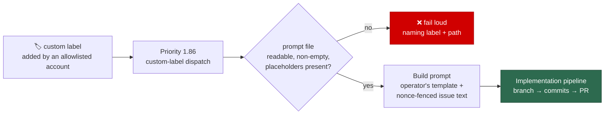

- **The template is an `issue` template.** It must carry `{{ISSUE_NUMBER}}` and
  `{{QUALITY_INSTRUCTIONS}}`; `{{REPO}}` and `{{VERBOSITY_INSTRUCTIONS}}` are
  also substituted. Any *other* `{{PLACEHOLDER}}` fails the build rather than
  reaching the agent half-rendered. There is no `vN.md` versioning — the plain
  path is read as-is.
- **The issue text stays untrusted.** The operator's file is configuration, so
  it is not fenced and its immutability is not checked — it is theirs to edit.
  The issue title, labels and body it renders around **are** fenced in this
  run's nonce boundary, with the same boundary-integrity instruction the
  built-in template gets. (As for `work-on`, issue comments are not part of the
  implementation prompt at all.)
- **Fail loud at dispatch, never a fallback.** A file that has become missing,
  unreadable, empty or invalid between config load and dispatch fails the run
  with the label and path named. The built-in `issue` template is never
  substituted for an operator's prompt, and the issue is never silently skipped.
- **The file is part of the prompt-cache key.** Where a run builds through the
  prompt cache, the file's content joins the SHA, so editing it invalidates the
  cached system prompt rather than re-serving a stale one.
- **A broken mapping never starves the others.** The remaining configured labels
  are still scanned, each fault is logged as an error naming its label and path,
  and the pass fails when nothing else was worked.
- **The dispatch is held by the `work-on` eligibility gates** (Issue #937). A
  custom label is not removed when the run finishes and
  `unassign_on_pr_created` hands the issue back unassigned, so without a gate
  the next cycle re-ran the whole pipeline against the still-open PR. The scan
  therefore applies the same gates the claim scan applies to `work-on`: a
  blocking label (`failed` among them), the retry cooldown, milestone
  occupancy, a closed or merged fleet PR, an open fleet PR, and an open
  dependency. A run that produces no work puts the issue into the retry
  cooldown, so a persistently failing issue backs off. The label-removing
  routes — `planning`, `question`, `grill-me`, `refine-issue` — are unchanged:
  removing their own label already stops re-dispatch. See
  [CUSTOM-PROMPTS.md — When a labelled issue is dispatched](CUSTOM-PROMPTS.md#-when-a-labelled-issue-is-dispatched).
- **Container run mode: the launcher mounts the prompt directory read-only**
  (Issue #850). The **containing directory** of every configured `prompt_path`
  is bind-mounted into the container at
  `/home/vibe/.vibe-coder/custom-prompts/<n>`, read-only, and the worker
  resolves the configured host path onto that mount — so the same
  `.config.json` serves the host-side launcher and the container alike, and
  nothing inside the
  container can edit an operator's template. Keep the prompts in a directory of
  their own: everything beside them in that directory is readable inside the
  container too. A path the containment allowlist refuses — the host home
  directory or an ancestor of it, the filesystem root, a runtime control
  socket, a relative path — **fails the launch loudly** rather than starting a
  container without the mount. See
  [CONTAINMENT.md — the mount set](CONTAINMENT.md#the-mount-set).
- **Default = off.** With no mapping configured the priority row does not exist
  and the ladder is unchanged.

#### How a `pr`-phase custom label dispatches (Issue #1011)

A `pr`-phase mapping acts on a **pull request**, not an issue. Apply its label
to an open PR and the worker runs the operator's prompt against that PR at
**priority 1.87**, immediately after the issue-phase row, with a full checkout
of the PR head branch and `gh` — the same working conditions a PR-feedback run
gets. What the run then does is the private prompt's business: comment, commit,
push.

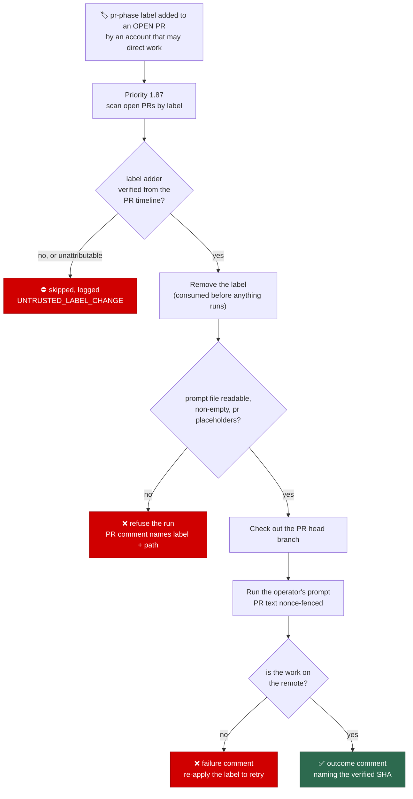

- **Open PRs only.** The scan lists PRs with `--state open`, so a label left on
  a closed or merged PR never dispatches — there is nothing to work.
- **The label adder must be allowlisted, exactly as for an issue-phase label.**
  Trust is derived from repository collaborators every cycle and starts closed;
  the PR timeline is read to attribute the add, and an add that cannot be
  attributed — no `labeled` event, a null actor, an unreadable timeline —
  **fails closed** and is logged. A fleet login is never a trusted adder, so
  the worker cannot dispatch itself by labelling its own PR.
- **A full checkout plus `gh`.** The PR head branch is fetched and checked out
  before the agent starts, so the prompt works the PR's own tree.
- **One shot: the run consumes the label.** The label is removed **before** the
  agent starts — before the prompt file is even read — so a run that crashes,
  is killed by the watchdog, or dies with its container cannot leave the
  trigger in place for the next cycle to pick up again. Re-apply the label to
  run again.
- **A failure consumes it too, and says so on the PR.** Every failure path — a
  broken prompt file, a checkout that could not be prepared, an agent that
  threw or timed out, work that never reached the remote — posts one comment
  naming the label and stating that it can be re-applied to retry. The built-in
  `pr_feedback` template is never substituted for an operator's file.
- **A claimed push that did not land is a failure.** After the run the branch's
  local head is compared against the remote; anything but agreement — including
  an unreachable remote — is reported as a failure rather than as success.
- **The PR text stays untrusted.** The operator's file is configuration and is
  not fenced. The PR title, body and any review comments it renders around
  **are** fenced in this run's nonce boundary, with the same
  boundary-integrity instruction the built-in PR prompts carry, so a forged
  delimiter or a forged `[TRUSTED] author=` header in a PR body is inert.
- **Default = off.** With no `pr` mapping configured, priority 1.87 does not
  exist and no PR scan runs.

The worked example an operator can follow verbatim lives in
[CUSTOM-PROMPTS.md](CUSTOM-PROMPTS.md).

#### Overriding a built-in label's prompt (Issue #849)

A mapping whose label matches a **built-in** label does not add a new dispatch
row — it replaces that phase's own template, so an operator can run a
non-public `planning`, `grill-me`, `question`, `quorum` or implementation
prompt. The label keeps its existing handler, priority and trust gate; only the
template changes.

```json
{
  "custom_label_prompts": [
    {
      "label": "planning",
      "prompt_path": "/opt/vibe-secrets/prompts/planning.md"
    },
    {
      "label": "planning",
      "phase": "planning_critique",
      "prompt_path": "/opt/vibe-secrets/prompts/planning-critique.md"
    }
  ]
}
```

| Label (as configured) | Phase overridden | Template replaced |
| --- | --- | --- |
| `work_on_label` (`work-on`) | `issue` | `prompts/issue/prompt.md` |
| `planning_label` | `planning`, or `planning_critique` with `phase` | `prompts/planning/prompt.md` |
| `question_label` | `question` | `prompts/question/prompt.md` |
| `grill_me_label` | `grill-me` | `prompts/grill-me/prompt.md` |
| `quorum_label` | `quorum`, or `quorum_judge` with `phase` | `prompts/quorum/prompt.md` |

- **The configured names are what match.** A fleet that renamed `planning` to
  `plan-it` overrides the planning phase with a `plan-it` mapping; the literal
  `planning` is then just an ordinary reserved label again.
- **Validated against the phase it replaces, not against `issue`.** Overriding
  `planning` requires `{{REPO}}`, `{{ISSUE_NUMBER}}` and `{{PLANNING_LABEL}}`;
  overriding `quorum` additionally requires
  `{{BOUNDARY_INTEGRITY_INSTRUCTION}}`, the placeholder that fences the
  untrusted issue text. A template short of any of them is refused **at config
  load**, with the phase and the missing placeholders named — the fault an
  `issue`-shaped validation would have waved through.
- **Two-turn phases need two entries.** Overriding `planning` does **not**
  override `planning_critique`, and overriding `quorum` does not override
  `quorum_judge`: each turn is a separate template with its own contract, so
  each takes its own entry naming its `phase`. Nothing is inferred from the
  first turn.
- **`refine-issue` cannot be overridden.** The refinement phase builds its
  prompt inline in `worker/deno/lib/refinement_processor.ts` and has no
  template file, so a mapping naming it is refused by name with that reason.
- **Overriding `work-on` overrides the implementation phase.** That template
  serves every issue-phase pickup — `top-priority` and `low-priority` too — so
  the override applies to all of them. A run dispatched by a *new* custom label
  still uses that label's own file.
- **Ambiguity fails loud.** Two entries claiming the same phase are refused at
  config load rather than silently resolving to whichever came first.
- **The run record names the file.** Every phase logs the template it loaded —
  the operator's path, or `prompts/<phase>/prompt.md` — so a run can be traced
  back to the file it actually ran. The implementation phase also reports it
  structurally, as `promptTemplate` beside `promptsCommit` in the phase result:
  the commit identifies the repository's templates and says nothing about an
  operator file.
- **An override does not change the label's trust gate.** Only a *new* label
  joins the operational dispatch set (Issue #847). Overriding `work-on` swaps
  its template and nothing else — the fleet's main discovery label keeps the
  OR gate it has always had.
- **Phases with no override are untouched.** They load the repository's
  template exactly as before.

### 🧭 Run Mode

`run_mode` names where the worker runs, and there is one answer: `container`
launches it inside the Vibe Coder image. Containment is mandatory (Issue #4).

```json
{
  "run_mode": "container"
}
```

- **Precedence.** `VIBE_RUN_MODE` (one run) → `run_mode` in `.config.json` →
  the `container` default. Leaving the key unset is the normal configuration.
- **Removed modes fail loud.** `native` (the worker run directly on the host,
  ,) and the macOS `seatbelt` profile were
  removed by Issue #4 — both sat outside the containment boundary. A
  configuration that still names one is refused with the removal explained;
  it is never coerced into a container run the operator did not know they
  were getting. Any other value fails loudly naming the only mode, so a typo
  never runs a host in a mode it did not ask for.
- **No auto-fallback.** A missing container runtime is a loud non-zero exit
 ; there is no host mode for it to fall back to. A repository
  whose build needs a container runtime of its own cannot be served from
  inside the worker container — [`container_launch.ts`](../worker/deno/lib/container_launch.ts)
  refuses runtime-socket mounts and `--privileged` by design — and the answer
  is to change the build, not to run the worker on the host.
- **Prerequisites**: the host needs a working container runtime
  and the worker image; the agent CLI, `jq` and `timeout` are
  container-owned (`claude` stays on the host for setup's token minting,).

Both launchers and `setup.sh` read the resolved value from one command rather
than parsing `.config.json`, so the precedence cannot drift between hosts:

```bash
deno run --allow-env --allow-read worker/deno/mod.ts run-mode   # container
```

### 🧊 Update Mode

`update_mode` names how a host tracks Vibe Coder releases. `frozen` — the
default answer `./setup.sh` offers a host being configured (Issue #692) —
holds the host at a pinned checkout with pinned tool versions. `dynamic`
follows the latest, and is both the deliberate opt-in answer at setup and what
an **absent** `update_mode` resolves to at config load.

**Two different defaults, deliberately.** The setup conversation defaults to
`frozen`, because a new host should reproduce a released, tested combination.
The *load-time* default for a missing key stays `dynamic`, because an existing
host carries no pins and frozen is all-or-nothing — resolving an absent key to
`frozen` would fail that host's config validation at its very next launch. So:
a `.config.json` with no `update_mode` loads as `dynamic` with no warning and
no new pin requirement, whatever setup would offer a fresh host.

| Field | Accepted values | Default | Read in |
| --- | --- | --- | --- |
| `update_mode` | `"dynamic"` or `"frozen"` | `"dynamic"` at config load — and the behaviour of any host with the key absent; `"frozen"` is the answer setup offers a host being configured | both modes |
| `pinned_ref` | A commit SHA or a tag name: starts with a letter or digit, and contains only letters, digits and `. _ + - / @` | _(unset)_ | `frozen` only |
| `pinned_tool_versions` | An object with an exact version string for each of `claude`, `gh` and `deno`, same character rules as `pinned_ref` | _(unset)_ | `frozen` only |

**Worked frozen example** — pinned to a release tag, with the three tool
versions that release was running:

```json
{
  "update_mode": "frozen",
  "pinned_ref": "1.0.7",
  "pinned_tool_versions": {
    "claude": "2.0.76",
    "gh": "2.62.0",
    "deno": "2.5.4"
  }
}
```

A commit SHA is equally valid where no tag covers the state you want:

```json
{
  "update_mode": "frozen",
  "pinned_ref": "3f2a1b9c4d5e6f708192a3b4c5d6e7f809a1b2c3",
  "pinned_tool_versions": {
    "claude": "2.0.76",
    "gh": "2.62.0",
    "deno": "2.5.4"
  }
}
```

**Worked dynamic example** — the whole of it, and even this is optional
because an absent `update_mode` resolves to `dynamic`:

```json
{
  "update_mode": "dynamic"
}
```

- **Absent means dynamic.** A `.config.json` with none of the three keys loads
  with `update_mode` resolved to `dynamic` and no warning, so an existing host
  is unchanged.
- **Frozen is all-or-nothing.** `frozen` without `pinned_ref`, or with a
  missing or blank entry for `claude`, `gh` or `deno`, fails loudly at config
  load naming the field that is missing. A half-pinned host would drift on
  whatever was left out, which is the failure the pin exists to prevent.
- **Hand-editable, and checked.** Both the ref and the versions are meant to be
  edited in `.config.json` without re-running setup. They are handed to `git`
  and to tool installers, so each must start with a letter or digit and contain
  only letters, digits and `. _ + - / @`; whitespace and shell metacharacters
  are refused rather than passed through.
- **A frozen launch installs the pins.** Each launch installs `claude`, `gh` and
  `deno` at exactly the configured versions and logs one line per tool
  (`Claude CLI pinned to 2.0.76 (update_mode=frozen)`), so editing
  `pinned_tool_versions` and relaunching is all it takes to move a frozen host.
  A tool already at its pin is left alone; an install that does not land the
  requested version fails loudly naming the tool, the requested version and the
  installed one, so a launch never continues quietly on a version nobody chose.
  The weekly interval, the version floors and the release-age quarantine are
  `dynamic`-mode machinery and do not apply — the quarantine keeps an
  unattended "latest" pull off a just-published release, whereas a pin is a
  human's recorded choice, logged at install so it stays auditable.
- **Dynamic ignores the pins, it does not reject them.** Flipping back to
  `dynamic` needs one edit — the stale pins stay in the file and nothing reads
  them.
- **Setup asks for all of it, and defaults to `frozen`.** `./setup.sh` runs
  `setup update-mode`, which asks for the mode — defaulting to `frozen` on a
  fresh host and, on a re-run, to whatever the host already says — and then,
  under `frozen`, for the pinned ref and one exact version per tool. The ref
  defaults to the latest release tag and is validated by resolving it in the
  worker checkout after a fetch, so a ref that does not resolve is rejected by
  name and nothing invalid reaches the file. Each version prompt defaults to
  the version that release records in its `tool-versions.json` manifest, so
  accepting every default reproduces a released, tested combination; with no
  resolvable manifest the defaults fall back to what `dynamic` mode would
  install today and setup says so in one line. Blank accepts the default
  everywhere, so a re-run that presses Enter throughout leaves `.config.json`
  unchanged — on a `dynamic` host as well as a frozen one. A run with no
  terminal never asks: existing values are left alone, and a fresh config is
  pinned to the latest release when it resolves with a manifest, or left
  `dynamic` with one warning line when it does not. `setup.ps1` does not ask yet —
  a Windows host sets these keys by hand, and the Windows counterpart is a
  follow-up. The prompts in the order they are asked are
  [Setup — update mode](SETUP.md#update-mode-dynamic-or-frozen).
- **Shell surface.** `load-config` exports `VIBE_UPDATE_MODE`, so the launchers
  see the resolved mode without re-parsing `.config.json`.
- **Frozen holds the checkout at the pin.** Before each launch the host-side
  checkout update leaves the worker checkout on `pinned_ref` instead of
  resetting it to the tip of the default branch, and says so in `run_core.log`
  (Issue #624) — see [Host-Side Checkout Update](#-host-side-checkout-update).
  Because the container image reference is derived from the checkout's
  content, a frozen checkout holds the image steady too.
- **Frozen says when it is behind.** A pin holds the host still; it does not
  hide that the world moved on. When a release newer than `pinned_ref` exists,
  each launch prints one notice line naming both versions and the command that
  installs the new one (Issue #690) — see
  [New-Release Notice](#-new-release-notice).

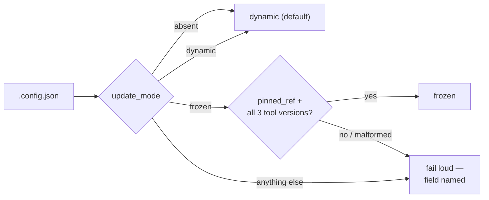

What the resolved mode does to the tool updates at launch:

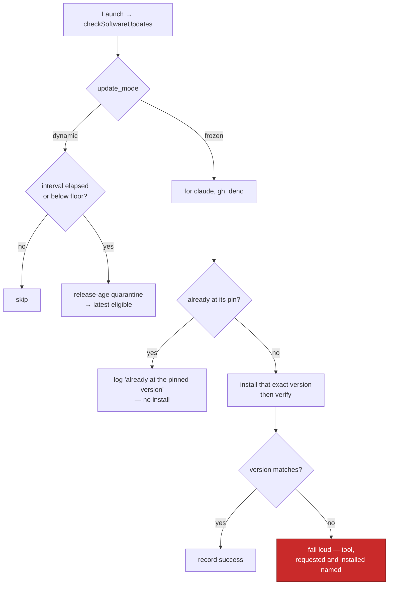

#### What each mode means for maintenance

- **A dynamic host has no per-machine version upkeep.** It tracks the tip of
  the default branch (`main`) at every launch and installs the latest eligible
  `claude`, `gh` and `deno` on the weekly cadence, subject to the version
  floors and the release-age quarantine. Nobody edits a version on that host,
  ever — it is the right choice for a fleet that should move together.
- **A frozen host stays exactly where it is pinned.** New commits on `main` and
  new tool releases never move it: the checkout is held at `pinned_ref` and the
  three tools are installed at `pinned_tool_versions` on every launch. The
  upkeep it does have is deliberate — someone chooses the next pin, edits it,
  and relaunches — which is the whole point on a host that must reproduce a
  known-good state (a release candidate under evaluation, a customer
  deployment, a machine bisecting a regression).

#### Choosing a pin

Pin to a **release tag**. Every merge to `main` is tagged with the next patch
semver automatically (`1.0.0`, `1.0.1`, …) — see
[Release tagging](RELEASE-TAGGING.md) — and those tags exist precisely so a
frozen host has something meaningful to name. `"pinned_ref": "1.0.7"` says what
the host is running in a way that a raw SHA does not, and `git log 1.0.6..1.0.7`
says what moving to the next tag would bring in.

A release tag is also the pin with a guarantee behind it: a repository tag
ruleset refuses to delete or re-point a release tag, and releases from `1.0.50`
onward are immutable records besides, so what a tag names today is what it names
next year — see [Release integrity](RELEASE-TAGGING.md#release-integrity).

A commit SHA is still accepted, and is the right answer when the state you want
is not a tagged one — a specific merge you are bisecting, for example. Either
way the ref must exist on `origin`: the launch-time checkout fetches before it
resolves, and a ref that resolves nowhere is a loud failure rather than a
silent fall back to the tip.

#### The upgrade loop

A frozen host moves in deliberate steps, and the loop is three of them: the
launch says a newer release exists, one command moves the pins, and the next
launch installs exactly what those pins name. Nothing in the loop moves a host
on its own — the notice only tells, the command only writes, and the install
happens at the launch you choose to make.

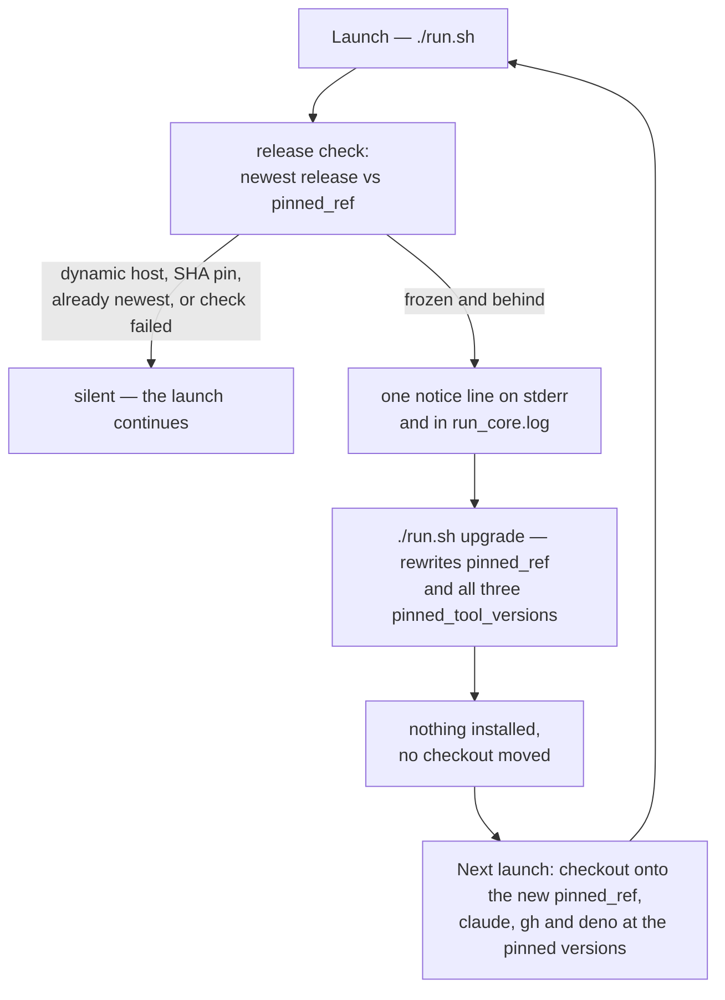

1. **The launch tells you.** A frozen host pinned behind the newest release
   prints one line per launch, to stderr and `run_core.log`:

   ```text
   A new release of Vibe Coder is available: 1.0.4 → 1.0.5. Run ./run.sh upgrade to install it.
   ```

   The command it names comes from the constant the upgrade command registers
   under, so the notice cannot name a command that does not exist. The full
   rules — who is notified, when the check is silent, and what a failed check
   costs — are [New-Release Notice](#-new-release-notice).
2. **One command moves the pins.** `./run.sh upgrade` rewrites `pinned_ref` and
   all three `pinned_tool_versions` to the newest release and the versions its
   [`tool-versions.json` manifest](RELEASE-TAGGING.md#the-tool-version-manifest)
   records. **It changes nothing else**: every other key in `.config.json` is
   preserved exactly as it was, and it installs nothing, moves no checkout and
   starts no container. See
   [Moving to the latest release](#moving-to-the-latest-release-runsh-upgrade).
3. **The next launch installs them.** The checkout update puts the worker
   checkout onto the new `pinned_ref` and the launch installs `claude`, `gh`
   and `deno` at exactly the pinned versions, one log line per tool. Nothing
   waits on the weekly interval — it is `dynamic`-mode machinery.

**Hand-editing a pin is still supported, and is the answer for a specific
ref.** The upgrade command only ever chooses the newest release; a host that
must sit on an older release, a commit SHA, or one tool version on its own is
moved by editing `.config.json` and relaunching, with no re-run of setup — see
[Moving a pin by hand](#moving-a-pin-by-hand). A hand-edited host stays in the
same loop: it is still told when a newer release exists, and `./run.sh upgrade`
still moves it to the newest one when that is what you want.

#### Moving to the latest release: `./run.sh upgrade`

`./run.sh upgrade` moves a frozen host onto the newest release in one call. It
rewrites `pinned_ref` and all three `pinned_tool_versions` — to the tag and to
the exact versions that release recorded in its
[`tool-versions.json` manifest](RELEASE-TAGGING.md) — and nothing else. It
installs nothing, moves no checkout and starts no container: the next launch
installs exactly what the new pins name.

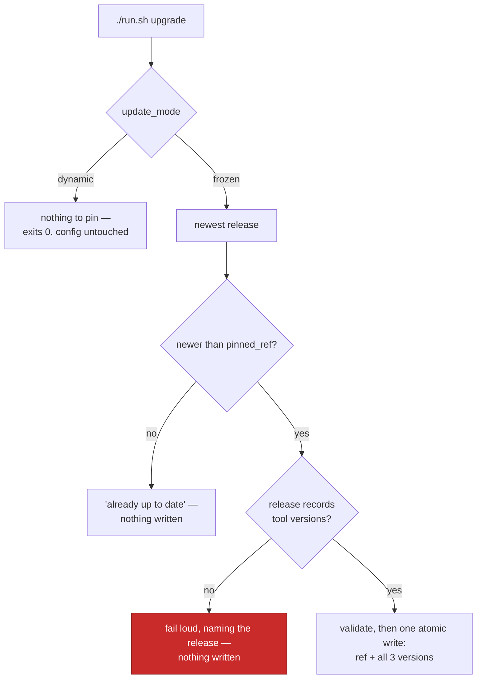

The output names the old and new ref and each old → new tool version, and every
other key in `.config.json` is preserved exactly as it was:

```text
Upgrading Vibe Coder: 1.0.4 → 1.0.5.
  pinned_ref                   1.0.4 → 1.0.5
  pinned_tool_versions.claude  2.0.76 → 2.0.80
  pinned_tool_versions.gh      2.62.0 → 2.63.0
  pinned_tool_versions.deno    2.5.4 → 2.5.6
Written to /path/to/.config.json — the next launch installs exactly these versions.
```

Re-running it immediately prints `Vibe Coder is already up to date (1.0.5).`
and writes nothing. On a dynamic host it explains there is nothing to pin —
that host already tracks the latest at every launch — and exits 0 without
touching the config. The pins are **all-or-nothing**: a release minted before
releases recorded their tool versions, an unreachable GitHub or a value that
fails the config validator is a loud refusal with `.config.json` left exactly
as it was, never a fresh `pinned_ref` beside stale tool versions.

Windows hosts move their pins by hand for now; `run.ps1 upgrade` is a
follow-up, exactly as `setup.ps1`'s update-mode prompts are.

#### Moving a pin by hand

Editing `.config.json` is the supported way to move a frozen host to a pin
`./run.sh upgrade` would not choose — an older release, a commit SHA, or one
tool version on its own — and **re-running setup is not required**:

1. Edit `pinned_ref` to the tag or SHA you want, and/or any entry under
   `pinned_tool_versions`.
2. Relaunch (`./run.sh`, or wait for the next scheduled launch).
3. The launcher's checkout update fetches and checks the worker checkout out
   onto the new `pinned_ref`, and the run installs exactly the versions in
   `pinned_tool_versions`, logging one line per tool
   (`Claude CLI pinned to 2.0.76 (update_mode=frozen)`).

Nothing is deferred to a weekly interval — the interval, the floors and the
quarantine are `dynamic`-mode machinery — so the edit takes effect at the very
next launch. An unresolvable ref, a malformed value or a `frozen` host missing
any of the four required values fails loudly naming the field, so a typo never
silently drags the host back to the tip. Setup's prompts write the same fields;
the only thing setup adds is validating the ref while you are still sitting
there.

#### Rolling back to an earlier release

Rolling back is [moving a pin by hand](#moving-a-pin-by-hand) in the one
direction `./run.sh upgrade` will not go — it only ever chooses the newest
release. The mechanics are the three steps above, with one addition that is
easy to miss: **a release that changed a configuration contract changes it back
when you roll the ref back**, so the pin and the affected keys move in the same
edit.

1. Read what the release you are returning to shipped with, so the tool
   versions go back with the ref rather than staying on the newer ones:

   ```bash
   gh release download 1.0.71 --repo stSoftwareAU/VibeCoder \
     --pattern tool-versions.json
   ```

2. In one edit of `.config.json`, set `pinned_ref` to that tag, set all three
   `pinned_tool_versions` to what the manifest names, and restore any keys the
   older release requires. [Release notes](RELEASE-NOTES.md) states, per
   release, exactly which keys those are — for 1.2.0 it is `fleet_health_repo`
   and `fleet_health_dir`, which 1.2.0 refuses and 1.0.x needs.
3. Relaunch. The checkout update moves the worker checkout back and the launch
   installs exactly the pinned versions, one log line per tool.

A key the older release does not recognise is only a warning there, so a
forward-looking block such as `callbacks` can stay in place across the
rollback; a key the newer release **removed** is a hard config-load failure on
the way forward again, which is why the rollback restores it explicitly rather
than leaving the host with a config neither version loads.

#### `VIBE_SKIP_CHECKOUT_UPDATE` is not frozen mode

`VIBE_SKIP_CHECKOUT_UPDATE=1` is an **environment-variable escape hatch for one
checkout**: it turns the host-side checkout update off entirely, for a
development tree someone is working in or a CI tree that is a pull-request
merge commit and must not be reset mid-run. It says so loudly and is never
silent. Frozen mode is a **recorded configuration decision** that still updates
the checkout — onto `pinned_ref` — and additionally pins the three tool
versions, which the skip does nothing about. The skip wins over both modes when
both are in play, so a frozen host with the variable set stays on whatever the
checkout already holds. Use the variable for development trees and CI; use
`update_mode: "frozen"` for a host that must reproduce a known state. See
[Host-Side Checkout Update](#-host-side-checkout-update).

### 🔄 Host-Side Checkout Update

Before each launch, the launcher updates the worker checkout itself — `git
fetch origin`, then a hard reset to `origin/<default-branch>` and a
`git clean -fd` (Issue #512). This is the **only** update of that checkout:
Issue #513 retired the in-container reset, so nothing inside the container
writes to `/workspace` and that mount can become read-only (Issue #509). The
branch is read from the checkout's own `origin/HEAD`.

The command runs before the launch plan is built, and so before the
configuration load, so it reads `update_mode` and `pinned_ref` out of
`.config.json` under `--base-dir` itself.

```bash
deno run --allow-env --allow-read --allow-write --allow-run --allow-sys=hostname \
  worker/deno/mod.ts worker-checkout-update --base-dir "$(pwd)"
```

- **A failed update is a warning, not a refused launch.** An unreachable
  remote is reported on stderr and in `run_core.log`, and the worker launches
  on the checkout it already has.
- **The update discards uncommitted work in that checkout**, exactly as the
  in-container reset always has. Set `VIBE_SKIP_CHECKOUT_UPDATE=1` for a
  checkout where that is wrong — a development tree someone is working in, or
  a CI tree that is a pull-request merge commit and must not be reset to the
  default branch mid-run. The skip is reported, never silent. Give the worker
  its own dedicated clone rather than relying on the skip
  (see [Deployment](DEPLOYMENT.md)).
- **An update that actually changed the checkout names the variable**
  (Issue #735). Moving the commit or discarding uncommitted work adds one line
  to stderr and `run_core.log` —
  `The checkout update changed <path> (HEAD <before> → <after>; 2 uncommitted
  change(s) discarded). Local edits in this checkout do not survive a launch —
  set VIBE_SKIP_CHECKOUT_UPDATE=1 to leave it exactly as it is.` — so an
  operator debugging a launcher fault learns about the opt-out at the moment it
  discards their patch, rather than from this page. An update that changed
  nothing says nothing.
- **Three consecutive failures spanning at least fifteen minutes raise one
  GitHub issue** titled `Worker checkout update failing on <host>` against the
  checkout's own origin repository, carrying the "active development tree"
  diagnosis (Issue #4204). The span qualifies the count because three failures
  eight seconds apart are one transient host fault, not the hour of stale code
  the threshold was written to report (Issue #1017). The streak lives in
  `~/logs/checkout-update-failure-streak` — the count and the first failure's
  timestamp, with the older bare-count format still read — and a successful
  update resets it to zero. `--allow-sys=hostname` is what lets that title name
  the host; without it every host would share one report.
- **A report that could not be sent is retried and queued** (Issue #1018). The
  escalation travels over the network whose loss is the commonest cause of the
  streak, so a send that throws leaves the streak eligible — every later
  failing run attempts delivery again — and the evidence is spooled in
  `~/logs/checkout-update-escalation`, one entry per streak, overwritten. The
  escalated-at marker is recorded only on a successful send, which is what
  keeps the rest of the streak quiet. The run that recovers delivers whatever
  is still queued — marked as an outage that has since ended — and then clears
  the streak and the spool together, so an outage is reported after it ends and
  a queued report never outlives the condition it describes.
- **A frozen host is held at its pin instead** (Issue #624). Under
  `update_mode: "frozen"` the reset to `origin/<default-branch>` would defeat
  the pin, so the command fetches (a tag pushed since the last launch has to
  resolve), then checks the checkout out onto `pinned_ref` — commit SHA or tag,
  detached HEAD included — and appends
  `Checkout update skipped: update_mode=frozen, pinned to <ref>` to
  `run_core.log`. The skip is never silent.
- **A checkout already on the pin is not written to at all.** `HEAD` resolving
  to `pinned_ref` means no fetch, no checkout, no clean — just the log line —
  so a launch never churns the tree.
- **A pin that does not resolve is loud.** An unknown `pinned_ref`, an
  unreadable or malformed `.config.json`, an unrecognised `update_mode` or a
  `frozen` host with no `pinned_ref` exits non-zero naming the offending value;
  the launcher warns and launches on the existing checkout, which is still the
  pinned one. Three such runs escalate through the same streak above.
- **`VIBE_SKIP_CHECKOUT_UPDATE` wins over both modes**, with its usual message.

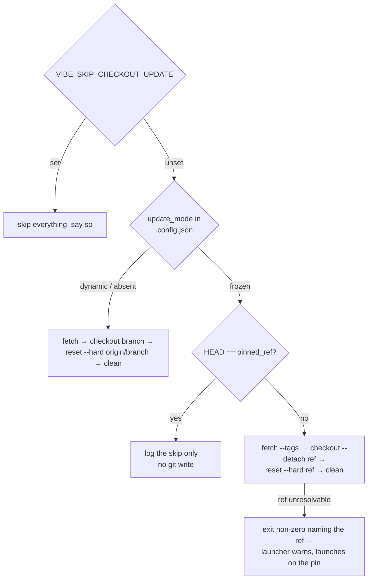

### 🔔 New-Release Notice

Beside the checkout update, each launch asks whether this host is pinned behind
the newest release (Issue #690). When it is, one line goes to stderr and to
`run_core.log`:

```text
A new release of Vibe Coder is available: 1.0.4 → 1.0.5. Run ./run.sh upgrade to install it.
```

```bash
deno run --allow-env --allow-read --allow-run \
  worker/deno/mod.ts release-notice --base-dir "$(pwd)"
```

- **Notifying only.** The check changes no pin, installs nothing and never
  moves the checkout. Moving the host is `./run.sh upgrade` (Issue #691) or the
  hand edit in [Moving a pin by hand](#moving-a-pin-by-hand).
- **Frozen hosts only.** A `dynamic` host already installs the newest release
  at every launch, so there is nothing to tell it.
- **Silent when there is nothing to say.** A host already on the newest
  release, a repository with no releases, and a `pinned_ref` that is a commit
  SHA — which cannot be ordered against a release tag — all print nothing. So
  do pre-releases and moving names such as `latest`: the release series is the
  bare `MAJOR.MINOR.PATCH` tags, ordered numerically.
- **It never blocks the launch.** A `gh` failure, an unreachable GitHub or a
  timeout is a `[run.sh] warning: could not check for a newer release …` on
  stderr and a `release-notice: failed …` line in `run_core.log`, and the
  launch continues on the checkout the host already has. Every call is bounded,
  so an unreachable GitHub costs seconds.
- **The warning says why.** Both lines carry the check's own stderr — its
  configuration error, its `gh` failure, its unresolvable hostname — and a
  check the 120 s bound killed is logged as `timed out after 120s` rather than
  as a failure that said nothing. `no explanation given` is now reserved for a
  check that genuinely wrote no words; it used to be the only answer this
  warning could give, because only stdout was captured (Issue #1020).
- **One name for the upgrade.** The command the notice names comes from the
  same constant the upgrade command registers under
  ([`worker/deno/lib/upgrade_command.ts`](../worker/deno/lib/upgrade_command.ts)),
  so the wording cannot drift from the command that exists.
- **Windows is a follow-up.** `run.ps1` does not print the notice yet; the
  logic living in the Deno command is what keeps that a port rather than a
  rewrite.

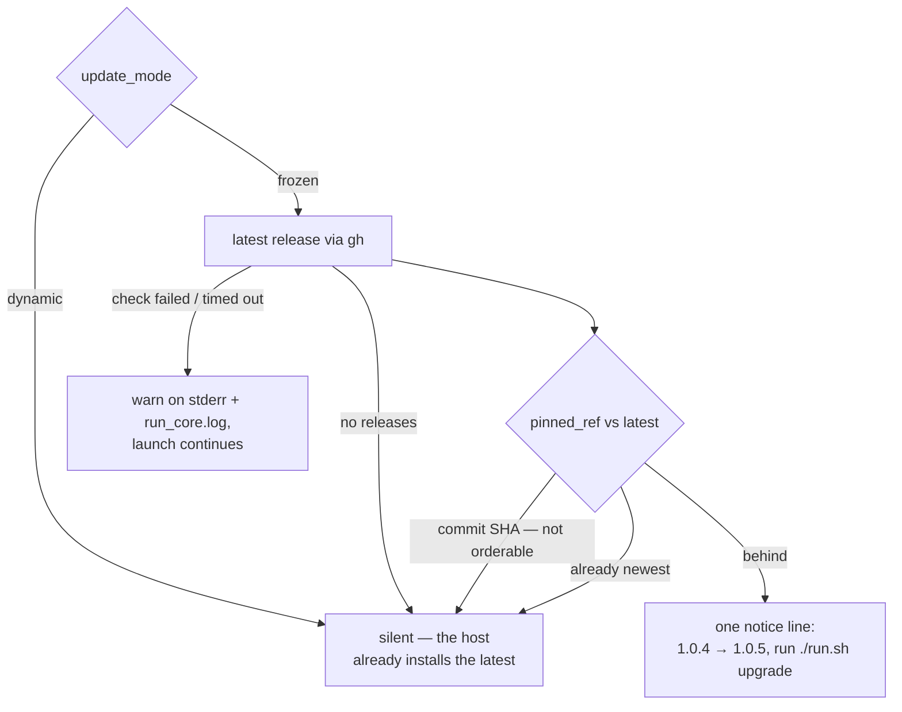

### 🧠 Phase Model Overrides

Each phase of the worker's Claude invocations has a default model tier. You can
override any phase's model via `phase_model_overrides` in `.config.json`:

```json
{
  "phase_model_overrides": {
    "planning": "sonnet",
    "clarification": "haiku"
  }
}
```

**Default phase model assignments:**

| Phase            | Default Model | Description                                          |
| ---------------- | ------------- | ---------------------------------------------------- |
| `planning` | `fable` | Complex task decomposition — Fable 5 top tier, plan quality compounds across sub-issues |
| `grill_me` | `fable` | Requirements interrogation — Fable 5 top tier, shapes everything downstream |
| `refinement` | `fable` | Rewording issue titles/descriptions — planning-shaped, promoted to Fable 5 |
| `revision` | `fable` | Rewriting issues from review feedback — planning-shaped, promoted to Fable 5 |
| `question` | `fable` | Answering codebase questions — planning-shaped, promoted to Fable 5 |
| `clarification` | `fable` | Assessing whether an issue has sufficient detail — planning-shaped, promoted to Fable 5 |
| `implementation` | `opus` (base) | Core work — uses the base `claude_model` setting (`issue` phase, effort `high`) |
| `ci_fix`         | `opus`        | Fixing CI failures from structured error messages (effort `medium`) |
| `quality_fix`    | `opus`        | Fixing quality check failures (lint, test errors) (effort `medium`) |
| `pr_feedback`    | `opus`        | Applying targeted fixes from reviewer comments (effort `medium`) |
| `spelling_fix`   | `haiku`       | Finding and fixing typos — simplest corrections      |
| `summarise`      | `haiku`       | Summarising long issue bodies                        |
| `health`         | `haiku`       | Health check ("Respond with exactly: OK")            |

**Override priority** (highest to lowest):

1. `CLAUDE_MODEL_<PHASE>` environment variable (e.g.
   `CLAUDE_MODEL_PLANNING=sonnet`)
2. `phase_model_overrides` in `.config.json`
3. `CLAUDE_MODEL` environment variable (base model for all phases)
4. Built-in phase defaults (table above)

**Available tiers:** `fable`, `opus`, `sonnet`, `haiku`. Fable (alias `fable`,
served as `claude-fable-5-1` since 2026-09-01) is the top tier above Opus, with a 1M-token
context window and a rate-limit fallback of `fable → opus → sonnet → haiku`
. It is the default for the eight planning-shaped phases
(`planning`, `grill_me`, `refinement`, `revision`, `question`, `clarification`,
`quorum`, `quorum_judge`) under, and; pin any other phase to it explicitly, e.g.
`"phase_model_overrides": { "issue": "fable" }` or `CLAUDE_MODEL=fable`. The
`opus` alias resolves to the latest Opus (Opus 5 as of July 2026) once the CLI
version floor is met — see [Minimum-Version Floor](#-minimum-version-floor).

### 🔊 Verbosity Configuration

The worker supports configurable response verbosity — controlling how detailed
Claude's output is. Verbosity is set by configuration, not by the phase: there
are no automatic per-phase levels (Issue #798), so an unconfigured worker
renders `standard` on every surface.

**Available levels:**

| Level      | Behaviour                                                                             |
| ---------- | ------------------------------------------------------------------------------------- |
| `minimal`  | Single sentence naming what changed; that sentence is the whole response.             |
| `concise`  | Brief response (2–3 sentences). Key changes and rationale only.                       |
| `standard` | The default — an end-of-run summary, with no running commentary while the run works.  |
| `verbose`  | The standard summary plus one short section per genuinely close decision.             |

**Which override reaches which surface:**

The two overrides are read by different code paths, so they do not both apply
everywhere:

| Surface                             | Level used                                             |
| ----------------------------------- | ------------------------------------------------------ |
| `issue` phase                       | Per-repo `verbosity` override, else `standard`         |
| `grill_me` and `quorum` rounds      | Global `.config.json` `verbosity`, else `standard`     |
| Every other phase                   | `standard`                                             |

> **📝 Note:** every round is told "no running commentary while you work".
> Nobody watches an unattended round in real time, so the `grill-me` template
> stops asking for narration (`prompts/grill-me/prompt.md`, Issue #759);
> a round's output is the comment it posts.

**Resolution priority** for the `issue` phase (highest to lowest):

1. Per-repo override in `repo_config` (see
   [Per-Repository Configuration](#per-repository-configuration))
2. Hard-coded default (`standard`) — this tier does not read the global
   `.config.json` `verbosity`

**Global verbosity override:**

Set `verbosity` at the top level of `.config.json` to change the level used by
the `grill_me` and `quorum` rounds:

```json
{
  "verbosity": "concise"
}
```

**Per-repository verbosity override:**

Use `repo_config` to set different verbosity levels for different repositories.
This is useful when some repositories handle simple, mechanical tasks (use
`minimal` or `concise`) while others require detailed architectural reasoning
(use `verbose`):

```json
{
  "repo_config": {
    "your-org/simple-docs-site": {
      "verbosity": "minimal"
    },
    "your-org/complex-platform": {
      "verbosity": "verbose"
    },
    "your-org/standard-app": {
      "verbosity": "concise"
    }
  }
}
```

> **📝 Note:** The per-repo `verbosity` override reaches the `issue` phase only
> — that is the one phase whose prompt builder is passed a resolved level. It is
> not consulted by the `grill_me` and `quorum` rounds, which read the global
> setting instead.

**Token savings and cost impact:**

Lower verbosity levels reduce output tokens, which directly reduces API costs.
Approximate savings compared to `standard`:

| Level      | Output Token Impact                | Best For                                     |
| ---------- | ---------------------------------- | -------------------------------------------- |
| `minimal`  | ~60–80% fewer output tokens        | Mechanical, low-risk repositories            |
| `concise`  | ~30–50% fewer output tokens        | Repositories needing only a short rationale  |
| `standard` | Baseline                           | General implementation                       |
| `verbose`  | ~20–40% more output tokens         | Repositories needing architectural reasoning |

**How verbosity instructions are injected:**

The worker injects a `## Response Verbosity` block into the prompt template
before passing it to Claude. Every level gets one, including `standard`
 — the highest-volume surface publishes its output as a PR body
and an issue comment a human reads, so leaving it silent left the expected
visible output unstated.

Each level states the shape of the output to produce rather than a list of
prohibitions. A `minimal` run receives _"Produce a single sentence naming
what you changed. That sentence is the whole response."_; `standard` receives
_"Summarise what you changed once the work is done … no running commentary
while you work."_; `verbose` is bounded to the decisions that were genuinely
close, so "thorough" does not mean "unbounded". The instruction text and the
two-tier resolution both live in `worker/deno/lib/verbosity.ts`, and the
`standard` default is `DEFAULT_VERBOSITY` in
`worker/deno/lib/config_defaults.ts`.

### 💪 Effort Level Configuration

The worker supports per-phase effort levels — controlling how deeply Claude
reasons about each task. Architectural planning benefits from maximum effort,
while simple typo corrections need minimal effort. This enables cost
optimisation by matching reasoning depth to task complexity.

**Available effort levels:**

| Level    | Description                                                  |
| -------- | ------------------------------------------------------------ |
| `low`    | Minimal reasoning — simple, mechanical tasks                 |
| `medium` | Moderate reasoning — reactive tasks with structured input    |
| `high`   | Thorough reasoning — general implementation (global default) |
| `xhigh` | Extra-high reasoning — between `high` and `max`; Anthropic's recommended setting for most coding/agentic use on Opus 4.7+ / Fable 5 |
| `max`    | Deepest reasoning — architectural decisions                  |

**Default effort per phase:**

| Phase           | Default Effort | Rationale                                               |
| --------------- | -------------- | ------------------------------------------------------- |
| `planning`      | `max`          | Architectural decisions need deepest reasoning          |
| `grill_me` | `max` | Requirements interrogation shapes everything downstream |
| `issue`         | `high`         | General implementation benefits from thorough reasoning |
| `question`      | `high`         | Answering questions needs careful thought               |
| `ci_fix`        | `medium`       | Reactive, well-scoped task                              |
| `pr_feedback`   | `medium`       | Targeted fixes from reviews                             |
| `quality_fix`   | `medium`       | Reactive test/lint fixes                                |
| `refinement`    | `medium`       | Rewording titles/descriptions                           |
| `revision`      | `medium`       | Review-based rewriting                                  |
| `clarification` | `medium`       | Structured analysis                                     |
| `spelling_fix`  | `low`          | Simple typo corrections                                 |
| `summarise`     | `low`          | Lightweight summarisation                               |
| `health`        | `low`          | Trivial health check                                    |

**Override via `.config.json`:**

Use `phase_effort_overrides` to override the default effort for specific phases:

```json
{
  "phase_effort_overrides": {
    "planning": "max",
    "spelling_fix": "low"
  }
}
```

**Override via environment variable:**

- **Per-phase:** `CLAUDE_EFFORT_PLANNING=max` (uppercased phase name)
- **Global:** `CLAUDE_EFFORT=high` (applies to all phases without a specific
  default)

**Override priority** (highest to lowest):

1. `CLAUDE_EFFORT_<PHASE>` environment variable (e.g.
   `CLAUDE_EFFORT_PLANNING=max`)
2. `phase_effort_overrides` in `.config.json`
3. Phase-specific default from `PHASE_EFFORT_DEFAULTS` (table above)
4. `CLAUDE_EFFORT` environment variable (global fallback)
5. `DEFAULT_EFFORT` constant (`"high"`)

This priority chain mirrors the
[Phase Model Overrides](#-phase-model-overrides) pattern —
environment variables take precedence over config file overrides, which take
precedence over built-in defaults.

**Reference:** `worker/deno/lib/config_defaults.ts` (phase defaults),
`worker/deno/lib/claude_executor.ts` (`buildClaudeEffortArgs()`).

### ⚙️ Operational Defaults

These values have built-in defaults and can be overridden in `.config.json`
. Only values that differ from the defaults need to be stored — if a
default changes in the codebase, the new default flows to all installations
unless explicitly overridden.

| Setting                        | Config Key                       | Default    | Description                                                                                                                                                                                          |
| ------------------------------ | -------------------------------- | ---------- | ---------------------------------------------------------------------------------------------------------------------------------------------------------------------------------------------------- |
| Claude timeout | `claude_timeout` | `3600` | Safety-net ceiling for Claude CLI (1 hour) — real stuck detection uses no-output timeout. Lowered from 4 hours by so one wedged run cannot starve every other repository. |
| Progress extension enabled | `progress_extension_enabled` | `true` | Extend the **issue-work** hard deadline while the run is demonstrably progressing. On by default (Issue #422) and bounded by the run hard cap; set it to `false` for the flat one-shot kill. See [Progress-extended deadline](#-progress-extended-deadline). |
| Progress extension grant | `progress_extension_grant_seconds` | `900` | Seconds each grant adds to the deadline, measured from the moment of the check. |
| Progress extension stall window | `progress_extension_stall_seconds` | `300` | The agent is judged stalled only when **both** its last tool call and its last stdout chunk are older than this (Issue #767). Must be at least `progress_extension_check_seconds`. |
| Progress extension check interval | `progress_extension_check_seconds` | `300` | Seconds between progress samples (working tree and descendant CPU) while a run is inside its budget, so a stall is noticed within a check interval rather than a whole grant. Must be positive. |
| Self-scheduled diagnostics | `self_schedule_diagnostics_enabled` | `true` | Let the worker schedule its **own** auto-filed diagnostics without a human `work-on` (Issue #505). Only an issue the worker filed, in the worker's own repo, carrying a recognised provenance marker qualifies; no label is ever self-applied. `false` restores the wait-for-a-human behaviour exactly. See [Self-scheduled worker diagnostics](workflows/issue-processing.md#-self-scheduled-worker-diagnostics-tier-2b). |
| Self-scheduled diagnostics in flight | `self_schedule_diagnostics_max_in_flight` | `1` | How many self-scheduled diagnostics may be in flight at once (non-negative integer; `0` refuses every one and logs the refusal). Bounds a misfiring detector so it cannot fill the queue with its own work. |
| Agent transcript tee | `agent_transcript_enabled` | `false` | Tee every agent invocation's raw stream-json to `~/logs/agent-<run-id>[-<issue>].jsonl` (Issue #1141). **Off by default, and it captures repository content** — read [Agent transcripts](#-agent-transcripts) before switching it on. |
| Claude kill-after              | `claude_kill_after`              | `30`       | Grace period after timeout before force-kill                                                                                                                                                         |
| Sleep interval                 | `sleep_interval`                 | `30`       | Seconds between scans                                                                                                                                                                                |
| Max concurrent issues | `max_concurrent_issues` | `2` | Issue slots worked concurrently per host (integer 1–8). Above `1` the Priority-2 scan runs as a pool, one clone per slot; the memory-pressure governor lowers the effective count (never raises it). `1` opts into the serial loop. Each slot keeps claiming for the whole cycle — after a success it sleeps `sleep_interval` and claims again, so a long execute in one slot never idles the others (Issue #178). A slot that finds nothing logs the scan's counts and re-scans every `sleep_interval` while a sibling still works, retiring only when nothing else is running (Issue #219). Above `1` the agent-backed PR passes also run in a **maintenance lane** beside the pool instead of ahead of it, so a long CI fix no longer idles the slots — see [Maintenance lane](workflows/README.md#-maintenance-lane-agent-backed-pr-passes-beside-the-pool) (Issue #213). |
| Credit wait interval           | `credit_wait_interval`           | `300`      | Seconds to wait when credits are exhausted                                                                                                                                                           |
| Refinement timeout             | `refinement_timeout`             | `300`      | Timeout for issue refinement (5 minutes)                                                                                                                                                             |
| Refinement kill-after          | `refinement_kill_after`          | `10`       | Grace period after refinement timeout                                                                                                                                                                |
| Planning timeout | `planning_timeout` | `1800` | Safety-net ceiling for planning mode (30 minutes) — planning produces sub-issues, so it should be quick |
| PR feedback timeout | `pr_feedback_timeout` | `1800` | Timeout for the PR feedback phase (30 minutes). Distinct from `claude_timeout` so reactive phases do not inherit the issue-work budget. Both the run loop and the single-shot `pr-feedback` command pass this key (Issue #213 — the run loop used to pass `claude_timeout`). Left unset while `claude_timeout` is set explicitly, it inherits that value for back-compat; set it explicitly to pin the reactive budget. |
| CI fix timeout | `ci_fix_timeout` | `1800` | Timeout for the CI (Continuous Integration) fix phase (30 minutes). Distinct from `claude_timeout` for the same reason as `pr_feedback_timeout`, and with the same back-compat inheritance — a host with `claude_timeout: 3600` and no `ci_fix_timeout` is why a CI fix logged a 3600 s budget against a documented 1800. |
| Planning kill-after            | `planning_kill_after`            | `10`       | Grace period after planning timeout                                                                                                                                                                  |
| Question timeout               | `question_timeout`               | `600`      | Timeout for question answering (10 minutes)                                                                                                                                                          |
| Question kill-after            | `question_kill_after`            | `10`       | Grace period after question timeout                                                                                                                                                                  |
| Clarification timeout          | `clarification_timeout`          | `120`      | Timeout for clarification requests (2 minutes)                                                                                                                                                       |
| Clarification kill-after       | `clarification_kill_after`       | `10`       | Grace period after clarification timeout                                                                                                                                                             |
| Max clarification rounds       | `max_clarification_rounds`       | `3`        | Maximum clarification rounds before auto-proceeding                                                                                                                                                  |
| Grill-me timeout | `grill_me_timeout` | `3600` | Timeout for a single grill-me round (1 hour). Raised from 10 minutes by — grill-me reasons at top-tier model and effort. See [Grill Me](workflows/grill-me.md). |
| Grill-me kill-after            | `grill_me_kill_after`            | `10`       | Grace period after `grill_me_timeout` before force-kill                                                                                                                                              |
| Max grill-me rounds | `max_grill_me_rounds` | `5` | Maximum grill-me rounds before the worker escalates with `needs-human` |
| Quorum timeout | `quorum_timeout` | `1800` | Wall-clock budget for **one** Quorum agent (30 minutes). The two drafts run concurrently, so a run costs one draft plus one judgement. |
| Quorum kill-after | `quorum_kill_after` | `10` | Grace period after `quorum_timeout` before the agent is killed |
| Quorum planners | `quorum_planners` | `["claude", "claude"]` | The **two** drafting providers of a Quorum run. Exactly two ids; a different count is rejected at startup. |
| Quorum judge | `quorum_judge` | `"claude"` | The adjudicating provider of a Quorum run |
| Max rate-limit retries         | `max_rate_limit_retries`         | `2`        | Maximum retries when rate limited                                                                                                                                                                    |
| Max rate-limit wait            | `max_rate_limit_wait`            | `600`      | Maximum total wait time for rate limit retries                                                                                                                                                       |
| Retry max delay                | `retry_max_delay`                | `60`       | Maximum delay between retries                                                                                                                                                                        |
| Max issue body tokens          | `max_issue_body_tokens`          | `50000`    | Maximum tokens in issue body before summarisation                                                                                                                                                    |
| Summarise timeout              | `summarise_timeout`              | `120`      | Timeout for issue body summarisation (2 minutes)                                                                                                                                                     |
| Summarise kill-after           | `summarise_kill_after`           | `10`       | Grace period after summarise timeout                                                                                                                                                                 |
| Feature check timeout          | `feature_check_timeout`          | `5`        | Timeout for feature detection checks                                                                                                                                                                 |
| Claude no-output timeout | `claude_no_output_timeout` | `600` | Seconds of no output before Claude is considered stuck (10 minutes). Lowered from 15 minutes by so the silence watchdog fires earlier on unattended workers. |
| Quality check timeout          | `quality_check_timeout`          | `600`      | Timeout for a repository's quality-gate command (10 minutes). Also settable per repository in `repo_config`.                                                                                          |
| Max infrastructure retries     | `max_infra_retries`              | `5`        | Maximum retries for infrastructure failures (e.g., API errors)                                                                                                                                       |
| Health check timeout           | `health_check_timeout`           | `30`       | Timeout in seconds for Claude CLI health checks                                                                                                                                                      |
| Log max size (MB) | `log_max_size_mb` | `10` | Maximum log file size in MB before rotation |
| Log max rotations | `log_max_rotations` | `3` | Number of rotated log copies to keep |
| Stuck issue timeout | `stuck_issue_timeout` | `7200` | Seconds before an unresponsive worker's issue is recovered |
| Timeout diagnostic lines       | `timeout_diagnostic_lines`       | `50`       | Number of log lines to capture when a timeout occurs                                                                                                                                                 |
| Output progress interval       | `output_progress_interval`       | `300`      | Seconds between progress log messages during Claude execution (5 minutes)                                                                                                                            |
| Label cache TTL (Time-To-Live) | `label_cache_ttl`                | `3600`     | Time-to-live in seconds for cached label data (1 hour)                                                                                                                                               |
| Shuffle repos | `shuffle_repos` | `true` | Randomise repository scan order to prevent starvation. Scan order controls which repos are queried first; issue selection is always by globally oldest eligible issue across all repos. |
| Update GitHub user status | `update_gh_user_status` | `true` | Update GitHub profile status with current activity |
| ImgBB API key | `imgbb_api_key` | _(empty)_ | API key for automatic screenshot uploads to ImgBB. Get a free key from https://api.imgbb.com/. `VIBE_IMGBB_API_KEY` applies when this key is unset; since 2.0.0 this key wins when both are set (Issue #1032). |
| Worker name | `worker_name` | _(empty)_ | Human-readable worker name for multi-worker visibility |
| Issue retry cooldown | `issue_retry_cooldown` | `600` | Seconds to skip a failed issue before retrying (10 minutes). Persisted to disk. Timeout-class failures escalate instead: 2 h → 6 h → 24 h for consecutive timeouts within 48 h, with a `needs-human` handoff on the third. See `min_claim_runway_seconds` below for the claim-runway floor that stops a late claim being taken at all. |
| Minimum claim runway | `min_claim_runway_seconds` | `300` | Seconds of runway **to the supervisor hard cap** (`VIBE_RUN_MAX_SECONDS`) a new implementation claim must have; `0` disables the floor. A claim taken below it would be killed by the supervisor before it could finish setup. Measured against the hard cap, not the cycle deadline: since Issue #420 a claim keeps its full `claude_timeout` budget however late in the cycle it is taken, so cycle runway no longer says anything about whether a claim can fit — see [The cycle-deadline model](#-the-cycle-deadline-model). On a run with no hard cap the floor is inert, and the worker logs why once per cycle (Issues #289/#425). |
| Long-job labels | `claim_long_job_labels` | `["size/l", "size/xl", "epic"]` | Labels that mark an issue as a long job for the [adaptive claim floor](#-adaptive-claim-floor) (Issue #245). Matched case-insensitively; the configured list replaces the defaults. |

> **`MIN_CLAIM_RUNWAY_SECONDS` is a fallback for a native run only.**
> `container_launch.ts` forwards only the
> variables it sets itself (the base directory, the config path, the host id,
> the host-disk reading and — when `loop.sh` published them — the run cap pair
> `VIBE_RUN_MAX_SECONDS` / `VIBE_RUN_STARTED_EPOCH`), so it does not reach a
> containerised worker —
> the default run mode. Use the `.config.json` keys above, which are read from
> the config mounted at `CONFIG_PATH`. A config key always wins over the
> variable (Issue #289).
| Circuit breaker threshold | `circuit_breaker_threshold` | `3` | Consecutive zero-progress scan cycles before exponential backoff |
| CI check max retries | `ci_check_max_retries` | `3` | Maximum retries per CI (Continuous Integration) check failure before skipping |
| Security log file              | `security_log_file`              | _(empty)_  | Path to a dedicated security event log file                                                                                                                                                          |
| Enable session resume          | `enable_session_resume`          | `false`    | Enable CLI-level session continuity across phases of the same issue. See [Session Resume](#-session-resume).                                                                              |
| Max session size (bytes)       | `max_session_size_bytes`         | `52428800` | Maximum session store size per repository before compaction (50 MB). See [Session Compaction](#-session-compaction).                                                                      |
| Max session age (days)         | `max_session_age_days`           | `7`        | Maximum age for session files before cleanup. See [Session Compaction](#-session-compaction).                                                                                             |
| Context budget warning %       | `context_budget_warning_percent` | `50`       | Usage percentage that triggers a budget warning. See [Context Budget Monitoring](#-context-budget-monitoring).                                                                            |
| Context budget error %         | `context_budget_error_percent`   | `80`       | Usage percentage that triggers a budget error. See [Context Budget Monitoring](#-context-budget-monitoring).                                                                              |
| Context budget block %         | `context_budget_block_percent`   | `95`       | Hard ceiling — the execution phase stops and escalates at or above this usage (`0` disables). See [Context Budget Monitoring](#-context-budget-monitoring).                               |
| Max total comment chars | `max_total_comment_chars` | `20000` | Maximum total characters across all comments included in the prompt |
| Max untrusted comment chars | `max_untrusted_comment_chars` | `2000` | Maximum characters per untrusted comment before truncation |
| Max untrusted comment count | `max_untrusted_comment_count` | `5` | Maximum number of untrusted comments to include in the prompt |
| Comment flood threshold | `comment_flood_threshold` | `10` | Threshold of untrusted comments that triggers a flood audit event |
| Include untrusted comments | `include_untrusted_comments` | `true` | Whether to include untrusted comments in the prompt. When `false` (strict mode), untrusted comments are excluded entirely. |
| Include codebase map | `include_codebase_map` | `true` | Whether to inject the generated per-repo codebase map (layout, modules, canonical commands) into issue prompts. See [Codebase Map](MODEL-AND-CACHING.md#codebase-map). |
| Max auto-fix attempts          | `max_auto_fix_attempts`          | `3`        | Automatic fix attempts per **failure signature** before the worker stops and escalates with `needs-human`. See [Auto-fix attempt cap](#-auto-fix-attempt-cap).                            |
| Blocking-PR stall threshold    | `blocking_pr_stall_threshold_seconds` | `7200` | Seconds a PR blocking a `work-on` issue may sit red, carry an unanswered authorised comment, or sit green and unmerged, before the watchdog escalates it. See [Blocking-PR stall watchdog](#-blocking-pr-stall-watchdog). |

### 📝 Agent transcripts

`agent_transcript_enabled: true` tees every agent invocation's raw
stream-json to `~/logs/agent-<run-id>[-<issue>].jsonl` on the host that ran
it, and publishes that path to post-run callbacks as `sessionLogPath` /
`VIBECODER_SESSION_LOG_PATH`.

Without it, a failed run records its result, its exit code, its duration and
its cost, and nothing about **why** it failed. That is not hypothetical: every
one of the twenty fleet run records archived on 2026-09-05 carried
`"absentReason": "the worker exported no VIBECODER_SESSION_LOG_PATH (agent
transcript tee not enabled for this run)"`, and diagnosing that day's failures
from the run records alone produced the wrong answer.

**`.config.json` is the only switch.** `DEBUG=true` used to enable the tee as
a side effect and no longer does (Issue #1141) — a debug flag that silently
starts capturing repository content is a surprise. `VIBE_AGENT_TRANSCRIPT` is
internal plumbing the worker settles from this key on every run, so exporting
it by hand changes nothing.

#### What is in the file

A transcript is the **raw agent stream**: model output, the issue and
repository text the agent was given, the contents of files it read, and the
output of commands it ran. It passes through the console secret redaction on
its way to disk, which is a net for known credential shapes — **not a
guarantee**. Treat a transcript as carrying whatever the run touched.

That is why the default is off, and why it is worth deciding deliberately
rather than switching on across a fleet by habit.

#### It has to be on for every run

You cannot know in advance which run will fail, so a tee that runs only on
failures cannot exist — the stream has to be captured while the run is still
in progress. Every run therefore writes a transcript once the key is on.

What happens to a given transcript afterwards is the **callback hook's**
decision, not the tee's: the hook sees `sessionLogPath` and chooses whether to
read, redact, archive or ignore it. Transcript *contents* are never exported
by the worker — only the path. A hook that copies a transcript into a health
repository is putting raw repository content there, and owns both the
redaction and the read access that follow. See
[Post-Run Callbacks](#-post-run-callbacks) and [CALLBACKS.md](CALLBACKS.md).

#### Local retention

Transcripts are bounded by the housekeeping every run already performs, with
no operator action:

- `log-rotation` size-rotates `*.jsonl`, transcripts included, into
  `.jsonl.N` backups.
- `worker-log-cleanup` then applies the worker-log retention policy to
  `agent-*.jsonl` and its rotated and gzipped forms: deleted after **3 days**,
  with a hard cap of **200** retained files, oldest deleted first.

Nothing else sweeps them — the session sweeper covers `.claude-sessions/`, not
transcripts — and nothing prunes a transcript a hook has copied elsewhere. On
a busy host the practical retention is the 3-day age limit; on a host running
more than 200 agent invocations inside that window it is the file cap.

### 🧭 Adaptive claim floor

`min_claim_runway_seconds` is the same floor for every issue, which is right
for a fresh one-file fix and wrong for an issue already known to be a long job.
VibeCoder#222 (a 21-file change) was claimed with 933 s of runway left: a
near-certain timeout the moment it was taken, costing a claim cycle and a
whole billed run that produced nothing the next attempt did not redo.

Both floors measure the same runway — the runway left to the **supervisor hard
cap** (Issue #425). The cycle deadline still stops new claims on its own
(Issue #397), but it no longer truncates the execute of a claim already taken,
so it is not what decides whether a claim can fit.

So the floor adapts to what the issue already carries (Issue #245). Evidence
is any one of: preserved WIP on the issue branch, a previous attempt whose
recorded outcome was `timeout` in `execute`, or a label from
`claim_long_job_labels`. It is read once per candidate from the issue's labels
and the fleet's own release comments — comments from other authors are ignored,
so a marker cannot be forged to keep an issue from being claimed.

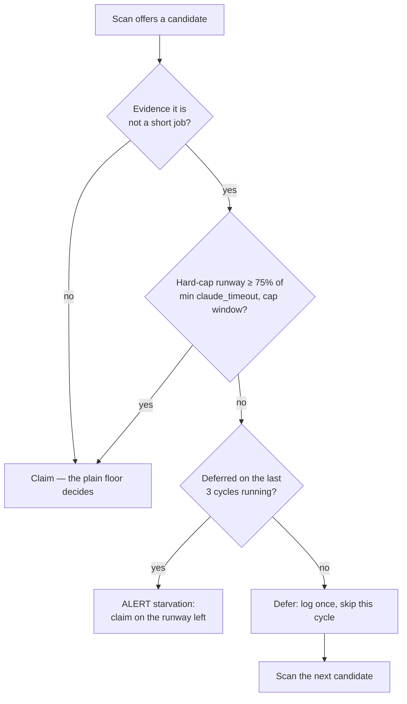

An issue with evidence needs three quarters of the best execute budget the
host can offer — `claude_timeout`, or the hard-cap window's own equivalent
where the cap can never fit that budget. Requiring the whole budget would leave
such a host claiming nothing at all; three quarters refuses the doomed slice
(933 s of 3600 s) while leaving the runs that made progress on #222 — 56 min
and 49 min — untouched. A deferral never parks the slot: it is logged once per
cycle and the scan moves to the next candidate. A run with no hard cap has no
adaptive floor at all: nothing will cut its execute short, so evidence of a
long job is not evidence of a doomed claim.

#### The deferral is bounded (Issue #375)

Three quarters is only safe while the requirement stays *satisfiable*, and on a
host whose hard-cap window is no longer than its `claude_timeout` it is not.
There the requirement is 0.75 × 3600 = 2700 s of **remaining** runway, but a
claim gate is first reached after startup, the maintenance passes and the scan
have run — about twenty minutes in, so the best runway ever offered was
2430 s.
VibeCoder #355 was refused on six consecutive cycles under the wording
"leaving it for the next cycle", while the idle-decision census counted it as
claimable and `[idle-census] ALERT inversion` fired every cycle. A permanent
strand that reads as a passing deferral is the same failure shape as
Issue #319.

So the deferral has a memory. The worker counts the consecutive **cycles**
(not scans — a slot re-scans every 30 s) that the floor deferred one issue in
`adaptive_floor_deferrals.json` under the work directory. On the third it
yields: the issue is claimed on whatever runway is left, and the hard-cap kill
commits and pushes its WIP for the next run to resume — the last stage of
[The cycle-deadline model](#-the-cycle-deadline-model). The override is logged
as

```text
[adaptive-floor] ALERT starvation issue=owner/repo#355 deferred_cycles=3 limit=3 runway=2360s required=2700s — …
```

and the streak resets as soon as the floor accepts the issue, so an issue that
genuinely fits a later cycle is never claimed on a doomed slice. Entries expire
after seven days.

### 🕰️ The cycle-deadline model

This is the canonical description of what the cycle deadline does (Issue #397).
Every other page links here rather than restating it — the model used to be
paraphrased on five pages, which is the drift
[`DUPLICATED-KNOWLEDGE-SCAN.md`](DUPLICATED-KNOWLEDGE-SCAN.md) exists to stop.

**The cycle deadline is a freshness restart, not a kill switch.** A cycle runs
for `runDurationSeconds` (1 hour) so the *next* one starts clean: a fresh clone,
the worker code and configuration that landed in the meantime, and a re-read
backlog. Nothing about that goal requires killing work already under way, and
killing it was expensive — a claim taken 16 minutes before the hour used to be
given a 16-minute budget, killed mid-task, and refused an extension while
demonstrably progressing.

Five stages, in the order a claim meets them:

1. **The claim gate is soft.** Past the deadline a slot takes **no new claim**
   (`slotShouldStop` returns `deadline`); nothing already running is touched.
   The [claim-runway floor](#-adaptive-claim-floor) refuses a claim for the
   other reason, and it now measures runway to the supervisor hard cap rather
   than to the deadline (`hard-cap`, Issue #425) — a claim the cap would kill
   before it finished setup is the only claim worth refusing early.
2. **An in-flight claim keeps its full budget.** The execute phase does **not**
   truncate `claude_timeout` to the runway left (Issue #420). A claim taken at
   any point inside the cycle gets the whole budget, and the cycle overruns to
   let it finish.
3. **Extensions re-arm that budget while the run is progressing.** On by
   default (Issue #422) — see
   [Progress-extended deadline](#-progress-extended-deadline) for the two
   signals and the grant size.
4. **The supervisor's wall-clock cap is the only place a progressing agent is
   killed.** `VIBE_RUN_MAX_SECONDS` is the ceiling every grant is measured
   against, less a reserve for the kill grace and the WIP commit-and-push, so
   the worker's own kill lands *before* the supervisor's SIGTERM — see
   [The run hard cap bounds every grant](#the-run-hard-cap-bounds-every-grant).
   Work in progress is committed and pushed, the next cycle resumes it, and the
   issue is reported as a **scheduled release** rather than a failure
   (Issue #424) — the fleet stopped the agent, not the other way round.
5. **The drain waits.** `drainSlots` lets a slot that started before the
   deadline finish, however long that takes. Only a SIGTERM *shutdown* bounds
   the wait with a grace; a deadline drain does not.

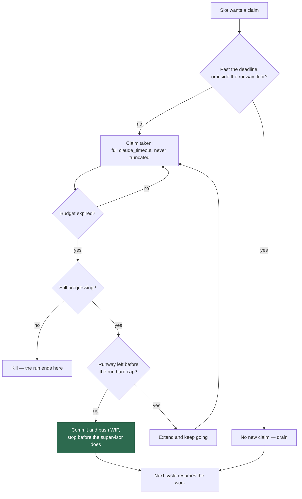

**What the deadline still bounds.** Two routes hold no work-in-progress, so
stopping them at the hour loses nothing and letting them run delays the
restart:

- **Idle-task scans** — bounded to the runway left plus the kill grace, and
  their retries suppressed. See
  [Idle-Task Framework](IDLE-TASK-FRAMEWORK.md#the-cycle-deadline-bounds-a-scan-too-issue-186).
- **The maintenance lane** — starts no further agent-backed PR pass once the
  deadline is reached; the pass defers to the next cycle.

> **Relationship to Issue #399.** #397 removes the *deadline-truncation*
> symptom #399 cites — an issue claim is no longer killed at the hour with a
> partial budget. It does **not** address what #399 is actually about: the cost
> of a slow `./quality.sh` gate inside the execute budget. Both were true at
> once; only the first is fixed here. The second is Issue #1138 — see
> [The full gate is conditional on the budget left](#the-full-gate-is-conditional-on-the-budget-left-issue-1138).

### ⏱️ How timeouts interact

The worker uses two timeout mechanisms that work together to detect stuck Claude
processes:

1. **`claude_timeout`** (default: 3600s / 1 hour) — the **hard ceiling**. This is
   a safety-net timeout applied via the `timeout` command. If Claude has not
   completed after this duration, the process receives SIGTERM, then SIGKILL
   after `claude_kill_after` seconds. lowered this from 4 hours: a
   4-hour wedge consumed an entire iteration's run-duration budget and starved
   other repositories. Work that genuinely needs longer should raise a sub-issue
   via the escape hatch rather than a bigger budget.

2. **`claude_no_output_timeout`** (default: 600s / 10 minutes) — the
   **stuck-process detector**. A background progress monitor checks Claude's
   output file at regular intervals (`output_progress_interval`, default: 300s).
   If zero bytes of new output are produced for `claude_no_output_timeout`
   seconds, the process is considered stuck and terminated early — without
   waiting for the full `claude_timeout`. lowered this from 15
   minutes so wedged processes are detected sooner on unattended workers.

**In practice**, the no-output timeout fires first for genuinely stuck processes
(e.g. Claude spinning with no progress), while the hard ceiling catches edge
cases where Claude produces occasional output but never finishes. Most operators
only need to adjust `claude_no_output_timeout` — lowering it detects stuck
processes faster; raising it allows for longer periods of Claude "thinking"
between outputs.

The reactive phases do not inherit the issue-work budget: `pr_feedback_timeout`
and `ci_fix_timeout` cap at 1800s (30 minutes), `planning_timeout` at 1800s, and
a grill-me round at `grill_me_timeout` (3600s). Each has its own
`*_kill_after` grace period.

One exception, and it is the reason a live CI fix logged `3600s` against a
documented `1800`: a reactive key left unset **while `claude_timeout` is set
explicitly in the config file** inherits `claude_timeout` for back-compat
(Issue #1824). Set `pr_feedback_timeout` / `ci_fix_timeout` explicitly whenever
you raise `claude_timeout`, or the reactive phases follow it up. Separately,
the run loop itself used to hand the reactive processors `claude_timeout`
regardless of these keys — fixed in Issue #213, so the run loop and the
single-shot commands now resolve the same budget.

```
Timeline: 0 ─────────────────────────────── claude_timeout (1h) ─── SIGTERM
          │                                                          │
          │  No output for 10 min?                                   │
          │  ───── claude_no_output_timeout ── SIGTERM (early kill)  │
          │                                                          │
          └──────────────────────────────────────────────────────────┘
```

Because `progress_extension_enabled` defaults to on (Issue #422), the hard
ceiling is a *deadline* for **issue work only** rather than a kill. The
no-output watchdog above is untouched — it still kills a silent run however
many extensions were granted:

```
Issue work,  0 ──── deadline (1h) ──── deadline+15m ──── deadline+30m ─── …
extension    │  ·   ·   ·   ·   ·  │  ·   ·   ·   ·   │  ·   ·   ·  
enabled:     │  └ tree sampled every 5 min (progress_extension_check_seconds)
             │                     │                  │
             │        still progressing? ── yes ──> +progress_extension_grant_seconds
             │                     │                  │
             │                     └── no ──────────> SIGTERM (hard timeout)
             │
             │ No output for 10 min? (unchanged,)
             │  ───── claude_no_output_timeout ── SIGTERM (early kill)
             └──────────────────────────────────────────────────────────────
```

Only issue work (the execute phase) reads this deadline. Planning, grill-me,
PR feedback and CI fix keep their unconditional caps.

Example — override just the Claude timeout to 2 hours:

```json
{
  "claude_timeout": 7200
}
```

### ⏳ Progress-extended deadline

`claude_timeout` on its own is unconditional: at the hour the process dies,
however much useful work it was doing. That is not the shipped behaviour —
`progress_extension_enabled` defaults to `true` (Issue #422), so the hard
deadline for **issue work only** is re-armable: when it expires the worker asks
whether the agent is alive and whether anything is actually progressing, and
only kills if either answer is no:

- **Is the agent still producing anything?** The stream-json progress tracker
  reports both the last tool call and the last stdout chunk, and the **fresher
  of the two** answers this question; only when *both* are older than
  `progress_extension_stall_seconds` is the agent judged stalled. This must
  always hold. Reading the tool clock alone killed an agent that was waiting
  *inside* one long tool call — `TaskOutput` polling a background job, a
  multi-minute build — because no new `tool_use` event appears for as long as
  that call runs (Issue #767).
- **Is anything progressing?** Two independent signals, and *either* one is
  enough:
  - **The checkout is changing.** A read-only `git status` / `rev-parse` /
    `diff --shortstat` fingerprint is compared with the one taken at the
    previous check. `advanced` is progress; `unchanged` is not, and a probe
    that cannot answer (`unknown` — not a repo, git missing, timed out) is
    **not** treated as progress either. An `unknown` tree still kills outright.
  - **A descendant process is doing work** (Issue #508). One
    `ps -eo pid=,ppid=,time=` read is walked into the agent's own subtree and
    the CPU time those descendants have accumulated is compared with the
    previous read. CPU burnt between two checks is work; a subtree that burns
    none — a `sleep 60` poll loop with nothing behind it — is not, and a read
    that fails is `unknown` and never earns an extension.

The second signal is why an agent supervising a long-running job it started —
a training run, an evolution sweep, a build — is no longer killed for changing
nothing in the checkout while it waits. An agent with tool calls, no tree delta
*and* no working descendant is still refused, exactly as before.

Each grant moves the deadline `progress_extension_grant_seconds`
from *now*, so a run that stalls dies within one grant of stalling, and each
grant logs one `[progress-extension]` line naming the reason, the elapsed time,
the extension count and the new deadline. There is deliberately no ceiling on
the *number* of grants — the concurrency slot pool bounds the blast radius —
but there is one on wall clock, below.

#### The run hard cap bounds every grant

`loop.sh` wraps each run in `timeout <VIBE_RUN_MAX_SECONDS>` (default 10800 s —
3 h — `0` disables it) and now exports that cap with the run's start epoch, so
the worker can see the deadline it is running towards (Issue #421). The cap is
the outer bound on a cycle that *finishes* the work it started rather than "one
run plus a margin": with claims no longer truncated at the cycle deadline
(Issue #397), a claim taken at minute 59 runs its full budget and its progress
extensions inside it (Issue #423). It sits 600 s under the launcher's container
watchdog (`VIBE_CONTAINER_WATCHDOG_SECONDS`, 11400 s by default), so the host
never reaps a container this supervisor would still allow to run. The cap is
the last stage of [The cycle-deadline model](#-the-cycle-deadline-model): the
only place a still-progressing agent is stopped. Extensions are bounded by it:

- The **ceiling** is `run start + VIBE_RUN_MAX_SECONDS`, less a reserve of
  `claude_kill_after` plus 120 s for the WIP commit-and-push. The worker's own
  kill therefore lands before the supervisor's SIGTERM, leaving
  work-in-progress committed and pushed for the next cycle to resume.
- A grant that would cross the ceiling is **clamped to it**, not refused: a run
  with 200 s of runway left gets 200 s, and the line says so
  (`grant clamped to the run hard cap: 200s of runway left, not the full
  900s`).
- With no runway left the check refuses and the run is killed with
  `run hard cap reached`.
- With `VIBE_RUN_MAX_SECONDS=0`, or the variables absent (a CLI single-issue
  run, or `run.sh` invoked outside `loop.sh`), there is **no ceiling** and
  extensions behave exactly as they did before. The run-start `Run hard cap:`
  line says which of the two applies.

#### The agent is told to wind down before the cap (Issue #508)

An agent cannot be interrupted mid-session — its stdin carries the prompt and
is closed — so the remaining budget is written where it can read it. The worker
writes `.vibe-run-budget.md` into the checkout, and refreshes it at every later
check, once the runway can no longer cover something the agent might start.
That is **two bands, one file** (Issue #1138):

- **Inside the last 600 s** — the wind-down window. The notice states the
  seconds remaining, elapsed, extensions granted, and the instruction to stop
  waiting, commit and push, and leave a resumable note. The operator log says
  `wind-down notice written`.
- **Above the window, while the runway is still short of what the quality gate
  needs** (~1080 s by default, more on a repo whose gate is measurably slower)
  — the notice refuses the gate and says the run itself continues. No
  stop-waiting instruction is emitted there: the run is fine, only the gate
  does not fit. The operator log says `run-budget notice written`.

The issue prompt tells the agent to read that file between polls of any
long-running job, and before starting the gate. Because the file now means two
different things, anything asking "was this run warned?" — the handover note
does — reads its contents rather than its presence.

The name is hidden, so the enforced `.gitignore` keeps it out of every commit
and `git status` never reports it — writing it cannot move the working-tree
probe. Any notice left by a previous run is cleared when the next execute phase
starts.

#### The full gate is conditional on the budget left (Issue #1138)

The quality gate is the most expensive thing an agent can start. Across 407
observations of a run's most recent tool call being `./quality.sh`, the median
elapsed time was **17 minutes** — inside a run budget of roughly an hour — and
agents were still inside it at 49 to 68 minutes. Starting it with ten minutes
left cannot end well: the gate does not finish, nothing it reports gets fixed,
and the runway needed to commit and push is gone.

Nothing is lost by skipping it. CI runs the same checks on the PR in parallel
shards on dedicated runners, and the worker runs its own gate
(`phases/quality_gate_remediation_phase.ts`) after the agent stops. The agent's
run is the third copy — the only one paid for out of the run budget.

So the instruction the agent receives is budget-aware, and it comes from one
place: `buildQualityInstructions()` (`worker/deno/lib/repo_config.ts`), spliced
into every prompt with a `{{QUALITY_INSTRUCTIONS}}` placeholder. It states what
the gate costs — the duration the baseline gate actually took on this
repository this cycle, or a 900 s fleet assumption when the baseline was reused
— and tells the agent to check `.vibe-run-budget.md` before starting it. The
wind-down notice refuses the gate outright when the runway cannot cover it, and
hands over the note that records the skip:

```markdown
<!-- vibe-quality-gate-skipped required="1080s" remaining="420s" -->
```

A skipped gate is never silent: that note goes in the PR summary (or
`.pr_response_message`), because a gate nobody ran reads exactly like a gate
that passed.

**A slow gate is refused for most of a run, by design.** The refusal band is
`gate + 180 s`, so a repo whose gate measurably takes 40 minutes refuses it
from about 17 minutes into an hour-long run and does not offer it again. That
is the intended trade: on such a repo the agent could never have finished the
gate and acted on it anyway, and CI runs it in parallel shards regardless. A
repo in that position should shorten its gate or set `quality_command` to the
subset worth running locally.

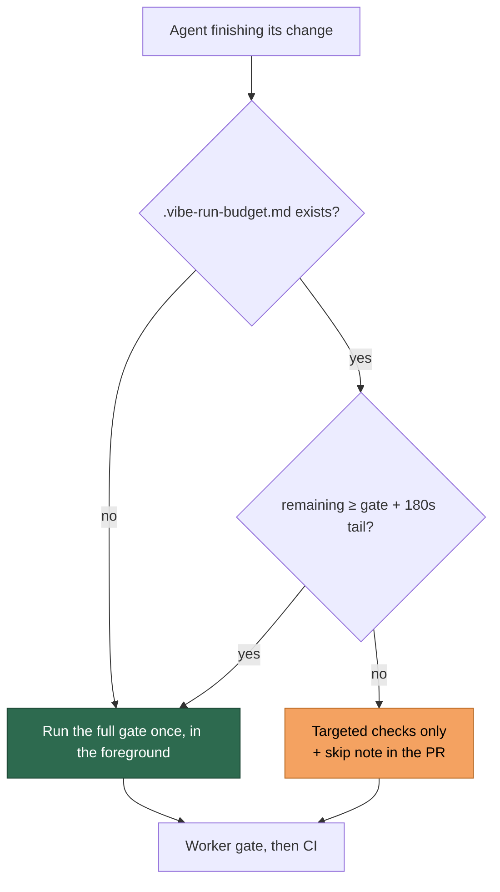

No prompt template may hard-code its own "run the gate before you push":
`prompt_gate_instruction_check.ts` scans every `prompts/*/prompt.md` and fails
the suite when one does, so the fleet cannot drift back to an instruction its
budget will not pay for.

#### A capped run is released, not failed (Issue #424)

A run stopped by the cap — or by the worker's own shutdown at cycle end — was
progressing when the fleet stopped it, so it is reported as a **scheduled
release**, not as the issue defeating the agent:

- The failure reason opens with
  `Released on schedule: … — WIP preserved, resumes next cycle`, which
  `detectFailureCategory` classifies as `scheduled_release`
  (category display `scheduled-release`).
- The release comment therefore never says "Claude ran out of time" and never
  advises splitting the issue into sub-issues — that diagnosis is reserved for
  a run that genuinely exhausted its own `claude_timeout`.
- A scheduled release does **not** enter the `failed-once` → `failed` ladder,
  does **not** feed the escalating timeout cooldown, and is **not** auto-filed
  as a worker fault. It is also not classed as an infrastructure failure: the
  bounded in-process retry exists to re-run a transient blip, and a run
  released at the cap has no runway to retry into.
- The preserved work lands in a `wip:` commit whose subject names the real
  cause (`wip: execute was released on schedule (cycle ended or run hard cap
  reached) after …`), so the next claimant reads what actually happened.
- The release comment carries a **Work in progress** line naming the branch
  that work is on, and links the handover file when one exists (Issue #770).
  The branch named is the one the push targeted, so a retitled issue cannot
  point a reader at a ref nothing wrote, and a run that preserved nothing names
  no branch.

The checkout is sampled every `progress_extension_check_seconds` while the run
is inside its budget, so the verdict read at the deadline
describes the last check interval rather than the whole grant. An interim
sample only gathers evidence — it can never kill, because the deadline is what
guards the budget. Because that evidence can be up to one interval old,
`progress_extension_stall_seconds` may not be shorter than the interval;
`loadConfig` rejects that combination rather than killing runs that
demonstrably progressed inside the sampling window.

Everything else is unchanged: the no-output watchdog
(`claude_no_output_timeout`) still kills a silent run no matter how many
extensions were granted, and only issue work (the execute phase) reads the
extendable deadline at all — PR feedback, CI fix, planning,
grill-me and the health checks keep their unconditional caps.

#### The kill explains itself (Issue #768)

A run killed at its deadline states what the extension did, in both artefacts
an operator reads — so diagnosing a kill never needs a dig through
`claude_runner.ts`:

- the **worker log** line at the hard timeout — `Claude timed out after 5645s:
  base budget 3600s extended 4× by 2040s (final deadline 5640s); last extension
  refused: working tree unchanged despite tool activity 31s ago — killing
  process tree (PID …)`; and
- the **release comment** on the issue, whose timeout diagnosis carries
  `Progress extension: base timeout 3600s, deadline armed at kill 5640s, agent
  elapsed 5645s, 4 extensions granted (+2040s); last check refused because …`.
  The elapsed figure is labelled `agent elapsed` because the same line already
  states the whole run's wall clock — the agent's own run is the shorter of
  the two.

Zero grants is itself a finding and reads differently — `no extensions granted
— last check refused because no tool activity recorded` — so a run refused at
its first check is never mistaken for one that was extended and still ran out.
With `progress_extension_enabled` set to `false` no telemetry is produced and
both surfaces keep their pre-extension wording.

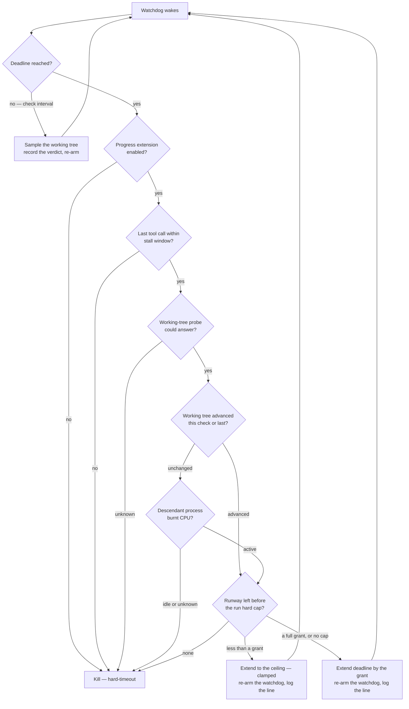

These are the shipped defaults — an operator who wants them does not need to
write anything. Set a key only to change it:

```json
{
  "progress_extension_enabled": true,
  "progress_extension_grant_seconds": 900,
  "progress_extension_stall_seconds": 300,
  "progress_extension_check_seconds": 300
}
```

#### Turning it off

Extensions are on by default (Issue #422). One key restores the pre-#4290
behaviour — a single unconditional `claude_timeout` kill for issue work, with
no tree sampling and no grants:

```json
{
  "progress_extension_enabled": false
}
```

The other three keys are then ignored. `loadConfig` still validates them, so a
non-positive value or a stall window shorter than the check interval is
rejected whether or not the feature is on.

#### Why did this run take three hours?

Because the feature is on, a run may legitimately outlive `claude_timeout`, so
every message says what actually happened rather than quoting the configured
budget:

- **The worker log** — one `[progress-extension]` line per grant, naming the
  reason, the elapsed time, the extension count and the new deadline. Count
  them to see how a three-hour run got there:

  ```bash
  LOG_DIR="$(deno run --allow-env --allow-read worker/deno/mod.ts log-dir)"
  grep '\[progress-extension\]' "${LOG_DIR}"/worker-*.log
  ```

- **The kill line** — `Claude timed out after 5640s: base budget 3600s extended
  4× by 2040s (final deadline 5640s); last extension refused: working tree
  unchanged despite tool activity 31s ago`. The clause after the semicolon is
  the signal that actually stalled.
- **The failure comment on the issue** — carries the same history, so a human
  reading a failed issue never sees a false "timed out after 3600 seconds".
- **The `## Issue run model stats` comment** — a **Deadline extensions** line
  reports the count and the seconds added, so extension frequency is reviewable
  across issues after rollout.

`watchdogLateSeconds` (the starved-timer signal, reported as `Ns late` on
the kill line) is measured against the **final** deadline, not the original
budget — an extended run that dies on time reports no lateness.

With the feature off, every one of those messages is byte-identical to what it
was before.

Example — configure a named worker with fixed repository scan order for a
multi-worker setup. Note: scan order controls which repos are queried first, not
which issue is selected — the globally oldest eligible issue across all repos is
always chosen:

```json
{
  "worker_name": "Vibe Coder Alpha",
  "shuffle_repos": false,
  "update_gh_user_status": true
}
```

Example — increase the no-output timeout and enable security logging:

```json
{
  "claude_no_output_timeout": 1800,
  "security_log_file": "/var/log/vibe-coder/security.log"
}
```

The following operational values are **not** configurable via `.config.json` and
are determined at runtime:

| Setting            | Default                 | Description                                             |
| ------------------ | ----------------------- | ------------------------------------------------------- |
| `WORK_DIR`         | in-container work volume | Workspace where repos are cloned (see below)            |
| `LOG_FILE`         | `$HOME/logs/worker.log` | Log file location                                       |
| `SET_WINDOW_TITLE` | `true`                  | When `true`, sets terminal window title to current task |

`WORK_DIR` has no host default (Issue #131). The in-container run driver
resolves and exports it, so the workspace lands on the `vibe-work` named
volume — `/home/vibe/auto-issue-work` inside the container. Outside the
container (setup, the launchers, housekeeping) an unset `WORK_DIR` means **no
work directory and no cache at all**, not a `$HOME` path: nothing host-side
creates or caches under such a directory (Issue #132) — setup re-queries the
GitHub API instead of caching lookups. An explicit `WORK_DIR` in the
environment is still honoured; it is how the in-container worker is pointed
at the work volume.

### 🔩 Internal Operational Constants

The following values are defined in `worker/deno/lib/operational_defaults.ts`
and are internal tuning parameters. They are not typically user-configurable but
can be overridden via environment variables for testing or special deployments.

| Setting                                             | Variable                                 | Default         | Description                                                                                       |
| --------------------------------------------------- | ---------------------------------------- | --------------- | ------------------------------------------------------------------------------------------------- |
| Characters per token                                | `CHARS_PER_TOKEN`                        | `4`             | Approximate characters per token for English text (used for token estimation)                     |
| Screenshot evidence directory                       | `SCREENSHOT_EVIDENCE_DIR`                | `docs/evidence` | Default directory for screenshot evidence files (relative to repo root)                           |
| Git command timeout                                 | `GIT_COMMAND_TIMEOUT`                    | `60`            | Timeout for standard git commands (fetch, push) in seconds                                        |
| Git merge timeout                                   | `GIT_MERGE_TIMEOUT`                      | `120`           | Timeout for merge/rebase/pull operations in seconds                                               |
| GitHub CLI (Command-Line Interface) command timeout | `GH_COMMAND_TIMEOUT`                     | `60`            | Timeout for individual `gh` CLI commands in seconds                                               |
| GitHub clone timeout                                | `GH_CLONE_TIMEOUT`                       | `600`           | Timeout for `gh repo clone` operations in seconds (large repos on shared networks need more time) |
| GitHub paginated read timeout | `GH_PAGINATED_TIMEOUT` | `300` | Timeout for a `gh api --paginate` read in seconds — one call walks every page, so it outlives a single request |
| GitHub rate-limit cooldown | `GH_RATE_LIMIT_COOLDOWN` | `300` | Rate-limit circuit breaker cooldown in seconds |
| Assigned no-heartbeat timeout                       | `ASSIGNED_NO_HEARTBEAT_TIMEOUT`          | `1800`          | Grace period for assigned issues with no heartbeat before recovery (30 minutes)                   |
| Stale assignment timeout                            | `STALE_ASSIGNMENT_TIMEOUT`               | `14400`         | Timeout for GitHub-based stale assignment recovery (4 hours)                                      |
| Health check cache TTL                              | `HEALTH_CHECK_CACHE_TTL`                 | `300`           | Health check cache time-to-live in seconds (5 minutes)                                            |
| Issue cache TTL                                     | `ISSUE_CACHE_TTL`                        | `600`           | Issue cache time-to-live in seconds (10 minutes)                                                  |
| Retry max attempts                                  | `RETRY_MAX_ATTEMPTS`                     | `4`             | Maximum retry attempts for transient failures                                                     |
| Retry initial delay                                 | `RETRY_INITIAL_DELAY`                    | `2`             | Initial delay between retries in seconds                                                          |
| Rate-limit max wait                                 | `RATE_LIMIT_MAX_WAIT`                    | `3600`          | Maximum seconds to honour from a Retry-After header (1 hour)                                      |
| Circuit breaker state expiry                        | `CIRCUIT_BREAKER_STATE_EXPIRY_SECONDS`   | `3600`          | Expiry threshold for persisted circuit breaker state (1 hour)                                     |
| Operation backoff threshold                         | `OPERATION_BACKOFF_THRESHOLD`            | `2`             | Consecutive failure threshold for operation-specific backoff escalation                           |
| Failure state expiry                                | `FAILURE_STATE_EXPIRY_SECONDS`           | `3600`          | Expiry threshold for persisted failure tracker state (1 hour)                                     |
| Software update check interval                      | `SOFTWARE_UPDATE_CHECK_INTERVAL_SECONDS` | `604800`        | How often to check for software updates (7 days)                                                  |
| Claude update timeout                               | `CLAUDE_UPDATE_TIMEOUT`                  | `120`           | Claude CLI update timeout in seconds                                                              |
| Claude update kill-after                            | `CLAUDE_UPDATE_KILL_AFTER`               | `10`            | Claude CLI update kill grace period in seconds                                                    |
| GitHub CLI update timeout                           | `GH_UPDATE_TIMEOUT`                      | `120`           | `gh` CLI update timeout in seconds                                                                |
| GitHub CLI update kill-after                        | `GH_UPDATE_KILL_AFTER`                   | `10`            | `gh` CLI update kill grace period in seconds                                                      |
| Deno update timeout                                 | `DENO_UPDATE_TIMEOUT`                    | `120`           | Deno update timeout in seconds                                                                    |
| Deno update kill-after                              | `DENO_UPDATE_KILL_AFTER`                 | `10`            | Deno update kill grace period in seconds                                                          |
| Crash notification cooldown                         | `CRASH_NOTIFICATION_COOLDOWN_SECONDS`    | `600`           | Minimum seconds between crash notifications to prevent spam (10 minutes)                          |
| Progress monitor min timeout                        | `PROGRESS_MONITOR_MIN_TIMEOUT`           | `60`            | Minimum timeout before enabling the progress monitor (1 minute)                                   |
| Error scan tail lines                               | `ERROR_SCAN_TAIL_LINES`                  | `30`            | Number of tail lines to scan for rate-limit / authentication error patterns                       |
| Heartbeat update interval                           | `HEARTBEAT_UPDATE_INTERVAL`              | `120`           | Heartbeat update interval in seconds (2 minutes)                                                  |
| Answer truncate length                              | `ANSWER_TRUNCATE_LENGTH`                 | `500`           | Maximum characters to keep from a bot answer before truncating                                    |
| Pre-setup command timeout                           | `PRE_SETUP_TIMEOUT`                      | `300`           | Timeout for repository pre-setup commands (5 minutes)                                             |
| GitHub issue list limit                             | `GH_ISSUE_LIST_LIMIT`                    | `50`            | Default limit for `gh issue list` queries                                                         |

### ⏱️ Every `gh` invocation is bounded

The three `gh` timeouts are applied at the `gh` chokepoint itself
([`worker/deno/lib/gh_spawn.ts`](../worker/deno/lib/gh_spawn.ts) via
[`gh_timeout.ts`](../worker/deno/lib/gh_timeout.ts)), not by each caller
(Issue #1229): `GH_CLONE_TIMEOUT` for `gh repo clone`, `GH_PAGINATED_TIMEOUT`
for a `gh api --paginate` read, and `GH_COMMAND_TIMEOUT` for everything else. A
call that exceeds its budget is aborted and reported loudly — exit code `124`
with `TIMEOUT: gh <args> timed out after <n>s` on stderr — so a stalled GitHub
call can no longer hang the run. A caller that supplies its own `AbortSignal`
(the rate-limit wrapper in `gh_wrapper.ts`) keeps its own deadline.

An override that is missing, unparseable or non-positive falls back to the
default: a `GH_COMMAND_TIMEOUT=0` cannot restore unbounded behaviour.

### 🥇 The config file wins over the environment

Where a setting can be stated in **both** `.config.json` and a `VIBE_*`
environment variable, the rule is the same for every one of them (Issue #289,
stated once in
[`worker/deno/lib/config_precedence.ts`](../worker/deno/lib/config_precedence.ts)):

1. the `.config.json` key, when it states a usable value;
2. the `VIBE_*` variable, when the file states nothing;
3. the built-in default, when neither does.

An unusable value — a negative floor, a number that will not parse — is refused
wherever it was written and falls through to the next source, so a typo in one
variable cannot stop a host claiming work.

The environment fallbacks are **deprecated**, and a later major stops reading
them (Issue #874). The three settings 2.0.0 reordered — `imgbb_api_key`,
`agent_provider` and `agent_providers`, with `update_gh_user_status` moving
alongside them — each log a single line naming the config key that replaces the
variable, once per run, on a host that still takes them from the environment;
see
[Release notes](RELEASE-NOTES.md#200--the-config-file-wins-over-the-environment).
The remaining settings report the source they resolved from without a
deprecation line yet.

### 🔧 Setup-Time Environment Variables

The `./setup.sh` script accepts `VIBE_*` environment variables for
configuration. The Vibe Coder is designed to run on unattended machines where
all interactions happen via GitHub issues and PRs; the system must
never wait on any UI interaction. When run in a terminal, setup may optionally
prompt for service-account paths; in non-interactive environments (e.g. CI), it
runs without prompts.

These variables are only used during setup to populate `.config.json` — they are
not read at runtime.

```bash
VIBE_ALLOWED_AUTHORS=user1,user2 \
VIBE_REPOS="org/repo1,org/repo2" \
VIBE_SERVICE_ACCOUNTS="stsvcbot,Vibecoderbot" \
./setup.sh
```

`VIBE_SERVICE_ACCOUNTS` sets the worker identity guard allowlist. Omit it and setup defaults the allowlist to the login it
authenticated as — see
[Service-Account Identity Guard](#️-service-account-identity-guard-issue-3528).

Operational settings can also be configured during setup:

```bash
VIBE_CLAUDE_TIMEOUT=7200 \
VIBE_SLEEP_INTERVAL=60 \
./setup.sh
```

See `./setup.sh` header comments for the full list of `VIBE_*` variables.

### 📁 Where the logs go

The host log directory is the fleet's **only writable host mount**: the
checkout is mounted read-only and work and approval state ride named volumes,
so this is the one directory an operator, a log shipper or a backup can read
from the host. Its default follows the platform's own convention (Issue #873):

| Platform | Default                                                                 |
| -------- | ----------------------------------------------------------------------- |
| Linux    | `$XDG_STATE_HOME/vibe-coder`, falling back to `~/.local/state/vibe-coder` |
| macOS    | `~/Library/Logs/vibe-coder` — the directory Console.app reads             |
| Windows  | `%LOCALAPPDATA%\vibe-coder\logs`                                         |

Logs are **state**, which is why Linux uses the XDG state directory rather than
cache or config: the XDG Base Directory Specification names state as the home
for "logs [and] history".

#### Pinning it: `log_dir`

A deployment that wants its logs somewhere else states it in `.config.json`,
where the rest of its host configuration lives — no environment variable:

```json
{
  "log_dir": "~/logs"
}
```

| Accepted value | Example |
| -------------- | ------- |
| An absolute host path | `"/var/log/vibe-coder"`, `"C:\\ProgramData\\vibe-coder\\logs"` |
| A path anchored at `~`, expanded against the host's home | `"~/logs"`, `"~"` |
| Absent, or blank | The variables below, then the platform default |

A **relative** path is refused, with the offending value named: it would
resolve against whichever directory each launcher happened to be started in, so
`launch-*.log` and `worker-*.log` could land in different places — the split
this key exists to prevent. `~` is expanded exactly as it is for the other
path-valued keys (`ssh_key_path`, `gh_config_dir`).

Setting `log_dir` also silences the legacy-location notice below: the directory
is the operator's own choice, not a default that moved.

Two variables still override the default, and `log_dir` outranks both — the
precedence is **`log_dir`, then `LAUNCH_LOG_DIR`, then `LOG_DIR`, then the
platform default**:

| Variable          | Description                                                          |
| ----------------- | -------------------------------------------------------------------- |
| `LAUNCH_LOG_DIR`  | The supervisor's own spelling, kept from `loop.sh`                    |
| `LOG_DIR`         | A system service names `/var/log/vibe-coder` here — a launchd or systemd unit sets an environment, not a config file |

Neither is deprecated: a unit file is the one place a directory genuinely has
to come from the environment. For everything else, state `log_dir`.

A blank value means unset, exactly as `${LOG_DIR:-…}` does in shell — in the
config key as well as in the variables. One resolution serves the launcher,
`run.sh`, `loop.sh`, `run.ps1` and the container mount (Issues #872, #873) —
ask for it rather than assuming it:

```bash
LOG_DIR="$(deno run --allow-env --allow-read worker/deno/mod.ts log-dir)"
tail -n 200 "${LOG_DIR}/worker.log"
```

Inside the container the logs are always at `/home/vibe/logs`, which is where
this host directory is mounted. That path is fixed and does not follow the host
default.

#### Moving off the old `~/logs`

Before 1.4.0 the default was `$HOME/logs`. **Nothing is migrated for you**: on
the first launch after the upgrade, a host that still has `~/logs` and does not
yet have the new directory prints one line naming both paths, and leaves the
old directory exactly as it is. Bring the history across with:

```bash
mkdir -p ~/.local/state/vibe-coder && mv ~/logs/* ~/.local/state/vibe-coder/
```

Or keep the old location — it is still perfectly valid — by stating
`"log_dir": "~/logs"` in `.config.json`. Rotated logs stay gzipped there just
as they do anywhere else: compression and retention both run on the resolved
directory, not on a re-spelled default.

### 🔄 Special Runtime Variables

A small number of variables are still read from the environment at runtime for
operational purposes:

| Variable                        | Default        | Description                                                   |
| ------------------------------- | -------------- | ------------------------------------------------------------- |
| `CONFIG_FILE`                   | `<checkout>/.config.json` | Path to the configuration file, for setup and the launcher alike. `CONFIG_PATH` is accepted as an alias (the launcher's older spelling); a relative value resolves against the checkout, and setting both to different files is refused rather than silently resolved two ways — see [One config file, one name](#one-config-file-one-name-issue-750) |
| `VIBE_DAILY_SPEND_CEILING_USD` | `0` (disabled) | Daily estimated model-spend ceiling in USD |
| `VIBE_HOST_DISK_LOW_FLOOR_GB` | `20` | Gigabyte term of the claiming floor. The `.config.json` key `host_disk_low_floor_gb` wins over it — see [The claiming floor](#the-claiming-floor-issue-732) |
| `VIBE_HOST_DISK_LOW_FLOOR_PERCENT` | `10` | Percentage term of the claiming floor. The `.config.json` key `host_disk_low_floor_percent` wins over it — see [The claiming floor](#the-claiming-floor-issue-732) |
| `VIBE_CREDIT_LOG_DIR`           | `<workDir>/.credit-logs` | Directory holding the `.credit_log_YYYY-MM-DD.json` files. The default is worker-private (`0700`) so the untrusted `agent` account cannot plant a symlink at the log path or delete the ceiling's only input — see [Where the credit logs live](#where-the-credit-logs-live-issue-1239) |
| `VIBE_SIDE_REPO_CLONE_ARGS`     | `--filter=blob:none` | `git clone` arguments a gate uses for the sibling data repos it pulls in — see [Side/data repo clones are blobless](CONTAINER.md#sidedata-repo-clones-are-blobless-issue-243) |
| `WORK_VOLUME_SIDE_REPO_MAX_AGE_DAYS` | `3` | Idle days before a side/data clone is aged out of the work volume |
| `MERGED_PR_SWEEP_ISSUE_LIMIT` | `200` | Open issues examined per repo by the housekeeping merged-PR issue sweep (Issue #504) |
| `WORK_VOLUME_SIDE_REPO_MAX_GIT_BYTES` | `2147483648` (2 GiB) | Cap on a side/data clone's `.git`; over it the clone is dropped even while warm, because each blobless refresh leaves a tree of blobs git will not prune (`0` disables) — see [A warm clone's object store is capped too](CONTAINER.md#a-warm-clones-object-store-is-capped-too-issue-387) |

### The claiming floor (Issue #732)

The worker stops claiming new work when the filesystem holding the container
store falls below a floor. The floor is the **larger** of two terms:

| Term | `.config.json` key | Environment variable | Default |
| --- | --- | --- | --- |
| Gigabytes | `host_disk_low_floor_gb` | `VIBE_HOST_DISK_LOW_FLOOR_GB` | `20` |
| Percentage of the filesystem | `host_disk_low_floor_percent` | `VIBE_HOST_DISK_LOW_FLOOR_PERCENT` | `10` |

**Precedence, per term:** the `.config.json` key wins, then the environment
variable, then the default — the rule Issue #289 set for every other knob. The
terms resolve independently, so a deployment may pin the percentage in its
configuration and still raise the gigabyte term for one launch from the
environment. A value that is negative, not a number, or (for the percentage)
over 100 is ignored and the next source applies.

The default formula is unchanged, and it is worth knowing what it does on a
large disk: 10 % of a 1.875 TB filesystem is ≈ 187 GB, so such a host is
"low" with 37.5 GB free and refuses work. That is the reported case, and the
answer is to state the floor the host actually wants:

```json
{
  "host_disk_low_floor_gb": 20,
  "host_disk_low_floor_percent": 1
}
```

The launcher names the resolved floor and its origin on every launch, so a
refused claim says which number refused it and which knob would move it:

```
host-disk: 38400 MB free on /var/lib/containers; claiming floor 20480 MB
(larger of 20 GB and 1% of 1966080 MB; gb=config,percent=config)
```

The same resolution feeds the launcher's low-disk self-heal and the worker's
own claim gate — they ride the launch plan together — so the two can never
heal at one floor and claim at another.

### One config file, one name (Issue #750)

Setup read `CONFIG_FILE` while the launcher read `CONFIG_PATH`, so a host that
relocated its `.config.json` and set only one of them had setup reading and
writing `<checkout>/.config.json` while `./run.sh` staged the relocated file —
two different files, with nothing reporting the split.

`CONFIG_FILE` is canonical and `CONFIG_PATH` is its alias. One rule answers
both, in
[`worker/deno/lib/host_config_path.ts`](../worker/deno/lib/host_config_path.ts):

- a relative value resolves against the **checkout**, never the working
  directory, in `setup.sh`, `setup.ps1`, the setup CLI and the launcher alike;
- both set to the same file (once resolved) is fine;
- both set to **different** files is a deployment fault and is reported as one
  — setup would read one while the launcher staged the other.

Inside the container `CONFIG_PATH` keeps its second, unrelated meaning: the
launcher sets it to the staged read-only copy of the file it resolved on the
host.

### 💰 Daily Spend Ceiling

Before this gate existed, wall-clock was the **only** backpressure on model
spend: the credit log was append-only and never compared against a threshold,
so a persistently failing issue could bill unbounded model usage for the whole
run duration.

Set `VIBE_DAILY_SPEND_CEILING_USD` to a positive number to cap it. At the top
of every priority-loop iteration the worker sums the day's estimated cost from
the credit log and, if the ceiling has been reached, logs a `[SPEND_CEILING]`
error and ends the cycle **before claiming any further billed work**. A value
of `0` (the default) leaves the hook unwired, so existing deployments are
unaffected until an operator opts in. A malformed value fails loudly at
start-up rather than silently disabling the guard.

The settled policy:

| Decision      | Behaviour                                                                                     |
| ------------- | --------------------------------------------------------------------------------------------- |
| **Scope**     | Per worker, per UTC day, in USD — summed from that worker's own credit log directory           |
| **Default**   | Opt-in: `0` (disabled). Nothing changes until an operator sets a value                         |
| **On breach** | The cycle stops before the next claim and the run exits with `Daily spend ceiling reached`; the next run re-checks, so spend resumes at the UTC date rollover |
| **Notify**    | A `[SPEND_CEILING]` error line in the worker log **plus** a `spend-ceiling-stop` entry in the hash-chained audit journal |

The estimate comes from the credit log, so it tracks token usage rather than
billed invoices — treat it as a guard rail, not an accounting record. A credit
log that cannot be read is reported as `UNVERIFIED` rather than passed as
under-budget: a monitoring fault must not halt the fleet, but it is never
silent. Set `VIBE_CREDIT_LOG_DIR` when the credit logs live somewhere other
than the default directory below.

### Where the credit logs live (Issue #1239)

The logs default to `<workDir>/.credit-logs/`, a directory the worker creates
`0700`, and each `.credit_log_YYYY-MM-DD.json` is created `0600` through an
append that refuses to follow a symlink.

They used to sit directly in the work root, which the container shares with
the untrusted `agent` account (group-writable, setgid, no sticky bit — the
account the repository's own quality command runs as). That account could
therefore plant a symlink at the predictable log path and redirect every
appended JSON line into any file the worker uid can write, or simply delete
the day's log — and because the ceiling reads only that file, the day's spend
then read `$0` however much had actually been spent. It can do neither
inside an owner-only directory: it cannot write the log path, and it cannot
remove a directory whose contents it cannot unlink.

Two operator-visible consequences:

- Logs written before this change stay in the work root and are no longer
  summarised. Move them into `.credit-logs/` to keep the history, or delete
  them — nothing sweeps the old location automatically (`credit-summary
  --cleanup` only prunes the `--log-dir` it is given). While today's log is
  still sitting there, the worker logs a `[SPEND_CEILING]` warning at
  start-up naming both paths, so the mismatch is never a silent `$0`.
- An explicit `VIBE_CREDIT_LOG_DIR` still wins and is used as given. The
  worker refuses a log directory another account owns, and strips group/other
  **write** access from whichever directory it uses (unlinking an entry needs
  write on its directory); read access is left as the operator set it.

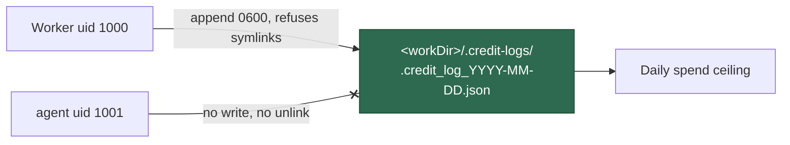

An invocation whose model id has no pricing row is charged at a conservative
**upper bound** rather than counted as `$0` — otherwise a new
model id, or a run that resolved no `--model` argument, would spend against a
ceiling that could not see it. The ceiling message names the unpriced portion,
and the hook logs a `[SPEND_CEILING]` line listing the ids whenever any is
present, so the missing
[pricing row](MODEL-AND-CACHING.md#unpriced-model-ids) gets added.

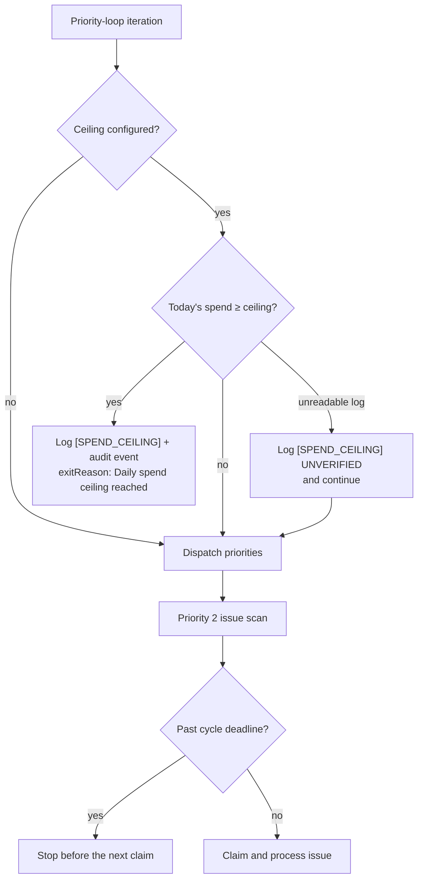

## 🪝 Post-Run Callbacks

Optional executables the worker runs after a terminal issue run, following
the `success / failure / always` outcome semantics familiar from CI pipeline
post-build blocks (Issue #806). They are the public
extension point for fleet-specific reporting — health records, session-log
archival, spend accounting — so none of that policy has to live in VibeCoder.

> **📚 The full contract is [Post-Run Callbacks](CALLBACKS.md)** — ordering and
> exactly-once scope, the versioned context schema, container filesystem
> visibility, session-log sensitivity, portable hook examples, the conformance
> fixture an extension runs against its own hooks, and the migration from
> `fleet_health_dir` / `fleet_health_repo`. This section is the configuration
> surface only.

```json
{
  "callbacks": {
    "success": "/opt/vibe-hooks/success.sh",
    "failure": "/opt/vibe-hooks/failure.sh",
    "always": "/opt/vibe-hooks/always.sh",
    "timeout_seconds": 60
  }
}
```

All four entries are optional, and a configuration without a `callbacks` block
behaves exactly as before.

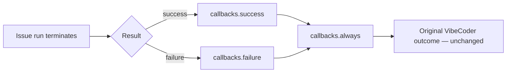

### Ordering and scope

- `success` runs only after a terminal **successful** issue run; `failure` only
  after a terminal **failed** one. Exactly one of the two runs.
- `always` runs after the applicable outcome hook, in both cases — including
  when that hook exited non-zero, timed out or could not be spawned.
- A missing hook is a no-op.
- A claim that was **skipped** (rejected, or already held by another worker)
  runs no callbacks: no run happened to report.
- A shutdown or an exception after a claim takes the failure/`always` path
  exactly once.
- Concurrent issue slots each receive their own context; hooks never share
  state between slots.

### Invocation and path rules

- The configured path is executed **directly** — no shell, no `sh -c`, no
  arguments — so no issue or repository text can be parsed as a command.
- Paths must be **absolute** and POSIX. A relative path is rejected at config
  load, because the worker's working directory changes between runs.
- The path is resolved on the filesystem the **worker process** sees. The
  worker runs inside the container ([Run Mode](#-run-mode) has one member), so
  the hook must exist at that absolute path **inside the container** — a host
  path that is not mounted in is not visible to it.
- Every hook is bounded by `timeout_seconds` (default `60`, maximum `3600`);
  a hook that exceeds it is terminated with `SIGTERM` and recorded as
  `timed_out` with exit code `124`. A hook that ignores `SIGTERM`, or that
  forks a child holding its output pipes, can outlive that signal — write
  hooks that terminate on it.
- stdout, stderr, the exit code and the duration are captured, redacted and
  logged — including whatever a timed-out hook printed before it was killed.
  Streams are truncated to 4000 characters each.
- **A callback failure never rewrites the run's own result.** It is reported
  loudly and the VibeCoder outcome stands.
- A malformed `callbacks` block fails the config load rather than leaving a
  hook that silently never runs.

### What a hook receives

The environment is **cleared** before it is populated: only `PATH`, `HOME`,
`LANG`, `TZ` and `TMPDIR` are inherited from the worker, so no credential
crosses into a callback. Transcript **contents** are never exported — only the
path, and reading it is the callback author's decision.

`VIBECODER_CALLBACK_CONTEXT` names a versioned JSON document written for that
invocation and removed after it exits:

```json
{
  "schemaVersion": 1,
  "event": "success",
  "runId": "vibe-mtk92vcu-ebcc11",
  "result": "success",
  "repository": "owner/repo",
  "issueNumber": 806,
  "host": "worker-1",
  "workerName": "fleet-a",
  "provider": "claude",
  "sessionId": "…",
  "sessionLogPath": "/home/vibe/logs/agent-….log",
  "startedAt": "2026-09-02T01:00:00.000Z",
  "finishedAt": "2026-09-02T01:31:12.000Z",
  "durationSeconds": 1872,
  "exitCode": 0,
  "telemetry": {
    "inputTokens": 1200,
    "outputTokens": 340,
    "cacheCreationTokens": 90,
    "cacheReadTokens": 20,
    "estimatedCostUsd": 0.42
  }
}
```

The same facts are exported as scalars, one variable each:
`VIBECODER_CALLBACK_SCHEMA_VERSION`, `VIBECODER_CALLBACK_EVENT`,
`VIBECODER_CALLBACK_CONTEXT`, `VIBECODER_RUN_ID`, `VIBECODER_RESULT`,
`VIBECODER_REPOSITORY`, `VIBECODER_ISSUE_NUMBER`, `VIBECODER_HOST`,
`VIBECODER_WORKER_NAME`, `VIBECODER_PROVIDER`, `VIBECODER_SESSION_ID`,
`VIBECODER_SESSION_LOG_PATH`, `VIBECODER_STARTED_AT`,
`VIBECODER_FINISHED_AT`, `VIBECODER_DURATION_SECONDS`,
`VIBECODER_EXIT_CODE`, `VIBECODER_INPUT_TOKENS`, `VIBECODER_OUTPUT_TOKENS`,
`VIBECODER_CACHE_CREATION_TOKENS`, `VIBECODER_CACHE_READ_TOKENS` and
`VIBECODER_ESTIMATED_COST_USD`.

A fact the run could not supply — no provider, no session, no parseable token
usage — is **omitted** from both the document and the environment rather than
emitted empty, so a hook can test for presence truthfully.

## 🔄 Session Resume

Session resume enables CLI-level session continuity across phases of the same
issue. When enabled, subsequent phases (e.g. clarification → planning →
implementation) resume the same Claude session rather than starting fresh. This
preserves context learnt during earlier phases, reducing redundant token usage
and improving coherence.

**Configuration:**

| Setting               | Config Key              | Default | Description                                       |
| --------------------- | ----------------------- | ------- | ------------------------------------------------- |
| Enable session resume | `enable_session_resume` | `false` | Enable CLI-level session continuity across phases |

```json
{
  "enable_session_resume": true
}
```

**How it works:**

1. On the first phase of an issue, the worker generates a deterministic session
   ID combining the repository, issue number, and timestamp.
2. Claude is invoked with `--session-id <id>` to start a new named session.
3. On subsequent phases for the same issue, Claude is invoked with `--resume` to
   continue the existing session.
4. Each phase completion is recorded so the worker knows whether to start or
   resume.

**When to enable:**

- Enable when issues frequently go through multiple phases (clarification,
  planning, implementation) and you want Claude to retain context between them.
- Leave disabled (default) if your workflow is predominantly single-phase or if
  you prefer each phase to start with a clean slate.

**Resume-on-reclaim:** a killed session (reboot, OOM, container death) resumes
instead of restarting from zero. **Picking up pushed WIP does not depend on
`enable_session_resume`** (Issue #220) — that flag gates only the CLI
`--resume` conversation replay and the periodic checkpoints:

- During the execute phase the worker makes a **WIP checkpoint** every ~10
  minutes — and once more at phase end — committing and pushing the agent's
  progress to the claim-locked issue branch (squashed on PR merge). Each
  checkpoint runs through the standard commit chokepoint, so the pre-commit
  secret gate, default-branch guard, and run-id trailer all apply. A deadline
  timeout preserves WIP the same way regardless of the flag.
- The session id, phase count, and branch are persisted to
  `${WORK_DIR}/.claude-sessions/resume/<owner>-<repo>-<issue>.json`.
- On every claim the worker asks the remote what already exists **for the
  issue number** — `git ls-remote --heads origin refs/heads/issue-<N>
  refs/heads/issue-<N>-*`, plus whatever branch the resume file names — and
  resumes the branch that carries commits beyond base with a tip inside the
  24 h window. Where several qualify, the branch the resume file names wins,
  otherwise the most recently pushed; the rest are named in the log. Keying on
  the number rather than the title slug is what makes the contract survive a
  retitle: renaming an issue mid-flight used to orphan its WIP branch, because
  the next claim derived a different slug and started from scratch (#220).
- Every claim logs which branch it resumed, or that no prior branch existed.
- When a branch was resumed, the worker reads the handover file the
  interrupted run committed to it (`docs/archive/handover/issue-<N>.md`,
  Issue #769) and splices that content into the execute prompt, framed as a
  prior-run **status report** — untrusted repository prose, fenced, capped at
  8,000 characters and counted against the context budget, never a directive
  that can redirect the run (Issue #771). This works on any fleet host and
  under any provider, so it does **not** depend on `enable_session_resume`;
  a branch with no handover file falls back to the generic "prior progress
  exists, review `git log`" note and still resumes.
- When session resume is enabled and a branch was resumed, the worker also
  passes `--resume` so the durable transcript replays the prior conversation.
  That replay is a same-host optimisation layered on top: the committed
  handover is the portable contract and is spliced either way.
- The resume file is deleted on successful PR creation and on claim release,
  so deliberate outcomes always start the next attempt clean. The one
  exception is a release whose run **preserved WIP** on the issue branch
  (a deadline timeout with a dirty tree): the commit is the durable work and
  the resume file is the pointer to it, so it is kept for the next claim.
- A branch carrying **only** WIP markers does not become a PR: when a claim
  resumed a checkpoint and added no commit of its own, the completion phase
  refuses to raise a half-done PR from parked work and the issue returns to
  the queue for a claim that can advance it.
- Stale-workdir housekeeping pushes any unpushed branches before deleting a
  stale clone, and keeps the clone (with a loud warning) if the push fails.
- The durable transcript store (`${WORK_DIR}/.claude-config`) participates in
  the session sweeper's age/size caps so it cannot grow unbounded.

> **📝 Note:** Session resume is independent of
> [session compaction](#-session-compaction) — resume controls
> within-issue continuity, while compaction manages the on-disk session store
> size.

**Reference:** `worker/deno/lib/session_resume.ts` (implementation),
`worker/deno/lib/issue_branch_resume.ts` (issue-number branch lookup),
`worker/deno/lib/config_defaults.ts` (default value).

## 📦 Session Compaction

The worker maintains per-repository session state (the `.claude/` directory)
that persists between invocations. Over time, this session store grows and needs
periodic cleanup. Session compaction provides a progressive strategy to keep the
store within size and age limits.

**Configuration:**

| Setting                  | Config Key               | Default            | Description                                                          |
| ------------------------ | ------------------------ | ------------------ | -------------------------------------------------------------------- |
| Max session size (bytes) | `max_session_size_bytes` | `52428800` (50 MB) | Maximum session store size per repository before compaction triggers |
| Max session age (days)   | `max_session_age_days`   | `7`                | Maximum age for session files before cleanup                         |

```json
{
  "max_session_size_bytes": 52428800,
  "max_session_age_days": 7
}
```

**Compaction levels:**

The compaction strategy escalates progressively until the session store is
within the configured size limit:

| Level      | Action                                                                                | When Used                                   |
| ---------- | ------------------------------------------------------------------------------------- | ------------------------------------------- |
| `none`     | No action needed                                                                      | Store is within limits                      |
| `soft`     | Remove cache directories (tmp, temp, cache, .cache, .tmp, tool-outputs, intermediate) | First attempt when store exceeds size limit |
| `moderate` | Remove cache + old files beyond age threshold + trim oldest files by size             | Soft compaction was insufficient            |
| `hard`     | Delete entire session directory and start fresh                                       | Moderate compaction was insufficient        |

**How it works:**

1. Before each invocation, the worker measures the session store size.
2. If the store exceeds `max_session_size_bytes`, compaction escalates through
   the levels above until the store is within limits.
3. Files older than `max_session_age_days` are removed during moderate
   compaction regardless of size.
4. Each milestone maintains its own session (isolated from other milestones and
   the default branch).

**Tuning guidance:**

- **Increase `max_session_size_bytes`** if you have ample disk space and want to
  preserve more session history (improves context carryover).
- **Decrease `max_session_size_bytes`** on disk-constrained workers to free
  space more aggressively.
- **Decrease `max_session_age_days`** if your issues are short-lived and old
  session data is unlikely to be useful.

**Reference:** `worker/deno/lib/session_compaction.ts` (implementation),
`worker/deno/lib/config_defaults.ts` (default values).

## 📊 Context Budget Monitoring

Context budget monitoring tracks how much of Claude's context window is consumed
before each invocation. This helps operators identify when prompts are
approaching the context limit — which can cause truncation, degraded
performance, or failures.

**Configuration:**

| Setting            | Config Key                       | Default | Description                                                                                |
| ------------------ | -------------------------------- | ------- | ------------------------------------------------------------------------------------------ |
| Warning threshold  | `context_budget_warning_percent` | `50`    | Usage percentage that triggers a warning in the budget log                                 |
| Error threshold    | `context_budget_error_percent`   | `80`    | Usage percentage that triggers an error in the budget log                                  |
| Blocking threshold | `context_budget_block_percent` | `95` | Hard ceiling — the execution phase stops and escalates at or above this usage |

```json
{
  "context_budget_warning_percent": 50,
  "context_budget_error_percent": 80,
  "context_budget_block_percent": 95
}
```

**How it works:**

1. Before each Claude invocation, the worker estimates the token count of each
   prompt component (issue body, comments, custom instructions, recent activity,
   etc.) using a characters-per-token heuristic (~4 characters per token).
2. The total is compared against the model's context window (1,000,000 tokens
   for Opus/Sonnet, 200,000 for Haiku —).
3. If usage exceeds the warning threshold, a warning is logged. If it exceeds
   the error threshold, an error is logged.
4. If usage reaches `context_budget_block_percent`, the check fails closed
  : the execution phase stops **before** the billed Claude
   invocation, applies `needs-human`, and posts an explanation comment. Warning
   and error thresholds remain observational — only the blocking threshold
   stops work.
5. Budget entries are written to a daily JSON log file for operational
   visibility.

**Budget log integration:**

The budget log records each invocation's token breakdown, enabling operators to:

- Identify which prompt components consume the most context (e.g., large issue
  bodies, many comments).
- Track usage trends over time via the daily aggregation
  (`aggregateBudgetStats()`).
- Correlate high usage with failures or degraded output quality.

**Tuning guidance:**

- **Lower `context_budget_warning_percent`** (e.g., to `40`) for early
  visibility on repos with large issues or many comments.
- **Raise `context_budget_error_percent`** (e.g., to `90`) if you are
  comfortable operating closer to the context limit.
- **Set `context_budget_block_percent` to `0`** to disable the hard ceiling and
  restore warn-only behaviour. Raising it instead of splitting the issue only
  defers the truncation — an issue that reaches 95% of the window will not
  converge by retrying.
- The monitoring is lightweight (< 10 ms overhead). The warning and error
  thresholds are observational; the blocking threshold is the only one that
  stops a phase.

**Reference:** `worker/deno/lib/context_budget.ts` (implementation),
`worker/deno/lib/config_defaults.ts` (default values).

## 👤 Authorised Commenters

> **🔒 Security-First Default:** Trusted authors — write collaborators minus
> the Vibe Coder logins and bots — can trigger PR feedback fixes. So can the
> Vibe Coders and the `authorized_commenters` bots, whose reviews and test
> results are input the worker acts on but who may **never** raise, label or
> schedule work. See [Two axes of trust](#two-axes-of-trust).

To add bot accounts to the authorised commenters list, use one of these methods:

**During setup:**

```bash
VIBE_ALLOWED_AUTHORS=user1,user2,user3 \
VIBE_INCLUDE_BOT_COMMENTERS=true \
./setup.sh
```

**Via config file (directly):**

```json
{
  "authorized_commenters": ["myuser", "github-copilot[bot]", "cursor[bot]"]
}
```

## 🤖 Bot Accounts

Common bot accounts you may want to add (only add those you actively use):

| Bot Account           | Service        | Description                |
| --------------------- | -------------- | -------------------------- |
| `github-copilot[bot]` | GitHub Copilot | AI code review suggestions |
| `copilot[bot]`        | GitHub Copilot | Alternative account format |
| `cursor-bugbot`       | Cursor IDE     | AI-powered code review     |
| `cursor[bot]`         | Cursor IDE     | Alternative account format |

> **🔒 Security Note:** Bot accounts can trigger code changes without human
> approval. See [SECURITY.md](../SECURITY.md#bot-account-security-issue-36) for
> detailed security implications.

## 🤖 Trusted Review Bots

The `trusted_review_bots` field lists GitHub bot accounts whose **PR review
comments** (line-level comments on `/pulls/{n}/comments`) are treated as
authoritative without requiring a thumbs-up reaction or membership in
`authorized_commenters`.

**Scope:** This list applies **only** to PR review comments. Issue comments
(top-level discussion on issues or PRs) still require a thumbs-up reaction or
membership in `authorized_commenters`. The narrower scope reflects the fact that
automated review tools post structured, line-anchored findings rather than
free-form discussion.

**Precedence:**

1. `TRUSTED_REVIEW_BOTS` environment variable (comma-separated).
2. `trusted_review_bots` array in `.config.json`.
3. Built-in default list.

**Default list:**

- `github-code-quality[bot]`
- `coderabbitai[bot]`
- `sonarcloud[bot]`
- `deepsource-io[bot]`
- `codeclimate[bot]`

**Example override:**

```json
{
  "trusted_review_bots": [
    "github-code-quality[bot]",
    "coderabbitai[bot]",
    "my-custom-linter[bot]"
  ]
}
```

**Validation:** The configuration validator emits a warning when the list
contains more than 20 entries, or when an entry does not look like a bot account
(no `[bot]` suffix and not in the known-bot allowlist of `dependabot`,
`renovate`, `github-actions`). Auto-trusting a human account would bypass the
thumbs-up gate — use `authorized_commenters` for human reviewers instead.

## 🤝 Fleet PR Authors (fleet-aware PR maintenance)

The `fleet_pr_authors` field lets a worker host **maintain PRs raised by sibling
fleet hosts**, not just its own. The fleet runs across machines, each
authenticated as a different GitHub account (for example `Vibecoderbot` on one
host and `stsvcbot` on another). PR feedback and CI-fix maintenance are
otherwise scoped per-host by PR author (`gh pr list --author <login>`), so a
milestone PR raised by a sibling host that is busy elsewhere — or down — would
never get its blocking CI failure fixed by any peer, and human "please fix"
comments would land on a PR no running worker is scanning.

List the **other** fleet logins here; the host's own `github_user` is always
covered implicitly. The default `[]` preserves the prior single-author
behaviour exactly.

**This is also the scheduling list.** `github_user` + `fleet_pr_authors` +
`service_accounts` — resolved by `resolveFleetMaintenanceAuthorSet` — is the
set that decides whether a work stream is already occupied, so only a Vibe
Coder's assignment can make the worker stand off an issue. `allowed_authors` is
a permission list and never answers that question; see
[Which list governs scheduling, and which governs permission](#which-list-governs-scheduling-and-which-governs-permission).

**Scope:** Applies to every PR-maintenance scan — PR-feedback discovery
(`findPrCommentsToFix`), CI-fix discovery (`findFailedCiChecks`), spelling
failures (`findFailedPrChecks`), auto-merge (`ensureAutoMergeOnOpenPrs`) and the
CI nudge (`findPrsNeedingCiNudge`). Since all five resolve their
author set through `resolveFleetMaintenanceAuthorSet` — `github_user` +
`fleet_pr_authors`, the accounts the fleet actually operates — so every
fleet-authored PR is maintained by some host while a trusted human's PR is left
alone. Cross-fleet
pickup is collision-tolerant —
concurrent PR-feedback handling already de-duplicates via the shared `eyes`
reaction, and a duplicated CI-fix push is rejected by git as a non-fast-forward
(the loser simply retries), bounded by the existing per-check retry cap.

**Precedence:**

1. `FLEET_PR_AUTHORS` environment variable (comma-separated).
2. `fleet_pr_authors` array in `.config.json`.
3. Empty list (own author only).

**Example (the `Vibecoderbot` host listing its `stsvcbot` sibling):**

```json
{
  "github_user": "Vibecoderbot",
  "fleet_pr_authors": ["stsvcbot"]
}
```

The `stsvcbot` host mirrors this with `"fleet_pr_authors": ["Vibecoderbot"]`.

### Fleet PR authors feed the open-PR duplicate guard too

The open-PR duplicate guard that stops two fleet hosts raising
duplicate PRs for the same issue enumerates fleet accounts from the **union** of
the host `github_user`, `allowed_authors`, **and** `fleet_pr_authors`
(`resolveFleetAuthors` in `worker/deno/lib/fleet_authors.ts`). Before the
guard read `allowed_authors` only, so a sibling listed **solely** in
`fleet_pr_authors` was never queried and its open PRs were invisible to the
guard — the root cause of the duplicate documented in
[`DUPLICATE-PR-ROOT-CAUSE-3138.md`](DUPLICATE-PR-ROOT-CAUSE-3138.md).

At startup (and in `diagnose-repo`) the worker now validates this configuration
and emits `[fleet-config]` lines. The **effective author set is named on every
run** — `[fleet-config] effective-authors=<login>,<login>` — so the logins the
guards actually cover are visible without reading `.config.json`. Alongside it:
an **error** if the effective fleet set is empty. An empty `allowed_authors`
is no longer a finding: the array grants nothing, and fleet identity comes from
`service_accounts` / `fleet_pr_authors` (Issue #1066). Those fleet logins are
collaborators on the monitored repos — and are then **excluded** from the
directing set, which is the point: write access must not authorise a worker to
instruct itself.

### Service accounts are fleet PR authors too

`service_accounts` and `fleet_pr_authors` both name **fleet** logins, and a
service account is a fleet account by definition. They are not
interchangeable inputs, though — `service_accounts` is the identity guard's
allowlist, while `fleet_pr_authors` is what every PR guard resolves its author
set from. A fleet that listed its siblings under `service_accounts` **only**
was therefore uncoordinated by construction, and silently so: with
`fleet_pr_authors` unset, a sibling's open PR neither blocked a claim nor
counted as already merged, because the guards read it as some unrelated human's
PR. That is how a host claimed an issue three minutes after a sibling opened a
PR for it and duplicated ten minutes of work.

`loadConfig` closes the gap by resolving the two keys into **one effective
sibling list**: `config.fleetPrAuthors` is the deduplicated union of
`fleet_pr_authors` (or `FLEET_PR_AUTHORS`) and `service_accounts`. Configuring
either key — or both — now reaches every guard, and no consumer can see one key
without the other.

The trusted-author set that feeds those same downstream guards is
**collaborators minus exclusions**, not the local `allowed_authors` array
(Issue #1066). `service_accounts` and `fleet_pr_authors` are on both sides of
that picture: they union into the sibling list, and they are also stripped from
the collaborator set so a fleet login cannot authorise itself.

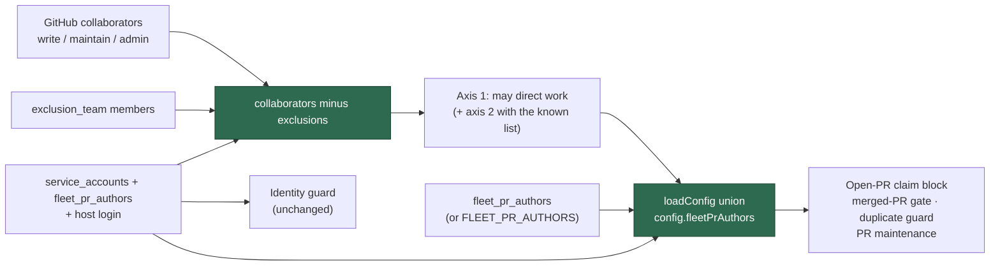

Listing a sibling in both keys is harmless — the union deduplicates
case-insensitively — and `service_accounts` keeps its own meaning for the
identity guard.

That direction is one-way. Listing a fleet login in `allowed_authors` keeps the
duplicate guard sighted; it does **not** follow that a login in
`allowed_authors` may have its PRs maintained. Maintenance comes from
`fleet_pr_authors` alone — see
[`HUMAN-PR-POLICY.md`](HUMAN-PR-POLICY.md).

### Defer to a PR, or act on it?

`getBlockingPRForIssue` defers a `work-on` issue behind an open PR the fleet
**operates** — `github_user` + `fleet_pr_authors` — because the worker must not
run a second PR into a work stream it already has open. The maintenance scans
answer a different question: *may I claim this PR, push to it, comment on it,
merge it?*

- **** widened the scans to the blocking set, which fixed a fleet PR
  stranded with no host maintaining it (`private-repo-21`) …
- **** exposed the cost: the scans then adopted a trusted **human's** PR
  uninvited (`TitlePage/tp-web-react`) — claimed it, pushed to it, and
  commented on it.
- **/** split the two. Every scan that acts on a PR now resolves
  `resolveFleetMaintenanceAuthorSet` (host + `fleet_pr_authors`), so a human's
  login never reaches `gh pr list --author`.
- **** finished the job on the issue side: the blocking guard resolves the
  same push-capable set, so a human's open PR no longer defers issue pickup at
  all. One unrelated human PR used to park a repo's entire `work-on` queue —
  and, after, stamp `needs-human` on the blocked issue. The developer
  manages their own PR; the worker works the issues it was invited to,
  alongside them. The nudge-and-escalate path is retired.

The fleet's own open PRs still block repo-wide (one at a time per work stream).
A PR the worker cannot classify — an author never stamped, or an unresolved
push-capable set — stays on the blocking side as a fail-safe.

Regression tests in
`worker/deno/tests/human_pr_never_blocks_test.ts`,
`worker/deno/tests/issue_query_test.ts`,
`worker/deno/tests/pr_maintenance_test.ts` and
`worker/deno/tests/pr_ci_nudge_scan_test.ts` cover the guard and the `--author`
arguments each scan passes to `gh`.

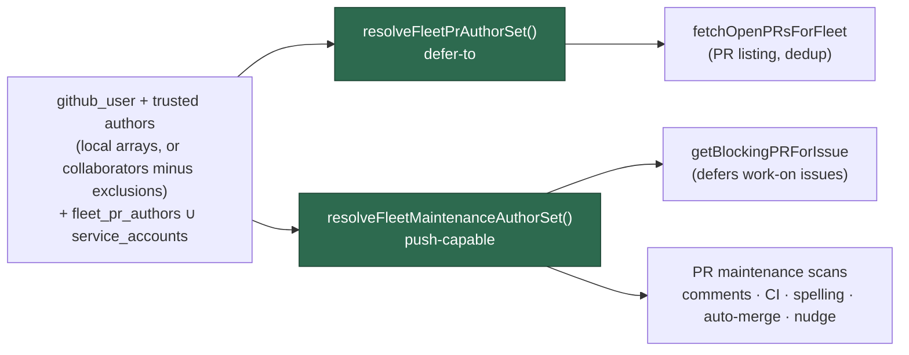

The self-comparison stays narrow: a scan that skips the worker's **own**
comments and reviews still compares against `github_user` alone, so widening the
scan set never makes a host reply to a fleet sibling's comment unless that
comment passes the usual authorised-commenter / thumbs-up / trusted-bot check.

### Handing your own PR to the worker

You can still ask the worker to work on **your** PR — it just has to be asked.
Every scan additionally lists the open PRs authored by `allowed_authors` and
admits only those carrying an explicit invitation (the operator-facing version
of this, including how to revoke, is
[`HUMAN-PR-POLICY.md`](HUMAN-PR-POLICY.md)):

| Signal      | How to give it                                          | Checked by                                                              |
| ----------- | ------------------------------------------------------- | ----------------------------------------------------------------------- |
| **Label**   | Add `work-on` to the PR                                  | The timeline adder must be a trusted human — label presence is not enough |
| **Mention** | Comment or review the PR mentioning `@<worker-login>`    | The commenter must be a trusted human; mentions in code blocks or quotes are ignored |

Details that matter in practice:

- A **fleet account is never an inviter.** Fleet logins appear in
  `allowed_authors` for PR dedup, so without that exclusion a worker could
  label its way onto your PR.
- **Revocation is immediate.** Remove the label and the PR leaves the scan set
  on the next pass — the verdict is re-derived every scan, with no stored
  state.
- **Every admission is logged**:
  `[pr-invitation] admitted repo=… prNumber=… author=… via=label|mention invitedBy=…`.
  A worker action on a human PR with no matching line is a wiring bug; an
  `invitedBy` outside `allowed_authors` means the trust check regressed.
- **Anything unclear is a refusal** — an unreadable listing, an unattributable
  label, or a mention inside a pasted log all leave the PR untouched.

### The author set is checked every iteration

Both sides resolve through `worker/deno/lib/fleet_authors.ts` — the blocking
guard through `resolveFleetPrAuthorSet()`, the scans through
`resolveFleetMaintenanceAuthorSet()` — so no module builds its own author list,
and `findOldestIssue` compares the two resolved sets once per iteration
(`compareFleetAuthorSets`). Two log lines make the invariant observable:

| Log line                       | When                                       | Fields                                                                                |
| ------------------------------ | ------------------------------------------ | ------------------------------------------------------------------------------------- |
| `fleet-author-set-divergence`  | The sets differ by more than the expected `allowed_authors` delta (once per iteration) | `missing-from-maintenance`, `missing-from-blocking` |
| `pr-blocks-work-on`            | An open PR defers `work-on` issues         | `pr`, `author`, `base`, `blocked-issues`, `in-maintenance-set`                          |

Both are written unconditionally — no `ISSUE_FINDER_DEBUG` needed. The
divergence check is **observability, never a gate**: it warns and the iteration
continues.

Since the maintenance set deliberately omits `allowed_authors`, so the
check is **intent-aware**. The invariant it asserts is *the
maintenance set is the fleet-owned set minus the trusted humans, and nothing
else* — trusted humans are declared as the expected delta and never warn. Two
shapes still do:

- `missing-from-maintenance=<login>` — a `fleet_pr_authors` sibling no scan
  covers: a fleet PR that blocks work and nothing will fix, answer, or merge.
- `missing-from-blocking=<login>` — a login the worker pushes to that the
  duplicate guard cannot see.

Any occurrence of this warning is therefore a real hazard, not background noise.
A recurrence of the stall also appears as `in-maintenance-set=false`
on a blocking PR:

```text
[issue-finder] repo=owner/repo pr-blocks-work-on pr= author=stsvcbot base=main blocked-issues=, in-maintenance-set=false
```

## 📦 Per-Repository Configuration

You can configure repository-specific settings using the `repo_config` section
in `.config.json`. This is useful when different repositories have different
requirements.

Example configuration:

```json
{
  "allowed_author": "your-github-username",
  "repos": [
    "your-org/main-app",
    "your-org/large-project",
    "your-org/custom-tests",
    "your-org/needs-siblings",
    "your-org/ci-only"
  ],
  "repo_config": {
    "your-org/ci-only": {
      "skip_reviewer_request": true
    },
    "your-org/large-project": {
      "skip_quality_check": true,
      "custom_instructions": "Do NOT run worker/repos.sh as it takes too long. Run only the specific test case related to your changes."
    },
    "your-org/custom-tests": {
      "quality_command": "./run_tests.sh --unit-only",
      "custom_instructions": "Only run unit tests, not integration tests."
    },
    "your-org/needs-siblings": {
      "pre_setup_command": "./scripts/link-sibling-repos.sh",
      "custom_instructions": "This repo requires sibling repos for tests. The pre-setup script links them."
    },
    "your-org/private-repo-14": {
      "claude_model": "fable",
      "phase_model_overrides": { "issue": "fable" },
      "phase_effort_overrides": { "issue": "xhigh" }
    },
    "your-org/private-repo-18": {
      "claude_model": "sonnet",
      "phase_effort_overrides": { "issue": "medium", "planning": "high" }
    }
  }
}
```

### 💰 Per-repository model/effort routing

Model and effort routing is normally per-phase and fleet-wide. The
`repo_config` keys below let you tier spend per repository — a high-value repo
gets the best model regardless of cost, while a filler repo (worked on only
when nothing else is queued) avoids burning premium tokens.

| Key                     | Type   | Description                                                                                                         |
| ----------------------- | ------ | ----------------------------------------------------------------------------------------------------------------- |
| `claude_model`          | string | Per-repo base tier (alias such as `fable`/`sonnet`/`opus`, or a full model id) overriding the global base for every phase in this repo. |
| `best_planning_model` | string | Per-repo configured best planning model for degraded-model detection. Overrides the global `best_planning_model`; empty falls back to it. |
| `phase_model_overrides` | object | Per-repo per-phase model map (e.g. `{ "issue": "fable" }`). Same shape as the global `phase_model_overrides`.       |
| `phase_effort_overrides`| object | Per-repo per-phase effort map (e.g. `{ "issue": "xhigh" }`). Same shape as the global `phase_effort_overrides`.     |
| `codex_model`           | string | Per-repo base **Codex** model tier overriding the Codex phase defaults for every phase in this repo — the Codex counterpart of `claude_model`. |
| `codex_phase_model_overrides` | object | Per-repo per-phase **Codex** model map (e.g. `{ "issue": "gpt-5-mini" }`). Same shape as the global `codex_phase_model_overrides`. |
| `codex_phase_effort_overrides`| object | Per-repo per-phase **Codex** effort map (e.g. `{ "issue": "medium" }`). Same shape as the global `codex_phase_effort_overrides`. |
| `gemini_model`          | string | Per-repo base **Gemini** model tier overriding the Gemini phase defaults for every phase in this repo — the Gemini counterpart of `claude_model`. |
| `gemini_phase_model_overrides` | object | Per-repo per-phase **Gemini** model map (e.g. `{ "issue": "gemini-2.5-flash-lite" }`). Same shape as the global `gemini_phase_model_overrides`. |
| `deepseek_model`        | string | Per-repo base **DeepSeek** model tier overriding the DeepSeek phase defaults for every phase in this repo — the DeepSeek counterpart of `claude_model`. |
| `deepseek_phase_model_overrides` | object | Per-repo per-phase **DeepSeek** model map (e.g. `{ "issue": "deepseek-chat" }`). Same shape as the global `deepseek_phase_model_overrides`. |

The Codex keys mirror the Claude ones step for step — including the caveat that
a per-repo `codex_model` base tier beats the built-in Codex phase defaults, so it
demotes the top-tier planning phases unless they are re-pinned in
`codex_phase_model_overrides`. The full Codex chain is documented in
[MODEL-AND-CACHING.md → Codex per-phase routing](MODEL-AND-CACHING.md#-codex-per-phase-routing).

The Gemini keys mirror the same chain for the model half only — the Gemini CLI
has no reasoning-effort option, so there is no `gemini_phase_effort_overrides`
and an effort requested for a Gemini phase produces one warning rather than a
flag. See
[MODEL-AND-CACHING.md → Gemini per-phase routing](MODEL-AND-CACHING.md#-gemini-per-phase-routing).

The resolution order (most specific wins) is documented in full in
[MODEL-AND-CACHING.md → Model/effort precedence](MODEL-AND-CACHING.md#-modeleffort-precedence-chain).
In short: a phase-specific `CLAUDE_MODEL_<PHASE>` / `CLAUDE_EFFORT_<PHASE>` env
var (operator escape hatch) beats a per-repo phase override, which beats the
per-repo base `claude_model`, which beats the global config overrides, which
beat the built-in phase defaults. Overrides apply only while the worker is
processing that repo — switching repos restores the other repo's (or global)
routing, so a premium tier never leaks into a filler repo.

> **⚠️ A per-repo `claude_model` demotes the Fable planning/grill-me tiers
> unless you re-pin them (audit
> F2/F3).**
> Because the per-repo base `claude_model` beats the built-in phase defaults,
> setting it to cheapen a filler repo's ordinary phases **also reroutes
> `planning` and `grill_me` off the Fable 5 top tier** (and setting it to
> `fable` promotes the trivial Haiku phases — `spelling_fix`/`summarise`/
> `health` — to Fable at ~5× their cost). The Fable planning escalation is the
> highest-leverage spend, so to keep it while demoting the base,
> re-pin the two planning-shaped phases in the same `repo_config` entry:
>
> ```jsonc
> "repo_config": {
>   "owner/filler-repo": {
>     "claude_model": "sonnet",                 // cheapen ordinary phases
>     "phase_model_overrides": {
>       "planning": "fable",                    // keep the Fable plan escalation
>       "grill_me": "fable"
>     }
>   }
> }
> ```
>
> The interaction is internally consistent — the degraded-model detector reads
> the same precedence chain and does not false-flag the demotion — so this is a
> routing surprise to be aware of, not a bug. See
> [MODEL-AND-CACHING.md → Model/effort precedence](MODEL-AND-CACHING.md#-modeleffort-precedence-chain)
> for the full chain, and
> /
> for the
> base-tier override docs and the per-repo-switch log line that surfaces each
> rerouted phase.

> **🛟 A per-repo `claude_model: "fable"` base tier is covered by the
> Fable-unavailable fallback too.** Whether a repo lands on Fable
> via the built-in top-tier phase defaults *or* by pinning `claude_model: "fable"`
> (or `phase_model_overrides`) in its `repo_config`, the same resilience applies:
> while Fable 5 is globally unavailable the run automatically falls back to Opus
> 4.8, is flagged with the `degraded-model` label and a model-stats comment, and
> self-heals once Fable returns — config keeps pointing at Fable, the
> substitution is per-run, and there is no "Fable down" switch to set or clear.
> See
> [MODEL-AND-CACHING.md → Fable-unavailable auto-fallback + self-heal](MODEL-AND-CACHING.md#fable-unavailable-auto-fallback--self-heal).

> **Out of scope (possible follow-up):** per-issue overrides (e.g. a
> human-applied `premium` label bumping a single issue to the top tier).
> Per-repo granularity covers the current need.

### ⚖️ Per-repo `nice` rotation tier

The worker draws **new work** from its monitored repos in a fair rotation. The
optional per-repo `nice` integer biases that rotation, borrowing Unix-`nice`
semantics:

- **Lower runs sooner.** A repo with a smaller `nice` is considered before a
  repo with a larger one. This ordering is inverted on purpose — read `nice` as
  "how willing this repo is to step aside", exactly like the `nice(1)`
  command. **State it loudly to yourself when you set it: lower = worked first,
  higher = worked last.**
- **Default `0`.** A repo with no configured `nice` sits at the neutral tier —
  neither promoted nor demoted. A non-integer, non-finite, or wrong-type value
  is guarded down to `0` rather than propagated.
- **Operator-side only.** Like every other `repo_config` field,
  `nice` lives in the operator's `.config.json` — never in the target
  repository. There is no in-repo channel for it.
- **New-work selection only.** `nice` tiers the next-issue / label / planning
  **new-work** scans. It does **not** reorder Priority 1.x in-flight
  maintenance (PR feedback, CI fixes, revisions) — once a piece of work is in
  flight it is finished regardless of its repo's tier.

Within a single tier the worker rotates fairly across repos, so a busy tier
never starves its peers.

> [!IMPORTANT]
> **The label tier outranks `nice` (Issue #1063).** `nice` is a tie-breaker
> **within** a priority band, never a band of its own. The label expresses
> urgency; `nice` shapes throughput between repos that are equally urgent. So
> the fleet-wide order is:
>
> 1. **Label tier first, across the whole fleet** — `top-priority` >
>    `work-on` > self-scheduled diagnostic > `low-priority` > `idle-task`
>    (see [README → Supported labels](../README.md#-supported-labels)).
> 2. **`nice` orders repos within a label tier** — of two `top-priority`
>    issues, the one in the lower-`nice` repo is worked first.
> 3. Milestone priority and age break the remaining ties, unchanged.
>
> | candidate A | candidate B | winner |
> | --- | --- | --- |
> | `top-priority` @ `nice: -15` | `work-on` @ `nice: -20` | **A** — label tier first |
> | `top-priority` @ `nice: -20` | `top-priority` @ `nice: -15` | **A** — `nice` within the tier |
> | `work-on` @ `nice: -20` | `work-on` @ `nice: -15` | **A** — `nice` within the tier |
> | `low-priority` @ `nice: -20` | `work-on` @ `nice: -15` | **B** — label tier first |
>
> Setting a repo to a very low `nice` therefore **cannot** starve another
> repo's `top-priority` work: no amount of routine backlog in a `nice: -20`
> repo delays a `top-priority` issue in a `nice: 0` one.

**Worked example.** Give a filler repo a high `nice` so its work is only picked
up when no lower-`nice` repo has work *of the same label tier*, and jump a
priority repo ahead of the default tier with a negative `nice`:

```json
{
  "repo_config": {
    "stSoftwareAU/private-repo-18": {
      "nice": 99
    },
    "stSoftwareAU/priority-repo": {
      "nice": -1
    }
  }
}
```

Here `stSoftwareAU/private-repo-18` (`nice: 99`) is picked up only when no
lower-`nice` repo has a candidate in the same label tier, while
`stSoftwareAU/priority-repo` (`nice: -1`) jumps ahead of every default-tier
(`nice: 0`) repo of that tier. Neither changes the label ordering: a
`top-priority` issue in the `nice: 99` repo is still worked before a `work-on`
issue in the `nice: -1` one.

You can confirm a repo's resolved tier without reading the config — the
[`check-repo-availability`](workflows/issue-processing.md#-issue-selection-priority)
command surfaces it in both its structured `data.nice` and a ` [nice N]` suffix
on the human-readable message (the `AVAILABLE:` / `BUSY:` prefix is unchanged).

### ⚙️ Repository Configuration Options

| Option                  | Type    | Description                                                                                                                                                                                                                                                                                                                                                               |
| ----------------------- | ------- | ------------------------------------------------------------------------------------------------------------------------------------------------------------------------------------------------------------------------------------------------------------------------------------------------------------------------------------------------------------------------- |
| `pre_setup_command`     | string  | Command to run before Claude starts working (e.g., `./scripts/setup-env.sh`). See [Pre-Setup Command](#pre-setup-command).                                                                                                                                                                                                                                                |
| `skip_quality_check`    | boolean | When `true`, skips running quality checks entirely for this repository                                                                                                                                                                                                                                                                                                    |
| `quality_command`       | string  | Custom command to run instead of `./quality.sh`                                                                                                                                                                                                                                                                                                                           |
| `custom_instructions`   | string  | Additional instructions to include in the Claude prompt for this repository                                                                                                                                                                                                                                                                                               |
| `docker_image`          | string  | Docker image to run quality checks in (e.g., `node:20`, `eclipse-temurin:21`). See [Docker-Based Quality Checks](#docker-based-quality-checks).                                                                                                                                                                                                                           |
| `requires_screenshots`  | boolean | When `true`, always injects screenshot instructions into Claude's prompt **and** hands the run the Playwright MCP browser (Issue #192 — a run with no screenshot need is given no browser tool). Use for UI/frontend repositories.                                                                                                                                                                                                                                                               |
| `skip_screenshot_check` | boolean | When `true`, skips screenshot validation in PR completion. Use for non-UI repositories to prevent false positives. |
| `skip_security_fix_check` | boolean | When `true`, skips the security-fix patch-verification gate on PRs that close a `security`-labelled finding. The gate asserts against the branch diff that a test file is changed and that a test identifier named in the PR summary appears in that test diff, and additionally that the summary shows a regression test (fails unfixed, passes fixed) and that the original trigger is closed with no trivial bypass. A diff that cannot be computed blocks the PR rather than passing it. The same switch governs the gate's feedback loop: the evidence contract injected into a `security`-labelled issue's prompt, and the replay of a blocked verdict into the next attempt. See [Security-fix gate feedback](security-fix-gate-feedback.md). |
| `skip_auto_merge`       | boolean | When `true`, disables auto squash merge for this repository                                                                                                                                                                                                                                                                                                               |
| `skip_reviewer_request` | boolean | When `true`, skips requesting PR reviewers for this repository                                                                                                                                                                                                                                                                                                            |
| `verbosity`             | string  | Verbosity level for this repository (`minimal`, `concise`, `standard`, `verbose`), applied to the `issue` phase. See [Verbosity Configuration](#-verbosity-configuration).                                                                                                                                                                                     |
| `nice`                  | integer | Per-repo rotation tier. **Lower runs sooner** (Unix-`nice` semantics); default `0`. Gates new-work selection only, and orders repos **within** a label tier — the label tier (`top-priority` > `work-on` > `low-priority` > `idle-task`) is decided first, fleet-wide, so `nice` never lets one repo's routine backlog outrank another's `top-priority` (Issue #1063). See [Per-repo `nice` rotation tier](#-per-repo-nice-rotation-tier).                                                                                                                                                                         |
| `ciProviders`           | array   | Per-repo CI log providers consulted when a PR's CI fails, before invoking the `ci_fix` prompt. Each entry is `{ "provider": "<id>", "checkNamePattern"?: "<regex>", "jobPath"?: "<path>" }`; only `provider` is required. `jobPath` is passed through untouched — whether a provider needs one, and what shape it takes, is that provider's business. GitHub Actions is the built-in default and needs no entry; any other CI system registers its provider from a [private extension](PRIVATE-EXTENSIONS.md). Malformed entries are rejected with a named-field error at config load. See [Adding a CI log provider](EXTENDING.md#-adding-a-ci-log-provider). |
| `pre-flight`            | array   | Mandatory pre-flight commands run in the repo working tree immediately before the worker's automated commit, at the `assertSafeToCommit()` chokepoint. The first non-zero exit **blocks both the commit and the push** — there is no override flag. A missing / non-executable / unstartable command or a timeout is a block, never a pass. See [Pre-flight enforcement gate](#-pre-flight-enforcement-gate). |
| `ci_failure_labels`     | array   | Issue labels that mark a CI-failure report (e.g. `["develop-build-failure"]`). When an issue carries one, the worker parses the build reference from the issue body, fetches the **full** console log through the repo's configured CI log provider, and routes to the CI diagnosis-and-fix framing. Omit or leave empty to disable. See [CI-failure issue log fetch](ci-failure-issue-log-fetch.md). |
| `ci_failure_job_path`   | string  | Fallback target handed to the CI log provider when a CI-failure issue body carries a build number but no `Build URL`. Used only when the repo's `ciProviders` entry names no `jobPath` of its own; opaque to core. See [CI-failure issue log fetch](ci-failure-issue-log-fetch.md). |
| `max_auto_fix_attempts` | integer | Per-repo auto-fix attempt cap, overriding the global `max_auto_fix_attempts`. Non-positive values fall back to the global setting. See [Auto-fix attempt cap](#-auto-fix-attempt-cap).                                                                                                                           |
| `blocking_pr_stall_threshold_seconds` | integer | Per-repo blocking-PR stall threshold, overriding the global `blocking_pr_stall_threshold_seconds`. Non-positive or non-integer values fall back to the global setting. See [Blocking-PR stall watchdog](#-blocking-pr-stall-watchdog). |
| `claude_model`          | string  | Per-repo base model tier overriding the global base for every phase. See [Per-repository model/effort routing](#-per-repository-modeleffort-routing).                                                                                                                                                                                                          |
| `best_planning_model` | string | Per-repo configured best planning model for degraded-model detection. Overrides the global `best_planning_model`; empty falls back to it. |
| `phase_model_overrides` | object  | Per-repo per-phase model overrides. See [Per-repository model/effort routing](#-per-repository-modeleffort-routing).                                                                                                                                                                                                                                           |
| `phase_effort_overrides`| object  | Per-repo per-phase effort overrides. See [Per-repository model/effort routing](#-per-repository-modeleffort-routing).                                                                                                                                                                                                                                          |
| `codex_model`           | string  | Per-repo base Codex model tier overriding the Codex phase defaults for every phase. See [Per-repository model/effort routing](#-per-repository-modeleffort-routing). |
| `codex_phase_model_overrides` | object | Per-repo per-phase Codex model overrides. See [Per-repository model/effort routing](#-per-repository-modeleffort-routing). |
| `codex_phase_effort_overrides`| object | Per-repo per-phase Codex reasoning-effort overrides. See [Per-repository model/effort routing](#-per-repository-modeleffort-routing). |
| `gemini_model`          | string  | Per-repo base Gemini model tier overriding the Gemini phase defaults for every phase. See [Per-repository model/effort routing](#-per-repository-modeleffort-routing). |
| `gemini_phase_model_overrides` | object | Per-repo per-phase Gemini model overrides. See [Per-repository model/effort routing](#-per-repository-modeleffort-routing). |
| `deepseek_model`        | string  | Per-repo base DeepSeek model tier overriding the DeepSeek phase defaults for every phase. See [Per-repository model/effort routing](#-per-repository-modeleffort-routing). |
| `deepseek_phase_model_overrides` | object | Per-repo per-phase DeepSeek model overrides. See [Per-repository model/effort routing](#-per-repository-modeleffort-routing). |

**Use cases:**

- **Sibling repository dependencies**: Use `pre_setup_command` to set up
  symlinks to large sibling repositories
- **Long-running quality checks**: Set `skip_quality_check: true` for
  repositories where `./quality.sh` takes over 30 minutes
- **Specific test commands**: Use `quality_command` to run only specific tests
  instead of the full suite
- **Special requirements**: Use `custom_instructions` to tell Claude about
  repository-specific constraints
- **UI/frontend repositories**: Set `requires_screenshots: true` so Claude
  always captures Playwright screenshots on the first attempt (avoids a
  round-trip failure)
- **Non-UI repositories**: Set `skip_screenshot_check: true` to skip screenshot
  validation entirely, preventing false positives from keyword detection
- **Disable auto-merge**: Set `skip_auto_merge: true` if you prefer to manually
  merge PRs
- **CI-only repositories**: Set `skip_reviewer_request: true` for repositories
  where PRs only need CI checks
- **Different toolchains**: Use `docker_image` to run quality checks with tools
  not installed on the worker (Node, Java, Rust, etc.)
- **Token savings**: Set `verbosity: "minimal"` or `"concise"` for simple
  repositories to reduce output tokens and save costs

### 🛫 Pre-flight enforcement gate

Expensive builds (a full downstream pipeline, say) cost hours before a
compilation error the worker
pushed is even reported. The `pre-flight` gate refuses to commit or push work
that is already known to be broken, so the failure is caught locally in
seconds instead of downstream in the build.

Configure it per repo with a list of commands (kebab-case `pre-flight`,
snake_case `pre_flight`, or camelCase `preFlight` are all accepted):

```jsonc
"repo_config": {
  "stSoftwareAU/private-repo-12": {
    "pre-flight": ["./pre-flight.sh"]
  }
}
```

The scripts themselves are supplied by the target repo — do not hard-code
repo-specific commands in the worker.

**Behaviour:**

- Commands run **in listed order** in the repo working tree at the same
  chokepoint as `assertSafeToCommit()`, immediately before the worker's
  automated commit. Execution stops at the **first non-zero exit**.
- A non-zero exit is a **hard block**: it aborts both the commit **and** the
  push. The worker must fix and retry — there is deliberately **no** override
  or force flag and **no** environment escape hatch.
- **Fail loud, never fail open.** A command that is missing, not executable,
  cannot be started, or **times out** is a **block**, not a pass — "could not
  run the check" is never reported as "check passed". Each command has a
  generous default timeout of **30 minutes** (these builds legitimately take
  many minutes); a timeout blocks.
- The failing command's stdout/stderr is **captured and surfaced** on the
  returned error so the retry/diagnosis path sees the real compiler error, not
  a bare "pre-flight failed".
- A repo with **no** `pre-flight` entry is unaffected — zero added latency, no
  gate.

Commands run directly (not through a shell), so each entry is a program plus
arguments; shell features (pipes, redirects, globs) are not interpreted. Wrap
them in a script (as in the example) if you need shell behaviour.

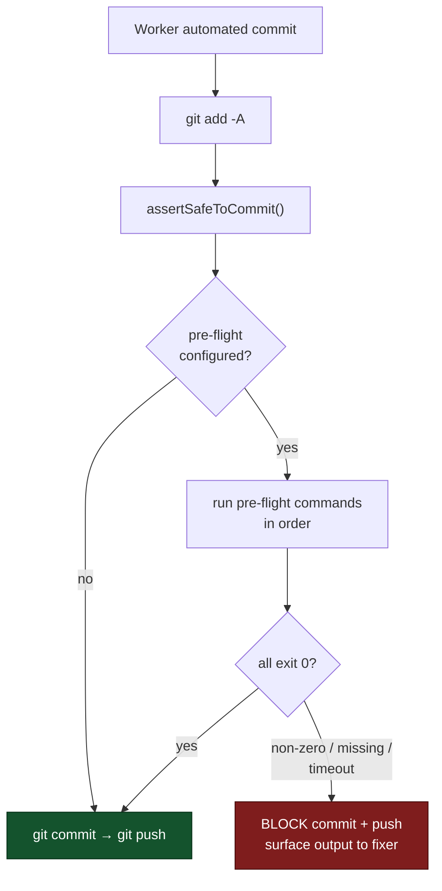

### 🛑 Auto-fix attempt cap

A hands-off fetch → diagnose → fix → merge loop on an **unfixable** failure
would otherwise burn model spend indefinitely and flood the PR with
near-identical "attempted fix" comments. After `max_auto_fix_attempts`
(default `3`) attempts at the *same* failure, the worker stops, applies
`needs-human`, and posts **one** consolidated summary of every attempt —
never a fourth "I tried again" note.

**Why a signature, not a check-run id.** The pre-existing
`ci_check_max_retries` counter keys on the GitHub check-run id, which is new
on every push — so each attempted fix reset it to zero and the cap never
bound. The attempt counter instead keys on a **failure signature** composed
of durable parts only:

- the repository,
- the failure locus (PR number, or the failure-issue number in issue mode),
- the failing check name, and
- a fingerprint of the normalised root-cause log excerpt.

Normalisation strips the parts that change on every build — ISO timestamps,
dates, clock times, build/run/job numbers, URL build segments, memory
addresses, durations, and the workspace-root path prefix — before hashing.
Two attempts at the same underlying failure therefore produce the same
signature; a genuinely different failure on the same PR produces a different
one and gets its own budget. The computed signature is logged on every
attempt (`Auto-fix failure signature`), so an operator can audit the
sequence in the worker log.

**Infrastructure failures do not consume an attempt.** A failure classified
as `infrastructure` by `ci_failure_classifier.ts` (ETIMEDOUT, ENOTFOUND,
5xx, runner lost connection, …) says nothing about the worker's ability to
fix the code, so charging it against the human-escalation budget would
escalate perfectly healthy repos. Every other category
(`code-fix-required`, `history-rewrite-required`, `timing`, `unknown`)
consumes an attempt.

**Secret findings are fixed by rebuilding the branch, not by another commit.**
A failure classified `history-rewrite-required` — gitleaks, trufflehog, or any
check whose log carries a `Fingerprint: <sha>:<file>:…` line — is a property of
the branch's **commit range**, not its working tree. Correcting the file and
committing the correction leaves the finding in the original commit's diff, so
the check fails again, identically, naming a commit that has already been
superseded. A fix loop that does not know this retries until the attempt cap
and ends at `needs-human`.

The worker therefore corrects the content, commits and pushes it as usual, and
then collapses the branch to a single commit on its merge base and force-pushes
with `--force-with-lease`. Guards, all required:

- The branch must be one a run creates (`fix/`, `issue/`, `chore/`,
  `milestone/`) and must not be the default branch.
- Every commit being collapsed must be the worker's own; a branch carrying
  someone else's commit is refused.
- `--force-with-lease`, never `--force`, so a concurrent writer is detected
  rather than clobbered.
- **One rebuild per underlying failure.** A finding that survives a rebuild is
  in the base branch, not the PR, and the escalation says so — and says to
  rotate the credential first, because it is compromised whatever happens to
  the history.

The PR comment records that the history was rebuilt, so anyone with the branch
checked out knows to re-fetch rather than pull.

**A green build clears the counter.** When a PR is next observed with no
failing checks, every signature recorded against it is cleared, so a
recurring-but-different flake never inherits a spent budget.

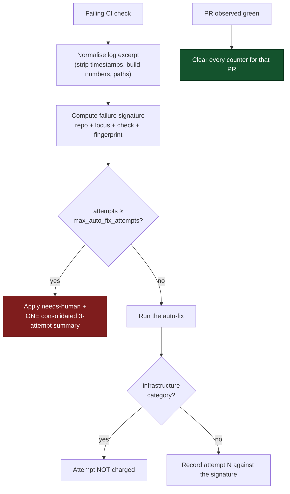

### 🚨 Blocking-PR stall watchdog

A `work-on` issue defers to the open PR that
[blocks it](#-fleet-pr-authors-fleet-aware-pr-maintenance). When that PR stops
making progress
the work stream stops with it — and until this watchdog existed, silently:
private-repo-21 sat red with an unanswered authorised comment for ~13
hours while two `work-on` issues waited behind it and nothing in the worker
noticed.

Priority 1.63 closes that gap. Each iteration it looks at every open PR that
`getBlockingPRForIssue()` says is blocking at least one open `work-on` issue —
never at PRs blocking nothing, and since never at a human's PR,
which cannot block — and trips on either signal:

- **red CI** — a failing check whose run has **not** been superseded by a newer
  fleet push, older than the threshold;
- **unanswered authorised comment** — the newest comment from an
  `authorized_commenters` login is newer than the newest fleet reply **and** the
  newest push, by longer than the threshold;
- **green but unmerged** — no failing check, no auto-merge armed, and no
  movement for longer than the threshold. Nothing is *wrong* with the PR; it
  simply is not landing, and its repository's whole work stream is stopped
  behind it. `GRQ-GTC#305` sat exactly like that for five days and neither of
  the two signals above saw it. Only reported when the other two are silent —
  a red PR is a red PR, not a green one — and never for a PR the
  [merge-conflict ladder](workflows/merge-conflicts.md) owns.

#### The merge-conflict ladder owns its own PRs

A PR GitHub reports `CONFLICTING`, or one carrying `merge-conflict`, belongs to
the ladder, which resolves, rebases, then abandons and restarts on its own
schedule. Three rules keep this watchdog out of its way (Issue #1213):

- **It is never "green but unmerged".** A conflicting PR is not landing because
  it conflicts, so that signal stays silent for it.
- **The next step names the lane, not a menu.** Any escalation the PR does
  carry — red CI, an unanswered comment — ends in "the merge-conflict ladder
  owns it, leave the PR open", never "or close it".
- **A live escalation is withdrawn when the PR enters the lane.** One retraction
  comment per PR, deduped by `<!-- blocking-pr-stall-withdrawn -->`.

`NEAT-AI-Ockham#119` is why. It was escalated at 09:57 as "green and unmerged …
or close it", was labelled `merge-conflict` at 10:00, and a human — acting on
the fleet's own thirteen-minute-old comment — closed it at 10:10, inside the
ladder's cooldown and before its first attempt ever ran. The work was redone by
hand two hours later.

On a trip it posts **one** escalation comment per PR per stall reason (deduped
by the `needs-human-escalation` HTML marker, so a long stall never accrues a
comment per iteration) and applies `needs-human`. It is a **detector only** —
the fix routes stay with the CI-fix (1.55) and PR-feedback (1) priorities. When
the [auto-fix attempt cap](#-auto-fix-attempt-cap) has already
escalated the PR, the watchdog stays silent rather than adding a second
escalation.

The threshold is `blocking_pr_stall_threshold_seconds` (default `7200` — 2
hours), overridable per repo via
[`repo_config`](#-per-repository-configuration). would have tripped at
14:07 UTC, about 13 hours before a human noticed.

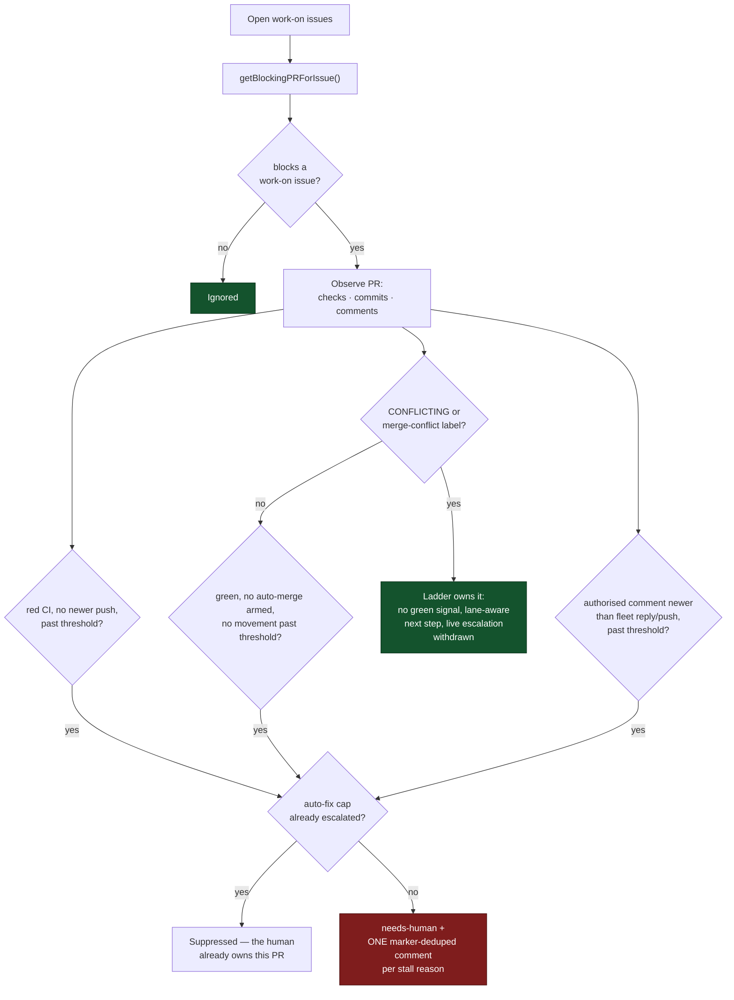

## 📦 In-Repo Configuration removed (`.vibecoder.json`,)

The in-repo `.vibecoder.json` mechanism has been **removed**.
Vibe Coder configuration must not live in the target repositories themselves — a
config channel from repo content into worker behaviour is an attack/steering
surface. Every field it once supported is available operator-side in
[`repo_config`](#-per-repository-configuration), which already takes
precedence.

- **No code path reads `.vibecoder.json`.** A leftover file at a repo root is
  ignored; the worker logs one informative warning naming the operator-side
  equivalent and continues.
- **Not on the commit-safety allowlist.** `.vibecoder.json` is no longer
  re-allowed by the `.gitignore` enforcer, so the worker never stages it.

### Migration

Move any value a repo previously declared in `.vibecoder.json` into the worker's
operator-side `.config.json` under `repo_config["owner/repo"]`. For example, a
repo that carried:

```json
{
  "skip_screenshot_check": true
}
```

is now configured operator-side as:

```json
"repo_config": {
  "owner/repo": {
    "skip_screenshot_check": true
  }
}
```

## 🐳 Docker-Based Quality Checks

When a repository requires tools that aren't installed on the worker machine
(Node.js, Java, Rust, Deno, etc.), configure a `docker_image` to run quality
checks inside a container. This keeps worker machines simple — they only need
Docker installed.

```json
"repo_config": {
  "TitlePage/tp-web-react": {
    "docker_image": "node:20"
  },
  "stSoftwareAU/private-repo-24": {
    "docker_image": "eclipse-temurin:21"
  },
  "my-org/rust-project": {
    "docker_image": "rust:latest"
  },
  "my-org/deno-project": {
    "docker_image": "denoland/deno:latest"
  }
}
```

**How it works:**

- The repository is mounted at `/workspace` inside the container
- A persistent cache directory (`~/.vibecoder-docker-cache/<repo>`) is mounted
  at `/workspace-cache` for dependency caching (node_modules, .m2, .cargo, etc.)
- The container runs with the host user's UID/GID to avoid file permission
  issues
- `--network host` is used so quality checks can access local services if needed
- The `CI=true` environment variable is set

**Common Docker images:**

| Language/Tool | Image                  | Notes                                 |
| ------------- | ---------------------- | ------------------------------------- |
| Node.js 20    | `node:20`              | For React, Next.js, npm/yarn projects |
| Node.js 22    | `node:22`              | Latest LTS                            |
| Deno          | `denoland/deno:latest` | For Deno projects                     |
| Java 8        | `eclipse-temurin:8`    | Legacy Java                           |
| Java 17       | `eclipse-temurin:17`   | LTS Java                              |
| Java 21       | `eclipse-temurin:21`   | Latest LTS Java                       |
| Rust          | `rust:latest`          | For Rust/Cargo projects               |

**Requirements:** Docker must be installed on the worker machine. If Docker is
not available and `docker_image` is configured, the worker will fail the quality
check with a clear error message.

## 🔧 Pre-Setup Command

The `pre_setup_command` feature allows you to run a setup script before Claude
starts working on an issue or PR feedback. This is particularly useful when:

- Your repository depends on large sibling repositories that need to be
  symlinked
- You need to install dependencies or prepare the environment
- You want to set up test data or configuration files

**How it works:**

1. After the repository is cloned/updated and the branch is created, the
   `pre_setup_command` is executed
2. The command runs with the following environment variables available:
   - `REPO_PATH`: Full path to the repository directory
   - `REPO_NAME`: Repository name in "owner/repo" format
3. The command has a timeout (default: 5 minutes, configurable via
   `PRE_SETUP_TIMEOUT`)
4. If the command fails, a warning is logged but Claude continues working

**Example setup script** (`scripts/link-sibling-repos.sh`):

```bash
#!/bin/bash
# Link sibling repositories that are needed for tests
PARENT_DIR=$(dirname "$REPO_PATH")

for sibling in "FLEET-shareprices2025Q3" "FLEET-sentiment-tickers" "FLEET-sentiment-topics"; do
    if [[ -d "$PARENT_DIR/$sibling" ]] && [[ ! -e "$REPO_PATH/$sibling" ]]; then
        ln -s "$PARENT_DIR/$sibling" "$REPO_PATH/$sibling"
        echo "Linked $sibling"
    fi
done
```

| Variable            | Default | Description                                                    |
| ------------------- | ------- | -------------------------------------------------------------- |
| `PRE_SETUP_TIMEOUT` | `300`   | Timeout in seconds for pre-setup commands (default: 5 minutes) |

## 🔑 Service Account Authentication (SSH + gh auth)

By default, the Vibe Coder authenticates using your personal SSH key and
`gh auth login` session. If you want the worker to authenticate as a **different
GitHub account** (e.g., a service account like `stsvcbot`), you set up a
dedicated SSH key and a separate `gh` auth session **once**, then store the
paths in `.config.json`. After that, everything is automatic — start the worker
with `./run.sh` (or via cron/launchd as in the
[Deployment Guide](DEPLOYMENT.md)); no environment variables needed at runtime.

> 🔄 **Already deployed and need to switch to a different account?** See
> Switching the Worker GitHub Identity for the
> fleet-wide migration procedure (the `switch-worker-identity.sh` walkthrough,
> draining old assignments, decommissioning the old account).

Two paths are stored in `.config.json`:

- `ssh_key_path` — the worker uses this for all git clone/push/fetch
- `gh_config_dir` — the worker uses this for all `gh` CLI operations (API calls,
  PR creation, etc.)

This is useful when:

- You want PRs and commits to appear under a service account rather than your
  personal account
- Your personal laptop uses SSH keys for your own work, but the worker should
  use a separate identity
- You run multiple workers under different accounts

### One-Time Setup

These steps are done once on your machine. After this, `./setup.sh` and the
worker read everything from `.config.json`.

#### Step 1: Generate a dedicated SSH key

Generate a new Ed25519 key pair for the service account. Use `-N ""` for no
passphrase (required for unattended worker operation):

```bash
ssh-keygen -t ed25519 -f ~/.ssh/stsvcbot_ed25519 -C "stsvcbot@vibe-coder" -N ""
chmod 600 ~/.ssh/stsvcbot_ed25519
```

This creates two files:

- `~/.ssh/stsvcbot_ed25519` — private key (stays on this machine)
- `~/.ssh/stsvcbot_ed25519.pub` — public key (added to GitHub)

#### Step 2: Add the public key to the service account on GitHub

Copy the public key:

```bash
cat ~/.ssh/stsvcbot_ed25519.pub
```

Then log in to GitHub **as the service account** and add it:

1. Go to **Settings → SSH and GPG keys → New SSH key**
2. Title: `Vibe Coder worker` (or similar)
3. Key type: **Authentication**
4. Paste the public key
5. Click **Add SSH key**

Verify the key works:

```bash
ssh -i ~/.ssh/stsvcbot_ed25519 -o IdentitiesOnly=yes -T git@github.com
```

You should see: `Hi stsvcbot! You've successfully authenticated...`

#### Step 3: Authenticate gh as the service account

This creates a separate `gh` config directory so the worker's `gh` session
doesn't interfere with your personal one. You only need to do this once — the
OAuth token is persisted in the directory.

```bash
mkdir -p ~/.config/gh-vibe
GH_CONFIG_DIR=~/.config/gh-vibe gh auth login
GH_CONFIG_DIR=~/.config/gh-vibe gh config set git_protocol ssh
```

> **📝 Note:** `GH_CONFIG_DIR` is only needed here during one-time setup so `gh`
> writes its token to the right directory. You never need to set it yourself
> again — the worker reads the path from `.config.json` and exports it
> automatically.

When prompted during `gh auth login`, select:

- **GitHub.com**
- **SSH** as the protocol
- **Login with a web browser** (log in as the service account)

Verify:

```bash
GH_CONFIG_DIR=~/.config/gh-vibe gh auth status
```

#### Step 4: Run setup.sh

Run `./setup.sh` — it will prompt for both paths:

```
SSH key path: ~/.ssh/stsvcbot_ed25519
gh config dir: ~/.config/gh-vibe
```

These are saved to `.config.json`. You can also edit `.config.json` directly:

```json
{
  "ssh_key_path": "~/.ssh/stsvcbot_ed25519",
  "gh_config_dir": "~/.config/gh-vibe"
}
```

**Done.** From now on, run the worker with `./run.sh` (or via cron/launchd). No
environment variables are needed at runtime; the worker reads both paths from
`.config.json` at startup and exports `GIT_SSH_COMMAND` and `GH_CONFIG_DIR`
automatically.

### How It Works

At worker startup, the Deno `load-config` command reads `.config.json` and:

- Exports
  `GIT_SSH_COMMAND="ssh -i ~/.ssh/stsvcbot_ed25519 -o IdentitiesOnly=yes"` —
  all git operations use this key
- Exports `GH_CONFIG_DIR=~/.config/gh-vibe` — all `gh` CLI operations use the
  service account's session

Your personal SSH keys and `gh auth login` session are **not affected** — only
the worker process sees these exports. No secrets are stored in `.config.json` —
only filesystem paths.

### Security Notes

> **🔒 Note:** Only filesystem paths are stored in `.config.json`, not secrets.
> However:
>
> - Protect the SSH private key with appropriate file permissions (`chmod 600`)
> - The gh config dir contains an OAuth token — ensure restrictive permissions
>   on the directory (`chmod 700 ~/.config/gh-vibe`)
> - The `.config.json` is listed in `.gitignore` and the pre-commit hook
>   prevents accidental commits

### 🛡️ Service-Account Identity Guard

Configuring `gh_config_dir` points the worker at a service-account token, but
nothing stopped a host whose ambient `gh` auth had **drifted** back to a human
personal token from silently operating — and escalating permissions — as that
human. (A real regression: a milestone-completion run raised a summary PR and
opened/closed tracking issues authenticated as a human account instead of the
service account.)

The `service_accounts` field closes that gap with a **fail-loud allowlist** of
the GitHub logins the worker is permitted to operate as:

```json
{
  "service_accounts": ["stsvcbot", "Vibecoderbot"]
}
```

**Setup writes this field.** It is no longer a hand-edit-only key:

- Pass the fleet's accounts explicitly:
  `VIBE_SERVICE_ACCOUNTS="stsvcbot,Vibecoderbot" ./setup.sh`.
- Or answer the interactive **Service accounts** prompt in `./setup.sh`.
- Supply nothing and setup **defaults the allowlist to the login it just
  authenticated as** — a one-entry allowlist that enforces from the first run,
  reported as a setup warning so the default is never silent. Add every account
  the fleet uses when a host legitimately runs as more than one.
- If the login cannot be resolved, setup leaves the list empty and the
  **setup-time collaborator precheck files an issue** (the same consolidated
  issue used for non-collaborator repos), so an inactive guard is visible as a
  tracked issue rather than one log line among thousands.

Behaviour:

- **At startup**, the worker resolves the live `gh` login and aborts (exit 1)
  when it is not on the allowlist — before any work runs.
- **Before every milestone write** (tracking-issue creation, summary-PR
  raising, tracking-issue closing) the login is **re-resolved and re-checked**,
  so auth that drifts mid-run is still caught. On a mismatch the milestone
  operation refuses to write and fails loud — it never proceeds as the drifted
  account.
- The refusal log names the **hostname** plus the **expected** and **actual**
  login, so the offending host self-identifies. Fixing that host's `gh` auth is
  a human action once the guard surfaces it.
- The list is an **allowlist, not a per-host key** — every fleet host shares the
  same `service_accounts` value.
- **These logins are fleet accounts, so they also count as fleet PR authors.**
  `loadConfig` unions `service_accounts` into the effective `fleet_pr_authors`,
  which is what feeds every PR guard — see
  [Service accounts are fleet PR authors too](#service-accounts-are-fleet-pr-authors-too).
- When `service_accounts` is **empty** the guard cannot enforce. Rather than
  fail silently it logs a loud `[SECURITY] … INACTIVE` warning on every run.
  Since that state is only reachable by emptying the key by hand or
  by a failed login lookup at setup time — and the collaborator precheck files
  an issue for it either way.

```mermaid
flowchart TD
    S["./setup.sh"] --> S1{"VIBE_SERVICE_ACCOUNTS<br/>or existing allowlist?"}
    S1 -->|"yes"| S3["Write service_accounts"]
    S1 -->|"no"| S2["Resolve gh login"]
    S2 -->|"resolved"| S3
    S2 -->|"unresolved"| S4["Leave empty + precheck files an issue"]
    S3 --> A
    S4 --> A
    A["Worker startup"] --> B["Resolve gh login"]
    B --> C{"login in service_accounts?"}
    C -->|"no (mismatch)"| X["Fail loud — log host + expected/actual, exit 1"]
    C -->|"allowlist empty"| W["Log INACTIVE warning, continue"]
    C -->|"yes"| D["Run main loop"]
    W --> D
    D --> E["Milestone write phase"]
    E --> F["Re-resolve gh login"]
    F --> G{"login in service_accounts?"}
    G -->|"no (drifted mid-run)"| Y["Refuse write — fail loud, no PR/issue"]
    G -->|"yes / inactive"| H["Create tracking issue + summary PR"]
```

## 📡 Monitored Repositories

Repositories are configured via `./setup.sh` and stored in `.config.json`. To
add or modify repositories, either:

1. Re-run `./setup.sh` with the appropriate `VIBE_*` environment variables
2. Add repos: `VIBE_ADD_REPOS="org/new-repo" ./setup.sh`
3. Edit `.config.json` directly
