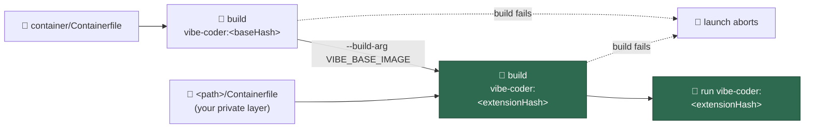
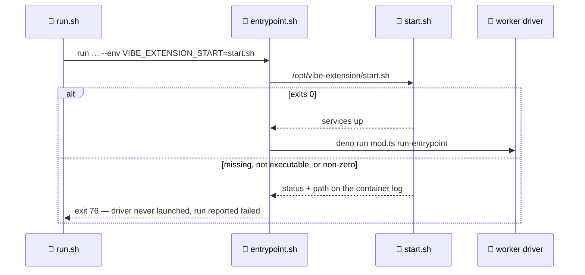

# 🧩 Container Extension — a private layer on the standard image

Some deployments need an environment the public Vibe Coder has no business
carrying: a database server loaded with a schema, a CI server the agent drives,
a pair of JDKs no other fleet wants. The **container extension** is the
extension point for exactly that. The operator keeps their own private
repository of build instructions on their own host, declares where it is, and
the launcher builds it as a **second image layered on the standard one**. This
repository learns nothing about it — no name, no URL, no fork.

This page is the operator's manual for that extension point, and it ends with a
worked example an operator can follow verbatim.

> **Concept only.** Everything below is generic. The example names no
> repository, no host and no deployment: substitute your own and it works
> unchanged.

## 📋 Table of Contents

- [When to use it](#when-to-use-it)
- [The configuration block](#the-configuration-block)
- [Distribution — you sync it, the Vibe Coder builds it](#distribution--you-sync-it-the-vibe-coder-builds-it)
- [The layering contract](#the-layering-contract)
- [Rebuilds follow the content](#rebuilds-follow-the-content)
- [Service supervision](#service-supervision)
- [Containment](#containment)
- [Failure modes](#failure-modes)
- [Worked example](#worked-example)
- [Related documentation](#related-documentation)

## When to use it

Four extension points exist, and they do not overlap. Pick the smallest one
that fits:

| Extension point | What it extends | Where it is documented |
| --------------- | --------------- | ---------------------- |
| `container_tools` | The image's **toolchains** — a declarative archive install per tool, unpacked under `/opt/vibe-tools/<id>` | [Deployer-supplied build-time tools](CONTAINER.md#deployer-supplied-build-time-tools) |
| `custom_label_prompts` | The **prompts** a phase runs, mapped from a label to a template on your own host | [Custom Label Prompts](CUSTOM-PROMPTS.md) |
| `ciProviders` | Where a failing PR's **CI logs** come from | [Adding a CI log provider](EXTENDING.md#-adding-a-ci-log-provider) |
| `container_extension` | The **image itself** — arbitrary build steps, and services running before the agent starts | This page |

Reach for `container_extension` when the environment needs something a
declarative archive install cannot express: a package installed from the
distribution's own repositories, a database initialised from dump files at
build time, a service that must be **running** before the agent begins work.
Everything a plain archive install can do belongs in `container_tools`, which
is validated more tightly and needs no Containerfile of your own. The worked
example below uses both, because that is the honest split: its JDKs and its
build tool are archive installs, its database and CI server are not.

A deployment that declares no extension is byte-for-byte the deployment it is
today — the same image tag, the same launch plan, the same entrypoint
behaviour.

## The configuration block

`container_extension` is a **validated `.config.json` key**, not a `VIBE_*`
environment variable. There is no environment escape hatch: the launcher reads
the declaration out of the deployment's configuration file, and a fault stops
the launch rather than being defaulted away.

```json
{
  "container_extension": {
    "path": "/srv/vibe-extension",
    "containerfile": "Containerfile",
    "start": "start.sh"
  }
}
```

| Key | Required | Meaning |
| --- | -------- | ------- |
| `path` | yes | Absolute host directory holding the extension. It may not be the home directory of the account running the Vibe Coder, an ancestor of it, or a filesystem root, and it may carry no `.` or `..` segment — a traversal resolves somewhere the containment checks never see. |
| `containerfile` | no (default `Containerfile`) | The build file, **relative to `path`**. An absolute value, or one escaping the directory, is refused. |
| `start` | no | A script the sandbox runs before the worker, **relative to `path`**. Declare it only when the extension has services to bring up; with no `start` the block is inert at container start. |

The whole block is validated at config load, and the first fault is reported
naming the field. Nothing is repaired and nothing is partially applied: a
half-understood declaration would mean building an unexpected image or running
an unexpected script.

## Distribution — you sync it, the Vibe Coder builds it

**The Vibe Coder clones nothing.** The extension directory is yours: sync your
own private repository into `path` by whatever means you already trust — a
`git pull` from a cron entry, an rsync from a deployment pipeline, a checkout
performed by hand. The worker never reads a remote, never holds a credential
for one, and never updates the directory. This is the same posture
[Custom Label Prompts](CUSTOM-PROMPTS.md) takes for prompt templates, for the
same reason: content this repository cannot see must not be fetched by code
this repository ships.

What the Vibe Coder does with the directory is read it, hash it, and build it.

## The layering contract

The extension's Containerfile must open with `ARG VIBE_BASE_IMAGE` and derive
its first `FROM` from that argument:

```dockerfile
ARG VIBE_BASE_IMAGE
FROM ${VIBE_BASE_IMAGE}
```

Only `ARG` may precede that first `FROM`, and the **last** stage must derive
from the base too — directly or through a chain of stages that does — because a
build with no `--target` ships the last stage. A helper stage built on anything
you like is fine; it is not what the layer ships.

Without that rule a Containerfile could name any base at all and the worker
would run in an image carrying none of the fleet's toolchain, entrypoint or
pinned agents while still being tagged as though it did.

The launcher passes two build arguments and nothing else:

| Build argument | Value | When |
| -------------- | ----- | ---- |
| `VIBE_BASE_IMAGE` | The standard image's tag, `vibe-coder:<baseHash>` | Always |
| `VIBE_EXTENSION_START` | The declared start script's extension-relative path, recorded in the image as provenance | Only when `start` is declared |

The **build context is the extension directory alone**, and the fixed in-image
prefix is `/opt/vibe-extension/` — the same posture `/opt/vibe-tools/<id>`
already takes for `container_tools`. Copy your extension there; the framework
runs the declared start script from there.



## Rebuilds follow the content

The layered image's tag is a **content hash of the extension definition** —
every file under `path`, dump files and pipeline definitions included, plus the
declaration's own `containerfile` and `start` selections. So:

- change any file under the extension directory, and the next launch rebuilds;
- change nothing, and the next launch reuses the built image and rebuilds
  nothing;
- point the same directory at a different `containerfile`, and that is a
  different image, because it is;
- sync the same extension to a different directory on another host, and the two
  hosts share one tag — the *path* is deliberately not hashed.

Entries are sorted byte-wise and framed by path, mode and length, so adding,
deleting, renaming, moving bytes between two files, or making `start.sh`
executable each move the tag. File bytes reach the digest in 64 KiB chunks, so
a multi-gigabyte dump costs one buffer rather than the worker's heap.

## Service supervision

The framework supervises exactly one thing, and makes its failure loud.

When `start` is declared, `container/entrypoint.sh` runs
`/opt/vibe-extension/<start>` as the container's own unprivileged worker
account — after the writable-path policy and the tools PATH, **before** the
Deno driver. Its stdout and stderr are inherited, so a database that refused to
come up is diagnosable from the container log.

Every way that start can fail *and return* aborts the sandbox start with exit
status **76** and never runs the driver: a script absent from the image, one
that is not executable, and one that exits non-zero. The worker records the
abort as a **failed run**, backs off and escalates like any other run failure.
The status is the framework's own so it cannot be confused with a deliberate
quota pause (75) or the runtime's container-start range (125–127).

A start that **hangs** is the exception: it is not time-bounded, because how
long a database may take to come up is the operator's call. The launcher's
watchdog ends the container and reports it as wedged instead.



## Containment

The layer changes what the image *contains*, never what the container may
*reach*. Every boundary [Containment](CONTAINMENT.md) describes is unchanged:

- **Service ports are container-internal only.** Nothing an extension starts is
  published to the host. The agent reaches the services inside the sandbox, and
  you observe the work through GitHub.
- **The extension directory is never bind-mounted.** It reaches the container
  through the image and only through the image, so the running container cannot
  write back to it. Nothing is added to the mount set.
- **No host path enters the build.** The build context is the extension
  directory; the two build arguments above are the only values that cross.
- **The read-only root and its scratch tmpfs are unchanged.** The layered image
  runs under exactly the same contained argument set as the standard one.
- **Symlinks may not leave the extension directory.** A link pointing out of it
  is refused before any build, because it would fold host content you never
  synced into the image.

## Failure modes

Every fault is reported before it can become a puzzle, and each has one exact
symptom.

| When | Symptom |
| ---- | ------- |
| The block is malformed — an unknown key, a relative `path`, a `..` segment, a `containerfile` escaping the directory | Config load fails: `Invalid container_extension in .config.json: container_extension.<field>: <what was expected>` |
| The extension directory is absent | Launch preflight fails: `Cannot launch: the container_extension directory <path> does not exist. The operator syncs their own extension into it — the Vibe Coder clones nothing.` |
| `path` names a file, not a directory | `Cannot launch: the container_extension path <path> is not a directory.` |
| The declared `containerfile` is absent | `Cannot launch: the container_extension Containerfile <path> does not exist. container_extension.containerfile names it, relative to <directory>.` |
| The declared `start` is absent | `Cannot launch: the container_extension start script <path> does not exist. container_extension.start names it, relative to <directory>.` |
| A symlink under the directory points outside it | `Cannot launch: the container_extension symlink <entry> escapes the extension directory: it resolves to <target>, outside <directory>.` |
| The Containerfile does not derive from the base image | Refused before any build runs: ``Refusing to launch: the container_extension Containerfile <path> builds `FROM <image>` rather than from the standard image`` |
| The start script is missing inside the built image | Sandbox start aborts, exit 76: `Error: the container_extension declares the start script <start>, but /opt/vibe-extension/<start> does not exist in the image` |
| The start script is not executable | Sandbox start aborts, exit 76: `Error: the container_extension start script <path> is not executable` |
| The start script exits non-zero | Sandbox start aborts, exit 76: `Error: <path> exited <status> — aborting the sandbox start; the worker driver was not launched`, and the run is reported failed |

The preflight faults are found **while the launch plan is built** — before
either build — so a definition that is not on the host costs a sentence rather
than the minutes a build takes to reach the same conclusion.

## Worked example

A deployment whose monitored repositories are Java services built against two
JDKs, tested against a database loaded with production-shaped schemas, and
released through a CI server the agent has to be able to drive.

Concretely, and to keep the commands real rather than notional: a **Postgres**
server with three databases loaded from dumps at image build time, a
**Jenkins** whose pipeline job is defined in `casc.yaml` and loads the project
through the project's own `Jenkinsfile`, and — through `container_tools`, not
the layer — an 8 LTS and a 21 LTS JDK side by side plus a Java build tool.
Substitute whatever your deployment actually runs: nothing in the mechanism
knows or cares what an extension starts.

The split is the one this page opened with: the **toolchains** ride
`container_tools`, and the **services** ride the extension layer.

### The directory layout

The operator syncs their own private repository to `/srv/vibe-extension`:

```text
/srv/vibe-extension/
├── Containerfile          # the layer, built FROM ${VIBE_BASE_IMAGE}
├── start.sh               # brings Postgres and Jenkins up
├── build/
│   ├── load-dumps.sh      # initialises a cluster and loads the dumps
│   └── seed-ci.sh         # installs the pinned plugins into a CI home
├── dumps/
│   ├── orders.sql         # loaded at image build time
│   ├── customers.sql
│   └── reporting.sql
└── ci/
    ├── casc.yaml          # configuration as code: the pipeline job
    └── plugins.txt        # the pinned plugin set
```

### The configuration

```json
{
  "container_extension": {
    "path": "/srv/vibe-extension",
    "containerfile": "Containerfile",
    "start": "start.sh"
  },
  "container_tools": [
    {
      "id": "jdk8",
      "version": "8.0.462.08.1",
      "url": {
        "amd64": "https://artefacts.example.com/jdk8-8.0.462.08.1-linux-x64.tar.gz",
        "arm64": "https://artefacts.example.com/jdk8-8.0.462.08.1-linux-aarch64.tar.gz"
      },
      "sha256": {
        "amd64": "1111111111111111111111111111111111111111111111111111111111111111",
        "arm64": "2222222222222222222222222222222222222222222222222222222222222222"
      },
      "stripComponents": 1,
      "env": { "JAVA_8_HOME": "" }
    },
    {
      "id": "jdk21",
      "version": "21.0.8.9.1",
      "url": {
        "amd64": "https://artefacts.example.com/jdk21-21.0.8.9.1-linux-x64.tar.gz",
        "arm64": "https://artefacts.example.com/jdk21-21.0.8.9.1-linux-aarch64.tar.gz"
      },
      "sha256": {
        "amd64": "3333333333333333333333333333333333333333333333333333333333333333",
        "arm64": "4444444444444444444444444444444444444444444444444444444444444444"
      },
      "stripComponents": 1,
      "bin": ["bin"],
      "env": { "JAVA_HOME": "", "JAVA_21_HOME": "" }
    },
    {
      "id": "maven",
      "version": "3.9.11",
      "url": {
        "noarch": "https://artefacts.example.com/maven-3.9.11-bin.tar.gz"
      },
      "sha256": {
        "noarch": "5555555555555555555555555555555555555555555555555555555555555555"
      },
      "stripComponents": 1,
      "bin": ["bin"],
      "env": { "MAVEN_HOME": "" }
    }
  ]
}
```

Read that as two long-term-support JDKs side by side — an 8 LTS build such as
Amazon Corretto 8, and a 21 LTS build such as Amazon Corretto 21 — plus Maven,
each landing in its own prefix: `/opt/vibe-tools/jdk8`,
`/opt/vibe-tools/jdk21` and `/opt/vibe-tools/maven`. **The versions, URLs and
digests are placeholders**: substitute your vendor's real download and the SHA-256 that
vendor publishes for it. Nothing in the mechanism inspects them, and pinning a
real one here would go stale the day it is re-published.

Only the 21 LTS build puts its `bin` on PATH, so `java` resolves to one
predictable JDK; the 8 LTS build is reached through `JAVA_8_HOME`, which is
what a per-project toolchain configuration wants anyway.

### The Containerfile

```dockerfile
# The layering contract: the base is handed in, never chosen here.
ARG VIBE_BASE_IMAGE
FROM ${VIBE_BASE_IMAGE}

# Provenance only — the launch plan hands the same path in at run time.
ARG VIBE_EXTENSION_START

USER root

# 1. The database server, pinned to a major version. The start script names
#    the same one, and an unpinned install would follow the distribution to a
#    version whose binaries and cluster live somewhere else.
ARG PG_MAJOR=17
RUN apt-get update \
 && apt-get install --no-install-recommends -y \
      "postgresql-${PG_MAJOR}" "postgresql-client-${PG_MAJOR}" \
 && rm -rf /var/lib/apt/lists/*

# 2. The CI server itself, verified against a digest you pin.
ARG CI_SERVER_SHA256=6666666666666666666666666666666666666666666666666666666666666666
RUN mkdir -p /opt/ci \
 && curl -fsSL -o /opt/ci/server.war \
      https://artefacts.example.com/ci-server-2.531.war \
 && printf '%s  %s\n' "${CI_SERVER_SHA256}" /opt/ci/server.war | sha256sum -c -

# 3. The extension at the one fixed prefix the framework runs from, plus the
#    seed directory the build fills. Both are owned by the worker account,
#    because everything below this line — build and run alike — is `vibe`.
COPY . /opt/vibe-extension/
RUN mkdir -p /opt/vibe-seed \
 && chmod 0755 /opt/vibe-extension/start.sh /opt/vibe-extension/build/*.sh \
 && chown -R vibe:vibe /opt/vibe-extension /opt/vibe-seed /opt/ci

USER vibe
ENV PATH="/usr/lib/postgresql/${PG_MAJOR}/bin:${PATH}"

# 4. Three databases, created and loaded from the dumps AT BUILD TIME, into a
#    cluster the worker account owns. No run pays the restore cost, and every
#    run starts from identical data.
RUN /opt/vibe-extension/build/load-dumps.sh /opt/vibe-seed/pgdata \
      orders customers reporting

# 5. The CI server's home, seeded with the pinned plugin set so no run
#    downloads plugins. Its job comes from casc.yaml, read from the extension
#    prefix at start.
RUN /opt/vibe-extension/build/seed-ci.sh /opt/vibe-seed/jenkins
```

Two operator-owned scripts do the build-time work. `build/load-dumps.sh`
initialises a cluster at the path it is handed, starts it on a Unix socket,
creates one database per name and loads the matching `dumps/<name>.sql` into
it, then stops it again. `build/seed-ci.sh` installs `ci/plugins.txt` into a
fresh CI home. Both leave a **seed** behind: state the image carries, rather
than instructions for producing it.

Loading the dumps at **build time** is the point of doing this in a layer at
all. The image tag covers every byte under the extension directory, dumps
included, so a changed dump rebuilds the image exactly once and every later run
starts from the same loaded database in the time it takes the server to open a
socket.

The CI server's job is defined in `ci/casc.yaml` — configuration as code, so
the image carries a server already holding its job rather than one waiting to
be clicked through a setup wizard. That job is a pipeline that reads its steps
from the checked-out project's own `Jenkinsfile`, so the agent can trigger a
build of the branch it is working on and the pipeline it runs is the
project's, not one duplicated into the extension.

### Why the seed is copied rather than used in place

The container root filesystem is **read-only**, and an extension does not move
that boundary. Both services insist on writing to their own state directory,
so neither can run against a path baked into the image. The start script
copies each seed into the per-launch scratch root the entrypoint exports as
`VIBE_SCRATCH_DIR` — the `/tmp` tmpfs where the runtime has one, a directory
on the work volume where it has not — and points the service at the copy.
Either way it is writable, per-run, and gone when the container is.

That is a deliberate trade rather than a free trick. A tmpfs is memory: a seed
of a few hundred megabytes is comfortable, and a fifty-gigabyte one is not. An
extension whose data will not fit in the container's scratch space belongs
behind a service reached over the network, not inside the sandbox.

### The start script

```bash
#!/bin/bash
# /srv/vibe-extension/start.sh — brings the extension's services up.
#
# Runs as the unprivileged worker account, before the worker driver. A
# non-zero exit here aborts the sandbox start (exit 76) and the run is
# reported failed — so every service is started, then proved to be answering
# before this script returns.
set -euo pipefail

log() { echo "extension: $*" >&2; }

# The container root is read-only, so both services run from a copy of the
# seed the image carries. The entrypoint exports VIBE_SCRATCH_DIR — the
# writable per-launch root, the tmpfs where there is one — before it runs
# this script, so use it rather than assuming /tmp.
SCRATCH="${VIBE_SCRATCH_DIR:-/tmp}"
PGDATA="${SCRATCH}/pgdata"
JENKINS_HOME="${SCRATCH}/jenkins"
export PGDATA JENKINS_HOME
cp -a /opt/vibe-seed/pgdata "${PGDATA}"
cp -a /opt/vibe-seed/jenkins "${JENKINS_HOME}"

# Postgres, on the container-internal loopback. Nothing is published.
log "starting the database on 127.0.0.1:5432"
pg_ctl -D "${PGDATA}" -l "${SCRATCH}/postgres.log" -w -t 60 \
  -o "-h 127.0.0.1 -p 5432 -k ${SCRATCH}" start
pg_isready -h 127.0.0.1 -p 5432 --quiet || {
  log "the database never accepted connections; see ${SCRATCH}/postgres.log"
  exit 1
}

# Jenkins, its job taken from casc.yaml, listening internally.
log "starting the CI server on 127.0.0.1:8080"
CASC_JENKINS_CONFIG=/opt/vibe-extension/ci/casc.yaml \
  java -jar /opt/ci/server.war --httpPort=8080 \
    >"${SCRATCH}/jenkins.log" 2>&1 &

for _ in $(seq 1 60); do
  if curl -fsS http://127.0.0.1:8080/login >/dev/null 2>&1; then break; fi
  sleep 2
done
curl -fsS http://127.0.0.1:8080/login >/dev/null 2>&1 || {
  log "the CI server never came up; see ${SCRATCH}/jenkins.log"
  exit 1
}

log "services up"
```

Three properties make that script correct rather than merely plausible:

1. **It returns.** The framework waits for it, so it starts services in the
   background and returns once they answer — it does not `exec` a supervisor
   and it does not block forever.
2. **It fails loud.** `set -euo pipefail`, an explicit readiness check per
   service, and a non-zero exit when either never comes up. A service that
   silently failed to start would otherwise surface as an agent run that
   mysteriously cannot connect.
3. **It publishes nothing.** Both services listen inside the container only.

### What a launch then does

1. Reads and validates `container_extension` from `.config.json`.
2. Preflights `/srv/vibe-extension` — the directory, the `Containerfile`, the
   `start.sh`, and no escaping symlink — before either build.
3. Builds the standard image, `vibe-coder:<baseHash>`.
4. Builds the layer with
   `--build-arg VIBE_BASE_IMAGE=vibe-coder:<baseHash>`, tagged
   `vibe-coder:<extensionHash>`, context `/srv/vibe-extension`.
5. Runs `vibe-coder:<extensionHash>` with `VIBE_EXTENSION_START=start.sh`.
6. The entrypoint runs `/opt/vibe-extension/start.sh`; on exit 0 it starts the
   worker driver, and on any failure it exits 76 and the run is reported
   failed.

Steps 3 and 4 are skipped when the images are already present, which — because
the tag is the content hash — is every launch on which nothing under the
extension directory changed.

## Related documentation

- [Container Image](CONTAINER.md) — the image's identity, the two builds, and
  the full failure reference for the extension
- [Worker Image Design](CONTAINER-IMAGE.md) — what the standard image carries,
  and why
- [Containment](CONTAINMENT.md) — the boundary the layer does not move
- [Private Extensions](PRIVATE-EXTENSIONS.md) — the configuration-only
  extension surface, step by step
- [Custom Label Prompts](CUSTOM-PROMPTS.md) — the sibling extension point for
  prompts you do not publish
- [Configuration](CONFIGURATION.md) — the `container_extension` and
  `container_tools` key reference
- [Extending the Worker](EXTENDING.md) — the in-tree extension points
