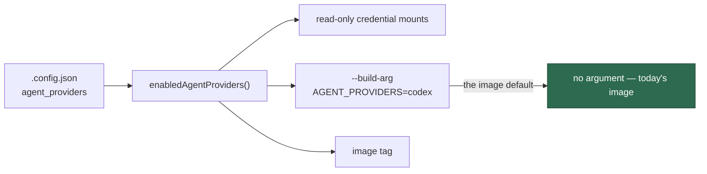
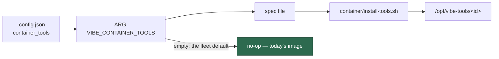

# 📦 Vibe Coder worker image

Design rationale for `container/Containerfile`. The prose lives
here rather than in the Containerfile because Apple `container` rejects
Dockerfiles over 16384 bytes (apple/container) — and within a few bytes of
that cap the build fails with an unexplained `Stream unexpectedly closed`
instead of the named error. `worker/deno/tests/container_manifest_test.ts`
enforces a size margin on the Containerfile; keep new commentary here.

## Supply-chain posture

Standard OCI instructions only, so the file builds identically under Apple
`container`, `docker build` and `podman build`. Every version installed is
pinned in `container/tools.json`; `container_manifest_test.ts` fails the
quality gate when the two drift apart. Both base images are pinned by
immutable digest and every downloaded tool is verified against a recorded
SHA-256, so nothing in the build resolves to "whatever upstream published
most recently". Tarballs from npm are downloaded and checksum-verified first,
then installed from the local file with `--ignore-scripts` — `npm install
<name>@<version>` would take upstream's word for the bytes and run lifecycle
scripts as root.

## Base image

The base is the official Ruby image (itself built on `buildpack-deps:trixie`)
because `./quality.sh` needs both: the Pages scripts under
`.github/scripts/*.rb` need ruby >= 3.1 for `Psych.safe_load_file`
, and git >= 2.41 is required for `--end-of-options` to be dropped from
argv rather than taken as a revision. The image already ships
bash, GNU coreutils (so `timeout` resolves without the macOS `gtimeout`
fallback), git, curl and ca-certificates, which is why there is no
package-manager install step to rot.

## Layer order

Node.js is installed ahead of the coding-agent provider layer because a
provider whose CLI ships as a JavaScript bundle needs the runtime at install
time. The monitored-repository toolchains come last of the install steps: the
worker-runtime layers above are untouched by a toolchain bump, so bumping a
version reuses their cache. Within that block the order is least-to-most
churn — the static analysers move rarely; Rust moves every few weeks and is
the largest download, so it sits last and a Rust bump rebuilds only itself.

## Node and npm

Node and npm are pinned as two separate toolchains. The Node tarball bundles
an npm of its own — 11.17.0 for Node 24.19.0 — so before Issue #475 the image
carried whatever the runtime shipped and every build logged npm's
"New major version available" notice. `container/tools.json` now gives `npm`
its own entry, and the build installs that tarball over the bundled copy after
verifying its checksum, so exactly one pin owns the `npm` command.

The two are still coupled: npm 12 declares
`engines.node: ^22.22.2 || ^24.15.0 || >=26.0.0`, so a `NODE_VERSION` bump has
to land a Node that npm's `engines` still accepts. The build fails loud on
either half — the install step asserts `npm --version` reports `NPM_VERSION`,
and `.github/workflows/container-build.yml` re-checks every toolchain's pinned
version against the built image.

## Coding-agent providers

The providers are a separable layer selected as a comma-separated *set*
(quorum mode needs several agent CLIs in one image): the build runs one
fragment from `container/providers/` per requested id, in order. Adding a
provider means adding a fragment plus a `container/tools.json` `providers`
entry — the base definition does not change. An empty list, a malformed or
duplicate id, an id with no fragment, or a failing fragment aborts the build
loudly, naming the fragments that do exist (`install-providers.sh`,
). The default set is the manifest's `installedProviders`
(gate-checked), and the set is part of the hashed definition, so changing it
changes the image tag rather than reusing a tag whose contents
differ.

The launchers pass the deployment's own set (Issue #729). The launch plan
resolves `.config.json`'s `agent_providers` **once** — the same resolution that
decides which credential directories are mounted — and carries it into the
build as `--build-arg AGENT_PROVIDERS=<ids>`, so a Codex-only configuration
builds a Codex image instead of taking the Claude default. That value is mixed
into the image tag as well, so a host that switches providers rebuilds rather
than reusing an image with the wrong agents baked in. A set that is already the
manifest's `installedProviders` passes no argument and hashes nothing extra, so
the default fleet build and its tag are byte-for-byte unchanged.

`COPY providers/*.sh` is a glob, not a bare directory COPY, because Apple
container 1.2.2's builder silently materialises `COPY providers
/tmp/providers` (and the trailing-slash form) as an empty directory; the glob
copies the fragments correctly on every runtime.

## Rust toolchain

The standalone rust-lang distribution is installed into `/usr/local` rather
than via rustup, so there is no per-user toolchain directory and nothing to
update at run time. The combined `rust-<version>` package carries only
rustc/cargo/rust-std (rust-docs is dropped to keep the layer smaller);
rustfmt and clippy are separate component packages, each with its own pinned
checksum. `QUALITY_SKIP_RUST_UPDATE=1` stops private-repo-9's gate running
`rustup update stable` — the image owns its toolchain.

## semgrep

The gate's SAST stage (`worker/deno/lib/semgrep_check.ts`) runs the same
`p/default` ruleset the blocking `semgrep.yml` PR check runs, over the branch's
changed files. Until Issue #650 the image shipped no `semgrep` and no container
runtime to run the CI image with, so on a fleet run that stage reported
`SKIPPED` — loudly, and `--strict` promoted it to `FAILED`, but agents still met
SAST findings only after a red PR.

`SEMGREP_VERSION` is not a free choice: it must equal `SEMGREP_IMAGE_TAG` in
`worker/deno/lib/pinned_actions.ts`, the `semgrep/semgrep` image `semgrep.yml`
runs, because that is what makes a local pass predict a CI pass — the gate
compares the two itself and names any drift in its output, and
`container_manifest_test.ts` fails the quality gate when they diverge.

Semgrep's CLI is a Python application with no standalone binary release, so the
install is not the usual "download one checksum-verified binary":

- The wheel goes into its own virtualenv at `/opt/semgrep`, with
  `/usr/local/bin/semgrep` a symlink onto it. The base image's system
  interpreter is PEP 668 *externally managed*, and a virtualenv keeps
  semgrep's ~30 dependencies out of it entirely.
- `pip` is a pinned artefact in its own right (`tools` in
  `container/tools.json`): the base ships no `ensurepip`, so the installer is
  downloaded as a checksum-verified wheel and run straight from that file as a
  zipapp. Nothing installs pip *into* the image.
- pip resolves the semgrep wheel for the build architecture and the committed
  `amd64` / `arm64` digest is verified **before** it is installed — the wheels
  differ per architecture because each bundles its own `semgrep-core`. Only
  semgrep's dependency wheels come from the index unverified, the same residual
  risk `playwright-core install --with-deps` carries for its apt set.
- The step ends by asserting `semgrep --version` reports `SEMGREP_VERSION`, so
  a drifted or half-installed toolchain fails the build rather than the first
  gate run. `SEMGREP_ENABLE_VERSION_CHECK=0` keeps an unattended container from
  making an upgrade-check round trip on every invocation.

**Image-size cost: about 350 MB**, ~260 MB of which is the `semgrep-core`
binary the wheel bundles. That is the largest single toolchain in the image and
it was a deliberate trade: the alternative is every fleet agent discovering
`p/default` findings in CI instead of before the push. The stage scans changed
files only, so the run-time cost stays small even though the install is large.

## Playwright + headless Chromium

The worker captures PR evidence through the Playwright MCP server, and a
contained worker has no host browser or desktop session to borrow, so
Chromium is installed at build time into `PLAYWRIGHT_BROWSERS_PATH` — nothing
downloads a browser at container start or mid-run. `PLAYWRIGHT_VERSION` is
not a free choice: it is exactly the version `@playwright/mcp` depends on,
because Playwright resolves browsers as `chromium-<revision>` and each
release pins its own revision; the gate fails when the pin drifts from
`PLAYWRIGHT_INSTALLER_VERSION` in `worker/deno/setup/screenshot.ts`.
The Chromium zip is a second artefact (Issue #274): Playwright 1.61 on
Debian Trixie fetches Chrome for Testing on amd64 and its own chromium
build on arm64. Those zips are downloaded, SHA-256 verified against
`chromium_amd64` / `chromium_arm64` in `container/tools.json`, and extracted
into `chromium-<revision>` *before* `playwright-core install --with-deps
chromium` runs, so the installer sees `INSTALLATION_COMPLETE` and does not
re-fetch the blob. `--with-deps` still apt-installs the system-library and
font set Playwright itself declares. Those Debian packages stay unpinned:
the list is large, security updates move the versions, and pinning them
would break the next point release. Residual risk is Debian's signed apt
repos on the digest-pinned trixie base. Because Playwright only warns when
it does not recognise a distribution, the build then launches the browser
and renders a page: a missing library fails the build rather than the first
screenshot.

## Pre-warmed Deno cache

The MCP server itself is launched as `deno run npm:@playwright/mcp@<pin>`,
and Deno resolves that package — with its own copy of `playwright-core` —
into the *Deno* npm cache, not the global npm install above. Left alone,
that meant a mid-run download from npm on every fresh workspace volume (or
after the cache guard wiped it), and a registry blip broke screenshots for
the run. The image therefore carries a pre-warmed Deno cache at
`VIBE_DENO_SEED_DIR` (`/opt/deno-seed`): the build runs `deno cache` for
`container/deno-seed/seed.ts` against `container/deno-seed/deno.json` and
its lockfile — `@playwright/mcp` at `PLAYWRIGHT_MCP_VERSION`, plus the
worker's own JSR dependencies at the versions `worker/deno/deno.lock` pins —
fails if the lock would change (every tarball's integrity is pinned), and
proves the result with `deno run --cached-only`. At container start the
entrypoint copies whatever the durable volume cache lacks from the seed
(never overwriting what is there), so a cold cache needs no npm or jsr.io
round trip. `worker/deno/tests/container_manifest_test.ts` fails the gate
when the seed's pins drift from `screenshot.ts`, the Containerfile ARG or
the worker lock, and Container Build drives the MCP server from the seed
with `--network none`.

## Deployer-supplied build-time tools

A deployment whose monitored repositories need a toolchain the fleet image
does not carry — Java and Maven are the first expected use — declares it in
`.config.json` as `container_tools`. The build takes that validated array as
the `VIBE_CONTAINER_TOOLS` build argument, writes it to a spec file and runs
`container/install-tools.sh` over it, which downloads, SHA-256 verifies and
extracts each entry under `/opt/vibe-tools/<id>`. The whole set is validated
before anything is downloaded, and any fault — a bad id, a missing digest for
the build architecture, an unsupported archive extension, a checksum mismatch
— aborts the build naming the tool, rather than producing an image that
silently lacks it. The spec shape, a worked Java + Maven example and the
checksum rules a deployer needs are in
[Container Image](CONTAINER.md#deployer-supplied-build-time-tools).

The block is **one fixed-size step whatever the tool count** — the script
loops over the spec, so no tool adds a `RUN` and nothing pushes the
Containerfile towards Apple `container`'s cap. An absent or empty argument
writes an empty spec, runs nothing and leaves nothing behind, so a deployment
that selects no extra tools pays nothing.

The selection is part of the image's **identity**, not just its build: the tag
`container-image-hash` prints mixes in a canonical serialisation of the
validated spec (see
[Image identity](CONTAINER.md#image-identity--the-tag-is-the-definitions-hash)),
so a host that selects Java and Maven cannot be satisfied by another host's
cached tools-free image.

These archives are deliberately *not* in `container/tools.json`: they are the
deployment's, pinned by the digests it declared, not the fleet's. That is the
single allowance in the parity gate — `findContainerfileViolations` reports
any *other* build step that downloads without verifying a checksum in the same
step, and reports this one too if the spec comes from anywhere but
`${VIBE_CONTAINER_TOOLS}`, if the argument defaults to a non-empty selection,
or if the argument is declared and never acted on. `install-tools.sh` is part
of the hashed definition, so editing it changes the image tag.

## Built from a comment-stripped copy

Apple `container` rejects a Dockerfile over 16,384 bytes (apple/container),
and `container/Containerfile` is mostly the comments that make its pins
reviewable. So nothing builds from the committed file directly: the launch
plan (`container-launch-plan`) writes a comment-stripped copy beside its plan
file and points `--file` at it (the build context stays `container/`), and
Container Build does the same through `mod.ts strip-containerfile`. The
strip removes comment lines and blank lines only — the Dockerfile parser
discards both itself, continuations included, so the build is byte-for-byte
the same recipe — and keeps `# syntax=`/`# escape=` directives at the top.
`tests/containerfile_strip_test.ts` caps the *stripped* text at 15,000 bytes;
the readable file may grow.
