# 🐳 Container Image

The Vibe Coder ships a Linux container definition under
[`container/`](../container/) so the worker runs against a toolchain the image
owns, rather than whatever a host happens to have installed.

`run.sh` and `run.ps1` launch the worker inside
that image, and both build the same launch plan, so a Windows host is
contained exactly as a macOS one is. The image is also built and exercised by
CI (`.github/workflows/container-build.yml`) — on every push to `Develop`/`main`,
and on a pull request only when it touches something that can change the image
(`container/**` — the Containerfile, entrypoint, tools manifest, provider
scripts — or the workflow itself); any other PR gets the required `container`
check reported as passed without a build. Inside the image CI runs the
container-specific checks (`deno check` plus the entrypoint, launch-plan,
runtime, manifest, run-mode and launcher-contract tests), not the whole test
suite — that runs on the same commit in the sharded `validate (tests N/4)`
legs. The second-engine (Podman) build is a push-time acceptance criterion.

**Container is the only mode** (Issue #4). The former host-native
opt-in and the macOS `seatbelt` profile were
removed by Issue #4 — containment is mandatory. A configuration that still
names one fails loud with the removal explained, and a missing container
runtime stays the loud failure it is today, with no host path to
fall back to. See [`run_mode`](CONFIGURATION.md#-run-mode) for the
setting and [Containment](CONTAINMENT.md) for the boundary.

## What is in the image

| Component                        | Source                                             | Pinned by                       |
| -------------------------------- | -------------------------------------------------- | ------------------------------- |
| `bash`, GNU coreutils (`timeout`), `git` (≥ 2.41), `curl`, CA certificates, `ruby` (≥ 3.1) | `ruby:3.4-trixie` base image | Image digest                    |
| `deno`                           | `denoland/deno:bin-*` build stage                   | Image digest                    |
| `gh`                             | GitHub release tarball                              | Version + SHA-256 per architecture |
| `jq`                             | GitHub release binary                               | Version + SHA-256 per architecture |
| the coding-agent binaries (`claude`, …) | one `container/providers/<id>.sh` per id in `AGENT_PROVIDERS` | Version + SHA-256 per architecture |
| the monitored-repository toolchains (below) | `toolchains` layers            | Version + SHA-256 per architecture |
| `playwright-core` + headless Chromium | npm tarball, then checksum-verified Chromium zip, then `install --with-deps` | Version + SHA-256 (noarch tarball + chromium_amd64 / chromium_arm64); apt deps residual |

Every version lives in [`container/tools.json`](../container/tools.json);
`container/Containerfile` only restates those values as build `ARG`s. Nothing
resolves to `latest`, and there is no package-manager install step to rot,
because the digest-pinned base already ships the system tools.

The base is the official Ruby image, which is itself built on
`buildpack-deps:trixie`, so one digest supplies the system tools *and* the
`ruby` the gate needs — the Pages scripts under `.github/scripts/*.rb` are
spawned by the test suite. Two floors are load-bearing and are
recorded as `minVersions` in `container/tools.json`: `git` ≥ 2.41, below which
a literal `--end-of-options` survives into `argv` and is taken as a revision
, and `ruby` ≥ 3.1 for `Psych.safe_load_file`.
`container-build.yml` asserts the built image clears both, so a base-image
downgrade fails at build time rather than as a puzzling test failure.

Because GNU coreutils is present, `timeout` resolves directly — the
`gtimeout` fallback that `worker/deno/lib/path_bootstrap.ts` reasons about is a
macOS-host concern only. The image also bakes a PATH with no Homebrew
directories, so those host-specific assumptions cannot leak into worker
behaviour inside the container.

## Monitored-repository toolchains

The worker does not only run this repository's gate — it runs each monitored
repository's own `quality.sh`. Those gates were previously satisfied by
whatever the host had installed (a Homebrew `shellcheck`, a `rustup`
toolchain), which is exactly the host leakage the image exists to end. The
toolchains below were enumerated by reading each `repos` entry in
`.config.json` at its own quality gate, and each records in
`container/tools.json` the repositories it exists for — so a repository
leaving the fleet makes its toolchain removable rather than permanent image
weight.

| Toolchain                                          | Commands                                  | Exists for                                                                                    |
| -------------------------------------------------- | ----------------------------------------- | --------------------------------------------------------------------------------------------- |
| `rust` 1.98.0 (standalone rust-lang distribution)   | `cargo`, `rustc`, `cargo-clippy`, `rustfmt` | The Rust crates: FLEET-GTC, FLEET-taxation, FLEET-validation, NEAT-AI-core/-scorer/-Discovery/-Lamarck/-Backpropagation/-Forests |
| `cargo-deny`                                        | `cargo-deny`                              | The Rust crates whose gate runs `cargo deny check` — not optional; NEAT-AI-core exits non-zero without it |
| `shellcheck`                                        | `shellcheck`                              | Every repo with a committed shell gate (`quality/shellcheck.sh`)                                |
| `actionlint`                                        | `actionlint`                              | NEAT-AI-scorer                                                                                  |
| `node` (LTS) + `markdownlint-cli2`                  | `node`, `npm`, `markdownlint-cli2`        | This repo's `check-markdownlint` stage, configured by `.markdownlint-cli2.jsonc`                |

Two consequences worth knowing:

- **Rust is pinned to 1.98.0, not `stable`.** That is the channel
  NEAT-AI-scorer, NEAT-AI-Lamarck, NEAT-AI-Backpropagation and NEAT-AI-Forests
  pin in their `rust-toolchain.toml`. Forests was the fourth consumer this
  list omitted until Issue #309 enumerated `rust-toolchain.toml` across the
  fleet; it commits `Cargo.toml`, `deny.toml` and its own `quality.sh`, so it
  is in the Rust gate like the other three. Bump those repos and this pin
  together — a new stable's clippy lints break their `-D warnings` gates with
  no code change.
- **There is no `rustup`.** The toolchain is installed into `/usr/local`, so
  nothing updates at run time. FLEET-taxation's gate would otherwise call
  `rustup update stable`, so the image sets `QUALITY_SKIP_RUST_UPDATE=1` and
  that gate uses the baked toolchain.

Node.js is the runtime `markdownlint-cli2`, Playwright and the Gemini CLI
provider need; the worker itself is Deno. Its layer is built **before** the
coding-agent provider layer, because a provider whose CLI ships as a
JavaScript bundle needs the runtime at install time to prove the agent runs
 — the image contents are the same either way, only the layer
order changed. The npm release tarball is downloaded and checksum-verified
before installation, so a compromised registry response fails the build rather
than shipping.

`container-build.yml` asserts, for every toolchain in the manifest, that each
declared command resolves on the image's own PATH **as the non-root `vibe`
user** and that the toolchain's representative command reports the pinned
version. It then runs the stages a monitored Rust gate runs — `cargo fmt
--check`, `cargo clippy -- -D warnings`, `cargo test`, `cargo deny check` —
against a crate created inside the container, so an image that would leave a
monitored repository unbuildable fails on the pull request rather than
mid-run on an unattended host.

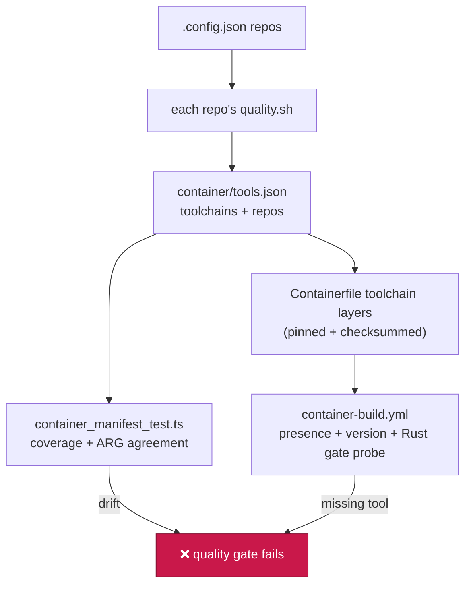

## Headless Chromium — the browser is in the image

The worker captures PR evidence through the Playwright MCP server, and a
contained worker has no host browser and no desktop session to borrow. So the
image bakes Chromium at build time: `container/Containerfile`
installs the checksum-verified `playwright-core` tarball, downloads the
Chromium zip Playwright would have fetched, verifies it against the
committed `chromium_amd64` / `chromium_arm64` digest (Issue #274), extracts
it into `PLAYWRIGHT_BROWSERS_PATH` (`/opt/playwright-browsers`), then runs
`playwright-core install --with-deps chromium` so apt still installs the
system-library set. The tree is made readable to the non-root `vibe` user,
and the build launches the browser once so a missing system library fails
the build rather than the first screenshot. Apt packages stay unpinned —
Debian's signed repos on the digest-pinned trixie base are the accepted
trust root for those libraries.

**The Playwright version is not a free choice.** Playwright resolves browsers
as `chromium-<revision>` and every release pins its own revision, so the image
must bake exactly the version `@playwright/mcp` depends on — a near-miss bakes
a browser the MCP server ignores and then downloads the right one mid-run.
`container/tools.json` and `PLAYWRIGHT_INSTALLER_VERSION` in
`worker/deno/setup/screenshot.ts` therefore carry the same value, and
`container_manifest_test.ts` fails the gate when they drift.

`generateMcpConfig()` points the server at the baked browser and sends the
browser profile somewhere disposable:

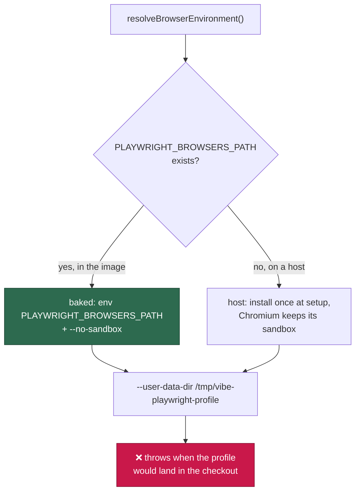

- **Nothing downloads a browser at run time.** `setupPlaywrightMcp()` skips the
  installer entirely when the image supplies one, and `container-build.yml`
  proves it by running the navigate-and-screenshot smoke test with
  `--network none`: a browser fetch there would fail outright.
- **Profile state is disposable.** `--user-data-dir` points at
  `/tmp/vibe-playwright-profile` — the launcher mounts `/tmp` as a `tmpfs`, so
  the profile dies with the container. Generating a config whose profile
  directory sits inside the mounted checkout throws rather than writing browser
  state into the repository. `VIBE_BROWSER_PROFILE_DIR` overrides the location.
- **`--no-sandbox` only inside the image.** Chromium's own sandbox needs user
  namespaces the container runtime may not grant, and the container boundary is
  the isolation that matters there. On a host with no baked browser the sandbox
  stays on.
- **The secrets denylist is unchanged.** `--deny-env` still hides the worker's
  tokens and keys from the MCP process, and the npm registry age
  gate still guards the pinned specifiers.
- **The server is handed to the agent only on a run that needs a browser**
  (Issue #192). Browser and outbound-network capability is granted on an
  explicit need signal — `RunClaudeOptions.mcpConfig: true` — not by the mere
  presence of a working directory, so a prompt-injected agent working a
  backend issue has no browser tool to be steered into. Both issue-work paths
  — the main fleet loop (`phases/execute_phase.ts`) and the standalone
  `execute-claude-phase` command — set the signal from the same
  `screenshotRequired` detection that injects the screenshot instructions (the
  `needs-screenshot` label, or a repo configured with `requiresScreenshots`);
  planning, PR feedback, CI-fix and grill-me runs get no browser. A UI change
  in a repo that declared neither still self-heals through the existing
  round trip: the evidence gate blocks the PR, labels the issue
  `needs-screenshot`, and the retry is granted the browser — set
  `requires_screenshots: true` on a UI repo to skip that first round trip.
  When the signal is set the worker generates this configuration per
  clone into `${WORK_DIR}/.vibe-cache/mcp/` and passes it as `--mcp-config` on
  that Claude invocation — it does not depend on a `.mcp.json` in a directory
  the agent never runs from. The server is told `--browser chromium` (its
  default `chrome` channel is Google Chrome, which the image does not ship),
  and its `--output-dir` is scratch beside the browser profile
  (`/tmp/vibe-playwright-output`) because every `browser_navigate` writes an
  accessibility snapshot there; screenshots named explicitly
  (`filename: docs/evidence/<name>.png`) resolve against the clone and land
  where the evidence gate and the PR expect them. `container-build.yml`
  drives the generated server end to end (initialize → navigate → screenshot
  → PNG on disk), so a channel or version drift fails the build.
- **The prompts say so too.** The coding-guidelines template (from v37 onward)
  tells the agent it runs unattended in a sandboxed container with no host
  browser or desktop, mandates this headless browser for every browser task, and
  forbids asking an operator to open a browser or click a UI — an agent that
  assumes a host browser stalls waiting for a human who is not there.

## How the pins stay honest

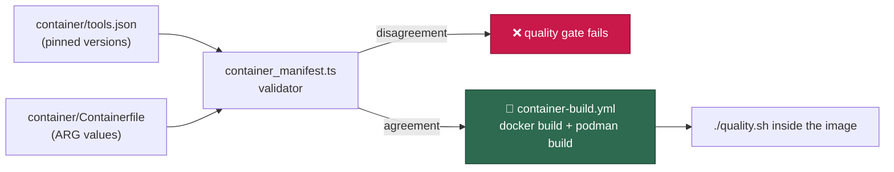

`worker/deno/tests/container_manifest_test.ts` parses the committed manifest
and Containerfile on every quality-gate run, so a version bumped in one file
and not the other fails locally and in CI. The CI workflow then builds the
image with both Docker and Podman and runs `./quality.sh` inside it.

## Image identity — the tag is the definition's hash

The image reference is derived from the container definition itself, so a
changed definition is a different image and nobody has to remember to bump a
version by hand:

```bash
deno run --allow-env --allow-read worker/deno/mod.ts container-image-hash
# vibe-coder:941c9bfe80fa
```

The hash covers an **explicitly enumerated** input list — never a walk of the
workspace, because the worker's checkout is mutable working state and hashing
it would invalidate the image on every commit:

| Input                     | Why it is in the hash                       |
| ------------------------- | ------------------------------------------- |
| `container/Containerfile` | The build instructions themselves            |
| `container/entrypoint.sh` | Baked into the image at `/usr/local/bin`     |
| `container/tools.json`    | The pinned versions the build must agree with |
| `container/install-*.sh`  | The provider and tool installers the build runs |
| `container/providers/*.sh` | The coding-agent provider layer the build installs |
| `container/install-tools.sh` | The installer the build runs over the deployer's tool selection |
| `worker/deno/deno.lock`   | The dependency set the image caches          |
| `container_tools` (`.config.json`) | The extra tools this deployment bakes in |

The last one is not a committed file. `container_tools` is the deployment's own
selection (see
[Deployer-supplied build-time tools](CONTAINER-IMAGE.md#deployer-supplied-build-time-tools)),
and the
build bakes it into the image, so two hosts that select different tool sets
must get different tags — otherwise one host's cached `vibe-coder:<hash>`
silently satisfies the other's requirement and the tool is quietly missing. It
is mixed in as a canonical, key-sorted serialisation of the **validated** spec,
so re-ordering keys in `.config.json` does not churn the tag while any change
of id, version, URL or checksum does. A deployment that selects no tools gets
exactly the tag it got before the selection existed, so no existing host
rebuilds. A malformed spec exits non-zero naming the offending field rather
than falling back to a tools-free tag.

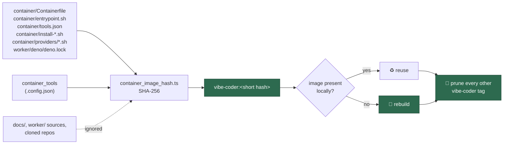

`worker/deno/lib/container_image_hash.ts` owns the single naming rule
(`resolveContainerImageReference`), and the `container-image-hash` command
exposes it so `run.sh` and `run.ps1` can obtain the reference without
restating the hashing logic in shell and PowerShell. Adding a setup script
under `container/` means adding it to `CONTAINER_IMAGE_INPUTS`;
`worker/deno/tests/container_image_hash_test.ts` fails the quality gate when a
committed `container/` file is not enumerated. A missing enumerated input
exits non-zero naming the path rather than hashing a shorter list and quietly
producing a different tag.

### Superseded tags are pruned, every launch

A content-derived tag rebuilds on every change to the container definition, and
nothing used to delete the tag it replaced. On an unattended host that leaks a
multi-gigabyte image per merged `container/` change: host-23 reached a 32 GB
image store with 765 MB free, and the next build died mid-export with "No space
left on device".

So once the image the launcher needs is present — whether it was just built or
was already there — both launchers run:

```bash
deno run --allow-env --allow-read --allow-run worker/deno/mod.ts \
  container-image-prune --runtime container --keep vibe-coder:941c9bfe80fa
# [container-image-prune] removed superseded image vibe-coder:0a1b2c3d4e5f
```

The reference this checkout resolves to is the only one a future launch of it
can use, so **every other `vibe-coder` tag is removed** and each removal is
named on the host log. Three boundaries keep that safe on a machine nobody is
watching:

| Boundary                | Behaviour                                                                                            |
| ----------------------- | ---------------------------------------------------------------------------------------------------- |
| Only our own image      | Same repository as the kept reference (Podman's `localhost/` prefix included) and a different tag. A foreign `vibe-coder` from a registry, a dangling `<none>` layer and every other image are untouched |
| The builder cache stays | Never pruned — it is what makes a definition-change rebuild, or a rollback, cheap                     |
| Fails loud | A refused listing, unreadable output or a refused removal exits non-zero and is logged; the launcher treats it as a warning and launches anyway, and the next launch prunes again |

`worker/deno/lib/container_image_prune.ts` owns the rule and each runtime's
listing/removal spelling lives with the rest of its dialect in
`container_runtime.ts` (`docker image rm`, `container image delete`).

### A builder that ran out of storage heals itself

Pruning stops the store filling; this is what happens when it filled anyway.
On host-23 the host dropped to 135 MiB free and `container build` died
mid-export with `no space left on device`. Freeing host space did **not** fix
it: Apple container's BuildKit builder VM had remounted its own filesystem
read-only after the ENOSPC and stayed that way, so every later launch failed
with `open /tmp/1326465203: read-only file system` before it built anything.
`loop.sh` backed off 120 s → 240 s → … → 960 s and would have retried for
ever; a human ran `container builder stop && container builder start` and the
host came back at once.

So a failed build is now classified from its own output, and only a
builder-storage failure is healed:

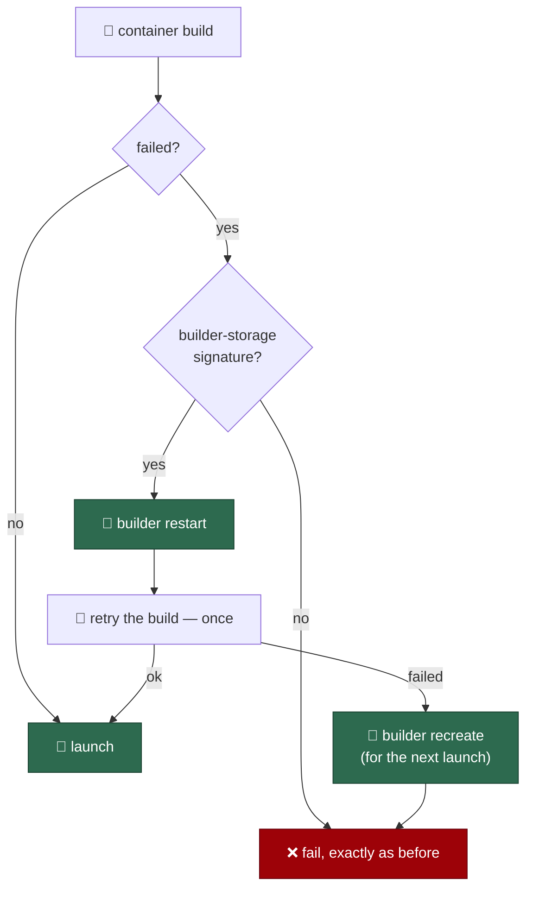

```bash
deno run --allow-env --allow-read --allow-run worker/deno/mod.ts \
  container-build-heal --runtime container --log /tmp/vibe-build.log
# [container-build-heal] the build failed on builder storage
#   (no space left on device) — performing a builder restart
```

The command's **exit status is the launcher's instruction**, so "healed" and
"not my problem" are never confused with each other:

| Status | Meaning                                       | What the launcher does        |
| ------ | --------------------------------------------- | ----------------------------- |
| `0`    | The builder was restarted                     | Retries the build exactly once |
| `3`    | The build failed for its own reasons          | Fails, exactly as it always has |
| other  | The failure was healable, the heal was not     | Fails, and says why           |

Four boundaries keep that safe on a machine nobody is watching:

| Boundary                | Behaviour                                                                                            |
| ----------------------- | ---------------------------------------------------------------------------------------------------- |
| A narrow signature list | Only `no space left on device`, `read-only file system`, `ENOSPC` and BuildKit's `ResourceExhausted` are healed. A broken `RUN` step, a missing package or a syntax error is untouched — "healing" a genuine build error is how a launcher starts looping on it |
| One retry, never a loop | Exactly one heal and one retry per launch. A second failure in the same launch escalates to a builder *recreate* (`builder delete` + `builder start`) so the **next** launch starts clean, and this launch still fails |
| Per-runtime, in one place | Apple container bounces its builder VM; Docker and Podman build in-process and prune the build cache instead. Both spellings live with the rest of the dialect in `container_runtime.ts` |
| Fails loud | An unreadable build log, an unsupported runtime or a builder that will not start exits non-zero naming the reason, and the decision is logged to `~/logs/run_core.log` |

`worker/deno/lib/container_build_heal.ts` owns the classifier and the
escalation; the runtime is driven through an injected seam, so the tests never
start a builder VM.

## Runtime detection — which runtime the launchers use

`run.sh` and `run.ps1` must resolve a supported container runtime before they
do anything else, and the rule lives in one tested module rather than twice in
two thin launchers:

```bash
OUTPUT_JSON=true deno run --allow-run --allow-env \
  worker/deno/mod.ts container-runtime-detect
# /usr/local/bin/docker
```

| Platform | Runtimes probed, in order            |
| -------- | ------------------------------------ |
| macOS    | Apple [`container`](https://github.com/apple/container) |
| Linux    | Docker, then Podman                  |
| Windows  | Docker, then Podman                  |

Two properties matter more than the list:

- **Presence is not availability.** Each candidate is validated with a cheap
  read-only probe — `container system status` (which health-checks the API
  server), `docker version` and `podman version` (which contact the daemon). A
  binary on `PATH` whose daemon is unreachable, or whose probe does not answer
  within 15 seconds, is reported unavailable rather than selected.
- **Detection never falls back to the host.** In container mode the outcome is
  either a descriptor naming a container runtime or a non-zero exit whose
  message names the platform, every runtime probed with the reason it was
  rejected, and how to install one. There is no host mode
  (Issue #4), so nothing here can select one because a runtime is absent.

**The runtime is not a manual-only checklist**. Run
`./setup.sh` in a terminal and the same probe drives an offer to fix what it
found, with the exact commands shown before they run:

| Platform | Absent binary | Present but not answering |
| -------- | ------------- | ------------------------- |
| macOS | `brew install container` then `container system start` | `container system start` |
| Linux | `sudo apt-get install -y docker.io`, or `sudo apt-get install -y podman` when Docker is declined | `sudo systemctl start docker` / `podman machine start` |
| Windows | — | — |

The offer needs a package manager the plan table knows (Homebrew or apt) and a
terminal — or the explicit `--auto-install` flag (Issue #33), which consents to
every offer in advance so a scripted setup run installs the runtime with no
terminal to prompt on. Without either, nothing runs, the manual instructions
above stand, and the report says the offer was withheld and why.
The runtime is re-probed in the same setup run, so a step that exits zero while
the runtime still cannot answer keeps the check failed. See
Deployment for the full
flow and the `VIBE_NO_AUTO_INSTALL` escape hatch.

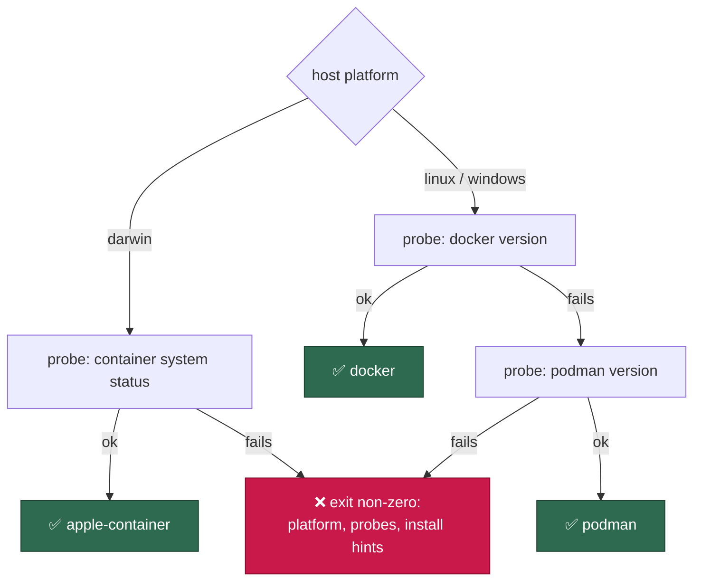

The command reports the executable on stdout and, with `OUTPUT_JSON=true`, the
whole descriptor: `kind`, `executable`, `probed`, and the `dialect` the
launchers need — `mountFlag`, `readOnlyMountSuffix`, the image-inspect
sub-command (`image inspect` for Docker/Podman, `images inspect` for Apple
`container`), and whether `--userns`, `--security-opt`, `--cap-drop` and
`--tmpfs` are understood (Apple `container` supports none of them: each
container is already its own lightweight VM). Passing
`--platform <darwin|linux|windows>` resolves for another platform, and
`worker/deno/lib/container_runtime.ts` takes both the platform and the probe as
parameters, so `worker/deno/tests/container_runtime_test.ts` exercises every
branch on a host with none of the runtimes installed.

## Per-launch caches — nothing is re-downloaded each cycle

The container is replaced every cycle (`--rm`), which used to throw away the
Deno module/emit cache and re-fetch plus re-type-check the entire worker
graph on every launch, and to read the worker's ~1,500-file module graph
over the virtiofs `/workspace` mount. The entrypoint now:

- points `DENO_DIR` at `~/auto-issue-work/.deno-cache` on the durable
  `vibe-work` volume, so every launch after the first is a warm start.
  Override with `VIBE_DENO_CACHE_DIR`; the `deno-cache-guard` housekeeping
  step wipes the cache when it exceeds `DENO_CACHE_MAX_BYTES` (default
  2 GiB — a cold start is the only cost of losing it);
- stages `worker/deno` into VM-local storage (`${VIBE_SCRATCH_DIR}/worker-src`
  — the per-launch scratch root, see
  [Containment → the writable-path rule](CONTAINMENT.md#the-writable-path-rule))
  and runs the driver from there, so module reads stop crossing virtiofs. The
  mounted checkout stays the source of truth (`--base-dir` still points at
  it), and any staging failure falls back loudly to the previous behaviour.

## The work volume has two tiers (Issue #242)

Not everything on the `vibe-work` volume is a repository the worker is
responsible for. A monitored repo's `quality.sh` or bench scripts clone
sibling **data** repos as `../<name>`, and on GRQ-23 those siblings
(`GRQ-shareprices2026Q2` 7.3 GB, `GRQ-listing` 3.9 GB, `GRQ-companyreports`
2.1 GB, …) were ~15 GB of the 43 directories in the work root, while the 15
monitored clones the worker actually wants to keep warm were a couple of GB.
The work root is therefore tiered, from the monitored list the worker
already has:

- **Tier 1 — monitored repos.** Persistent. Never removed by either path
  below, so a large clone is not re-downloaded every cycle; the build output
  and caches *inside* them stay bounded by the `work-volume-prune` step.
- **Tier 2 — everything else.** Disposable. Aged out by the
  `work-volume-tiers` housekeeping step after
  `WORK_VOLUME_SIDE_REPO_MAX_AGE_DAYS` idle days (default 3 — long enough
  that a nightly gate's data repo stays warm), and removed **largest first**
  the moment the host-disk monitor reports `low`, *before* the gate stops
  claiming.

**Reserved names are neither tier (Issue #337).** `logs`, the ext4
`lost+found`, and the `audit` trail (with its `audit.roster.jsonl` and
`audit.roster.seen` sidecars) are worker- or filesystem-owned state, so every
sweep — the tier reclaim, the stale-workdir scan, the worktree cleanup and
the 90%-disk `nukeWorkDir` — skips them. `audit/` carries no `.git` and sits
untouched between sweeps, so before #337 it tiered as disposable and the
worker deleted its own tamper-evident journals; `audit-chain-verify` then
reported `[SECURITY] [AUDIT_CHAIN_BROKEN]` on every swept host. A genuine
deletion is still detected — the roster beside the directory is what makes it
detectable, and it is untouched by this change.

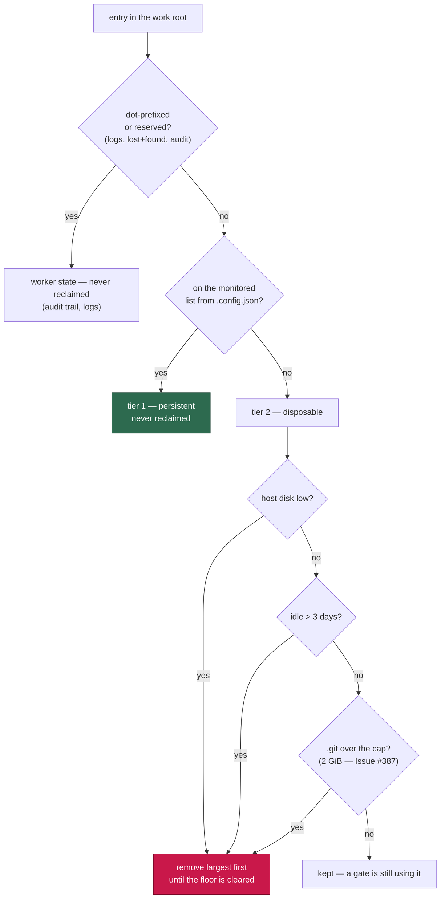

Nothing is removed while a slot is mid-execute — a gate may be reading the
clone right now — unpushed commits are pushed first with the same rescue the
stale-workdir sweep uses (a clone whose push fails is kept), and a
`.git`-less or unreadable directory goes without a rescue because it has no
commits to save. Removal is safe because the consuming scripts re-fetch on
demand: GRQ's `worker/model_fetch.sh` clones the sibling when the directory
is absent and fetches when it is present, so a removed data repo costs one
clone, not a failed gate.

Both paths log the split before anything goes, e.g.
`work volume: monitored 2.1 GB in 15 repos; side/data 15.2 GB in 8 dirs;
removed 2 (11.0 GB, disk-low)`.

### A warm clone's object store is capped too (Issue #387)

Neither path above reaches a data repo a gate refreshes **every** cycle: it is
never idle, and the disk-low reclaim only fires once the host is already below
the floor. That is how `side/data` climbed 0.7 GB → 10.8 GB in one afternoon
on an otherwise idle GRQ-23 — one directory, roughly 0.2 GB per cycle. The
writer is the refresh itself: `GRQ/quality.sh` → `worker/repos.sh` →
`model_fetch.sh` running `git fetch` + `git reset --hard origin/Develop` in
`GRQ-shareprices2026Q2`.

The refresh is legitimate; what it leaves behind is not. In a **blobless**
partial clone the hard reset lazily backfills a whole tree of blobs into a new
`.promisor` pack, and git never prunes those — `git repack` deliberately
leaves promisor packs alone, so `git gc --prune=now` reclaims nothing.
Measured on the host: a 1.5 GB `.git` holding an 871 MB pack (24 Aug) and a
650 MB pack (25 Aug), one per refresh, on a 6.5 GB working tree.

So the age sweep also takes a tier-2 clone whose `.git` exceeds
**`WORK_VOLUME_SIDE_REPO_MAX_GIT_BYTES`** (default 2 GiB; `0` disables the
guard), warm or not — bounding the object store the way `deno-cache-guard`
bounds the Deno cache. The next gate run re-clones it blobless and backfills
one tree, which is about what a single refresh already cost, so the disk is
bounded without multiplying the download. Every existing protection still
applies: nothing goes while a slot is mid-execute, unpushed commits are
rescued first, and tier 1 is never a candidate. The removal names its reason:

```text
work volume: removed disposable GRQ-shareprices2026Q2 (7.9 GB, 0.0 days idle,
age, .git 1.5 GB over the 2.0 GB cap — blobless re-fetch ratchet (Issue #387))
```

and the summary line carries `git-ratchet: GRQ-shareprices2026Q2`.

### Side/data repo clones are blobless (Issue #243)

Reclaiming a tier-2 clone only helps if re-fetching it is cheap, and it was
not: `GRQ-shareprices2026Q2` is 7.3 GB with an 832 MB `.git` of daily data
commits, so every reclaim bought disk back at the price of a full
re-download on the next gate run — on every fleet host. The worker therefore
exports **`VIBE_SIDE_REPO_CLONE_ARGS`** (default `--filter=blob:none`) in the
bootstrap prelude, so every gate and agent it spawns inherits it:

| Value                            | Effect                                                                   |
| -------------------------------- | ------------------------------------------------------------------------ |
| unset (the default)              | `--filter=blob:none` — a **blobless partial clone**                       |
| any `git clone` options          | Used verbatim (e.g. `--filter=tree:0`, `--filter=blob:limit=1m --no-tags`) |
| empty string                     | No extra arguments — the documented way back to a full clone               |

A blobless clone keeps the **whole commit history**, so `git log`, `git
blame` and pulls all behave; only file contents are fetched lazily, which for
a data repo checked out at one revision is roughly its working tree rather
than every blob ever committed. A `--depth` shallow clone is smaller still
but breaks history-based tooling, which is why blobless — not shallow — is
the fleet default.

A monitored repository adopts it in the script that clones the sibling:

```bash
# git clone ${VIBE_SIDE_REPO_CLONE_ARGS:-} — unset means a plain clone, so the
# script still works outside the worker.
CLONE_ARGS=(${VIBE_SIDE_REPO_CLONE_ARGS:-})
git clone ${CLONE_ARGS[@]+"${CLONE_ARGS[@]}"} "git@github.com:org/${REPO}.git"
```

Two boundaries hold:

- **New clones only.** A partial clone already on disk is left exactly as it
  is — nothing re-clones a checkout to shrink it, because that costs the very
  download the filter exists to avoid.
- **An override is validated, never mangled.** The value is word-split
  unquoted by adopting scripts, so a token that is not a plain `git clone`
  option (shell metacharacters, a bare word) is refused loudly in
  `run_core.log` and the blobless default stands.

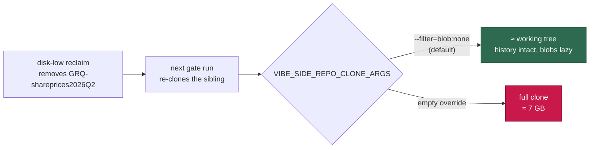

## The volume image only grows — the launch-time trim (Issue #384)

Reclaiming inside the guest does not give the **host** its disk back. A named
volume is a thin-provisioned disk image (`volumes/vibe-work/volume.img`):
blocks are allocated to it when the guest writes and are never returned when
the guest deletes. The guest filesystem marks them free; the image keeps
them. GRQ-23 had 36.5 GB allocated on the host for ~13 GB of real content,
and every guest-side sweep — the tier reclaim above, the 90 %-disk
`nukeWorkDir` — returned exactly **zero** bytes to the host:

```text
[HOST_DISK_LOW] reclaimed 0 bytes … host 6.5 GB free (1.4%) of 460.4 GB,
floor 46.0 GB — below the floor
```

That ran every few minutes for days while the worker claimed nothing. Three
things make the floor reachable again:

- **`fstrim` at every launch.** `container/volume-init.sh` already runs as
  root with the volumes mounted, so it discards each block-device volume's
  unused blocks — which punches them out of the image and hands them back to
  the host. It runs on every launch, with no operator incantation. A runtime
  whose virtual disk cannot discard, or an image without `fstrim`, says so
  loudly, names the volume on stdout as `VOLUME_TRIM_REFUSED <target>` (see
  the self-heal below), and the launch still proceeds.
- **The hard free-disk floor is checked *after* the init.** Gating first made
  the floor unreachable by construction: a host below it refused the launch,
  so the volume was never trimmed, so the host never got its blocks back.
  Both launchers now create the volumes, run the init, and only then measure
  the floor.
- **The host estimate tracks the volume's high-water mark, not its current
  size.** `estimateHostFree` used the current reading, so a guest-side sweep
  that deleted 18 GB raised the estimate by 18 GB the host never received and
  reported `healed`. The estimate now only ever falls within a run, and the
  gap below the peak is named for what it is — dead space inside the image
  the launch-time trim returns.

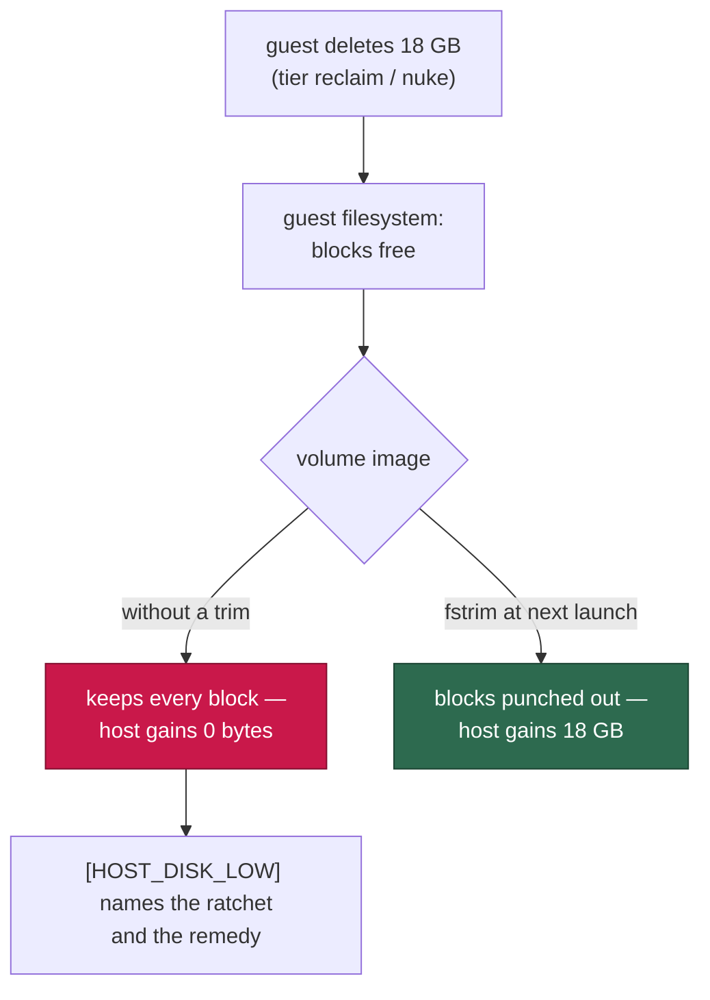

The disk-low alarm says which of the two it is, rather than reading as a
cleanup that failed:

```text
[HOST_DISK_LOW] reclaimed 11811160064 bytes of disposable space INSIDE the
work volume — monitored 2.9 GB in 9 repos; side/data 10.8 GB in 1 dirs;
removed 1 (11.0 GB, disk-low) — 11.0 GB freed inside the guest, 0 bytes
returned to the host: the vibe-work volume image only grows — 23.5 GB of the
image is now space the guest has already freed. Nothing the guest does
returns those blocks: the launcher trims the volume at the next launch and,
where the runtime refuses the discard, recreates the volume itself while the
host is below its claiming floor — the clones re-clone and the approval
snapshots re-baseline. A recreate that does not clear the floor is logged as
[WORK_VOLUME_UNRECOVERED] (Issues #384, #478)
```

## When the runtime refuses the trim — the launcher self-heals (Issue #478)

On the Apple `container` runtime the trim above has **never** worked. As
root, on a device that advertises discard
(`/sys/block/vdc/queue/discard_max_bytes` = 549755813888), the ioctl is
refused outright:

```text
$ container exec --user root vibe-coder-26896 fstrim -v /home/vibe/auto-issue-work
fstrim: /home/vibe/auto-issue-work: FITRIM ioctl failed: Operation not permitted
```

So GRQ-23 carried a 26 GB volume image for 12.1 GB of live data, sat below
its floor for three days claiming nothing out of 43 claimable issues, and the
only remedy on offer — `container volume delete vibe-work` — was addressed to
a human who was not there. An unattended host has no human, so the launcher
takes it:

1. **The refusal is a fact, not a warning.** `volume-init.sh` prints
   `VOLUME_TRIM_REFUSED <target>` on stdout; `run.sh` maps each target back to
   its named volume and records the refusal in `run_core.log`. A launch where
   FITRIM was refused is never recorded as a successful trim.
2. **A host below its claiming floor is healed.** When the refusal coincides
   with less free space than the floor the worker stops claiming at — the
   larger of `VIBE_HOST_DISK_LOW_FLOOR_GB` (20) and
   `VIBE_HOST_DISK_LOW_FLOOR_PERCENT` (10 %), the same floor
   `worker/deno/lib/host_disk.ts` applies — the launcher deletes and recreates
   the volume, then runs the init again to re-own it. This happens **before
   any container starts**, so no work is in flight: the clones re-clone and
   the approval snapshots re-baseline.
3. **The attempt is bounded and never silent.** At most one recreate per
   `VIBE_WORK_VOLUME_HEAL_INTERVAL_HOURS` (24), recorded in
   `~/.vibe-coder/work-volume-heal`; volumes holding less than
   `VIBE_WORK_VOLUME_HEAL_MIN_GB` (1 GB) in the store are never destroyed,
   because the host's missing space is elsewhere. Free space is **re-measured**
   after the recreate: a heal that did not clear the floor is reported as
   `[WORK_VOLUME_UNRECOVERED]` on stderr and in `run_core.log`, never as a fix.
4. **The launch still proceeds.** Only the hard floor refuses a launch — a
   host that cannot claim must still run and report, or it vanishes from the
   fleet board (Issue #477).

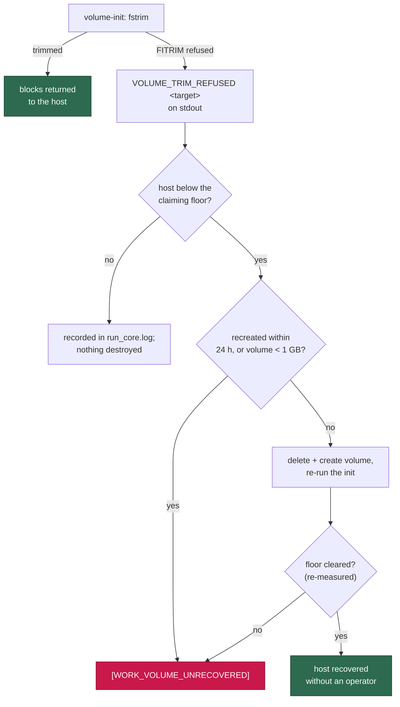

## Standing totals at cycle start and end of run (Issues #244, #345)

Those lines say what was *removed*. Every disk problem on GRQ-23 was
invisible until the host hit 95 % because nothing said what the volume still
*held*: the launcher's `container-store:` line was the only per-launch
signal, and the host-disk monitor reports free space, not where it went. The
worker therefore logs the standing totals by category at cycle start, beside
the `Concurrency:` line, and again in the `work-volume-prune` housekeeping
summary:

```text
Work volume: total 18.4 GB — monitored repos 2.1 GB (15) · side/data clones
15.2 GB (8: GRQ-shareprices2026Q2 7.3, GRQ-listing 3.9, GRQ-companyreports
2.1, …) · build artefacts 6.3 GB (4 target dirs: GRQ-23/target 3.1, …) ·
caches 0.6 GB · other 0.2 GB
```

- The four **disjoint** buckets — monitored repos, side/data clones, worker
  caches (`.deno-cache`, `.vibe-cache`, `.gh-*-cache`, `.claude-*`) and
  other (reserved names, remaining state directories and the state files in
  the work root) — sum to the total.
- **Build artefacts are a cross-cut, not a fifth bucket.** A `target/` dir
  (the same discovery `work-volume-prune` uses) lives *inside* a clone, so
  its bytes are already counted there; naming it says which clone the space
  is in.
- The top three side/data clones and artefact dirs are **named inline**, so
  the log line alone says where the space went.
- The walk is **depth-1 and bounded**: one `du -sk` per top-level directory
  under a single 120 s budget. Over budget it stops and the line says how
  many directories it measured and how many it skipped — an incomplete total
  is reported as a floor, never as a clean reading. A directory `du` could
  not size is named as `unmeasured (counted as 0)` — the filesystem's own
  root-only `lost+found` lands here, so a permanent permission denial never
  drowns out a real fault; a work root that cannot be read **at all** is
  reported as an error on the same line rather than as an empty volume.
- `work-volume-prune` prints the breakdown **before** its sweep, and again
  **after** when it actually removed something, so a reclamation's
  before/after is visible. An idle prune pays for one walk, not two.

Without a monitored list the totals are **refused**, not guessed — every
clone would otherwise read as side/data — and the line says so.

### A blind probe is `unknown`, never `0.0 GB` (Issue #345)

GRQ-23 crashed out of disk on 2026-08-21 with both of its disk signals blind
and both advertised as `available`. The cause was one word in each probe:
`duBytes` and `probeDiskReading` asked `runWithTimeout` for `quiet: true`,
which sets `stdout: "null"` and returns an empty string — and stdout *is* the
reading. `df` therefore answered "unreadable" (the known #226 symptom) while
`du` answered a confident `0` for every directory, so the standing totals
read `total 0.0 GB` beside a count of twelve clones and five `target/` dirs,
every cycle, for days. Nothing echoes stdout either way, so `quiet` bought
nothing and cost both signals.

Four boundaries hold now:

- **Zero is not a measurement.** Empty or non-numeric `du` output is
  `unmeasured` (null), never 0 bytes. A walk that measured N > 0 directories
  and still totals 0 — or that could not read the work root, or ran out of
  budget before measuring anything — is reported as `Work volume: unknown —
  <why>`, exactly as the `df` path already reports itself. A **genuinely
  empty** work root still reads as a clean `0.0 GB`: that is a measurement,
  and it is right.
- **A probe that cannot produce a value is `degraded`.** `Feature host-disk`
  is `available` only on an `ok` reading (an `unknown` one is degraded), and
  `Feature work-volume` only when the volume has surfaced no I/O fault
  **and** its standing totals are measurable.
- **Both signals blind marks the host unhealthy.** One blind signal is named
  on the fleet-health payload; losing both is a health condition in its own
  right — the iteration logs `[DISK_TELEMETRY_BLIND]` once, the host reports
  unhealthy, and the payload says *which* host lost its disk telemetry. It
  gates nothing: a monitoring fault must not stop the fleet working.
- **Measure where the bytes are.** The cycle-start walk lands ~2 minutes in,
  before the clones a cycle creates exist, so it is sampled **again at end of
  run** — when the volume is at its fullest — as `Work volume (end of run):`.
  The walk is cadence-bounded (one per 5 minutes) and the end-of-run sample
  forces a fresh reading, so the two lines are never the same measurement
  printed twice.

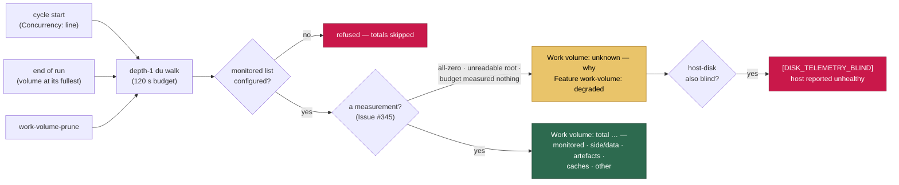

## The launcher — `run.sh` is the containment boundary

`run.sh` is a thin, trusted, host-side launcher. It asks the
`container-launch-plan` command what to run and then runs exactly that, so
every containment decision lives in one auditable Deno module
([`container_launch.ts`](../worker/deno/lib/container_launch.ts)) instead of
being restated in shell — code running *inside* the container cannot broaden
its own mounts or capabilities by editing the launcher.

It resolves the run mode first so that a configuration naming a
removed mode fails loud in one place (Issue #4), then updates the worker
checkout host-side (Issue #512) — `worker-checkout-update` fetches `origin`
and resets the checkout to `origin/<default-branch>`, so the container never
has to write to `/workspace` to update itself — and then builds the launch
plan below. A failed update warns and the launch continues on the existing
checkout; `VIBE_SKIP_CHECKOUT_UPDATE` turns the step off for a development
checkout or a CI tree. There is no other branch: the worker runs in the
container or not at all.

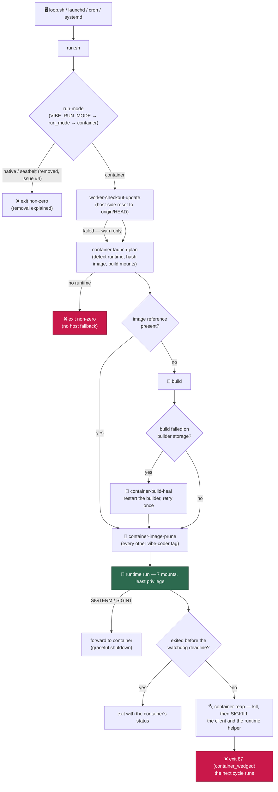

### The mount set

| Source (host path or named volume) | In container                   | Mode |
| ---------------------------- | ------------------------------------ | ---- |
| the worker checkout          | `/workspace`                         | rw   |
| volume `vibe-work`           | `/home/vibe/auto-issue-work`         | rw   |
| volume `vibe-approval-state` | `…/auto-issue-work-approval-state`   | rw   |
| the worker log directory     | `/home/vibe/logs`                    | rw   |
| `.config.json`               | `/workspace/.config.json`            | ro   |
| `…/credentials/gh`           | `/home/vibe/.vibe-coder/credentials/gh` | ro |
| `…/credentials/<provider>`   | `/home/vibe/.vibe-coder/credentials/<provider>` | ro |

One credential mount per **enabled** provider, so a
multi-provider run carries three of them and a default run exactly one.

The checkout is the worker's own code, not host data: the image ships only the
entrypoint, so without it there is no driver to run and no tree for the
bootstrap to self-update. The rest is the persistent state: named volumes
for the workspace and the approval snapshots (no browsable copy of the
worker's repositories on the host, and no host `~/auto-issue-work`), host
directories for the logs and configuration. Their in-container paths are
deliberately the ones the worker resolves for itself from `HOME` — no
environment plumbing points it at them.
`.config.json` is layered read-only over the checkout, so the worker cannot
rewrite its own configuration from inside the container.

Credentials are exposed **per sub-directory**, not wholesale: the worker's own `gh` material and each *enabled* provider's,
and nothing else that happens to sit beside them. The sub-directory names come
from the provider descriptors, so which credential directories are mounted
follows the enabled set without touching the mount construction. A provider
that is not enabled has no mount at all — its secret cannot be read from
inside the container, which is what lets one run authenticate several vendors
without either seeing the other's key.

Building a plan **fails loud** rather than emitting a broadened one when a
mount source is the host home directory (or an ancestor of it), a
container-runtime control socket, a relative path, or a path carrying
characters the launcher's NUL framing could not pass. The finished argument
list is re-checked for `--privileged`, `--cap-add`, `--device`, published
ports and host namespaces before it is returned.

### VM sizing — generous by default, tunable per host

The launch plan sizes the VM from the host: memory is everything minus an
8 GiB reserve (8 GiB floor), and CPUs are the host's cores minus a reserve
of `4` (floor 4, never above the host's count). The CPU reserve exists
because an 8-vCPU VM on a shared 10-core laptop stalled wholesale under
host bursts; a dedicated fleet host has nothing to defend against
and should hand the VM every core:

| Env | Effect |
| --- | --- |
| `VIBE_CONTAINER_MEMORY` | Verbatim `--memory` (e.g. `24g`) |
| `VIBE_CONTAINER_CPUS` | Verbatim `--cpus` |
| `VIBE_CONTAINER_CPU_RESERVE` | Cores kept back from the VM (default `4`; `0` on a dedicated host) |

The guest has no swap: a swapfile needs `CAP_SYS_ADMIN`, which the launch
plan forbids (see below), so a memory peak inside the VM is an exit-137
SIGKILL of the agent, not a slowdown. What *can* be done from inside the
boundary is bounding the blast radius: the WIP-checkpoint loop
probes `/proc/meminfo` every minute and, when available memory drops under
10 %, takes an early checkpoint with a loud warning — so a kill loses at
most the last minute, and the warning tells you the VM needs more memory
(or the host needs its batch jobs deprioritised: `taskpolicy -c background`
/ `nice` for anything sharing the machine).

### Least privilege and lifecycle

- No `--privileged`, no host networking, no published ports — outbound only,
  on the runtime's bridge network.
- `--cap-drop ALL` and `--security-opt no-new-privileges` where the runtime
  understands them, and a writable `tmpfs` for `/tmp` so the container root
  filesystem stays disposable. `--rm` removes the container on exit.
- The image is rebuilt only when its content-derived reference is absent
  locally (`image inspect` / `images inspect`).
- `SIGTERM` and `SIGINT` are forwarded to the container so the Deno driver's
  graceful-shutdown handling still runs, and `run.sh` exits with the
  container's exit status so the outer supervisor sees real failures.
- No supported runtime is a non-zero exit carrying the detection module's
  message. There is no fallback to running the worker on the host.
- The wait on the runtime client is **bounded** by the plan's `watchdog`
  deadline — see
  [Resilience & Concurrency](workflows/resilience-and-concurrency.md#-wedged-container-watchdog).
  A container that outlives it is reaped and the launcher exits `87`, so a
  wedged VM costs one cycle instead of blocking the supervisor indefinitely.

`worker/deno/tests/run_sh_launcher_test.ts` runs the real `run.sh` against a
recording stub in place of the runtime executable and asserts on the
invocation it constructs, so a future edit that broadens the container's
privileges fails in the `Validate Scripts` workflow.

### Containment is tested from inside the container

Those tests assert on *arguments*. `container_containment_test.ts`
asserts on *reachability*: it starts the real container from a real launch
plan and asks the container itself what it can get at. A launcher or
image change that exposes a prohibited host path, a container-runtime socket,
or the host home directory fails the `Container Build` workflow rather than
surfacing after deployment — the boundary showed cannot be enforced by
prompts or application policy.

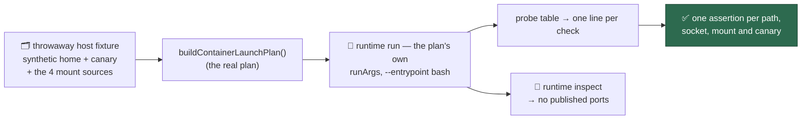

- **Prohibited locations** — `~/Documents`, `~/Desktop`, `~/Pictures`, the
  operator's `~/.ssh`, the macOS `~/Library` (Keychain material included), and
  the host filesystem above the mounts, each probed under its own identifier
  so a failure names exactly what became reachable.
- **Runtime sockets** — the Docker, Podman (including rootless) and Apple
  `container` control-socket paths must not merely be unreadable; they must
  not exist inside the container at all.
- **The intended mounts** — the work and log directories are written to and
  the writes are checked back on the host; `.config.json` and each credential
  sub-directory are read *and* a write is attempted, which must fail.
- **The host home** — a canary file planted outside every mount is searched
  for across the image filesystem and every mount, and must not be found. The
  search is bounded and a timeout is reported as a timeout, never as a pass.
- **No inbound ports** — asked of the runtime (`inspect`) for the running
  container, not inferred from the launcher's arguments.

Only the *process* is substituted: the plan's own `runArgs` are executed with
`--entrypoint bash`, so every mount and privilege flag under test is the one
the launcher produced. Nothing of the operator's is touched — the fixture is a
synthetic home under a temporary directory.

The tests skip, naming the reason, when no supported runtime answers its probe
or the image is not present locally (they never build it — that is the
launcher's job). `.github/workflows/container-build.yml` sets
`VIBE_CONTAINMENT_REQUIRED=1`, which turns that skip into a failure, so the
suite cannot end up silently skipped everywhere. Point them at an existing
image with `VIBE_CONTAINMENT_IMAGE`.

## The coding-agent provider layer

The coding agent is a **separable layer**, so Codex can be added
without redesigning containment. One module —
[`worker/deno/lib/agent_provider.ts`](../worker/deno/lib/agent_provider.ts) —
describes a provider as data, and the worker resolves everything provider-
specific through it:

| The descriptor defines | Consumed by |
| ---------------------- | ----------- |
| provider id            | `.config.json` `agent_provider` / `agent_providers`, `VIBE_AGENT_PROVIDER` / `VIBE_AGENT_PROVIDERS` |
| binary                 | `claude_runner.ts` (the spawned executable, the dependency check) |
| credential sub-directory, file and variables | `credential_preflight.ts`, and the launcher's credential mounts |
| child environment (allowlist / denylist) | the agent subprocess |
| invocation (the CLI argument list) | `claude_runner.ts` |
| installation fragment  | `container/providers/<id>.sh`, one per id in the `AGENT_PROVIDERS` build set |

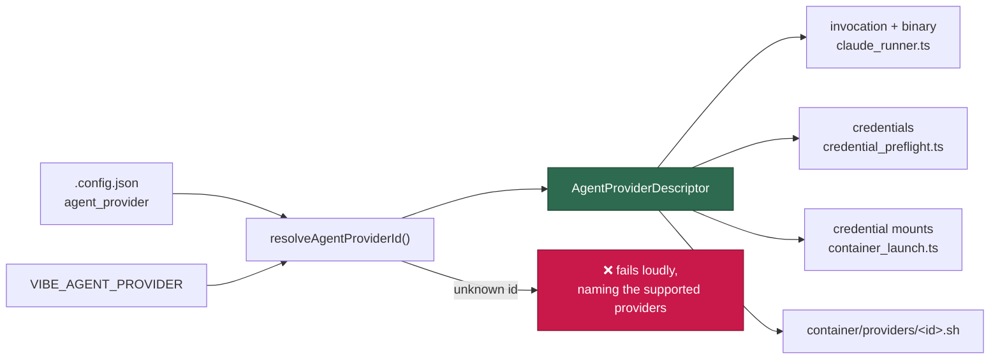

The **enabled set** — which providers are provisioned, preflighted and
mounted for a run — is `VIBE_AGENT_PROVIDERS` (comma-separated), then the
`.config.json` `agent_providers` key, then the active provider alone, so a
deployment that configures neither is unchanged. A set that
excludes the active provider fails loudly: its agent would have no credential
mounted.

Selection of the *active* provider is `VIBE_AGENT_PROVIDER` (a per-run
override), then the `.config.json` `agent_provider` key, then Claude. An id that is set but not
registered fails loudly at startup with the supported ids named — it never
falls back to the default, which would run the wrong agent under an explicit
selection.

### Per-invocation selection

Selection above is process-wide — it answers "which agent does this run use?".
Quorum needs a different question answered: "which agent does *this call*
use?", with two planners and a judge live in one worker process. So an
invocation may **name** its provider:

- `runClaudeWithTimeout` / `runClaudeWithRetry` take `agentProvider` (a
  registered id or a descriptor) on `RunClaudeOptions`;
- `runExecuteClaudePhase` takes the same `agentProvider` option and forwards
  it;
- `selectAgentProvider(selector?)` in `agent_provider.ts` is the one resolution
  point: with no argument it is `activeAgentProvider()`, so **omitting it
  reproduces today's behaviour exactly**.

Naming a provider changes nothing process-wide — not `agent_provider`, not
`VIBE_AGENT_PROVIDER`. The descriptor is resolved **once per call** and held as
a local for the whole invocation, so the binary, the argument list and the
child environment cannot be changed mid-run by a concurrent call naming
another provider.

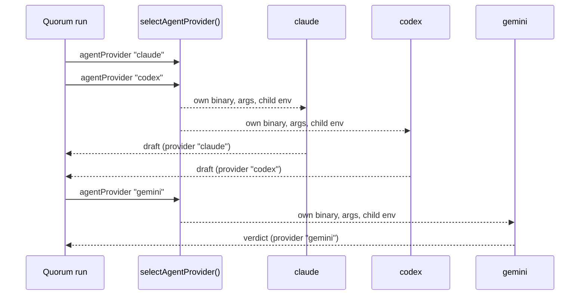

Every result is attributed to the agent that produced it: the run result and
its `runStats` carry a `provider` id, the credit-log entry records `provider`,
and the runner's log lines name the provider's display name. Naming a provider
the running image did not install fails loudly at the call, listing what the
image did install — it never falls back to the default.

Model and effort routing stays **per provider**. Claude applies the per-phase
`buildClaudeModelArgs` / `buildClaudeEffortArgs` chain; Codex carries effort in
its own `-c model_reasoning_effort=…` syntax; Gemini has no reasoning-effort
option and drops the request rather than emitting a flag its CLI would reject.

Adding a provider is: a descriptor in `agent_provider.ts`, a
`container/providers/<id>.sh` fragment, and a `providers` entry in
`container/tools.json`. The base Containerfile, the launcher's mount
construction and the containment boundary do not change.

### Registered providers

| id       | binary   | fragment | credential variables               | notes |
| -------- | -------- | -------- | ---------------------------------- | ----- |
| `claude` | `claude` | `container/providers/claude.sh` | `ANTHROPIC_API_KEY`, `ANTHROPIC_AUTH_TOKEN`, `CLAUDE_CODE_OAUTH_TOKEN` | The default; installed by a default image build |
| `codex` | `codex` | `container/providers/codex.sh` | `OPENAI_API_KEY`, `CODEX_API_KEY` | Pinned and selectable; add it to `AGENT_PROVIDERS` to install it |
| `gemini` | `gemini` | `container/providers/gemini.sh` | `GEMINI_API_KEY`, `GOOGLE_API_KEY` | Quorum's judge; pinned and selectable, add it to `AGENT_PROVIDERS` to install it |
| `deepseek` | `deepseek` | `container/providers/deepseek.sh` | `DEEPSEEK_API_KEY` | Carried on the Claude CLI under its own command and its own pin; add it to `AGENT_PROVIDERS` to install it |

Each vendor's credential is provisioned into its own
`<credential dir>/<id>/provider.env` by `setup.sh` — the variables per vendor
are in Deployment, and the rule that no
vendor's credential reaches another vendor's subprocess is in
Quorum.

Codex was the first addition made purely through the seam. Two
Codex facts shape its descriptor, and both are handled in the Codex-owned
modules (`codex_executor.ts`, `codex_env.ts`, `codex_auth.ts`) rather than in
the registry:

- **`codex exec` takes one prompt and no `--system-prompt`.** The static system
  prompt — which is how the sandboxed-environment guidance of
  reaches the agent — is composed into that single prompt rather than dropped,
  as is any disallowed-tools list, since Codex has no per-tool disable flag.
  Session continuity across phases is `codex exec resume --last`.
- **No credential crosses vendors.** Each provider's denylist names the *other*
  vendor's credentials explicitly, so the Anthropic key cannot reach the Codex
  child (or the OpenAI key the Claude child) even if a future allowlist edit
  would otherwise let it through. `worker/deno/lib/agent_env.ts` holds the
  shared filter; each provider module holds only its three lists.

Gemini is the third, and in Quorum mode it is the **judge**
rather than a planner: it reads the two planners' candidate plans and picks a
winner. That role shapes two of its facets:

- **The verdict is parsed, not scraped.** `buildInvocation()` asks for
  `--output-format stream-json`, the CLI's structured mode. The streaming form
  is chosen over the single-object `json` because `claude_runner.ts` kills a
  child that produces no stdout for the silence timeout, so a verdict emitted
  only at the very end would risk a long judging run being killed as silent.
  As with Codex, the system prompt and any disallowed-tools list are composed
  into the one prompt the CLI takes (`agent_prompt.ts` holds that shared
  composition); the CLI has no reasoning-effort option, so an effort is not
  translated into a flag that does not exist.
- **It ships as a JavaScript bundle.** The published package declares no
  dependencies and carries the whole CLI, so one `noarch` checksum covers
  every architecture and `container/providers/gemini.sh` installs the bundle
  plus a small `node` launcher on `PATH`.

DeepSeek is the fourth pinned provider, and the only one whose artefact is not
its own: DeepSeek serves an Anthropic-compatible API, so
`container/providers/deepseek.sh` installs the **Claude Code CLI**. Two things
about that entry are deliberate and must not be "de-duplicated" away:

- **It installs `/usr/local/bin/deepseek`**, from the manifest's `binary`
  field. `claude.sh` and `deepseek.sh` both run in an image built with
  `AGENT_PROVIDERS="claude,deepseek"`, so a shared command name would mean one
  fragment silently overwriting the other. `parseContainerManifest` rejects two
  `providers[]` entries that share a `binary` for exactly that reason.
- **Its version is pinned independently of `claude`.** DeepSeek's endpoint is a
  third party tracking Anthropic's API surface, so being able to hold
  `deepseek` on a known-good CLI version while `claude` moves ahead is the
  point of the second pin.

Selecting `codex`, `gemini` or `deepseek` needs that provider's credential in
`<credential dir>/<id>/provider.env` — `setup.sh` offers every registered
provider its own variables and writes only the files it has
credentials for. DeepSeek's is the case worth stating outright: the binary is
Anthropic's, but `deepseek/provider.env` holds a **DeepSeek** key
(`DEEPSEEK_API_KEY`, provisioned from `VIBE_LAUNCHAGENT_DEEPSEEK_API_KEY`), and
Anthropic's own credentials are denied to the DeepSeek child. The default image
still installs Claude alone, so a run using another provider also needs it in
the image's `AGENT_PROVIDERS` set.

Each fragment reads its pins from `container/tools.json` with `jq`, verifies
the download against the pinned SHA-256 (per architecture, or one `noarch`
digest for an architecture-independent artefact), and installs the
binary — nothing is piped into a shell and no floating `latest` is resolved.
`findProviderInstallViolations` in
[`container_manifest.ts`](../worker/deno/lib/container_manifest.ts) fails the
quality gate when a fragment stops verifying its download, restates a version
the manifest already pins, or when the Containerfile stops installing the
manifest's provider set.

### One image, a set of providers

Quorum mode needs several agent CLIs resident in **one** container, so the
build installs a **set**: `AGENT_PROVIDERS` is a comma-separated
list of provider ids, defaulting to `container/tools.json`'s
`installedProviders` — today just `claude`, so the default image is what it
always was.

```bash
# One image carrying all four agent CLIs
docker build -f container/Containerfile \
  --build-arg AGENT_PROVIDERS="claude,codex,gemini,deepseek" \
  -t vibe-coder:quorum container/
```

`container/install-providers.sh` runs one fragment per requested id, in the
requested order, and validates the whole set before installing anything — an
empty list, an empty entry, a malformed or duplicated id, an id with no
fragment, or a fragment that fails aborts the build naming the fragments that
do exist. Nothing is half-installed and nothing is skipped
silently.

Two invariants keep the set honest:

- **The tag follows the set.** `AGENT_PROVIDERS`' default lives in the
  Containerfile and `container/install-providers.sh` is an enumerated hash
  input, so changing the set changes `vibe-coder:<hash>` instead
  of reusing a tag whose contents differ.
- **The image says what it carries.** The build stamps
  `VIBE_IMAGE_AGENT_PROVIDERS` into the image;
  `imageAgentProviderIds()` in `agent_provider.ts` reads it back and
  `resolveAgentProviderId()` fails loudly when a phase asks for a provider the
  running image did not install — rather than a "command not found" mid-run.
  With no stamp (an uncontained worker on a host) there is no image set to
  check against, and the check stands aside.

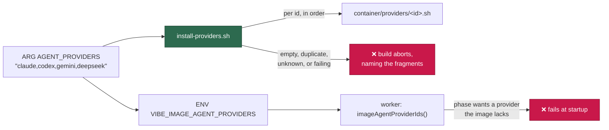

### Adding a further provider

Four providers are registered today; a further one is four files and no redesign —
neither the Containerfile nor `container/install-providers.sh` names a provider.

1. **Pin it** — add a `providers` entry to `container/tools.json`: the `id`, the
   `binary` on `PATH`, the `fragment` path, the `version`, the upstream
   `source`, and a `sha256` per architecture (or one `noarch` digest for an
   architecture-independent artefact).
2. **Install it** — add `container/providers/<id>.sh`, modelled on an existing
   fragment: read the pins from the manifest with `jq`, download, verify against
   the pinned digest, install the binary. Never pipe a downloader into a shell
   and never resolve a floating `latest` — `findProviderInstallViolations` in
   [`container_manifest.ts`](../worker/deno/lib/container_manifest.ts) fails the
   quality gate when a fragment stops verifying its download or restates a
   version the manifest already pins.
3. **Describe it to the worker** — add a descriptor to
   [`agent_provider.ts`](../worker/deno/lib/agent_provider.ts): id, display name,
   binary, credential sub-directory and variables (including the
   `VIBE_LAUNCHAGENT_*` provisioning variable `setup.sh` reads), the child
   environment allowlist/denylist — naming the *other* vendors' credential
   variables so none crosses — and the invocation the CLI takes.
4. **Build it in** — pass the new id in `AGENT_PROVIDERS`, and enable it for a
   run with `agent_providers`. Add it to `installedProviders` in the manifest
   only if a *default* image build should carry it.

The image tag follows the set, so the new provider produces a new
`vibe-coder:<hash>` rather than reusing a tag whose contents differ. A trio in
`quorum_planners` / `quorum_judge` can then name it — as `deepseek` already
does — see Quorum.

## Deployer-supplied build-time tools

The image carries the toolchains above because *this* fleet's monitored
repositories need them. A deployment whose repositories need something else —
Java and Maven are the first expected use — declares it as a top-level
`container_tools` array in `.config.json`, and the build bakes it in. The
default is an empty selection: the fleet image installs nothing extra, so a
deployment that wants nothing pays nothing.

Each entry is a **declarative archive install** — download, verify the declared
SHA-256, extract, expose `bin` directories on PATH, set `env`. There are no
install commands, no package-manager entries and no installer scripts, so a
selection cannot run arbitrary code in the build. The whole set is validated
before anything is downloaded, in two places: `parseContainerTools()`
([`container_tools_config.ts`](../worker/deno/lib/container_tools_config.ts))
rejects a malformed spec at config load, and
[`container/install-tools.sh`](../container/install-tools.sh) re-validates the
set it is handed, so a bad entry never leaves a half-installed image behind.

### The spec

| Field | Required | Meaning |
| ---------------- | ---------------------- | ------------------------------------------------------------------------------------------------- |
| `id` | yes | Lower-case letters, digits and hyphens, starting with a letter — the same rule as a provider id. Unique within the array, and the directory name under the install prefix. |
| `version` | yes | The pinned version, for the reader. Nothing resolves it: the URL and digest are what the build uses. |
| `url` | yes | Download per architecture — `amd64`, `arm64` and/or `noarch`. `https:` only. The extension decides the extractor: `.tar.gz`/`.tgz`, `.tar.xz` or `.zip`; anything else aborts rather than guessing. |
| `sha256` | yes | 64 hex characters per architecture. **Mandatory** — a `url` without a matching `sha256` (or the reverse) is rejected, because that would be an unverified download. |
| `stripComponents` | no (default `0`) | Leading path components dropped on extraction, as `tar --strip-components`. Most distributions ship one top-level directory, so `1` is usual. |
| `bin` | no (default none) | Directories, **relative to the install prefix**, prepended to PATH. `""` is the prefix root. |
| `env` | no (default none) | Environment variables set at container start, each value **relative to the install prefix**. `""` is the prefix root — that is how `JAVA_HOME` is expressed. |

A deployment that builds for one architecture may supply only that
architecture; the build resolves its own `amd64`/`arm64` and falls back to
`noarch`, and a tool with neither aborts the build naming the id.

**The install prefix is fixed at `/opt/vibe-tools/<id>`**, and every `bin` and
`env` value is relative to it. An absolute path, a `~`, or a `..` that walks
above the prefix is refused at validation, so no selection can aim PATH or
`JAVA_HOME` at an arbitrary host path — the worst a malformed spec can do is
fail the build.

At container start `container/entrypoint.sh` reads the
`/opt/vibe-tools/environment` hand-off the installer wrote, prepends each
recorded `bin` directory to PATH, exports each `env` value, and stamps the
applied ids into `VIBE_IMAGE_CONTAINER_TOOLS`. Those lines are parsed as
`KEY=value` data — never sourced, never `eval`'d — and a malformed line aborts
the container rather than executing.

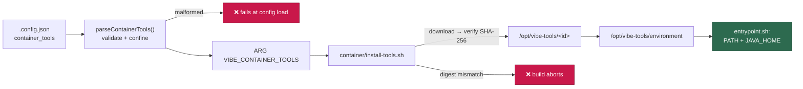

### A worked example — Java and Maven

Eclipse Temurin 25 (both architectures) and Apache Maven 3.9 (one
architecture-independent archive):

```json
{
  "container_tools": [
    {
      "id": "java",
      "version": "25.0.4+7",
      "url": {
        "amd64": "https://github.com/adoptium/temurin25-binaries/releases/download/jdk-25.0.4%2B7/OpenJDK25U-jdk_x64_linux_hotspot_25.0.4_7.tar.gz",
        "arm64": "https://github.com/adoptium/temurin25-binaries/releases/download/jdk-25.0.4%2B7/OpenJDK25U-jdk_aarch64_linux_hotspot_25.0.4_7.tar.gz"
      },
      "sha256": {
        "amd64": "e58fcdcd637b25c03ca84cbbcefc70d11efb8f4b4cbd05decc9f661769d77f94",
        "arm64": "621f7196f0b682fb557da58bec89bd7dfe5419811fe1c0ba75c9cc8432f084c7"
      },
      "stripComponents": 1,
      "bin": ["bin"],
      "env": { "JAVA_HOME": "" }
    },
    {
      "id": "maven",
      "version": "3.9.16",
      "url": {
        "noarch": "https://archive.apache.org/dist/maven/maven-3/3.9.16/binaries/apache-maven-3.9.16-bin.tar.gz"
      },
      "sha256": {
        "noarch": "80ffca22aed9e8b9713a232f3394fd81d7f20322df75efdb2b047dbd3e3a23bb"
      },
      "stripComponents": 1,
      "bin": ["bin"],
      "env": { "MAVEN_HOME": "" }
    }
  ]
}
```

Maven finds its JDK through `JAVA_HOME`, which the `java` entry sets, so the
order matters only for readability — both are applied before the worker starts.
Inside a container built from that selection:

```text
$ echo "$JAVA_HOME"
/opt/vibe-tools/java
$ java -version
openjdk version "25.0.4" 2026-07-21 LTS
OpenJDK Runtime Environment Temurin-25.0.4+7 (build 25.0.4+7-LTS)
$ mvn -version
Apache Maven 3.9.16 (2bdd9fddda4b155ebf8000e807eb73fd829a51d5)
Maven home: /opt/vibe-tools/maven
Java version: 25.0.4, vendor: Eclipse Adoptium, runtime: /opt/vibe-tools/java
```

The pins are the deployment's, not the fleet's: they are deliberately *not* in
[`container/tools.json`](../container/tools.json), which pins what every image
carries. Keep the version current the way you would any other dependency, and
observe the 24-hour quarantine in
[Coding Standards](../CODING-STANDARDS.md) — do not pin a release published in
the last day.

### Finding a published checksum for a new tool

The digest must come from the **upstream project's own published checksum**,
fetched over HTTPS — never from the copy you just downloaded, which would
verify the bytes against themselves.

- **Adoptium** publishes a SHA-256 per binary. The release page lists it, and
  the API returns it directly:

  ```bash
  curl -sS "https://api.adoptium.net/v3/assets/latest/25/hotspot?os=linux&image_type=jdk&vendor=eclipse" |
    jq -r '.[] | [.binary.architecture, .binary.package.link, .binary.package.checksum] | @tsv'
  ```

- **Apache** publishes a `.sha512` beside each artefact — not a SHA-256. Verify
  the download against the published SHA-512 first, then record the SHA-256 of
  the file you just verified:

  ```bash
  curl -fsSLO https://archive.apache.org/dist/maven/maven-3/3.9.16/binaries/apache-maven-3.9.16-bin.tar.gz
  published="$(curl -fsSL https://archive.apache.org/dist/maven/maven-3/3.9.16/binaries/apache-maven-3.9.16-bin.tar.gz.sha512)"
  echo "${published}  apache-maven-3.9.16-bin.tar.gz" | sha512sum -c -
  sha256sum apache-maven-3.9.16-bin.tar.gz
  ```

  The `sha512sum -c` must print `OK` before the `sha256sum` output is worth
  anything: unverified bytes produce a digest that pins exactly the artefact an
  attacker served you.

- Prefer a **permanent** URL over a mirror that moves. `archive.apache.org`
  keeps every release; `dlcdn.apache.org` serves only current ones, so a pin
  against it starts 404-ing when the version ages out.

### When a checksum stops matching

An upstream sometimes re-publishes an archive under the same URL — a respin, a
rebuilt tarball, a mirror serving different bytes. The build then fails at the
verify step, naming the tool:

```text
install-tools: tool "java": SHA-256 mismatch — refusing to install.
```

**That failure is the mechanism working, not a bug in it.** Nothing is
extracted, no image is produced, and the run stops before an unverified archive
reaches the image.

The fix is to update `.config.json` — **never** to relax verification. There is
no flag to skip the digest, and adding one would remove the only thing standing
between a compromised mirror and a container that runs your repositories'
builds. Instead:

1. Fetch the upstream's currently published checksum (above) and compare it
   with the digest in `.config.json`. If upstream's own published value has
   changed too, the artefact was legitimately re-published.
2. Read the upstream's release notes for that respin before you accept it. A
   changed artefact with **no** upstream announcement is a supply-chain event —
   treat it as one, and do not pin it.
3. Prefer pinning the **new version** at its own URL over accepting new bytes at
   an old one, so the change is visible in the diff.
4. Update the `sha256` (and `url`/`version`) in `.config.json` and rebuild.
   Observe the same 24-hour quarantine any other external dependency gets.

### Changing the selection needs a rebuild

The image tag is the hash of the container definition, and
`container/install-tools.sh` is one of its enumerated inputs — editing the
installer produces a new `vibe-coder:<hash>`. The **selection**, though, travels
as the `VIBE_CONTAINER_TOOLS` build argument out of `.config.json`, not as a
committed file, so editing `container_tools` alone does not yet change the tag;
folding it into the hash is Issue #73. Until it lands, force the rebuild after
a selection change — see
[Deployment](DEPLOYMENT.md#-changing-container_tools-forces-an-image-rebuild).

## Building and running locally

```bash
# Build (works with docker or podman — standard OCI instructions only)
docker build -f container/Containerfile -t vibe-coder:local container/

# Run the repository quality gate inside the image
docker run --rm \
  --user "$(id -u):$(id -g)" \
  --env HOME=/tmp/vibe --env DENO_DIR=/tmp/vibe/deno \
  --volume "$PWD:/workspace" --workdir /workspace \
  --entrypoint bash vibe-coder:local -c 'mkdir -p "$DENO_DIR" && ./quality.sh'

# Run the worker itself (the image's default entrypoint)
docker run --rm --volume "$PWD:/workspace" vibe-coder:local
```

The image's default user is `vibe` (uid 1000) — the worker never runs as root.
When the mounted checkout is owned by a different uid, run the container with
`--user "$(id -u):$(id -g)"` as above so git and the gate see matching
ownership.

`container/entrypoint.sh` does no host-specific PATH guessing: it resolves the
repository (`VIBE_BASE_DIR`, defaulting to the repository the script ships in)
and `exec`s `worker/deno/mod.ts run-entrypoint` with the same
`--frozen --lock` and permission set `run.sh` uses. A missing `deno` or a
missing worker tree exits non-zero with a named cause rather than failing
quietly.

## Bumping a pin

1. Update the version (and per-architecture SHA-256, or the image digest) in
   `container/tools.json`.
2. Mirror the same value into the matching `ARG` in
   `container/Containerfile`. Provider pins have no `ARG` to mirror — the
   fragment reads them from the manifest, and restating one there fails the
   gate.
3. Run `./quality.sh` — the manifest test fails until the two agree.

A new base image must keep supplying everything in `provides` (the manifest
test fails when a command the gate runs is no longer supplied) and must still
clear every `minVersions` floor (asserted by CI against the built image).

External tools follow the 24-hour quarantine in
[Coding Standards](../CODING-STANDARDS.md): do not pin a release published in
the last day.
