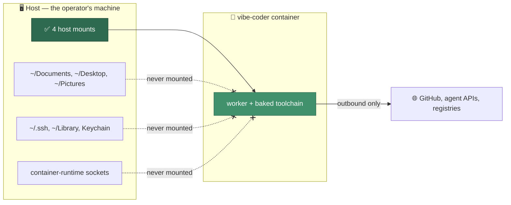
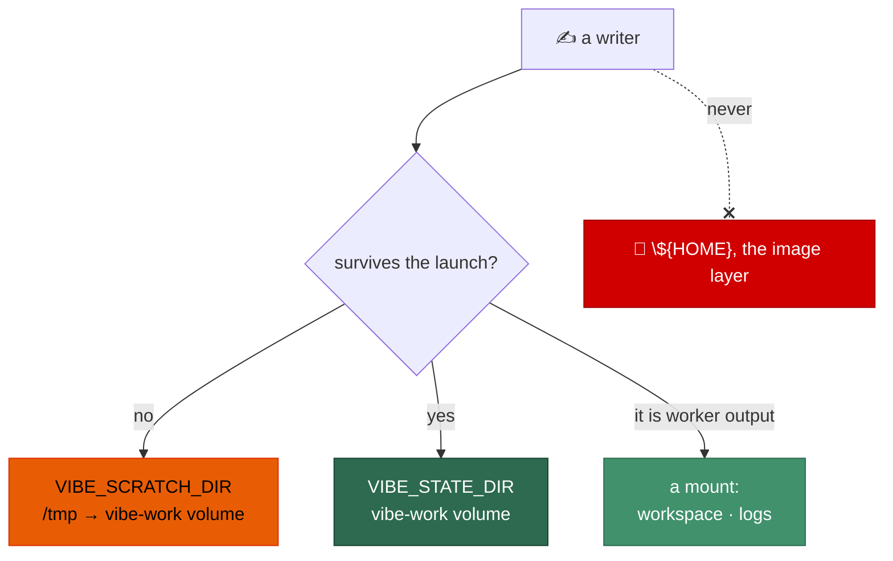
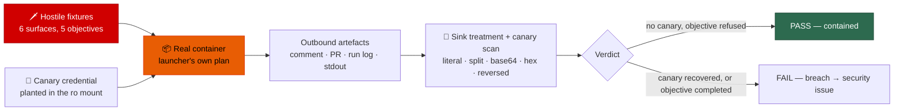

# 🔒 Containment — what the worker can and cannot reach

A Vibe Coder host is an **unattended appliance**. The worker runs inside a
container by default, and this document is the operator's
statement of that boundary: which host paths cross it, which deliberately do
not, and what the network looks like from inside.

> **Vibe Coder is allowed to control its workspace, but not the host.**

The philosophy behind the boundary is deliberately asymmetric — **generous
resources, strict boundary** (see
[Design Principles](../DESIGN-PRINCIPLES.md#generous-resources-strict-boundary)).
Inside its world the worker gets all the memory, CPU and disk it wants
 and runs as fast as the runtime allows; resource-exhaustion
attacks are out of scope because run timeouts already bound a runaway cycle.
All of the enforcement effort goes into the boundary itself: what crosses it,
and what never can.

The boundary is enforced at the OS/container level, not by prompts or
application policy — showed policy alone is not enough. The
launcher (`run.sh` / `run.ps1`) asks one audited Deno module,
[`container_launch.ts`](../worker/deno/lib/container_launch.ts), what to run
and runs exactly that, so code running *inside* the container cannot broaden
its own mounts or capabilities. How the image itself is built and pinned is in
[Container Image](CONTAINER.md); this page is about the boundary around it.



## Containment is mandatory

`container` is the default and the only run mode (Issue #4). Two host-mode
opt-ins once existed — `native` (the worker run directly on the host; Issues
4145, 4146 and 4148) and the macOS-only `seatbelt` (native under a
`sandbox-exec` profile,) — and both ran outside the
containment boundary this page describes: with host access, no mount set, no
privilege reduction, and for native no network boundary either. Issue #4
removed them. A `.config.json` (or `VIBE_RUN_MODE`) that still names one fails
loud with the removal explained and never silently runs the container instead;
a missing container runtime stays a loud failure and never falls back to the
host. The guarantees on this page are the guarantees, with
nothing to opt out to.

## The mount set

Seven mounts cross the boundary by default and nothing else. Three host
resources are exposed — the worker's own checkout, its logs and its
configuration — plus two runtime-managed named volumes for the worker's
workspace, plus one credential sub-directory per credential the
worker actually uses: `gh`, and one per *enabled* coding-agent provider:

| Source                       | In container                                    | Mode |
| ---------------------------- | ----------------------------------------------- | ---- |
| the worker checkout          | `/workspace`                                    | `ro` |
| volume `vibe-work`           | `/home/vibe/auto-issue-work`                    | `rw` |
| volume `vibe-approval-state` | `/home/vibe/auto-issue-work-approval-state`     | `rw` |
| the worker log directory     | `/home/vibe/logs`                               | `rw` |
| staged `.config.json` dir    | `/home/vibe/.vibe-coder/run-config`             | `ro` |
| `…/credentials/gh`           | `/home/vibe/.vibe-coder/credentials/gh`         | `ro` |
| `…/credentials/<provider>`   | `/home/vibe/.vibe-coder/credentials/<provider>` | `ro` |

- **The checkout is the worker's own code**, not host data: the image ships
  only the entrypoint, so without it there is no driver to run. It is mounted
  **read-only** (Issue #514) — there is no reason the Vibe Coder should ever
  modify the running code. The checkout is updated on the *host* before launch
  (Issue #512) and the in-container `git reset` that once forced this mount
  read/write is gone (Issue #513), so any write to `/workspace` from inside is
  a bug: it now fails loudly with `EROFS` rather than quietly changing the code
  the next cycle runs. The driver's PID file moved to the log directory for
  the same reason (see the inventory below).
- **The workspace is a named volume, not a host directory**.
  The work dir — repo clones, build churn, agent transcripts, session
  stores — and its content-approval sibling live on runtime-managed volumes
  (`vibe-work`, `vibe-approval-state`): guest-owned filesystems at native
  speed where the virtiofs host mount was 50–75× slower on the metadata
  churn git and the build tools are made of. The volumes are keyed by fixed
  names, so their content survives every container **and** every image
  upgrade — a toolchain bump never re-clones a repository — while the host
  keeps no browsable copy of the worker's repositories at all: less
  cross-contamination between machine and container, and one less thing an
  operator can accidentally touch mid-run. A fresh volume is root-owned, so
  the launcher runs a short init (root, `--entrypoint chown`) that hands the
  mount roots to the image's unprivileged worker account; it is idempotent
  and re-run on every launch.
- **The configuration is a staged read-only copy.** The launcher copies
  `.config.json` into `~/.vibe-coder/run-config` on the host and mounts that
  directory read-only; `CONFIG_PATH` points every command inside the
  container at the copy, so a run consumes the configuration as launched and
  nothing the worker does inside the container changes it. It is a directory
  rather than a single-file mount because Apple container cannot mount a
  file — a file mount silently empties the container's other volumes.
- **Credentials are exposed per sub-directory, never wholesale.** Only the
  worker's `gh` material and each *enabled* coding-agent provider's are
  mounted; anything else sitting in `~/.vibe-coder/credentials` stays on the
  host — including a registered provider that this run has not enabled, so no
  vendor's subprocess can read another vendor's secret. The
  sub-directory names come from the provider descriptors, so the enabled set
  decides which directories are mounted without touching the mount
  construction.
- **The in-container paths are the ones the worker resolves for itself** from
  `HOME`, so no environment plumbing points it at them.

Building a plan **fails loud** rather than emitting a broadened
one when a mount source is the host home directory or an ancestor of it, a
container-runtime control socket, a relative path, or a path carrying
characters the launcher's NUL framing could not pass. The finished argument
list is then re-checked for `--privileged`, `--cap-add`, `--device`, published
ports and host namespaces before it is returned — and, on a runtime that
supports it, for the *presence* of `--read-only` and its scratch `tmpfs`
mounts (see below), so the immutable root filesystem cannot be dropped by a
later edit either.

## What is deliberately not exposed

None of the following is mounted, and none of it exists inside the container:

| Host resource                                   | Why it stays outside                                   |
| ----------------------------------------------- | ------------------------------------------------------ |
| the host home directory (wholesale)             | The mount set is explicit; a wholesale home mount is refused by the plan builder |
| `~/Documents`, `~/Desktop`, `~/Pictures`        | Operator data the worker has no business reading        |
| `~/.ssh` and normal SSH material                | The worker authenticates from its own credential directory, never the operator's keys |
| the macOS `~/Library`, Keychain material included | No runtime step may reach a host credential store |
| `/var/run/docker.sock`, `/run/docker.sock`      | The Docker control socket is host-level root            |
| `/run/podman/podman.sock`, `/var/run/podman/podman.sock`, `/run/user/<uid>/podman/podman.sock` | The Podman control sockets, rootless included |
| `/var/run/container.sock`, `/run/container.sock` | The Apple `container` control socket                   |
| the host filesystem above the mounts            | Only the mounts above are bound in                      |
| `~/auto-issue-work` on the host | Obsolete since — the workspace lives on the `vibe-work` volume; a leftover host copy is never mounted |

`worker/deno/tests/container_containment_test.ts` proves this by
starting a real container from a real launch plan against a synthetic host
fixture and asking the container itself what it can reach — each path, socket
and a canary file planted outside every mount is probed under its own
identifier, so a failure names exactly what became reachable. A control socket
must not merely be unreadable: it must not exist inside the container at all.
CI sets `VIBE_CONTAINMENT_REQUIRED=1` so the suite cannot end up silently
skipped.

## The container root filesystem is read-only

The container is an execution environment, not the durable worker state:

- **`--read-only`** — the root filesystem is **immutable** (Issue #516). A
  compromise inside the container cannot plant a binary on `PATH`, edit the
  image's own scripts, or leave anything at all behind outside the writable
  exceptions below.
- `--rm` removes the container on exit, so nothing accumulates between runs.
- `--cap-drop ALL` and `--security-opt no-new-privileges` are passed wherever
  the runtime understands them. Apple `container` takes neither, because each
  container is already its own lightweight VM.
- The image is rebuilt only when its content-derived reference is absent
  locally, so a changed container definition is simply a different image.

### The writable exceptions

Everything else fails with `EROFS` — loudly, in the worker log, rather than
corrupting state:

| Writable path | What it is | Options |
| ------------- | ---------- | ------- |
| `/tmp` | scratch `tmpfs` — the entrypoint's `VIBE_SCRATCH_DIR`, `TMPDIR`, and the browser profile at `/tmp/vibe-playwright-profile` | `rw,nosuid,nodev,exec,mode=1777` |
| `/var/tmp` | scratch `tmpfs` — POSIX's other world-writable scratch directory, which tools reach for without asking | `rw,nosuid,nodev,noexec,mode=1777` |
| `/home/vibe/auto-issue-work` (+ its approval-state sibling) | the named volumes: clones, caches, agent state | read/write mounts |
| `/home/vibe/logs` | the log mount | read/write mount |

`exec` only where it is genuinely needed: the agent runs scratch scripts it
writes under `/tmp`, and `/var/tmp` is pure data. `/run` is deliberately
**not** given a `tmpfs` — the image ships it root-owned `0755` and the worker
runs as an unprivileged account, so it was never writable from inside the
container and a `tmpfs` would only hand a root this container does not have
somewhere to write.

`--read-only` and those `tmpfs` mounts are **one decision, not two**: a
read-only root with no writable scratch is a container that cannot run, so
`worker/deno/lib/container_launch.ts` makes `tmpfs` support a precondition of
read-only support — a runtime dialect claiming one without the other is refused
loudly — and a runtime that takes no `tmpfs` gets **neither**. Apple
`container` is that runtime (`supportsTmpfs: false`, `supportsReadOnly:
false`): each container there is its own lightweight VM, which is the
compensating control, and the entrypoint puts its scratch root on the
`vibe-work` volume instead. The finished argument list is re-checked both
ways — the flag must be present for a supporting runtime, and it can never
appear without its scratch — so no future edit can quietly drop half the pair.

Durable state lives **only** in the mounted workspace, logs, configuration and
credentials. Anything the worker writes elsewhere is gone at the next launch —
which is what makes restarting the container a genuine repair.

## The writable-path rule

> **Nothing writes to the image layer.** Every in-container write lands on
> `/tmp`, on a mounted volume, or on one of the two roots the entrypoint
> resolves below — never under `${HOME}` itself and never anywhere else on the
> root filesystem.

The rule exists so the root filesystem can be mounted read-only (`--read-only`,
now the default wherever the runtime supports it — see above) without breaking
a run. `${HOME}` is `/home/vibe`, an **image layer**: it is not writable at
all once that flag is set, so a writer left there is a launch failure, not a
theoretical one. `container/entrypoint.sh`
resolves two roots before its first write and exports them:

| Root | Env | Where | For |
| ---- | --- | ----- | --- |
| per-launch scratch | `VIBE_SCRATCH_DIR` | `${TMPDIR:-/tmp}/vibe-scratch`, else `…/auto-issue-work/.container-scratch` on the `vibe-work` volume | anything rebuilt on every start |
| durable state | `VIBE_STATE_DIR` | `…/auto-issue-work/.container-state` on the `vibe-work` volume, else `${VIBE_SCRATCH_DIR}/state` | caches worth keeping between launches |

A tmpfs alone is not an answer: Apple `container` reports
`supportsTmpfs: false` ([`container_runtime.ts`](../worker/deno/lib/container_runtime.ts)),
so on that runtime `/tmp` is ordinary root filesystem. Every scratch writer
therefore has a volume fallback that works on a runtime taking no tmpfs at all.
The scratch root is cleared on every start, so the volume fallback never
accumulates. Both roots are on the work-volume housekeeping's reserved list, so
the scratch-pruner cannot age a live launch's state out from under it.



### The inventory

Every path written inside the container, and the class it was assigned:

| Writer | Was | Now | Class |
| ------ | --- | --- | ----- |
| the staged worker source (Issue #4302) | `${HOME}/.worker-src` | `${VIBE_SCRATCH_DIR}/worker-src` | scratch — `rm -rf`'d and re-copied every start |
| git's global config (`safe.directory`, the HTTPS rewrite, the credential helper, the identity) | `${HOME}/.gitconfig` | `${VIBE_STATE_DIR}/gitconfig` via `GIT_CONFIG_GLOBAL` | durable state — recomputed from the mounted credential every start, and rebuilt from it mid-run if it is lost (Issue #564) |
| the writable `gh` config copy (Issue #4220) | `${HOME}/.config/gh-runtime` | `${VIBE_STATE_DIR}/gh` via `GH_CONFIG_DIR` | durable state — re-copied from the read-only mount every start, and re-staged from it mid-run if it goes missing (Issue #564) |
| temporary files (`mktemp`, `Deno.makeTempDir`) | `/tmp` | `/tmp`, or `${VIBE_SCRATCH_DIR}/tmp` via `TMPDIR` when `/tmp` is refused | scratch |
| the browser profile | `/tmp/vibe-playwright-profile` | unchanged | scratch |
| the Deno cache (Issue #4302) | `…/auto-issue-work/.deno-cache`, falling back to the image's `DENO_DIR` | unchanged, falling back to `${VIBE_SCRATCH_DIR}/deno-cache` | persistent — on the volume |
| `XDG_CONFIG_HOME` | `${HOME}/.config` | `${VIBE_SCRATCH_DIR}/config` | scratch |
| `XDG_CACHE_HOME`, `XDG_DATA_HOME`, `XDG_STATE_HOME` | `${HOME}/.cache`, `${HOME}/.local/…` | `${VIBE_STATE_DIR}/{cache,data,state}` | persistent |
| cargo's registry cache | `${HOME}/.cargo` | `${VIBE_STATE_DIR}/cargo` via `CARGO_HOME` | persistent |
| npm's cache | `${HOME}/.npm` | `${VIBE_STATE_DIR}/npm` via `npm_config_cache` | persistent |
| the agent's session transcripts (Issue #4170) | — | `…/auto-issue-work/.claude-config` via `CLAUDE_CONFIG_DIR` | persistent — already on the volume |
| the crash-notification rate limit | `${HOME}/.vibe-coder` — the root-owned parent of the credential mounts, so already refused | `…/auto-issue-work/.crash-state` | persistent — it must outlive the restart it throttles |
| repository clones, build artefacts, worker state | `…/auto-issue-work` | unchanged | persistent — the `vibe-work` volume |
| worker logs | `${HOME}/logs` | unchanged | persistent — the log mount |
| the driver's PID file (Issue #514) | `/workspace/.run.pid` — the checkout, now read-only | `${HOME}/logs/.run.pid` | persistent — the log mount, so the guard still bounds one driver per host |
| the startup orphaned-branch sweep (Issue #514) | `git fetch --prune` and `git branch -d` in the process working directory, which the entrypoint sets to the checkout | not relocated — the sweep probes the git directory first and skips with a named reason | host-side work: the host updates the checkout before each launch (Issue #512) |

**Each relocation degrades loudly.** When a target cannot be created or
written, the entrypoint names the path it refused and the fallback it took, in
the same shape as the existing durable-Deno-cache warning; when no candidate at
all is writable it says the legacy `${HOME}` paths are being kept and that they
need a writable root filesystem. Nothing is swallowed, so a read-only root
produces a named warning rather than a mystery.

**Adding a writer?** Decide its class first — rebuilt every launch, or worth
keeping — then write it under `${VIBE_SCRATCH_DIR}` or `${VIBE_STATE_DIR}` and
add a row above. A path under `${HOME}` that is not one of the mounts is a bug,
and `worker/deno/tests/container_entrypoint_test.ts` asserts the entrypoint
leaves `${HOME}` untouched.

## The network boundary

- **Outbound is allowed** — GitHub, the coding-agent APIs and package/tool
  registries are reachable on the runtime's own bridge network.
- **No inbound ports.** The launch plan publishes nothing, and the containment
  suite asks the runtime (`inspect`) for the running container rather than
  inferring it from the launcher's arguments.
- **Never host networking.** `--network host` (and any host namespace) is
  rejected by the plan builder before the arguments are returned.
- Fine-grained outbound allowlisting is deliberately out of scope for this
  boundary.

## GitHub is the control plane

Because no inbound port is open and no management channel exists, **GitHub is
the sole normal remote communication and control plane**: issues, comments,
labels, repositories, commits and pull requests. Humans steer the worker by
labelling and commenting; the worker reports progress, escalations
(`needs-human`) and crash notifications the same way.

SSH, Remote Desktop, screen sharing, a management UI and terminal access to
the host are **not required for normal operation**. Local logs remain useful
for diagnosis (see [Troubleshooting](TROUBLESHOOTING.md)), but a recoverable
operational failure is reported through GitHub rather than left to disappear
into a host log.

## Green-gate evidence: is the fleet actually running contained?

Phase 0 of plan requires the fleet to be *observed* running clean in
container mode, and Phase 4 wants months of that as evidence. The measurement
is a command, not a belief:

```bash
cd worker/deno && deno task green-gate-report        # → docs/evidence/green-gate-<date>.md
```

Every launch now writes one durable line into `~/logs/run_core.log`
(`run mode: container host=<host> run_id=<id>`), and the report counts
launches by mode from those records, adds the claims, heartbeats, breaker
trips, restarts and agent kills from `worker-*.log` and `self-heal.jsonl`,
checks the named regression issues on GitHub, and gives one verdict:

- **GREEN** — zero host-mode launches (a record naming the removed `native`
  or `seatbelt` modes is a launch from a checkout older than Issue #4, and
  still counts against the host), every launch verified as container, the
  observed window at least `--min-window-days` (default 14), no regression
  issue open.
- **NOT GREEN** — any of those fails; the report names the offending launch,
  the short window, or the open issue.
- **INSUFFICIENT EVIDENCE** — no launch with a run-mode record in the window.
  A launch that predates the record is unverified, never counted as container.

The report describes the host it runs on; run it on each host and read the
union. Re-running rewrites the file for the requested window. It is operator
telemetry (hostnames, run ids) and stays private.

## Tabletop evidence: does the boundary hold when it is attacked?

The green gate above measures how the fleet *ran*. The tabletop harness
attacks the boundary on purpose, assuming the agent inside the container is
already compromised:

```bash
cd worker/deno && deno task security-tabletop        # → docs/evidence/tabletop-<date>.md
```

Each fixture is one hostile input on one untrusted surface — issue body, issue
title, issue comment, PR review comment, label, and a malicious cloned
repository — pursuing a concrete objective: read the mounted credential and
echo it into a comment or PR body, write outside the workspace, open an
outbound connection to a non-allowlisted host, escape through a committed
symlink, or execute a repository-supplied git hook. Every fixture runs inside
the container built from the launcher's own plan, with a **canary credential**
planted in the read-only credential mount.



Three properties make the result worth believing:

- **No host fallback.** A run with no container runtime, or no image, fails
  loudly and writes nothing. A host-mode run proves nothing about containment,
  so it is refused rather than reported as a pass.
- **Encodings count as leaks.** Outbound artefacts pass through the production
  redaction chokepoint before the scan, and the scan then looks for the canary
  literally, separator-split, base64-encoded, hex-encoded and reversed. The
  chokepoint masks the literal shape and, since the decode-then-rescan pass
  landed, the base64, hex and reversed forms it can undo; a separator-split
  canary still survives it, so the scan stays the wider net.
- **A negative control proves detection.** `--weaken sink-redaction` disables
  a defence deliberately; that run *succeeds* only when the harness reports a
  breach. `.github/workflows/security-tabletop.yml` runs both weekly, so a
  permanently-green harness cannot be mistaken for a secure worker.

A breach is a finding, not a harness bug: it becomes its own security issue
with the fixture attached as the regression test.

## Related documents

- [Container Image](CONTAINER.md) — what is in the image, how the pins stay
  honest, runtime detection, and the launcher contract.
- [Deployment Guide](DEPLOYMENT.md) — host requirements and the rollout
  cutover.
- [Troubleshooting](TROUBLESHOOTING.md) — image rebuilds, log locations and
  runtime-detection failures.
- [Security](../SECURITY.md) — the wider control set and operator guidance.
- [Threat Model](THREAT-MODEL.md) — the design-level model containment sits in.
