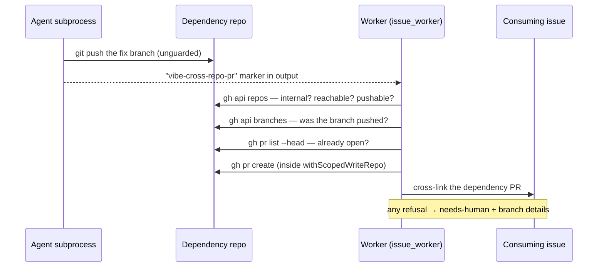
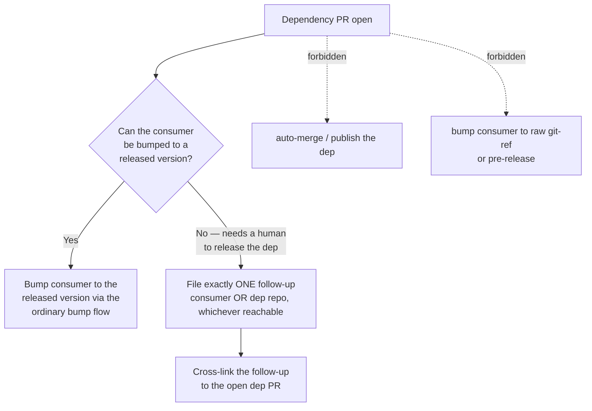

# 🔀 Cross-repo fix — raise a PR in an internal dependency

When an assigned issue's root cause lives in an internal `stSoftwareAU/*`
dependency the worker can access (e.g. `@stsoftware/private-repo-14`), the worker should
fix it **in that dependency's own repo by raising a PR there, in the same run** —
not spin the real fix out into follow-up issues. This document describes the
**capability** that makes that possible: resolving the dependency repo, probing
"can access", and opening the PR.

> **Scope.** This is the *plumbing* (build + verify the worker's ability to
> raise a cross-repo PR). The *behaviour* that tells the worker when to use it
> and the dedup / one-follow-up rules are sibling issues under parent; the
> release-gating boundaries that hold once the dep PR is open are described in
> [Release-gating](#release-gating--never-auto-release) below.

## "Can access" = internal + clonable + pushable

The classification reuses the **** rule rather than introducing a new one:
a dependency is **internal** when its package scope is `@stsoftware` (matching
the `jsr:@stsoftware/*` / `npm:@stsoftware/*` exclude globs that give internal
deps a 0h quarantine window). Everything else is **external**.

"Can access" then adds two runtime conditions, both confirmed by a single
`gh api repos/<owner>/<repo>` call:

| Condition | How it is checked | If it fails |
| --- | --- | --- |
| **Internal** | package scope is `@stsoftware` | classified `external` |
| **Clonable / visible** | `gh api repos/<repo>` returns 200 | classified `external` (404/403) |
| **Pushable (can open a PR)** | `permissions.push === true` | classified `external` |

Any failure reports the dep as `external`, so the caller falls back to the
deferral path (a sibling issue owns the instruction side). The probe returns the
repo's **canonical** `full_name`, so a package named `private-repo-14` correctly resolves
to the `stSoftwareAU/private-repo-14` repo regardless of casing.

## Flow

```mermaid
flowchart TD
    A["Dependency spec<br/>(jsr:@stsoftware/private-repo-14)"] --> B{classifyDependencySpec<br/>@stsoftware scope?}
    B -- No --> X[external → caller defers]
    B -- Yes --> C["probeCrossRepoAccess<br/>gh api repos/stSoftwareAU/private-repo-14"]
    C -- "404 / 403" --> X
    C -- "push !== true" --> X
    C -- "200 + push" --> D["internal-reachable<br/>repo = canonical full_name"]
    D --> E["openCrossRepoFixPr"]
    E --> E1[clone --depth=1 --no-single-branch]
    E1 --> E2{branch == default?}
    E2 -- Yes --> Y[refuse: default branch is read-only]
    E2 -- No --> E3[checkout -b feature]
    E3 --> E4["applyFix(repoDir)"]
    E4 --> E5[add -A → commit → push -u]
    E5 --> E6["gh pr create --repo stSoftwareAU/private-repo-14"]
    E6 --> F["return PR URL → consuming run cross-links it"]
```

## API

All three building blocks live in
[`worker/deno/lib/cross_repo_fix.ts`](../worker/deno/lib/cross_repo_fix.ts) and
take an injectable command runner (no real network in tests).

- `classifyDependencySpec(spec)` → `internal` (with `candidateRepo`) or
  `external` (with a reason). Handles `jsr:` / `npm:` prefixes, version suffixes
  (`@^5.6.0`), and bare scoped specs. Rejects malformed / path-traversal names.
- `probeCrossRepoAccess(repo, runner)` → `{ reachable: true, repo }` (canonical
  name) or `{ reachable: false, reason }`.
- `resolveCrossRepoTarget(spec, runner)` → `internal-reachable` (ready to PR) or
  `external` (defer). Never probes an external spec.
- `openCrossRepoFixPr(request, runner)` → clones, branches, runs the caller's
  `applyFix`, commits, pushes, and opens the PR; returns a `Result` carrying the
  **PR URL**. Refuses to push to the dependency repo's default branch (the
  read-only invariant,). Any failed step returns an error `Result`
  rather than throwing, so the caller can fall back to deferral.

> **Transitive root causes.** `resolveCrossRepoTarget` resolves a single spec.
> When the root cause lives further down the chain (dep-of-a-dep), the consuming
> run resolves each internal dependency in the chain in turn and opens the PR in
> the repo where the fix actually belongs.

## Dry-run verification

The resolve + probe half is exposed as a side-effect-free CLI command for a
documented dry-run against a real `stSoftwareAU/*` repo:

```bash
deno run --allow-env --allow-run worker/deno/mod.ts \
  resolve-cross-repo-dep --package jsr:@stsoftware/private-repo-14
# → internal-reachable: jsr:@stsoftware/private-repo-14 -> stSoftwareAU/private-repo-14 (can clone + open a PR)

deno run --allow-env --allow-run worker/deno/mod.ts \
  resolve-cross-repo-dep --package npm:lodash
# → external: npm:lodash (unscoped package (not an @stsoftware dependency))
```

The PR-raising half (`openCrossRepoFixPr`) needs an `applyFix` callback and is
therefore driven from a consuming flow, not the CLI. It is verified
by the integration test
[`worker/deno/tests/cross_repo_fix_test.ts`](../worker/deno/tests/cross_repo_fix_test.ts),
which drives the full clone → branch → fix → commit → push → PR sequence with a
scripted runner and asserts an actual PR is opened against a **different** repo
than the run started in, with its URL surfaced back.

## The bridge — how an agent run actually opens the dependency PR

The capability above lives in the **worker**. The agent that does the fixing
cannot use it directly: the `gh` guard shim bakes the run's write-repo allowlist
— the claim repo, and nothing else — into the agent subprocess at spawn time
(SECURITY.md §6a), so `gh pr create --repo stSoftwareAU/<dep>` from the agent's
own shell is refused with `[SECURITY] [WRITE_REPO_BLOCKED]`. Before Issue #182
there was no sanctioned alternative, and a run whose only remaining step was
that PR could not finish: `stSoftwareAU/GRQ#4206` burned two runs on the same
blocked call and left a finished fix on an unreferenced branch.

`worker/deno/lib/cross_repo_pr_handoff.ts` closes that gap **without changing
the agent's boundary**:

1. The agent pushes the fix branch to the dependency repo — `git` is not
   guarded — and **declares** the PR it wants with a marker in its output:

   ```text
   <!-- vibe-cross-repo-pr repo="stSoftwareAU/Dep" branch="fix/123-thing" base="Develop" title="Fix the thing" summary="why" -->
   ```

   `repo`, `branch` and `title` are required; `base` defaults to the
   dependency's default branch and `summary` is folded into the PR body. The
   instruction lives in `prompts/coding_guidelines/` and `prompts/issue/`.
2. The worker parses the declaration, treats every field as untrusted model
   output (shape-validated before it becomes a `gh` argument), and validates the
   target: internal `stSoftwareAU/*` owner, reachable, pushable
   (`probeCrossRepoAccess`), the head branch actually present on the dependency
   remote, and not that repo's default branch. An already-open PR for the same
   head is reused, never duplicated.
3. The single `gh pr create` runs through the worker's own `spawnGh` chokepoint
   inside `withScopedWriteRepo()` — the allowlist opens for that one call and
   closes again in a `finally`, announced with
   `[SECURITY] [WRITE_REPO_SCOPED_GRANT]`.
4. The dependency PR URL is cross-linked onto the consuming issue. Anything that
   stops the PR being opened — malformed declaration, unreachable repo, branch
   never pushed — escalates to `needs-human` with the branch details through the
   guarded `escalateToHuman` chokepoint. The run never ends with the fix
   stranded and unmentioned.



Tests: `worker/deno/tests/cross_repo_pr_handoff_test.ts` (detection, every
refusal, the scoped grant opening and re-closing the boundary) and the two
wiring cases in `worker/deno/tests/issue_worker_test.ts`.

## Release-gating — never auto-release

Opening the dependency PR is where the worker's authority stops. Two boundaries
hold once that PR is open — encoded in `prompts/coding_guidelines/` (from v29
onward) and `prompts/issue/` (from v28 onward):

- **No auto-release.** The worker must **not** auto-merge or publish the
  dependency PR, and must **not** bump the consumer to a raw commit/git-ref or a
  pre-release to pull the fix in early. Releasing the fixed dependency is a human
  decision; the consumer is bumped to the released version through the ordinary
  dependency-bump flow once that release exists.
- **Human-gated release is the one legitimate deferral.** The only reason to
  defer *after* the dependency PR is open is that the consumer bump needs a human
  to release the fixed dependency first. The worker handles it with exactly
  **one** follow-up (reusing the search-before-file / one-follow-up dedup rule,
  ), filed in **either** the consuming repo (where the bump will land) **or**
  the dependency repo (beside the PR) — whichever it can reach — and
  **cross-linked to the open dependency PR** so the release and the consumer bump
  stay connected.


