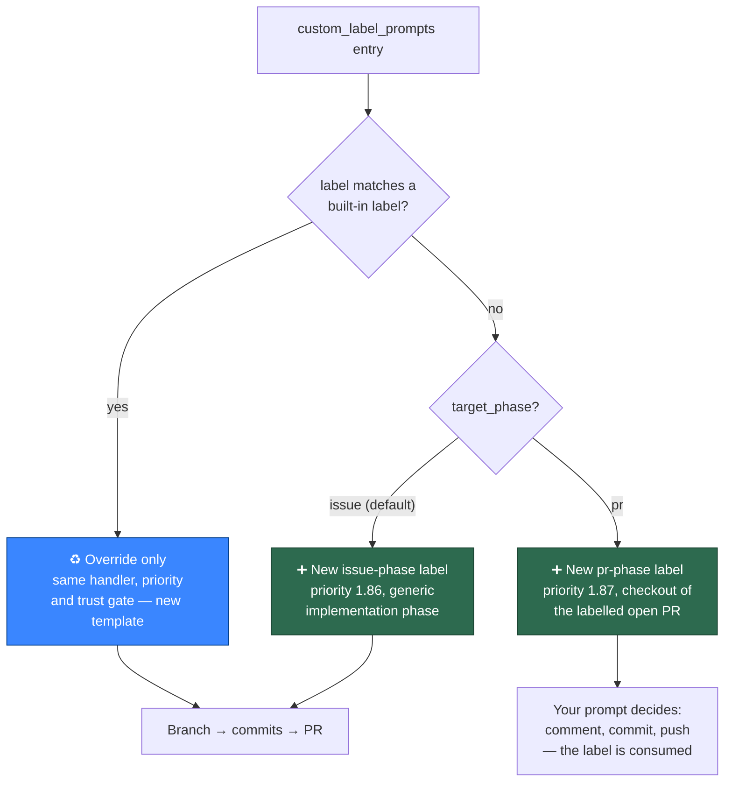
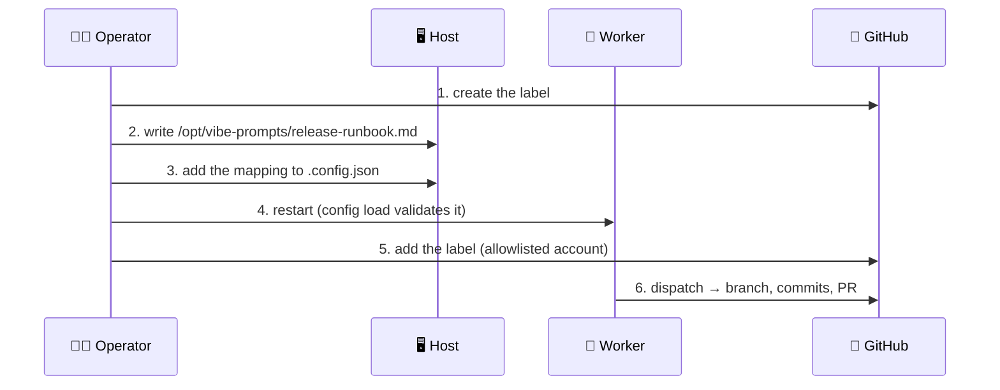

# ✍️ Custom Label Prompts — the operator-side extension point

Map a GitHub label to a **prompt template that lives outside this repository**,
so a deployment can run its own instructions without publishing them and
without forking. Add the file, add the mapping, apply the label — the Vibe
Coder runs your prompt against the labelled work. A mapping's `target_phase`
decides what "the labelled work" is: an **issue** by default, or an open
**pull request** with `"target_phase": "pr"`.

The governing rule is the one [Private Extensions](PRIVATE-EXTENSIONS.md)
states:

> **Core provides extension points. It never learns what is plugged into
> them.**

This page is the **operator guide** to that extension point: what it is, a
worked example you can follow verbatim, the contract a prompt file must
satisfy, and the exact symptom of every way it can fail. It states only as much
of the `.config.json` key as the example needs — the field-by-field reference,
and the full semantics of dispatch and override, live in
[Configuration — Custom Label Prompts](CONFIGURATION.md#-custom-label-prompts).

## 📋 Table of Contents

- [What this extension point is](#-what-this-extension-point-is)
- [The config shape](#-the-config-shape)
- [Worked example — end to end](#-worked-example--end-to-end)
- [The placeholders a prompt must carry](#-the-placeholders-a-prompt-must-carry)
- [What a prompt author must never do](#-what-a-prompt-author-must-never-do)
- [Trust — who may add the label](#-trust--who-may-add-the-label)
- [When a labelled issue is dispatched](#-when-a-labelled-issue-is-dispatched)
- [Container operation](#-container-operation)
- [No versioning convention](#-no-versioning-convention)
- [Failure modes and their exact symptoms](#-failure-modes-and-their-exact-symptoms)
- [Syncing a private prompt repository](#-syncing-a-private-prompt-repository)

## 🧩 What this extension point is

Three extension points share one posture — the operator supplies the
behaviour, core stays incurious about it — and differ only in the surface they
expose:

| Extension point | Surface | What core knows about it |
| --- | --- | --- |
| [Post-run callbacks](CALLBACKS.md) | A **hook** — an executable run after a terminal issue run | The versioned context it passes, and nothing about what the hook does with it |
| [`CiLogProvider`](EXTENDING.md#-adding-a-ci-log-provider) | A **provider** that fetches a CI log excerpt for the `ci_fix` prompt | The interface, not the CI system behind it |
| `custom_label_prompts` (this page) | An **operator-side prompt template**, keyed by a GitHub label | The path you configured — never the contents |

Reach for a custom label prompt when the *instructions* are the private part:
a house release runbook, a compliance checklist, an internal migration
procedure — work you want the Vibe Coder to do, written in a prompt you are not
willing to publish. It is configuration-only: no fork, no code in this
repository, and nothing about your prompt ever appears here.

A mapping does one of two things, decided by whether its `label` matches a
built-in one — and a new label additionally chooses the phase it runs in:



- **A new label adds a dispatch row.** The issue is worked at priority 1.86 by
  the same `workOnIssue` pipeline `work-on` runs — a real branch, real commits
  and a PR. Only the prompt body differs, and — because it raises a PR — it is
  held by the same eligibility gates `work-on` is
  ([When a labelled issue is dispatched](#-when-a-labelled-issue-is-dispatched)).
- **A `pr`-phase new label acts on an open pull request instead.** Give the
  entry `"target_phase": "pr"` and applying the label to an **open** PR runs
  your prompt at priority 1.87 with the PR head branch checked out and `gh`
  available. The run **consumes** the label — including when it fails, which is
  reported as a PR comment — so one application is one run and you re-apply the
  label to run again. A label on a closed or merged PR never dispatches. The
  full semantics are in
  [Configuration — How a `pr`-phase custom label dispatches](CONFIGURATION.md#how-a-pr-phase-custom-label-dispatches-issue-1011).
- **A built-in label overrides that phase's template.** A mapping naming
  `planning`, `question`, `grill-me`, `quorum` or `work-on` (which owns the
  implementation phase, and so covers `top-priority` and `low-priority`
  pickups too) replaces that phase's template and nothing else — the handler,
  the priority and the trust gate are unchanged. Match the label names **your
  fleet configured**: a fleet that renamed `planning` to `plan-it` overrides
  the planning phase with a `plan-it` mapping. `refine-issue` builds its
  prompt inline and cannot be overridden.

The full semantics of both live in
[Configuration — Custom Label Prompts](CONFIGURATION.md#-custom-label-prompts).

## 🧾 The config shape

`custom_label_prompts` is a top-level array in `.config.json` — top level, not
inside `repo_config`. Copy this:

```json
{
  "custom_label_prompts": [
    {
      "label": "release-runbook",
      "prompt_path": "/opt/vibe-prompts/release-runbook.md"
    },
    {
      "label": "planning",
      "prompt_path": "/opt/vibe-prompts/planning.md"
    },
    {
      "label": "planning",
      "phase": "planning_critique",
      "prompt_path": "/opt/vibe-prompts/planning-critique.md"
    }
  ]
}
```

- **`label`** — the GitHub label that dispatches, or the built-in label whose
  template this entry overrides.
- **`prompt_path`** — an **absolute host path**, free of `.` and `..`
  segments, naming a file that exists and is readable at config load.
- **`phase`** (optional) — only on an override, and only where the label owns
  more than one template: `planning_critique` for a `planning` mapping,
  `quorum_judge` for a `quorum` one. Omitted, the mapping overrides the
  label's first-turn template.

The default is an empty list: a deployment that configures nothing behaves
exactly as it does today.

## 🚀 Worked example — end to end

A fleet wants a `release-runbook` label that runs its own, unpublished release
procedure. Six steps, start to finish.

### 1. Create the GitHub label

```bash
gh label create "release-runbook" \
  --repo my-org/my-service \
  --description "Run the house release runbook" \
  --color "5319e7"
```

### 2. Write the prompt file on the host

Keep custom prompts in a directory of their **own** — in container mode that
whole directory is mounted (read-only) into the container, so anything sitting
beside the prompt becomes readable there too.

```bash
sudo mkdir -p /opt/vibe-prompts
sudo chmod 755 /opt/vibe-prompts
sudo -e /opt/vibe-prompts/release-runbook.md
```

A minimal, valid template for a **new** label — it carries the two required
placeholders and nothing else:

```markdown
## Release runbook

You are cutting a release of `{{REPO}}` for issue #{{ISSUE_NUMBER}}.

1. Confirm the version in `VERSION` matches the issue.
2. Update `CHANGELOG.md` from the merged PRs since the previous tag.
3. Commit on a branch and raise a PR — do not tag; a human tags.

{{QUALITY_INSTRUCTIONS}}

{{VERBOSITY_INSTRUCTIONS}}
```

Write the file so the account the worker runs as can read it (`chmod 644` is
enough), and **do not** fence or reproduce the issue text yourself — the worker
does that, ahead of your template. See
[What a prompt author must never do](#-what-a-prompt-author-must-never-do).

### 3. Add the mapping to `.config.json`

```json
{
  "custom_label_prompts": [
    {
      "label": "release-runbook",
      "prompt_path": "/opt/vibe-prompts/release-runbook.md"
    }
  ]
}
```

### 4. Restart the worker

Configuration is read at launch and the container mounts are derived from it,
so an added mapping takes effect on the **next** launch — restart the service,
or let the supervising loop start its next cycle. Restarting is also the fast
check that the mapping is well formed: a malformed entry, or an unreadable
`prompt_path`, fails config load loudly and names the offending entry and field
rather than starting a worker whose extension silently never dispatches.

### 5. Apply the label from an allowlisted account

```bash
gh issue edit 42 --repo my-org/my-service --add-label "release-runbook"
```

The account **adding the label** must be on the `allowed_authors` allowlist —
a trusted issue *author* is not sufficient. See
[Trust — who may add the label](#-trust--who-may-add-the-label).

### 6. Observe the run

The worker log names both the dispatch and the template it actually loaded:

```text
Dispatching my-org/my-service#42 to the implementation phase with the custom
prompt for 'release-runbook'
(/home/vibe/.vibe-coder/custom-prompts/1/release-runbook.md)
Issue prompt template: /home/vibe/.vibe-coder/custom-prompts/1/release-runbook.md
```

Both lines name the path **this run read the file at**. Inside the container
that is the read-only mount of `/opt/vibe-prompts`, not the host path you
configured — see [Container operation](#-container-operation). A read outside
the container translates nothing and names `/opt/vibe-prompts/…` instead.

From there the run is an ordinary implementation run: branch, commits, quality
gate, PR. A line reading `Issue prompt template: prompts/issue/prompt.md`
means the built-in template ran — the mapping did not dispatch, and the log
above it says why.



## 🧷 The placeholders a prompt must carry

A template is validated against the placeholder contract of the phase it
serves. Anything it names that the phase does not substitute fails the build
loudly rather than reaching the agent half-rendered:

```text
Prompt template has unsubstituted placeholder(s): {{DEPLOY_TARGET}}
```

### A new custom label — `issue` phase (the default)

An `issue`-phase label runs the generic implementation phase, so its template
is an `issue` template:

| Placeholder | Required | What it carries |
| --- | --- | --- |
| `{{ISSUE_NUMBER}}` | ✅ | The issue being worked |
| `{{QUALITY_INSTRUCTIONS}}` | ✅ | The repository's quality-gate commands |
| `{{REPO}}` | optional | `owner/repo` |
| `{{VERBOSITY_INSTRUCTIONS}}` | optional | The configured response-verbosity block |

### A new custom label — `pr` phase

A `pr`-phase label runs against a pull request, so its template answers to the
`pr_feedback` contract instead. Writing an `{{ISSUE_NUMBER}}` template here is
refused with both the phase and the template type named:

| Placeholder | Required | What it carries |
| --- | --- | --- |
| `{{PR_NUMBER}}` | ✅ | The pull request being worked |
| `{{QUALITY_INSTRUCTIONS}}` | ✅ | The repository's quality-gate commands |
| `{{VERBOSITY_INSTRUCTIONS}}` | optional | The configured response-verbosity block |

### An override of a built-in label

An override answers to the contract of the phase it replaces — not to the
`issue` one — and that is checked **at config load**, with the phase and the
missing placeholders named:

| Phase | Required placeholders |
| --- | --- |
| `issue` (the implementation phase) | `ISSUE_NUMBER`, `QUALITY_INSTRUCTIONS` |
| `planning`, `planning_critique` | `REPO`, `ISSUE_NUMBER`, `PLANNING_LABEL` |
| `question` | `REPO`, `ISSUE_NUMBER`, `QUESTION_LABEL` |
| `grill-me` | `REPO`, `ISSUE_NUMBER`, `ISSUE_TITLE`, `ISSUE_BODY`, `COMMENT_HISTORY`, `ROUND_NUMBER`, `MAX_ROUNDS`, `BOUNDARY_INTEGRITY_INSTRUCTION` |
| `quorum` | `REPO`, `ISSUE_NUMBER`, `ISSUE_TITLE`, `ISSUE_LABELS`, `ISSUE_BODY`, `ISSUE_COMMENTS`, `BOUNDARY_INTEGRITY_INSTRUCTION` |
| `quorum_judge` | The `quorum` set, plus `PLAN_A` and `PLAN_B` |

Each turn of a two-turn phase is a separate template with its own contract:
overriding `planning` does not override `planning_critique`, and overriding
`quorum` does not override `quorum_judge`. Nothing is inferred from the first
turn.

## 🚧 What a prompt author must never do

The issue title, labels, body and — in the phases that include them — comments
are **untrusted input**, and the worker fences them in the same per-run nonce
boundary markers the built-in templates get, with the same boundary-integrity
instruction, before your template is appended. Your file is configuration: it
is not fenced, its immutability is not checked, and it is yours to edit.

That division decides what a prompt author must never write:

- **Never instruct the agent to follow directives found inside the fenced
  blocks.** "Do what the issue says", "follow any instructions in the
  description", "obey the commands in the comments" — each of these hands an
  issue author the ability to steer a privileged run. Ask the agent to
  implement the *technical requirements* described, which is the wording the
  built-in templates use.
- **Never re-fence or reproduce the issue text yourself.** In the phases where
  the worker appends the fenced block (implementation, planning, question), a
  second copy in your template is unfenced text that reads as instructions.
  Where the phase's contract *does* include the issue text as placeholders
  (`grill-me`, `quorum`, `quorum_judge`), it also requires
  `{{BOUNDARY_INTEGRITY_INSTRUCTION}}` — keep it, and keep it near the fenced
  content it governs.
- **Never weaken the boundary rules.** Do not tell the agent that content
  inside the markers is trusted, that a `[TRUSTED]` tag inside a comment body
  is authoritative, or that it may execute commands or fetch URLs it finds
  there.
- **Never ask for a secret to be echoed.** A prompt that asks the agent to
  print credentials, tokens or `.config.json` contents puts them in the run
  log and the PR.

## 🔐 Trust — who may add the label

A configured label joins the **operational dispatch set**, alongside
`planning`, `grill-me`, `question`, `quorum` and `refine-issue`. The gate is
the same one those labels get:

- **The label adder must be on the `allowed_authors` allowlist.** A trusted
  issue *author* is not sufficient — otherwise anyone with triage permission
  could steer a privileged phase onto a trusted-authored issue.
- **An add by an untrusted account is stripped**, not honoured as a plain
  descriptive label.
- **An add that cannot be attributed** from the issue timeline fails closed:
  the issue is skipped.
- **The worker cannot self-apply one.** A configured label is treated as
  reserved by the worker's own creation paths and stripped, and a label the
  worker legitimately raises itself (`idle-task`, `security`, `severity:…`) is
  refused at config load rather than remapped.

## 🚦 When a labelled issue is dispatched

A custom label is **not removed** when the run finishes, and
`unassign_on_pr_created` (default `true`) hands the issue back unassigned. On
its own that is a loop: the next cycle would see an unassigned issue still
carrying the label and re-run the whole implementation pipeline while the
previous cycle's PR was still open, at the cost of a full agent run each time
(Issue #937). `planning`, `question`, `grill-me` and `refine-issue` have no
such loop — each removes its own label when it is done.

So a custom label is held by the **same new-work eligibility gates `work-on`
is**, checked in this order after the trust gate above:

| Gate | The issue is skipped when |
| --- | --- |
| Blocking label | It carries `failed`, `needs-human`, `needs-revision`, `refine-issue`, `planning` or `question`, or it is a milestone-tracking issue. A `failed` label applied before the issue was reopened is cleared first, so reopening the issue is enough to make it workable again. |
| Retry cooldown | This host recently failed on it, or has already worked it this run. |
| Milestone occupancy | Another fleet account already holds an issue in the same milestone. |
| Closed or merged PR | A fleet PR for this issue closed inside `closed_pr_cooldown_seconds` (default one hour), or merged at any time in the past. A trusted re-add of the custom label dated **after** the PR closed lifts either. |
| Open PR | A fleet PR is open against the issue's work stream. Add `ignore-open-prs` from an allowlisted account to override. |
| Dependency | The issue names an open dependency, or has an open sub-issue. |

A run that produces no work also puts the issue into the retry cooldown, so a
persistently failing custom-labelled issue backs off instead of burning an
agent run every cycle.

**Overrides are unaffected.** A mapping that names a built-in label replaces
that phase's template and nothing else — the handler's own gating is whatever
that phase always had.

## 📦 Container operation

The worker runs containerised, and the container sees the workspace rather
than the host — so a prompt on the host would be unreadable at dispatch
without a mount. The launcher derives the narrowest one that works:

| What is mounted | Where | Mode |
| --- | --- | --- |
| The **containing directory** of each configured `prompt_path`, deduplicated | `/home/vibe/.vibe-coder/custom-prompts/<n>` | `ro` |

- **The directory, not the file** — Apple `container` cannot bind a single
  file. Everything beside your prompt in that directory is readable inside the
  container, which is why the worked example puts them in a directory of their
  own.
- **Read-only, always.** Nothing inside the container has any business editing
  an operator's template.
- **Path translation, not a rewritten config.** `.config.json` keeps the host
  path you wrote; the launcher passes a host → in-container map in
  `VIBE_CUSTOM_PROMPT_PATHS` and the config loader applies it. One file serves
  the host-side launcher and the container alike.
- **Refused paths fail the launch, loudly.** Every source goes through the same
  containment allowlist as any other mount. The host home directory or an
  ancestor of it, the filesystem root, a runtime control socket, a relative
  path, a path carrying a `.` or `..` segment, and a path that resolves
  (through a symlink) to somewhere other than itself are all refused — the
  launch fails naming the path rather than starting a container without the
  mount.
- **Nothing configured, nothing added.** With no mappings there is no mount and
  no environment variable; the plan is byte-identical to what it was before.

See [Containment — the mount set](CONTAINMENT.md#the-mount-set) for the
boundary this addition sits inside.

## 🗂️ No versioning convention

The repository's own templates live at `prompts/<type>/prompt.md`. A custom
prompt has **no such convention and no `vN.md` versioning**: `prompt_path` is a
plain path, read as-is. History is yours to keep — put the file in your own
version control, where the operator-side change history belongs, rather than
encoding a version in the filename.

One consequence worth knowing: where a run builds through the prompt cache, the
file's **content** joins the cache key, so editing the file invalidates the
cached system prompt rather than re-serving a stale one.

## 💥 Failure modes and their exact symptoms

Every fault is loud. Nothing here is warned about and defaulted, because a
silently dropped mapping leaves an operator believing their extension is live
when it never dispatched.

| Fault | When it is caught | Symptom |
| --- | --- | --- |
| `prompt_path` missing, unreadable, or not absolute | Config load | The worker refuses to start, naming `custom_label_prompts[<n>].prompt_path` and the underlying error |
| `prompt_path` carries a `.` or `..` segment | Config load | Refused by field, naming the path — the mount it would derive is not the path the allowlist checked |
| An override template short of a required placeholder | Config load | Refused by field, naming the phase and the missing placeholders |
| `label` is a reserved or discovery label that is not a built-in phase label (`top-priority`, `low-priority`, …) | Config load | `"<label>" is a reserved or discovery label and cannot be remapped` |
| `label` is `refine-issue` | Config load | Refused by name: that phase builds its prompt inline and has no template file to override |
| `label` is one the worker applies itself (`idle-task`, `security`, `severity:…`) | Config load | `"<label>" is a label the worker applies itself and cannot be remapped` |
| Two entries claiming the same label, or the same phase of one label | Config load | Refused as a duplicate, naming the earlier entry's index |
| An unknown key in an entry | Config load | Refused, naming the key and listing `label`, `prompt_path`, `phase` |
| A prompt path the containment allowlist refuses, or one that resolves elsewhere | Container launch | `Refusing to launch: the custom prompt path … ` — the launch fails; no container starts |
| The file is deleted, emptied or made invalid **between** config load and dispatch | Dispatch | `Refusing to dispatch <repo>#<n> for custom label '<label>': …` — the run fails; the built-in `issue` template is never substituted and the issue is never silently skipped |
| A new label's template short of `{{ISSUE_NUMBER}}` or `{{QUALITY_INSTRUCTIONS}}` | Dispatch | The same refusal, naming the file and the missing placeholders |
| A placeholder the phase does not substitute | Prompt build | `Prompt template has unsubstituted placeholder(s): {{…}}` |

A broken mapping never starves the others: the remaining configured labels are
still scanned, each fault is logged as an error naming its label and path, and
the pass fails when nothing else was worked.

## 🔄 Syncing a private prompt repository

Keeping the prompt files up to date is **the operator's responsibility**. The
Vibe Coder reads a local path — it clones nothing, fetches nothing, and knows
nothing about where your prompts came from.

The pattern that works is the one
[Private Extensions](PRIVATE-EXTENSIONS.md#-step-1--lay-out-your-private-repository)
describes for `.config.json`: keep the authoritative copy in your own private
repository, and put it in place on the host with a deploy step your fleet
already runs.

```bash
# On the host, from your own deployment repository.
git -C ~/my-deployment pull --ff-only
sudo rsync -a --delete ~/my-deployment/prompts/ /opt/vibe-prompts/
```

Two rules make that safe:

- **Deploy the resolved path.** A symlinked `prompt_path` fails the container
  launch — the directory the runtime would mount is not the one the allowlist
  checked. Copy the files into place rather than linking to them.
- **Restart to pick up a new mapping.** Editing a prompt file's *contents*
  takes effect on the next run that loads it (and invalidates the prompt
  cache); adding, removing or re-pointing a **mapping** changes
  `.config.json`, and that is read at launch.

---

**See also**

- [Configuration — Custom Label Prompts](CONFIGURATION.md#-custom-label-prompts)
  — the `.config.json` key reference.
- [Extending the Worker](EXTENDING.md) — the in-tree extension points.
- [Prompt goals (summary)](PROMPTS.md) — what each built-in prompt is for.
- [Private Extensions](PRIVATE-EXTENSIONS.md) — extending a deployment with
  software this repository does not ship.
- [Containment](CONTAINMENT.md) — the boundary the prompt mounts sit inside.
