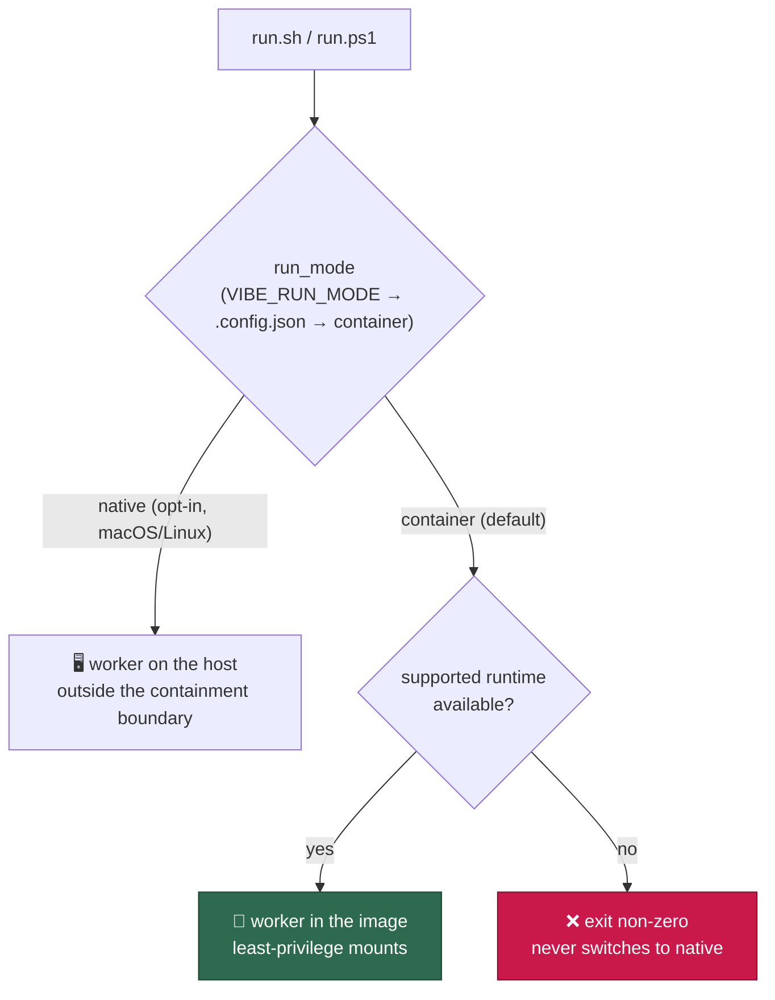
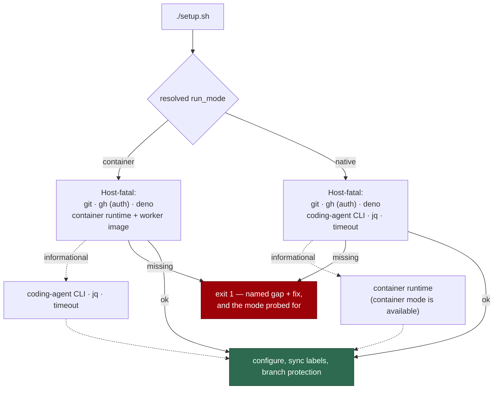
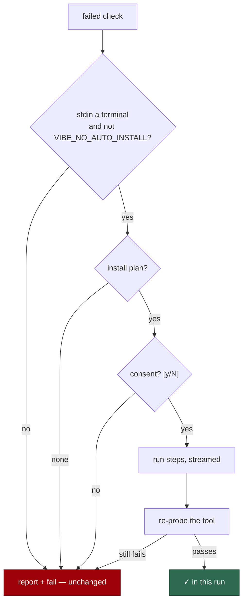
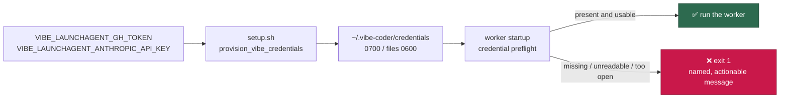

# 📦 Deployment Guide

This document covers installation, background service setup, and screenshot support. For a quick overview, see the [main README](../README.md).

A deployed host is an **unattended appliance**: `git clone` → configure
credentials and repos → `./run.sh` (or `run.ps1`), and from then on the machine
runs itself and is steered entirely through GitHub. See
[Containment](CONTAINMENT.md) for what the worker can and cannot reach.

## 📋 Table of Contents

- [Requirements](#requirements)
- [Run modes: container by default, native by opt-in](#-run-modes-container-by-default-native-by-opt-in)
- [Upgrading an existing host — the hard cutover](#upgrading-an-existing-host--the-hard-cutover)
- [Installation](#installation)
- [Initial Setup](#initial-setup)
  - [Interactive install offer](#interactive-install-offer-issue-4135)
- [LaunchAgent Setup (macOS)](#launchagent-setup-macos)
- [Running as a Background Service](#running-as-a-background-service)
  - [Using cron](#recommended-using-cron-5-minute-intervals)
  - [Using systemd (Linux)](#using-systemd-linux)
  - [Using launchd (macOS)](#using-launchd-macos)
  - [Using Task Scheduler (Windows)](#using-task-scheduler-windows)
- [Logs](#logs)
- [GitHub Pages](#github-pages)
- [Screenshot Support Setup](#screenshot-support-setup)
  - [Screenshot Upload Configuration](#screenshot-upload-configuration)

## 📋 Requirements

The worker runs inside the container image by default (Issue #4060), so a
container-mode host needs a **container runtime** and the **launcher**, not the
worker's own toolchain. A host that has opted into the `native` run mode needs
the reverse — see [Run modes](#-run-modes-container-by-default-native-by-opt-in)
below.

**Container runtime — one per platform:**

| Platform | Runtime the launcher probes                                              |
| -------- | ------------------------------------------------------------------------ |
| macOS    | Apple container ([`container`](https://github.com/apple/container))       |
| Linux    | [Docker](https://docs.docker.com/get-docker/), then [Podman](https://podman.io/docs/installation) |
| Windows  | [Docker](https://docs.docker.com/desktop/install/windows-install/), then [Podman](https://podman.io/docs/installation) |

Presence is not availability: each candidate is validated with a read-only
probe, so a binary whose daemon is unreachable is reported unavailable.
**Container mode never falls back to the host** — with no supported runtime,
`run.sh` / `run.ps1` exit non-zero naming the platform, every runtime probed
and how to install one (Issues #4063, #4065). Running natively is a separate,
explicit choice (`run_mode`), never something a missing runtime makes for you.

**Installing it by hand is one option, not the only one.** Run `./setup.sh`
(`.\setup.ps1` on Windows) in a terminal and it offers to install and start the
runtime for you — Homebrew on macOS, apt on Debian/Ubuntu, winget on Windows —
with the exact commands shown before they run.
See [Interactive install offer](#interactive-install-offer-issue-4135) below
for what is offered, what never is, and what happens when you decline.

**Launcher:**

- [Deno](https://deno.com/) 2+ — the launcher's only host tool: it computes the
  launch plan and the content-derived image reference.
- `bash` on macOS/Linux for `run.sh`, or
  [PowerShell](https://learn.microsoft.com/powershell/) (Windows PowerShell 5.1
  or `pwsh` 7) for `run.ps1` on Windows.

**One-time setup only** — `./setup.sh` (`.\setup.ps1` on Windows, Issue #4185)
writes `.config.json`, provisions
credentials and syncs labels and branch protection across the monitored repos,
so it also needs [Git](https://git-scm.com/) and an authenticated
[GitHub CLI](https://cli.github.com/) on the host. Its prerequisite probe is
split to match containment (Issue #4117): in container mode `git`, `gh`, `deno`
**and a working container runtime with a built-or-buildable worker image** are
host-fatal, while the coding-agent CLI, `jq` and `timeout` are reported for
information only because the image owns them. Native mode swaps those two
groups over (Issue #4149). No skip flag is needed on a container-only host.

Everything the *worker* uses — the coding-agent CLI, `git`, `gh`, `jq`,
coreutils `timeout`, Playwright with headless Chromium, and the monitored
repositories' build and test toolchains — is baked into the image and pinned
there. **Do not install them on the host**; see
[Container Image](CONTAINER.md) and [Containment](CONTAINMENT.md).

## 🧭 Run modes: container by default, native by opt-in

The worker has two run modes, selected by the `run_mode` setting (Issue #4146,
documented in [Configuration](CONFIGURATION.md#-run-mode-issue-4146)):

| Mode        | How it is selected                                            | Where the worker runs                                     |
| ----------- | ------------------------------------------------------------- | --------------------------------------------------------- |
| `container` | the default — nothing to set                                   | inside the Vibe Coder image, behind the [containment boundary](CONTAINMENT.md) |
| `native`    | explicit: `"run_mode": "native"` in `.config.json`, or `VIBE_RUN_MODE=native` for one run | directly on the host, with host access                     |

Four rules go with them:

- **Container is the default and native is opt-in.** `VIBE_RUN_MODE` wins over
  `.config.json`, which wins over the default; an unrecognised value fails
  loudly naming both modes.
- **There is no auto-fallback.** Nothing selects `native` because a container
  runtime is missing — that stays the loud non-zero exit it is today
  (Issue #3234). Equally, a native host never silently launches a container.
- **Native is first-class and supported indefinitely** (Issue #4145), not a
  transitional escape hatch. `run.sh` serves it on macOS and Linux
  (Issue #4148); `run.ps1` / Windows is container-only by design (Issue #4147).
- **Native is outside the #4060 containment boundary.** An operator choosing it
  accepts that the worker runs with host access, as the fleet ran before
  containment — see [Containment](CONTAINMENT.md).

**When native is the right answer.** A host monitoring a repository whose build
shells out to `docker` cannot build inside the container: the image ships no
docker client ([`container/tools.json`](../container/tools.json)) and
[`container_launch.ts`](../worker/deno/lib/container_launch.ts) refuses
runtime-socket mounts and `--privileged` by design. Native mode is the
sanctioned answer for such a host — mounting the runtime socket into the
container is not.

A native host's prerequisites are the mirror image of the table above: it needs
the coding-agent CLI, `jq` and `timeout` on the host, and no container runtime
(Issue #4149). `./setup.sh` probes whichever set the resolved mode calls for.



## 🚚 Upgrading an existing host — the hard cutover

Container mode became the default in Issue #4065, and it is a hard cutover: an
existing host that updates to this version and stays on the default **will not
run the worker at all until a supported container runtime is installed and
healthy** — container mode never falls back to running on the host, by design
(Issue #3234: a missing runtime fails loudly rather than degrading). A host
that must keep running natively opts in explicitly with `run_mode` instead of
relying on a fallback that does not exist.

Before updating an existing host:

1. Install the runtime for the platform from the table above, and start it
   (`container system start`, the Docker daemon, or `podman machine start`) —
   or run `./setup.sh` in a terminal and accept the offer to do both for you.
2. Confirm the launcher can see it:

   ```bash
   deno run --allow-run --allow-env worker/deno/mod.ts container-runtime-detect
   ```

3. Then update the checkout. The first run builds the image, which takes
   several minutes; subsequent runs reuse it until the container definition
   changes.

Nothing else about an existing deployment changes: the same cron, launchd,
systemd or Task Scheduler entry keeps invoking the same launcher, and
`$WORK_DIR`, `~/logs`, `.config.json` and the credential directory stay where
they are — they are exactly the paths mounted into the container.

## 📥 Installation

```bash
# Clone the repository
gh repo clone <your-org>/VibeCoder
cd VibeCoder

# Configure via environment variables
VIBE_ALLOWED_AUTHOR=myusername \
VIBE_REPOS="myorg/repo1,myorg/repo2" \
./setup.sh

# Run (for testing)
./run.sh
```

> **📝 Note:** Scripts are committed with executable permissions, so no `chmod` is required after cloning.

### The worker needs its own dedicated clone (Issue #4204)

The clone the worker runs from is an **appliance checkout, not a workspace**:
the bootstrap prelude runs
`git fetch && git checkout Develop && git reset --hard origin/Develop &&
git clean -fd` against it on **every cycle**. Anything uncommitted is the
reset's enemy, in both directions:

- While the tree is dirty or parked on a feature branch, the reset fails,
  the worker exits, and the host silently crash-loops — observed live as an
  hour of 74-byte worker logs while an operator's coding session occupied
  the checkout.
- The moment the tree is clean, the reset **succeeds**: the checkout is
  yanked onto `Develop` and `git clean -fd` deletes every untracked file —
  silently destroying interactive work.

So: never point the worker at a clone you also develop in. Give it its own
directory (e.g. `~/vibe-coder-runtime`) and do interactive work elsewhere —
`git worktree` is a cheap way to keep development trees out of the
appliance clone's way. When the bootstrap does hit this collision it now
names it in the failure ("looks like an active development tree"), and
after three consecutive failures it raises a deduplicated GitHub issue on
the worker repository so an unattended host's absence is visible where you
actually look.

## 🏁 Initial Setup

Before running the worker, configure it with your GitHub username and repositories using environment variables:

```bash
VIBE_ALLOWED_AUTHOR=myusername \
VIBE_PR_REVIEWER=myusername \
VIBE_REPOS="myorg/repo1,myorg/repo2" \
./setup.sh
```

The Vibe Coder is designed to run on unattended machines (Issue #269). All interactions happen via GitHub issues and PRs — the system never waits on any UI interaction. Configuration is driven by `VIBE_*` environment variables; when you run `./setup.sh` in a terminal, it may optionally prompt for service-account paths (SSH key and gh config directory). In non-interactive environments (e.g. CI), setup runs without prompts.

**Optional: Service account authentication (SSH + gh auth)**

If you want the Vibe Coder to authenticate as a service account instead of your personal GitHub user, run `./setup.sh` in a terminal and answer the prompts for SSH key path and gh config directory, or edit `.config.json` directly:

```json
{
  "ssh_key_path": "~/.ssh/stsvcbot_ed25519",
  "gh_config_dir": "~/.config/gh-vibe"
}
```

See the [Configuration Reference](CONFIGURATION.md#service-account-authentication-ssh--gh-auth) for details on generating the SSH key and setting up the gh config dir.

The setup script's prerequisite probe matches containment (Issue #4117) and
follows the resolved [`run_mode`](CONFIGURATION.md) (Issue #4149) — the report
names the mode it probed for, so a wrong-mode probe is visible immediately:

| Set                                                | Container mode (default) | Native mode   |
| -------------------------------------------------- | ------------------------ | ------------- |
| `git`, authenticated `gh`, `deno`                   | host-fatal               | host-fatal    |
| container runtime + worker image                    | host-fatal               | informational |
| the coding-agent CLI, `jq`, `timeout`               | informational            | host-fatal    |

A host-fatal gap exits 1; an informational one is reported and never fails
setup. So a correctly provisioned container-only host runs `./setup.sh` as-is —
the `VIBE_SKIP_PREREQ_CHECK=true` workaround is no longer needed, and skipping
the probe now also hides the checks setup genuinely depends on. A native host
passes with no container runtime installed at all, and fails when the
coding-agent CLI, `jq` or `timeout` is missing from the host.

Installing a tool never reclassifies it: the classification follows the mode,
not what happens to be present.



### Interactive install offer (Issue #4135)

When `./setup.sh` runs in a terminal, each failed check that has an install
plan is offered to you one at a time, defaulting to no:

```text
?  jq is not installed. Install it now with Homebrew? [y/N]
```

The offer covers the tools the resolved run mode needs on the host: a native
host is offered `jq`, coreutils and the coding-agent CLI and is never offered a
container runtime (Issue #4149). The prompt names the package manager the plan
uses; the container-runtime prompts go further and name the exact argv, `sudo`
included, before anything runs. Consent runs the plan's commands with their output streamed (so a slow
`brew install` or a `sudo` password prompt is visible), then **re-runs the
probe for that tool** — a tool that installs successfully shows as `✓` in the
same run. The final exit status always comes from that re-probe, never from
"we tried": a declined install, a failed install, or a tool with no plan
leaves its check failed.



**What setup never installs.** The offer is deliberately narrow, and these
gaps are always yours to close by hand:

| Never installed | Why | What you run |
| --------------- | --- | ------------ |
| Authentication | A credential is never provisioned behind a `[y/N]` prompt. The `gh` **binary** can be installed for you; authenticating it cannot | `gh auth login`, and the coding-agent credential provisioning [below](#-credential-provisioning-non-interactive) |
| `git` | A bootstrap dependency — on macOS it arrives with the Xcode command line tools, a large separate interactive download | `xcode-select --install`, or your distribution's `git` package |
| Anything on a host with no Homebrew (macOS) or apt (Debian/Ubuntu) | No plan resolves, so nothing is offered rather than a remote installer script being run | The manual hint setup prints beside the failed check |
| `deno` on Debian/Ubuntu | No distribution package exists and the upstream path is `curl … \| sh` — a remote script setup will not run for you | [deno.com](https://deno.com/) |

**When an install is declined or fails.** The check stays failed and setup
exits non-zero — it is never reported as "we tried". Setup prints the manual
hint for that tool, so install it yourself and re-run `./setup.sh`; the probe
is idempotent and the offer only reappears for whatever is still missing. A
failed step also prints the command and its exit code, so you can run the same
command by hand and see the package manager's own error.

#### The container runtime on macOS (Issue #4136)

macOS has one candidate, Apple `container`, and two failure modes with
different offers — a stopped service is never reinstalled:

- Binary absent → `brew install container` **then** `container system start`.
- Binary present, service stopped → `container system start` alone.

Homebrew or nothing: with no Homebrew there is no offer at all — setup never
downloads a `.pkg` or an installer script — just the manual hint and a failed
check. The runtime is re-probed in the same run, so a `brew install` that exits
zero while the service still cannot answer stays a failed check.

#### The container runtime on Linux (Issue #4137)

The runtime check has two candidates on Linux, so it is offered in the probe's
own preference order — Docker first, then Podman only if Docker is declined or
has no plan. One runtime is ever acted on, never both:

```text
?  Docker is not installed. Run `sudo apt-get install -y docker.io` now? This
   runs with sudo and may ask for your password. [y/N]
```

Three rules keep it honest:

- **Absent is not stopped.** When the probe ran the binary and it exited
  non-zero, the runtime is installed and its daemon did not answer, so the
  offer is `sudo systemctl start docker` (or `podman machine start`) rather
  than an install.
- **Sudo is shown before it runs.** The prompt names the exact command and says
  it may ask for a password. Nothing you were not shown is executed.
- **Group membership is reported, never fixed.** A fresh `docker.io` leaves you
  outside the `docker` group, so the re-probe still fails with a permission
  error. Setup says so and prints the `sudo usermod -aG docker "$USER"` plus
  re-login instruction — the check stays failed until you have done it.

Docker comes from the distribution's own `docker.io` package: adding Docker's
apt repository and signing key is a supply-chain change that does not belong
behind a consent prompt. On a non-apt distribution (dnf, pacman, …) nothing is
offered and today's manual hints stand. macOS runs its own offer (above).

#### The Windows table (Issue #4185)

Windows plans come from **winget**, one package per tool:

| Tool | winget id |
| --- | --- |
| git | `Git.Git` |
| gh | `GitHub.cli` |
| deno | `DenoLand.Deno` |
| jq | `jqlang.jq` |
| container runtime | `Docker.DockerDesktop`, then `RedHat.Podman` |

Every step pins `--source winget --exact`, so a private source an operator added
for something else can never answer for a well-known id, and `--silent` keeps a
vendor installer from opening a wizard nothing is there to click through.
There is no sudo on Windows — winget elevates through UAC itself, and the step
description says so.

Two Windows-specific rules:

- **`git` is installable here.** It is never auto-installed on macOS (it comes
  with the Xcode command line tools) or Linux (a hard bootstrap dependency);
  winget's package is neither, so Windows has a plan.
- **A stopped runtime is never reinstalled.** Docker Desktop is a GUI
  application and the Podman machine is per-user state, so a runtime that is
  installed but not answering gets no offer at all — the probe's own hint
  ("start Docker Desktop") stands, rather than a multi-gigabyte reinstall that
  would not start it.

`timeout` has no Windows plan: winget packages no GNU coreutils, and Windows is
container-only (Issue #4145), so `timeout` is container-owned there and never
host-fatal.

Unattended runs are unaffected: with no TTY the offer never appears and the
output is exactly the report-and-fail of before. `VIBE_NO_AUTO_INSTALL=true`
suppresses the offer while keeping the probe;
`VIBE_SKIP_PREREQ_CHECK=true` still skips the probe, and therefore the offer,
entirely.

One host tool the table does not cover: answering `setup.sh`'s interactive
prompts merges the answers into `.config.json` with `jq`, so an interactive run
on a host without `jq` exits with that named reason rather than dropping the
answers. Set the `VIBE_*` variables and run setup non-interactively instead.
`setup.ps1` has no such gap — PowerShell parses and writes JSON itself, so a
Windows host needs no `jq` at all.

The setup creates a `.config.json` file (gitignored) containing your private configuration.

To add additional repositories to an existing config:

```bash
VIBE_ADD_REPOS="myorg/new-repo" \
./setup.sh
```

## 🔐 Credential Provisioning (Non-Interactive)

Unattended operation is a hard requirement: **no runtime step may reach an interactive credential mechanism** — no GUI prompt, no browser login, no `gh auth login`, no interactive coding-agent provider login, and **no macOS Keychain lookup**. The worker reads token and config *files*, and never a host credential store.

`setup.sh` provisions one dedicated directory from environment variables, with no prompt when they are set. The worker consumes it at runtime (the container mounts it read-only):

```text
~/.vibe-coder/credentials/        0700  (override with VIBE_CREDENTIAL_DIR)
├── gh/hosts.yml                  0600  the worker's GH_CONFIG_DIR host material
├── claude/provider.env           0600  the Claude Code credential
├── codex/provider.env            0600  the Codex CLI credential (when enabled)
└── gemini/provider.env           0600  the Gemini CLI credential (when enabled)
```

Nothing else belongs in that directory — it holds exactly the worker's GitHub credential and one credential per enabled agent vendor, and nothing more. Each vendor's credential lives in its own sub-directory (Issue #4108), and only the providers enabled for a run are mounted into the container, so no vendor can read another's secret.

```bash
VIBE_LAUNCHAGENT_GH_TOKEN="ghp_your_token" \
VIBE_LAUNCHAGENT_ANTHROPIC_API_KEY="sk-ant-your_key" \
./setup.sh
```

Set only the variables for the vendors you use: an unset provisioning variable leaves that provider unprovisioned and never disturbs an existing credential file.

| Variable | Description |
|----------|-------------|
| `VIBE_CREDENTIAL_DIR` | Credential directory (default: `~/.vibe-coder/credentials`) |
| `VIBE_LAUNCHAGENT_GH_TOKEN` / `GH_TOKEN` | GitHub token written to `gh/hosts.yml` |
| `VIBE_LAUNCHAGENT_ANTHROPIC_API_KEY` / `ANTHROPIC_API_KEY` / `CLAUDE_CODE_OAUTH_TOKEN` | Claude credential written to `claude/provider.env` |
| `VIBE_LAUNCHAGENT_OPENAI_API_KEY` / `OPENAI_API_KEY` / `CODEX_API_KEY` | Codex credential written to `codex/provider.env` |
| `VIBE_LAUNCHAGENT_GEMINI_API_KEY` / `GEMINI_API_KEY` / `GOOGLE_API_KEY` | Gemini credential written to `gemini/provider.env` |

When these variables are set, `setup.sh` writes the files with owner-only permissions, points `gh_config_dir` at `<credential dir>/gh`, and never offers the interactive `gh auth login` prompt for that directory. The prompt remains available only for an operator-chosen gh config directory at a terminal — never on the runtime path.

**Startup fails loudly and early** when the material is absent or unusable. Before it resolves the GitHub user or starts any work, the worker runs the credential preflight (`worker/deno/lib/credential_preflight.ts`) and aborts with exit 1 and a named, actionable message — `credential-dir-missing`, `credential-dir-empty`, `credential-dir-unreadable`, `github-credentials-missing`, `provider-credentials-missing`, `credential-permissions-too-open`, or `unexpected-credential-material` — rather than degrading into a mid-run auth error. A `provider-credentials-missing` failure names the enabled provider that lacks a credential and the variable that provisions it (Issue #4108), so a multi-vendor run says which vendor to fix. Provider and GitHub failures are classified with the same predicates the runtime auth surfaces use (`isClaudeAuthError`, `isGhAuthError`), so the preflight and a mid-run failure agree on what an auth error is.



The credential *directory* is the only path that works on a contained host: the container is started with no token variables passed through, so credentials exported into the launcher's environment (the LaunchAgent path below) never reach the worker. `VIBE_LAUNCHAGENT_GH_TOKEN` and `VIBE_LAUNCHAGENT_ANTHROPIC_API_KEY` remain the way to *provision* that directory through `setup.sh`.

`worker/deno/tests/interactive_login_scanner_test.ts` keeps the invariant fixed: it scans the runtime modules and launchers for `gh auth login`, a provider login, or a Keychain lookup, and fails the quality gate if one reappears.

## 🍎 LaunchAgent Setup (macOS)

On macOS, `setup.sh` interactively offers to configure a LaunchAgent that runs the worker automatically every 5 minutes. LaunchAgents load into your logged-in user session (the `gui/<uid>` domain), which is the domain Apple `container` is reachable from; the worker itself needs no graphical session, because the browser it uses is headless and inside the container ([Containment](CONTAINMENT.md)).

When you run `setup.sh` on macOS from a terminal, it asks:

```
Install the LaunchAgent now? [Y/n]
```

Answer **Y** (the default) on machines that should run unattended via launchd. Answer **n** on a machine where you keep starting the worker manually with `loop.sh` (for example a laptop in daily interactive use). Non-interactive runs (no TTY) and non-macOS hosts skip the offer automatically — there is no longer a `VIBE_SETUP_LAUNCHAGENT` env var to set.

**Setup with LaunchAgent:**
```bash
VIBE_ALLOWED_AUTHOR=myusername \
VIBE_REPOS="myorg/repo1" \
VIBE_LAUNCHAGENT_GH_TOKEN="ghp_your_token" \
VIBE_LAUNCHAGENT_ANTHROPIC_API_KEY="sk-ant-your_key" \
./setup.sh
# → answer Y at the "Install the LaunchAgent now?" prompt
```

**LaunchAgent environment variables:**

These only tune the *generated* LaunchAgent (tokens, paths, logs); whether it is installed is decided by the interactive prompt above, not by an env var.

| Variable | Description |
|----------|-------------|
| `VIBE_LAUNCHAGENT_GH_TOKEN` | GitHub token (avoids Keychain dependency) |
| `VIBE_LAUNCHAGENT_ANTHROPIC_API_KEY` | Anthropic API key for Claude CLI |
| `VIBE_LAUNCHAGENT_FALLBACK_PATHS` | Extra PATH locations (default: `/opt/homebrew/bin:/usr/local/bin`) |
| `VIBE_LAUNCHAGENT_DIR` | Custom LaunchAgents directory (default: `~/Library/LaunchAgents`) |
| `VIBE_LOGS_DIR` | Logs directory (default: `~/logs`) |
| `VIBE_SKIP_LAUNCHCTL` | Set to `true` to skip launchctl commands (for testing) |

**Screenshot support environment variables:**

| Variable | Description |
|----------|-------------|
| `VIBE_SETUP_SCREENSHOT_SUPPORT` | Set to `true` to enable screenshot support via Playwright MCP (Model Context Protocol) |
| `VIBE_SKIP_SCREENSHOT_INSTALL` | Set to `true` to skip browser installation (for testing) |
| `VIBE_MCP_CONFIG_DIR` | Directory for `.mcp.json` (default: script directory) |
| `VIBE_SCREENSHOT_DIR` | Directory name for screenshots (default: `docs/evidence`) |
| `VIBE_BROWSER_PROFILE_DIR` | Disposable directory the browser writes its profile to (default: `/tmp/vibe-playwright-profile`) |
| `VIBE_IMGBB_API_KEY` | ImgBB API key for automatic screenshot uploads |

**Testing/CI environment variables:**

| Variable | Description |
|----------|-------------|
| `VIBE_SKIP_PREREQ_CHECK` | Set to `true` to skip the prerequisite **probe** entirely — nothing is checked, so nothing is offered either (CI only; a container-only host does not need it) |
| `VIBE_NO_AUTO_INSTALL` | Set to `true` to skip only the install **offer** — the probe still runs and still reports every gap (Issue #4135). For an operator who manages packages themselves |
| `VIBE_SKIP_AUTH_CHECK` | Set to `true` to skip authentication checks |

The setup is idempotent — running it multiple times produces identical results.

**Logs** are written to `~/logs/`:
- `launchagent-stdout.log` — Standard output
- `launchagent-stderr.log` — Standard error
- `worker.log` — Worker activity log

## 🔄 Running as a Background Service

### ⏰ Recommended: Using cron (5-minute intervals)

The script is designed to be run from cron every 5 minutes. It will:
- Exit immediately if another instance is already running
- Run for ~1 hour before exiting (allowing fresh code to be pulled)
- Self-heal by resetting the repo to `origin/Develop` on each start

```bash
# Edit crontab
crontab -e

# Add this line to run every 5 minutes:
*/5 * * * * /path/to/VibeCoder/run.sh >> ~/logs/cron.log 2>&1
```

> **📝 Note on cron PATH (macOS/Homebrew):**
- cron runs with a minimal `PATH`, and the launcher needs exactly two things on it: `deno` and the container runtime.
- `run.sh` appends `/opt/homebrew/bin:/usr/local/bin:/usr/bin:/bin:/usr/sbin:/sbin` to the caller's `PATH` and also probes `~/.deno/bin/deno`, where the official Deno installer puts it. When either tool lives somewhere else, set `PATH` in the crontab entry itself.
- Inside the container the driver re-resolves `PATH` in-process from the image's own PATH, and passes the resolved Deno directory on to the repo scripts it spawns — notably a repo's `bump-deps.sh`, whose `command -v deno` pre-flight would otherwise fail and silently revert every dependency bump on that host (Issue #3532). Host `PATH` gaps therefore cannot reach the worker's toolchain.
- **Credentials do not travel through the environment.** The container is started with no token variables passed through, so `GH_TOKEN=... run.sh` in a crontab has no effect — provision the credential directory instead ([Credential Provisioning](#-credential-provisioning-non-interactive)).

### 🐧 Using systemd (Linux)

Create `/etc/systemd/system/auto-issue-worker.service`:

```ini
[Unit]
Description=Auto Issue Worker
After=network.target

[Service]
Type=simple
User=youruser
WorkingDirectory=/path/to/VibeCoder
ExecStart=/path/to/VibeCoder/run.sh
Restart=always
RestartSec=300

[Install]
WantedBy=multi-user.target
```

> **📝 Note:** Worker configuration is managed via `.config.json`, not environment variables. Run `./setup.sh` before enabling the service. See the [Configuration Reference](CONFIGURATION.md) for details.

Then:
```bash
sudo systemctl enable auto-issue-worker
sudo systemctl start auto-issue-worker
```

### 🍎 Using launchd (macOS)

**Recommended:** Use `./setup.sh` to automatically configure the LaunchAgent. See [LaunchAgent Setup](#launchagent-setup-macos) above.

**Manual setup:** Create `~/Library/LaunchAgents/com.vibe.auto-issue-worker.plist`:

```xml
<?xml version="1.0" encoding="UTF-8"?>
<!DOCTYPE plist PUBLIC "-//Apple//DTD PLIST 1.0//EN" "http://www.apple.com/DTDs/PropertyList-1.0.dtd">
<plist version="1.0">
<dict>
    <key>Label</key>
    <string>com.vibe.auto-issue-worker</string>
    <key>ProgramArguments</key>
    <array>
        <string>/path/to/VibeCoder/run.sh</string>
    </array>
    <key>WorkingDirectory</key>
    <string>/path/to/VibeCoder</string>
    <key>StartInterval</key>
    <integer>300</integer>
</dict>
</plist>
```

> **📝 Note:** Worker configuration (e.g., `allowed_authors`, `repos`) is managed via `.config.json`, not environment variables. Run `./setup.sh` before starting the LaunchAgent to create the config file. See the [Configuration Reference](CONFIGURATION.md) for details.

#### 🔧 LaunchAgent Commands

```bash
# Load into your GUI session (macOS 13+)
launchctl bootstrap "gui/$(id -u)" ~/Library/LaunchAgents/com.vibe.auto-issue-worker.plist

# Enable it
launchctl enable "gui/$(id -u)/com.vibe.auto-issue-worker"

# Start immediately
launchctl kickstart -k "gui/$(id -u)/com.vibe.auto-issue-worker"

# Check status
launchctl print "gui/$(id -u)/com.vibe.auto-issue-worker"

# View recent logs
log show --last 1h --predicate 'process == "launchd" AND eventMessage CONTAINS "com.vibe.auto-issue-worker"'

# Stop
launchctl kill TERM "gui/$(id -u)/com.vibe.auto-issue-worker"

# Unload
launchctl bootout "gui/$(id -u)" ~/Library/LaunchAgents/com.vibe.auto-issue-worker.plist
```

### 🪟 Using Task Scheduler (Windows)

The worker provides PowerShell equivalents (`setup.ps1`, `run.ps1`, `loop.ps1`) for Windows deployment, so a Windows host is onboarded and supervised without WSL or Git Bash (Issue #4185). Task Scheduler runs the worker every 5 minutes.

**Prerequisites:**
- [Docker](https://docs.docker.com/desktop/install/windows-install/) or [Podman](https://podman.io/) — Windows is container-only by design (Issues #4060, #4066, #4147), so the runtime is not optional there; the launcher auto-detects whichever is available
- [Deno](https://deno.com/) installed and on PATH — the launcher's only host tool
- [PowerShell](https://learn.microsoft.com/powershell/) — Windows PowerShell 5.1 (built in) or PowerShell 7 (`pwsh`)
- [Git for Windows](https://gitforwindows.org/) — to clone the repository; the runtime path needs neither git nor bash on the host (Issue #3504)

Everything on that list except git and PowerShell is offered by `.\setup.ps1`
itself: run it in a terminal and each missing tool gets one `[y/N]` prompt
naming the exact winget command before anything runs (see
[Interactive install offer](#interactive-install-offer-issue-4135)).

The coding-agent CLI, `gh`, `jq` and coreutils `timeout` ship inside the
container image (see [Container Image](CONTAINER.md)), so none is a host
prerequisite.

**Onboarding:**

```powershell
git clone https://github.com/<your-org>/VibeCoder.git
cd VibeCoder
.\setup.ps1
```

`setup.ps1` is the twin of `setup.sh`: it delegates every platform-neutral step
to the same Deno setup CLI — prerequisites, config, label sync, workflow audit,
`.gitignore` sync, collaborator precheck, branch protection, hooks — and adds
only the interactive layer Windows needs. A parity test compares the two
scripts' contracts, so a step added to one and not the other fails the quality
gate.

It walks you through the credential flow as well: it copies your `gh` identity
into the credential directory with the token materialised (Windows Credential
Manager is unreachable from the container), runs `claude setup-token` and
captures the token from a redirected transcript — PowerShell has no `script(1)`
to hand the CLI a pty, so when nothing can be read back it falls back to a
hidden paste prompt — and then proves the stored token with a live
`claude -p "Say hello"` call before trusting it.

**Registering the scheduled task:**

At the end of an interactive run, `setup.ps1` offers to register the task for
you — the Windows analogue of the macOS LaunchAgent offer. Accept it and
nothing below needs doing by hand:

```text
[i]  The Windows scheduled task runs the worker automatically via Task
[i]  Scheduler (run.ps1 every 5 minutes, and again at logon).
  Register the scheduled task now? [Y/n]
```

The registered definition runs `run.ps1` from the checkout every five minutes
under a logon trigger, with `IgnoreNew` so a second launch never stacks on a
still-running worker. It runs in your interactive session — the closest
analogue of the LaunchAgent's `gui/<uid>` domain — so the worker keeps desktop
access while you are logged in. Unlike the macOS plist, the task definition
embeds **no secrets**: the worker reads its credentials from the credential
directory (Issue #4064), so the XML leaks nothing.

**Registering it by hand instead:**

1. Open Task Scheduler (`taskschd.msc`)
2. Click **Create Task** (not "Create Basic Task")
3. **General tab:**
   - Name: `VibeCoderAutoIssueWorker`
   - Run only when the user is logged on
4. **Triggers tab:**
   - New trigger: at log on, repeat every 5 minutes, for a duration of "Indefinitely"
5. **Actions tab:**
   - Program/script: `pwsh.exe` (or `powershell.exe`)
   - Arguments: `-NoProfile -NonInteractive -ExecutionPolicy Bypass -File "C:\path\to\VibeCoder\run.ps1"`
   - Start in: `C:\path\to\VibeCoder`
6. **Settings tab:**
   - Allow task to be run on demand
   - Do not start a new instance if one is already running

**Alternative: Using `loop.ps1`**

For environments without Task Scheduler (e.g., containers), use the convenience wrapper:

```powershell
# Runs continuously, re-invoking run.ps1 with 60-second sleeps
.\loop.ps1
```

> **📝 Note:** `run.ps1` is a thin launcher that locates Deno, asks the `container-launch-plan` Deno command what to run, and launches the worker container — the same contract `run.sh` follows, with the same mounts and privilege flags (Issue #4066). **Windows stays container-only by deliberate choice** (Issue #4147): `run.ps1` has no host-native branch, so with neither Docker nor Podman available it exits non-zero with an actionable message rather than running the worker on the host. Asking for the native run mode there — `"run_mode": "native"` in `.config.json`, or `VIBE_RUN_MODE=native` — also exits non-zero with an actionable message rather than quietly launching a container instead; run native mode on a macOS/Linux host. It exits with the container's exit status, so Task Scheduler and `loop.ps1` observe real failures.

## ♻️ Container restart self-healing

Whichever supervisor you use — launchd, cron, systemd, Task Scheduler, `loop.sh` or `loop.ps1` — a container that exits non-zero is recovered by re-invoking the launcher, which reconstructs the environment and starts a fresh container. Two guards apply (Issue #4072):

- **Backoff instead of a restart storm.** Consecutive launcher failures are counted in `${WORK_DIR}/.container_restart_state.json`; `loop.sh` / `loop.ps1` wait longer after each one (base sleep doubled per failure, capped at 30 minutes) and reset after a successful run. Under a scheduler the fixed interval is the retry, and the launcher records the same counter itself.
- **Escalation through GitHub.** The launcher records the phase it reached in `${VIBE_STATE_DIR:-~/.vibe-coder}/last-launch-phase`, so a failure is attributed to runtime detection, image build, container start or the worker run. Past the phase's threshold — 2 for a failed image build, 3 otherwise — the failure is reported through the crash-notification channel (GitHub issue comment plus optional webhook, subject to its cooldown), naming the phase.

- **A wedged container VM (Issue #4173).** Backoff only helps once the launcher returns, and a container whose VM stops answering leaves the host-side `container run` client waiting on it for ever — three hours of blocked `run.sh` on host-23. Both launchers now wait under the launch plan's `watchdog` deadline (the worker's maximum run duration plus a 10-minute margin), reap a container that outlives it (`<runtime> kill`, then SIGKILL of the host-side client and runtime helper), and exit **87** so the next cycle runs. Every launch also reaps `vibe-coder-*` containers left behind by an earlier cycle — including one that survived a host reboot. Forced reaps are `container_wedged` self-heal events.

Recoveries, backoffs, escalations and forced reaps are structured self-heal events: `deno run worker/deno/mod.ts self-heal-summary` shows them. See [Resilience & Concurrency](workflows/resilience-and-concurrency.md#-container-restart-backoff-and-escalation).

| Variable | Description |
|----------|-------------|
| `LOOP_SLEEP_SECONDS` | Base sleep, and the first failure's backoff (default: 60) |
| `VIBE_STATE_DIR` | State directory holding the launch-phase marker (default: `~/.vibe-coder`) |
| `CRASH_WEBHOOK_URL` | Optional webhook the escalation also posts to |
| `VIBE_CONTAINER_WATCHDOG_SECONDS` | Launcher deadline before a container is reaped as wedged (default: the worker's max run duration + 600) |
| `VIBE_CONTAINER_REAP_GRACE_SECONDS` | Grace after `<runtime> kill` before the reaper escalates to SIGKILL (default: 30) |

## 📝 Logs

Logs are written inside the container to `/home/vibe/logs`, which is the host's
`~/logs` mounted read/write — so every path below is read on the host, with no
`exec` into the container.

View logs in real-time:
```bash
tail -f ~/logs/worker.log        # Latest worker activity (symlink)
tail -f ~/logs/worker-<PID>.log  # Specific run's log
tail -f ~/logs/run_core.log      # Run core startup/shutdown
tail -f ~/logs/run_guard.log     # PID guard decisions
tail -f ~/logs/pull.log          # Git pull output
```

Prior runs' worker logs are gzipped at the next worker start, so read them with
`zcat` (Issue #4027):

```bash
zcat ~/logs/worker-<PID>.log.gz | less
```

Worker logs — plain or gzipped — are deleted once older than
`WORKER_LOG_MAX_AGE_DAYS` (default 3), with header-only stubs pruned after an
hour and a hard cap of `WORKER_LOG_HARD_CAP_COUNT` (default 200) files. Large
per-run logs are also size-rotated while a run is in flight.

> **💡 Tip:** The worker automatically strips terminal escape sequences from Claude Code output, ensuring logs contain only human-readable text.

## 🌐 GitHub Pages

The README and documentation (under `docs/`) can be published to GitHub Pages so the site is available at **https://stsoftwareau.github.io/VibeCoder/** (Issue #611).

**To enable:**

1. In the repository, go to **Settings → Pages**.
2. Under **Build and deployment**, set **Source** to **GitHub Actions**.
3. Push a change that touches `README.md`, `docs/`, `SECURITY.md`, `AGENTS.md`, `_config.yml`, or `Gemfile` (or run the workflow manually from the Actions tab: **Deploy docs to GitHub Pages**).

The workflow (`.github/workflows/pages.yml`) builds the site with Jekyll: the README is used as the landing page, and all files under `docs/` plus `SECURITY.md` and `AGENTS.md` are published. **Mermaid diagrams** in the markdown (e.g. in the README and workflow docs) are rendered in the browser via [Mermaid.js](https://mermaid.js.org/) loaded from `_includes/head-custom.html`. The site is rebuilt automatically on pushes to `Develop` that change those paths.

**If the workflow reports success but the site shows 404:**

1. **Set source to GitHub Actions** — In the repo go to **Settings → Pages** (under "Code and automation"). Under **Build and deployment**, set **Source** to **GitHub Actions** (not "Deploy from a branch"). If it is "Deploy from a branch", GitHub serves that branch; the Actions workflow uploads a separate artifact that is only used when Source is "GitHub Actions".
2. **Re-run the workflow** — After changing the source, run **Actions → Deploy docs to GitHub Pages → Run workflow** (or push a change to `Develop` that touches the workflow paths). Wait for the run to complete.
3. **Check the run** — In the workflow run, open the **build** job and confirm the step "Verify build output" shows `index.html present`. Then confirm the **deploy** job succeeded.
4. **Cache / URL** — Try the site in a private window or after a short delay: https://stsoftwareau.github.io/VibeCoder/

## 📸 Screenshot Support Setup

When working on UI changes, the worker can capture screenshots as evidence.

### 📋 Prerequisites

**Nothing to install on the host.** The Playwright MCP server and headless
Chromium — with the system libraries Chromium needs — are baked into the
container image at build time (Issue #4069), so nothing is downloaded at run
time and the host needs no browser, desktop session or window server. See
[Container Image](CONTAINER.md#headless-chromium--the-browser-is-in-the-image)
and [Containment](CONTAINMENT.md).

The browser profile is written to `/tmp/vibe-playwright-profile` on the
container's `tmpfs`, so it dies with the container.

### 🔧 Setup

**Setup with screenshot support:**
```bash
VIBE_ALLOWED_AUTHOR=myusername \
VIBE_REPOS="myorg/repo1" \
VIBE_SETUP_SCREENSHOT_SUPPORT=true \
./setup.sh
```

### 📦 What Gets Configured

1. **MCP Configuration** (`.mcp.json`): points the coding agent at the
   Playwright MCP server and at the browser baked into the image
2. **Screenshot Directory**: screenshots saved to `docs/evidence/`

The browser installer is skipped entirely when the image supplies a browser
(`PLAYWRIGHT_BROWSERS_PATH` is set inside the container), so setup performs no
download. The container-build workflow proves it by running the
navigate-and-screenshot smoke test with `--network none`.

### ☁️ Screenshot Upload Configuration

> **⚠️ Important limitation:** GitHub does not support uploading images to PR descriptions via the API. You have two options:

**Option 1: Automatic Upload via ImgBB (Recommended)**

1. Get a free API key from https://api.imgbb.com/
2. Set the environment variable: `export VIBE_IMGBB_API_KEY="your-api-key-here"`
3. Screenshots will be automatically uploaded and URLs embedded in the PR

**Option 2: Manual Upload**

Without an ImgBB API key, screenshots are saved to `docs/evidence/` and the PR includes a note about their location.

| Variable | Description |
|----------|-------------|
| `VIBE_IMGBB_API_KEY` | ImgBB API key for automatic screenshot uploads |
| `VIBE_SCREENSHOT_DIR` | Custom screenshot directory (default: `docs/evidence`) |

### 🧪 Testing Screenshot Support

```bash
# Test the MCP server directly. The npm specifier is pinned to a known
# version (Issue #2308: do NOT use @latest — a hijacked publish would land
# silently). Bumps go through Renovate's quarantine.
deno run \
    --allow-read --allow-write --allow-net --allow-env \
    --deny-env=ANTHROPIC_API_KEY,GH_TOKEN,GITHUB_TOKEN,GITHUB_APP_PRIVATE_KEY,GITHUB_APP_PRIVATE_KEY_PATH,GIT_SSH_COMMAND,VIBE_IMGBB_API_KEY \
    --allow-run --allow-sys \
    npm:@playwright/mcp@0.0.75 --headless --output-dir ./docs/evidence

# Claude can now be asked to take screenshots
claude "Take a screenshot of http://localhost:3000"
```

> **Supply-chain hardening (Issue #2308).** The MCP server in `.mcp.json`
> uses an exact version pin (no `@latest`) and explicit Deno allow-flags
> (no `--allow-all`). The `--deny-env=...` list blocks the worker's
> high-value secrets — `VIBE_IMGBB_API_KEY`, `GH_TOKEN`,
> `GITHUB_APP_PRIVATE_KEY_PATH`, `GIT_SSH_COMMAND`, and `ANTHROPIC_API_KEY`
> — from being read by the MCP process, so a compromised release cannot
> exfiltrate them via `Deno.env.get()`. The pin is the canonical knob
> kept in `worker/deno/setup/screenshot.ts` (`PLAYWRIGHT_MCP_VERSION`);
> Renovate's `minimumReleaseAge: 24 hours` quarantine gates upgrades.

> **Dependency quarantine is split by ecosystem (Issue #2536).** Deno
> dependencies (JSR / `deno.land/x`) are quarantined by Deno's **native**
> `deno.json` `minimumDependencyAge` and the `deno update` /
> `deno outdated --minimum-dependency-age` CLI — **not** Renovate or
> `VIBE_BUMP_QUARANTINE_HOURS`. The canonical config (Issue #2539) is
> `{ "age": "P1D", "exclude": ["jsr:@stsoftware/*", "npm:@stsoftware/*"] }`:
> external Deno deps wait the **24h** (`P1D`) floor, internal `stSoftwareAU`
> Deno deps update at **0h**. `renovate.json` disables Renovate's `deno`
> manager so the two never overlap. **npm, cargo, and GitHub Actions** keep the
> existing **24h** quarantine via Renovate's `minimumReleaseAge` and
> `VIBE_BUMP_QUARANTINE_HOURS` (default `24`, numbers unchanged).
>
> `VIBE_BUMP_QUARANTINE_HOURS` must be a **positive whole number of hours**.
> Anything else — `0`, a negative value, `0.5`, or a non-numeric string —
> logs a `[bump-deps] Ignoring VIBE_BUMP_QUARANTINE_HOURS=…` line and falls
> back to `24`. Setting `0` used to switch the external embargo off silently
> (Issue [#3649](https://github.com/stSoftwareAU/VibeCoder/issues/3649));
> there is no supported way to disable the quarantine via this variable.

> **CI-installed CLIs are quarantined by pin, not by manifest (Issue #3642).**
> This repo ships no npm manifest, so Renovate's npm manager had nothing to
> manage and the CLIs CI installs at build time — `markdownlint-cli2`,
> `pa11y-ci`, `http-server` — sat outside the quarantine entirely;
> `gem install bundler-audit` sat outside the `Gemfile` tree for the same
> reason. Every such install now pins an exact version in the workflow, and
> `renovate.json` declares `customManagers` matching those pins in
> `.github/workflows/*.yml`, so the **24h** `minimumReleaseAge` applies to them
> like any other ecosystem. Installs pass `--ignore-scripts` where the package
> permits it, keeping install-time lifecycle scripts off the runner — `pa11y-ci`
> is the one exemption, because its puppeteer dependency fetches the browser
> from a postinstall script.
