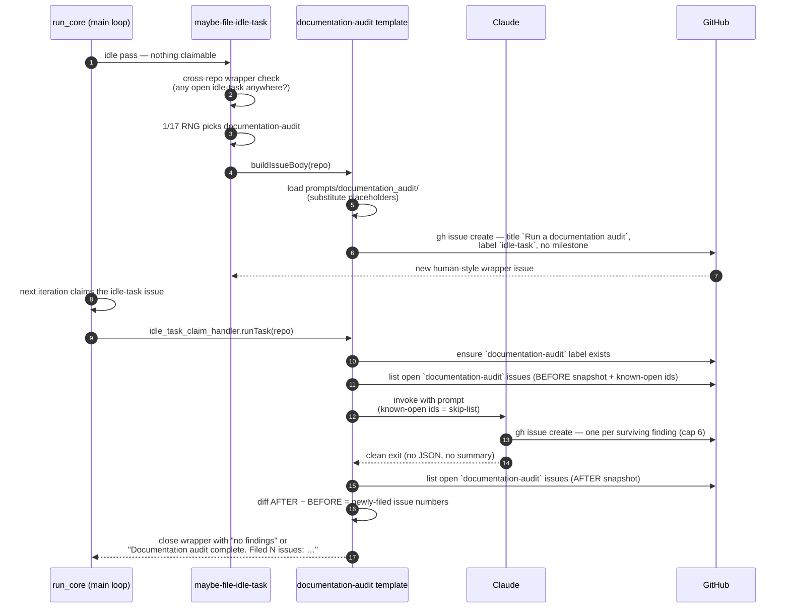

# 📚 Documentation-Audit Scans — Operator Manual

The documentation-audit scan is the thirteenth registered
[idle-task](IDLE-TASK-FRAMEWORK.md) template. When the worker has
no claimable work it may pick this template, clone one monitored repository, and
run a static, evidence-backed audit of that repo's **prose documentation** —
READMEs, `docs/**`, AI-agent instruction files (`CLAUDE.md`, `AGENTS.md`, and
other flavours), and the accumulated PR-summary archive. It files a small,
logically-grouped set of `documentation-audit` issues (most important first)
that ride the normal `work-on` flow. A clean audit files nothing.

> **Terminology.** An _idle task_ is background work the worker performs only
> when no higher-priority work exists; see the
> [idle-task framework](IDLE-TASK-FRAMEWORK.md). A _PR summary_ is the
> per-pull-request Markdown file under
> `docs/archive/pr-summaries/pr-summary-*.md` the worker writes for every PR —
> collectively they are the project's cross-machine "memory" of what was tried
> and what was learnt (including approaches that were tried and **abandoned**).

## Design intent — docs converge on one source of truth

Documentation rots. As a project evolves its docs gather duplicate, redundant,
outdated, contradictory and misleading content that leads agents (human and AI)
down the wrong path, and makes the project's goals more expensive to deduce.
Over repeated runs this audit makes a repo's docs **re-converge on a single
source of truth — the main README**:

- Durable learnings (successes **and** failed approaches) from the PR-summary
  archive are folded into the relevant existing docs/README sections, and the
  now-obsolete summaries are deleted — but a summary is only ever deleted
  **after** its learnings demonstrably land elsewhere, so no learning,
  especially a negative result, is lost.
- The main README stays factually accurate, current, and readable, linking _off_
  to the detailed docs rather than inlining them.
- Agent instruction files are trimmed to point at the README, or deleted when
  they add nothing beyond it — what an agent needed a year ago can be
  counter-productive now.
- Inconsistencies, contradictions, factual errors and stale content are hunted
  down; all references and links must resolve.

The scan **files issues only** — it never edits a file or raises a PR. The
actual documentation changes ride the normal `work-on` flow on the filed issues,
so a human approves each grouped change before it lands.

From v5 onward the prompt opens with the shared
[Phase 0 — Adapt to the project](IDLE-TASK-FRAMEWORK.md#phase-0--adapt-to-the-project)
stanza: a repo that has documented its own agent-file hierarchy or doc
layout no longer collects a check-9 false positive, because a
**documented** convention beats a check. An unsafe convention is filed as
a finding against the convention itself.

### Relationship to sibling scans

| Concern                                        | Owned by                                 |
| ---------------------------------------------- | ---------------------------------------- |
| Prose / Markdown documentation rot             | **this scan** (`documentation-audit`)    |
| Code doc-comment coverage (missing or paraphrase-only docstrings) | [`doc-coverage`](IDLE-TASK-FRAMEWORK.md) |
| Spelling mistakes on PRs                       | `spelling-fix`                           |

A candidate that belongs to a sibling scan is left to that scan.

## The twelve-check catalogue

The prompt (`prompts/documentation_audit/`) walks the documentation inventory
against twelve checks in Phase 2. Checks 1–9 are **drift-shaped** — they find
docs that disagree with other docs. Checks 10–12 (from v4 onward) are
**verification-shaped**: documentation is a set of claims about the codebase,
and each of those checks tests a claim against the source.

1. **Unabsorbed PR-summary learnings** — a durable learning (success or recorded
   failure) not yet reflected in the main docs. Fix: fold it in, then delete the
   obsolete summary. Related summaries are grouped by theme into one finding.
2. **Stale / obsolete content** — docs describing a feature, path, command, or
   workflow that no longer matches reality.
3. **Contradictions and inconsistencies** — two places that disagree; both are
   cited.
4. **Duplicate / redundant content** — the same material in more than one place,
   so the copies drift. From v4 onward this includes prose that **paraphrases an
   external tool's own documentation** instead of linking to it: document only
   our relationship to the external thing (which subset we use, what we
   configure differently) and link the canonical upstream guide for the rest.
5. **Redundant or stale agent files** — a **single** agent file that merely
   repeats the README or carries counter-productive guidance (multiple agent
   files coexisting is check 9).
6. **README not the source of truth** — the README is inaccurate, inlines detail
   that belongs in a linked doc, or fails to link off.
7. **Undefined terms, acronyms, and playful names** — a term or fun project name
   (e.g. a private-repo-14 "creature") used without a first-use plain-English
   definition; prefer an external link such as Wikipedia.
8. **Broken/invalid links, and missing diagrams** — a link that does not resolve
   (internal links strictly; external links best-effort), or a dense prose area
   where a [Mermaid](https://mermaid.js.org/) diagram would materially aid
   understanding.
9. **Multiple / redundant agent instruction files** — two or more substantive
   AI-agent instruction files (`AGENTS.md`, `CLAUDE.md`, `GEMINI.md`, near-miss
   variants like `AGENT.md`) coexisting in one repo is itself redundancy. The
   finding recommends consolidating towards a single set shared by humans and
   agents: instructions live in the `README.md` / human docs; provider-specific
   files (`CLAUDE.md`, `GEMINI.md`, …) are deleted after their unique content is
   folded in; at most one thin `AGENTS.md` pointer may remain. A one-line
   pointer stub does not count as a redundant second file.
10. **Referenced symbol does not exist** (from v4 onward) — every function,
    class, CLI command, flag, endpoint, config key, environment variable, prompt
    name, label and file path a doc names is resolved against the source by
    **reading** it, not recalling it. A reference that does not resolve is a
    `severity:high` finding: false documentation is worse than none, because
    readers act on it. This is the systematic superset of check 2. Findings
    collapse to **one per document**, listing every dead symbol.
11. **Code sample does not run** (from v4 onward) — for each fenced block
    presented as runnable: imports and paths resolve, the commands and flags
    exist with the documented signatures, and there is no hardcoded
    machine-local path, real credential, or unstated prior state. Verified
    statically (the scan never executes repo logic) by reading the flag's
    definition in the source. `severity:high`; several broken fences in one
    document are one finding.
12. **Unverifiable claim** (from v4 onward) — a performance number,
    compatibility matrix, scale limit, timeout default or "production-ready"
    assertion with no source in the repo (a benchmark, a CI matrix, a constant
    in code, a changelog entry). The finding states what would have to exist to
    back it. `severity:medium`.

### Cap pressure — verification out-produces drift

Three systematic verification checks over a large `docs/` tree can find far more
than the six-finding cap allows, so the audit would file nothing but check-10
findings against one document. Two rules keep the mix balanced:

- **Collapse per document.** All of one document's dead references are a single
  finding; all of its broken fences are another. Never one finding per symbol.
- **Grouping happens before the cap.** Phase 3 collapses verification candidates
  per document _first_, then sorts and applies the six-finding cap, so the drift
  checks are not starved by a single doc's symbol cluster.

## Idle trigger



## Wrapper issue layout

The wrapper issue is **human-style** — no hidden marker, no
parameters block. Anyone can paste the same prompt into a fresh issue with the
`idle-task` label and the worker will run it identically.

- **Title:** the literal string `Run a documentation audit`. Dispatch matches
  the title to
  [`documentationAuditTemplate.buildIssueTitle(repo)`](../worker/deno/lib/idle_task_templates/documentation_audit_template.ts).
- **Body:** the latest `prompts/documentation_audit/` template with the
  placeholders substituted at file time — `{{SUPPRESSED_IDS}}`,
  `{{KNOWN_OPEN_FINDING_IDS}}` and `{{OPEN_ISSUE_TITLES}}` (all render as
  `(none)` on the wrapper itself; both dedup lists are rebuilt from live issues
  at claim time, **repo-wide and label-blind** — see
  [Cross-label dedup](IDLE-TASK-FRAMEWORK.md#cross-label-dedup--the-open-issue-title-list)
  for the bounds, the loud `TRUNCATED` log, and the silent-skip rule).
- **Body fingerprint:** the prompt's H1 begins `# Documentation Audit …`,
  matched by `DOCUMENTATION_AUDIT_BODY_FINGERPRINT` so dispatch recognises the
  wrapper even if the title was edited (body-fingerprint dispatch).
- **Label:** the canonical `idle-task` label. No workflow labels.
- **No milestone** — the template sets `skipMilestone: true`, so the wrapper
  never gates a milestone-merge PR.

## Cadence — once per week per repo

The template sets `cooldownHours: 168`, so a given repo is audited for
documentation quality **at most once per week**. The per-repo cooldown gate
(`worker/deno/lib/idle_task_cooldown_gate.ts`) keys the window off the
`createdAt` of the most recent wrapper or finding the template produced in that
repo, so a fast-failing scan still counts towards the window.

## Issue label scheme

Filed documentation-audit issues carry exactly two labels — no
operational/workflow label is ever added.

| Label                 | Allowed values            | Meaning                                           |
| --------------------- | ------------------------- | ------------------------------------------------- |
| `documentation-audit` | (fixed)                   | Marks the issue as a documentation-audit finding. |
| `severity:<level>`    | `high` / `medium` / `low` | Triaged severity.                                 |

The worker is not authorised to apply any workflow label (`work-on`,
`top-priority`, `planning`, …); `label_security.ts` strips any such label added
by the worker on the next scan. A human toggles the next-phase label after
triage.

### Severity guidance

- **`severity:high`** — actively misleads: a factual error or contradiction that
  would send an agent down the wrong path; a referenced symbol that does not
  exist (check 10) or a runnable sample that cannot run (check 11); the README
  (source of truth) is materially inaccurate; a durable **negative** learning is
  at risk of being lost; multiple agent instruction files that already
  contradict each other.
- **`severity:medium`** — stale, duplicated, or redundant content; an
  unverifiable claim (check 12); prose paraphrasing upstream documentation
  instead of linking to it; an agent file that should be trimmed or deleted; two
  or more coexisting agent instruction files that should be consolidated; a
  batch of undefined terms.
- **`severity:low`** — polish: a broken link, a single undefined term, a place a
  diagram would help, minor readability.

## Stable finding ID recipe

Each finding's stable id is `BP-<12 hex>` computed from
`{ repo, "documentation-audit", slug-of-title, primary file }`. The literal
`"documentation-audit"` discriminator keeps these ids from colliding with
`best-practices`, `test-audit`, `supply-chain-readiness`, or `orphan-deps`
findings for the same file/title.

## 6-finding cap and priority order

A single run files at most **six** standalone findings, ordered `severity:high`

> `severity:medium` > `severity:low`. There is no overflow tracker — surplus
> candidates are silently dropped and the next scan re-detects them. Findings
> must be **meaningfully grouped**: never one issue per typo, never one
> unreviewable mega-issue.

## Suppression-comment syntax

A finding can be suppressed in-source with the shared
`best-practice-ignore: BP-…` grammar
(`worker/deno/lib/suppression_comments.ts`), typically as a Markdown comment
near the flagged content:

```markdown
<!-- best-practice-ignore: BP-1234567890ab — author=nigel expires=2026-12-31 this "duplicate" is an
intentional quick-start copy kept in sync by a doc test. -->
```

The scanner recognises the marker on future runs and drops the finding in Phase
3 triage without re-filing it.

## No PR, ever

The template sets `skipMilestone: true`, mirroring the other scan templates. A
documentation-audit run **never raises a pull request**: each finding is filed
as its own GitHub issue, the wrapper is closed with either `no findings` or
`Documentation audit complete. Filed N issues: …`, and nothing else. The actual
doc changes ride the normal `work-on` flow on the filed issues.

## Related documentation

- [Idle-task Framework](IDLE-TASK-FRAMEWORK.md) — the framework this scan plugs
  into.
- [Test-Audit Scans](TEST-AUDIT-SCAN.md) — the sibling LLM-driven audit this
  template is modelled on.
- [Best-Practices Scans](BEST-PRACTICES-SCAN.md) — bucket-scoped best-practices
  review.
