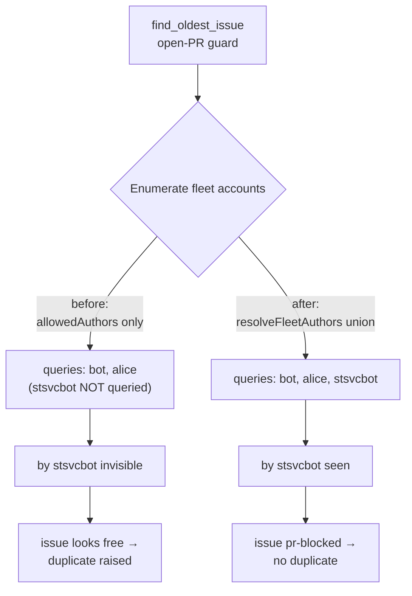
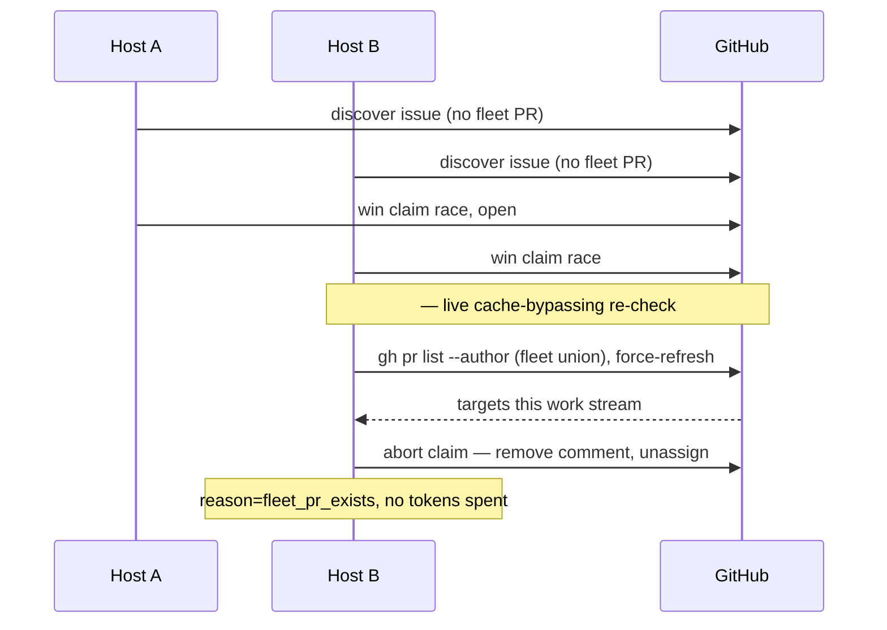

# 🔁 Root-cause note — fleet open-PR guard missed a duplicate

Part of (duplicate PRs for one issue still occur).

## Incident

Two identical PRs were raised for the same work in
`stSoftwareAU/private-repo-18`:

| PR   | Author        | Opened (UTC)     | For issue |
| ---- | ------------- | ---------------- | --------- |
| | `stsvcbot` | 2026-07-01 07:29 | |
| | `Vibecoderbot` | 2026-07-01 11:04 | |

 had been open ≈3.5 h when the host running as `Vibecoderbot` raised the
duplicate. The fleet-aware open-PR guard (`fetchOpenPRsForFleet` +
`getBlockingPRForIssue`) was supposed to prevent exactly this.

## How the guard is meant to work

`find_oldest_issue` enumerates the fleet's GitHub logins, fetches each one's
open PRs, and — for a non-milestone issue — treats **any** fleet-authored,
non-milestone open PR as a block (the "one PR per work stream" rule). So if the
`Vibecoderbot` host had seen `stsvcbot`'s, issue would have been
`pr-blocked` and would never have been raised.

The guard therefore fails **only** if was not in the PR set the guard
considered on that host.

## Candidate causes

| # | Candidate                                                             | Verdict                                                                                                                                                                                                   |
| - | --------------------------------------------------------------------- | --------------------------------------------------------------------------------------------------------------------------------------------------------------------------------------------------------- |
| 1 | Guard bug — `getBlockingPRForIssue` issue↔PR matching | **Eliminated.** For a non-milestone issue the guard blocks on _any_ non-milestone fleet PR; it does not match by branch/issue number, so would have blocked had it been in the set. |
| 2 | Stale per-user PR cache (`prs_${user}`) hiding | **Unlikely as sole cause.** The cache is iteration-scoped (`IssueCache`), so a stale `stsvcbot` entry could only hide within a single scan; the duplicate was raised 3.5 h later across many scans. |
| 3 | **Missing fleet-account config** — the host never queried `stsvcbot` | **Confirmed root cause (structural).** See below.                                                                                                                                                         |
| 4 | Outdated worker build (pre-) | **Not the primary cause, but undiagnosable.** Nothing in the logs stamped the build, so an outdated host could not be ruled in or out. Addressed by build stamping. |

## Determined root cause (cause 3)

`find_oldest_issue` built the guard's fleet author set from **`allowedAuthors`
only**:

```ts
const fleetAuthors = [options.githubUser, ...config.allowedAuthors];
```

But the canonical list of _sibling fleet logins_ is a **different** config key:
`fleetPrAuthors` (`fleet_pr_authors` — documented as "GitHub logins of sibling
fleet hosts whose open PRs this host should also maintain"). `allowedAuthors`
(`allowed_authors`) is the list of authors **authorised to create issues** — it
is not guaranteed to contain the sibling fleet accounts.

On the `Vibecoderbot` host, `stsvcbot` was configured as a fleet sibling in
`fleet_pr_authors` (so PR-feedback / CI maintenance covered it) but was **not**
in `allowed_authors`. The guard, reading only `allowedAuthors`, therefore
never issued `gh pr list --author stsvcbot`, so `stsvcbot`'s was
invisible to the guard and the duplicate was raised.

This is a structural blind spot, not a transient one: the two config keys can
legitimately diverge, and whenever they do the guard is permanently blind to any
sibling that appears only in `fleet_pr_authors`.



## Fixes landed in this issue

1. **Guard fix (closes cause 3).** `resolveFleetAuthors()`
   (`lib/fleet_authors.ts`) unions the host login, `allowedAuthors`, **and**
   `fleetPrAuthors` (deduped case-insensitively). `find_oldest_issue`,
   `diagnose_issue`, and `diagnose_repo` all use it, so no configured sibling
   can be a blind spot.
2. **Guard observability.** The guard now logs its inputs
   (`[issue-finder] … fleet-pr-guard authors=N per-author=bot=0,alice=1,… total-open-prs=M`)
   and the `pr-blocked` skip line now carries the blocking PR number. A future
   miss is diagnosable from the logs: an author _absent_ from the set points at
   config (cause 3); an author present with a surprising `0` count points at the
   cache (cause 2).
3. **Build/version stamping (closes cause 4's undiagnosability).**
   `lib/worker_build_info.ts` resolves `version` (from `deno.json`) + `commit`
   (from `VIBE_BUILD_COMMIT`). The stamp is emitted at startup
   (`[worker-build] version=… commit=…`) and included in the claim-time and
   PR-open log lines, so an outdated host is now visible in the logs.
4. **Fail-loud fleet-config validation.** `validateFleetConfig()`
   (`lib/fleet_config_validation.ts`) errors on an empty effective fleet set and
   warns when `allowed_authors` is empty or when a `fleet_pr_authors` sibling is
   missing from `allowed_authors` (the exact blind-spot shape). It runs at
   startup and is surfaced in `diagnose-repo` output.

## Residual window closed by (failure mode A)

The fix makes the **discovery-time** guard see every fleet sibling, but
that guard still runs **only once, at discovery**. A PR opened by a sibling
account in the window _between_ this host's discovery and its atomic claim is
invisible to it: the atomic claim (`claimIssue` in `lib/claim_issue.ts`)
re-checked assignees and issue-closed state but not fleet PRs. So two hosts that
pick up the same open issue at nearly the same time can each still open a PR
(the ``/`` timing on `private-repo-18`).

**Fix — live re-check inside the atomic claim chokepoint.** After
this host wins the earliest-comment claim race and **before any Claude/token
work begins**, `claimIssue` performs a live, cache-bypassing fleet open-PR
re-check:

- It fetches open PRs for the same fleet-author union the discovery guard uses
  (`resolveFleetAuthors(githubUser, allowedAuthors, fleetPrAuthors)`, passed in
  from `setup_branch_phase`), with the per-user cache **force-refreshed**
  (`fetchOpenPRsForFleet(..., forceRefresh = true)`) so a stale `prs_${user}`
  entry written at discovery cannot hide a just-opened sibling PR.
- It matches a blocking PR the same milestone-aware way as discovery
  (`getBlockingPRForIssue`).
- If a fleet PR already targets this work stream, the claim is **aborted**
  before any tokens are spent: this worker's claim comment is removed and the
  assignment released — mirroring the existing `claim_race=lost` cleanup — and
  the caller receives `reason: "fleet_pr_exists"`.

The re-check **fails open** (an empty fleet list or any API error returns "no
block") so a transient GitHub failure never blocks a legitimate claim, and it is
skipped entirely when no fleet authors are supplied — preserving the prior
single-host behaviour beyond the one extra live PR list.



## Out of scope (per the issue)

No auto-close / duplicate-cleanup machinery — this issue is diagnostics and
prevention only. Multi-account fleet operation is retained (per).
Post-merge re-pickup is handled by the Mode-B post-merge sub-issue of.
