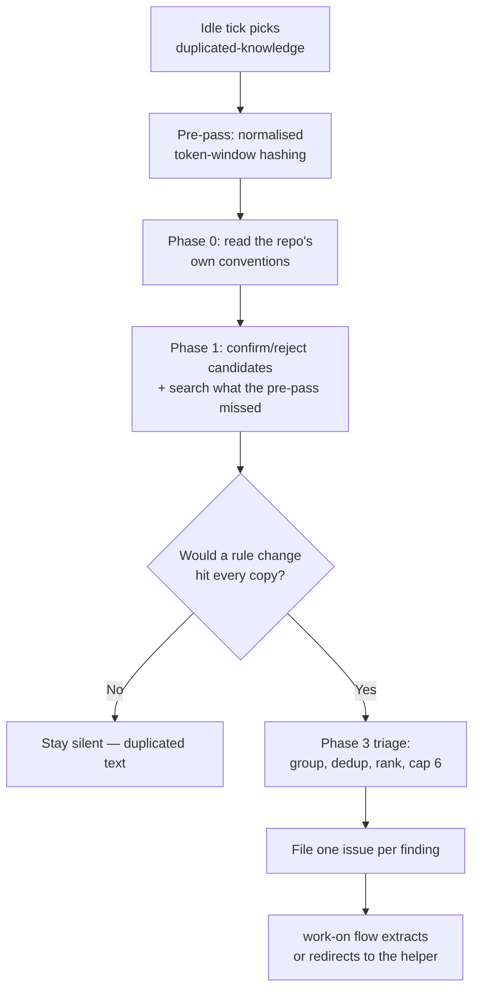

# 👯 Duplicated-Knowledge Scan — Operator Manual

The duplicated-knowledge scan is the seventeenth registered
[idle-task](IDLE-TASK-FRAMEWORK.md) template. When the worker has
no claimable work it may pick this template, clone one monitored repository, and
run a static, evidence-backed scan for **copy-pasted blocks that encode the same
knowledge** — blocks of five or more lines appearing in two or more places where
one call to an existing helper would serve them all. It files a small,
logically-grouped set of `duplicated-knowledge` issues (most important first)
that ride the normal `work-on` flow. A clean scan files nothing, and that is the
expected outcome for a well-factored repo.

> **Terminology.** An _idle task_ is background work the worker performs only
> when no higher-priority work exists; see the
> [idle-task framework](IDLE-TASK-FRAMEWORK.md). _Duplicated knowledge_ is one
> rule with more than one authoritative copy — if the rule changed, every copy
> would need the same edit. _Duplicated text_ is code that merely reads alike;
> it is **not** a finding.

## Design intent — the gap no other scan covers

Duplication is the measured signature of AI-assisted development. GitClear's
2025 longitudinal study of 211M lines of code found copy-pasted five-plus-line
blocks grew **eightfold** between 2021 and 2024, copy/pasted lines rose 8.3% →
12.3%, and the refactoring share of commits fell from 25% to under 10%. The Vibe
Coder is an AI-assisted-development fleet, so it produces exactly that signature
whenever a worker writes a fourth caller without searching for the existing
helper.

None of the sibling templates sees it. `dead-code` finds code nothing calls;
`orphan-deps` finds declared-but-unimported packages; `format-drift` measures
formatter and lint drift. A block pasted into three files — every copy live,
every copy called, every copy needing the same fix — is invisible to all of them.

## Biased towards silence — the rule that makes the scan safe

Duplicated **text** is not duplicated **knowledge** (Hunt & Thomas), and the
wrong abstraction is worse than duplication (Sandi Metz). Forcing unlike things
to share a helper produces a parameterised tangle that is harder to change than
the copies were, so the prompt is explicitly biased towards silence. It stays
quiet on:

- **structural or boilerplate similarity** — test scaffolding, imports,
  switch arms, config literals, generated or vendored code;
- **coincidental resemblance** — copies that would diverge under the next
  requirement change;
- **an abstraction that has already gone wrong** — an existing shared helper
  carrying per-caller flags or branches. The remedy there is re-inlining, not
  more sharing, so the scan says nothing;
- **a new abstraction with only two callers** — two copies are cheap to keep in
  sync and expensive to unify prematurely;
- **duplication a documented project convention sanctions** (Phase 0).

The scan prefers "call the existing helper at `<path>`" over "introduce a new
abstraction"; a finding that proposes a *new* helper is only filed when it has
**three or more** call sites.

## The one question that decides a finding

> **If the underlying rule changed, would every copy need the same edit?**

That question — not a similarity score, not a line count — is the test. The
filed issue must answer it explicitly: the concrete rule change imagined, and
why it lands on every cited site.

The scan **files issues only** — it never edits a file or raises a PR. The
extraction rides the normal `work-on` flow, so a human approves each change
before it lands.

## The deterministic pre-pass

`lib/duplicate_block_scanner.ts` runs before Claude and seeds the prompt's
`{{DUPLICATE_BLOCKS}}` placeholder, exactly as the coverage-gap scanner seeds
`{{COVERAGE_GAPS}}` for [`test-audit`](TEST-AUDIT-SCAN.md):

1. **Collect** the repo's source files — code extensions only, skipping tests,
   vendored, generated, and oversized files.
2. **Normalise** each line: trim, collapse internal whitespace, and drop blank,
   comment-only, and punctuation-only lines. Re-indentation and comment edits
   therefore cannot hide a clone; original line numbers are preserved so
   findings can cite `file:start-end`.
3. **Hash** a sliding window of five normalised lines (a 64-bit key from two
   independent 32-bit hashes) and index every position.
4. **Report** each window occurring in two or more places, greedily extended to
   the clone's full length — so a twenty-line copy is one candidate, not sixteen
   overlapping ones — largest first, capped at 25 candidates. Each is rendered
   as an indexed `<candidate index="N" lines="…" site_count="…">` element with a
   `<sites>` child, so the scan can carry a verdict for candidate 3 across
   phases and across a context compaction.

The pre-pass is a **hint, never a finding**: it reports duplicated text, and
Claude makes the knowledge-vs-text judgement. It is best-effort — if the walk
fails, the placeholder renders `(none)` and the scan searches unaided, including
for the duplication the pre-pass structurally cannot see (reworded copies,
cross-language copies, prose).

## Severity

| Severity          | When                                                                                       |
| ----------------- | ------------------------------------------------------------------------------------------ |
| `severity:high`   | The copies have already **diverged** — one carries a fix or guard the others lack. A latent bug. |
| `severity:medium` | The default. The copies still agree, but each is an edit the next rule change must remember. |
| `severity:low`    | Small or peripheral duplication where the helper already exists and the fix is a one-line substitution. |

## Relationship to sibling scans

| Concern                                          | Owned by                                             |
| ------------------------------------------------ | ---------------------------------------------------- |
| Copy-pasted blocks encoding one rule             | **this scan** (`duplicated-knowledge`)               |
| Code nothing calls                               | [`dead-code`](IDLE-TASK-FRAMEWORK.md)                |
| Declared-but-unimported packages                 | [`orphan-deps`](ORPHAN-DEPS-SCAN.md)                 |
| Formatter / lint drift                           | [`format-drift`](IDLE-TASK-FRAMEWORK.md)             |
| Test quality (WHAT-vs-HOW, coverage gaps)        | [`test-audit`](TEST-AUDIT-SCAN.md)                   |

A candidate that belongs to a sibling scan is left to that scan. The shared
`BP-` id prefix (with a `"duplicated-knowledge"` discriminator) keeps the
families from double-filing the same root cause.

## Contract summary

| Property       | Value                                                     |
| -------------- | --------------------------------------------------------- |
| Template name  | `duplicated-knowledge`                                    |
| Wrapper title  | `Run a duplicated-knowledge scan`                         |
| Findings label | `duplicated-knowledge` + one `severity:*`                 |
| Prompt         | `prompts/duplicated_knowledge/prompt.md`                  |
| Pre-pass       | `lib/duplicate_block_scanner.ts` → `{{DUPLICATE_BLOCKS}}` |
| Dedup          | `{{KNOWN_OPEN_FINDING_IDS}}` + `{{OPEN_ISSUE_TITLES}}` — both repo-wide, `(none)` when empty ([contract](IDLE-TASK-FRAMEWORK.md#cross-label-dedup--the-open-issue-title-list)) |
| Raises a PR?   | No — issue-only (`skipMilestone: true`)                   |
| Applies to     | Every monitored repo, language-agnostic                   |
| Cadence        | Once per repo per week (`cooldownHours: 168`)             |
| Per-run cap    | 6 findings                                                |

## Suppression

A finding is suppressed the same way as every sibling scan: add the shared
suppression comment carrying its stable id to the cited file — `<!--
best-practice-ignore: BP-… -->` in Markdown, `// best-practice-ignore: BP-…` in
code. Closing a filed issue without fixing it also keeps it from being re-filed
only until the next scan re-detects it, so prefer the in-source suppression when
the duplication is deliberate — and, better still, write the reason down as a
project convention, which Phase 0 then honours across every judgement-bearing
scan.
