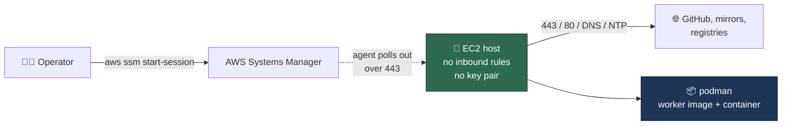
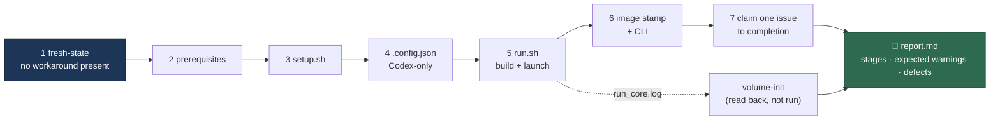

# 🐧 Linux Verification Host

The launcher's Linux branch probes Docker, then Podman
([Deployment](DEPLOYMENT.md#-requirements)), but the maintainer develops on
macOS — so that branch has never been confirmed on a real Linux host. This
page is the throwaway host that confirms it: one CloudFormation stack, one
Ubuntu 24.04 instance, reachable **only** through SSM Session Manager, with
the host-side prerequisites already installed.

The template is
[`infra/cloudformation/linux-verification-host.yaml`](../infra/cloudformation/linux-verification-host.yaml).
Everything below is done by hand over the session — there is no automated CI
check for this path, and that is the point: it exercises the documented manual
route in [Setup](SETUP.md#linux-debianubuntu-as-the-worked-example) exactly as
a reader would follow it.

## 📋 Table of Contents

- [What the stack creates](#what-the-stack-creates)
- [Before you launch](#before-you-launch)
- [Launch](#launch)
- [Connect](#connect)
- [Verify the launcher](#verify-the-launcher)
- [Faults to expect, not to patch](#faults-to-expect-not-to-patch)
- [Auto-stop and tear-down](#auto-stop-and-tear-down)
- [What the template deliberately does not do](#what-the-template-deliberately-does-not-do)

## What the stack creates

| Resource | Why |
| --- | --- |
| VPC, one public subnet, internet gateway, route table | Self-contained — no dependency on a default VPC that may not exist |
| Security group with **no inbound rules** and five outbound rules (443, 80, DNS, NTP) | The SSM agent dials out; nothing dials in |
| IAM role with `AmazonSSMManagedInstanceCore`, and an instance profile | The one permission Session Manager needs, and no other |
| One `t3.large` Ubuntu 24.04 instance, 100 GiB encrypted gp3 root, IMDSv2 required | The host under test |
| User data that installs `git`, `gh`, `jq`, `podman` and Deno, then clones the checkout | The documented Linux prerequisites — nothing else. No coding-agent CLI by default: the agent runs inside the image, and a Codex-only verification requires a host with **no** Claude CLI present (`HostAgentCli=claude` installs one when you are verifying a Claude deployment) |



## Before you launch

- An AWS account and credentials with permission to create the stack
  (`CAPABILITY_IAM` is required — the stack creates one role).
- The [Session Manager plugin](https://docs.aws.amazon.com/systems-manager/latest/userguide/session-manager-working-with-install-plugin.html)
  for the AWS CLI, on your own machine.
- The GitHub, Anthropic (or other provider) credentials you will type into the
  session. **Nothing goes in the template**: it carries no credential, and
  neither does the user data.
- Outbound access is limited to HTTPS, HTTP, DNS and NTP — there is no
  outbound SSH, so `gh` and `git` must authenticate over HTTPS.

## Launch

Run from the repository root, so the template path resolves:

```bash
aws cloudformation deploy \
  --template-file infra/cloudformation/linux-verification-host.yaml \
  --stack-name vibe-linux-verification \
  --capabilities CAPABILITY_IAM \
  --parameter-overrides AutoStopHours=8
```

Parameters worth overriding: `InstanceType`, `RootVolumeSizeGb`,
`AutoStopHours`, `VibeCoderRepositoryUrl` when verifying a fork, and
`HostAgentCli=claude` when the deployment under test runs Claude rather than
Codex — the default installs no agent CLI at all. Then read
the outputs — the instance id and the ready-made session command:

```bash
aws cloudformation describe-stacks \
  --stack-name vibe-linux-verification \
  --query 'Stacks[0].Outputs' --output table
```

## Connect

```bash
aws ssm start-session --target i-0123456789abcdef0
```

The instance takes a couple of minutes to register with Systems Manager and a
few more to finish its bootstrap. **Read the bootstrap status first** — the
user data records its outcome there rather than failing silently:

```bash
cat /var/log/vibe-bootstrap.status   # RUNNING | OK | FAILED at line N
sudo tail -50 /var/log/vibe-bootstrap.log
```

Anything other than `OK` means the prerequisites are incomplete; the log names
the failing command. Then take the session's shell as the `ubuntu` user:

```bash
sudo -iu ubuntu
cd ~/vibe-coder-runtime
podman --version && deno --version && gh --version && git --version
```

## Verify the launcher

The bar is the full cycle, not just a green setup: `setup.sh` completes,
`run.sh` builds the image **with podman**, the container starts, and the worker
takes one issue end to end — with **no** manual workaround anywhere. That run is
scripted (Issue #736), so its output is comparable between attempts and a later
regression is caught by running it again against a fresh host:

```bash
# Authenticate GitHub first. Choose HTTPS when asked: the host has no outbound
# SSH, so a git-over-SSH remote would hang.
gh auth login

# The whole cycle, recorded. Run it on the session's terminal with no stdin
# redirect: every credential and configuration prompt in setup.sh is behind a
# TTY check, and the script attaches your terminal to it (through util-linux
# `script`) so you answer live and the transcript is still captured.
infra/verify/first-run.sh
```

It runs seven stages — `./setup.sh` at stage 3, `./run.sh` at stage 5 — and
records each one's output under the transcript directory, then prints
`report.md`, the table to paste onto the issue you are verifying against. The
report carries an eighth row, `volume-init`: `run.sh` swallows volume
initialisation's own output, so that row is read back from the launcher's log
and `~/logs/run_core.log` rather than from a stage of its own, and it is
`SKIPPED` — never a pass — when neither source shows the initialisation ran.



Four properties are worth knowing before you read a report:

- **It verifies; it never repairs.** A host already carrying one of the
  workarounds — `VIBE_SKIP_PREREQ_CHECK`, a moved disk floor, an `[aliases]`
  block or `unqualified-search-registries` in your own `registries.conf`, a
  hand-written `.config.json`, a patched checkout, **any** image already in the
  container store — is refused at stage 1, before `setup.sh` is touched. A run
  that starts from a patched host proves nothing, and a host that already holds
  the base layers resolved those names before the run began.
- **A stage that did not run is `SKIPPED`, never a pass**, and the exit status
  is non-zero whenever anything was refused, failed or skipped short.
- **It tells `setup.sh` which agent this host runs.** A bare host has no
  `.config.json` for setup to read the selection from — writing that file is
  what stage 3 is for — so the run exports `VIBE_AGENT_PROVIDER=codex`, the
  first-run selection [SETUP.md](SETUP.md) documents. It is recorded as a note
  in the report, so you can see the declaration rather than find it in a log.
- **It leaves no worker behind.** The worker runs in the foreground under
  `run.sh`, so the script stops the launcher and any `vibe-coder` container
  before it exits. The built image is deliberately left for you: re-provision
  the host (or remove the image) before running the verification a second time,
  or stage 1 will refuse it — correctly.

The script only sequences the run — it gathers facts, starts `setup.sh` and
`run.sh`, waits on the container and the worker, and captures what each stage
printed. Every judgement in the report is made by the `first-run-verify` Deno
command, so each one is unit-tested without a host
(`worker/deno/tests/first_run_verification_test.ts`).

Useful flags: `--transcript-dir DIR` to put the transcript somewhere you have
already mounted, `--claim-timeout SECONDS` for how long the worker gets to take
an issue to completion, and `--launch-timeout` / `--poll-interval` for the wait
on the container. `--help` prints them.

If you need to drive a stage by hand — to reproduce one fault, or when the
script itself is what you are debugging — the same sequence is these commands,
in this order:

```bash
deno run --allow-run --allow-env worker/deno/mod.ts container-runtime-detect
VIBE_AGENT_PROVIDER=codex ./setup.sh   # on a terminal: the prompts are TTY-gated
./run.sh
podman ps && tail -n 200 ~/logs/worker.log
```

Doing so leaves the host non-fresh, so it is a debugging path, not a
verification: only the scripted run produces a `report.md` to attach.

The scripted run is the only detection there is for the behaviour no unit test
covers — a real `podman run`, a real Podman volume, a real image build. Its
`report.md` is therefore the evidence: attach it to the issue rather than
paraphrasing it. Every line it quotes is passed through the repository's secret
redaction first; the raw stage transcripts beside it are **not**, and stage 3
captures your whole `setup.sh` terminal session, so keep the transcript
directory off public issues.

## Faults to expect, not to patch

The host stays stock Ubuntu apart from the installs above, so the podman
environment faults reported from a real Ubuntu deployment reproduce here. That
is deliberate: this host exists to confirm their fixes, so the template must
not paper over them.

| Fault | What it looks like |
| --- | --- |
| Rejected mount options | Container start rejects `tmpfs` options the Docker path accepts |
| Disk floor | The worker declines to claim work because free space is below the larger of 20 GB and 10% of the filesystem — at the default 100 GiB root, the floor is the 20 GB constant |
| Volume verbs | Recovery paths that assume Docker's spelling of a volume command |

If a fault reproduces, it belongs on the issue that owns it, with the exact
command and output from this session.

The report separates the two things a reader would otherwise have to tell apart
by hand:

| Report section | What it holds |
| --- | --- |
| **Expected warnings** | Messages that are benign and permanent — a private-repository ruleset 403, which needs GitHub Pro and is non-fatal (Issue #733), and a runtime that refuses `FITRIM`, which is stated rather than warned about and starts no recovery on its own (Issue #734) |
| **New defects** | A fault a sibling fix already removed, named with the issue that owns it — a refused `tmpfs` mount option (#727), a base image that will not resolve (#728), a volume verb the runtime rejects (#731), a refused launch (#732), a refused trim followed by a refused launch (#734), or setup demanding the Claude CLI on a Codex-only host (#730) |

Anything under **New defects** is a workaround still required, and a workaround
still required is a defect: file it as a further sub-issue rather than applying
it and declaring the run a success.

Short-name image resolution is no longer on that list: both base images in
`container/Containerfile` name `docker.io` explicitly, so podman's enforcing
short-name mode never has a registry to guess (Issue #728). A build that still
fails to resolve a base image here is a regression, not a host fault — capture
it as one.

## Auto-stop and tear-down

The instance stops itself `AutoStopHours` (default 8) after boot — enough to
monitor a run, short enough that a forgotten host stops costing money. It is a
**stop**, not a terminate: the root volume survives and the instance can be
started again.

Two consequences worth knowing:

- Reconnecting does **not** extend the window. Cancel it with
  `sudo shutdown -c`, or re-arm a longer one with
  `sudo shutdown -h +480 "extended"`.
- The user data runs once, so after a restart nothing re-arms the timer —
  schedule it again by hand with the command above.

Tear-down is manual and removes everything the stack created, including the
VPC:

```bash
aws cloudformation delete-stack --stack-name vibe-linux-verification
aws cloudformation wait stack-delete-complete --stack-name vibe-linux-verification
```

## What the template deliberately does not do

- **No credentials.** Not in the template, not in the user data. GitHub,
  Anthropic and coding-agent credentials are supplied interactively in the
  session, so nothing sensitive lands in CloudFormation.
- **No key pair and no inbound rules.** Session Manager is the only access
  path; there is no SSH port to leave open and no key to lose.
- **No Docker.** The launcher probes Docker first, so leaving it out is what
  forces the podman branch to run.
- **No podman pre-patching.** See
  [Faults to expect](#faults-to-expect-not-to-patch).
- **No coding-agent CLI by default.** The agent runs inside the image, and the
  Codex-only run of Issue #736 requires a host with no Claude CLI present, so
  installing one unconditionally would refuse the run this host exists for.
- **No automated CI check.** Verification here is manual by design: it needs a
  real host, a real Podman and a real image build. `infra/verify/first-run.sh`
  is what makes the run repeatable and its output comparable — the launcher's
  own unit tests stay runtime-free.
