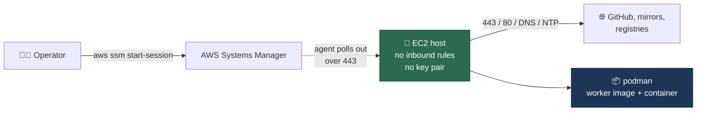

# 🐧 Linux Verification Host

The launcher's Linux branch probes Docker, then Podman
([Deployment](DEPLOYMENT.md#-requirements)), but the maintainer develops on
macOS — so that branch has never been confirmed on a real Linux host. This
page is the throwaway host that confirms it: one CloudFormation stack, one
Ubuntu 24.04 instance, reachable **only** through SSM Session Manager, with
the host-side prerequisites already installed.

The template is
[`infra/cloudformation/linux-verification-host.yaml`](../infra/cloudformation/linux-verification-host.yaml).
Everything below is done by hand over the session — there is no automated CI
check for this path, and that is the point: it exercises the documented manual
route in [Setup](SETUP.md#linux-debianubuntu-as-the-worked-example) exactly as
a reader would follow it.

## 📋 Table of Contents

- [What the stack creates](#what-the-stack-creates)
- [Before you launch](#before-you-launch)
- [Launch](#launch)
- [Connect](#connect)
- [Verify the launcher](#verify-the-launcher)
- [Faults to expect, not to patch](#faults-to-expect-not-to-patch)
- [Auto-stop and tear-down](#auto-stop-and-tear-down)
- [What the template deliberately does not do](#what-the-template-deliberately-does-not-do)

## What the stack creates

| Resource | Why |
| --- | --- |
| VPC, one public subnet, internet gateway, route table | Self-contained — no dependency on a default VPC that may not exist |
| Security group with **no inbound rules** and five outbound rules (443, 80, DNS, NTP) | The SSM agent dials out; nothing dials in |
| IAM role with `AmazonSSMManagedInstanceCore`, and an instance profile | The one permission Session Manager needs, and no other |
| One `t3.large` Ubuntu 24.04 instance, 100 GiB encrypted gp3 root, IMDSv2 required | The host under test |
| User data that installs `git`, `gh`, `jq`, `podman`, Deno and the Claude CLI, then clones the checkout | The documented Linux prerequisites — nothing else |



## Before you launch

- An AWS account and credentials with permission to create the stack
  (`CAPABILITY_IAM` is required — the stack creates one role).
- The [Session Manager plugin](https://docs.aws.amazon.com/systems-manager/latest/userguide/session-manager-working-with-install-plugin.html)
  for the AWS CLI, on your own machine.
- The GitHub, Anthropic (or other provider) credentials you will type into the
  session. **Nothing goes in the template**: it carries no credential, and
  neither does the user data.
- Outbound access is limited to HTTPS, HTTP, DNS and NTP — there is no
  outbound SSH, so `gh` and `git` must authenticate over HTTPS.

## Launch

Run from the repository root, so the template path resolves:

```bash
aws cloudformation deploy \
  --template-file infra/cloudformation/linux-verification-host.yaml \
  --stack-name vibe-linux-verification \
  --capabilities CAPABILITY_IAM \
  --parameter-overrides AutoStopHours=8
```

Parameters worth overriding: `InstanceType`, `RootVolumeSizeGb`,
`AutoStopHours`, and `VibeCoderRepositoryUrl` when verifying a fork. Then read
the outputs — the instance id and the ready-made session command:

```bash
aws cloudformation describe-stacks \
  --stack-name vibe-linux-verification \
  --query 'Stacks[0].Outputs' --output table
```

## Connect

```bash
aws ssm start-session --target i-0123456789abcdef0
```

The instance takes a couple of minutes to register with Systems Manager and a
few more to finish its bootstrap. **Read the bootstrap status first** — the
user data records its outcome there rather than failing silently:

```bash
cat /var/log/vibe-bootstrap.status   # RUNNING | OK | FAILED at line N
sudo tail -50 /var/log/vibe-bootstrap.log
```

Anything other than `OK` means the prerequisites are incomplete; the log names
the failing command. Then take the session's shell as the `ubuntu` user:

```bash
sudo -iu ubuntu
cd ~/vibe-coder-runtime
podman --version && deno --version && gh --version && claude --version
```

## Verify the launcher

The bar is the full cycle, not just a green setup. Run it in order:

```bash
# 1. The launcher can see podman (Docker is deliberately absent, so this is
#    the podman branch)
deno run --allow-run --allow-env worker/deno/mod.ts container-runtime-detect

# 2. Authenticate GitHub. Choose HTTPS when asked: the host has no outbound
#    SSH, so a git-over-SSH remote would hang.
gh auth login

# 3. One-time setup — run it on the session's terminal with no stdin
#    redirect. Every credential and configuration prompt is behind a TTY
#    check, so `./setup.sh < /dev/null` would skip all of them and step 4
#    would then exit on the missing configuration. Setup offers to run
#    `claude setup-token` for the long-lived OAuth token the containerised
#    worker reads, and asks for the monitored repositories and the allowed
#    author.
./setup.sh

# 4. Launch: builds the worker image with podman, then starts the container
./run.sh

# 5. Watch the worker take one issue end to end
tail -f ~/logs/worker.log
podman ps
```

"Working OK" means all five steps hold: `setup.sh` completes, `run.sh` builds
the image **with podman**, the container starts, and the worker processes one
issue end to end. Record what actually happened on the issue you are verifying
against — a step that needed a workaround is a finding, not a footnote.

## Faults to expect, not to patch

The host stays stock Ubuntu apart from the installs above, so the podman
environment faults reported from a real Ubuntu deployment reproduce here. That
is deliberate: this host exists to confirm their fixes, so the template must
not paper over them.

| Fault | What it looks like |
| --- | --- |
| Rejected mount options | Container start rejects `tmpfs` options the Docker path accepts |
| Disk floor | The worker declines to claim work because free space is below the larger of 20 GB and 10% of the filesystem — at the default 100 GiB root, the floor is the 20 GB constant |
| Volume verbs | Recovery paths that assume Docker's spelling of a volume command |

If a fault reproduces, it belongs on the issue that owns it, with the exact
command and output from this session.

Short-name image resolution is no longer on that list: both base images in
`container/Containerfile` name `docker.io` explicitly, so podman's enforcing
short-name mode never has a registry to guess (Issue #728). A build that still
fails to resolve a base image here is a regression, not a host fault — capture
it as one.

## Auto-stop and tear-down

The instance stops itself `AutoStopHours` (default 8) after boot — enough to
monitor a run, short enough that a forgotten host stops costing money. It is a
**stop**, not a terminate: the root volume survives and the instance can be
started again.

Two consequences worth knowing:

- Reconnecting does **not** extend the window. Cancel it with
  `sudo shutdown -c`, or re-arm a longer one with
  `sudo shutdown -h +480 "extended"`.
- The user data runs once, so after a restart nothing re-arms the timer —
  schedule it again by hand with the command above.

Tear-down is manual and removes everything the stack created, including the
VPC:

```bash
aws cloudformation delete-stack --stack-name vibe-linux-verification
aws cloudformation wait stack-delete-complete --stack-name vibe-linux-verification
```

## What the template deliberately does not do

- **No credentials.** Not in the template, not in the user data. GitHub,
  Anthropic and coding-agent credentials are supplied interactively in the
  session, so nothing sensitive lands in CloudFormation.
- **No key pair and no inbound rules.** Session Manager is the only access
  path; there is no SSH port to leave open and no key to lose.
- **No Docker.** The launcher probes Docker first, so leaving it out is what
  forces the podman branch to run.
- **No podman pre-patching.** See
  [Faults to expect](#faults-to-expect-not-to-patch).
- **No automated CI check.** Verification here is manual by design; the
  launcher's own unit tests stay runtime-free.
