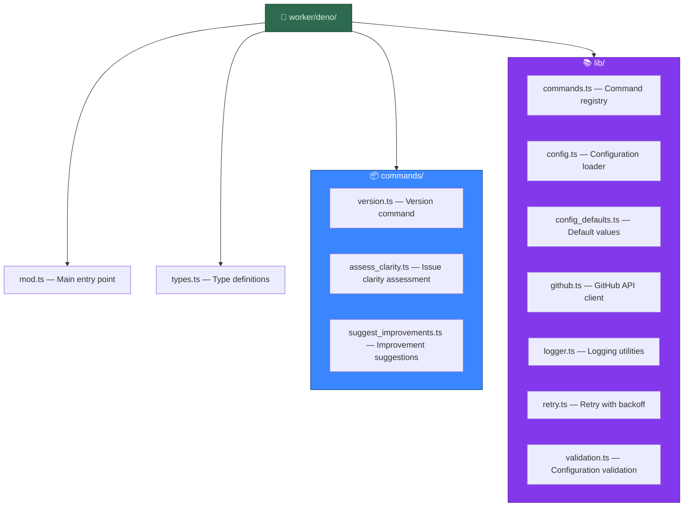
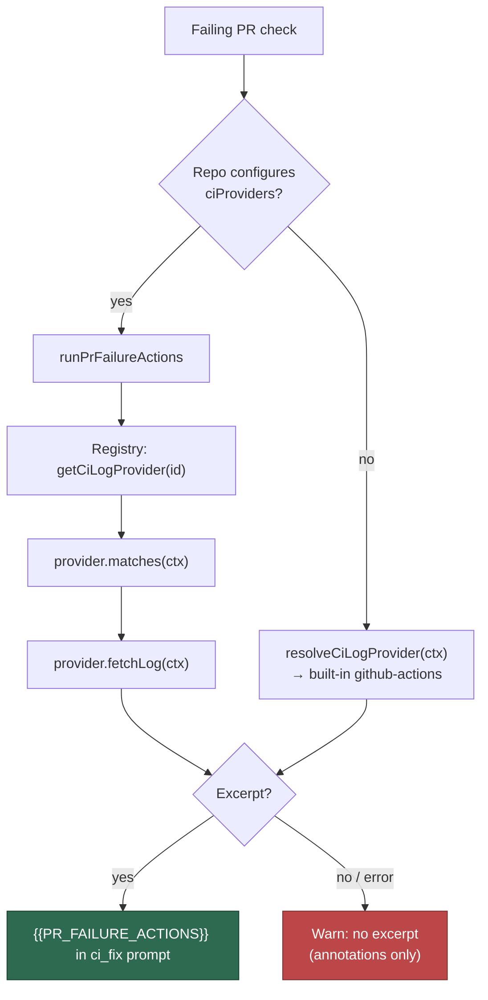
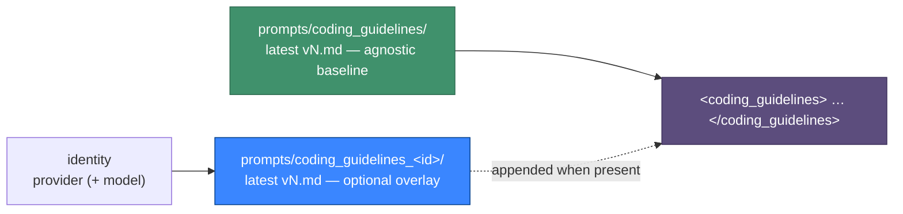

# 🔧 Extending the Worker

The Vibe Coder worker is built on a **Deno TypeScript** architecture with 103 commands, 299 libraries, and 550 test files (counts as of June 2026 — see `worker/deno/` for the current set). All business logic lives in `worker/deno/`. For a quick overview, see the [main README](../README.md).

## 📋 Table of Contents

- [Architecture](#architecture)
- [Adding a New Command](#adding-a-new-command)
- [Adding a CI Log Provider](#adding-a-ci-log-provider)
- [Running Deno Commands](#running-deno-commands)
- [Prompt Versioning and Templates](#prompt-versioning-and-templates)
- [Shell Integration (Internal)](#shell-integration-internal)
- [Running Tests](#running-tests)

## 🏗️ Architecture

The worker uses a command-based architecture implemented in TypeScript:



### 📐 Key Types

- **`Result<T, E>`** — Discriminated union for consistent error handling: `{ ok: true; value: T } | { ok: false; error: E }`
- **`WorkerConfig`** — Worker configuration loaded from `.config.json`
- **`CommandResult<T>`** — Return type for all commands: `{ success: boolean; message: string; data?: T }`
- **`Command`** — Interface for command handlers: `{ name: string; description: string; execute(args, config): Promise<CommandResult> }`

## ➕ Adding a New Command

1. Create a new file in `worker/deno/commands/`:

```typescript
// worker/deno/commands/my_command.ts
import type { Command, CommandResult, WorkerConfig } from "../types.ts";

export const myCommand: Command = {
  name: "my-command",
  description: "Description of what this command does",

  async execute(
    args: Record<string, unknown>,
    config: WorkerConfig
  ): Promise<CommandResult> {
    // Your logic here
    return {
      success: true,
      message: "Result message",
      data: { /* optional data */ },
    };
  },
};
```

2. Register the command in `worker/deno/mod.ts`:

```typescript
import { myCommand } from "./commands/my_command.ts";

export function createDefaultRegistry(): CommandRegistry {
  const registry = createCommandRegistry();
  registry.register(versionCommand);
  registry.register(assessClarityCommand);
  registry.register(myCommand);  // Add your command
  return registry;
}
```

3. Add tests in `worker/deno/tests/my_command_test.ts`

### ⚠️ Registry Error Handling

Registry methods return `Result` types instead of throwing:

```typescript
const registry = createCommandRegistry();
const registerResult = registry.register(myCommand);
if (!registerResult.ok) {
  console.error(registerResult.error.message); // e.g., "already registered"
}

const executeResult = await registry.execute("my-command", {}, config);
if (!executeResult.ok) {
  console.error(executeResult.error.message); // e.g., "Unknown command"
} else {
  console.log(executeResult.value.message); // CommandResult
}
```

## 🔌 Adding a CI Log Provider

When a PR's CI fails, the worker feeds an authoritative log excerpt into the
`{{PR_FAILURE_ACTIONS}}` slot of the `ci_fix` prompt. **GitHub Actions is the
built-in default provider** — every repo gets job logs with no configuration.
External CI/CD systems plug in through the `CiLogProvider` extension point in
`worker/deno/lib/ci_log_provider.ts`; Jenkins
(`worker/deno/lib/ci_provider_jenkins.ts`) is simply the first one.



To add a provider:

1. Create `worker/deno/lib/ci_provider_<name>.ts` exporting a `CiLogProvider`:

   ```typescript
   export const myCiLogProvider: CiLogProvider = {
     id: "my-ci",
     // Can this provider resolve a log for this failing check?
     matches: (ctx) => ctx.providerConfig?.provider === "my-ci",
     // Fetch a bounded root-cause excerpt. Never throws.
     fetchLog: async (ctx) => ({
       ok: true,
       value: {
         providerId: "my-ci",
         buildId: "42",
         url: "https://my-ci.example.com/build/42",
         status: "failed",
         logText: await fetchTail(ctx),
       },
     }),
   };
   ```

2. Register it with `registerCiLogProvider(myCiLogProvider)` — the built-ins
   register themselves at the bottom of `ci_log_provider.ts`. Ids are unique;
   re-registering one throws so a clash fails loudly.
3. Configure it per repo via `repo_config.<owner/repo>.ciProviders` (see
   [Per-repository configuration](CONFIGURATION.md#-per-repository-configuration)).

Contract notes:

- `fetchLog()` **never throws** — return `{ ok: false, error }` instead.
- Never return a successful excerpt with empty `logText`: the dispatcher
  rejects it as an explicit error so degraded fix quality is visible rather
  than silent.
- Cap `logText` at the provider's own byte limit; the renderer caps again at
  16 KiB per excerpt.
- The dispatcher (`pr_failure_actions.ts`) needs **no edit** to gain a new
  provider.

## ▶️ Running Deno Commands

Commands can be executed directly:

```bash
# Get version information
deno run --allow-env worker/deno/mod.ts version

# Assess issue clarity
deno run --allow-env worker/deno/mod.ts assess-clarity \
  --title "Fix bug" \
  --body "Description"

# List available commands
deno run --allow-env worker/deno/mod.ts help
```

## 🤖 Standard Workflows Provisioned by `setup workflow-sync`

`setup workflow-sync` audits each monitored repository against the
canonical workflow specifications in
`worker/deno/lib/workflow_definitions.ts` and raises an issue for every
spec whose detection patterns are absent. Each spec ships with a ready-to-paste
template, so a newly onboarded repo inherits the same CI baseline as
the rest of the fleet.

Universal specs (applied to every repo regardless of language) include:

- **`gitleaks`** — secret scanning on every PR.
- **`semgrep`** — SAST scanning on every PR.
- **`markdown-lint`** — runs `markdownlint-cli2` against
  the same `.markdownlint-cli2.jsonc` configuration used locally by
  `quality.sh`, on every PR and on pushes to the default branch.
  Optionally mirrors the local `check-mermaid` quality gate when the
  Deno worker module is present in the repo.

Language-specific specs cover Rust, Deno, Node, Java, and Bash projects;
see `WORKFLOW_SPECS` in `workflow_definitions.ts` for the complete list.

### Pinning third-party actions in templates

Every emitted template references third-party CI components by immutable
digest — a 40-character commit SHA for actions, a `@sha256:` digest for
container images. A mutable `@v4`, `@main`, `@master`, or `@stable` ref
would let whoever hijacks the upstream tag (or pushes to its default
branch) run code in every repository that adopted the template, in
several cases with an org-level PAT or a CI token in scope.

When you add or bump a template:

- Take the ref from `pinnedAction("owner/repo")` in
  `worker/deno/lib/pinned_actions.ts` — never hard-code a `uses:` value.
  Adding a pin there is the only way to reference a new action; the
  helper throws for an unrecorded one.
- Bump the SHA and the `version` label together, honouring the 24-hour
  supply-chain quarantine for external dependencies.
- Actions that read their behaviour from the ref name
  (`dtolnay/rust-toolchain@stable`, `taiki-e/install-action@<tool>`) need
  an explicit `toolchain:` / `tool:` input once pinned, because a SHA
  carries no name.

`worker/deno/tests/workflow_definitions_test.ts` iterates the whole
`WORKFLOW_SPECS` catalogue and fails on any unpinned ref, untagged
container image, or drift between the emitted Semgrep template and this
repository's own `.github/workflows/semgrep.yml`.

## 🧹 Maintenance Commands

A small set of commands target one-off operator workflows rather than the
main scan/issue/PR loop. They are registered alongside the regular
commands and run via `deno run worker/deno/mod.ts <name>`.

### `purge-stale-workflow-issues`

Re-audits each configured repo (or a single repo passed via `--repo`)
and closes any open issue carrying a workflow-sync deduplication tag —
`<!-- vibe-coder:workflow-sync:<specId> -->` or
`<!-- vibe-coder:workflow-sync:partial:<specId> -->` — whose underlying
workflow now classifies as **present** under the current detection
logic. Issues that still classify as `partial` or `missing` are left
untouched.

```bash
# Dry run across all configured repos
deno run --allow-all worker/deno/mod.ts \
  purge-stale-workflow-issues --dry-run

# Single-repo run that actually closes issues
deno run --allow-all worker/deno/mod.ts \
  purge-stale-workflow-issues --repo owner/repo
```

The command is intended as a one-off cleanup after improvements to the
workflow auditor — the existing dedup tag prevents
the regular `workflow-sync` from re-creating the false-positive issues,
but it does not retroactively close them.

### `audit-default-branch-rulesets`

Read-only sweep of the default-branch **ruleset** decision. For every repo it
prints what the setup-time sync **would** do — `create` / `update` the worker's
`Vibe Coder default branch` ruleset, `delete` its own stale one from a
direct-push branch, or skip (`direct-push-branch`, `opted-out`,
`existing-ruleset`, `no-reported-checks`) — as a Markdown table. Nothing is
written. See [MERGE.md → Never lock a direct-push branch](MERGE.md#never-lock-a-direct-push-branch)
for the decision.

```bash
# Every non-archived repo of an organisation (no .config.json needed)
deno run --allow-all worker/deno/mod.ts \
  audit-default-branch-rulesets --org stSoftwareAU

# A hand-picked list, or (with neither flag) the configured monitored repos
deno run --allow-all worker/deno/mod.ts \
  audit-default-branch-rulesets --repos owner/a,owner/b
```

## 📝 Prompt Versioning and Templates

Prompts sent to Claude are stored as versioned markdown templates in the `prompts/` directory. For a short summary of **the goal of each prompt type** (issue, planning, planning_critique, question, PR feedback, spelling fix, CI fix, coding guidelines, grill-me, workflow_setup, and the idle-task scans — security_scan, best_practices, test_audit, github_actions_audit, supply_chain_readiness, supply_chain_detection), see [Prompt goals (summary)](PROMPTS.md). The full prompt text is in the repo only.

Each directory under `prompts/` holds one or more immutable `vN.md` files;
the worker loads the highest-numbered version at runtime. Browse the
directories on GitHub for the current list of versions.

```mermaid
graph TD
    root["📝 prompts/"]

    cg["coding_guidelines/<br/>vN.md (one or more immutable versions)"]
    iss["issue/<br/>vN.md (one or more immutable versions)"]
    plan["planning/<br/>vN.md (one or more immutable versions)"]
    pc["planning_critique/<br/>vN.md (one or more immutable versions)"]
    prf["pr_feedback/<br/>vN.md (one or more immutable versions)"]
    qst["question/<br/>vN.md (one or more immutable versions)"]
    sf["spelling_fix/<br/>vN.md (one or more immutable versions)"]
    cf["ci_fix/<br/>vN.md (one or more immutable versions)"]
    gm["grill-me/<br/>vN.md (one or more immutable versions)"]
    ws["workflow_setup/<br/>vN.md (one or more immutable versions)"]
    ss["security_scan/<br/>vN.md (one or more immutable versions)"]
    bp["best_practices/<br/>vN.md (one or more immutable versions)"]
    ta["test_audit/<br/>vN.md (one or more immutable versions)"]
    gaa["github_actions_audit/<br/>vN.md (one or more immutable versions)"]
    scr["supply_chain_readiness/<br/>vN.md (one or more immutable versions)"]
    scd["supply_chain_detection/<br/>vN.md (one or more immutable versions)"]

    root --> cg
    root --> iss
    root --> plan
    root --> pc
    root --> prf
    root --> qst
    root --> sf
    root --> cf
    root --> gm
    root --> ws
    root --> ss
    root --> bp
    root --> ta
    root --> gaa
    root --> scr
    root --> scd

    style root fill:#5c4d7d,stroke:#3c2f5a,color:#e0d6f0
    style cg fill:#40916c,stroke:#2d6a4f,color:#fff
    style iss fill:#3a86ff,stroke:#023e8a,color:#fff
    style plan fill:#2a9d8f,stroke:#1a7a6e,color:#fff
    style pc fill:#1d7874,stroke:#125653,color:#fff
    style prf fill:#e85d04,stroke:#dc2f02,color:#fff
    style qst fill:#f4a261,stroke:#e08c3e,color:#000
    style sf fill:#8338ec,stroke:#5a189a,color:#fff
    style cf fill:#e63946,stroke:#c5233c,color:#fff
    style gm fill:#f72585,stroke:#b5179e,color:#fff
    style ws fill:#264653,stroke:#1a2c33,color:#fff
    style ss fill:#9d0208,stroke:#6a040f,color:#fff
    style bp fill:#6a994e,stroke:#386641,color:#fff
    style ta fill:#bc4749,stroke:#7a2f30,color:#fff
    style gaa fill:#005f73,stroke:#003845,color:#fff
    style scr fill:#7f5539,stroke:#583e28,color:#fff
    style scd fill:#52489c,stroke:#36306b,color:#fff
```



> **⚠️ Existing versions are immutable:** Do NOT modify an existing `v*.md` file. Once committed, a prompt version is frozen. This is enforced by `quality.sh`.

### Per-model coding-guidelines overlays

The shared `coding_guidelines` template is model-agnostic, so genuinely
model-specific working-style guidance lives in an **overlay** prompt type
(Issue #374). An overlay is an ordinary versioned prompt directory named after
the agent identity it applies to:

| Directory | Applies to |
|-----------|------------|
| `prompts/coding_guidelines_<provider>/` | Every run of that provider (`claude`, `codex`, `gemini`) |
| `prompts/coding_guidelines_<provider>_<model>/` | That provider running that model (e.g. `..._claude_opus`) |

`buildCodingGuidelines()` takes an optional identity, resolves the
model-specific directory first and the provider-wide one second, and appends
the winning overlay **behind** the agnostic baseline inside the single
`<coding_guidelines>` wrapper. Rules:

- **No identity, or no directory for it → the baseline, byte for byte.** That
  is the default and the common path; an unknown identity never throws and
  never emits an empty heading.
- **A directory that exists but carries no `vN.md` fails loud** — it was
  authored deliberately, so "no overlay" would mask the mistake.
- Identity ids are slugged to a single path segment (`[a-z0-9-]`), so a
  malformed provider id cannot escape `prompts/`.
- `skip_screenshot_check` repositories strip Playwright guidance from the
  overlay as well as the baseline.
- **The issue-prompt cache is not identity-aware.** `computeStaticPromptHash()`
  (`lib/prompt_builder_cache.ts`) keys the cached system prompt on the repo and
  the static templates alone, so `buildIssuePrompt()` is deliberately called
  with no identity — an overlay must never ride that path until the identity is
  folded into that hash, or one provider's cached system prompt would be served
  to another's run.

The shipped worked example is
[`prompts/coding_guidelines_claude/`](https://github.com/stSoftwareAU/VibeCoder/tree/main/prompts/coding_guidelines_claude).
Which observed behaviour justifies a given overlay is recorded in
[MODEL-AND-CACHING.md § Model-generation prompt tuning](MODEL-AND-CACHING.md#model-generation-prompt-tuning).



**CI fix enrichment**: The latest `ci_fix` template carries a
`{{PR_FAILURE_ACTIONS}}` placeholder. The worker substitutes an authoritative
CI log excerpt into that placeholder before invoking Claude — from a
configured provider (e.g. a Jenkins console tail) or, failing that, from the
built-in GitHub Actions provider. See
[Adding a CI Log Provider](#adding-a-ci-log-provider) for the extension point
and [Per-repository PR failure actions](per-repo-pr-failure-actions.md) for
the config schema, env var contract, worked private-repo-12 example, and
troubleshooting symptoms.

**To update a prompt**: Create a new version file (e.g., `v2.md`). The latest version (highest number) is used automatically.

**Traceability**: The worker logs which prompt version was used for each issue.

**Custom prompts directory**: Set the `PROMPTS_DIR` environment variable to override the default prompts location.

## 🔗 Shell Integration (Internal)

`run.sh` and `run.ps1` launch the worker container, which `exec`s Deno on the `run-entrypoint` driver inside it (— no bash on the runtime path). In the opt-in native run mode `run.sh` starts the same `run-entrypoint` driver directly on the host instead. The remaining shell tooling (e.g. `quality.sh`) invokes Deno commands directly (the `deno_bridge.sh` bash bridge was retired in Issue #97 — nothing sourced it):

- `deno run --allow-X worker/deno/mod.ts <command-name> [--arg value ...]`

> **Note:** All new logic should be added as Deno TypeScript commands — do not add business logic to shell scripts.

## 🧪 Running Tests

```bash
cd worker/deno
deno test --allow-read --allow-env --allow-run --allow-write --allow-sys=hostname
```

Tests use Deno's built-in test framework with explicit permissions. Each module has a corresponding test file (e.g., `lib/config.ts` → `tests/config_test.ts`).

Test pattern:

```typescript
import { assertEquals } from "@std/assert";

Deno.test("module - behaviour description", async () => {
  const result = await myFunction();
  assertEquals(result, expected);
});
```

### Stubbing the environment (Issue #378)

The suite runs both on a developer host and inside the worker container, and
the container exports its own runtime configuration — `WORK_DIR`,
`VIBE_IMAGE_AGENT_PROVIDERS`, `FLEET_HEALTH_REPO`, `UPDATE_GH_USER_STATUS` — into
every `deno test` invocation. A test that saves and restores only *some* of the
variables its code path reads inherits the rest from the machine running it, so
it passes on a host and fails in the container (or worse, hides a genuine
regression). Never hand-roll a per-variable save/restore; use
`tests/support/env.ts`:

- `withEnv(values, body)` — snapshot, replace and restore the named variables
  (`undefined` deletes one for the duration).
- `withCleanEnv(values, body)` — the same, plus every *other* variable the
  process carries is hidden for the duration, so the code path can only see
  what the test declared. Reach for this whenever the code path reads the
  environment directly.

```typescript
import { withCleanEnv } from "./support/env.ts";

Deno.test("buildFleetHealthConfig - container mode clones under the work dir", async () => {
  await withCleanEnv({
    VIBE_IMAGE_AGENT_PROVIDERS: "claude",
    WORK_DIR: "/home/vibe/auto-issue-work",
  }, () => {
    assertEquals(
      buildFleetHealthConfig("/workspace").healthDir,
      "/home/vibe/auto-issue-work/private-repo-6",
    );
  });
});
```

Tests that spawn a subprocess have the same trap: `Deno.Command`'s `env` option
**merges** into the parent environment. Pass `clearEnv: true` alongside it so
the child sees exactly the variables listed and nothing else.
