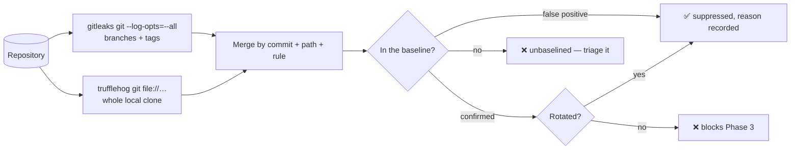

# 🔐 Full-history secret scan

Operator manual for the audited, re-runnable secrets sweep across **every ref**
of this repository (Issue [#4190](https://github.com/stSoftwareAU/VibeCoder/issues/4190),
part of the [#4160](https://github.com/stSoftwareAU/VibeCoder/issues/4160)
proving-ground hardening).

`.github/workflows/gitleaks.yml` scans a pull request's commit range. That is
the right gate for new work and the wrong one for history: a credential that
leaked into an old commit on a branch nobody merges — or into a tag — never
appears in a PR diff again, yet it stays live until somebody rotates it. A
fresh-history clean push does not excuse the private history either; anything
that ever leaked into it needs rotating regardless of what is published.

## The single command

```bash
deno run --allow-read --allow-write --allow-run --allow-env \
  worker/deno/mod.ts secrets-history-scan < /dev/null
```

Both `gitleaks` and `trufflehog` must be installed. The command exits non-zero
when:

- the baseline file is malformed or missing,
- any finding is **unbaselined** — nobody has triaged it yet, or
- any **confirmed** finding is still **unrotated**.

Options: `--repo <dir>` (default: the current directory), `--baseline <path>`,
`--report <path>`, `--gitleaks-config <path>`.

## Scope — why it covers every ref



`--log-opts=--all` hands `git log` every ref, so gitleaks walks tag-only
commits as well as dead branches. trufflehog is given no `--branch` filter, so
its git source walks the whole local clone. Run it against a clone that
actually holds the refs: the scheduled CI job fetches every branch and tag
before scanning, because `actions/checkout` leaves only one branch locally.

## The report

Written to `docs/audits/secrets-full-history-scan.md`, regenerated on every
run. It records **locations only** — commit, path, rule/detector, which
scanners saw it, and the triage status. The parsers never read gitleaks'
`Secret`/`Match` or trufflehog's `Raw`/`RawV2` fields, so a live credential
cannot reach the report, and the report names the repository rather than the
operator's checkout path.

Each scanner names the same match under its own rule id (gitleaks
`slack-bot-token`, trufflehog `Slack`), and rows are keyed by commit + path +
rule. One leak flagged by both therefore produces two rows, each triaged
explicitly — deliberately, so baselining one scanner's view cannot silently
suppress the other's.

## The baseline

`docs/audits/secrets-history-baseline.json` is the committed triage record.
Every finding must appear in exactly one list:

```json
{
  "falsePositives": [
    {
      "commit": "<40-hex>",
      "path": "worker/deno/tests/example_test.ts",
      "rule": "URI",
      "reason": "Synthetic fixture — `user:pass` placeholder, never issued."
    }
  ],
  "confirmed": [
    {
      "commit": "<40-hex>",
      "path": "legacy/deploy.sh",
      "rule": "slack-bot-token",
      "reason": "Real bot token committed to a legacy branch.",
      "credentialClass": "slack-bot-token",
      "usedIn": "legacy deploy automation",
      "rotated": false,
      "rotatedOn": null
    }
  ]
}
```

Rules the scan enforces:

- `reason` is mandatory on every entry and must be at least 10 characters — an
  allowlist entry without an explanation is how a real leak gets buried.
- `confirmed` entries additionally require `credentialClass` and `usedIn` (the
  blast radius), plus a boolean `rotated`; once `rotated` is true, `rotatedOn`
  must be an ISO `YYYY-MM-DD` date.
- Duplicate entries are rejected.
- Never paste a secret value into the baseline — entries are identified by
  commit, path and rule.

Entries matching no finding are listed in the report as **stale** so the file
does not accumulate dead suppressions. They do not fail the run.

## The rotation log

The report's **Rotation log** section is generated from the `confirmed` list:
one row per confirmed finding recording the credential class, where it was
used, whether it has been rotated, and the date. An unrotated confirmed finding
fails the scan — and stays failing even after the credential stops being
detected, because a leaked credential is live until it is rotated, not until it
stops appearing in a scan.

**Unrotated confirmed findings block Phase 3** of the #4160 plan.

## History is not rewritten

Deliberately. The private history stays as it is; the response to a confirmed
finding is rotation, not a rewrite.

## CI

`.github/workflows/gitleaks.yml` carries two jobs:

| Job | Trigger | Scope |
| --- | ------- | ----- |
| `gitleaks` | `pull_request` | The PR commit range only |
| `full-history` | weekly `schedule` + `workflow_dispatch` | Every ref, both scanners |

The scheduled job installs both CLIs pinned by version and verified against a
published SHA-256 checksum, runs the same command an operator runs locally, and
publishes the report to the run summary. A failing weekly run means a finding
needs triage or a confirmed credential needs rotating.
