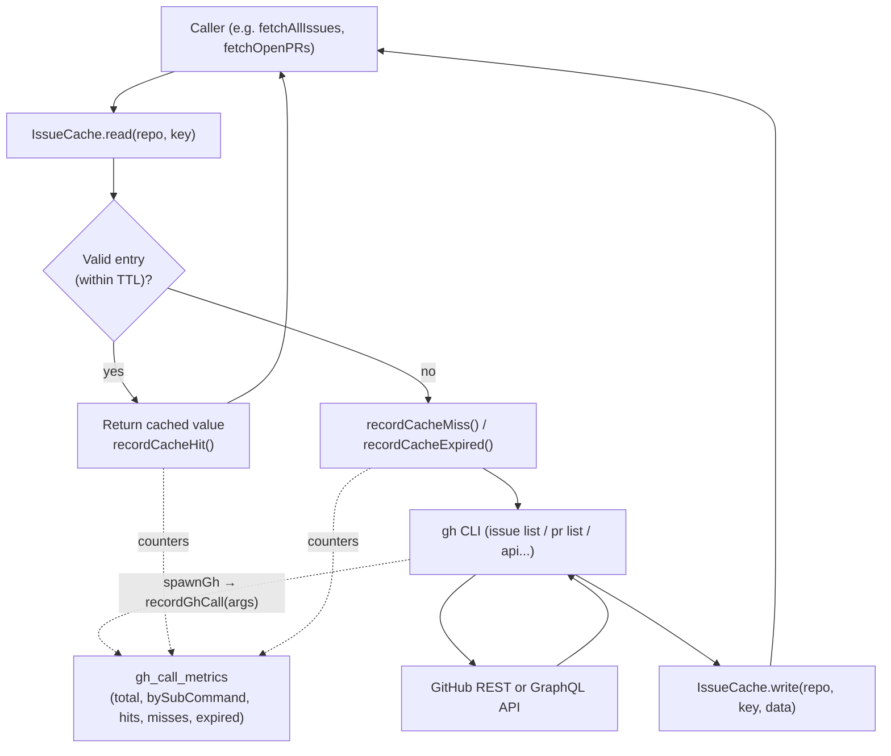
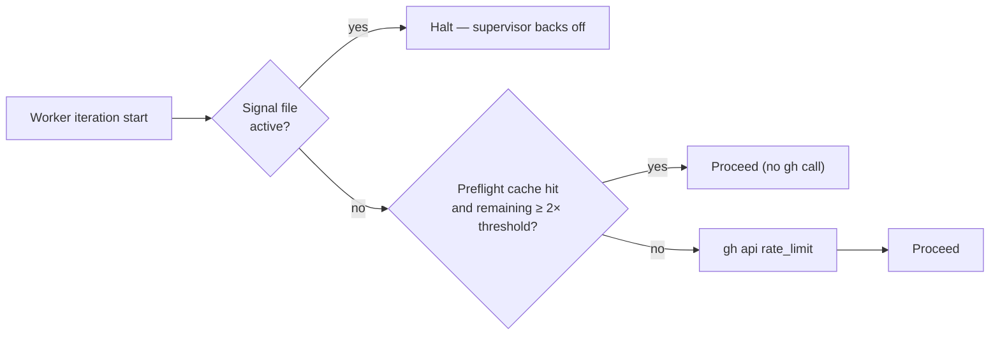
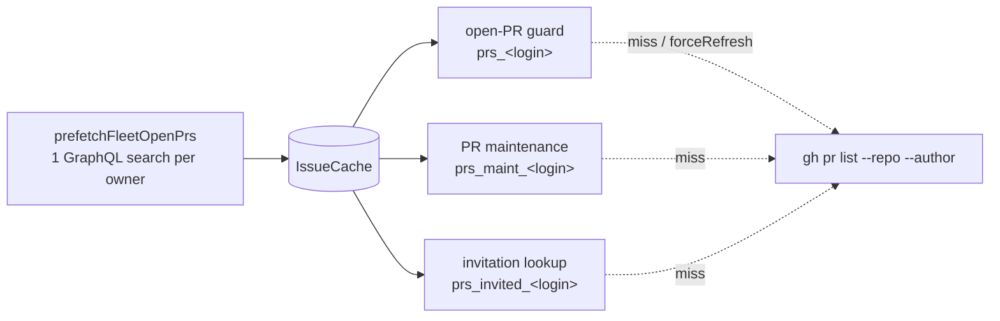
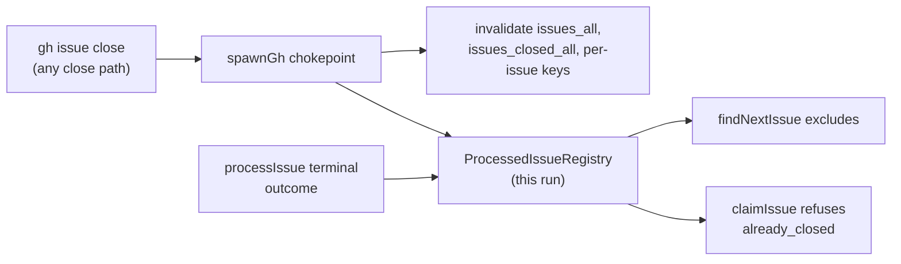

# 📡 GitHub API Optimisation

This document describes how the worker minimises calls to GitHub via the
`gh` CLI: which caches it keeps, what TTLs it applies, when it
invalidates entries, and how to read the per-iteration telemetry. It is
the reference for the work tracked under the **Reduce GH calls**
milestone (parent issue).

## Why this matters

Every loop iteration of the worker scans every configured repo. A naive
implementation issues O(repos × candidate-issues) `gh` calls per
iteration, which is wasteful (network round-trips dominate latency) and
risks tripping GitHub's primary rate limit. The strategy below cuts that
to roughly O(repos) on the steady-state path while preserving
correctness.

## Cache layers

The worker maintains three independent caches. Each is keyed
differently and has its own TTL because the underlying data has
different freshness requirements.

| Layer | Location | TTL (default) | Storage | Purpose |
| --- | --- | --- | --- | --- |
| `IssueCache` | `worker/deno/lib/issue_cache.ts` | 600s (10 min) | File-backed JSON under `${TMPDIR}/vibe-issue-cache-deno-<user>/` — or the caller's `${WORK_DIR}/.gh-scan-cache` — created `0700` and ownership-checked wherever it sits (Issues #1215, #1261), entries written `0600` with every string value redacted on the way in (Issue #1261) | Issue and PR list responses (`gh issue list`, `gh pr list`). Shared across worker invocations on the same host. |
| Rate-limit pre-flight cache | `worker/deno/lib/rate_limit_preflight_cache.ts` | 90s | File-backed JSON in `workDir` | Skips `gh api rate_limit` round-trips between back-to-back respawns when remaining quota is comfortably above the threshold. |
| `TimelineCache` | `worker/deno/lib/timeline_cache.ts` | 300s (5 min) | File-backed JSON under `${TMPDIR}/vibe-timeline-cache-deno-<user>/`, created `0700` and ownership-checked | Caches `gh api repos/{repo}/issues/{N}/timeline` results to remove the per-candidate N+1 calls. A hit may **deny** the reserved-label trust gate but never **grant** it — a trust-granting entry is re-confirmed against a freshly paginated timeline. |

Note: The timeline cache has shipped; the GraphQL batch path

has not. This document covers the latter as a planned layer; the
sections below mark unimplemented behaviour explicitly.

## Request flow

The diagram below shows how an issue/PR list request travels from the
caller through the cache hierarchy down to GitHub.



For the rate-limit pre-flight, the flow short-circuits even earlier:



## List-then-filter pattern

Rather than calling `gh issue list --label X` once per label, the
worker fetches the **full open-issue list once per repo** and filters
client-side. This is implemented in
`worker/deno/lib/issue_query.ts`:

- `fetchAllIssues(repo, cache, …)` reads/writes the `issues_all` cache
  key.
- `fetchIssuesByLabel(repo, label, cache, …)` calls `fetchAllIssues`
  and applies the label filter in memory — it never issues a per-label
  GitHub call.

The cost is one `gh issue list` per repo per TTL window (10 min),
regardless of how many label scans the iteration performs. Issue
 further
removed a redundant second-phase `fetchAllIssues` call by passing the
in-memory list from the availability check straight to
`collectLabelCandidates` / `collectWorkOnCandidates`.

## Cross-repo prefetch — one search per owner (Issue #1486)

List-then-filter removes the *per-label* fan-out; the same idea applied
across repositories removes the *per-repo per-author* one. Three passes ask
GitHub the same question once per repo **and** once per author:

| Consumer | Cache key | Author set |
| --- | --- | --- |
| Open-PR duplicate guard (`fetchOpenPRsByUser`) | `prs_<login>` | `resolveFleetPrAuthorSet` |
| PR maintenance (`listOpenPrs`) | `prs_maint_<login>` | `resolveFleetMaintenanceAuthorSet` |
| Human-invitation lookup (`listInvitedHumanPrs`) | `prs_invited_<login>` | `allowed_authors` minus the maintenance set |

At 19 repos with 2 fleet authors and 3 authorised commenters that is ~130
GraphQL-backed `gh pr list` calls on a cold cycle. GitHub's search API
answers all of them at once: it takes a whole owner, and repeated `author:`
qualifiers are ORed. `worker/deno/lib/fleet_pr_search.ts` issues that search
through `gh api graphql` — REST `gh search prs` cannot return
`baseRefName`, `headRefOid`, `autoMergeRequest` or `mergeable`, and the
consumers need all four — and
`worker/deno/lib/fleet_pr_prefetch.ts` writes the answer into the very cache
entries above. `run_core` calls it once per iteration, after the
trusted-author refresh that decides which logins to search for.



Three boundaries keep this from trading correctness for calls:

- **Never truncate silently.** Search caps a result set at 1,000 matches. The
  search pages to exhaustion and returns a **failure** — not a short list —
  when the page budget is exceeded, GraphQL reports errors, or a page claims
  a successor without a cursor. A failed owner writes nothing, so its repos
  simply run their per-repo listings as before.
- **The per-repo path stays.** A cache miss, an owner the search could not
  cover, and the `forceRefresh` read-after-write re-check
  (`fetchOpenPRsByUser`, Issue #3150) all still issue `gh pr list`. Search is
  eventually consistent, so any path that needs read-after-write must keep
  using it — and the duplicate guard does: `claimIssue` re-checks the repo it
  is about to claim **live**, bypassing this cache, so a blind or stale
  discovery-time answer cannot by itself open a duplicate PR.
- **A conversation that did not fit one page is not served.** The invitation
  predicate reads every label, comment and review, so the search asks for
  each connection's `totalCount`; a PR holding more than one page is left to
  the per-repo listing rather than admitted — or refused — on a partial read.
- **A warm cycle costs nothing.** A per-owner marker is written beside the
  entries and read before the next pass, so a second cycle inside the cache
  TTL issues no search at all. An entry invalidated in the meantime simply
  misses and falls back to its per-repo listing.
- **Open PRs only.** The closed/merged half is deliberately left on its
  per-repo listing: `fetchRecentlyClosedPRsForFleet` treats a merged PR as a
  **permanent** skip regardless of age, and this fleet has ~8,500 closed PRs
  against a 1,000-result search ceiling (~1,240 in the last 30 days alone).
  A windowed cross-repo search would silently drop older merged PRs and
  weaken the duplicate-PR guard.

Measured on the three-repo, two-author fixture in
`worker/deno/tests/iteration_call_budget_test.ts`: `pr list` falls from 12 to
6 for one cold iteration — the whole open half — at the cost of one
`api graphql` search. The remaining 6 are the closed half.

### One cache key, one limit (Issue #1486)

`fetchAllIssues` shares a single `issues_all` entry between callers asking
for different limits (200 from `find_oldest_issue`, 100 from
`stuck_recovery` and `find_planning_issues`). Whichever call ran first used
to decide what every later caller saw, so a pass expecting 200 issues could
silently be handed 100. The entry now stores the `--limit` it was fetched
with: a narrower entry is refetched rather than served, unless it came back
short of its own limit, which proves the listing was exhaustive.

## A cheap REST signal gates the expensive GraphQL call (Issue #1488)

REST and GraphQL bill against **separate budgets**, so a cheap REST probe
that decides whether to spend a GraphQL call is close to free. The milestone
branch sync is the worked example: per repo per cycle it makes a REST
`repos/<repo>/milestones` listing *and* a GraphQL
`gh issue list --state closed`, and the GraphQL half exists only to answer
"has anything been completed in this milestone yet?". The REST payload
already carries `closed_issues` per milestone, so it answers the gate:

| REST `closed_issues` | Decision |
| --- | --- |
| Milestone list empty | Nothing to sync — no GraphQL |
| `0` | Nothing completed, so not active by the pass's own definition — no GraphQL |
| Unchanged since the last observation | The closed set cannot have moved — reuse the recorded verdict, no GraphQL |
| Moved, in either direction | Spend the GraphQL query and record the new verdict |

Two properties make this safe where a TTL over the closed-issue list would
not be:

- **The gate derives from the same authority the answer does**, so a skipped
  cycle cannot act on a stale view — this is invalidation by change, not by
  clock.
- **Any** movement invalidates. The count falls when an issue is reopened or
  moved out of a milestone, so an increase-only check would latch a stale
  "active".

Observations are keyed by milestone **number**, not title (a rename keeps the
number), and persist in `milestone_activity.json` in the work directory
beside `milestone_sync_failures.json`. The first observation after a restart
has no baseline and queries once — correct, not a miss. See
[milestone_activity_gate.ts](../worker/deno/lib/milestone_activity_gate.ts).

The general form applies beyond milestones: **any hot GraphQL path with a
REST-visible change signal is a candidate for the same treatment**, and REST
additionally supports conditional requests — a `304 Not Modified` costs
nothing against the rate limit at all, which GraphQL has no equivalent for.

## Pagination — never trust the default 30

GitHub's REST and GraphQL APIs return only the **first 30 records** by
default and **silently drop the rest** — no error, just truncated data.
This is a data-loss footgun that has already caused bugs: `getIssueComments`
ignored every comment past the 30th, and the
reserved-label trust gate read a stale timeline event as the "most recent"
one because the genuine latest event fell outside the default-30 window — a
security bypass. Any `gh`
call that lists a collection (comments, timeline events, issues, PRs,
reviews, …) must page explicitly.

**REST — always page:**

- Request the maximum page size and let `gh` walk every `Link: rel="next"`
  page:

  ```sh
  gh api "repos/OWNER/REPO/issues/N/comments?per_page=100" --paginate
  ```

- **Never combine `--paginate` with `--jq`.** `gh` applies `--jq` *per page*,
  so `--paginate --jq 'map(...)'` emits **one JSON array per page** — the
  concatenated output is invalid JSON. Fetch the raw pages with `--paginate`
  alone, then post-process the merged result in code (this is why
  `getIssueComments` moved its field remapping into the pure
  `parseGhRawCommentsJson` helper rather than an inline `--jq` filter).

**GraphQL — paginate with `first:`/`last:` + cursors:**

- Pass an explicit page size (`first: 100` / `last: 100`) and follow
  `pageInfo.hasNextPage` / `endCursor` for collections larger than one page.
- When you only ever inspect the **most recent** items, read from the tail
  with `last: N` (e.g. `timelineItems(... last: 100)`): the newest event is
  then guaranteed present regardless of how many older events exist — strictly
  more correct than `first: N` with no pagination.

## Batch path (GraphQL) — planned

Issue
will replace the per-issue REST timeline call inside
`wasLabelAddedByAllowedAuthor` and `getLabelLastAddInfo` with a single
GraphQL query that fetches `LabeledEvent` nodes for up to 25 issues at
once via `gh api graphql`. The expected behaviour:

- Collect candidate issue numbers in a single pass.
- Issue `ceil(N / 25)` GraphQL calls instead of N REST calls.
- Fall back to the per-issue REST path on GraphQL failure (the existing
  code remains as a safety net).

The batch path is **complementary** to the timeline cache:
batching reduces calls **within** an iteration; the cache reduces calls
**across** iterations. When both ship the steady-state cost approaches
zero on a quiet repo.

Until lands, the worker uses the per-issue REST path; the
metrics line described below shows it as `api=N` for an iteration that
processes N candidates.

## Invalidation rules

Caches are invalidated on the events below to prevent the worker
acting on stale data **after it has just changed that data itself**.
External label changes (made by humans or other tools) are tolerated
until the TTL expires — that is the deliberate freshness/cost
trade-off.

| Event | What is invalidated | API |
| --- | --- | --- |
| Worker adds/removes a label | The repo's issue/PR list (so the next read sees the change) | `IssueCache.invalidate(repo, "issues_all")` or `IssueCache.invalidateRepo(repo)` |
| Worker writes a claim comment | Repo's issue list (claim is reflected in the issue body / labels) | `IssueCache.invalidateRepo(repo)` |
| Worker creates/closes a PR | Repo's PR list cache (`prs_${user}`, `prs_closed_${user}`) | `IssueCache.invalidate(repo, key)` |
| Worker closes/reopens an issue | That repo's `issues_all`, `issues_closed_all`, `issue_labels_${number}` and `pr_linkage_open_v2_${number}` | `noteGhIssueClose` at the `gh` chokepoint (Issue #181) |
| Milestone REST `closed_issues` moves | That milestone's recorded closed-issue verdict (Issue #1488) | `decideMilestoneQuery` in `milestone_activity_gate.ts` |
| Rate-limit signal active | Pre-flight cache is bypassed unconditionally | Step 1 of `preflightGitHubRateLimit` |
| Pre-flight remaining < 2× threshold | Pre-flight cache is bypassed for this call (re-checks fresh) | `readPreflightCache` returns null |
| Worker label change to timeline (planned) | Timeline entry for the affected issue | `IssueCache.invalidate(repo, "${number}#timeline")` (future) |

The TTL itself is the second line of defence: even without explicit
invalidation, every entry is automatically refreshed at most 10 minutes
(issues/PRs) or 90 seconds (rate-limit) after first write.

### Issue closes are never left to the TTL (Issue #181)

An issue the worker closed and a 600 s issue-list entry that still lists it
as open is the one combination the TTL cannot absorb: the scan re-claimed a
closed idle-task wrapper on each of the next three pool entries while
thirteen open wrappers in the same repo went untouched. Two defences now
apply, both driven from the single `gh` chokepoint (`spawnGh`):

- **Cache invalidation** — a successful `gh issue close`/`gh issue reopen`,
  or its REST form `gh api -X PATCH repos/o/r/issues/N -f state=closed|open`
  (the idle-task wrapper closure's shape since Issue #1753, read by the same
  `classifyIssueLifecycle` the agent-side guard uses), drops the repo's
  close-sensitive entries (the table row above), so the next scan re-reads
  the list from GitHub.
- **A per-run registry** — `ProcessedIssueRegistry`
  (`worker/deno/lib/processed_issue_registry.ts`) records the close, and every
  terminal outcome of the scan loop (success, skip, failure) besides.
  `findNextIssue` excludes what it holds and `claimIssue` refuses a claim
  against an issue this run closed, so correctness no longer depends on the
  invalidation having succeeded. It costs no API call.



The registry is in-process and one process is one run, so an entry lives
exactly as long as the run: a genuinely re-openable issue is reconsidered on
the next run, and a `gh issue reopen` clears the entry immediately.

## Telemetry

`worker/deno/lib/gh_call_metrics.ts` exposes in-memory counters that
record every `gh` invocation, every cache hit/miss/expiry, and the
sub-command bucket of each call (`issue list`, `pr view`, `api`, …).
The invocation counter is fed from the `gh` spawn chokepoint (`spawnGh`
in `worker/deno/lib/gh_spawn.ts`, Issue #1485), so a module that spawns
`gh` directly is counted exactly like one that goes through
`runGhCommandRaw()`; nothing can issue a `gh` process uncounted.
The counters are reset at the start of each main-loop iteration and
logged as a one-line summary at the end:

```
gh-calls: 17 total, 12 saved-by-cache, 0 expired, issue-list=5, pr-list=3, api=9
```

Reading the line:

- **`total`** — every `gh` invocation made during the iteration. Lower
  is better (cache and batch wins both reduce this number).
- **`saved-by-cache`** — the number of cache hits that prevented a
  `gh` call. Roughly `≥ total` on a healthy steady-state repo.
- **`expired`** — entries present but past TTL. A high count suggests
  iterations are running more frequently than the TTL accommodates;
  consider raising the TTL or the iteration interval.
- **Per-bucket counts** (`issue-list=5`, …) — sorted by call count
  descending. Spikes in `api=` typically indicate timeline calls and
  motivate the work in /.

The same metrics object is exported through `getGhCallMetrics()` for
programmatic inspection, and `find_oldest_issue.ts` reuses the
underlying counters so its `cache: N hits, M misses` log matches.

A companion line, `graphql-calls: N total, <source>=n, …`, counts the
subset of those invocations that are GraphQL-backed and attributes them
to the scan that issued them — by the four-step resolution described
below, which since Issue #1586 names the ordinary scan traffic too.
Every `gh` sub-command (`issue list`,
`pr view`, `search`, …) is GraphQL-backed, as is an explicit
`gh api graphql`; only a plain REST `gh api <path>` is not. The line
uses the same predicate as the primary-quota latch
(`isQuotaExemptGhCall`), so the two can never disagree about what
counts. Before Issue #1485 only `gh api graphql` was counted, and the
line showed a fraction of the real burn — a whole cycle's `issue list`
and `pr list` traffic was invisible to it.

The primary-quota latch (Issue #42) is set and enforced at the same
chokepoint. The first GraphQL-backed spawn from any module that comes
back `API rate limit already exceeded` is handed to the hook `github.ts`
registers, which probes the reset, latches the process and writes the
shared rate-limit signal (Issue #1540 — before that only
`runGhCommandRaw`'s own catch could latch, so a refusal seen by a direct
`spawnGh` caller was logged, retried and never latched). From then on
every GraphQL-backed spawn returns a `gh command skipped: … API rate
limit already exceeded` failure without starting a process, while REST
`gh api <path>` calls and the quota probe that learns the reset still
run.

### How the two counters relate

`graphql-calls: N total` and the `api-graphql=` bucket of the
`gh-calls:` line answer different questions, and both are wanted:

- **`graphql-calls: N total`** counts *every* GraphQL-billed
  sub-command — `issue list`, `pr view`, `search`, and `api graphql`.
- **`api-graphql=` in `gh-calls:`** is the subset that is an explicit
  `gh api graphql`. It is always ≤ the `graphql-calls:` total.

So `api-graphql=23` beside `graphql-calls: 796 total` is normal, not a
defect. What the two must agree on is *which argv is an `api graphql`
invocation*, and since Issue #1588 they do by construction: both derive
from the one flag-aware classifier in `worker/deno/lib/gh_argv.ts`
(`classifyGhCall`), which skips flags **and the values of value-taking
flags** (`-f`, `-F`, `--field`, `--raw-field`, `-H`, `--header`, `-X`,
`--method`, `-q`, `--jq`, `-t`, `--template`, `--input`, `-R`,
`--repo`, `--cache`, `-p`, `--preview`, `--hostname` — every
value-taking flag `gh api` itself has) before reading the endpoint
token. argv is normalised by `normaliseGhArgs`
(`worker/deno/lib/gh_flag_parser.ts`, Issue #3867/#1219) first and
pflag shorthand groups are then read the way pflag reads them, so
neither `gh api -iXPOST graphql` nor `gh api -iq .data graphql` — both
`-i` plus a value-taking shorthand — can hide the endpoint token behind
a flag value. Before that, `classifyGhArgs` read
`["api", "-f", "query=…", "graphql"]` as REST `api` while the latch
read it as GraphQL, and the latch's `args.includes("graphql")` matched
the token anywhere in argv — including as a flag value.

Only a positively-classified REST `gh api <path>` is exempt from the
latch; anything the classifier cannot place as REST — a sub-command, an
`api` call with no endpoint token, an argv with no positional at all —
stays GraphQL-billed. That is the safe direction for the tightening:
the flag list would have to gain a *false* entry, not miss one, for a
real GraphQL call to be waved through as REST.

Because every `withGraphQLSource` call site wraps exactly one
`gh api graphql` spawn, the **explicitly-sourced** buckets (steps 1–2
of the resolution below — not the derived `priority:` ones, and not
`unattributed`) should sum to exactly the `api-graphql=` count. A
divergence therefore means one of two concrete things, and nothing
vaguer: either a `withGraphQLSource` wrapper spans a call that is not
an `api graphql` spawn (the sum runs high), or an `api graphql` call
site is not wrapped at all (the sum runs low). A table-driven test in
`worker/deno/tests/gh_call_metrics_test.ts` holds both functions to the
same argv rows, so a future edit to either classifier that reopens the
divergence fails before merge.

Source attribution is scoped to the async chain that entered it
(`withGraphQLSource`, Issue #1585), so two lanes running at once cannot
credit each other's calls. Before that, the source was a process-wide
stack: while `comment_batch.ts` awaited its `api graphql` spawn, an
`issue list` from the lane beside it was credited to `comments-batch`.
That mechanism explains the earlier reading where the attributed
buckets summed to 40 against an `api-graphql` sub-command counter of 23
for the same cycle — but only if the 40 was summed over the *named*
buckets. Every `withGraphQLSource` call site wraps exactly one
`gh api graphql` spawn, so absent concurrency the named buckets sum to
exactly the `api graphql` count, and only a shared stack could let one
absorb 17 unrelated sub-command calls. Summed over *all* buckets
including `unattributed`, the gap needs no cross-crediting: since
Issue #1485 the source counters count every GraphQL-backed sub-command,
while the `api graphql` sub-command bucket counts only the explicit
ones, so the two measure different sets by design.

The source of a GraphQL-billed call is resolved in four steps
(Issue #1586):

1. the explicit `enterGraphQLSource()` stack — innermost wins, so an
   `enterGraphQLSource()` nested inside a wrapped chain still beats it;
2. else the async-scoped `withGraphQLSource()` context;
3. else the **active priority** — the `enterPriority()` stack top, else
   the async-scoped `withPriorityContext()` — emitted with a `priority:`
   prefix, e.g. `priority:issue-scanning`;
4. else the `unattributed` bucket.

Only the eight batching modules wrap themselves in an explicit GraphQL
source, so before step 3 existed the bulk of the burn — the ordinary
`issue list` / `pr list` / `issue view` traffic — had no source at all
and `unattributed` was most of the line. With the priority fallback a
cycle reads like `graphql-calls: 796 total,
priority:issue-scanning=239, timeline-batch=26, …`. The `priority:`
prefix keeps a derived bucket distinguishable from an explicit one, so
a priority named the same as a source cannot merge with it.

`unattributed` is therefore an anomaly signal, not the normal case: it
means a call was issued with neither a GraphQL source nor a priority
context in scope — a pass that runs outside `withPriorityContext`. The
buckets sum exactly to the total, and a unit test in
`worker/deno/tests/gh_call_metrics_test.ts` asserts that invariant, so
any future path that counts a GraphQL call without choosing a bucket
fails before merge.

The primary-quota latch (Issue #42) is enforced at the same chokepoint:
once the hourly GraphQL quota is exhausted, every GraphQL-backed spawn
from any module returns a `gh command skipped: … API rate limit already
exceeded` failure without starting a process, while REST `gh api <path>`
calls and the quota probe that learns the reset still run.

### The `gh-calls-by-priority:` line — which pass spent the calls

A third line attributes the same invocations to the cycle phase that
issued them:

```
gh-calls-by-priority: issue-scanning=239 post-scan-auto-merge=12 initialisation=6
```

Every dispatched priority handler is attributed by
`executePriorityHandler`, and the Priority 2 scan by its own
`"Issue Scanning"` wrapper. Issue #1587 extended the axis to the phases
that run *outside* priority dispatch, each in its own named context:
`initialisation`, `issue-callbacks`, `post-scan-auto-merge`,
`idle-work-hooks`, plus the outer-loop passes the same audit found —
`trust-refresh`, `fleet-pr-prefetch`, `stale-assignment-recovery`,
`github-auth-check` and `liveness-guard`. Before that, those phases'
calls appeared in `gh-calls:` and in no by-priority bucket at all.

Attribution uses `withPriorityContext` (async-scoped, Issue #213), so a
phase overlapping the scan pool cannot cross-credit it, and the
innermost context wins — the callbacks a scan slot fires are credited
to `issue-callbacks`, not to `issue-scanning`.

Two probes are deliberately left bare: `preflightGitHubRateLimit` and
`describeGraphqlQuota` read the quota itself, which GitHub does not
charge, and both run after the summary line is emitted.

### The `graphql-quota:` line — points, as GitHub counts them

The call counters above count *this process's* invocations, and they
count them as calls, not points: a `gh issue list --limit 500` is one
call and about five points, a 25-issue timeline batch is one call and
about twenty-five. The line that follows them is different in kind —
it is GitHub's own accounting of the account's GraphQL primary quota,
read from the response headers of a free `{ rateLimit { … } }` probe
(`worker/deno/lib/graphql_quota_probe.ts`, Issue #1456):

```
graphql-quota: used=1579/5000 remaining=3421 window-reopens at 2026-09-07 11:57:27 AEST (in 13m 2s) spent-since-last-cycle=363 (every consumer of this GitHub account, not just this host)
```

Reading the line:

- **`used` / `remaining`** — the window's true state. When `remaining`
  is far below what the `gh-calls:` counts could explain, sibling hosts
  on the same GitHub account are spending the balance.
- **`window-reopens`** — the reset GitHub reports. This is the value the
  primary-quota latch and the pre-flight pause now wait for; it is
  typically minutes away, not the flat hour the REST `rate_limit`
  document used to imply.
- **`spent-since-last-cycle`** — the points the *account* spent between
  this reading and the previous cycle's, idle sleep included. It is not
  this host's cost alone, and the line says so.

Why not `gh api rate_limit`? Because it lies for at least some tokens:
in production it reported the GraphQL bucket as `used: 0` with a reset
exactly one hour out while, in the same second, a GraphQL response on
the same token carried `X-Ratelimit-Used: 1104` and a reset eighteen
minutes away. The headers are the bucket's own accounting; the REST
document is now only the fallback when the probe cannot run.

## Trade-offs

- **TTL vs staleness.** A 10-minute issue-list TTL means the worker
  may act on a label change up to 10 minutes after it was made by an
  external actor. Worker-initiated changes invalidate eagerly, so the
  staleness window only ever applies to *external* edits. Reducing the
  TTL would tighten the window at a near-linear cost in `gh` call
  volume — the current 10 minutes was chosen because the loop interval
  is typically a few minutes, so most cached reads are still fresh.
- **Memory vs disk cache.** `IssueCache` is file-backed so multiple
  worker processes (and back-to-back respawns) share a single cache
  directory. The `gh_call_metrics` counters are in-memory only because
  they are reset every iteration and never need to outlive the
  process.
- **Search vs per-repo listing.** One cross-repo search replaces ~130
  per-repo per-author listings, but search is *eventually consistent* and
  capped at 1,000 results. The prefetch therefore covers only the periodic
  open-PR sweeps, refuses to serve a truncated result set, and leaves both
  the read-after-write re-check and the whole closed/merged half on the
  per-repo path.
- **REST vs GraphQL.** REST endpoints are well-cached by GitHub and
  simpler to call, but the timeline endpoint returns a large payload
  that must be filtered client-side. GraphQL lets us request only
  `LabeledEvent` fields and batch up to 25 issues per call, at the
  cost of more complex query construction. The plan in keeps
  REST as a fallback so a GraphQL outage does not block the worker.

## Related issues

- — Reduce GH calls (umbrella)
- — Per-iteration call telemetry (shipped)
- — Pass availability-check list to candidate scan (shipped)
- — Cache `gh api timeline` results (planned)
- — Batch label-author verification via GraphQL (planned)
- — Cache rate-limit pre-flight result (shipped)
- — This document
