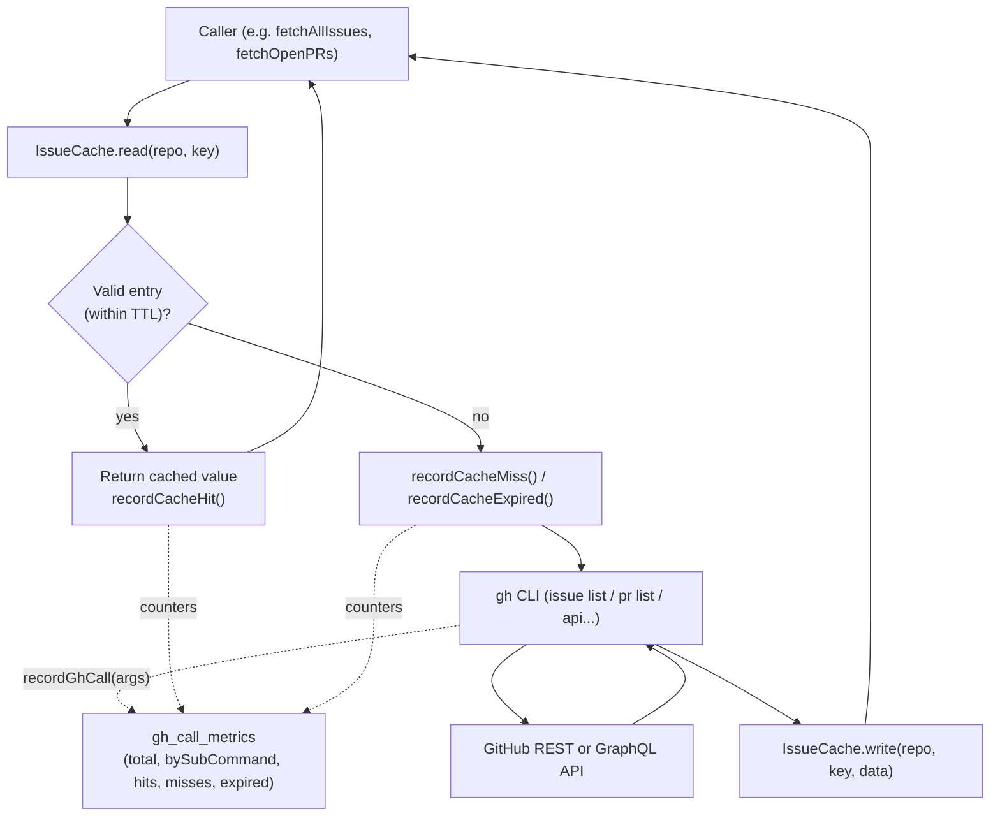
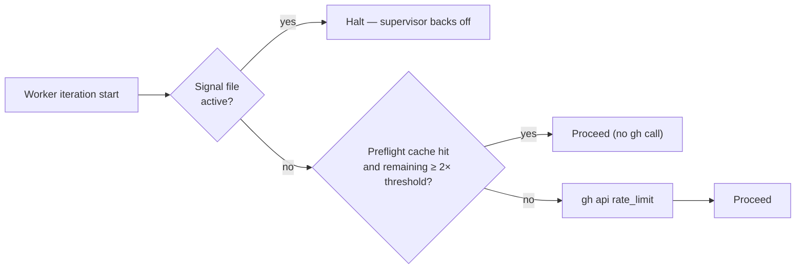
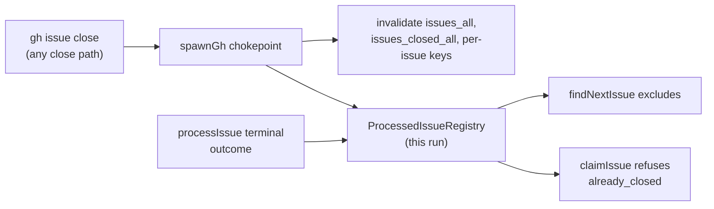

# 📡 GitHub API Optimisation

This document describes how the worker minimises calls to GitHub via the
`gh` CLI: which caches it keeps, what TTLs it applies, when it
invalidates entries, and how to read the per-iteration telemetry. It is
the reference for the work tracked under the **Reduce GH calls**
milestone (parent issue).

## Why this matters

Every loop iteration of the worker scans every configured repo. A naive
implementation issues O(repos × candidate-issues) `gh` calls per
iteration, which is wasteful (network round-trips dominate latency) and
risks tripping GitHub's primary rate limit. The strategy below cuts that
to roughly O(repos) on the steady-state path while preserving
correctness.

## Cache layers

The worker maintains three independent caches. Each is keyed
differently and has its own TTL because the underlying data has
different freshness requirements.

| Layer | Location | TTL (default) | Storage | Purpose |
| --- | --- | --- | --- | --- |
| `IssueCache` | `worker/deno/lib/issue_cache.ts` | 600s (10 min) | File-backed JSON under `${TMPDIR}/vibe-issue-cache-deno-<user>/`, created `0700` and ownership-checked (Issue #1215) | Issue and PR list responses (`gh issue list`, `gh pr list`). Shared across worker invocations on the same host. |
| Rate-limit pre-flight cache | `worker/deno/lib/rate_limit_preflight_cache.ts` | 90s | File-backed JSON in `workDir` | Skips `gh api rate_limit` round-trips between back-to-back respawns when remaining quota is comfortably above the threshold. |
| `TimelineCache` | `worker/deno/lib/timeline_cache.ts` | 300s (5 min) | File-backed JSON under `${TMPDIR}/vibe-timeline-cache-deno-<user>/`, created `0700` and ownership-checked | Caches `gh api repos/{repo}/issues/{N}/timeline` results to remove the per-candidate N+1 calls. A hit may **deny** the reserved-label trust gate but never **grant** it — a trust-granting entry is re-confirmed against a freshly paginated timeline. |

Note: The timeline cache has shipped; the GraphQL batch path

has not. This document covers the latter as a planned layer; the
sections below mark unimplemented behaviour explicitly.

## Request flow

The diagram below shows how an issue/PR list request travels from the
caller through the cache hierarchy down to GitHub.



For the rate-limit pre-flight, the flow short-circuits even earlier:



## List-then-filter pattern

Rather than calling `gh issue list --label X` once per label, the
worker fetches the **full open-issue list once per repo** and filters
client-side. This is implemented in
`worker/deno/lib/issue_query.ts`:

- `fetchAllIssues(repo, cache, …)` reads/writes the `issues_all` cache
  key.
- `fetchIssuesByLabel(repo, label, cache, …)` calls `fetchAllIssues`
  and applies the label filter in memory — it never issues a per-label
  GitHub call.

The cost is one `gh issue list` per repo per TTL window (10 min),
regardless of how many label scans the iteration performs. Issue
 further
removed a redundant second-phase `fetchAllIssues` call by passing the
in-memory list from the availability check straight to
`collectLabelCandidates` / `collectWorkOnCandidates`.

## Pagination — never trust the default 30

GitHub's REST and GraphQL APIs return only the **first 30 records** by
default and **silently drop the rest** — no error, just truncated data.
This is a data-loss footgun that has already caused bugs: `getIssueComments`
ignored every comment past the 30th, and the
reserved-label trust gate read a stale timeline event as the "most recent"
one because the genuine latest event fell outside the default-30 window — a
security bypass. Any `gh`
call that lists a collection (comments, timeline events, issues, PRs,
reviews, …) must page explicitly.

**REST — always page:**

- Request the maximum page size and let `gh` walk every `Link: rel="next"`
  page:

  ```sh
  gh api "repos/OWNER/REPO/issues/N/comments?per_page=100" --paginate
  ```

- **Never combine `--paginate` with `--jq`.** `gh` applies `--jq` *per page*,
  so `--paginate --jq 'map(...)'` emits **one JSON array per page** — the
  concatenated output is invalid JSON. Fetch the raw pages with `--paginate`
  alone, then post-process the merged result in code (this is why
  `getIssueComments` moved its field remapping into the pure
  `parseGhRawCommentsJson` helper rather than an inline `--jq` filter).

**GraphQL — paginate with `first:`/`last:` + cursors:**

- Pass an explicit page size (`first: 100` / `last: 100`) and follow
  `pageInfo.hasNextPage` / `endCursor` for collections larger than one page.
- When you only ever inspect the **most recent** items, read from the tail
  with `last: N` (e.g. `timelineItems(... last: 100)`): the newest event is
  then guaranteed present regardless of how many older events exist — strictly
  more correct than `first: N` with no pagination.

## Batch path (GraphQL) — planned

Issue
will replace the per-issue REST timeline call inside
`wasLabelAddedByAllowedAuthor` and `getLabelLastAddInfo` with a single
GraphQL query that fetches `LabeledEvent` nodes for up to 25 issues at
once via `gh api graphql`. The expected behaviour:

- Collect candidate issue numbers in a single pass.
- Issue `ceil(N / 25)` GraphQL calls instead of N REST calls.
- Fall back to the per-issue REST path on GraphQL failure (the existing
  code remains as a safety net).

The batch path is **complementary** to the timeline cache:
batching reduces calls **within** an iteration; the cache reduces calls
**across** iterations. When both ship the steady-state cost approaches
zero on a quiet repo.

Until lands, the worker uses the per-issue REST path; the
metrics line described below shows it as `api=N` for an iteration that
processes N candidates.

## Invalidation rules

Caches are invalidated on the events below to prevent the worker
acting on stale data **after it has just changed that data itself**.
External label changes (made by humans or other tools) are tolerated
until the TTL expires — that is the deliberate freshness/cost
trade-off.

| Event | What is invalidated | API |
| --- | --- | --- |
| Worker adds/removes a label | The repo's issue/PR list (so the next read sees the change) | `IssueCache.invalidate(repo, "issues_all")` or `IssueCache.invalidateRepo(repo)` |
| Worker writes a claim comment | Repo's issue list (claim is reflected in the issue body / labels) | `IssueCache.invalidateRepo(repo)` |
| Worker creates/closes a PR | Repo's PR list cache (`prs_${user}`, `prs_closed_${user}`) | `IssueCache.invalidate(repo, key)` |
| Worker closes/reopens an issue | That repo's `issues_all`, `issues_closed_all`, `issue_labels_${number}` and `pr_linkage_open_v2_${number}` | `noteGhIssueClose` at the `gh` chokepoint (Issue #181) |
| Rate-limit signal active | Pre-flight cache is bypassed unconditionally | Step 1 of `preflightGitHubRateLimit` |
| Pre-flight remaining < 2× threshold | Pre-flight cache is bypassed for this call (re-checks fresh) | `readPreflightCache` returns null |
| Worker label change to timeline (planned) | Timeline entry for the affected issue | `IssueCache.invalidate(repo, "${number}#timeline")` (future) |

The TTL itself is the second line of defence: even without explicit
invalidation, every entry is automatically refreshed at most 10 minutes
(issues/PRs) or 90 seconds (rate-limit) after first write.

### Issue closes are never left to the TTL (Issue #181)

An issue the worker closed and a 600 s issue-list entry that still lists it
as open is the one combination the TTL cannot absorb: the scan re-claimed a
closed idle-task wrapper on each of the next three pool entries while
thirteen open wrappers in the same repo went untouched. Two defences now
apply, both driven from the single `gh` chokepoint (`spawnGh`):

- **Cache invalidation** — a successful `gh issue close`/`gh issue reopen`
  drops the repo's close-sensitive entries (the table row above), so the next
  scan re-reads the list from GitHub.
- **A per-run registry** — `ProcessedIssueRegistry`
  (`worker/deno/lib/processed_issue_registry.ts`) records the close, and every
  terminal outcome of the scan loop (success, skip, failure) besides.
  `findNextIssue` excludes what it holds and `claimIssue` refuses a claim
  against an issue this run closed, so correctness no longer depends on the
  invalidation having succeeded. It costs no API call.



The registry is in-process and one process is one run, so an entry lives
exactly as long as the run: a genuinely re-openable issue is reconsidered on
the next run, and a `gh issue reopen` clears the entry immediately.

## Telemetry

`worker/deno/lib/gh_call_metrics.ts` exposes in-memory counters that
record every `gh` invocation, every cache hit/miss/expiry, and the
sub-command bucket of each call (`issue list`, `pr view`, `api`, …).
The counters are reset at the start of each main-loop iteration and
logged as a one-line summary at the end:

```
gh-calls: 17 total, 12 saved-by-cache, 0 expired, issue-list=5, pr-list=3, api=9
```

Reading the line:

- **`total`** — every `gh` invocation made during the iteration. Lower
  is better (cache and batch wins both reduce this number).
- **`saved-by-cache`** — the number of cache hits that prevented a
  `gh` call. Roughly `≥ total` on a healthy steady-state repo.
- **`expired`** — entries present but past TTL. A high count suggests
  iterations are running more frequently than the TTL accommodates;
  consider raising the TTL or the iteration interval.
- **Per-bucket counts** (`issue-list=5`, …) — sorted by call count
  descending. Spikes in `api=` typically indicate timeline calls and
  motivate the work in /.

The same metrics object is exported through `getGhCallMetrics()` for
programmatic inspection, and `find_oldest_issue.ts` reuses the
underlying counters so its `cache: N hits, M misses` log matches.

## Trade-offs

- **TTL vs staleness.** A 10-minute issue-list TTL means the worker
  may act on a label change up to 10 minutes after it was made by an
  external actor. Worker-initiated changes invalidate eagerly, so the
  staleness window only ever applies to *external* edits. Reducing the
  TTL would tighten the window at a near-linear cost in `gh` call
  volume — the current 10 minutes was chosen because the loop interval
  is typically a few minutes, so most cached reads are still fresh.
- **Memory vs disk cache.** `IssueCache` is file-backed so multiple
  worker processes (and back-to-back respawns) share a single cache
  directory. The `gh_call_metrics` counters are in-memory only because
  they are reset every iteration and never need to outlive the
  process.
- **REST vs GraphQL.** REST endpoints are well-cached by GitHub and
  simpler to call, but the timeline endpoint returns a large payload
  that must be filtered client-side. GraphQL lets us request only
  `LabeledEvent` fields and batch up to 25 issues per call, at the
  cost of more complex query construction. The plan in keeps
  REST as a fallback so a GraphQL outage does not block the worker.

## Related issues

- — Reduce GH calls (umbrella)
- — Per-iteration call telemetry (shipped)
- — Pass availability-check list to candidate scan (shipped)
- — Cache `gh api timeline` results (planned)
- — Batch label-author verification via GraphQL (planned)
- — Cache rate-limit pre-flight result (shipped)
- — This document
