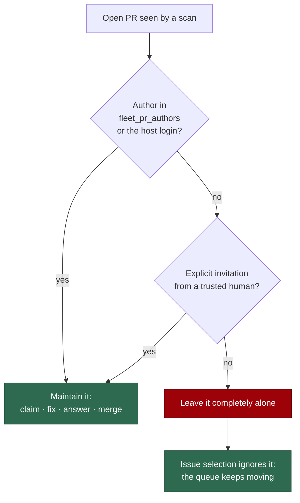

# 🤝 Human-authored PR policy

The worker maintains the fleet's own pull requests. It does **not** maintain
yours — unless you ask it to.

This page is the operator-facing statement of that policy: what the worker will
and will not do to a PR authored by a trusted human, how to hand it a PR, how to
take it back, and why your open PR never parks the worker's queue. The two configuration lists behind it are described in the
[Configuration Reference](CONFIGURATION.md#-fleet-pr-authors-fleet-aware-pr-maintenance);
the incident that produced the policy is recorded in
[Lessons learnt](LESSONS-LEARNT.md#-a-set-defined-by-trust-is-not-a-set-defined-by-ownership-issue-4074).

## 🔑 The rule

There are two author lists, and they answer two different questions.

| List                | Members                    | What membership grants                                                             |
| ------------------- | -------------------------- | ---------------------------------------------------------------------------------- |
| `fleet_pr_authors`  | Sibling fleet logins       | Their PRs are **maintained** — claimed, fixed, commented on, merged                  |
| `allowed_authors`   | Trusted humans             | They may **instruct** the worker — file issues, apply labels, comment, invite        |

In one line: **trusted to command, not to be commanded.** Being trusted to
direct the worker never makes your PR the worker's to take over.

`service_accounts` is not a third list: those logins are fleet accounts, so
`loadConfig` unions them into the effective `fleet_pr_authors`
([Configuration](CONFIGURATION.md#service-accounts-are-fleet-pr-authors-too)).
A sibling named only there is a fleet login everywhere, never a human.

## 🚫 What the worker will and will not do

For a PR authored by a trusted human, with no invitation:

| Action                                    | Uninvited human PR | Fleet PR |
| ----------------------------------------- | ------------------ | -------- |
| Claim it (`eyes` reaction, claim comment)  | Never              | Yes      |
| Push a CI-fix or spelling-fix commit       | Never              | Yes      |
| Reply to review feedback on it             | Never              | Yes      |
| Enable auto-merge / merge it               | Never              | Yes      |
| Post a CI nudge comment                    | Never              | Yes      |
| Add or remove a label, add a reaction      | Never              | Yes      |
| Wait behind it before raising its own PR   | Never              | Yes      |

The five PR-maintenance scans — PR feedback, CI fix, spelling, auto-merge and
the CI nudge — list PRs by author through the **push-capable** set
(`resolveFleetMaintenanceAuthorSet`: the host's own login plus
`fleet_pr_authors`). A trusted human's login never reaches
`gh pr list --author`, so an uninvited human PR is not merely skipped late — it
is never fetched.

The last row changed in. The worker used to defer to your open PR
through the wider fleet-owned set (`resolveFleetPrAuthorSet`), which meant one
unrelated human PR parked every `work-on` issue in the repo. It no longer does:
`getBlockingPRForIssue` only considers PRs authored by the **push-capable** set,
so your PR is invisible to issue selection. You manage your PR; the worker gets
on with the issues it was invited to. The one-open-PR-at-a-time rule still
applies to the fleet's *own* PRs, so the worker never runs several of its own
PRs into the same work stream.

## ✉️ Inviting the worker onto your PR

The policy is "only when asked", not "never". Every scan additionally lists the
open PRs authored by `allowed_authors` and admits only those carrying an
explicit invitation. Two signals count:

| Signal      | How to give it                                                    | Who may give it                                                       |
| ----------- | ----------------------------------------------------------------- | --------------------------------------------------------------------- |
| **Label**   | Add the `work-on` label to the PR                                  | A trusted human in `allowed_authors` — the timeline adder is checked   |
| **Mention** | Comment on, or review, the PR mentioning `@<worker-login>`         | A trusted human in `allowed_authors` — the comment author is checked   |

Details that decide real cases:

- **The adder is checked, not the label.** Label presence proves nothing; the
  worker resolves from the PR timeline who applied it. An unattributable label
  is not an invitation.
- **A fleet account is never an inviter.** Fleet logins sit in `allowed_authors`
  for PR dedup, so without that exclusion a worker could label its
  way onto your PR.
- **Mentions must be genuine.** A `@worker` inside a fenced code block or a
  quoted log is ignored — pasted CI output must not conscript the worker.
- **Anything unclear is a refusal.** An unreadable listing, an unattributable
  label, or an ambiguous mention all leave the PR untouched. The mechanism fails
  closed.
- **Every admission is logged**:
  `[pr-invitation] admitted repo=… prNumber=… author=… via=label|mention invitedBy=…`.
  A worker action on a human PR with no matching line is a wiring bug; an
  `invitedBy` outside `allowed_authors` means the trust check regressed.

Once invited, the PR is treated exactly like a fleet PR: the scans claim it, fix
its CI, answer review feedback, fix spelling and enable auto-merge.

## ↩️ Revoking an invitation

Remove the signal:

- **Label invitation** — remove the `work-on` label. The PR leaves the scan set
  on the next pass.
- **Mention invitation** — delete (or edit the mention out of) the comment or
  review that carried it.

The verdict is re-derived from the PR's current state on every scan, with no
stored state, so revocation takes effect at the next iteration and needs no
further action. A commit the worker already pushed while invited stays on the
branch — revoking stops future work, it does not rewrite history.

## 🚧 Your PR and the worker's queue

Your open PR does not block the worker's issue pickup at all.
There is no stand-down, no `needs-human` label, and no comment on the blocked
issue: the worker simply keeps working the issues it was invited to, in
parallel with you.

Only **fleet-authored** open PRs defer an issue, and they do so repo-wide —
one open fleet PR at a time per work stream, so the worker never stacks several
of its own PRs into merge hell. Two inputs are deliberately treated as
fleet-owned because authorship could not be established, and guessing wrong
would break that rule:

- an open PR whose author was never recorded (a cache entry written before the
  author was stamped), and
- an unresolved or empty push-capable set.

If you *want* the worker on your PR, invite it (label or @mention, above).

## 🔍 Verifying the policy holds

| Where                                                                                        | What it pins                                                                     |
| -------------------------------------------------------------------------------------------- | --------------------------------------------------------------------------------- |
| `worker/deno/tests/pr_uninvited_action_test.ts`                                                 | Cross-scan invariant: no scan writes to an uninvited human PR                     |
| `worker/deno/tests/pr_maintenance_test.ts`, `pr_ci_nudge_scan_test.ts`                         | The `--author` arguments each scan passes to `gh`                                 |
| `worker/deno/tests/human_pr_never_blocks_test.ts`                                              | That a human PR never blocks issue pickup, and a fleet PR still does              |
| `worker/deno/tests/human_pr_policy_docs_test.ts`                                               | This page's labels and author sets against the real predicates                    |

In the logs, `[pr-invitation] admitted …` is the only sanctioned route to a
worker action on a human-authored PR.

## 📎 Related

- [Configuration Reference § Fleet PR authors](CONFIGURATION.md#-fleet-pr-authors-fleet-aware-pr-maintenance)
  — the two lists and how to set them.
- [Lessons learnt § A set defined by trust is not a set defined by ownership](LESSONS-LEARNT.md#-a-set-defined-by-trust-is-not-a-set-defined-by-ownership-issue-4074)
  — the incident this policy came from.
- [PR Feedback & Upkeep](workflows/pr-feedback.md) — what maintenance actually
  does to a PR it owns.
