# 😴 Idle-task Framework — Operator Manual

The idle-task framework is the canonical mechanism for "things the worker does
when no claimable work exists". Instead of running background work in-process,
the worker files a regular GitHub issue labelled `idle-task` against a monitored
repo and lets the next iteration of its normal loop claim that issue and execute
the template-specific handler.

Filing a real issue (rather than running silently in the background) keeps every
unit of idle work auditable, claimable across multiple workers, and visible to
operators alongside the rest of the queue.

For the agent-facing summary see
[DESIGN-PRINCIPLES.md → Idle-task framework](../DESIGN-PRINCIPLES.md#idle-task-framework).

## Overview

An **idle-task** is a unit of background work — a security scan, a
maintainability sweep, a docs audit — that the worker performs only when no
claimable issues exist. The framework defines:

- A small `IdleTaskTemplate` interface
  ([`worker/deno/lib/idle_task_template.ts`](../worker/deno/lib/idle_task_template.ts))
  that each template implements.
- A module-level registry populated by import-time `registerTemplate()` calls.
- A shared issue body schema with a single HTML-comment marker so filed issues
  are machine-recoverable
  ([`worker/deno/lib/idle_task_issue.ts`](../worker/deno/lib/idle_task_issue.ts)).
- A label-only dedup query (`findExistingIdleTaskIssue`) that keeps the worker
  from filing two idle-task issues against the same repo at once.
- A claim handler
  ([`worker/deno/lib/idle_task_claim_handler.ts`](../worker/deno/lib/idle_task_claim_handler.ts))
  that the main loop calls when it picks up an `idle-task` issue. When the issue
  is a recognised scan _wrapper_ (its title or body matches a registered
  template) the handler runs that template's `runTask()`; otherwise it passes
  through and the issue is worked through the standard issue→PR pipeline like
  any other lowest-priority work item.

The framework is the canonical home for "idle work" — it owns filing, dedup,
label discipline, claim routing, and the per-template milestone. New templates
only have to implement the interface; they do not re-implement plumbing.

## Lifecycle

Every idle-task issue follows the same lifecycle once the idle trigger files it:

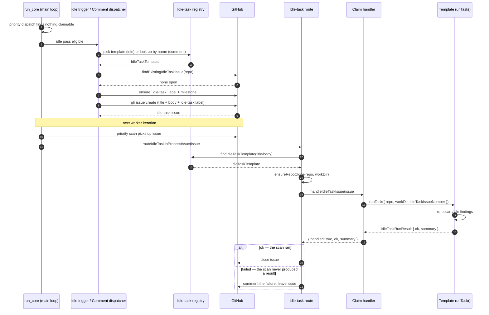

Key points:

- The worker **files a real issue** for every idle task. Nothing runs without
  first being recorded as a claimable work item.
- The `idle-task` label is the **lowest priority** in the work queue (selected
  only when every higher tier is globally empty). See the prioritisation table
  in [README.md](../README.md#-work-prioritisation).
- **`idle-task` is just the lowest of the four work-trigger priorities.** All
  four — `top-priority` > `work-on` > `low-priority` > `idle-task` — mean _work
  on this issue_; they differ only in priority, with no other logic attached.
  `idle-task` is **not** a scan-only marker: any `idle-task` issue (a scan
  finding, a chore, a hand-typed task) is worked through the standard issue→PR
  pipeline, just last. The scan-template machinery in this document is layered
  on top — a claimed `idle-task` issue runs a template `runTask` **only** when
  it is a recognised wrapper (title or body match); everything else is worked
  normally. The single thing special about `idle-task` is that the worker may
  self-apply it (the other three are reserved for trusted humans). See
  [Issue selection priority](workflows/issue-processing.md#-issue-selection-priority).
- The claim handler **never throws** — every failure mode (malformed body,
  unknown template, runner error) logs a structured warning and returns a
  `{ handled: true, ok: false }` result so the queue does not stall.
- **Only a scan that actually ran closes its wrapper** (Issue #179). A run that
  returns `ok: false` — a missing clone, a detector crash, an `ENOENT` — gets a
  failure **comment** and the wrapper stays **open**. The ordinary failure
  cooldown (`issue_retry_cooldown`) then gates the retry, and a later claim runs
  the scan again. The route used to close every handled wrapper regardless of
  `ok`, so an infrastructure failure was recorded as the scan's result and
  nothing re-raised it until the next cadence tick.
- **The repo is cloned on demand before a template runs** (Issue #179). A
  template walks `${workDir}/<repo>`, and nothing on the idle-task path had ever
  cloned it — a repo freshly added to `.config.json` failed every scan with
  `ENOENT`. The route now calls
  [`ensureRepoClone`](../worker/deno/lib/ensure_repo_clone.ts) for a recognised
  wrapper, which reuses the setup phase's `setupRepo()` **only when the clone is
  missing**; an existing clone is left untouched (no fetch, no `reset --hard`).
  Adding a repo to `.config.json` and raising its wrappers is therefore enough
  to bring it up — no manual clone.
- **A claimed idle task always runs to completion.** The throttle
  is **file-time only**: `isRepoBusyForIdleTask` refuses to _file_
  a wrapper into a repo with approved work in flight. There is no runTask-level
  re-check. The earlier re-check guard reused the filer's busy
  set, which counts the `idle-task` label itself — so at run time the wrapper
  being executed was always an open, unblocked `idle-task` issue and the guard
  self-cancelled **every** run, burning each template's cooldown window. It was
  removed: dispatch priority (`top-priority` > `work-on` > `low-priority` >
  `idle-task`) already ensures approved work is claimed ahead of an idle
  wrapper, so a run-time re-check loses nothing material.

## Registry

Templates implement the `IdleTaskTemplate` interface in
[`worker/deno/lib/idle_task_template.ts`](../worker/deno/lib/idle_task_template.ts):

```typescript
export interface IdleTaskTemplate {
  /** Lowercase alphanumeric slug with single hyphens; no leading/trailing hyphen. */
  name: string;
  /** Short human-readable description embedded in the filed issue body. */
  description: string;
  /**
   * Title of the filed wrapper. Dispatch matches the issue title to
   * the template by comparing against this value, so
   * each template's title must be unique within the registry.
   */
  buildIssueTitle(repo: string): string;
  /**
   * Body of the filed wrapper. May be async so a template can load
   * and substitute a prompt file (the body IS the
   * substituted prompt — no hidden marker, no parameters block).
   */
  buildIssueBody(opts: IdleTaskBodyOptions): string | Promise<string>;
  /**
   * Optional veto of filing a fresh wrapper in a given repo (Issue
   *). Templates return `false` while a previous batch of output
   * is still being triaged — `security-scan` returns `false` while
   * any open `security`-labelled findings exist, so a new scan does
   * not pile up on an un-triaged batch. Defaults to "always file"
   * when omitted. Must never throw.
   */
  shouldFile?(opts: IdleTaskShouldFileOptions): Promise<boolean>;
  /** Executes the actual unit of work — never throws. */
  runTask(opts: IdleTaskRunOptions): Promise<IdleTaskRunResult>;
  /**
   * Optional body-fingerprint check. Returns `true` when
   * `body` looks like an instance of this template's filed wrapper
   * (e.g. contains the prompt's distinctive heading). Used as a third
   * dispatch signal alongside the `idle-task` label and the title
   * match — defence in depth against label-strip races, title edits,
   * and stale workers picking up newer-format wrappers whose body the
   * old dispatch could not recognise. Pure — no I/O, no throwing.
   */
  matchesIdleTaskBody?(body: string): boolean;
  /**
   * When true, the framework neither ensures nor assigns the per-template
   * milestone `idle-task: <template-name>` for issues filed under this
   * template. Defaults to false (the regular per-template
   * milestone is ensured and assigned).
   */
  skipMilestone?: boolean;
  /**
   * Label that this template's output (findings, follow-up issues)
   * carry on the target repo. When set, the generic
   * filer counts open issues with this label on the target repo and
   * refuses to raise a new wrapper if there are already
   * `BACKLOG_THRESHOLD` (currently 6) or more — the previous batch is
   * still being remediated and adding more idle-task noise would only
   * delay it. `security-scan` declares this as `security`. Templates
   * with no output backlog leave it `undefined` and the backlog gate
   * is skipped.
   */
  outputLabel?: string;
  /**
   * Per-repo cooldown window in hours. When set, the
   * idle-task filer skips a target repo for this template if the most
   * recent filed wrapper or finding's `createdAt` is younger than this
   * many hours. Omit to use the framework default
   * (`DEFAULT_COOLDOWN_HOURS` in `lib/idle_task_cooldown_gate.ts`,
   * currently 24h). Templates that benefit from a tighter or looser
   * loop (e.g. a fast doc audit at 6h, or a heavy weekly sweep at
   * 168h) override this field.
   */
  cooldownHours?: number;
}
```

### Human-style wrappers

A filed wrapper reads like an issue a person would type. There is no hidden
`<!-- idle-task: ... -->` marker, no parameters block, and no references to
internal templates. The `security-scan` template, for example, files its wrapper
as:

- **Title:** `Run a security scan`
- **Body:** the latest `prompts/security_scan/` template with the remaining
  placeholders substituted at file time — `{{SUPPRESSED_IDS}}`,
  `{{KNOWN_OPEN_FINDING_IDS}}` and `{{OPEN_ISSUE_TITLES}}` (retired
  `{{REPO_FULL_NAME}}`). The two dedup placeholders render `(none)` on the
  wrapper itself; both real lists are rebuilt repo-wide from live issues at
  claim time — see
  [Cross-label dedup](#cross-label-dedup--the-open-issue-title-list).
  Language detection now happens inside the scanning agent during the Phase 1
  inventory step (free-form filesystem inspection), so the worker no longer
  substitutes a language list at raise time.

A human can paste the same prompt into a fresh issue, apply the `idle-task`
label, and the worker runs it identically — dispatch matches by title, so the
workflow is symmetric. The previous `idle-task-pending` / `requiresApproval`
approval gate was retired in because `idle-task` is already the
lowest priority in the queue; a separate approval step added no value.

Registration happens at module-load time via `registerTemplate()`, so callers do
not invoke a setup function. The production set is re-imported by the claim
handler for its registration side-effects, guaranteeing the registry is
populated regardless of which call site reaches the module first:

```typescript
// worker/deno/lib/idle_task_claim_handler.ts
import "./idle_task_templates/security_scan_template.ts";
```

The current production templates live in
[`worker/deno/lib/idle_task_templates/`](../worker/deno/lib/idle_task_templates/):

| Template                       | Source                                                                                                                | Purpose                                                                                                                                                                                                                                                                                                                                                                                                                                                                                                                                                                                                                                                                                                                                                                                                                                                                                                                                                                                                                                                                                                                                                                                                                                                                                                                                                                                                                                                                                                                                                                                                                                                                                                                                                     |
| ------------------------------ | --------------------------------------------------------------------------------------------------------------------- | ----------------------------------------------------------------------------------------------------------------------------------------------------------------------------------------------------------------------------------------------------------------------------------------------------------------------------------------------------------------------------------------------------------------------------------------------------------------------------------------------------------------------------------------------------------------------------------------------------------------------------------------------------------------------------------------------------------------------------------------------------------------------------------------------------------------------------------------------------------------------------------------------------------------------------------------------------------------------------------------------------------------------------------------------------------------------------------------------------------------------------------------------------------------------------------------------------------------------------------------------------------------------------------------------------------------------------------------------------------------------------------------------------------------------------------------------------------------------------------------------------------------------------------------------------------------------------------------------------------------------------------------------------------------------------------------------------------------------------------------------------------- |
| `security-scan`                | [`security_scan_template.ts`](../worker/deno/lib/idle_task_templates/security_scan_template.ts)                       | Four-phase MythOS-style security audit. See [SECURITY-SCAN.md](SECURITY-SCAN.md).                                                                                                                                                                                                                                                                                                                                                                                                                                                                                                                                                                                                                                                                                                                                                                                                                                                                                                                                                                                                                                                                                                                                                                                                                                                                                                                                                                                                                                                                                                                                                                                                                                                                           |
| `best-practices`               | [`best_practices_template.ts`](../worker/deno/lib/idle_task_templates/best_practices_template.ts)                     | Bucket-scoped LLM-only best-practices review. The bucket (one of `rust`, `typescript`, `react`, `java`, `html`, `aws-cloudformation`, `terraform`, `general`, `design`) is picked at file time using a SLOC-weighted random draw across the detected supported languages, with the two language-agnostic buckets — `general` (repo hygiene) and `design` (named design smells) — each competing at a weight equal to the dominant language. Language-targeted runs include a linter-in-CI configuration check (does the workflow invoke the standard linter?) before the LLM review; the missing-linter finding, if any, lands first and counts against the 6-issue cap. Filed findings carry `best-practices` + `lang:<bucket>` + `severity:<level>` labels; the scan never raises a PR. See [BEST-PRACTICES-SCAN.md](BEST-PRACTICES-SCAN.md).                                                                                                                                                                                                                                                                                                                                                                                                                                                                                                                                                                                                                                                                                                                                                                                                                                                                                                                                                                                                                    |
| `test-audit`                   | [`test_audit_template.ts`](../worker/deno/lib/idle_task_templates/test_audit_template.ts)                             | Language-agnostic (no bucket) static test-suite maintainability and coverage-gap audit — flags implementation-coupled tests that assert on incidental implementation details rather than observable behaviour (the informal WHAT/HOW heuristic). Single prompt, structurally like `security-scan`. `runTask` ensures the `test-audit` label exists, then invokes Claude, which files each surviving finding as its own issue carrying `test-audit` + `severity:<level>` labels; the scan never raises a PR. Capped at once per repo per week (`cooldownHours: 168`).                                                                                                                                                                                                                                                                                                                                                                                                                                                                                                                                                                                                                                                                                                                                                                                                                                                                                                                                                                                                                                                                                                                                                                                        |
| `github-actions-audit` | [`github_actions_audit_template.ts`](../worker/deno/lib/idle_task_templates/github_actions_audit_template.ts) | Single-scope weekly review of the repo's GitHub Actions material only (`.github/workflows/*.yml` and composite actions) — SHA-pinning, supply-chain hardening, stale action majors, EOL runtimes, deprecated/archived actions, container-image pin trackability and freshness (v17,), and duplicate / obsolete steps. Two pre-filers run before Claude: an actionlint-in-CI check (`BP-LINTER-github-actions`) and a runner-deprecation scan (`BP-RUNNER-…`). Filed findings carry `github-actions-audit` + `severity:<level>` labels; the scan never raises a PR. Capped at once per repo per week (`cooldownHours: 168`). See [GITHUB-ACTIONS-AUDIT-SCAN.md](GITHUB-ACTIONS-AUDIT-SCAN.md). |
| `supply-chain-readiness`       | [`supply_chain_readiness_template.ts`](../worker/deno/lib/idle_task_templates/supply_chain_readiness_template.ts)     | Single-scope weekly **readiness** audit (no bucket, language-agnostic) of the repo's posture for surviving and responding to a supply-chain compromise — CI vuln-scan wiring, install-script blocking, auto-update of security advisories, dependency-review, provenance verification, lockfile/SBOM presence, and an emergency-bump runbook. Recommendations are calibrated to real risk (static-evidence only, no package-manager invocation) and cross-link the active-detection templates rather than duplicating them. Filed findings carry `supply-chain-readiness` + `severity:<level>` labels; the scan never raises a PR. Capped at once per repo per week (`cooldownHours: 168`). See [SUPPLY-CHAIN-READINESS-SCAN.md](SUPPLY-CHAIN-READINESS-SCAN.md).                                                                                                                                                                                                                                                                                                                                                                                                                                                                                                                                                                                                                                                                                                                                                                                                                                                                                                                                                                                           |
| `orphan-deps`                  | [`orphan_deps_template.ts`](../worker/deno/lib/idle_task_templates/orphan_deps_template.ts)                           | Single-scope weekly audit (no bucket, language-agnostic) of the repo's declared / locked dependency set for **orphaned, abandoned, deprecated, or end-of-life** dependencies, suggesting a maintained replacement for each. The **one sanctioned-network exception**: it reads registry / source-host metadata (npm, JSR, crates.io, `gh api` repo metadata, published EOL data) within a strict allow-list — no installs, no lifecycle scripts, no repo-code execution. Complements the active-detection / readiness / dormant-republish siblings (cross-link only) and the merely-out-of-date dependency-bump flow. Filed findings carry `orphan-deps` + `severity:<level>` labels; the scan never raises a PR. Capped at once per repo per week (`cooldownHours: 168`). See [ORPHAN-DEPS-SCAN.md](ORPHAN-DEPS-SCAN.md).                                                                                                                                                                                                                                                                                                                                                                                                                                                                                                                                                                                                                                                                                                                                                                                                                                                                                                                                  |
| `dead-code` | [`dead_code_template.ts`](../worker/deno/lib/idle_task_templates/dead_code_template.ts) | "Boy Scout" weekly scan for dead code and unused exports — symbols defined but never referenced. Issue-only: filed findings carry `dead-code` + `severity:<level>` labels and the scan never raises a PR. Capped at once per repo per week (`cooldownHours: 168`). |
| `doc-coverage` | [`doc_coverage_template.ts`](../worker/deno/lib/idle_task_templates/doc_coverage_template.ts) | "Boy Scout" weekly scan for module-doc and README coverage gaps. Four checks: `DOC-MODULE-DOC` (a public module with no leading doc comment), `DOC-PARAPHRASE` (from v3 onward, — a module or exported-symbol doc comment whose content is derivable from the identifier and signature alone, so it adds no contract), `DOC-README-MISSING`, and `DOC-README-API-GAP`. From v3 onward the scan measures documentation by **content, not presence**: a block that only restates the name no longer passes `DOC-MODULE-DOC`, and triage lets at most one of the two module checks fire per file so a paraphrase is never double-filed. `DOC-PARAPHRASE` stays silent when the comment adds any non-derivable contract (units, ranges, error conditions, side effects, ordering, threading) and on trivial surface where the name is the whole contract. Issue-only: filed findings carry `doc-coverage` + `severity:<level>` labels and the scan never raises a PR. Capped at once per repo per week (`cooldownHours: 168`). |
| `format-drift` | [`format_drift_template.ts`](../worker/deno/lib/idle_task_templates/format_drift_template.ts) | "Boy Scout" weekly scan for formatting and lint drift. Issue-only: filed findings carry `format-drift` + `severity:<level>` labels and the scan never raises a PR. Capped at once per repo per week (`cooldownHours: 168`). |
| `deprecated-api` | [`deprecated_api_template.ts`](../worker/deno/lib/idle_task_templates/deprecated_api_template.ts) | "Boy Scout" weekly scan for deprecated-API usage. Issue-only: filed findings carry `deprecated-api` + `severity:<level>` labels and the scan never raises a PR. Capped at once per repo per week (`cooldownHours: 168`). |
| `bash-script-refs` | [`bash_script_refs_template.ts`](../worker/deno/lib/idle_task_templates/bash_script_refs_template.ts) | **Native** (no LLM) weekly scan (layer 2 of, template #11) that statically resolves every `source` / `.` / `fleet_source_or_fail` / `bash …` reference in the repo's `*.sh` files and files one prevention-first finding per referenced script that is **missing on disk** — the exit-127 failure class `bash -n` cannot catch. `runTask` runs `bash_script_refs_scanner.ts` and files each missing target (deduped per path) as a `bash-missing-script` + `severity:high` issue that leads with the fix and a repo-local layer-2 CI-guard recommendation; the scanner is **fail-loud** (a walk/read error surfaces on the wrapper, never a silent green). Issue-only — never raises a PR. Capped at once per repo per week (`cooldownHours: 168`). |
| `bash-syntax-audit` | [`bash_syntax_audit_template.ts`](../worker/deno/lib/idle_task_templates/bash_syntax_audit_template.ts) | **Native** (no LLM) weekly audit (layer 1 of, template #12) that verifies each monitored repo's **own CI** blocks invalid scripts and files one issue per missing gate. Two deterministic detectors drive it: `bash_ci_gate_scanner.ts` (the `bash -n` syntax gate → `severity:high`, and the `shellcheck` lint gate → `severity:medium`) and `language_validity_gate.ts` (each other main language's native basic-validity check, e.g. `cargo check` / `deno check` / `mvn compile` / `py_compile` → `severity:high`). Findings carry `bash-syntax-audit` + `severity:<level>`, use stable gate-class ids (`BP-BASH-SYNTAX-GATE`, `BP-BASH-SHELLCHECK-GATE`, `BP-VALIDITY-GATE-<language>`) deduped per gate, and honour `best-practice-ignore: BP-…` suppression. An `unknown` gate never files a false positive; a detector that cannot run surfaces a **fail-loud** `ok:false` summary. Repositories stay **absolutely isolated** — each commits its own gate; the audit only raises the issue. Issue-only — never raises a PR. Capped at once per repo per week (`cooldownHours: 168`). See [`BASH-SYNTAX-AUDIT-SCAN.md`](BASH-SYNTAX-AUDIT-SCAN.md). |
| `documentation-audit` | [`documentation_audit_template.ts`](../worker/deno/lib/idle_task_templates/documentation_audit_template.ts) | LLM-only weekly audit (template #13) of the repo's **prose documentation** — READMEs, `docs/**`, agent instruction files (`CLAUDE.md`, `AGENTS.md`, …), and the PR-summary archive. Over repeated runs the docs converge on one source of truth (the README): durable PR-summary learnings (successes **and** recorded failures) are folded into the main docs and the obsolete summaries deleted (deletion only after the learning lands, so nothing is lost), stale/duplicate/contradictory content is fixed, agent files are trimmed to point at the README, terms are defined on first use, and links are validated. From v9 the audit also reads the **comments beside the source** (check 13): the code is the truth, so a comment the adjacent code contradicts is removed — unless it documents deliberate behaviour the code never implements, which is filed as a possible bug in the code instead. Single prompt, structurally like `test-audit`. `runTask` ensures the `documentation-audit` label, then invokes Claude, which files each grouped finding as its own `documentation-audit` + `severity:<level>` issue; the scan never raises a PR. Capped at once per repo per week (`cooldownHours: 168`). See [DOCUMENTATION-AUDIT-SCAN.md](DOCUMENTATION-AUDIT-SCAN.md). |
| `alert-feed` | [`alert_feed_template.ts`](../worker/deno/lib/idle_task_templates/alert_feed_template.ts) | **Native** (no LLM) weekly scan (parent, template #14) that consumes the repo's **Dependabot** (`dependabot_alerts.ts`) and **code-scanning** (`code_scanning_alerts.ts`) alert feeds and files **one issue per new high/critical alert** in the affected repo itself (per-repo isolation,). Detect-and-file only — the scan never opens a PR and never fixes an alert; each filed issue rides the normal `work-on` pipeline later. `runTask` ensures the `alert-feed` label, runs both fetchers, dedups via a stable per-alert fingerprint (each issue embeds a `<!-- alert-fingerprint: … -->` marker the next run reads back), and files each new alert as an `alert-feed` + `severity:<critical\|high>` issue. **Fail-loud**: a fetcher hard error forces `ok:false`; a `feed-unavailable` (403/404) feed is a non-fatal note, distinct from a genuine zero. Capped at once per repo per week (`cooldownHours: 168`). |
| `workflow-annotation-scan` | [`workflow_annotation_scan_template.ts`](../worker/deno/lib/idle_task_templates/workflow_annotation_scan_template.ts) | **Native** (no LLM) weekly scan (template #15) that fetches recent GitHub Actions **workflow-run annotations** — both **errors and warnings**, including annotations on _passing_ runs — over a rolling window (`workflow_annotation_fetcher.ts`, default last 50 runs / 7 days), collapses them into distinct **annotation classes** with a stable version-agnostic dedup key (`workflow_annotation_classifier.ts`), and files **one self-contained issue per class** in the affected repo (per-repo isolation,), deduped against already-open issues. **Detect → `work-on` → PR**: the scan only files the issue; a human applies `work-on` as a lightweight sanity check and the fix rides a normal per-repo PR — the scan never opens a PR itself. **Version-agnostic contract**: it reports whatever runtime deprecation GitHub announces (`node20` today, `node22`+ later) — never a hardcoded "node20 check"; volatile tokens (runtime versions, commit ids, line offsets) are stripped structurally before keying so `node20` and a later `node22` collapse to one class. **Complements** the static [`github-actions-audit`](GITHUB-ACTIONS-AUDIT-SCAN.md) check #34 (from), which covers the _static_ deprecated-runtime half (SHA-pinned actions whose resolved runner is a deprecated runtime); this scan catches the _runtime_ instances the static audit misses — including the markdownlint "Unicorn!" HTML-error-page error class — so the two are complementary, not redundant, and share the `BP-` id prefix so they never double-file. Findings carry `workflow-annotation-scan` + `severity:<level>` labels; **fail-loud** on a fetch/classify error. Capped at once per repo per week (`cooldownHours: 168`). |
| `private-repo-reference-audit` | [`private_repo_reference_template.ts`](../worker/deno/lib/idle_task_templates/private_repo_reference_template.ts) | LLM-only weekly audit (template #16) that runs **only against a public repo** and detects **direct references to a private `stSoftwareAU` repo** (e.g. FLEET) anywhere in the repo surface — runtime access (reads/clones/fetches, `../FLEET`-style checkout paths), committed private-derived fixtures/data, or textual repo-name mentions in code/comments/docs. Concept-level mentions (an idea without naming/pointing at the repo) are acceptable. The **public-only gate** is read from the GitHub API at scan time via `getRepoVisibility` and enforced in both `shouldFile` (never file the wrapper on a private/uncertain repo) and `runTask` (defence in depth — a wrapper seeded on a private repo short-circuits with a `skipped: … not public` summary), failing closed to private on any lookup error. `runTask` ensures the `private-repo-reference` label, then invokes Claude, which files each grouped finding as its own `private-repo-reference` + `severity:<level>` issue naming the private repo but **never quoting private content**. Remediation by tier: runtime-access tests are **deleted** (the team may recreate them in the private repo), private-derived fixtures are **deleted**, name mentions are **reworded to concept level** — all via the normal `work-on` flow; the scan never raises a PR. Capped at once per repo per week (`cooldownHours: 168`). See [PRIVATE-REPO-REFERENCE-AUDIT-SCAN.md](PRIVATE-REPO-REFERENCE-AUDIT-SCAN.md). |
| `duplicated-knowledge` | [`duplicated_knowledge_template.ts`](../worker/deno/lib/idle_task_templates/duplicated_knowledge_template.ts) | LLM-only weekly scan (template #17) for **duplicated knowledge** — a block of five or more lines appearing in two or more places where every copy encodes the same rule and one call to an existing (or extractable) helper would serve them all. Duplication is the measured signature of AI-assisted development and no sibling template sees it: `dead-code` finds code nothing calls, `orphan-deps` finds unimported packages, `format-drift` measures formatter drift — a block pasted into three live, called places is invisible to all three. A deterministic pre-pass ([`duplicate_block_scanner.ts`](../worker/deno/lib/duplicate_block_scanner.ts) — normalised token-window hashing, clones greedily extended to full length) seeds `{{DUPLICATE_BLOCKS}}` the way `coverage_gap_scanner.ts` seeds `{{COVERAGE_GAPS}}` for `test-audit`; it narrows the search only, and Claude makes the knowledge-vs-text judgement. The prompt is **biased towards silence**: duplicated text is not duplicated knowledge, the wrong abstraction is worse than duplication, and the single test is _would every copy need the same edit if the rule changed?_ — so structural/boilerplate similarity, an already-wrong shared abstraction, and any new abstraction with fewer than three callers are all dropped. Findings carry `duplicated-knowledge` + `severity:<level>` (**high** when the copies have already diverged — a latent bug). `runTask` ensures the label, then invokes Claude, which files each finding as its own issue; the scan never raises a PR. Capped at once per repo per week (`cooldownHours: 168`). See [DUPLICATED-KNOWLEDGE-SCAN.md](DUPLICATED-KNOWLEDGE-SCAN.md). |
| `retro` | [`retro_template.ts`](../worker/deno/lib/idle_task_templates/retro_template.ts) | LLM-only weekly **suggestion-only** retrospective (template #18) on a finished piece of work — the most recent merged PR with enough evidence, its issue, its commits, and its review and check feedback. It proposes improvements to the **environment** that run worked in, never to the code it wrote: five categories, each firing only on evidence — navigation (the run had to hunt for the right files), automated checks (a mistake a linter/type check/test could have caught), coding standards (review caught what a written rule should have), steering-file size (a named block that belongs in a check or the standards instead), and information access (a fact the run had no way to reach). Tool economy and no-ops are **out of scope** — both need the session transcript, which the merged artefacts do not carry, and the prompt-rubric surface owns the no-op test. Files **at most one** issue carrying `retro` + `severity:<highest>`, with one `<!-- finding-id: BP-… -->` marker per candidate so each dedups independently; the scan never raises a PR and changes nothing itself. Capped at once per repo per week (`cooldownHours: 168`). See [RETRO-SCAN.md](RETRO-SCAN.md). |

The four `dead-code`, `doc-coverage`, `format-drift`, and `deprecated-api`
templates are the "Boy Scout" family — created in milestone and wired into
the production filer, claim handler, and seeding paths in so they
are raised across the monitored repos like the original six.

### Attribution footer

Every wrapper body **and** every filed finding issue body ends with a single
visible Markdown line naming the template that filed it and the canonical worker
run id, e.g.

```text
🏷️ Filed by idle-task template: `test-audit` · Run id: `vibe-lkz3p9x-1a2b3c`
```

When the caller knows which **model tier** the scan ran on, one further segment
is appended:

```text
🏷️ Filed by idle-task template: `test-audit` · Run id: `vibe-lkz3p9x-1a2b3c` · Model: `fable`
```

The segment is omitted entirely when no tier is supplied, so bodies from
unstamped callers stay byte-identical to the pre- format and the
single-stamp guard is unaffected.
[`parseAttributionFooter`](../worker/deno/lib/idle_task_attribution.ts) is the
reading counterpart — it lives beside the builder so the footer format is
defined once, and it returns `null` (never throws) on a hand-edited or
malformed body.

The line is composed by
[`buildAttributionFooter`](../worker/deno/lib/idle_task_attribution.ts) once per
run. The wrapper body picks up the footer via
[`maybe_file_idle_task.ts`](../worker/deno/commands/maybe_file_idle_task.ts);
each template's `buildIssueBody` substitutes the `{{ATTRIBUTION_FOOTER}}`
placeholder in its prompt with the same rendered line, and the prompt instructs
Claude that every `gh issue create --body` value MUST end with that literal
footer. Result: an operator opening any idle-task issue — wrapper or finding —
can answer "which run produced this?" from the issue body alone, without
trawling the worker logs.

### Cross-label dedup — the open-issue title list

Dedup is **two lines, both repo-wide**. Neither is scoped to the scan's own
label: a finding already open under a *different* template's label, or under a
workflow label alone, is still a duplicate.

`{{KNOWN_OPEN_FINDING_IDS}}` is the **deterministic first line**: a scan skips
any finding whose `<!-- finding-id: … -->` marker is already open in the repo.
[`listKnownOpenFindingIds`](../worker/deno/lib/idle_task_snapshot.ts) — and its
pre-file sibling `findOpenIssueByFindingId` — issue **no** `--label` argument
(Issue #539); the marker is the key and the label is not part of it. They used
to narrow by label, which is exactly how a relabelled finding
(`github-actions-audit` triaged into `needs-human`) was re-filed as
NEAT-AI-Rebase #64 over the still-open #37. The `logLabel` argument names the
calling scan in log lines only — it never filters results — and the `idPrefix`
argument (default `BP-`) keeps another scan's ids (`SEC-…`, `SWEEP-…`) out of
this scan's skip-list.

`{{OPEN_ISSUE_TITLES}}` is the **semantic second line** (Issue #537,
parent #523). It catches the duplicate the marker cannot: the same problem filed
under a different id, or typed by a human. Every scan template that files
judgement-bearing findings calls
[`listAllOpenIssueTitles`](../worker/deno/lib/idle_task_snapshot.ts) in
`runTask` — one repo-wide `gh issue list --state open --json number,title`,
whatever the label — and passes the result into its `assemble*Prompt`, which
renders it with `renderOpenIssueTitles` as one `#<number> — <title>` line per
issue (`(none)` when empty). Titles are capped at 160 characters with a visible
`…`, and a title scrubbed to nothing renders `(untitled)` rather than a blank
line.

Dedup is against **open** issues only, and a detected duplicate is **silently
skipped**: the scan does not file the finding, and it neither comments on nor
cross-links the existing issue. The only trace is the absence of a new issue, so
an operator asking "why did this scan file nothing?" reads the open issues, not
a scan comment. A finding whose earlier issue was **closed** may legitimately
re-file if the problem recurs.

Both lists degrade safely: a `gh` failure returns an empty list, the placeholder
renders `(none)`, and the scan still runs. Titles are untrusted GitHub text, so
each is scrubbed of delimiter patterns and HTML comments before it enters a
prompt — no forged `<!-- finding-id: … -->` marker can form inside one.

#### Both lists are bounded — and say so loudly

Neither query is unbounded, so on a busy repo the skip-list can be **shorter
than the repo's open issues**:

| List                          | Bound         | Why                                            |
| ----------------------------- | ------------- | ---------------------------------------------- |
| `{{OPEN_ISSUE_TITLES}}`       | 300 issues    | `--limit` on the title query (caller-overridable via `opts.limit`) |
| `{{KNOWN_OPEN_FINDING_IDS}}`  | 200 issues    | whole issue **bodies** are an order of magnitude heavier than titles |

Hitting either bound is **logged loudly** on stderr, never truncated silently —
a truncated skip-list reads to the model exactly like "no duplicate found":

```text
[idle-task-snapshot] listAllOpenIssueTitles: owner/repo: open-issue list hit the
300-issue limit — the dedup skip-list is TRUNCATED and duplicates beyond it will
not be seen. Raise the limit for this repo.
```

```text
[idle-task-snapshot] list <scan> finding ids: owner/repo: open-issue list hit the
200-issue limit — finding-id dedup is TRUNCATED and duplicates beyond it will not
be seen. Raise the limit for this repo.
```

So when a scan files a finding that was already open, **check the run log for a
`TRUNCATED` line first**: on a repo with more open issues than the bound, the
duplicate simply fell outside the window the model was shown. The fix is to
raise the limit for that repo (or to close the backlog), not to re-scope the
query by label.

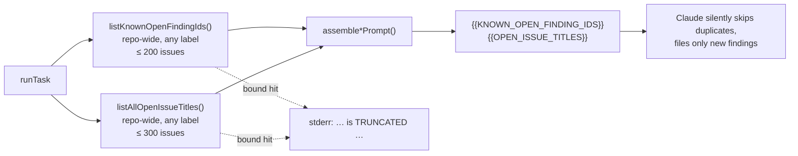

The **native** templates (`alert-feed`, `bash-script-refs`, `bash-syntax-audit`,
`workflow-annotation-scan`) are deliberately excluded: they invoke no LLM and
file only fixed-id or fingerprinted findings, so they have no
semantic-duplicate surface for a title list to guard.

#### Adding a template — the conformance test enforces this

[`idle_task_scan_dedup_conformance_test.ts`](../worker/deno/tests/idle_task_scan_dedup_conformance_test.ts)
(Issue #540) walks `listTemplates()` — the **live** registry, not a
hand-maintained list — and drives each scan template's `runTask` through
recording stubs. Per template it asserts the repo-wide lookup happened, that its
result reached the scan runner and then the prompt via the template's own
`assemble*Prompt`, and the negative: a dedup list sourced from a `--label`-scoped
query fails.

So a new template must do one of two things before CI goes green:

- **wire it up** — add a `HARNESSES` entry naming its factory and its prompt
  assembler; or
- **exempt it** — add it to `NON_PARTICIPATING` with a stated reason (the four
  native templates above are the existing entries).

An implicit skip is not available, which is the point: wiring eighteen
templates up once does not stop the nineteenth being written against the old,
label-scoped pattern.

Wiring a template up means all four of:

1. **Fetch both lists repo-wide in `runTask`** — `listKnownOpenFindingIds` and
   `listAllOpenIssueTitles`, neither with a `--label` argument.
2. **Pass both into `assemble*Prompt`**, rendering the title list with
   `renderOpenIssueTitles` so an empty repo yields `(none)`.
3. **Carry both placeholders in the prompt** —
   `prompts/<type>/` must substitute `{{KNOWN_OPEN_FINDING_IDS}}` *and*
   `{{OPEN_ISSUE_TITLES}}`, and instruct the model to **skip** — not comment on,
   not cross-link — any finding already covered by either list, whatever label
   that issue carries.
4. **Document both in the template's scan doc**, beside the `(none)`-on-empty
   note. `tests/dedup_placeholder_docs_test.ts` fails when a published doc
   names `{{KNOWN_OPEN_FINDING_IDS}}` without `{{OPEN_ISSUE_TITLES}}`.

### Wrapper body size limit

GitHub rejects any issue body over **65,536 characters**
(`GraphQL: Body is too long`). Prompts grow — the `security_scan` v28 preview
builds an 84,454-character body — so both filing paths pass the finished body
through [`clampIdleTaskBody`](../worker/deno/lib/idle_task_body_limit.ts) before
`gh issue create`. The clamp keeps the fingerprint head and the attribution +
run-id tail, replaces the dropped span with a visible
`⚠️ **Preview truncated to fit GitHub's issue-body limit.**` notice naming the
exact character count, and emits an `action=truncated_body` log line — the body
never shrinks silently.

The scan itself is unaffected: the wrapper body is a _preview_, while
`template.runTask` re-loads the full prompt from `prompts/<scan>/vN.md` at run
time.

### Condensed previews — summary plus pinned permalink

The clamp is a backstop, not a fix. `security_scan` v30 built a
100,841-character preview, so **every** seeded wrapper lost ~36,000 characters
out of its middle and the only signal was one `action=truncated_body` log line.
A truncated copy of a prompt serves nobody, so a template whose preview would
overshoot now stops inlining the prompt altogether:
[`buildPromptPreviewBody`](../worker/deno/lib/idle_task_body_preview.ts) returns
a short wrapper carrying the prompt's own first heading (so each template's body
fingerprint still dispatches), a visible condensed notice, the template's scope,
an outline of the prompt's sections, the dedup rules — and a **permalink to
`prompts/<scan>/vN.md` pinned to the seeding commit SHA**, so a reader opens the
exact prompt text that ran. `security-scan` and `github-actions-audit` are the
two templates currently over the ceiling.

`tests/idle_task_body_preview_limit_test.ts` is the gate: it builds every
registered template's preview and fails when any exceeds the budget
(65,536 characters less a 1,024-character reserve for the attribution tail). A
prompt bump that outgrows the limit now breaks `deno test` at the PR that grows
it, instead of surfacing in production as a dropped middle.

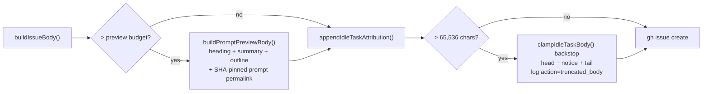

A `truncated_body` line appearing in the seeder logs after this landed means a
template slipped past the gate — file it as a bug.

### Phase 0 — Adapt to the project

Every **judgement-bearing** scan reads the target repo's own committed
conventions before it applies a single check. The prompts open with a shared
`## Phase 0 — Adapt to the project` stanza instructing the scan to read the
repo's `README.md`, its agent instructions (`AGENTS.md`, `CLAUDE.md`),
`CONTRIBUTING.md`, and any style guide under `docs/`; where a documented
convention conflicts with a check, **the project convention wins** and the
candidate is dropped. Two boundaries keep the rule honest:

- **Written down or it does not count.** An undocumented habit inferred from the
  code never overrides a check — otherwise the scan can talk itself out of
  anything.
- **A convention can never soften a security finding.** If a check fires
  _because_ the documented convention itself is unsafe (a security or fail-loud
  violation), the finding is filed **against the convention** and says so.

Carrying the stanza (each as a new prompt version — prompts are immutable):
`best-practices`, `documentation-audit`, `doc-coverage`, `test-audit`,
`format-drift`, `dead-code`. Deliberately **not** carrying it: `security-scan`
(no documenting your way past a security finding) and the purely mechanical
`bash-syntax-audit` / `workflow-annotation-scan` (a syntax error is not a matter
of convention).

The wording lives in exactly one place —
[`PROJECT_CONVENTIONS_STANZA`](../worker/deno/lib/project_conventions_stanza.ts)
— and `project_conventions_stanza_test.ts` asserts each prompt carries it
verbatim, so the six copies cannot drift apart. This changes only how a scan
_judges_ a repo against its own conventions; it introduces no cross-repo
mechanism, so repository isolation is untouched.

## Coordination

Three guards keep two workers (or two trigger paths) from racing on the same
repo:

1. **Label-only repo dedup** — at most one open `idle-task` issue per repo,
   regardless of template. `findExistingIdleTaskIssue({ repo })` queries by the
   `idle-task` label alone and ignores the marker's `template` field, so a
   single open idle-task issue (of any template) blocks further filing for that
   repo until it is closed.
2. **Issue-claim atomicity** — the same atomic claim machinery used for regular
   issues prevents two workers from running the same `runTask()` invocation.
   Only the worker that successfully assigns itself proceeds.
3. **Lowest-priority queue position** — the `idle-task` label sits at the bottom
   of the priority order so idle-task work is selected only when every higher
   tier is empty. It will never pre-empt PR feedback, CI fixes, planning, or
   new-issue work.

**Fleet-global existence gate.** Before the per-repo loop — right
after the cross-repo wrapper check — the filer asks one whole-set question: does
**any** monitored repo hold an open, **unblocked**
`top-priority`/`work-on`/`low-priority` issue? If so it skips filing entirely
(`action=skipped reason=approved_work_in_flight scope=monitored_set`). This is
deliberately an **existence** check, not a "claimable right now" check: a
`work-on` issue merely _deferred_ this cycle by `nice` tiering, fair rotation,
or local/cross-worker cooldown still _exists_, so the fleet has real work and an
idle-task must not be filed. It repairs the filing half of the
idle-vs-work-on inversion, where the per-repo busy check (gate 5 below) only
skipped the _individual_ busy repo and let a quiet repo B be filed into while a
different repo A held the deferred backlog. The same suppression is also applied
cache-backed at the `run_core.ts` idle gate: the idle-decision census (below)
returns its fleet-global `inversionDetected` verdict and the loop skips the
filer (`[idle-hooks] ... skipping=idle-task-filer reason=unblocked_work_exists`)
with no extra `gh issue list` call. `idle-task` is excluded from the label set
(`REAL_WORK_LABELS` in
[`worker/deno/lib/repo_busy_for_idle_task.ts`](../worker/deno/lib/repo_busy_for_idle_task.ts))
because an in-flight wrapper is already caught by gate 1; blocked issues
(`needs-human`, `failed`, `failed-once`, `planning`) do not count, reusing the
 filter. Both layers are best-effort — a `gh` throw degrades to "no
work" so a transient hiccup never silently disables the filer.

On top of these baseline guards, the filer applies a stack of per-repo gates
before filing a fresh wrapper. The full per-repo evaluation order (logged with
`action=skipped reason=<name>`) is:

| Order | Gate                          | Skips when                                                                                                                                                                                                                          |
| ----- | ----------------------------- | ----------------------------------------------------------------------------------------------------------------------------------------------------------------------------------------------------------------------------------- |
| 1 | Cross-repo wrapper check | Any monitored repo already has an open `idle-task` issue. Reason: `existing_wrapper_open`. |
| 2     | Per-repo label dedup          | The target repo already has an open `idle-task` issue (defence-in-depth against the cross-repo TOCTOU). Reason: `duplicate`.                                                                                                        |
| 3 | Output-backlog gate | The target repo has `BACKLOG_THRESHOLD` (currently 6) or more open issues carrying `template.outputLabel`. The previous batch is still being remediated. Reason: `output_backlog`. |
| 4 | `shouldFile` veto | The template's own `shouldFile` returns `false`. `security-scan` uses this to refuse a new run while open `security` findings or an existing `Run a security scan` wrapper still exists. Reason: `pending_results`. |
| 5     | Approved-work-in-flight check | Another worker already holds an `idle-task` assignment somewhere. Reason: `approved_work_in_flight`.                                                                                                                                |
| 6 | Per-repo cooldown gate | The repo is inside the rolling cooldown window for this template (default 24h). Reason: `cooldown_active`. |

If the loop exhausts every repo without filing, the whole-set summary reason is
chosen by specificity (most → least): `output_backlog` > `pending_results` >
`approved_work_in_flight` > `cooldown_active` > `duplicate`.

When a picked-up `idle-task` issue is claimed, the handler decides whether it is
a **scan wrapper** (run its template `runTask`) or an **ordinary work item**
(let the standard issue→PR pipeline handle it). A claimed issue runs a template
**only** when it matches one of two wrapper-identity signals:

1. **Title match** — `template.buildIssueTitle(repo)` equals the issue's title
   (human-style wrappers).
2. **Body-fingerprint match** — `template.matchesIdleTaskBody?.(body)` returns
   `true`. Defence-in-depth when the title was edited or the label was stripped
   and re-added between filing and pickup. All eighteen templates implement
   this, so a genuine wrapper is always recognised even with a mangled title.

If **neither** signal matches, the handler returns `{ handled: false }` and the
issue is worked through the standard pipeline like any other lowest-priority
issue — because `idle-task` is just a priority, not a scan-only marker. The bare
`idle-task` **label is no longer a dispatch signal**: previously a label-only
match forced scan-only handling (and closed non-wrapper findings as "no template
matches"), which stranded every `idle-task`-labelled finding. The
wrapper-identity signals (title + body) still keep a genuine scan wrapper out of
the PR flow even if its label was stripped.

Any template that needs additional coordination (for example, the security-scan
template's internal pipeline guards) implements that internally in `runTask()`.

### Idle-decision claimable-work census

At the idle-task **filing** decision point (the same gate the idle-detect audit
and the filer fire from — i.e. when the Priority 2 scan returned
`foundClaimableIssue === false`), the worker emits a per-repo **claimable-work
census** so the idle-vs-work-on inversion is observable from the log alone. For
every monitored repo the census records:

- the **availability** verdict (`available` / `busy` / `empty`), computed from
  the per-iteration issue cache via `checkRepoAvailability`,
- the resolved **`nice`** tier (Unix-`nice` semantics — lower is worked sooner,),
- counts of **open, unblocked** `top-priority` / `work-on` / `low-priority` /
  `idle-task` issues, and
- whether the repo was scanned this cycle (plus a skip reason slot).

"Unblocked" means the issue carries the priority label, carries **no** blocking
label (`failed`, `needs-revision`, `refine-issue`, `planning`, `question`,
`needs-human`), has **no assignees**, is not blocked by an open PR in its work
stream, is not named by a **merged** fleet PR, sits in a work stream this worker
has **not** already occupied, and is not one this run is already holding back
— i.e. work the Priority 2 scan could hand a
worker right now. Crucially, neither
`degraded-model` nor `lang:*` is a blocking label, so an issue carrying them
still counts: the census exists precisely to refute the "a `degraded-model`
filter is hiding the work" hypothesis.

Work streams are milestones, plus `""` for the default-branch stream. A stream
is **occupied** once it hosts an open issue assigned to any account the scan
honours — this worker or an `allowed_authors` entry — and the Priority 2 scan
then refuses every sibling in it (`isMilestoneOccupied` → the
`milestone-occupied` skip). The census applies the same gate **over the same
account set** and reports the excluded siblings as `stream_occupied=<n>`,
alongside `pr_blocked=<n>`, so both deferrals stay observable without inflating
the inversion signal:

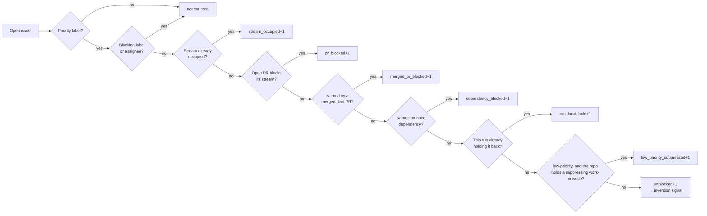

Before Issue #3852 the census skipped the occupancy gate, so every sibling of an
in-flight claim counted as claimable. `stSoftwareAU/NEAT-AI` logged
`work_on=4 inversion_signal=true` cycle after cycle while the scan logged
`milestone-occupied=4` and the audit logged `claimable=0 reason=stream_occupied`
— the scan was right, and the false signal both suppressed the idle-task filer
and escalated to a filed issue.

The account set was narrower here than in the scan until Issue #753: the census
counted only *this worker's* assignments, so a stream held by a human read as
claimable here and as `milestone-occupied` there. On `stSoftwareAU/VibeCoder` a
human took two unmilestoned issues, which occupied the default-branch stream for
the scan, and the census then reported `work_on=3 inversion_signal=true` for
three consecutive cycles and filed an issue whose "one of them is wrong" was
answered by "neither". The narrow set had been justified as keeping a sibling
host's claim from silencing this host's signal; it does not survive the rule
this instrument applies — `milestone-occupied` is declared `self`-clearing in
`skip_reason_clearing.ts`, and the streak escalation exists for gates that never
clear. Work in flight, whoever holds it, is not a contradiction to report.

The **merged-PR** gate closes the same hole for the one deferral that never
clears by itself. Since Issue #3151 a merged fleet PR naming issue `#N` makes
the scan skip `#N` permanently (`merged-pr-permanent`); only a trusted author
re-applying the pickup label with a date after the merge lifts it. The census
did not model that, so a single such issue held `inversion_signal=true` for
ever. On 2026-08-26 `stSoftwareAU/GRQ` logged
`work_on=10 low_priority=1 inversion_signal=true` cycle after cycle because
GRQ#4326 — `work-on` since 23 August, unassigned, carrying no blocking label —
is named by merged PR #4336. The scan was right; the census escalated it as
"the claim scan keeps refusing" (GRQ#4419, VibeCoder#429). Excluded issues are
now reported as `merged_pr_blocked=<n>` so the permanent strand stays visible
rather than being silently dropped. Issue #504 drains the strand itself: the
housekeeping `merged-pr-issue-sweep` step closes an issue whose fix has merged
**and landed**, whoever authored the PR, so this count reflects issues awaiting
that sweep rather than a permanent population.

The **dependency** gate (Issue #460, GRQ#4465) closes the third instance of the
same hole. `collect_work_on_candidates.ts` refuses an issue naming an open
dependency (`dependency-blocked` via `isDependencyBlocked`); the census did not
model it, so such an issue counted as claimable on every cycle. It is resolved
against the repo's own open-issue set — which the census already holds — so it
costs no `gh` call: a same-repo `#N` absent from that set is closed and does not
block, and a cross-repo `owner/repo#N` cannot be resolved locally, so it blocks,
matching `isDependencyBlocked`'s fail-safe.

The **run-local hold** gate (Issue #655) closes the fourth instance, one step
later in the pipeline. Every gate above lives in a `collect_*_candidates.ts`;
`find_oldest_issue.ts` then drops each surviving candidate that
`isIssueInCooldown` names — the persisted retry cooldown
(`.cooldown_state.json`) plus this run's processed-issue registry. Registry
entries live as long as the process, so an issue a run bounced off once was
refused silently on every later cycle of that run. On 2026-08-30
`stSoftwareAU/VibeCoder` logged `work_on=2 inversion_signal=true` cycle after
cycle for #622 and #623 — both handed back earlier that day, neither carrying a
single GitHub-visible blocker — and filed VibeCoder#655 against a scan that was
right. `run_core_production_deps.ts` now resolves the hold set **once** and
hands the same set to all three readers, and excluded issues are reported as
`run_local_hold=<n>`. The per-cycle adaptive-floor deferral (Issue #245) is the
one source still unmodelled; it is rebuilt every cycle, so it cannot hold a
streak open the way the registry did.

The third reader is the **idle-detect audit** (`idle_detect_diagnostics.ts`),
which counted those same two issues for the life of the run — so
`[idle-detect] ... ALERT mis_classification ...` fired on every tick beside the
census's inversion alert, and the audit's `claimableTotal` suppressed the
idle-task filer with it. It now applies the hold as its last gate, reporting
`reason=run_local_hold` on the per-repo line, exactly as it took the open-PR
gate in Issue #4223 and the merged-PR gate in GRQ#4419. A hold source that
throws falls back to no hold, so a failure restores the old over-count rather
than reporting a repo as having nothing to do.

That incident also exposed the other half of the fault, in the scan's own
reporting: the cooldown filters logged their skip and recorded nothing in
`blockedDetails`, the field Issue #460 added so the escalation can name the gate
per issue. VibeCoder#655 was therefore filed with an empty "what the claim scan
did with them" section — the one fact its reader needed. Both filters now record
the refusal alongside the log line.

The **tier-3 suppression** gate (Issue #499) closes the same hole one level up.
Every gate above is per-issue; this one is per-repo. `selectHighestPriority`
drops every `low-priority` candidate from a repo that holds a _suppressing_ open
`work-on` issue (`reposWithOpenWorkOn` — see
[issue-processing.md → Per-repo tier suppression](workflows/issue-processing.md#per-repo-tier-suppression-a-suppressing-work-on-issue-parks-the-lower-tiers)),
so such a backlog is not work the scan refused — it is work the scan is
deliberately serialising. The census counted it anyway. On 2026-08-28
`stSoftwareAU/NEAT-AI-Rebase` logged
`work_on=0 low_priority=28 merged_pr_blocked=1 inversion_signal=true` on cycle
after cycle; excluded issues are now reported as `low_priority_suppressed=<n>`.

That repo exposed the other half of the fault at the same time, and it was the
scan's: the single suppressing issue was NEAT-AI-Rebase#48, refused
_permanently_ as `merged-pr-permanent` because merged PR #49 names it. All 28
`low-priority` issues were parked behind work no cycle could ever claim.
`collect_work_on_candidates.ts` now excludes permanently blocked issues from the
suppression signal, and the census mirrors both carve-outs — a `work-on` issue
blocked only by an open dependency (Issue #2610) or permanently by a merged PR
(Issue #499) does not suppress, while every self-clearing blocker (open PR,
occupied stream, closed-unmerged cooldown) still does.

Repeated misses are a pattern, not accidents, so the gate list is now checked
by the compiler. `SKIP_REASONS` in `issue_finder_logger.ts` is a runtime tuple
(the `SkipReason` type is derived from it), and
`CENSUS_SCAN_GATE_COVERAGE` in `idle_decision_census.ts` is a **total** map over
it, classifying every gate as `modelled`, `upstream`, `run-local` or
`escalated-elsewhere`. A new skip reason in any `collect_*_candidates.ts` fails
the type check until somebody classifies it — the check #3526, #3852 and
GRQ#4419 each went without.

That guard covers the **collection** gates only. Tier-3 suppression is applied
in `selectHighestPriority`, so it never reaches `logIssueSkipped` and carries no
`SkipReason` for the map to demand a verdict on — which is how Issue #499 slipped
past a compiler check built for exactly this class of bug.

Issue #524 closes that second hole the same way, on a second axis.
`SKIP_REASON_CLEARING` in
[`skip_reason_clearing.ts`](../worker/deno/lib/skip_reason_clearing.ts) is a
total map over the same `SkipReason` union declaring how each gate's refusal is
lifted — `self`, `permanent` or `human` — and **both** instruments derive their
suppression rule from it, rather than each restating which gates carve out. Only
a `self`-clearing gate parks the lower tiers, so a 25th gate cannot rejoin the
suppression signal without somebody declaring that it clears by itself.
`skip_reason_clearing_test.ts` pins the rule and the two maps' key sets;
`idle_decision_census_test.ts` still pins the census's own mirroring.

The census-vs-scan comparison itself also runs in CI now, not only on the fleet.
`claim_path_differential_test.ts` replays generated repo states — every pair of
`modelled` gates, with the `run-local` axes held constant — through
`buildIdleDecisionCensus` and the real `findOldestIssue`, and fails on any
disagreement. `claim_path_incident_test.ts` does the same for each recorded
field state under
[`tests/fixtures/claim_path_incidents/`](../worker/deno/tests/fixtures/claim_path_incidents/README.md),
so a state that once produced an inversion alert can never produce one silently
again.

Two deliberate limits keep both instruments cheap probes rather than a second
scan: only **merged** PRs count (a closed-unmerged PR blocks for a cooldown
window that clears itself), and the re-label escape hatch is **not** modelled,
because it needs a per-issue timeline call. Both make the census _under_-count,
which at worst files an idle-task while work exists — the bounded-harm
direction.

Any monitored repo holding ≥1 unblocked `top-priority` / `work-on` /
`low-priority` issue at this moment is the **inversion signal**; `idle-task` is
excluded by design (it _is_ the idle work). The formatter emits a header line,
one `[idle-census] … repo=<owner/repo> …` line per repo, and — when the signal
fired — a single greppable `[idle-census] … ALERT inversion repos=<csv>` line.

#### Only a refusal escalates

The inversion signal answers "is there claimable work right now?". Escalating it
as _"the claim scan keeps refusing this work"_ needs a second fact: that the
claim scan actually **completed an eligibility pass** and still claimed nothing.
It frequently has not. The pool stops before its next claim whenever the cycle
deadline or the claim-runway floor is reached, a shutdown arrives, or the pool
is draining — on such a cycle the backlog was never evaluated, so nothing
refused it.

The loop therefore passes `claimScanCompleted` into the census hook: `true` only
when a scan returned "no eligible work", `false` for every lifecycle stop. The
census records it as `scanned=<bool>` (with `skip_reason=cycle_deadline`) and
splits the inverted repos in two:

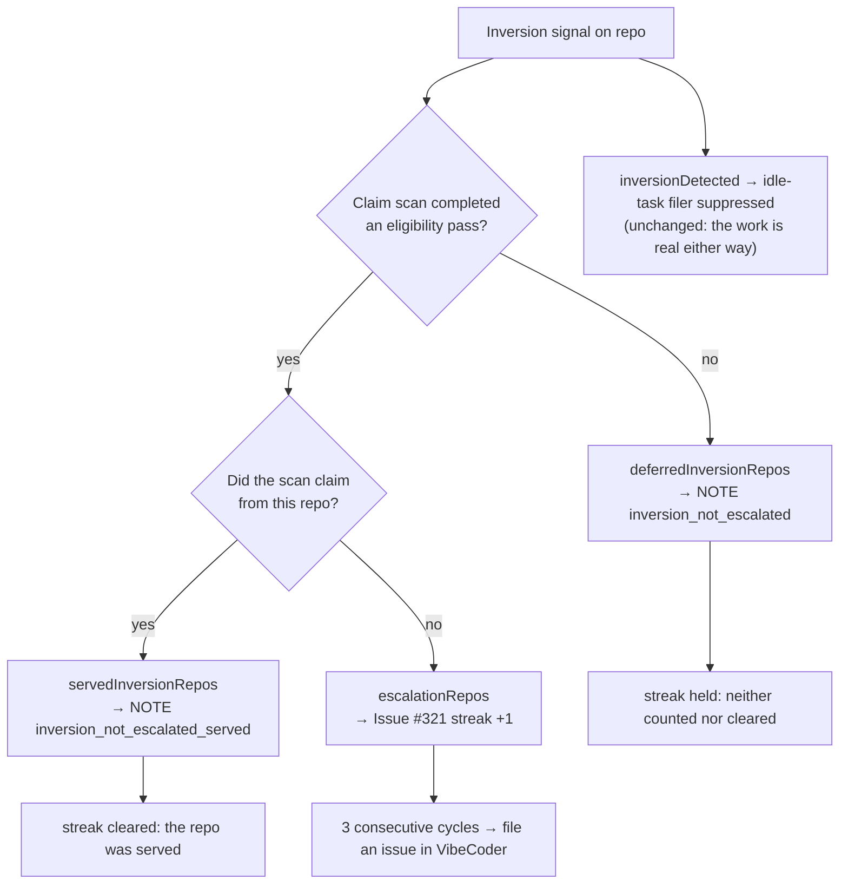

A repo the scan **claimed from** is likewise not one it refused (Issue #460).
Two concurrent slots working an 80-issue backlog leave claimable work behind on
every cycle by construction, so without this the escalation is guaranteed to
fire against any busy repo. GRQ#4465 was filed at 16:11:57Z on 2026-08-27; at
16:15:49Z the same scan claimed GRQ#4463 from that repo and worked it to the
cycle deadline. The claim counts, not the outcome — that run ended
`no_pr:timeout:execute`, and a claim that later fails is still not a refusal.

An unscanned repo is **held**, not cleared: the cycle proves neither a refusal
nor a clean pass, so a genuine streak survives a busy cycle and a busy fleet
never manufactures one. Filer suppression is deliberately untouched — work the
scan did not reach is still work, and filing an idle-task beside it inverts
priority just the same.

This is the VibeCoder#437 failure: on 2026-08-26 every `ALERT inversion` naming
`stSoftwareAU/VibeCoder` followed a `stop reason=deadline` (or `drain`) line by
about a minute — 22:34:05 → 22:35:14, 20:59:06 → 21:01:01, 17:46:24 → 17:47:41 —
with eight to nine genuinely claimable `work-on` issues in the repo. Three such
cycles filed an issue asking a human to find a scan bug that did not exist; the
scan had simply run out of cycle. The deferral is now logged instead:

```text
[idle-census] … NOTE inversion_not_escalated repos=stSoftwareAU/VibeCoder — the
claim scan did not complete an eligibility pass this cycle, so nothing refused
this work
```

#### The escalation is filed in VibeCoder

The issue lands in `stSoftwareAU/VibeCoder`, never in the subject repo
(Issue #459). The census, the claim scan and the filer are all worker code, so
no change in the subject repo can fix what the issue reports. GRQ#4465 was filed
into GRQ, whose body then asked a human to apply `work-on` — scheduling an agent
against a checkout containing none of the deciding code, with a write allowlist
covering only that repo, so the sole available outcome was a `needs-human`
hand-off. The dedup marker stays keyed on the **subject** repo
(`<!-- VIBE_IDLE_INVERSION:owner/repo -->`), so two hosts watching the same
subject still converge on one issue. Same rule, and same shape, as
`run_failure_issue.ts`: an issue whose fix is worker code belongs in the
worker's repo, whatever repo it is *about*. Scan findings (security,
best-practices, dead-code, …) are the opposite case and stay in the repo they
describe.

The body now names the issues the census counted and, where the scan recorded
one, the gate that refused each — `FindIssuesResult.blockedDetails` carries the
per-issue reasons the same way Issue #219's counts ride the result. GRQ#4465
carried a bare count, and the scan logged only aggregate top-3 reasons, so which
gate the two sides disagreed about was unrecoverable from the alert and the log
together.

Since Issue #505 the escalation issue no longer waits for a human to schedule
it. Its `VIBE_IDLE_INVERSION` marker is recognised provenance, so the claim
scan's tier 2b
([`collect_self_diagnostic_candidates.ts`](../worker/deno/lib/collect_self_diagnostic_candidates.ts))
claims it on that basis — one at a time, recorded in the audit chain and
announced on the issue, and still below any human-scheduled work. See
[Self-scheduled worker diagnostics](workflows/issue-processing.md#-self-scheduled-worker-diagnostics-tier-2b).

The census reads through the iteration-scoped `IssueCache` / `fetchAllIssues`,
so a quiet cycle adds **no** extra issue-list API call (whichever of the census,
the recovery scan, and the Priority 2 scan runs first populates the shared
`issues_all` cache). It is fully best-effort: any throw is caught and logged
(`Idle-decision census failed
(continuing): <msg>`) and never aborts the loop.

The pure builder lives in
[`worker/deno/lib/idle_decision_census.ts`](../worker/deno/lib/idle_decision_census.ts)
(`buildIdleDecisionCensus` + `formatIdleDecisionCensus`); the production hook is
`runIdleDecisionCensus` in
[`worker/deno/lib/run_core_production_deps.ts`](../worker/deno/lib/run_core_production_deps.ts),
wired into the idle gate in
[`worker/deno/lib/run_core.ts`](../worker/deno/lib/run_core.ts).

### Random repo selection

`maybe-file-idle-task`
([`worker/deno/commands/maybe_file_idle_task.ts`](../worker/deno/commands/maybe_file_idle_task.ts))
applies two layered checks before filing.

1. **Cross-repo wrapper check.** Before any per-repo work, the
   command calls
   [`findAnyOpenIdleTaskWrapper`](../worker/deno/lib/idle_task_issue.ts) which
   scans **every** monitored repo for an open `idle-task`-labelled issue. If a
   wrapper exists anywhere in the monitored set, filing is skipped entirely with
   `action=skipped reason=existing_wrapper_open`, and the existing wrapper is
   picked up by the next iteration of the main loop through the standard
   priority-dispatch path. This guarantees at most one open `idle-task` wrapper
   across the entire monitored set, and prevents the failure mode of where
   successive idle ticks each picked a different "clean" repo from the per-repo
   shuffle and fanned wrappers out across the fleet.
2. **Per-repo shuffle and file.** Only when the entire monitored set is clean
   does the command shuffle the repo list with a Fisher–Yates pass backed by
   `crypto.getRandomValues` and walk the shuffled list, filing
   into the first repo whose per-repo dedup query also comes back clean. The
   per-repo dedup loop is preserved as defence-in-depth against TOCTOU races
   between the cross-repo check and the per-repo file.

The shuffle prevents a busy lead-of-list repo from starving the rest: if the
first repo by declaration order already has an open idle-task issue, every
subsequent idle pass would otherwise stall on it. Operators should expect two
consecutive idle passes — when both fire against a clean set — to target
different repos. That is by design, not a bug.

Since the random pick is the **fallback**, not the first choice —
see [Cadence bias on the idle tick](#cadence-bias-on-the-idle-tick).

### Seeding all wrappers on demand

The steady-state filer above deliberately seeds **one** wrapper per idle tick.
That is the wrong cadence when an operator wants the **full** set of eighteen
wrappers raised on a single repo immediately — for example, to re-check a repo
after the best-practices templates were improved. The
`create-all-idle-task-wrappers` command
([`worker/deno/commands/create_all_idle_task_wrappers.ts`](../worker/deno/commands/create_all_idle_task_wrappers.ts))
exposes the same `createAllIdleTaskWrappers` seam that the
`add-repo` onboarding flow uses, standalone:

```bash
deno run -A worker/deno/mod.ts create-all-idle-task-wrappers --repo owner/repo
```

It bypasses both the random single-pick and the cross-repo gate so one call
seeds every registered wrapper at once. It is **idempotent** — any wrapper whose
canonical title is already open is reported as skipped rather than duplicated —
and reports `N created, M already open`. Run it from the repository root so the
template body builders can resolve their cwd-relative prompt paths (e.g.
`prompts/best_practices/buckets/general.md`).

#### When a sweep fails part-way

A sweep used to return on the **first** `gh issue create` failure and throw away
everything it had already done, so an operator whose sweep died on template 9 of
17 was told only which template failed — not which eight wrappers already
existed (the and signature). Three behaviours now hold:

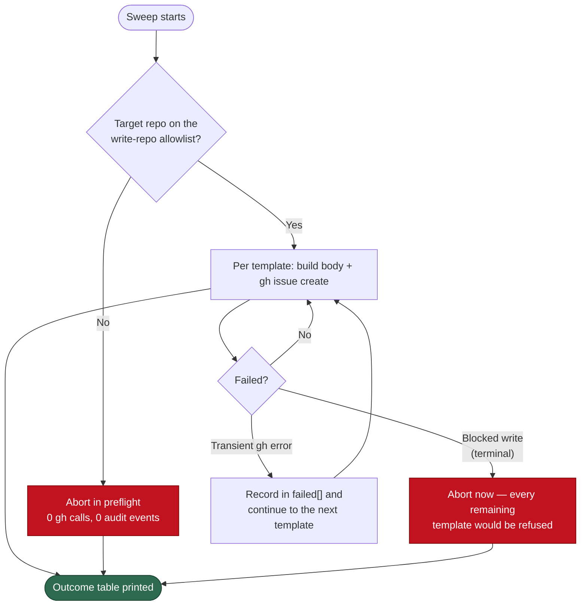

1. **Preflight.** If the run's write-repo allowlist is active and the target
   repo is not on it, the sweep aborts before a single body is built — naming
   the blocked repo and the active allowlist — so a blocked sweep costs zero
   `gh` calls and at most one blocked-write audit event instead of eighteen.
2. **Terminal vs transient.** A `WriteRepoBlockedError` /
   `WriteTargetUndeterminableError` surfacing mid-sweep aborts immediately (a
   retry cannot succeed); any other per-template failure is recorded and the
   sweep carries on, so one `gh` hiccup no longer costs the other seventeen.
3. **Partial progress survives.** Every failure path returns an
   `IdleTaskSweepError` carrying the `created` / `skipped` / `failed` lists, and
   the CLI prints a per-template outcome table on **both** exit paths before
   exiting non-zero:

   ```text
   [create-all-idle-task] outcome table repo=owner/repo created=8 skipped=1 failed=1
     TEMPLATE            STATUS   REASON
     security-scan       created  -
     best-practices      skipped  already_open
     dead-code           failed   [create-all-idle-task] gh issue create failed …
   ```

The per-repo fan-out raisers below inherit all three: a repo that fails
part-way still reports the wrappers it filed, and an off-allowlist repo is
skipped in preflight while the remaining repos are seeded normally.

### Raising the Boy Scout wrappers across every repo

The four "Boy Scout" templates (`dead-code`, `doc-coverage`, `format-drift`,
`deprecated-api`) are the issue-only maintainability sweeps. To confirm the
whole set works on demand — or to kick off a maintainability pass everywhere —
the `raise-boy-scout-idle-tasks` command
([`worker/deno/commands/raise_boy_scout_idle_tasks.ts`](../worker/deno/commands/raise_boy_scout_idle_tasks.ts))
seeds just those four wrappers in **every** monitored repo in a single pass:

```bash
# Explicit list:
deno run -A worker/deno/mod.ts raise-boy-scout-idle-tasks \
  --monitored-repos owner/repo-a,owner/repo-b

# Or fall back to the worker config's `repos` list:
deno run -A worker/deno/mod.ts raise-boy-scout-idle-tasks
```

It reuses the same `createAllIdleTaskWrappers` seam with a template-name filter
([`BOY_SCOUT_TEMPLATE_NAMES`](../worker/deno/lib/boy_scout_idle_tasks.ts)), so
it inherits the same **idempotent** per-repo title dedup — an already-open Boy
Scout wrapper is reported as skipped, never duplicated. A per-repo failure is
recorded in the summary and the sweep continues to the next repo; the command
reports `N filed, M already open, K failed`. Run it from the repository root for
the same prompt-path reason as above.

### Raising all wrappers across several repos

`create-all-idle-task-wrappers` seeds all eighteen wrappers on **one** repo;
`raise-boy-scout-idle-tasks` seeds **four** wrappers on **every** repo. The
`raise-all-idle-tasks` command
([`worker/deno/commands/raise_all_idle_tasks.ts`](../worker/deno/commands/raise_all_idle_tasks.ts))
combines both axes — it seeds the **full** set of eighteen wrappers in **each**
repo supplied, in a single pass. Use it to bring several repos up to the
complete best-practice set at once:

```bash
# Explicit list:
deno run -A worker/deno/mod.ts raise-all-idle-tasks \
  --monitored-repos owner/repo-a,owner/repo-b

# Or fall back to the worker config's `repos` list:
deno run -A worker/deno/mod.ts raise-all-idle-tasks
```

It reuses the same `createAllIdleTaskWrappers` seam per repo with **no**
template-name filter, so it inherits the same **idempotent** per-repo title
dedup — an already-open wrapper is reported as skipped, never duplicated. A
per-repo failure is recorded in the summary and the sweep continues to the next
repo; the command reports `N filed, M already open, K failed`. Run it from the
repository root for the same prompt-path reason as above.

### Raising one named template against a pinned repo

The three commands above vary the repo axis; none lets you pick a **single**
template deterministically. `raise-single-idle-task`
([`worker/deno/commands/raise_single_idle_task.ts`](../worker/deno/commands/raise_single_idle_task.ts))
seeds exactly **one** named template's wrapper into one or more named repos —
the "pinned target" one-off. It exists so an operator can trigger a specific
scan against a specific repo on demand instead of waiting for the random filer
to land on that (template, repo) pair. It was added to raise a one-off
`documentation-audit` run against private-repo-14:

```bash
# One template, one repo (the pinned one-off):
deno run -A worker/deno/mod.ts raise-single-idle-task \
  --template documentation-audit --repo stSoftwareAU/private-repo-14

# Or the same template across several repos:
deno run -A worker/deno/mod.ts raise-single-idle-task \
  --template documentation-audit --monitored-repos owner/repo-a,owner/repo-b
```

`--template` is required and validated against the canonical wrapper
template-name set
([`IDLE_TASK_WRAPPER_TEMPLATE_NAMES`](../worker/deno/lib/idle_task_backfill.ts))
— an unknown name **fails loud** with an error rather than silently filing
nothing. It reuses the same `createAllIdleTaskWrappers` seam with a single-entry
template-name filter
([`raiseSingleIdleTask`](../worker/deno/lib/raise_single_idle_task.ts)), so it
inherits the same **idempotent** per-repo title dedup — an already-open wrapper
is reported as skipped, never duplicated. A per-repo failure is recorded in the
summary and the sweep continues; the command reports
`N filed, M already open, K failed`. Run it from the repository root for the
same prompt-path reason as above.

### Requesting a sweep by issue, without a human `deno run`

Every command above is CLI-only: an operator has to be at a terminal. Asking
the **agent** to run one on a monitored repo does not work — since the
agent-subprocess `gh` guard the agent's allowlist
is baked at spawn time with the claimed issue's own repo only, so the very
first `gh issue create` against another repo is refused with
`[SECURITY] [WRITE_REPO_BLOCKED]` and the request ends in a `needs-human`
hand-off.

The worker-side path closes that gap. File an issue in a monitored repo whose
**title** is `seed-idle-tasks: owner/repo`, and the main loop routes it — before
the agent is spawned — to `process-seed-idle-tasks`
([`worker/deno/commands/process_seed_idle_tasks.ts`](../worker/deno/commands/process_seed_idle_tasks.ts)):

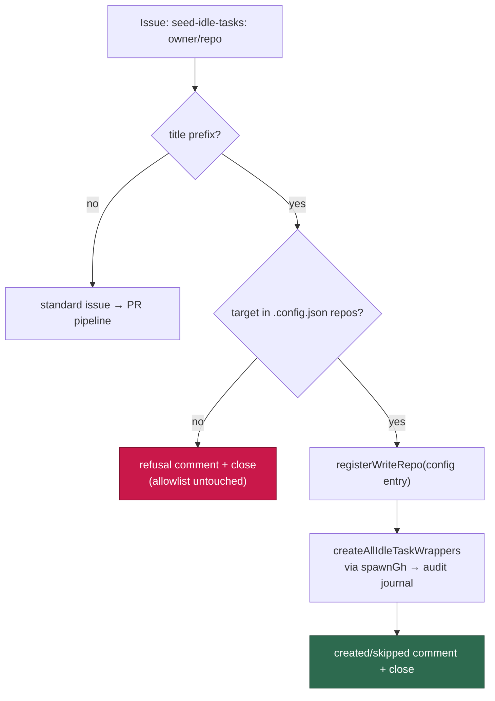

Three properties make this safe to expose:

- **The target comes from operator config, never from agent output.** The slug
  is read from the issue **title** only, then resolved against the fleet
  `.config.json` `repos` list; the value passed on is the *config entry*, so a
  repo an operator never approved cannot be reached. An unmatched repo is
  refused and the reason is posted on the issue.
- **The worker performs the writes, not the agent.** Every issue-create flows
  through the shared `spawnGh` chokepoint, so it is checked against the
  write-repo allowlist and recorded in the audit journal against the target
  repo.
- **The agent gains nothing.** The cross-repo grant is registered in the worker
  process and released before the command returns; the agent subprocess's baked
  allowlist still carries only the claimed issue's own repo, so the
   exfiltration boundary is unchanged.

Seeding reuses the same idempotent `createAllIdleTaskWrappers` seam, so a
re-filed request skips wrappers that are already open. A seeding failure is
reported on the issue and the issue is left **open** for a safe retry.

### Deciding *which* repo needs a sweep — the freshness report

Every command above answers "seed these wrappers now". None answers the
question that should come first: **which (repo, template) pairs are actually
overdue?** The steady-state filer is deliberately conservative — at most one
open wrapper across the whole monitored set, one randomly-picked
template per idle tick — so a pair can go unscanned indefinitely with no signal
anywhere. "Zero open wrappers" is the normal drained state, not an alarm; the
missing information is *when each pair last actually ran*.

`idle-task-freshness`
([`worker/deno/commands/idle_task_freshness.ts`](../worker/deno/commands/idle_task_freshness.ts))
reconstructs that from **closed** wrapper issues, for every repo in
`.config.json` `repos` × every registered template:

```bash
# Human-readable table, sorted by staleness:
deno run -A worker/deno/mod.ts idle-task-freshness

# Machine-readable, for scripting a staleness check:
deno run -A worker/deno/mod.ts idle-task-freshness --json

# Flag anything older than a fortnight instead of the 30-day default:
deno run -A worker/deno/mod.ts idle-task-freshness --stale-days 14

# Append the weekly/monthly cadence compliance view (below):
deno run -A worker/deno/mod.ts idle-task-freshness --cadence
```

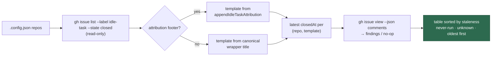

Three distinctions carry the report's meaning:

- **`never-run` is not `stale`.** A pair with no completed scan on record sorts
  first and is labelled distinctly — it has never been covered at all, which is
  a different problem from a scan that has simply aged out.
- **`unknown` is not a clean result.** A repo whose history cannot be read
  degrades every one of its pairs to `unknown` plus a
  `reason=history_read_failed` warning, in the same fail-open shape as
  `cross_repo_check_failed` — one flaky repo never fails the whole report, and
  the degradation is never reconciled as "never scanned". A malformed `gh`
  payload throws for the same reason. Likewise a wrapper whose closing comment
  cannot be read keeps its date and reports an `unknown` **outcome**.
- **Outcome is read from the template's own close comment.** Every template
  renders `"no findings"` or `"… Filed N issues: #A, #B, …"`, so the report can
  say whether the last run was a no-op or filed work.

Each entry also carries **per-model-tier history**, read from the
attribution footer's optional `Model:` segment:

- `lastRunModel` — tier of the most recent completed scan, shown in the table's
  `MODEL` column and `null`/`-` when that wrapper predates the tier stamp;
- `lastRunAtByModel` — most recent completed-scan timestamp per stamped tier
  (e.g. `{ "sonnet": "…", "fable": "…" }`), in the `--json` form only.

An unstamped wrapper still sets `lastRunAt` but appears under **no** tier key —
an unknown tier is never coerced to `sonnet`, which would otherwise falsely
satisfy a per-tier cadence floor.

The command is **reporting only** — every underlying `gh` call is a read
(`issue list`, `issue view`); it creates, closes, comments on and edits
nothing, and a regression test asserts zero mutating calls. It is therefore
safe to run at any time, against any repo, alongside a live fleet.

### Cadence policy — important vs busy work

The freshness report says *when* each pair last ran; the cadence policy says
*which* of those readings are overdue and *at which model tier*. It lives in
[`worker/deno/lib/idle_task_cadence.ts`](../worker/deno/lib/idle_task_cadence.ts)
— a **pure** module: the freshness entry type is imported type-only, and it
performs no I/O, spawns no process and never touches `gh`, so the policy is
unit-testable in isolation from the filer that will consume it.

Three templates are **important** — `security-scan`, `supply-chain-readiness`
and `github-actions-audit`. Each monitored repository is owed a cheap `sonnet`
scan at least weekly and an expensive `fable` scan at least monthly. Every other
registered template is **busy work**: untouched by cadence logic, still drawn at
random, and never present in the due list however stale it is.

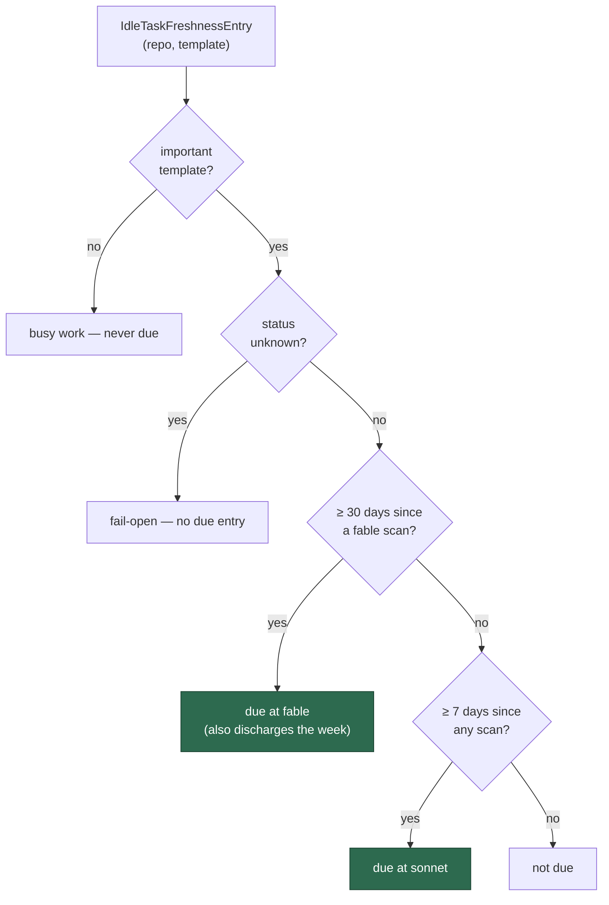

`computeDueScans(entries, now, policy?)` returns `{ repo, template, tier,
overdueDays }` sorted most-overdue first, so the caller can take the head
deterministically. The load-bearing details:

- **Rolling, not calendar-anchored.** Both windows are measured from the last
  **completed** scan.
- **Boundaries are inclusive.** Exactly 7.0 / 30.0 days old counts as due
  (`>=`), matching the 168h cooldown boundary so a weekly pair is never blocked
  by its own cooldown.
- **A fable run satisfies the week.** A pair overdue on both windows is emitted
  **once**, at `fable` — never twice, and never at `sonnet`.
- **Pre-stamp wrappers count towards the week, not the month.** A wrapper filed
  before the tier stamp sets `lastRunAt` but appears under no tier key,
  so it can never falsely satisfy the fable floor.
- **`never-run` is maximally overdue** (`NEVER_RUN_OVERDUE_DAYS`, a finite
  sentinel so it survives a JSON round trip) and sorts first; **`unknown` yields
  nothing** — a failed history read never biases the pick either way.
- **Malformed input fails loud.** An unparseable timestamp or a window pair that
  cannot express the cadence throws rather than reading as "fresh".

The three template names, the 7/30-day windows and the two tiers are the
built-in defaults (`DEFAULT_CADENCE_POLICY`); the `policy` argument is the seam
the operator's `.config.json` block feeds through — see the next section.

### Configuring the cadence — `idle_task_cadence`

Which templates get a floor, over which windows, and at which model tier is a
**spend** decision, so it is operator-only configuration in `.config.json` and
has no in-repo equivalent — a repository can never configure itself onto a
premium model. The block is parsed and validated by
[`parseIdleTaskCadence()`](../worker/deno/lib/idle_task_cadence_config.ts) at
config load and surfaced as `config.idleTaskCadence`, which the filer passes
straight to `loadDueScans`.

**The default is the policy above** — an operator who configures nothing gets
the three important templates on `sonnet`/`fable` over 7/30-day windows. Set the
block only to change it:

```json
{
  "idle_task_cadence": {
    "enabled": true,
    "templates": {
      "security-scan": { "weekly_model": "sonnet", "monthly_model": "fable" },
      "supply-chain-readiness": {
        "weekly_model": "sonnet",
        "monthly_model": "fable"
      },
      "github-actions-audit": {
        "weekly_model": "sonnet",
        "monthly_model": "fable"
      }
    },
    "weekly_days": 7,
    "monthly_days": 30
  }
}
```

Semantics:

- **`enabled` is the single kill switch.** `false` reverts the filer to a pure
  random pick — no pair is ever reported as due. It does not reclassify a
  template as busy work.
- **A monthly `fable` run also satisfies that week's `sonnet` requirement.** A
  pair overdue on both windows is filed **once**, at the monthly tier; the
  expensive scan discharges both obligations.
- **`templates` replaces the default set** rather than merging with it — the
  block is the whole important-template list, keyed by registered template name.
  Any registered template may be named, not just the default three.
- **Models are the known aliases only** — `fable`, `opus`, `sonnet`, `haiku`
  (cf. `ModelTier`). An omitted `weekly_model` / `monthly_model` takes the
  default `sonnet` / `fable`.
- **Windows must be finite positive numbers with `monthly_days > weekly_days`.**

Validation is **warn-and-fall-back**, never fatal — a typo in a spend policy
must not stop the worker starting. Every fault is warned about on stderr at
config load and defaulted:

| Fault                                                   | Behaviour                                     |
| ------------------------------------------------------- | --------------------------------------------- |
| Block absent                                            | Default policy, silently                      |
| Block malformed (not an object) or an unrecognised key  | Warn; default policy / key ignored            |
| Unknown template name (a typo)                          | Warn; **that entry is dropped**               |
| Model outside the known aliases                         | Warn; that window falls back to its default   |
| Non-finite / non-positive window, or `monthly ≤ weekly` | Warn; both windows fall back to 7/30          |
| `enabled` not a boolean                                 | Warn; cadence stays enabled                   |

Nothing is reconciled as valid silently: an all-typo `templates` block leaves the
important set empty (and says so, loudly), rather than pretending the operator's
policy is in force.

### Cadence bias on the idle tick

The policy above only says which pairs are overdue; the filer is what acts on
it. Before the template draw and the repo shuffle,
[`maybe_file_idle_task.ts`](../worker/deno/commands/maybe_file_idle_task.ts)
asks [`loadDueScans`](../worker/deno/lib/idle_task_due_scans.ts) for the overdue
list and walks it **most-overdue first**, filing the first pair that clears every
gate. Only when no overdue pair is eligible does it fall back to the unchanged
weighted-template + shuffled-repo path.

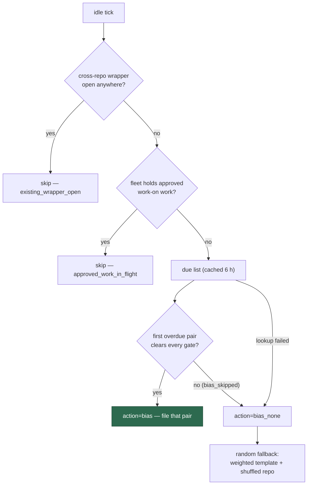

The load-bearing rules:

- **Preference, never permission.** An overdue pair still passes cross-repo
  wrapper dedup, the fleet-global `approved_work_in_flight` gate,
  per-repo dedup, cooldown, busy, backlog and the
  template's own `shouldFile` veto. Both paths share one implementation
  of that gate sequence, so the bias cannot file where the random path could not.
  Queued `work-on` work is never preempted — a busy week legitimately misses the
  floor.
- **Fail-open.** A freshness lookup that fails or throws logs
  `action=bias_none reason=freshness_failed` and files via the random path; it
  never surfaces as `action=error`.
- **Bounded cost.** The freshness reconstruction costs one `gh issue list` per
  monitored repo, so the due list is memoised in-process for 6 h
  (`DUE_SCAN_CACHE_TTL_MS`, driven by the caller's clock) and the per-wrapper
  closing-comment read is skipped entirely — cadence needs dates, not outcomes.
  A slightly stale due list is harmless because every gate re-runs before filing.
- **Weights are the fallback's business.** `idleTaskTemplateWeights` is
  consulted only on the random path; a biased pick ignores it.

Each tick emits exactly one decision line, so an operator can tell a biased tick
from a random one:

```text
[idle-task] action=bias template=security-scan repo=org/widget tier=fable overdue_days=12.3 source=cadence
[idle-task] action=bias_skipped template=security-scan repo=org/widget reason=cooldown_active
[idle-task] action=bias_none reason=no_overdue_pairs
```

`overdue_days=never` marks a pair with no reading at all on that window's clock.
A sustained run of `reason=freshness_failed` means the freshness lookup is broken
in production and the cadence floor is silently unmet — check it before the
downstream symptom (a repo with no new wrapper for over 7 days) appears.

### Honouring the stamped tier at claim time

The cadence policy decides the tier; the wrapper carries it; the claiming run
spends it. Filing and claiming are different runs — possibly different workers —
so the tier travels in the wrapper body's attribution footer — its optional
`Model:` segment — rather than in the filer's memory.

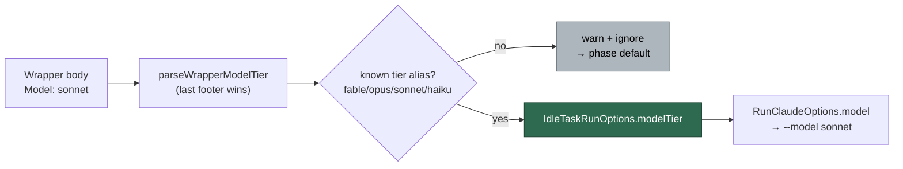

- **Reader.**
  [`worker/deno/lib/idle_task_model_tier.ts`](../worker/deno/lib/idle_task_model_tier.ts)
  reads the **last** attribution footer in the body — a template may embed a
  footer inside its prompt (the stamp Claude copies onto each finding), and the
  filer appends the authoritative one at the end.
- **Allowlist is the security boundary.** An issue body is user-editable, so
  only a `ModelTier` alias (`fable`, `opus`, `sonnet`, `haiku`) is honoured.
  Anything else — an unknown name, an empty stamp, junk — is ignored with a
  warning and the run falls back to the template's phase default. A hand-edited
  or prompt-injected body can therefore only _select among existing tiers_,
  never route a run to an arbitrary `--model` string and never raise spend
  beyond `fable`.
- **Threading.** `handleIdleTaskIssue` passes the honoured tier as
  `IdleTaskRunOptions.modelTier`; the three important templates forward it to
  their scan invocation's `RunClaudeOptions.model`, so `claude_runner` emits
  `--model <tier>` and the per-run cost stats attribute the spend to the tier
  actually used.
- **Unstamped is unchanged.** With no stamp the options carry **no** `model`
  key, so a randomly-picked wrapper behaves exactly as it did before.

### Cadence compliance — was the floor actually delivered?

The bias above is a **preference, never permission**: it never preempts queued
`work-on` work, so a busy week legitimately misses the floor. That trade-off is
only acceptable if a miss is **visible** — and "zero open wrappers" is the normal
drained state, so nothing else would show it. `--cadence` on the freshness report
turns that invisible drift into a number:

```bash
# Staleness table (unchanged) plus the weekly/monthly compliance view:
deno run -A worker/deno/mod.ts idle-task-freshness --cadence

# The same data structurally — --json always carries the `cadence` section:
deno run -A worker/deno/mod.ts idle-task-freshness --json
```

The view lives in
[`worker/deno/lib/idle_task_cadence_report.ts`](../worker/deno/lib/idle_task_cadence_report.ts)
— a **pure** module over the freshness entries already collected, so it costs no
extra `gh` call and, like the rest of the command, is read-only by construction
(a regression test asserts zero mutating calls under `--cadence`).

It covers the **important** templates only; busy-work templates keep today's
plain staleness rows. Compliance is measured against the policy actually in force
(`config.idleTaskCadence`,), not a hard-coded 7/30 the fleet is not being
held to, and every rule matches `computeDueScans` — a report that disagreed with
the filer would be worse than no report at all.

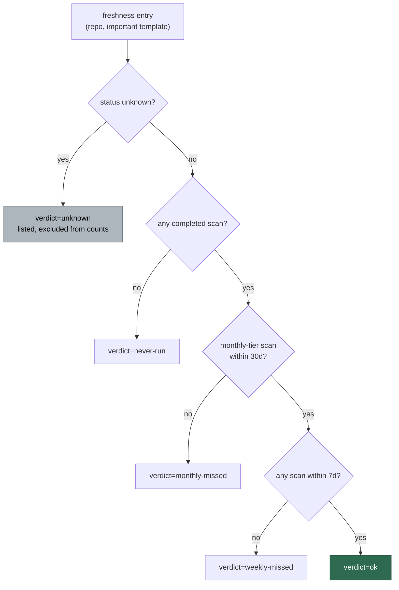

Reading a miss:

- **`weekly-missed`** — no scan of any tier inside the weekly window. One cheap
  `sonnet` run clears it.
- **`monthly-missed`** — no scan stamped with the **monthly** tier inside the
  monthly window. It outranks a weekly miss because one `fable` run discharges
  both obligations.
- **`never-run`** — no completed scan on record at all; maximally overdue and
  sorted first.
- **`unknown`** — that repo's history could not be read. The pair is **listed**
  so the gap is visible, but is excluded from every met/missed count: a failed
  read is never reconciled as compliance.
- **Boundaries are inclusive** — exactly 7.0 / 30.0 days old is already a miss.
- **A pre-stamp wrapper counts towards the week, not the month.** A wrapper filed
  before the tier stamp has no tier recorded, so the report shows
  `TIER unstamped` / `weekly_tier=unstamped` and no monthly reading rather than
  assuming a tier. Until a pair has a stamped `fable` scan it reads
  `monthly=missed`, never `met` — the report states that dependency in its
  standing caveats so a missing-dependency state is never mistaken for
  compliance.

Each pair also emits a structured line for scraping, in the established style:

```text
[idle-task-cadence] repo=org/widget template=security-scan weekly=met monthly=missed last_sonnet_days=2 last_fable_days=- weekly_tier=sonnet
```

`last_sonnet_days` is the **weekly floor's clock** — the age of the most recent
completed scan of any tier, since a pre-stamp wrapper counts towards the week —
and `last_fable_days` the age of the most recent monthly-tier scan (`-` when
there is none). In the `--json` payload the same readings are `lastRunDays` and
`lastMonthlyTierDays`, alongside `weekly`, `monthly`, `verdict`, the per-window
overdue days and the fleet `summary` (met/missed/unknown counts plus the worst
offenders, most overdue first).

The report is **reporting only** — a miss raises no issue and files nothing,
consistent with the module's read-only contract. Whether the floor is reachable
at all given one open wrapper fleet-wide and the `approved_work_in_flight`
suppression is an empirical question; this is how it gets answered with
data rather than argument.

### Per-repo cooldown gate

Inside the per-repo loop, after the dedup query but before the busy check, the
filer consults a rolling **per-repo cooldown gate** so a given template fires at
most once per repository per cooldown window. The window is keyed off the
`createdAt` of the most recent wrapper **or** finding the template produced in
that repo — a fast-failing scan still counts towards the window, so an unstable
template cannot escape the gate by failing quickly.

- **Default window: 24 hours.** Templates may override via the optional
  `cooldownHours` field on `IdleTaskTemplate`. A fast doc audit might run at 6h;
  a heavy weekly sweep at 168h.
- **Source of truth.** GitHub issue history (open + closed) across two sources:
  (a) wrappers — issues whose title matches `template.buildIssueTitle(repo)` AND
  carry the `idle-task` label; (b) findings — issues carrying
  `template.outputLabel`, when set. See
  [`worker/deno/lib/idle_task_cooldown_gate.ts`](../worker/deno/lib/idle_task_cooldown_gate.ts).
- **Per-repo skip line.** When a repo is inside the window the filer logs
  `[idle-task] template=<name> repo=<owner/repo> action=skipped reason=cooldown_active`
  and falls through to the next repo.
- **Whole-set summary.** When **every** monitored repo is inside its window the
  filer emits a dedicated summary line
  `[idle-task]
  template=<name> action=skipped reason=all_repos_cooled_down`
  (the message is about the whole set, so the line omits the per-repo
  identifier). The return data carries `reason: "all_repos_cooled_down"` and no
  `repo` field.
- **Specificity order.** When the loop exhausts every repo without filing, the
  fall-through reason is picked by specificity (most → least): `output_backlog`
  > `pending_results` > `approved_work_in_flight` > `cooldown_active` >
  > `duplicate`. The first signal that fired in the loop wins, so a repo that
  > was busy is reported as busy even if a sibling was inside its cooldown
  > window.
- **Transient failures degrade open.** A gh throw inside the cooldown helper
  logs `action=warn reason=cooldown_check_failed` and is treated as "not cooled
  down" — matches the `busy_check_failed` pattern so a transient hiccup never
  silently disables the filer.

### Per-template milestone

Every filed idle-task issue is assigned to a per-template GitHub milestone so an
operator can track a batch of idle-tasks of the same template through to
completion — **unless the template opts out via `skipMilestone: true`** (see
[Skipping the per-template milestone](#skipping-the-per-template-milestone)
below).

- **Title pattern:** `idle-task: <template-name>` — e.g.
  `idle-task: security-scan`. The title is the canonical identifier; there is no
  alternative spelling.
- **Created on demand on first file.**
  [`ensureIdleTaskMilestone`](../worker/deno/lib/idle_task_milestone.ts) lists
  open milestones via the GitHub REST API, returns an existing match unchanged,
  and only POSTs a new milestone when no match is found.
- **Idempotent.** Repeated calls for the same `(repo, template)` pair make at
  most one POST. Once the milestone exists, subsequent idle passes simply attach
  new issues to it.
- **Closed manually by operators.** When a batch of idle-tasks of one template
  is "done" (all child issues closed, all findings triaged), the operator closes
  the milestone in the GitHub UI. The next idle-task of that template will
  detect that no open milestone with the canonical title exists and auto-create
  a fresh one — closing a milestone is the operator's signal that the next batch
  starts now.

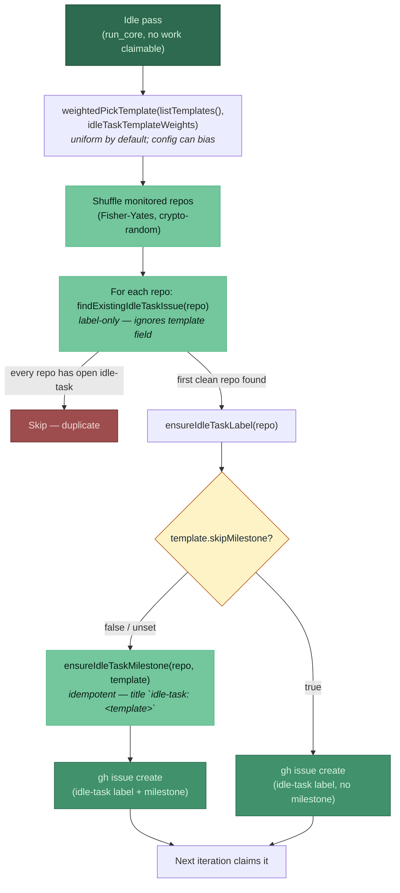

### Weighting the template draw

The template draw is **weighted** and **config-driven**. By default every
registered template carries an equal weight, so the draw is uniform (1/18 each
with eighteen templates) — no behaviour change unless configured. An operator
can bias the draw toward higher-priority templates (e.g. `security-scan` and
`supply-chain-readiness`) via the `idle_task_template_weights` map in
`.config.json`:

```json
{
  "idle_task_template_weights": {
    "security-scan": 3,
    "supply-chain-readiness": 3
  }
}
```

Templates absent from the map keep the baseline weight of `1`, and any
non-positive or non-finite weight collapses to that baseline (it does not
exclude the template). When no template carries a positive weight the draw falls
back to a uniform pick. The picker (`weightedPickTemplate` in
`commands/maybe_file_idle_task.ts`) is injected through the same
`pickTemplateFn` seam the tests use, so the weighting is fully unit-tested
without the network. See
[CONFIGURATION.md → Idle-Task Template Weights](CONFIGURATION.md#%EF%B8%8F-idle-task-template-weights-issue-2401).

### Skipping the per-template milestone

A template can opt out of the per-template milestone by setting
`skipMilestone: true` on the `IdleTaskTemplate`. When set:

- The framework does **not** call `ensureIdleTaskMilestone` for the template; no
  `idle-task: <template-name>` milestone is created.
- Filed issues are not assigned to any milestone — they appear as ordinary
  standalone issues in the repo's issue list.
- Closing the wrapper issue does **not** trigger the milestone-completion →
  merge-PR flow (see). This is the primary motivation for the flag.

**When to use it.** Set `skipMilestone: true` for templates whose only output is
GitHub issues (no code changes, no PR raised, no batch worth tracking as a
milestone). Templates that produce code changes — and therefore want a
milestone-completion PR rolling everything up — should leave the flag unset.

**First user — `security-scan`.** The `security-scan` template
([`worker/deno/lib/idle_task_templates/security_scan_template.ts`](../worker/deno/lib/idle_task_templates/security_scan_template.ts))
sets `skipMilestone: true` because every finding is filed as its own issue and
the wrapper idle-task issue never raises a PR. Grouping the wrapper under
`idle-task: security-scan` would trigger the milestone-merge flow on close,
which is wrong for a template whose work product is pure issues. See
[SECURITY-SCAN.md → No PR, ever](SECURITY-SCAN.md#no-pr-ever).

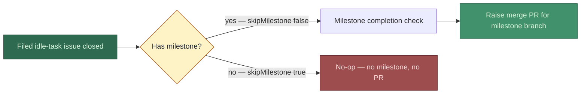

## Operator triage and suppression

An idle-task issue behaves like any other issue in the queue, with one wrinkle:
the worker closes it itself once the template's `runTask()` has finished.
Operators rarely need to touch one mid-run, but the relevant levers are:

- **Auto-close on completion.** The
  [claim handler](../worker/deno/lib/idle_task_claim_handler.ts) posts the
  template's summary as a comment on the issue and then closes it. The closed
  issue is the audit record; reopen it to retrigger a run against that specific
  finding.
- **Skip an unstarted idle-task issue.** Close the open `idle-task` issue
  manually before the next iteration claims it. The label-only repo dedup then
  clears immediately, so the next idle pass is free to file (or pick) a fresh
  one — closing an idle-task issue is the operator signal that "this batch is
  done, the next can start".
- **Suppress filings entirely for a repo.** Remove the repo from `repos` in
  `.config.json` (in-repo config was removed —; all configuration is
  operator-side). Suppression at this layer applies to every template uniformly.
- **Suppress a single finding from re-filing.** Template-specific. For
  `security-scan`, drop a `security-scan-ignore: SEC-... — author=<login> expires=<YYYY-MM-DD> reason` comment near
  the line flagged by the scanner — see
  [SECURITY-SCAN.md → In-code suppression](SECURITY-SCAN.md). Other templates
  document their own suppression mechanism (if any) in their template page.
- **Investigating a stuck idle-task issue.** Search the worker logs for
  `idle-task` and the issue number; the claim handler emits a structured warning
  for every malformed-body or unknown-template case and still closes the issue,
  so a never-closing idle-task issue indicates a worker-level claim or
  assignment problem, not a framework one.

The framework intentionally leaves "what counts as a real finding" to the
per-template runner. Triaging the content of an idle-task issue (e.g.
distinguishing a true security finding from a false positive) is the template's
responsibility and lives in that template's documentation.

## Adding a new template

Contributors add a new template by implementing the interface and registering it
at module load. The idle trigger, label discipline, dedup, milestone, and
claim-handler all behave identically without any further plumbing.

1. **Create the template file** under
   `worker/deno/lib/idle_task_templates/<name>_template.ts`:

   ```typescript
   import {
     type IdleTaskBodyOptions,
     type IdleTaskRunOptions,
     type IdleTaskRunResult,
     type IdleTaskTemplate,
     registerTemplate,
   } from "../idle_task_template.ts";

   const myTemplate: IdleTaskTemplate = {
     name: "my-template",
     description: "What this template does.",
     buildIssueTitle(_repo) {
       // Human-style title —. Dispatch matches by exact title.
       return `Run my idle task`;
     },
     buildIssueBody(_opts: IdleTaskBodyOptions) {
       // The body IS the user-facing prompt — no hidden marker.
       return `Pick a one-paragraph rationale here.`;
     },
     // Optional: declare an outputLabel so the backlog gate counts
     // un-triaged output before filing a fresh wrapper.
     // outputLabel: "my-template-finding",
     // Optional: override the per-repo cooldown window (default 24h —
     //). Omit to use the framework default.
     // cooldownHours: 24,
     // Optional: veto filing while previous output is still being
     // triaged.
     // async shouldFile({ repo }) { return true; },
     // Optional: body-fingerprint dispatch — required if
     // operators may hand-paste the prompt into a fresh issue.
     // matchesIdleTaskBody: (body) => body.includes("My distinctive heading"),
     async runTask(opts: IdleTaskRunOptions): Promise<IdleTaskRunResult> {
       // Do the work. Never throw — return { ok: false, summary } on failure.
       // opts.idleTaskIssueNumber is the wrapper issue number; opts.repo is
       // the target slug. IMPORTANT: opts.workDir is
       // the PARENT directory holding every repo clone side by side, NOT the
       // target checkout — setupRepo checks each repo out at
       // `${workDir}/${repoName}`. A native detector that reads the repo
       // tree MUST derive the checkout with
       // `repoCheckoutPath(opts.workDir, opts.repo)`; passing the bare
       // parent reads the wrong tree (silently scanning nothing, or sweeping
       // sibling checkouts and filing cross-repo false positives).
       return { ok: true, summary: "All good." };
     },
   };

   registerTemplate(myTemplate);
   ```

2. **Wire it into the production set** by adding a side-effect import in
   [`worker/deno/lib/idle_task_claim_handler.ts`](../worker/deno/lib/idle_task_claim_handler.ts)
   next to the existing `security_scan_template` import:

   ```typescript
   import "./idle_task_templates/my_template.ts";
   ```

3. **Wire up the two-line dedup contract** — mandatory for any template that
   files judgement-bearing findings, and enforced by
   [`idle_task_scan_dedup_conformance_test.ts`](../worker/deno/tests/idle_task_scan_dedup_conformance_test.ts):
   fetch `listKnownOpenFindingIds` **and** `listAllOpenIssueTitles` repo-wide
   (no `--label`), pass both into `assemble*Prompt`, substitute
   `{{KNOWN_OPEN_FINDING_IDS}}` and `{{OPEN_ISSUE_TITLES}}` in the prompt, and
   list both in the template's scan doc. A template with no semantic-duplicate
   surface (a **native**, no-LLM detector filing fixed-id findings) is exempted
   instead, by name and with a reason, in the conformance test's
   `NON_PARTICIPATING` set — never by saying nothing. Full contract:
   [Cross-label dedup](#cross-label-dedup--the-open-issue-title-list).

4. **Add tests** under `worker/deno/tests/`:
   - A unit test that calls `registerTemplate(myTemplate)` and asserts
     `getTemplate("my-template")` returns the same instance.
   - A test that exercises `buildIssueTitle` + `buildIssueBody` and asserts the
     resulting wrapper is recognisable to dispatch (title match, and — if
     implemented — `matchesIdleTaskBody`).
   - A test that drives `runTask()` against a stubbed workspace and asserts the
     returned `IdleTaskRunResult`.

5. **Run the quality gate** — `./quality.sh < /dev/null` must pass before
   raising a PR.

The framework intentionally keeps the template surface small: implementations
describe **what** their unit of work is, not how the worker files, dedupes,
claims, or closes the resulting issue.

### Claude budget for scans

A template that drives Claude MUST invoke it through `runIdleTaskClaude` from
[`worker/deno/lib/idle_task_claude_budget.ts`](../worker/deno/lib/idle_task_claude_budget.ts)
— never `runClaudeWithRetry` directly. The wrapper always sets **both** bounds:

| Bound                                 | Value           | Mirrors                 |
| ------------------------------------- | --------------- | ----------------------- |
| `IDLE_TASK_TIMEOUT_SECONDS`           | `3600` (1 hour) | `claudeTimeout`         |
| `IDLE_TASK_NO_OUTPUT_TIMEOUT_SECONDS` | `600` (10 min)  | `claudeNoOutputTimeout` |

Calling the runner directly inherits its library defaults — a **4-hour** hard
cap with the silence watchdog **disabled** — so a wedged unattended scan that
emits nothing is billed for four hours per rung of the retry and model-fallback
ladder. Explicit per-call values still win; the wrapper only fills in an omitted
bound.

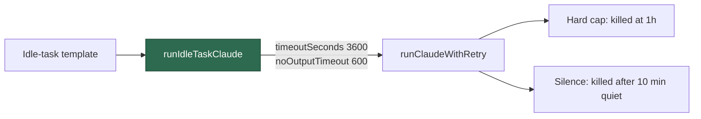

`worker/deno/tests/idle_task_template_budget_3657_test.ts` fails closed if a
template bypasses the wrapper.

### The cycle deadline bounds a scan too (Issue #186)

> The cycle deadline does **not** bound an issue claim's budget — it stops new
> claims and lets in-flight work finish. That model is stated once, in
> [The cycle-deadline model](CONFIGURATION.md#-the-cycle-deadline-model).
> This section covers the one route it deliberately still bounds: a scan.

The hour-long budget above is a **ceiling**, not an entitlement. A wrapper
claimed five minutes before the cycle deadline used to receive the full hour
and ran ~15 minutes past the planned shutdown with the worker log silent — the
slot could not drain, so the hourly refresh (and the pick-up of new worker
code) waited on it.

The claim handler now publishes an **idle-task run context** —
`withIdleTaskRunContext({ cycleDeadlineEpochMs, logger }, …)` — around
`template.runTask()`, and `runIdleTaskClaude` applies it:

| Fact                  | Effect on the scan                                                                                                                                            |
| --------------------- | ------------------------------------------------------------------------------------------------------------------------------------------------------------- |
| `cycleDeadlineEpochMs` | Timeout becomes `min(requested, runway + claude_kill_after)`, floored at 60 s. The justification is the scan's own: it holds no work-in-progress and is discretionary, so nothing is lost by stopping it at the hour and letting it run only delays the restart. Issue work is bounded by no such rule (Issue #420) — a claim keeps its full budget. |
| `cycleDeadlineEpochMs` | Retries are suppressed for that run: the timeout is resolved once, so a retry after a back-off would start from past the deadline. A scan has no WIP to protect. |
| `logger`              | The worker logger reaches the runner, so its per-minute `[agent-progress] <phase>: …` lines land in `worker-*.log` instead of nowhere.                          |

The context is ambient rather than an argument threaded through all eighteen
templates — the same choke-point reasoning as the budget itself: a template
cannot forget to pass what it never sees. It is removed in `finally`, by
identity, so two concurrent slots each drop only their own entry.

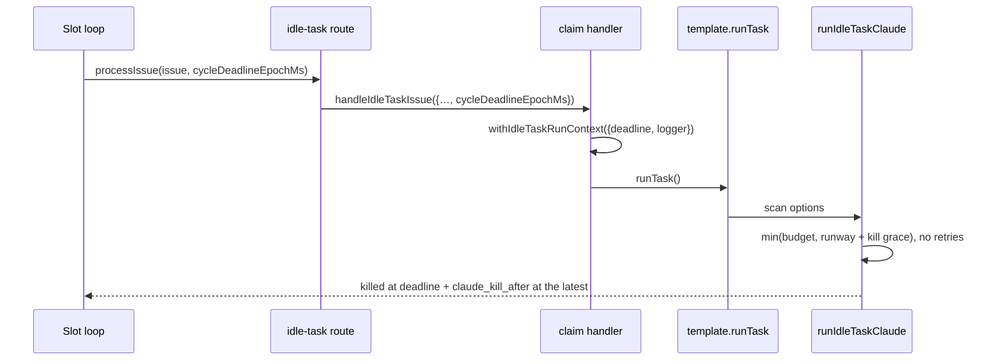

With the scan bounded, the deadline drain in `run_core.drainSlots` finishes on
its own: the slot's last Claude run cannot outlive the cycle deadline by more
than `claude_kill_after`, so a run whose last claim is an idle task still exits
within `run_duration` plus grace.

## Regression coverage

The idle-task pipeline is guarded by a dedicated end-to-end test that exercises
the four wiring points in one file:

[`worker/deno/tests/idle_task_end_to_end_test.ts`](../worker/deno/tests/idle_task_end_to_end_test.ts)

The test drives `run_core.runCoreLoop` and `find_oldest_issue.findOldestIssue`
with stubbed `gh` and stubbed template `runTask`, so no real network or scanner
calls escape. It fails closed when any of the following regressions land:

- **Gap A** — `runIdleTaskFiler` removed from `run_core.ts`. Iteration 1
  asserts the filer hook is invoked on a fully-idle scan pass and the underlying
  `gh issue create` carries the `idle-task` label. The `security-scan` template
  sets `skipMilestone: true`, so the same iteration also asserts
  the `gh issue
  create` invocation does **not** include a `--milestone` flag.
- **Gap B** — `collectIdleTaskCandidates` removed from
  `find_oldest_issue.ts`. Iteration 2 asserts a filed idle-task issue is
  surfaced as a candidate with `source: "idle-task"` on the next scan.
- **Claim routing** — `handleIdleTaskIssue` fails to dispatch an
  `idle-task` issue to the registered template's `runTask` by matching the
  title.
- **Label-only dedup** — a second simultaneously-idle iteration files a
  duplicate `idle-task` issue against the same repo.

When you touch any of these wiring points, run this test first — it is the
canonical regression detector for the trigger pipeline.

## Related documentation

- [`docs/SECURITY-SCAN.md`](SECURITY-SCAN.md) — Operator manual for the
  `security-scan` template (the first concrete template).
- [`docs/BEST-PRACTICES-SCAN.md`](BEST-PRACTICES-SCAN.md) — Operator manual for
  the `best-practices` template (#2, bucket-scoped review).
- [`docs/TEST-AUDIT-SCAN.md`](TEST-AUDIT-SCAN.md) — Operator manual for the
  `test-audit` template (#3, static test-suite maintainability and coverage-gap
  audit).
- [`docs/GITHUB-ACTIONS-AUDIT-SCAN.md`](GITHUB-ACTIONS-AUDIT-SCAN.md) — Operator
  manual for the `github-actions-audit` template (#4, weekly workflow-only
  review).
- [`docs/SUPPLY-CHAIN-READINESS-SCAN.md`](SUPPLY-CHAIN-READINESS-SCAN.md) —
  Operator manual for the `supply-chain-readiness` template (#5, weekly static
  posture audit).
- [`docs/ORPHAN-DEPS-SCAN.md`](ORPHAN-DEPS-SCAN.md) — Operator manual for the
  `orphan-deps` template (#6, weekly orphan / unmaintained-dependency audit; the
  one sanctioned-network exception).
- [`DESIGN-PRINCIPLES.md`](../DESIGN-PRINCIPLES.md#idle-task-framework)
  — VibeCoder-specific design principle for the framework, including the
  agent-facing rule that `idle-task` is the single permitted exception to the
  "never self-apply workflow labels" policy
