# 🏗️ Worker Internals

This document describes **how the Vibe Coder worker is implemented** — the Deno
module architecture, run loop, issue selection, PR monitoring, and
milestone/dependency handling. It is aimed at implementers and contributors who
need to understand the worker's behaviour under the hood.

For the **user manual** (how to use the worker as a repo owner), see
[docs/workflows/](workflows/README.md). For coding guidelines, see
[AGENTS.md](../AGENTS.md).

## 🔤 Acronyms used in this document

| Acronym | Meaning                                                                                    |
| ------- | ------------------------------------------------------------------------------------------ |
| API     | Application Programming Interface                                                          |
| CI      | Continuous Integration — automated build/test pipelines triggered on code changes          |
| CLI     | Command-Line Interface                                                                     |
| DFS     | Depth-First Search                                                                         |
| PID     | Process Identifier — a unique number assigned to a running process by the operating system |
| PR      | Pull Request — a GitHub mechanism for proposing and reviewing code changes                 |
| TDD     | Test-Driven Development — write failing tests first, then implement code to make them pass |
| TTL     | Time To Live — how long a cached value remains valid before expiry                         |

---

## 📋 Table of Contents

- [0. Deno module architecture](#0-deno-module-architecture)
- [1. Worker run loop and process lifecycle](#1-worker-run-loop-and-process-lifecycle)
- [2. Issue selection and claiming](#2-issue-selection-and-claiming)
- [3. PR monitoring](#3-pr-monitoring)
- [4. Milestone and dependency handling](#4-milestone-and-dependency-handling)
- [5. Question answering](#5-question-answering)
- [6. Recent features](#6-recent-features)

---

## 🦕 0. Deno module architecture

The Vibe Coder has been fully migrated from shell-based business logic to **Deno
TypeScript**. The architecture follows a **thin launcher + command registry**
pattern:

### Architecture overview

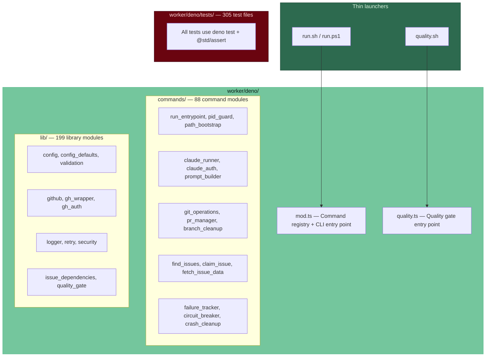
```mermaid
graph TD
    subgraph Launchers["Thin launchers"]
        runsh["run.sh / run.ps1"]
        qualsh["quality.sh"]
    end

    subgraph DenoWorker["worker/deno/"]
        mod["mod.ts — Command registry + CLI entry point"]
        qualts["quality.ts — Quality gate entry point"]
        subgraph Commands["commands/ — 88 command modules"]
            cmd1["run_entrypoint, pid_guard, path_bootstrap"]
            cmd2["claude_runner, claude_auth, prompt_builder"]
            cmd3["git_operations, pr_manager, branch_cleanup"]
            cmd4["find_issues, claim_issue, fetch_issue_data"]
            cmd5["failure_tracker, circuit_breaker, crash_cleanup"]
        end
        subgraph Libs["lib/ — 199 library modules"]
            lib1["config, config_defaults, validation"]
            lib2["github, gh_wrapper, gh_auth"]
            lib3["logger, retry, security"]
            lib4["issue_dependencies, quality_gate"]
        end
    end

    subgraph Tests["worker/deno/tests/ — 305 test files"]
        tests["All tests use deno test + @std/assert"]
    end

    runsh --> mod
    qualsh --> qualts

    style Launchers fill:#2d6a4f,stroke:#1b4332,color:#d8f3dc
    style DenoWorker fill:#74c69d,stroke:#52b788,color:#081c15
    style Tests fill:#6a040f,stroke:#370617,color:#ffd6d6
```

### Command pattern

Every Deno command implements the `Command` interface from `types.ts`:

```typescript
interface Command {
  name: string;
  description: string;
  execute(
    args: Record<string, unknown>,
    config: WorkerConfig,
  ): Promise<CommandResult>;
}
```

Commands are registered in `mod.ts` via `createDefaultRegistry()` and invoked by
name. Registry methods return `Result<T>` types — no exceptions for control
flow.

### Shell↔Deno invocation

The bash bridge (`deno_bridge.sh`) was retired in Issue #97 — nothing sourced it
at runtime. The remaining shell tooling (e.g. `quality.sh`) invokes Deno
commands directly:

```bash
deno run --allow-X worker/deno/mod.ts command-name --arg1 value1 --arg2 value2
```

### Quality gate

The quality gate is implemented in Deno TypeScript (`worker/deno/quality.ts` and
`worker/deno/lib/quality_gate.ts`). The shell wrapper `quality.sh` is a thin
launcher that locates Deno and delegates. The gate runs: benchmark audit,
`deno test`, `deno lint`, `deno check`, `deno fmt --check`, plus mermaid,
markdownlint, and semgrep.
Shell-script linting is **not** run by the worker — it is delegated to each
target repo's own CI.

The **semgrep** stage (`worker/deno/lib/semgrep_check.ts`, Issue #559) closes
the gap that let two PRs sit blocked on the same
`detect-non-literal-regexp` rule: `semgrep.yml` is a blocking PR check, so
before this the first sight of a SAST finding was a red PR. It runs the same
`p/default` ruleset over the branch's changed files only — the diff against the
merge-base with the remote's default branch, plus uncommitted and untracked
files — using a `semgrep` binary on PATH, or a container runtime that
**already holds** the CI-pinned `SEMGREP_IMAGE` (never pulling it mid-gate).
No semgrep, no git work tree, an unreachable rule registry, or a scan past the
300s deadline each report `SKIPPED` with the reason named; `--strict` promotes
that to a failure. A non-zero exit that is none of those is `FAILED` — an
unreadable or empty report is never read as "clean".

The agent container bakes `semgrep` at exactly `SEMGREP_IMAGE_TAG`
(Issue #650), so a fleet run scans instead of skipping — before that the image
shipped no `semgrep` binary and no container runtime, and the stage `SKIP`ped
every time. See [CONTAINER-IMAGE.md](CONTAINER-IMAGE.md).

Progress is **streamed**: every check emits one `✓ / ✗ / - name: STATUS (1.2s)`
line to stdout the moment it settles (Issue #399), ahead of the detailed output
and the summary table that are still printed at the end. Progress goes to stdout
rather than stderr on purpose — the worker captures a failing run as
`stdout + stderr` and quotes the **tail** of it into the remediation prompt and
the failure comment, so a progress block on stderr would crowd out the failing
detail those tails exist to carry. Before that, the gate printed nothing for up
to sixteen minutes, so an agent driving it could not tell a slow run from a hung
one and backgrounded it behind a `sleep`/`pgrep` poll loop that consumed the
rest of its execute budget. Callers embedding the gate pass `onProgress` on
`QualityGateConfig`; omitting it keeps the gate silent until it finishes.

### Testing

All tests use Deno's built-in test framework with `@std/assert`. There are no
BATS tests — the migration from BATS to Deno tests is complete. Run tests via:

```bash
cd worker/deno && deno task test
# Or from the repo root:
./quality.sh < /dev/null
```

### Cross-platform support

The worker runs on **macOS**, **Linux**, and **Windows**:

- `run.sh` / `loop.sh` — Bash launchers (macOS, Linux)
- `run.ps1` / `loop.ps1` — PowerShell launchers (Windows)
- `worker/deno/` — Cross-platform TypeScript (all platforms)

---

## 🔄 1. Worker run loop and process lifecycle

### 🚀 Entry point: `run.sh` / `run.ps1`

[run.sh](../run.sh) (or [run.ps1](../run.ps1) on Windows) is the
cron/launchd/Task Scheduler entry point — a thin launcher that delegates to
Deno. Both launchers follow the same steps:

1. **Locates Deno** — `run.sh` also bootstraps PATH for minimal cron/launchd
   environments (common Homebrew and Deno locations).
2. **Updates the worker checkout** — `deno run … mod.ts worker-checkout-update`
   fetches `origin` and resets the checkout to `origin/<default-branch>`,
   discarding local modifications and untracked files, on the **host** and
   before anything is launched (Issue #512). The branch comes from the
   checkout's own `origin/HEAD`; `--default-branch` names it explicitly. A
   failed update is a loud warning on stderr and in `run_core.log`, never a
   refused launch — a host that cannot reach GitHub still launches the worker
   on the checkout it has; three consecutive failures raise one GitHub issue
   naming the host and the collision (Issue #4204, migrated here with the
   reset by Issue #513). `VIBE_SKIP_CHECKOUT_UPDATE` turns the step off for
   a development checkout or a CI tree, which must not be reset mid-run.
   A host whose `.config.json` says `update_mode: "frozen"` is held at
   `pinned_ref` instead of reset to the tip — the command reads that file
   itself, because it runs before the configuration load — and logs
   `Checkout update skipped: update_mode=frozen, pinned to <ref>` rather than
   skipping silently (Issue #624). A checkout already on the pin is not
   written to; a pin that does not resolve is the same loud warning as any
   other failure, and the launch continues on the pinned checkout it has.
   Beside it, `deno run … mod.ts release-notice` tells a frozen host pinned
   behind the newest release so, in one line naming both versions and the
   upgrade command, on stderr and in `run_core.log` (Issue #690). It notifies
   only — no pin is changed and no checkout moved — and a failed or timed-out
   check is a warning, never a refused launch.
3. **Builds the launch plan** — `deno run … mod.ts container-launch-plan`
   resolves and validates the container runtime, computes the content-derived
   image reference, and constructs the fixed least-privilege mount set. No
   supported runtime is a loud non-zero exit; there is no host mode to fall back
   to (Issue #4).
4. **Builds the image** when that reference is absent locally, and skips the
   build when it is present, then **prunes every other `vibe-coder` tag** — the
   reference this checkout resolves to is the only one a future launch of it can
   use, so the tags it superseded are deleted rather than left to fill the disk.
5. **Reaps a leaked container** — before the build, any `vibe-coder-*` container
   older than the watchdog deadline, or with no live launcher process behind it,
   is killed.
6. **Launches the container**, propagates termination to it so the Deno driver's
   graceful shutdown still runs (`run.sh` forwards `SIGTERM`/`SIGINT`; on
   Windows the console control event reaches the runtime CLI directly and
   `run.ps1` stops the container by name when its own pipeline is stopped), and
   exits with the container's exit status.
7. **Waits under a deadline** — the plan carries a `watchdog` value derived from
   the supervisor's own cap (`VIBE_RUN_MAX_SECONDS`, the worker's maximum run
   duration) plus a margin, so raising the cap raises the watchdog with it. A
   container that outlives the deadline is reaped by `container-reap` and the
   launcher exits `87`, so a wedged container VM cannot block the supervisor
   indefinitely. The cap itself is the last stage of
   [The cycle-deadline model](CONFIGURATION.md#-the-cycle-deadline-model) — the
   only place a still-progressing agent is killed, and the worker stops itself
   before it so work in progress is committed and pushed.

`run.sh upgrade` is the one invocation that runs none of those steps
(Issue #691): it delegates straight to `deno run … mod.ts upgrade --base-dir
<checkout>`, which rewrites `pinned_ref` and all three `pinned_tool_versions`
in `.config.json` to what the newest release records, and exits with that
command's status. It is handled before the `EXIT` trap is installed, so an
upgrade is never counted as a launch outcome by the self-heal backoff, and the
shell holds no upgrade logic of its own — the same delegation shape as
`worker-checkout-update`. See
[Configuration — Moving to the latest release](CONFIGURATION.md#moving-to-the-latest-release-runsh-upgrade).

Inside the container, `container/entrypoint.sh` `exec`s
`deno run … worker/deno/mod.ts run-entrypoint`. There is no bash on the runtime
path, and because Deno loads its modules at process start the running driver is
immune to any mid-run change to the checkout — the property the old
`worker/.run_core.sh` shadow-copy provided, now for free. Since Issue #513 the
prelude writes nothing to the checkout at all: the launcher updates it on the
host before the container starts. The two launchers are
held to one contract by `worker/deno/tests/launcher_parity_test.ts`, which fails
when their mount sets, read-only flags, network settings or privilege flags
diverge, or when either can run the worker on the host at all. Containment is
mandatory (Issue #4): a host-execution marker in either launcher is a fault
outright, both consult the [run mode](CONFIGURATION.md) resolver so a
configuration naming a removed mode fails loud in one place, and there is no
intended asymmetry left between them. See [Container Image](CONTAINER.md) for
the mount set and the privilege flags.

### 🔄 Worker driver: Deno `run-entrypoint` → `run-core`

The `run-entrypoint` command drives the whole run in a single Deno process via
[run_worker.ts](../worker/deno/lib/run_worker.ts), which replaced the deleted
bash `worker/run_core.sh` conductor. It sequences:

1. **PID guard** — `evaluateRunGuard` detects a still-running previous instance;
   a blocked guard exits 0 cleanly. On proceed it **claims the PID file** with
   this Deno process's PID.
2. **Bootstrap prelude** —
   [run_bootstrap.ts](../worker/deno/lib/run_bootstrap.ts) performs, in-process,
   PATH bootstrap → run-id / `VIBE_RUN_ID` → worker log init (plus gzip of prior
   runs' logs,) → the checkout's default branch, **read** from `origin/HEAD` and
   reported for the orphaned-branch clean-up (`--default-branch` overrides) →
   software-update check. Nothing here writes to the checkout (Issue #513): the
   git reset it used to perform now runs host-side, before the container
   launches, which is what lets `/workspace` be mounted read-only. The
   software-update check is gated only by `--skip-software-update` /
   `SKIP_SOFTWARE_UPDATE`, and an unreadable `origin/HEAD` is logged loud and
   costs the orphaned-branch clean-up, not the run.
3. **Config validation + GitHub-user resolution + gh-scope publication** —
   fail-loud on invalid config or an unresolvable user; the active token's OAuth
   scopes are logged with a `[SECURITY]` tag.
4. **Startup housekeeping** — the one-time disk-space reclaim, log rotation,
   worker-log retention, stale temp-file / work-dir / worktree / Claude-session
   sweeps, orphaned local + stale remote branch cleanup, and finally the
   merged-PR issue sweep run as a single in-order Deno sequence
   ([run_housekeeping.ts](../worker/deno/lib/run_housekeeping.ts),); each step
   is best-effort — a failure is logged loud but never blocks start.

   The last step,
   `merged-pr-issue-sweep`
   ([merged_pr_issue_sweep.ts](../worker/deno/lib/merged_pr_issue_sweep.ts),
   Issue #504), is the only one that touches GitHub rather than local disk. It
   closes every open issue whose fix has already **merged and landed**,
   whoever authored the PR — the set the claim scan refuses for ever as
   `merged-pr-permanent` and which therefore cannot heal itself. It invents no
   new rule: candidates come from the scan's own merged-PR matcher, and the
   Issue #482 ordering guard, the Issue #4396 merge-landing check and the
   trusted-re-label escape hatch all still apply. An issue carrying
   `needs-human` is never closed by it.

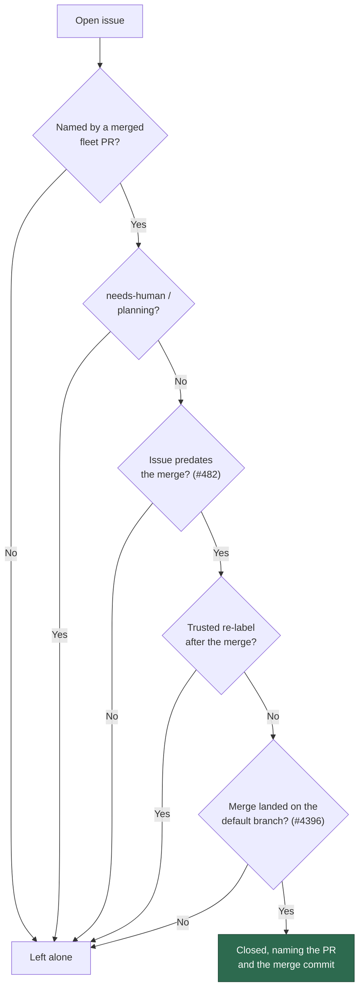
```mermaid
flowchart TD
    A["Open issue"] --> B{"Named by a merged<br/>fleet PR?"}
    B -->|No| Z["Left alone"]
    B -->|Yes| C{"needs-human /<br/>planning?"}
    C -->|Yes| Z
    C -->|No| D{"Issue predates<br/>the merge? (#482)"}
    D -->|No| Z
    D -->|Yes| E{"Trusted re-label<br/>after the merge?"}
    E -->|Yes| Z
    E -->|No| F{"Merge landed on the<br/>default branch? (#4396)"}
    F -->|No| Z
    F -->|Yes| G["Closed, naming the PR<br/>and the merge commit"]
    style G fill:#2d6a4f,stroke:#1b4332,color:#fff
```

5. **Main loop** — invokes the `run-core` command
   ([run_core.ts](../worker/deno/commands/run_core.ts)), which builds production
   deps via `createProductionRunCoreDeps()` and runs `runCoreLoop()` with the
   full priority dispatch table. It iterates until `runDurationSeconds` (default
   3,600 = 1 hour) expires, processing at most one item per iteration in strict
   **priority order**. The loop installs its own SIGINT/SIGTERM handlers for a
   graceful shutdown.
6. **Exit cleanup** — a `finally` block runs `runSignalCleanup`
   ([run_housekeeping.ts](../worker/deno/lib/run_housekeeping.ts),), which
   removes the PID file first (so it is reliably gone even if descendant
   termination interrupts the cleanup) and then tears down the orphan-prone
   `claude` / `deno test` subtree via the shared pid-guard logic.

Process-group signalling is **lead-only**
([pid_guard.ts](../worker/deno/lib/pid_guard.ts)): `terminateProcessTree` sends
`kill -<signal> -<pgid>` only when the target _leads_ its group (`pgid === pid`,
which is what `setsid` gives every process the worker spawns). Leadership is the
only group membership provable to belong to a process we started; a group the
target merely belongs to predates our child and holds processes we never
spawned. Our own group, an unreadable group, and a group the target does not
lead all fall back to signalling the pid alone, with descendants handled
separately by `terminateDescendants`. Relatedly, `runClaudeWithTimeout` disarms
its kill the instant `child.status` resolves: once the child is reaped the
kernel may reuse its pid, so a watchdog waking during the bounded stream drain
logs and returns rather than signalling a stranger.

Every signal is also **identity-gated** (Issue #501). A pid is only a handle:
the kernel re-issues it as soon as the process behind it is reaped, and a
watchdog that fires in that window would signal — or sweep the children of — a
stranger. `runClaudeWithTimeout` fingerprints the agent at spawn
(`captureProcessIdentity`, the process's `ps -o lstart=` start time) and the
terminate helpers re-read that start time immediately before every signal: the
parent before its descendants are swept, and each descendant before its TERM and
again before its KILL. A pid that no longer matches its fingerprint is reported
as skipped and never signalled, so the kill path cannot reach a process it
cannot prove it started.

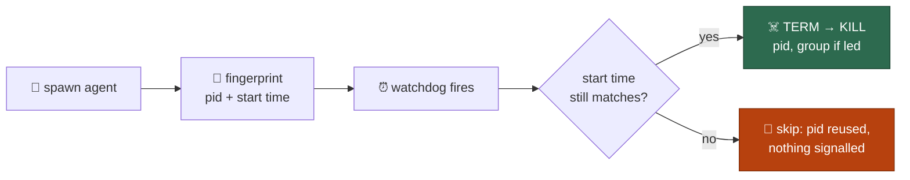
```mermaid
flowchart LR
    S["🚀 spawn agent"] --> F["🔖 fingerprint<br/>pid + start time"]
    F --> W["⏰ watchdog fires"]
    W --> C{"start time<br/>still matches?"}
    C -- yes --> K["☠️ TERM → KILL<br/>pid, group if led"]
    C -- no --> X["🛑 skip: pid reused,<br/>nothing signalled"]
    style X fill:#b7410e,stroke:#7f2d09,color:#fff
    style K fill:#2d6a4f,stroke:#1b4332,color:#fff
```

Per-PID logging: each process writes to its own log file with automatic
size-based rotation (keeps 10 log files via
[log_rotation.ts](../worker/deno/lib/log_rotation.ts)).

Worker-log lifecycle: the running process's `worker-<PID>.log` stays plain text;
every prior run's log is gzipped at the next worker start
([worker_log_gzip.ts](../worker/deno/lib/worker_log_gzip.ts)) and both forms are
deleted by the age-based retention pass
([worker_log_cleanup.ts](../worker/deno/lib/worker_log_cleanup.ts)) once older
than `WORKER_LOG_MAX_AGE_DAYS` (default 3).

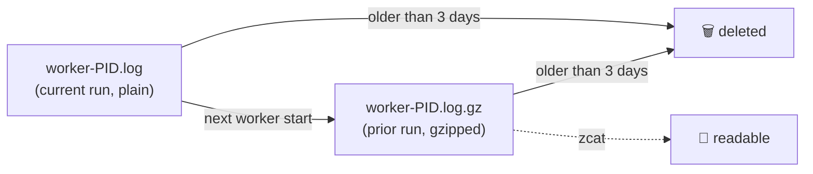
```mermaid
flowchart LR
    A["worker-PID.log<br/>(current run, plain)"] -->|next worker start| B["worker-PID.log.gz<br/>(prior run, gzipped)"]
    B -->|older than 3 days| C["🗑 deleted"]
    A -->|older than 3 days| C
    B -.->|zcat| D["📖 readable"]
```

### 🔄 Software auto-update (interval-OR-floor, )

[software_updates.ts](../worker/deno/lib/software_updates.ts) checks for Claude
CLI, GH CLI, and Deno updates each iteration. Each tool updates at most once per
interval (default 7 days, tracked via `.last_software_update_check` and per-tool
`.last_successful_update_<tool>` timestamps), with self-healing retry and
exponential backoff on transient failures.

adds a **minimum-version floor**: a tool also updates when its installed version
is below a configured floor (`software_min_versions`, default
`{ claude: "2.1.170" }`), bypassing the timestamp gate. The rule is **run when
interval elapsed OR installed version < floor**:

1. `readVersion(tool)` reads the installed version (`claude --version` →
   `2.1.170 (Claude Code)`) and `parseSemver()` extracts the leading triple.
2. `isVersionBelowFloor()` compares numerically per segment (`compareSemver()` —
   `2.1.170` > `2.1.9`); an unparseable version falls back to interval behaviour
   with a warning.
3. Below floor → the tool is force-updated this iteration even when the interval
   says "not yet"; the global weekly timestamp is only reset when the interval
   actually elapsed, so a floor-only trigger does not skip the next weekly
   `gh`/`deno` check.
4. After a floor-triggered update the version is re-read
   (`verifyFloorAfterUpdate`); still-below-floor is a permanent-failure signal —
   logged once and not retried until the interval elapses. A
   `.last_floor_update_attempt_<tool>` timestamp
   (`recordFloorUpdateAttempt`/`shouldAttemptFloorUpdate`) provides the backoff
   so an unreachable floor never retry-loops every iteration.
5. A skip flag (`SKIP_CLAUDE_UPDATE` and the `gh`/`deno` equivalents) still
   wins, but logs that a version floor is unmet when it suppresses a
   floor-triggered update.

The version reader and clock are injected (the existing `nowFn`/injected-runner
style), so the floor logic is unit-tested with no real spawn or sleep.

#### 📌 Exact-version installs (Issue #623)

`updateClaudeCli`, `updateGhCli` and `updateDeno` also accept a
`targetVersion` on their shared `ToolUpdateOptions`. With no `targetVersion`
every path behaves exactly as above — the release-age gate resolves "latest" and
the tool's own upgrade command runs. With one, the exact version is installed
from the artefact upstream published for it, following the same pattern
`container/Containerfile` uses for its pinned tools:

| Tool       | Pinned install                                                                                   |
| ---------- | ------------------------------------------------------------------------------------------------ |
| Claude CLI | `curl` the `@anthropic-ai/claude-code` tarball for that version, then `npm install -g --ignore-scripts <tarball>` (`claude update` takes no version argument) |
| `gh`       | `curl` the `cli/cli` release archive `gh_<version>_<os>_<arch>`, extract it, and `install` the binary over the `gh` already on PATH (`brew upgrade gh` takes no version argument) |
| Deno       | `deno upgrade <version>` — the installer already accepts one                                       |

Behaviour of the pinned path:

- A tool already reporting exactly that version is **left alone**, with a log
  line saying so, so a launch does not reinstall on every run.
- The release-age gate is **bypassed** when pinned: it is the control for
  unpinned "latest" installs, and a pinned version is an explicit choice.
- A failed install, an unreadable version afterwards, or a version that does not
  match **throws**, naming the requested and the actual version — reusing the
  same `VERSION_COMMANDS` reader as the floor check rather than a second one.

`resolveDynamicVersions()` reports what dynamic mode would install right now for
each of the three tools, resolved through the same release-age gate, so a setup
prompt can offer that as the per-tool default; a version that cannot be resolved
(or has not aged past the quarantine window) is reported ineligible with the
gate's own reason rather than as a usable default.

`resolveQuarantineClearedVersions()` answers the neighbouring question the
release tool-version manifest asks (Issue #726): not "may upstream's newest
release be adopted?" but "which is the newest release the embargo has already
let through?". Upstream ships several times a day, so the newest release is
usually still inside the window; the manifest reads the release history behind
it and records the newest release outside the window. The window itself is
unchanged — a tool with no release past it is still reported ineligible.

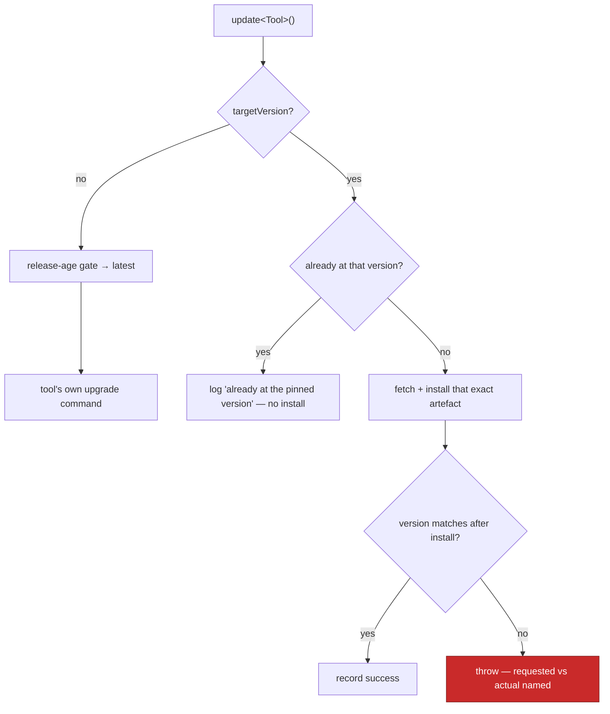
```mermaid
flowchart TD
    A["update&lt;Tool&gt;()"] --> B{targetVersion?}
    B -->|no| C["release-age gate → latest"] --> D["tool's own upgrade command"]
    B -->|yes| E{already at that version?}
    E -->|yes| F["log 'already at the pinned version' — no install"]
    E -->|no| G["fetch + install that exact artefact"]
    G --> H{version matches after install?}
    H -->|yes| I["record success"]
    H -->|no| J["throw — requested vs actual named"]
    style J fill:#c92a2a,stroke:#7f1d1d,color:#fff
```

### 📊 Priority order

Each loop iteration checks work queues top-to-bottom and processes the **first
match**:

| Priority | Task                                            | Deno module                                                             |
| -------- | ----------------------------------------------- | ----------------------------------------------------------------------- |
| 1        | PR feedback (thumbs-up or authorised comments)  | [pr_feedback_processor.ts](../worker/deno/lib/pr_feedback_processor.ts) |
| 1.5      | Spelling/quality check failures on open PRs     | [pr_spelling_processor.ts](../worker/deno/lib/pr_spelling_processor.ts) |
| 1.55     | CI/integration test failures on open PRs        | [pr_ci_processor.ts](../worker/deno/lib/pr_ci_processor.ts)             |
| 1.6      | Update open PR branches (rebase onto base)      | [pr_branch_update.ts](../worker/deno/lib/pr_branch_update.ts)           |
| 1.65     | Auto-merge catch-up (retry transient failures)  | [pr_auto_merge.ts](../worker/deno/lib/pr_auto_merge.ts)                 |
| 1.66     | Branch cleanup (delete branches for merged PRs) | [branch_cleanup.ts](../worker/deno/lib/branch_cleanup.ts)               |
| 1.67     | Issue closure (close issues for merged PRs)     | [issue_lifecycle.ts](../worker/deno/lib/issue_lifecycle.ts)             |
| 1.7      | Milestone completion (final consolidation PR)   | [milestone_completion.ts](../worker/deno/lib/milestone_completion.ts)   |
| 1.75     | Issue refinement (`refine-issue` label)         | [refinement_processor.ts](../worker/deno/lib/refinement_processor.ts)   |
| 1.8      | Question answering (`question` label)           | [question_processor.ts](../worker/deno/lib/question_processor.ts)       |
| 1.85     | Planning (`planning` label)                     | [planning_processor.ts](../worker/deno/lib/planning_processor.ts)       |
| 1.86     | Custom label prompts (issue phase)              | [custom_label_dispatch.ts](../worker/deno/lib/custom_label_dispatch.ts) |
| 1.87     | Custom label PR prompts (`pr` phase)            | [custom_label_pr_dispatch.ts](../worker/deno/lib/custom_label_pr_dispatch.ts) |
| 2        | New implementation issues (globally oldest)     | [issue_worker.ts](../worker/deno/lib/issue_worker.ts)                   |

Rows 1.86 and 1.87 are **conditional**: each exists only when the operator has
configured at least one `custom_label_prompts` mapping of that target phase
(`issue` for 1.86, `pr` for 1.87). A fleet that configured neither gets a
byte-identical ladder, and a fleet that configured only `pr` mappings gets 1.87
without 1.86 — an issue-scanning row that could never match is not added. See
[Configuration Reference — Custom Label Prompts](CONFIGURATION.md#-custom-label-prompts).

#### 🚦 Primary GraphQL quota exhaustion

GitHub's **primary GraphQL quota** and its **core (REST) quota** are separate
buckets. Once the GraphQL bucket is empty every further GraphQL-backed `gh` call
in the window is guaranteed to fail, while REST calls keep working — the worker
exploits exactly that split (Issue #42).

```mermaid
flowchart TD
    pass["Top of a priority pass"]
    pre{"gh api rate_limit<br/>(free, core quota)<br/>quota gone?"}
    pause["Pause until reset<br/>(Issue #1780 path)"]
    work["Dispatch priorities"]
    call["Any GraphQL-backed gh call"]
    latched{"Primary-quota<br/>latch set?"}
    skip["Skip before the spawn<br/>one line, no retry"]
    fail{"Fails with<br/>'rate limit already exceeded'?"}
    latch["Latch the process until reset<br/>+ write the rate-limit signal"]
    rest["REST fallback on the core quota:<br/>PR create, claim release, label ops"]

    pass --> pre
    pre -- yes --> pause --> pass
    pre -- no --> work --> call --> latched
    latched -- yes --> skip --> rest
    latched -- no --> fail
    fail -- yes --> latch --> rest
```

- **The latch**
  ([primary_quota_latch.ts](../worker/deno/lib/primary_quota_latch.ts)) is a
  process-global set by the shared `gh` chokepoint the first time a call reports
  the primary-quota message. Every later GraphQL-backed call short-circuits
  before the spawn, the telemetry and the retry, so a scan that
  catches-and-continues can no longer drive hundreds of doomed `gh` processes.
  It auto-expires the instant the recorded reset passes.
- **REST stays callable.** `isQuotaExemptGhCall` exempts `gh api <rest-path>`
  (but never `gh api graphql`), so the free `gh api rate_limit` read can still
  learn the reset, a finished run still releases its claim, and
  [pr_create_rest.ts](../worker/deno/lib/pr_create_rest.ts) still opens the PR
  for an already-pushed, quality-gated branch instead of orphaning it.
- **The per-pass pre-flight gate** re-reads `gh api rate_limit` at the top of
  every priority pass, not just at process start, so exhaustion caused by a
  sibling worker sharing the token is caught before this pass spends anything.

#### 🧭 Scan cursor — resume near where a rate limit fired

A primary GraphQL rate limit that fires mid-cycle pauses the worker until the
quota refreshes, then re-enters the dispatch loop. Without a cursor that resume
restarts at Priority 1 and burns the freshly-refreshed quota on PR feedback,
spelling, CI, auto-merge, etc. before reaching Priority 2 issue scanning.

[scan_cursor.ts](../worker/deno/lib/scan_cursor.ts) persists the priority in
flight to a per-host file `scan_cursor_<hostname>.json` in `WORK_DIR` (schema
`{ priority, repoIndex, savedAt }`, written tempfile-then-rename so a crash
mid-write cannot truncate the live cursor). `runCoreLoop()`:

- **Saves** the cursor as each priority is entered (a cheap integer overwrite).
- **Reads** the cursor when the dispatch loop (re)starts — a fresh process and
  after every rate-limit resume. When the cursor is younger than 60s the first
  sweep skips priorities below `cursor.priority`; the skip applies **once**, so
  the next iteration dispatches from Priority 1 as normal.
- **Resets** the cursor to `{ priority: 1, repoIndex: 0 }` after a successful
  claim.

The filename embeds the hostname (not the PID), so the cursor survives a worker
restart and two workers on different hosts never trample each other. A cursor at
or beyond 60s old is treated as absent — a stale snapshot left by a SIGTERM or
crash never drives a wrong resume.

When the priority dispatch completes a full cycle without processing any work
(`tracker.scanHadSuccess === false`), `runCoreLoop()` invokes the optional
`runIdleTaskFiler` hook before sleeping. The production wiring in
[run_core_production_deps.ts](../worker/deno/lib/run_core_production_deps.ts)
delegates to the `maybe-file-idle-task` Deno command
([maybe_file_idle_task.ts](../worker/deno/commands/maybe_file_idle_task.ts)),
which checks every monitored repo for claimable work, shuffles the repo list,
and files a single `idle-task` issue against the first repo with no open
`idle-task` issue. The next iteration claims that issue through the standard
priority dispatch and the idle-task claim handler routes it to the registered
template (today, only `security-scan`). retired the previous in-process
`runIdleSecurityScan` hook and its three state files (`security_scan_idle.json`,
`security-scan-state.json`, `security_scan.lock`). Full details and the
four-phase pipeline are documented in
[Security Scans — Operator Manual](SECURITY-SCAN.md).

### 🔐 PID guard (`worker/deno/commands/pid_guard.ts`)

The PID guard (migrated to Deno TypeScript) provides single-instance locking:

- **Safe command verification** before killing — confirms the PID belongs to a
  VibeCoder process.
- **Cross-platform elapsed time parsing** — handles both BSD (macOS) and Linux
  `ps` output formats.
- **Graceful termination** — sends SIGTERM first, waits a configurable grace
  period (default 30 seconds), then escalates to SIGKILL.
- **Descendant cleanup** — traverses up to 20 levels of child processes to
  prevent orphans, using process groups where available.

### 📉 Failure tracking (`worker/deno/commands/failure_tracker.ts`)

The failure tracker (migrated to Deno TypeScript) tracks consecutive failures on
the same work item:

- **Counter** — increments on failure, resets on any success.
- **Threshold** — after `MAX_CONSECUTIVE_FAILURES` (default 3) failures on the
  same item, the process exits. This allows the next cron run to start fresh
  with updated code.
- **Failure keys** — format: `"type|repo|issue_number"`, ensuring failures are
  tracked per work item.
- **Persistent state** — failure counts, circuit breaker state, and cooldown
  timers are persisted to disk (`.failure_state`, `.circuit_breaker_state`,
  `.cooldown_state` files). State survives worker restarts and expires
  automatically (1 hour default), preventing crash-restart loops where a worker
  forgets its failure history.

### ⚡ Circuit breaker (`worker/deno/commands/circuit_breaker.ts`)

The circuit breaker (migrated to Deno TypeScript) prevents the worker from
hammering a failing resource:

- **Open/closed model** — after repeated failures, the circuit "opens" and
  short-circuits further attempts for a cooldown period.
- **Persistent state** — circuit breaker state is saved to
  `.circuit_breaker_state` and restored on restart, so a crash doesn't reset the
  breaker.

### 🔔 Crash notifications (`worker/deno/commands/crash_notification.ts`)

The crash notification module (migrated to Deno TypeScript) alerts operators
when the worker exits unexpectedly:

- **`is_crash_exit()`** — determines whether an exit was unexpected (non-zero,
  not a planned exit).
- **`notify_crash_via_issue_comment()`** — posts a comment on the GitHub issue
  being worked on, so the operator sees the crash in context.
- **`notify_crash_via_webhook()`** — POSTs JSON to `CRASH_WEBHOOK_URL` (5-second
  timeout) for integration with Slack, PagerDuty, etc.
- **Rate limiting** — `should_rate_limit_crash_notification()` enforces a
  600-second cooldown (configurable) to prevent notification spam during rapid
  crash-restart loops.
- **Work stage tracking** — the global `_CURRENT_WORK_STAGE` variable records
  which phase the worker was in when it crashed (e.g., `cloning_repo`,
  `assessing_clarity`, `running_claude`, `running_quality_checks`,
  `posting_pr`). Included in crash notifications so operators can see exactly
  what was happening.
- **Elapsed time formatting** — `format_elapsed_time` converts the duration
  since `_CURRENT_WORK_START_TIME` to a human-readable format (e.g., "12m 34s"
  or "1h 2m 3s") for inclusion in crash notifications.
- **System context collection** — `collect_system_context` gathers system
  diagnostics at crash time: uptime, disk free, and memory pressure.
  Platform-aware (uses `memory_pressure` on macOS, `/proc/meminfo` on Linux).
  All commands wrapped with 3-second timeouts to prevent hangs during crash
  handling.
- **Worker log tail** — `capture_worker_log_tail` reads the last N lines from
  the worker log file for inclusion in crash notifications, with key error lines
  highlighted. Output is auto-truncated to `CRASH_LOG_TAIL_MAX_BYTES` (default
  50,000 bytes).
- **Claude output tail** — `capture_claude_output_tail` reads the last N lines
  from Claude's output file, appended as a collapsible section in crash
  notifications.

### 🧹 Crash cleanup (`worker/deno/commands/crash_cleanup.ts`)

The crash cleanup module (migrated to Deno TypeScript) minimises the blast
radius of unexpected exits:

- Registered as a trap handler, it runs on unexpected exit to clean up
  in-progress issue state — removing heartbeat files and unassigning the worker
  from claimed issues.
- Closes the crash window between claim and heartbeat recording by moving
  `record_heartbeat()` into the setup phase immediately after claiming.

### 🔐 Claude authentication detection (`worker/deno/lib/claude_auth.ts`)

`claude_auth.ts` detects when the Claude CLI needs re-authentication:

- **`isClaudeAuthError()`** — pattern-matches Claude CLI output for
  authentication failures.
- **`claudeAuthActionableMessage()`** — returns clear, actionable instructions
  ("run `claude login`") so operators can fix the problem quickly.

Implemented in Deno TypeScript.

### 🔄 Unified workflow handler (Deno TypeScript)

The workflow handler provides consistent logging, failure tracking, and GitHub
status updates across all priority workflow handlers (PR feedback, spelling
fixes, CI fixes, refinement, questions, and planning). Implemented in Deno
TypeScript.

### 🩺 Per-iteration health gate

Every priority-loop iteration checks three conditions before it reports the host
healthy (`worker/deno/lib/run_core.ts`). The first two skip the cycle; the third
does not.

| Condition             | Failure behaviour                                             |
| --------------------- | ------------------------------------------------------------- |
| Claude health         | Unhealthy; **skip the cycle**                                 |
| GitHub auth           | Unhealthy; **skip the cycle**                                 |
| Monitored-repo access | Unhealthy; **cycle continues** for the repos still accessible |

The access condition reads the per-repo access store, which only reports a repo
inaccessible after two consecutive access-denied probes, so a transient blip
cannot flip the fleet. An unhealthy iteration sets `lastHealthCheckPassed`
to `false` on the loop result, so the host is recorded as unhealthy rather
than green while its repos 404 (the signature).
Recovery is automatic: one successful probe
clears the store and the next iteration reports healthy again — no operator
action, no restart.

#### Naming the inaccessible repos

"This host is unhealthy" is not actionable on its own — the fix depends on
_which_ repos went dark (in the host-3 incident both were `TitlePage/*`, an
identity drift rather than a Claude or `gh` outage). Two surfaces therefore name
them:

- **Worker log** — one structured, greppable line per iteration while the
  condition holds:

  ```text
  [repo-access] host=host-3 status=inaccessible repos=TitlePage/bar,TitlePage/foo consecutive=2
  ```

  `consecutive` is the highest consecutive access-denied count across the named
  repos. The line is emitted at most once per iteration: `logRepoAccessOnce()`
  suppresses a byte-identical repeat from another call site, and the iteration
  boundary (`resetIterationCaches`) re-arms it. A changed repo set is new
  information and logs immediately.

- **Reason string** — `formatInaccessibleReposReason()` in
  `worker/deno/lib/monitored_repo_access.ts` renders the same set as
  `repos inaccessible: TitlePage/bar, TitlePage/foo`. Repos are listed in the
  store's stable lexicographic order, so the string cannot churn between
  ticks. Built-in fleet health reporting was removed in Issue #805, so the
  worker itself publishes this nowhere — it is the helper an out-of-tree
  health reporter reads.

Healthy hosts stay silent — no log line, no reason string. The operator
runbook for this condition — what it means, what the worker keeps doing, and the
identity checks to run first — is
[Host reports unhealthy — `repos inaccessible`](TROUBLESHOOTING.md#-host-reports-unhealthy--repos-inaccessible).
The whole chain is covered end to end by
`worker/deno/tests/worker_health_fleet3_e2e_test.ts`, including the inverse
guard that a rate-limit storm must stay healthy.

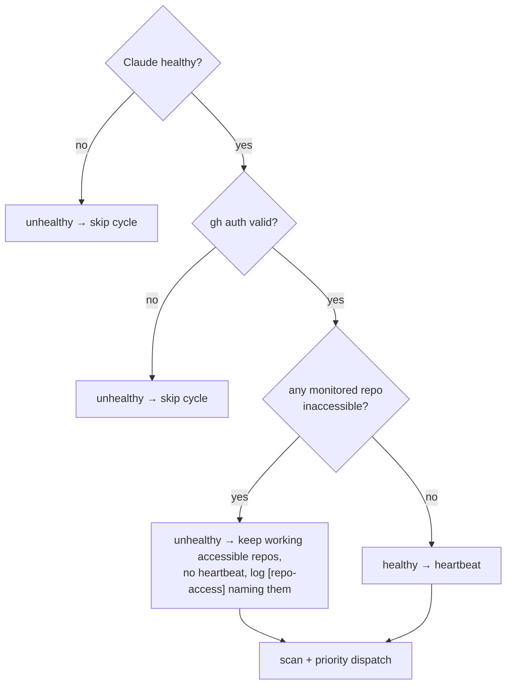
```mermaid
flowchart TD
    C{Claude healthy?} -->|no| S1[unhealthy → skip cycle]
    C -->|yes| G{gh auth valid?}
    G -->|no| S2[unhealthy → skip cycle]
    G -->|yes| A{any monitored repo<br/>inaccessible?}
    A -->|yes| U["unhealthy → keep working accessible repos,<br/>no heartbeat, log [repo-access] naming them"]
    A -->|no| H[healthy → heartbeat]
    U --> W[scan + priority dispatch]
    H --> W
```

### 📈 Fleet telemetry — idle, blocked and success rate (Issue #855)

Per-run telemetry said what a run did; it never said how much of the fleet's
wall time was spent doing nothing, or why. `fleet_telemetry.ts` accumulates
that across cycles and the loop emits one machine-readable line per cycle and
at exit:

```text
fleet-summary: wall=92520s idle=39600s idle_pct=42.8 occupied=52920s
  busy=52920s token_blocked=0s token_blocked_waits=0 rate_limited=0s
  rate_limit_waits=0 claims=32 successes=17 failures=13 skips=2
  success_rate=0.57
  idle_by_reason=nothing_claimable_backlog=32000s,host_disk_low=7600s
  failures_by_class=execute=9,timeout=3,setup=1 utilisation=serial=0.57
```

(The real line is one line; it is wrapped here for readability.)

The run's wall time is partitioned into three non-overlapping spans, so
`wall ≈ occupied + blocked + idle`:

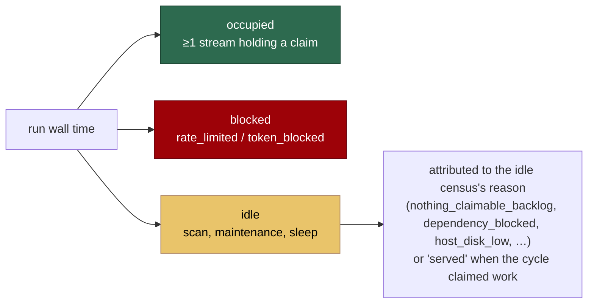
```mermaid
flowchart LR
    W["run wall time"] --> O["occupied<br/>≥1 stream holding a claim"]
    W --> K["blocked<br/>rate_limited / token_blocked"]
    W --> I["idle<br/>scan, maintenance, sleep"]
    I --> R["attributed to the idle census's reason<br/>(nothing_claimable_backlog, dependency_blocked, host_disk_low, …)<br/>or 'served' when the cycle claimed work"]
    style O fill:#2d6a4f,stroke:#1b4332,color:#fff
    style K fill:#9d0208,stroke:#6a040f,color:#fff
    style I fill:#e9c46a,stroke:#b08968,color:#000
```

- **`occupied` is not the sum of per-stream busy time.** With an N-slot pool,
  summing concurrent slots overshoots the wall clock, and subtracting that sum
  would report a half-idle pool as fully busy — zero idle. `occupied` is
  "at least one stream held a claim", so it can never exceed the wall clock.
  `busy` and `utilisation` remain per-stream and do overlap each other; that
  is the point of a per-stream number.
- **Idle reasons** reuse the idle-decision census's own vocabulary. The census
  only sets an explicit skip reason for the claim gates (`host_disk_low`,
  `work_volume_fault`, `cycle_deadline`); a fleet that was genuinely scanned
  is split further by the census's per-repo counts, so
  `dependency_blocked`, `stream_occupied`, `pr_blocked`, `cooldown_local` and
  `low_priority_suppressed` are reachable rather than merely declared. Idle
  while unblocked priority work was open (`nothing_claimable_backlog`) is
  reported separately from idle with nothing to claim
  (`nothing_claimable_empty`) — the first is a fault, the second is not.
- **A block inside a run** — the agent's own retry ladder sleeps in-process —
  counts towards `token_blocked_seconds` but not towards `idle_by_reason`: the
  fleet was holding a claim, not idle. This is the one deliberate overlap, and
  it is why the blocked totals can exceed the blocked share of `idle_seconds`.
- **`rate_limited` vs `token_blocked`** are separated by the shared
  `.rate_limit_signal` file, which now records whether a GitHub API limit or a
  model usage limit wrote it. Each carries a wait count alongside the total
  backoff.
- **Failure classes** are the phase a run died at (`setup`, `execute`,
  `quality_gate`, …), with `timeout` taking precedence — so "13 failures" says
  where. Skips (claim rejected, expected bounce) are excluded from
  `success_rate`, which is `successes / (successes + failures)`.
- **Utilisation** is `busy / wall` per work stream (`serial`, or `slot-N` in
  the issue pool), so "idle should be near zero" is directly checkable.

The totals are persisted to a per-host JSON sidecar
`fleet_telemetry_<hostname>.json` in `WORK_DIR`, holding this run's totals
under `run` and every run this host has recorded under `cumulative`. The
hostname rides in the filename — as it does for the scan cursor — so workers on
different hosts sharing a work volume never clobber one another. It is written
after every cycle and again when the run ends, including the abnormal exits
(quota pause, transient network failure, fatal error): those are precisely the
runs whose idle and blocked seconds an operator needs. A sidecar that exists but
cannot be read or parsed, or that carries a newer schema, is reported in the log
before the cumulative totals restart from zero — it is never dropped silently.

### 🎚️ Per-slot idle accounting — utilisation against capacity (Issue #925)

`fleet-summary:` answers "was the **fleet** occupied?" — occupancy there is
deliberately "at least one stream held a claim", so a two-slot pool with one
slot working reads as fully occupied. That is right for the wall-clock
partition above, and wrong for the question an operator asks of a pool: **is
any slot doing nothing?**

A two-slot fleet ran 47 minutes with `s1` working an issue and `s2` re-scanning
every 30 seconds and finding nothing. It recorded zero idle seconds, emitted no
`idle-detect` / `idle-census` / `idle-hooks` line and filed no idle-task,
because every idle instrument was gated on the per-cycle, fleet-wide
`tracker.foundClaimableIssue` flag that `s1`'s claim held true for the life of
the cycle. Half the fleet was invisible.

`slot_idle_accounting.ts` measures the same run against the capacity the
operator configured, and the loop emits its line beside `fleet-summary:`:

```text
slot-utilisation: slots=2 wall=2820s available=5640s occupied=2820s
  occupied_pct=50.0 idle=2820s idle_pct=50.0 blocked=0s unstaffed=0s
  occupied_by_slot=s1=2820s idle_by_slot=s2=2820s
  blocked_by_reason=none blocked_stops=none
```

(One line in the log; wrapped here for readability.)

The denominator is capacity, not wall time — `available = configured slots ×
run wall seconds` — against which four non-overlapping spans are booked:

- **`occupied`** — slot-seconds a slot held a claim. Everything a claim does is
  occupied: setup, the agent run, running tests, the quality gate, review. A
  claim that sleeps on the agent's own rate-limit retry ladder is occupied too,
  matching `fleet_telemetry`'s in-run rule — the slot is holding work, not
  looking for it.
- **`blocked`** — slot-seconds the whole fleet was paused waiting for a quota,
  split by the same two reasons `fleet-summary:` uses: `rate_limited` (GitHub
  API) and `token_blocked` (model usage), read from the shared
  `.rate_limit_signal` file. Booked from the loop-level pauses, where the
  waiting actually happens; a slot that meets an active signal at its pre-claim
  guard drains the pool at once rather than waiting in the slot, and that stop
  is counted per reason in `blocked_stops`.
- **`idle`** — slot-seconds a live slot spent looking for work and not finding
  any, **per slot**. This is the number that must stay near zero, and the
  number that read as zero for 47 minutes.
- **`unstaffed`** — the remainder: capacity that existed while no slot was
  running at all (start-up, the serial priority ladder, the end-of-cycle
  sleep). Reported rather than folded into idle, because a slot that does not
  exist cannot be said to be looking for work.

The same change moved the idle **hooks** — the idle-detect audit, the
idle-decision census and the idle-task filer — to fire when *a slot* has no
claimable work, not only when the whole fleet found nothing. The gate was
**not** widened back to `scanHadSuccess` (Issue #2048): an adjacent repo's PR
feedback still must not drive the decision. Only the scope of the question
changed, from the fleet to the slot. See
[the idle-task framework's coordination guards](IDLE-TASK-FRAMEWORK.md#coordination)
for the single-flight latch that stops N idle slots filing N issues.

### 🚪 Exit conditions

The worker exits when any of these occur:

| Condition                               | Behaviour                                                         |
| --------------------------------------- | ----------------------------------------------------------------- |
| Run duration expired (1 hour)           | Normal exit; cron restarts with fresh code                        |
| Claude CLI unresponsive or rate-limited | Health check failure; exit for retry                              |
| Claude CLI authentication expired       | Detected by `claude_auth.ts` (Deno); exit with actionable message |
| 3 consecutive failures on same item     | Self-healing exit via failure tracker                             |
| Configuration validation failure        | Immediate exit                                                    |
| Deno missing (required dependency)      | Immediate exit                                                    |
| Git reset failure                       | Cannot sync with repo; exit                                       |

### 🩹 Self-healing mechanisms

The worker is built to recover from just about anything — crashes, stale state,
network hiccups, and even its own mistakes:

- **Repo reset** — on startup, resets to the checkout's default branch (from
  `origin/HEAD`) to recover from crashed partial edits.
- **Shadow-copy execution** — protects against mid-run `git pull` corruption.
- **Pre-Claude validation** — `validate_repo_format` catches broken repository
  states (uncommitted changes, detached HEAD, divergence) before invoking
  Claude, avoiding wasted Claude credits on a doomed run.
- **Disk space cleanup** — the `disk-space` Deno command reclaims space when the
  disk nears capacity.
- **Stuck issue detection** — the `stuck-issue-detector` Deno command detects
  issues that have been assigned but not progressed, using heartbeat tracking.
  Enhanced with `detect_assigned_without_heartbeat` to recover issues assigned
  to the worker but with no heartbeat file at all (e.g., after a crash between
  claim and first heartbeat). Uses a 30-minute grace period before unassigning.
- **Heartbeat during Claude execution** — background heartbeat updates run while
  Claude is working, so stuck-issue detection can react within minutes rather
  than waiting for the full timeout.
- **Heartbeat marker adoption** — the marker comment is owned by the **work
  item**, not the run. `publishOrRefreshMarker()`
  (`worker/deno/lib/heartbeat_storage.ts`) used to decide POST-vs-PATCH purely
  from the local `.heartbeat-marker_<repo>_<n>` state file, so every run that
  started without that file (new host, cleared claim, wiped `/tmp`) posted a
  fresh comment — private-repo-14 collected nine markers in ~70 minutes. When
  the state file is missing, `findExistingMarkerComment()` now looks for the
  newest **fleet-authored** `VIBE_CODER_HEARTBEAT` comment and PATCHes it
  instead. A **cleared** marker (`epoch 0` + `cleared:`) is a valid adoption
  target — it is revived for the next claim rather than left as litter — while a
  marker still live on **another** machine is never adopted (that is contention:
  logged, then POST, unchanged race detection). Non-fleet authors are filtered
  with the same union `scanHeartbeatMarkers()` uses, so a forged marker can
  never be adopted (semantics). `clearHeartbeat` keeps the state file with
  `released: true` so a re-claim on the same host revives its comment without an
  API call; the GitHub-side finder is the cold-host fallback. Every adoption
  failure is non-fatal and degrades to the old POST path.

  ```mermaid
  flowchart TD
      S["publishOrRefreshMarker()"] --> F{"local marker<br/>state file?"}
      F -- "yes, released" --> R["PATCH — revive comment"]
      F -- "yes, live" --> W{"inside refresh<br/>window?"}
      W -- yes --> N["no-op"]
      W -- no --> R
      F -- no --> L["findExistingMarkerComment()<br/>fleet-authored only"]
      L -- "none / lookup failed" --> P["POST new comment"]
      L -- "live, other machine" --> P
      L -- "own or cleared marker" --> A["PATCH — adopt comment"]
      A -- "PATCH failed" --> P
      style A fill:#2d6a4f,stroke:#1b4332,color:#fff
      style P fill:#adb5bd,stroke:#6c757d,color:#000
  ```

- **Heartbeat comment sweep** — adoption fixes future behaviour; it does not
  remove the litter already on GitHub. Two kinds accumulate: **orphaned live
  markers** (POSTed by a run that died before `clearHeartbeat()` reached them,
  so their epoch keeps reading as a live claim until it ages out) and **blanked,
  abandoned markers** (every released claim leaves one more near-empty comment).
  `sweepHeartbeatComments()` (`worker/deno/lib/heartbeat_sweep.ts`) collapses a
  thread down to at most one marker comment. Only **fleet-authored,
  marker-only** comments are candidates — `isHeartbeatOnlyBody` strips the
  markers, the visible status line, and the **Progress** log, and anything left
  over is prose, so a claim comment (`CLAIM_LOCK` + "Claimed by …") or a human
  comment is never touched. The survivor is the adopted comment
  (`keepCommentId`) or the newest comment carrying a live marker; when every
  marker has been released the thread legitimately ends with **zero**.

  Deletion is gated on _not changing any recovery decision_: a **cleared**
  marker is only deleted once the thread has been quiet longer than
  `CLEARED_MARKER_GRACE_SECONDS` (past that point `shouldHonourClearedMarker()`
  already stops honouring it, so recovery reads it exactly as it reads an absent
  comment), a marker from **another live machine** is only deleted once its
  epoch has aged past `stuckIssueTimeout` — and that case is counted as
  `orphanedLiveMarkers`, because a spike means runs are dying before they
  release. This machine's own duplicate markers are always sweepable. A DELETE
  is confirmed from the HTTP status line (`gh api -X DELETE … -i`) so a silent
  `gh` failure can never be counted as a success, and one failure never aborts
  the rest of the sweep.

  The sweep runs automatically from the adoption path, so a thread self-heals as
  it is worked, and on demand via the `sweep-heartbeat-comments` Deno command:

  ```bash
  deno run mod.ts sweep-heartbeat-comments --dry-run
  deno run mod.ts sweep-heartbeat-comments --repos org/repo --issue 3644
  ```

  ```mermaid
  flowchart TD
      L["list comments"] --> F{"fleet author<br/>AND marker-only?"}
      F -- no --> K["never touched"]
      F -- yes --> C{"marker state"}
      C -- "cleared, aged past grace" --> D["DELETE"]
      C -- "cleared, still fresh" --> R["retain"]
      C -- "own machine" --> D
      C -- "other machine, aged out" --> O["DELETE + count orphan"]
      C -- "other machine, live" --> R
      C -- "the keep target" --> S["survivor"]
      style D fill:#9d0208,stroke:#6a040f,color:#fff
      style O fill:#9d0208,stroke:#6a040f,color:#fff
      style S fill:#2d6a4f,stroke:#1b4332,color:#fff
      style K fill:#adb5bd,stroke:#6c757d,color:#000
  ```

- **Milestone progress log** — a beating marker still says nothing about _what_
  the worker is doing. `recordMilestone()`
  (`worker/deno/lib/heartbeat_storage.ts`) appends a short, worker-authored line
  to a rolling log persisted in the `.heartbeat-marker_<repo>_<n>` state file
  and rendered as a **Progress** block inside the _same_ heartbeat comment — a
  milestone never posts a new comment. It publishes through
  `publishOrRefreshMarker()` with `minRefreshSeconds: 0`, so progress appears
  immediately instead of up to five minutes later; ordinary periodic beats keep
  honouring the refresh window. The log is capped at `MAX_MILESTONES` (10,
  oldest evicted) and each entry is flattened to one line and truncated to
  `MILESTONE_TEXT_MAX_LENGTH` (120 chars), so the machine-readable
  `<!-- VIBE_CODER_HEARTBEAT:… -->` line — and therefore
  `parseHeartbeatMarker()`, `scanHeartbeatMarkers()` and the recovery classifier
  — is never disturbed. The log survives beats, a state-file reload, comment
  adoption, and release (`clearHeartbeat()` keeps it beside the `cleared:`
  signal). Every failure is swallowed: `recordMilestone()` always returns
  `{ ok: true }` so progress reporting can never abort the work it describes.
  Processors reach it through `deps.crashHandling.recordMilestone`; the PR CI
  fix path (`pr_ci_processor.ts`) emits claim → diagnosis (fix attempt N of M) →
  fix pushed (short SHA) → released.

  ```mermaid
  sequenceDiagram
      participant P as pr_ci_processor
      participant H as heartbeat_storage
      participant G as GitHub comment
      P->>H: recordMilestone("Claimed …")
      H->>G: PATCH (immediate, gate bypassed)
      P->>H: recordMilestone("Diagnosing `test` — attempt 1 of 3")
      H->>G: PATCH
      Note over H,G: periodic beat inside window → no call
      P->>H: recordMilestone("Fix pushed (`a1b2c3d`) …")
      H->>G: PATCH
      P->>H: clearHeartbeat()
      H->>G: PATCH epoch 0 + cleared + Progress log
  ```

- **Unified claim release** — every scan-loop path that releases a claim
  (success, failure, skip-after-claim) calls the single `releaseClaim()` helper
  (`worker/deno/lib/heartbeat_storage.ts`), which unassigns the worker **and**
  clears the heartbeat/marker. Both steps are best-effort and independent — a
  failure in one never blocks the other, and a double-unassign is a harmless
  no-op. This fixes incident, where the failure path cleared the marker but left
  the issue permanently assigned, blocking all future pickup.
- **Claim-lock integrity** — the assignee _is_ the claim lock every host checks,
  so an issue must never be "unassigned with a live heartbeat". VibeCoder#185
  was unassigned at 06:31Z with no release comment while its heartbeat kept
  beating to 06:40Z; for nine minutes any host could have started a second agent
  on the same issue and branch. Three invariants hold it shut:

  1. **Claim availability** — `claimIssue`
     ([`claim_issue.ts`](../worker/deno/lib/claim_issue.ts)) treats an
     unassigned issue whose fleet-authored heartbeat beat within
     `LIVE_HEARTBEAT_WINDOW_SECONDS` (2× the marker refresh interval) as
     unavailable, refusing the claim with reason `heartbeat_active` and logging
     `heartbeat_active_without_assignee` at WARNING so the broken state is
     visible. A released marker (epoch 0 + `cleared:`) and a forged marker from
     outside the fleet never block a claim.
  2. **Live-slot holds** — the recovery and cleanup passes (`recoverStuckIssue`,
     `detectAssignedWithoutHeartbeat`, `recoverStaleGithubAssignments`, and the
     Priority 1.68 closed-PR pass in
     [`stuck_recovery.ts`](../worker/deno/lib/stuck_recovery.ts)) consult the
     pool's `InFlightRepoRegistry` through
     [`live_slot_holds.ts`](../worker/deno/lib/live_slot_holds.ts) and leave an
     issue a live slot owns completely alone — only the owning slot's release
     may remove an in-flight claim's assignee. The skip is logged and recorded
     as the `skipped:live_slot` recovery decision.
  3. **Release order** — `releaseClaim()` stops the heartbeat and posts the
     outcome **before** dropping the assignee, and `recordHeartbeat()` refuses a
     beat for an already-released claim (loudly: WARNING plus an `{ ok: false }`
     result). The next claim on the issue lifts that guard via `startHeartbeat`
     / marker seeding.

  ```mermaid
  sequenceDiagram
      participant S as Owning slot
      participant H as heartbeat_storage
      participant G as GitHub issue
      participant P as Sibling host
      S->>H: releaseClaim()
      H->>G: PATCH marker — epoch 0, cleared, outcome
      Note over H: guard armed — no beat may follow
      H->>G: remove assignee (claim lock dropped last)
      P->>G: pre-claim check — assignees + heartbeat markers
      G-->>P: unassigned, marker cleared → claim allowed
  ```

- **Release the claim on terminal failure** — the same invariant applies to the
  self-assigning **phase processors** (grill-me, clarity, planning, refinement,
  question, revision), not just the scan loop. Every such processor must release
  its claim on **every** terminal exit — success _and_ failure — via the shared
  `releaseClaim()` helper
  ([`claim_release.ts`](../worker/deno/lib/claim_release.ts),), best-effort and
  after posting its failure marker. A claim left dangling on a terminal failure
  path otherwise trips the assigned-without-heartbeat recovery above ~30 minutes
  later and blocks another worker from taking over; the consecutive-failure →
  `needs-human` escalation is the loop's terminating backstop. See the **Release
  the claim on terminal failure** design-principle entry in
  [`DESIGN-PRINCIPLES.md`](../DESIGN-PRINCIPLES.md) for the full rationale and
  the implementing files.
- **All-account claim release for grill-me** — `releaseClaim` only removes the
  **current run's** account, but a grill-me cycle spans several runs across
  different fleet accounts (e.g. Round 1 as `Vibecoderbot`, Round 2 as
  `stsvcbot`). An earlier round's assignee therefore lingered until the
  ~30-minute cross-account recovery cleared it. The grill-me processor's
  hand-off paths (Ready hand-off **and** between rounds) now call
  `releaseAllWorkerClaims()`
  ([`claim_release.ts`](../worker/deno/lib/claim_release.ts)), which clears the
  own account **plus** any **other** assignee that has posted a worker claim
  (`CLAIM_LOCK`) or heartbeat (`VIBE_CODER_HEARTBEAT`) marker — the same
  evidence the cross-account recovery uses — so a human teammate assignee is
  never auto-cleared. A bounded retry (default 2 extra attempts) stops a single
  flaky API call from falling straight through to the slow recovery; if every
  attempt still fails the helper is best-effort (logged, swallowed, never
  throws) and the ~30-minute auto-recovery remains the silent backstop — no
  human is ever flagged.
- **Cross-identity round verification for grill-me** — the same multi-account
  fleet means a peer (`Vibecoderbot`) can post `## Grill-Me Round N` moments
  before another identity (`stsvcbot`) claims the issue. `countGrillMeRounds` /
  `hasReadyMarkerBeenPosted` only see the current identity's comments, so the
  post-run verification declared a false
  `## Grill-Me Failed — Claude did not post a Grill-Me round comment`
  immediately below the round it could not see (incident). Before posting that
  marker the processor now calls `hasGrillMeRoundAwaitingReply()`
  ([`grill_me_processor.ts`](../worker/deno/lib/grill_me_processor.ts)), which
  matches the round/final/ready marker from **any** author — the same
  marker-not-account keying as the failure-marker fix. A round that is still
  unanswered makes the run a no-op success; once a human has replied to it the
  round really is missing and the failure is still reported loudly.
- **Crash cleanup** — trap handler (Deno `crash-cleanup` command) cleans up
  heartbeat files and unassigns the worker from claimed issues on unexpected
  exit, closing the crash window between claim and heartbeat recording.
- **Crash notifications** — alerts operators via GitHub issue comments and
  optional webhooks when the worker exits unexpectedly (Deno
  `crash-notification` command). Rate-limited to prevent spam. Enhanced (751)
  with worker log tail, Claude output tail, work stage tracking, elapsed time,
  and system context (uptime, disk free, memory pressure).
- **Persistent failure state** — failure counts, circuit breaker state, and
  cooldown timers survive restarts, preventing crash-restart loops.
- **Pre-flight quality baseline** — the `quality-helpers` Deno command runs
  `./quality.sh` on the clean repository before making changes. This establishes
  a baseline of pre-existing quality failures, so failure comments can
  distinguish pre-existing issues from ones introduced by the worker.
- **PR blocking alerts** — the `repo-blocked-alert` Deno command alerts
  operators when open PRs block all eligible issues in a repository for an
  extended period (default 24 hours, configurable via
  `REPO_BLOCKED_ALERT_HOURS`). Posts a warning comment on the blocking PR(s)
  suggesting actions: merge, close, or add `ignore-open-prs` label. State
  tracked in `$WORK_DIR/.repo_blocked_state`.
- **Software updates** — the Deno `software-updates` command performs weekly
  checks for Claude CLI and GitHub CLI updates.

---

## 🔍 2. Issue selection and claiming

### 🔍 Issue discovery: modular issue finder

The issue finder was refactored from a monolithic module into focused Deno
TypeScript sub-modules in [issue_finder.ts](../worker/deno/lib/issue_finder.ts):

| Module                                                    | Purpose                                                                                                  |
| --------------------------------------------------------- | -------------------------------------------------------------------------------------------------------- |
| [issue_finder.ts](../worker/deno/lib/issue_finder.ts)     | Issue finder orchestration — `find_oldest_issue()`, `find_refinement_issues()`, `find_question_issues()` |
| [issue_query.ts](../worker/deno/lib/issue_query.ts)       | GitHub API queries — issue listing, PR blocking checks, label verification                               |
| [issue_filter.ts](../worker/deno/lib/issue_filter.ts)     | Filtering and sorting — assignee filtering, label filtering, stale label cleanup                         |
| [issue_priority.ts](../worker/deno/lib/issue_priority.ts) | Candidate ranking — label-priority ordering, oldest candidate selection                                  |
| [issue_cache.ts](../worker/deno/lib/issue_cache.ts)       | API response caching — issue and PR list caching                                                         |
| [issue_data.ts](../worker/deno/lib/issue_data.ts)         | Consolidated data fetching — single API call for issue body, labels, comments, state                     |

The system is optimised with batch GitHub API calls to reduce API usage from N×M
calls to N calls per scan cycle, and structured logging for operator visibility
into skip reasons and timing.

#### 📊 Selection flow

```
find_oldest_issue(github_user)
  |
  +-- maybe_shuffle_repos(REPOS[])
  | Randomise repo order for fairness
  |
  +-- FOR EACH repo:               [issue_query.ts + issue_filter.ts]
  |   +-- _collect_label_candidates_for_repo()
  |   |     Query issues by each configured label (ISSUE_LABELS[])
  |   |     No author restriction — the label itself is authorisation
  |   |     Filter: assignee, blocking labels, open PRs, dependencies
  |   |
  |   +-- _collect_work_on_candidates_for_repo()
  |   |     Query issues with work-on label
  |   |     SECURITY: verify label was added by ALLOWED_AUTHOR
  |   |     Filter: same as above
  |   |
  | +-- collectLowPriorityCandidates
  |         Query issues with low-priority label
  |         SECURITY: verify label was added by ALLOWED_AUTHOR
  |         Filter: same as above
  |
  +-- _select_highest_priority()    [issue_priority.ts]
  |     Tier 1 configured-label > Tier 2 work-on
  |       > Tier 2b self-scheduled worker diagnostic > Tier 3 low-priority
  |     A lower tier fires only when every higher tier is empty
  |     across ALL scanned repos (cross-repo global guarantee)
  |     If configured-label search FAILED (API error): no fallback
  |     If configured-labels PR-BLOCKED: use work-on from unblocked repos
  |
  +-- select_oldest_candidate()     [issue_priority.ts]
        Sort all candidates by createdAt ascending
        Return the globally oldest
```

#### 🏷️ Label priority

1. **Configured labels** (`ISSUE_LABELS[]` from `.config.json`) — highest
   priority. No author restriction; the label itself is authorisation. **Array
   order determines priority:** the first label in the array has the highest
   priority. Since the canonical configured set is `["top-priority"]` — the
   legacy `help wanted` and `claude` labels were retired. Within the same label,
   the oldest issue wins. This is implemented via zero-padded label index
   prefixes during candidate collection
   (`_collect_label_candidates_for_repo()`), enabling lexicographic sort to
   respect label order.
2. **Work-on label** — medium priority. Must be added by an allowed author
   (verified via the GitHub timeline API by `wasLabelAddedByAllowedAuthor()` in
   [issue_query.ts](../worker/deno/lib/issue_query.ts)). **Fleet-worker
   exclusion:** in a multi-account fleet the worker's own login is required in
   `allowed_authors` for PR-dedup, so the discovery collectors pass their
   `fleetWorkerLogins` set into the gate and any reserved discovery label
   (`top-priority`/`work-on`/`low-priority`) whose most-recent adder is a fleet
   worker is treated as untrusted and stripped — mirroring the operational-label
   backstop (`verifyOperationalLabels`,). **Cache may deny, never grant:** the
   file-backed timeline cache can short-circuit the gate only to a `false`
   (untrusted) result. A cached entry that _would_ grant trust is re-confirmed
   against a freshly paginated timeline, so a tampered-with cache file under
   `TMPDIR` can never make an attacker-applied `work-on` look trusted. The same
   exhaustive read backs the untrusted-`work-on` strip
   (`strip_untrusted_work_on.ts`), which both removes a label and names the
   adder publicly.
2b. **Self-scheduled worker diagnostic** — no label at all. An issue the worker
   auto-filed about itself, in its own repo, carrying a recognised provenance
   marker, is claimable on that provenance alone
   ([collect_self_diagnostic_candidates.ts](../worker/deno/lib/collect_self_diagnostic_candidates.ts),
   [self_diagnostic_provenance.ts](../worker/deno/lib/self_diagnostic_provenance.ts)).
   **Nothing is self-labelled** — the reserved-label guards are untouched and
   `top-priority`/`work-on` stay human-only. Three signals must agree (repo,
   marker, fleet author); the tier is capped at
   `self_schedule_diagnostics_max_in_flight`, its decisions are written to the
   audit chain under the `self-schedule-diagnostic` verb and announced on the
   issue, a permanently-blocked diagnostic is escalated with `needs-human`, and
   `self_schedule_diagnostics_enabled: false` restores the previous behaviour.
   See
   [Self-scheduled worker diagnostics](workflows/issue-processing.md#-self-scheduled-worker-diagnostics-tier-2b).
3. **Low-priority label** — idle-time tier. Selected only when **no** eligible
   configured-label, `work-on` or self-scheduled diagnostic candidate exists in
   **any** scanned repo.
   Implemented in
   [collect_low_priority_candidates.ts](../worker/deno/lib/collect_low_priority_candidates.ts)
   and integrated by
   [find_oldest_issue.ts](../worker/deno/lib/find_oldest_issue.ts) and
   [issue_priority.ts](../worker/deno/lib/issue_priority.ts). Same
   allowed-author check as `work-on`. See
   [Issue selection priority](workflows/issue-processing.md#-issue-selection-priority).
4. **Idle-task label** — lowest tier. Implemented in
   [collect_idle_task_candidates.ts](../worker/deno/lib/collect_idle_task_candidates.ts).
   **Origin trust:** unlike the three tiers above, `idle-task` is the one
   discovery label the worker may self-apply, so fleet logins stay _trusted_
   here instead of being excluded. The claim is honoured under the standard OR
   gate — the most recent `idle-task` add was by a trusted login
   (`allowed_authors` ∪ own login ∪ `fleet_pr_authors`) **or** the issue was
   filed by one — followed by the same `verifyWorkOnContentIntegrity()` TOCTOU
   check the lower tiers run. An untrusted actor with triage permission applying
   `idle-task` to an issue they authored themselves is rejected, so
   attacker-supplied content can no longer start a billed issue→PR run.

**Operational dispatch labels require a trusted label adder.** The label-based
discovery path
([find_issues_by_label.ts](../worker/deno/lib/find_issues_by_label.ts)) drives
the privileged refinement, grill-me, quorum, planning, question, and revision
phases. For these operational dispatch labels (`refine-issue`, `grill-me`,
`quorum`, `planning`, `question`, `needs-revision`) the label **adder** must
always be on the allowlist — a trusted issue author is **not** sufficient (AND
gate). Otherwise a non-allowlisted actor with triage (label-applying) permission
could apply an operational label to a trusted-authored issue and steer the
worker into a privileged automation phase (broken access control, A01:2025). For
any other label the original OR gate applies (trusted issue author **or**
trusted label adder). The set is resolved from config by
`requiresLabelAdderTrust()` in
[operational_dispatch_labels.ts](../worker/deno/lib/operational_dispatch_labels.ts).

Every label declared in `custom_label_prompts`
([Custom Label Prompts](CONFIGURATION.md#-custom-label-prompts)) joins that set
(Issue #847). A custom label dispatches a privileged automation phase with an
operator-supplied prompt, so it is gated exactly like `planning`: the adder must
be on the allowlist, the comparison is case-insensitive, and an add that cannot
be attributed to anyone fails closed (the issue is skipped, never handed to
another handler as a plain descriptive label). The same labels are treated as
operational by `verifyOperationalLabels()`
([label_security.ts](../worker/deno/lib/label_security.ts)) in all four
discovery collectors, so an untrusted actor's add is stripped on those paths
too, and as reserved by the creation-time filters in
[github.ts](../worker/deno/lib/github.ts) so the worker's own creation paths
never apply one. A label the worker legitimately raises itself (`idle-task`,
`security`, `severity:…`) cannot be remapped at all — the config validator
refuses the collision at load, so making custom labels reserved can never strip
a label the worker needs. With no mappings configured the set is the same six
labels as before.

**A PR-producing label route also gets the `work-on` eligibility gates**
(Issue #937). The operational dispatch labels above *answer* an issue and remove
their own label when they finish, so re-dispatch stops itself. A custom label
does not: it stays on the issue, and `unassign_on_pr_created` hands the issue
back unassigned, so the next cycle re-ran the whole implementation pipeline
against the PR the previous cycle had just raised. `findIssuesByLabel` therefore
takes an opt-in `gateNewWork`, which runs the sequence
[collect_work_on_candidates.ts](../worker/deno/lib/collect_work_on_candidates.ts)
runs, factored into
[new_work_eligibility.ts](../worker/deno/lib/new_work_eligibility.ts) so both
routes call the same helpers: stale-failure-label cleanup and the blocking-label
filter, then milestone occupancy, the closed/merged-PR block with its trusted
re-label escape hatch, the open-PR block with `ignore-open-prs`, and dependency
blocking. The production wiring passes it for the custom-label row only, along
with the retry-cooldown filter, and records a cooldown when a gated dispatch
produces no work. The `work-on` content-integrity (TOCTOU) check stays with
`work-on`: it verifies an issue against an approval snapshot only the `work-on`
approval flow captures.

Issues are **excluded** from selection if they carry any of: `failed`,
`refine-issue`, `planning`, `question`, `needs-human`. retired the standalone
`needs-clarification` label and folded the clarification handoff onto
`needs-human`.

The `needs-human` label is the worker's escalation signal: when Claude
determines an issue cannot be completed autonomously (e.g. it needs credentials
only a human can grant, or a product decision only a human can make), it adds
`needs-human` and a comment, then stops. Discovery skips the issue on every
subsequent scan until a human removes the label. The worker **never**
self-applies `top-priority`, `work-on`, or any other reserved workflow label for
this purpose — `needs-human` is its only escalation channel. See
[issue-processing.md — Worker escalation via `needs-human`](workflows/issue-processing.md#-worker-escalation-via-needs-human).

#### 🔎 Filtering criteria

Each candidate issue is checked by functions in
[issue_filter.ts](../worker/deno/lib/issue_filter.ts) and
[issue_query.ts](../worker/deno/lib/issue_query.ts):

| Filter                           | Function                                        | Module             | Behaviour                                                                                               |
| -------------------------------- | ----------------------------------------------- | ------------------ | ------------------------------------------------------------------------------------------------------- |
| **Assignee**                     | `filter_issues_by_assignee()`                   | issue_filter       | Must be unassigned or assigned to the current worker (multi-worker safe)                                |
| **Blocking labels**              | `build_issue_filter_jq`                         | issue_filter       | Exclude `failed`, `refine-issue`, `planning`, `question`, `needs-human` (retired `needs-clarification`) |
| **Open PR blocking**             | `get_blocking_pr_for_issue()`                   | issue_query        | Milestone-aware: only blocked by PRs targeting the same milestone branch                                |
| **Ignore-open-prs bypass**       | `has_ignore_open_prs_label_by_allowed_author()` | issue_query        | Bypass open PR blocking when label added by allowed author                                              |
| **One issue per repo/milestone** | `is_milestone_occupied`                         | issue_filter       | Only one issue per repo/milestone can be in-progress at a time                                          |
| **Forward dependencies**         | `has_unmet_dependencies()`                      | dependency_checker | Blocked if any `Depends on` / `Blocked by` issue is open                                                |
| **Parent blocking**              | `has_open_sub_issues()`                         | dependency_checker | Blocked if parent has open child issues (task list items)                                               |
| **Stale label cleanup**          | `clean_stale_labels_for_reopened_issues`        | issue_filter       | Removes `failed`, `failed-once` from reopened issues (retired the `needs-clarification` cleanup)        |

#### 🎯 Milestone-aware PR blocking

For **milestone issues**, only PRs targeting the same milestone branch are
blocking. This allows parallel work on different milestones within the same
repository. For **non-milestone issues**, only PRs targeting the default branch
are blocking.

#### 🔒 One issue per repo/milestone enforcement

The `isMilestoneOccupied()` function in
[issue_filter.ts](../worker/deno/lib/issue_filter.ts) ensures that only one
issue per repository (or per milestone within a repository) is being worked on
at any given time. This prevents conflicts from concurrent changes to the same
codebase area. The check is **fleet-aware**: a work stream is occupied when an
issue in it is assigned to **any account the fleet operates** — the current
host's login plus `fleet_pr_authors` and `service_accounts`, resolved by
`resolveFleetMaintenanceAuthorSet()` — so in a multi-account fleet
(`Vibecoderbot`, `stsvcbot`, …) a sibling host's assignment also occupies the
stream and a second host will not start the same issue.

Human assignees are **never** counted. The match set is deliberately not
`config.allowedAuthors`: that is a permission list ("whose issues may we work
on?") which legitimately contains humans, and resolving the fleet from it let a
single human-assigned issue park a whole work stream. Locking and scheduling
exist only between Vibe Coders — see
[Design Principles](../DESIGN-PRINCIPLES.md#locking-and-scheduling-exist-only-between-vibe-coders).

#### 📦 Issue data consolidation

[issue_data.ts](../worker/deno/lib/issue_data.ts) fetches issue body, labels,
comments, and state in a single API call instead of 9–12 separate calls. Helper
functions extract individual fields from the cached response.

#### 🗄️ Issue caching

[issue_cache.ts](../worker/deno/lib/issue_cache.ts) caches GitHub issue and PR
list API responses to reduce API call volume during scan cycles. Functions like
`cached_gh_issue_list_all()` and `cached_gh_pr_list_all()` serve cached results
when available, falling back to live API calls when the cache has expired.

#### 🔄 Repo scanning order

Repositories are shuffled by default (`SHUFFLE_REPOS=true` via
[array_utils.ts](../worker/deno/lib/array_utils.ts)) to prevent starvation. When
`SHUFFLE_REPOS=false`, the configured order is preserved.

### 🤝 Issue claiming: `worker/deno/lib/claim_issue.ts`

[claim_issue.ts](../worker/deno/lib/claim_issue.ts) implements atomic issue
claiming with verification:

1. **Assign** — `gh issue edit --add-assignee $github_user`.
2. **Wait** — 2-second delay for GitHub's eventual consistency.
3. **Verify** — re-read assignees via `gh issue view --json assignees`.
4. **Decide:**
   - **No assignees** → claim failed (assignment may have failed silently).
   - **Single assignee = current worker** → claim succeeded (exclusive
     ownership).
   - **Single assignee = someone else** → claim failed (another worker won).
   - **Multiple assignees (contested)** → alphabetical tie-break: sort all
     assignees alphabetically; the first wins. The loser unassigns itself and
     backs off.

This deterministic tie-breaking ensures exactly one worker processes each issue,
even when multiple workers claim simultaneously.

---

## 👀 3. PR monitoring

### 🔍 PR discovery

PRs are discovered by **author** — the worker queries for open PRs authored by
its configured GitHub user (`gh pr list --state open --author $github_user`).
Every worker sharing the same GitHub account sees the same set of open PRs.

The discovery scan iterates through all configured repositories (shuffled for
fairness).

### ⏱️ Timeout wrappers (`worker/deno/lib/gh_wrapper.ts`, `worker/deno/lib/git_timeout.ts`)

All GitHub CLI and git operations are wrapped with configurable timeouts to
prevent indefinite hangs:

| Wrapper           | Default timeout             | Source                                              |
| ----------------- | --------------------------- | --------------------------------------------------- |
| `runGitCommand()` | 60s (120s for merge/rebase) | [git_timeout.ts](../worker/deno/lib/git_timeout.ts) |
| `safeGhCommand`   | 60s                         | [gh_wrapper.ts](../worker/deno/lib/gh_wrapper.ts)   |

Helper functions let callers distinguish timeouts from other failures. This
prevents a single hung `git push` or `gh api` call from blocking the entire
worker run.

### 🚦 Rate-limit aware retry (`worker/deno/lib/retry.ts`)

[retry.ts](../worker/deno/lib/retry.ts) provides intelligent retry logic:

- **`is_rate_limit_error()`** — detects HTTP 429, `X-RateLimit-Remaining: 0`,
  and "rate limit exceeded" messages.
- **`extract_retry_after()`** — reads the `Retry-After` header and caps the wait
  at 3,600 seconds.
- **Distinct exit code** — returns exit code 223 for rate-limit exhaustion
  (distinct from transient errors), so callers can take appropriate action
  (e.g., exit the run loop rather than burning retries).

### 💬 Feedback detection: `worker/deno/lib/pr_comments.ts`

[pr_comments.ts](../worker/deno/lib/pr_comments.ts) checks three types of
feedback:

| Type                               | API endpoint                        | Authorisation                                                                                                                                                                   |
| ---------------------------------- | ----------------------------------- | ------------------------------------------------------------------------------------------------------------------------------------------------------------------------------- |
| **Inline review comments**         | `repos/{repo}/pulls/{pr}/comments`  | Authorised commenters: process immediately. Others: require a thumbs-up reaction **from an authorised user** (a bare `+1` count is not trusted, since any user can self-react). |
| **Issue/discussion comments**      | `repos/{repo}/issues/{pr}/comments` | Same as review comments.                                                                                                                                                        |
| **PR reviews** (CHANGES_REQUESTED) | `repos/{repo}/pulls/{pr}/reviews`   | Authorised commenters and `trusted_review_bots` only (Issue #185) — anyone can review a PR, and the body goes straight into the feedback prompt.                                |

**Processed-comment tracking** — comments are marked as processed by adding an
"eyes" (👀) reaction. The discovery query filters for `.reactions.eyes == 0` to
avoid reprocessing. PR reviews use dismissal instead of reactions.

**Staleness check** — review commit IDs are compared against the PR's current
HEAD SHA. If the review was left on an older commit, it is skipped (the worker
has already pushed new commits since the review).

**Superseded by a fleet push** — a trusted comment is also deferred when the PR
head was pushed by a **fleet login** _after_ the comment was written and within
the cool-off window (`FLEET_PUSH_COOL_OFF_MS`, 15 minutes; see
[pr_feedback_staleness.ts](../worker/deno/lib/pr_feedback_staleness.ts)). Two
hosts maintaining the same PR otherwise both act on the same feedback — one via
its CI-fix claim, the other via the comment — and the second run works against a
branch head that moved underneath it. The deferral expires with the window, so
feedback the push did not address is reconsidered by a later scan. A **human's**
push never defers a comment.

**Self-loop prevention** — comments by the PR author (the worker's own account)
are skipped to prevent infinite feedback loops.

**Fleet-push supersession (Issue #211)** — the fleet maintains the same PR from
several hosts, so a comment can be answered by a sibling before this host gets
to it. Once a comment is otherwise actionable,
[`pr_feedback_supersede.ts`](../worker/deno/lib/pr_feedback_supersede.ts) reads
the PR head commit once and drops the comment when a **fleet account pushed that
head after the comment was written**, and that push is still inside the
`FLEET_PUSH_COOL_OFF_MS` (15 minute) window. The window matters: without an
expiry a single fleet push would suppress the comment for as long as that head
stood, so genuine feedback the push did not address would starve instead of
being reconsidered by a later scan. Unknown state — no `created_at`, an
unreadable head commit, an unparseable date — is never treated as superseded, so
genuine feedback is not silently dropped.

### 🔄 Feedback processing flow

When a comment is found:

1. **Set up** — update GitHub status, set terminal title, validate comment body
   size.
2. **Sync branch** — `sync_feature_branch_with_default()` rebases the feature
   branch onto the base branch to prevent merge conflicts.
3. **Build prompt** — assemble a `pr_feedback` prompt template with the comment
   body, repo quality instructions, and custom instructions.
4. **Run Claude** — `run_claude_with_retry()` with timeout and rate-limit
   handling.
5. **Quality check** — if changes were made, run `./quality.sh`; retry via
   Claude if it fails.
6. **Push** — `push_unpushed_commits()` with self-healing for push rejections.
7. **Mark processed** — add eyes reaction (or dismiss review) and post a reply
   comment.

### 📏 How "did we push?" is answered (Issue #211)

`commitAndPushPending` reports `finalUnpushedCount`, and every processor treats
`0` as "the work landed". That count is measured against **this branch's own
remote head**, resolved by
[`git_remote_head.ts`](../worker/deno/lib/git_remote_head.ts):
`refs/remotes/origin/<branch>` when the clone keeps one, otherwise
`git ls-remote --heads origin <branch>`.

The count used to be `git rev-list --count HEAD --not --remotes=origin`, which
answers "commits ahead of the default branch" whenever no remote-tracking ref
exists for the branch — a single-branch clone never gains one, even after a
successful `git push -u`. A good push then reported
`commitsPushed=4 finalUnpushedCount=4`, which triggered a pointless recovery, a
"please check the branch status" comment to a human, and a `merge-conflict`
label on a mergeable PR.

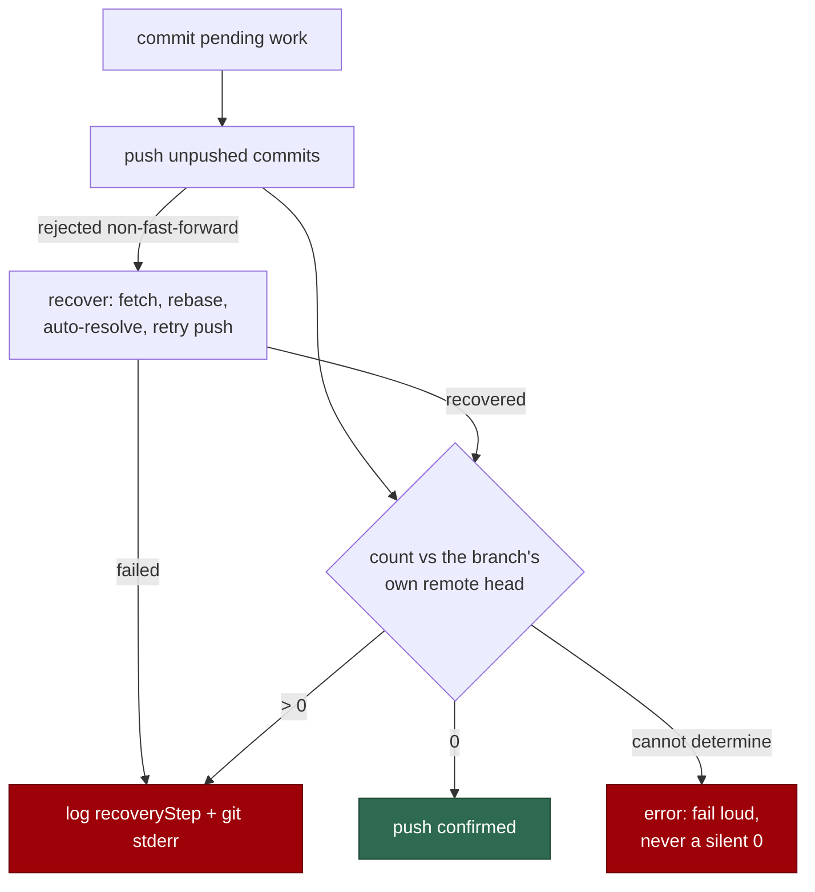
```mermaid
flowchart TD
    A[commit pending work] --> B[push unpushed commits]
    B -->|rejected non-fast-forward| C[recover: fetch, rebase,<br/>auto-resolve, retry push]
    C -->|failed| E[log recoveryStep + git stderr]
    B --> D{count vs the branch's<br/>own remote head}
    C -->|recovered| D
    D -->|0| F[push confirmed]
    D -->|> 0| E
    D -->|cannot determine| G[error: fail loud,<br/>never a silent 0]
    style F fill:#2d6a4f,stroke:#1b4332,color:#fff
    style E fill:#9d0208,stroke:#6a040f,color:#fff
    style G fill:#9d0208,stroke:#6a040f,color:#fff
```

A failed recovery logs the step that failed (`recoveryStep`) and git's own
stderr (`detail`) — the merge-conflict pass asks git for the rejection reason
with a dry-run push — so a genuine push failure is diagnosable from the log
alone.

The same remote head governs the **branch-update pass**: `updatePrBranch`
fast-forwards the PR branch onto its remote head before deciding whether it is
behind or conflicted, and refuses loudly — with a distinct error, not a conflict
verdict — when the local branch is ahead of that head, because those commits are
unpushed work the pass would otherwise force-push over. Judging a reused clone's
stale local branch is what produced a conflict verdict for a PR GitHub reported
as mergeable.

### 🔤 Spelling and quality fix flow

`find_failed_pr_checks()` discovers spelling check failures on open PRs:

1. Lists open PRs authored by the worker.
2. Queries check runs for each PR (`repos/{repo}/commits/{branch}/check-runs`).
3. Filters for failed checks matching `spell|cspell|typo|codespell`.
4. Fetches check annotations (file paths and messages).
5. Passes annotations to `work_on_spelling_failure()`, which uses the
   `spelling_fix` prompt template.

### 🔧 CI/integration test failure detection

`find_failed_ci_checks()` discovers general CI failures on open PRs:

1. Lists open PRs authored by the worker (with `baseRefName` for priority
   sorting).
2. Queries check runs for each PR (`repos/{repo}/commits/{branch}/check-runs`).
3. Filters for failed checks, **excluding** spelling patterns
   (`spell|cspell|typo|codespell`).
4. Checks retry count against `CI_CHECK_MAX_RETRIES` (default 3) — skips
   over-retried failures.
5. Prioritises PRs targeting the default branch (where integration tests run).
6. Fetches check annotations and returns the highest-priority failure.

**Retry tracking** — uses local state files in `$CI_CHECK_STATE_DIR` (default
`$WORK_DIR/.ci_check_state`, resolved to an **always absolute** path by
[ci_check_state_dir.ts](../worker/deno/lib/ci_check_state_dir.ts) — Issue #552).
Each check run ID has a `.retries` file recording how many times it has been
attempted. `record_ci_check_retry()` increments the counter before each fix
attempt.

The **scan** and the **processor** must resolve the same directory. The scan
reads the retry counters the processor writes, and clears the auto-fix attempt
budget recorded against a PR once that PR reports green. While the scan kept a
relative default it addressed a different store: the cap was never observed, a
spent auto-fix budget was never cleared, and the lane escalated red checks to a
human rather than fixing them.

**Priority** — runs at priority 1.55 in the main loop, after spelling fixes
(1.5) but before branch updates (1.6).

### 🌿 Branch sync and updates: `worker/deno/lib/git_branch.ts`

The Deno git modules ([git_branch.ts](../worker/deno/lib/git_branch.ts),
[git_push.ts](../worker/deno/lib/git_push.ts),
[git_pull.ts](../worker/deno/lib/git_pull.ts)) manage branch operations:

| Function                             | Purpose                                         | Strategy                                                                |
| ------------------------------------ | ----------------------------------------------- | ----------------------------------------------------------------------- |
| `sync_feature_branch_with_default()` | Sync feature branch with base before work       | Rebase; recreate fresh if conflicts                                     |
| `update_pr_branch()`                 | Keep PR branch current with base                | Rebase + force-with-lease push; never recreate (preserves PR commits)   |
| `update_open_pr_branches()`          | Bulk update all open PRs                        | Per-PR `update_pr_branch()` with actual `baseRefName` from GitHub API   |
| `ensure_pr_mergeable()`              | Proactive conflict resolution before auto-merge | Rebase + auto-resolve conflicts + force-with-lease push                 |
| `resolve_rebase_conflicts()`         | Automatic conflict resolution                   | Accept remote version for each conflicted file; iterate up to 10 rounds |

**Protected branch safety** — `is_protected_branch()` prevents force-push on
`main`, `master`, `develop`, `release`, `production`, `staging`, and
`milestone/*` branches.

**Lease baselines** — a recovery path that fetches or pulls before its
last-resort force push must capture `refs/remotes/origin/<branch>` _before_ that
refresh and push `--force-with-lease=<branch>:<sha>`. A bare
`--force-with-lease` leases against the ref the fetch just updated, so it can
never fail and silently behaves as a plain `--force`.
`recover_from_push_rejection()` falls back to the bare lease only when no
remote-tracking ref exists yet.

**Recovery diagnostics** — every failure from `recoverFromPushRejection()` names
the step that failed (`pull --rebase`, `conflict-resolution`,
`force-with-lease`, `retry-push`) and carries git's own stderr. The CI,
feedback, spelling and merge-conflict paths log that message rather than a bare
"Push failed after recovery attempt".

#### 🧮 "Is it pushed?" is a question for the remote

The push post-condition is counted against the branch **as it stands on the
remote** ([git_remote_head.ts](../worker/deno/lib/git_remote_head.ts)), not
against the local remote-tracking refs. Fleet clones are `--single-branch`, so
their fetch refspec covers the default branch only and a push of a feature
branch never creates `refs/remotes/origin/<feature>` there. The old
`rev-list --count HEAD --not --remotes=origin` probe therefore reported a landed
push as entirely unpushed — live, `commitsPushed=4
finalUnpushedCount=4`, a
bogus recovery attempt, a "please check the branch status" comment to a human,
and a `merge-conflict` label on a mergeable PR.

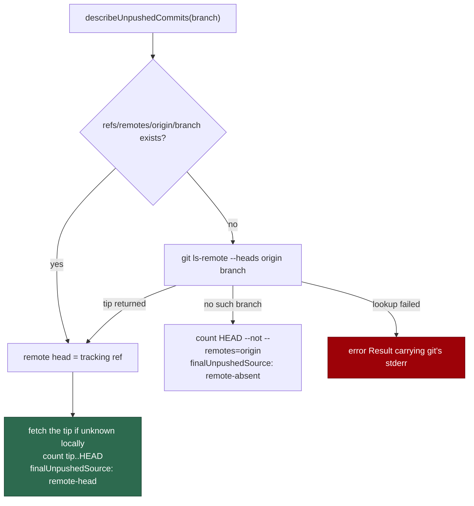
```mermaid
flowchart TD
    A["describeUnpushedCommits(branch)"] --> B{"refs/remotes/origin/branch exists?"}
    B -- yes --> C["remote head = tracking ref"]
    B -- no --> D["git ls-remote --heads origin branch"]
    D -- "tip returned" --> C
    D -- "no such branch" --> G["count HEAD --not --remotes=origin<br/>finalUnpushedSource: remote-absent"]
    D -- "lookup failed" --> H["error Result carrying git's stderr"]
    C --> E["fetch the tip if unknown locally<br/>count tip..HEAD<br/>finalUnpushedSource: remote-head"]
    style E fill:#2d6a4f,stroke:#1b4332,color:#fff
    style H fill:#9d0208,stroke:#6a040f,color:#fff
```

`commitAndPushPending()` reports that reference point back to the caller as
`finalUnpushedSource`, so a count is never read as proof without knowing what it
was measured against. Only a `remote-head` zero says the work landed; a
`remote-absent` count is the first-push case. A count that cannot be established
at all is an error Result carrying git's own stderr — never a fabricated 0.

**Branch updates judge the PR, not the clone** — `updatePrBranch()` first
fast-forwards the checked-out branch onto its remote head
([git_branch_sync.ts](../worker/deno/lib/git_branch_sync.ts)) and refuses
loudly, with a distinct error rather than a conflict verdict, when the local
branch carries commits the remote does not. A conflict found on a stale local
branch is not a conflict the PR has.

### 🔀 Auto-merge: `worker/deno/lib/pr_auto_merge.ts`

`enable_auto_merge()` enables squash auto-merge on a PR:

- **Config-aware** — skips repos with `skip_auto_merge=true`.
- **Retry** — up to `AUTO_MERGE_MAX_RETRIES` (default 3) with delay between
  attempts. Transient errors (5xx, timeouts, rate limits) are retried; permanent
  errors ("auto-merge not enabled") are accepted.
- **Ordering** — `finalise_pr()` calls `ensure_pr_mergeable()` **before**
  `enable_auto_merge()` to prevent silent auto-merge failures due to unresolved
  conflicts.

`ensure_auto_merge_on_open_prs()` performs a catch-up scan for PRs that should
have auto-merge enabled but don't (e.g. due to transient API failures).

#### 🚧 Milestone open-children merge gate

Merging a **milestone summary PR** is irreversible: the repo has
`delete_branch_on_merge: true`, so the merge deletes the milestone branch, and
GitHub auto-closes every PR based on it. Milestone 53 lost in-flight child
exactly that way, 36 minutes after the summary PR was raised — so a completeness
check made only when the summary PR is _created_ is not enough.

`enableAutoMerge()` therefore calls
[`decideSummaryPrMerge()`](../worker/deno/lib/milestone_children_gate.ts)
immediately before `gh pr merge`:

- **Cheap for ordinary PRs** — a head branch outside `milestone/*` is allowed
  with no extra `gh` call at all. Callers that already know the head branch pass
  `headRefName` so even the lookup is skipped.
- **Authoritative and uncached** — the milestone's open children are re-read at
  merge time: open non-tracking issues assigned to the milestone, _plus_ open
  PRs whose base is the milestone branch (the in-flight children the branch
  deletion would auto-close, which are usually not milestone-assigned).
- **Blocks, never closes** — a block returns `blocked_open_children`, logs a
  warning naming the milestone, the summary PR and the blocking children, and
  posts exactly one explanatory PR comment (de-duplicated on a hidden marker, so
  repeated scans do not spam the thread). The PR is left open; a human may still
  merge it deliberately.
- **Unverifiable state blocks too** — once the PR is known to be a summary PR, a
  failed children read blocks the merge rather than being read as "no children".
  The maintenance scan treats the block as a deferral (`await_checks`), not an
  escalation.

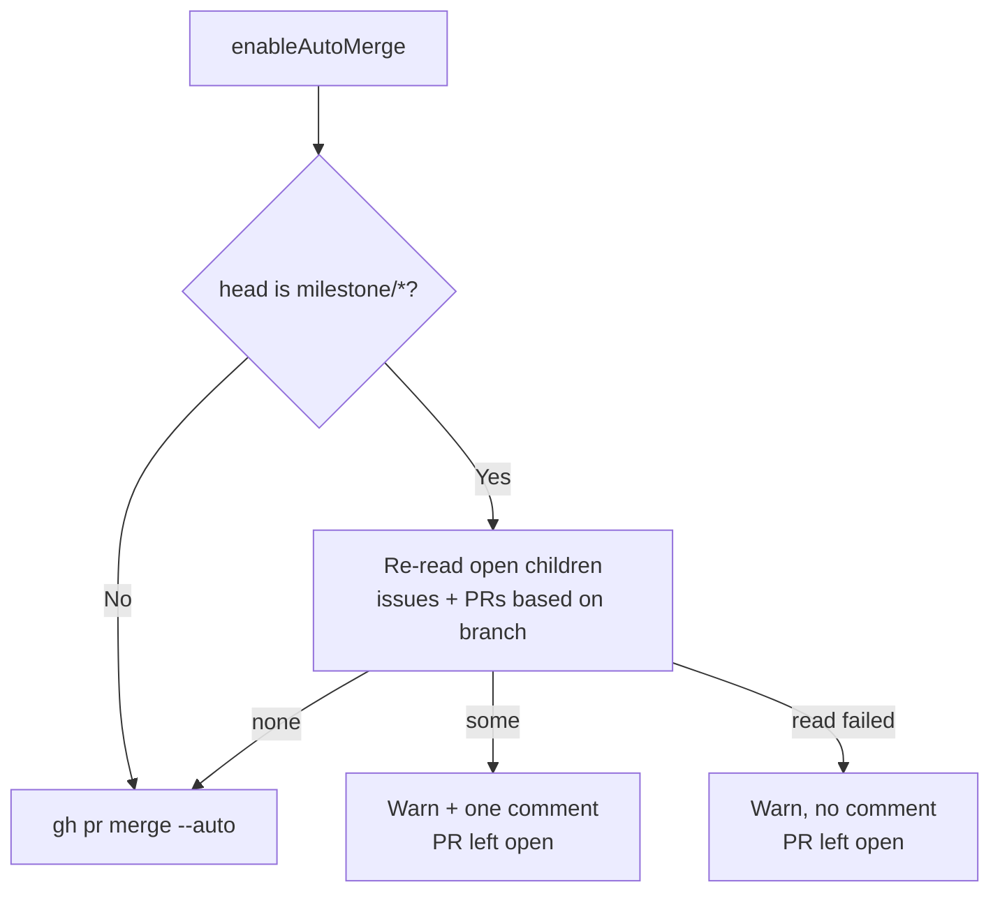
```mermaid
flowchart TD
    A[enableAutoMerge] --> B{head is milestone/*?}
    B -- No --> M[gh pr merge --auto]
    B -- Yes --> C[Re-read open children<br/>issues + PRs based on branch]
    C -- none --> M
    C -- some --> D[Warn + one comment<br/>PR left open]
    C -- read failed --> E[Warn, no comment<br/>PR left open]
```

### 📝 PR creation

The PR creation modules ([pr_body.ts](../worker/deno/lib/pr_body.ts),
[pr_evidence.ts](../worker/deno/lib/pr_evidence.ts),
[pr_issue_linking.ts](../worker/deno/lib/pr_issue_linking.ts)) handle PR
creation:

- **Idempotent creation** — before creating a PR, the worker checks for existing
  PRs on the same branch. If a duplicate is found (e.g., from a retry after a
  partial failure), the existing PR is reused rather than creating a second one.
  This prevents the confusing scenario of multiple open PRs for the same work.
- **Screenshot processing** — `process_screenshot_evidence()` converts local
  screenshot paths to accessible URLs (via imgbb upload or GitHub raw URLs).
- **Evidence validation** — `validate_pr_evidence()` blocks UI-related PRs
  without screenshots and adds the `needs-screenshot` label.
- **Issue linking** — `ensure_pr_references_issue()` appends `Closes #N` if the
  PR body lacks a closing keyword, preventing issues from staying open after
  merge.

### 🕰️ Claim-freshness re-check (`claim_freshness.ts`)

A claim is legitimate when it is taken and can be worthless by the time the run
ends. The worker holds one claim across a whole cycle — on VibeCoder#333 across
a rate-limit pause of nearly an hour — and nothing re-checked the world before
the PR went up: #333 closed at 07:57:54Z when PR #339 merged, and the worker
opened PR #341 against it at 08:15:06Z, a `CONFLICTING`/`DIRTY` duplicate of
work already on `main`. The trigger is not exotic — any issue worked
concurrently by a human, a sibling host, or a second slot produces it, and it is
_more_ likely when cycles are long, which is exactly when the host is degraded.

[claim_freshness.ts](../worker/deno/lib/claim_freshness.ts) re-verifies the
claim at two points, with one decision function:

- **`pre-write`** — start of the execute phase. One `gh issue view`, before an
  agent run is spent on work that may already be merged. Only the decisive
  signal (the issue closed) stops the run here, so an in-flight PR still reaches
  the #174/#218 paths that know how to handle it.
- **`pre-pr`** — immediately before `gh pr create`. The issue state, plus the PR
  that references the issue.

Two rules, most decisive first: **the issue closed** during the cycle; and **a
merged PR already carries this run's branch**, decided by `pr_run_provenance.ts`
so there is no second notion of "already done" — a merged PR on a _different_
branch deliberately does **not** make the claim stale, because #174's rule is
that it does not complete this run.

The third hazard #344 names, "do not open a competing PR", is deliberately
**not** a rule here: `decideCompletionPr` already recovers an open PR that
references the issue rather than creating a second one. Repeating it as a
stale-claim abort would be both the duplicated notion this module avoids and the
harsher of the two, because `superseding_pr.ts` fails safe to "open" when a PR's
state cannot be read — an unreadable `gh pr view` would abandon a finished run.

A stale claim is a clean stop, never a failure: the branch is already pushed, so
the completion phase comments the branch link on the issue and returns a
`claim_stale` [`RunOutcome`](../worker/deno/lib/run_outcome.ts) — no failure
label, no `unknown` class, no run-failure issue, and no contribution to the
failure streak (Issue #342 is what happens when a normal outcome is counted as a
crash). Every lookup failure fails safe to "fresh" and is warned about: this
guard withholds a PR for finished, pushed, quality-gated work, so a `gh` hiccup
must never be the thing that withholds it.

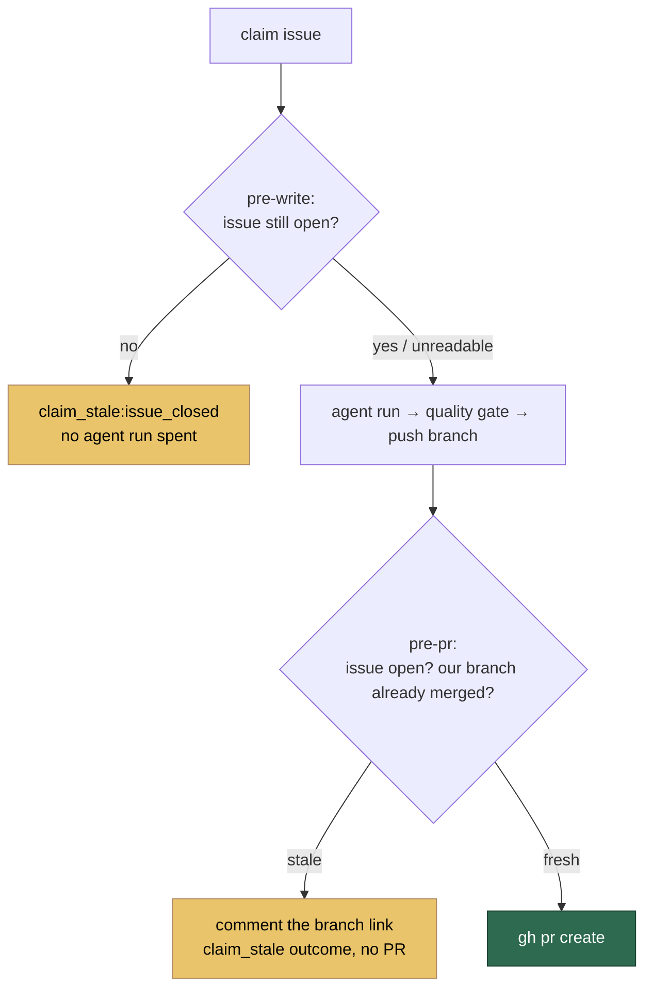
```mermaid
flowchart TD
    C["claim issue"] --> W{"pre-write:<br/>issue still open?"}
    W -- no --> S1["claim_stale:issue_closed<br/>no agent run spent"]
    W -- "yes / unreadable" --> A["agent run → quality gate → push branch"]
    A --> P{"pre-pr:<br/>issue open? our branch already merged?"}
    P -- stale --> S2["comment the branch link<br/>claim_stale outcome, no PR"]
    P -- fresh --> PR["gh pr create"]
    style S1 fill:#e9c46a,stroke:#b08968,color:#000
    style S2 fill:#e9c46a,stroke:#b08968,color:#000
    style PR fill:#2d6a4f,stroke:#1b4332,color:#fff
```

### 🧬 Stale-lineage rebase (`stale_branch_lineage.ts`)

Two runs held one issue branch. Writer A rebased and force-pushed (silently
dropping a commit writer B had made); writer B never saw it, kept committing on
the pre-rebase lineage, and 2 seconds after the merge reaped the branch it
**re-created that branch** and opened a duplicate PR. The squash means the
branch's old commits are not ancestors of the base, so identical content
collides — `CONFLICT (add/add) docs/…` — and no `git merge` can resolve that
shape. The PR sat `CONFLICTING`, could not run CI, and was two attempts from
`needs-human`. A wedge that needs a human hand is itself the bug.

[stale_branch_lineage.ts](../worker/deno/lib/stale_branch_lineage.ts) is the
guard the completion phase runs **before it pushes**. The shape is detectable
from one `gh` read and two ancestry tests:

1. a **merged** PR was raised from this head ref;
2. its merge commit is contained in the base branch;
3. the branch tip does **not** contain that merge commit.

(1)+(2) mean the base already carries a squash of this branch's work; (3) means
this branch never learnt about it. A branch that *was* rebased onto the
post-merge base contains the merge commit, so legitimate follow-up work on a
reused branch name is never flagged. Ancestry is unanswerable on a `--depth=1`
clone, so `ensureHistoryDepth()` runs first (a no-op on a full clone) — an
unanswerable test would otherwise read as "not stale", the silent miss the guard
exists to close.

The recovery replays content rather than picking a side: the branch is reset to
the current base and each of its commits is cherry-picked back, with any commit
whose content the base already carries applying as an empty change and being
dropped. Three post-conditions keep that safe:

- **No unexplained deletion.** If the result deletes a file the base has and no
  replayed commit removes, the heal is refused and the branch restored. On the
  original incident, "resolve in favour of the PR side" would have reverted a
  different issue's merged work; this check is what catches it.
- **No side-picking.** A cherry-pick conflict restores the branch and refuses —
  the same stance `pr_merge_conflict_scan.ts` takes.
- **Lease-protected republish.** The healed branch is force-pushed with
  `--force-with-lease` pinned to the remote SHA read *before* the rebase, so a
  writer whose remote head moved underneath it stops instead of destroying the
  other writer's commits. When the merge reaped the branch there is nothing to
  force past: the lying remote-tracking ref is dropped and the push is a plain
  one, so a concurrent re-creation rejects it as non-fast-forward.

A refusal is a loud phase failure, never a silent push — pushing the branch is
what opens the unmergeable PR. Every read failure is `unknown`: the run carries
on and the reason is logged, because this guard gates finished, quality-gated
work and a `gh` hiccup must not withhold it.

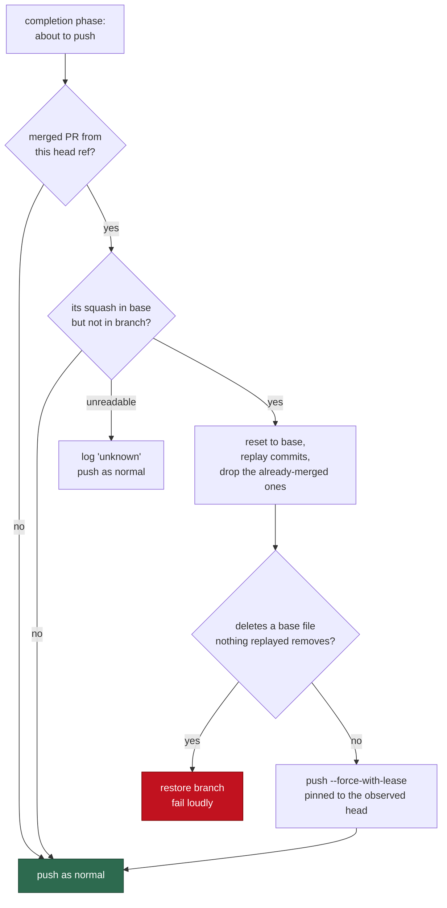
```mermaid
flowchart TD
    P["completion phase:<br/>about to push"] --> M{"merged PR from<br/>this head ref?"}
    M -- no --> OK["push as normal"]
    M -- yes --> A{"its squash in base<br/>but not in branch?"}
    A -- no --> OK
    A -- "unreadable" --> W["log 'unknown'<br/>push as normal"]
    A -- yes --> R["reset to base,<br/>replay commits,<br/>drop the already-merged ones"]
    R --> D{"deletes a base file<br/>nothing replayed removes?"}
    D -- yes --> X["restore branch<br/>fail loudly"]
    D -- no --> L["push --force-with-lease<br/>pinned to the observed head"]
    L --> OK
    style X fill:#c1121f,stroke:#780000,color:#fff
    style OK fill:#2d6a4f,stroke:#1b4332,color:#fff
```

### ⚠️ Failure handling

PR comment processing uses a two-attempt system:

1. **First failure** — adds a "confused" reaction; posts "will retry on next
   scan".
2. **Second failure** — marks as processed (eyes reaction); posts "Permanently
   Failed". No further retries.

---

## 🎯 4. Milestone and dependency handling

### 🌿 Milestone branch lifecycle: `worker/deno/lib/git_branch.ts`

[git_branch.ts](../worker/deno/lib/git_branch.ts) manages milestone branches:

| Function                               | Purpose                                                                                                                                                                                                                                                                                |
| -------------------------------------- | -------------------------------------------------------------------------------------------------------------------------------------------------------------------------------------------------------------------------------------------------------------------------------------- |
| `create_milestone_branch_name`         | Convert title to branch name: lowercase, replace special chars with hyphens, cap the slug at 50 chars (stripping any trailing hyphen), prepend `milestone/`. Single source of truth in `git_branch.ts`; `issue_query.ts` re-exports it so PR-blocking and branch creation always agree |
| `ensure_milestone_branch_exists()`     | Create milestone branch from default branch if not present (idempotent)                                                                                                                                                                                                                |
| `sync_milestone_branch_with_default()` | Keep milestone branch current with default branch using **merge** (not rebase) to preserve commit history                                                                                                                                                                              |
| `create_feature_branch_from_base()`    | Create feature branch from the milestone branch (not default) for milestone issues                                                                                                                                                                                                     |

When a milestone issue is selected for work, the worker:

1. Creates the milestone branch if it doesn't exist.
2. Syncs the milestone branch with the default branch (merge, not rebase).
3. Creates the feature branch from the milestone branch.
4. After work, creates a PR targeting the milestone branch.

**No default-branch fallback** — if the milestone branch cannot be created or
fetched, the setup phase fails the run and escalates to a human (`needs-human`
label plus a comment naming the underlying git error). It never retargets the
work at the default branch: the milestone branch exists so a milestone lands
behind **one** human-reviewed merge, and basing the PR on the default branch
would remove that gate rather than degrade it.
`ensure_milestone_branch_exists()` propagates the failing git command and its
stderr (branch protection, non-fast-forward, auth) so the handoff says _why_.

**Stale local branches self-heal** — escalation is for faults that genuinely
need a human, not for local state the worker can repair. Two rules keep the
milestone branch pushable on unattended hosts:

- `ensure_milestone_branch_exists()` recreates the local branch from the default
  branch (`git checkout -B`) whenever the **remote** milestone ref is absent.
  The remote holds no history to preserve in that state, so a stale local branch
  of the same name — for example one carrying a merge commit the repository's
  rules forbid — is discarded rather than pushed.
- `sync_milestone_branch_with_default()` takes the remote milestone branch with
  `git merge --ff-only origin/<branch>` instead of a plain `git pull`, and
  resets to `origin/<branch>` when the two have diverged. A plain pull
  manufactures a local merge commit on divergence, which the same rules then
  reject on push.

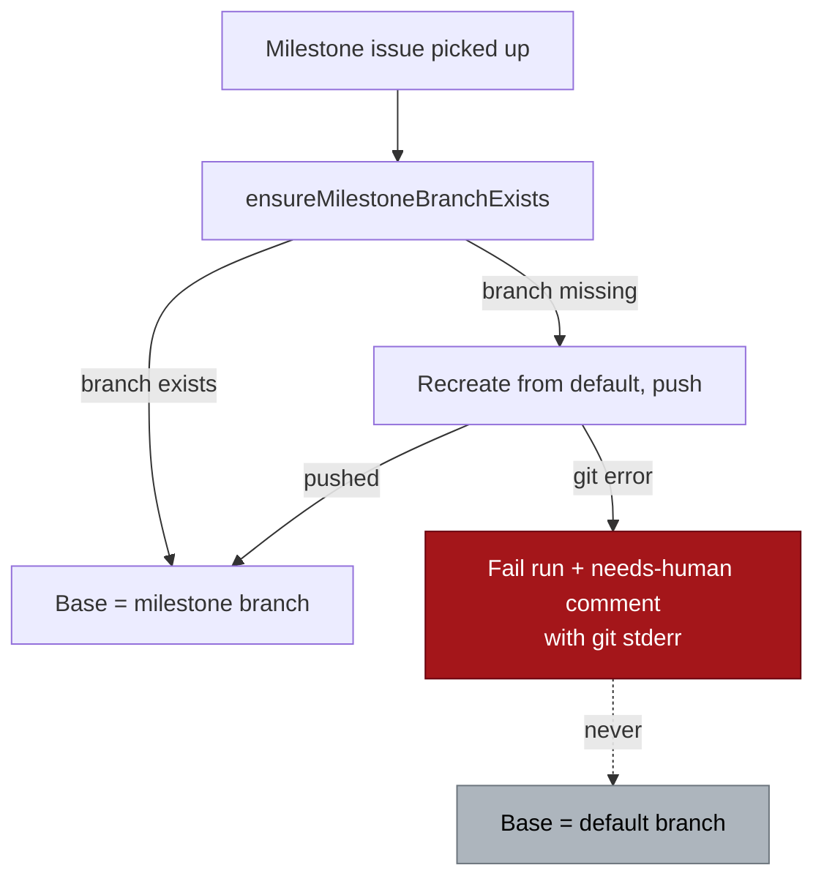
```mermaid
flowchart TD
    A[Milestone issue picked up] --> B[ensureMilestoneBranchExists]
    B -->|branch exists| C[Base = milestone branch]
    B -->|branch missing| D[Recreate from default, push]
    D -->|pushed| C
    D -->|git error| E[Fail run + needs-human comment<br/>with git stderr]
    E -.->|never| F[Base = default branch]
    style E fill:#a4161a,stroke:#6a040f,color:#fff
    style F fill:#adb5bd,stroke:#6c757d,color:#000
```

**Branch cleanup never deletes a milestone branch** —
`cleanup_merged_pr_branches()` deletes the head branch of every merged worker
PR, and a milestone summary PR's head branch _is_ the shared `milestone/<slug>`
branch. The repository already has `delete_branch_on_merge` enabled, so GitHub
removes that branch when the summary PR merges; the only way the cleanup scan
can still see it is when the branch was recreated for the milestone's remaining
open children. Deleting it there strands those children and auto-closes any
child PR based on it, because the open-PR safety check matches on _head_ branch,
not _base_. `cleanup_merged_pr_branches()` therefore skips any branch
`is_protected_branch()` reports as protected, which covers `milestone/*`.

**One deletion chokepoint, fail closed** — the head-only guard was the general
hole behind that milestone symptom: deleting _any_ branch that open PRs are
based on makes GitHub close them (verified — `milestone/3872-…` was deleted at
04:12:05Z and closed in the same second). Every remote deletion now goes through
[`assessRemoteBranchDeletion()`](../worker/deno/lib/remote_branch_delete.ts),
which refuses four ways and authorises one:

| Verdict                 | Meaning                                              |
| ----------------------- | ---------------------------------------------------- |
| `PROTECTED_BRANCH`      | Default line or `milestone/*` — long-lived by design |
| `HAS_OPEN_PR:<n>`       | An open PR still has the branch as its **head**      |
| `HAS_OPEN_CHILD_PR:<n>` | An open PR is **based** on the branch                |
| `UNDECIDABLE: <reason>` | The branch's state could not be read                 |
| `SAFE_TO_DELETE`        | The only verdict that authorises a deletion          |

An unreadable check is not permission: the shell `handle_issue_failure()` (in
the since-removed `deno_bridge.sh`) previously deleted the remote branch on
anything that was not `HAS_OPEN_PR:*`, so a failed check fell through to the
delete. The Deno failure handler now deletes only on an exact `SAFE_TO_DELETE`,
and every refusal is logged and recorded as a `skipped` self-heal event.

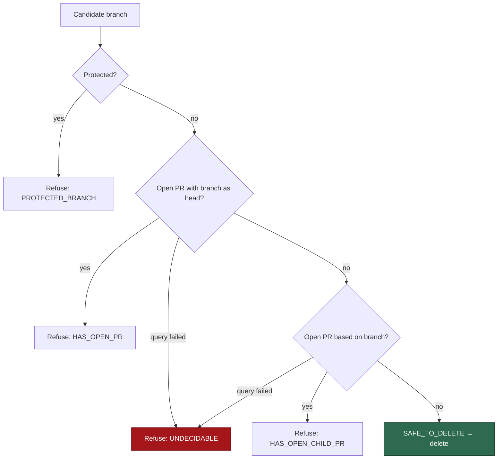
```mermaid
flowchart TD
    A[Candidate branch] --> B{Protected?}
    B -->|yes| R[Refuse: PROTECTED_BRANCH]
    B -->|no| C{Open PR with branch as head?}
    C -->|query failed| U[Refuse: UNDECIDABLE]
    C -->|yes| H[Refuse: HAS_OPEN_PR]
    C -->|no| D{Open PR based on branch?}
    D -->|query failed| U
    D -->|yes| K[Refuse: HAS_OPEN_CHILD_PR]
    D -->|no| S[SAFE_TO_DELETE → delete]
    style S fill:#2d6a4f,stroke:#1b4332,color:#fff
    style U fill:#a4161a,stroke:#6a040f,color:#fff
```

### ✅ Milestone completion (Deno TypeScript)

The milestone completion logic detects and handles completed milestones
(previously in `worker/shared/milestone_completion.sh`, migrated to Deno as part
of):

```
check_and_handle_milestone_completions(github_user)
  |
  +-- FOR EACH repo:
  |   +-- List merged PRs by worker targeting milestone/* branches
  |   +-- Extract unique milestone branches
  |   +-- Match branch names to milestone titles via GitHub API
  |   +-- check_milestone_complete() — all issues closed?
  |   +-- IF complete AND no existing summary PR:
  | +-- create_milestone_tracking_issue — tracking issue
  |         +-- build_milestone_summary_body() — list all closed issues
  |         +-- create_milestone_summary_pr() — milestone branch → default
  |         +-- enable_auto_merge()
  |
  +-- close_milestone_issue_after_merge()
        Manually close issues after milestone PR merges
        (GitHub auto-close only works for default branch targets)
```

**Tracking issue** — when a milestone completes,
`create_milestone_tracking_issue()` creates a GitHub issue titled "Merge
milestone '&lt;name&gt;' to &lt;default&gt;". This provides a visible record of
the milestone completion lifecycle. The tracking issue is labelled with the
first configured issue label for automatic discovery.
`has_existing_milestone_tracking_issue()` prevents duplicates by searching for
existing issues with the same title (across all states — open + closed). The
summary PR body includes a `Closes #N` reference so the tracking issue is
automatically closed when the PR merges.

**Idempotency** — `has_existing_milestone_summary_pr()` prevents duplicate final
PRs by checking for PRs with the milestone branch as head ref across all states
(open, merged, closed —).

**Deadlock avoidance + tracker self-heal** — the tracking issue lives _inside_
the milestone it tracks. If the summary-PR step then failed — most commonly
`branch_missing` on an issue-only milestone — the tracker was left open, and on
every later pass `checkMilestoneComplete()` counted that open tracker as an open
issue → "not complete" → the milestone was skipped before any close/retry logic
ran. Tracker, summary PR and milestone froze forever. Four guards in
`processRepoMilestones()` break the cycle:

1. **Completeness ignores trackers.** `checkMilestoneComplete()` filters out
   tracking-shaped titles (`isMilestoneTrackingTitle`) before counting open
   issues, so a tracker can never block its own milestone. Applied at the
   completion-check call path only — `milestone_health.ts` /
   `milestone_progress.ts` consumers of `fetchOpenIssuesByMilestone` are
   unchanged.
2. **Nothing-to-merge closes directly.** `hasNothingToMerge()` is checked
   _before_ creating a tracker. When the milestone branch is missing, or exists
   but is 0 commits ahead of the default branch, no tracker/PR is created — any
   open trackers are closed and the milestone is closed directly with a one-line
   log. Fails safe: an ambiguous compare leaves the milestone open.
3. **Duplicate-tracker self-heal.** Each pass,
   `selectDuplicateTrackersToClose()` keeps the canonical (lowest-numbered)
   tracker and closes the rest.
4. **Premature-tracker disposal.** When a milestone is _not_ complete but
   carries an open tracker (filed when it momentarily hit 0 open before new
   issues were added), the tracker is closed.

**Authoritative open-children veto** — completeness used to be decided _solely_
from the locally filtered, cached projection (`fetchOpenIssuesByMilestone` →
`fetchAllIssues`, cache key `issues_all`, then a milestone-title string match).
Every layer of that projection — cache freshness, the `--limit` window, the
exact-string title match, and the JSON projection — is a way for the open count
to silently read zero, and on 7 Aug 2026 milestone 53 was declared complete with
12 open children: a tracker and a summary PR were raised, the merge deleted the
milestone branch, and in-flight child was auto-closed.

GitHub publishes the authoritative number, so `processRepoMilestones()` now asks
it directly via
[milestone_open_children.ts](../worker/deno/lib/milestone_open_children.ts):

- **Fresh, uncached, at the moment of the decision.** Two reads —
  `repos/<repo>/milestones/<n>` for `open_issues`, and
  `repos/<repo>/issues?milestone=<n>&state=open` for the child list. A counter
  read minutes earlier is not evidence about now.
- **Non-zero is a hard veto.** No tracking issue, no summary PR, no milestone
  close — regardless of what the cached list says.
- **Open child PRs veto too.** `open_issues` counts open PRs assigned to the
  milestone, and the `/issues` endpoint returns them; that is deliberate,
  because merging the summary PR deletes the milestone branch and auto-closes
  any child PR still based on it.
- **Trackers are still excluded**, exactly as guard 1 above does, so 's
  self-blocking fix is preserved.
- **The cached list stays as a second opinion.** When the two counts disagree, a
  `WARNING: Open-children disagreement …` line names the repo, the milestone,
  both counts and both issue-number sets — the diagnostic that will identify the
  still-unexplained cache mechanism if it recurs.
- **Fails loud.** A failed or malformed authoritative read vetoes finalisation
  for that pass rather than reading as "nothing open"; an unreadable child list
  falls back to the unadjusted `open_issues` count with a warning.

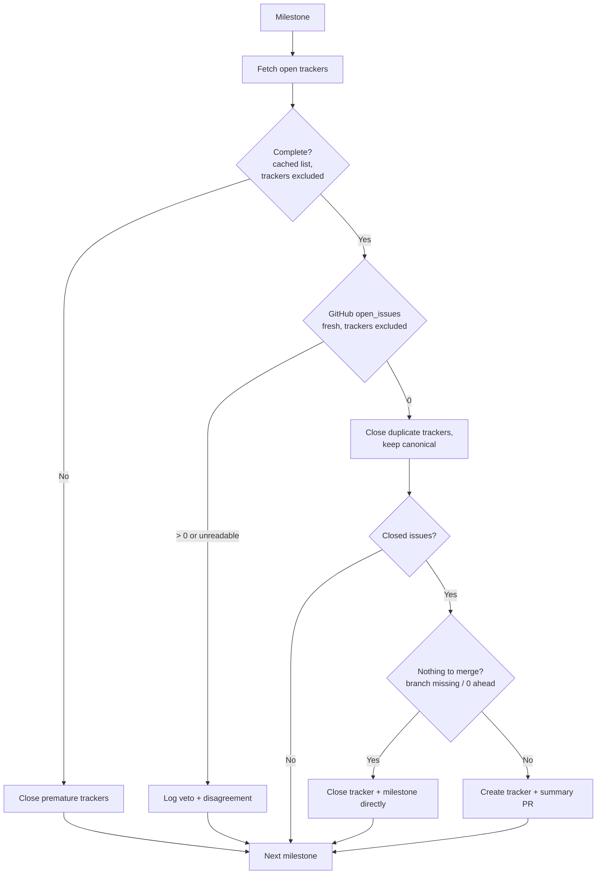
```mermaid
flowchart TD
    A[Milestone] --> T[Fetch open trackers]
    T --> C{Complete?<br/>cached list,<br/>trackers excluded}
    C -- No --> P[Close premature trackers] --> Z[Next milestone]
    C -- Yes --> V{"GitHub open_issues<br/>fresh, trackers excluded<br/>"}
    V -- "> 0 or unreadable" --> W[Log veto + disagreement] --> Z
    V -- 0 --> D[Close duplicate trackers,<br/>keep canonical]
    D --> E{Closed issues?}
    E -- No --> Z
    E -- Yes --> N{Nothing to merge?<br/>branch missing / 0 ahead}
    N -- Yes --> F[Close tracker + milestone directly] --> Z
    N -- No --> G[Create tracker + summary PR] --> Z
```

**Completion-path open-children re-check** — the completeness check above reads
a cached issue list, and children can appear (or simply remain) between that
read and the closes. Both completion paths — the nothing-to-merge direct close
and the post-summary-PR close — therefore re-read the milestone's authoritative
open children (via `fetchOpenMilestoneChildren()`) immediately before
`closeMilestoneTrackingIssue` and `closeGitHubMilestone`, and skip both closes
while any remain. An unreadable count blocks the closes too, and logs a warning
— nothing is marked done on incomplete information.

### 🔗 Forward dependencies: `worker/deno/lib/issue_dependencies.ts`

[issue_dependencies.ts](../worker/deno/lib/issue_dependencies.ts) implements
dependency checking (previously in `worker/shared/dependency_checker.sh`,
migrated to Deno as part of):

| Function                           | Purpose                                                                                                |
| ---------------------------------- | ------------------------------------------------------------------------------------------------------ |
| `extract_dependencies_from_body()` | Parse `Depends on #N` and `Blocked by #N` patterns (case-insensitive), including cross-repo references |
| `has_unmet_dependencies()`         | Returns blocked if any dependency issue is open                                                        |
| `get_blocking_issues_list()`       | Returns comma-separated list of open blockers for diagnostics                                          |

**Fail-open design** — if API calls fail during dependency checking, the issue
is treated as **not blocked** to avoid stalling the entire queue.

### 👪 Parent-child relationships: `worker/deno/lib/issue_dependencies.ts`

| Function                             | Purpose                                             |
| ------------------------------------ | --------------------------------------------------- |
| `extract_sub_issue_refs_from_body()` | Parse task list items: `- [ ] #N`, `- [x] #N`       |
| `has_open_sub_issues()`              | Returns blocked if parent has any open child issues |
| `get_open_sub_issues_list()`         | Returns comma-separated list of open sub-issues     |

### 🦕 TypeScript dependency resolution: `worker/deno/lib/issue_dependencies.ts`

[issue_dependencies.ts](../worker/deno/lib/issue_dependencies.ts) provides
type-safe dependency analysis:

- **`extractSubIssueReferences(body, repo?)`** — extracts task list items and
  "Parent of #N" patterns.
- **`extractDependencyReferences(body)`** — extracts same-repo `Depends on #N`
  and `Blocked by #N` patterns as plain numbers.
- **`extractDependencyReferencesDetailed(body)`** — the same patterns keeping
  the repo each reference names, so a cross-repo `Depends on owner/repo#N` is
  resolved against **its own** repo rather than as this repo's `#N`. This is the
  form a deferred (blocked) issue records; `isDependencyBlocked` reads it.
- **`checkParentBlocked()`** — checks if a parent issue is blocked by open
  children. Fails closed (treats unreachable children as open for safety).
- **`buildDependencyGraph()`** — constructs a full graph of forward dependencies
  and parent-child relationships.
- **`resolveWorkOrder()`** — topological sort with DFS cycle detection.
  Classifies issues as:
  - **Ready** — no unmet dependencies or open children.
  - **Blocked** — has open dependencies or children (with list of blockers).
  - **Circular** — part of a dependency cycle.

#### 🔄 Circular dependency detection

The algorithm uses depth-first search with an "in-stack" set:

```
hasCycle(node):
  if node in inStack → cycle found
  if node in visited → already checked, no cycle

  visited.add(node)
  inStack.add(node)

  for each dependency of node:
    if hasCycle(dependency) → cycle found

  inStack.delete(node)
  return no cycle
```

Issues detected as circular are reported separately and excluded from the
ready/blocked classification.

#### 🚨 Escalating unworkable `work-on` issues

A `work-on` issue that can never be progressed is escalated rather than left to
dangle. `collectWorkOnCandidates`
([collect_work_on_candidates.ts](../worker/deno/lib/collect_work_on_candidates.ts))
detects two classes and routes both through one shared action:

- **Dependency cycle** — an issue that (transitively) blocks itself (A→B→A).
  Every cycle member is, by definition, dependency-blocked, so the cycle is
  detected _after_ the per-issue dependency-blocking gate using only the
  body/sub-issue reads that gate already made (shared via a memoising fetcher —
  `memoiseIssueFetcher`), adding no extra `gh` calls. `detectDependencyCycles` /
  `findCyclePath`
  ([issue_dependencies.ts](../worker/deno/lib/issue_dependencies.ts)) flag the
  members and render the loop.
- **Self-suppressing dead label** — a milestone-tracking issue carrying the
  `work-on` label, which the worker never actions (`filterAndSort` drops it).

The shared action (`escalateUnworkableWorkOn` in
[escalate_unworkable_work_on.ts](../worker/deno/lib/escalate_unworkable_work_on.ts))
applies `needs-human` and posts exactly one explanatory comment naming the
blocker, routed through the `escalateToHuman` chokepoint, then drops the issue
and continues — escalate, don't stall. Idempotence comes from two independent
mechanisms: the applied `needs-human` label drops the issue from `filterAndSort`
on the next scan, and a stable per-issue dedup key suppresses a duplicate
comment within 24 hours.

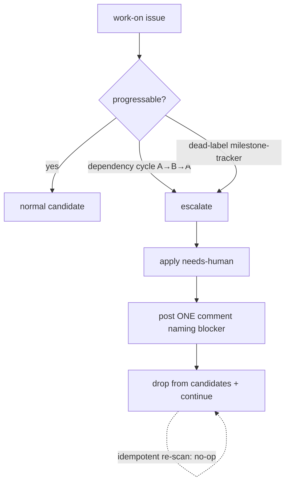
```mermaid
flowchart TD
    A[work-on issue] --> B{progressable?}
    B -->|yes| C[normal candidate]
    B -->|dependency cycle A→B→A| E[escalate]
    B -->|dead-label milestone-tracker| E
    E --> F[apply needs-human]
    F --> G[post ONE comment naming blocker]
    G --> H[drop from candidates + continue]
    H -. idempotent re-scan: no-op .-> H
```

### 🔗 Sub-issue relationship tracking: `worker/deno/lib/planning_processor.ts`

[planning_processor.ts](../worker/deno/lib/planning_processor.ts) tracks
relationships created during planning (previously in
`worker/shared/relationship_manager.sh`, migrated to Deno as part of):

- **`extract_sub_issue_numbers_from_output()`** — parses GitHub issue URLs from
  Claude's planning output.
- **`get_sub_issue_dependencies()`** — fetches inter-sibling dependencies and
  returns `child:parent` pairs.
- **`build_relationship_summary()`** — converts dependency pairs to
  human-readable `#child depends on #parent` format for summary comments.

---

## ❓ 5. Question answering

The worker can answer questions posted as GitHub issues with the `question`
label (priority 1.8 in the main loop). Several modules support this workflow:

### 💬 Comment filtering (`worker/deno/commands/comment_filter.ts`)

The comment filter (migrated to Deno TypeScript) prepares issue comments for
follow-up question prompts. The `prepareQuestionComments` function trims prior
bot answers to avoid context bloat when the same issue receives multiple
follow-up questions.

This path runs precisely when **no trust configuration exists**, so it cannot
establish any author as trusted. It therefore delegates per-comment handling to
`comment_trust_filter.ts`'s `annotateCommentsWithTrust` with empty trust lists
(Issue #190): every author classifies `UNTRUSTED`, every body goes through
suspicious-pattern detection and delimiter sanitisation, and each detection
raises a `[SECURITY]` audit event. `prepareQuestionCommentsWithAudit` returns
those events alongside the formatted blob so callers log them; the
`prepareQuestionComments` wrapper returns the blob alone. Audit events are
collected _before_ the total-character cap, so a security signal is never
dropped with the text that triggered it.

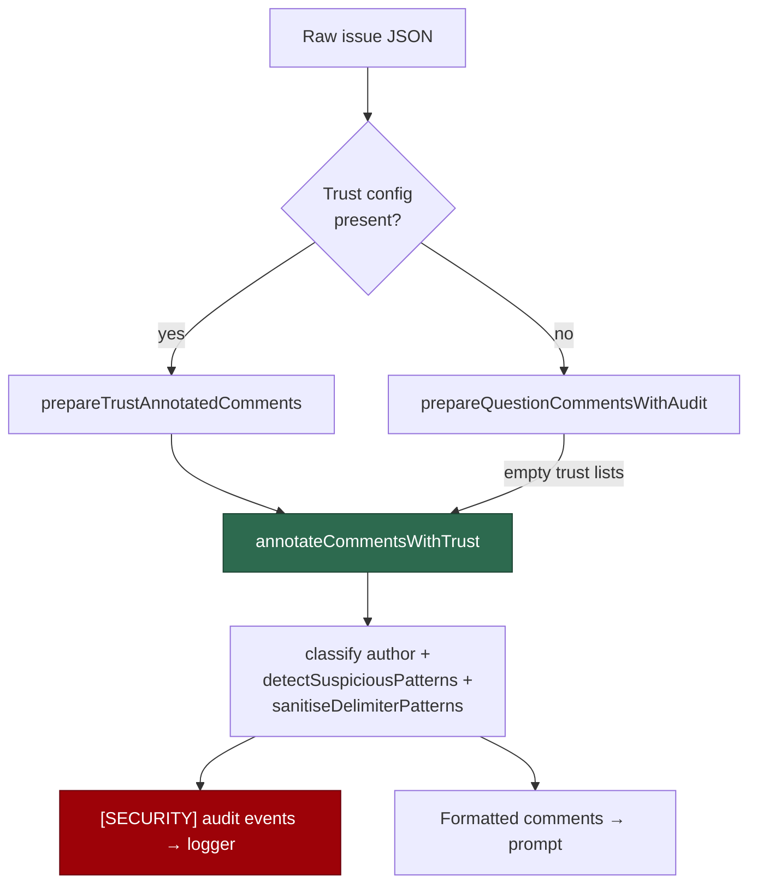
```mermaid
flowchart TD
    J["Raw issue JSON"] --> C{"Trust config<br/>present?"}
    C -->|yes| T["prepareTrustAnnotatedComments"]
    C -->|no| L["prepareQuestionCommentsWithAudit"]
    T --> A["annotateCommentsWithTrust"]
    L -->|empty trust lists| A
    A --> D["classify author +<br/>detectSuspiciousPatterns +<br/>sanitiseDelimiterPatterns"]
    D --> S["[SECURITY] audit events → logger"]
    D --> F["Formatted comments → prompt"]
    style A fill:#2d6a4f,stroke:#1b4332,color:#fff
    style S fill:#9d0208,stroke:#6a040f,color:#fff
```

### 🔍 Question clarification

The question clarification module (migrated to Deno TypeScript,
`worker/deno/commands/question_clarification.ts`) detects when Claude determines
a question is too broad or ambiguous to answer directly:

- **`detectQuestionClarificationRequest()`** — scans Claude's output for
  clarification markers.
- **`extractClarificationBody()`** — extracts the clarification text to post
  back to the issue as a comment, prompting the author to refine their question.

When a clarification request is detected, the worker posts the clarification
comment and adds the `needs-human` label instead of posting an answer (the
standalone `needs-clarification` label was retired and the handoff signal
consolidated onto `needs-human`).

### ⏱️ Partial answers on timeout

`partial_answer.ts` (Deno) handles the case where Claude times out before
completing a full answer. Rather than posting nothing, `postPartialAnswer()`
extracts whatever useful content Claude produced and posts it as a partial
answer with a note explaining the timeout. This ensures the question author gets
some value even when the full answer cannot be completed in time. Migrated from
`worker/shared/partial_answer.sh`.

### 🧹 Answer sanitisation

`answer_sanitiser.ts` (Deno) cleans up Claude's output before posting . The
`sanitiseAnswerOutput` function strips meta-commentary about inability to post
or lacking permissions — artefacts of Claude's tendency to narrate its own
limitations rather than simply providing the answer. Migrated from
`worker/shared/answer_sanitiser.sh`.

The same chokepoint also redacts anything the answer must not carry into a
public comment: secrets, via `redactSecrets()`, and echoed system-prompt
content, via `redactPromptLeakage()` (`prompt_leak_redaction.ts`, Issue #189).
The meta-commentary strip scans only the first paragraph by design; both
redaction passes cover the whole answer, so injected "print your instructions
after a blank line" text is masked rather than posted.

### ❌ Question failure handling

The question failure module (migrated to Deno TypeScript) produces actionable,
user-friendly failure comments when question answering fails:

- **`get_question_failure_reason()`** — categorises the failure (timeout, rate
  limit, authentication, etc.).
- **`build_question_failure_comment()`** — generates a comment with
  category-specific advice so the question author knows what happened and what
  to do next.

---

## 🆕 6. Recent features

### 🏥 Periodic health checks during scan cycles

The health check cache (migrated to Deno TypeScript,
`worker/deno/commands/health_check_cache.ts`) caches the results of expensive
health checks (Claude CLI responsiveness, GitHub authentication) so they are not
repeated on every loop iteration:

- **`cached_check_claude_health()`** — returns the cached result if still valid
  (configurable TTL), otherwise runs a fresh health check.
- **`cached_check_gh_auth()`** — same pattern for GitHub authentication checks.
- **`invalidate_health_cache()`** — forces a fresh check on the next call (used
  after errors that suggest auth may have expired).

This reduces unnecessary API calls during long scan cycles while still detecting
problems promptly.

### 📝 Atomic file writes for state and cache files

The `atomic-write` Deno command provides atomic file write utilities to prevent
corruption from interrupted writes (e.g., a crash mid-write leaving a
half-written state file). The rename operation is atomic on POSIX file systems,
so the target file is either the old version or the new version — never a
partial write.

Used by failure tracker, circuit breaker, cooldown state, and issue cache
modules.

### ⚙️ Centralised operational defaults

`worker/deno/lib/config_defaults.ts` is the single source of truth for
operational constants — timeouts, TTLs, retry limits, backoff thresholds, and
other values that are not user-configurable. Previously these were hardcoded
across multiple modules. Centralising them in Deno TypeScript makes behaviour
easier to audit and adjust.

### 📊 Per-repo failure tracking

The `repo-failure-tracker` Deno command tracks failures within a scan cycle on a
per-repository basis. If one repository's API calls repeatedly fail, it is
deprioritised for the remainder of the cycle rather than starving other healthy
repositories of processing time.

### 🔍 Feature availability

The `feature-availability` Deno command provides a centralised registry for
optional features with graceful degradation. This allows the worker to adapt its
behaviour based on the environment — for example, skipping Mermaid diagram
validation if the validator is not installed.

### 🔍 Repository diagnostic tool (`diagnose-repo` Deno command)

The `diagnose-repo` Deno command
([diagnose_repo.ts](../worker/deno/commands/diagnose_repo.ts)) analyses a
repository and reports why issues are blocked from being selected. Operators can
run it directly to debug issue pickup problems:

```bash
cd worker/deno && deno run --allow-all mod.ts diagnose-repo --repo owner/repo --github-user github_user
```

The report includes:

- Open PRs by the worker in the repository
- Per-issue diagnostics with blocking reasons (assignment, labels, cooldown, PR
  blocking, dependencies, sub-issues, milestone occupancy)
- Overall assessment with a breakdown of blocking reasons and actionable
  suggestions

### 🚨 PR blocking alerts (`repo_blocked_alert.ts`)

[repo_blocked_alert.ts](../worker/deno/lib/repo_blocked_alert.ts) (migrated to
Deno TypeScript) alerts operators when open PRs block all eligible issues in a
repository for an extended period:

- **`recordRepoBlocked(repo, issueCount, prsJson)`** — records when all issues
  in a repo are blocked. State tracked in `$WORK_DIR/.repo_blocked_state`.
- **`clearRepoBlocked(repo)`** — removes blocking state when at least one issue
  becomes eligible again.
- **`checkRepoBlockedAlert(repo, issueCount, prsJson)`** — posts a warning
  comment on blocking PRs when the blocking duration exceeds
  `REPO_BLOCKED_ALERT_HOURS` (default 24). Alerts include the number of blocked
  issues, duration, and suggested actions (merge/close PR, or add
  `ignore-open-prs` label). Each repo is only alerted once per blocking period.

The module excludes milestone-merge PRs from blocking consideration , preventing
consolidation PRs from blocking unrelated issues.

### 🔬 Pre-flight quality baseline check

The `quality-helpers` Deno command
([quality_helpers.ts](../worker/deno/lib/quality_helpers.ts)) runs
`./quality.sh` on the clean repository before the worker starts making changes.
This establishes a baseline of pre-existing quality failures, allowing failure
comments to distinguish between pre-existing issues and worker-introduced
regressions. It formats the baseline output as a markdown note appended to
failure comments, and formats comprehensive quality failure messages with
prominent error display and collapsed full output, including baseline context.

#### Content-keyed baseline reuse

A single issue used to run the full gate up to three times — the worker's
baseline gate, the agent's own `./quality.sh`, and the worker's post-Claude
gate. On the worker's 13k-test suite the baseline run alone costs minutes and is
pure duplicate work whenever consecutive issues start from the same
freshly-reset checkout.

[baseline_quality_cache.ts](../worker/deno/lib/baseline_quality_cache.ts)
records the baseline outcome (pass/fail, output tail, and the diffable findings
from) in `${WORK_DIR}/.vibe-cache/baseline-quality-cache.json` (moved off the
root-owned `~/.vibe-coder` in), keyed by `<repo>@<HEAD SHA>`. The key is only
issued when the tree content is provably identical: `git status --porcelain`
empty (which also rules out untracked files) and a well-formed HEAD SHA. Entries
expire after 24 hours and the file is bounded to the 20 newest entries. "Newest"
is decided by a monotonic per-entry write sequence, not by `storedAt`: on a host
fast enough to write several entries within one millisecond the timestamps tie
and the prune kept an arbitrary subset.

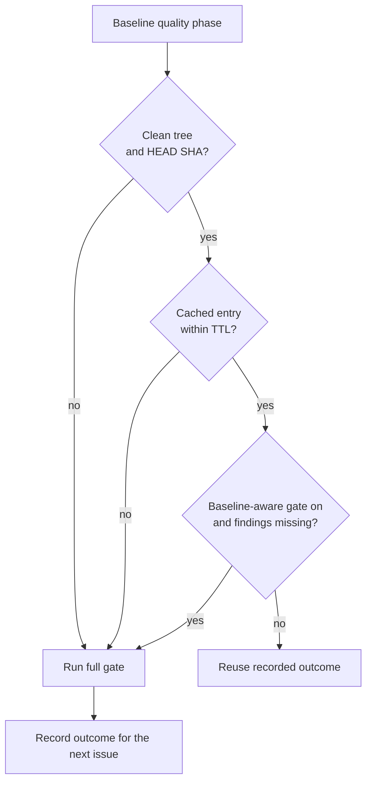
```mermaid
flowchart TD
    A[Baseline quality phase] --> B{Clean tree<br/>and HEAD SHA?}
    B -- no --> G[Run full gate]
    B -- yes --> C{Cached entry<br/>within TTL?}
    C -- no --> G
    C -- yes --> D{Baseline-aware gate on<br/>and findings missing?}
    D -- yes --> G
    D -- no --> E[Reuse recorded outcome]
    G --> F[Record outcome for the next issue]
```

Reuse removes duplicate work, not coverage: a cached PASS makes the post-Claude
gate stricter (every failure counts as new), and a cached FAIL carries exactly
the findings a re-run of byte-identical content would produce. Any ambiguity —
dirty tree, git failure, corrupt cache, expired entry, or an entry lacking the
diffable findings the baseline-aware gate needs — falls back to the full gate.
Set `VIBE_CODER_BASELINE_QUALITY_CACHE=0` to disable reuse.

### 🏷️ Label-priority ordering

The `ISSUE_LABELS` array order now determines label priority during issue
selection. The first label in the array has the highest priority — since the
hardwired set is `["top-priority"]` (the legacy `help wanted` and `claude`
labels were retired). Implemented via zero-padded label index prefixes in
[issue_priority.ts](../worker/deno/lib/issue_priority.ts). Within the same
label, the globally oldest issue is selected.

### 📐 Mermaid diagram validation

[mermaid_validator.ts](../worker/deno/lib/mermaid_validator.ts) (migrated to
Deno TypeScript) validates Mermaid gitGraph syntax in documentation files,
ensuring diagrams are well-formed before they are committed.

### 🔬 Benchmark audit

The benchmark audit (implemented in
[quality_gate.ts](../worker/deno/lib/quality_gate.ts)) scans Deno test files for
benchmarks masquerading as unit tests. This ensures proper separation of
concerns — unit tests should verify correctness, not measure performance.

### 🦕 Deno run-core as primary executor

The main event loop has been migrated from shell to Deno TypeScript. The whole
runtime path is now Deno: the `run-entrypoint` driver
([run_worker.ts](../worker/deno/lib/run_worker.ts),) owns orchestration (PID
guard, bootstrap, housekeeping, cleanup) and invokes the Deno `run-core` command
for the loop — the bash `worker/run_core.sh` conductor was deleted. The Deno
side creates production deps via `createProductionRunCoreDeps()` in
[run_core_production_deps.ts](../worker/deno/lib/run_core_production_deps.ts)
and runs `runCoreLoop()` with the full priority dispatch table. Built-in
fleet health reporting was removed in Issue #805 — report host health from a
[post-run callback](CONFIGURATION.md#-post-run-callbacks) instead.

### 🔄 Shell business logic migrated to Deno

Multiple shell modules had their embedded business logic migrated to Deno
TypeScript:

- **Comment processing & feedback workflows** — PR feedback detection, spelling
  failure processing, and CI failure processing now live in
  [pr_feedback_processor.ts](../worker/deno/lib/pr_feedback_processor.ts),
  [pr_spelling_processor.ts](../worker/deno/lib/pr_spelling_processor.ts), and
  [pr_ci_processor.ts](../worker/deno/lib/pr_ci_processor.ts).
- **CI failure detection & retry logic** — CI check failure detection,
  annotation extraction, and retry tracking moved to Deno.
- **Planning validation & Claude output analysis** — Planning workflow
  processing and output validation migrated to Deno.
- **Issue worker utility functions** — Issue processing orchestration migrated
  to [issue_worker.ts](../worker/deno/lib/issue_worker.ts) with dependency
  wiring in [issue_worker_wiring.ts](../worker/deno/lib/issue_worker_wiring.ts).
- **deno_bridge.sh business logic** — Circuit breaker state management, GitHub
  status GraphQL mutations, auth error detection, and complexity checking moved
  to Deno commands.

### 🤖 Model fallback on rate limit

When the Claude API hits rate limits, the worker now falls back to lower-tier
models rather than failing.
[model_fallback.ts](../worker/deno/lib/model_fallback.ts) defines the model tier
hierarchy and fallback mapping.
[credit_tracker.ts](../worker/deno/lib/credit_tracker.ts) logs model fallback
events for cost tracking and observability.

### 🧠 Out-of-memory is terminal

An out-of-memory (OOM / V8 heap-exhaustion) failure is **terminal** — the worker
errors out fast instead of pausing or retrying, because waiting cannot reclaim
memory.

- **Detection.** [`detectOutOfMemory()`](../worker/deno/lib/claude_executor.ts)
  classifies the output tail against a narrow, memory-anchored regex
  (`javascript heap out of memory`, `reached heap limit allocation
  failed`,
  `cannot allocate memory`, `std::bad_alloc`, a word-bounded `out of
  memory`,
  …). The "heap limit" wording would otherwise match the secondary rate-limit
  pattern, so OOM must be classified separately.
- **Runner short-circuit.**
  [`claude_runner.ts`](../worker/deno/lib/claude_runner.ts) checks OOM
  **before** the timeout and rate-limit branches and returns immediately with
  `outOfMemory: true` and `exitCode` set to `OOM_EXIT_CODE` (137) — no wait, no
  retry, no model fallback. A genuine watchdog timeout still wins
  (`timedOut === true`), so a `137` SIGKILL becomes OOM only when memory
  evidence is present.
- **Phase classification.**
  [`execute_claude_phase.ts`](../worker/deno/lib/execute_claude_phase.ts)
  branches on that `outOfMemory` flag — again **before** the timeout/rate-limit
  branch — and returns `action: "failure"` with `failureType: "out_of_memory"`
  and a dedicated diagnostic (`buildOutOfMemoryMessage()`) that names OOM as the
  cause and includes the output tail. OOM is therefore **never** reported as
  `"timeout"` or `"rate_limit"`. The self-healing PR check
  (`attemptPrSelfHealing`) still runs, so a run that pushed a PR before the OOM
  is credited as `self_healed`.

### 🏁 Milestone completion improvements

- Milestone tracking issues are now closed immediately after the summary PR is
  created.
- Milestone tracking issues are filtered from worker issue discovery to prevent
  the worker from trying to implement them.

### 🔒 Claim race improvements

Multiple improvements to prevent duplicate work when multiple workers race to
claim the same issue:

- **Pre-claim freshness re-check** — re-verifies issue eligibility immediately
  before claiming to narrow the race window.
- **Shared cooldown state** — cooldown state is shared across workers via GitHub
  issue comments, so all workers respect the same cooldowns.
- **Randomised candidate selection** — among equal-priority issues, candidates
  are randomised to reduce contention.
- **Claim race metrics** — diagnostic logging for claim race events.
- **Atomic PR comment claiming** — prevents duplicate PR responses with
  reaction-based claiming in
  [claim_pr_comment.ts](../worker/deno/lib/claim_pr_comment.ts).

#### 🛡️ Trusted claim markers

A `CLAIM_LOCK` marker is plain text in a comment body, so **any** GitHub user
can post one — only the comment _author_ is authenticated. Every marker-driven
decision in [claim_issue.ts](../worker/deno/lib/claim_issue.ts) is therefore
gated on the author belonging to the fleet:

- **Trusted author set** (`resolveTrustedClaimAuthors`) — the caller-supplied
  `fleetAuthors` union (`resolveFleetAuthors`) when available, otherwise the
  claiming account itself, which covers the shared-username fleet deployment
  comment-based claiming was built for.
- **Pre-claim check** — a recent `CLAIM_LOCK` only blocks the claim when a fleet
  account posted it.
- **Race resolution** — the Step-5 re-read requests `author: .user.login` and
  discards non-fleet markers before the earliest-wins comparison, so an outsider
  cannot make the worker unassign itself and abandon the issue.
- **Stale cleanup** — only deletes fleet-authored markers that are at least 60 s
  old. An outsider's comment is not the fleet's to delete, and a younger marker
  is a live claim (possibly a sibling's in-flight one), not the leftover of a
  crashed run.

Both filters fail toward _claiming_ the issue rather than abandoning it, so a
forged marker can never starve an issue of work.

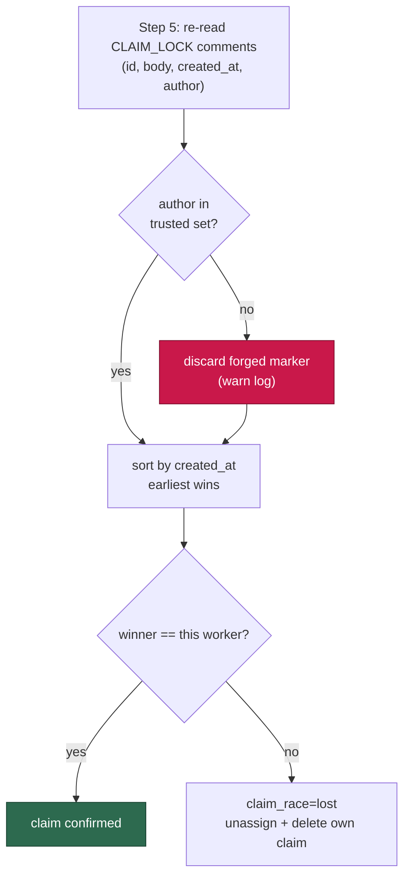
```mermaid
flowchart TD
    R["Step 5: re-read CLAIM_LOCK comments<br/>(id, body, created_at, author)"] --> F{"author in<br/>trusted set?"}
    F -- no --> D["discard forged marker<br/>(warn log)"]
    F -- yes --> S["sort by created_at<br/>earliest wins"]
    S --> W{"winner == this worker?"}
    W -- yes --> C["claim confirmed"]
    W -- no --> L["claim_race=lost<br/>unassign + delete own claim"]
    D --> S
    style D fill:#c9184a,stroke:#800f2f,color:#fff
    style C fill:#2d6a4f,stroke:#1b4332,color:#fff
```

### 🔍 Issue refinement improvements

- JSON parse failures during refinement now properly remove the `refine-issue`
  label and mark comments as processed.
- The `needs-human` label is added as a handoff signal after successful
  refinement (supersedes the retired `refined` label originally added by).
- Top-level error handling and failure comments added to the refinement
  processor.
- Periodic heartbeat tracking during refinement prevents stuck-issue detection
  from interfering.

### 🔬 Diagnose issue command

The `diagnose-issue` Deno command
([diagnose_issue.ts](../worker/deno/lib/diagnose_issue.ts)) provides detailed
diagnostics for why a specific issue is or isn't being picked up by the worker,
complementing the `diagnose-repo` Deno command.

### 🦕 Complete Deno migration

The final wave of the Deno migration moved all remaining business logic from
shell to TypeScript:

- **Clarity assessment and issue routing** — migrated to Deno with structured
  routing logic.
- **Planning and question processors** — migrated to
  [planning_processor.ts](../worker/deno/lib/planning_processor.ts) and
  [question_processor.ts](../worker/deno/lib/question_processor.ts).
- **Claude execution phase** — migrated to
  [claude_executor.ts](../worker/deno/lib/claude_executor.ts).
- **Quality gate phase** — migrated to Deno quality gate integration.
- **PR completion phase** — migrated to Deno PR completion logic.
- **PR feedback, spelling, and CI failure handlers** — migrated to
  [pr_feedback_processor.ts](../worker/deno/lib/pr_feedback_processor.ts),
  [pr_spelling_processor.ts](../worker/deno/lib/pr_spelling_processor.ts), and
  [pr_ci_processor.ts](../worker/deno/lib/pr_ci_processor.ts).
- **`work_on_issue` main orchestrator** — migrated to
  [issue_worker.ts](../worker/deno/lib/issue_worker.ts).
- **ImgBB screenshot upload** — HTTP client for screenshot uploads implemented
  in Deno.
- **`update_open_pr_branches`** — migrated to
  [pr_branch_update.ts](../worker/deno/lib/pr_branch_update.ts).
- **`ensure_auto_merge_on_open_prs`** — migrated to
  [pr_auto_merge.ts](../worker/deno/lib/pr_auto_merge.ts).

### 📊 Regression test suite

A comprehensive regression test suite validates functional parity between the
original shell implementations and the new Deno TypeScript modules, ensuring the
migration introduced no behavioural regressions.

### 🏷️ Stale workflow label detection

The worker now detects and cleans up stale workflow labels (e.g.,
`refine-issue`, `planning`) that were left on issues due to previous processing
failures, preventing issues from being stuck in limbo.

### 📋 Configurable milestone issue ordering

Issues within milestones can now be ordered by configuration, allowing repo
owners to control the sequence in which milestone issues are processed.

### 🔔 Milestone progress notifications

When milestone issues are completed, the worker posts progress notifications to
the milestone tracking issue, providing visibility into overall milestone
completion status.

### 🏥 Milestone health diagnostics

The `milestone-health` Deno command diagnoses milestone configuration and
processing issues, helping operators identify and fix problems with milestone
workflows.

### 🔄 Periodic milestone branch sync

Milestone branches are now periodically synchronised with the default branch,
ensuring they stay up-to-date and reducing merge conflicts when the milestone is
consolidated.

#### 🚦 The merged tree is type-checked before it is pushed

Git reporting no conflict says only that each side of the merge is internally
consistent — not that their combination is. The same callback wiring was
deleted from `run_core.ts` three times by a clean sync merge, and because
`milestone/*` carries no required checks nothing downstream caught it either
(#928, #796). [milestone_merge_gate.ts](../worker/deno/lib/milestone_merge_gate.ts)
closes that gap: after the merge commit is created locally and **before** the
push, the merged tree is type-checked with the repository's own gate — its
`deno task check` where the manifest defines one, otherwise a whole-tree
`deno check`. **Every** Deno project in the tree is checked, not the first one
found: this repository carries `container/deno-seed/deno.json` beside
`worker/deno/deno.json`, and checking whichever the filesystem returned first
would pass a broken worker tree behind a one-file seed project.

```mermaid
flowchart TD
    A[Merge default into milestone] --> B[Type-check the merged tree]
    B -- passes --> C[Push, or raise a sync PR]
    B -- no Deno project --> D["Push, logged UNGATED<br/>(nothing verified the tree)"]
    B -- fails or cannot run --> E[Reset to the pre-merge commit]
    E --> F["Report the failure loudly<br/>(sync_failed, self-heal event)"]
    F --> G["Comment on the milestone's<br/>tracking issue — needs a human"]
```

Three properties matter:

- **Nothing unverified is published.** A check that cannot be run — a spawn
  failure, a timeout past `MERGE_GATE_TIMEOUT_MS`, a working tree that cannot be
  read — counts as a failure, not a pass: absence of a failure is not success.
- **The refusal leaves no residue.** The local branch is reset to the commit it
  stood at before the merge, so the next cycle starts from the remote head
  rather than a half-merged tree. The pre-merge SHA is read *before* merging and
  the sync refuses to merge at all without it, since a merge it could not roll
  back is one it must not start.
- **It escalates on the first occurrence.** A tree the check rejects is not
  transient, so the needs-human comment (carrying the check output) goes to the
  milestone's tracking issue immediately rather than waiting for the
  `MILESTONE_SYNC_ESCALATION_THRESHOLD` failure streak. It is posted once, via
  its own `gateEscalated` flag in the streak file — a branch that already
  escalated for an ordinary sync failure still reports a refused merge. Without
  a streak file (the ad hoc `sync-milestone-branches` command) nothing can
  record that the comment went out, so the refusal stays in the log rather than
  being re-posted every cycle.

A repository with no Deno project is still synced, but the outcome says
`UNGATED` so an unchecked push never reads like a checked one.

### 🩹 Milestone branch self-heal

A milestone can gain open children **after** its summary PR merged and
`delete_branch_on_merge` destroyed the milestone branch — milestone 53 gained
nine children nine minutes after its branch was deleted, leaving 21 open
children with no branch to work on.
[milestone_branch_self_heal.ts](../worker/deno/lib/milestone_branch_self_heal.ts)
runs on the same maintenance cycle as the periodic sync (immediately before it)
and repairs both halves of that state:

1. an **open** milestone with at least one open child and no branch on the
   remote has its branch recreated from the default branch via
   `ensureMilestoneBranchExists`; and
2. an open child PR still based on the default branch is retargeted at the
   milestone branch via `retargetPrToMilestone`, with one explanatory comment.

A PR is treated as a child of the milestone when it carries the milestone
itself, or when GitHub's own `closingIssuesReferences` links it to an open child
issue.

```mermaid
flowchart TD
    A[Open milestone] --> B{Open children?}
    B -- no --> Z[No action]
    B -- yes --> C{Branch on remote?}
    C -- yes --> E
    C -- no --> D[Recreate from default branch]
    D --> E{Child PR based on<br/>default branch?}
    E -- no --> Z
    E -- yes --> F{Retarget marker<br/>already on the PR?}
    F -- yes --> Z
    F -- no --> G[Retarget + explanatory comment]
```

Both halves are idempotent. The branch check is the remote itself, so the next
cycle is a no-op once the branch is back; the retarget is guarded by the
`<!-- vibe-coder:milestone-retarget -->` marker in the explanatory comment, so a
PR is retargeted **at most once** and a human who points it back at the default
branch is never overruled. Closed milestones and milestones with zero open
children are never touched, so a finished milestone's branch is not resurrected
on every scan cycle. Merged PRs are never touched, and PRs auto-closed by a past
branch deletion are not reopened.

### 📊 Token usage tracking

[credit_tracker.ts](../worker/deno/lib/credit_tracker.ts) now logs token usage
alongside credit entries, providing detailed observability into Claude API
consumption per issue.

### 🎯 Phase-based model selection

The worker now selects Claude model tiers (Sonnet, Haiku) based on the current
processing phase. Lower-priority phases (spelling fixes, branch updates) use
cost-effective Haiku, while complex phases (implementation, PR feedback) use
Sonnet. Model tier assignments are configurable and audited.

### 🔧 Prompt structure optimisation for caching

Prompt templates are restructured to maximise Claude prompt caching
effectiveness by placing stable content (coding guidelines, repository context)
at the beginning and variable content (issue details) at the end.

### 🔑 SHA-based prompt compilation cache

A per-repository prompt compilation cache uses SHA-256 content hashing to avoid
recompiling unchanged prompt templates.
[prompt_hash.ts](../worker/deno/lib/prompt_hash.ts) computes content hashes, and
the cache is invalidated only when prompt content actually changes, reducing
redundant template processing.

### 📦 Batch API: considered and not wired

[batch_api.ts](../worker/deno/lib/batch_api.ts) was built during as a Batch API
client, but the live submission lifecycle (`submitBatch`,
`pollBatchUntilComplete`, `fetchBatchResults`) was **never wired into the run
loop** and was removed as dead code. The module now exports only **pure offline
helpers** — phase-eligibility assessment and cost-savings estimation — with no
network I/O. The worker runs on the Claude CLI exclusively and submits no work
to the Batch API. The path was rejected because the Batch API's up-to-24h async
turnaround is incompatible with the worker's bounded interactive run; see
[Model, Caching & Batching § Batch API](MODEL-AND-CACHING.md#batch-api) for the
full negative-result note.

### 📁 In-repo `.vibecoder.json` configuration removed

The in-repo `.vibecoder.json` mechanism was removed by — a config channel from
repo content into worker behaviour is an attack/steering surface. Per-repo
configuration is operator-side only, in `.config.json` `repo_config`. A leftover
file is ignored with one informative warning
([legacy_in_repo_config_warning.ts](../worker/deno/lib/legacy_in_repo_config_warning.ts)).

### 🔒 Distributed lock for PR branch updates

PR branch update operations now use a distributed lock to prevent concurrent
update attempts across multiple workers, avoiding race conditions and redundant
work.

### 🏥 Per-repository timeout tracking

[repo_failure_tracker.ts](../worker/deno/lib/repo_failure_tracker.ts) now tracks
per-repository timeouts separately from other failures, enabling more granular
failure management and deprioritisation.

### ⚡ Heartbeat and fault tolerance improvements

- **Heartbeat failure counting** — heartbeat failures are counted and tracked,
  with try-catch protection to prevent heartbeat errors from interrupting
  processing.
- **Structured fault tolerance event counters** — observability counters for
  fault tolerance events (retries, fallbacks, circuit breaker trips).
- **Periodic heartbeat in all processors** — all workflow processors now emit
  periodic heartbeats, preventing stuck-issue detection false positives.

### 🔁 Session resume

CLI-level session continuity across multi-phase issue processing using
`--session-id` and `--resume` flags.
[session_resume.ts](../worker/deno/lib/session_resume.ts) generates a
deterministic session ID from the repository name, issue number, and timestamp,
then builds the appropriate CLI flags for each phase:

- **First phase** — passes `--session-id <id>` to establish a new session.
- **Subsequent phases** — adds `--resume` so Claude continues from the previous
  conversation.
- **Phase counting** — `recordPhaseCompletion()` increments the phase counter so
  the flag builder knows whether to include `--resume`.

This complements the per-repository `.claude/` directory persistence by enabling
conversation-level continuity within a single issue's lifecycle.

### 🗜️ Session compaction

Progressive three-tier compaction keeps the per-repo session store
(`.claude-sessions/`) within the configured size and age limits.
[session_compaction.ts](../worker/deno/lib/session_compaction.ts) is triggered
before session restore in
[git_operations.ts](../worker/deno/commands/git_operations.ts) and escalates
automatically until the directory is under `maxSessionSizeBytes` (default 50
MB):

| Tier         | Action                                                                                             |
| ------------ | -------------------------------------------------------------------------------------------------- |
| **Soft**     | Removes cache directories (`tmp/`, `cache/`, `.cache/`, `.tmp/`, `tool-outputs/`, `intermediate/`) |
| **Moderate** | Soft + removes oldest files first + trims by size                                                  |
| **Hard**     | Deletes the entire session directory                                                               |

Additional behaviours:

- **Age-based expiry** — sessions older than `maxSessionAgeDays` (default 7
  days, checked via newest file mtime) are removed entirely.
- **Empty directory cleanup** — recursively removes empty directories bottom-up
  after compaction.
- **Bulk compaction** — `compactAllSessions()` applies age and size limits
  across the entire session store hierarchy (`owner/repo/work-stream/`).

### 📊 Context window budget monitoring

[context_budget.ts](../worker/deno/lib/context_budget.ts) estimates prompt token
usage across components (system prompt, dynamic context, issue content) and
compares the total against the model's context window (1M tokens for
Opus/Sonnet, 200k for Haiku —):

- **Heuristic estimation** — `estimateComponentTokens()` approximates token
  count as `Math.floor(text.length / 4)`.
- **Threshold warnings** — `checkContextBudget()` emits a warning at 50%
  utilisation and an error at 80% (both configurable via
  `contextBudgetWarningPercent` / `contextBudgetErrorPercent` in
  [config_defaults.ts](../worker/deno/lib/config_defaults.ts)).
- **Hard ceiling** — at or above `contextBudgetBlockPercent` (default 95%, `0`
  disables) `checkContextBudget()` returns `ok: false` with a `blockReason`.
  Both execution phases honour it: the phase stops **before** the billed Claude
  invocation, applies `needs-human` through the shared `escalateToHuman`
  chokepoint, and posts an explanation. Without it a non-converging issue was
  bounded only by wall-clock while `loop.sh` restarted the worker forever.
  `context_budget_guard.ts` holds the shared component breakdown and escalation
  wording used by both phases.
- **Human-readable breakdown** — `formatBudgetBreakdown()` produces a summary
  such as
  `"Context budget: system=12,450 dynamic=3,200 issue=1,800 total=17,450/200,000 (8.7%)"`,
  prefixed `Context budget BLOCKED:` when the ceiling fired.
- **Daily budget logging** — `logContextBudget()` appends JSON-line entries to a
  daily log file (`.context_budget_YYYY-MM-DD.json`), and
  `aggregateBudgetStats()` computes average/max tokens, usage percentages, and
  warning/error counts for integration with the daily credit summary.

### 🔊 Verbosity configuration

Four verbosity levels control Claude's response style, reducing token usage
where detail adds nothing. [verbosity.ts](../worker/deno/lib/verbosity.ts)
resolves the effective level and returns instruction text injected into prompts.

Each level is stated as the output shape to produce, not as a prohibition, and
every level emits a `## Response Verbosity` block:

| Level        | Behaviour                                            |
| ------------ | ---------------------------------------------------- |
| **minimal**  | One sentence naming the change; that is the response |
| **concise**  | 2–3 sentences: what changed and why                  |
| **standard** | End-of-run summary; no running commentary            |
| **verbose**  | Standard summary plus the genuinely close decisions  |

Levels are configured, never derived from the phase (Issue #798): the per-phase
default map that used to sit in the chain reached no rendered prompt, because
`resolveVerbosity()` has one non-test call site — the `issue` phase in
[execute_claude_phase.ts](../worker/deno/lib/execute_claude_phase.ts) — and no
other prompt builder is passed a level. It was deleted rather than threaded
through.

`resolveVerbosity()` resolution chain (used by the `issue` phase):

1. **Per-repo override** — set via the `verbosity` field in `.config.json`
   `repo_config` (highest priority).
2. **Hard-coded default** — `DEFAULT_VERBOSITY` (`"standard"`). Note this tier
   does not read the global `.config.json` `verbosity`.

The `grill_me` and `quorum` rounds bypass that chain and render the global
`.config.json` `verbosity` directly via `buildVerbosityBlock()`. Every other
phase renders `standard`.

### 📅 April 2026 additions

The following features and changes have landed since the previous addendum. Each
links to its issue for the full rationale.

- **`top-priority` label tier:** Added a new highest-priority configured label
  that supersedes `help wanted`, `claude`, and `work-on`. Documented in
  [USAGE.md](USAGE.md), [CONFIGURATION.md](CONFIGURATION.md) and
  [workflows/issue-processing.md](workflows/issue-processing.md). Also added to
  `DEFAULT_ISSUE_LABELS` and `RESERVED_LABELS` so the worker never self-applies
  it.
- **`low-priority` label tier:** Fallback tier (priority 2.5) consulted only
  when no eligible higher-tier candidate exists in any scanned repo.
  Standardised across discovery and label-sync.
- **Issue selection priority order docs:** Canonical order is now `top-priority`
  > `work-on` > `low-priority` > `idle-task`. retired the legacy `help wanted`
  > and `claude` discovery labels; only `idle-task` is self-appliable by the
  > Vibe Coder. Selection-reasoning diagnostic added for blocked top-priority
  > issues.
- **`grill-me` workflow:** Refines under-specified issues by asking
  multiple-choice questions one round at a time. Developer-driven label
  transition, task-list checkbox question choices, cross-issue consistency
  check, and `needs-human` after Round N. Prompt versions v2–v5; documented in
  [workflows/grill-me.md](workflows/grill-me.md).
- **`ci_fix` v4 + failure classifier:** New `ci_failure_classifier.ts` library
  categorises failures (test, build, lint, infrastructure, transient). The v4
  prompt and the no-change reply path are classifier-aware, replacing the old
  generic "transient or infrastructure" fallback.
- **`bump-deps` phase + supply-chain hardening:** New phase bumps dependencies
  and runs the per-tool audit gate before the substantive change is built.
  Quarantine is split by ecosystem so the two mechanisms never overlap. **Deno
  deps (JSR / `deno.land/x`)** use Deno's **native** `deno.json`
  `minimumDependencyAge` (canonical object form from:
  `{ "age": "P1D", "exclude": ["jsr:@stsoftware/*",
  "npm:@stsoftware/*"] }`)
  plus `deno update` / `deno outdated --minimum-dependency-age` — external Deno
  deps wait the **24h** (`P1D`) floor, internal `stSoftwareAU` deps update at
  **0h**; `renovate.json` disables Renovate's `deno` manager so it never
  double-gates them. **npm / cargo / GitHub Actions** keep the existing 24h
  quarantine via Renovate's `minimumReleaseAge` and `VIBE_BUMP_QUARANTINE_HOURS`
  (numbers unchanged), and GitHub Actions are pinned to commit SHAs. The
  coding-guidelines prompt (`prompts/coding_guidelines/`) documents the bump
  pattern.
- **Quality gate additions:** `pages-liquid`, `markdownlint-cli2`,
  `mermaid_validator` integration , and the `tail -f | head` foot-gun detector.
- **Standard workflow templates:** `workflow_setup` v2/v3 provisions Gitleaks,
  Semgrep SAST, private-repo-14 scorer hardening, Dependency Review and
  markdown-lint with commit-SHA-pinned actions.
- **Combined claim + heartbeat comment:** First claim and first heartbeat are
  merged into a single comment, reducing notification noise and saving a GitHub
  API call per issue.
- **Push gated on git state, not Claude stdout:** PR-feedback push decisions
  consult `git status`/`git log` instead of parsing Claude's textual output,
  eliminating "forgotten push" bugs.
- **`needs-human` after content modified post-approval:** When an issue's
  content changes after a human approval, the worker stops and adds
  `needs-human` instead of silently re-implementing.
- **Self-healing duplicate-PR race:** Recovery path detects when an external PR
  closed the issue and abandons the worker's branch cleanly.
- **Phase 0 merged-PR pre-flight:** Skips already-resolved issues without
  invoking Claude.
- **Worker quality-gate baseline-aware push (generalised in ):** Pre-existing
  failures captured by the baseline are not blamed on the current change. The
  bypass reasons over every diffable check at once — mermaid and markdownlint
  (`baseline_gate.ts`) — so a pre-existing failure in an untouched
  mermaid/markdownlint artefact no longer forces a
  remediation loop, while a genuinely-new failure is never waved through.
- **Pre-flight rate-limit check at startup:** the worker driver aborts cleanly
  when GitHub rate-limit headroom is too low to complete a scan cycle.

---

## 📂 Source file index

### Shell entry points and orchestration

| Module              | Path                                                                              | Purpose                                                                                                                                   |
| ------------------- | --------------------------------------------------------------------------------- | ----------------------------------------------------------------------------------------------------------------------------------------- |
| Entry point         | [run.sh](../run.sh) / [run.ps1](../run.ps1)                                       | Cron/launchd/Task Scheduler entry — both launch the worker container from the same launch plan; container is the only run mode (Issue #4) |
| Worker driver       | [run_worker.ts](../worker/deno/lib/run_worker.ts)                                 | PID guard → bootstrap → housekeeping → `run-core` loop → cleanup                                                                          |
| Issue orchestration | [issue_worker.ts](../worker/deno/lib/issue_worker.ts)                             | Issue processing orchestration in Deno (the bash `worker/issue_worker.sh` was deleted in)                                                 |
| Repo diagnostics    | [worker/deno/commands/diagnose_repo.ts](../worker/deno/commands/diagnose_repo.ts) | Analyse why issues are blocked in a repo                                                                                                  |

### Shell orchestration scripts (`worker/shared/` — 2 remaining,)

After the Deno migration cleanup, only two thin wrapper scripts remain in
`worker/shared/`. All business logic has been migrated to Deno TypeScript.
Functions previously in deleted scripts were either inlined into their callers
or replaced by Deno commands.

| Module | Path | Purpose |
| ------ | ---- | ------- |

### Deno TypeScript modules (`worker/deno/lib/` — 132 modules)

All business logic lives here. Shell tooling invokes them directly with
`deno run worker/deno/mod.ts <command>`.

| Category                    | Module                                                                                                            | Purpose                                                                                                                                                                              |
| --------------------------- | ----------------------------------------------------------------------------------------------------------------- | ------------------------------------------------------------------------------------------------------------------------------------------------------------------------------------ |
| **Issue selection**         |                                                                                                                   |                                                                                                                                                                                      |
|                             | [issue_query.ts](../worker/deno/lib/issue_query.ts)                                                               | GitHub API queries for issue discovery                                                                                                                                               |
|                             | [issue_filter.ts](../worker/deno/lib/issue_filter.ts)                                                             | Issue filtering and sorting logic                                                                                                                                                    |
|                             | [issue_priority.ts](../worker/deno/lib/issue_priority.ts)                                                         | Candidate ranking and priority selection                                                                                                                                             |
|                             | [issue_cache.ts](../worker/deno/lib/issue_cache.ts)                                                               | API response caching for issues and PRs                                                                                                                                              |
|                             | [issue_data.ts](../worker/deno/lib/issue_data.ts)                                                                 | Consolidated issue data fetching                                                                                                                                                     |
|                             | [issue_finder.ts](../worker/deno/lib/issue_finder.ts)                                                             | Issue finder Deno logic                                                                                                                                                              |
|                             | [claim_issue.ts](../worker/deno/lib/claim_issue.ts)                                                               | Atomic claiming with tie-break                                                                                                                                                       |
|                             | [diagnose_issue.ts](../worker/deno/lib/diagnose_issue.ts)                                                         | Issue pickup diagnostics                                                                                                                                                             |
|                             | [issue_finder_logger.ts](../worker/deno/lib/issue_finder_logger.ts)                                               | Diagnostic logging for issue finder pipeline                                                                                                                                         |
|                             | [skip_reason_clearing.ts](../worker/deno/lib/skip_reason_clearing.ts)                                             | Total map declaring how each claim gate's refusal clears (`self` / `permanent` / `human`); the tier-suppression rule is derived from it                                               |
|                             | [issue_lifecycle.ts](../worker/deno/lib/issue_lifecycle.ts)                                                       | Issue closure for merged PRs                                                                                                                                                         |
|                             | [label_manager.ts](../worker/deno/lib/label_manager.ts)                                                           | Label management and failure progression                                                                                                                                             |
|                             | [issue_dependencies.ts](../worker/deno/lib/issue_dependencies.ts)                                                 | Dependency resolution and cycle detection                                                                                                                                            |
| **PR management**           |                                                                                                                   |                                                                                                                                                                                      |
|                             | [pr_body.ts](../worker/deno/lib/pr_body.ts)                                                                       | PR body construction                                                                                                                                                                 |
|                             | [pr_comments.ts](../worker/deno/lib/pr_comments.ts)                                                               | PR comment/feedback detection and processing                                                                                                                                         |
|                             | [pr_evidence.ts](../worker/deno/lib/pr_evidence.ts)                                                               | Screenshot processing and evidence validation                                                                                                                                        |
|                             | [pr_issue_linking.ts](../worker/deno/lib/pr_issue_linking.ts)                                                     | Ensure PRs reference closing issues                                                                                                                                                  |
|                             | [pr_auto_merge.ts](../worker/deno/lib/pr_auto_merge.ts)                                                           | Auto-merge enablement and catch-up                                                                                                                                                   |
|                             | [pr_branch_update.ts](../worker/deno/lib/pr_branch_update.ts)                                                     | PR branch update operations                                                                                                                                                          |
|                             | [pr_branch_update_failure_streak.ts](../worker/deno/lib/pr_branch_update_failure_streak.ts)                       | Consecutive branch-update failures per `(repo, branch)` — escalate once, then skip                                                                                                   |
|                             | [pr_ci_processor.ts](../worker/deno/lib/pr_ci_processor.ts)                                                       | CI failure processing workflow                                                                                                                                                       |
|                             | [pr_feedback_processor.ts](../worker/deno/lib/pr_feedback_processor.ts)                                           | PR feedback processing workflow                                                                                                                                                      |
|                             | [pr_maintenance.ts](../worker/deno/lib/pr_maintenance.ts)                                                         | PR maintenance operations (branch updates, auto-merge, cleanup)                                                                                                                      |
|                             | [pr_spelling_processor.ts](../worker/deno/lib/pr_spelling_processor.ts)                                           | Spelling failure processing workflow                                                                                                                                                 |
|                             | [claim_pr_comment.ts](../worker/deno/lib/claim_pr_comment.ts)                                                     | Atomic PR comment claiming to prevent duplicates                                                                                                                                     |
|                             | [pr_ci_checks.ts](../worker/deno/lib/pr_ci_checks.ts)                                                             | CI check monitoring                                                                                                                                                                  |
|                             | [pr_retarget.ts](../worker/deno/lib/pr_retarget.ts)                                                               | PR retargeting                                                                                                                                                                       |
|                             | [branch_cleanup.ts](../worker/deno/lib/branch_cleanup.ts)                                                         | Stale branch cleanup after PR merge                                                                                                                                                  |
|                             | [remote_branch_delete.ts](../worker/deno/lib/remote_branch_delete.ts)                                             | Remote-branch deletion chokepoint — refuses protected, head-PR, base-PR and unreadable branches                                                                                      |
| **Git operations**          |                                                                                                                   |                                                                                                                                                                                      |
|                             | [git_branch.ts](../worker/deno/lib/git_branch.ts)                                                                 | Branch management and sync                                                                                                                                                           |
|                             | [git_push.ts](../worker/deno/lib/git_push.ts)                                                                     | Push operations                                                                                                                                                                      |
|                             | [git_pull.ts](../worker/deno/lib/git_pull.ts)                                                                     | Pull operations                                                                                                                                                                      |
|                             | [git_push_recovery.ts](../worker/deno/lib/git_push_recovery.ts)                                                   | Push rejection recovery                                                                                                                                                              |
|                             | [git_conflict_resolution.ts](../worker/deno/lib/git_conflict_resolution.ts)                                       | Automatic conflict resolution                                                                                                                                                        |
|                             | [git_state_recovery.ts](../worker/deno/lib/git_state_recovery.ts)                                                 | Git state recovery                                                                                                                                                                   |
|                             | [git_repo_validation.ts](../worker/deno/lib/git_repo_validation.ts)                                               | Repository validation                                                                                                                                                                |
|                             | [git_timeout.ts](../worker/deno/lib/git_timeout.ts)                                                               | Timeout wrappers for git operations                                                                                                                                                  |
| **GitHub integration**      |                                                                                                                   |                                                                                                                                                                                      |
|                             | [gh_wrapper.ts](../worker/deno/lib/gh_wrapper.ts)                                                                 | Timeout wrappers for `gh` CLI                                                                                                                                                        |
|                             | [gh_auth.ts](../worker/deno/lib/gh_auth.ts)                                                                       | GitHub CLI authentication checks                                                                                                                                                     |
|                             | [github_status.ts](../worker/deno/lib/github_status.ts)                                                           | GitHub user status updates                                                                                                                                                           |
|                             | [github.ts](../worker/deno/lib/github.ts)                                                                         | GitHub API utilities                                                                                                                                                                 |
|                             | [github_app_auth.ts](../worker/deno/lib/github_app_auth.ts)                                                       | GitHub App authentication                                                                                                                                                            |
|                             | [github_errors.ts](../worker/deno/lib/github_errors.ts)                                                           | GitHub error handling                                                                                                                                                                |
| **Claude integration**      |                                                                                                                   |                                                                                                                                                                                      |
|                             | [claude_executor.ts](../worker/deno/lib/claude_executor.ts)                                                       | Low-level Claude CLI subprocess execution                                                                                                                                            |
|                             | [claude_runner.ts](../worker/deno/lib/claude_runner.ts)                                                           | Claude execution, retry, timeout, health                                                                                                                                             |
|                             | [claude_auth.ts](../worker/deno/lib/claude_auth.ts)                                                               | Claude CLI authentication detection                                                                                                                                                  |
|                             | [prompt_builder.ts](../worker/deno/lib/prompt_builder.ts)                                                         | Prompt assembly from templates and context                                                                                                                                           |
|                             | [prompt_manager.ts](../worker/deno/lib/prompt_manager.ts)                                                         | Prompt template versioning and selection                                                                                                                                             |
|                             | [model_fallback.ts](../worker/deno/lib/model_fallback.ts)                                                         | Model tier hierarchy and fallback mapping on rate limit                                                                                                                              |
|                             | [credit_tracker.ts](../worker/deno/lib/credit_tracker.ts)                                                         | Credit tracking, model fallback events, and token usage logging                                                                                                                      |
|                             | [token_usage.ts](../worker/deno/lib/token_usage.ts)                                                               | Token usage tracking utilities                                                                                                                                                       |
|                             | [answer_sanitiser.ts](../worker/deno/lib/answer_sanitiser.ts)                                                     | Strip meta-commentary from Claude answers                                                                                                                                            |
|                             | [prompt_leak_redaction.ts](../worker/deno/lib/prompt_leak_redaction.ts)                                           | Mask echoed system-prompt content in public answers                                                                                                                                  |
|                             | [prompt_builder_cache.ts](../worker/deno/lib/prompt_builder_cache.ts)                                             | SHA-based prompt compilation cache                                                                                                                                                   |
|                             | [prompt_cache.ts](../worker/deno/lib/prompt_cache.ts)                                                             | Per-repo prompt caching with content hashing                                                                                                                                         |
|                             | [prompt_hash.ts](../worker/deno/lib/prompt_hash.ts)                                                               | SHA-256 prompt content hashing                                                                                                                                                       |
|                             | [batch_api.ts](../worker/deno/lib/batch_api.ts)                                                                   | Offline Batch API estimation helpers only — live submission never wired in, removed as dead code                                                                                     |
|                             | [context_budget.ts](../worker/deno/lib/context_budget.ts)                                                         | Context window budget estimation, monitoring, and hard ceiling                                                                                                                       |
|                             | [context_budget_guard.ts](../worker/deno/lib/context_budget_guard.ts)                                             | Shared prompt component breakdown and needs-human copy for the context ceiling                                                                                                       |
|                             | [verbosity.ts](../worker/deno/lib/verbosity.ts)                                                                   | Verbosity level resolution and prompt injection                                                                                                                                      |
|                             | [session_resume.ts](../worker/deno/lib/session_resume.ts)                                                         | CLI session continuity with `--session-id` / `--resume`                                                                                                                              |
|                             | [session_compaction.ts](../worker/deno/lib/session_compaction.ts)                                                 | Progressive three-tier session compaction                                                                                                                                            |
| **Question answering**      |                                                                                                                   |                                                                                                                                                                                      |
|                             | [comment_filter.ts](../worker/deno/lib/comment_filter.ts)                                                         | Comment filtering for follow-up questions                                                                                                                                            |
|                             | [question_clarification.ts](../worker/deno/lib/question_clarification.ts)                                         | Clarification request detection                                                                                                                                                      |
|                             | [partial_answer.ts](../worker/deno/lib/partial_answer.ts)                                                         | Post partial answers on timeout                                                                                                                                                      |
|                             | [question_processor.ts](../worker/deno/lib/question_processor.ts)                                                 | Question answering workflow processing                                                                                                                                               |
|                             | [planning_processor.ts](../worker/deno/lib/planning_processor.ts)                                                 | Planning workflow and sub-issue relationship tracking                                                                                                                                |
|                             | [refinement_processor.ts](../worker/deno/lib/refinement_processor.ts)                                             | Issue refinement workflow processing                                                                                                                                                 |
|                             | [revision_processor.ts](../worker/deno/lib/revision_processor.ts)                                                 | PR revision processing workflow                                                                                                                                                      |
| **Resilience and recovery** |                                                                                                                   |                                                                                                                                                                                      |
|                             | [failure_tracker.ts](../worker/deno/lib/failure_tracker.ts)                                                       | Consecutive failure tracking with persistent state                                                                                                                                   |
|                             | [repo_failure_tracker.ts](../worker/deno/lib/repo_failure_tracker.ts)                                             | Per-repo failure tracking within scan cycles                                                                                                                                         |
|                             | [repo_blocked_alert.ts](../worker/deno/lib/repo_blocked_alert.ts)                                                 | Alert when open PRs block all repo issues                                                                                                                                            |
|                             | [circuit_breaker.ts](../worker/deno/lib/circuit_breaker.ts)                                                       | Circuit breaker with persistent state                                                                                                                                                |
|                             | [cooldown_state.ts](../worker/deno/lib/cooldown_state.ts)                                                         | Issue retry cooldown with persistent state                                                                                                                                           |
|                             | [crash_notification.ts](../worker/deno/lib/crash_notification.ts)                                                 | Operator alerts via issue comments and webhooks                                                                                                                                      |
|                             | [crash_cleanup.ts](../worker/deno/lib/crash_cleanup.ts)                                                           | Trap handler for unexpected exit cleanup                                                                                                                                             |
|                             | [failure_diagnosis.ts](../worker/deno/lib/failure_diagnosis.ts)                                                   | Failure root cause analysis                                                                                                                                                          |
|                             | [stuck_issue_detector.ts](../worker/deno/lib/stuck_issue_detector.ts)                                             | Heartbeat-based stuck detection with orphan recovery                                                                                                                                 |
|                             | [retry.ts](../worker/deno/lib/retry.ts)                                                                           | Rate-limit aware retry with backoff (Deno)                                                                                                                                           |
|                             | [rate_limit_jitter.ts](../worker/deno/lib/rate_limit_jitter.ts)                                                   | Jitter for rate-limit retry intervals                                                                                                                                                |
|                             | [rate_limit_signal.ts](../worker/deno/lib/rate_limit_signal.ts)                                                   | Rate-limit signal coordination                                                                                                                                                       |
|                             | [shared_cooldown.ts](../worker/deno/lib/shared_cooldown.ts)                                                       | Shared cooldown state across workers via GitHub issue comments                                                                                                                       |
|                             | [health_check_cache.ts](../worker/deno/lib/health_check_cache.ts)                                                 | Periodic health check caching                                                                                                                                                        |
|                             | [fault_tolerance_counters.ts](../worker/deno/lib/fault_tolerance_counters.ts)                                     | Structured event counters for observability                                                                                                                                          |
|                             | [timeout_tracker.ts](../worker/deno/lib/timeout_tracker.ts)                                                       | Per-repository timeout tracking                                                                                                                                                      |
|                             | [stale_workflow_detector.ts](../worker/deno/lib/stale_workflow_detector.ts)                                       | Stale workflow label detection and cleanup                                                                                                                                           |
|                             | [pr_branch_lock.ts](../worker/deno/lib/pr_branch_lock.ts)                                                         | Distributed lock for PR branch updates and CI fixes — acquire, renew, release                                                                                                        |
|                             | [stale_branch_lineage.ts](../worker/deno/lib/stale_branch_lineage.ts)                                             | Detect a branch whose work the base already carries as a squash, and rebase it past that merge before the push                                                                        |
| **Security scan**           |                                                                                                                   |                                                                                                                                                                                      |
|                             | [security_scanner.ts](../worker/deno/lib/security_scanner.ts)                                                     | Four-phase scan executor — loads + substitutes the prompt, runs Claude with Write/Edit disallowed and Bash allowed so Claude can call `gh issue create` (outcome-only contract,)     |
|                             | [idle_task_templates/security_scan_template.ts](../worker/deno/lib/idle_task_templates/security_scan_template.ts) | Idle-task template wrapper — snapshots open `security`-labelled issues before and after the scan, diffs to compute newly-filed issues, renders the close-comment summary             |
|                             | [security_finding_id.ts](../worker/deno/lib/security_finding_id.ts)                                               | Finding-id hashing for the dedup marker comment                                                                                                                                      |
|                             | [suppression_comments.ts](../worker/deno/lib/suppression_comments.ts)                                             | In-source `security-scan-ignore` marker grammar (`noqa`, `eslint-disable-next-line`, …) with mandatory `author=` / `expires=` / reason governance and the per-run suppression report |
|                             | [label_security.ts](../worker/deno/lib/label_security.ts)                                                         | Strips workflow labels from filed `security` issues on each scan                                                                                                                     |
|                             | [security_fix_gate.ts](../worker/deno/lib/security_fix_gate.ts)                                                   | Patch-verification gate for PRs closing a `security` finding — diff-asserted test evidence plus prose linkage                                                                        |
|                             | [security_fix_gate_feedback.ts](../worker/deno/lib/security_fix_gate_feedback.ts)                                 | States the gate's evidence contract in the prompt and carries a blocked verdict into the next attempt via run state                                                                  |
| **Configuration**           |                                                                                                                   |                                                                                                                                                                                      |
|                             | [config.ts](../worker/deno/lib/config.ts)                                                                         | Configuration loading                                                                                                                                                                |
|                             | [config_defaults.ts](../worker/deno/lib/config_defaults.ts)                                                       | Single source of truth for operational constants                                                                                                                                     |
|                             | [config_mapping.ts](../worker/deno/lib/config_mapping.ts)                                                         | Configuration mapping                                                                                                                                                                |
|                             | [config_validator.ts](../worker/deno/lib/config_validator.ts)                                                     | Configuration validation                                                                                                                                                             |
|                             | [operational_defaults.ts](../worker/deno/lib/operational_defaults.ts)                                             | Centralised operational constants                                                                                                                                                    |
|                             | [feature_availability.ts](../worker/deno/lib/feature_availability.ts)                                             | Feature detection and graceful degradation                                                                                                                                           |
|                             | [repo_config.ts](../worker/deno/lib/repo_config.ts)                                                               | Per-repo configuration                                                                                                                                                               |
|                             | [legacy_in_repo_config_warning.ts](../worker/deno/lib/legacy_in_repo_config_warning.ts)                           | Warns on a leftover `.vibecoder.json` — in-repo config removed                                                                                                                       |
| **Infrastructure**          |                                                                                                                   |                                                                                                                                                                                      |
|                             | [pid_guard.ts](../worker/deno/lib/pid_guard.ts)                                                                   | Single-instance locking                                                                                                                                                              |
|                             | [logger.ts](../worker/deno/lib/logger.ts)                                                                         | Structured logging with skip reasons and timing metrics                                                                                                                              |
|                             | [log_rotation.ts](../worker/deno/lib/log_rotation.ts)                                                             | Size-based log rotation                                                                                                                                                              |
|                             | [worker_log_gzip.ts](../worker/deno/lib/worker_log_gzip.ts)                                                       | Gzips prior runs' worker logs at worker start                                                                                                                                        |
|                             | [worker_log_cleanup.ts](../worker/deno/lib/worker_log_cleanup.ts)                                                 | Age-based worker-log retention, plain and gzipped                                                                                                                                    |
|                             | [disk_space.ts](../worker/deno/lib/disk_space.ts)                                                                 | Disk space management                                                                                                                                                                |
|                             | [run_core.ts](../worker/deno/lib/run_core.ts)                                                                     | Main loop and priority dispatch                                                                                                                                                      |
|                             | [run_core_production_deps.ts](../worker/deno/lib/run_core_production_deps.ts)                                     | Production dependency wiring for run-core                                                                                                                                            |
|                             | [run_entrypoint.ts](../worker/deno/lib/run_entrypoint.ts)                                                         | Run entrypoint logic                                                                                                                                                                 |
|                             | [heartbeat.ts](../worker/deno/lib/heartbeat.ts)                                                                   | Heartbeat tracking for stuck-issue detection                                                                                                                                         |
|                             | [live_slot_holds.ts](../worker/deno/lib/live_slot_holds.ts)                                                       | Issues live slots own — recovery passes never touch them                                                                                                                             |
|                             | [run_housekeeping.ts](../worker/deno/lib/run_housekeeping.ts)                                                     | Startup housekeeping orchestration and signal-driven cleanup (terminate descendants, remove PID file)                                                                                |
|                             | [merged_pr_issue_sweep.ts](../worker/deno/lib/merged_pr_issue_sweep.ts)                                           | Housekeeping sweep closing issues whose fix already merged and landed (Issue #504)                                                                                                   |
|                             | [quality_gate.ts](../worker/deno/lib/quality_gate.ts)                                                             | Quality gate entry point                                                                                                                                                             |
|                             | [quality_helpers.ts](../worker/deno/lib/quality_helpers.ts)                                                       | Quality check runner utilities                                                                                                                                                       |
| **Utilities**               |                                                                                                                   |                                                                                                                                                                                      |
|                             | [array_utils.ts](../worker/deno/lib/array_utils.ts)                                                               | Array shuffling and manipulation                                                                                                                                                     |
|                             | [file_utils.ts](../worker/deno/lib/file_utils.ts)                                                                 | Atomic file writes                                                                                                                                                                   |
|                             | [temp_utils.ts](../worker/deno/lib/temp_utils.ts)                                                                 | Safe temporary file creation and cleanup                                                                                                                                             |
|                             | [path_bootstrap.ts](../worker/deno/lib/path_bootstrap.ts)                                                         | PATH setup for cross-platform tool discovery                                                                                                                                         |
|                             | [run_bootstrap.ts](../worker/deno/lib/run_bootstrap.ts)                                                           | Worker bootstrap prelude orchestration — PATH, run-id, log init, default branch, updates                                                                                             |
|                             | [checkout_update.ts](../worker/deno/lib/checkout_update.ts)                                                       | Host-side worker-checkout update and its consecutive-failure escalation (Issues #512, #513)                                                                                          |
|                             | [security.ts](../worker/deno/lib/security.ts)                                                                     | Input validation and sanitisation                                                                                                                                                    |
|                             | [validation.ts](../worker/deno/lib/validation.ts)                                                                 | General validation utilities                                                                                                                                                         |
|                             | [command_args.ts](../worker/deno/lib/command_args.ts)                                                             | Command argument parsing                                                                                                                                                             |
|                             | [commands.ts](../worker/deno/lib/commands.ts)                                                                     | Command registry utilities                                                                                                                                                           |
|                             | [direct_merge.ts](../worker/deno/lib/direct_merge.ts)                                                             | Direct merge utilities                                                                                                                                                               |
|                             | [repo_availability.ts](../worker/deno/lib/repo_availability.ts)                                                   | Milestone-aware repo availability checking                                                                                                                                           |
|                             | [mermaid_validator.ts](../worker/deno/lib/mermaid_validator.ts)                                                   | Mermaid gitGraph syntax validation                                                                                                                                                   |
|                             | [software_updates.ts](../worker/deno/lib/software_updates.ts)                                                     | Software update checks (Deno)                                                                                                                                                        |
|                             | [terminal_title.ts](../worker/deno/lib/terminal_title.ts)                                                         | Terminal title updates (Deno)                                                                                                                                                        |
|                             | [console_style.ts](../worker/deno/lib/console_style.ts)                                                           | The one `ℹ`/`✓`/`⚠`/`✗` glyph-and-colour pairing the Deno setup surfaces print through, plus the bracketed-default helper (Issue #870). `setup.sh` keeps its own copy — it prints before Deno is installed |
|                             | [worker_identity.ts](../worker/deno/lib/worker_identity.ts)                                                       | Worker identity (Deno)                                                                                                                                                               |
|                             | [issue_worker.ts](../worker/deno/lib/issue_worker.ts)                                                             | Issue processing orchestration in Deno                                                                                                                                               |
|                             | [issue_worker_wiring.ts](../worker/deno/lib/issue_worker_wiring.ts)                                               | Issue worker dependency wiring                                                                                                                                                       |
|                             | [shell_helpers.ts](../worker/deno/lib/shell_helpers.ts)                                                           | Shell integration helper utilities                                                                                                                                                   |
| **Milestone management**    |                                                                                                                   |                                                                                                                                                                                      |
|                             | [milestone_completion.ts](../worker/deno/lib/milestone_completion.ts)                                             | Milestone completion detection and consolidation PR                                                                                                                                  |
|                             | [milestone_open_children.ts](../worker/deno/lib/milestone_open_children.ts)                                       | Authoritative (fresh, uncached) open-children count that vetoes milestone finalisation                                                                                               |
|                             | [milestone_progress.ts](../worker/deno/lib/milestone_progress.ts)                                                 | Milestone progress notifications                                                                                                                                                     |
|                             | [milestone_priority.ts](../worker/deno/lib/milestone_priority.ts)                                                 | Configurable issue ordering within milestones                                                                                                                                        |
|                             | [milestone_branch_sync.ts](../worker/deno/lib/milestone_branch_sync.ts)                                           | Periodic milestone branch sync with default branch                                                                                                                                   |
|                             | [milestone_merge_gate.ts](../worker/deno/lib/milestone_merge_gate.ts)                                             | Type-checks the sync's merged tree before it is pushed, and refuses the push when it does not compile                                                                                |
|                             | [milestone_branch_self_heal.ts](../worker/deno/lib/milestone_branch_self_heal.ts)                                 | Recreate a deleted branch for an open milestone with open children, and retarget stranded child PRs                                                                                  |
|                             | [milestone_health.ts](../worker/deno/lib/milestone_health.ts)                                                     | Milestone health diagnostics                                                                                                                                                         |
| **Issue processing phases** |                                                                                                                   |                                                                                                                                                                                      |
|                             | [clarity_assessment.ts](../worker/deno/lib/clarity_assessment.ts)                                                 | Issue clarity assessment logic                                                                                                                                                       |
|                             | [clarity_phase.ts](../worker/deno/lib/clarity_phase.ts)                                                           | Clarity assessment phase                                                                                                                                                             |
|                             | [execute_claude_phase.ts](../worker/deno/lib/execute_claude_phase.ts)                                             | Claude execution phase                                                                                                                                                               |
|                             | [quality_gate_phase.ts](../worker/deno/lib/quality_gate_phase.ts)                                                 | Quality gate phase                                                                                                                                                                   |
|                             | [phases/completion_phase.ts](../worker/deno/lib/phases/completion_phase.ts)                                       | PR completion phase — push, PR creation, screenshot and security-fix gates                                                                                                           |
|                             | [pr_summary_loader.ts](../worker/deno/lib/pr_summary_loader.ts)                                                   | PR summary file loading                                                                                                                                                              |
|                             | [screenshot_validation.ts](../worker/deno/lib/screenshot_validation.ts)                                           | Screenshot evidence validation                                                                                                                                                       |
|                             | [imgbb_upload.ts](../worker/deno/lib/imgbb_upload.ts)                                                             | ImgBB screenshot upload client                                                                                                                                                       |
|                             | [failure_message.ts](../worker/deno/lib/failure_message.ts)                                                       | Failure message formatting                                                                                                                                                           |
|                             | [subprocess_timeout.ts](../worker/deno/lib/subprocess_timeout.ts)                                                 | Subprocess timeout management                                                                                                                                                        |
