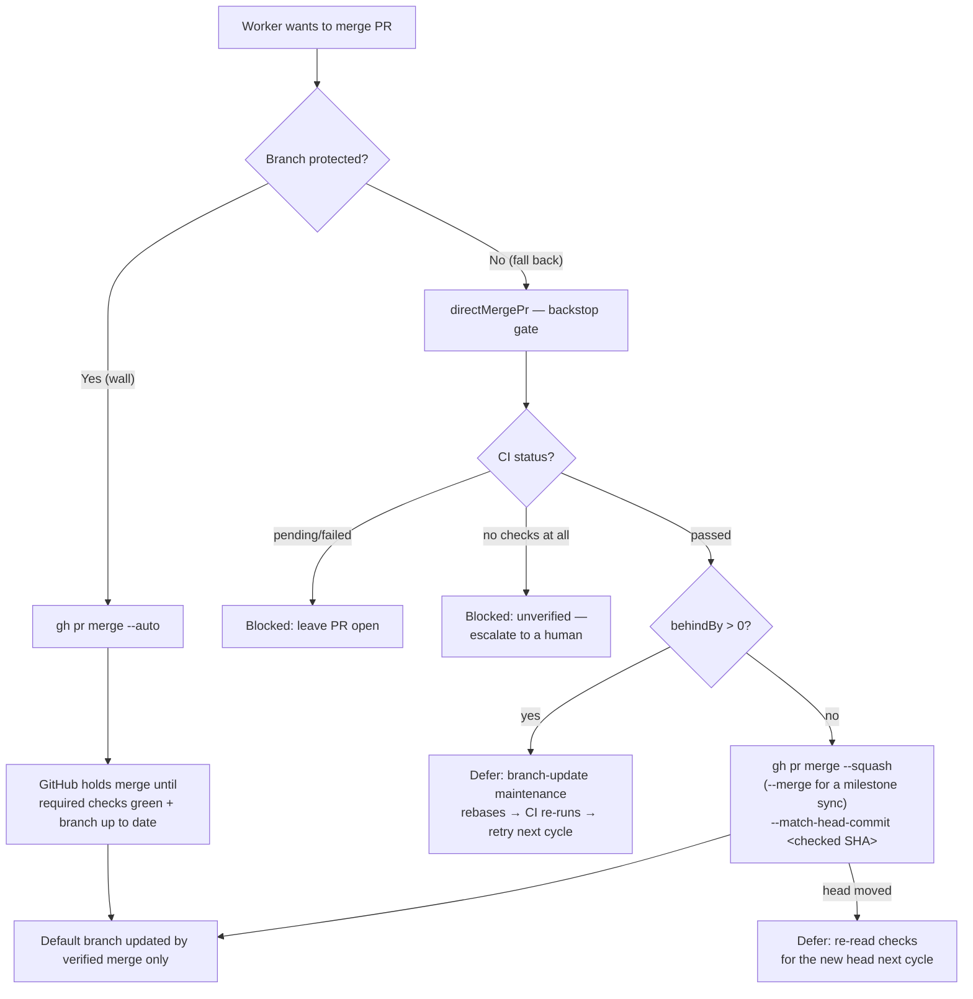
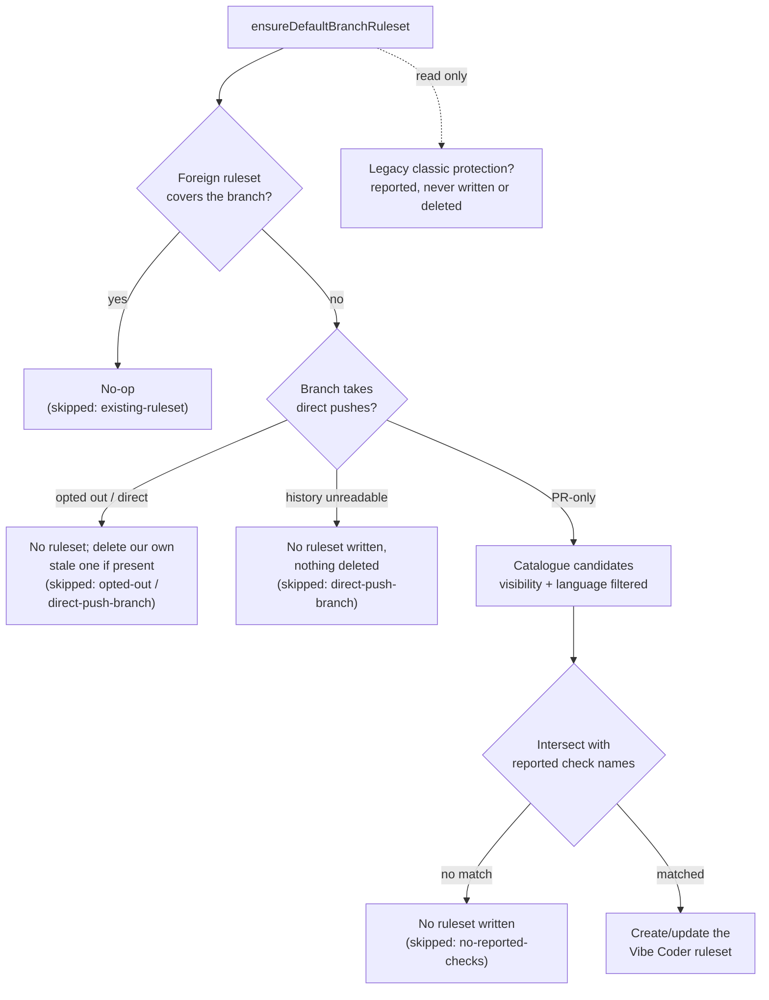
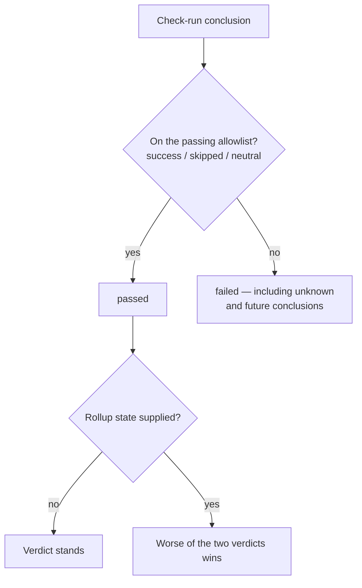
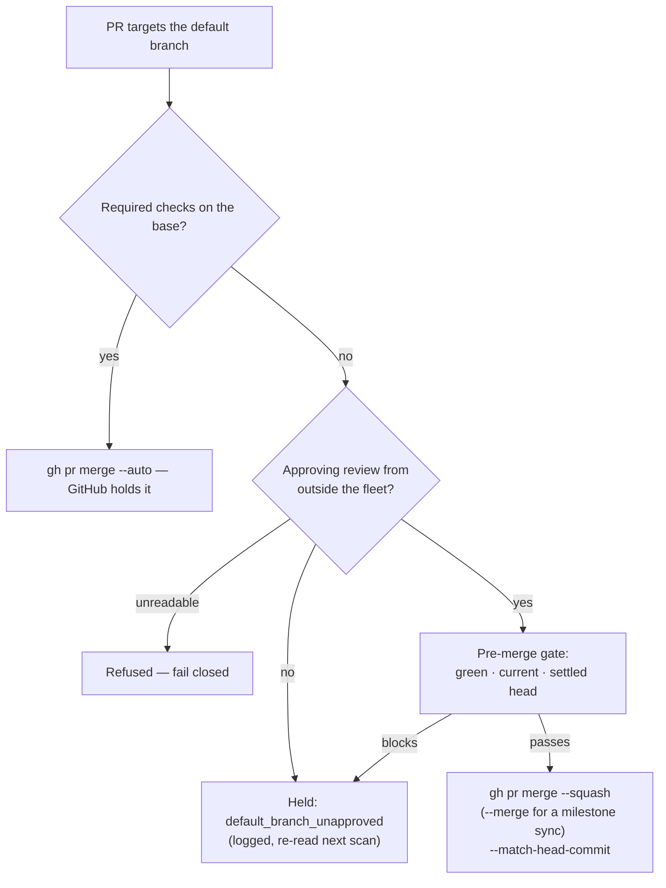
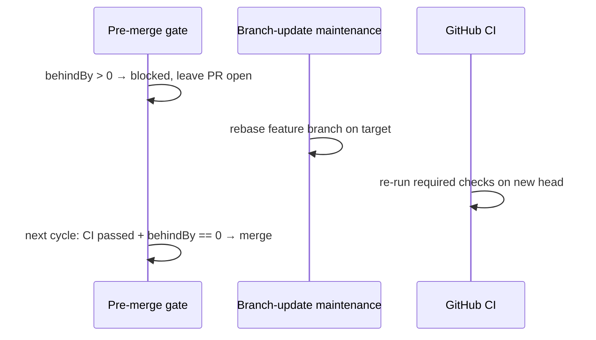
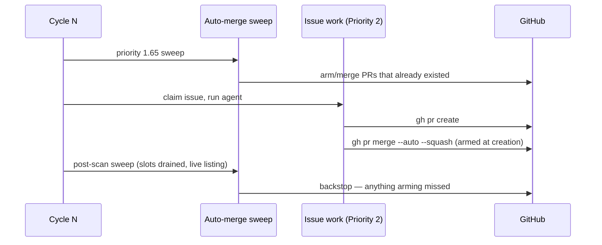
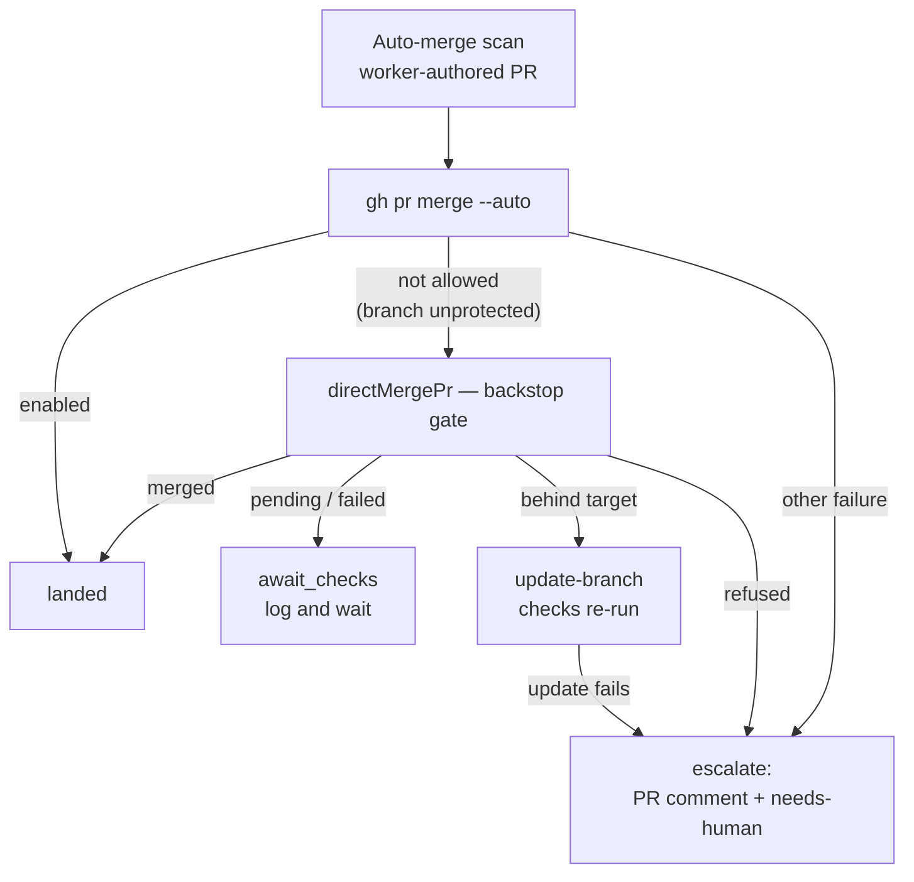
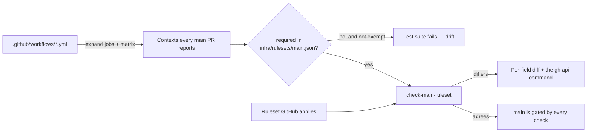
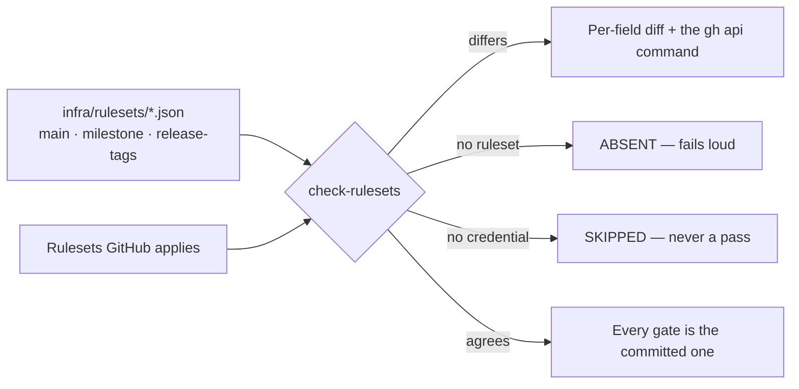

# 🔀 Merge Enforcement — Operator Manual

This document is the operator-facing reference for how the Vibe Coder guarantees
that **every required CI status check passes _before_ a feature branch is merged
into a repository's default branch — never after**. The intent is documented in
the parent issue and the sub-issues that built it.

A post-merge check failure is too late: by the time the default branch has
moved, the deploy/publish workflows have already fired and the bad change is
live. The worker therefore enforces correctness ahead of the merge with a
**dual-layer** model and keeps the default branch **read-only** so it can only
ever change through a verified merge.

For the **agent-facing** summary see
[DESIGN-PRINCIPLES.md → Dual-layer pre-merge enforcement](../DESIGN-PRINCIPLES.md#dual-layer-pre-merge-enforcement).
For the ruleset **setup note** see
[Layer 1 — the GitHub ruleset "wall"](#layer-1--the-github-ruleset-wall) below.

## The dual-layer model

Enforcement lives in **two independent places**, so a gap in either one is
caught by the other:

| Layer        | Where                      | Mechanism                                                        | Covers                                                                            |
| ------------ | -------------------------- | ---------------------------------------------------------------- | --------------------------------------------------------------------------------- |
| **Wall**     | GitHub repository rulesets | Required status checks + strict "branch up to date"              | The native auto-merge path (`gh pr merge --auto`) and any human/third-party merge |
| **Backstop** | Worker pre-merge gate      | Re-fetch CI status + branch freshness immediately before merging | The worker's direct-merge fallback used on unprotected branches                   |

The two layers are deliberately redundant. The ruleset is the primary defence;
the worker backstop closes the gap on repositories where no ruleset covers the
default branch or one cannot be configured (for example, when the worker lacks
admin rights on the repo).



## Layer 1 — the GitHub ruleset "wall"

The default branch's ruleset is configured **at setup time**, once per monitored
repo, idempotently. It sets two things:

- **Require status checks to pass** — the merge is blocked until every required
  check is green.
- **Require the branch to be up to date**
  (`strict_required_status_checks_policy: true`) — a stale feature branch must
  be brought current with its target before the merge is allowed, so green CI
  results are never trusted against an out-of-date head.

### Rulesets only — classic branch protection is never written

GitHub has moved enforcement to **repository rulesets**; classic branch
protection (`PUT /repos/<repo>/branches/<branch>/protection`) is the legacy
surface, and the worker **never writes it**. It used to: every setup run
recreated a classic rule that humans then deleted, and that rule demanded status
contexts (`gitleaks`, `semgrep`) many repos no longer report — so the merge box
sat on _"Expected — Waiting for status to be reported"_ forever while the repo's
real ruleset checks were green.

Two boundaries follow:

- **Defer to an existing ruleset.** When the default branch is already covered
  by a ruleset the worker does not own — a human-managed one, or an organisation
  ruleset — the sync is a genuine no-op (`skipped:
  "existing-ruleset"`). The
  worker never competes with an existing enforcement policy.
- **Report, never delete, a legacy rule.** Leftover classic protection is read
  and reported (`legacyClassicProtection: true`), and setup prints the exact
  `gh api -X DELETE …` command to clear it. Deleting it stays a deliberate human
  action.

### Never lock a direct-push branch

A required-status-checks ruleset assumes every change arrives through a pull
request. On a **data repo whose default branch the fleet pushes to directly**
(FLEET workers checking results straight in to `Develop`) there is never a PR,
so no check can ever be reported, and every push is refused:

```text
remote: error: GH013: Repository rule violations found for refs/heads/Develop.
remote: - 2 of 2 required status checks are expected.
```

Six data repos stalled that way for days after the ruleset configurator locked
them. So, before creating **or** updating its ruleset, the configurator asks
`assessBranchPushPolicy()` in
[`worker/deno/lib/branch_push_policy.ts`](../worker/deno/lib/branch_push_policy.ts)
how the branch is fed:

- **Explicit opt-out** — the repo topic `direct-push`, or the marker file
  `.vibe/no-default-branch-ruleset` at the default branch head, skips with
  `skipped: "opted-out"`.
- **Observed direct pushes** — the last 20 commits on the branch are sampled; a
  commit counts as direct when its subject carries no `(#N)` squash marker, is
  not a `Merge pull request #N` commit, and
  `GET /repos/{repo}/commits/{sha}/pulls` names no **merged** PR. Any direct
  commit skips with `skipped: "direct-push-branch"`, logging the offending sha
  and subject.
- **Uncertainty** — if the topics, marker, or commit history cannot be read, the
  branch is treated as direct-push (`skipped: "direct-push-branch"`, with the
  read failure in `detail`). The worker never locks on uncertainty, the same
  stance as the check-name discovery below.

On a branch that has opted out or demonstrably takes direct pushes, a stale
ruleset the worker created earlier is **deleted** — only the ruleset named
exactly `Vibe Coder default branch` and owned by the repository; a human-
managed or organisation ruleset is never touched, and a human-managed ruleset
covering the branch still wins (`existing-ruleset`) before any of this runs. On
an unreadable history nothing is written _and_ nothing is deleted.

The read-only sweep `audit-default-branch-rulesets` (see
[Extending → Maintenance Commands](EXTENDING.md#-maintenance-commands)) lists,
per repo, what the sync would now do without writing anything.

### Never require an unsatisfiable check

The guiding invariant is **never require an unsatisfiable check**. A check that
can never pass on a repo must never be marked required there — otherwise it
blocks **every** merge. Three filters enforce it:

- `requiresPublic` checks are dropped on non-public repos (e.g.
  `dependency-review`, which needs GitHub Advanced Security).
- Language-gated checks are dropped when the language is absent (or when the
  detected-language set is unknown).
- Any visibility other than the literal `"public"` (including `"private"`,
  `"unknown"`, or `undefined`) is treated as private — fail-safe, so a
  public-only check is never required when the answer is uncertain.

That satisfiable subset is computed by `getRequiredChecksForRepo()` in
[`worker/deno/lib/branch_protection_definitions.ts`](../worker/deno/lib/branch_protection_definitions.ts),
which reuses the `visibilityScope: "public-only"` signal from
`workflow_definitions.ts` so the two stay in lock-step.

The catalogue names **candidate** contexts only. Since a bespoke repo may name
the same capability differently (`quality` for a job that runs gitleaks as a
step, `Semgrep SAST scan` for semgrep), the candidates are intersected with the
names the repo has **genuinely reported** — `getReportedCheckNames()` in
[`worker/deno/lib/reported_check_names.ts`](../worker/deno/lib/reported_check_names.ts)
reads the check runs and commit statuses on the default branch head _and_ on the
head of the most recently closed PR (the canonical workflows trigger on
`pull_request`, so a squash-merged default branch carries none). Only the
alternative that actually reported is required. When nothing matches, or the
discovery cannot be read at all, **no ruleset is created** — a ghost context is
never written.



### Additive convergence — foreign checks are never deleted

Convergence **only ever adds**. An update to the worker's own ruleset sends the
**union** of its current required contexts and the worker's desired set, so a
required check the worker did not create — an org security scan, a compliance
gate, another team's workflow — survives the sync instead of being silently
stripped. Those contexts are reported back as `preserved`, and their presence
alone is **not** drift: a repo whose only difference is an extra gate stays a
genuine no-op.

Pruning a stale required check is therefore a deliberate human action, not a
side effect of onboarding or a setup run.

### Setup-time sync across all monitored repos

The walk over every monitored repo is performed by
[`syncBranchProtectionForAllRepos()`](../worker/deno/setup/branch_protection_sync.ts)
. For each repo it resolves visibility via `getRepoVisibility` and the default
branch via `gh api repos/<repo> --jq .default_branch`, then calls
`ensureDefaultBranchRuleset()`. It is wired into `setup.sh` as the
`branch-protection-sync` subcommand of `setup_cli.ts`, run **after** the
collaborator precheck (which validates access). The sync collects a per-repo
`SyncResult[]`, prints a summary, and treats every single-repo failure as a
non-fatal warning.

Setup respects a setup-time-only rate-limit budget — the metadata reads, a small
number of ruleset/check-name reads, the direct-push detection reads (three, plus
one per sampled commit lacking a PR marker;), and at most **one** ruleset write
or delete per repo — and never runs in the per-tick main loop. A repo already
covered by someone else's ruleset short-circuits before the direct-push
detection and the check-name discovery.

## Layer 2 — the worker pre-merge "backstop"

The native auto-merge path is covered by the ruleset. The **direct-merge
fallback** (used on unprotected branches) is covered by the worker's own gate,
`enforcePreMergeRequirements()` in
[`worker/deno/lib/direct_merge.ts`](../worker/deno/lib/direct_merge.ts), called
from inside `directMergePr()` so **every** direct-merge call site is protected
by construction.

Immediately before merging, the gate:

1. **Re-fetches CI status** via `checkCiStatus()` and refuses (a typed "blocked"
   result, never a throw) unless the status is `passed`.
2. **Re-fetches fresh branch state** (`behindBy` from `pr_branch_state.ts`) and
   refuses when `behindBy > 0`, so stale CI results are never trusted.

Both signals are re-fetched **at merge time**, not reused from PR-creation time.

### The merge is pinned to the SHA its checks were read for

Re-fetching at merge time still leaves a window: the gate reads the checks for
one specific head commit, and two-to-three `gh` round trips later the merge
runs. A push landing in between would be squash-merged on checks that never
evaluated it.

The gate therefore reports the head SHA it read (`headSha` on both
`CiStatusResult` and `PreMergeGateOutcome`), and `directMergePr()` merges with
`gh pr merge --squash --match-head-commit <sha>` — or `--merge` when the head
is a `sync/milestone-*` branch, which must land as a merge commit
(Issue #1048). GitHub refuses the merge if
the head has moved, so the merge is only ever performed on the exact commit the
verdict was formed against.

- **Head moved** — a deferral (`blocked: "head_moved"`), not a fault. The PR is
  left open, the new head's checks run, and the next maintenance cycle
  re-evaluates the gate.
- **No head SHA reported** — refused outright. An unpinnable merge cannot be
  tied to the verdict that allowed it, so the worker fails closed and retries on
  the next scan rather than merging whatever the head happens to be now.

### The CI verdict is an allowlist

`determineCiStatus()` decides "green" from an **allowlist**, never a denylist. A
check run passes only when its conclusion is `success`, `skipped` or `neutral`;
every other completed conclusion — `failure`, `cancelled`, `timed_out`,
`action_required`, `startup_failure`, `stale`, or any value GitHub adds in
future — is `failed`. The same rule applies to the combined commit status:
anything that is neither `success` nor pending is `failed`.

GitHub's own aggregate verdict, `statusCheckRollup.state` (fetched by
`check_runs_batch.ts`), is folded into the decision and the **worse** of the two
verdicts wins, so a red rollup can never be masked by check runs that
individually look green.

This matters because a workflow that failed to start (`startup_failure`) or a PR
waiting on a manual approval (`action_required`) both report
`status: "completed"`. Under the old denylist neither hit the failure branch nor
the pending branch, so both fell through to `passed` and were direct-merged past
branch protection.



### An unprotected default branch needs an approval, not a refusal

Two guards used to intersect at nothing. On a base with **no required checks**
the worker refuses GitHub's `--auto` (it would merge immediately whatever CI
said) and routes the PR through the gated direct merge instead — which then
refuses **every** default-branch target as a blast-radius guard. A repo whose
default branch carries no ruleset therefore had no path at all:
`NEAT-AI-Ockham#116` was green, approved and mergeable, and the worker logged
the same refusal roughly forty times over four hours while all six `work-on`
issues behind it stayed blocked.

The blast-radius guard asks for "branch protection or a human review". On an
unprotected default branch there is no protection to bypass, so the worker now
asks for the review explicitly:

- **An approving review from a login outside the fleet** — the PR proceeds to
  the same pre-merge gate as any other: green CI, current branch, settled head,
  SHA-pinned merge. Nothing is relaxed except the target-branch refusal.
- **No such approval** — a typed deferral (`default_branch_unapproved`), so the
  PR is *held* and the hold is logged. It is not retried as a failure and it is
  not escalated to a human.
- **A sibling fleet account's approval does not count.** The fleet cannot
  review itself into a merge; only a login outside `service_accounts` /
  `fleet_pr_authors` / the host login satisfies the guard.
- **An unreadable review list fails closed** — refused and retried next scan,
  never treated as an implied approval.

A **protected** base is untouched: it still goes through native auto-merge,
which GitHub holds until the required checks are green.



### Zero checks is not "passed"

A head commit with **no check runs and no commit statuses** has been verified by
nothing. `checkCiStatus()` reports it as `no_checks` — a status distinct from
`passed` — and the gate blocks the merge with the `no_checks` reason. The
direct-merge path is the one that bypasses branch protection, so it must fail
closed here exactly as its neighbouring guards do.

Waiting will not help (no check is coming), so the automated path escalates:
`classifyMergeAttempt({ kind: "no_checks" })` returns `escalate`, which posts
the explanatory PR comment and applies `needs-human`.

The only way to land such a PR through the worker is the **explicit operator
override** on the CLI:

```bash
deno run ... merge-if-checks-passed --repo owner/repo --pr 42 --allow-no-checks
```

The override relaxes the "no checks" refusal only. Every other requirement —
non-default target branch, branch freshness, repo allowlist, PR authorship —
still applies.

### Who may call `merge-if-checks-passed`

The command applies the same two gates the maintenance scan applies before it
touches GitHub:

- **Monitored-repo allowlist** — `--repo` must be listed in `.config.json`
  `repos`; anything else is refused before any API call is made.
- **PR authorship** — the PR must be authored by this worker's own `gh` login or
  by a configured sibling fleet host (`fleet_pr_authors`).

Both fail closed: an unresolvable worker login or an unreadable PR author is a
refusal, never an implied pass.

### Defer-and-retry when behind

When the gate blocks because the branch is behind its target, the PR is **left
open** and a deferral is logged. The existing branch-update maintenance
(Priority 1.27, `pr_branch_update.ts`) rebases the branch, CI re-runs on the new
head, and the next cycle re-evaluates the gate — an automatic **auto-update →
re-check → merge-if-green** loop with no bespoke retry machinery.



## Hands-off landing — precedence and loud failure

The auto-fix loop (fetch → diagnose → fix → merge) is only hands-off if a green
fix PR actually lands. Two things make that true.

**Every repo and every fleet author is swept.** The main loop's priority 1.65
sweep (`sweepAutoMerge` in
[`worker/deno/lib/auto_merge_sweep.ts`](../worker/deno/lib/auto_merge_sweep.ts))
lists PRs for **every push-capable fleet author**, the same set
`getBlockingPRForIssue()` defers `work-on` issues to. A single-login sweep left
`GRQ-GTC#305` — authored by a sibling fleet account — with no merge attempt
logged against it for five days while its repository stayed frozen.

It also walks the **monitored repo list**, not the repos with claimable work: a
repo whose only PR blocks all of its own issues has no claimable work by
construction, so a work-driven sweep would never revisit it. That was already
true before the sweep was extracted; it is now asserted by a test rather than
left to be re-broken.

**A PR is armed when it is created, not next cycle.** The sweep is a
**backstop**, never the primary mechanism. Priority 1.65 runs near the top of a
cycle and the Priority 2 issue scan — the pass that raises PRs — runs after it,
so a PR raised by cycle N is structurally invisible to cycle N's sweep.
PR #1133 was created 51 minutes after that cycle's sweep and sat green,
unblocked and unarmed until a human merged it, freezing every sibling issue the
blocking guard defers to it (Issue #1136).

Two changes close that window:

- **Arm at creation.** The completion phase calls `finalisePr` immediately
  after `gh pr create` for **every** PR it raises, milestone children
  included. GitHub then lands the PR the moment its checks pass, with no cycle
  boundary involved. The milestone *summary* PR is raised by
  `milestone_completion.ts`, not here, and is re-gated on open children at
  merge time by `decideSummaryPrMerge` (Issue #3909) — so arming a child PR
  never merges a milestone early.
- **Sweep again once the slots drain.** `runPostScanAutoMerge` in
  [`worker/deno/lib/run_core.ts`](../worker/deno/lib/run_core.ts) repeats the
  sweep at the end of a cycle that did work, catching the paths arming cannot:
  an arming call that failed, a host that died mid-run, and an unprotected base
  whose gated direct merge deferred because CI was still running when the PR
  was raised. It lists **live**, not from the iteration-scoped `prs_${author}`
  cache the 1.65 sweep filled before those PRs existed. An idle cycle skips it
  and says so — it raised nothing to sweep.



**Precedence is fixed, not a race.** The auto-merge scan
(`ensureAutoMergeOnOpenPrs` in
[`worker/deno/lib/pr_maintenance.ts`](../worker/deno/lib/pr_maintenance.ts))
always tries GitHub's **native auto-merge first**, and only falls back to direct
merge when native auto-merge is refused because the target branch is
unprotected. Native auto-merge is idempotent, so a consuming repo's own
`auto-merge.yml` arming the same PR converges on the identical state rather than
competing with the worker — there is no winner to determine.

**A sweep that does nothing says so.** Every repository the sweep visits
produces a line: the candidate PR numbers it found, or `no candidates` when the
fleet had no open PR there. Every attempt's outcome is logged by
`logAutoMergeOutcome` with the repo, PR number and result. Without those lines
"the sweep found nothing" and "the sweep refused everything" read identically,
which is why five unarmed PRs in one day were each treated as an isolated
omission rather than one defect (Issues #470, #1136).

**A blocked merge is never silent.** Every outcome runs through
`handleMergeAttempt()` in
[`worker/deno/lib/merge_block_escalation.ts`](../worker/deno/lib/merge_block_escalation.ts),
which maps it to exactly one of four dispositions:

| Outcome                                                | Disposition     | Worker behaviour                                                                                 |
| ------------------------------------------------------ | --------------- | ------------------------------------------------------------------------------------------------ |
| Merged, or native auto-merge armed                     | `landed`        | Nothing — the PR will land unattended                                                            |
| Checks pending or failed                               | `await_checks`  | Log and wait; the CI-fix loop owns a red check and escalates on its own 3-attempt cap            |
| Branch behind its base                                 | `update_branch` | `PUT .../update-branch` so the checks re-run against the merged state                            |
| No checks at all on the head commit                    | `escalate`      | Explanatory PR comment **and** `needs-human` — nothing verified the head, and no check is coming |
| Head moved after its checks were read                  | `await_checks`  | Log and wait; the new head's checks are on their way and the next cycle re-evaluates             |
| Merge refused (protection rule, conflict, unmergeable) | `escalate`      | Explanatory PR comment **and** the `needs-human` label                                           |

Escalation routes through the shared `escalateToHuman()` chokepoint, so the
label can never be applied without an accompanying explanation, and it is
deduplicated per PR so a repeating scan does not spam the thread. A failed
branch update escalates too — a PR that cannot be brought up to date is exactly
the stall this is meant to eliminate.

Review requests are **informational**: nothing in the worker's merge path
consults `reviewDecision`, so a requested reviewer never blocks a fix PR. Only
branch protection can require an approval, and that is a per-repo setting.

The scan lists PRs authored by the worker only, so **human-authored PRs are
never commented on or escalated** by this path.



## Read-only default branch

The default branch must only ever change via a **verified merge**. The worker
never pushes commits directly to it — no formatting changes, no version bumps,
no dependency bumps, no lint/scan fix-ups. Every such change rides a normal
feature-branch PR and passes through the pre-merge enforcement like any other
change.

This is enforced at the single git-push choke-point by
`assertPushTargetAllowed()` in
[`worker/deno/lib/git_push.ts`](../worker/deno/lib/git_push.ts), through which
`commitAndPushPending()` and `pushUnpushedCommits()` flow:

- **Fails closed on the default branch.** When the resolved default branch
  equals the target branch, the push is rejected with an explicit error.
- **Fails open when the default cannot be resolved.** If `origin/HEAD` is unset
  the default branch is unknown, so a legitimate feature-branch push is never
  blocked by a transient lookup failure — direct-to-default is only possible
  when the target literally equals the resolved default.
- **Opt-out reserved for merge machinery.** An `allowDefaultBranch` parameter
  (default `false` = forbid) exists only for the legitimate merge path that must
  update the default-branch ref.

Existing maintenance that touches files (bump-deps, gitignore/gitattributes
sync) **stages locally and rides the next feature-branch PR** — it never pushes
to default. `directMergePr()` additionally applies `prTargetsDefaultBranch()` as
a blast-radius guard at every call site.

## Workflow-trigger normalisation

To honour **"don't re-run required status checks on the default branch"**,
test/lint/scan workflows are made **PR-only** while publishers keep firing on
push. Classification drives the decision:

| Category                       | Examples                                                                                                                        | Trigger policy                                                                                |
| ------------------------------ | ------------------------------------------------------------------------------------------------------------------------------- | --------------------------------------------------------------------------------------------- |
| **test / lint / scan**         | `deno test`/`lint`/`check`, `cargo fmt`/`clippy`, `eslint`, `pytest`, `actionlint`, `semgrep`, `gitleaks`, audits               | **PR-only** — drop `push:` to default; keep `pull_request` / `schedule` / `workflow_dispatch` |
| **deploy / publish / release** | `gh release`, `npm`/`cargo`/`deno publish`, `softprops/action-gh-release`, `actions/deploy-pages`, `aws-actions/*`, docker push | **Keep `push:`** — reporting a publish failure at PR stage is too late                        |
| **ambiguous**                  | mixed or unknown signatures                                                                                                     | **Left as-is** — never risk breaking a publisher                                              |

The classifier (`classifyWorkflow()` in `workflow_classifier.ts`) is a pure
function returning a category, a confidence level, and the evidence (matched
signatures) used. A workflow is classified `deploy` when any step matches a
publisher signature; otherwise `test` when steps match test/lint/scan
signatures; mixed or unknown signatures resolve to `ambiguous`.

### Detect and file, never bulk-rewrite

The worker does **not** bulk-rewrite workflow YAML — a blind rewriter risks
losing comments and breaking publishers. Instead the `github-actions-audit`
idle-task template **detects and files**: for each high-confidence
test/lint/scan workflow whose `on:` block still includes `push:` to the default
branch, it files a `BP-TRIGGER-<workflow>` finding describing the change. Deploy
and ambiguous workflows produce no finding. The actual YAML fix then lands as a
normal worker PR, which itself passes through the pre-merge gate — keeping the
default branch read-only. The scan itself raises no PR (see
[`docs/GITHUB-ACTIONS-AUDIT-SCAN.md`](GITHUB-ACTIONS-AUDIT-SCAN.md)).

## No post-merge re-run of required checks

Required status checks run on the **feature branch / PR before merge**. They are
**not** re-run on the default branch after merge — that would be a duplicate run
with no enforcement value (the merge has already happened) and it would burn CI
minutes on every push to default. Making test/lint/scan workflows PR-only is
precisely what removes that duplicate post-merge run, while
deploy/publish/release workflows remain on push so publishing problems surface
at the only point where they are actionable.

## This repository's own `main` ruleset

The sections above describe the ruleset the worker configures on a **monitored**
repo. This repository's `main` is different: its ruleset is human-managed, so
the worker never writes it — and it drifted. `validate` was not a required
status check, so auto-merge fired on a PR whose `deno lint` was red and put
`main` red twice (PRs #825 and #832, recovered by #827 and #833). Nothing
reported the gap; the only evidence was `main` going red and a human noticing.

The fix is a committed payload plus a check that compares it against reality,
mirroring
[`infra/rulesets/release-tags.json`](../infra/rulesets/release-tags.json) for
tags:

- **[`infra/rulesets/main.json`](../infra/rulesets/main.json)** is the source of
  truth for the ruleset applied to `main`, including every required context.
- **The required set is derived, not remembered.** `pr_check_contexts.ts` reads
  the workflows and expands each job — matrix included — into the check contexts
  a PR into `main` always reports. Every one of them is either required by the
  payload or carries a recorded reason in `EXEMPT_CONTEXTS`. A new CI job that
  nobody adds to the ruleset fails the test suite, which is what closes the
  class rather than the two names that were missing.
- **A path-filtered workflow never contributes.** `dependency-audit` runs only
  when a lockfile changes, so requiring one of its contexts would leave the
  merge box waiting for a check that never arrives — the same trap the
  reported-check-name intersection avoids above.



Reconcile the applied ruleset against the file at any time — read-only, and it
skips loudly rather than passing when there is no credential:

```bash
deno run --allow-all worker/deno/mod.ts check-main-ruleset
```

Applying the payload needs **admin** on the repository, which the fleet's
service account does not hold; branch protection stays a deliberate human
action. The command prints the exact call:

```bash
gh api --method PUT repos/stSoftwareAU/VibeCoder/rulesets/21019403 \
  --input infra/rulesets/main.json
```

## This repository's own `Milestone` ruleset

The `Milestone` ruleset required exactly two contexts — `gitleaks` and
`semgrep`. No tests, no `validate`, no shards, so **a PR into a milestone
branch could merge with the entire test suite red**, which is how PR #1039
landed with `validate (tests 1/4)` failing and rode a resurrected
`fleet_health.ts` onto the milestone branch (Issue #1042). A permanently-red
check on the milestone branch is indistinguishable from no check, so every PR
after it inherited the red.

Milestone branches need the gate more than `main`, not less: a milestone branch
is where a multi-PR feature is assembled and where the fault is introduced,
while `main`'s ruleset is only the last net.
[`infra/rulesets/milestone.json`](../infra/rulesets/milestone.json) therefore
requires every context `main` requires, plus `milestone-resurrection` — the
Issue #1048 check that reports on milestone PRs and on no ordinary `main` PR.
The differences that remain between the two rulesets are recorded, with their
reasons, in
[`infra/rulesets/README.md`](../infra/rulesets/README.md).

The required set is derived rather than remembered here too: the same
`pr_check_contexts.ts` expansion runs against a `milestone/` base, with
`MILESTONE_EXEMPT_CONTEXTS` as its recorded exemption list, so a new CI job
missing from either branch ruleset fails the test suite.

One command reconciles all three committed payloads — `main`, `Milestone` and
the release tags — against what GitHub applies. It is read-only, exits
non-zero on drift, fails loud when a ruleset is absent, and skips (saying so)
without a credential:

```bash
deno run --allow-all worker/deno/mod.ts check-rulesets
```



## Failure and recovery modes

| Situation                                           | Worker behaviour                                           | Recovery                                                                       |
| --------------------------------------------------- | ---------------------------------------------------------- | ------------------------------------------------------------------------------ |
| Required CI check **pending**                       | Backstop returns blocked; PR left open                     | Next cycle re-checks once CI completes                                         |
| Required CI check **failed**                        | Backstop returns blocked; PR left open                     | Fix lands on the feature branch; CI re-runs; re-evaluated next cycle           |
| Feature branch **behind target**                    | Backstop defers; PR left open                              | Branch-update maintenance rebases → CI re-runs → merge-if-green                |
| Head **moves** between the check read and the merge | SHA-pinned merge refused by GitHub; deferred, PR left open | The new head's checks run; next cycle re-evaluates the gate                    |
| Green PR **refused by the merge**                   | Explanatory PR comment + `needs-human`                     | Human unblocks the merge; the worker does not retry while the label is applied |
| **Branch update fails** on a behind PR              | Escalated the same way — never left silently open          | Human resolves the conflict on the feature branch                              |
| Push **targets default branch**                     | Push rejected with explicit error                          | Change is redirected through a feature-branch PR                               |
| Default branch **cannot be resolved**               | Push allowed (fail-open)                                   | Feature-branch pushes are never blocked by a transient lookup failure          |
| Ruleset write **fails for one repo**                | Logged as a non-fatal warning                              | Setup continues; the next setup run retries idempotently                       |
| Required check is **unsatisfiable** on the repo     | Check is dropped from the required set                     | The merge is never blocked by a check that can never pass                      |

## Related implementation

- [`worker/deno/lib/branch_protection_definitions.ts`](../worker/deno/lib/branch_protection_definitions.ts)
  — visibility/language-aware satisfiable required-check candidates
  (`getRequiredChecksForRepo()`).
- [`worker/deno/lib/repo_rulesets.ts`](../worker/deno/lib/repo_rulesets.ts) —
  ruleset read/write primitives; the only classic-protection endpoint touched
  anywhere is its read.
- [`worker/deno/lib/reported_check_names.ts`](../worker/deno/lib/reported_check_names.ts)
  — `getReportedCheckNames()`, the genuinely-reported check names the candidates
  are intersected with.
- [`worker/deno/lib/branch_push_policy.ts`](../worker/deno/lib/branch_push_policy.ts)
  — `assessBranchPushPolicy()`, the direct-push / opt-out detection that keeps a
  data repo's branch unlocked.
- [`worker/deno/lib/default_branch_ruleset.ts`](../worker/deno/lib/default_branch_ruleset.ts)
  — `planDefaultBranchRuleset()` (read-only decision) and
  `ensureDefaultBranchRuleset()`, the idempotent ruleset configurator.
- [`worker/deno/lib/default_branch_ruleset_audit.ts`](../worker/deno/lib/default_branch_ruleset_audit.ts)
  — the read-only `audit-default-branch-rulesets` sweep.
- [`worker/deno/lib/pr_check_contexts.ts`](../worker/deno/lib/pr_check_contexts.ts)
  — `pullRequestCheckContexts()` / `reconcileRequiredContexts()`, the contexts a
  PR into `main` always reports and the drift against the committed ruleset.
- [`worker/deno/lib/main_branch_ruleset_check.ts`](../worker/deno/lib/main_branch_ruleset_check.ts)
  — `checkMainBranchRuleset()`, the read-only live-versus-committed
  reconciliation behind `check-main-ruleset`.
- [`worker/deno/lib/committed_rulesets.ts`](../worker/deno/lib/committed_rulesets.ts)
  — `COMMITTED_RULESETS` / `reconcileCommittedRulesets()`, the registry of every
  payload under `infra/rulesets/` and the one reconciliation behind
  `check-rulesets` (Issue #1073). A payload nobody registers fails the suite.
- [`worker/deno/lib/ruleset_reconcile.ts`](../worker/deno/lib/ruleset_reconcile.ts)
  — `reconcileRuleset()` / `diffRulesetPayloads()`, the fetch and the
  drift/absent/skipped semantics that check shares with the release-tag one
  ([`check-release-tag-ruleset`](RELEASE-TAGGING.md#reconciling-it),
  Issue #1049).
- [`worker/deno/lib/direct_merge.ts`](../worker/deno/lib/direct_merge.ts) —
  `enforcePreMergeRequirements()` (backstop gate), `directMergePr()`,
  `checkCiStatus()`, `prTargetsDefaultBranch()`.
- [`worker/deno/lib/merge_block_escalation.ts`](../worker/deno/lib/merge_block_escalation.ts)
  — `classifyMergeAttempt()` / `handleMergeAttempt()` / `requestBranchUpdate()`
  (hands-off landing and loud merge failure).
- [`worker/deno/lib/git_push.ts`](../worker/deno/lib/git_push.ts) —
  `assertPushTargetAllowed()` / `resolveLocalDefaultBranch()` (read-only
  default-branch guard).
- [`docs/GITHUB-ACTIONS-AUDIT-SCAN.md`](GITHUB-ACTIONS-AUDIT-SCAN.md) — the
  idle-task template that files the workflow-trigger findings.
