# 🧠 Model Selection, Sessions, Prompt Caching & Batching

This page documents how VibeCoder selects Claude models, manages sessions,
optimises costs through prompt caching, and tracks token usage. It also records
why the Anthropic Batch API was evaluated and deliberately **not** wired into
the worker.

## Table of Contents

- [Provider Applicability](#provider-applicability) — which behaviours apply
  under `claude`, `codex`, `gemini` and `deepseek`
- [Model Selection](#model-selection)
  - [Phase-Specific Defaults](#phase-specific-defaults)
  - [Model/effort precedence chain](#-modeleffort-precedence-chain)
  - [Codex per-phase routing](#-codex-per-phase-routing)
  - [Gemini per-phase routing](#-gemini-per-phase-routing)
  - [DeepSeek per-phase routing](#-deepseek-per-phase-routing)
  - [Model Fallback on Rate Limit](#model-fallback-on-rate-limit)
  - [Two-stage planning self-critique flow](#two-stage-planning-self-critique-flow)
  - [Planning-run stats + degraded-model detection](#planning-run-stats--degraded-model-detection)
  - [Fable-unavailable auto-fallback + self-heal](#fable-unavailable-auto-fallback--self-heal)
  - [Pre-flight Fable reroute](#pre-flight-fable-reroute)
- [Session Management](#session-management)
  - [Per-Repository Session Persistence](#per-repository-session-persistence)
  - [Milestone-Aware Session Branching](#milestone-aware-session-branching)
  - [Session Compaction](#session-compaction)
  - [Session Resume](#session-resume)
  - [Issue Claiming](#issue-claiming)
  - [Heartbeat Tracking](#heartbeat-tracking)
  - [Processing Phases](#processing-phases)
- [Prompt Caching](#prompt-caching)
  - [Layer 1: Prompt Compilation Cache (Disk)](#layer-1-prompt-compilation-cache-disk)
  - [Layer 2: Claude Built-in Prompt Caching](#layer-2-claude-built-in-prompt-caching)
  - [Stable Prefix Ordering](#stable-prefix-ordering)
  - [Cache Hit-Rate Telemetry](#cache-hit-rate-telemetry)
  - [SHA-256 Invalidation](#sha-256-invalidation)
  - [Codebase Map](#codebase-map)
- [Batch API: considered and not wired](#batch-api)
  - [Why it was rejected](#why-it-was-rejected)
  - [What remains in the code](#what-remains-in-the-code)
- [Token Usage & Cost Tracking](#token-usage--cost-tracking)
  - [Token Extraction](#token-extraction)
  - [Model Pricing](#model-pricing)
  - [Credit Logging](#credit-logging)
  - [Context Window Budget Monitoring](#context-window-budget-monitoring)
- [Token Saving Strategies](#token-saving-strategies)
- [Configuration](#configuration)

---

## Provider Applicability

This page is the **behaviour** reference for whichever coding agent a run uses.
The worker supports four providers — `claude`, `codex`, `gemini` and
`deepseek` — and most of what follows was designed around Claude, so a reader
running `agent_provider: codex` needs to know, behaviour by behaviour, what
they still get. That is what this section is for.

**Legend**

| Symbol | Meaning |
|--------|---------|
| ✅ | Applies to that provider as documented |
| ⚠️ | Partly applies — a different mechanism, or only part of the behaviour |
| ❌ | Does not apply to that provider; the row says what happens instead |
| ➖ | Not applicable to any provider (the behaviour is not wired for anyone) |

`deepseek` is the one entry a reader cannot infer from its id: DeepSeek ships
no CLI of its own, so the provider is the **Anthropic CLI pointed at DeepSeek's
Anthropic-compatible endpoint** (`https://api.deepseek.com/anthropic`). That
single fact explains most of its column — why its credential is a DeepSeek key
and not an Anthropic one, why Anthropic's own credentials are *withheld* from
its child environment even though the binary is Anthropic's, why its command is
`deepseek` rather than `claude`, and why the CLI-shaped behaviours below
(`--system-prompt`, `--session-id`, `stream-json` usage) apply to it while the
Anthropic-*service* behaviours (the Fable tier, the tier ladder, server-side
prompt caching, Claude pricing) do not.

For **how to select** a provider (the
`agent_provider` / `agent_providers` keys, credentials, the container image),
see [Choose your coding agent (README)](../README.md#-choose-your-coding-agent),
[Configuration Reference](CONFIGURATION.md#-configuration-defaults) and
[Container Image — the coding-agent provider layer](CONTAINER.md#the-coding-agent-provider-layer);
this page does not repeat them.

Every behaviour section below — every `##` and `###` heading outside this one —
also carries a one-line `> **Applies to:** …` marker, so a reader who lands
mid-document on an anchor is never misled. `worker/deno/tests/docs_provider_matrix_test.ts` asserts that the
markers and this matrix stay complete: registering a further provider, or adding
a section without a marker, fails `deno test`.

### Matrix

| Behaviour | `claude` | `codex` | `gemini` | `deepseek` | What the non-applying providers do instead |
|-----------|:--------:|:-------:|:--------:|:----------:|--------------------------------------------|
| **[Model Selection](#model-selection)** | ✅ | ⚠️ | ⚠️ | ⚠️ | Each routes phases through its own table; effort exists on Claude and Codex only, and the Fable tier, its ladder and the degraded-model machinery are Claude's |
| [Phase-Specific Defaults](#phase-specific-defaults) | ✅ | ❌ | ❌ | ❌ | `CODEX_` / `GEMINI_` / `DEEPSEEK_PHASE_MODEL_DEFAULTS` cover the same phase keys with their own model ids |
| [Design note — effort-first vs tier-first](#design-note--effort-first-vs-tier-first) | ✅ | ⚠️ | ❌ | ❌ | Codex has four effort levels (no `xhigh`/`max`); neither the Gemini CLI nor DeepSeek's endpoint has an effort control, so both vary tier alone |
| [Per-phase decision log](#per-phase-decision-log) | ✅ | ❌ | ❌ | ❌ | The decisions are Claude tier/price ones; the other tables copy the shape (top/base/cheap), not the rows — DeepSeek copies it without a cheap rung |
| [Model/effort precedence chain](#-modeleffort-precedence-chain) | ✅ | ✅ | ⚠️ | ⚠️ | The same six steps run from `phase_routing.ts` under `CODEX_*` / `GEMINI_*` / `DEEPSEEK_*` keys; Gemini and DeepSeek have model keys only |
| [Codex per-phase routing](#-codex-per-phase-routing) | ❌ | ✅ | ❌ | ❌ | Claude uses the precedence chain; Gemini and DeepSeek use their own sections |
| [Gemini per-phase routing](#-gemini-per-phase-routing) | ❌ | ❌ | ✅ | ❌ | Claude uses the precedence chain; Codex and DeepSeek use their own sections |
| [DeepSeek per-phase routing](#-deepseek-per-phase-routing) | ❌ | ❌ | ❌ | ✅ | Claude uses the precedence chain; Codex and Gemini use their own sections |
| [Model Fallback on Rate Limit](#model-fallback-on-rate-limit) | ✅ | ❌ | ❌ | ❌ | No `cheaperModel()` ladder: the attempt returns `no-ladder-for-provider` and warns once, naming the provider (#365). `deepseek-chat` is a different model, not a cheaper rung of `deepseek-reasoner` |
| [Two-stage planning self-critique flow](#two-stage-planning-self-critique-flow) | ✅ | ✅ | ✅ | ✅ | — |
| [Planning-run stats + degraded-model detection](#planning-run-stats--degraded-model-detection) | ✅ | ⚠️ | ⚠️ | ✅ | The comment still posts, and the expected model comes from the invocation's *own* provider routing ([#441](https://github.com/stSoftwareAU/VibeCoder/issues/441)), so DeepSeek is judged `deepseek-reasoner` vs `deepseek-reasoner`. Codex and Gemini expose no served model, so the verdict stays `❓ unknown` |
| [Session ID — a UUID (Issue #204)](#session-id--a-uuid-issue-204) | ✅ | ❌ | ❌ | ✅ | Codex and Gemini name their own sessions; the worker supplies no id. DeepSeek runs the same CLI, so it takes the same worker-generated id |
| [Fable-unavailable auto-fallback + self-heal](#fable-unavailable-auto-fallback--self-heal) | ✅ | ❌ | ❌ | ❌ | No Fable tier exists for them; the probe run on their CLI fails and is read optimistically as `available` |
| [Pre-flight Fable reroute](#pre-flight-fable-reroute) | ✅ | ❌ | ❌ | ❌ | Nothing to reroute, and the chokepoint is **gated off** for them (#398): their invocations keep their own routing, are never flagged degraded, and the skipped reroute is logged once per provider. The gate matters most for DeepSeek, whose Anthropic CLI would accept `--model opus` and fail at the endpoint ([#417](https://github.com/stSoftwareAU/VibeCoder/issues/417)) |
| **[Session Management](#session-management)** | ✅ | ⚠️ | ⚠️ | ⚠️ | The store holds `.claude/` only, so Codex's and Gemini's CLI state lives in their own home directories; DeepSeek writes that same `.claude/`, on its own `CLAUDE_CONFIG_DIR` |
| [Per-Repository Session Persistence](#per-repository-session-persistence) | ✅ | ❌ | ❌ | ✅ | Nothing of Codex's or Gemini's is saved or restored per repository |
| [Session Persistence Allowlist](#session-persistence-allowlist) | ✅ | ❌ | ❌ | ✅ | Nothing of Codex's or Gemini's is copied, so there is nothing to filter |
| [Milestone-Aware Session Branching](#milestone-aware-session-branching) | ✅ | ❌ | ❌ | ✅ | One CLI state per container for Codex and Gemini — no milestone branch, no copy-on-first-use |
| [Session Compaction](#session-compaction) | ✅ | ❌ | ❌ | ✅ | Codex's and Gemini's state is outside `.claude-sessions/` and is bounded only by the container's lifetime |
| [Session Resume](#session-resume) | ✅ | ⚠️ | ⚠️ | ⚠️ | Different mechanism: `codex exec resume --last` and `--resume latest`. DeepSeek takes Claude's `--session-id` + `--resume`, but out of its own `CLAUDE_CONFIG_DIR`, so the two transcripts never cross |
| [Issue Claiming](#issue-claiming) | ✅ | ✅ | ✅ | ✅ | — |
| [Heartbeat Tracking](#heartbeat-tracking) | ✅ | ✅ | ✅ | ✅ | — |
| [Processing Phases](#processing-phases) | ✅ | ⚠️ | ⚠️ | ✅ | The pipeline is shared; for Codex and Gemini the system prompt is folded into one prompt string and no `.claude/` session is restored |
| **[Prompt Caching](#prompt-caching)** | ✅ | ⚠️ | ⚠️ | ⚠️ | Layer 1 applies to everyone; Layer 2 is Anthropic's service, so a third-party endpoint does not earn it either |
| [Layer 1: Prompt Compilation Cache (Disk)](#layer-1-prompt-compilation-cache-disk) | ✅ | ✅ | ✅ | ✅ | — |
| [Layer 2: Claude Built-in Prompt Caching](#layer-2-claude-built-in-prompt-caching) | ✅ | ❌ | ❌ | ⚠️ | Codex and Gemini have no `--system-prompt` channel, so `composeAgentPrompt` folds it in. DeepSeek does carry the channel, but the 70–90% saving is Anthropic's server-side cache, which its endpoint neither promises nor reports |
| [Stable Prefix Ordering](#stable-prefix-ordering) | ✅ | ⚠️ | ⚠️ | ⚠️ | The prompt is still ordered and volatility is still warned about, but no non-Anthropic prefix cache rewards it |
| [Cache Hit-Rate Telemetry](#cache-hit-rate-telemetry) | ✅ | ❌ | ❌ | ⚠️ | Codex and Gemini report no parseable usage, so no rate is computed. DeepSeek's usage block parses, but the read/write counts are Anthropic-cache fields, so the rate covers only what its endpoint populates |
| [SHA-256 Invalidation](#sha-256-invalidation) | ✅ | ✅ | ✅ | ✅ | — |
| [Codebase Map](#codebase-map) | ✅ | ✅ | ✅ | ✅ | — |
| **[Batch API](#batch-api)** | ➖ | ➖ | ➖ | ➖ | Not wired for any provider |
| [Why it was rejected](#why-it-was-rejected) | ➖ | ➖ | ➖ | ➖ | The async/bounded-run mismatch is the worker's, not a vendor's |
| [What remains in the code](#what-remains-in-the-code) | ➖ | ➖ | ➖ | ➖ | Offline estimation helpers only; nothing calls them at run time |
| **[Token Usage & Cost Tracking](#token-usage--cost-tracking)** | ✅ | ⚠️ | ⚠️ | ⚠️ | Logged with a `provider` id. Codex's and Gemini's usage is UNKNOWN; DeepSeek's parses, but every non-Claude model id is unpriced |
| [Token Extraction](#token-extraction) | ✅ | ❌ | ❌ | ✅ | Codex's and Gemini's output shapes do not parse: warned once, flagged `usageUnknown`, never zero (#366). DeepSeek emits the Claude CLI's `stream-json`, which the shared extractor reads |
| [Model Pricing](#model-pricing) | ✅ | ❌ | ❌ | ❌ | No pricing rows: charged at the dearest known rate and named in `unpricedModels` |
| [Credit Logging](#credit-logging) | ✅ | ⚠️ | ⚠️ | ⚠️ | The entry is written and names the provider; its token fields read `usageUnknown` when unparseable, and its cost is an upper bound whenever the model id is unpriced |
| [Context Window Budget Monitoring](#context-window-budget-monitoring) | ✅ | ⚠️ | ⚠️ | ⚠️ | Measured against the 200,000-token default ceiling, since no non-Claude model id has a `MODEL_CONTEXT_WINDOWS` row |
| **[Token Saving Strategies](#token-saving-strategies)** | ✅ | ⚠️ | ⚠️ | ⚠️ | Prompt-level strategies apply to everyone; the session-store ones reach DeepSeek but not Codex or Gemini, and the Anthropic-cache ones are Claude's alone |
| [1. Prompt Caching (Two-Layer)](#1-prompt-caching-two-layer) | ✅ | ⚠️ | ⚠️ | ⚠️ | Layer 1 only |
| [2. Session Persistence](#2-session-persistence) | ✅ | ❌ | ❌ | ✅ | No per-repo state is stored for Codex or Gemini |
| [3. Session Resume](#3-session-resume) | ✅ | ⚠️ | ⚠️ | ⚠️ | Codex and Gemini resume their own most recent session, per container rather than per issue; DeepSeek resumes a worker-named one from its own config directory |
| [4. Session Compaction](#4-session-compaction) | ✅ | ❌ | ❌ | ✅ | No Codex or Gemini store to compact |
| [5. Verbosity Configuration](#5-verbosity-configuration) | ✅ | ✅ | ✅ | ✅ | — |
| [6. Batch API (considered, not wired)](#6-batch-api-considered-not-wired) | ➖ | ➖ | ➖ | ➖ | No provider submits batch work |
| [7. Context Budget Monitoring](#7-context-budget-monitoring) | ✅ | ⚠️ | ⚠️ | ⚠️ | Runs, but against the default ceiling for a non-Claude model id |
| [8. Effort-First Routing by Phase](#8-effort-first-routing-by-phase) | ✅ | ✅ | ❌ | ❌ | Codex varies its own four effort levels; Gemini and DeepSeek have no effort lever, so both vary tier alone and warn once per phase |
| **[Configuration](#configuration)** | ✅ | ⚠️ | ⚠️ | ⚠️ | `codex_*` / `gemini_*` / `deepseek_*` keys instead; the session-store keys are Claude's and DeepSeek's |

**Gaps with a fix issue.** #363 (Codex phase routing), #364 (Gemini phase
routing), #365 (provider-aware rate-limit fallback), #366 (provider token
usage recorded UNKNOWN, never zero) and
[#398](https://github.com/stSoftwareAU/VibeCoder/issues/398) (provider-gated
pre-flight Fable reroute) have **landed** — every row above describes the
post-fix behaviour.

---

## Model Selection

> **Applies to:** `claude` ✅ · `codex` ⚠️ · `gemini` ⚠️ · `deepseek` ⚠️ — all four route each phase to a model through their own tables, but only Claude and Codex carry a reasoning-effort lever, and the Fable tier, its rate-limit ladder and the degraded-model machinery below are Claude's alone. DeepSeek routes every phase through `DEEPSEEK_PHASE_MODEL_DEFAULTS` and carries no effort lever at all, because its endpoint implements none.

VibeCoder uses **effort-first cost routing**: the worker varies
**effort** (`max`/`xhigh`/`high`/`medium`/`low`) as the *primary* cost lever rather than
switching model families per phase. Model tier is the *secondary* lever, applied
at **both** extremes: the **eight planning-shaped
phases** (`planning`, `grill_me`, `refinement`, `revision`, `question`,
`clarification`, `quorum`, `quorum_judge`)
run on the **Fable** tier above Opus at `high` effort — wherever the Vibe Coder
interprets the user's words into an implementable state, a better result compounds
downstream — while the three trivial phases stay on **Haiku**. Everything in
between runs on **Opus**. The worker passes tier *aliases* (`fable`, `opus`,
`haiku`) to the Claude CLI, which resolves each to the latest model of that tier;
combined with the CLI minimum-version floor, the tiers stay current
with no per-release config change. Since 2026-09-01 the latest Fable is
**Fable 5.1** (`claude-fable-5-1`), which cut cache reads to $0.25/MTok — see
[Fable 5.1 — the current top tier](#fable-51--the-current-top-tier-issue-747).

### Phase-Specific Defaults

> **Applies to:** `claude` ✅ · `codex` ❌ · `gemini` ❌ · `deepseek` ❌ — this table is `PHASE_MODEL_DEFAULTS`/`PHASE_EFFORT_DEFAULTS`, Claude tiers only; Codex and Gemini route the same phase keys through their own tables in [Codex per-phase routing](#-codex-per-phase-routing) and [Gemini per-phase routing](#-gemini-per-phase-routing). DeepSeek does the same through `DEEPSEEK_PHASE_MODEL_DEFAULTS` — see [DeepSeek per-phase routing](#-deepseek-per-phase-routing).

Each phase has a hardcoded default model **and** a default effort level. The
guiding rule: **wherever the Vibe Coder interprets the user's words
into an implementable state, use the highest model available.** That names
eight *planning-shaped* phases — `planning`, `grill_me`, `refinement`,
`revision`, `question`, `clarification`, and the two Quorum phases `quorum` and
`quorum_judge` — each of which defaults to the **Fable** top
tier at `high` effort. When Fable is unavailable they reroute to **Opus at `max`
effort** and the run is recorded degraded (see
[Fable-unavailable auto-fallback + self-heal](#fable-unavailable-auto-fallback--self-heal)).
Everything else runs on **Opus** (implementation and reactive fixes) or **Haiku**
(the three trivial phases) and is unaffected by Fable availability.

| Phase | Model | Effort | When Fable unavailable |
|-------|-------|--------|------------------------|
| planning | Fable | high | Opus @ max, recorded degraded |
| grill_me | Fable | high | Opus @ max, recorded degraded |
| refinement | Fable | high | Opus @ max, recorded degraded |
| revision | Fable | high | Opus @ max, recorded degraded |
| question | Fable | high | Opus @ max, recorded degraded |
| clarification | Fable | high | Opus @ max, recorded degraded |
| quorum | Fable | high | Opus @ max, recorded degraded |
| quorum_judge | Fable | high | Opus @ max, recorded degraded |
| issue (implementation) | Opus | high | unchanged |
| ci_fix | Opus | medium | unchanged |
| pr_feedback | Opus | medium | unchanged |
| quality_fix | Opus | medium | unchanged |
| spelling_fix | Haiku | low | unchanged |
| summarise | Haiku | low | unchanged (large-input escalation still applies) |
| health | Haiku | low | unchanged — gains the new Fable probe |

These defaults are defined in `PHASE_MODEL_DEFAULTS` and `PHASE_EFFORT_DEFAULTS`
in [`worker/deno/lib/config_defaults.ts`](../worker/deno/lib/config_defaults.ts);
`worker/deno/tests/model_routing_docs_test.ts` keeps this table in step with
them.

> **Note — the two Quorum phases.** `quorum` and
> `quorum_judge` are Fable-preferring like the other six, so the pre-flight
> reroute below applies to them. Because one plan-off is three invocations
> across both phases, the orchestrator carries each invocation's served-model
> observation on its result and `quorum_run_stats.ts` reports the **round** —
> one `degraded-model` label and one `## Quorum run model stats` comment
> covering all three invocations, not one per agent. A healthy
> plan-off stays quiet: the result comment it already posts is the round's
> output.

### Design note — effort-first vs tier-first

> **Applies to:** `claude` ✅ · `codex` ⚠️ · `gemini` ❌ · `deepseek` ❌ — Codex applies the same effort-first design over its own four reasoning-effort levels (no `xhigh`/`max`); the Gemini CLI has no effort option at all, so its routing varies tier only and a resolved effort is warned about rather than applied. DeepSeek is the Gemini case with one rung fewer: no effort control on its endpoint, and two model tiers rather than three.

Earlier routing was **tier-first**: each phase was assigned a different model
family (Opus / Sonnet / Haiku) and effort was a secondary tweak. Two changes
made that model worth revisiting:

- **A single model spans the full effort range.** Opus 4.8 supports
  `max`/`xhigh`/`high`/`medium`/`low`, so one tier can express the whole
  complexity spectrum via effort alone.
- **The Opus↔Sonnet price gap shrank to ~1.7×** ($5 vs $3 per Mtok input, the
  rates when this decision was taken; Sonnet 5 has since reopened the gap to
  ~2.5× at $2 — see [Model Pricing](#model-pricing)).
  At that gap, routing reactive phases to Sonnet saves little, while
  maintaining two model families with different behaviours costs clarity.

**Decision: adopt effort-first, with tier as a secondary lever at both
extremes.**

- The substantive and the reactive-fix phases are differentiated by **effort**
  (`high` → implementation, `medium` → the reactive fixes `ci_fix`,
  `pr_feedback`, `quality_fix`) on **Opus**. This gives one quality bar with a
  tunable depth dial and sidesteps the Opus alias→pricing mismatch fixed in.
- The planning-shaped phases run on the **Fable 5** tier above Opus (
  extended from two phases at `max` effort to six phases at `high` effort by
  ). A better result compounds across every downstream sub-issue or run, so
  the ~2× Fable premium is spent only on these phases — see the and
  decision-log rows below.
- The three trivial phases (**spelling_fix**, **summarise**, **health**) stay
  on **Haiku**. The Opus↔Haiku gap is still ~5×; these tasks are mechanical;
  `summarise` in particular is fed the largest inputs, so the cheaper tier
  matters most there. The large-input escalation
  ([`phase_model_escalation.ts`](../worker/deno/lib/phase_model_escalation.ts),
  ) still lifts a Haiku phase to a 1M-window tier whenever an input
  would otherwise truncate.

Tier remains fully tunable through the override chain below, so an operator can
pin any phase to a different tier without code changes.

### Per-phase decision log

> **Applies to:** `claude` ✅ · `codex` ❌ · `gemini` ❌ · `deepseek` ❌ — the log records the Claude tier/effort decisions and the prices behind them; the Codex and Gemini tables mirror its *shape* (top / base / cheap tier per phase) with their own model ids, re-pinned through configuration rather than through this log. DeepSeek's table copies the shape too — `deepseek-reasoner` over `deepseek-chat`, with no cheap rung to copy.

 asked, after the Opus↔Sonnet premium collapsed from ~5× to ~1.7×,
whether the phases previously parked on Sonnet for cost should move to
**Opus at low effort** instead, and whether `refinement` / `clarification` /
`question` should drop from Sonnet to Haiku now that Haiku 4.5 is far stronger
than the 3.5-Haiku those defaults were tuned for. The effort-first
consolidation in answered both questions — this log records the
per-candidate-phase decision so the rationale is explicit alongside the
defaults.

| Candidate phase | Before (pre-) | Proposal in | Decision (post-) | Why |
|---|---|---|---|---|
| `ci_fix` | sonnet + medium | opus + low | **opus + medium** | Reactive but not trivial — CI failures cover the full diagnostic spectrum (flaky tests, build breaks, lint regressions). Raising tier without dropping effort keeps quality on the harder cases; an effort downgrade to `low` would have lost reasoning depth right when it matters most. |
| `pr_feedback` | sonnet + medium | opus + low | **opus + medium** | Reviewer feedback often demands non-trivial rework (re-architecting a function, tightening a contract). Same logic as `ci_fix` — preserve effort, raise tier. |
| `quality_fix` | sonnet + medium | opus + low | **opus + medium** | Quality-gate fixes are structured but range from one-line typos to multi-file lint refactors. Effort at `medium` is the right floor; `low` regresses on the hard end. |
| `refinement` | sonnet + medium | haiku (evaluate) | **opus + medium** | Demoting to Haiku was tempting on price, but refinement rewords titles/descriptions that drive every downstream decision — quality dominates. Effort-first routing lets `refinement` share the reactive-phase dial and the operator can override to Haiku per-repo if they want. |
| `clarification` | sonnet + medium | haiku (evaluate) | **opus + medium** | Same reasoning as `refinement`. Clarification feeds straight into the planning/issue phases; a poor clarification is paid for many times over. |
| `question` | sonnet + medium | haiku (evaluate) | **opus + medium** | Codebase questions are open-ended and often span multiple files. Keeping a reasoning-heavy tier is cheap insurance against a wrong answer that wastes the asker's time. |

The decision is *consolidate-and-tune-effort* rather than *split-and-tune-tier*:
one quality bar (Opus) with a tunable depth dial (effort), instead of two
model families that drift apart in behaviour. Any operator who wants to push
a specific phase down — e.g. `clarification` to Haiku on a low-stakes repo —
can do so with a one-line override in `phase_model_overrides` without
touching code.

#### Fable 5 for top-tier phases

Once Fable 5 (`claude-fable-5`, the tier above Opus —) and its
fallback plumbing landed, the per-phase routing gained a *top* tier as well as
the existing Haiku floor. The effort-first design is unchanged; tier becomes a
second lever spent only where plan quality compounds.

| Phase | Before | Decision | Why |
|---|---|---|---|
| `planning` | opus + max | **fable + max** | The best plan is the highest-leverage spend — a planning error cascades into every sub-issue. Fable is ~2× Opus pricing ($10/$50 vs $5/$25 per MTok), but the spend is confined to this one phase. |
| `grill_me` | *(no entry — silently rode the global fallbacks, opus + high)* | **fable + max** | Same plan-quality argument: requirements interrogation shapes everything after it. Now has explicit `PHASE_MODEL_DEFAULTS` / `PHASE_EFFORT_DEFAULTS` entries instead of depending on the global fallback. |
| `issue` (coding) | opus + high | **opus + high (unchanged)** | The `xhigh` effort level is now plumbed in — the worker recognises `low`/`medium`/`high`/`xhigh`/`max` and an operator can set `opus + xhigh` via `phase_effort_overrides` today. The **default** stays `high`: deliberately landed the vocabulary without changing any per-phase default; the `opus + xhigh` (or `fable + xhigh`) default bump is now tracked in the Opus 5 effort-sweep sub-issue, to be decided on measured runs rather than deferred indefinitely. |

> **Routing fix.** The coding run now passes `phase: "issue"` to
> `runClaudeWithRetry`, and `PHASE_MODEL_DEFAULTS` gained an explicit `issue`
> entry (`DEFAULT_CLAUDE_MODEL_ISSUE = opus`). Previously the implementation
> phase passed no `phase`, so model/effort resolution skipped every
> phase-specific level: the model fell through to the CLI default and the
> `issue` operator escape hatches (`CLAUDE_MODEL_ISSUE`,
> `phase_model_overrides.issue`, `CLAUDE_EFFORT_ISSUE`,
> `phase_effort_overrides.issue`) were inert. The documented `opus + high`
> routing above is now what the code actually does, and the escape hatches take
> effect.

The reactive phases (`refinement`, `revision`, `ci_fix`, `pr_feedback`,
`quality_fix`, `question`, `clarification`) and the trivial phases
(`spelling_fix`, `summarise`, `health`) were left **unchanged** by — their
cost profile did not justify the top tier at that time. (later
promoted `refinement`, `revision`, `question`, and `clarification` to Fable — see
the [decision-log row](#planning-shaped-phases-promoted-to-fable)
below.)

**Rate-limit fallback.** A fable phase that exhausts its rate-limit retries
degrades to **opus** (then `sonnet` → `haiku`) via `MODEL_FALLBACK_MAP`
(`fable → opus`), so a rate-limited planning or grill-me run never fails — it
runs at the next tier down. This is covered by the routing-level fallback tests
in `model_fallback_test.ts`.

#### Planning-shaped phases promoted to Fable

 applied one guiding rule — *wherever the Vibe Coder interprets the
user's words into an implementable state, use the highest model available* — and
found the four **reactive** planning-shaped phases share the same plan-quality
profile as `planning` and `grill_me`. They were promoted to the Fable 5 top tier,
and the two original top-tier phases had their effort re-set from `max` to `high`
(the `max` spend now lands on the Opus fallback when Fable is unavailable). This
**supersedes** the corresponding `opus + medium` rows in the log above.

| Phase | Before | Decision | Why |
|---|---|---|---|
| `refinement` | opus + medium | **fable + high** | Rewords the issue title/description into an implementable state — the same plan-quality argument as planning. |
| `revision` | opus + medium | **fable + high** | Rewrites a PR from review feedback into the intended change — interprets the reviewer's words. |
| `question` | opus + medium | **fable + high** | Codebase answers are open-ended interpretation of the asker's intent. |
| `clarification` | opus + medium | **fable + high** | Runs on **every** `work-on` pickup, so every issue run now makes a Fable call (or its degraded Opus fallback) before implementation. |
| `planning` | fable + max | **fable + high** | Effort re-set from `max` to `high`; `max` is now where the Opus fallback is spent when Fable is unavailable. |
| `grill_me` | fable + max | **fable + high** | Same effort re-set as planning. |

All eight phases share the pre-flight Fable probe described in
[Fable-unavailable auto-fallback + self-heal](#fable-unavailable-auto-fallback--self-heal),
and — since — the degraded-model recording described in
[Fable-unavailable auto-fallback + self-heal](#fable-unavailable-auto-fallback--self-heal)
and [Pre-flight Fable reroute](#pre-flight-fable-reroute).

### 🎚️ Model/effort precedence chain

> **Applies to:** `claude` ✅ · `codex` ✅ · `gemini` ⚠️ · `deepseek` ⚠️ — all four share the same six-step chain in `phase_routing.ts` with `CLAUDE_`/`CODEX_`/`GEMINI_`-named keys; Gemini has a model chain only, because an effort key its CLI could never apply would be dead surface. `DEEPSEEK_`-named keys run the same six steps, and like Gemini it is a model chain only.

Model **and** effort selection follow a strict precedence chain (most specific
wins). Per-repo overrides slot between the operator escape-hatch
env vars and the global config / built-in defaults, so a high-value repo can be
routed to the best tier while a filler repo stays cheap — see
[Per-repository model/effort routing](CONFIGURATION.md#-per-repository-modeleffort-routing).

**Model** (`buildClaudeModelArgs()`):

1. **Phase-specific environment variable** — `CLAUDE_MODEL_<PHASE>` (uppercase),
   e.g. `CLAUDE_MODEL_PLANNING=sonnet` (operator escape hatch)
2. **Per-repo phase override** — `phase_model_overrides` in the repo's
   `repo_config` entry
3. **Per-repo base model** — `claude_model` in the repo's `repo_config` entry;
   applies to every phase in that repo
4. **Global config phase overrides** — `phase_model_overrides` in `.config.json`
5. **Phase-specific hardcoded defaults** — `PHASE_MODEL_DEFAULTS` (table above)
6. **Global environment variable** — `CLAUDE_MODEL`; if nothing is set the
   Claude CLI uses its own default

> **⚠️ A per-repo `claude_model` base tier demotes the Fable planning/grill-me
> tiers (audit
> F2/F3).** Level 3 (per-repo base `claude_model`) sits **above** level 5
> (`PHASE_MODEL_DEFAULTS`). So setting `claude_model` in a repo's `repo_config`
> to cheapen its ordinary phases **also silently reroutes `planning` and
> `grill_me` off the Fable 5 top tier** — and, conversely, setting it to `fable`
> silently promotes the trivial Haiku phases (`spelling_fix`/`summarise`/
> `health`) to Fable (~5× their cost). To keep planning and grill-me on Fable
> while demoting the base, re-pin them explicitly in the same `repo_config`
> entry:
>
> ```jsonc
> "repo_config": {
>   "owner/filler-repo": {
>     "claude_model": "sonnet",                 // cheapen ordinary phases
>     "phase_model_overrides": {
>       "planning": "fable",                    // keep the Fable plan escalation
>       "grill_me": "fable"
>     }
>   }
> }
> ```
>
> This interaction is **internally consistent**: `resolveExpectedPlanningModel()`
> reads the same precedence chain, so the degraded-model detector does **not**
> false-flag a base-tier demotion as a Fable→Opus regression. It is documented
> here because the lost Fable escalation is an easy routing surprise to trip
> over.
>
> **Observability.** When a repo's `claude_model` base tier
> reroutes one or more phases off their `PHASE_MODEL_DEFAULTS` entry,
> `setActiveRepoModelEffortOverrides()` logs a single informational line on the
> repo switch naming each rerouted phase and its `default→base` change (e.g.
> `planning (fable→sonnet)`). It is logged once per repo switch — not per phase
> — so the silent demotion/promotion is visible in the worker log without
> waiting for the cost report.

**Effort** (`buildClaudeEffortArgs()`) — effort has no per-repo base equivalent
of `claude_model`; a repo tunes effort per phase only:

1. **Phase-specific environment variable** — `CLAUDE_EFFORT_<PHASE>`
2. **Per-repo phase override** — `phase_effort_overrides` in the repo's
   `repo_config` entry
3. **Global config phase overrides** — `phase_effort_overrides` in `.config.json`
4. **Phase-specific hardcoded defaults** — `PHASE_EFFORT_DEFAULTS` (table above)
5. **Global environment variable** — `CLAUDE_EFFORT`
6. **`DEFAULT_EFFORT`** — the hardcoded `high` fallback

Per-repo overrides are activated by `setActiveRepoModelEffortOverrides()` when
the worker starts processing a repo and are **replaced** (never merged) on every
repo switch, so routing never leaks between repos. The credit log already
records the model and effort actually resolved per run (the
[Credit Logging](#credit-logging) `model`/`effort` fields), so a per-repo
override is visible in the cost logs. The resolution logic lives in
[`worker/deno/lib/claude_executor.ts`](../worker/deno/lib/claude_executor.ts).

### 🤖 Codex per-phase routing

> **Applies to:** `claude` ❌ · `codex` ✅ · `gemini` ❌ · `deepseek` ❌ — this is Codex's own chain: Claude's is the precedence chain above and Gemini's is the section below. DeepSeek uses its own section below.

The Codex CLI has both levers Claude has — `--model` and
`-c model_reasoning_effort="…"` — so the same effort-first cost design applies to
it (Issue #363). Until that issue the Codex descriptor forwarded only an
*explicit* model/effort, and because the worker relies on phase defaults, every
Codex phase — the cheapest `summarise` and the most expensive `planning` alike —
ran on whatever the CLI happened to be configured with.

Codex now routes `phase` through its own tables,
`CODEX_PHASE_MODEL_DEFAULTS` and `CODEX_PHASE_EFFORT_DEFAULTS` in
[`worker/deno/lib/config_defaults.ts`](../worker/deno/lib/config_defaults.ts).
They cover the same phase keys as the Claude tables with Codex model ids and the
four reasoning-effort levels Codex accepts (`minimal`, `low`, `medium`, `high` —
there is no Codex equivalent of Claude's `xhigh`/`max`, so the planning-shaped
phases top out at `high`):

| Phase | Codex model | Codex effort |
|-------|-------------|--------------|
| `planning`, `grill_me`, `quorum`, `quorum_judge`, `refinement`, `revision`, `question`, `clarification` | `gpt-5-codex` (top tier) | `high` |
| `issue` (implementation) | `gpt-5` (base tier) | `high` |
| `ci_fix`, `pr_feedback`, `quality_fix` | `gpt-5` (base tier) | `medium` |
| `spelling_fix`, `summarise`, `health` | `gpt-5-mini` (cheap tier) | `low` |

The model ids are an implementation choice over the current Codex-capable
line-up, not a fixed contract: a deployment on a different line-up re-pins a tier
through configuration rather than a code change.

**Precedence** is Claude's chain with Codex-named keys — the six steps
themselves are stated once, in
[`worker/deno/lib/phase_routing.ts`](../worker/deno/lib/phase_routing.ts), and
both providers supply their own names, tables and override state to it:

1. **Phase-specific environment variable** — `CODEX_MODEL_<PHASE>` /
   `CODEX_EFFORT_<PHASE>` (operator escape hatch)
2. **Per-repo phase override** — `codex_phase_model_overrides` /
   `codex_phase_effort_overrides` in the repo's `repo_config` entry
3. **Per-repo base model** — `codex_model` in the repo's `repo_config` entry
   (model only; effort has no per-repo base, exactly as Claude's has none)
4. **Global config phase overrides** — `codex_phase_model_overrides` /
   `codex_phase_effort_overrides` in `.config.json`
5. **Phase-specific hardcoded defaults** — the tables above
6. **Global environment variable** — `CODEX_MODEL` / `CODEX_EFFORT`

An explicit `model`/`effort` on the invocation request still beats all six, and
per-repo overrides are **replaced** — never merged — on every repo switch, so a
premium repo's Codex tier cannot leak into a filler repo.

**Fail loud.** Unlike Claude's effort chain there is no hardcoded terminal
fallback: a phase that resolves to nothing leaves Codex on its own configured
default, which would be invisible. So a non-empty phase that resolves to no model
(or no effort) emits **one** `console.warn` naming the phase and the table that
is missing an entry, exactly as `buildClaudeModelArgs` does — a typo or a new
phase whose author forgot a default is caught rather than shipping silently. A
phase-less invocation is deliberate and stays quiet.

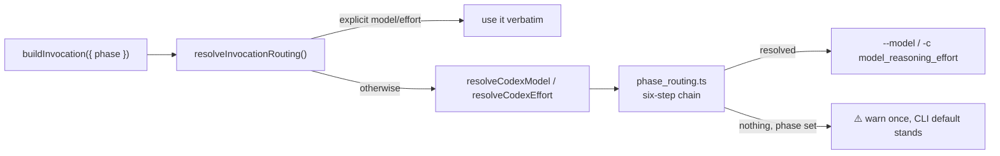

### ✨ Gemini per-phase routing

> **Applies to:** `claude` ❌ · `codex` ❌ · `gemini` ✅ · `deepseek` ❌ — this is Gemini's own chain: Claude's is the precedence chain above and Codex's is the section directly above it. DeepSeek's is the section directly below.

The Gemini CLI has **one** of the two levers: `--model`, but no
reasoning-effort option at all. Until Issue #364 the Gemini descriptor
discarded `request.phase` entirely, so every Gemini phase ran on whatever the
CLI happened to be configured with, and a configured `request.effort` was
dropped without a word.

Gemini now routes `phase` through its own table,
`GEMINI_PHASE_MODEL_DEFAULTS` in
[`worker/deno/lib/config_defaults.ts`](../worker/deno/lib/config_defaults.ts).
It covers the same phase keys as the Claude table, with Gemini model ids:

| Phase | Gemini model |
|-------|--------------|
| `planning`, `grill_me`, `quorum`, `quorum_judge`, `refinement`, `revision`, `question`, `clarification` | `gemini-2.5-pro` (top tier) |
| `issue` (implementation) | `gemini-2.5-flash` (base tier) |
| `ci_fix`, `pr_feedback`, `quality_fix` | `gemini-2.5-flash` (base tier) |
| `spelling_fix`, `summarise`, `health` | `gemini-2.5-flash-lite` (cheap tier) |

The model ids are an implementation choice over the current Gemini line-up, not
a fixed contract: a deployment on a different line-up re-pins a tier through
configuration rather than a code change.

**Precedence** is Claude's chain with Gemini-named keys, through the same
[`worker/deno/lib/phase_routing.ts`](../worker/deno/lib/phase_routing.ts):

1. **Phase-specific environment variable** — `GEMINI_MODEL_<PHASE>` (operator
   escape hatch)
2. **Per-repo phase override** — `gemini_phase_model_overrides` in the repo's
   `repo_config` entry
3. **Per-repo base model** — `gemini_model` in the repo's `repo_config` entry
4. **Global config phase overrides** — `gemini_phase_model_overrides` in
   `.config.json`
5. **Phase-specific hardcoded defaults** — the table above
6. **Global environment variable** — `GEMINI_MODEL`

An explicit `model` on the invocation request still beats all six, and per-repo
overrides are **replaced** — never merged — on every repo switch. There is
deliberately **no** effort counterpart to any of these keys: configuration the
CLI could never apply would be dead surface.

**Fail loud — the missing effort lever is reported, not swallowed.** An
operator who pins an effort for a phase, or simply relies on
`PHASE_EFFORT_DEFAULTS`, would otherwise get no signal that the lever does
nothing under Gemini. So when an effort is resolved for a Gemini invocation —
explicitly on the request, or from the phase effort design — the executor emits
**one** `console.warn` naming the provider, the phase and the requested effort:

```text
[gemini] Reasoning effort "high" requested for phase "planning" but the Gemini
CLI has no effort option; the request is ignored. Run this phase under a
provider that has the lever (claude, codex), or clear the effort configuration
for it.
```

The warning is de-duplicated **once per phase per worker process**, so a
multi-phase run states the gap for each phase it routes and a retried phase
states it once. No flag the CLI does not have is invented, the argv is
byte-identical to one carrying no effort, and the run is **not** failed — the
warning is the fix. A phase that resolves to no model warns the same way the
Claude and Codex chains do, and a phase-less invocation stays quiet.

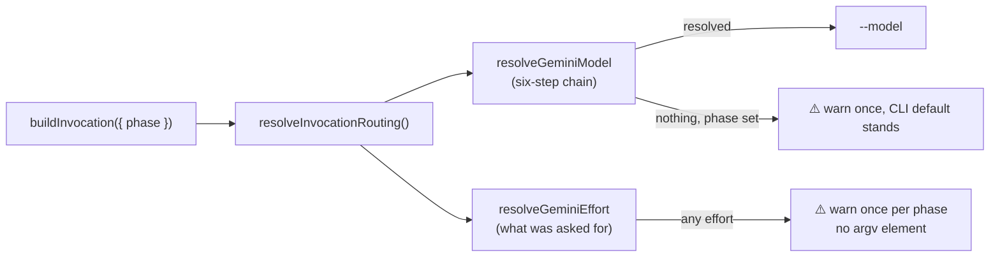

### 🐋 DeepSeek per-phase routing

> **Applies to:** `claude` ❌ · `codex` ❌ · `gemini` ❌ · `deepseek` ✅ — this is DeepSeek's own chain: Claude's is the precedence chain above, and Codex's and Gemini's are the two sections directly above it.

DeepSeek ships no CLI of its own. The provider is the **Anthropic CLI pointed
at DeepSeek's Anthropic-compatible endpoint**, installed as the `deepseek`
command from `container/providers/deepseek.sh` and pinned independently of
`claude`. That is what makes its routing table mandatory rather than a
nicety: every Claude default is a **tier alias** (`opus`, `sonnet`, `haiku`,
`fable`) that DeepSeek's endpoint cannot resolve, so a provider with no table
of its own would send an Anthropic alias to a third-party endpoint and fail
mid-run.

DeepSeek therefore routes `phase` through its own table,
`DEEPSEEK_PHASE_MODEL_DEFAULTS` in
[`worker/deno/lib/config_defaults.ts`](../worker/deno/lib/config_defaults.ts).
It covers the same phase keys as the Claude table, pinned to real DeepSeek
model ids:

| Phase | DeepSeek model |
|-------|----------------|
| `planning`, `grill_me`, `quorum`, `quorum_judge`, `refinement`, `revision`, `question`, `clarification` | `deepseek-reasoner` (top tier) |
| `issue` (implementation) | `deepseek-chat` (base tier) |
| `ci_fix`, `pr_feedback`, `quality_fix` | `deepseek-chat` (base tier) |
| `spelling_fix`, `summarise`, `health` | `deepseek-chat` (base tier) |

**There is no cheap rung, and that is deliberate.** Claude, Codex and Gemini
each drop the trivial trio (`spelling_fix`, `summarise`, `health`) onto a third,
cheaper tier; DeepSeek publishes no such tier, so those phases run on
`deepseek-chat` like the rest. The table is an implementation choice over the
current DeepSeek line-up, not a fixed contract — a deployment on a different
line-up re-pins a tier through configuration rather than a code change.

**Precedence** is Claude's chain with DeepSeek-named keys, through the same
[`worker/deno/lib/phase_routing.ts`](../worker/deno/lib/phase_routing.ts):

1. **Phase-specific environment variable** — `DEEPSEEK_MODEL_<PHASE>` (operator
   escape hatch)
2. **Per-repo phase override** — `deepseek_phase_model_overrides` in the repo's
   `repo_config` entry
3. **Per-repo base model** — `deepseek_model` in the repo's `repo_config` entry
4. **Global config phase overrides** — `deepseek_phase_model_overrides` in
   `.config.json`
5. **Phase-specific hardcoded defaults** — the table above
6. **Global environment variable** — `DEEPSEEK_MODEL`

An explicit `model` on the invocation request still beats all six, and per-repo
overrides are **replaced** — never merged — on every repo switch.

**No effort lever exists, so none is configured.** The Anthropic CLI has an
`--effort` flag, but DeepSeek's endpoint does not implement Anthropic's effort
control, so the flag is never emitted. There is deliberately **no**
`DEEPSEEK_PHASE_EFFORT_DEFAULTS` and no DeepSeek effort configuration key:
either would be dead surface. This is the Gemini treatment (#364), and an
effort resolved for a DeepSeek invocation is **reported, not swallowed** — the
executor emits one `console.warn` naming the provider, the phase and the
requested effort:

```text
[deepseek] Reasoning effort "high" requested for phase "planning" but
DeepSeek's Anthropic-compatible endpoint has no effort control; the request is
ignored. Run this phase under a provider that has the lever (claude, codex), or
clear the effort configuration for it.
```

The warning is de-duplicated **once per phase per worker process**, the argv is
byte-identical to one carrying no effort, and the run is **not** failed — the
warning is the fix.

**The Fable machinery is gated off, not merely absent.** DeepSeek has no Fable
tier, no rate-limit ladder (`deepseek-chat` is a different model, not a cheaper
rung of `deepseek-reasoner`) and no degraded-model reroute. The gate matters
more here than for Codex or Gemini: `--model opus` is a *well-formed* flag to
the Anthropic CLI DeepSeek runs, so an ungated pre-flight reroute would be
accepted locally and fail at the endpoint as an unresolvable model mid-run.
[#398](https://github.com/stSoftwareAU/VibeCoder/issues/398) provider-gates the
chokepoint and
[#417](https://github.com/stSoftwareAU/VibeCoder/issues/417) carries the
regression tests that keep it gated.

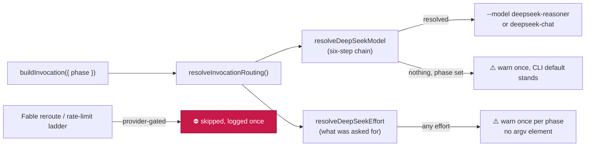
### Model Fallback on Rate Limit

> **Applies to:** `claude` ✅ · `codex` ❌ · `gemini` ❌ · `deepseek` ❌ — only Claude's descriptor defines `cheaperModel()`, so under Codex or Gemini no downgrade is attempted; the attempt returns `no-ladder-for-provider` and the worker warns once, naming the provider. DeepSeek defines no `cheaperModel()` either — `deepseek-chat` is a different model, not a cheaper rung of `deepseek-reasoner` — so it takes the same `no-ladder-for-provider` path.

When the worker is rate-limited after exhausting retries, it automatically
downgrades to a cheaper model instead of failing:

```
fable  →  opus  →  sonnet  →  haiku  →  (fail)
```

- Enabled by default; disable via `enable_model_fallback: false` in
  `.config.json`
- **The ladder is the active provider's, not always Claude's** (Issue #365).
  The current model is resolved through the running provider's own chain, and
  the cheaper tier through that provider's ladder. Only Claude defines one
  today: under **Codex or Gemini** the attempt returns the distinct reason
  `no-ladder-for-provider` — never `already-cheapest`, which would read as "the
  run was already on the cheapest tier" — and the worker warns **once**, naming
  the provider, so an operator sees that no downgrade was attempted rather than
  inferring it from silence. Give a provider a ladder by adding
  `cheaperModel()` to its descriptor in `agent_provider.ts`.
- **Model-unavailable (export-control) downgrade.** When
  the requested tier is *unavailable or not permitted* — rather than
  rate-limited — `detectModelUnavailable()` matches the error tail (403 /
  `permission_error`, "disabled", "not available", and the export-control
  "restricted"/"export control" wording naming the tier) and the loop downgrades
  **immediately, with no wait**, resolving the same `fable → opus` (Opus 4.8)
  hop. This fires for the requested tier however Fable was selected — the
  `planning`/`grill_me` phase defaults *and* a per-repo `claude_model: "fable"`
  base tier. The substitution is **per-run and config keeps pointing at Fable**,
  so once Fable returns the next run requests it again with no manual change
  (self-heal) — there is no persistent "Fable is down" circuit-breaker.
- Fallback transitions are recorded in credit logs as `fallbackFrom`: `runClaudeWithRetry` threads the pre-fallback model into the
  re-invocation via the `fallbackFrom` option, so the post-fallback
  `logInvocation()` records the original→cheaper transition and the
  daily-summary `byFallback` map (e.g. `opus→sonnet: 1`) is populated. This
  covers both the rate-limit and the model-unavailable fallback paths.
- Implementation:
  [`worker/deno/lib/model_fallback.ts`](../worker/deno/lib/model_fallback.ts),
  [`worker/deno/lib/claude_runner.ts`](../worker/deno/lib/claude_runner.ts)

### Two-stage planning self-critique flow

> **Applies to:** `claude` ✅ · `codex` ✅ · `gemini` ✅ · `deepseek` ✅ — both turns are ordinary phase invocations, so they run on whichever provider is active; only the continuity between them differs (see [Session Resume](#session-resume)).

Planning runs **attack their own answer** before publishing. Rather than a
single agentic Claude call that creates sub-issues directly, a planning run is
two sequential `phase: "planning"` invocations — a draft turn and a
critique-and-publish turn — so the model receives its own draft as an artefact
to criticise rather than anchoring on the reasoning that produced it:

1. **Draft turn.** Claude produces the complete plan (sub-issue titles, bodies,
   acceptance criteria, dependency edges) as **text only** — it is explicitly
   forbidden from running `gh issue create` or closing the parent issue.
2. **Critique → revise → execute turn.** Resuming the same Claude session
  , the worker embeds the stage-1 draft as a **sanitised**
   artefact (the draft derives from untrusted issue text, so it is framed and
   passed through `sanitiseDelimiterPatterns`,) and instructs
   Claude to adversarially critique the draft — *what is wrong with this
   approach: missing work, mis-scoping, wrong dependencies, over-engineering,
   duplication, weak acceptance criteria* — revise the plan **once** (single
   iteration, KISS — no critique loop), and only then create the final
   sub-issues, post one summary comment, and close the parent. The critique
   text stays internal: **it is never posted** to any comment or issue body.

The flow is **never worse than the pre-two-stage single call**. If the draft
turn fails, times out, or returns an empty draft, the run falls back to the
original single-invocation planning prompt. If the draft turn disobeys and
creates real sub-issues despite the text-only instruction, those are accepted
and the critique turn is skipped. The existing three-tier sub-issue detection,
the zero-sub-issue retry, and `closePlanningIssue` all apply to
the publish turn's output unchanged.

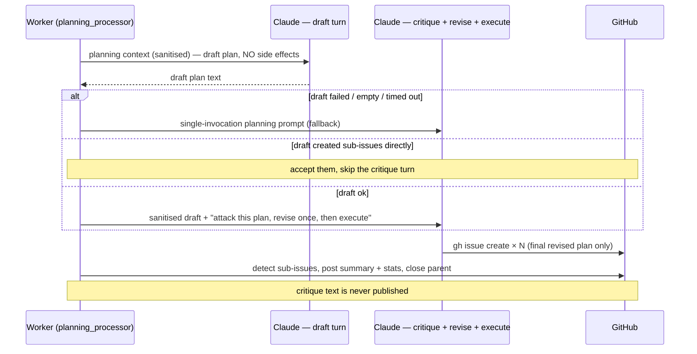

Each turn is one planning-phase invocation, so a normal run records **two**
invocations (draft + publish), or **three** when the retry fires — the
list the stats section below aggregates over. The prompt assets live in
[`prompts/planning/`](../prompts/planning/); the worker always loads the latest
version at runtime.

- Implementation:
  [`worker/deno/lib/planning_processor.ts`](../worker/deno/lib/planning_processor.ts)

### Planning-run stats + degraded-model detection

> **Applies to:** `claude` ✅ · `codex` ⚠️ · `gemini` ⚠️ · `deepseek` ✅ — the stats comment is posted for every provider, and since [#441](https://github.com/stSoftwareAU/VibeCoder/issues/441) the expected model is derived from the **invocation's own** provider routing (`provider.resolveModel(phase)`), not from Claude's chain. DeepSeek runs the Claude CLI with `--output-format stream-json`, so its served model **is** observed and is now judged against `deepseek-reasoner` rather than `fable`; a genuinely wrong DeepSeek tier (`deepseek-chat` for `planning`) still flags. The served model is read from those same `stream-json` assistant lines, which Codex and Gemini do not emit, so their runs observe no served model and report `❓ unknown` rather than a degraded verdict.

Every planning run posts a short model-usage stats block on the parent issue
and computes a **degradation verdict**. The block reports the requested model,
the served model(s) the API declared, effort, token counts, turn count and
duration (when the CLI reports them), the number of planning invocations, and
`degraded: yes/no`.

A run is **degraded** when **no** planning-phase response was served by the
configured best planning model, or an explicit rate-limit fallback fired:

- **Expected model** is the configured best planning model. The
  `best_planning_model` config key (global, or per-repo via `repo_config`)
  **pins** a specific model the run is expected to be served by. When it is left
  empty — the default — the expected model is derived from the `planning` phase
  resolution chain of **the provider the invocation ran on**, by reusing that
  provider descriptor's
  [`resolveModel(phase)`](../worker/deno/lib/agent_provider.ts) (single source of
  truth, no duplicated chain), so a repo that deliberately routes planning to a
  different tier via `repo_config` is never falsely flagged. Set it to expect an
  exact model regardless of routing.
- **The chain is the provider's own, not Claude's** (Issue #441). Reading
  Claude's chain unconditionally was harmless while only Claude exposed a served
  model, but DeepSeek is carried on the Anthropic CLI: a `planning` run under
  `agent_provider: deepseek` compared served `deepseek-reasoner` against expected
  `fable` and flagged itself degraded for a tier the operator never requested.
  The gate is the descriptor, never a `provider.id === "claude"` equality check —
  the same shape [#398](https://github.com/stSoftwareAU/VibeCoder/issues/398)
  established for the pre-flight reroute, one layer up.
- **Served-model match** is prefix/alias-aware: requested `fable` (or
  `claude-fable-5`) vs served `claude-fable-5-<date>` is **OK**; a served
  `claude-opus-*` alone is **degraded**.
- **The served-model rule is lenient at run level**. The verdict
  looks at the union of served models across every judged invocation: the run is
  degraded only when **none** of them match. A **mixed** run — Fable served part
  of the work, another tier served the rest — is therefore **not** degraded; the
  expected tier was still in play. This is the same rule `isMismatch()` in
  [`planning_run_aggregation.ts`](../worker/deno/lib/planning_run_aggregation.ts)
  applies to the fleet aggregate, so the per-run verdict and the aggregate can
  no longer disagree. Every served model is still listed in the stats comment,
  so partial service by a lower tier stays visible.
- **Explicit signals stay unconditional.** A recorded `fallbackModel`
  (rate-limit downgrade,) or `preflightDegraded` flag (pre-flight Fable
  reroute,) flags the run even on a mixed run where Fable also served.
  These are out-of-band signals the served-model data cannot contradict —
  silencing a known downgrade would report it as clean (fail-loud,).
- Only `phase: "planning"` invocations are judged — auxiliary calls (e.g.
  `summarise`/haiku helpers) never trigger the flag.

The served `model` field captured per-run is the only observable source
of truth. Stats land on the parent on **every** planning run: folded into the
existing summary comment on closure (one comment, less noise), or posted
standalone on a run that failed after at least one invocation. Posting is
non-fatal — a comment failure never fails the planning run.

The **effort** line is shown verbatim from the value the worker requested —
`max`/`xhigh`/`high`/`medium`/`low`, including the `xhigh` level from Issue 2620
— so an operator sees both *which model* and *at what effort* generated the plan.
Token counts are summed across every planning invocation in the run; turns and
duration appear only when the CLI reports them.

#### Example stats comment

A healthy run on the default routing (planning on the Fable 5 tier) appends a
block like this to the planning summary comment:

```markdown
## Planning run model stats

- **Requested model:** `claude-fable-5`
- **Served model(s):** `claude-fable-5-20250115`
- **Effort:** `high`
- **Planning invocations:** 2
- **Tokens:** input 48,210 · output 6,540 · cache write 12,800 · cache read 31,400
- **Turns:** 14
- **Duration:** 3m 12s
- **Estimated cost (USD, estimate only):** ~$0.85
  - `claude-fable-5-20250115`: $0.85 — input $0.48 · output $0.33 · cache write $0.16 · cache read $0.03
- **Degraded:** no
- **Failure-Detection gate:** published 3 · offenders 0 · repaired 0 · still offending 0 · deferred 0
- **Failure-Detection repair:** 0ms
```

The two **Failure-Detection** lines (Issue #63) record what the
presence gate and its
model-driven self-repair did on this run: how many sub-issues were published and
gated, how many offended, how many the repair fixed, how many it could not, how
many it deferred out of budget, and the wall-clock it
spent. They are emitted on **every** gate path — clean, fully repaired, and
partially repaired — with explicit zeros on a clean run, because a metric only
emitted on the unhappy path cannot distinguish "healthy" from "not reporting".
That is why the systemic scale of the missing-criterion defect was previously
findable only by grepping worker logs. A run that gated sub-issues but produced
no model stats (a recovery close that skipped Claude) still posts the block
carrying these counts.

The **estimate-only** cost block prices the recorded tokens
against the shared `MODEL_PRICING` table (`worker/deno/lib/token_usage.ts`) — the
single source of truth for rates — via `formatCostEstimateLines()`
(`worker/deno/lib/cost_estimate.ts`). Currency is USD as billed by Anthropic and
the figure is always labelled an estimate. A run that mixes models (e.g. a
Fable→Opus fallback across invocations) is costed **per model**, each on its own
sub-bullet, and the totals are summed. When a served model has no pricing row its
sub-bullet reads `_pricing unknown_` and the summary is marked `(partial …)`
rather than silently costed at zero (fail-loud,). The block is
omitted entirely when no priced tokens were recorded.

When the same run is served by a different tier — and the expected tier served
**none** of it — the verdict line flips and names the reason:

```markdown
- **Degraded:** ⚠️ yes — served model `claude-opus-4-7` does not match expected `claude-fable-5`
```

When several non-matching tiers served the run, all of them are named:

```markdown
- **Degraded:** ⚠️ yes — no served model matches expected `claude-fable-5` (served: `claude-opus-4-7`, `claude-sonnet-4-5`)
```

An explicit rate-limit downgrade reads instead:

```markdown
- **Degraded:** ⚠️ yes — explicit rate-limit fallback to `claude-opus` (expected `claude-fable-5`)
```

When a planning invocation ran and produced output but **no** served model could
be observed (older Claude CLI versions omit `message.model`, or every assistant
line fails to parse), the verdict is **indeterminate** rather than a clean
`Degraded: no`. The verdict cannot legitimately assert health when
it observed no served model, so it reports `unknown` and the served-model line
reads `_none reported_`:

```markdown
- **Served model(s):** _none reported_
- **Degraded:** ❓ unknown — no served model observed (expected `claude-fable-5`); cannot confirm the run was served by the expected model
```

An indeterminate verdict is **not** a confirmed degradation: `degraded` stays
`false`, so the `degraded-model` label is **not** applied — only the stats line
changes, distinguishing "served model confirmed to match" from "served model
could not be captured". The indeterminate check is skipped when the expected
model itself is unresolvable (the routing chain resolved to the CLI default,).

#### `degraded-model` label lifecycle

When the verdict is degraded, the worker tags the **parent issue being planned
and every sub-issue that run created** with the non-reserved `degraded-model`
label, so silent model degradation is visible at a glance:

- **Not reserved.** `degraded-model` is a plain workflow-state label defined in
  [`label_definitions.ts`](../worker/deno/setup/label_definitions.ts) (colour
  `e99695`). It is **not** in `RESERVED_LABELS`, so `label_security.ts` does not
  strip it when the worker self-applies it. (`best-model` *is* reserved and
  stripped on self-apply, which is why it cannot carry this signal —
  `degraded-model` is its non-reserved replacement.)
- **Create-if-missing.** The label is ensured once per degraded run (the same
  pattern used for `security`/`idle-task`), then added to the parent and each
  detected sub-issue number.
- **Non-fatal.** Every create/apply call is best-effort — a failure is logged
  and never aborts planning-run closure.
- **Worker never removes it.** Healthy runs apply nothing; a human clears the
  label after investigating, so the signal persists until triaged.

#### Interplay with effort and per-repo overrides

The **expected** model is whatever the `planning` phase resolution chain
requests (env var > per-repo `phase_model_overrides` > per-repo `claude_model` >
global overrides > `PHASE_MODEL_DEFAULTS.planning`), unless `best_planning_model`
pins an exact model. Because operators already steer per-repo model and effort
through `repo_config` and per-phase effort overrides,
a repo that *deliberately* routes planning to a different tier is judged against
**its own** configured model and is never falsely flagged. Pin
`best_planning_model` only when you want a run flagged whenever it deviates from
one specific model regardless of routing.

- Implementation:
  [`worker/deno/lib/planning_run_stats.ts`](../worker/deno/lib/planning_run_stats.ts)
  (stats + verdict) and
  [`worker/deno/lib/planning_degraded_label.ts`](../worker/deno/lib/planning_degraded_label.ts)
  (label application), wired into
  [`worker/deno/lib/planning_processor.ts`](../worker/deno/lib/planning_processor.ts)

#### Grill-me degraded-model detection

The `grill_me` phase routes to the **same** Fable top tier as planning
(`DEFAULT_CLAUDE_MODEL_GRILL_ME = DEFAULT_CLAUDE_MODEL_TOP_TIER`) with the same
"plan-quality compounds across every downstream sub-issue" rationale, so
a silent Fable→Opus degradation on a requirements-interrogation round is exactly
the failure class this family surfaces. The detection helpers in
`planning_run_stats.ts` are therefore **phase-parametric**:
`resolveExpectedPlanningModel`, `assessDegradation`, and
`buildPlanningStatsSection` take a `phase` argument (default `"planning"`, so the
planning behaviour and the `## Planning run model stats` heading that
`planning_run_aggregation.ts` parses are unchanged). The grill-me path passes
`"grill_me"`, deriving its expected model from the `grill_me` routing chain — so
a repo that deliberately routes grill-me elsewhere is never falsely flagged, and
**no new config key** (`best_grill_me_model`) is introduced.

**Deliberate scoping difference.** Planning posts a stats block on **every** run.
Grill-me is an interactive, multi-round, human-facing clarification flow, so a
model-stats block after every healthy round would clutter the conversation the
developer is reading. Grill-me therefore applies the `degraded-model` label
**only on a degraded round**, and its stats block posts under a
`## Grill-me run model stats` heading. There are no sub-issues on a grill-me
round, so only the grill-me issue itself is labelled. Every GitHub operation is
non-fatal and never aborts the round.

> **Superseded in part by.** Healthy rounds no longer report
> *nothing*: they post the stats block **once per run**. See
> [One cost/model stats comment per run](#one-costmodel-stats-comment-per-run).

- Implementation:
  [`worker/deno/lib/grill_me_run_stats.ts`](../worker/deno/lib/grill_me_run_stats.ts)
  (`reportGrillMeDegradation`, reusing the phase-parametric helpers and the
  shared `degraded-model` label), wired into the success path of
  [`worker/deno/lib/grill_me_processor.ts`](../worker/deno/lib/grill_me_processor.ts)

#### Extended to the four reactive planning-shaped phases

The same grill-me shape now covers **all six** Fable-preferring planning-shaped
phases — the four reactive single-issue phases `refinement`, `revision`,
`question`, and `clarification` join `planning` and `grill_me`. A silent
Fable→Opus substitution on any of them was previously invisible; each now posts a
`## <Phase> run model stats` comment and applies the `degraded-model` label to
**the issue itself** (no sub-issue fan-out) **only on a degraded round** —
healthy Fable-served rounds apply no label, exactly like grill-me. (Since
 a healthy round still posts its stats block once per run; only
the label is degraded-only.)

The verdict helpers are **not** forked: the four phases call the generic
[`reportPhaseDegradation`](../worker/deno/lib/phase_run_stats.ts), which reuses
the phase-parametric `buildDegradationReport` from `planning_run_stats.ts`.
`grill_me_run_stats.ts` also delegates to the generic, so all six phases share
one recorder.

**Two trigger paths, both honoured:**

- **Explicit pre-flight reroute** (the probe said Fable was unavailable,
  so the phase was dispatched on Opus @ `max`). The run carries an explicit
  `preflightDegraded` flag + reason, which `assessDegradation` now treats as a
  first-class degraded cause — flagged **even when the served model matches the
  (fable) expected model**, since the reroute deliberately leaves
  `buildClaudeModelArgs(phase)` resolving to `fable`.
- **Mid-run fallback** (the probe said available but the live call
  fell back to Opus @ `high`). Recorded via the existing served-model /
  `fallbackModel` checks now that these phases run the verdict. This path is an
  FYI only — no effort bump, no cache flip.

`planning`/`grill_me` recording is unchanged for the served-model and
rate-limit-fallback paths, and additionally honours the explicit pre-flight flag.
All recording is non-fatal: a `gh`/label failure logs a warning and never aborts
the phase.

- Implementation:
  [`worker/deno/lib/phase_run_stats.ts`](../worker/deno/lib/phase_run_stats.ts)
  (`reportPhaseDegradation`, `buildPhaseInvocations`), wired into
  [`refinement_processor.ts`](../worker/deno/lib/refinement_processor.ts),
  [`revision_processor.ts`](../worker/deno/lib/revision_processor.ts),
  [`question_processor.ts`](../worker/deno/lib/question_processor.ts), and the
  clarification dispatch in
  [`clarity_phase.ts`](../worker/deno/lib/clarity_phase.ts) /
  [`clarity_assessment.ts`](../worker/deno/lib/clarity_assessment.ts). The
  explicit pre-flight signal originates in
  [`fable_routing.ts`](../worker/deno/lib/fable_routing.ts) and is carried
  on the run record by `claude_runner.ts`.

#### One cost/model stats comment per run

Only the planning close path posted stats on a healthy run. Every other phase
reported them **only when the round was degraded**, and a `work-on` issue —
auto-closed by its merged PR, with no worker attached at that moment — got
nothing at all. Most issues the Vibe Coder completed therefore carried no cost
indication.

Issue #3756 closed that gap with an **issue-scoped** guard: the first wrap-up to
reach the issue posted, and every later run stayed silent. On
[#762](https://github.com/stSoftwareAU/VibeCoder/issues/762) the winner was a
$1.34 grill-me round, so the `work-on` run that actually completed the issue —
16 follow-up issues and a PR — reported nothing. That is the defect #797
reported: the cost of the completed issue was invisible.

The guard is therefore **run-scoped** (Issue #797): the marker carries the run
id, and a post is suppressed only when *this run* already posted. Every
completed run reports what it cost, a repeat post inside one run is still
suppressed, and from the second stats comment onward each block carries the
cumulative issue total so the issue's cost is readable without adding comments
up by hand.

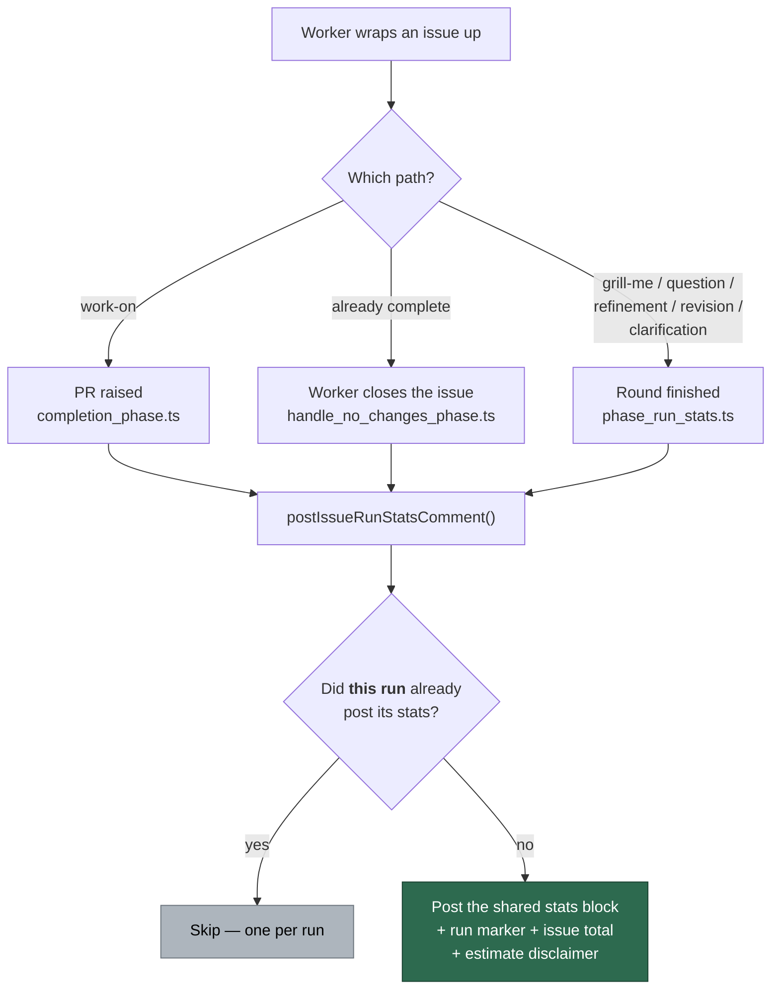

- **No new format.** The block is the same `## <Phase> run model stats` render
  built by `buildDegradationReport` — the heading names the phase that posted it
  (`## Issue run model stats` for a `work-on` run).
- **Duplicate guard.** The comment carries a hidden
  `<!-- vibe-issue-run-stats run="<run id>" -->` marker and the guard matches
  that exact run. The run id is sanitised to `[A-Za-z0-9._-]` before it reaches
  the marker, so a malformed `VIBE_RUN_ID` can never close the comment early.
- **Cumulative issue total.** `tallyIssueCost()` sums the
  `Estimated cost (USD, estimate only)` line of every run-stats comment on the
  issue — including the pre-#3756 planning and degraded-round comments, matched
  by heading. A comment that carries no parseable figure marks the total
  `(partial)` rather than letting the sum read as complete.
- **Estimate disclaimer.** KISS on multi-worker coverage — no cross-worker
  aggregation infrastructure. Each comment states that the figures are an
  estimate covering the run that posted them, and that the total only sums the
  comments visible on the issue.
- **Degraded rounds are exempt from the guard.** The `degraded-model` label must
  never appear without the figures that justify it, so a degraded round posts
  unconditionally.
- **Human-closed issues with no worker run get no comment** — there is no worker
  to post one.
- Purely non-fatal: a listing or comment failure is logged and never aborts the
  phase, and is reported as a failure rather than silently read as "posted".

- Implementation:
  [`worker/deno/lib/issue_run_stats_comment.ts`](../worker/deno/lib/issue_run_stats_comment.ts)
  (`buildIssueRunStatsComment`, `postIssueRunStatsComment`,
  `ghIssueCommentLister`), wired into
  [`phase_run_stats.ts`](../worker/deno/lib/phase_run_stats.ts) (all six
  planning-shaped phases),
  [`phases/completion_phase.ts`](../worker/deno/lib/phases/completion_phase.ts)
  (PR-raise time), and
  [`phases/handle_no_changes_phase.ts`](../worker/deno/lib/phases/handle_no_changes_phase.ts)
  (already-complete close). The `work-on` run's invocations are captured by
  `recordClaudeRunStats` in
  [`phases/execute_phase.ts`](../worker/deno/lib/phases/execute_phase.ts).

#### One-off vs systemic: the fable→Opus mismatch was systemic

FLEET was the first planning run to post model stats, so a single
data point could not tell whether the `fable`→`claude-opus-4-8` substitution was
a one-off blip (transient capacity) or systemic. As more runs reported, the
answer became unambiguous: **systemic**.

Observed planning runs (requested `fable`, served model the API declared):

| When (UTC) | Repo / issue | Requested | Served | Degraded |
| --- | --- | --- | --- | --- |
| 2026-06-12 22:32 | `stSoftwareAU/private-repo-1` | `fable` | `claude-opus-4-8` | yes |
| 2026-06-13 00:04 | `stSoftwareAU/private-repo-1` | `fable` | `claude-opus-4-8` | yes |
| 2026-06-13 06:55 | `stSoftwareAU/VibeCoder` | `fable` | `claude-opus-4-8` | yes |

Three of three `fable` planning runs across two repos were served
`claude-opus-4-8` (100% mismatch). The **root cause is external and documented**:
on 2026-06-12 Anthropic globally disabled Fable 5 (and Mythos 5) under a US
government export-control directive. VibeCoder routes its top-tier
phases (`planning`, `grill_me`) to Fable 5, so every such run is served
Opus for the duration of the outage — not a transient capacity blip. The
host-level fix reflects this severity: completes the automatic
Fable-unavailable → Opus 4.8 fallback with self-heal once Fable is
restored, documents the behaviour, and adds the regression test.

The verdict is reproducible from the existing per-run stats with the lightweight
aggregator
[`worker/deno/lib/planning_run_aggregation.ts`](../worker/deno/lib/planning_run_aggregation.ts):
`parsePlanningStatsComment()` reads a "Planning run model stats" comment body and
`summarisePlanningRuns()` folds a list into a one-off-vs-systemic verdict
(`systemic` when ≥2 `fable` runs mismatch at ≥80%, `inconclusive` on a single
mismatch, `one-off` when isolated, `none` when all served `fable`). It reuses the
existing comment format and the daily credit summary — it does **not** add a new
dashboard.

### Fable-unavailable auto-fallback + self-heal

> **Applies to:** `claude` ✅ · `codex` ❌ · `gemini` ❌ · `deepseek` ❌ — Fable is an Anthropic tier with no Codex or Gemini equivalent; under those providers the probe runs their own CLI with `--model fable`, fails, and is classified optimistically as `available`, so nothing is rerouted or flagged. DeepSeek has no Fable tier either — its endpoint cannot resolve the alias, so the probe fails there too and is read optimistically as `available`.

The eight **Fable-preferring** planning-shaped phases — `planning`, `grill_me`,
`refinement`, `revision`, `question`, `clarification`, `quorum` and
`quorum_judge` — request
**Fable 5** (`claude-fable-5`) because plan quality compounds across every
downstream sub-issue or run. When Fable 5 is **globally unavailable** —
the export-control suspension documented in the [one-off vs systemic](#one-off-vs-systemic-the-fableopus-mismatch-was-systemic)
section above, an account suspension, an HTTP `403`, or a silent server-side
substitution — the worker does **not** fail those runs and does **not** need an
operator to repoint the config. It serves the run on **Opus 4.8**, flags it, and
self-heals the moment Fable returns. The behaviour is assembled from existing
parts — the pre-flight probe, the in-run model-unavailable
fallback, and degraded detection (extended to `grill_me` in
and to the four reactive phases in) — so this section ties them into one
coherent story.

#### Three manifestations, all covered

Fable being unavailable is caught at three points — once **before** the run and
twice **during** it. The effort behaviour differs by point: the **pre-flight
reroute bumps effort to `max`**; both **mid-run fallbacks keep the requested
`high` effort** (record-only, KISS — no bump, no cache flip).

1. **Pre-flight reroute (before the call).** When the cached Fable-availability
   probe — a new check type in the 15-minute health cache — already says
   `unavailable`, the phase is rerouted **before dispatch** onto **Opus at `max`
   effort** and flagged degraded via an explicit signal, so no first Fable call
   is wasted. This is the deliberate `high` → `max` "request the higher effort"
   bump. Full rules in
   [Pre-flight Fable reroute](#pre-flight-fable-reroute).
2. **Outright unavailable / `403` / suspended error (during the run).** The CLI
   exits non-zero with model-access wording. `detectModelUnavailable()` (matching
   `MODEL_UNAVAILABLE_RE` over the error tail in
   [`claude_executor.ts`](../worker/deno/lib/claude_executor.ts)) recognises it
   *before* the rate-limit path — this error is terminal for the current model,
   so retrying Fable is futile. The run falls back **immediately, with no wait**
   to the next tier via `attemptModelFallback()`
   ([`model_fallback.ts`](../worker/deno/lib/model_fallback.ts),
   `fable → opus → sonnet → haiku`), wired into the retry loop in
   [`claude_runner.ts`](../worker/deno/lib/claude_runner.ts), keeping the
   requested `high` effort. The transition is recorded in the credit log as
   `fallbackFrom` and logged as a `MODEL_UNAVAILABLE` security event.
3. **Silent served-model substitution (during the run).** The run "succeeds" but
   the API serves a different model than requested (requested `fable`, served
   `claude-opus-4-8`). No error fires, so the fallback path is never taken —
   instead the **degraded-model served-model check** catches it: no per-response
   served `model` field in the run passes the prefix/alias-aware match
   against the expected top-tier model, and the run is flagged degraded (see
   below). A run the expected tier served *part* of is not flagged.
   Effort is left unchanged.

#### Flagging — `degraded-model` label + model-stats comment

Any of the three manifestations flags the run so an operator can see the
substitution is expected, automatic, and temporary rather than a
misconfiguration. The flagging now covers **all six** Fable-preferring
planning-shaped phases (extended from planning + grill_me by):

- A **model-stats comment** is posted on the issue under a
  `## <Phase> run model stats` heading — e.g. `## Planning run model stats`,
  `## Grill-me run model stats`, `## Refinement run model stats` — naming the
  requested model, the served model(s), and a `Degraded: ⚠️ yes — …` verdict line
  that states the reason (a pre-flight reroute, a served-model mismatch, or an
  explicit fallback to a cheaper tier).
- The non-reserved **`degraded-model` label** is applied — for `planning`, the
  parent plus every sub-issue it created; for `grill_me` and the four reactive
  phases (`refinement`, `revision`, `question`, `clarification`), the issue itself
  and only on a degraded round. It is not in `RESERVED_LABELS`, so it survives
  self-apply; the worker never removes it — a human clears it after triage. The
  verdict and label logic is the phase-parametric detection in
  [`planning_run_stats.ts`](../worker/deno/lib/planning_run_stats.ts), reused for
  `grill_me` via
  [`grill_me_run_stats.ts`](../worker/deno/lib/grill_me_run_stats.ts) and
  for the four reactive phases via
  [`phase_run_stats.ts`](../worker/deno/lib/phase_run_stats.ts).

#### Self-heal — no persistent "Fable down" switch

The substitution is **per-run**. Config keeps pointing at Fable throughout: the
six Fable-preferring resolution chains still resolve to `fable`, every new run
requests Fable again, and the fallback/served-model check only fires while Fable
is actually unavailable. **There is deliberately no persistent "Fable down" flag
to set or clear.** Once Anthropic restores Fable 5, the very next run is served
Fable, the served-model check passes, no stats comment or `degraded-model` label
is emitted, and routing is back to normal with **zero manual intervention**. The
only lingering artefact is the `degraded-model` label on issues touched during
the outage, which a human clears once they have confirmed the cause.

The **pre-flight probe is best-effort** and never gets in the way:

- Fable unavailability never fails the health check or blocks the worker — the
  probe only *routes*, it does not gate.
- A transient probe error is treated as **"available"**, so a Fable-preferring
  phase still attempts Fable and the mid-run fallback (manifestations 2 and 3
  above) remains the safety net.
- A **stale `available`** verdict self-corrects the same way — the phase requests
  Fable, the live call falls back, and the run is still flagged degraded.
- There remains **no persistent "Fable down" switch**: routing self-heals as soon
  as the next probe (or the next live call) sees Fable return.

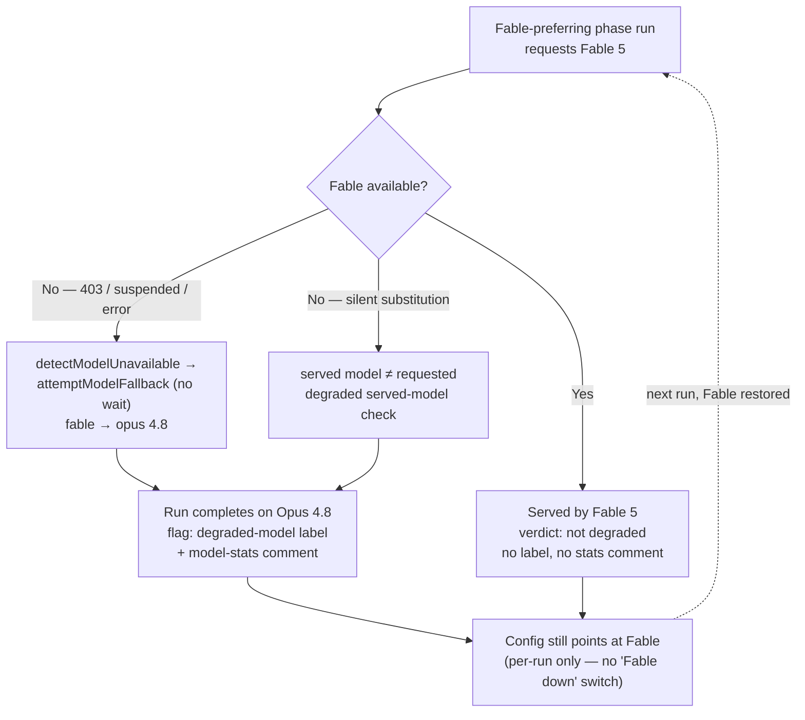

- Implementation:
  [`claude_runner.ts`](../worker/deno/lib/claude_runner.ts) (retry loop +
  model-unavailable branch),
  [`claude_executor.ts`](../worker/deno/lib/claude_executor.ts)
  (`detectModelUnavailable` / `MODEL_UNAVAILABLE_RE`),
  [`model_fallback.ts`](../worker/deno/lib/model_fallback.ts)
  (`attemptModelFallback`, `MODEL_FALLBACK_MAP`),
  [`planning_run_stats.ts`](../worker/deno/lib/planning_run_stats.ts) and
  [`grill_me_run_stats.ts`](../worker/deno/lib/grill_me_run_stats.ts)
  (degraded verdict + flagging).

### Pre-flight Fable reroute

> **Applies to:** `claude` ✅ · `codex` ❌ · `gemini` ❌ · `deepseek` ❌ — neither has a Fable tier to reroute off, and since [#398](https://github.com/stSoftwareAU/VibeCoder/issues/398) the chokepoint is **provider-gated**: a Codex or Gemini invocation keeps its own routing under a Fable outage, is never flagged `preflightDegraded`, and the skipped reroute is logged once per provider. The gate matters most for DeepSeek: `--model opus` is a well-formed flag to the Anthropic CLI it runs, so an ungated reroute would reach DeepSeek's endpoint as a mid-run unresolvable-model error ([#417](https://github.com/stSoftwareAU/VibeCoder/issues/417)).

The mid-run fallback above self-corrects **after** a wasted first Fable call. A
**pre-flight** reroute avoids even that wasted call: when the cached Fable
probe ([`health_check_cache.ts`](../worker/deno/lib/health_check_cache.ts)
→ `readFableAvailability`) already says Fable is **unavailable**, a
Fable-preferring phase is dispatched straight onto **Opus at `max` effort** for
that one invocation, and the run is flagged **degraded** with the reason
`fable-unavailable (pre-flight health probe)`.

- **The eight Fable-preferring phases** — `planning`, `grill_me`, `refinement`,
  `revision`, `question`, `clarification`, `quorum`, `quorum_judge` — are the
  only phases eligible. Every
  other phase (issue, ci_fix, pr_feedback, health, …) is never rerouted.
- **Provider-gated** (Issue #398). `opus` is an Anthropic tier alias, so the
  reroute fires only when the **invocation's** provider routes that phase to
  the Fable tier. A Quorum draft naming `agentProvider: "codex"` — or any
  invocation under Gemini — keeps its own routing and is **not** flagged
  degraded for a tier it never requested. The gate is on the resolved tier, not
  on the provider id, so a fourth provider carrying a Fable tier needs no edit.
  Skipping the reroute is logged once per provider per worker process
  (`[fable-routing] …`), never in silence.
- **The gate, not the CLI, is the defence** (Issue #417). Codex and Gemini
  reject an unresolvable `--model` at their own CLI's argument layer, which
  masks how much the gate carries. A provider carried on the **Anthropic CLI**
  pointed at another vendor's endpoint — DeepSeek (Issue #396) — has no such
  backstop: `--model opus` is a well-formed flag that the CLI forwards happily,
  so an ungated reroute would surface as a remote unresolvable-model error
  mid-run, attributed to a tier the operator never requested. The
  descriptor-derived gate is therefore exercised once per registered provider
  in
  [`fable_preflight_deepseek_gate_test.ts`](../worker/deno/tests/fable_preflight_deepseek_gate_test.ts),
  so a provider registered without it fails `deno test` rather than the next
  Fable outage.
- **Effort semantics.** The pre-flight reroute bumps effort to `max` ("request
  the higher effort"). This is distinct from the mid-run fallback, whose effort
  is left **unchanged** — the two paths never interfere.
- **Override wins.** The reroute fires only for **default routing**. If an
  operator has moved the phase off the Fable tier (its resolved model is no
  longer `fable`) or pinned an explicit effort, the probe does not second-guess
  the pin — no reroute. The default `CLAUDE_MODEL_<PHASE>=fable` env export is
  *not* treated as an operator override, since it merely surfaces the built-in
  default; the reliable signal is the **resolved model tier**.
- **Regression guard.** The override is applied at the **invocation layer** (an
  explicit `model`/`effort` on the run options passed to `runClaudeWithRetry`),
  never by rewriting `PHASE_MODEL_DEFAULTS`. So `buildClaudeModelArgs("planning")`
  still resolves to `fable` and the served-vs-expected degraded check
  keeps working. The pre-flight degraded flag is threaded onto the run record
  (`ClaudeRunResult.preflightDegraded` / `preflightDegradedReason`) as an
  **explicit** signal the recording sub-issue consumes — it never depends on a
  served-model mismatch.

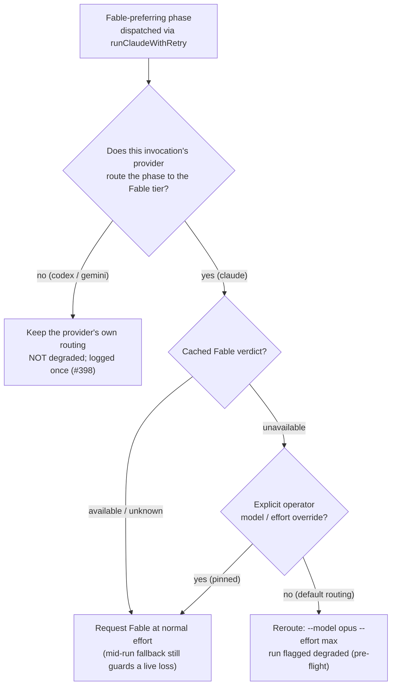

- Implementation:
  [`fable_routing.ts`](../worker/deno/lib/fable_routing.ts)
  (`resolveFablePreflightRouting`, `applyFablePreflightRouting`,
  `providerRoutesToFableTier`, `warnProviderHasNoFableTier`,
  `FABLE_PREFERRING_PHASES`), wired at the single `runClaudeWithRetry`
  chokepoint in
  [`claude_runner.ts`](../worker/deno/lib/claude_runner.ts), with the
  explicit-effort predicate `hasExplicitEffortOverride` in
  [`claude_executor.ts`](../worker/deno/lib/claude_executor.ts).

---

## Session Management

> **Applies to:** `claude` ✅ · `codex` ⚠️ · `gemini` ⚠️ · `deepseek` ⚠️ — the per-repo session store holds `.claude/` only, so persistence, allowlisting, milestone branching and compaction are Claude's; Codex and Gemini keep their own CLI state in their own home directories and get CLI-level continuity through their own resume flags. DeepSeek runs the Claude CLI, so the per-repo `.claude/` store applies to it as written; its transcripts sit in its own `CLAUDE_CONFIG_DIR`, kept apart from Claude's so `--resume` cannot cross the two.

VibeCoder maintains persistent Claude sessions per repository and per
work stream. Each phase invocation is a subprocess call to the Claude CLI,
but the `.claude/` session directory is preserved between invocations so
that context from previous work (learnt conventions, codebase familiarity)
carries forward.

### Per-Repository Session Persistence

> **Applies to:** `claude` ✅ · `codex` ❌ · `gemini` ❌ · `deepseek` ✅ — the store saves and restores `${repoPath}/.claude` alone; no Codex or Gemini state is copied per repository, so those agents carry only whatever their own CLI persists in the container home. DeepSeek writes the same `${repoPath}/.claude`, so its session state is saved and restored unchanged.

Claude session state (the `.claude/` directory) is stored in a per-repo
session store, isolated so that sessions are never shared across
repositories. This replaced the earlier blanket deletion of `.claude/`
on every invocation.

**Directory structure:**

```
${workDir}/.claude-sessions/
  └── ${owner}/
      └── ${repo}/
          ├── default/          # Default branch session
          ├── milestone-1/      # Milestone 1 session
          └── milestone-42/     # Milestone 42 session
```

**Session lifecycle:**

1. **Restore** — Before Claude runs, the stored session is copied from
   the per-repo store into `${repoPath}/.claude`. If no stored session
   exists, Claude starts with a clean state.
2. **Execute** — Claude CLI runs with the restored session context
   available.
3. **Save** — After Claude finishes, the `.claude/` directory is copied
   back to the per-repo store, preserving any new context for the next
   invocation. Both the restore and the save copy only allowlisted session
   data (see [Session Persistence Allowlist](#session-persistence-allowlist)).
4. **Cleanup** — Size and age limits are enforced on each save (see
   [Session Compaction](#session-compaction)).

Implementation:
[`worker/deno/lib/session_manager.ts`](../worker/deno/lib/session_manager.ts)

### Session Persistence Allowlist

> **Applies to:** `claude` ✅ · `codex` ❌ · `gemini` ❌ · `deepseek` ✅ — the allowlist filters the `.claude/` copy on both legs; nothing of Codex's or Gemini's state is copied by the worker, so there is nothing for it to filter. The same copy, and the same filter, apply to a DeepSeek run.

`.claude/` sits inside the working tree the Claude CLI runs in, so the model
can write anything there — including `settings.json`, whose `hooks` entries
are shell commands the CLI executes. Copying the directory wholesale gave
model-authored content a foothold that survived across runs and never
appeared in a pull request diff.

Every leg of the copy — save, restore, milestone seeding and old-style
migration — now carries **only allowlisted session data**:

| Allowed | Blocked |
|---------|---------|
| Top-level `session*.json`, `projects*.json`, `history*.jsonl`, `todos*.json`, `memory*.json` | `settings.json`, `settings.local.json`, any `settings*` file at any depth |
| `projects/`, `sessions/`, `todos/`, `history/`, `memory/` and their `.json`, `.jsonl`, `.txt` files | `hooks/`, `agents/`, `commands/`, `skills/`, `shell-snapshots/`, any other top-level directory |
| Plain names (`[A-Za-z0-9._-]`) | Dotfiles, `..` traversal, symlinks, and any other extension (`.sh`, `.ts`, `.md`, …) |

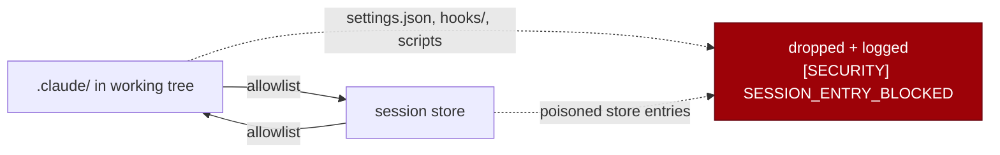

Filtering both legs means a store poisoned before this gate existed is
neutralised on the way back in, not just on the way out. Blocked entries are
logged as `[SECURITY] [SESSION_ENTRY_BLOCKED]` rather than dropped silently.

Implementation:
[`worker/deno/lib/session_file_policy.ts`](../worker/deno/lib/session_file_policy.ts)

### Milestone-Aware Session Branching

> **Applies to:** `claude` ✅ · `codex` ❌ · `gemini` ❌ · `deepseek` ✅ — the per-milestone directories hold Claude sessions; a Codex or Gemini run has no milestone branch and no copy-on-first-use, keeping one CLI state per container instead. DeepSeek shares the same per-milestone directories.

Each work stream gets its own session directory. This ensures milestone
work does not pollute the default branch session with milestone-specific
context, while still giving milestones a useful starting point.

- **Default branch work** — session stored in `${owner}/${repo}/default/`
- **Milestone work** — session stored in
  `${owner}/${repo}/milestone-${milestoneId}/`

**Copy-on-first-use:** When the worker first processes an issue for a
milestone, it copies the default branch session to create the milestone's
initial session. Subsequent milestone invocations use the milestone's own
session independently — no re-copy from default.

If no default branch session exists when a milestone starts, the milestone
begins with a clean session.

**Migration:** Sessions created before (stored directly in
`${owner}/${repo}/` without a `default/` subdirectory) are automatically
migrated to the new `default/` location on first access.

### Session Compaction

> **Applies to:** `claude` ✅ · `codex` ❌ · `gemini` ❌ · `deepseek` ✅ — the size and age limits are enforced over the `.claude-sessions/` store; Codex and Gemini state sits outside it and is bounded only by the container's own lifetime. DeepSeek's copy is bounded by the same size and age limits.

Session stores grow over time as Claude accumulates context. To prevent
unbounded growth, VibeCoder implements a **three-tier progressive
compaction** strategy that automatically escalates from least to most
aggressive until the session is under the size threshold.

| Limit | Default | Config Key |
|-------|---------|------------|
| **Maximum size** | 50 MB per repo | `maxSessionSizeBytes` |
| **Maximum age** | 7 days | `maxSessionAgeDays` |

#### Compaction Levels

| Level | Name | What It Removes |
|-------|------|----------------|
| **1** | **Soft** | Cache and temporary directories: `tmp/`, `temp/`, `cache/`, `.cache/`, `.tmp/`, `tool-outputs/`, `intermediate/` |
| **2** | **Moderate** | Soft cleanup first, then files older than `maxSessionAgeDays`, then oldest files by size until under the threshold |
| **3** | **Hard** | Deletes the entire session directory for a fresh start |

#### Auto-Escalation

When a session exceeds `maxSessionSizeBytes`, compaction auto-escalates:

```
Measure session size
  → Under limit?  → No compaction needed
  → Over limit?
      → Apply Level 1 (soft)
          → Under limit?  → Done
          → Still over?
              → Apply Level 2 (moderate)
                  → Under limit?  → Done
                  → Still over?
                      → Apply Level 3 (hard) — full reset
```

#### Age-Based Cleanup

When `compactAllSessions()` runs against the session store, it first
checks each work stream session's age. If the newest file in a session
directory is older than `maxSessionAgeDays`, the entire session is
removed — regardless of size. This prevents stale sessions from
accumulating for repositories the worker no longer processes.

**Trigger:** Compaction runs automatically before session restore during
the git setup phase. It also runs when `compactAllSessions()` is called
against the full `.claude-sessions/` store.

**Empty directory cleanup:** After file removal, any empty directories
left behind are cleaned up automatically (bottom-up traversal).

Implementation:
[`worker/deno/lib/session_compaction.ts`](../worker/deno/lib/session_compaction.ts)

### Session Resume

> **Applies to:** `claude` ✅ · `codex` ⚠️ · `gemini` ⚠️ · `deepseek` ⚠️ — one worker-level switch and phase count drives all four, but the mechanism differs: Claude takes `--session-id <uuid>` plus `--resume`, Codex resumes with `codex exec resume --last`, and Gemini with `--resume latest`. DeepSeek takes Claude's `--session-id <uuid>` plus `--resume` — the same mechanism, on its own `CLAUDE_CONFIG_DIR`, so a Claude transcript is never replayed into a DeepSeek run and back.

While [per-repository session persistence](#per-repository-session-persistence)
preserves the `.claude/` directory between invocations (file-system-level
state), **session resume** provides **CLI-level session continuity**
across phases of the same issue. This allows subsequent phases (e.g.,
quality check after implementation) to build on conversation context
already established, rather than starting from scratch.

#### How It Works

Session resume uses the Claude CLI's `--session-id` and `--resume`
flags:

| Phase | CLI Flags | Effect |
|-------|-----------|--------|
| **First phase** (e.g., clarification) | `--session-id <id>` | Creates a new named session |
| **Subsequent phases** (e.g., implementation, quality) | `--session-id <id> --resume` | Resumes the existing session |

#### Session ID — a UUID (Issue #204)

> **Applies to:** `claude` ✅ · `codex` ❌ · `gemini` ❌ · `deepseek` ✅ — the worker supplies a session id to Claude only; Codex and Gemini name their own sessions, so there is no id for the worker to generate, validate or have rejected. DeepSeek is handed the same worker-generated id: it is the same CLI.

`generateSessionId()` returns a `crypto.randomUUID()`. The Claude CLI
validates `--session-id` as a UUID and refuses anything else:

```
Error: Invalid session ID. Must be a valid UUID.
```

It exits ~0.2 s after spawn, before reaching a model call. The worker
previously generated `{sanitised-repo}-{issue-number}-{timestamp}`, so
**every** planning draft and publish turn died instantly and only the
legacy sessionless retry did any work.

The repository/issue identity lives in the resume-state **file name**
(`.claude-sessions/resume/<owner>-<repo>-<issue>.json`), not in the session
ID. A persisted entry whose `sessionId` is not a UUID was written before
this fix: `loadResumeState()` drops the ID and keeps the entry, so the
checkpointed branch still resumes but without `--resume`.

#### Recovering from a rejected session ID

If the CLI ever refuses a session ID again, `runClaudeWithRetry()`
recognises the refusal, drops the session flags and retries once, at
`WARNING` — the run continues without CLI session continuity rather than
failing, and never silently.

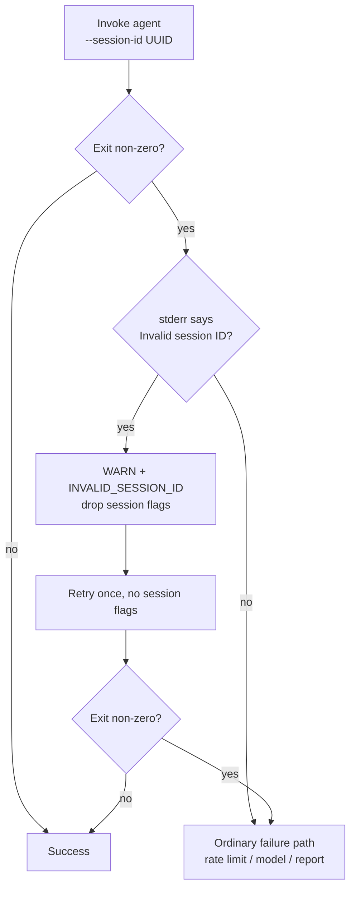

#### Phase Counting

A `SessionResumeState` object tracks the current phase count:

1. `createSessionResumeState()` — initialises state with `phaseCount: 0`
2. First phase: `buildSessionResumeFlags()` returns `--session-id` only
   (since `phaseCount === 0`)
3. `recordPhaseCompletion()` — increments `phaseCount` after each
   successful phase
4. Subsequent phases: `buildSessionResumeFlags()` returns both
   `--session-id` and `--resume` (since `phaseCount > 0`)

#### Configuration

| Key | Type | Default | Description |
|-----|------|---------|-------------|
| `enable_session_resume` | boolean | `false` | Enable CLI-level session continuity |

Session resume is disabled by default for safe rollout. Enable it in
`.config.json`:

```json
{
  "enable_session_resume": true
}
```

**Benefit:** Preserves conversation context between clarification →
planning → implementation → quality check phases, reducing redundant
context rebuilding and improving response quality as later phases can
reference earlier decisions.

Implementation:
[`worker/deno/lib/session_resume.ts`](../worker/deno/lib/session_resume.ts)

### Issue Claiming

> **Applies to:** `claude` ✅ · `codex` ✅ · `gemini` ✅ · `deepseek` ✅ — claiming is GitHub work the worker does itself, with no agent CLI involved.

When the worker finds an eligible issue:

1. **Self-assign** — the worker assigns itself via the GitHub API
2. **Verify claim** — waits briefly, then re-reads assignees to detect
   races with other workers
3. **Deterministic tie-break** — if multiple workers claim simultaneously,
   the one with the alphabetically first login wins

Implementation:
[`worker/deno/lib/claim_issue.ts`](../worker/deno/lib/claim_issue.ts)

### Heartbeat Tracking

> **Applies to:** `claude` ✅ · `codex` ✅ · `gemini` ✅ · `deepseek` ✅ — the worker writes heartbeats around whichever agent is running.

While working on an issue, the worker writes periodic heartbeat updates:

- **Stuck detection** — if no heartbeat for 30+ minutes, the issue is
  considered stuck and can be recovered
- **Background updates** — heartbeats continue during long Claude
  invocations
- **Rapid recovery** — other workers can detect and recover orphaned issues
  without waiting for the full timeout

Implementation:
[`worker/deno/lib/heartbeat.ts`](../worker/deno/lib/heartbeat.ts)

### Processing Phases

> **Applies to:** `claude` ✅ · `codex` ⚠️ · `gemini` ⚠️ · `deepseek` ✅ — the phase pipeline itself is provider-agnostic, but the `--system-prompt` channel and the restored `.claude/` session are Claude's; the other agents receive the same guidance folded into one prompt string by `composeAgentPrompt`. DeepSeek takes the `--system-prompt` channel and the restored `.claude/` session too, because it is the same CLI.

Each issue moves through a pipeline of phases. Each phase invokes Claude
as a subprocess, with the restored session providing continuity between
phases for the same repository and work stream:

```
Clarification → Planning (if needed) → Implementation → Quality checks → PR creation
```

- System prompt passed via `--system-prompt` flag (optimised for prompt
  caching)
- Session state restored before each phase, saved after each phase
- Prompt SHA tracked for cache effectiveness monitoring

---

## Prompt Caching

> **Applies to:** `claude` ✅ · `codex` ⚠️ · `gemini` ⚠️ · `deepseek` ⚠️ — Layer 1 (the worker's own disk cache) is provider-agnostic; Layer 2 is Anthropic's server-side cache, which neither other CLI exposes or reports on. DeepSeek gets Layer 1; Layer 2 is Anthropic's server-side cache and its requests go to DeepSeek's endpoint, so no Layer 2 saving is requested of it or measured.

VibeCoder uses a two-layer caching strategy to minimise costs and
latency.

### Layer 1: Prompt Compilation Cache (Disk)

> **Applies to:** `claude` ✅ · `codex` ✅ · `gemini` ✅ · `deepseek` ✅ — the cache stores the compiled prompt before any CLI is invoked, so every provider is served from it.

Static prompt components (coding guidelines, issue templates, per-repo
instructions) are assembled once and cached on disk, keyed by SHA-256
hash.

| Property | Value |
|----------|-------|
| **Location** | `/tmp/vibe-prompt-cache-deno/` (configurable via `promptCacheDir`) |
| **File format** | `{repo_name}_{sha}.cache.txt` — JSON metadata header + content |
| **TTL** | 24 hours (configurable) |
| **Invalidation** | SHA change or TTL expiry |
| **Concurrency** | Atomic writes (temp file + rename) |

**Cache flow:**

```
computeStaticPromptHash(promptsDir, repoName, customInstructions)
    ↓
PromptCache.getOrSet(repo, sha, assembler)
    ├─ Cache hit  → return cached system prompt (skip re-assembly)
    └─ Cache miss → call assembler → cache result → return
```

Key files:
- [`worker/deno/lib/prompt_cache.ts`](../worker/deno/lib/prompt_cache.ts)
  — disk cache with SHA invalidation
- [`worker/deno/lib/prompt_hash.ts`](../worker/deno/lib/prompt_hash.ts)
  — SHA-256 computation
- [`worker/deno/lib/prompt_builder_cache.ts`](../worker/deno/lib/prompt_builder_cache.ts)
  — integration layer

### Layer 2: Claude Built-in Prompt Caching

> **Applies to:** `claude` ✅ · `codex` ❌ · `gemini` ❌ · `deepseek` ⚠️ — neither CLI takes a separate system prompt, so `composeAgentPrompt` folds it into the single prompt string; whatever caching a vendor does server-side is neither requested nor measured by the worker. DeepSeek does carry a separate `--system-prompt`, but the 70–90% saving is Anthropic's server-side cache, which a third-party endpoint neither promises nor reports.

The Claude API caches system prompts that are byte-identical across
consecutive requests. VibeCoder maximises cache hits by:

1. **Separating static from dynamic content** — the system prompt
   (coding guidelines, templates) is passed via `--system-prompt`,
   while issue-specific content goes in the user message. Repository
   `CLAUDE.md`/`AGENTS.md` is deliberately **not** in the system prompt:
   it is repository-supplied and therefore untrusted, so it is fenced in
   the user turn instead.
   That costs its tokens per invocation rather than at cache-read rates —
   an accepted trade for not letting branch-supplied text outrank the task
2. **Consistent prompt assembly** — the disk cache (Layer 1) ensures
   the same bytes are sent each time for the same repo + template
   version
3. **SHA tracking** — the first 12 characters of the prompt SHA are
   logged, making it easy to verify cache effectiveness

**Cost reduction:** 70–90% on cached input tokens. Cache-read tokens
cost a fraction of regular input tokens (see
[Model Pricing](#model-pricing)).

**Minimum cacheable prefix (Opus 4.8,).** Opus 4.8 lowered
the prompt-cache minimum to **1,024 tokens**, so shorter system
prompts now qualify for cache reuse. Every short-prompt Haiku phase
the worker drives — `summarise`, `spelling_fix`, and so on — should
route its static guidance through `--system-prompt` so the prefix
caches as soon as it crosses the threshold. The per-phase audit and
the specific change for the `summarise` phase are documented in
`docs/audits/prompt-cache-audit-2395.md`.

Implementation:
[`worker/deno/lib/claude_runner.ts`](../worker/deno/lib/claude_runner.ts)

### Stable Prefix Ordering

> **Applies to:** `claude` ✅ · `codex` ⚠️ · `gemini` ⚠️ · `deepseek` ⚠️ — `orderStablePrefix()` runs before the provider is chosen, so every agent gets the same ordered prompt, but no non-Anthropic prefix cache rewards that ordering; only the volatile-token warnings carry across. Same for DeepSeek — the ordering is free, the Anthropic prefix cache that would reward it is not.

Anthropic prompt caching reuses the **longest byte-identical prefix** of a
request. Everything from the first differing byte onwards is re-read at
full input price, so one volatile token near the top — a timestamp, a run
id, a reordered section — throws the cache away for the whole prompt
behind it.

The issue prompt therefore leads with everything that is stable for a
repository and defers everything that changes per issue:

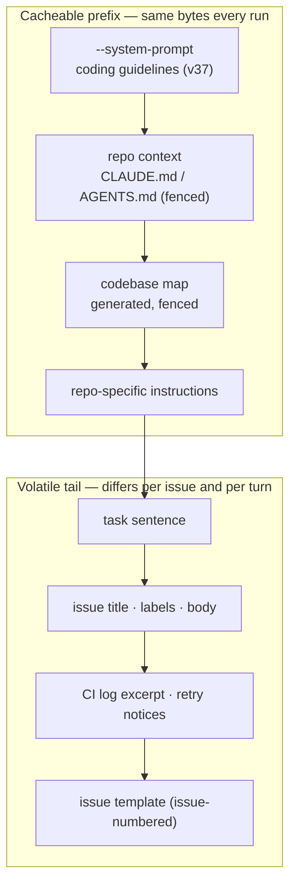

[`orderStablePrefix()`](../worker/deno/lib/prompt_prefix.ts) owns that
order, so the prefix depends on section *content* only — never on the
order a caller happened to assemble the sections in.

Two things are deliberately **not** stable:

- **The untrusted-content fence nonce** is randomised per invocation on
  purpose.
  It sits inside the fenced repo context, so the *user turn* re-caches per
  run; it is constant within a session, which is where the many-turn win
  lives. The `--system-prompt` block carries no nonce and caches across
  runs.
- **The issue template** is substituted with the issue number, so it is
  per-issue by construction and stays in the tail.

`warnOnVolatileSystemPrompt()` scans the assembled system prompt on every
build and names any token that cannot repeat (ISO timestamps, UUIDs, epoch
milliseconds, stray fence nonces, bare dates), so a newly introduced
volatile token is a warning at the run that caused it rather than a silent
doubling of token spend.

The CLI invocation itself passes nothing per-turn that busts the cache:
`buildInvocation()` emits a fixed flag order with `--system-prompt` ahead
of `-p`, and identical requests produce byte-identical argument lists.

### Cache Hit-Rate Telemetry

> **Applies to:** `claude` ✅ · `codex` ❌ · `gemini` ❌ · `deepseek` ⚠️ — the read/write/uncached counts come from Anthropic usage reporting, and a Codex or Gemini run reports no parseable usage, so no hit rate is computed or logged for them. DeepSeek's output is the Claude CLI's, so the usage block parses; the read/write counts a hit rate is computed from are Anthropic-cache fields, so a DeepSeek run reports a rate only over whatever its endpoint populates.

The API reports, per invocation, how many prompt tokens were read from the
cache, written to it, and charged as plain input. The cached share of those
three is the hit rate, and it is aggregated onto three surfaces:

| Surface | Where it appears |
|---------|------------------|
| Per invocation | `Anthropic prompt cache: 90.0% (read 180,000 · write 15,000 · uncached 5,000) owner/repo phase=issue` |
| Per run | `- **Prompt cache:** …` in the run model stats comment |
| Per day | `Prompt cache hit rate: …` in the credit summary |

Below a **50% floor** — and only once a run has seen at least 50,000 prompt
tokens, so a cache-warming first turn is never flagged — the line is
accompanied by a warning naming the likely cause: a volatile token has
entered the stable prefix.

Implementation:
[`worker/deno/lib/prompt_cache_telemetry.ts`](../worker/deno/lib/prompt_cache_telemetry.ts)

> **Not the same as the disk cache.** `Prompt cache: repo=… status=hit`
> (Layer 1) says the worker did not re-assemble the prompt string.
> `Anthropic prompt cache: …%` says the API served the prefix from its own
> cache at ~10% of the input price.

### SHA-256 Invalidation

> **Applies to:** `claude` ✅ · `codex` ✅ · `gemini` ✅ · `deepseek` ✅ — the hash keys the Layer 1 disk cache, which every provider reads.

The prompt hash includes:

- Repository name (per-repo differentiation)
- The content of the static prompt components (`coding_guidelines`,
  `issue` templates)
- Custom per-repo instructions (from `.config.json` `repo_config`)

When any of these inputs change, the SHA changes, the disk cache is
invalidated, and Claude receives a new system prompt (causing a cache
miss on Layer 2).

The worker logs SHA changes:
```
Prompt SHA changed for org/repo: abc123... → def456... (cache invalidated)
```

### Codebase Map

> **Applies to:** `claude` ✅ · `codex` ✅ · `gemini` ✅ · `deepseek` ✅ — the map is generated from the repository and injected into the prompt before invocation, so every agent receives it.

Every session used to start with no memory of the repository. The
agent-progress telemetry from
 caught a run
spending its first ~7 minutes on `ls`/`grep`/`sed` calls just to locate the
code it had been asked to change — a rediscovery tax paid once per session,
every session.

The worker now generates a **codebase map** from the repository itself and
injects it into the stable prefix beside `CLAUDE.md`/`AGENTS.md`:

| Section | Source | Bound |
|---------|--------|-------|
| Layout | `git ls-files` aggregated to two directory levels | 40 entries |
| Commands | `deno.json` tasks, `package.json` scripts, `quality.sh`, `Makefile` — root or the shallowest nested manifest | all, one line each |
| Modules | leading docstring of each source file in the top source directories | 3 directories × 40 files, and whatever the 8,000-character guard allows |

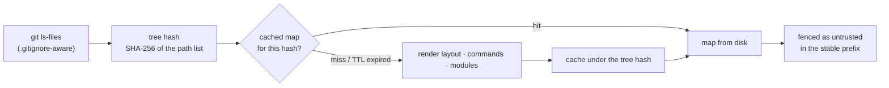

Invalidation has two triggers, because one is not enough:

- **Tree hash** — a file added, removed, or moved changes the SHA-256 of the
  path list, so the next run regenerates.
- **Cadence refresh** — a 6-hour TTL bounds the drift the tree hash cannot see,
  such as an edited docstring inside an unchanged tree.

The map is **repo-derived and therefore untrusted**: a docstring is checked
into the branch under work, so whoever authored that branch controls it. It is
fenced in the run's boundary markers exactly as `CLAUDE.md` is
, scrubbed of
delimiter-shaped patterns at extraction time, and wrapped in a code fence it
cannot close.

The *paths* are untrusted for the same reason: `git ls-files -co` lists
committed and untracked **symlinks** like any other path, so
`src/aaa.ts -> ~/.config/gh/hosts.yml` would otherwise have its head read into
the prompt and the map cache. Every file the map reads — each module docstring
and each `deno.json`/`package.json` manifest — is therefore resolved with
`Deno.realPath` and refused unless the result sits at or below the clone's real
root — the containment check `container_extension_digest.ts` already applies to
synced extension directories. A refused path is still listed (the file exists),
and the refusal is logged
`⚠️  Codebase map refused …`, so the skipped read is never silent. A symlink
that stays inside the clone is read as normal.

Both caps announce what they dropped (`… 33 more entries`, `[... module index
bounded — 542 further source files not listed ...]`) — a silently capped index
reads as "this is everything" when it is not. A generation fault logs
`WARN: codebase map unavailable …` and the run continues unmapped rather than
shipping a silently blank index.

Set `include_codebase_map` to `false` in `.config.json` to switch the injection
off. Implementation:
[`worker/deno/lib/codebase_map.ts`](../worker/deno/lib/codebase_map.ts) and
[`codebase_map_cache.ts`](../worker/deno/lib/codebase_map_cache.ts).

---

## Batch API

> **Applies to:** `claude` ➖ · `codex` ➖ · `gemini` ➖ · `deepseek` ➖ — nothing is submitted to any batch API under any provider; the path evaluated here was Anthropic's and was never wired in.

> **Status: considered and NOT wired in.** The worker runs on the Claude CLI
> exclusively. It does **not** submit any work to the Anthropic Batch API, and
> therefore does **not** earn the Batch API's 50% discount. This section records
> a **negative result** so the abandoned path is not re-attempted or mistaken
> for a live feature.

The Anthropic Batch API offers a **50% cost discount** for requests that can
tolerate up to **24 hours** of asynchronous processing (results often arrive
sooner, but the deadline is the design constraint). During a batch
client was built and its phase-eligibility was analysed, but the live
submission lifecycle was **never wired into the run loop** and was later removed
as dead code. No batch function is called from the worker.

### Why it was rejected

> **Applies to:** `claude` ➖ · `codex` ➖ · `gemini` ➖ · `deepseek` ➖ — the async/bounded-run mismatch is the worker's, not a vendor's, so the rejection stands whichever provider runs.

The Batch API is asynchronous with an up-to-24h turnaround. VibeCoder processes
each issue inside a **bounded, interactive ~1h run**: every phase's output feeds
the next step of the same run (planning drives sub-issues, execution drives the
PR, health gates the loop). Parking any of that in a queue that may not return
for hours is incompatible with a run that must finish within the hour — the
result would arrive long after the run had exited. A 50% token discount cannot
buy back a broken, unbounded run. This is the durable reason the path was
abandoned; do not re-add a live batch-submission lifecycle without first solving
the async/bounded-run mismatch.

The eligibility analysis (retained only as an estimation helper, see below)
judged four phases — `health`, `summarise`, `spelling_fix`, `clarification` — as
*theoretically* latency-tolerant, and the rest (`execute`, `planning`, `ci_fix`,
`pr_feedback`, `quality_fix`, `refinement`, `revision`, `question`) as
blocking. Even the "eligible" four are not batched in practice: the worker keeps
them on the CLI and instead drives their cost down with cheaper models and lower
effort (see [Effort-First Routing by Phase](#8-effort-first-routing-by-phase)).

### What remains in the code

> **Applies to:** `claude` ➖ · `codex` ➖ · `gemini` ➖ · `deepseek` ➖ — the retained helpers are offline, Anthropic-shaped estimators; no provider calls them at run time.

[`worker/deno/lib/batch_api.ts`](../worker/deno/lib/batch_api.ts) now exports
only **pure, offline helpers** — request/response builders, NDJSON parsers,
phase-eligibility assessment (`getBatchEligiblePhases`), and cost-savings
estimation (`estimateBatchSavings`). These do **not** perform any network I/O;
they exist for analysis and the `batch-api` CLI sub-command
([`worker/deno/commands/batch_api.ts`](../worker/deno/commands/batch_api.ts)),
which only *reports* what a hypothetical discount would be. No
`ANTHROPIC_API_KEY` is required, because no HTTP request is ever made.

---

## Token Usage & Cost Tracking

> **Applies to:** `claude` ✅ · `codex` ⚠️ · `gemini` ⚠️ · `deepseek` ⚠️ — every invocation is credit-logged with its provider id, but extraction and pricing are Claude-shaped, so non-Claude usage is recorded UNKNOWN (never zero) and non-Claude model ids are charged at a conservative upper bound. DeepSeek's counts do parse — same CLI, same `stream-json` — but its model ids are unpriced, so its cost is an upper bound rather than a measured one.

### Token Extraction

> **Applies to:** `claude` ✅ · `codex` ❌ · `gemini` ❌ · `deepseek` ✅ — Codex's `--json` JSONL and Gemini's stream events do not parse, so `extractProviderTokenUsage()` warns once and flags the entry `usageUnknown` instead of recording a silent zero. DeepSeek emits the Claude CLI's `stream-json`, so the shared extractor parses it and no `usageUnknown` flag is raised.

After each Claude CLI invocation, the worker extracts token usage from the
stream-json output:

| Field | Description |
|-------|-------------|
| `inputTokens` | Input tokens consumed |
| `outputTokens` | Output tokens generated |
| `cacheCreationTokens` | Tokens written to the prompt cache |
| `cacheReadTokens` | Tokens read from the prompt cache |

Implementation:
[`worker/deno/lib/token_usage.ts`](../worker/deno/lib/token_usage.ts)

#### Non-Claude providers: unknown, never zero

Extraction reads the **Claude** `stream-json` shape. Codex emits its own JSONL
under `--json` and Gemini its own `--output-format stream-json` events, so
neither parses today — real Codex/Gemini token parsing is **not implemented**.

That gap is loud rather than silent. Every run goes through
[`worker/deno/lib/provider_token_usage.ts`](../worker/deno/lib/provider_token_usage.ts),
which dispatches on the active provider descriptor:

- **Claude** — unchanged, and quiet when a run genuinely reports no usage.
- **Any other provider** — the shared extractor is tried first (a CLI whose
  output happens to be Claude-compatible is parsed normally); when nothing is
  parseable the run is warned about once, naming the provider, repo, phase and
  model, and the credit-log entry is flagged `usageUnknown`.

An `usageUnknown` invocation contributes **no** tokens or cost to the daily
totals and is counted separately, so `credit summary` ends with a line such as
`WARNING: 2 invocation(s) reported no parseable token usage (provider(s):
codex, gemini) — their tokens and cost are UNKNOWN, not zero, and are NOT
counted in the totals above.` Adding a real extractor is a new branch in
`extractProviderTokenUsage()` plus a pricing row below.

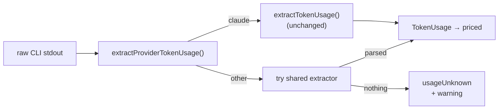

### Model Pricing

> **Applies to:** `claude` ✅ · `codex` ❌ · `gemini` ❌ · `deepseek` ❌ — `MODEL_PRICING` holds Claude rows only, so a `gpt-5-codex` or `gemini-2.5-pro` id is charged at the dearest known rate and named in `unpricedModels` rather than costed at zero. `MODEL_PRICING` has no `deepseek-reasoner` or `deepseek-chat` row either, so a DeepSeek run is charged at the dearest known rate and named in `unpricedModels`.

Approximate list prices (USD per million tokens, as of September 2026):

| Model | Input | Output | Cache Write | Cache Read |
|-------|------:|-------:|------------:|-----------:|
| Claude Fable 5.1 | $10.00 | $50.00 | $12.50 | $0.25 |
| Claude Fable 5 | $10.00 | $50.00 | $12.50 | $1.00 |
| Claude Opus 5 | $5.00 | $25.00 | $6.25 | $0.50 |
| Claude Opus 4.5–4.8 | $5.00 | $25.00 | $6.25 | $0.50 |
| Claude Opus 4.0/4.1 | $15.00 | $75.00 | $18.75 | $1.50 |
| Claude Sonnet 5 | $2.00 | $10.00 | $2.50 | $0.20 |
| Claude Sonnet 4.6 | $3.00 | $15.00 | $3.75 | $0.30 |
| Claude Haiku 4.5 | $1.00 | $5.00 | $1.25 | $0.10 |

Opus 5 (model id `claude-opus-5`, alias `opus`) lands at the **same** price point
as the modern Opus 4.5–4.8 line ($5 / $25 per MTok, cache $6.25 / $0.50) — a
step-change in capability over Opus 4.8 for free. The `claude-opus-5` pricing row
and the 5-family fallback parser were added together so Opus 5 traffic is
never dropped from cost tracking. These rows mirror `MODEL_PRICING` in
[`worker/deno/lib/token_usage.ts`](../worker/deno/lib/token_usage.ts).

Fable (alias `fable`) is the top tier above Opus with a 1M-token context
window. It is the default for the eight planning-shaped phases: `planning`,
`grill_me`, `refinement`, `revision`, `question`, `clarification`, `quorum`
and `quorum_judge`.

Sonnet 5 (model id `claude-sonnet-5`, alias `sonnet`) is **cheaper** than the
Sonnet 4.x line it replaces: $2 / $10 rather than $3 / $15 per MTok. That looks
like an expired introductory rate and is not — it is worth citing, because the
introductory window closed on 2026-08-31 and the obvious reading is that the
price reverted. Anthropic's
[pricing page](https://platform.claude.com/docs/en/about-claude/pricing) says
otherwise, in a note beside the table:

> The $2/$10 per million input/output token pricing for Claude Sonnet 5,
> announced at launch as introductory pricing through August 31, 2026, is now
> the standard price. The previously scheduled increase to $3/$15 per million
> input/output tokens on September 1, 2026 will not occur.

Sonnet is not a phase default; it is the third rung of the
`fable → opus → sonnet → haiku` rate-limit ladder, so the row matters for
costing a downgraded run.

#### Fable 5.1 — the current top tier (Issue #747)

Anthropic released **Fable 5.1** (`claude-fable-5-1`) on 2026-09-01. The worker
requests the tier alias `fable`, never a pinned model id, so the Claude CLI
serves 5.1 with no routing change, and the served-vs-expected detector accepts
it: `modelsMatch()` passes both on the `claude-fable-5` prefix and on the
`fable` tier family, so a healthy 5.1 run reports `Degraded: no`
(`worker/deno/tests/planning_run_stats_test.ts`).

What changed for the worker is the **cache-read rate**: 5.1 prices cache hits
at 0.025× base input — **$0.25 / MTok, a quarter of the Fable 5 rate** — while
input, output and cache writes are unchanged. Since the eight planning-shaped
phases replay a large cached prefix, that is where the saving lands.
`claude-fable-5` keeps its own $1.00 row so a run whose **served** model was
Fable 5 is still costed at the rate it was billed at, and `lookupModelPricing()`
classifies by minor version, so a dated `claude-fable-5-1-…` id prices at the
5.1 rate and a dated `claude-fable-5-2026…` id at the 5.0 rate. A run that
reported **no** served model is costed against the requested `fable` alias,
which prices at the current tier rate — the same alias-follows-the-latest rule
the `opus` and `sonnet` rows use.

**The flip is the CLI's, not the worker's.** The Claude CLI resolves the alias
locally — `claude --model fable --print --output-format stream-json` on CLI
2.1.223 still reports `"model":"claude-fable-5"` at init — so a container whose
CLI predates the 5.1 alias table keeps being served Fable 5 and is costed at the
Fable 5 row. Both rows are carried for exactly that reason: no configuration
changes on either side of the flip, and the
[minimum-version floor](CONFIGURATION.md#-minimum-version-floor) (`claude`,
2.1.170) is what keeps the CLI current enough to pick the new alias up.

Fable 5.1's three breaking Messages-API changes — forced `tool_choice` rejected,
thinking blocks bound to the model and to an unedited conversation prefix — do
**not** reach the worker: it drives the Claude Code CLI, which owns request
construction and conversation history. Everything the worker sends is a CLI flag
(`--model`, `--effort`, `--session-id`).

#### Tier ordering after Opus 5 (decision, no code)

Opus 5 does **not** change the tier ordering. Fable 5 remains the top tier at
$10 / $50 per MTok; Opus 5 is a step-change over Opus 4.8 at **half** Fable 5's
price. The existing `fable > opus` ordering — encoded in
`DEFAULT_CLAUDE_MODEL_TOP_TIER`, `MODEL_FALLBACK_MAP` (`fable → opus`), and
`fable_routing.ts` — stays valid, so the eight planning-shaped phases still prefer
Fable and degrade to Opus. The only change is that the `fable → opus` fallback
now lands on a strictly better model (Opus 5 rather than Opus 4.8) at no extra
cost. No code change is required; this row records the confirmation.

#### Rate-limit bucket after Opus 5 (ops watch, no code)

Opus 5 draws on a **separate rate-limit bucket** from the combined Opus 4.x
pool. Shifting traffic to Opus 5 when the CLI flips the `opus` alias to the
5-family id neither frees the old Opus 4.x headroom nor inherits it, so 429
behaviour can differ in the first days after the flip — a bucket that was warm
under Opus 4.8 starts cold under Opus 5, and vice versa. No code change is
needed: the existing `fable → opus → sonnet` fallback chain
([`model_fallback.ts`](../worker/deno/lib/model_fallback.ts)) already degrades
each phase on a 429, so a bucket squeeze self-heals to a cheaper tier rather
than failing the run.

**What to watch** in the credit logs (`.credit_log_YYYY-MM-DD.json`) for the
first days after the alias flip:

- A spike in `fallbackFrom: opus` / `fallbackFrom: fable` rows — the count of
  `fable → opus → sonnet` fallback activations rising without a matching rise in
  total invocations signals Opus 5 bucket pressure, not extra load.
- 429 retry/back-off lines from the rate-limit path clustering on Opus 5 phases
  (`issue`, `ci_fix`, `pr_feedback`, `quality_fix`) while Fable phases stay
  quiet.

If the fallback counters spike, the behaviour is expected and self-correcting;
no action beyond monitoring is required unless the elevated fallback rate
persists past the initial bucket warm-up.

#### Model-generation prompt tuning

Prompt templates are tuned to the behaviour of the generation that runs them, so
a tuning that helped one generation can *harm* the next. Opus 5 behaves
differently from Opus 4.8 in four ways, and the shared `coding_guidelines`
template (v34 onward) plus the `issue` template (v29 onward) were re-tuned to
match:

| Opus 5 behaviour | Prompt response |
|------------------|-----------------|
| Self-verifies as it works, unprompted | **Deleted** the `Self-Verification Checkpoint` section from the `issue` template — the ritual re-check pass was redundant and encouraged over-work |
| Delegates to subagents readily | **Capped** delegation — spawn a subagent only for genuine isolated parallel exploration, not routine edits or searches |
| Can expand the task scope | Added scope-discipline wording — implement exactly what the issue asks |
| Writes longer responses and files | Added output-length guidance — match deliverable length to the work |

The delegation line is a deliberate **reversal**: the Opus 4.8-era tuning
*encouraged* subagent delegation, and that encouragement was measured as harmful
once Opus 5 served the `opus` phases. Recorded here as a durable negative
result — do **not** re-add the 4.8-era delegation encouragement or the
self-verification checkpoint while Opus 5 (or a later generation with the same
behaviours) serves those phases.

##### Where the framing lives

`coding_guidelines` once carried the four responses above under a section
headed **`Opus 5 Working Style`**, opening "You self-verify as you work,
delegate readily, and tend to write at length." `buildCodingGuidelines()` loads
that one shared template for **every** run, including the Codex and Gemini
providers, so that framing asserted one generation's traits to models that do
not share them. The shared `coding_guidelines` template is now model-agnostic:
the section is titled `Working Style` and states the four directives as rules,
with
"Trust the quality gate" replacing the "you already check your work as you go"
premise. The behaviours themselves are prior tuning results and are retained in
the table above — this section, not the template, is where a generation's
observed behaviour is recorded.

##### Where tuning is applied (Issue #374)

This section records a generation's observed behaviour; the **overlay prompts**
are where a tuning derived from it is applied. `buildCodingGuidelines()` takes
an optional agent identity — the active provider from `lib/agent_provider.ts`
and, where the caller knows it, the resolved model — and appends
`prompts/coding_guidelines_<provider>[_<model>]/` behind the agnostic baseline,
inside the one `<coding_guidelines>` wrapper. The worked example is
`prompts/coding_guidelines_claude/`, which restates the four directives'
premise for Claude runs. A caller with no identity, or an identity with no
overlay authored, gets the agnostic baseline unchanged — so a Claude tuning
can never reach a Codex or Gemini run. The mechanics (naming, precedence,
the `skip_screenshot_check` interaction) are documented in
[EXTENDING.md § Per-model coding-guidelines overlays](EXTENDING.md#per-model-coding-guidelines-overlays).

Prompt-authoring guidance in
[CODING-STANDARDS.md](../CODING-STANDARDS.md#prompt-engineering-guidance) is
model-generation-agnostic by design; anything that depends on the generation
belongs in this section so the two cannot drift.

**Note:** Cache-read tokens are significantly cheaper than regular input
tokens — this is why prompt caching delivers such large savings.

### Credit Logging

> **Applies to:** `claude` ✅ · `codex` ⚠️ · `gemini` ⚠️ · `deepseek` ⚠️ — an entry is written for every invocation and carries the `provider` id, but its token fields read `usageUnknown` and its cost is an upper-bound estimate whenever the vendor's output cannot be parsed. A DeepSeek entry carries real token fields and an upper-bound cost.

Every Claude invocation is logged to a daily credit log file (newline-
delimited JSON):

| Field | Description |
|-------|-------------|
| `workerName` | Which worker made the call (e.g. `worker-1`) |
| `phase` | Processing phase (e.g. `planning`, `spelling_fix`) |
| `repo` | Repository (e.g. `org/repo`) |
| `model` | Model used (e.g. `claude-sonnet-4-7`) |
| `timestamp` | ISO 8601 timestamp |
| `fallbackFrom` | Original model before fallback (if applicable) |
| `effort` | Effort level used (e.g. `high`, `max`) (if applicable) |
| `inputTokens` | Input tokens consumed |
| `outputTokens` | Output tokens generated |
| `cacheCreationTokens` | Tokens written to prompt cache |
| `cacheReadTokens` | Tokens read from prompt cache |

**Log location:** `creditLogDir` (configurable) — files named
`.credit_log_YYYY-MM-DD.json`

**Daily summary** aggregates:
- Total invocations by worker, phase, and model
- Fallback transitions (e.g. `opus → sonnet: 5`)
- Total, per-phase, and per-model token usage
- Estimated cost breakdown (USD) per model **and per phase**
- The distinct model+effort combinations each phase ran with

Per-phase cost is summed from per-invocation costs, so a phase that spans
several models (for example an Opus run that fell back to Sonnet) accumulates
the correct blended cost. Cache-read and cache-write tokens are priced with
their dedicated rates in every breakdown, so prompt-cache savings are visible
per phase.

#### Unpriced model ids

A model id with no row in `MODEL_PRICING` used to contribute **`$0`** to the
daily total — so the [spend ceiling](CONFIGURATION.md#-daily-spend-ceiling)
guarded a smaller budget than the operator configured. Unpriced tokens are now
charged at a conservative **upper bound** (the dearest rate of every known row)
and reported separately:

| Summary field | Meaning |
|---------------|---------|
| `unpricedModels` | Model ids with no pricing row, sorted |
| `unpricedTokens` | Tokens billed under those ids |
| `unpricedEstimatedCost` | Upper-bound USD included in `totalEstimatedCost` |
| `unknownUsageInvocations` | Runs whose token usage could not be parsed |
| `unknownUsageProviders` | Providers those runs ran under, sorted |
| `malformedLogLines` | Log lines that could not be parsed and were skipped |

**Non-Claude ids land here too.** `MODEL_PRICING` holds Claude rows only, so a
Codex or Gemini model id (`gpt-5-codex`, `gemini-2.5-pro`) has no pricing row
and its tokens are charged at the same upper bound and named in
`unpricedModels` — an over-estimate an operator can see, never a `$0`. A run of
that provider whose usage could not be parsed at all has no tokens to charge,
so it is counted in `unknownUsageInvocations` instead
([above](#non-claude-providers-unknown-never-zero)).

`formatSummary` prints both an `Unpriced models` line and a `WARNING:` line for
malformed log lines, and the spend-ceiling hook logs a `[SPEND_CEILING]` line
naming the ids — the fix is to add the missing row to `MODEL_PRICING`. A run
whose routing chain resolves no `--model` argument now logs the model id the
API reported serving, rather than the unpriceable `"default"` sentinel.

**Retention:** 7 days by default (configurable). Old logs are cleaned up
automatically.

Implementation:
[`worker/deno/lib/credit_tracker.ts`](../worker/deno/lib/credit_tracker.ts)

### Context Window Budget Monitoring

> **Applies to:** `claude` ✅ · `codex` ⚠️ · `gemini` ⚠️ · `deepseek` ⚠️ — the chars ÷ 4 estimate and the thresholds run for every provider, but a non-Claude model id has no row in `MODEL_CONTEXT_WINDOWS`, so it is measured against the 200,000-token default ceiling rather than its real window. `deepseek-reasoner` and `deepseek-chat` have no `MODEL_CONTEXT_WINDOWS` row either, so they are measured against the same 200,000-token default.

VibeCoder monitors how much of each model's context window is consumed
by the assembled prompt, providing early warning when prompts grow too
large for effective responses.

#### Token Estimation

Token counts are estimated using a lightweight **characters ÷ 4**
heuristic for English text. This avoids external tokeniser dependencies
while maintaining sufficient accuracy for budget monitoring (not
billing). The heuristic matches the estimate used in `claude_executor.ts`
for consistency.

#### Context Window Sizes

As of the Claude 5 generation, Fable, Opus and Sonnet have 1M-token context
windows, while Haiku retains the original 200k window:

| Model | Context Window |
|-------|---------------|
| Claude Fable 5 | 1,000,000 tokens |
| Claude Opus 5 | 1,000,000 tokens |
| Claude Sonnet 4.6 | 1,000,000 tokens |
| Claude Haiku 4.5 | 200,000 tokens |

#### Component Breakdown

Each prompt is broken down into named components for observability:

```
Context budget: system=12,450 dynamic=3,200 issue=1,800 custom_instructions=500
                total=17,950/200,000 (9.0%)
```

Components include: `system` (coding guidelines and templates),
`dynamic` (phase-specific instructions), `issue` (issue description and
comments), `custom_instructions` (per-repo `.config.json` `repo_config`
configuration), and others.

#### Threshold Alerts

| Threshold | Default | Effect |
|-----------|---------|--------|
| **Warning** | 50% | Logs a warning — prompt is large but functional |
| **Error** | 80% | Logs an error — risk of degraded responses |
| **Block** | 95% | Stops the execution phase before the billed invocation and escalates to `needs-human` |

These thresholds are configurable via `contextBudgetWarningPercent`,
`contextBudgetErrorPercent` and `contextBudgetBlockPercent` in `.config.json`.
Only the blocking threshold stops work; set it to `0` to restore warn-only
behaviour.

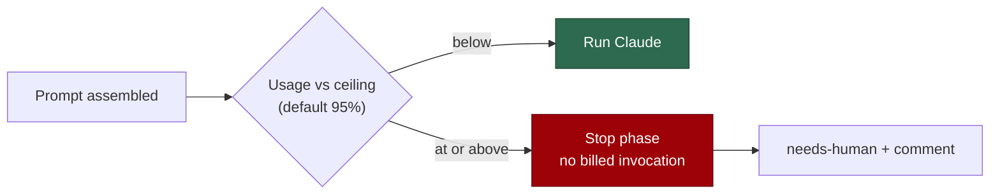

#### Daily Budget Logging

Each invocation's budget data is logged to a daily budget log file
(newline-delimited JSON):

- **File format:** `.context_budget_YYYY-MM-DD.json`
- **Entry fields:** timestamp, repo, phase, model, component breakdowns,
  total tokens, usage percentage, warning/error messages, and `blocked` when
  the hard ceiling stopped the phase

#### Aggregated Statistics

The `aggregateBudgetStats()` function computes summary statistics from
budget log entries for inclusion in the daily credit summary:

| Statistic | Description |
|-----------|-------------|
| **Total invocations** | Number of Claude calls in the period |
| **Average context tokens** | Mean estimated tokens per invocation |
| **Maximum context tokens** | Highest single-invocation token estimate |
| **Average usage** | Mean context window usage percentage |
| **Maximum usage** | Peak context window usage percentage |
| **Warning count** | Invocations exceeding the warning threshold |
| **Error count** | Invocations exceeding the error threshold |

Implementation:
[`worker/deno/lib/context_budget.ts`](../worker/deno/lib/context_budget.ts)

---

## Token Saving Strategies

> **Applies to:** `claude` ✅ · `codex` ⚠️ · `gemini` ⚠️ · `deepseek` ⚠️ — the prompt-level strategies (Layer 1 cache, codebase map, verbosity) apply to every provider; the session-store and Anthropic-cache strategies do not. DeepSeek keeps the session-store strategies — it is the Claude CLI — and loses the Anthropic-cache ones.

VibeCoder employs multiple complementary strategies to minimise token
usage and cost. Each targets a different layer of the token lifecycle:

### 1. Prompt Caching (Two-Layer)

> **Applies to:** `claude` ✅ · `codex` ⚠️ · `gemini` ⚠️ · `deepseek` ⚠️ — Layer 1 saves re-assembly for every provider; the 70–90% Layer 2 saving is Anthropic-only. DeepSeek likewise earns Layer 1 only.

Static prompt components are cached on disk (keyed by SHA-256 hash) so
they are assembled once and reused. Claude's built-in prompt caching then
further reduces cost — cache-read tokens are 90% cheaper than regular
input tokens. See [Prompt Caching](#prompt-caching) for details.

**Saving:** 70–90% reduction on cached input tokens.

### 2. Session Persistence

> **Applies to:** `claude` ✅ · `codex` ❌ · `gemini` ❌ · `deepseek` ✅ — the worker stores no Codex or Gemini state per repository, so neither earns this cold-start saving. DeepSeek earns the same cold-start saving from the same store.

Per-repository session directories (`.claude/`) are preserved between
invocations, so Claude retains learned codebase conventions and context
from previous work. This avoids rebuilding context from scratch on every
phase.

**Saving:** Eliminates cold-start context rebuilding across invocations.

### 3. Session Resume

> **Applies to:** `claude` ✅ · `codex` ⚠️ · `gemini` ⚠️ · `deepseek` ⚠️ — both resume their own most recent session (`codex exec resume --last`, `--resume latest`) rather than one the worker names, so continuity is per-container rather than per-issue. DeepSeek resumes a worker-named session as Claude does, but out of its own `CLAUDE_CONFIG_DIR`, so the continuity never crosses the two.

CLI-level session continuity uses `--session-id` and `--resume` flags to
carry conversation context across phases of the same issue. Later phases
can reference earlier decisions without re-explaining them.

**Saving:** Reduces redundant context across clarification → planning →
implementation → quality phases.

### 4. Session Compaction

> **Applies to:** `claude` ✅ · `codex` ❌ · `gemini` ❌ · `deepseek` ✅ — there is no Codex or Gemini session store for the worker to compact. DeepSeek's store is compacted by the same rules.

Progressive three-tier compaction prevents session directories from
growing unbounded (50 MB default limit). By keeping sessions lean,
subsequent restores are faster and avoid wasting tokens on stale context.

**Saving:** Prevents token waste from bloated session state.

### 5. Verbosity Configuration

> **Applies to:** `claude` ✅ · `codex` ✅ · `gemini` ✅ · `deepseek` ✅ — verbosity is injected into the prompt template, so every agent receives the same instruction.

Output verbosity is configurable, reducing output tokens where detailed
explanations add nothing. Inspired by the
[Caveman](https://github.com/JuliusBrussee/caveman) approach to
controlling LLM output verbosity, VibeCoder injects the configured level
into the prompt template. The level comes from configuration only — there
are no automatic per-phase levels (Issue #798), so an unconfigured worker
renders `standard` everywhere.

**Four verbosity levels:**

| Level | Behaviour |
|-------|-----------|
| `minimal` | One sentence naming what changed; that sentence is the whole response. |
| `concise` | Brief response (2–3 sentences). Key changes and rationale only. |
| `standard` | Balanced detail — the default. End-of-run summary, no running commentary. |
| `verbose` | Standard summary plus a short section per genuinely close decision — the option taken, the alternative rejected, and the fact that settled it. |

**Which override reaches which surface:**

The two overrides are read by different code paths, so neither applies
everywhere:

| Surface | Level used |
|---------|------------|
| `issue` phase | Per-repo `verbosity` override in `repo_config`, else `standard` |
| `grill_me` and `quorum` rounds | Global `verbosity` in `.config.json`, else `standard` |
| Every other phase | `standard` |

**How it works:** the resolved level's instruction is injected into the
prompt template via the `{{VERBOSITY_INSTRUCTIONS}}` placeholder. Every
level gets a block, including `standard` (Issue #3813) — a `minimal` run
receives *"Produce a single sentence naming what you changed. That
sentence is the whole response."*

**Resolution priority** for the `issue` phase (highest to lowest):

1. Per-repo override in `repo_config` — allows different verbosity per
   repository (e.g., `minimal` for a docs site, `verbose` for a
   platform repo)
2. Hard-coded default (`standard`)

**Approximate token savings** compared to `standard`:

| Level | Output Token Impact |
|-------|-------------------|
| `minimal` | ~60–80% fewer output tokens |
| `concise` | ~30–50% fewer output tokens |
| `standard` | Baseline |
| `verbose` | ~20–40% more output tokens |

**Saving:** ~30–80% fewer output tokens where a lower level is configured;
nothing is saved by default, since the default level is `standard`. See
[Verbosity Configuration](CONFIGURATION.md#-verbosity-configuration)
for full configuration options.

Implementation:
[`worker/deno/lib/verbosity.ts`](../worker/deno/lib/verbosity.ts),
[`worker/deno/lib/config_defaults.ts`](../worker/deno/lib/config_defaults.ts)

### 6. Batch API (considered, not wired)

> **Applies to:** `claude` ➖ · `codex` ➖ · `gemini` ➖ · `deepseek` ➖ — no provider submits batch work, so the saving is zero for all four.

The Anthropic Batch API was evaluated as a cost lever but **deliberately not
wired in** — its up-to-24h async turnaround is incompatible with the worker's
bounded interactive run, so no work is submitted to it and no 50% discount is
earned. See [Batch API](#batch-api) for the full negative-result note.

**Saving:** None — not used. Retained only as offline estimation helpers.

### 7. Context Budget Monitoring

> **Applies to:** `claude` ✅ · `codex` ⚠️ · `gemini` ⚠️ · `deepseek` ⚠️ — monitoring runs for every provider, but against the 200,000-token default ceiling whenever the model id is not a Claude one. DeepSeek is measured against the default ceiling too.

Real-time monitoring of context window usage alerts the system when
prompts grow too large. This enables proactive prompt trimming and
prevents degraded responses from over-stuffed context windows.

**Saving:** Awareness-based — enables informed decisions about prompt
composition.

### 8. Effort-First Routing by Phase

> **Applies to:** `claude` ✅ · `codex` ✅ · `gemini` ❌ · `deepseek` ❌ — Codex varies effort over its own four levels; the Gemini CLI has no effort option, so it varies model tier alone and warns once per phase that the requested effort cannot be applied. DeepSeek has no effort lever at all: it varies model tier alone, over two rungs, and warns once per phase.

Under effort-first routing the worker stays on one top tier
(Opus) and varies **effort** as the primary cost lever; tier is the secondary
lever, keeping the three trivial phases (spelling, summarise, health) on Haiku.
See [Phase-Specific Defaults](#phase-specific-defaults) and the
[design note](#design-note--effort-first-vs-tier-first).

**Saving:** Lower effort cuts output tokens (the dominant cost) on every Opus
phase; the trivial phases retain the ~5× Haiku-vs-Opus per-token saving.

---

## Configuration

> **Applies to:** `claude` ✅ · `codex` ⚠️ · `gemini` ⚠️ · `deepseek` ⚠️ — the keys listed here are Claude-named; Codex and Gemini take the `codex_*` / `gemini_*` equivalents from their routing sections and [CONFIGURATION.md](CONFIGURATION.md), and the session-store keys apply to Claude alone. DeepSeek takes the `deepseek_*` keys — model only, with no effort counterpart.

Model selection and caching behaviour can be customised in `.config.json`:

```json
{
  "claude_model": "opus",
  "phase_model_overrides": {
    "planning": "opus",
    "clarification": "sonnet",
    "spelling_fix": "haiku",
    "summarise": "haiku"
  },
  "claude_timeout": 3600,
  "claude_kill_after": 30,
  "enable_model_fallback": true
}
```

| Key | Type | Default | Description |
|-----|------|---------|-------------|
| `claude_model` | string | `"opus"` | Global default model |
| `phase_model_overrides` | object | `{}` | Per-phase model overrides |
| `claude_timeout` | number | `3600` | Max seconds per Claude invocation (1 hour — lowered from 4 hours by). Issue-work runs may extend it while the agent is still producing output — a tool call or a stdout chunk inside the stall window (Issue #767) — and something is progressing — the working tree, or a descendant process doing work (Issue #508) — see `progress_extension_enabled`, `progress_extension_grant_seconds`, `progress_extension_stall_seconds` and `progress_extension_check_seconds` in [CONFIGURATION.md](CONFIGURATION.md#-progress-extended-deadline) |
| `claude_kill_after` | number | `30` | Grace period (seconds) before SIGKILL |
| `enable_model_fallback` | boolean | `true` | Auto-downgrade model on rate limit |
| `enable_session_resume` | boolean | `false` | Enable CLI-level session continuity |
| `maxSessionSizeBytes` | number | `52428800` (50 MB) | Maximum session store size before compaction |
| `maxSessionAgeDays` | number | `7` | Maximum session age before cleanup |
| `contextBudgetWarningPercent` | number | `50` | Context usage warning threshold |
| `contextBudgetErrorPercent` | number | `80` | Context usage error threshold |

Environment variables:
- `CLAUDE_MODEL` — global model override
- `CLAUDE_MODEL_<PHASE>` — per-phase override (highest priority)

The worker authenticates through the Claude CLI and makes no direct Anthropic
HTTP calls, so **no `ANTHROPIC_API_KEY` is required**. (An earlier draft listed
it as required for the Batch API; that path was never wired in — see
[Batch API](#batch-api).)

For the full configuration reference, see
[Configuration Reference](CONFIGURATION.md).
