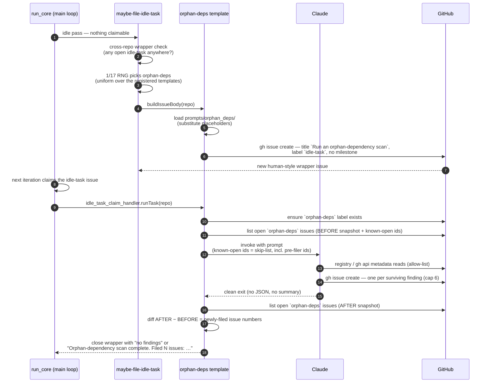
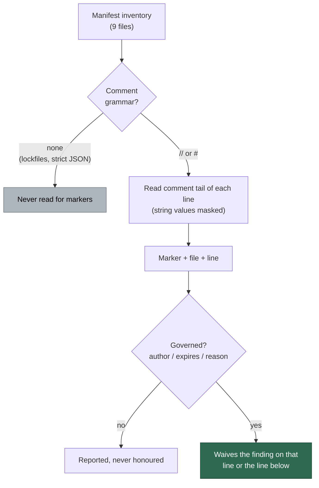

# 🪦 Orphan-Dependency Scans — Operator Manual

This document is the operator-facing reference for the Vibe Coder's
orphan / unmaintained-dependency audit. The intent is documented in the
parent epic and the sub-issues that built it: the registered
template + framework wiring, the authoring prompt, the
native ecosystem pre-filer, and this manual.

The orphan-dependency scan is **template #6 of the idle-task framework** —
the generic mechanism for "things the worker does when no claimable work
exists". The framework owns filing, dedup, label discipline, and claim
routing; this document covers the orphan-specific behaviour layered on
top. See [`docs/IDLE-TASK-FRAMEWORK.md`](IDLE-TASK-FRAMEWORK.md) for the
framework manual and the lifecycle diagram common to every template, and
[`docs/SUPPLY-CHAIN-READINESS-SCAN.md`](SUPPLY-CHAIN-READINESS-SCAN.md)
for the sibling template that this manual mirrors structurally (single
prompt, language-agnostic, no bucket, weekly cadence, no PR).

For the **agent-facing** rules (label policy, suppression syntax, the
sanctioned-network exception) see
[DESIGN-PRINCIPLES.md → Orphan-dependency scans](../DESIGN-PRINCIPLES.md#orphan-dependency-scans-template-6).

## Design intent — "is anyone still home?"

The orphan-dependency scan answers one question for every declared
dependency: *is this dependency still being looked after by anyone?* It
is an **evidence-backed audit** of the repository's declared and locked
dependency set for dependencies that are genuinely **orphaned,
abandoned, deprecated, or end-of-life** — and, for each one, it suggests
a maintained replacement. The orchestrating prompt at
[`prompts/orphan_deps/`](../prompts/orphan_deps/) instructs Claude to
inventory the ecosystems, detect orphan candidates from corroborated
metadata, triage, and file each surviving finding as its own GitHub
issue.

The guiding distinction is **orphaned vs merely out-of-date**:

- **Orphaned / unmaintained (this scan).** Nobody is shipping fixes — the
  package is deprecated, its source repo is archived, it has had no
  release in years, or it has passed a declared end-of-life date. A
  reasonable maintainer would conclude nobody is home.
- **Out-of-date but maintained (out of scope).** A dependency that is
  simply a few versions behind but still actively maintained belongs to
  the ordinary dependency-bump flow, **not** here. The scan deliberately
  files nothing for it.

Findings are **calibrated to real risk**, not a maximalist checklist.
Every finding cites the concrete metadata signal that demonstrates the
dependency is unmaintained, and names a concrete maintained replacement
with a one-line migration note.

## The one sanctioned-network exception

The five sibling scan templates (`security-scan`, `best-practices`,
`test-audit`, `github-actions-audit`, `supply-chain-readiness`) are
**static-evidence-only**: they never contact a registry or the network.
The orphan-dependency scan is the **one sanctioned exception**. Whether a
package is orphaned is impossible to decide from committed files alone —
"last published four years ago", "marked deprecated", "source repo
archived" are facts that live in **registry and source-host metadata**,
not in the repo.

The static-evidence-only rule is therefore lifted **only for this scan**
and **only within this metadata allow-list**:

| Source | What it reads |
| ------ | ------------- |
| **npm registry metadata** | `https://registry.npmjs.org/<pkg>` — the `deprecated` field, `time` (publish dates), `dist-tags`, and the `repository` URL. Read-only HTTP GET of the JSON document. |
| **JSR registry metadata** | The package's JSR API document — yanked / archived status and last-publish time. |
| **crates.io metadata** | (where a `Cargo.toml` is present) the crate's API document — `yanked`, last-version date, and the source repository. |
| **GitHub repository metadata** | `gh api repos/<owner>/<repo>` for the source repo a package declares — the `archived` boolean, `pushed_at`, and any EOL note. |
| **Published EOL / end-of-support data** | An `endoflife.date`-style published lifecycle fact for a runtime or framework dependency. |

Everything outside that list stays forbidden. In particular:

- **No package install, ever.** Never run `npm install`, `npm ci`,
  `pnpm install`, `yarn`, `cargo build`/`cargo fetch`, `deno cache`,
  `pip install`, `go get`, `mvn`, or `gradle`. A metadata GET is
  permitted; an install is not.
- **No lifecycle scripts.** Never trigger a package's
  `preinstall`/`install`/`postinstall`/`prepare` hook, a Rust `build.rs`,
  a Python `setup.py`, or any other code shipped by a dependency. You
  read *about* packages; you do not run them.
- **No repo code execution.** File readers (`cat`, `grep`, `rg`, `ls`,
  `find`), the allow-listed registry GETs, and the allow-listed
  `gh api` metadata calls are the complete permitted tool set.

Every metadata read is **advisory**: a registry can be wrong or
unreachable. When a lookup fails or is ambiguous the candidate is
**dropped** rather than asserted — the same discipline the static scans
apply to a missing file citation.

## Orphan-signal catalogue

Phase 2 of the prompt walks each candidate dependency against the signal
table below. A finding is only valid when Claude can cite the specific
allow-listed metadata that demonstrates the signal; a single weak signal
is not enough — prefer one strong signal, or two weak signals that agree.

| ID prefix | Signal | Strength | Default severity |
| --------- | ------ | -------- | ---------------- |
| `ORPHAN-DEPRECATED` | The registry marks the package **deprecated** (npm `deprecated` string) or **yanked / archived** (JSR, crates.io `yanked`). | strong | high |
| `ORPHAN-ARCHIVED` | The package's source repository is **archived** (`gh api repos/<owner>/<repo>` → `archived: true`). | strong | high |
| `ORPHAN-STALE` | **No release in ≥ 24 months** (the default threshold). Evidence: the registry `time` / last-version date. | medium | low (alone) |
| `ORPHAN-EOL` | The package or runtime has a **declared end-of-life / end-of-support** date that has passed. | strong | high |
| `ORPHAN-DEAD-TRANSITIVE` | A transitive dependency that is **both unmaintained** (one of the signals above) **and** whose upstream consumer is itself gone, so nothing will ever pull a fixed version. | medium | medium |

`ORPHAN-STALE` is the weakest signal on its own — a small, finished,
single-purpose library can be legitimately quiet — so staleness alone is
clamped to `severity:low` and only raised when it corroborates another
signal. The full per-signal evidence rules and the 24-month threshold
live in the prompt, not in Deno code.

### Cross-link, never duplicate

This template owns the **judgement long-tail**: deciding, from
corroborated metadata, that a dependency is genuinely unmaintained and
proposing a maintained replacement. The deterministic core (the raw
deprecated / archived / stale facts) is owned by the **native
orphan-deps pre-filer** — its already-filed ids arrive in the
known-open skip-list, so the LLM does not re-emit them.

Adjacent concerns are referenced in prose, never re-filed here:

- **Dormant-package-then-republished compromise** →
  [`security-scan`](SECURITY-SCAN.md) (template #1) owns the
  active-compromise angle of a package that went quiet and then shipped a
  surprise release.
- **Active malicious-dependency signals** (install-script exfiltration,
  dependency confusion, typosquats, mutable pins) →
  [`supply-chain-detection`](SUPPLY-CHAIN-DETECTION-SCAN.md), the
  active-detection design under epic (catalogue).
- **Posture / readiness** (no SBOM, no CI vuln-scan, no emergency-bump
  runbook) → [`supply-chain-readiness`](SUPPLY-CHAIN-READINESS-SCAN.md)
  (template #5), the posture work under epics /.
- **Idle-tasks-vs-supply-chain boundaries** →.
- **Merely out-of-date but maintained** → the ordinary
  dependency-bump flow.
- The Boy-Scout brainstorm that motivated this template is recordedin.

## Idle trigger



The flowchart below summarises the same flow as a decision tree.

```mermaid
flowchart TD
    classDef gate fill:#fef3c7,stroke:#b45309,color:#1f2937;
    classDef phase fill:#dbeafe,stroke:#1d4ed8,color:#1f2937;
    classDef output fill:#dcfce7,stroke:#15803d,color:#1f2937;

    Idle[Idle trigger<br/>run_core: nothing claimable]
    Idle --> Pick{1/17 RNG over the<br/>registered idle-task templates}
    Pick -- orphan-deps --> FileWrapper[File wrapper issue<br/>title: 'Run an orphan-dependency scan'<br/>label: idle-task<br/>no milestone — skipMilestone: true]:::output
    FileWrapper --> Claim[Next iteration<br/>claims the idle-task issue]
    Claim --> Ensure[Ensure `orphan-deps` label exists]:::phase
    Ensure --> Before[Snapshot 1 — list open<br/>`orphan-deps` issues BEFORE<br/>+ build known-open id list]:::phase
    Before --> Run[Invoke Claude<br/>metadata-backed audit<br/>orphan-signal catalogue]:::phase
    Run --> Cap[Triage — drop uncorroborated,<br/>drop out-of-scope, dedup, suppress,<br/>cap at 6: high > medium > low]:::phase
    Cap --> FileFindings[Phase 4 — gh issue create<br/>labels: orphan-deps, severity:&lt;level&gt;]:::phase
    FileFindings --> After[Snapshot 2 — list open<br/>`orphan-deps` issues AFTER]:::phase
    After --> Diff[Template diff:<br/>AFTER − BEFORE = newly filed]:::output
    Diff --> Close[Close wrapper with summary<br/>'no findings' OR<br/>'Orphan-dependency scan complete. Filed N issues: …'<br/>never raises a PR]:::output
    class Pick gate;
```



## Wrapper issue layout

The wrapper issue is **human-style** — no hidden marker,
no parameters block. Anyone can paste the same prompt into a fresh issue
with the `idle-task` label and the worker will run it identically.

- **Title:** the literal string `Run an orphan-dependency scan`. Dispatch
  matches the title to
  [`orphanDepsTemplate.buildIssueTitle(repo)`](../worker/deno/lib/idle_task_templates/orphan_deps_template.ts).
- **Body:** the latest `prompts/orphan_deps/` template with the
  placeholders substituted at file time — `{{SUPPRESSED_IDS}}` and
  `{{KNOWN_OPEN_FINDING_IDS}}` (both render as `(none)` on the wrapper
  itself; the real known-open list is rebuilt from live issues at claim
  time) plus the `{{ATTRIBUTION_FOOTER}}` line.
- **Body fingerprint:** the prompt's H1 begins
  `# Orphan-Dependency Scan …`, matched by `ORPHAN_DEPS_BODY_FINGERPRINT`
  so dispatch recognises the wrapper even if the title was edited (body-fingerprint dispatch).
- **Label:** the canonical `idle-task` label. No workflow labels.
- **No milestone** — the template sets `skipMilestone: true`, so the
  wrapper never gates a milestone-merge PR.

## Cadence — once per week per repo

The template sets `cooldownHours: 168`, so a given repo is scanned for
orphan dependencies **at most once per week**. The per-repo cooldown gate
(`worker/deno/lib/idle_task_cooldown_gate.ts`) keys the window off the
`createdAt` of the most recent wrapper or finding the template produced
in that repo, so a fast-failing scan still counts towards the window. A
metadata-heavy weekly sweep deliberately runs less often than the
framework default (24h).

On top of the cooldown, the template's `shouldFile()` refuses to file a
fresh wrapper while an open `Run an orphan-dependency scan` wrapper is
still being triaged, and the generic output-backlog gate skips filing
once the repo has six or more open `orphan-deps` issues.

## Issue label scheme

Filed orphan-deps issues carry exactly two labels — no
operational/workflow label is ever added.

| Label | Allowed values | Meaning |
| ----- | -------------- | ------- |
| `orphan-deps` | (constant) | Always present; used by the before/after snapshot query. The finding-id dedup and known-open look-ups are repo-wide (Issue #539) and do not filter on it. Colour `0E8A16`. |
| `severity:<level>` | `severity:high`, `severity:medium`, `severity:low` | Exactly one per issue. |

There is **no `lang:<bucket>` label** — the scan is single-scope and
language-agnostic, so a single `orphan-deps` label scopes all findings.

Operational labels (`planning`, `work-on`, `top-priority`,
`low-priority`, `failed`, `failed-once`, `needs-human`, `best-model`,
`question`, `refine-issue`) are **never** applied by the scanner. The
canonical pickup-priority order is `top-priority` > `work-on` >
`low-priority` > `idle-task`; `idle-task` is the only label the Vibe
Coder may self-apply.
[`label_security.ts`](../worker/deno/lib/label_security.ts) strips any
operational label added by the worker on the next scan, so an accidental
operational label cannot persist.

### Severity guidance

- **`severity:high`** — a deprecated, archived, or past-EOL dependency on
  the security-relevant or runtime path: nobody will ship a fix and the
  exposure is real.
- **`severity:medium`** — an unmaintained dependency with a maintained
  replacement available, or a dead transitive dependency.
- **`severity:low`** — a stale-but-otherwise-quiet dependency where
  staleness is the only signal (likely a small finished library).

There is **no `severity:critical`** — an orphaned dependency is a
maintenance / exposure risk, not an active compromise.

## Stable finding ID recipe

Each finding's stable id is `BP-<12 hex>` computed from the inputs:

```
{ repo, "orphan-deps", check-class-prefix, primary dependency }
```

The literal `"orphan-deps"` discriminator is **required** so the ids
never collide with `best-practices`, `test-audit`, `github-actions-audit`,
`supply-chain-readiness`, or the native orphan-deps pre-filer findings for
the same dependency — all share the `BP-` id space, and the discriminator
keeps them disjoint. The `check-class-prefix` is the catalogue row's ID
prefix (e.g. `ORPHAN-DEPRECATED`). Whitespace and version suffixes are
normalised to equivalence so the same root cause yields the same id
across runs, which is what makes dedup and in-source suppression stable.

## 6-finding cap and priority order

A single orphan-deps run files **at most 6 standalone findings**. The cap
is enforced in Phase 3 of the prompt: Claude sorts surviving findings by
severity (high → medium → low; within each severity, strongest signal
first) and keeps the top 6.

**No overflow tracker.** Like the best-practices, test-audit, and
supply-chain-readiness scans — and unlike the security-scan template —
the orphan-deps scan does **not** file an overflow tracker when more than
six candidates survive triage. Surplus candidates are silently dropped
from this run; the next weekly scan re-detects them (subject to dedup
against open issues).

## Suppression-comment syntax

A finding can be suppressed in-source by adding the host language's
standard ignore comment with the finding ID and a short reason. The
orphan-deps scan shares the `best-practice-ignore: BP-…` grammar with the
best-practices, test-audit, github-actions-audit, and
supply-chain-readiness scans — recognised by
[`worker/deno/lib/suppression_comments.ts`](../worker/deno/lib/suppression_comments.ts)
— and applies on every subsequent run (the suppressed id is
pre-substituted into the `{{SUPPRESSED_IDS}}` placeholder so Claude drops
the finding in Phase 3 triage).

The canonical form is `best-practice-ignore: BP-<id> — author=<login> expires=<YYYY-MM-DD> <reason>`,
typically as a comment above the offending manifest line:

```jsonc
// best-practice-ignore: BP-1234567890ab — author=nigel expires=2026-12-31 `left-pad` is a tiny, finished
// utility; staleness is expected and it carries no security surface.
"dependencies": { "left-pad": "1.3.0" }
```

```toml
# best-practice-ignore: BP-1234567890ab — author=nigel expires=2026-12-31 upstream is archived but this
# crate is feature-frozen and vendored; replacement is tracked in #NNN.
some-crate = "0.4"
```

The grammar also accepts `# noqa: BP-…` (Python) and
`// eslint-disable-next-line BP-…` (TypeScript/JavaScript) for
convenience, so an existing ignore comment can carry the BP-id without
adding a second marker.

### Where a marker counts

A waiver is an operator decision, so it is only recognised where an
operator can actually write one — in a real comment, in a manifest whose
format has a comment grammar:

| Manifest                                                              | Comment grammar | Scanned for markers |
| --------------------------------------------------------------------- | --------------- | ------------------- |
| `deno.json`, `deno.jsonc`                                             | `//`, `/* … */` | yes                 |
| `Cargo.toml`                                                          | `#`             | yes                 |
| `deno.lock`, `package.json`, `package-lock.json`, `pnpm-lock.yaml`, `yarn.lock`, `Cargo.lock` | none | **no** |

Strict-JSON manifests and generated lockfiles are still part of the
dependency **inventory** the scan reads in Phase 1 — they are simply never
read for suppression markers. Two consequences follow:

- Marker text inside a value — a `package.json` `scripts.build` string, a
  `Cargo.toml` `description` — is **not** a waiver. Only the comment
  portion of a line is matched, so a `#` or `//` inside a quoted string is
  read as data, never as a comment start.
- A marker in a generated lockfile header (`yarn.lock`'s
  `# THIS IS AN AUTOGENERATED FILE…` block) suppresses nothing.

Each collected marker carries the file and line it was declared on, and
the run's suppression report lists them as `BP-… <file>:<line>` so an
active waiver is auditable in the scan output. The report's identity key is
`file:line:id`, so two markers for the same id at the same line in
different manifests are both reported rather than one hiding behind the
other — the declaring manifest is always named, never `<unknown>`
. Programmatic callers apply
the same proximity rule the shared parser uses
([`isSuppressed`](../worker/deno/lib/suppression_comments.ts)): the marker
must sit on the offending line, or the line immediately above it, **in the
same file**.



## No PR, ever

An orphan-deps idle-task **never raises a pull request**, regardless of
outcome. Every finding is filed as a standalone GitHub issue in the
scanned repo; the wrapper idle-task issue is closed with a summary
comment and nothing else. Because the template sets `skipMilestone: true`,
the wrapper is not assigned to any milestone, so closing it never
triggers the milestone-completion → merge-PR flow that ordinary milestone
work uses.

The only artefacts an orphan-deps run produces are:

1. **New finding issues** filed by Claude itself via `gh issue create`
   from Phase 4 of the prompt, capped at six per run. Each names a
   suggested maintained replacement with a one-line migration note.
2. **A closing comment** on the wrapper idle-task issue — either
   `no findings` or
   `Orphan-dependency scan complete. Filed N issues: #A, #B, …`
   (numbers sorted ascending so the comment is deterministic).

Auto-remediation is **out of scope** for the scan. Fixes are filed as
ordinary issues that flow through the normal triage → planning →
work-on pipeline, where each replacement is implemented and reviewed
individually.

## Related documentation

- [`docs/IDLE-TASK-FRAMEWORK.md`](IDLE-TASK-FRAMEWORK.md) — Framework
  operator manual; lifecycle diagram common to every template.
- [`docs/SUPPLY-CHAIN-READINESS-SCAN.md`](SUPPLY-CHAIN-READINESS-SCAN.md)
  — Sibling template #5 (posture / readiness). This manual mirrors its
  structure; orphan-deps cross-links posture gaps rather than re-filing
  them.
- [`docs/SUPPLY-CHAIN-DETECTION-SCAN.md`](SUPPLY-CHAIN-DETECTION-SCAN.md)
  — Active malicious-dependency detection (epic). Orphan-deps
  cross-links the active-compromise angle rather than duplicating it.
- [`docs/SECURITY-SCAN.md`](SECURITY-SCAN.md) — Template #1; owns the
  dormant-then-republished compromise angle.
- [`prompts/orphan_deps/`](../prompts/orphan_deps/) — Orchestrating
  prompt (Phases 1–4). The signal catalogue, cap, label set, id recipe,
  and per-finding body shape live in the prompt, not in Deno code.
- [`DESIGN-PRINCIPLES.md`](../DESIGN-PRINCIPLES.md#orphan-dependency-scans-template-6)
  — Worker-side design principles for the orphan-dependency scan.
```
