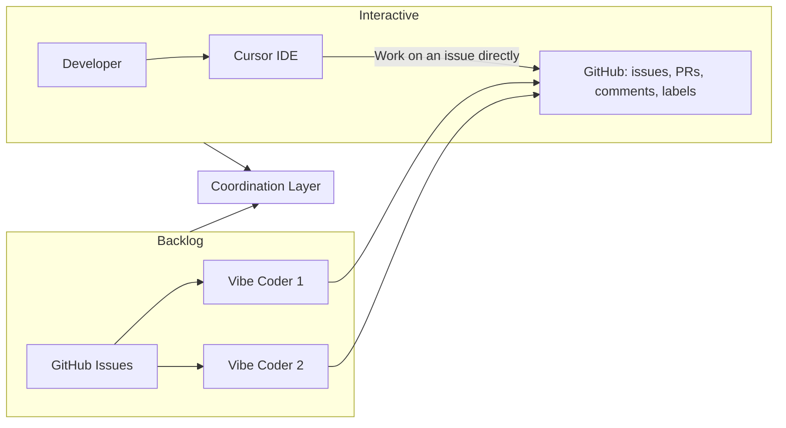
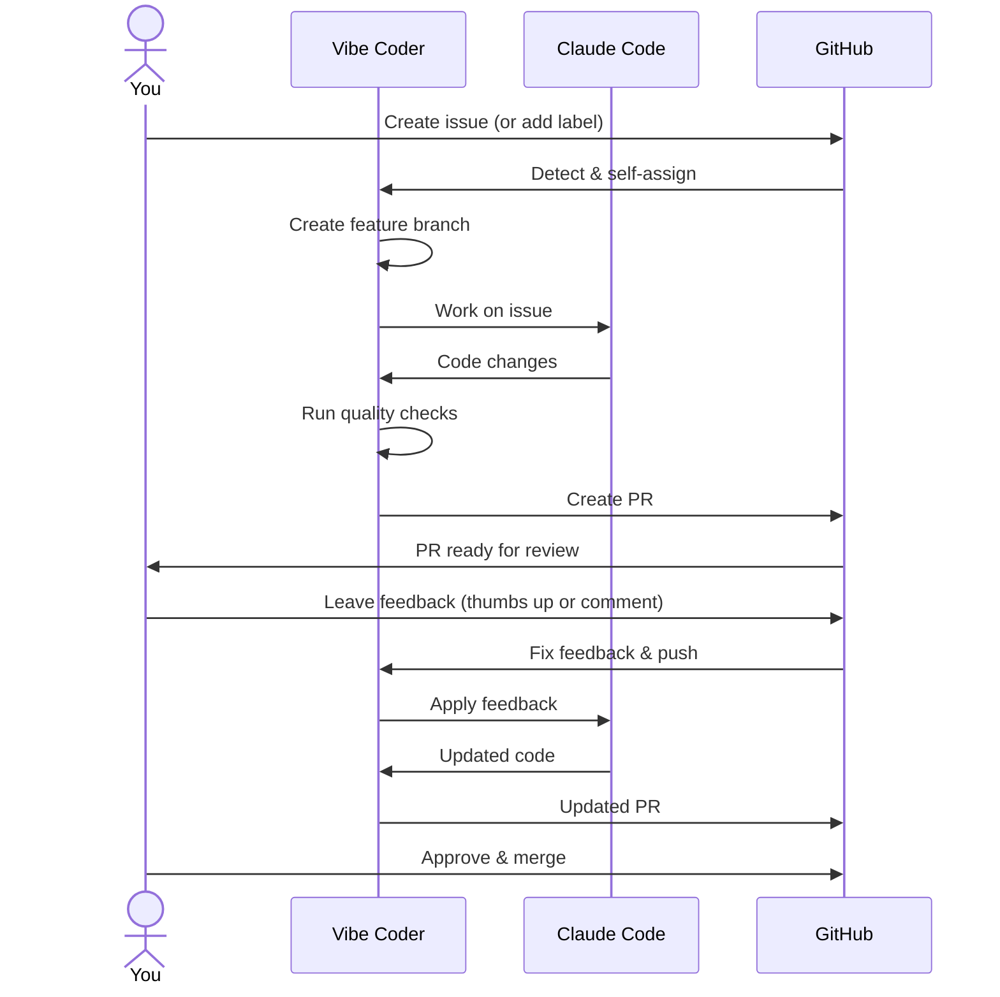
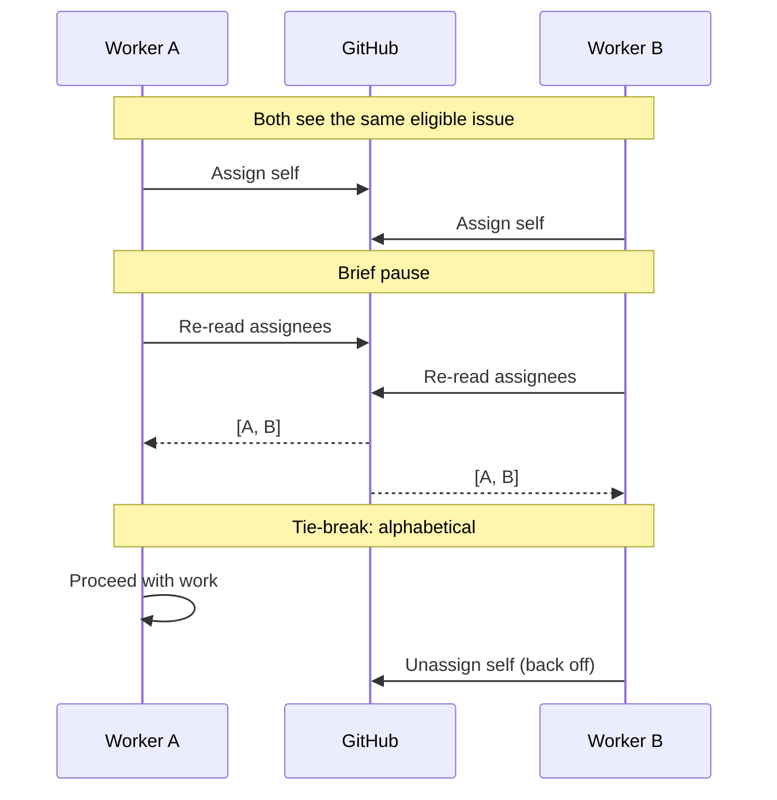
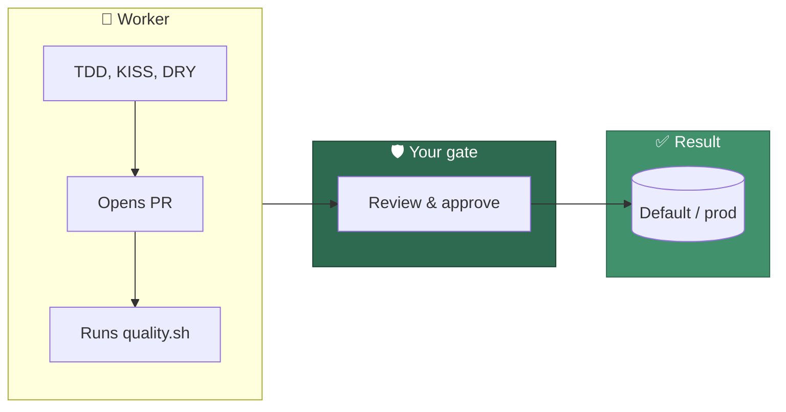

# 📋 Vibe Coder — Overview

A single-page walkthrough of what the Vibe Coder is, how work flows through
GitHub, and how it runs alongside developers and other workers. For **developers
and tech leads** who steer work via the backlog and PRs (Pull Requests).

---

## 1. 🤖 What is the Vibe Coder?

The **Vibe Coder** is an automated GitHub issue worker powered by Claude Code.
It turns your backlog into pull requests without anyone at a keyboard: create or
label issues, and the worker picks them up, implements changes, runs quality
checks, and opens PRs. All coordination happens through **GitHub** — issues,
labels, comments, and PRs are the only interface. The system is built to run
**unattended** (e.g. on a schedule) and never blocks on local UI.

**Nothing goes to the default branch without your review.** Fast and capable,
but it doesn't push straight to prod — same as your human devs. Every change is
a PR; you review, request fixes, approve, then merge. Control stays with you;
productivity goes up. Bear in mind: the gains are real, but you are deploying
code you didn't write and may not fully understand — treat each PR as code
you're taking ownership of.

**In one line:** Create GitHub issues from your phone, get PRs automatically,
review and request fixes with a thumbs up.

### The host is an unattended appliance

Deployment is `git clone` → configure credentials and repos → `./run.sh` (or
`run.ps1` on Windows). From then on the machine operates **unattended**: the
launcher starts the worker inside a least-privilege container, rebuilds that
container when its definition changes, and restarts it after a failure. The
worker sees its own workspace, logs, configuration and credentials — **not the
operator's computer** ([Containment](CONTAINMENT.md)).

**GitHub is the sole normal remote control plane.** Issues, comments, labels,
repositories, commits and pull requests are how humans steer the worker and how
the worker reports back — including escalations and crash notifications.
**SSH, Remote Desktop, screen sharing, a management UI and terminal access to
the host are not required for normal operation**, and no inbound port is
opened. Local logs (`~/logs`) stay useful for diagnosis, but a recoverable
failure is surfaced through GitHub rather than left in a host log.

---

## 2. 🔀 Two Ways to Work

Work can be done in two complementary ways. Both use the same control plane:
**GitHub**.

| Mode            | Who         | How                                                                                                                                                       |
| --------------- | ----------- | --------------------------------------------------------------------------------------------------------------------------------------------------------- |
| **Interactive** | A developer | Use Cursor (or any IDE) to work on an issue directly. You push branches and open PRs yourself.                                                            |
| **Backlog**     | Vibe Coders | Put work into GitHub issues (with the right labels). One or more Vibe Coders process the backlog in parallel; they claim issues, implement, and open PRs. |

GitHub issues, PRs, and comments are what **control the flow and coordinate**
between developers and Vibe Coders. There is no separate dashboard — everything
is visible and steerable in the repo.

---

## 3. 🔄 Core Workflow: Issue to PR

From the backlog's perspective, the path is: **issue → claim → implement →
quality gate → PR → review loop → merge.**

- **Discovery:** Issues with configured labels (e.g. `top-priority`, `claude`)
  or the `work-on` label (added by an allowed author) are eligible. The worker
  chooses the **globally oldest** eligible issue across all configured repos.
- **Claim:** The worker assigns itself to the issue. If multiple workers claim
  the same issue, a deterministic tie-break (e.g. alphabetical by login) decides
  who proceeds; the other backs off.
- **Implement:** Branch from default (or milestone branch), then **clarification
  phase** (is the issue clear? small enough? too large → add `planning` to break
  into sub-issues?), then Claude + quality gate (`./quality.sh`), commit, push.
  See [Clarification](workflows/planning-and-questions.md#clarification).
- **PR:** Create PR (with auto-merge when mergeable), then the worker keeps the
  PR healthy: spelling/quality/CI (Continuous Integration) fixes, branch
  updates, conflict resolution.

Details: [Issue processing](workflows/issue-processing.md),
[PR feedback & upkeep](workflows/pr-feedback.md).

---

## 4. ⚡ Running in Parallel with Developers and Other Vibe Coders

The Vibe Coder is designed to run in parallel with other developers and with
other Vibe Coders. Coordination is through GitHub only:

- **One PR per target branch** — In a repo, the worker does not start a second
  issue for the same target (default or a milestone branch) while it already has
  an open PR for that branch. So you get at most one open PR to default and one
  per milestone branch.
- **One issue per repo/milestone** — The worker enforces that only one issue per
  repository (or per milestone within a repository) is being worked on at any
  given time, preventing concurrent changes to the same codebase area.
- **Claiming:** For issue-based work, the worker assigns itself, waits briefly,
  then re-reads assignees. If two workers claimed the same issue, one keeps the
  claim and the other unassigns and skips.
- **Shared GitHub user:** Often the same GitHub user (e.g. a service account) is
  used by many Vibe Coders (one per host). PRs are identified by **author**; all
  workers using that account see the same open PRs and can handle feedback,
  spelling, or branch updates on any of them.

So: **issues, PRs, and comments control the flow**; no out-of-band coordination
is required.

Details: [Resilience & concurrency](workflows/resilience-and-concurrency.md).

---

## 5. 🧠 The Smarts

Beyond "issue in, PR out," the worker supports several higher-level behaviours:

### Prioritisation

A single loop checks work in a fixed **priority order** — one work item per
iteration, then sleep and repeat:

| Priority | Task                           | Description                                                                          |
| -------- | ------------------------------ | ------------------------------------------------------------------------------------ |
| 1        | PR feedback and reviews        | Authorised commenters or thumbs-up                                                   |
| 1.5      | Failed spelling/quality checks | Spelling, shellcheck, Deno quality checks on open PRs                                |
| 1.55     | Failed CI/integration checks   | Automatic diagnosis and fix of CI failures on open PRs                               |
| 1.6      | PR branch updates              | Rebase/merge to keep branches current                                                |
| 1.65     | Auto-merge catch-up            | Enable auto-merge on mergeable PRs                                                   |
| 1.66     | Branch cleanup                 | Delete branches for merged PRs                                                       |
| 1.67     | Issue closure                  | Close issues for merged PRs                                                          |
| 1.7      | Milestone completion           | Final consolidation PR                                                               |
| 1.75     | Issue refinement               | `refine-issue` label                                                                 |
| 1.8      | Question answering             | `question` label                                                                     |
| 1.85     | Planning                       | `planning` label                                                                     |
| 2        | New implementation issues      | Configured labels e.g. `top-priority` before `work-on`, globally oldest across repos |

### Workflow modes

- **Quorum mode:** Add the `quorum` label → two agents draft a plan for the
  issue independently, a third judges the two drafts blind (Plan A vs Plan B,
  no vendor names), and the worker posts the winner with the runner-up and the
  judge's reasoning attached. Human-applied only, and it hands the issue back
  with `needs-human` rather than picking the next phase itself. It costs roughly
  three agent invocations per plan, so it is for issues where the approach is
  genuinely contested. Details: [Quorum](QUORUM.md).
- **Planning mode:** Add the `planning` label → the worker breaks the issue into
  sub-issues and closes the parent. No code is written until you add labels to
  the sub-issues.
- **Question mode:** Add the `question` label → the worker answers in a comment,
  removes `question`, and adds `needs-human` to mark the user's turn (Issue
  #2030 — re-add `question` to ask a follow-up). No branch or PR. If the
  question is too broad or
  ambiguous, the worker posts a **clarification request** instead — it adds
  `needs-human` so you can provide more context and retry. If question
  answering **times out**, any partial answer produced is posted with a
  disclaimer rather than being discarded — useful content is not lost.
- **Refinement:** Add the `refine-issue` label and comment → the worker updates
  the issue body/title from your feedback.
- **Worker escalation (`needs-human`):** When the worker cannot complete an
  issue autonomously (e.g. it needs credentials only a human can supply, or a
  product decision only a human can make), it adds the `needs-human` label,
  posts an explanatory comment, and stops. Discovery skips any issue carrying
  `needs-human` until a human resolves the blocker and removes the label. The
  worker **never** self-applies `top-priority` (the primary human-only
  scheduling signal) or any other reserved workflow label for this purpose.
  Details:
  [USAGE.md — Worker escalation via `needs-human`](USAGE.md#-worker-escalation-via-needs-human).
- **Clarification (important):** Before implementing, the worker runs a
  **clarification phase** that does two things: **(1)** Is the issue clear? If
  not, it posts questions and adds `needs-human`; you respond and remove
  the label. **(2)** Is it small enough for a single PR / one run? If the issue
  is too large, the worker adds the `planning` label so it gets broken into
  smaller sub-issues. No code is written until the issue is clear and
  appropriately scoped. Details:
  [Planning, questions, refinement, clarification](workflows/planning-and-questions.md).
- **CI fix workflow:** The worker automatically diagnoses and fixes CI check
  failures on open PRs (priority 1.55). It extracts failure annotations, sends
  them to Claude with a CI fix prompt, and pushes a fix commit. Retries are
  capped (default 3) to avoid infinite fix loops. Details:
  [CI fix](workflows/ci-fix.md).
- **Security scan (idle):** When every monitored repo is idle (no PR feedback,
  no CI failure, no claimable issue), the worker runs a MythOS-style four-phase
  security audit against the oldest-scanned repo and files findings as
  `security`-labelled issues. Triggers, state files, finding format, and
  overflow rollover are documented in
  [Security Scans — Operator Manual](SECURITY-SCAN.md).
- **Milestones:** Put issues in a GitHub milestone → the worker uses one branch
  per milestone. Each milestone-issue PR **auto-merges into the milestone
  branch** when the quality gate passes (no human review per issue), so the
  worker can **safely** run **24/7** on the backlog (e.g. overnight or over the
  weekend). **No code reaches the default branch without your review** — only
  the **one final PR** from the milestone branch, with many issues completed and
  all quality gates already run. Productivity gain without sacrificing
  oversight.

### Self-healing and resilience

The worker has multiple layers of resilience:

- **Startup recovery:** repo reset on each run, module-snapshot execution (the
  Deno driver is immune to its own mid-run `git reset`), pre-Claude repository
  validation, disk cleanup at threshold.
- **Runtime protection:** timeout wrappers on all GitHub/git operations,
  rate-limit aware retry with `Retry-After` header support, rate-limit circuit
  breaker with exponential backoff (prevents hammering failing resources).
- **Persistent state:** failure counts, circuit breaker state, and cooldown
  timers persist to disk so state survives crashes and prevents crash-restart
  loops. Atomic file writes prevent corruption on interruption.
- **Heartbeat tracking:** background heartbeat updates run while Claude is
  working, so stuck-issue detection can react within minutes rather than waiting
  for full timeout.
- **Crash recovery:** crash cleanup handlers unassign the worker and clear
  heartbeat on exit; orphan issue recovery detects assigned issues with no
  heartbeat (defence-in-depth for crashes between claiming and recording
  heartbeat); multi-worker stale assignment recovery scans GitHub for stale
  assignments from other machines.
- **Cross-account stale-assignment recovery (Issue #2671):** the recovery
  scans may auto-unassign a stale assignee from *any* account when that
  account has posted worker claim/heartbeat markers on the issue —
  evidence-based, no configured allowlist — so an assignment leaked by one
  worker account (e.g. `Vibecoderbot`) is recoverable by workers running as
  another account (e.g. `stsvcbot`). Assignees with no marker evidence
  (e.g. human teammates) are never auto-unassigned. Every existing safeguard
  is preserved (local heartbeat → skip; open linked PR → skip; live marker →
  skip; own-machine marker → skip; cleared marker within the 1h grace →
  skip), the recovering machine and reason are recorded as an audit note on
  the issue, and `[recovery-decision]` telemetry carries a `crossAccount`
  flag distinguishing cross-account from own-account recoveries.
- **Crash notifications:** alerts operators when the worker exits unexpectedly
  via GitHub issue comments and optional webhooks (e.g. Slack, PagerDuty), with
  rate limiting to prevent notification spam.
- **Periodic health checks:** Claude CLI responsiveness and GitHub
  authentication are checked with a configurable cache TTL (Time To Live),
  avoiding excessive overhead during scan cycles.
- **Exit on repeated failure:** after repeated failures on the same item the
  process exits so the next cron run gets fresh code.

Details: [Workflows overview](workflows/README.md),
[Planning, questions, refinement](workflows/planning-and-questions.md),
[Milestones](workflows/milestones.md), [CI fix](workflows/ci-fix.md).

### 🛡️ Code quality and standards (for managers and tech leads)

The worker follows the same standards you'd want from your team: **TDD**
(Test-Driven Development), **KISS** (Keep It Simple, Stupid), **DRY** (Don't
Repeat Yourself), and the rest. Every PR runs the full quality gate
(`./quality.sh`: `deno test`, `deno lint`, `deno check`, `deno fmt --check`).
Shell-script linting is handled by each repo's own CI, not the worker gate. So
you get
the productivity boost without dropping the bar — have your cake and eat it too.
Full playbook: [AGENTS.md](../AGENTS.md).

---

## 6. 👀 What You See in GitHub (Operating Model)

As a developer or tech lead, you can expect:

- **Backlog** — Open issues with the right labels (e.g. `top-priority`,
  `claude`) or `work-on` (when an allowed author has added it). Optionally
  grouped by milestone.
- **Activity** — PRs opened by the worker (author = configured GitHub user),
  comments and "Request changes" from your team, and the worker's follow-up
  commits and comments.
- **Steering** — Add or remove labels, comment on issues or PRs, use thumbs-up
  to trigger fixes, merge when ready. No separate tool; everything stays in
  GitHub.

Screenshots (add under `docs/evidence/` when you have them):

1. **Backlog view** — Issues list with labels and milestones.
2. **Single issue** — Body, labels, assignee, dependencies/milestone.
3. **Vibe Coder PR** — Linked issue, checks, reviewers, auto-merge.
4. **Feedback loop** — Human comment or "Request changes" and worker response.
5. **Milestone / grouped work** — Milestones page or list of issues in a
   milestone.

---

## 7. 📖 Worked Example

See the
[worked example: Planning → work-on → milestone → consolidation](workflows/WORKED-EXAMPLE.md)
for screenshots of the full workflow step by step — from a planning issue on
your phone to one final PR to review.

---

## 8. 📚 Where to Go Deeper

| Topic                                                                              | Document                                    |
| ---------------------------------------------------------------------------------- | ------------------------------------------- |
| **User-facing usage**                                                              | [Usage Guide](USAGE.md)                     |
| **Workflows (issue → PR, PR feedback, CI fix, planning, milestones, concurrency)** | [Workflows](workflows/README.md)            |
| **Configuration**                                                                  | [Configuration Reference](CONFIGURATION.md) |
| **Deployment (cron, launchd, systemd)**                                            | [Deployment Guide](DEPLOYMENT.md)           |
| **Containment (what the worker can and cannot reach)**                             | [Containment](CONTAINMENT.md)               |
| **Lessons learnt (unattended, concurrent, self-healing)**                          | [Lessons learnt](LESSONS-LEARNT.md)         |
| **Security controls, configuration, deployment security**                          | [SECURITY.md](../SECURITY.md)               |
| **Threat model (assets, attacker capabilities, attack paths, residual risks)**      | [Threat Model](THREAT-MODEL.md)             |
| **Agent accountability (tamper-evident GitHub-mutation audit log, identity delegation, Rule of Two)** | [Agent Accountability](AGENT-ACCOUNTABILITY.md) |
| **Project overview**                                                               | [README](../README.md)                      |

All of the above are linked from the main [README](../README.md#documentation).

---

## 9. 💡 Lessons Learnt

Making the Vibe Coder run **unattended**, **concurrent**, and **self-healing**
has been surprisingly hard. If you're building something similar — an automated
agent that turns issues into PRs and runs 24/7 — you'll need to handle the same
kinds of issues: no blocking on UI, claim-before-work under concurrency, one PR
per target branch, a module snapshot and repo reset so updates don't break a live run,
and exit on repeated failure so the next cron run gets fresh code. We've
documented what we did and why in [Lessons learnt](LESSONS-LEARNT.md); it links
to the resilience, issue-processing, and deployment docs.

---

## 10. 🔒 Security, Misuse & Outstanding

**Documentation only** — this section summarises where we are and what's left;
it does not change behaviour.

### What we do well

The worker enforces **author checks** (only allowed authors trigger
implementation), **label and assignee checks**, **one PR per target branch**,
and **PR comment verification** (only authorised commenters or thumbs-up trigger
feedback). Config and tokens are protected; we use safe parameter handling (e.g.
jq `--arg`), input validation and suspicious-pattern detection for prompt
injection, and audit logging. See [SECURITY.md](../SECURITY.md) for the full
threat model, defence-in-depth, and resolved issues.

### How bad actors could misuse it (why the repo isn't public yet)

**Important for managers:** Making the _code_ public does **not** give bad
actors in other countries (or anywhere else) a way to run code on _your_
machines behind _your_ firewall. Your deployment is protected by design: only
your config (allowed_authors, AUTHORIZED_COMMENTERS) and your token, on your
machine, can trigger work. See
[SECURITY.md § For managers: public code vs your deployment](../SECURITY.md#for-managers-public-code-vs-your-deployment)
for the full explanation. The points below are about other risks (e.g.
trusted-author compromise), not "remote attackers reaching your worker."

- **Trusted-author compromise:** If an allowed author's account or machine is
  compromised, an attacker could create issues that trigger arbitrary code
  execution on the worker. Mitigations: restrict who is in `allowed_authors`,
  use tokens scoped to specific repos, and monitor activity.
- **Prompt injection:** Issue bodies and PR comments are passed to Claude; a
  malicious trusted author could try to steer Claude toward unsafe actions. We
  log suspicious patterns and use clear delimiters for untrusted content; we
  don't block (trusted authors) but we get an audit trail.
- **Bot accounts in AUTHORIZED_COMMENTERS:** Bots can trigger PR feedback
  without a thumbs-up; a compromised or misbehaving bot could trigger unwanted
  work. Bot accounts are opt-in and documented as a known limitation
  ([SECURITY.md § Bot account security](../SECURITY.md#bot-account-security-issue-36)).
- **Claude Code permissions:** The worker runs Claude with broad permissions
  (read/write repo, shell, network). We rely on allowed authors and code review
  (no code to default without your review) to limit impact.

Addressing these fully (e.g. tighter sandboxing, mandatory review gates for
certain labels, or making the repo public only after more hardening) is part of
the outstanding work below.

### What's outstanding

- **Known limitations** in
  [SECURITY.md § Known limitations](../SECURITY.md#known-limitations): Claude
  Code permissions, prompt injection mitigations (audit, not block), input
  length limits, repository write access. These are documented; further
  hardening is possible (e.g. stricter sandboxing, blocking on suspicious
  patterns for some deployments).
- **Open security issues** in the repository (e.g. bot account behaviour, token
  lifecycle, or deployment hardening) — see the repo's issue list and
  [SECURITY.md](../SECURITY.md). The
  [Responsible disclosure policy](../SECURITY.md#responsible-disclosure-policy)
  explains how to report vulnerabilities.
- **Further observability and usability improvements** are tracked in the repo
  as usual.

If you're evaluating the Vibe Coder for your own use, read
[SECURITY.md](../SECURITY.md) and the Known limitations section; treat the
worker as a powerful tool that should only process issues from people and
systems you trust.
