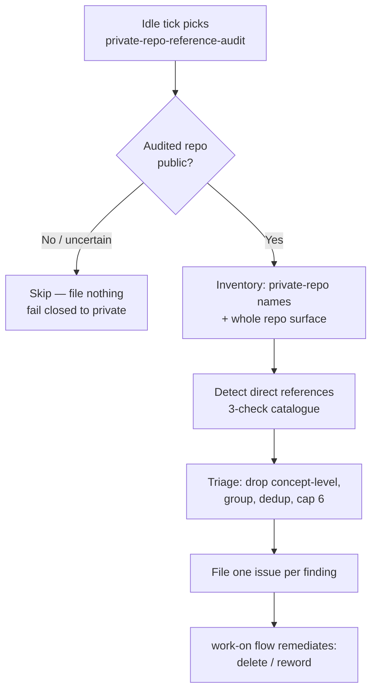

# 🔒 Private-Repo Reference Audit — Operator Manual

The private-repo-reference audit is the sixteenth registered
[idle-task](IDLE-TASK-FRAMEWORK.md) template. When the worker has
no claimable work it may pick this template, clone one monitored repository, and
— **only if that repository is public** — run a static, evidence-backed audit
for **direct references to a private `stSoftwareAU` repository**. It files a
small, logically-grouped set of `private-repo-reference` issues (most important
first) that ride the normal `work-on` flow. A clean audit files nothing.

> **Terminology.** An _idle task_ is background work the worker performs only
> when no higher-priority work exists; see the
> [idle-task framework](IDLE-TASK-FRAMEWORK.md). A _direct reference_ names,
> paths to, or points at a specific private repo (the repo name, an
> `stSoftwareAU/<private-repo>` slug, a clone/checkout path, a URL, or committed
> data captured from it). A _concept-level mention_ describes an idea drawn from
> a private project **without naming or pointing at the repo** — and is
> acceptable.

## Design intent — a public repo must be self-contained for the public

A public repository must be **fully self-contained for the public**: nothing in
it may _directly reference_ a private repository — not tests, fixtures, benches,
documentation, or code comments. The public cannot see the target, so every kind
of direct reference is wrong:

- a **test** that reaches a private repo can never run for the public and belongs
  in the private repo instead;
- a committed **fixture / data file** captured from a private repo leaks private
  content into a public repo;
- a **doc or comment** that names a private repo points the general public at
  something they cannot see.

Only `stSoftwareAU` **private** repos are in scope — public repos (whether
`stSoftwareAU/*` or third-party) are fine to reference.

The scan **files issues only** — it never edits a file or raises a PR. The
remediation rides the normal `work-on` flow on the filed issues, so a human
approves each change before it lands. This issue delivered the audit
check only; any real-world cleanup (e.g. in private-repo-14) rides the issues the scan
files.

## Public-only gate — the defining constraint

Unlike every sibling scan, this audit is **conditional on the audited repo's
visibility**. Visibility is read from the GitHub API at scan time via
`getRepoVisibility` (`lib/repo_visibility.ts`), which fail-safes to `"private"`
on any uncertainty. The gate is enforced twice:

- **`shouldFile`** — the random idle-task filer never files the wrapper on a
  private (or uncertain) repo.
- **`runTask`** — defence in depth: even if a wrapper was seeded on a private
  repo (e.g. via the operator "seed all" path that bypasses `shouldFile`), the
  scan short-circuits with a `skipped: … is not a public repo` summary and files
  nothing.

The hard safety property: **the scan never runs against a private repo.** A
lookup error resolves to "not public", so the audit fails closed.

## The three-check catalogue

The prompt (`prompts/private_repo_reference_audit/`) walks the repo surface
against three checks in Phase 2. A candidate is valid only when it cites the
exact file/line making a **direct** reference to a **confirmed-private**
`stSoftwareAU` repo:

1. **Runtime access to a private repo** (`severity:high`) — code, tests, benches,
   or CI that reads / clones / fetches / checks out a private repo at build or
   test time (an HTTP fetch of a private raw URL, a `git clone`, a relative
   `../FLEET` checkout path, a submodule). Such a test can never run for the
   public. **Fix: delete** it from the public repo (the team may recreate it in
   the private repo).
2. **Committed private-derived fixtures / data** (`severity:high`) — files
   captured from a private repo and committed into the public repo (e.g. creature
   JSON copied out of `private-repo-7` into `test/fixtures/…`). This leaks private data
   even with no runtime access. **Fix: delete** the private-derived data. The
   filed issue names the private repo but **never quotes its content**.
3. **Textual private-repo name mention** (`severity:medium`, `low` for an
   incidental one-off) — a comment, doc, README, or string literal that _names_ a
   private repo (or links to it) with no runtime access and no committed data.
   **Fix: reword to concept level** — describe the idea without naming or linking
   the private repo.

> A concept-level mention that does **not** name/path/URL a private repo (or
> reference private-derived data) is acceptable and is **not** filed.

## Relationship to sibling scans

| Concern                                             | Owned by                                          |
| --------------------------------------------------- | ------------------------------------------------- |
| Public repo directly references a **private** repo  | **this scan** (`private-repo-reference-audit`)    |
| Test quality (WHAT-vs-HOW, coverage gaps)           | [`test-audit`](IDLE-TASK-FRAMEWORK.md)            |
| Prose / Markdown documentation rot                  | [`documentation-audit`](DOCUMENTATION-AUDIT-SCAN.md) |

A candidate that belongs to a sibling scan is left to that scan.

## Contract summary

| Property                  | Value                                                          |
| ------------------------- | ------------------------------------------------------------- |
| Template name             | `private-repo-reference-audit`                                 |
| Wrapper title             | `Run a private-repo reference audit`                           |
| Findings label            | `private-repo-reference` + one `severity:*`                    |
| Prompt                    | `prompts/private_repo_reference_audit/prompt.md`               |
| Dedup                     | `{{KNOWN_OPEN_FINDING_IDS}}` + `{{OPEN_ISSUE_TITLES}}` — both repo-wide, `(none)` when empty ([contract](IDLE-TASK-FRAMEWORK.md#cross-label-dedup--the-open-issue-title-list)) |
| Raises a PR?              | No — issue-only (`skipMilestone: true`)                        |
| Applies to                | **Public repos only** (visibility read at scan time)          |
| Cadence                   | Once per repo per week (`cooldownHours: 168`)                  |
| Per-run cap               | 6 findings                                                     |

## Remediation the filed issues prescribe

By tier, matching the catalogue:

- **Runtime access** → the test is **deleted** from the public repo. The team may
  recreate an equivalent test in the private repo, where it can actually run.
- **Committed private-derived data** → the fixture / data file is **deleted**.
- **Textual name mention** → the mention is **reworded to concept level**.

Filed issues may name the referenced private repo (its name already appears in
the public repo) but must **never** quote private-repo content or data.
