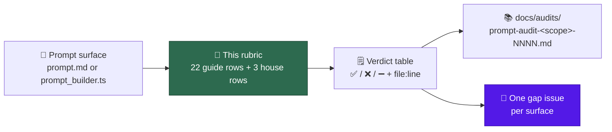

# 📐 Prompt best-practices checklist

The shared rubric for scoring a Vibe Coder prompt surface against
[Anthropic's Claude prompting best-practices guide][guide]. It exists so the
audit sub-issues of all score against the **same** items instead of each
re-deriving a checklist, and so two audits of the same surface a year apart are
comparable.

[guide]: https://platform.claude.com/docs/en/build-with-claude/prompt-engineering/claude-prompting-best-practices

This page is a rubric only. It never prescribes a wording for any prompt, and
auditing against it never edits a prompt — gaps are filed as issues (see
[Gap-issue template](#gap-issue-template)).



## How to use this rubric

1. Score **one surface at a time**, as it stands on the commit you audited —
   record that commit, because the template is edited in place.
2. Give every one of the 22 guide rows and the 3
   [house rows](#house-additions) a verdict: ✅ pass, ❌ gap, or ➖ n/a. Silence
   is not a verdict; a row you did not check is a gap in the audit, not a pass.
3. Back every verdict with `file:line` evidence — including ➖, where the
   evidence is what makes the row inapplicable (a size measurement, a
   read-only constraint, the host template's line).
4. Record the verdicts in the copy-paste table below and file **one** gap issue
   per surface, listing each gap as checklist item plus evidence plus a
   concrete suggested change.

## Applicability — the three surface kinds

All three kinds are in scope for, but some rows are decided in only one of
them, so state the kind before scoring.

| Surface kind | What it is | Evidence looks like | Rows it owns |
| --- | --- | --- | --- |
| **Static template** — `prompts/<name>/prompt.md` | The prompt text itself: either a whole workflow prompt (`issue`, `security_scan`) or a fragment substituted into one (`coding_guidelines`) | `prompts/dead_code/prompt.md:210` | Everything the words say: rows 1–5, 8, 10–22, and the house rows H1–H3 |
| **Code-assembled string** — `worker/deno/lib/prompt_builder.ts` | The builder functions that load a template, substitute placeholders, split system versus user turn, and fence untrusted content | `worker/deno/lib/prompt_builder.ts:148` | Everything the assembly decides: rows 4, 6, 7, 9, and the wrapper around any injected value |
| **Wrapper issue body** — the `prompt.md` of a native scan | The same file, but no model ever reads it: a native template renders it as the filed idle-task issue body, and the scan itself runs in Deno. The four are `prompts/alert_feed/`, `prompts/bash_script_refs/`, `prompts/bash_syntax_audit/` and `prompts/workflow_annotation_scan/` | `worker/deno/lib/idle_task_templates/bash_syntax_audit_template.ts:486` — the `buildIssueBody()` that renders it | Only what the **document** must do for its human reader: rows 1, 2, 8 and the house rows H1–H3 |

Three consequences worth stating once, so audits do not re-litigate them:

- **A fragment inherits its host.** `coding_guidelines` is substituted into
  eight templates by `buildCodingGuidelines()`, so a fragment may score ➖ on a
  row the host template answers — but only when the audit cites the host line.
  A gap in a fragment is inherited by every host, which is what makes it high
  priority.
- **A template cannot set message roles.** Row 9 (prefilled responses) is
  therefore ➖ for every `prompt.md` surface and is only ever scored in
  `prompt_builder.ts`.
- **A wrapper issue body is scored as a document, not as a prompt** (Issue
  #841). Every row that scores what a *model* does with the text — 3, 5, 6, 9
  and 10–22 — is ➖ for the four surfaces above, because there is no model turn
  to score. The evidence for the ➖ is the template's `buildIssueBody()` call
  site, which is what makes the file an issue body rather than a prompt. Rows
  1, 2, 8 and H1–H3 still bind: a human reads it, so it must be clear, say why,
  and state its shape. The alternative — giving each of the four a persona so
  row 5 passes — was rejected: a role line addressed to nobody is context paid
  for no behaviour, which is exactly what H2 bans.

## Checklist

Row numbering and headings follow the guide, so the mapping stays auditable.
A row's `n/a` cell describes the only conditions under which *that* row may be
skipped; anything else is a pass or a gap. The one exemption a row does not
restate is the surface-kind one above: a row that scores what a model does with
the text is ➖ for a **wrapper issue body** whatever its own cell says, because
there is no model turn to score. Every other ➖ must match the row's cell. The three levers the guide does not carry are scored
separately, as [House additions](#house-additions).

### General principles

| # | Technique | ✅ Pass | ❌ Gap | ➖ n/a |
| --- | --- | --- | --- | --- |
| 1 | Be clear and direct | Each instruction names one unambiguous action, ordered work is numbered, and no two clauses of the surface contradict each other | Vague verbs ("handle appropriately"), or two rules that cannot both be obeyed, or a rule whose applicability cannot be determined from the text | Never — every surface carries instructions, so this row is always scored |
| 2 | Add context to improve performance | Each non-obvious prohibition states its why: the incident, the cost, or the downstream consumer it protects | Bare "NEVER" or "MUST" rules with no rationale, which the model cannot generalise from to an unlisted near-miss case | Never — every surface carries at least one prohibition or preference |
| 3 | Use examples effectively | The surface's hardest judgement calls carry a worked instance in `<example>` tags, including at least one negative or near-miss case | Only abstract category lists, title fragments, or rendered footers, with no `<example>` tag and no worked near-miss case | The surface asks for no judgement call — pure mechanical substitution with no branch the model can get wrong |
| 4 | Structure prompts with XML tags | Instructions, injected repo content, and untrusted input each sit in distinctly named tags, and every substituted value is wrapped | Markdown-only structure where injected values share the same fences as prompt-authored code, or a fragment spliced into a host with no wrapper | The surface is a fragment whose caller demonstrably wraps it, with the wrapping call site cited |
| 5 | Give Claude a role | Opens with a one-sentence persona naming the job and its stance, for example an evidence-backed static reviewer | No persona anywhere, so the role has to be inferred from the task body, or a "You are" match that is ordinary prose | The surface is a fragment and its host template sets the role, with the host line cited, or it is a **wrapper issue body** no model reads, with its template's `buildIssueBody()` cited |
| 6 | Long context prompting | Long substituted documents sit above the query, are wrapped in per-document tags with a source, and a quote-first step grounds the answer | A large or unbounded substituted body placed after the instructions, unwrapped, with no grounding step for a 20k-plus-token input | The surface is under the guide's 20k-token trigger and substitutes only short scalars, with the measured size stated |

### Output and formatting

| # | Technique | ✅ Pass | ❌ Gap | ➖ n/a |
| --- | --- | --- | --- | --- |
| 7 | Communication style and verbosity | States how much visible output it wants, for example a summary after tool use, or explicit conciseness for a comment posted to a human | Silent on verbosity even though the run's output is published to an issue, a PR comment, or a log a human reads | The caller injects the verbosity block, with `buildVerbosityBlock()` and its call site cited |
| 8 | Control the format of responses | The output shape is stated positively and shown as a skeleton or an output tag the response can mirror | Shape given only as prohibitions ("no JSON, no summary") or as prose bullets with no skeleton, leaving the model to invent a layout | The surface produces no model output of its own; its host template owns the output contract, cited by line |
| 9 | Migrating away from prefilled responses | The builder passes no assistant prefill; format-forcing is done with instructions or structured outputs, confirmed at the call site | The builder constructs an assistant-turn prefill or depends on continuation-by-prefill, which errors on current models | The surface is a static `prompt.md` template and cannot set message roles at all |

### Tool use

| # | Technique | ✅ Pass | ❌ Gap | ➖ n/a |
| --- | --- | --- | --- | --- |
| 10 | Tool usage | Names the tool for each action and asks for the change to be made rather than suggested, without shouty over-triggering language | Names an outcome but no tool, asks it to "suggest" work that must actually be done, or inflates with "CRITICAL: you MUST" wording | The surface names no tools and forbids side effects, and says so explicitly |
| 11 | Optimize parallel tool calling | Carries parallel-tool-call guidance where it prescribes several independent reads, greps, or API calls | Prescribes batches of independent reads with no parallel instruction, so the run serialises work that could overlap | Every step depends on the previous one, and the surface states that ordering constraint |

### Thinking and reasoning

| # | Technique | ✅ Pass | ❌ Gap | ➖ n/a |
| --- | --- | --- | --- | --- |
| 12 | Overthinking and excessive thoroughness | Tool guidance is targeted ("use X when it would help"), and exploration is bounded to what the output can actually use | Blanket defaults ("proactively use these tools", "if in doubt, use X"), or unbounded exploration whose results are then truncated to N | The surface prescribes no exploration and calls no tools, with the absence cited |
| 13 | Leverage thinking & interleaved thinking capabilities | Asks for reflection on tool results at the decision points that matter, rather than at every step | A multi-step tool loop with no instruction to weigh results before the next action, at the point where a wrong branch is costly | Single-shot surface with no tool loop and no branching decision to reflect on |

### Agentic systems

| # | Technique | ✅ Pass | ❌ Gap | ➖ n/a |
| --- | --- | --- | --- | --- |
| 14 | Long-horizon reasoning and state tracking | States that context is compacted so work must not stop early, and asks for progress to be checkpointed in git or notes | A long whole-repo run with no context-limit clause, worse when the surface also pushes token frugality that invites an early wrap-up | A short bounded single-pass surface that cannot approach the context limit, with its size stated |
| 15 | Balancing autonomy and safety | Separates freely-allowed local actions from ones needing confirmation, naming force-push, deletes, and posts to shared systems, and forbids bypassing safety checks | Only a partial bound, for example staged-secret rules alone, with no general reversibility principle for destructive or externally visible actions | The surface is read-only and cannot act, and the read-only constraint is stated in the surface itself |
| 16 | Research and information gathering | Defines what a successful answer is, asks for cross-verification, and asks for confidence or competing hypotheses to be tracked | A find-and-file scan with no success criterion and no verification step, so a single weak signal becomes a filed finding | The surface gathers nothing — it acts on inputs supplied to it and reads no further sources |
| 17 | Subagent orchestration | Says when delegation is and is not warranted, so a direct grep is not replaced by a fleet of shallow subagents | Encourages or forbids subagents with no criterion, or spawns them for work a single sequential pass would do | No subagent tool is available to the surface, and it neither mentions nor implies delegation |
| 18 | Chain complex prompts | Stages that need their intermediate output inspected are separate turns or calls, as planning is from planning critique | A draft-then-review pipeline folded into one turn, so the intermediate cannot be logged, evaluated, or branched on | A single-purpose surface with no pipeline and no intermediate worth inspecting |
| 19 | Reduce file creation in agentic coding | States whether scratch or helper files may be written and requires them to be cleaned up at the end of the task | Tells the model to draft in scratch notes without saying whether a file may be written, or leaves iteration artefacts uncleaned | The surface forbids writes outright and says so, so no artefact can be created |
| 20 | Overeagerness | Bounds scope explicitly: only what was asked, no unrequested refactors, abstractions, or defensive code | No scope bound at all, or "go above and beyond" language with no ceiling on what may be changed or filed | The surface produces no changes and already caps its output count, with the cap cited |
| 21 | Avoid focusing on passing tests and hardcoding | Requires a general solution over one fitted to the tests, and forbids weakening, skipping, or deleting tests to go green | Covers test quality but never generalisation, so hardcoding to test inputs stays permitted by omission | The surface never writes code or tests and never touches a test suite |
| 22 | Minimizing hallucinations in agentic coding | Requires reading the file before asserting anything about it, and requires `file:line` evidence for every claim | Asks for verdicts or findings with no read-before-assert rule and no evidence requirement, so plausible-sounding claims pass | The surface makes no claim about code and produces no findings |

## House additions

Three levers the guide does not carry, added because our own prompts keep
failing them (Issue #659). The idea belongs to
[mattpocock/skills](https://github.com/mattpocock/skills)
(`skills/productivity/writing-for-agents/SKILL.md`), not to this repo.

They sit in their own section and carry an `H` prefix so the 1–22 mapping to
guide headings stays auditable: interleaving them would renumber every verdict
table already recorded under [`docs/audits/`](audits/). House rows are scored
with the same ✅ / ❌ / ➖ verdicts and need the same `file:line` evidence.

| # | Technique | ✅ Pass | ❌ Gap | ➖ n/a |
| --- | --- | --- | --- | --- |
| H1 | Positive framing | Instructions name the behaviour wanted, so the unwanted one is never spoken; a prohibition appears only as a hard guardrail that cannot be phrased positively, paired with its positive target | Steers by prohibition where a positive statement does the same work, which drags the forbidden behaviour into context and makes it more available, not less | The surface issues no behavioural instruction — it substitutes values or states facts only, with the absence cited |
| H2 | No-ops | Every instruction changes behaviour against the model's default, and a line that fails the test is deleted whole rather than trimmed to fewer words | Restates a default the model already obeys, paying context load for nothing — recorded as a candidate until a run settles it, because the test is model-relative | The surface carries no instructions of its own, for example a pure structure or evidence fragment, with the absence cited |
| H3 | Leading words | A compact pretrained term — *tight*, *red*, *relentless* — anchors the behaviour and is used consistently across the prompt, the docs and the code | Repeats a triad or restates the same instruction in three shapes where one pretrained term would anchor it, or coins a term with no pretraining behind it | The surface states each behaviour once and has no repeated triad or restatement to collapse, with the measured length cited |

### Scoring the house rows

- **Existing audits stay as scored.** Every audit already under
  [`docs/audits/`](audits/) is complete against rows 1–22 and is not reopened
  to add house rows. An audit records which rubric it used, so a surface
  re-audited later picks the house rows up then.
- **An H2 verdict is a candidate until a run settles it.** Whether a line
  changes behaviour is model-relative and cannot be decided by reading, so an
  unattended audit records `❌ (candidate)` and names the line. A bare `❌` on
  H2 needs a cited run in which the line was removed and the behaviour held.
- **A hard-won guardrail is not sediment.** Rules earned by an incident — the
  spin-wait ban, the `tail -f | head` ban — are the opposite of no-ops: they
  pass H2 by definition, and H1 keeps them as prohibitions, asking only that
  each be paired with the positive target. A pruning pass never deletes one.

## Verdict table template

One column per surface, one row per checklist item. Copy into the audit
document, add a surface column per file, and keep the evidence column pointing
at real lines.

```markdown
Legend: ✅ pass · ❌ gap · ➖ n/a

| # | Checklist item | <surface-a> | <surface-b> | Evidence (file:line) |
| --- | --- | --- | --- | --- |
| 1 | Be clear and direct |  |  |  |
| 2 | Add context to improve performance |  |  |  |
| 3 | Use examples effectively |  |  |  |
| 4 | Structure prompts with XML tags |  |  |  |
| 5 | Give Claude a role |  |  |  |
| 6 | Long context prompting |  |  |  |
| 7 | Communication style and verbosity |  |  |  |
| 8 | Control the format of responses |  |  |  |
| 9 | Migrating away from prefilled responses |  |  |  |
| 10 | Tool usage |  |  |  |
| 11 | Optimize parallel tool calling |  |  |  |
| 12 | Overthinking and excessive thoroughness |  |  |  |
| 13 | Leverage thinking and interleaved thinking |  |  |  |
| 14 | Long-horizon reasoning and state tracking |  |  |  |
| 15 | Balancing autonomy and safety |  |  |  |
| 16 | Research and information gathering |  |  |  |
| 17 | Subagent orchestration |  |  |  |
| 18 | Chain complex prompts |  |  |  |
| 19 | Reduce file creation in agentic coding |  |  |  |
| 20 | Overeagerness |  |  |  |
| 21 | Avoid focusing on passing tests and hardcoding |  |  |  |
| 22 | Minimizing hallucinations in agentic coding |  |  |  |
| H1 | Positive framing |  |  |  |
| H2 | No-ops |  |  |  |
| H3 | Leading words |  |  |  |
|  | **Gaps** |  |  |  |
```

## Gap-issue template

One issue per surface, never one per gap — the fixes to a single template land
together. Before filing, search for an existing open issue on the same surface
and comment there instead of duplicating.

- **Title:** `prompt(<surface>): N Claude best-practice gaps` — for example
  `prompt(dead_code): 6 Claude best-practice gaps`.
- **Labels:** `enhancement` and `best-practices`. No reserved workflow label.
- **Milestone:** ` Align Vibe Coder prompts with Claude prompting best
  practices`.

```markdown
Audit of `prompts/<name>/prompt.md` against the [prompt best-practices
checklist](../docs/PROMPT-BEST-PRACTICES-CHECKLIST.md) found N gaps.
Parent:. Audit record: docs/audits/<audit-file>.md

### Gap 1 — item <checklist number>: <checklist item name>

- **Evidence (file:line):** `prompts/<name>/prompt.md:<line>` — what the line
  does today. Every gap needs one; a gap with no cited line is not filed.
- **Why it is a gap:** the checklist gap definition, applied to this surface.
- **Suggested change:** the concrete edit to `prompt.md`.

### Gap 2 — item <checklist number>: <checklist item name>
...
```

## Guide coverage — headings out of scope

Every heading in the guide is either a numbered row above or listed here with a
reason. Re-check this table when the guide changes.

| Guide heading | Why it is out of scope |
| --- | --- |
| Model-specific guidance | A table of links to one prompting page per model — Fable 5.1 / Mythos 5.1, Fable 5 / Mythos 5, Sonnet 5, Opus 5, Opus 4.8 — not a technique. The worker picks its model at run time, so per-model tuning belongs with the model router, not with a prompt surface, and scoring a template against one model's page would date the verdict the next time the router changes. Their concrete carry-overs (verbosity and progress updates, scope, tool triggering, subagent damping) are already rows 7, 20, 10 and 17 |
| Model self-knowledge | No surface asks Claude to identify its own model or emit a model string; the model id comes from configuration and the CLI invocation |
| LaTeX output | No surface produces mathematical or scientific output, so there is no LaTeX default to override |
| Document creation | No surface asks for a presentation, animation, or visual document; deliverables are code, Markdown, and filed issues |
| Capability-specific tips | Section wrapper only, covering the two capability headings below; it carries no technique of its own to score |
| Improved vision capabilities | No surface takes an image as task input. Images appear only as evidence the worker produces, and untrusted-image handling is a security rule, not an output-quality technique |
| Frontend design | No surface generates user interfaces; the repo ships no user-facing site — its docs are Markdown read directly on GitHub |
| Migration considerations | Section wrapper for the migration heading below; its one prompt-visible obligation, prefill removal, is scored as row 9 |
| Migrating to Claude Sonnet 5 from Claude Sonnet 4.5 or earlier | Migration advice for prompts written for earlier generations, not a property a current prompt surface can pass or fail |
| Next steps | Navigation links at the end of the guide, with no technique to score |

## Related

- [Prompt goals (summary)](PROMPTS.md) — what each prompt type is for.
- [Prompt house vocabulary](PROMPT-HOUSE-VOCABULARY.md) — the house form of
  every shared term and section heading. This rubric never prescribes wording;
  that page records the wording already agreed, including why the `Optimize` and
  `Minimizing` spellings in this document are a deliberate exception.
- [Extending the Worker](EXTENDING.md#prompt-templates) — how prompt templates
  are laid out and edited.
- Prompt audit — code-health scan prompts
  and
  Prompt audit — shared guidance prompts
  — the first two audits under, scored before this rubric existed against
  a ten-item collapse of the same guide sections.
- Prompt audit — interactive worker prompts
  — the first audit scored against this rubric, recording both the 22-row
  matrix and its ten-item collapse.
- Prompt audit — security_scan v29
  — the largest surface in the repo (1,461 lines, ≈24k tokens) and the first
  scored above the guide's 20k-token long-context trigger.
- Prompt audit — code-assembled prompts
  — the first audit of the **code-assembled** surface kind, scoring the fourteen
  builders in `worker/deno/lib/prompt_builder.ts` by rendering their output
  rather than by reading the source alone.
