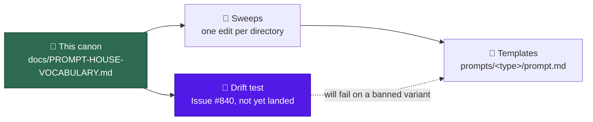

# 🗣️ Prompt house vocabulary

One house form per term and per shared section heading across the prompt set.
Thirty-three templates under [`prompts/`](../prompts/) each named the same
concept independently, so the product picked up two names in prose, the harness
two, and "Worked Examples" five — the drift catalogued in the cross-prompt audit
(Issue #794).

This page is the canon the sweeps apply, and the source of truth the drift test
reads. That test is Issue #840 and has **not** landed yet, so today a banned
variant in a template fails nothing — this page is the agreement, not the gate.
It records **why** each form won and which exceptions are deliberate, so the next
person bumping a template picks the agreed form instead of re-litigating it. It
changes no template on its own.

## Scope

- The canon governs the **`prompt.md`** of every prompt directory. Issue #844
  removed the `vN.md` scheme, so a fix is an edit to that one file and git
  history is the record of how the template got there — a sweep never adds a new
  version file.
- It governs **names and casing only**. Presence gaps — a scan with no persona
  line, a scan with no `### Verification before exit` — and the marker shapes the
  worker emits are separate work, not variants of anything recorded here.
- Counts and file citations below are the **audit baseline** — verified on the
  latest template of each directory at commit `4051c6d`, before any sweep of
  #794 landed. They are evidence for the decision, not the rule; the rule is the
  house form. Each sweep that lands moves the counts towards the house form, so
  a smaller minority on disk today is the canon working, not the page going
  stale.

## Families

Two of the four groups below share section headings, so the heading tables are
scoped to them. Membership is derived from what a template **is**, not from a
list a maintainer must remember to update.

| Family | Membership rule | Directories |
| --- | --- | --- |
| **Scan** | Its latest template carries a `Stable finding ID recipe` section — it sweeps a repository, dedupes findings against filed issues, and files one issue per surviving finding | `prompts/best_practices/`, `prompts/dead_code/`, `prompts/deprecated_api/`, `prompts/doc_coverage/`, `prompts/documentation_audit/`, `prompts/duplicated_knowledge/`, `prompts/format_drift/`, `prompts/github_actions_audit/`, `prompts/orphan_deps/`, `prompts/private_repo_reference_audit/`, `prompts/retro/`, `prompts/security_scan/`, `prompts/supply_chain_detection/`, `prompts/supply_chain_readiness/`, `prompts/test_audit/` |
| **Interactive** | It drives one worker turn against one named target — an issue, a PR, or a repository set-up task — and produces changes or a reply rather than a sweep of findings | `prompts/ci_fix/`, `prompts/grill-me/`, `prompts/issue/`, `prompts/merge_conflict/`, `prompts/planning/`, `prompts/planning_critique/`, `prompts/pr_feedback/`, `prompts/question/`, `prompts/quorum/`, `prompts/quorum_judge/`, `prompts/spelling_fix/`, `prompts/workflow_setup/` |
| **Injected fragment** | It is substituted into another template rather than run on its own | `prompts/coding_guidelines/`, `prompts/coding_guidelines_claude/` |
| **Lightweight audit** | It reports on a narrow surface and files nothing, so it owns none of the filing sections | `prompts/alert_feed/`, `prompts/bash_script_refs/`, `prompts/bash_syntax_audit/`, `prompts/workflow_annotation_scan/` |

The scan family is currently **15** directories. Membership is a property of the
template text, so a sixteenth scan is in the family the day its template lands —
compute it, never hard-code it. The terminology and literal rules below apply to
**all four** groups; only the two heading tables are family-scoped.

## Terminology

| Concept | House form | Banned variants | Why |
| --- | --- | --- | --- |
| The product's name in prose | `Vibe Coder` | `VibeCoder` as one word in prose | Twenty-one prose uses are spaced, against two one-word uses in `prompts/security_scan/`. The repo slug `stSoftwareAU/VibeCoder`, and `VibeCoder` inside URLs and filesystem paths, are exempt — they are identifiers, not prose |
| The Deno harness that builds the prompt, substitutes placeholders and post-processes the output | `the worker` | `the executor` | Twelve latest templates say `the worker` and ten say `the executor`, two of them saying both in one file. `worker/` is also the directory the harness lives in, so the majority form is the one the code already answers to |
| The command that runs the quality gate | `./quality.sh` | bare `quality.sh` as the command to run | Eight templates already write the runnable form. The bare form reads as a filename and is not a command a shell will find. Naming the script *as a file* — `quality.sh:41`, "the repo has no `quality.sh`" — is a filename reference, not an invocation, and stays |
| The scheduled-scan concept in prose | `idle-task` | `idle task` unhyphenated | Thirty-five hyphenated uses against three unhyphenated. `idle-task` is also the literal label name the worker reads, so the prose and the label match |
| The markup language in prose | `Markdown` | lowercase `markdown` in prose | It is a proper noun, and thirty-seven prose uses already capitalise it. Lowercase stays where it is a token rather than prose: code spans, fence infostrings, and filenames |
| The engineer persona noun | `senior engineer` | `an experienced software engineer` | `prompts/issue/`, `prompts/question/` and `prompts/quorum/` open with `senior engineer`, and `prompts/coding_guidelines/` — injected underneath all three — opens with the other. One run must not be told it holds two seniorities |

## Shared headings — scan family

Applies to the fifteen scan directories in [Families](#families). The first
column names the section; the house form is the exact heading text.

| Section | House form | Banned variants | Why |
| --- | --- | --- | --- |
| Hard constraints | `## Hard Constraints (apply to every phase)` | `## Hard constraints (apply to every phase)`, `## Hard Constraints (apply throughout)` | Ten templates carry it exactly; two differ only in casing and three in the parenthetical. "Every phase" says which phases are bound, where "throughout" leaves it to inference |
| Finding ID recipe | `## Stable finding ID recipe` | the same heading at H3 | H2 in nine templates against H3 in six. The recipe is a peer of the phase sections, not a subsection of whichever phase happens to precede it |
| Per-finding filing sub-heading | `### For each surviving finding (skip silently if its id is in the suppressed or known-open list)` | bare `### For each surviving finding`, `### Filing the finding` | Seven templates carry the parenthetical, four the bare form and one `### Filing the finding`. The parenthetical is the suppression contract: without it the heading does not say that a suppressed finding is dropped without comment |
| Issue-body fix slot | `## Suggested fix` | `## Suggested action`, `## Suggested replacement` | Nine against three and two. Every scan files a fix suggestion into the same slot, and a reader scanning filed issues across scans should not have to know which scan wrote the body |
| Issue-body rationale slot | `## Why this matters` | `## Why this is a candidate`, `## Why this is flagged`, `## Why it is safe to remove` | Nine against one each. The slot answers the reader's question — why should I care — not the scanner's |
| Phase 4 heading | keep the `(outcome-only)` suffix, e.g. `## Phase 4 — File one issue per finding (outcome-only)` | the unsuffixed form | The minority form wins this one row deliberately: the suffix is the verbosity contract for the phase, telling the run to emit outcomes rather than narrate the filing. Four templates carry it and ten dropped it; the fifteenth, `prompts/retro/`, has no filing phase at Phase 4 and is not counted either way. The unsuffixed majority is drift towards the less informative heading |

`## Why this scan exists` is a **prompt-level** section — it tells the run what
the scan is for. It is not a variant of `## Why this matters`, which is a slot in
a filed issue body, and it stays.

## Shared headings — interactive family

Applies to the twelve interactive directories in [Families](#families).

| Section | House form | Banned variants | Why |
| --- | --- | --- | --- |
| Opening mode heading | `## <X> Mode`, optionally with a ` — <subtitle>` tail | no mode heading at all on an interactive prompt | Seven templates open this way. The opening H2 is what tells a run in one line which workflow it is in; a template that opens with prose makes the run infer it |
| Repo-standards section | `## Project Guidelines` | `## Coding Guidelines`, `## Guidelines`, `### Guidelines` | It is the section that points at the repository's own standards, and two templates already name it so. `### Planning Guidelines` is a **different** section — guidance on how to plan, not on repo standards — and stays |
| Worked examples | `### Worked Examples` | `## Worked Examples`, `### Worked examples`, `### Worked cases`, `### Examples` | Four templates against one, one, two and one, counted inside the family — the second `## Worked Examples` on disk is `prompts/coding_guidelines/`, an injected fragment. The examples illustrate the section above them, so H3 is the right depth, and "Worked" is what distinguishes a resolved case from an illustration |

## Literals

- **Attribution footer.** `{{ATTRIBUTION_FOOTER}}` is cited exactly one way:
  **"from the Inputs section"**, and the placeholder is placed there. The
  worker substitutes the placeholder wherever it sits, so the citation is only
  true if the placement matches it — a sweep moves the two together. The
  "from the end of this prompt" phrasing (`prompts/deprecated_api/` and
  `prompts/dead_code/`) and the Phase 4 marker phrasing
  (`prompts/doc_coverage/`) are banned: they describe today's placement rather
  than the house one, and each sweep that leaves them standing keeps a second
  place a maintainer must look. At the baseline eleven of the seventeen
  placeholder-carrying templates already held it under `## Inputs`. Four —
  `prompts/alert_feed/`, `prompts/bash_script_refs/`,
  `prompts/bash_syntax_audit/` and `prompts/workflow_annotation_scan/` — have no
  `## Inputs` section at all; adding one to a lightweight audit is a presence
  gap, not a naming variant, so it belongs to Issue #841 and those four are
  outside this row.
- **Finding-id placeholder.** The placeholder body uses the filing family's own
  prefix and the ellipsis form — `` `<!-- finding-id: BP-… -->` `` in the
  best-practices family, `` `<!-- finding-id: SEC-… -->` `` in the security-scan
  family. The generic `` `<!-- finding-id: <id> -->` `` is banned: it invites an
  id with no family prefix, which the suppression parser will not match. The
  **rendered** worked example keeps the twelve-hex-digit form
  (`BP-0123456789ab`) so the example shows a real id, not the placeholder.

## Suppression keywords stay namespaced

`best-practice-ignore`, `security-scan-ignore` and `orphan-deps-ignore` are
**not** unified. They match `worker/deno/lib/suppression_comments.ts`, which maps
`security-scan-ignore` to `SEC-` ids and both `best-practice-ignore` and
`orphan-deps-ignore` to `BP-` ids, so a security waiver can never silence a
best-practices finding by accident. Renaming any of the three would break every
suppression comment already committed in a monitored repo.

What is banned is the **prose**: at the audit baseline ten latest templates
described their keyword as "the shared suppression-comment grammar" while naming
only one of the three, so a maintainer reading one template cannot tell which
keyword their scan honours.

**Each template names its own keyword, and none calls the grammar shared.**

## Recorded deliberate exceptions

- **`Optimize` and `Minimizing` in
  [`docs/PROMPT-BEST-PRACTICES-CHECKLIST.md`](PROMPT-BEST-PRACTICES-CHECKLIST.md)**
  — American spellings in the rows "Optimize parallel tool calling" and
  "Minimizing hallucinations in agentic coding", and in the copy-paste verdict
  table that mirrors them. They are Anthropic documentation page titles quoted
  verbatim so the rubric stays mappable to the guide heading by heading. They
  stay, and a future spelling sweep must not "fix" them.
- **Australian English everywhere else** — `behaviour`, `judgement`,
  `generalise`, `serialises`, `artefact`. The audit found no drift in these; the
  rule is recorded here so the exception above is not read as a licence.

## Out of scope

- **Presence gaps.** Four templates open with no persona line and eight scans
  have no `### Verification before exit` section. A missing section is not a
  variant of a section, and the decision is one question, not eight (Issue #841).
- **Worker-emitted marker shapes.** The `vibe-*` markers the worker emits from
  `stale_workflow_detector.ts`, `blocked_deferral.ts` and `analysis_only.ts` use
  shapes no prompt documents. They are code, not prompt vocabulary, and Issue
  #842 settled them separately as a closed set of declared deviations.

## Changing the canon

A row here is changed the same way it was set: with the evidence. State the count
on the `prompt.md` of every directory, name the form that wins and why, and
change this page **first** — the sweeps read it, and the drift test will once
Issue #840 lands, so a template edited ahead of the canon reads as drift.
Because the change is a name, it lands as an edit to each affected directory's
`prompt.md`, with git history as the record of what changed.

## Related

- [Prompt goals (summary)](PROMPTS.md) — what each prompt type is for.
- [Prompt best-practices checklist](PROMPT-BEST-PRACTICES-CHECKLIST.md) — the
  rubric a prompt surface is scored against.
- [Extending the Worker](EXTENDING.md#prompt-templates) — how prompt templates
  are laid out and edited.
