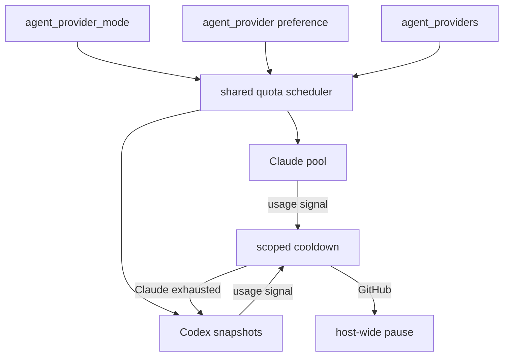

# Provider parity — Codex and mixed fleets

**Issues:** [#1696](https://github.com/stSoftwareAU/VibeCoder/issues/1696),
[#1698](https://github.com/stSoftwareAU/VibeCoder/issues/1698),
[#1700](https://github.com/stSoftwareAU/VibeCoder/issues/1700),
[#1703](https://github.com/stSoftwareAU/VibeCoder/issues/1703),
[#1926](https://github.com/stSoftwareAU/VibeCoder/issues/1926)
· **Parent:** #1694

Claude remains the default. This page is the operator runbook for a
Codex-only host and for an **opt-in** mixed Claude/Codex host. Nothing
here automatically enables new routing on the production fleet.

## Quota policy

A provider adapter supplies real windows, reset timestamps and an
identity label. The shared ranker (`worker/deno/lib/provider_quota.ts`)
uses remaining-fraction / hours-to-reset. Unknown budgets stay unknown
— they are never treated as zero.

- **Claude** keeps the five-hour soft gate and the seven-day rate
  (#1623 / #1685). All-low-but-usable credentials still run.
- **Codex** uses the rollout `token_count` snapshot from
  [Codex Budget Sources](CODEX-BUDGET-SOURCES.md). An API-key account
  has no subscription window (`api-key-account`). Explicit exhaustion
  excludes that credential until reset.

A Claude usage limit writes `provider: "claude"` on the rate-limit
signal. The host loop pauses only when every **enabled** provider is
that blocked vendor, or when GitHub (shared infrastructure) is the
blocker. Codex work continues on a mixed host.

## Multiple Codex credentials

`codex/provider.env`, `codex/provider-2.env`, … are ranked by the
shared policy. A single account still works. Only the selected
account's `OPENAI_API_KEY` / `CODEX_API_KEY` / `CODEX_HOME` reach the
child (`buildIsolatedCodexChildEnv`). Other Codex accounts and every
Claude secret stay out. The process-global `HOME` / `CODEX_HOME` are
not rewritten.

## Routing and fallback

| Key | Default | Meaning |
| --- | ------- | ------- |
| `agent_provider` | `claude` | Preferred provider |
| `agent_provider_mode` | `pinned` | `pinned` preserves the existing provider choice; `auto` ranks eligible fixed-price subscriptions |
| `agent_providers` | preferred alone | Enabled set (credentials mounted) |
| `agent_provider_fallback` | `[]` | Ordered alternatives; empty **pins** the preferred provider |

`agent_provider_mode: "auto"` is the quota-aware path from #1926. Before each
work item it ranks enabled Claude OAuth and Codex ChatGPT subscriptions using
all known windows, reset timing, status freshness and the configured provider
preference. API-key accounts, unknown billing and providers without a
fixed-subscription status adapter are excluded. A real quota or authentication
failure makes that provider unavailable to subsequent work; quota failures are
rechecked at the stated reset, or after a five-minute cooldown when no reset was
reported. If no safe candidate remains, the host waits.

An explicit per-invocation provider bypasses the process default and remains
absolute. In auto mode, `VIBE_AGENT_PROVIDER` is an emergency per-process pin;
it must name an enabled provider. Outside auto mode the established
configuration-file precedence is unchanged.

The older `agent_provider_fallback` path remains independently opt-in. It fires
only on `subscription-exhausted`, `transient-rate-limit` or
`model-unavailable`, and only when the alternative is already enabled. Neither
automatic mechanism is turned on for the production fleet by default.

## Staged rollout

1. Keep Claude as the default on existing Macs. Do not archive
   repositories or remove Claude support.
2. Test a **Codex-only** host (`agent_provider` / `agent_providers`
   both `codex`) with a dedicated test repository.
3. Opt in **one** non-critical mixed host with
   `agent_provider_mode: "auto"`, `agent_provider: "claude"`, and
   `agent_providers: ["claude", "codex"]` after observed success.
4. Expand only after the mixed host has completed a quota-exhaustion
   and recovery cycle with correct provider attribution.

Rollback: remove `agent_provider_mode` (or set it to `pinned`), set
`agent_provider` back to `claude`, and relaunch. Existing Claude sessions and
WIP branches are untouched.

## Diagnostics

- Offline: `deno task test tests/provider_parity_conformance_test.ts`
  (fake adapters; no credentials).
- Live Codex smoke (opt-in, never in CI): provision a non-production
  ChatGPT login under a dedicated `CODEX_HOME`, point
  `codex/provider.env` at it, and run one issue on a throwaway
  repository. Do not put real credentials in logs or fixtures.
- Quota source limits and the rejected probe paths are in
  [CODEX-BUDGET-SOURCES.md](CODEX-BUDGET-SOURCES.md).

## Remaining limitations

- Codex has no free quota probe; snapshots come from a prior run's
  rollout file. A brand-new `CODEX_HOME` is unknown until the first
  paid turn.
- Exhaustion prose from the CLI often lacks a parseable reset timezone;
  the reset stays unknown rather than guessed.
- Automatic selection currently supports Claude OAuth and Codex ChatGPT
  subscriptions. Gemini, DeepSeek and every unknown or metered billing mode are
  ineligible. The shipped default remains pinned.
