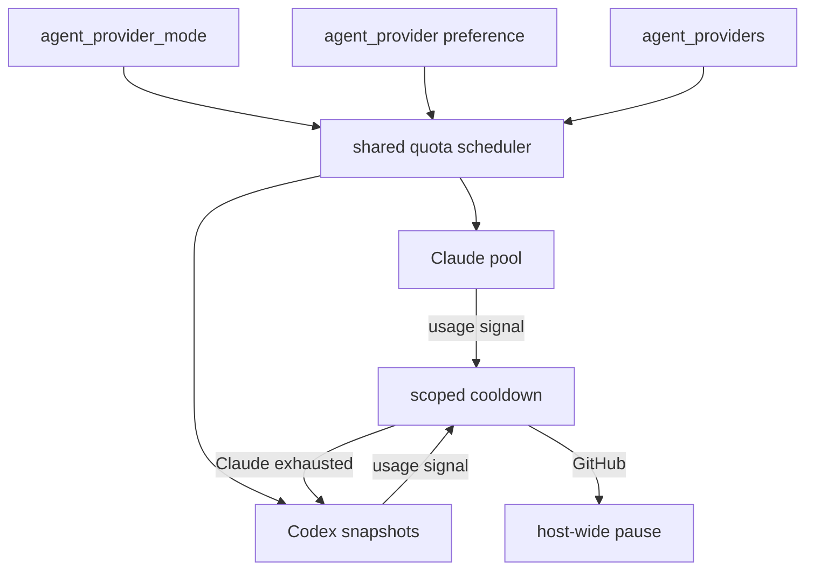
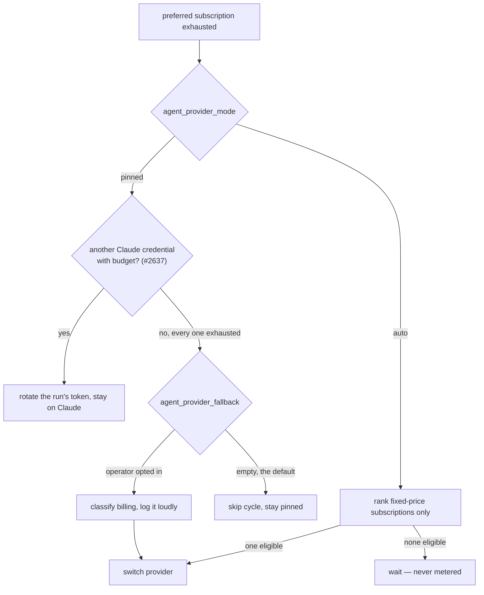

# Provider parity — Codex and mixed fleets

**Issues:** [#1696](https://github.com/stSoftwareAU/VibeCoder/issues/1696),
[#1698](https://github.com/stSoftwareAU/VibeCoder/issues/1698),
[#1700](https://github.com/stSoftwareAU/VibeCoder/issues/1700),
[#1703](https://github.com/stSoftwareAU/VibeCoder/issues/1703),
[#1926](https://github.com/stSoftwareAU/VibeCoder/issues/1926),
[#1923](https://github.com/stSoftwareAU/VibeCoder/issues/1923)
· **Parent:** #1694

Claude remains the default. This page is the operator runbook for a
Codex-only host and for an **opt-in** mixed Claude/Codex host. Nothing
here automatically enables new routing on the production fleet.

## Quota policy

A provider adapter supplies real windows, reset timestamps and an
identity label. The shared ranker (`worker/deno/lib/provider_quota.ts`)
uses remaining-fraction / hours-to-reset. Unknown budgets stay unknown
— they are never treated as zero.

- **Claude** keeps the five-hour soft gate and the seven-day rate
  (#1623 / #1685). All-low-but-usable credentials still run.
- **Codex** uses the rollout `token_count` snapshot from
  [Codex Budget Sources](CODEX-BUDGET-SOURCES.md). An API-key account
  has no subscription window (`api-key-account`). Explicit exhaustion
  excludes that credential until reset.

A Claude usage limit writes `provider: "claude"` on the rate-limit
signal. The host loop pauses only when every **enabled** provider is
that blocked vendor, or when GitHub (shared infrastructure) is the
blocker. Codex work continues on a mixed host.

## Multiple Codex credentials

`codex/provider.env`, `codex/provider-2.env`, … are ranked by the
shared policy. A single account still works. Only the selected
account's `OPENAI_API_KEY` / `CODEX_API_KEY` / `CODEX_HOME` reach the
child (`buildIsolatedCodexChildEnv`). Other Codex accounts and every
Claude secret stay out. The process-global `HOME` / `CODEX_HOME` are
not rewritten.

## Subscription-only billing policy

VibeCoder is designed to run unattended for months on **fixed-price
subscriptions**, so a subscription that is spent, stale or revoked must fail
authentication rather than quietly become per-token API spend (Issue #1923).

Each provider declares how its credentials are billed, on its own descriptor
(`AgentProviderDescriptor.billing`), and one shared classifier
(`worker/deno/lib/provider_billing.ts`) answers the question for every routing
path. Nothing is inferred from a provider id.

| Provider | Fixed-price subscription | Metered |
| -------- | ------------------------ | ------- |
| Claude | `CLAUDE_CODE_OAUTH_TOKEN` | `ANTHROPIC_API_KEY` |
| Codex | a ChatGPT login persisted under `CODEX_HOME` | `OPENAI_API_KEY`, `CODEX_API_KEY` |
| Gemini | none | `GEMINI_API_KEY` |
| DeepSeek | none | `DEEPSEEK_API_KEY` |

Three rules follow, and they are separate:

1. **Unknown is never fixed-price.** A provider that proves neither is
   `unknown`, and only a positively proved subscription is eligible for
   `agent_provider_mode: "auto"`. A failed probe cannot become API spend.
2. **A subscription run withholds every other Anthropic credential.** When the
   run holds a usable `CLAUDE_CODE_OAUTH_TOKEN`, `buildClaudeChildEnv` removes
   `ANTHROPIC_API_KEY` and `ANTHROPIC_AUTH_TOKEN` from the child, so the CLI
   has nothing to fall back on. This mirrors `buildIsolatedCodexChildEnv`'s
   `CODEX_HOME` guard. `ANTHROPIC_AUTH_TOKEN` is withheld but **not** declared
   metered: it is a bearer for a proxied endpoint, so what it bills cannot be
   proved — it classifies as `unknown`, which rule 1 already makes ineligible.
   A host with **no** subscription token is untouched: an explicit API-key
   deployment keeps working exactly as before.
3. **`agent_provider_fallback` is metered-capable, and says so.** The opt-in
   list is an explicit operator choice and is honoured as written, including a
   metered alternative such as DeepSeek. It is **outside** the subscription-only
   policy, which governs automatic routing. What it may not be is silent: the
   health gate classifies the alternative before switching and logs
   `billing=<mode>` on the switch, plus a `logError` line carrying the
   evidence — the credential variable for a `metered` alternative, or the
   state label (`subscription-credential-missing`,
   `codex-auth-json-unreadable (…)`) for an `unknown` one, which the line
   reports as billing that cannot be established rather than as per-token
   spend. An operator
   who wants the never-metered guarantee end to end leaves
   `agent_provider_fallback` empty (the default) and uses
   `agent_provider_mode: "auto"`, which defers rather than switching to metered.

## Routing and fallback

| Key | Default | Meaning |
| --- | ------- | ------- |
| `agent_provider` | `claude` | Preferred provider |
| `repo_config.<repo>.agent_provider` | unset | Per-repo provider pin (Issue #2048); binds when no per-invocation selection names one, and beats both the global `agent_provider` and `auto` ranking for that repo |
| `agent_provider_mode` | `pinned` | `pinned` preserves the existing provider choice; `auto` ranks eligible fixed-price subscriptions |
| `agent_providers` | preferred alone | Enabled set (credentials mounted) |
| `agent_provider_fallback` | `[]` | Ordered alternatives; empty **pins** the preferred provider |

`agent_provider_mode: "auto"` is the quota-aware path from #1926. Before each
work item it ranks enabled Claude OAuth and Codex ChatGPT subscriptions using
all known windows, reset timing, status freshness and the configured provider
preference. API-key accounts, unknown billing and providers without a
fixed-subscription status adapter are excluded. A real quota or authentication
failure makes that provider unavailable to subsequent work; quota failures are
rechecked at the stated reset, or after a five-minute cooldown when no reset was
reported. If no safe candidate remains, the host waits.

An explicit per-invocation provider bypasses the process default and remains
absolute. A per-repo pin (`repo_config.<repo>.agent_provider`, Issue #2048) is
the same class of explicit operator pin, scoped to one repository: it binds
when no per-invocation selection names a provider, beats the global
`agent_provider`, and beats `auto` ranking for that repo. It must name a
registered provider and fails loudly otherwise. In auto mode,
`VIBE_AGENT_PROVIDER` is an emergency per-process pin; it must name an enabled
provider. Outside auto mode the established configuration-file precedence is
unchanged.

The older `agent_provider_fallback` path remains independently opt-in. It fires
only on `subscription-exhausted`, `transient-rate-limit` or
`model-unavailable`, and only when the alternative is already enabled. For a
Claude preferred provider it fires only once **every** Claude credential in
the pool is exhausted on its five-hour window or its weekly limit — one spent
subscription rotates to the next — and the run switches back as soon as one
has budget again (Issue #2637). The weekly pace projection never switches
provider: it drops the backlog tiers only. It is
not restricted to fixed-price subscriptions — see [Subscription-only billing
policy](#subscription-only-billing-policy) for what it logs when the
alternative is metered. Neither automatic mechanism is turned on for the
production fleet by default.

`agent_provider_mode: "auto"` is **not recommended as production-ready** until
the restart/soak qualification in [Subscription soak](SUBSCRIPTION-SOAK.md)
passes; see its staged rollout sign-off.

## Staged rollout

1. Keep Claude as the default on existing Macs. Do not archive
   repositories or remove Claude support.
2. Test a **Codex-only** host (`agent_provider` / `agent_providers`
   both `codex`) with a dedicated test repository.
3. Opt in **one** non-critical mixed host with
   `agent_provider_mode: "auto"`, `agent_provider: "claude"`, and
   `agent_providers: ["claude", "codex"]` after observed success.
4. Expand only after the mixed host has completed a quota-exhaustion
   and recovery cycle with correct provider attribution.

Rollback: remove `agent_provider_mode` (or set it to `pinned`), set
`agent_provider` back to `claude`, and relaunch. Existing Claude sessions and
WIP branches are untouched.

## Diagnostics

- Offline: `deno task test tests/provider_parity_conformance_test.ts`
  (fake adapters; no credentials).
- Live Codex smoke (opt-in, never in CI): provision a non-production
  ChatGPT login under a dedicated `CODEX_HOME`, point
  `codex/provider.env` at it, and run one issue on a throwaway
  repository. Do not put real credentials in logs or fixtures.
- Quota source limits and the rejected probe paths are in
  [CODEX-BUDGET-SOURCES.md](CODEX-BUDGET-SOURCES.md).

## Remaining limitations

- Codex has no free quota probe; snapshots come from a prior run's
  rollout file. A brand-new `CODEX_HOME` is unknown until the first
  paid turn.
- Exhaustion prose from the CLI often lacks a parseable reset timezone;
  the reset stays unknown rather than guessed.
- Only Claude and DeepSeek (the same CLI) expose a conversation-compaction
  lever to the worker, so only they get the pre-issue stream compaction
  described in [CONFIGURATION.md](CONFIGURATION.md#-session-resume)
  (Issue #2337). A Codex or Gemini run carries the stream's full transcript and
  logs `compaction unavailable` naming the provider.
- Automatic selection currently supports Claude OAuth and Codex ChatGPT
  subscriptions. Gemini, DeepSeek and every unknown or metered billing mode are
  ineligible. The shipped default remains pinned.
- Quota *probing* is still per provider (`provider_auto_runtime.ts`), even
  though billing classification is now descriptor-declared. Adding a
  subscription provider means writing its status adapter as well as its
  `billing` declaration. Those adapters (`claudeStatus`, `codexStatus`) still
  test the same credential variables themselves while answering their own
  question — remaining quota — so the same facts are written down twice.
  Folding them into the shared classifier changes what is eligible for
  `auto`, which this goal deliberately stages behind the soak qualification.
