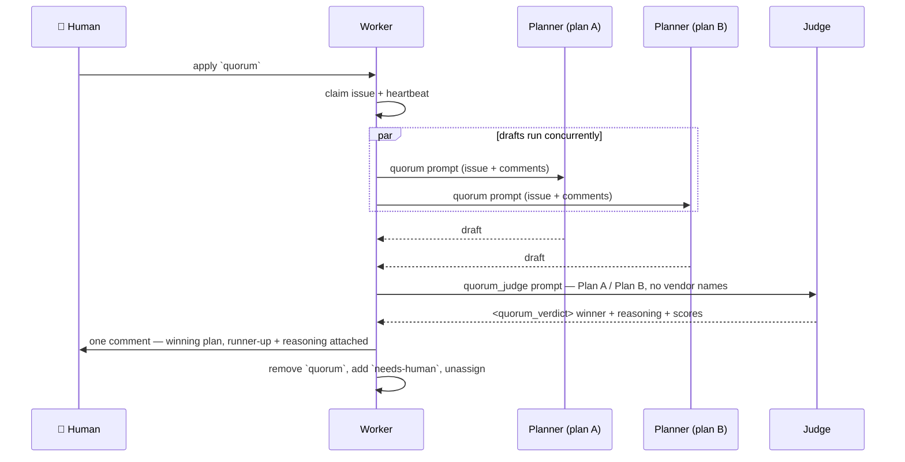

# ⚖️ Quorum — Operator Manual

**Quorum** is a human-triggered plan-off that runs **before** planning. Two
agents draft an implementation plan for the same issue independently, a third
judges the two drafts blind, and the worker posts the winner with the runner-up
and the judge's reasoning attached — then hands the issue back to you.

It answers *what the plan should be*. It writes no code, creates no sub-issues
and opens no PR: after it posts, **you** decide whether the plan gets split
(`planning`) or built (`work-on`).

| | |
| --- | --- |
| Trigger | a human applies the `quorum` label (the worker never self-applies it) |
| Cost | roughly **three agent invocations** per plan, all at the top-tier model |
| Output | one comment: the winning plan, plus collapsed attachments |
| Handback | `quorum` removed, `needs-human` added — never `planning`, never `work-on` |
| Owner | [`quorum_orchestrator.ts`](../worker/deno/lib/quorum_orchestrator.ts), [`quorum_processor.ts`](../worker/deno/lib/quorum_processor.ts) |

---

## 1. 🚦 The trigger

`quorum` is a **reserved workflow label**: it is on the privileged list in
`worker/deno/lib/label_security.ts` and on the worker's own self-apply guard in
`worker/deno/lib/worker_label_guard.ts`, so only a trusted human can start a
plan-off. A `quorum` label added by the worker (or by an untrusted author) is
stripped, and no run happens.

A labelled issue is picked up at priority 1.79 — ahead of planning, because
Quorum decides *what the plan is* and `planning` then splits that plan into
sub-issues.

If a Quorum result comment is already in the thread, a second run is **not**
billed: the worker finishes the handback (remove `quorum`, add `needs-human`)
and stops. Re-applying `quorum` to an issue that already carries a result
therefore costs nothing; delete the old result comment first if you genuinely
want a fresh plan-off.

## 2. 🔄 The sequence



Facts worth knowing about the middle of that diagram:

- **The drafts are raced, not sequenced.** Wall-clock cost is one draft plus one
  judgement, even though three agents ran.
- **Neither planner is told a second plan exists.** Both receive the same
  `prompts/quorum/` template, so the two drafts are independent by construction
  rather than by instruction.
- **A/B positions come from the issue number**, not from the order the providers
  were configured in, so no provider is permanently Plan A across the fleet and
  the same issue always pairs the same way.
- **Every agent is bounded** by `quorum_timeout` plus the `quorum_kill_after`
  grace, so one hung CLI cannot stall the worker.

## 3. 📄 What gets posted

A clean run posts one comment headed `## Quorum — Winning Plan`:

- the **winning plan** as the comment body, attributed to the agent that wrote
  it (`claude` (plan A), and so on);
- the **runner-up plan** in a collapsed `<details>` section;
- the **judge's reasoning** in a second collapsed section.

Plan text is agent output derived from untrusted issue content, so before it
reaches the comment it is secret-redacted, its `</details>` sequences are
defanged (a plan cannot break out of its collapsed section), and any
worker-footer or Quorum-heading lookalike is demoted so quoted text cannot forge
the worker's own attribution.

## 4. 🩹 Degradation paths

Nothing silently picks a winner. Each partial failure has its own outcome and
its own named degradation, and a degraded run **never** promotes a surviving
plan to "winner" — that would launder a failure into a decision.

| Outcome | Degradation | What happened | What is posted |
| ------- | ----------- | ------------- | -------------- |
| `judged` | — | Clean three-agent quorum | `## Quorum — Winning Plan`: winner, runner-up, reasoning |
| `unjudged-single` | `drafter-failed` | One planner failed or timed out; judging a single plan is meaningless | `## Quorum — Degraded Result`: the surviving plan, unjudged |
| `unjudged-both` | `judge-failed` | Both plans drafted, the judge failed or timed out | `## Quorum — Degraded Result`: both plans, unjudged |
| `unjudged-both` | `judge-verdict-unreadable` | The judge ran but its `<quorum_verdict>` block was missing or unparseable | `## Quorum — Degraded Result`: both plans, unjudged |
| `failed` | `both-drafters-failed` | No plan survived | `## Quorum Failed`: the reason, no plan |

Every one of these still ends the same way: `quorum` removed, `needs-human`
added, worker unassigned. A run that could not even start — an unusable
timeout, a provider the running image does not carry, a prompt that will not
load — fails loudly the same way, posting `## Quorum Failed` with the reason
before it releases the issue.

## 5. 🕶️ The judge never sees a vendor

The judging prompt receives the two drafts as **Plan A** and **Plan B** only.
The judge never sees, and is never told, which vendor wrote which plan — not the
provider id, not the model, not the CLI. Position is assigned from the issue
number, so vendor identity cannot leak through a fixed ordering either.

This is the property most likely to be broken by a well-meaning later change —
"let's label the plans so the reasoning is clearer" would silently turn a blind
comparison into a brand preference. It is asserted in
`worker/deno/tests/quorum_orchestrator_test.ts`; it is written down here because
a test says *what* is enforced and not *why it must not be relaxed*.

Both plans are also untrusted input to the judge: a plan that instructs the
judge to pick it is data, neither obeyed nor counted.

## 6. 💰 Cost

One Quorum run spends roughly **three agent invocations** for one plan — two
drafts and one judgement — each on the top-tier model at `high` effort, because
a plan chosen badly is paid for by every sub-issue that follows it. That is why
the mode is human-triggered, why a re-applied label does not re-run a plan-off
whose result is already in the thread, and why it is worth reserving for issues
where the approach is genuinely contested rather than for routine work.

Wall-clock cost is lower than the token cost: the two drafts run concurrently,
so the run takes one draft plus one judgement.

### Degraded-model reporting

Both Quorum phases prefer Fable 5, so when the pre-flight probe
says Fable is unavailable a **Claude** invocation runs on **Opus @ `max`**
instead. A draft or judgement running under Codex or Gemini has no Fable tier
to leave: it keeps its own provider routing, is never rerouted onto an
Anthropic tier alias it cannot resolve, and is not reported degraded
(Issue #398).

The Opus substitution is reported the same way the six single-call planning-shaped
phases report theirs: the `degraded-model` label on the issue, paired with a
`## Quorum run model stats` comment giving the requested and served models,
effort, tokens and estimated cost.

The report covers the **round**, not the agent — one label and one comment for
all three invocations, whichever of them was rerouted, and even when the run
degraded before it could be judged. A healthy plan-off reports nothing: the
result comment it already posts is the round's output.

## 7. ⚙️ Configuration

Every key below is a `.config.json` key; the full reference is
[Configuration](CONFIGURATION.md).

| Key | Default | Meaning |
| --- | ------- | ------- |
| `quorum_label` | `quorum` | The label that triggers a plan-off. Reserved: human-applied only |
| `quorum_planners` | `["claude","claude"]` | The **two** drafting providers. Exactly two ids; any other count is rejected at startup |
| `quorum_judge` | `"claude"` | The adjudicating provider |
| `quorum_timeout` | `1800` | Wall-clock budget in seconds for **one** Quorum agent |
| `quorum_kill_after` | `10` | Grace in seconds after `quorum_timeout` before the agent is killed |

The provider trio is drawn from the registered coding-agent providers, so it is
bounded by two further keys — see [Container Image](CONTAINER.md) for how the
image installs them:

| Key | Default | Meaning |
| --- | ------- | ------- |
| `agent_provider` | `claude` | The process-wide active provider |
| `agent_providers` | `["claude"]` | The providers **enabled** for a run: each gets its own credential file, preflight and read-only mount |

A trio naming a provider the running image did not install fails loudly at the
call, listing what the image does carry — it never falls back to Claude, which
would quietly turn a three-vendor plan-off into three Claude runs.

A multi-vendor deployment therefore needs all three parts to agree. Enabling
every registered provider leaves the trio free to name any of them — here two
planners from different vendors, judged by a third:

```jsonc
{
  "agent_provider": "claude",
  "agent_providers": ["claude", "codex", "gemini", "deepseek"],
  "quorum_planners": ["claude", "deepseek"],
  "quorum_judge": "gemini"
}
```

`deepseek` is a planner like any other here, even though its binary is the
Claude Code CLI: it runs under its own command, against DeepSeek's endpoint,
with its own credential, so a `claude` + `deepseek` pair is a genuine
two-vendor plan-off rather than two Claude runs.

…built from an image that carries the same set. `./run.sh` does that itself —
it passes `agent_providers` into the build and into the image tag (Issue #729),
so the trio above is installed on the next launch. The equivalent by hand:

```bash
docker build -f container/Containerfile \
  --build-arg AGENT_PROVIDERS="claude,codex,gemini,deepseek" \
  -t vibe-coder:quorum container/
```

### Disabling the mode

Quorum only ever runs when a human applies the label, so an untouched
deployment already spends nothing on it. To close the door completely, delete
the `quorum` label from the repository (or point `quorum_label` at a label
nobody applies): with no labelled issue the priority never fires. There is no
"enabled" flag to turn off — the label *is* the switch.

## 8. 🔑 Credentials, one vendor at a time

Each vendor authenticates with its own credential, provisioned once by
`setup.sh` into its own directory:

```text
~/.vibe-coder/credentials/
├── claude/provider.env    0600   from VIBE_LAUNCHAGENT_ANTHROPIC_API_KEY
├── codex/provider.env     0600   from VIBE_LAUNCHAGENT_OPENAI_API_KEY
├── gemini/provider.env    0600   from VIBE_LAUNCHAGENT_GEMINI_API_KEY
└── deepseek/provider.env  0600   from VIBE_LAUNCHAGENT_DEEPSEEK_API_KEY
```

The full variable list per vendor, including the plain `ANTHROPIC_API_KEY` /
`OPENAI_API_KEY` / `GEMINI_API_KEY` / `DEEPSEEK_API_KEY` fallbacks, is in
[Deployment](DEPLOYMENT.md#-credential-provisioning-non-interactive). Provisioning one vendor
never touches another's file, so adding Codex to an existing deployment cannot
disturb the Claude credential.

The rule that makes a multi-vendor run safe: **no vendor's credential is
visible to another vendor's subprocess.** It is enforced twice over —

- only the providers in `agent_providers` are mounted into the container, one
  read-only directory each, so a disabled vendor's secret is not in the
  container at all; and
- each provider's child-environment denylist names the *other* vendors'
  credential variables explicitly, so an Anthropic key cannot reach the Codex
  child (or an OpenAI key the Claude child) even if a later allowlist edit
  would otherwise let it through.

The containment boundary those mounts sit inside — what else is and is not
mounted, and why GitHub is the control plane — is
[Containment](CONTAINMENT.md); it is not restated here. The sandboxed-environment
guidance the agents themselves receive is.

## 9. 📝 The prompts

| Prompt | Role |
| ------ | ---- |
| `prompts/quorum/` | The drafting prompt both planners receive: approach, work to be done, risks and trade-offs, assumptions — reply text only, no sub-issues, no code, no PR |
| `prompts/quorum_judge/` | The judging prompt: choose between Plan A and Plan B against stated criteria (correctness, completeness, feasibility, risk, standards) and return a machine-parseable `<quorum_verdict>` block |

Goals and versioning rules for both are in [Prompt goals](PROMPTS.md).

## 10. 🔎 Related documentation

- [Configuration](CONFIGURATION.md) — every key, including the ones above
- [Container Image](CONTAINER.md) — the multi-provider image, the provider
  fragments, and adding a further provider
- [Containment](CONTAINMENT.md) — the mount set and the boundary the agents run
  inside
- [Deployment](DEPLOYMENT.md) — credential provisioning per vendor
- [Label Flows](workflows/label-flows.md) — where `quorum` sits among the other
  labels
