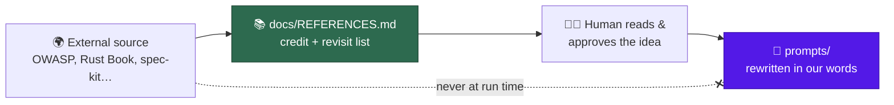

# 📚 References — where the good ideas came from

We did not invent the OWASP Top 10. We did not write the Rust Book. What the
Vibe Coder owns is the **aggregation** — choosing which external ideas belong in
an unattended worker, phrasing them so an agent acts on them, and balancing them
against each other. The ideas themselves have authors, and this page is where we
say so.

It is also a shopping list. Every source below is somewhere we can go back to
and ask "has anything new landed?" — a curated reading list for the humans who
maintain this repo, not a feed the worker consumes.

## The rules of this page

Three of them, and they matter more than the list:

1. **Prompts stay pure.** Attribution lives here, not inside a prompt template.
   A prompt is instructions for an agent; a bibliography in the middle of one is
   tokens that buy nothing. Where a prompt does name a guide — the
   best-practices buckets carry a short "link, do not restate" list — it is
   there so a *finding* can cite it, which is a working instruction rather than
   credit.
2. **Nothing is fetched at run time.** The worker never reaches out to any URL
   on this page while it works. A prompt that pulls its content from the
   internet is a supply-chain attack with a friendly face — one edit to a page
   we do not control and the agent has new instructions.
3. **A human approves every idea before it lands.** Someone reads the source,
   decides the idea is worth having, and writes it into a prompt in their own
   words. The link below is a place to *check*; it is never an import.

The "where it shows up" column names a real path in this repository, and a test
checks that those paths still exist — a credit list that quietly rots into
pointing at deleted files is worse than none.

## Security and threat modelling

| Source | What we took | Where it shows up |
| ------ | ------------ | ----------------- |
| [OWASP Top 10 (2025)](https://owasp.org/Top10/2025/) | The ten web-application risk categories the security scan enumerates, and the coverage matrix that maps each to an idle task | `prompts/security_scan/`, `docs/OWASP-TOP-10-2025-COVERAGE-MATRIX.md` |
| [OWASP GenAI / LLM Top 10](https://genai.owasp.org/llm-top-10/) | The LLM-specific risk classes — prompt injection, excessive agency, misinformation — that a worker made of prompts has to scan itself for | `prompts/security_scan/` |
| [CWE (MITRE)](https://cwe.mitre.org/) | The `CWE-NNN` vocabulary, so a finding names a weakness class everyone already knows instead of inventing a taxonomy | `prompts/security_scan/`, `docs/THREAT-MODEL.md` |
| [GitHub Actions security hardening](https://docs.github.com/en/actions/security-guides/security-hardening-for-github-actions) | SHA-pinned actions, least-privilege `permissions:`, and the untrusted-input script-injection sinks the workflow audit hunts for | `prompts/github_actions_audit/`, `docs/GITHUB-ACTIONS-AUDIT-SCAN.md` |
| [Corgea GitHub Actions security checklist](https://corgea.com/learn/github-actions-security-checklist) | Extra workflow checks we were missing, including the whole-workspace artefact upload that ships `.git/` and its token to anyone | `docs/GITHUB-ACTIONS-AUDIT-SCAN.md` |
| [cloudflare/security-audit-skill](https://github.com/cloudflare/security-audit-skill) | A detection-class taxonomy to grade our own scans against, class by class, rather than guessing at coverage | `docs/security/cloudflare-security-audit-gap-analysis.md` |
| [anthropics/defending-code-reference-harness](https://github.com/anthropics/defending-code-reference-harness) | The phased agentic security-review shape — discovery, modelling, then targeted hunting — that our scan pipeline was measured against | `docs/security/idle-task-scans-vs-anthropic-visa-harnesses-gap-analysis.md` |
| [visa/visa-vulnerability-agentic-harness](https://github.com/visa/visa-vulnerability-agentic-harness) | The second opinion in the same gap analysis: verification lenses and business-context threat modelling | `docs/security/idle-task-scans-vs-anthropic-visa-harnesses-gap-analysis.md` |
| [SLSA](https://slsa.dev/) | Provenance and build-integrity levels as the yardstick for supply-chain readiness | `prompts/best_practices/buckets/general.md` |

## Agents, prompting and accountability

| Source | What we took | Where it shows up |
| ------ | ------------ | ----------------- |
| [Anthropic's Claude prompting best practices](https://platform.claude.com/docs/en/build-with-claude/prompt-engineering/claude-prompting-best-practices) | The 22-row rubric every prompt surface is audited against, so two audits a year apart are comparable. Three house rows sit beside it, numbered H1–H3 so the guide mapping stays intact | `docs/PROMPT-BEST-PRACTICES-CHECKLIST.md` |
| [GitHub spec-kit](https://github.com/github/spec-kit) | Five ideas adopted natively — and five judged and deliberately rejected, which is the more useful half of that assessment | `docs/SPEC-KIT-COMPARISON.md` |
| [mattpocock/skills](https://github.com/mattpocock/skills) | The grilling session — interviewing the requester round by round, with a recommended answer beside every question, until no branch of the design tree is left unanswered. Our grill-me workflow came from here. Also the three house rows of the prompt rubric — prompt the positive, the no-op test, and leading words | `prompts/grill-me/`, `docs/workflows/grill-me.md`, `docs/PROMPT-BEST-PRACTICES-CHECKLIST.md` |
| [Caveman](https://github.com/JuliusBrussee/caveman) | Verbosity as a dial rather than a constant: a spelling fix gets "done", a planning task gets the architecture | `docs/MODEL-AND-CACHING.md` |
| [AI Agent Accountability — Chris Farris](https://www.chrisfarris.com/post/agent-accountability/) | Trust as agency × autonomy × accountability, and the Rule of Two that argues against one component holding every capability | `docs/AGENT-ACCOUNTABILITY.md` |

## Language and platform best practices

Each of these feeds one bucket of the best-practices scan. The bucket prompt is
our own wording of what the upstream guide says — go to the source when you want
to know whether it has moved on.

| Source | What we took | Where it shows up |
| ------ | ------------ | ----------------- |
| [The Rust Book, Reference, Nomicon and std docs](https://doc.rust-lang.org/book/) | Ownership, error handling and unsafe-code idioms as the canon the Rust bucket scores against | `prompts/best_practices/buckets/rust.md` |
| [Rust API Guidelines](https://rust-lang.github.io/api-guidelines/) | Naming, trait implementations and documentation expectations for a public Rust API | `prompts/best_practices/buckets/rust.md` |
| [Google Java Style Guide](https://google.github.io/styleguide/javaguide.html) | The Java formatting and naming baseline, so the bucket cites a published style rather than a house opinion | `prompts/best_practices/buckets/java.md` |
| [Java Language Specification](https://docs.oracle.com/javase/specs/) | The final word when a Java check hinges on what the language actually guarantees | `prompts/best_practices/buckets/java.md` |
| [TypeScript Handbook and tsconfig reference](https://www.typescriptlang.org/docs/handbook/intro.html) | Strictness settings and type-system idioms worth flagging when a repo has opted out of them | `prompts/best_practices/buckets/typescript.md` |
| [typescript-eslint rules](https://typescript-eslint.io/rules/) | The catalogue of type-aware lint rules the bucket points a repo at | `prompts/best_practices/buckets/typescript.md` |
| [React docs — Rules of Hooks and accessibility](https://react.dev/reference/rules/rules-of-hooks) | The hook rules and accessibility guidance behind the React bucket's checks | `prompts/best_practices/buckets/react.md` |
| [Terraform style, module and recommended practices](https://developer.hashicorp.com/terraform/language/style) | Module structure, naming and state guidance for the Terraform bucket | `prompts/best_practices/buckets/terraform.md` |
| [AWS Well-Architected Framework and CloudFormation best practices](https://docs.aws.amazon.com/wellarchitected/latest/framework/welcome.html) | The pillars and template-authoring guidance the infrastructure bucket leans on | `prompts/best_practices/buckets/aws-cloudformation.md` |
| [W3C WCAG and the ARIA Authoring Practices Guide](https://www.w3.org/WAI/standards-guidelines/wcag/) | Accessibility conformance levels and correct ARIA patterns — the part of front-end review most easily skipped | `prompts/best_practices/buckets/html.md` |
| [WHATWG HTML Standard](https://html.spec.whatwg.org/) | Semantic-element guidance, and the arbiter when a markup check is contested | `prompts/best_practices/buckets/html.md` |

## Project and release conventions

| Source | What we took | Where it shows up |
| ------ | ------------ | ----------------- |
| [Semantic Versioning](https://semver.org/) | What a version number is allowed to promise, which is what makes an automated dependency bump reviewable | `prompts/best_practices/buckets/general.md` |
| [Keep a Changelog](https://keepachangelog.com/) | A changelog written for humans, grouped by kind of change | `prompts/best_practices/buckets/general.md` |
| [SPDX Licence List](https://spdx.org/licenses/) | Standard licence identifiers, so licence checks compare strings that mean something | `prompts/best_practices/buckets/general.md` |
| [Open Source Guides](https://opensource.guide/) | The community-health file set — README, CONTRIBUTING, SECURITY, licence — a public repo is expected to carry | `prompts/best_practices/buckets/general.md` |
| [Mermaid](https://mermaid.js.org/) | Diagrams as committed text that GitHub renders, which is why "a picture tells a thousand words" is affordable here | `prompts/documentation_audit/`, `docs/OVERVIEW.md` |

## What is deliberately not on this page

- **Tools we run** — ShellCheck, Semgrep, CodeQL, gitleaks, trufflehog, Deno,
  and the rest. They are dependencies with versions and a supply-chain gate of
  their own, not ideas we absorbed. The dependency inventory tracks those.
- **Our own reports.** The gap analyses under [`security/`](security/README.md)
  and the [spec-kit comparison](SPEC-KIT-COMPARISON.md) are ours; the sources
  they assess are credited above.
- **Ideas with no external source.** Plenty of what the worker does was learnt
  the hard way at 3 a.m. — see [Lessons learnt](LESSONS-LEARNT.md). Nobody else
  is to blame for those.

## Adding an entry

You are adding one because you took an idea from somewhere. So: read the
source, decide the idea is worth having, write it into the prompt or doc in your
own words, then add a row to the table it belongs in — the source's name and
canonical URL, one honest line on what you took, and the path where it now
lives. If the row would say "inspired by, generally", you did not take an idea
and the row is noise.
