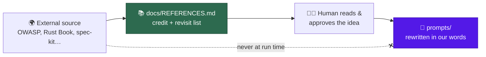
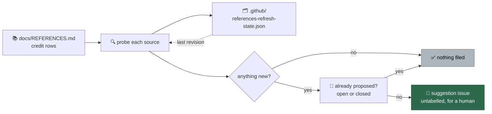

# 📚 References — where the good ideas came from

We did not invent the OWASP Top 10. We did not write the Rust Book. What the
Vibe Coder owns is the **aggregation** — choosing which external ideas belong in
an unattended worker, phrasing them so an agent acts on them, and balancing them
against each other. The ideas themselves have authors, and this page is where we
say so.

It is also a shopping list. Every source below is somewhere we can go back to
and ask "has anything new landed?" — a curated reading list for the humans who
maintain this repo, not a feed the worker consumes.

## The rules of this page

Three of them, and they matter more than the list:

1. **Prompts stay pure.** Attribution lives here, not inside a prompt template.
   A prompt is instructions for an agent; a bibliography in the middle of one is
   tokens that buy nothing. Where a prompt does name a guide — the
   best-practices buckets carry a short "link, do not restate" list — it is
   there so a *finding* can cite it, which is a working instruction rather than
   credit.
2. **Nothing is fetched at run time.** The worker never reaches out to any URL
   on this page while it works. A prompt that pulls its content from the
   internet is a supply-chain attack with a friendly face — one edit to a page
   we do not control and the agent has new instructions.
3. **A human approves every idea before it lands.** Someone reads the source,
   decides the idea is worth having, and writes it into a prompt in their own
   words. The link below is a place to *check*; it is never an import.



The "where it shows up" column names a real path in this repository, and a test
checks that those paths still exist — a credit list that quietly rots into
pointing at deleted files is worse than none.

## Security and threat modelling

| Source | What we took | Where it shows up |
| ------ | ------------ | ----------------- |
| [OWASP Top 10 (2025)](https://owasp.org/Top10/2025/) | The ten web-application risk categories the security scan enumerates, and the coverage matrix that maps each to an idle task | `prompts/security_scan/`, `docs/OWASP-TOP-10-2025-COVERAGE-MATRIX.md` |
| [OWASP GenAI / LLM Top 10](https://genai.owasp.org/llm-top-10/) | The LLM-specific risk classes — prompt injection, excessive agency, misinformation — that a worker made of prompts has to scan itself for | `prompts/security_scan/` |
| [CWE (MITRE)](https://cwe.mitre.org/) | The `CWE-NNN` vocabulary, so a finding names a weakness class everyone already knows instead of inventing a taxonomy | `prompts/security_scan/`, `docs/THREAT-MODEL.md` |
| [GitHub Actions secure use reference](https://docs.github.com/en/actions/reference/security/secure-use) | SHA-pinned actions, least-privilege `permissions:`, and the untrusted-input script-injection sinks the workflow audit hunts for. GitHub renamed the page from "Security hardening for GitHub Actions"; the old URL redirects here | `prompts/github_actions_audit/`, `docs/GITHUB-ACTIONS-AUDIT-SCAN.md` |
| [Corgea GitHub Actions security checklist](https://corgea.com/learn/github-actions-security-checklist) | Extra workflow checks we were missing, including the whole-workspace artefact upload that ships `.git/` and its token to anyone | `docs/GITHUB-ACTIONS-AUDIT-SCAN.md` |
| [cloudflare/security-audit-skill](https://github.com/cloudflare/security-audit-skill) | A detection-class taxonomy to grade our own scans against, class by class, rather than guessing at coverage | `docs/security/cloudflare-security-audit-gap-analysis.md` |
| [anthropics/defending-code-reference-harness](https://github.com/anthropics/defending-code-reference-harness) | The phased agentic security-review shape — discovery, modelling, then targeted hunting — that our scan pipeline was measured against | `docs/security/idle-task-scans-vs-anthropic-visa-harnesses-gap-analysis.md` |
| [visa/visa-vulnerability-agentic-harness](https://github.com/visa/visa-vulnerability-agentic-harness) | The second opinion in the same gap analysis: verification lenses and business-context threat modelling | `docs/security/idle-task-scans-vs-anthropic-visa-harnesses-gap-analysis.md` |
| [SLSA](https://slsa.dev/) | Provenance and build-integrity levels as the yardstick for supply-chain readiness | `prompts/best_practices/buckets/general.md` |

## Agents, prompting and accountability

| Source | What we took | Where it shows up |
| ------ | ------------ | ----------------- |
| [Anthropic's Claude prompting best practices](https://platform.claude.com/docs/en/build-with-claude/prompt-engineering/claude-prompting-best-practices) | The 22-row rubric every prompt surface is audited against, so two audits a year apart are comparable. Three house rows sit beside it, numbered H1–H3 so the guide mapping stays intact. The page now opens with per-model guidance that links out to a page per model; the Opus pages we took ideas from have their own rows below | `docs/PROMPT-BEST-PRACTICES-CHECKLIST.md` |
| [Anthropic's Claude Code memory guidance](https://code.claude.com/docs/en/memory) | How long an agent instruction file should be — the "target under 200 lines per `CLAUDE.md` file" budget check 14 of the documentation audit measures a repo against | `prompts/documentation_audit/prompt.md`, `docs/DOCUMENTATION-AUDIT-SCAN.md` |
| [Anthropic's Claude Code best practices](https://code.claude.com/docs/en/best-practices) | What an agent instruction file should contain — the seven include items and the seven exclude items the same audit check scores content against. The include/exclude table lives on this page, not the memory page the row above links | `prompts/documentation_audit/prompt.md`, `docs/DOCUMENTATION-AUDIT-SCAN.md` |
| [Prompting Claude Opus 5](https://platform.claude.com/docs/en/build-with-claude/prompt-engineering/prompting-claude-opus-5) | The four standing directives calibrated to this model generation — stay in scope, cap delegation, keep deliverables tight, trust the quality gate — and the Claude overlay that explains them: the model self-verifies, delegates readily and writes at length, so re-verification rounds and verify-with-a-subagent instructions are dropped rather than added | `prompts/coding_guidelines/prompt.md`, `prompts/coding_guidelines_claude/prompt.md` |
| [Migrating to Claude Opus 5.5](https://platform.claude.com/docs/en/models/opus-5-5/migration-guide) | The Opus 5.5 rates the worker prices runs by — $4 / $20 per MTok, a $5 cache write and a $0.20 cache read, so a hit costs 0.05× base input rather than the usual 0.1× — and the model id the `opus` tier is expected to serve | `worker/deno/lib/token_usage.ts`, `worker/deno/lib/current_models.ts`, `docs/MODEL-AND-CACHING.md` |
| [Anthropic effort parameter](https://platform.claude.com/docs/en/build-with-claude/effort) | The five effort levels one model spans, which is what makes effort-first routing possible: one tier, a per-phase depth dial, and `low` for the trivial phases | `worker/deno/lib/config_defaults.ts`, `docs/MODEL-AND-CACHING.md` |
| [Anthropic prompt caching](https://platform.claude.com/docs/en/build-with-claude/prompt-caching) | Caching as a longest-identical-prefix match in `tools` → `system` → `messages` order, the per-model minimum lengths, and the read/write/uncached usage fields the hit-rate telemetry is computed from | `worker/deno/lib/prompt_prefix.ts`, `worker/deno/lib/prompt_cache_telemetry.ts`, `docs/MODEL-AND-CACHING.md` |
| [GitHub spec-kit](https://github.com/github/spec-kit) | Five ideas adopted natively (one since removed by design) — and five judged and deliberately rejected, which is the more useful half of that assessment | `docs/SPEC-KIT-COMPARISON.md` |
| [mattpocock/skills](https://github.com/mattpocock/skills) | The grilling session — interviewing the requester round by round, with a recommended answer beside every question, until no branch of the design tree is left unanswered. Our grill-me workflow came from here. Also the three house rows of the prompt rubric — prompt the positive, the no-op test, and leading words — and the idea of a fixed design-smell baseline that applies when a repo documents no standards of its own, with the repo's own standards overriding it and every smell reported as a judgement call; the reproduction-loop discipline that now gates a CI fix: a red-capable command before any hypothesis, minimise before fixing, ranked falsifiable hypotheses, tagged `[DEBUG-…]` instrumentation; and the two-axis code review from `skills/engineering/code-review/SKILL.md`: an independent Spec reviewer sub-agent judging the acceptance criteria from the diff and the issue body alone, a Standards reviewer judging the diff against the documented standards, reported under separate headings and never merged or reranked | `prompts/grill-me/`, `prompts/ci_fix/`, `prompts/issue/`, `docs/workflows/grill-me.md`, `docs/workflows/ci-fix.md`, `docs/workflows/issue-processing.md`, `docs/PROMPT-BEST-PRACTICES-CHECKLIST.md`, `prompts/best_practices/buckets/design.md` |
| [Caveman](https://github.com/JuliusBrussee/caveman) | Verbosity as a configurable dial rather than a constant: a repo that wants "done" configures `minimal`, one that wants the architecture configures `verbose` | `docs/MODEL-AND-CACHING.md` |
| [ponytail](https://github.com/DietrichGebert/ponytail) | MIT-licensed. The smallest-change-first ladder — skip what is not needed, reuse what the codebase has, the standard library, a native platform feature, an installed dependency, one line, and only then new code — with the never-cut floor under it and a greppable `// SIMPLE-ON-PURPOSE:` marker on each deliberate corner cut. Rewritten in our own words on both twin surfaces; no plugin or skill is installed, because a Claude plugin would cover one of the four providers. Its benchmark is Haiku-only (12 tasks, n=4), so the 54%-fewer-lines figure is one model's result rather than a general one | `prompts/coding_guidelines/prompt.md`, `CODING-STANDARDS.md` |
| [rtk](https://github.com/rtk-ai/rtk) | The `PreToolUse` Bash-output rewrite hook: RTK condenses a command's output before the agent reads it and keeps the full text retrievable with `rtk recall`. Trialled behind the `rtk_output.enabled` switch on one host rather than shipped on — the trial protocol, the bar and the security posture of a third-party binary sitting ahead of every Bash command are recorded on the trial page | `docs/RTK-OUTPUT-TRIAL.md` |
| [AI Agent Accountability — Chris Farris](https://www.chrisfarris.com/post/agent-accountability/) | Trust as agency × autonomy × accountability, and the Rule of Two that argues against one component holding every capability | `docs/AGENT-ACCOUNTABILITY.md` |

## Language and platform best practices

Each of these feeds one bucket of the best-practices scan. The bucket prompt is
our own wording of what the upstream guide says — go to the source when you want
to know whether it has moved on.

| Source | What we took | Where it shows up |
| ------ | ------------ | ----------------- |
| [The Rust Book, Reference, Nomicon and std docs](https://doc.rust-lang.org/book/) | Ownership, error handling and unsafe-code idioms as the canon the Rust bucket scores against | `prompts/best_practices/buckets/rust.md` |
| [Rust API Guidelines](https://rust-lang.github.io/api-guidelines/) | Naming, trait implementations and documentation expectations for a public Rust API | `prompts/best_practices/buckets/rust.md` |
| [Rust condition variables vs busy-waiting (video walkthrough)](https://www.youtube.com/watch?v=kHpEolpE3pU) | The busy-wait check: a consumer spinning on a shared flag burns a core for the length of the wait, where a `Condvar`, a channel or `thread::park` costs nothing | `prompts/best_practices/buckets/rust.md` |
| [Google Java Style Guide](https://google.github.io/styleguide/javaguide.html) | The Java formatting and naming baseline, so the bucket cites a published style rather than a house opinion | `prompts/best_practices/buckets/java.md` |
| [Java Language Specification](https://docs.oracle.com/javase/specs/) | The final word when a Java check hinges on what the language actually guarantees | `prompts/best_practices/buckets/java.md` |
| [TypeScript Handbook and tsconfig reference](https://www.typescriptlang.org/docs/handbook/intro.html) | Strictness settings and type-system idioms worth flagging when a repo has opted out of them | `prompts/best_practices/buckets/typescript.md` |
| [typescript-eslint rules](https://typescript-eslint.io/rules/) | The catalogue of type-aware lint rules the bucket points a repo at | `prompts/best_practices/buckets/typescript.md` |
| [React docs — Rules of Hooks and accessibility](https://react.dev/reference/rules/rules-of-hooks) | The hook rules and accessibility guidance behind the React bucket's checks | `prompts/best_practices/buckets/react.md` |
| [Terraform style, module and recommended practices](https://developer.hashicorp.com/terraform/language/style) | Module structure, naming and state guidance for the Terraform bucket | `prompts/best_practices/buckets/terraform.md` |
| [AWS Well-Architected Framework and CloudFormation best practices](https://docs.aws.amazon.com/wellarchitected/latest/framework/welcome.html) | The pillars and template-authoring guidance the infrastructure bucket leans on | `prompts/best_practices/buckets/aws-cloudformation.md` |
| [W3C WCAG and the ARIA Authoring Practices Guide](https://www.w3.org/WAI/standards-guidelines/wcag/) | Accessibility conformance levels and correct ARIA patterns — the part of front-end review most easily skipped | `prompts/best_practices/buckets/html.md` |
| [WHATWG HTML Standard](https://html.spec.whatwg.org/) | Semantic-element guidance, and the arbiter when a markup check is contested | `prompts/best_practices/buckets/html.md` |
| [Martin Fowler, _Refactoring_ (2nd ed.), ch. 3 "Bad Smells in Code"](https://martinfowler.com/books/refactoring.html) | The twelve named design smells the language-agnostic design bucket scores against, each paired with the refactoring that removes it | `prompts/best_practices/buckets/design.md` |
| [Refactoring catalogue of smells](https://refactoring.guru/refactoring/smells) | A browsable restatement of the same smells and their refactorings — the quick check when a finding needs the canonical name | `prompts/best_practices/buckets/design.md` |

## Project and release conventions

| Source | What we took | Where it shows up |
| ------ | ------------ | ----------------- |
| [Semantic Versioning](https://semver.org/) | What a version number is allowed to promise, which is what makes an automated dependency bump reviewable | `prompts/best_practices/buckets/general.md` |
| [Keep a Changelog](https://keepachangelog.com/) | A changelog written for humans, grouped by kind of change | `prompts/best_practices/buckets/general.md` |
| [SPDX Licence List](https://spdx.org/licenses/) | Standard licence identifiers, so licence checks compare strings that mean something | `prompts/best_practices/buckets/general.md` |
| [Open Source Guides](https://opensource.guide/) | The community-health file set — README, CONTRIBUTING, SECURITY, licence — a public repo is expected to carry | `prompts/best_practices/buckets/general.md` |
| [Mermaid](https://mermaid.js.org/) | Diagrams as committed text that GitHub renders, which is why "a picture tells a thousand words" is affordable here | `prompts/documentation_audit/`, `docs/OVERVIEW.md` |

## Read, not yet adopted

Sources a maintainer has read whose ideas have **not** landed yet. Rule 3
still holds: each idea is tracked as an issue for a human to decide on, and a
source moves up into a credit table only once its idea is in a prompt or doc
in our own words. This table has its own header, so the credit-list tests and
the refresh sweep ignore it.

| Source | What it proposes for us | Tracked in |
| ------ | ----------------------- | ---------- |
| [Prompting Claude Opus 5.5](https://platform.claude.com/docs/en/build-with-claude/prompt-engineering/prompting-claude-opus-5-5) | Calibrate effort afresh rather than carry Opus 5 settings; a standing instruction naming the early-stop shapes an unattended run should avoid | [#2572](https://github.com/stSoftwareAU/VibeCoder/issues/2572), [#2573](https://github.com/stSoftwareAU/VibeCoder/issues/2573) |
| [Claude Code — manage costs](https://code.claude.com/docs/en/costs) | Keep the always-loaded instructions small and load specialised guidance only where it applies; put simple sub-agents on a cheaper model | [#2574](https://github.com/stSoftwareAU/VibeCoder/issues/2574), [#2575](https://github.com/stSoftwareAU/VibeCoder/issues/2575) |
| [Anthropic context editing](https://platform.claude.com/docs/en/build-with-claude/context-editing) | Clearing old tool results server-side once a threshold is crossed. Not actionable today: the worker drives the Claude Code CLI, which manages its own context and compaction | — |

## What is deliberately not on this page

- **Tools we run** — ShellCheck, Semgrep, CodeQL, gitleaks, trufflehog, Deno,
  and the rest. They are dependencies with versions and a supply-chain gate of
  their own, not ideas we absorbed. The dependency inventory tracks those.
- **Our own reports.** The gap analyses under [`security/`](security/README.md)
  and the [spec-kit comparison](SPEC-KIT-COMPARISON.md) are ours; the sources
  they assess are credited above.
- **Ideas with no external source.** Plenty of what the worker does was learnt
  the hard way at 3 a.m. — see [Lessons learnt](LESSONS-LEARNT.md). Nobody else
  is to blame for those.

## How to refresh our good ideas

Going back to forty-odd sources by hand needs somebody to remember. This does not:

```bash
cd worker/deno

# Report only — says what has moved, files nothing.
deno task references-refresh

# Raise the suggestions, then commit the recorded revisions.
deno task references-refresh --file-issues

# One source at a time, when a full sweep is more than you want.
deno task references-refresh --source mattpocock/skills --file-issues
```

**It only ever raises suggestions.** The sweep changes no prompt and no doc.
Its entire output is unlabelled issues, one per unit of new material, each
crediting the source and naming the surfaces this page's "where it shows up"
column points at. Nothing carries a `work-on` label, so the fleet never picks
one up; a human reads the source, decides whether the idea is worth having, and
writes it in our own words — rule 3, unchanged. Close a proposal you do not
want and it is never raised again.

It is a command rather than an idle task for exactly that reason: idle tasks
file work the fleet then acts on, and nothing here may be acted on unvetted.
The trigger, the timing and the vetting all stay with the person who owns the
decision.



Three things worth knowing before you run it:

- **Per-source change detection.** A GitHub source is tracked by the head
  commit of its default branch, and the sweep asks the API which files changed
  since the commit it recorded — so each directory of changed files becomes one
  proposal. Every other source is a page: the sweep fingerprints its visible
  text, so a rotating nonce or a reflowed paragraph does not read as new
  material. Specifications that barely move (SPDX, SemVer) therefore cost one
  cheap request and file nothing.
- **The recorded revisions are committed state.** They live in
  `.github/references-refresh-state.json`, written only by `--file-issues`.
  Commit that file after a sweep, or the next one starts from scratch. A
  proposal that could not be filed — the `--max-issues` cap, an API failure —
  deliberately holds its source's revision back so the next run finds it again.
- **Fetched material is untrusted.** A source we do not control could otherwise
  post instructions into our issue tracker, so the little detail an issue
  carries is fenced with the same untrusted-content boundary an issue body gets.
  Rule 2 is untouched: this is a maintenance sweep a person starts, no worker
  run depends on it, and nothing fetched is ever spliced into a prompt.

## Adding an entry

You are adding one because you took an idea from somewhere. So: read the
source, decide the idea is worth having, write it into the prompt or doc in your
own words, then add a row to the table it belongs in — the source's name and
canonical URL, one honest line on what you took, and the path where it now
lives. If the row would say "inspired by, generally", you did not take an idea
and the row is noise.
