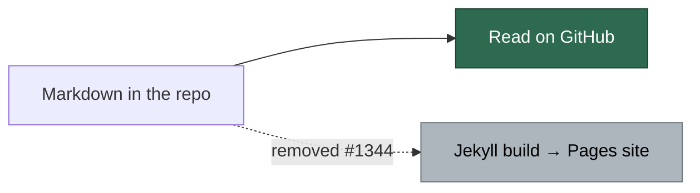
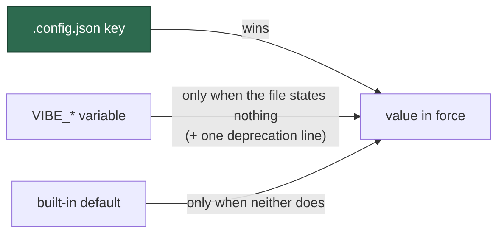
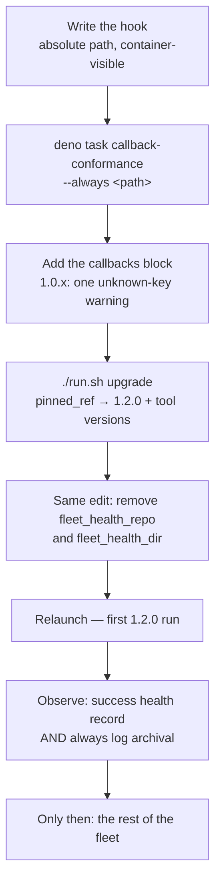

# 📣 Release notes

Every merge to `main` is tagged with the next patch semver automatically, and a
patch carries nothing an operator has to read: the code moved, the
[`tool-versions.json` manifest](RELEASE-TAGGING.md#the-tool-version-manifest)
says what it was cut against, and a frozen host upgrades onto it with
`./run.sh upgrade`.

This page is for the other kind of release — one that **changes a contract an
operator's configuration depends on**. Those releases are recorded here newest
first, with the exact migration and the exact rollback. Most move the minor or
the major and are minted from
[the release floor](RELEASE-TAGGING.md#the-release-floor) rather than from the
automatic increment; one landed on the automatic patch because the floor was
not moved ahead of it, and it is recorded under the version it actually took.

## Unreleased — derived trust skips unlistable repos and reuses its snapshot

**Behaviour change to the fail-closed trust rule. Nothing to migrate; read it
if your worker login is read-only on any monitored repository.**

> Not yet tagged. Recorded here so the version that carries it can be named
> when it is cut.

### What changed

| Change | Issue |
| ------ | ----- |
| Cross-repo dependency PRs are authorised for Rust consumers: the manifest check reads `Cargo.toml` (and each literal workspace member's) for `path` and `git` dependencies on a monitored repo, so a NEAT-AI-* fix that belongs in NEAT-AI-core is no longer refused as "no dependency manifest could be read" and discarded | #1864 |
| A scan cycle that ends in the primary-rate-limit pause now logs the same per-cycle `gh` telemetry (`gh-calls:`, timings, by-priority, GraphQL share, quota) a completed cycle does, before the pause line, so the cycle that exhausted the quota is never the one without a breakdown | #1843 |
| The issue scan no longer re-views every candidate on every idle re-scan: the scan-time content-integrity check reads title and body from the listing (the claimed issue is still verified live at pickup), and the dependency fetcher serves a referenced issue's state, body and sub-issues from the iteration cache — cutting ~700 `gh issue view` GraphQL calls a cycle that were exhausting the fleet's shared quota | #1818 |
| The run-ending path waits (bounded by the slot drain grace) for a terminated agent's slot to finish its claim release and callbacks before the exit cleanup's descendant sweep, and the pool drain settles every slot before surfacing a sibling's error, so a run cut short by the mid-cycle quota pause still lands its health record and archive | #1815 |
| The auto-merge sweep skips draft PRs (announced once per PR, not once per cycle) and a `gh pr merge --auto` refused with "still a draft" is a typed `draft` outcome logged at info, not a failure retried every cycle | #1800 |
| The post-creation reserved-label strip reads who applied each label and keeps one a login outside the fleet granted, so a maintainer labelling fresh planning sub-issues `work-on` while the run is still closing no longer has the grant removed; the summary records kept labels and the log names the adder | #1791 |
| The CI-nudge pass asks the gated-head guard before its empty-commit push, so a milestone summary PR whose head refuses direct pushes is recorded as a no-op nudge and left for the milestone completion path instead of a GH013 refusal every cycle | #1762 |
| An idle-task wrapper is not claimed when the cycle deadline would bound its scan below a ten-minute floor: the route declines before the claim with one log line, records the cycle as a skip rather than a failure, and leaves the wrapper for the next cycle — no more 60 s budgets for hour-long scans ending in a host health failure | #1757 |
| Completion no longer recovers an open PR on a different head as the run's own when the run's branch has commits ahead of base: the linked PR's head is read and compared with the branch, and the branch gets its own PR, so an agent's side PR (or a sibling's) cannot swallow the run's work | #1799 |
| A direct merge GitHub refuses as policy-prohibited (a rule the effective-rules endpoint does not show the fleet token, such as an organisation ruleset) marks the base protected for the cycle, is logged once naming the repo and branch, and arms GitHub auto-merge instead of being retried every cycle | #1763 |
| The idle-task wrapper finaliser closes a finished wrapper and posts its summary (or the failure comment) through the REST `issues` endpoints on the core quota, so the primary GraphQL quota latch no longer leaves a wrapper open for the next scan to re-run; the result reports whether each write landed instead of assuming the close happened | #1753 |
| A run whose HEAD diverged from its branch because the agent's work landed through its own PR and the issue closed takes the stale-claim exit instead of a completion failure, so no health failure is recorded for a run that succeeded; a diverged HEAD on an open issue is still refused | #1793 |
| A monitored repo the worker's login cannot list (404, or 403 "Must have push access") is skipped and named once instead of failing every cycle | #1453 |
| A successful trusted-author resolve is reused for `trusted_authors_cache_hours` (new key, default `1`; `0` restores the per-cycle refresh), and a transient failure serves the snapshot, with its age logged, for up to six hours | #1453 |
| The `graphql-calls:` line counts every GraphQL-backed `gh` call (`issue list`, `pr view`, `search`, … as well as `api graphql`), and both the counter and the primary-quota latch are enforced at the `gh` spawn chokepoint, so the thirty-odd modules that spawn `gh` directly are counted and short-circuited too | #1485 |
| The housekeeping merged-PR issue sweep pre-flights the quota once, stops at the first rate-limit refusal and reports one skipped sweep instead of one failure per repository; it reads through the shared scan and timeline caches and keeps its own watermark (`merged_issue_sweep_watermarks.json` in the work directory) | #1477 |
| A GitHub mutation that runs while the write-repo allowlist is inactive is still allowed, but the first of each kind per context now logs `[SECURITY] [WRITE_REPO_UNSEEDED]` and journals an `unseeded-<verb>` audit event, so an unseeded write path is visible instead of indistinguishable from a protected one | #1425 |
| The agent-side `gh`/`git` guard wrappers pin the guard child's `DENO_DIR` to the image's read-only Deno seed, so neither the agent's environment nor its uid can feed the guard the compiled modules it reads back on every call; a container without a read-only seed reports `[SECURITY] [GH_GUARD_CACHE_WRITABLE]` | #1448 |
| The merge-conflict stall watchdog, the Failure-Detection resume collector and the auto-merge sweep stop at the first GraphQL quota refusal and log one line naming how many repositories were left for the next cycle, instead of one warning per repository; the behaviour is one shared helper (`repo_loop_quota_stop.ts`) for every per-repository loop | #1515 |
| A merged PR closes the issues its **body** names with a closing keyword (`Fixes #N`, `Closes #N`, …), not only the one its title's trailing `(#N)` names, and a close after a merge into a milestone branch says so in its comment — so sub-issue PRs on a milestone branch no longer hold the rollup shut | #1528 |
| A resumed Claude Code phase is invoked as `--resume <uuid>` instead of `--session-id <uuid> --resume`, which Claude Code 2.1.261 refuses at start-up; the refusal itself is now recognised as a session-flag failure and retried without the flags, loudly | #1580 |
| The security-fix verification gate recognises a test name that `deno fmt` wrapped onto the line after `Deno.test(` (and the `it(` / `test(` and object-form `name:` equivalents), so a correctly cited regression test no longer blocks a security PR | #1581 |
| The primary-quota latch is now set at the `gh` spawn chokepoint, so a rate-limit refusal seen by any of the thirty-odd modules that spawn `gh` directly latches the process and writes the shared signal, instead of only a refusal seen through `runGhCommandRaw` | #1540 |
| The launcher writes a fresh host-disk reading to the worker log directory on every tick (`host-disk.json`), and the worker adopts it mid-run, so the host-disk estimate can rise when the host frees space and fall when another account consumes it, instead of standing on a launch-time baseline that could only fall | #1550 |
| The attached launcher refreshes `host-disk.json` itself every five minutes while its container runs (`VIBE_HOST_DISK_REFRESH_SECONDS`, tests only), so the #1550 refresh also reaches hosts whose scheduler never starts a second tick while the job is running (launchd's `StartInterval`), where the reading otherwise stood at its launch value for the whole run | #1691 |
| The worker's default-branch cache moves out of the repository working tree into the clone's git directory (`.git/vibe/default_branch`), so `.vibe_default_branch` is never written into a monitored repository again — it could be committed by the repository and was staged by the final-mile `git add -A`; repositories that already committed a copy get a follow-up issue each to remove it | #1652 |
| Workflow-hygiene findings (`set -euo pipefail` missing, version-comment drift) are diffable against the baseline like mermaid and markdownlint, so a repository whose workflows already carried them on its default branch passes the gate with the carry-over tracker filed instead of failing every run on residue the run did not create; the baseline cache version moves to 2 so earlier baselines are recaptured | #1641 |
| A repository's `skip_auto_merge` opt-out is honoured where PRs are armed at creation and on the execute phase's self-healing recovery of an agent-raised PR, not only by the maintenance sweep and `pr_manager`; the opt-out is logged when it withholds the arming | #1650 |
| The two `setup.ps1` test cases that inherited the runner's environment now spawn with an explicit one, so the suite is green inside the worker image where `CONFIG_PATH` is always set; the `setup.ps1` and host-config-path suites stay integration tests by recorded decision | #1656 |
| A `gh` call the agent-subprocess guard refuses is appended to the tamper-evident audit journal by the guard child itself (`gh-guard-refused`, with the control, the run id and the redacted argv), and a label the in-process guard refuses is journaled as `worker-label-refused` — the events control C16 promised were journaled but only ever reached stderr; the shim hands the child the journal location on argv and widens its write grant to exactly the journal's footprint, and a journal that cannot be written never changes the verdict | #1604 |
| The bare 32-hex credential rule (the ImgBB key shape) in the redaction chokepoint and the export scrub gate matches either case, so a key a client rendered in uppercase hex is masked like its lowercase twin; 40-hex SHAs, 64-hex digests and dashed UUIDs are still left alone | #1605 |
| The run-failure classifier no longer reads `enospc` inside a branch name, path or URL as disk exhaustion — `ENOSPC` must be the uppercase whole-word errno, the prose phrases stay whole phrases — and the completion phase's squash-lineage push refusal (Issue #534) is its own `stale-lineage` class, never auto-filed; the OOM evidence rule stops matching `out-of-memory` glued into a slug too | #1658 |
| The build-artefact prune and the work-volume usage line descend into every lane worktree under `worktrees/<lane>/<repo>`, and the disk-low reclaim drops every idle `target/` (a live heartbeat for the repository protects its clone and its worktrees) before it touches the disposable clones — 36 GB of Rust output in idle lane worktrees had sat invisible while the host fell to 6 GB free | #1725 |
| `container-build.yml` verifies library toolchains (the `modules` a manifest entry declares, imported through the image's own `python3`) as well as command toolchains, and each loop counts what it verified against `container/tools.json` so a `jq` that matched nothing can no longer leave the step green; the `pyyaml` entry no longer has to sit last | #1705 |
| An issue lane detaches its worktree from the feature branch when its run ends, and the PR passes release a branch held by one of this host's own lane worktrees before checking it out (any other holder is reported and left alone), so a finished lane no longer blocks the CI-fix pass for the PR it raised; a checkout refused for a held branch is skipped as `branch_held` and no longer spends a CI-fix retry — the retry is recorded only once the PR branch is checked out | #1677 |
| The dependency-bump audit undoes a rejected `bump-deps.sh` bump with a `git revert` of the bump commit instead of `git reset --hard` to the pre-bump SHA, so a remediation commit pushed after the bump (#1684) is no longer rewound off the branch and the PR is raised from a head without the bump; a revert that does not apply cleanly is aborted and the audit skipped, leaving the branch untouched | #1714 |

### In detail

Two behaviour changes to the per-cycle trusted-author refresh (Issue #1453):

- A monitored repo the worker's login **cannot list** (404, or 403 "Must have
  push access") no longer fails the whole resolve. It is skipped, named once
  in the log, and left out of the fold; the cycle proceeds on the repos that
  did resolve. A least-privilege service account with read-only access to
  data repositories keeps working — before this it stood the host down on
  every cycle. Only when every repo is unlistable does the resolve fail.
- A successful resolve is reused for `trusted_authors_cache_hours` (default
  `1`; `0` restores the per-cycle refresh) before the collaborator lists are
  fetched again, and on a *transient* failure the snapshot is served, with its
  age logged, for up to six hours. A collaborator added or revoked mid-window
  is seen at the next refresh.

Nothing to migrate. To keep the previous cadence, state
`"trusted_authors_cache_hours": 0`.

The `graphql-calls:` telemetry line (Issue #1485) now counts every
GraphQL-backed `gh` invocation — every `gh` sub-command plus `gh api
graphql`; only a plain REST `gh api <path>` is excluded — using the same
predicate as the primary-quota latch. Expect the number to rise sharply
against earlier logs: the old line counted only `gh api graphql`, and a
cycle's `issue list` / `pr list` traffic was invisible to it. The counter
and the latch both moved to the `gh` spawn chokepoint, so a module that
spawns `gh` directly is counted, and once the hourly quota is exhausted it
is skipped without a process, exactly like one that goes through
`runGhCommandRaw()`. Nothing to configure.

The housekeeping `merged-pr-issue-sweep` step (Issue #1477) no longer loops
every monitored repository against an exhausted GraphQL quota. It pre-flights
once per sweep, stops at the first primary-quota refusal, and logs one warning
naming the condition and how many repositories it left for the next cycle —
a quota stop is a skip, not a housekeeping failure. It now reads the open-issue
and closed-PR lists through the same `.gh-scan-cache` and `.gh-timeline-cache`
the discovery passes fill, and keeps a per-repository watermark in
`merged_issue_sweep_watermarks.json` under the work directory, advancing only
past merged PRs it closed or ruled out for good. Delete that file to make the
sweep re-examine everything once. Nothing to configure.

The write-repo allowlist stays fail-open until a run seeds it (Issue #1425),
but that state is no longer silent. The first GitHub mutation of each kind —
verb and target repository — that runs while the allowlist is inactive logs a
`[SECURITY] [WRITE_REPO_UNSEEDED]` line and records an `unseeded-<verb>`
event in the audit journal; later writes of the same kind are counted, not
logged. Expect a handful of these lines per worker process from the main
loop's ordinary cross-repo maintenance, which runs unseeded by design. A line
naming a verb you did not expect to see outside a claim is the signal the
issue asked for: a write path that never seeded the allowlist. Nothing to
configure.

The agent-side `gh` and `git` guard wrappers now pin the guard child's
`DENO_DIR` (Issue #1448). The guard entry points already ran from the
read-only checkout (#1444); the Deno child that executes them was still
reading its transpiled modules and V8 code cache back from the work volume's
`.deno-cache`, owned by the uid the coding agent runs as, and honoured
whatever `DENO_DIR` the caller set. Both wrappers now export `DENO_DIR`
themselves, to the image's root-owned seed (`VIBE_DENO_SEED_DIR`, default
`/opt/deno-seed`), which Deno treats as a read-only cache: it transpiles in
memory and persists nothing. Expect each agent `gh` call to spend about 0.2 s
more in the guard. A container without a read-only seed falls back to a
per-run directory and logs `[SECURITY] [GH_GUARD_CACHE_WRITABLE]` once per
agent spawn; a developer host falls back silently. Nothing to configure.

Three more per-repository scans — the merge-conflict stall watchdog, the
Failure-Detection resume collector and the auto-merge sweep — now stop at the
first primary-quota refusal (Issue #1515), as the merged-PR issue sweep has
since #1477. One exhaustion used to produce one WARNING per monitored
repository from each of them, thirty-odd lines a second that read as a
fleet-wide failure; it is now one line per scan: `<scan>: GraphQL quota
exhausted — skipped N of M repo(s) this cycle, resumes next cycle: <reason>`.
An ordinary per-repository failure is still reported per repository, and a
healthy quota still visits every repository. Nothing to configure.

Both merged-PR issue closers — the per-cycle reconciler over this host's own
merged PRs and the housekeeping sweep over the fleet's — now read the issues a
PR's body closes (`Fixes #N`, `Closes #N`, every conjugation GitHub accepts,
same repository only) as well as the one its title's trailing `(#N)` or
`(Issue #N)` names (Issue #1528). GitHub itself honours those keywords only on
a merge into the default branch, so a sub-issue PR merged into a milestone
branch left its issue open, and an open issue holds the milestone's rollup
shut. The closing comment now names the branch when it is not the default
one, so the issue says where its fix lives until the rollup lands. A PR closed
without merging still closes nothing, and an already-closed issue is left
alone, so nothing is closed or commented twice. Nothing to configure.

Claude Code 2.1.261 refuses `--session-id <uuid>` combined with `--resume`
unless `--fork-session` is also given, and that pairing was what the worker
sent for every phase after the first — so on that CLI every resumed phase
died 0.1 s after spawn with "--session-id can only be used with --continue or
--resume if --fork-session is also specified", was misread as an ordinary
empty-output failure, and the run carried on without session continuity
(Issue #1580). A resumed phase is now invoked as `--resume <uuid>`, which is
the continuation the worker wants on both the old and the new CLI, and the
start-up refusal is recognised as a session-flag failure so the Issue #204
remedy — drop the flags, retry once, say so — fires if it ever recurs.
Nothing to configure.

The security-fix verification gate's `test-identifier-in-diff` check
(Issue #1581) now treats a string literal on the line after a bare
`Deno.test(` — the shape `deno fmt` produces for a long test name — as part
of the declaration, as it already did for a Java `@Test` annotation; the
wrapped `it(` / `test(` forms and the object form's `name:` on its own line
are covered the same way. Before this a branch that added exactly the cited
regression test was refused with "Name the ACTUAL TEST IDENTIFIER you added"
whenever the formatter had wrapped the declaration. Fail-closed throughout:
a string literal counts only directly after such an opener.

The primary-quota latch (Issue #42) is now also **set** at the `gh` spawn
chokepoint (Issue #1540). #1485 moved its enforcement there, but the latch
was still set only from `runGhCommandRaw`'s catch, so a refusal seen by one
of the thirty-odd modules that spawn `gh` directly — the auto-merge enable
path retried one four times in a row today — latched nothing and wrote no
signal. `spawnGh` now recognises the first `API rate limit already exceeded`
refusal itself and hands it to the hook `github.ts` registers at load, which
probes the reset, latches, and writes the shared signal; the quota probe is
exempt, REST `gh api <path>` calls are unaffected, and a process that never
loads `github.ts` spawns exactly as before. Nothing to configure.

The host-disk estimate no longer stands on a figure taken once at launch
(Issue #1550). `run.sh` runs every few minutes whether or not a worker is
up; on the ticks where it does not launch it now writes the host's `df`
reading to `host-disk.json` in the worker log directory — the one host path
the container mounts read-write — and the worker adopts a reading that is
newer than the one it holds and less than fifteen minutes old, re-basing its
volume-growth term at that moment. Because the launcher stays attached to its
container for the whole run, a scheduler that never overlaps a running job
(launchd's `StartInterval`) delivers no such tick until the worker exits, so
the attached launcher also rewrites the file itself every five minutes while
the container runs (Issue #1691). A host that frees space mid-run resumes
claiming within one tick rather than at the next launch; a host where another
account consumes space stops claiming within one tick rather than claiming
into a shortage. With no file (an older launcher, native mode) the launch
baseline stands exactly as before. The log line says which it is using:
`estimated from launch baseline` or `estimated from the launcher's reading
N min ago`. Nothing to configure.

## 1.5.5 — the log directory comes from the file alone

**Behaviour change, not a fix. Read the migration before upgrading a host that
pins its log directory with `LOG_DIR` or `LAUNCH_LOG_DIR`.**

> The floor was not moved ahead of this one, so it took the automatic patch
> increment: `1.5.5` is the version a host pins to for it.

### What changed

| Change | Issue |
| ------ | ----- |
| `LAUNCH_LOG_DIR` and `LOG_DIR` no longer move the host log directory; `log_dir` in `.config.json` is the only way, and a host still exporting either is told so by name at every launch | #1388 |

### Migration

A host that pinned its log directory with `LOG_DIR` or `LAUNCH_LOG_DIR` — the
1.4.0 notes offered `LOG_DIR=$HOME/logs` as the way to keep the old location —
falls back to the **platform default** on its first launch after the upgrade,
and prints the variable, its value and the `log_dir` line to write instead.
Move the value into `.config.json` before upgrading:

```json
{ "log_dir": "/var/log/vibe-coder" }
```

Then unset the variable wherever it was exported (shell profile, crontab, unit
file, plist). Rollback is the reverse: restore the export and pin the previous
release. Nothing is moved or deleted either way.

## 1.5.0 — the GitHub Pages site is gone

**No migration. Nothing an operator configures changes; the bookmark does.**

### What changed

| Change | Issue |
| ------ | ----- |
| `.github/workflows/pages.yml`, the Jekyll site files and the Ruby build scripts are deleted | #1344 |
| The Pages-only quality-gate checks — `pages-liquid` and `mermaid built output` — and the `check-pages-liquid` / `check-mermaid-built-output` commands are gone | #1344 |

The site at `https://stsoftwareau.github.io/VibeCoder/` existed for one reason:
this repository was private, and publishing the READMEs was the only way to read
them. The repository is public, so GitHub renders every Markdown file — README,
`SECURITY.md`, `AGENTS.md` and everything under `docs/` — directly, including
the Mermaid diagrams the Jekyll layout used to load a CDN script for.

Nothing was written only for the site: the Markdown all stays in the repository
and is read at its ordinary GitHub URL.

`Gemfile`/`Gemfile.lock`, the `bundle-audit` job that scans them and the Ruby
container base are still here. Removing them means *modifying* a file under
`.github/workflows/`, which the worker token has no scope to push — deleting
one, as this release does to `pages.yml`, is allowed. Issue #1376 tracks the
rest.



### Migration

None. Replace any bookmark of `stsoftwareau.github.io/VibeCoder` with the
repository itself; there is nothing to install, move or delete on a host.

## 1.4.0 — the config file wins over the environment

**Behaviour change, not a fix. Read the migration before upgrading a host that
sets both a `.config.json` key and its `VIBE_*` variable.**

### What changed

| Change | Issue |
| ------ | ----- |
| `imgbb_api_key`, `agent_provider` and `agent_providers` now take the `.config.json` value when the matching `VIBE_*` variable is also set | #1032 |
| `update_gh_user_status` moves with them — the same module resolves it, and one module cannot hold two precedence orders | #1032 |
| A run that still takes any of them from the environment logs one line per setting, naming the config key that replaces the variable | #1032 |

Issue #289 settled the rule years ago — **the `.config.json` key wins over the
environment variable, and the default applies only when neither states a usable
value** — but each call site implemented it again, and three came to disagree.
`host_disk.ts` followed the rule; `optional_feature_env.ts` reproduced the
bash-era `${VAR:-config}` expansion, and `agent_provider.ts` documented
environment-then-config on itself. So an operator who stated `imgbb_api_key` in
the file *and* exported `VIBE_IMGBB_API_KEY` got the variable, while the same
operator's `host_disk_low_floor_gb` came from the file — and no document could
say which without listing the call sites, which is #874's complaint.

All three now resolve through `worker/deno/lib/config_precedence.ts`, which
states the order once. The conformance test in
`worker/deno/tests/config_precedence_test.ts` has no declared exceptions left,
so a fourth order cannot appear.



### Breaking: which value an operator who set both already gets

| Setting | Variable | Was | Now |
| ------- | -------- | --- | --- |
| `imgbb_api_key` | `VIBE_IMGBB_API_KEY` | the variable | **the file** |
| `agent_provider` | `VIBE_AGENT_PROVIDER` | the variable | **the file** |
| `agent_providers` | `VIBE_AGENT_PROVIDERS` | the variable | **the file** |
| `update_gh_user_status` | `UPDATE_GH_USER_STATUS` | the variable | **the file** |

A host that sets only one of the two sources is unchanged, which is most of
them. The one that changes is the deployment overriding a *stale* file value
from the environment: it silently switches to whatever the file says — a
different coding agent, in the `agent_provider` case — so check the file before
upgrading.

The warning naming the config key was introduced with the flip rather than in a
release ahead of it, so on a host that had set both, the first run after the
upgrade is where the line appears. Issue #874's own deprecation pass — the one
that stops these variables being read at all — is what carries the notice
forward from here.

### Migration

1. **Print what each host actually resolves.** If the file and the variable
   disagree, the file is the value you will get:

   ```bash
   grep -E '"(imgbb_api_key|agent_provider|agent_providers|update_gh_user_status)"' ~/.config.json
   env | grep -E '^(VIBE_IMGBB_API_KEY|VIBE_AGENT_PROVIDERS?|UPDATE_GH_USER_STATUS)='
   ```

2. **Move the value you want into `.config.json`** and drop the export. This is
   the end state for every one of them: the variables stop being read in a
   later major (Issue #874), and the file is where the rest of the
   configuration already lives.

3. **Or clear the stale key from the file** if the environment value was the
   one you meant. Deleting the key restores the variable's effect, because the
   variable applies whenever the file states nothing.

### Rollback

Pin the host back to `1.3.x` (`./run.sh upgrade` pins forward; a frozen host
edits `pinned_ref`). Nothing is rewritten on disk by this change — the
precedence is decided at load — so a host that rolls back resolves exactly as
it did before.

## 1.4.0 — the log directory follows the platform

**Path contract change. Read the migration before upgrading a host.**

### What changed

| Change | Issue |
| ------ | ----- |
| The default log directory moved off `$HOME/logs` onto the platform's own standard location | #873 |
| `run.sh`, `loop.sh`, `run.ps1` and the launcher ask the new `log-dir` command instead of each spelling the default | #873 |
| A host that still has `~/logs` is told once, at launch, with both paths — nothing is moved and nothing is deleted | #873 |

| Platform | New default                                                             |
| -------- | ----------------------------------------------------------------------- |
| Linux    | `$XDG_STATE_HOME/vibe-coder`, falling back to `~/.local/state/vibe-coder` |
| macOS    | `~/Library/Logs/vibe-coder` — the directory Console.app reads             |
| Windows  | `%LOCALAPPDATA%\vibe-coder\logs`                                         |

`~/logs` followed no convention: it is not a location any standard nominates,
and it put fleet state — rotated `worker-*.log(.gz)`, `launch-*.log`, PID and
failure-streak files — directly in the operator's home directory beside their
own files. Logs are **state**, which is why Linux uses the XDG state directory:
the specification names state as the home for "logs [and] history".

### Breaking: the host path the container mounts moved

The log directory is the fleet's **only writable host mount**, so the move is
incompatible by construction: existing rotated history stays at the old path,
and any external tail, ship or backup pointed at `~/logs` reads a directory
that is no longer written to. Nothing is migrated automatically — a host is
**told**, once, and its old directory is left exactly as it is.

### Migration

Pick one, per host, before or just after the upgrade:

1. **Move the history across** (Linux; use `~/Library/Logs/vibe-coder` on macOS):

   ```bash
   mkdir -p ~/.local/state/vibe-coder && mv ~/logs/* ~/.local/state/vibe-coder/
   ```

2. **Or keep the old location** — still perfectly valid — by setting `LOG_DIR`
   in the environment the launcher runs in:

   ```bash
   LOG_DIR=$HOME/logs
   ```

3. **Repoint anything external** — log shippers, backups, `tail` aliases,
   dashboards — at the new directory. Print it with:

   ```bash
   deno run --allow-env --allow-read worker/deno/mod.ts log-dir
   ```

A system service keeps naming its own directory the same way it always could:
`LOG_DIR=/var/log/vibe-coder`.

Full detail:
[Configuration — Where the logs go](CONFIGURATION.md#-where-the-logs-go).

### Rollback

Pin the host back to `1.3.x` (`./run.sh upgrade` pins forward; a frozen host
edits `pinned_ref`). The old release resolves `$HOME/logs` exactly as before,
and because nothing was deleted, a host that moved its history back — or never
moved it — is unaffected.

## 1.3.0 — one derived trust source

**Configuration contract change. Read the migration before upgrading a host.**

### What changed

| Change | Issue |
| ------ | ----- |
| The `author_source` key and the `"config"` trust mode removed — trust is always derived from repository collaborators | #1066 |
| `allowed_authors` no longer grants the right to raise, label or schedule work | #1066 |
| The Vibe Coder accounts are excluded from trust unconditionally, defaulting from `service_accounts` / `fleet_pr_authors`; `exclusion_team` becomes an optional extra | #1066 |
| `authorized_commenters` keeps its job and gains a default — it is the *known* list of bots whose input the worker acts on | #1066 |
| A `.config.json` that resolves an empty fleet login set fails loudly at load | #1066 |
| Setup no longer offers, writes or preserves `author_source` | #1068 |

The point of them together: **who may direct the worker is a repository
permission, not a file on a host**. On a public repository that is the
security boundary the operator is actually reasoning about — someone with no
write access cannot direct the worker, whatever they write in an issue.

### The design, in one table

| Actor | May **direct** work (raise / label / schedule) | May **supply input** (test results, code reviews, PR comments) |
| --- | --- | --- |
| Human with write access, not a Vibe Coder | **yes** | yes |
| Vibe Coder (`VibeCoderST`, `stservice`) | **no** | yes |
| Known bot (`github-copilot[bot]`, `github-actions[bot]`) | **no** | yes |
| Anyone else — the public, unknown bots | **no** | **no** |

Axis 1 is derived:
`hasWriteAccess(repo, login) && !isVibeCoder(login) && !isBot(login)`,
intersected across the monitored repos. Axis 2 is axis 1 plus a *known* list —
the Vibe Coder logins and `authorized_commenters` — because "known" is
precisely the property repository permissions cannot express: a GitHub App is
never a collaborator. The asymmetry is the point: a Vibe Coder's or a bot's
review is accepted as input, and neither may schedule or change work.

Full detail: [Configuration — Two axes of trust](CONFIGURATION.md#two-axes-of-trust)
and [Design Principles — Two axes of trust](../DESIGN-PRINCIPLES.md).

### Breaking: one configuration key was removed

| Removed key | What replaces it |
| ----------- | ---------------- |
| `author_source` | nothing — there is one derived source and no mode switch |

A `.config.json` still carrying `author_source` is **refused at load**, naming
the edit, following the convention Issue #805 set for a removed key: a setting
that reads as live and does nothing is the silent failure the config load
exists to prevent. `./setup.sh` strips the key for you.

### Migration

1. **Remove `author_source`** from `.config.json` if it is present (`./setup.sh`
   does this for you). Setup never offered the key, so most hosts do not have it.
2. **Confirm `service_accounts` (or `fleet_pr_authors`) names the fleet's own
   logins.** This is what is subtracted from the collaborator set; an empty
   result now fails the load. `./setup.sh` has defaulted `service_accounts` to
   the resolved worker login since Issue #4030.
3. **Confirm the token can read collaborators** on every monitored repo, and
   has `read:org` if `exclusion_team` is set. A 403 skips the cycle — it never
   widens trust. See
   [Setup — Token scopes for derived trust](SETUP.md#token-scopes-for-derived-trust).
4. **Grant write access to anyone who should be able to direct the worker.**
   Editing `allowed_authors` no longer does anything for trust.
5. **Run the worker as a service account.** The host's own login is excluded
   from the directing set, so a host authenticating as a person's personal
   account removes that person from the directing set on that host.
6. `allowed_authors` may stay: its first entry is still the default PR
   reviewer when `pr_reviewers` is unset. Set `pr_reviewers` and drop it.

### Rollback

Pin the host back to `1.2.x` (`./run.sh upgrade` pins forward; a frozen host
edits `pinned_ref`). The removed key is only refused by 1.3.0 and later, so a
`.config.json` that still carries `author_source` loads on the older release
exactly as before.

## 1.2.0 — the post-run callback extension point

**Configuration contract change. Read the migration before upgrading a host.**

### What changed

| Change                                                                                                                | Issue |
| --------------------------------------------------------------------------------------------------------------------- | ----- |
| A `callbacks` block runs `success` / `failure` / `always` executables after every terminal issue run                    | #806  |
| Built-in fleet health reporting removed, along with the `fleet_health_dir` and `fleet_health_repo` configuration keys   | #805  |
| The extension contract documented, with a conformance fixture an extension runs against its own hooks                   | #807  |

The point of the three together: **fleet-specific reporting policy leaves
VibeCoder**. A host that wants health records, session-log archival or spend
accounting writes a hook and names it in `callbacks`; the worker guarantees
when the hook runs, what it receives and that its failure never changes the
run's own result. The full contract is [Post-Run Callbacks](CALLBACKS.md); the
configuration surface is
[Configuration — Post-Run Callbacks](CONFIGURATION.md#-post-run-callbacks).

### Breaking: two configuration keys were removed

| Removed key          | What replaces it                                                     |
| -------------------- | -------------------------------------------------------------------- |
| `fleet_health_repo`  | a `callbacks.success` or `callbacks.always` hook that owns its own checkout, schedule and record format |
| `fleet_health_dir`   | nothing — the hook decides where it writes                            |

A configuration that still carries either key **fails the config load** naming
both keys and the replacement; the worker stops and claims no issue. This is
deliberate (Issue #805): a key that reads as live and quietly does nothing is
the silent failure the config load exists to prevent. It is also why the
release moves the minor rather than the patch — a 1.0.x configuration is not
loadable by 1.2.0 until it is migrated.

The asymmetry matters for the ordering below:

- **`callbacks` is safe to add early.** A 1.0.x worker does not recognise the
  key, so it logs one unknown-key warning at config load and ignores the block.
- **`fleet_health_*` is not safe to leave.** A 1.2.0 worker refuses the config
  outright.

So the block can be staged ahead of the upgrade, and the two removed keys have
to go in the same edit window as the pin move.

### Migrating a host



1. **Write the hook** your fleet's reporting actually needs, starting from the
   [portable examples](CALLBACKS.md#minimal-portable-hooks). Put it at an
   absolute path that is visible **inside the container** — committed to the
   worker checkout under `/workspace`, or provisioned into the work volume.
   The hook establishes its own credentials: it does not inherit the worker's
   the way the old report script did.
2. **Prove it**, inside the container, before anything depends on it:

   ```bash
   cd worker/deno
   deno task callback-conformance --always /opt/vibe-hooks/always.sh
   ```

   It exits non-zero on any failed property, so an extension can run it as a
   gate in its own CI.
3. **Add the `callbacks` block** to `.config.json`, naming the hook and the
   `timeout_seconds` the recording really needs. On a host still pinned to
   1.0.x this changes nothing but a warning line, so it can land first and be
   reviewed on its own.
4. **Move the pins.** On a frozen host, `./run.sh upgrade` rewrites
   `pinned_ref` and all three `pinned_tool_versions` to 1.2.0 and the versions
   its manifest records. It installs nothing and moves no checkout — see
   [The upgrade loop](CONFIGURATION.md#the-upgrade-loop).
5. **In the same edit, delete `fleet_health_repo` and `fleet_health_dir`.**
   Re-running `./setup.sh` also strips them, warning once per key. Both must be
   gone before the first 1.2.0 launch, or the config load fails and the host
   claims nothing.
6. **Relaunch and watch the first run.** A hook that could not be spawned, that
   exited non-zero or that timed out is reported loudly in `run_core.log` —
   the run's own outcome is unchanged either way, so a broken hook is visible
   rather than fatal.

### The canary comes first

Verify one canary host — the host carrying the private extension — through a
**complete** run before any other host is touched. The rollout gate is two
observed facts, not one:

- a **successful** run produced its health record through `callbacks.success`
  (or `callbacks.always`), and
- **`always` archived the session logs**, on a failing run as well as a
  successful one.

Until both are seen on the canary, the rest of the fleet stays on 1.0.x. A
fleet migrated on the strength of the success path alone would lose exactly the
records it needs on the day something fails.

### Pinning to 1.2.0

```json
{
  "update_mode": "frozen",
  "pinned_ref": "1.2.0",
  "pinned_tool_versions": { "claude": "…", "gh": "…", "deno": "…" }
}
```

`./run.sh upgrade` writes all four values from the release's manifest, which is
the supported way to do it. The pins are all-or-nothing: a release with no
manifest, an unreachable GitHub or a value the validator refuses leaves
`.config.json` exactly as it was.

### Rolling back to 1.0.x

`./run.sh upgrade` only ever moves forward, so a rollback is a **hand edit** —
[Moving a pin by hand](CONFIGURATION.md#moving-a-pin-by-hand) — and it is two
changes in one edit, because the configuration contract moves back with the
ref:

1. Read the tool versions the release you are returning to shipped with:

   ```bash
   gh release download 1.0.71 --repo stSoftwareAU/VibeCoder \
     --pattern tool-versions.json
   cat tool-versions.json
   ```

2. In one edit of `.config.json`:
   - set `pinned_ref` back to that tag and all three `pinned_tool_versions` to
     what the manifest names;
   - **re-add `fleet_health_repo`** (and `fleet_health_dir` if the host used
     one) — the 1.0.x worker needs them to report health at all;
   - leave the `callbacks` block in place. A 1.0.x worker ignores it with one
     unknown-key warning, so removing it only makes the next upgrade longer.
3. Relaunch. The checkout update puts the worker checkout back on the older
   ref and the launch installs exactly the pinned versions, one log line per
   tool.

The hook itself needs no rollback: nothing on 1.0.x executes it.

### Not covered by a callback

The built-in reporting ran on **every priority-loop iteration**; callbacks fire
only when an issue run terminates. A fleet that relies on a liveness signal
from an idle host still needs something else for it — a callback is not a
heartbeat. The full before/after table is
[Migrating from `fleet_health_dir` / `fleet_health_repo`](CALLBACKS.md#migrating-from-fleet_health_dir--fleet_health_repo).
