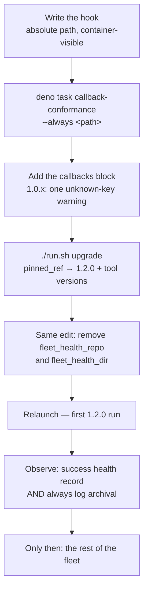

# 📣 Release notes

Every merge to `main` is tagged with the next patch semver automatically, and a
patch carries nothing an operator has to read: the code moved, the
[`tool-versions.json` manifest](RELEASE-TAGGING.md#the-tool-version-manifest)
says what it was cut against, and a frozen host upgrades onto it with
`./run.sh upgrade`.

This page is for the other kind of release — one that **changes a contract an
operator's configuration depends on**. Those releases move the minor or the
major, are minted from [the release floor](RELEASE-TAGGING.md#the-release-floor)
rather than from the automatic increment, and are recorded here newest first,
with the exact migration and the exact rollback.

## 1.3.0 — one derived trust source

**Configuration contract change. Read the migration before upgrading a host.**

### What changed

| Change | Issue |
| ------ | ----- |
| The `author_source` key and the `"config"` trust mode removed — trust is always derived from repository collaborators | #1066 |
| `allowed_authors` no longer grants the right to raise, label or schedule work | #1066 |
| The Vibe Coder accounts are excluded from trust unconditionally, defaulting from `service_accounts` / `fleet_pr_authors`; `exclusion_team` becomes an optional extra | #1066 |
| `authorized_commenters` keeps its job and gains a default — it is the *known* list of bots whose input the worker acts on | #1066 |
| A `.config.json` that resolves an empty fleet login set fails loudly at load | #1066 |
| Setup no longer offers, writes or preserves `author_source` | #1068 |

The point of them together: **who may direct the worker is a repository
permission, not a file on a host**. On a public repository that is the
security boundary the operator is actually reasoning about — someone with no
write access cannot direct the worker, whatever they write in an issue.

### The design, in one table

| Actor | May **direct** work (raise / label / schedule) | May **supply input** (test results, code reviews, PR comments) |
| --- | --- | --- |
| Human with write access, not a Vibe Coder | **yes** | yes |
| Vibe Coder (`VibeCoderST`, `stservice`) | **no** | yes |
| Known bot (`github-copilot[bot]`, `github-actions[bot]`) | **no** | yes |
| Anyone else — the public, unknown bots | **no** | **no** |

Axis 1 is derived:
`hasWriteAccess(repo, login) && !isVibeCoder(login) && !isBot(login)`,
intersected across the monitored repos. Axis 2 is axis 1 plus a *known* list —
the Vibe Coder logins and `authorized_commenters` — because "known" is
precisely the property repository permissions cannot express: a GitHub App is
never a collaborator. The asymmetry is the point: a Vibe Coder's or a bot's
review is accepted as input, and neither may schedule or change work.

Full detail: [Configuration — Two axes of trust](CONFIGURATION.md#two-axes-of-trust)
and [Design Principles — Two axes of trust](../DESIGN-PRINCIPLES.md).

### Breaking: one configuration key was removed

| Removed key | What replaces it |
| ----------- | ---------------- |
| `author_source` | nothing — there is one derived source and no mode switch |

A `.config.json` still carrying `author_source` is **refused at load**, naming
the edit, following the convention Issue #805 set for a removed key: a setting
that reads as live and does nothing is the silent failure the config load
exists to prevent. `./setup.sh` strips the key for you.

### Migration

1. **Remove `author_source`** from `.config.json` if it is present (`./setup.sh`
   does this for you). Setup never offered the key, so most hosts do not have it.
2. **Confirm `service_accounts` (or `fleet_pr_authors`) names the fleet's own
   logins.** This is what is subtracted from the collaborator set; an empty
   result now fails the load. `./setup.sh` has defaulted `service_accounts` to
   the resolved worker login since Issue #4030.
3. **Confirm the token can read collaborators** on every monitored repo, and
   has `read:org` if `exclusion_team` is set. A 403 skips the cycle — it never
   widens trust. See
   [Setup — Token scopes for derived trust](SETUP.md#token-scopes-for-derived-trust).
4. **Grant write access to anyone who should be able to direct the worker.**
   Editing `allowed_authors` no longer does anything for trust.
5. **Run the worker as a service account.** The host's own login is excluded
   from the directing set, so a host authenticating as a person's personal
   account removes that person from the directing set on that host.
6. `allowed_authors` may stay: its first entry is still the default PR
   reviewer when `pr_reviewers` is unset. Set `pr_reviewers` and drop it.

### Rollback

Pin the host back to `1.2.x` (`./run.sh upgrade` pins forward; a frozen host
edits `pinned_ref`). The removed key is only refused by 1.3.0 and later, so a
`.config.json` that still carries `author_source` loads on the older release
exactly as before.

## 1.2.0 — the post-run callback extension point

**Configuration contract change. Read the migration before upgrading a host.**

### What changed

| Change                                                                                                                | Issue |
| --------------------------------------------------------------------------------------------------------------------- | ----- |
| A `callbacks` block runs `success` / `failure` / `always` executables after every terminal issue run                    | #806  |
| Built-in fleet health reporting removed, along with the `fleet_health_dir` and `fleet_health_repo` configuration keys   | #805  |
| The extension contract documented, with a conformance fixture an extension runs against its own hooks                   | #807  |

The point of the three together: **fleet-specific reporting policy leaves
VibeCoder**. A host that wants health records, session-log archival or spend
accounting writes a hook and names it in `callbacks`; the worker guarantees
when the hook runs, what it receives and that its failure never changes the
run's own result. The full contract is [Post-Run Callbacks](CALLBACKS.md); the
configuration surface is
[Configuration — Post-Run Callbacks](CONFIGURATION.md#-post-run-callbacks).

### Breaking: two configuration keys were removed

| Removed key          | What replaces it                                                     |
| -------------------- | -------------------------------------------------------------------- |
| `fleet_health_repo`  | a `callbacks.success` or `callbacks.always` hook that owns its own checkout, schedule and record format |
| `fleet_health_dir`   | nothing — the hook decides where it writes                            |

A configuration that still carries either key **fails the config load** naming
both keys and the replacement; the worker stops and claims no issue. This is
deliberate (Issue #805): a key that reads as live and quietly does nothing is
the silent failure the config load exists to prevent. It is also why the
release moves the minor rather than the patch — a 1.0.x configuration is not
loadable by 1.2.0 until it is migrated.

The asymmetry matters for the ordering below:

- **`callbacks` is safe to add early.** A 1.0.x worker does not recognise the
  key, so it logs one unknown-key warning at config load and ignores the block.
- **`fleet_health_*` is not safe to leave.** A 1.2.0 worker refuses the config
  outright.

So the block can be staged ahead of the upgrade, and the two removed keys have
to go in the same edit window as the pin move.

### Migrating a host



1. **Write the hook** your fleet's reporting actually needs, starting from the
   [portable examples](CALLBACKS.md#minimal-portable-hooks). Put it at an
   absolute path that is visible **inside the container** — committed to the
   worker checkout under `/workspace`, or provisioned into the work volume.
   The hook establishes its own credentials: it does not inherit the worker's
   the way the old report script did.
2. **Prove it**, inside the container, before anything depends on it:

   ```bash
   cd worker/deno
   deno task callback-conformance --always /opt/vibe-hooks/always.sh
   ```

   It exits non-zero on any failed property, so an extension can run it as a
   gate in its own CI.
3. **Add the `callbacks` block** to `.config.json`, naming the hook and the
   `timeout_seconds` the recording really needs. On a host still pinned to
   1.0.x this changes nothing but a warning line, so it can land first and be
   reviewed on its own.
4. **Move the pins.** On a frozen host, `./run.sh upgrade` rewrites
   `pinned_ref` and all three `pinned_tool_versions` to 1.2.0 and the versions
   its manifest records. It installs nothing and moves no checkout — see
   [The upgrade loop](CONFIGURATION.md#the-upgrade-loop).
5. **In the same edit, delete `fleet_health_repo` and `fleet_health_dir`.**
   Re-running `./setup.sh` also strips them, warning once per key. Both must be
   gone before the first 1.2.0 launch, or the config load fails and the host
   claims nothing.
6. **Relaunch and watch the first run.** A hook that could not be spawned, that
   exited non-zero or that timed out is reported loudly in `run_core.log` —
   the run's own outcome is unchanged either way, so a broken hook is visible
   rather than fatal.

### The canary comes first

Verify one canary host — the host carrying the private extension — through a
**complete** run before any other host is touched. The rollout gate is two
observed facts, not one:

- a **successful** run produced its health record through `callbacks.success`
  (or `callbacks.always`), and
- **`always` archived the session logs**, on a failing run as well as a
  successful one.

Until both are seen on the canary, the rest of the fleet stays on 1.0.x. A
fleet migrated on the strength of the success path alone would lose exactly the
records it needs on the day something fails.

### Pinning to 1.2.0

```json
{
  "update_mode": "frozen",
  "pinned_ref": "1.2.0",
  "pinned_tool_versions": { "claude": "…", "gh": "…", "deno": "…" }
}
```

`./run.sh upgrade` writes all four values from the release's manifest, which is
the supported way to do it. The pins are all-or-nothing: a release with no
manifest, an unreachable GitHub or a value the validator refuses leaves
`.config.json` exactly as it was.

### Rolling back to 1.0.x

`./run.sh upgrade` only ever moves forward, so a rollback is a **hand edit** —
[Moving a pin by hand](CONFIGURATION.md#moving-a-pin-by-hand) — and it is two
changes in one edit, because the configuration contract moves back with the
ref:

1. Read the tool versions the release you are returning to shipped with:

   ```bash
   gh release download 1.0.71 --repo stSoftwareAU/VibeCoder \
     --pattern tool-versions.json
   cat tool-versions.json
   ```

2. In one edit of `.config.json`:
   - set `pinned_ref` back to that tag and all three `pinned_tool_versions` to
     what the manifest names;
   - **re-add `fleet_health_repo`** (and `fleet_health_dir` if the host used
     one) — the 1.0.x worker needs them to report health at all;
   - leave the `callbacks` block in place. A 1.0.x worker ignores it with one
     unknown-key warning, so removing it only makes the next upgrade longer.
3. Relaunch. The checkout update puts the worker checkout back on the older
   ref and the launch installs exactly the pinned versions, one log line per
   tool.

The hook itself needs no rollback: nothing on 1.0.x executes it.

### Not covered by a callback

The built-in reporting ran on **every priority-loop iteration**; callbacks fire
only when an issue run terminates. A fleet that relies on a liveness signal
from an idle host still needs something else for it — a callback is not a
heartbeat. The full before/after table is
[Migrating from `fleet_health_dir` / `fleet_health_repo`](CALLBACKS.md#migrating-from-fleet_health_dir--fleet_health_repo).
