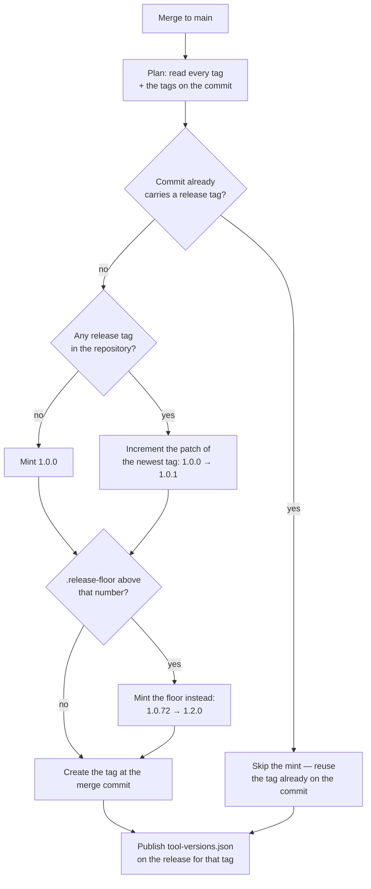
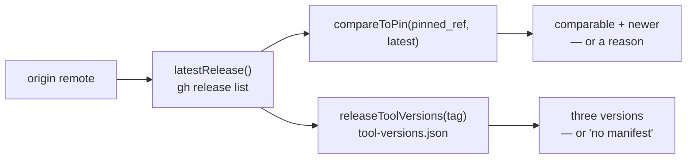
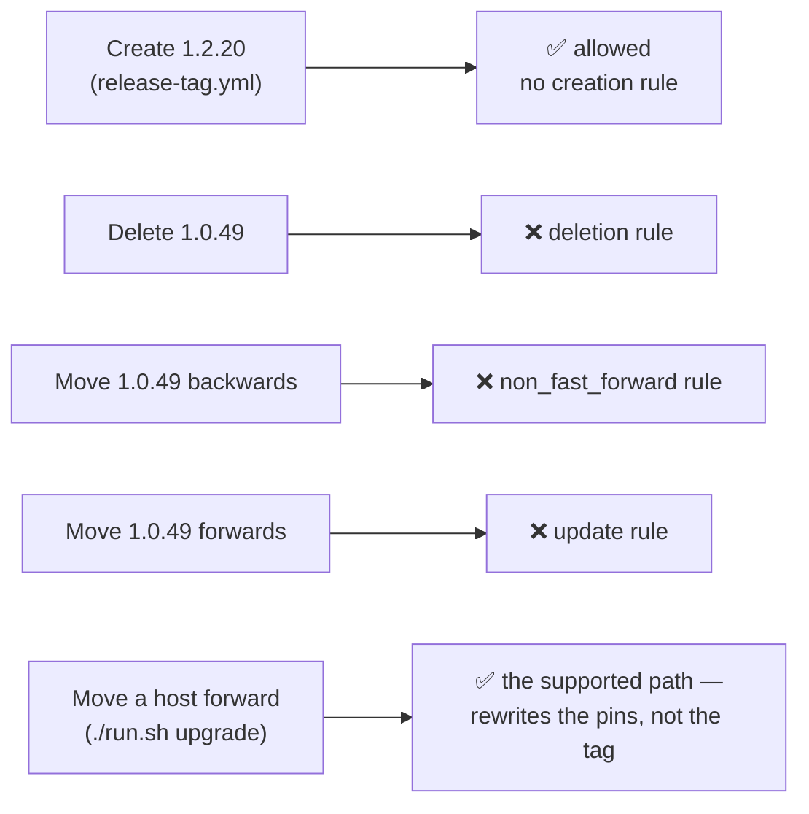

# 🏷️ Release tagging

Every merge to `main` is tagged with the next patch semver, automatically
(Issue #627). A host running in frozen mode pins to a released version, so
without tags the only thing it could pin to is a raw commit SHA. A release that
moves the series — a minor or a major — is minted from
[the release floor](#the-release-floor) instead, and is written up in
[Release notes](RELEASE-NOTES.md). What a released tag guarantees once it
exists — an immutable release record, and a tag that cannot be deleted or moved
— is [Release integrity](#release-integrity).

## What runs

`.github/workflows/release-tag.yml` fires on `push` to `main` — the merge
commit only exists after the merge, so `push` is the one trigger that can see
it. The workflow-level token is read-only; the single `contents: write` grant
the tag needs is scoped to the one job that creates it, and the tag is created
through the API so the checkout persists no git credentials.

The version decision itself lives in `.github/scripts/next-release-tag.sh`, so
it is exercised by unit tests rather than only by a real merge:

```bash
git tag --list > all-tags.txt
git tag --points-at "$GITHUB_SHA" > head-tags.txt
.github/scripts/next-release-tag.sh all-tags.txt head-tags.txt .release-floor
# should_tag=true
# tag=1.0.1
```



## The rules

- **Patch only, unless the floor says otherwise.** The newest release tag
  decides the major and minor; a human moves the series by editing
  [`.release-floor`](#the-release-floor), and the next merge continues from
  there (`1.2.0` → `1.2.1`).
- **First tag is `1.0.0`.** A repository with no release tag yet starts there.
- **Numeric, not lexical.** `1.0.10` is newer than `1.0.9`.
- **A release tag is a bare `MAJOR.MINOR.PATCH` triple**, optionally
  `v`-prefixed. Pre-releases (`1.0.0-rc1`), build metadata and moving names
  (`latest`) are ignored, and minted tags are always bare.
- **Idempotent.** A commit that already carries a release tag is never tagged
  again, so a re-run is a no-op.
- **Serialised.** The `concurrency` group never cancels: two merges landing
  together are tagged one after the other, so the second run sees the first
  run's tag instead of racing for the same number.
- **Never blocks a merge.** The merge has already landed by the time this runs.
  A failed tag shows as a red run on the workflow and a missing tag on the
  commit — nothing downstream waits on it.

## The release floor

Only the patch number is automated, so a release that changes a contract —
where semver asks for a minor or a major — needs a way to say so that the
automation will honour. That is `.release-floor` at the repository root: **one
line, one version**, `#` comments and blank lines ignored.

```text
# 1.2.0 releases the callback extension point and the removal of the
# fleet_health_dir / fleet_health_repo configuration keys.
1.2.0
```

The workflow passes the file to the same script that does the increment, and
the minted tag is the **higher** of the floor and the automatic patch number:

| Newest release | Floor   | Minted  | Why                                     |
| -------------- | ------- | ------- | --------------------------------------- |
| `1.0.71`       | `1.2.0` | `1.2.0` | the floor is above the patch (`1.0.72`) |
| `1.2.0`        | `1.2.0` | `1.2.1` | the patch is already above the floor    |
| `1.2.4`        | `1.2.0` | `1.2.5` | a floor below the series does nothing   |
| _(none)_       | `1.2.0` | `1.2.0` | the floor decides the first tag too     |

- **It raises, it never holds.** The floor cannot lower a version or re-mint
  one, so it is inert the moment the release it names exists and the file can
  be left in place until the next series move.
- **It never re-tags.** A commit that already carries a release tag is still
  left alone — idempotency comes first, floor or no floor.
- **A malformed or ambiguous floor fails the step.** A version that is not a
  bare triple, or two versions in the file, exits non-zero and mints nothing:
  silently ignoring a typo would ship the release under the automatic patch
  number, which is the exact mistake the floor exists to prevent. A file with
  no version line at all is simply no floor.
- **Editing it is the release decision.** The version, and the reason for it,
  belong in the same commit as the entry in [Release notes](RELEASE-NOTES.md).

## The tool-version manifest

Every release also records the exact tools it was cut against (Issue #688), so
a host pinning to a release can pin to the same tools instead of drifting onto
whatever is newest. The manifest is published as an asset named
**`tool-versions.json`** on the GitHub Release for the tag, addressable from
any host:

```bash
gh release view 1.0.8 --repo stSoftwareAU/VibeCoder \
  --json assets --jq '.assets[].name'
gh release download 1.0.8 --pattern tool-versions.json
```

The schema is one object, every field required:

```json
{
  "release": "1.0.8",
  "tools": { "claude": "2.0.76", "gh": "2.62.0", "deno": "2.5.4" }
}
```

- `release` — the release tag the manifest describes, a bare
  `MAJOR.MINOR.PATCH` triple (optionally `v`-prefixed), matching the tag it is
  attached to.
- `tools.claude`, `tools.gh`, `tools.deno` — the exact version of each tool,
  in the shape a frozen host's `pinned_tool_versions` takes (see
  [Configuration](CONFIGURATION.md)).

**Where the versions come from.** `worker/deno/mod.ts release-manifest
--release <tag>` prints the manifest on stdout, resolving each version through
`resolveQuarantineClearedVersions()` — the same release-age gate an unpinned
update goes through, asked for the **newest release that has already cleared
the 24h quarantine window** (Issue #726). What a release records is therefore a
version a host may install today, not merely upstream's newest.

Reading the newest release alone made the step fail on nearly every merge: the
Claude CLI publishes several times a day, so its newest release is almost
always inside the window, and an all-or-nothing manifest published nothing at
all. The window is untouched — a release inside it is still never recorded; the
manifest now names the newest release outside it.

The shape, the generator and the parser share one definition in
`worker/deno/lib/release_manifest.ts`, so every reader validates the asset the
same way rather than re-parsing it by hand.

**Who consumes it.** The manifest exists for the hosts that pin themselves to a
release, and two paths read it:

- `./setup.sh` defaults each tool-version prompt on a new frozen host to what
  the latest release records, so accepting the defaults reproduces a released,
  tested combination —
  [Setup — update mode](SETUP.md#update-mode-dynamic-or-frozen).
- `./run.sh upgrade` rewrites a frozen host's `pinned_ref` and all three
  `pinned_tool_versions` to the newest release and the versions its manifest
  records —
  [Configuration — The upgrade loop](CONFIGURATION.md#the-upgrade-loop).

Both are all-or-nothing against this asset: a release carrying no manifest
leaves the pins alone rather than moving the ref without the versions it ships
with.

### The rules

- **All-or-nothing.** A tool whose version cannot be resolved — or that has no
  release at all past the quarantine window — fails the step naming that tool,
  and nothing is published. A manifest naming two tools out of three would let
  a host silently drift on the third, the failure mode `pinned_tool_versions`
  being all-or-nothing already guards against (Issue #622).
- **Quarantine-cleared, not merely newest.** A release still inside the 24h
  window is never recorded; the newest release *outside* it is (Issue #726).
  Only stable `MAJOR.MINOR.PATCH` releases are candidates — pre-releases,
  drafts and unpublished npm versions are not part of the series a host
  installs from.
- **Strict on the way back in.** The parser rejects malformed JSON, a missing
  or non-semver version, an unknown tool key and a partial manifest. A reader
  never acts on half a manifest.
- **Idempotent.** A tag whose release already carries the asset is left alone,
  so a re-run publishes nothing twice.
- **Recoverable.** The publish is keyed to the release tag on the commit, not
  to the tag this run minted, so re-running the workflow after a failed publish
  attaches the manifest to the tag that already exists.
- **Never blocks the tag.** The tag stays the workflow's first side effect. A
  failed manifest is a red run and a release without an asset — never a
  rolled-back or delayed tag.

## Reading the series back — the release check library

`worker/deno/lib/release_check.ts` is the reader side of everything above
(Issue #689): the one place a caller asks what the newest release is, whether
this host's `pinned_ref` is behind it, and what tool versions that release
recorded.



- **Same definition of a release** as the tagging script: a bare
  `MAJOR.MINOR.PATCH` triple, optionally `v`-prefixed, ordered by numeric
  segment so `1.0.10` beats `1.0.9`. Pre-releases, build metadata, moving
  names such as `latest`, and draft releases are not part of the series. A
  repository with no releases yet is an empty outcome, not a failure.
- **A commit SHA is not orderable against a tag.** `compareToPin` reports
  `comparable: false` with a reason and no `newer` at all for the other
  `pinned_ref` shape [Configuration](CONFIGURATION.md) accepts. Callers decide
  what to do with that; guessing is not on offer.
- **"No manifest" is not a failure.** A release minted before the asset existed
  returns a distinguishable `no-manifest` outcome naming the tag, so a caller
  can tell it apart from an unreachable GitHub. A manifest that is present but
  partial or malformed is an error naming the offending field.
- **Nothing throws, nothing hangs.** Every function returns the repo's `Result`
  type and every subprocess call is bounded by the shared timeout helper — this
  runs on the launch path, where a failed check degrades to a warning. All side
  effects arrive through an injected deps interface, so the tests need no `gh`
  and no network. There is no caching: one check per call, callers choose the
  cadence.

## Release integrity

Frozen hosts fetch code **by release tag**, so a tag that could be moved would
let a compromise replace an already-released version in place — every host
pinned to it would pull the new content under the old name at its next launch.
Two guarantees stop that, and both are verifiable from any checkout:

- **Immutable releases** freeze the release record GitHub publishes for a tag.
- A repository **tag ruleset** refuses to delete or re-point the tag underneath
  it (Issue #869), checked in at
  [`infra/rulesets/release-tags.json`](../infra/rulesets/release-tags.json) so
  the live configuration has a reviewable source of truth.

Neither of them is how a host moves forward: the supported way to take a newer
release is [`./run.sh upgrade`](CONFIGURATION.md#the-upgrade-loop), which
rewrites the pins in `.config.json`. Editing a released tag is never the answer,
and is refused.



### Immutable releases

The repository has GitHub's **immutable releases** setting enabled, so a
published release's tag and assets are frozen at publication: the release
record for `1.0.50` names the same commit and ships the same
`tool-versions.json` a year from now as it did on the day it was cut.

- **From `1.0.50` onward, a release reports `immutable: true`.** That is every
  release cut after the setting was turned on.
- **The 31 releases published before it report `immutable: false`, and stay
  that way.** The setting applies at publication and is **not retroactive** —
  no re-publish makes an old release immutable. What protects those releases
  now is the tag ruleset below, which covers the whole series regardless of
  when a tag was minted.

```bash
# Which side of the boundary a release sits on.
gh api repos/stSoftwareAU/VibeCoder/releases --paginate \
  --jq '.[] | {tag_name, immutable}'
```

### The release-tag ruleset

The payload targets **tags**, is enforced actively, and carries no bypass
actors — the release workflow's own scoped `contents: write` grant cannot
delete or move a tag either, which is the point. It describes what the ruleset
**specifies**; what the repository is enforcing right now is whatever
[the verification commands](#verifying-it) print, so check before relying on
it.

**What it blocks:**

- **Deleting a release tag** — the `deletion` rule.
- **Moving one, in either direction** — the `update` rule ("Restrict updates")
  refuses *any* re-point of an existing tag, and `non_fast_forward` refuses a
  rewind. Both are needed: `non_fast_forward` blocks only *non*-fast-forward
  updates, so re-pointing a tag **forwards** onto a newer commit
  (`git push --force origin <newer-sha>:refs/tags/1.0.49`) is a fast-forward
  and sails through a ruleset that carries only `deletion` and
  `non_fast_forward`. That was observed, not theorised.

**What it deliberately does not block:**

- **Creating a new tag.** There is **no `creation` rule**, so
  `release-tag.yml` keeps minting the next patch on every merge to `main`, and
  a series-moving release — the `1.2.0` a raised
  [release floor](#the-release-floor) mints, or a tag pushed by hand — is
  still accepted (Issue #808). Only *existing* tags are frozen.

**What it covers.** The ref condition includes bare and `v`-prefixed
`MAJOR.MINOR.PATCH` tags and excludes pre-releases (`*-*`) and build metadata
(`*+*`) — the same definition of a release tag the rest of this document uses.
Branches are untouched.

### Verifying it

Run these as part of the release checklist; they are also how drift is caught
when someone edits the ruleset in the GitHub UI. **The checked-in payload is
the source of truth** — a live ruleset that disagrees with it is drift, and the
repair is the `PUT` in [Applying it](#applying-it), never an edit in the UI.

```bash
# 1. A tag ruleset exists and is enforced. (Note the id for the next command.)
gh api repos/stSoftwareAU/VibeCoder/rulesets \
  --jq '.[] | select(.target == "tag") | {id, name, enforcement, source}'

# 2. Its rules match the checked-in payload: deletion, update and
#    non_fast_forward, no creation rule, and no bypass actors (the API prints
#    `null` for an empty bypass list).
gh api repos/stSoftwareAU/VibeCoder/rulesets/RULESET_ID \
  --jq '{enforcement, bypass: .bypass_actors, rules: [.rules[].type],
         refs: .conditions.ref_name}'
```

**A rule the payload carries and command 2 does not print is not enforced.**
The `update` rule was added to the payload after the ruleset was first created
and needs an admin to apply it (Issue #869); until that `PUT` runs, a release
tag is still forward-movable however this section reads. Read the rule list,
do not assume it.

The behavioural proof is the refused delete — with the `deletion` rule live,
GitHub rejects the push and the tag is left exactly where it was:

```bash
git push origin :refs/tags/1.0.49
# remote: error: GH013: Repository rule violations found for refs/tags/1.0.49.
# remote: - Cannot delete this tag
#  ! [remote rejected] 1.0.49 (push declined due to repository rule violations)
```

⚠️ **Both destructive proofs are real pushes — run command 2 first.** Against a
ruleset that has drifted or been deleted, the delete above really deletes the
tag. And against one that lacks the `update` rule, the move really moves it,
with the rewind then refused by `non_fast_forward` — restoring it takes an
admin disabling the ruleset first.

### Applying it

Creating the ruleset for the first time, and updating an existing one, both
need an account with **admin** rights on the repository:

```bash
# First time — create it.
gh api --method POST repos/stSoftwareAU/VibeCoder/rulesets \
  --input infra/rulesets/release-tags.json

# Already exists — update it in place (RULESET_ID from the list command above).
gh api --method PUT repos/stSoftwareAU/VibeCoder/rulesets/RULESET_ID \
  --input infra/rulesets/release-tags.json
```

## When a run goes red

The step output names the newest tag it found and the tag it tried to mint. The
usual causes are a tag that appeared between the plan and the create (re-run the
workflow — the second attempt sees it and either skips or mints the next
number), and a token without `contents: write` (check the job-level
`permissions:` block).

A red **manifest** step names the tool it could not record — an upstream lookup
that failed, or a tool with no release at all past the 24-hour quarantine
window. The tag is already minted by then, so re-running the workflow on the
same commit publishes the manifest against that tag once the tool resolves.

## Tests

- `worker/deno/tests/next_release_tag_test.ts` — the version selection and
  increment logic, over tag lists, including the release floor: the merge that
  mints it, the merges after it, and the malformed and ambiguous floors that
  fail the step.
- `worker/deno/tests/release_tag_ruleset_test.ts` — the checked-in tag-ruleset
  payload: deletion, update and non-fast-forward blocked, no creation rule,
  active enforcement, no bypass actors, and the ref condition evaluated against
  real release tags, branches and pre-releases.
- `worker/deno/tests/release_integrity_docs_test.ts` — the
  [Release integrity](#release-integrity) section against that same payload:
  every rule it carries is named, the allowances it does not carry are stated,
  the worked tags are ones the ruleset really matches, and the upgrade
  cross-link resolves.
- `worker/deno/tests/release_tag_workflow_test.ts` — the workflow structure
  (trigger, permissions, concurrency, SHA-pinned credential-free checkout, the
  floor passed to the plan, the release-notes link, the tag-before-publish
  order and the idempotent manifest publish) and the plumbing between real
  `git tag` output and the script.
- `worker/deno/tests/release_manifest_test.ts` — the manifest shape: the
  all-or-nothing build and the parser, over malformed and partial manifests.
- `worker/deno/tests/release_check_test.ts` — the release check library: the
  newest-release selection, the pin comparison (including the incomparable
  commit-SHA pin) and the manifest lookup, over injected `gh` responses.
- `worker/deno/tests/release_manifest_command_test.ts` — the
  `release-manifest` command, over a stubbed release-age gate, including the
  quarantined-latest release the manifest now falls back from (Issue #726).
- `worker/deno/tests/tool_release_age_test.ts` — the quarantine window itself,
  including the release-history parsing and the newest-aged selection the
  fallback rests on.
